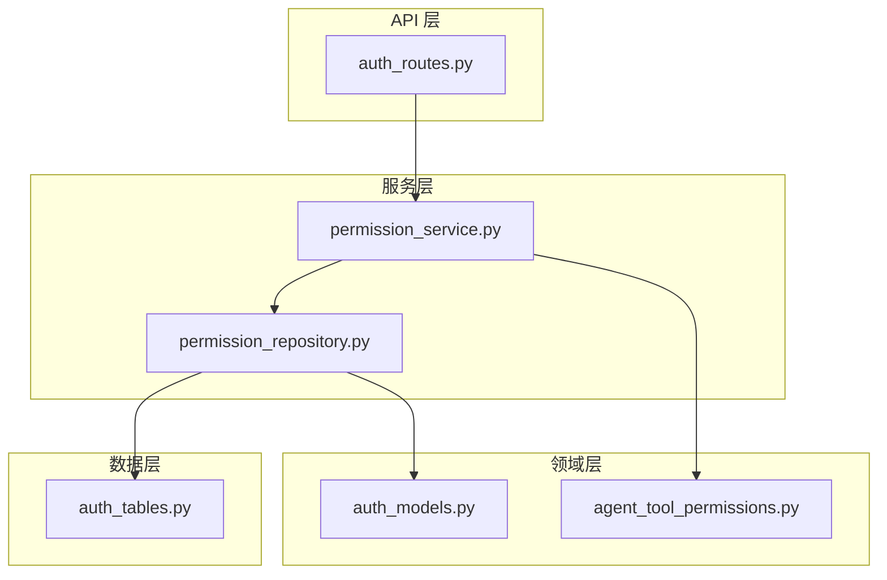
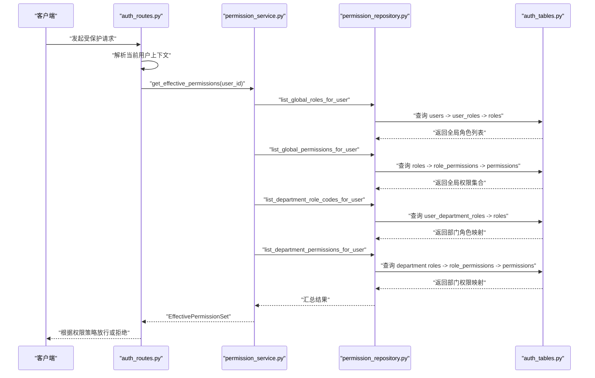
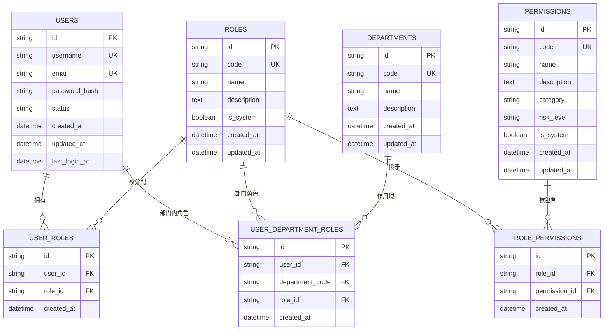
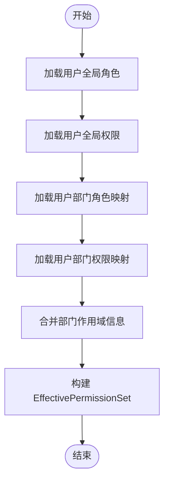
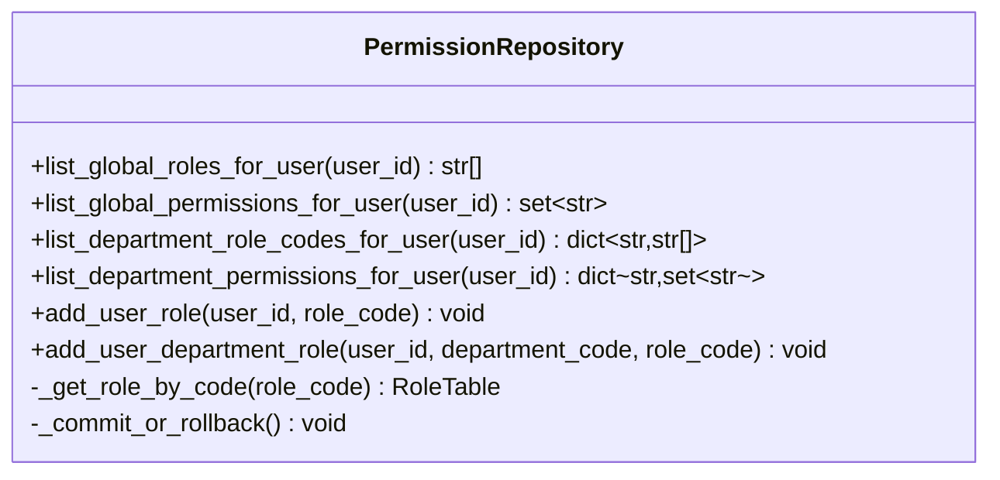
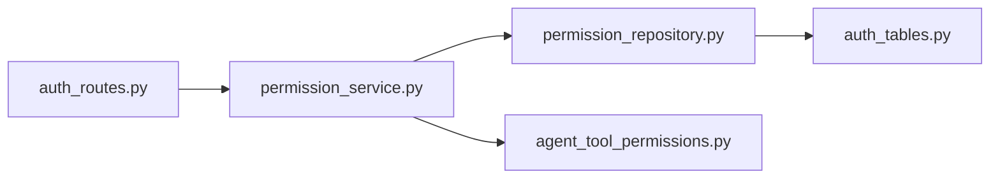

# RBAC 权限控制系统

<cite>
**本文引用的文件**
- [permission_service.py](file://src/fast_app/services/auth/permission_service.py)
- [permission_repository.py](file://src/fast_app/services/auth/permission_repository.py)
- [auth_tables.py](file://src/fast_app/db/auth_tables.py)
- [auth_models.py](file://src/fast_app/domain/auth_models.py)
- [agent_tool_permissions.py](file://src/fast_app/domain/agent_tool_permissions.py)
- [auth_routes.py](file://src/fast_app/api/auth_routes.py)
- [20260729_0010_remove_legacy_user_permissions.py](file://alembic/versions/20260729_0010_remove_legacy_user_permissions.py)
- [20260729_0011_add_nl2sql_rbac_and_audit.py](file://alembic/versions/20260729_0011_add_nl2sql_rbac_and_audit.py)
</cite>

## 目录
1. [简介](#简介)
2. [项目结构](#项目结构)
3. [核心组件](#核心组件)
4. [架构总览](#架构总览)
5. [详细组件分析](#详细组件分析)
6. [依赖关系分析](#依赖关系分析)
7. [性能考虑](#性能考虑)
8. [故障排查指南](#故障排查指南)
9. [结论](#结论)
10. [附录](#附录)

## 简介
本文件系统性地梳理并文档化当前代码库中的 RBAC（基于角色的访问控制）能力，重点围绕以下目标：
- 解释角色定义、权限分配与用户角色管理的数据模型与流程。
- 深入说明 PermissionService 与 PermissionRepository 的实现原理，包括权限检查算法、部门作用域权限、以及动态权限评估思路。
- 明确用户-角色-权限的关系映射，以及全局权限与部门作用域权限的组合方式。
- 提供具体使用示例路径，展示如何定义角色、分配权限、检查用户权限。
- 结合迁移脚本与领域模型，说明审计与权限变更的可追踪性设计方向。

## 项目结构
RBAC 相关代码主要分布在以下层次：
- 数据层：SQLAlchemy 表模型集中在 auth_tables.py，定义了用户、部门、角色、权限及关联表。
- 仓储层：PermissionRepository 封装对权限事实表的查询与写入，屏蔽 SQL 细节。
- 服务层：PermissionService 聚合仓储结果，计算用户的“有效权限集”，供上层业务调用。
- 领域层：auth_models.py 与 agent_tool_permissions.py 提供枚举、领域模型与权限范围抽象。
- API 层：auth_routes.py 暴露认证与鉴权相关接口，可作为权限上下文注入的入口。
- 数据库演进：Alembic 迁移脚本体现从旧版用户级权限到完整 RBAC 与审计能力的演进。

图表来源
- [auth_routes.py:1-112](file://src/fast_app/api/auth_routes.py#L1-L112)
- [permission_service.py:1-64](file://src/fast_app/services/auth/permission_service.py#L1-L64)
- [permission_repository.py:1-126](file://src/fast_app/services/auth/permission_repository.py#L1-L126)
- [auth_tables.py:1-431](file://src/fast_app/db/auth_tables.py#L1-L431)
- [auth_models.py:1-158](file://src/fast_app/domain/auth_models.py#L1-L158)
- [agent_tool_permissions.py](file://src/fast_app/domain/agent_tool_permissions.py)

章节来源
- [auth_routes.py:1-112](file://src/fast_app/api/auth_routes.py#L1-L112)
- [permission_service.py:1-64](file://src/fast_app/services/auth/permission_service.py#L1-L64)
- [permission_repository.py:1-126](file://src/fast_app/services/auth/permission_repository.py#L1-L126)
- [auth_tables.py:1-431](file://src/fast_app/db/auth_tables.py#L1-L431)
- [auth_models.py:1-158](file://src/fast_app/domain/auth_models.py#L1-L158)

## 核心组件
- PermissionService：负责根据用户 ID 加载全局角色、全局权限和部门作用域下的角色与权限，组装为 EffectivePermissionSet，供上层进行资源级或工具级授权判断。
- PermissionRepository：面向 PostgreSQL 的权限事实表查询与写入，包含用户全局角色、全局权限、部门角色、部门权限的读取，以及为用户分配全局/部门角色的写入。
- 数据模型：
  - 用户、部门、角色、权限及多对多关系表，支撑标准 RBAC。
  - 领域枚举 DepartmentCode 用于稳定部门标识，便于权限判断与元数据匹配。
- API 路由：提供登录、刷新令牌、查看当前用户、创建/撤销 API Key 等接口，作为权限上下文的入口点。

章节来源
- [permission_service.py:11-50](file://src/fast_app/services/auth/permission_service.py#L11-L50)
- [permission_repository.py:17-126](file://src/fast_app/services/auth/permission_repository.py#L17-L126)
- [auth_tables.py:13-319](file://src/fast_app/db/auth_tables.py#L13-L319)
- [auth_models.py:27-79](file://src/fast_app/domain/auth_models.py#L27-L79)
- [auth_routes.py:22-108](file://src/fast_app/api/auth_routes.py#L22-L108)

## 架构总览
下图展示了请求进入后，如何通过认证与权限服务完成鉴权，并访问底层权限数据表的过程。

图表来源
- [auth_routes.py:22-108](file://src/fast_app/api/auth_routes.py#L22-L108)
- [permission_service.py:17-50](file://src/fast_app/services/auth/permission_service.py#L17-L50)
- [permission_repository.py:27-80](file://src/fast_app/services/auth/permission_repository.py#L27-L80)
- [auth_tables.py:13-319](file://src/fast_app/db/auth_tables.py#L13-L319)

## 详细组件分析

### 数据模型与关系映射
系统采用标准 RBAC 数据模型，并扩展了部门作用域权限，以支持更细粒度的资源访问控制。

图表来源
- [auth_tables.py:13-319](file://src/fast_app/db/auth_tables.py#L13-L319)

章节来源
- [auth_tables.py:13-319](file://src/fast_app/db/auth_tables.py#L13-L319)

### PermissionService：有效权限计算
PermissionService 的职责是聚合用户的全局角色、全局权限以及部门作用域下的角色与权限，形成 EffectivePermissionSet。其关键步骤如下：
- 获取用户全局角色代码列表。
- 获取用户通过角色继承得到的全局权限集合。
- 获取用户在各部门的角色代码映射。
- 获取用户在各部门的权限集合。
- 合并部门维度信息，构建 DepartmentPermissionScope 列表。
- 返回包含用户 ID、全局角色、全局权限与部门作用域的权限集。

图表来源
- [permission_service.py:17-50](file://src/fast_app/services/auth/permission_service.py#L17-L50)

章节来源
- [permission_service.py:11-64](file://src/fast_app/services/auth/permission_service.py#L11-L64)

### PermissionRepository：权限事实查询与写入
PermissionRepository 提供以下能力：
- 查询用户全局角色与全局权限。
- 查询用户在各部门的角色与权限。
- 为用户分配全局角色或部门角色。
- 内部通过 SQLAlchemy Select 语句实现高效查询，并在写入时进行事务提交或回滚。

图表来源
- [permission_repository.py:17-126](file://src/fast_app/services/auth/permission_repository.py#L17-L126)

章节来源
- [permission_repository.py:17-126](file://src/fast_app/services/auth/permission_repository.py#L17-L126)

### 领域模型与权限范围
- DepartmentCode：稳定的部门英文标识，避免中文名称变动影响权限判断。
- AuthUser：认证业务使用的用户领域模型，包含部门归属与主部门信息。
- AgentToolPermissions：在领域层定义权限码与作用域，供工具调用时的权限策略使用。

章节来源
- [auth_models.py:27-79](file://src/fast_app/domain/auth_models.py#L27-L79)
- [agent_tool_permissions.py](file://src/fast_app/domain/agent_tool_permissions.py)

### API 路由与权限上下文
auth_routes.py 暴露认证与鉴权相关接口，如登录、刷新令牌、查看当前用户、创建与撤销 API Key。这些接口可作为权限上下文注入的入口，后续可在业务路由中依赖当前用户上下文进行权限检查。

章节来源
- [auth_routes.py:22-108](file://src/fast_app/api/auth_routes.py#L22-L108)

## 依赖关系分析
- PermissionService 依赖 PermissionRepository 与领域模型（DepartmentPermissionScope、EffectivePermissionSet、PermissionCode）。
- PermissionRepository 依赖 SQLAlchemy 异步会话与 auth_tables 中的表模型。
- API 路由依赖认证服务与用户上下文，间接依赖权限服务进行授权决策。

图表来源
- [auth_routes.py:1-112](file://src/fast_app/api/auth_routes.py#L1-L112)
- [permission_service.py:1-64](file://src/fast_app/services/auth/permission_service.py#L1-L64)
- [permission_repository.py:1-126](file://src/fast_app/services/auth/permission_repository.py#L1-L126)
- [auth_tables.py:1-431](file://src/fast_app/db/auth_tables.py#L1-L431)
- [agent_tool_permissions.py](file://src/fast_app/domain/agent_tool_permissions.py)

章节来源
- [auth_routes.py:1-112](file://src/fast_app/api/auth_routes.py#L1-L112)
- [permission_service.py:1-64](file://src/fast_app/services/auth/permission_service.py#L1-L64)
- [permission_repository.py:1-126](file://src/fast_app/services/auth/permission_repository.py#L1-L126)
- [auth_tables.py:1-431](file://src/fast_app/db/auth_tables.py#L1-L431)

## 性能考虑
- 查询优化：PermissionRepository 使用 SQLAlchemy Select 进行 JOIN 查询，建议确保外键与常用查询字段有索引（例如 user_id、role_id、department_code），以减少全表扫描。
- 缓存策略：对于频繁访问的用户权限集，可引入应用层缓存（如 Redis），降低数据库压力。
- 批量操作：在为用户批量分配角色时，应使用批量插入减少数据库往返次数。
- 事务边界：写入操作需保证事务一致性，异常时回滚以避免部分成功导致的数据不一致。

[本节为通用性能建议，不直接分析具体文件]

## 故障排查指南
- 未知角色错误：当尝试为用户分配不存在角色时，会抛出“未知角色”异常。排查时需确认角色是否存在于 roles 表，且 code 正确。
- 权限无效字符串：在将原始权限字符串转换为 PermissionCode 时，若值不在枚举范围内会被忽略。排查时需确认权限码是否已注册到 permissions 表。
- 权限未生效：检查用户是否已正确分配全局角色或部门角色；确认部门作用域是否正确；验证角色是否已绑定相应权限。
- 审计缺失：如需记录权限变更与操作日志，可结合迁移脚本中的审计表设计与领域模型中的元数据字段进行扩展。

章节来源
- [permission_repository.py:108-122](file://src/fast_app/services/auth/permission_repository.py#L108-L122)
- [permission_service.py:53-60](file://src/fast_app/services/auth/permission_service.py#L53-L60)

## 结论
当前系统已具备完整的 RBAC 数据模型与服务层能力，支持全局与部门作用域权限的组合，能够灵活应对复杂的企业级权限场景。通过 PermissionService 与 PermissionRepository 的解耦设计，业务层可以专注于权限策略与资源访问控制。未来可进一步引入缓存、审计日志与可视化权限管理界面，提升系统的可维护性与可观测性。

[本节为总结性内容，不直接分析具体文件]

## 附录

### 权限检查算法与动态评估
- 算法概述：
  - 先加载用户全局角色与全局权限。
  - 再加载用户在各部门的角色与权限。
  - 合并部门作用域，得到 EffectivePermissionSet。
  - 上层业务根据资源属性（如部门、可见性）与用户权限集进行动态评估。
- 动态评估思路：
  - 结合 ABAC 思想，将用户属性（角色、部门）、资源属性（可见性、允许部门/用户）与环境属性（租户、时间）组合成规则，决定最终访问结果。
  - 在知识库场景中，RBAC 决定功能权限（如能否检索），ACL/ABAC 决定资源可见性（如某文档是否对该用户可见）。

章节来源
- [permission_service.py:17-50](file://src/fast_app/services/auth/permission_service.py#L17-L50)
- [auth_models.py:27-79](file://src/fast_app/domain/auth_models.py#L27-L79)

### 使用示例路径
- 定义角色与权限：
  - 参考数据模型与迁移脚本，确保 roles 与 permissions 表中存在所需条目。
  - 路径参考：[auth_tables.py:134-243](file://src/fast_app/db/auth_tables.py#L134-L243)
- 分配角色给用户：
  - 使用 PermissionRepository.add_user_role 或 add_user_department_role 进行分配。
  - 路径参考：[permission_repository.py:82-106](file://src/fast_app/services/auth/permission_repository.py#L82-L106)
- 检查用户权限：
  - 调用 PermissionService.get_effective_permissions 获取权限集，再进行策略判断。
  - 路径参考：[permission_service.py:17-50](file://src/fast_app/services/auth/permission_service.py#L17-L50)

### 权限审计与迁移演进
- 迁移演进：
  - 移除旧版用户级权限，转向完整 RBAC 与审计能力。
  - 路径参考：[20260729_0010_remove_legacy_user_permissions.py](file://alembic/versions/20260729_0010_remove_legacy_user_permissions.py)
  - 路径参考：[20260729_0011_add_nl2sql_rbac_and_audit.py](file://alembic/versions/20260729_0011_add_nl2sql_rbac_and_audit.py)
- 审计建议：
  - 在权限变更（分配/撤销角色、修改权限）时记录操作人、时间、变更前后的状态。
  - 结合领域模型中的元数据字段与审计表，实现可追溯的权限变更历史。

章节来源
- [20260729_0010_remove_legacy_user_permissions.py](file://alembic/versions/20260729_0010_remove_legacy_user_permissions.py)
- [20260729_0011_add_nl2sql_rbac_and_audit.py](file://alembic/versions/20260729_0011_add_nl2sql_rbac_and_audit.py)