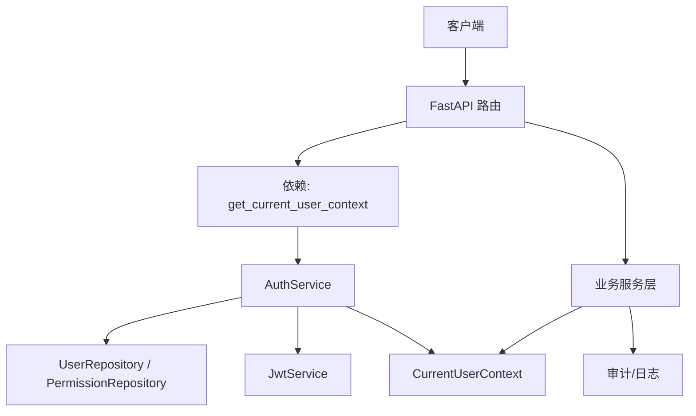
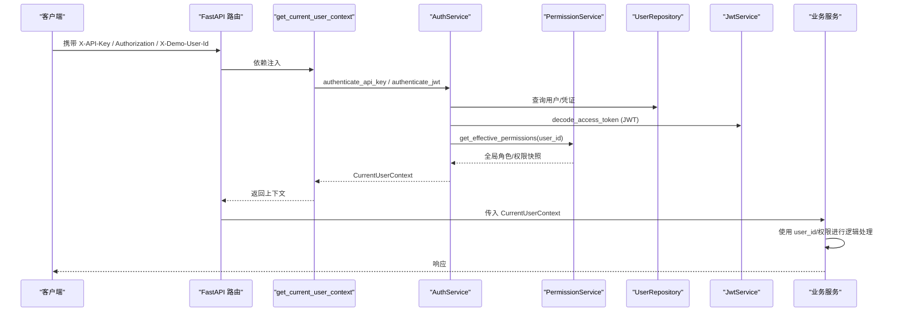
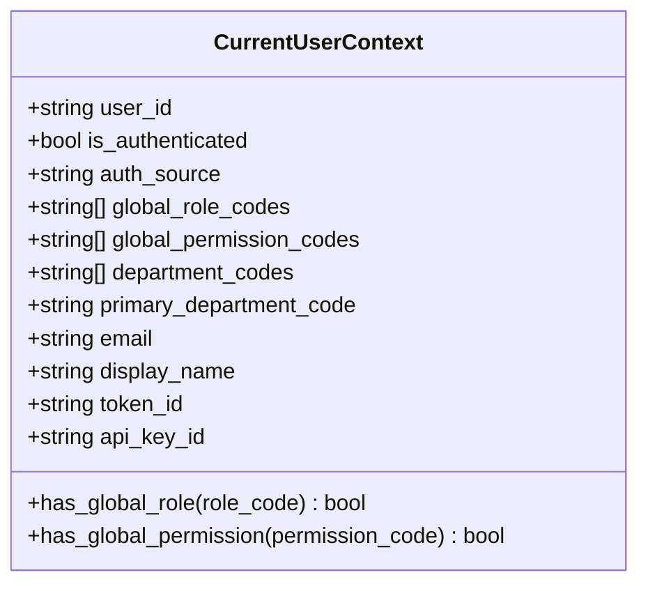
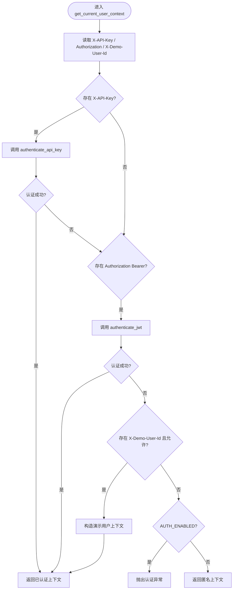
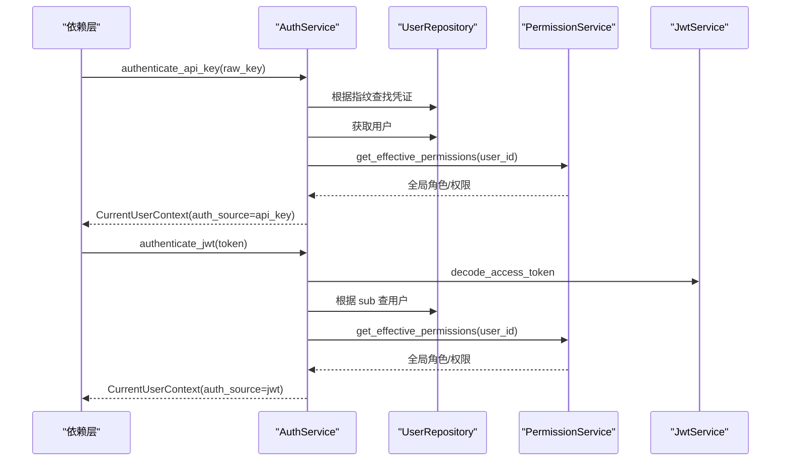
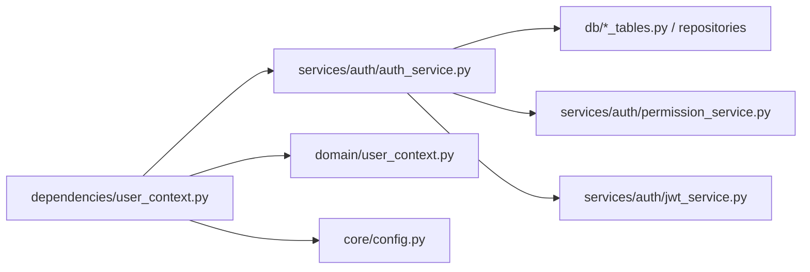

# 用户上下文管理

<cite>
**本文引用的文件**
- [src/fast_app/domain/user_context.py](file://src/fast_app/domain/user_context.py)
- [src/fast_app/dependencies/user_context.py](file://src/fast_app/dependencies/user_context.py)
- [src/fast_app/services/auth/auth_service.py](file://src/fast_app/services/auth/auth_service.py)
- [src/fast_app/core/request_context.py](file://src/fast_app/core/request_context.py)
- [src/fast_app/core/config.py](file://src/fast_app/core/config.py)
- [src/fast_app/dependencies/rag_dependencies.py](file://src/fast_app/dependencies/rag_dependencies.py)
- [src/fast_app/api/auth_routes.py](file://src/fast_app/api/auth_routes.py)
</cite>

## 目录
1. [简介](#简介)
2. [项目结构](#项目结构)
3. [核心组件](#核心组件)
4. [架构总览](#架构总览)
5. [详细组件分析](#详细组件分析)
6. [依赖关系分析](#依赖关系分析)
7. [性能与并发特性](#性能与并发特性)
8. [故障排查指南](#故障排查指南)
9. [结论](#结论)
10. [附录：使用示例与最佳实践](#附录使用示例与最佳实践)

## 简介
本文件系统化说明“用户上下文管理系统”的设计与实现，覆盖当前用户上下文的获取、传递、使用机制；解释 UserContext 设计模式（身份提取、权限注入、请求范围状态）；阐述 FastAPI Depends 的依赖注入、上下文传播与异步环境下的上下文管理；并提供服务层获取用户信息、检查权限、记录操作日志的实践方式。同时涵盖多租户（部门隔离）、会话管理（JWT/Refresh Token）、上下文清理策略等关键主题。

## 项目结构
围绕用户上下文的关键代码分布在以下模块：
- 领域模型：CurrentUserContext 定义当前请求的用户上下文数据结构。
- 依赖注入：get_current_user_context 从请求头解析认证信息并返回上下文。
- 认证服务：AuthService 负责 API Key/JWT 认证、RBAC 权限展开、构造统一上下文。
- 配置：Settings 提供认证开关、JWT 参数、Demo Header 控制等。
- 请求上下文：request_id/trace_id 通过 ContextVar 在异步链路中传播。
- 依赖装配：rag_dependencies 将 Settings、Repository、Service 组装为可注入对象。
- 路由：auth_routes 暴露登录、刷新等认证接口。

图表来源
- [src/fast_app/dependencies/user_context.py:16-62](file://src/fast_app/dependencies/user_context.py#L16-L62)
- [src/fast_app/services/auth/auth_service.py:114-170](file://src/fast_app/services/auth/auth_service.py#L114-L170)
- [src/fast_app/domain/user_context.py:9-51](file://src/fast_app/domain/user_context.py#L9-L51)

章节来源
- [src/fast_app/domain/user_context.py:1-55](file://src/fast_app/domain/user_context.py#L1-L55)
- [src/fast_app/dependencies/user_context.py:1-149](file://src/fast_app/dependencies/user_context.py#L1-L149)
- [src/fast_app/services/auth/auth_service.py:1-327](file://src/fast_app/services/auth/auth_service.py#L1-L327)
- [src/fast_app/core/request_context.py:1-39](file://src/fast_app/core/request_context.py#L1-L39)
- [src/fast_app/core/config.py:138-159](file://src/fast_app/core/config.py#L138-L159)
- [src/fast_app/dependencies/rag_dependencies.py:227-262](file://src/fast_app/dependencies/rag_dependencies.py#L227-L262)
- [src/fast_app/api/auth_routes.py:1-44](file://src/fast_app/api/auth_routes.py#L1-L44)

## 核心组件
- CurrentUserContext：承载一次请求的用户身份信息、认证来源、全局角色/权限快照、部门范围、展示名、邮箱、token/key ID 等，并提供 has_global_role/has_global_permission 便捷方法。
- get_current_user_context：FastAPI 依赖函数，按优先级解析 X-API-Key、Authorization Bearer、X-Demo-User-Id，结合配置决定是否强制认证，最终返回 CurrentUserContext。
- AuthService：封装认证流程（API Key/JWT）、RBAC 权限展开、构建统一上下文；提供 require_permission 快捷校验。
- 配置 Settings：控制 AUTH_ENABLED、JWT 参数、是否允许 Demo Header 等。
- 请求上下文 request_context：基于 ContextVar 的 request_id/trace_id 传播，便于跨异步调用链追踪。
- 依赖装配 rag_dependencies：集中提供 UserRepository、PermissionService、AuthService 等依赖项。

章节来源
- [src/fast_app/domain/user_context.py:9-51](file://src/fast_app/domain/user_context.py#L9-L51)
- [src/fast_app/dependencies/user_context.py:16-62](file://src/fast_app/dependencies/user_context.py#L16-L62)
- [src/fast_app/services/auth/auth_service.py:35-51](file://src/fast_app/services/auth/auth_service.py#L35-L51)
- [src/fast_app/core/config.py:138-159](file://src/fast_app/core/config.py#L138-L159)
- [src/fast_app/core/request_context.py:1-39](file://src/fast_app/core/request_context.py#L1-L39)
- [src/fast_app/dependencies/rag_dependencies.py:227-262](file://src/fast_app/dependencies/rag_dependencies.py#L227-L262)

## 架构总览
下图展示了从 HTTP 请求到用户上下文构建与使用的完整链路，包括认证、权限展开、上下文传播与业务使用。

图表来源
- [src/fast_app/dependencies/user_context.py:16-62](file://src/fast_app/dependencies/user_context.py#L16-L62)
- [src/fast_app/services/auth/auth_service.py:114-170](file://src/fast_app/services/auth/auth_service.py#L114-L170)
- [src/fast_app/services/auth/auth_service.py:236-267](file://src/fast_app/services/auth/auth_service.py#L236-L267)

## 详细组件分析

### 用户上下文数据模型：CurrentUserContext
- 字段含义
  - user_id：当前请求用户标识。
  - is_authenticated：是否通过可信认证。
  - auth_source：认证来源，枚举值包括 anonymous、demo_header、api_key、jwt。
  - global_role_codes/global_permission_codes：实时从 RBAC 展开的全局角色与权限快照。
  - department_codes/primary_department_code：用于知识库检索 ACL 的部门范围。
  - email/display_name：用户展示信息。
  - token_id/api_key_id：本次认证的 token 或 API Key 标识。
- 行为
  - has_global_role(role_code)：判断是否拥有指定全局角色。
  - has_global_permission(permission_code)：判断是否拥有指定全局权限。

图表来源
- [src/fast_app/domain/user_context.py:9-51](file://src/fast_app/domain/user_context.py#L9-L51)

章节来源
- [src/fast_app/domain/user_context.py:1-55](file://src/fast_app/domain/user_context.py#L1-L55)

### 依赖注入：get_current_user_context
- 输入来源
  - X-API-Key：优先尝试数据库 API Key 认证。
  - Authorization: Bearer <token>：其次尝试 JWT 认证。
  - X-Demo-User-Id：在配置允许时构造演示用户上下文（未认证）。
- 认证失败处理
  - 当 AUTH_ENABLED=true 且无有效凭据时抛出认证异常。
  - 否则返回匿名用户上下文。
- 辅助函数
  - _normalize_header_value：确保 Header 值为字符串或 None。
  - _extract_bearer_token：仅接受标准 Bearer 格式。
  - _build_demo_user_context：构造演示用户上下文并进行基础校验。

图表来源
- [src/fast_app/dependencies/user_context.py:16-62](file://src/fast_app/dependencies/user_context.py#L16-L62)
- [src/fast_app/dependencies/user_context.py:65-114](file://src/fast_app/dependencies/user_context.py#L65-L114)

章节来源
- [src/fast_app/dependencies/user_context.py:1-149](file://src/fast_app/dependencies/user_context.py#L1-L149)

### 认证服务：AuthService
- 职责
  - 登录与刷新：用户名/邮箱+密码登录签发 JWT 对；refresh token 轮换。
  - API Key 认证：指纹匹配与哈希校验，成功后加载用户并展开权限。
  - JWT 认证：解码 access token，校验用户有效性，展开权限。
  - 构建上下文：调用 PermissionService 获取有效权限，构造 CurrentUserContext。
  - 权限校验：require_permission 快速检查全局权限。
- 关键点
  - 权限不写入 JWT，每次请求实时展开，避免过期快照问题。
  - 支持 token_id/api_key_id 记录，便于审计。

图表来源
- [src/fast_app/services/auth/auth_service.py:114-170](file://src/fast_app/services/auth/auth_service.py#L114-L170)
- [src/fast_app/services/auth/auth_service.py:236-267](file://src/fast_app/services/auth/auth_service.py#L236-L267)

章节来源
- [src/fast_app/services/auth/auth_service.py:1-327](file://src/fast_app/services/auth/auth_service.py#L1-L327)

### 配置与开关：Settings
- 认证开关
  - AUTH_ENABLED：开启后必须提供有效凭据。
  - AUTH_ALLOW_DEMO_USER_HEADER：允许开发阶段使用演示用户头。
- JWT 配置
  - JWT_SECRET_KEY、JWT_ALGORITHM、JWT_ISSUER、JWT_AUDIENCE、过期时间等。
- 安全参数
  - API_KEY_PEPPER：用于 API Key 哈希增强。

章节来源
- [src/fast_app/core/config.py:138-159](file://src/fast_app/core/config.py#L138-L159)

### 请求上下文传播：request_context
- 使用 ContextVar 维护 request_id 与 trace_id，在异步任务间自动传播。
- 提供 set_request_context/reset_request_context 设置与重置。
- 适合与中间件配合，在每个请求开始时设置，并在请求结束后清理。

章节来源
- [src/fast_app/core/request_context.py:1-39](file://src/fast_app/core/request_context.py#L1-L39)

### 依赖装配：rag_dependencies
- 提供 get_auth_service、get_user_repository、get_permission_service 等依赖项。
- 通过 FastAPI Depends 组合 Settings、DB Session、Repository、Service，形成完整的认证链路。

章节来源
- [src/fast_app/dependencies/rag_dependencies.py:227-262](file://src/fast_app/dependencies/rag_dependencies.py#L227-L262)

### 认证路由：auth_routes
- 暴露 /auth/login、/auth/refresh 等接口，返回 JWT 对。
- 使用 get_auth_service 依赖注入，保持路由层简洁。

章节来源
- [src/fast_app/api/auth_routes.py:1-44](file://src/fast_app/api/auth_routes.py#L1-L44)

## 依赖关系分析
- 耦合与内聚
  - dependencies/user_context.py 高内聚于“从请求头解析认证”，低耦合于具体认证实现，通过 AuthService 解耦。
  - services/auth/auth_service.py 聚合 Repository、PermissionService、JwtService，内聚认证与权限展开逻辑。
  - domain/user_context.py 作为纯数据模型，无外部依赖，便于跨层复用。
- 直接/间接依赖
  - get_current_user_context -> AuthService -> UserRepository/PermissionService/JwtService。
  - AuthService -> PermissionService -> PermissionRepository。
- 外部集成点
  - 数据库（PostgreSQL）：用户、角色、权限、API Key、Refresh Token。
  - JWT 库：签名与解码。
  - 配置系统：环境变量与 .env。

图表来源
- [src/fast_app/dependencies/user_context.py:16-62](file://src/fast_app/dependencies/user_context.py#L16-L62)
- [src/fast_app/services/auth/auth_service.py:35-51](file://src/fast_app/services/auth/auth_service.py#L35-L51)

章节来源
- [src/fast_app/dependencies/user_context.py:1-149](file://src/fast_app/dependencies/user_context.py#L1-L149)
- [src/fast_app/services/auth/auth_service.py:1-327](file://src/fast_app/services/auth/auth_service.py#L1-L327)

## 性能与并发特性
- 异步友好
  - 认证与权限展开均为异步调用，避免阻塞事件循环。
  - 依赖注入由 FastAPI 管理生命周期，减少手动资源管理开销。
- 权限展开成本
  - 每次请求实时展开 RBAC，保证权限一致性；可通过缓存 effective permissions（如 Redis）降低 DB 压力。
- 上下文传播
  - 使用 ContextVar 在异步任务中传播 request_id/trace_id，零拷贝、高性能。
- 建议优化
  - 热点用户权限缓存：TTL 短、带失效策略（如用户角色变更时主动失效）。
  - JWT 解码结果缓存：同一进程内短期缓存解码后的 subject，避免重复 IO。
  - 批量权限预取：对于复杂工作流，可在入口处一次性展开权限并复用。

[本节为通用指导，无需特定文件引用]

## 故障排查指南
- 常见错误
  - 认证失败：缺少 X-API-Key 或 Authorization Bearer；AUTH_ENABLED=true 但未提供凭据。
  - JWT 无效：签名错误、过期、签发方/受众不匹配。
  - 用户不存在：JWT sub 对应用户被删除或禁用。
  - 权限不足：当前用户没有所需全局权限或部门权限。
- 定位步骤
  - 检查请求头是否正确传递。
  - 查看 Settings 中 AUTH_ENABLED、JWT_* 配置。
  - 确认数据库中用户状态、角色、权限配置。
  - 使用 request_id/trace_id 关联日志，定位调用链。
- 恢复策略
  - 重新登录获取新 JWT。
  - 更新用户角色/权限后重试。
  - 调整配置以允许 Demo Header（仅限开发环境）。

章节来源
- [src/fast_app/dependencies/user_context.py:16-62](file://src/fast_app/dependencies/user_context.py#L16-L62)
- [src/fast_app/services/auth/auth_service.py:75-112](file://src/fast_app/services/auth/auth_service.py#L75-L112)
- [src/fast_app/core/request_context.py:16-39](file://src/fast_app/core/request_context.py#L16-L39)

## 结论
该用户上下文管理系统通过清晰的领域模型、依赖注入与认证服务，实现了请求级用户身份的可靠获取与传递。权限采用实时展开策略，避免过期快照带来的安全风险；结合部门维度支持多租户隔离。异步友好的设计与 ContextVar 传播确保了在高并发场景下的稳定性与可观测性。生产环境建议启用严格认证、完善权限缓存与审计日志，保障安全与性能平衡。

[本节为总结，无需特定文件引用]

## 附录：使用示例与最佳实践

### 在服务层获取用户信息
- 在路由或依赖中声明 get_current_user_context，FastAPI 会自动注入 CurrentUserContext。
- 在服务方法中接收 CurrentUserContext，使用 user_id、email、display_name 等业务字段。
- 参考路径
  - [src/fast_app/dependencies/user_context.py:16-62](file://src/fast_app/dependencies/user_context.py#L16-L62)
  - [src/fast_app/domain/user_context.py:9-51](file://src/fast_app/domain/user_context.py#L9-L51)

### 检查用户权限
- 使用 CurrentUserContext.has_global_permission 或 require_permission 进行权限校验。
- 针对部门级操作，结合 department_codes 与目标部门进行 ACL 判断。
- 参考路径
  - [src/fast_app/services/auth/auth_service.py:314-323](file://src/fast_app/services/auth/auth_service.py#L314-L323)
  - [src/fast_app/domain/user_context.py:43-51](file://src/fast_app/domain/user_context.py#L43-L51)

### 记录操作日志
- 使用 request_context 中的 request_id/trace_id 关联日志。
- 在日志中记录 user_id、auth_source、操作类型、目标资源、结果。
- 参考路径
  - [src/fast_app/core/request_context.py:16-39](file://src/fast_app/core/request_context.py#L16-L39)

### 多租户支持（部门隔离）
- 利用 department_codes 与 primary_department_code 限制检索范围。
- 在知识库检索、文档操作中结合部门 ACL 进行过滤。
- 参考路径
  - [src/fast_app/domain/user_context.py:30-37](file://src/fast_app/domain/user_context.py#L30-L37)

### 用户会话管理（JWT/Refresh Token）
- 登录返回 access_token 与 refresh_token；access_token 用于鉴权，refresh_token 用于轮换。
- 刷新流程会标记旧 refresh_token 已使用并撤销，防止重放攻击。
- 参考路径
  - [src/fast_app/services/auth/auth_service.py:75-112](file://src/fast_app/services/auth/auth_service.py#L75-L112)
  - [src/fast_app/api/auth_routes.py:22-44](file://src/fast_app/api/auth_routes.py#L22-L44)

### 上下文清理策略
- 在请求结束时关闭数据库连接、释放资源。
- 使用 ContextVar 的 reset 清理 request_id/trace_id，避免跨请求污染。
- 参考路径
  - [src/fast_app/core/request_context.py:24-39](file://src/fast_app/core/request_context.py#L24-L39)