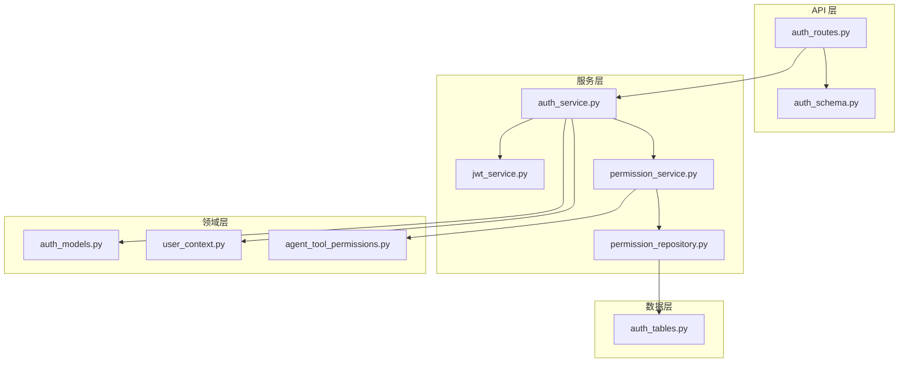
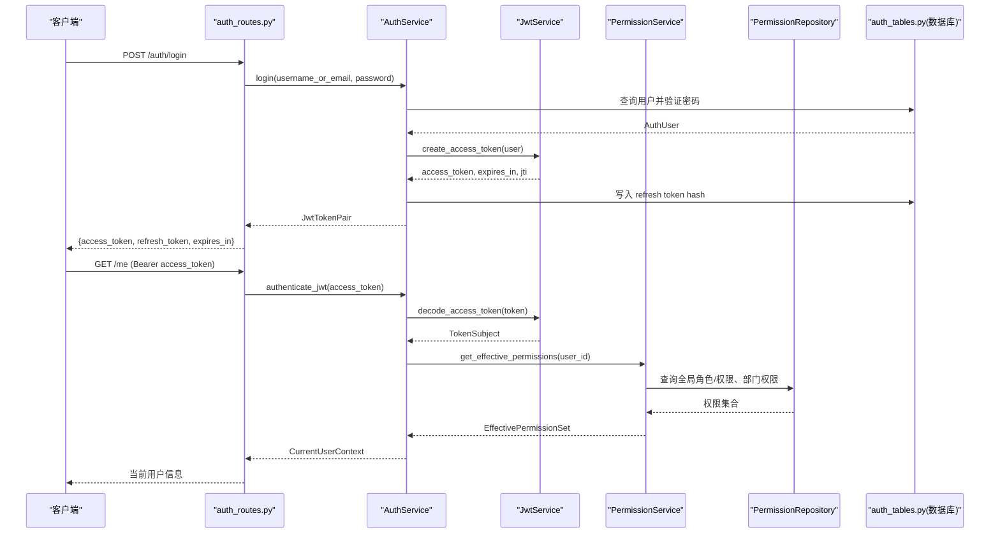
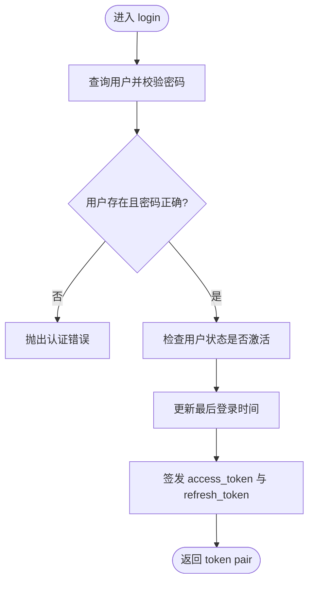
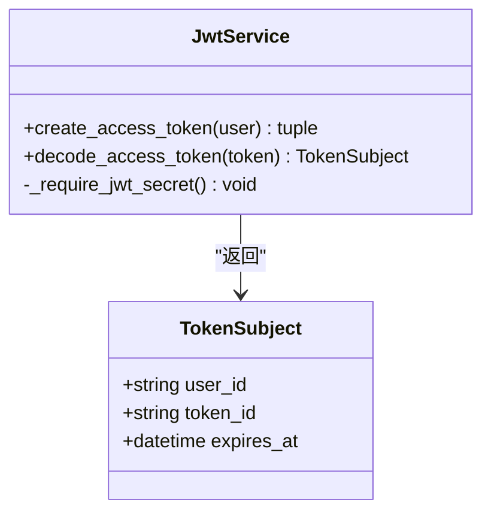
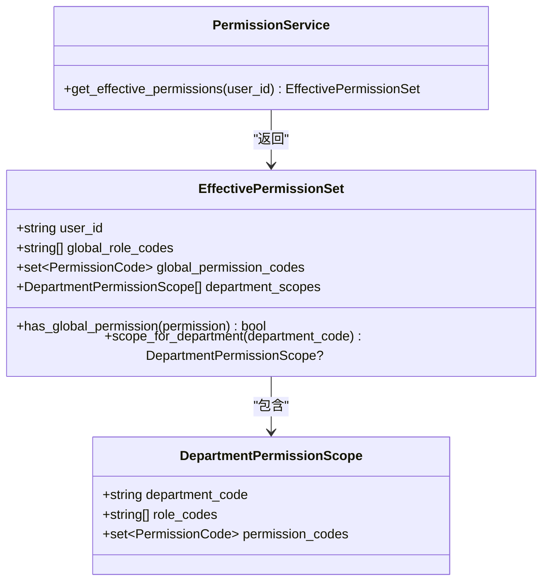
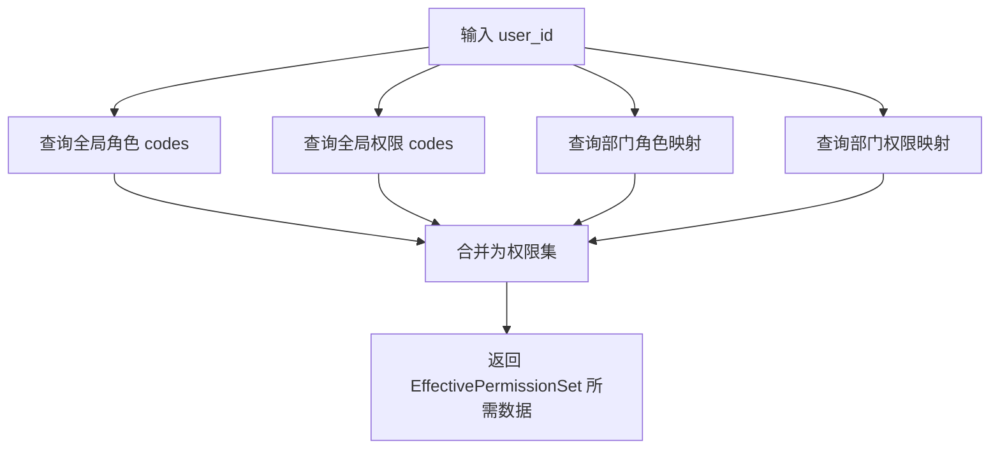
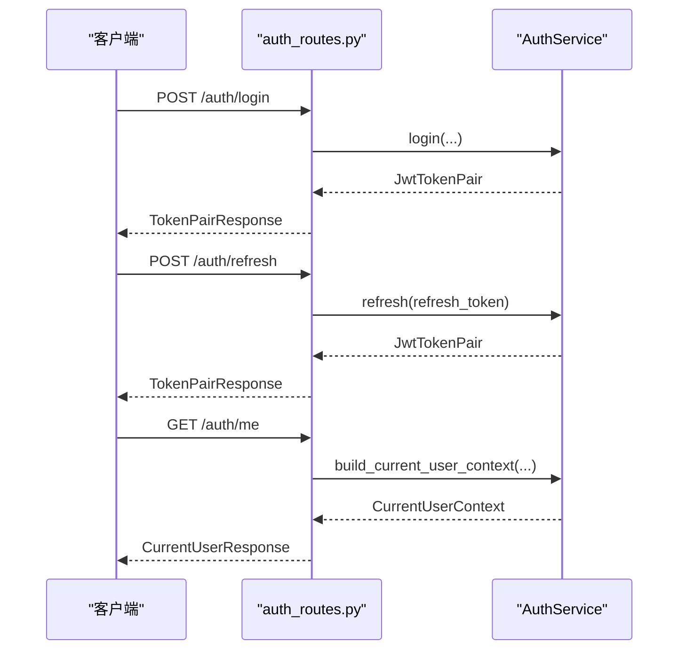
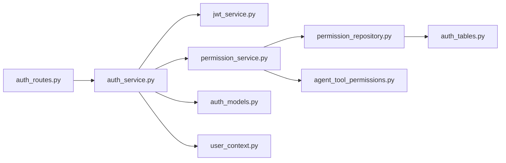

# 认证授权系统

<cite>
**本文引用的文件**
- [auth_routes.py](file://src/fast_app/api/auth_routes.py)
- [auth_service.py](file://src/fast_app/services/auth/auth_service.py)
- [jwt_service.py](file://src/fast_app/services/auth/jwt_service.py)
- [permission_service.py](file://src/fast_app/services/auth/permission_service.py)
- [permission_repository.py](file://src/fast_app/services/auth/permission_repository.py)
- [auth_models.py](file://src/fast_app/domain/auth_models.py)
- [user_context.py](file://src/fast_app/domain/user_context.py)
- [agent_tool_permissions.py](file://src/fast_app/domain/agent_tool_permissions.py)
- [auth_tables.py](file://src/fast_app/db/auth_tables.py)
- [auth_schema.py](file://src/fast_app/schemas/auth_schema.py)
</cite>

## 目录
1. [简介](#简介)
2. [项目结构](#项目结构)
3. [核心组件](#核心组件)
4. [架构总览](#架构总览)
5. [详细组件分析](#详细组件分析)
6. [依赖关系分析](#依赖关系分析)
7. [性能与安全考量](#性能与安全考量)
8. [故障排查指南](#故障排查指南)
9. [结论](#结论)
10. [附录：示例与最佳实践](#附录示例与最佳实践)

## 简介
本系统提供企业级认证与授权能力，覆盖以下关键能力：
- JWT 访问令牌签发与校验、Refresh Token 轮换策略
- API Key 全生命周期管理（创建、列表、撤销）
- RBAC 权限模型：全局角色/权限 + 部门作用域权限
- 部门级 ACL：知识库文档按部门范围进行检索与操作控制
- Agent 工具调用权限检查：基于风险等级与权限码的动态决策
- 统一用户上下文：将认证来源、RBAC 快照、部门范围聚合到 CurrentUserContext，供上层服务消费

## 项目结构
认证授权相关代码采用分层组织：
- API 层：路由定义与请求/响应模型
- 服务层：认证业务、JWT、权限计算
- 领域层：用户、凭证、权限、工具权限等模型
- 数据层：数据库表模型与权限仓储
- 配置与异常：由外部模块提供（如 Settings、AuthenticationError）

图表来源
- [auth_routes.py:1-112](file://src/fast_app/api/auth_routes.py#L1-L112)
- [auth_service.py:35-327](file://src/fast_app/services/auth/auth_service.py#L35-L327)
- [jwt_service.py:13-89](file://src/fast_app/services/auth/jwt_service.py#L13-L89)
- [permission_service.py:11-64](file://src/fast_app/services/auth/permission_service.py#L11-L64)
- [permission_repository.py:17-126](file://src/fast_app/services/auth/permission_repository.py#L17-L126)
- [auth_models.py:62-158](file://src/fast_app/domain/auth_models.py#L62-L158)
- [user_context.py:9-55](file://src/fast_app/domain/user_context.py#L9-L55)
- [agent_tool_permissions.py:14-293](file://src/fast_app/domain/agent_tool_permissions.py#L14-L293)
- [auth_tables.py:13-431](file://src/fast_app/db/auth_tables.py#L13-L431)

章节来源
- [auth_routes.py:1-112](file://src/fast_app/api/auth_routes.py#L1-L112)
- [auth_service.py:35-327](file://src/fast_app/services/auth/auth_service.py#L35-L327)
- [jwt_service.py:13-89](file://src/fast_app/services/auth/jwt_service.py#L13-L89)
- [permission_service.py:11-64](file://src/fast_app/services/auth/permission_service.py#L11-L64)
- [permission_repository.py:17-126](file://src/fast_app/services/auth/permission_repository.py#L17-L126)
- [auth_models.py:62-158](file://src/fast_app/domain/auth_models.py#L62-L158)
- [user_context.py:9-55](file://src/fast_app/domain/user_context.py#L9-L55)
- [agent_tool_permissions.py:14-293](file://src/fast_app/domain/agent_tool_permissions.py#L14-L293)
- [auth_tables.py:13-431](file://src/fast_app/db/auth_tables.py#L13-L431)

## 核心组件
- AuthService：统一认证入口，封装登录、刷新、API Key 认证、JWT 认证、当前用户上下文构建、令牌签发与刷新。
- JwtService：负责 access token 的签发与解码，包含算法、签发者、受众、过期时间、jti 等声明校验。
- PermissionService：根据用户 ID 查询全局角色、全局权限和部门作用域权限，组装为 EffectivePermissionSet。
- PermissionRepository：通过 SQL 查询用户的全局角色、全局权限、部门角色与部门权限集合。
- 领域模型：AuthUser、ApiKeyCredential、RefreshTokenRecord、CurrentUserContext、AgentToolCallContext、EffectivePermissionSet 等。
- 数据表：users、api_keys、refresh_tokens、roles、permissions、user_roles、role_permissions、user_departments、user_department_roles 等。

章节来源
- [auth_service.py:35-327](file://src/fast_app/services/auth/auth_service.py#L35-L327)
- [jwt_service.py:13-89](file://src/fast_app/services/auth/jwt_service.py#L13-L89)
- [permission_service.py:11-64](file://src/fast_app/services/auth/permission_service.py#L11-L64)
- [permission_repository.py:17-126](file://src/fast_app/services/auth/permission_repository.py#L17-L126)
- [auth_models.py:62-158](file://src/fast_app/domain/auth_models.py#L62-L158)
- [user_context.py:9-55](file://src/fast_app/domain/user_context.py#L9-L55)
- [agent_tool_permissions.py:14-293](file://src/fast_app/domain/agent_tool_permissions.py#L14-L293)
- [auth_tables.py:13-431](file://src/fast_app/db/auth_tables.py#L13-L431)

## 架构总览
下图展示从 HTTP 请求到认证、权限判断再到资源访问的整体流程。

图表来源
- [auth_routes.py:22-53](file://src/fast_app/api/auth_routes.py#L22-L53)
- [auth_service.py:75-170](file://src/fast_app/services/auth/auth_service.py#L75-L170)
- [jwt_service.py:19-79](file://src/fast_app/services/auth/jwt_service.py#L19-L79)
- [permission_service.py:17-50](file://src/fast_app/services/auth/permission_service.py#L17-L50)
- [permission_repository.py:27-80](file://src/fast_app/services/auth/permission_repository.py#L27-L80)
- [auth_tables.py:13-431](file://src/fast_app/db/auth_tables.py#L13-L431)

## 详细组件分析

### 认证服务 AuthService
职责与关键点：
- 登录：校验用户名/邮箱与密码，更新最后登录时间，签发 access_token 与 refresh_token。
- 刷新：校验 refresh token 哈希、状态与过期时间，标记已使用并撤销旧记录，签发新 token pair。
- API Key 认证：指纹匹配、哈希校验、状态与过期检查，加载用户并构建上下文。
- JWT 认证：解码 access token，校验类型与必要声明，加载用户并构建上下文。
- 构建上下文：调用 PermissionService 获取有效权限，填充部门范围、主部门、token_id/api_key_id 等审计字段。
- 辅助方法：统一的用户/凭证有效性检查、require_permission 快捷权限校验。

图表来源
- [auth_service.py:75-112](file://src/fast_app/services/auth/auth_service.py#L75-L112)
- [auth_service.py:269-292](file://src/fast_app/services/auth/auth_service.py#L269-L292)

章节来源
- [auth_service.py:35-327](file://src/fast_app/services/auth/auth_service.py#L35-L327)

### JWT 服务 JwtService
职责与关键点：
- 签发：生成 claims（sub、iss、aud、iat、exp、jti、typ），使用配置的密钥与算法编码。
- 解码：校验签名、issuer、audience、类型、必要声明与过期时间，提取 user_id、token_id、expires_at。
- 安全：未配置密钥时拒绝使用；类型不匹配或声明缺失时抛出认证错误。

图表来源
- [jwt_service.py:13-89](file://src/fast_app/services/auth/jwt_service.py#L13-L89)
- [auth_models.py:114-120](file://src/fast_app/domain/auth_models.py#L114-L120)

章节来源
- [jwt_service.py:13-89](file://src/fast_app/services/auth/jwt_service.py#L13-L89)

### 权限服务 PermissionService
职责与关键点：
- 加载用户的全局角色、全局权限、部门角色与部门权限。
- 合并部门范围，构造 EffectivePermissionSet，便于后续 RBAC 与部门 ACL 判断。
- 将字符串权限码转换为枚举类型，提升类型安全。

图表来源
- [permission_service.py:11-64](file://src/fast_app/services/auth/permission_service.py#L11-L64)
- [agent_tool_permissions.py:103-152](file://src/fast_app/domain/agent_tool_permissions.py#L103-L152)

章节来源
- [permission_service.py:11-64](file://src/fast_app/services/auth/permission_service.py#L11-L64)
- [agent_tool_permissions.py:103-152](file://src/fast_app/domain/agent_tool_permissions.py#L103-L152)

### 权限仓储 PermissionRepository
职责与关键点：
- 查询用户全局角色、全局权限、部门角色、部门权限。
- 支持添加用户角色与部门角色（用于初始化或管理场景）。
- 使用 SQLAlchemy Select 组合多表关联，确保权限事实准确。

图表来源
- [permission_repository.py:27-80](file://src/fast_app/services/auth/permission_repository.py#L27-L80)
- [auth_tables.py:168-319](file://src/fast_app/db/auth_tables.py#L168-L319)

章节来源
- [permission_repository.py:17-126](file://src/fast_app/services/auth/permission_repository.py#L17-L126)
- [auth_tables.py:168-319](file://src/fast_app/db/auth_tables.py#L168-L319)

### API 路由 auth_routes
职责与关键点：
- 登录：POST /auth/login，返回 token pair。
- 刷新：POST /auth/refresh，使用 refresh token 轮换。
- 当前用户：GET /auth/me，返回当前请求解析出的用户上下文。
- API Key 管理：创建、列出、撤销，仅返回摘要与一次明文 key。

图表来源
- [auth_routes.py:22-108](file://src/fast_app/api/auth_routes.py#L22-L108)
- [auth_service.py:75-267](file://src/fast_app/services/auth/auth_service.py#L75-L267)

章节来源
- [auth_routes.py:1-112](file://src/fast_app/api/auth_routes.py#L1-L112)
- [auth_schema.py:8-123](file://src/fast_app/schemas/auth_schema.py#L8-L123)

### 领域模型与上下文
- AuthUser：用户基本信息、密码哈希、状态、部门范围、主部门、时间戳。
- ApiKeyCredential：API Key 持久化视图，仅保存哈希与指纹，不存明文。
- RefreshTokenRecord：刷新凭证记录，仅保存哈希与元数据。
- CurrentUserContext：统一请求上下文，包含认证来源、全局角色/权限快照、部门范围、token_id/api_key_id。
- AgentToolCallContext / EffectivePermissionSet：工具权限网关输入与输出，支持风险分级与部门作用域。

章节来源
- [auth_models.py:62-158](file://src/fast_app/domain/auth_models.py#L62-L158)
- [user_context.py:9-55](file://src/fast_app/domain/user_context.py#L9-L55)
- [agent_tool_permissions.py:154-293](file://src/fast_app/domain/agent_tool_permissions.py#L154-L293)

### 数据库表结构
- users：用户主表，含用户名、邮箱、密码哈希、状态、时间戳。
- api_keys：程序化凭证，保存前缀、指纹、哈希、状态、过期时间、最近使用时间、撤销时间。
- refresh_tokens：刷新凭证，保存哈希、状态、过期时间、元数据。
- roles / permissions / role_permissions：角色与权限目录及绑定关系。
- user_roles / user_department_roles：用户全局角色与部门作用域角色。
- departments / user_departments：部门与用户部门关系。

章节来源
- [auth_tables.py:13-431](file://src/fast_app/db/auth_tables.py#L13-L431)

## 依赖关系分析
- API 路由依赖 AuthService 与 Pydantic Schema。
- AuthService 依赖 JwtService、PermissionService、UserRepository（由外部注入）、Settings。
- PermissionService 依赖 PermissionRepository。
- PermissionRepository 依赖 SQLAlchemy AsyncSession 与 auth_tables 模型。
- 领域模型被服务层与 API 层共同引用，保证类型一致。

图表来源
- [auth_routes.py:1-112](file://src/fast_app/api/auth_routes.py#L1-L112)
- [auth_service.py:35-327](file://src/fast_app/services/auth/auth_service.py#L35-L327)
- [jwt_service.py:13-89](file://src/fast_app/services/auth/jwt_service.py#L13-L89)
- [permission_service.py:11-64](file://src/fast_app/services/auth/permission_service.py#L11-L64)
- [permission_repository.py:17-126](file://src/fast_app/services/auth/permission_repository.py#L17-L126)
- [auth_tables.py:13-431](file://src/fast_app/db/auth_tables.py#L13-L431)
- [auth_models.py:62-158](file://src/fast_app/domain/auth_models.py#L62-L158)
- [user_context.py:9-55](file://src/fast_app/domain/user_context.py#L9-L55)
- [agent_tool_permissions.py:14-293](file://src/fast_app/domain/agent_tool_permissions.py#L14-L293)

## 性能与安全考量
- 令牌策略
  - Access Token 短期有效，减少泄露影响面；Refresh Token 长期有效但仅保存哈希，支持一次性使用与撤销。
  - 刷新流程会标记旧 refresh token 为已使用并撤销，防止重放攻击。
- 安全实践
  - 密码与 API Key 均使用哈希存储，避免明文落库。
  - JWT 校验 issuer、audience、类型与必要声明，未配置密钥时拒绝使用。
  - API Key 使用指纹与哈希双重机制，支持审计与快速定位。
- 权限性能
  - 在认证阶段一次性加载用户的有效权限（全局+部门），缓存到 CurrentUserContext，降低后续多次鉴权开销。
  - 权限查询使用高效 JOIN 与索引，避免 N+1 问题。
- 可扩展性
  - 通过 EffectivePermissionSet 与 DepartmentPermissionScope 扩展新的部门或权限类别。
  - 工具权限网关可基于风险等级与权限码实现细粒度控制。

[本节为通用指导，不直接分析具体文件]

## 故障排查指南
常见问题与定位建议：
- 登录失败
  - 检查用户名/邮箱是否存在、密码是否正确、用户状态是否为 active。
  - 参考路径：[auth_service.py:75-90](file://src/fast_app/services/auth/auth_service.py#L75-L90)
- Refresh Token 无效或过期
  - 检查 refresh token 哈希是否存在、状态是否为 active、是否已过期或被撤销。
  - 参考路径：[auth_service.py:92-112](file://src/fast_app/services/auth/auth_service.py#L92-L112)
- JWT 校验失败
  - 检查密钥是否配置、算法是否匹配、issuer/audience 是否正确、token 类型是否为 access。
  - 参考路径：[jwt_service.py:48-79](file://src/fast_app/services/auth/jwt_service.py#L48-L79)
- API Key 认证失败
  - 检查指纹是否匹配、哈希是否一致、状态与过期时间是否有效。
  - 参考路径：[auth_service.py:114-151](file://src/fast_app/services/auth/auth_service.py#L114-L151)
- 权限不足
  - 检查当前用户的全局权限快照是否包含目标权限码；必要时调整角色或部门权限。
  - 参考路径：[auth_service.py:314-323](file://src/fast_app/services/auth/auth_service.py#L314-L323)、[user_context.py:43-51](file://src/fast_app/domain/user_context.py#L43-L51)

章节来源
- [auth_service.py:75-151](file://src/fast_app/services/auth/auth_service.py#L75-L151)
- [jwt_service.py:48-79](file://src/fast_app/services/auth/jwt_service.py#L48-L79)
- [user_context.py:43-51](file://src/fast_app/domain/user_context.py#L43-L51)

## 结论
该认证授权系统以 AuthService 为核心，结合 JwtService 与 PermissionService，实现了统一的认证入口与灵活的权限控制。通过 RBAC 与部门 ACL，既能满足全局管理需求，又能实现细粒度的知识库与工具调用控制。配合完善的 API Key 管理与 Refresh Token 轮换策略，系统在安全性、可维护性与可扩展性方面具备良好基础。

[本节为总结，不直接分析具体文件]

## 附录：示例与最佳实践

### 用户登录与令牌获取
- 调用接口：POST /auth/login
- 请求体：username_or_email、password
- 响应：access_token、refresh_token、expires_in
- 参考路径：
  - [auth_routes.py:22-33](file://src/fast_app/api/auth_routes.py#L22-L33)
  - [auth_schema.py:8-41](file://src/fast_app/schemas/auth_schema.py#L8-L41)
  - [auth_service.py:75-90](file://src/fast_app/services/auth/auth_service.py#L75-L90)

### 令牌刷新策略
- 调用接口：POST /auth/refresh
- 请求体：refresh_token
- 行为：校验哈希与状态，标记旧记录为已使用并撤销，签发新 token pair
- 参考路径：
  - [auth_routes.py:36-44](file://src/fast_app/api/auth_routes.py#L36-L44)
  - [auth_service.py:92-112](file://src/fast_app/services/auth/auth_service.py#L92-L112)

### 验证请求权限（RBAC）
- 在服务中调用 require_permission(user, permission_code) 进行全局权限检查
- 或在 CurrentUserContext 上调用 has_global_permission(permission_code)
- 参考路径：
  - [auth_service.py:314-323](file://src/fast_app/services/auth/auth_service.py#L314-L323)
  - [user_context.py:43-51](file://src/fast_app/domain/user_context.py#L43-L51)

### 动态权限控制（部门 ACL）
- 使用 EffectivePermissionSet.scope_for_department(department_code) 获取部门作用域权限
- 结合 KnowledgeDocumentOperation 与 ToolRiskLevel 决定允许、拒绝或需人工确认
- 参考路径：
  - [agent_tool_permissions.py:140-152](file://src/fast_app/domain/agent_tool_permissions.py#L140-L152)
  - [permission_service.py:17-50](file://src/fast_app/services/auth/permission_service.py#L17-L50)

### 工具调用权限检查机制
- 构造 AgentToolCallContext，包含 tool_name、operation、risk_level、target_path、target_department_codes 等
- 依据权限码与风险等级裁决 ALLOW/DENY/CONFIRMATION_REQUIRED/EXECUTE_ALLOWED
- 参考路径：
  - [agent_tool_permissions.py:206-279](file://src/fast_app/domain/agent_tool_permissions.py#L206-L279)

### API Key 管理
- 创建：POST /auth/api-keys，仅返回一次明文 api_key
- 列表：GET /auth/api-keys，返回摘要（不包含明文）
- 撤销：DELETE /auth/api-keys/{api_key_id}
- 参考路径：
  - [auth_routes.py:56-108](file://src/fast_app/api/auth_routes.py#L56-L108)
  - [auth_service.py:172-234](file://src/fast_app/services/auth/auth_service.py#L172-L234)

### 安全最佳实践
- 使用哈希存储密码与 API Key，禁止明文落库
- JWT 必须配置密钥并校验 issuer、audience、类型与必要声明
- Refresh Token 一次性使用并支持撤销，防止重放
- 在认证阶段加载有效权限并缓存到上下文，减少重复查询
- 对高风险工具调用引入人工确认流程

[本节为通用指导，不直接分析具体文件]

### 权限审计日志记录
- 在 CurrentUserContext 中记录 token_id 与 api_key_id，便于追踪每次请求的认证来源
- 在 RefreshTokenRecord.metadata_json 中附加审计信息（如设备、IP、UA 等）
- 在工具权限裁决结果中记录 required_permissions、missing_permissions、target_department_codes
- 参考路径：
  - [user_context.py:19-41](file://src/fast_app/domain/user_context.py#L19-L41)
  - [auth_models.py:100-112](file://src/fast_app/domain/auth_models.py#L100-L112)
  - [agent_tool_permissions.py:242-279](file://src/fast_app/domain/agent_tool_permissions.py#L242-L279)