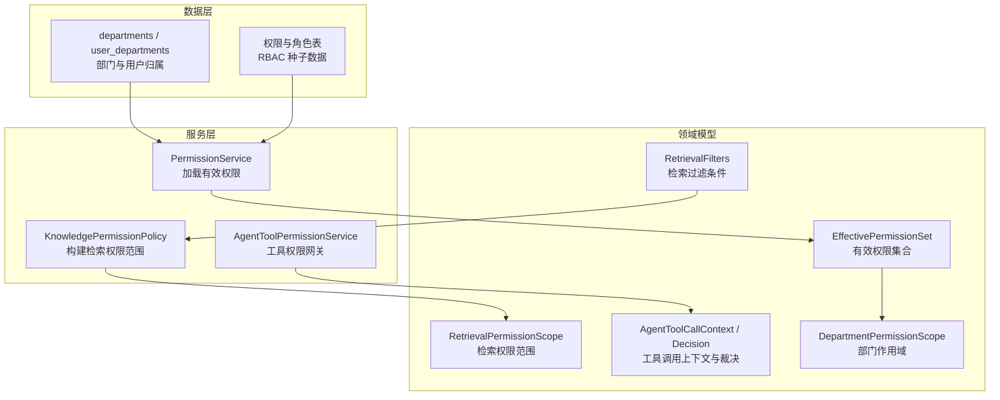
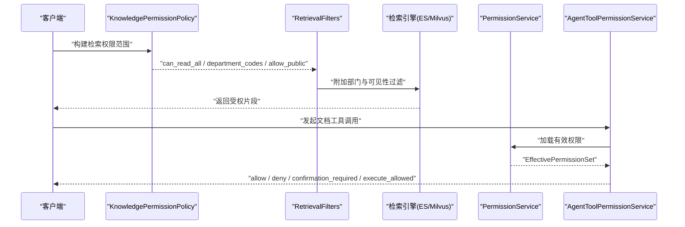
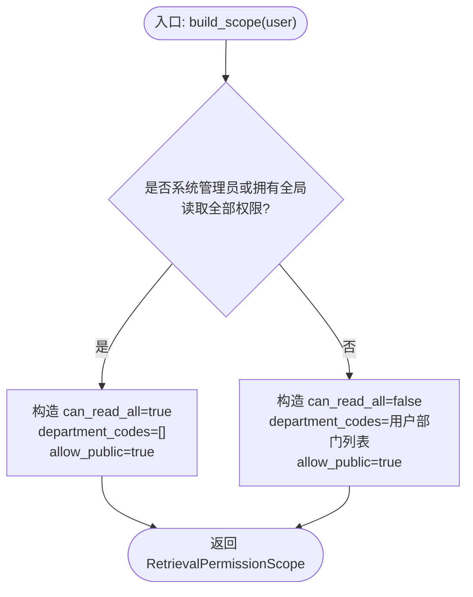
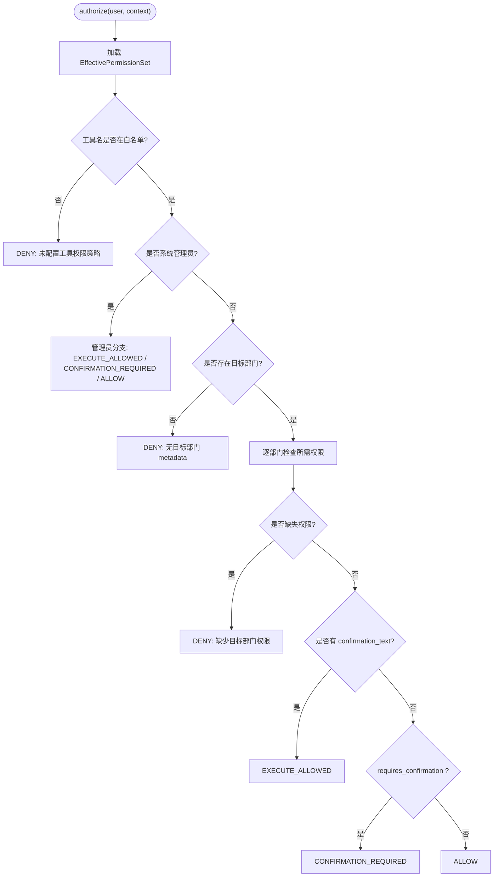
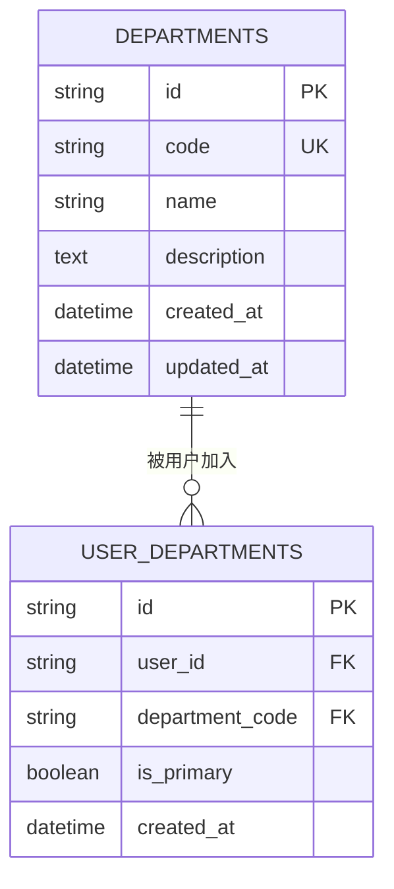
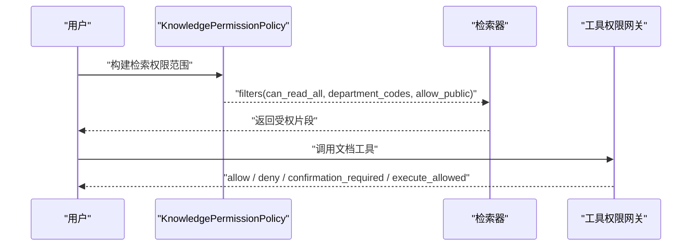
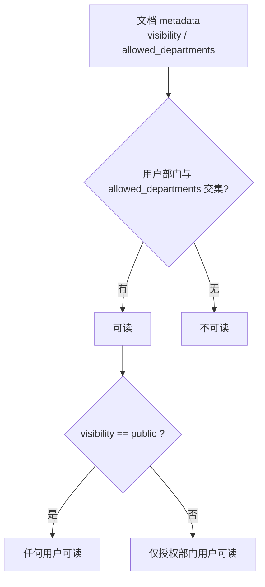
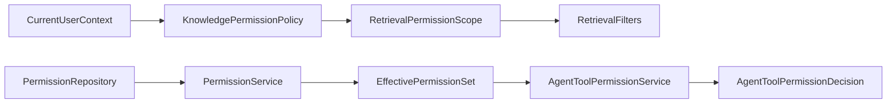

# 部门级 ACL 权限

<cite>
**本文引用的文件**
- [knowledge_permission_policy.py](file://src/fast_app/services/knowledge/knowledge_permission_policy.py)
- [knowledge_permissions.py](file://src/fast_app/domain/knowledge_permissions.py)
- [rag_models.py](file://src/fast_app/domain/rag_models.py)
- [agent_tool_permissions.py](file://src/fast_app/domain/agent_tool_permissions.py)
- [permission_service.py](file://src/fast_app/services/auth/permission_service.py)
- [user_context.py](file://src/fast_app/domain/user_context.py)
- [agent_tool_permission_service.py](file://src/fast_app/services/agent_tasks/agent_tool_permission_service.py)
- [20260628_0004_create_department_acl_tables.py](file://alembic/versions/20260628_0004_create_department_acl_tables.py)
- [20260704_0005_create_agent_tool_permission_tables.py](file://alembic/versions/20260704_0005_create_agent_tool_permission_tables.py)
- [test_department_rag_acl_acceptance.py](file://scripts/tests/document_security/test_department_rag_acl_acceptance.py)
- [seed_and_test_rbac_accounts.py](file://scripts/phase_15/seed_and_test_rbac_accounts.py)
- [.permission-rules.json](file://docs/knowledge-base-acl-test/.permission-rules.json)
</cite>

## 目录
1. [简介](#简介)
2. [项目结构](#项目结构)
3. [核心组件](#核心组件)
4. [架构总览](#架构总览)
5. [详细组件分析](#详细组件分析)
6. [依赖关系分析](#依赖关系分析)
7. [性能考虑](#性能考虑)
8. [故障排查指南](#故障排查指南)
9. [结论](#结论)
10. [附录](#附录)

## 简介
本文件面向“部门级 ACL 权限控制”，系统性说明知识库文档的部门可见性、用户级权限叠加、检索与工具调用两条链路的权限模型，以及 KnowledgePermissionPolicy 的实现原理。文档同时给出权限检查流程、跨部门访问控制策略、冲突处理原则和性能优化建议（如权限缓存、批量权限检查），并配合验收脚本与迁移脚本展示如何设置文档部门权限、检查用户访问权限和处理权限冲突。

## 项目结构
围绕部门级 ACL 的相关代码主要分布在以下位置：
- 领域模型与权限常量：domain 层定义检索过滤条件、权限范围、角色与权限码等。
- 服务层：将认证上下文转换为可执行的检索权限范围；从数据库加载有效权限；对 Agent 工具调用进行授权裁决。
- 数据层：通过 Alembic 迁移创建部门表、用户-部门关联表，以及 Agent 工具权限相关表与种子数据。
- 测试与验收：提供端到端 HTTP 场景验证、RBAC 账户初始化与断言。

图表来源
- [rag_models.py:10-24](file://src/fast_app/domain/rag_models.py#L10-L24)
- [knowledge_permissions.py:4-16](file://src/fast_app/domain/knowledge_permissions.py#L4-L16)
- [agent_tool_permissions.py:103-151](file://src/fast_app/domain/agent_tool_permissions.py#L103-L151)
- [knowledge_permission_policy.py:13-41](file://src/fast_app/services/knowledge/knowledge_permission_policy.py#L13-L41)
- [permission_service.py:11-50](file://src/fast_app/services/auth/permission_service.py#L11-L50)
- [agent_tool_permission_service.py:42-83](file://src/fast_app/services/agent_tasks/agent_tool_permission_service.py#L42-L83)
- [20260628_0004_create_department_acl_tables.py:19-79](file://alembic/versions/20260628_0004_create_department_acl_tables.py#L19-L79)
- [20260704_0005_create_agent_tool_permission_tables.py:86-129](file://alembic/versions/20260704_0005_create_agent_tool_permission_tables.py#L86-L129)

章节来源
- [rag_models.py:10-24](file://src/fast_app/domain/rag_models.py#L10-L24)
- [knowledge_permissions.py:4-16](file://src/fast_app/domain/knowledge_permissions.py#L4-L16)
- [agent_tool_permissions.py:103-151](file://src/fast_app/domain/agent_tool_permissions.py#L103-L151)
- [knowledge_permission_policy.py:13-41](file://src/fast_app/services/knowledge/knowledge_permission_policy.py#L13-L41)
- [permission_service.py:11-50](file://src/fast_app/services/auth/permission_service.py#L11-L50)
- [agent_tool_permission_service.py:42-83](file://src/fast_app/services/agent_tasks/agent_tool_permission_service.py#L42-L83)
- [20260628_0004_create_department_acl_tables.py:19-79](file://alembic/versions/20260628_0004_create_department_acl_tables.py#L19-L79)
- [20260704_0005_create_agent_tool_permission_tables.py:86-129](file://alembic/versions/20260704_0005_create_agent_tool_permission_tables.py#L86-L129)

## 核心组件
- 检索权限范围 RetrievalPermissionScope：由可信用户上下文生成，包含是否可读取全部、当前用户 ID、允许部门列表、是否允许公共文档等字段，用于下推到检索引擎。
- 检索过滤条件 RetrievalFilters：内部业务对象，承载来源路径、章节路径、权限范围、知识版本等，供检索链路使用。
- 有效权限集合 EffectivePermissionSet：从数据库加载的全局角色、全局权限与部门作用域权限的聚合结果。
- 部门作用域 DepartmentPermissionScope：用户在某个部门内的角色与权限集合。
- 工具权限网关 AgentToolPermissionService：基于工具名、目标部门、风险等级和用户有效权限，输出 allow/deny/confirmation_required/execute_allowed 等结构化裁决。
- 知识库权限策略 KnowledgePermissionPolicy：把 CurrentUserContext 转换为 RetrievalPermissionScope，不直接访问存储，也不信任客户端传入的权限字段。

章节来源
- [knowledge_permissions.py:4-16](file://src/fast_app/domain/knowledge_permissions.py#L4-L16)
- [rag_models.py:10-24](file://src/fast_app/domain/rag_models.py#L10-L24)
- [agent_tool_permissions.py:103-151](file://src/fast_app/domain/agent_tool_permissions.py#L103-L151)
- [agent_tool_permission_service.py:42-83](file://src/fast_app/services/agent_tasks/agent_tool_permission_service.py#L42-L83)
- [knowledge_permission_policy.py:13-41](file://src/fast_app/services/knowledge/knowledge_permission_policy.py#L13-L41)

## 架构总览
下图展示了“检索链路”和“工具调用链路”在部门级 ACL 中的协作方式：
- 检索链路：CurrentUserContext -> KnowledgePermissionPolicy -> RetrievalPermissionScope -> RetrievalFilters -> 检索引擎（ES/Milvus）按 allowed_departments 与 visibility 过滤。
- 工具调用链路：CurrentUserContext + AgentToolCallContext -> PermissionService -> EffectivePermissionSet -> AgentToolPermissionService -> 结构化裁决。

图表来源
- [knowledge_permission_policy.py:13-41](file://src/fast_app/services/knowledge/knowledge_permission_policy.py#L13-L41)
- [rag_models.py:10-24](file://src/fast_app/domain/rag_models.py#L10-L24)
- [permission_service.py:11-50](file://src/fast_app/services/auth/permission_service.py#L11-L50)
- [agent_tool_permission_service.py:42-83](file://src/fast_app/services/agent_tasks/agent_tool_permission_service.py#L42-L83)

## 详细组件分析

### 知识库检索权限策略 KnowledgePermissionPolicy
- 职责：仅根据可信的 CurrentUserContext 生成 RetrievalPermissionScope，不直接访问 ES/Milvus，也不读取客户端传入的权限字段。
- 关键逻辑：
  - 若用户拥有系统管理员角色或全局“读取全部知识库”权限，则 can_read_all=true，department_codes 为空，allow_public=true。
  - 否则，department_codes 取自用户上下文中的部门列表，allow_public=true，user_id 为当前认证用户或空。
- 合并过滤器：提供 helper 将权限 scope 合并进 filters dict，并支持 knowledge_version 冻结。

图表来源
- [knowledge_permission_policy.py:13-41](file://src/fast_app/services/knowledge/knowledge_permission_policy.py#L13-L41)

章节来源
- [knowledge_permission_policy.py:13-41](file://src/fast_app/services/knowledge/knowledge_permission_policy.py#L13-L41)
- [knowledge_permissions.py:4-16](file://src/fast_app/domain/knowledge_permissions.py#L4-L16)
- [rag_models.py:10-24](file://src/fast_app/domain/rag_models.py#L10-L24)

### 工具权限网关 AgentToolPermissionService
- 职责：对 Agent 工具调用进行授权裁决，依据工具名映射所需权限，结合目标部门与风险等级输出结构化决策。
- 关键规则：
  - 未登记的工具一律拒绝。
  - 管理员走快速通道，但仍区分确认执行、等待人工确认或直接放行。
  - 非管理员必须具有目标部门的相应文档权限；若无目标部门信息则拒绝。
  - 高风险动作默认进入 TaskPlan 人工确认；存在 confirmation_text 且具备 approve 权限时允许执行。
- 多部门文档：任一目标部门缺失权限即整体拒绝。

图表来源
- [agent_tool_permission_service.py:42-83](file://src/fast_app/services/agent_tasks/agent_tool_permission_service.py#L42-L83)
- [agent_tool_permission_service.py:85-185](file://src/fast_app/services/agent_tasks/agent_tool_permission_service.py#L85-L185)
- [agent_tool_permissions.py:154-239](file://src/fast_app/domain/agent_tool_permissions.py#L154-L239)

章节来源
- [agent_tool_permission_service.py:42-83](file://src/fast_app/services/agent_tasks/agent_tool_permission_service.py#L42-L83)
- [agent_tool_permission_service.py:85-185](file://src/fast_app/services/agent_tasks/agent_tool_permission_service.py#L85-L185)
- [agent_tool_permissions.py:154-239](file://src/fast_app/domain/agent_tool_permissions.py#L154-L239)

### 权限数据模型与部门结构
- 部门与用户归属：
  - departments：部门 code、名称、描述等。
  - user_departments：用户与部门的多对多关系，含主部门标记。
- 权限与角色：
  - 权限码：如 knowledge:document:read/update/create/delete、knowledge:read:all 等。
  - 内置角色：system_admin、department_reader/editor/document_manager 等。
  - 角色到权限的映射：通过迁移脚本注入种子数据。

图表来源
- [20260628_0004_create_department_acl_tables.py:19-79](file://alembic/versions/20260628_0004_create_department_acl_tables.py#L19-L79)

章节来源
- [20260628_0004_create_department_acl_tables.py:19-79](file://alembic/versions/20260628_0004_create_department_acl_tables.py#L19-L79)
- [20260704_0005_create_agent_tool_permission_tables.py:86-129](file://alembic/versions/20260704_0005_create_agent_tool_permission_tables.py#L86-L129)
- [agent_tool_permissions.py:14-62](file://src/fast_app/domain/agent_tool_permissions.py#L14-L62)

### 权限检查流程与跨部门访问控制
- 检索侧：
  - 将 RetrievalPermissionScope 合并进 filters，最终由检索引擎按 allowed_departments 与 visibility 过滤。
  - 管理员 can_read_all=true 时不附加权限过滤。
- 工具调用侧：
  - 以工具名为锚点确定所需权限；高风险动作需人工确认；多部门文档任一缺权限即拒绝。
  - 目标部门必须来自服务端解析的文档 metadata，避免默认放行到全库范围。

图表来源
- [knowledge_permission_policy.py:44-104](file://src/fast_app/services/knowledge/knowledge_permission_policy.py#L44-L104)
- [agent_tool_permission_service.py:85-185](file://src/fast_app/services/agent_tasks/agent_tool_permission_service.py#L85-L185)

章节来源
- [knowledge_permission_policy.py:44-104](file://src/fast_app/services/knowledge/knowledge_permission_policy.py#L44-L104)
- [agent_tool_permission_service.py:85-185](file://src/fast_app/services/agent_tasks/agent_tool_permission_service.py#L85-L185)

### 知识库文档的权限模型设计
- 部门级可见性：
  - 文档 metadata 包含 visibility 与 allowed_departments；部门用户可通过部门交集匹配访问。
  - public 文档对所有用户可见。
- 用户级权限叠加：
  - 用户可在多个部门拥有角色与权限；检索时取用户所有部门作为过滤条件。
  - 工具调用时，多部门文档需逐个部门校验权限，任一缺失即拒绝。
- 继承与默认策略：
  - 可通过 .permission-rules.json 为不同路径前缀设定默认可见性与部门范围。

图表来源
- [.permission-rules.json:1-34](file://docs/knowledge-base-acl-test/.permission-rules.json#L1-L34)

章节来源
- [.permission-rules.json:1-34](file://docs/knowledge-base-acl-test/.permission-rules.json#L1-L34)

## 依赖关系分析
- KnowledgePermissionPolicy 依赖：
  - CurrentUserContext：提供用户身份、全局角色与权限快照、部门列表。
  - RetrievalPermissionScope / RetrievalFilters：输出检索权限范围与过滤条件。
- PermissionService 依赖：
  - PermissionRepository：从数据库加载全局角色、全局权限与部门角色/权限。
- AgentToolPermissionService 依赖：
  - PermissionService：获取 EffectivePermissionSet。
  - 工具名与操作映射：将 planner 意图转为具体工具与风险等级。

图表来源
- [knowledge_permission_policy.py:13-41](file://src/fast_app/services/knowledge/knowledge_permission_policy.py#L13-L41)
- [permission_service.py:11-50](file://src/fast_app/services/auth/permission_service.py#L11-L50)
- [agent_tool_permission_service.py:42-83](file://src/fast_app/services/agent_tasks/agent_tool_permission_service.py#L42-L83)

章节来源
- [knowledge_permission_policy.py:13-41](file://src/fast_app/services/knowledge/knowledge_permission_policy.py#L13-L41)
- [permission_service.py:11-50](file://src/fast_app/services/auth/permission_service.py#L11-L50)
- [agent_tool_permission_service.py:42-83](file://src/fast_app/services/agent_tasks/agent_tool_permission_service.py#L42-L83)

## 性能考虑
- 权限缓存：
  - 对 EffectivePermissionSet 做短期缓存（例如按 user_id 缓存数秒至分钟级），减少高频请求下的数据库查询压力。
  - 缓存失效策略：当用户角色/权限变更或会话过期时主动失效。
- 批量权限检查：
  - 对多部门文档的权限检查可先收集目标部门集合，再一次性加载该用户的部门权限，避免重复查询。
  - 检索阶段将 department_codes 下推至 ES/Milvus 过滤，减少不必要的数据回传。
- 最小化网络与序列化开销：
  - 仅在必要时合并 knowledge_version 等字段，避免冗余数据传输。
- 观察与度量：
  - 记录权限检查耗时、命中率与拒绝原因，便于定位瓶颈与误判。

[本节为通用性能建议，不直接分析具体文件]

## 故障排查指南
- 常见问题与定位要点：
  - 检索结果为空：
    - 检查 RetrievalPermissionScope 的 department_codes 是否正确；管理员 should 不附加权限过滤。
    - 检查文档 metadata 的 visibility 与 allowed_departments 是否与用户部门匹配。
  - 工具调用被拒绝：
    - 确认工具名是否在白名单；目标部门是否来自服务端解析的 metadata。
    - 高风险动作是否需要人工确认；是否存在 confirmation_text 与 approve 权限。
  - 多部门文档权限冲突：
    - 任一目标部门缺失权限即整体拒绝；需补齐缺失权限或调整目标部门范围。
- 参考验收与断言：
  - 验收脚本会校验 ES/Milvus 过滤表达式中是否包含 allowed_departments 与 visibility。
  - RBAC 账户初始化脚本会断言不同角色的权限范围与工具调用结果。

章节来源
- [test_department_rag_acl_acceptance.py:46-100](file://scripts/tests/document_security/test_department_rag_acl_acceptance.py#L46-L100)
- [seed_and_test_rbac_accounts.py:174-262](file://scripts/phase_15/seed_and_test_rbac_accounts.py#L174-L262)

## 结论
本方案通过“检索侧权限范围下推”和“工具调用侧结构化裁决”两条链路实现严格的部门级 ACL 控制。KnowledgePermissionPolicy 确保仅可信用户上下文驱动检索权限范围；AgentToolPermissionService 以工具名、目标部门与风险等级为核心输入，输出可审计、可解释的权限决策。配合部门与用户归属表、RBAC 角色与权限映射，以及 .permission-rules.json 的默认策略，形成完整的企业级知识库权限体系。建议在上线后引入权限缓存与批量检查，持续监控性能与准确率。

## 附录
- 示例：设置文档部门权限
  - 在文档元数据中设置 visibility 与 allowed_departments，或通过 .permission-rules.json 为路径前缀指定默认可见性与部门范围。
  - 参考：[.permission-rules.json:1-34](file://docs/knowledge-base-acl-test/.permission-rules.json#L1-L34)
- 示例：检查用户访问权限
  - 使用 KnowledgePermissionPolicy.build_scope 生成 RetrievalPermissionScope，并合并进 RetrievalFilters，交由检索引擎过滤。
  - 参考：[knowledge_permission_policy.py:13-41](file://src/fast_app/services/knowledge/knowledge_permission_policy.py#L13-L41)
- 示例：处理权限冲突
  - 多部门文档任一缺失权限即拒绝；需补齐缺失权限或缩小目标部门范围。
  - 参考：[agent_tool_permission_service.py:120-147](file://src/fast_app/services/agent_tasks/agent_tool_permission_service.py#L120-L147)