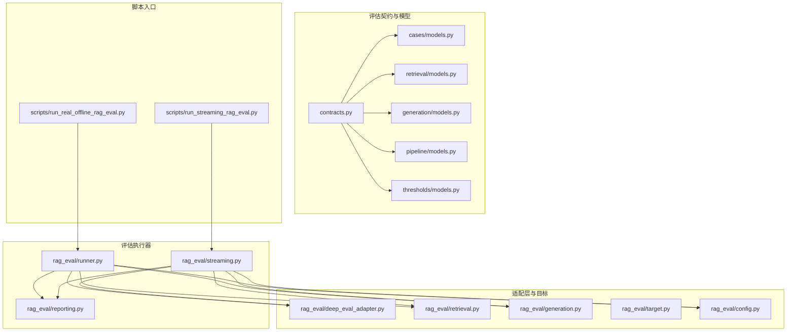
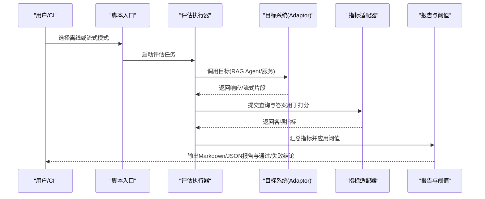
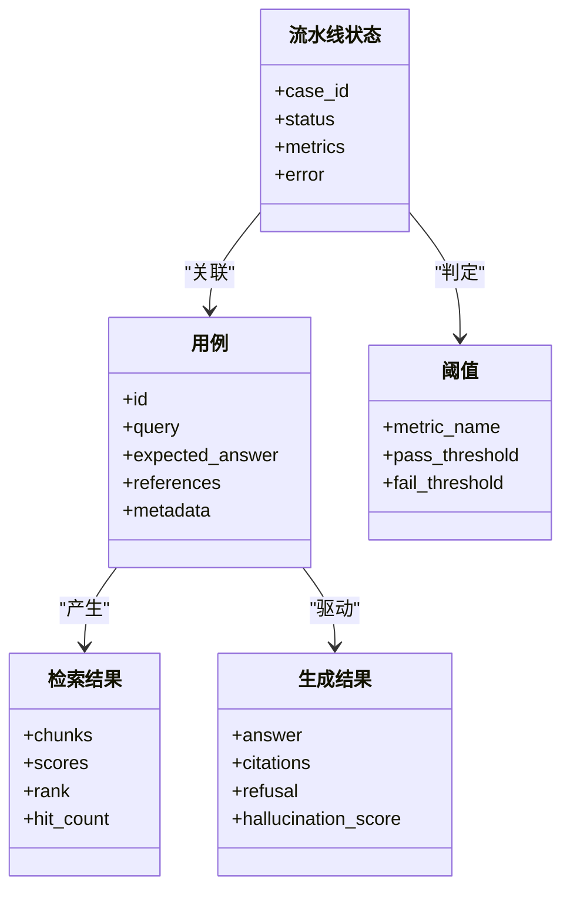
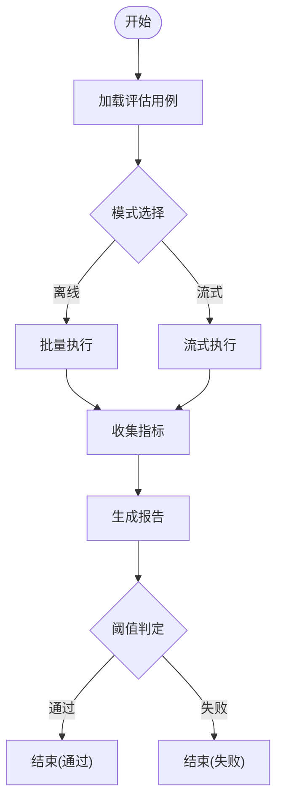
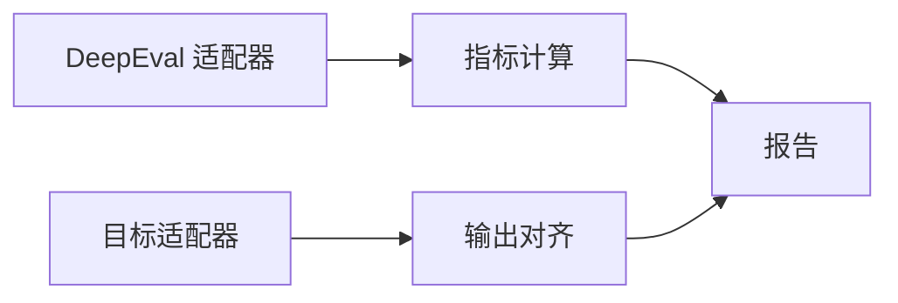
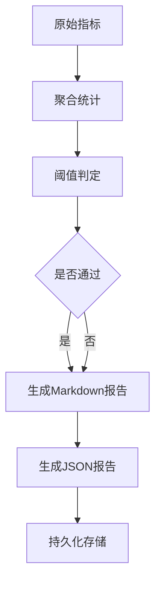
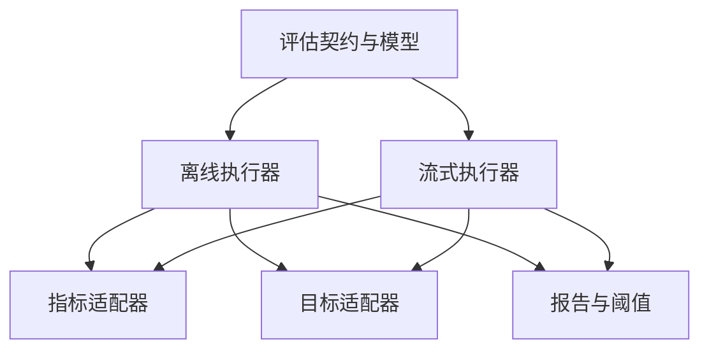

# RAG 评估框架

<cite>
**本文引用的文件**
- [src/fast_app/evaluation/contracts.py](file://src/fast_app/evaluation/contracts.py)
- [src/fast_app/evaluation/cases/models.py](file://src/fast_app/evaluation/cases/models.py)
- [src/fast_app/evaluation/retrieval/models.py](file://src/fast_app/evaluation/retrieval/models.py)
- [src/fast_app/evaluation/generation/models.py](file://src/fast_app/evaluation/generation/models.py)
- [src/fast_app/evaluation/pipeline/models.py](file://src/fast_app/evaluation/pipeline/models.py)
- [src/fast_app/evaluation/thresholds/models.py](file://src/fast_app/evaluation/thresholds/models.py)
- [src/fast_app/rag_eval/config.py](file://src/fast_app/rag_eval/config.py)
- [src/fast_app/rag_eval/runner.py](file://src/fast_app/rag_eval/runner.py)
- [src/fast_app/rag_eval/streaming.py](file://src/fast_app/rag_eval/streaming.py)
- [src/fast_app/rag_eval/reporting.py](file://src/fast_app/rag_eval/reporting.py)
- [src/fast_app/rag_eval/deep_eval_adapter.py](file://src/fast_app/rag_eval/deep_eval_adapter.py)
- [src/fast_app/rag_eval/retrieval.py](file://src/fast_app/rag_eval/retrieval.py)
- [src/fast_app/rag_eval/generation.py](file://src/fast_app/rag_eval/generation.py)
- [src/fast_app/rag_eval/target.py](file://src/fast_app/rag_eval/target.py)
- [scripts/run_real_offline_rag_eval.py](file://scripts/run_real_offline_rag_eval.py)
- [scripts/run_streaming_rag_eval.py](file://scripts/run_streaming_rag_eval.py)
- [reports/eval-dataset-v2.1.0-review.md](file://reports/eval-dataset-v2.1.0-review.md)
- [learning-docs/phase-11/11-1-RAG Eval基础概念：检索评测 vs 生成评测.md](file://learning-docs/phase-11/11-1-RAG Eval基础概念：检索评测 vs 生成评测.md)
- [learning-docs/phase-11/11-7-生成指标：是否引用来源、是否编造、是否拒答.md](file://learning-docs/phase-11/11-7-生成指标：是否引用来源、是否编造、是否拒答.md)
- [learning-docs/phase-11/11-8-离线评测脚本：批量请求pipeline.md](file://learning-docs/phase-11/11-8-离线评测脚本：批量请求pipeline.md)
- [learning-docs/phase-11/11-9-回归报告：Markdown和JSON输出.md](file://learning-docs/phase-11/11-9-回归报告：Markdown和JSON输出.md)
</cite>

## 目录
1. [简介](#简介)
2. [项目结构](#项目结构)
3. [核心组件](#核心组件)
4. [架构总览](#架构总览)
5. [详细组件分析](#详细组件分析)
6. [依赖关系分析](#依赖关系分析)
7. [性能考量](#性能考量)
8. [故障排查指南](#故障排查指南)
9. [结论](#结论)
10. [附录](#附录)

## 简介
本文件面向“RAG 评估框架”的完整体系，覆盖检索评估与生成评估两大维度，系统性说明评估数据集管理、评估指标定义、评估流水线执行与报告生成机制。文档同时给出如何配置不同评估场景（向量检索、关键词检索、混合检索）、运行离线评估与流式评估的方法，并提供结果分析、性能基准对比、质量门控策略以及自定义指标开发、数据集构建与回归测试集管理的实践指南。

## 项目结构
仓库围绕“评估契约与模型”“评估执行器”“适配器与目标”“报告与阈值”“脚本入口”等模块组织，形成从数据到指标的端到端评测链路。

图表来源
- [src/fast_app/evaluation/contracts.py](file://src/fast_app/evaluation/contracts.py)
- [src/fast_app/evaluation/cases/models.py](file://src/fast_app/evaluation/cases/models.py)
- [src/fast_app/evaluation/retrieval/models.py](file://src/fast_app/evaluation/retrieval/models.py)
- [src/fast_app/evaluation/generation/models.py](file://src/fast_app/evaluation/generation/models.py)
- [src/fast_app/evaluation/pipeline/models.py](file://src/fast_app/evaluation/pipeline/models.py)
- [src/fast_app/evaluation/thresholds/models.py](file://src/fast_app/evaluation/thresholds/models.py)
- [src/fast_app/rag_eval/runner.py](file://src/fast_app/rag_eval/runner.py)
- [src/fast_app/rag_eval/streaming.py](file://src/fast_app/rag_eval/streaming.py)
- [src/fast_app/rag_eval/reporting.py](file://src/fast_app/rag_eval/reporting.py)
- [src/fast_app/rag_eval/deep_eval_adapter.py](file://src/fast_app/rag_eval/deep_eval_adapter.py)
- [src/fast_app/rag_eval/retrieval.py](file://src/fast_app/rag_eval/retrieval.py)
- [src/fast_app/rag_eval/generation.py](file://src/fast_app/rag_eval/generation.py)
- [src/fast_app/rag_eval/target.py](file://src/fast_app/rag_eval/target.py)
- [src/fast_app/rag_eval/config.py](file://src/fast_app/rag_eval/config.py)
- [scripts/run_real_offline_rag_eval.py](file://scripts/run_real_offline_rag_eval.py)
- [scripts/run_streaming_rag_eval.py](file://scripts/run_streaming_rag_eval.py)

章节来源
- [src/fast_app/evaluation/contracts.py](file://src/fast_app/evaluation/contracts.py)
- [src/fast_app/evaluation/cases/models.py](file://src/fast_app/evaluation/cases/models.py)
- [src/fast_app/evaluation/retrieval/models.py](file://src/fast_app/evaluation/retrieval/models.py)
- [src/fast_app/evaluation/generation/models.py](file://src/fast_app/evaluation/generation/models.py)
- [src/fast_app/evaluation/pipeline/models.py](file://src/fast_app/evaluation/pipeline/models.py)
- [src/fast_app/evaluation/thresholds/models.py](file://src/fast_app/evaluation/thresholds/models.py)
- [src/fast_app/rag_eval/runner.py](file://src/fast_app/rag_eval/runner.py)
- [src/fast_app/rag_eval/streaming.py](file://src/fast_app/rag_eval/streaming.py)
- [src/fast_app/rag_eval/reporting.py](file://src/fast_app/rag_eval/reporting.py)
- [src/fast_app/rag_eval/deep_eval_adapter.py](file://src/fast_app/rag_eval/deep_eval_adapter.py)
- [src/fast_app/rag_eval/retrieval.py](file://src/fast_app/rag_eval/retrieval.py)
- [src/fast_app/rag_eval/generation.py](file://src/fast_app/rag_eval/generation.py)
- [src/fast_app/rag_eval/target.py](file://src/fast_app/rag_eval/target.py)
- [src/fast_app/rag_eval/config.py](file://src/fast_app/rag_eval/config.py)
- [scripts/run_real_offline_rag_eval.py](file://scripts/run_real_offline_rag_eval.py)
- [scripts/run_streaming_rag_eval.py](file://scripts/run_streaming_rag_eval.py)

## 核心组件
- 评估契约与数据模型：统一描述用例、检索结果、生成结果、流水线状态与阈值判定规则，保证评估过程可序列化、可比较、可回溯。
- 评估执行器：提供离线批处理与流式两种执行模式，负责调度适配器、收集指标、写入报告。
- 适配器与目标：对接外部评测能力（如 DeepEval）与目标系统（如 RAG Agent），屏蔽差异，统一输入输出。
- 报告与阈值：将原始指标聚合为可读报告，并基于阈值进行通过/失败判定，支撑质量门控。
- 配置：集中管理评估场景参数（检索策略、并发、超时、重试、目标地址等）。

章节来源
- [src/fast_app/evaluation/contracts.py](file://src/fast_app/evaluation/contracts.py)
- [src/fast_app/evaluation/cases/models.py](file://src/fast_app/evaluation/cases/models.py)
- [src/fast_app/evaluation/retrieval/models.py](file://src/fast_app/evaluation/retrieval/models.py)
- [src/fast_app/evaluation/generation/models.py](file://src/fast_app/evaluation/generation/models.py)
- [src/fast_app/evaluation/pipeline/models.py](file://src/fast_app/evaluation/pipeline/models.py)
- [src/fast_app/evaluation/thresholds/models.py](file://src/fast_app/evaluation/thresholds/models.py)
- [src/fast_app/rag_eval/config.py](file://src/fast_app/rag_eval/config.py)

## 架构总览
下图展示从“评估用例”到“指标计算”再到“报告与门控”的整体流程，涵盖离线与流式两条路径。

图表来源
- [scripts/run_real_offline_rag_eval.py](file://scripts/run_real_offline_rag_eval.py)
- [scripts/run_streaming_rag_eval.py](file://scripts/run_streaming_rag_eval.py)
- [src/fast_app/rag_eval/runner.py](file://src/fast_app/rag_eval/runner.py)
- [src/fast_app/rag_eval/streaming.py](file://src/fast_app/rag_eval/streaming.py)
- [src/fast_app/rag_eval/deep_eval_adapter.py](file://src/fast_app/rag_eval/deep_eval_adapter.py)
- [src/fast_app/rag_eval/reporting.py](file://src/fast_app/rag_eval/reporting.py)

## 详细组件分析

### 评估契约与数据模型
- 用例模型：承载问题、期望答案、参考来源、元数据等，便于版本化管理与回归对比。
- 检索模型：记录候选片段、分数、排序、命中情况等，支撑召回率、精确率等指标。
- 生成模型：记录生成文本、引用来源、拒答标记、幻觉检测等，支撑忠实度、相关性等指标。
- 流水线模型：封装一次评估任务的上下文、中间态与最终结果，支持断点续跑与审计。
- 阈值模型：定义各指标的通过线，支持按场景/版本差异化配置。

图表来源
- [src/fast_app/evaluation/cases/models.py](file://src/fast_app/evaluation/cases/models.py)
- [src/fast_app/evaluation/retrieval/models.py](file://src/fast_app/evaluation/retrieval/models.py)
- [src/fast_app/evaluation/generation/models.py](file://src/fast_app/evaluation/generation/models.py)
- [src/fast_app/evaluation/pipeline/models.py](file://src/fast_app/evaluation/pipeline/models.py)
- [src/fast_app/evaluation/thresholds/models.py](file://src/fast_app/evaluation/thresholds/models.py)

章节来源
- [src/fast_app/evaluation/cases/models.py](file://src/fast_app/evaluation/cases/models.py)
- [src/fast_app/evaluation/retrieval/models.py](file://src/fast_app/evaluation/retrieval/models.py)
- [src/fast_app/evaluation/generation/models.py](file://src/fast_app/evaluation/generation/models.py)
- [src/fast_app/evaluation/pipeline/models.py](file://src/fast_app/evaluation/pipeline/models.py)
- [src/fast_app/evaluation/thresholds/models.py](file://src/fast_app/evaluation/thresholds/models.py)

### 评估执行器（离线与流式）
- 离线执行器：批量加载用例，顺序或并行调用目标，收集指标并落盘报告。
- 流式执行器：以事件驱动方式消费目标流式输出，边收边算，降低内存峰值并提升交互性。
- 两者共享指标适配器与报告模块，确保一致性。

图表来源
- [src/fast_app/rag_eval/runner.py](file://src/fast_app/rag_eval/runner.py)
- [src/fast_app/rag_eval/streaming.py](file://src/fast_app/rag_eval/streaming.py)
- [src/fast_app/rag_eval/reporting.py](file://src/fast_app/rag_eval/reporting.py)

章节来源
- [src/fast_app/rag_eval/runner.py](file://src/fast_app/rag_eval/runner.py)
- [src/fast_app/rag_eval/streaming.py](file://src/fast_app/rag_eval/streaming.py)
- [src/fast_app/rag_eval/reporting.py](file://src/fast_app/rag_eval/reporting.py)

### 指标适配器与目标
- 指标适配器：封装对第三方评测库（如 DeepEval）的调用，统一输入输出格式，屏蔽差异。
- 目标适配：将评估框架的请求映射到 RAG Agent/服务接口，支持同步与流式两种协议。
- 检索指标：包括命中率、Top-K 精确率、NDCG 等；生成指标：包括相关性、忠实度、幻觉、拒答等。

图表来源
- [src/fast_app/rag_eval/deep_eval_adapter.py](file://src/fast_app/rag_eval/deep_eval_adapter.py)
- [src/fast_app/rag_eval/target.py](file://src/fast_app/rag_eval/target.py)
- [src/fast_app/rag_eval/retrieval.py](file://src/fast_app/rag_eval/retrieval.py)
- [src/fast_app/rag_eval/generation.py](file://src/fast_app/rag_eval/generation.py)

章节来源
- [src/fast_app/rag_eval/deep_eval_adapter.py](file://src/fast_app/rag_eval/deep_eval_adapter.py)
- [src/fast_app/rag_eval/target.py](file://src/fast_app/rag_eval/target.py)
- [src/fast_app/rag_eval/retrieval.py](file://src/fast_app/rag_eval/retrieval.py)
- [src/fast_app/rag_eval/generation.py](file://src/fast_app/rag_eval/generation.py)

### 报告与阈值
- 报告：输出 Markdown 与 JSON 双格式，包含用例级明细、指标汇总、失败归因、时间戳与版本信息。
- 阈值：按指标名配置通过/失败线，支持多场景与多版本并存，便于回归门禁。

图表来源
- [src/fast_app/rag_eval/reporting.py](file://src/fast_app/rag_eval/reporting.py)
- [src/fast_app/evaluation/thresholds/models.py](file://src/fast_app/evaluation/thresholds/models.py)

章节来源
- [src/fast_app/rag_eval/reporting.py](file://src/fast_app/rag_eval/reporting.py)
- [src/fast_app/evaluation/thresholds/models.py](file://src/fast_app/evaluation/thresholds/models.py)

### 配置与场景切换
- 配置项：目标地址、并发数、超时、重试、检索策略（向量/关键词/混合）、重排开关、指标开关、阈值文件路径等。
- 场景切换：通过配置文件或命令行参数切换不同检索策略与评测范围，实现同一套代码的多环境复用。

章节来源
- [src/fast_app/rag_eval/config.py](file://src/fast_app/rag_eval/config.py)

### 脚本入口：离线与流式
- 离线脚本：读取用例，批量执行，生成报告，常用于 CI 回归。
- 流式脚本：以流式方式消费目标输出，实时打印进度与指标，适合交互式调试与长耗时任务。

章节来源
- [scripts/run_real_offline_rag_eval.py](file://scripts/run_real_offline_rag_eval.py)
- [scripts/run_streaming_rag_eval.py](file://scripts/run_streaming_rag_eval.py)

## 依赖关系分析
- 低耦合：契约与模型独立于执行器，便于替换指标适配器与目标系统。
- 可扩展：新增指标只需实现适配器并与报告模块对接；新增检索策略仅需扩展配置与目标适配。
- 外部依赖：DeepEval 作为可选评测后端；RAG Agent/服务作为被测目标。

图表来源
- [src/fast_app/evaluation/contracts.py](file://src/fast_app/evaluation/contracts.py)
- [src/fast_app/rag_eval/runner.py](file://src/fast_app/rag_eval/runner.py)
- [src/fast_app/rag_eval/streaming.py](file://src/fast_app/rag_eval/streaming.py)
- [src/fast_app/rag_eval/deep_eval_adapter.py](file://src/fast_app/rag_eval/deep_eval_adapter.py)
- [src/fast_app/rag_eval/target.py](file://src/fast_app/rag_eval/target.py)
- [src/fast_app/rag_eval/reporting.py](file://src/fast_app/rag_eval/reporting.py)

章节来源
- [src/fast_app/evaluation/contracts.py](file://src/fast_app/evaluation/contracts.py)
- [src/fast_app/rag_eval/runner.py](file://src/fast_app/rag_eval/runner.py)
- [src/fast_app/rag_eval/streaming.py](file://src/fast_app/rag_eval/streaming.py)
- [src/fast_app/rag_eval/deep_eval_adapter.py](file://src/fast_app/rag_eval/deep_eval_adapter.py)
- [src/fast_app/rag_eval/target.py](file://src/fast_app/rag_eval/target.py)
- [src/fast_app/rag_eval/reporting.py](file://src/fast_app/rag_eval/reporting.py)

## 性能考量
- 并发与限流：合理设置并发与速率限制，避免压垮目标服务或外部评测 API。
- 缓存与去重：对相同 query 的结果进行缓存，减少重复计算。
- 流式优先：长时任务使用流式模式，降低内存占用并提升可观测性。
- 指标选择性：按需启用指标，减少不必要的外部调用。
- 资源隔离：在 CI 中为评估任务分配独立资源，避免与其他任务争抢。

[本节为通用指导，不直接分析具体文件]

## 故障排查指南
- 目标不可达：检查目标地址、网络连通性与鉴权配置。
- 指标异常：核对指标适配器配置与输入格式，确认第三方评测服务可用。
- 报告缺失：确认报告输出路径权限与磁盘空间。
- 阈值误判：复核阈值文件与当前版本匹配性，必要时调整阈值或升级用例。
- 流式中断：关注超时与重试策略，必要时降级为离线模式。

章节来源
- [src/fast_app/rag_eval/config.py](file://src/fast_app/rag_eval/config.py)
- [src/fast_app/rag_eval/reporting.py](file://src/fast_app/rag_eval/reporting.py)
- [src/fast_app/evaluation/thresholds/models.py](file://src/fast_app/evaluation/thresholds/models.py)

## 结论
本框架以“契约+模型”为核心，结合离线与流式两种执行模式，打通了从用例到指标再到报告与门控的闭环。通过可插拔的指标适配器与目标适配，能够灵活支持向量检索、关键词检索与混合检索等多种场景，满足持续集成中的质量门控需求。配合完善的报告与阈值体系，可实现稳定的回归测试与质量度量。

[本节为总结性内容，不直接分析具体文件]

## 附录

### 评估指标定义与解读
- 检索指标：命中率、Top-K 精确率、NDCG 等，衡量召回与排序质量。
- 生成指标：相关性、忠实度、幻觉、拒答等，衡量答案质量与安全性。
- 综合指标：加权平均或分档统计，便于跨场景对比。

章节来源
- [learning-docs/phase-11/11-1-RAG Eval基础概念：检索评测 vs 生成评测.md](file://learning-docs/phase-11/11-1-RAG Eval基础概念：检索评测 vs 生成评测.md)
- [learning-docs/phase-11/11-7-生成指标：是否引用来源、是否编造、是否拒答.md](file://learning-docs/phase-11/11-7-生成指标：是否引用来源、是否编造、是否拒答.md)

### 评估数据集管理与版本化
- 数据集结构：用例 ID、问题、期望答案、参考来源、元数据。
- 版本管理：按版本号归档，支持回滚与对比。
- 构建流程：从业务数据抽取、标注、校验到入库的标准化流程。

章节来源
- [reports/eval-dataset-v2.1.0-review.md](file://reports/eval-dataset-v2.1.0-review.md)
- [src/fast_app/evaluation/cases/models.py](file://src/fast_app/evaluation/cases/models.py)

### 评估流水线执行与报告生成
- 离线流水线：批量加载、顺序/并行执行、指标聚合、报告输出。
- 流式流水线：事件驱动、边收边算、实时反馈。
- 报告格式：Markdown 与 JSON 双输出，便于人类阅读与机器解析。

章节来源
- [learning-docs/phase-11/11-8-离线评测脚本：批量请求pipeline.md](file://learning-docs/phase-11/11-8-离线评测脚本：批量请求pipeline.md)
- [learning-docs/phase-11/11-9-回归报告：Markdown和JSON输出.md](file://learning-docs/phase-11/11-9-回归报告：Markdown和JSON输出.md)
- [src/fast_app/rag_eval/runner.py](file://src/fast_app/rag_eval/runner.py)
- [src/fast_app/rag_eval/streaming.py](file://src/fast_app/rag_eval/streaming.py)
- [src/fast_app/rag_eval/reporting.py](file://src/fast_app/rag_eval/reporting.py)

### 场景配置：向量检索、关键词检索、混合检索
- 向量检索：基于嵌入向量的相似度检索，适用于语义匹配。
- 关键词检索：基于倒排索引的关键词匹配，适用于精确术语。
- 混合检索：融合向量与关键词结果，通常结合重排策略提升效果。
- 配置要点：检索策略、权重、重排开关、Top-K、超时与重试。

章节来源
- [src/fast_app/rag_eval/config.py](file://src/fast_app/rag_eval/config.py)

### 运行离线评估与流式评估
- 离线评估：适合 CI 回归，稳定、可复现、易对比。
- 流式评估：适合调试与长时任务，实时可见、内存友好。
- 脚本入口：分别提供离线与流式脚本，便于一键运行。

章节来源
- [scripts/run_real_offline_rag_eval.py](file://scripts/run_real_offline_rag_eval.py)
- [scripts/run_streaming_rag_eval.py](file://scripts/run_streaming_rag_eval.py)

### 结果分析与质量门控
- 结果分析：关注指标趋势、失败用例分布、回归波动。
- 质量门控：基于阈值的自动通过/失败判定，阻断不合格变更。
- 基线对比：与历史基线对比，识别退化与改进。

章节来源
- [src/fast_app/evaluation/thresholds/models.py](file://src/fast_app/evaluation/thresholds/models.py)
- [src/fast_app/rag_eval/reporting.py](file://src/fast_app/rag_eval/reporting.py)

### 自定义评估指标开发与回归测试集管理
- 自定义指标：实现指标适配器，注册到评估管线，参与报告与阈值判定。
- 数据集构建：遵循用例模型规范，确保字段完整与可追溯。
- 回归测试集：按版本维护最小必要集，覆盖关键场景与边界条件。

章节来源
- [src/fast_app/evaluation/contracts.py](file://src/fast_app/evaluation/contracts.py)
- [src/fast_app/evaluation/cases/models.py](file://src/fast_app/evaluation/cases/models.py)
- [src/fast_app/evaluation/generation/models.py](file://src/fast_app/evaluation/generation/models.py)
- [src/fast_app/evaluation/retrieval/models.py](file://src/fast_app/evaluation/retrieval/models.py)