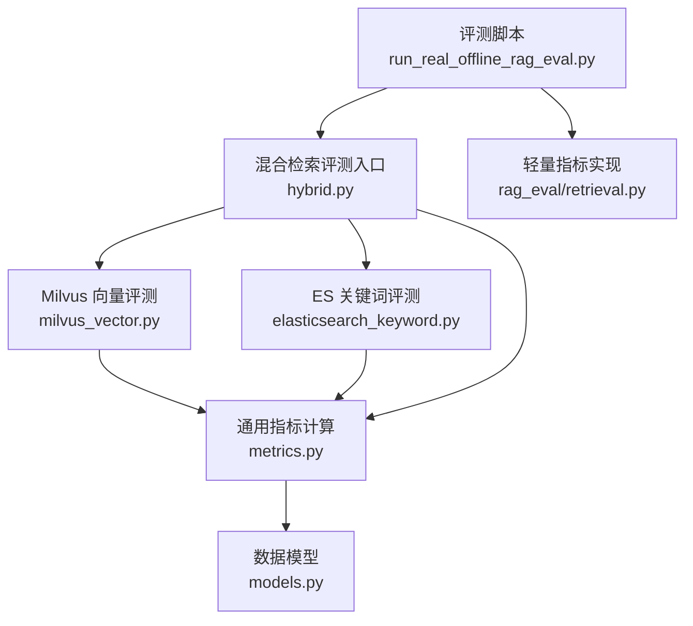
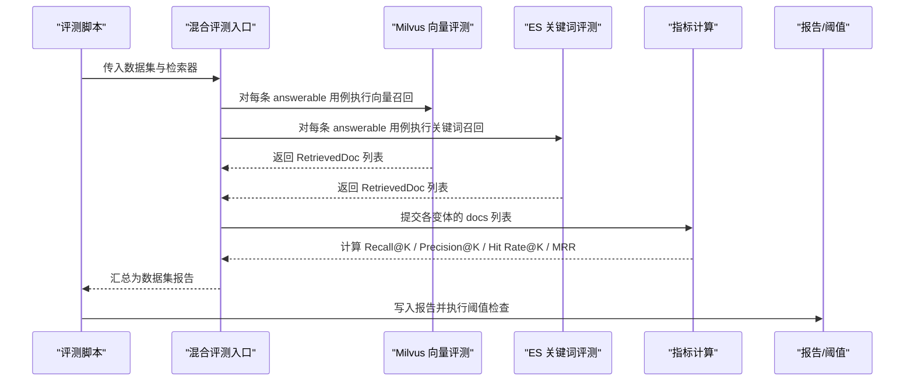
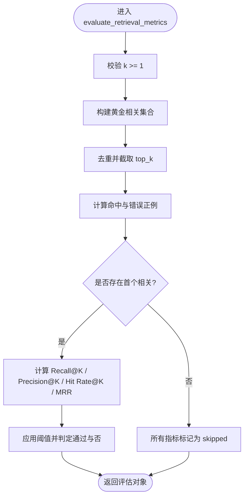
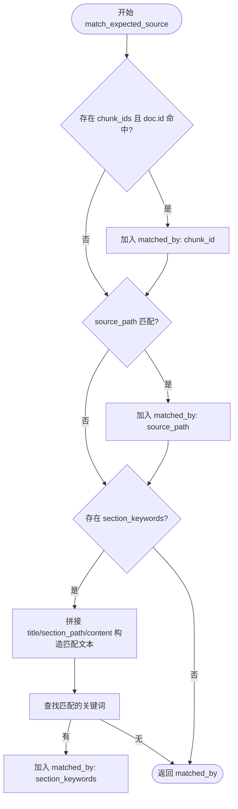
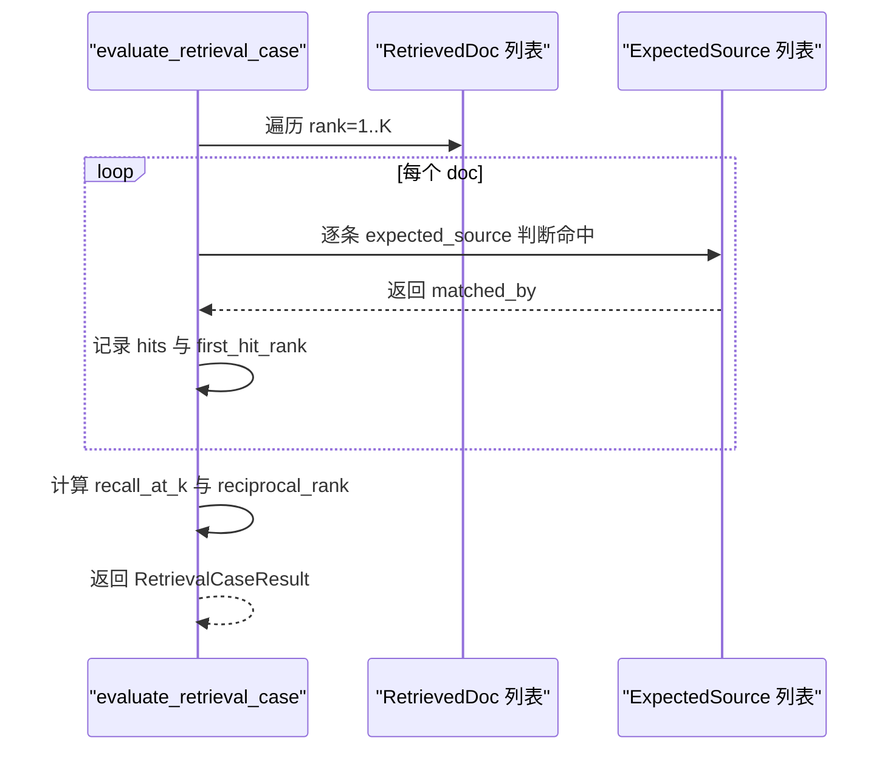
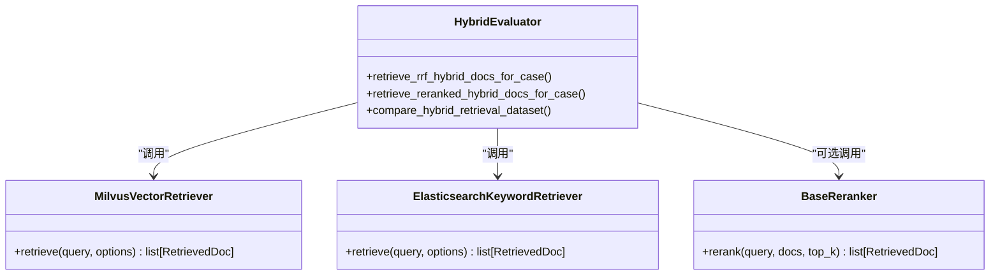
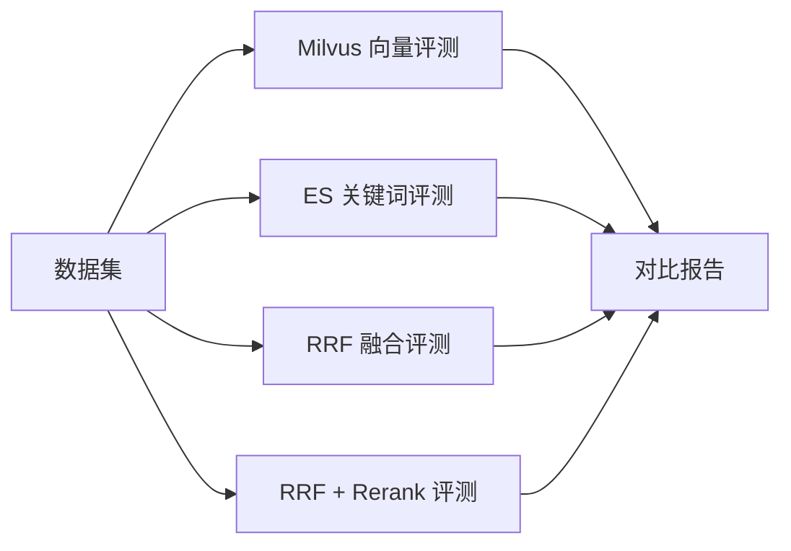
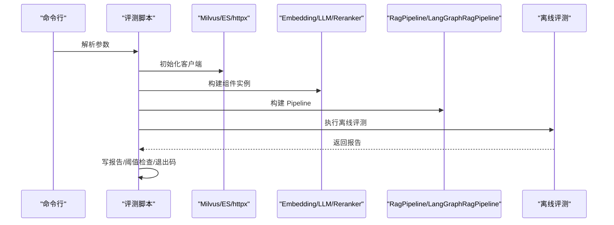
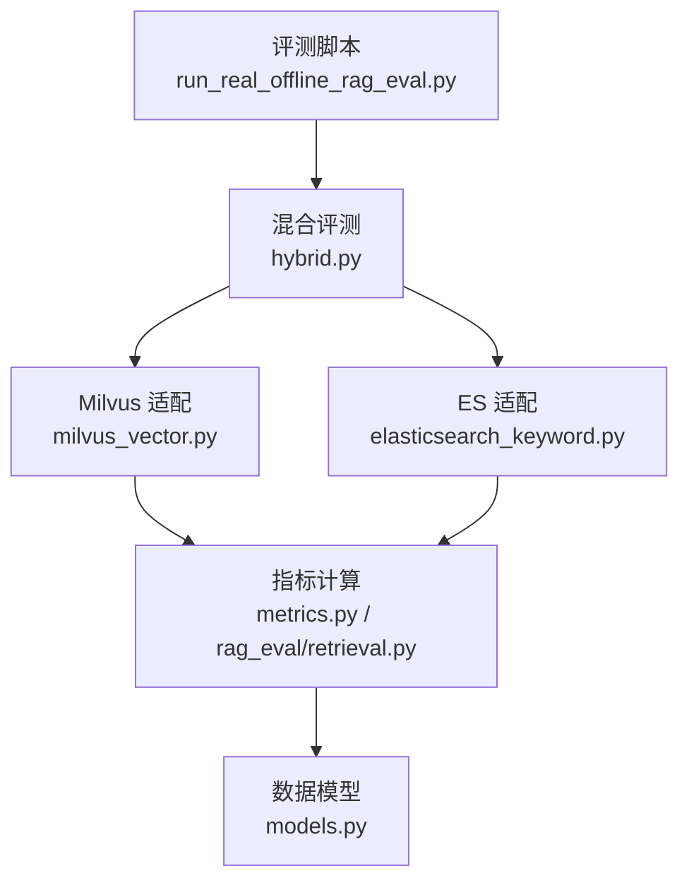

# 检索评估指标

<cite>
**本文引用的文件**
- [src/fast_app/evaluation/retrieval/metrics.py](file://src/fast_app/evaluation/retrieval/metrics.py)
- [src/fast_app/rag_eval/retrieval.py](file://src/fast_app/rag_eval/retrieval.py)
- [src/fast_app/evaluation/retrieval/models.py](file://src/fast_app/evaluation/retrieval/models.py)
- [src/fast_app/evaluation/retrieval/hybrid.py](file://src/fast_app/evaluation/retrieval/hybrid.py)
- [src/fast_app/evaluation/retrieval/milvus_vector.py](file://src/fast_app/evaluation/retrieval/milvus_vector.py)
- [src/fast_app/evaluation/retrieval/elasticsearch_keyword.py](file://src/fast_app/evaluation/retrieval/elasticsearch_keyword.py)
- [scripts/run_real_offline_rag_eval.py](file://scripts/run_real_offline_rag_eval.py)
</cite>

## 目录
1. [简介](#简介)
2. [项目结构](#项目结构)
3. [核心组件](#核心组件)
4. [架构总览](#架构总览)
5. [详细组件分析](#详细组件分析)
6. [依赖关系分析](#依赖关系分析)
7. [性能考量](#性能考量)
8. [故障排查指南](#故障排查指南)
9. [结论](#结论)
10. [附录](#附录)

## 简介
本文件系统化梳理本项目中“检索评估指标”的设计与实现，覆盖向量检索、关键词检索和混合检索（RRF 融合与 Rerank）的评测体系。重点包括：
- 指标定义与计算：Recall@K、Precision@K、Hit Rate@K、MRR 等
- 评估模型与数据契约：逻辑子块 ID、命中判定规则、阈值配置
- 对比分析框架：四种检索变体在同一数据集上的公平比较
- 基准测试配置：如何切换检索器、LLM、Embedding、Reranker 并运行离线评测
- 自定义指标扩展点与结果解读方法
- 相关性判断、阈值设置与性能优化建议

## 项目结构
检索评估相关代码主要分布在以下模块：
- 指标计算：独立于具体检索器的通用指标函数
- 检索适配层：Milvus 向量检索、ES 关键词检索、RRF 融合与 Rerank 后评测
- 数据模型：评测输入、命中记录、单例与数据集报告
- 评测脚本：组装检索器与 Pipeline，执行离线评测并输出报告

图表来源
- [scripts/run_real_offline_rag_eval.py:208-337](file://scripts/run_real_offline_rag_eval.py#L208-L337)
- [src/fast_app/evaluation/retrieval/hybrid.py:131-191](file://src/fast_app/evaluation/retrieval/hybrid.py#L131-L191)
- [src/fast_app/evaluation/retrieval/milvus_vector.py:72-97](file://src/fast_app/evaluation/retrieval/milvus_vector.py#L72-L97)
- [src/fast_app/evaluation/retrieval/elasticsearch_keyword.py:54-79](file://src/fast_app/evaluation/retrieval/elasticsearch_keyword.py#L54-L79)
- [src/fast_app/evaluation/retrieval/metrics.py:95-239](file://src/fast_app/evaluation/retrieval/metrics.py#L95-L239)
- [src/fast_app/rag_eval/retrieval.py:64-124](file://src/fast_app/rag_eval/retrieval.py#L64-L124)
- [src/fast_app/evaluation/retrieval/models.py:10-104](file://src/fast_app/evaluation/retrieval/models.py#L10-L104)

章节来源
- [scripts/run_real_offline_rag_eval.py:43-118](file://scripts/run_real_offline_rag_eval.py#L43-L118)
- [src/fast_app/evaluation/retrieval/hybrid.py:25-128](file://src/fast_app/evaluation/retrieval/hybrid.py#L25-L128)
- [src/fast_app/evaluation/retrieval/milvus_vector.py:14-48](file://src/fast_app/evaluation/retrieval/milvus_vector.py#L14-L48)
- [src/fast_app/evaluation/retrieval/elasticsearch_keyword.py:17-30](file://src/fast_app/evaluation/retrieval/elasticsearch_keyword.py#L17-L30)
- [src/fast_app/evaluation/retrieval/metrics.py:12-92](file://src/fast_app/evaluation/retrieval/metrics.py#L12-L92)
- [src/fast_app/rag_eval/retrieval.py:14-22](file://src/fast_app/rag_eval/retrieval.py#L14-L22)
- [src/fast_app/evaluation/retrieval/models.py:10-104](file://src/fast_app/evaluation/retrieval/models.py#L10-L104)

## 核心组件
- 指标计算引擎
  - 基于逻辑子块 ID 的四个检索指标：Recall@K、Precision@K、Hit Rate@K、MRR
  - 支持按 case 维度跳过 no-answer 样例，避免误判
  - 默认阈值与通过判定封装
- 检索适配层
  - Milvus 向量召回：将评测用例转换为检索选项，截取 top_k 保证 K 一致
  - ES 关键词召回：同上，统一接口
  - 混合检索：先分别召回，再 RRF 融合；可选 rerank 后再评测
- 数据模型
  - RetrievalMetricInput：校验 requested_k、去重计数、underfilled 标记
  - RetrievalHit / RetrievalCaseResult / RetrievalDatasetReport：命中明细与聚合报告
- 评测脚本
  - 构建 Embedding/LLM/Reranker/检索器，选择 Classic/LangGraph Pipeline
  - 执行离线评测、写报告、阈值检查、退出码控制

章节来源
- [src/fast_app/rag_eval/retrieval.py:64-124](file://src/fast_app/rag_eval/retrieval.py#L64-L124)
- [src/fast_app/evaluation/retrieval/milvus_vector.py:14-48](file://src/fast_app/evaluation/retrieval/milvus_vector.py#L14-L48)
- [src/fast_app/evaluation/retrieval/elasticsearch_keyword.py:17-30](file://src/fast_app/evaluation/retrieval/elasticsearch_keyword.py#L17-L30)
- [src/fast_app/evaluation/retrieval/hybrid.py:25-128](file://src/fast_app/evaluation/retrieval/hybrid.py#L25-L128)
- [src/fast_app/evaluation/retrieval/models.py:10-104](file://src/fast_app/evaluation/retrieval/models.py#L10-L104)
- [scripts/run_real_offline_rag_eval.py:129-234](file://scripts/run_real_offline_rag_eval.py#L129-L234)

## 架构总览
下图展示从评测脚本到检索器、再到指标计算的调用链路与数据流。

图表来源
- [scripts/run_real_offline_rag_eval.py:268-337](file://scripts/run_real_offline_rag_eval.py#L268-L337)
- [src/fast_app/evaluation/retrieval/hybrid.py:131-191](file://src/fast_app/evaluation/retrieval/hybrid.py#L131-L191)
- [src/fast_app/evaluation/retrieval/milvus_vector.py:72-97](file://src/fast_app/evaluation/retrieval/milvus_vector.py#L72-L97)
- [src/fast_app/evaluation/retrieval/elasticsearch_keyword.py:54-79](file://src/fast_app/evaluation/retrieval/elasticsearch_keyword.py#L54-L79)
- [src/fast_app/evaluation/retrieval/metrics.py:185-239](file://src/fast_app/evaluation/retrieval/metrics.py#L185-L239)

## 详细组件分析

### 指标计算与阈值管理
- 指标集合与默认阈值
  - 指标名：retrieval_recall_at_k、retrieval_precision_at_k、retrieval_hit_rate_at_k、retrieval_mrr
  - 默认阈值：所有检索指标默认阈值为 0.5，可通过参数覆盖
- 单用例指标计算流程
  - 输入：相关逻辑子块 ID 集合、排序后的候选逻辑子块 ID 列表、top_k、是否可回答
  - 去重与截断：对候选进行去重并按 k 截断
  - 匹配与统计：计算命中数、错误正例、首个相关位置
  - 指标：
    - Recall@K = 命中数 / 黄金相关数
    - Precision@K = 命中数 / min(k, 返回数)
    - Hit Rate@K = 命中数 > 0 ? 1 : 0
    - MRR = 1 / 首个相关位置（无则为 0）
  - 阈值判定：score >= threshold 则 passed，否则失败
- 跳过策略
  - 若无可回答或无黄金相关逻辑子块，则全部指标置为 skipped

图表来源
- [src/fast_app/rag_eval/retrieval.py:64-124](file://src/fast_app/rag_eval/retrieval.py#L64-L124)

章节来源
- [src/fast_app/rag_eval/retrieval.py:14-22](file://src/fast_app/rag_eval/retrieval.py#L14-L22)
- [src/fast_app/rag_eval/retrieval.py:64-124](file://src/fast_app/rag_eval/retrieval.py#L64-L124)

### 相关性判断与命中规则
- 文档级命中判定
  - 严格模式：chunk_id 精确匹配
  - 宽松模式：source_path 匹配原始文档路径
  - 更宽松模式：section_keywords 在标题/路径/正文拼接文本中进行子串匹配
- 命中解释
  - 返回 matched_by 列表，便于报告解释为何命中
- 注意事项
  - 同时配置 source_path 与 chunk_ids 时，OR 逻辑可能放宽评测标准，需根据评测目标谨慎配置

图表来源
- [src/fast_app/evaluation/retrieval/metrics.py:27-92](file://src/fast_app/evaluation/retrieval/metrics.py#L27-L92)

章节来源
- [src/fast_app/evaluation/retrieval/metrics.py:27-92](file://src/fast_app/evaluation/retrieval/metrics.py#L27-L92)

### 单用例与数据集评测
- 单用例评测
  - 遍历检索结果，逐条判断命中，记录 first_hit_rank 与 hits
  - 计算 recall_at_k 与 reciprocal_rank
- 数据集评测
  - 仅对 answerable 用例计算指标，no_answer 跳过
  - 聚合 mean_recall_at_k 与 mean_mrr，统计通过/失败用例数

图表来源
- [src/fast_app/evaluation/retrieval/metrics.py:95-182](file://src/fast_app/evaluation/retrieval/metrics.py#L95-L182)

章节来源
- [src/fast_app/evaluation/retrieval/metrics.py:95-182](file://src/fast_app/evaluation/retrieval/metrics.py#L95-L182)
- [src/fast_app/evaluation/retrieval/metrics.py:185-239](file://src/fast_app/evaluation/retrieval/metrics.py#L185-L239)

### 检索器适配层
- Milvus 向量检索
  - 将 RagEvalCase 转换为 RetrievalOptions（包含 top_k、candidate_k、filters）
  - 调用 retriever.retrieve 后截取 top_k，确保指标中的 K 一致
- ES 关键词检索
  - 同样转换选项并截取 top_k
- 混合检索
  - RRF 融合：分别获取向量与关键词结果，使用 RRF 合并
  - Rerank 后评测：对 RRF 结果再次调用 reranker.rerank，得到最终排序

图表来源
- [src/fast_app/evaluation/retrieval/hybrid.py:25-73](file://src/fast_app/evaluation/retrieval/hybrid.py#L25-L73)
- [src/fast_app/evaluation/retrieval/milvus_vector.py:14-48](file://src/fast_app/evaluation/retrieval/milvus_vector.py#L14-L48)
- [src/fast_app/evaluation/retrieval/elasticsearch_keyword.py:17-30](file://src/fast_app/evaluation/retrieval/elasticsearch_keyword.py#L17-L30)

章节来源
- [src/fast_app/evaluation/retrieval/milvus_vector.py:14-48](file://src/fast_app/evaluation/retrieval/milvus_vector.py#L14-L48)
- [src/fast_app/evaluation/retrieval/elasticsearch_keyword.py:17-30](file://src/fast_app/evaluation/retrieval/elasticsearch_keyword.py#L17-L30)
- [src/fast_app/evaluation/retrieval/hybrid.py:25-128](file://src/fast_app/evaluation/retrieval/hybrid.py#L25-L128)

### 对比分析框架
- 四路对比：vector、keyword、rrf、rerank
- 同一数据集与相同 top_k，保证公平性
- 输出 HybridRetrievalComparisonReport，包含各变体的 RetrievalDatasetReport

图表来源
- [src/fast_app/evaluation/retrieval/hybrid.py:131-191](file://src/fast_app/evaluation/retrieval/hybrid.py#L131-L191)

章节来源
- [src/fast_app/evaluation/retrieval/hybrid.py:131-191](file://src/fast_app/evaluation/retrieval/hybrid.py#L131-L191)

### 评测脚本与基准测试配置
- 命令行参数
  - dataset：评测集 JSON 路径
  - output_dir：报告输出目录
  - pipeline_provider：classic 或 langgraph
  - llm_provider：qwen 或 mock
  - embedding_provider：mock 或 qwen
  - reranker_provider：mock 或 dashscope
  - use_es_auth：是否启用 ES basic_auth
  - print_json_summary：终端打印 JSON 摘要
  - min_retrieval_recall / min_retrieval_mrr / min_generation_pass_rate：阈值下限
  - fail_on_threshold：任一阈值失败则退出码为 1
- 运行时装配
  - 构建 MilvusClient、AsyncElasticsearch、httpx.AsyncClient
  - 构建 Embedding/LLM/Reranker 客户端
  - 构建 Vector/Keyword Retriever 与 Pipeline
  - 执行 run_offline_rag_eval，写报告，阈值检查

图表来源
- [scripts/run_real_offline_rag_eval.py:43-118](file://scripts/run_real_offline_rag_eval.py#L43-L118)
- [scripts/run_real_offline_rag_eval.py:129-234](file://scripts/run_real_offline_rag_eval.py#L129-L234)
- [scripts/run_real_offline_rag_eval.py:268-337](file://scripts/run_real_offline_rag_eval.py#L268-L337)

章节来源
- [scripts/run_real_offline_rag_eval.py:43-118](file://scripts/run_real_offline_rag_eval.py#L43-L118)
- [scripts/run_real_offline_rag_eval.py:129-234](file://scripts/run_real_offline_rag_eval.py#L129-L234)
- [scripts/run_real_offline_rag_eval.py:268-337](file://scripts/run_real_offline_rag_eval.py#L268-L337)

## 依赖关系分析
- 指标模块不依赖具体 IR 框架，仅依赖数据模型与领域模型
- 检索适配层依赖具体检索器与融合算法（RRF），并通过统一接口接入指标计算
- 评测脚本依赖外部服务客户端（Milvus、ES、httpx）与 LLM/Embedding/Reranker 抽象

图表来源
- [src/fast_app/evaluation/retrieval/metrics.py:185-239](file://src/fast_app/evaluation/retrieval/metrics.py#L185-L239)
- [src/fast_app/rag_eval/retrieval.py:64-124](file://src/fast_app/rag_eval/retrieval.py#L64-L124)
- [src/fast_app/evaluation/retrieval/milvus_vector.py:72-97](file://src/fast_app/evaluation/retrieval/milvus_vector.py#L72-L97)
- [src/fast_app/evaluation/retrieval/elasticsearch_keyword.py:54-79](file://src/fast_app/evaluation/retrieval/elasticsearch_keyword.py#L54-L79)
- [src/fast_app/evaluation/retrieval/hybrid.py:131-191](file://src/fast_app/evaluation/retrieval/hybrid.py#L131-L191)
- [scripts/run_real_offline_rag_eval.py:268-337](file://scripts/run_real_offline_rag_eval.py#L268-L337)

章节来源
- [src/fast_app/evaluation/retrieval/metrics.py:185-239](file://src/fast_app/evaluation/retrieval/metrics.py#L185-L239)
- [src/fast_app/rag_eval/retrieval.py:64-124](file://src/fast_app/rag_eval/retrieval.py#L64-L124)
- [src/fast_app/evaluation/retrieval/hybrid.py:131-191](file://src/fast_app/evaluation/retrieval/hybrid.py#L131-L191)
- [scripts/run_real_offline_rag_eval.py:268-337](file://scripts/run_real_offline_rag_eval.py#L268-L337)

## 性能考量
- 指标计算复杂度
  - 单用例指标：O(K) 去重与匹配，K 为 top_k
  - 数据集评测：O(N*K)，N 为用例数量
- 检索阶段优化建议
  - candidate_k 与 top_k 分离：底层检索可用更大 candidate_k 提升召回质量，上层再截取 top_k 保证指标一致性
  - 过滤条件：利用 source_path/section_path 缩小搜索空间，减少无关召回
  - RRF 融合：结合向量与关键词优势，通常能提升整体召回与排序质量
  - Rerank 后处理：在融合基础上进一步精排，但会增加延迟与成本
- 资源与并发
  - 外部服务客户端（Milvus、ES、httpx）应复用连接，合理设置超时与重试
  - 评测脚本中注意异步客户端生命周期管理，避免资源泄漏

## 故障排查指南
- 常见错误与定位
  - k < 1：指标计算会抛出异常，需检查评测用例的 top_k 配置
  - retrieved_logical_chunk_ids 为空或重复：数据模型会在构造时校验并报错
  - ES basic_auth 非 ASCII：脚本会拒绝启动，需修正凭据
  - 未提供必要环境变量：如 ELASTICSEARCH_USERNAME/PASSWORD 为空时会报错
- 诊断步骤
  - 确认评测集 JSON 路径正确，case_type 为 answerable 的用例具备 expected_sources
  - 检查检索器配置（Milvus/ES）与 embedding 维度一致
  - 查看报告中的 skipped_case_count 与 evaluated_case_count，确认 no_answer 用例被正确跳过
  - 使用 --print-json-summary 快速查看关键指标与路径

章节来源
- [src/fast_app/rag_eval/retrieval.py:74-76](file://src/fast_app/rag_eval/retrieval.py#L74-L76)
- [src/fast_app/evaluation/retrieval/models.py:26-44](file://src/fast_app/evaluation/retrieval/models.py#L26-L44)
- [scripts/run_real_offline_rag_eval.py:172-205](file://scripts/run_real_offline_rag_eval.py#L172-L205)
- [scripts/run_real_offline_rag_eval.py:330-363](file://scripts/run_real_offline_rag_eval.py#L330-L363)

## 结论
本项目提供了完整、可扩展的检索评估体系：
- 指标清晰：Recall@K、Precision@K、Hit Rate@K、MRR，支持阈值与跳过策略
- 适配灵活：Milvus、ES、RRF、Rerank 均可插拔替换
- 对比公平：同一数据集与相同 K 下横向比较四种检索变体
- 工程完善：评测脚本支持多 Provider、阈值检查与报告输出
建议在实际使用中：
- 明确评测目标，选择合适的命中判定粒度（chunk_id/source_path/section_keywords）
- 合理设置 candidate_k 与 top_k，平衡召回与效率
- 结合 RRF 与 Rerank 提升排序质量，同时关注延迟与成本
- 通过阈值检查与回归报告保障版本迭代稳定性

## 附录
- 实际评估脚本与用法
  - 运行离线评测：指定 dataset、output_dir、pipeline_provider、llm_provider、embedding_provider、reranker_provider
  - 阈值检查：设置 min_retrieval_recall、min_retrieval_mrr、min_generation_pass_rate，必要时启用 fail_on_threshold
- 结果解读要点
  - mean_recall_at_k：平均召回率，越高越好
  - mean_mrr：平均倒数排名，越接近 1 越好
  - passed_case_count / evaluated_case_count：通过用例占比
  - underfilled：当返回不足 K 时的标记，需关注检索器召回能力
- 自定义指标扩展
  - 可在指标计算模块新增函数，复用 RetrievalMetricInput 与数据模型
  - 在评测脚本中集成新指标，并在报告中展示