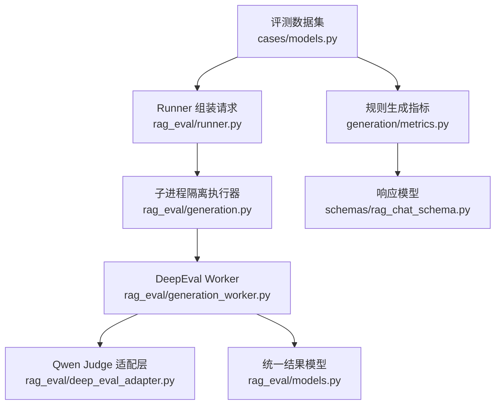
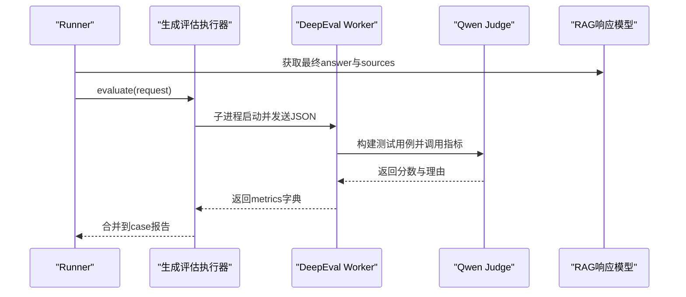
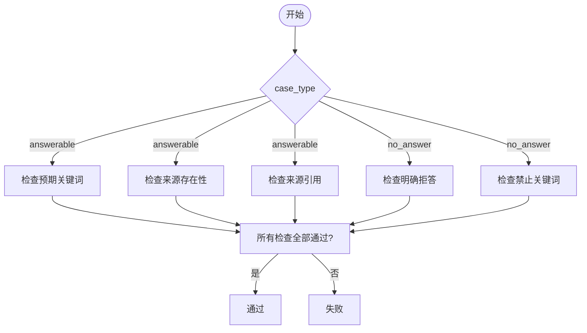
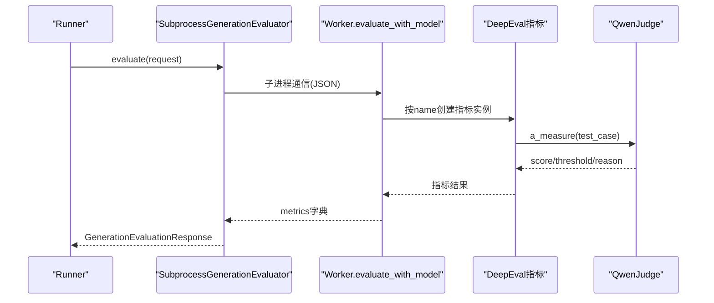
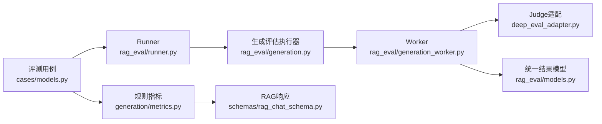

# 生成评估指标

<cite>
**本文引用的文件**
- [src/fast_app/evaluation/generation/metrics.py](file://src/fast_app/evaluation/generation/metrics.py)
- [src/fast_app/evaluation/generation/models.py](file://src/fast_app/evaluation/generation/models.py)
- [src/fast_app/evaluation/cases/models.py](file://src/fast_app/evaluation/cases/models.py)
- [src/fast_app/schemas/rag_chat_schema.py](file://src/fast_app/schemas/rag_chat_schema.py)
- [src/fast_app/rag_eval/generation.py](file://src/fast_app/rag_eval/generation.py)
- [src/fast_app/rag_eval/generation_worker.py](file://src/fast_app/rag_eval/generation_worker.py)
- [src/fast_app/rag_eval/deep_eval_adapter.py](file://src/fast_app/rag_eval/deep_eval_adapter.py)
- [src/fast_app/rag_eval/models.py](file://src/fast_app/rag_eval/models.py)
- [src/fast_app/rag_eval/runner.py](file://src/fast_app/rag_eval/runner.py)
</cite>

## 目录
1. [简介](#简介)
2. [项目结构](#项目结构)
3. [核心组件](#核心组件)
4. [架构总览](#架构总览)
5. [详细组件分析](#详细组件分析)
6. [依赖关系分析](#依赖关系分析)
7. [性能与稳定性](#性能与稳定性)
8. [故障排查指南](#故障排查指南)
9. [结论](#结论)
10. [附录：实用指南](#附录实用指南)

## 简介
本文件面向RAG系统的“生成质量”评估，系统化说明以下能力：
- 规则型生成指标：引用准确性、事实一致性、回答完整性、拒绝回答等。
- LLM作为裁判的自动化评估：隔离执行、提示词步骤、边界情况处理。
- 评分标准、人工评估指导、质量门控策略。
- 自定义生成指标开发、批量评测执行、质量报告输出。

该体系将“轻量规则检查”和“LLM裁判”结合，既保证可解释性与低成本，又保留对复杂语义判断的能力。

## 项目结构
围绕生成评估的关键代码分布在两个层次：
- 规则层：基于关键词、来源存在性、引用ID匹配等快速判定。
- 裁判层：在隔离环境中调用DeepEval，使用独立Judge模型进行忠实度、相关性、完整性、上下文利用度评估。

图表来源
- [src/fast_app/evaluation/cases/models.py:153-261](file://src/fast_app/evaluation/cases/models.py#L153-L261)
- [src/fast_app/evaluation/generation/metrics.py:168-227](file://src/fast_app/evaluation/generation/metrics.py#L168-L227)
- [src/fast_app/rag_eval/runner.py:155-183](file://src/fast_app/rag_eval/runner.py#L155-L183)
- [src/fast_app/rag_eval/generation.py:30-110](file://src/fast_app/rag_eval/generation.py#L30-L110)
- [src/fast_app/rag_eval/generation_worker.py:112-220](file://src/fast_app/rag_eval/generation_worker.py#L112-L220)
- [src/fast_app/rag_eval/deep_eval_adapter.py:59-168](file://src/fast_app/rag_eval/deep_eval_adapter.py#L59-L168)
- [src/fast_app/schemas/rag_chat_schema.py:189-215](file://src/fast_app/schemas/rag_chat_schema.py#L189-L215)
- [src/fast_app/rag_eval/models.py:124-188](file://src/fast_app/rag_eval/models.py#L124-L188)

章节来源
- [src/fast_app/evaluation/cases/models.py:153-261](file://src/fast_app/evaluation/cases/models.py#L153-L261)
- [src/fast_app/evaluation/generation/metrics.py:168-227](file://src/fast_app/evaluation/generation/metrics.py#L168-L227)
- [src/fast_app/rag_eval/generation.py:30-110](file://src/fast_app/rag_eval/generation.py#L30-L110)
- [src/fast_app/rag_eval/generation_worker.py:112-220](file://src/fast_app/rag_eval/generation_worker.py#L112-L220)
- [src/fast_app/rag_eval/deep_eval_adapter.py:59-168](file://src/fast_app/rag_eval/deep_eval_adapter.py#L59-L168)
- [src/fast_app/schemas/rag_chat_schema.py:189-215](file://src/fast_app/schemas/rag_chat_schema.py#L189-L215)
- [src/fast_app/rag_eval/models.py:124-188](file://src/fast_app/rag_eval/models.py#L124-L188)
- [src/fast_app/rag_eval/runner.py:155-183](file://src/fast_app/rag_eval/runner.py#L155-L183)

## 核心组件
- 规则型生成指标模块：提供预期关键词覆盖、禁止关键词检测、无答案拒答检测、来源存在性与来源引用检查，并汇总单条case与数据集级通过率。
- 裁判型生成指标执行器：通过子进程隔离运行DeepEval，按指标名称选择Faithfulness、AnswerRelevancy、AnswerCompleteness、ContextUtilization，逐项计算分数与是否通过。
- 数据契约与响应模型：定义评测用例、RAG响应结构、Worker输入输出、统一指标结果与报告模型。

章节来源
- [src/fast_app/evaluation/generation/metrics.py:19-165](file://src/fast_app/evaluation/generation/metrics.py#L19-L165)
- [src/fast_app/evaluation/generation/metrics.py:168-283](file://src/fast_app/evaluation/generation/metrics.py#L168-L283)
- [src/fast_app/rag_eval/generation_worker.py:19-40](file://src/fast_app/rag_eval/generation_worker.py#L19-L40)
- [src/fast_app/rag_eval/generation_worker.py:112-220](file://src/fast_app/rag_eval/generation_worker.py#L112-L220)
- [src/fast_app/schemas/rag_chat_schema.py:189-215](file://src/fast_app/schemas/rag_chat_schema.py#L189-L215)
- [src/fast_app/rag_eval/models.py:124-188](file://src/fast_app/rag_eval/models.py#L124-L188)

## 架构总览
生成评估由“Runner”驱动，根据所选指标决定走规则路径还是裁判路径；裁判路径在隔离环境中执行，避免污染生产依赖，并通过安全配置防止云端上传。

图表来源
- [src/fast_app/rag_eval/runner.py:155-183](file://src/fast_app/rag_eval/runner.py#L155-L183)
- [src/fast_app/rag_eval/generation.py:30-110](file://src/fast_app/rag_eval/generation.py#L30-L110)
- [src/fast_app/rag_eval/generation_worker.py:112-220](file://src/fast_app/rag_eval/generation_worker.py#L112-L220)
- [src/fast_app/rag_eval/deep_eval_adapter.py:59-168](file://src/fast_app/rag_eval/deep_eval_adapter.py#L59-L168)
- [src/fast_app/schemas/rag_chat_schema.py:189-215](file://src/fast_app/schemas/rag_chat_schema.py#L189-L215)

## 详细组件分析

### 规则型生成指标
- 引用准确性
  - 来源存在性：要求可回答样例必须包含sources，确保回答可追溯。
  - 来源引用：检查回答文本中是否出现sources中的id，属于轻量引用校验。
- 事实一致性
  - 预期关键词覆盖：对可回答样例，检查回答是否覆盖预期关键点。
  - 禁止关键词检测：对不可回答样例，检查是否出现不应出现的敏感或编造词。
- 回答完整性
  - 通过expected_answer_keywords衡量要点覆盖；更严格的完整性由裁判层的Answer Completeness负责。
- 拒绝回答
  - 无答案拒答检测：当问题不可回答时，回答需命中预设拒答标志之一。

图表来源
- [src/fast_app/evaluation/generation/metrics.py:30-165](file://src/fast_app/evaluation/generation/metrics.py#L30-L165)
- [src/fast_app/evaluation/generation/metrics.py:168-227](file://src/fast_app/evaluation/generation/metrics.py#L168-L227)

章节来源
- [src/fast_app/evaluation/generation/metrics.py:30-165](file://src/fast_app/evaluation/generation/metrics.py#L30-L165)
- [src/fast_app/evaluation/generation/metrics.py:168-227](file://src/fast_app/evaluation/generation/metrics.py#L168-L227)
- [src/fast_app/schemas/rag_chat_schema.py:189-215](file://src/fast_app/schemas/rag_chat_schema.py#L189-L215)

### LLM裁判型生成指标
- 指标集合
  - 忠实度（Faithfulness）：答案是否与检索上下文一致。
  - 答案相关性（Answer Relevance）：答案是否切题。
  - 答案完整性（Answer Completeness）：是否覆盖required_key_facts。
  - 上下文利用度（Context Utilization）：是否有效使用检索上下文。
- 执行流程
  - Runner构造GenerationEvaluationRequest，包含question、answer、retrieval_context、required_key_facts、metrics、thresholds。
  - SubprocessGenerationEvaluator在隔离环境中启动Worker，设置PYTHONPATH并限制超时。
  - Worker内构建LLMTestCase，逐项创建对应指标并异步测量，封装为统一结果。
- 边界情况
  - 缺少retrieval_context时，忠实度与上下文利用度跳过。
  - 缺少required_key_facts时，完整性跳过。
  - 空答案直接给0分。
  - 单项指标异常被捕获并标记error，不影响其他指标。

图表来源
- [src/fast_app/rag_eval/runner.py:155-183](file://src/fast_app/rag_eval/runner.py#L155-L183)
- [src/fast_app/rag_eval/generation.py:30-110](file://src/fast_app/rag_eval/generation.py#L30-L110)
- [src/fast_app/rag_eval/generation_worker.py:112-220](file://src/fast_app/rag_eval/generation_worker.py#L112-L220)
- [src/fast_app/rag_eval/deep_eval_adapter.py:59-168](file://src/fast_app/rag_eval/deep_eval_adapter.py#L59-L168)

章节来源
- [src/fast_app/rag_eval/generation_worker.py:19-40](file://src/fast_app/rag_eval/generation_worker.py#L19-L40)
- [src/fast_app/rag_eval/generation_worker.py:112-220](file://src/fast_app/rag_eval/generation_worker.py#L112-L220)
- [src/fast_app/rag_eval/generation.py:30-110](file://src/fast_app/rag_eval/generation.py#L30-L110)
- [src/fast_app/rag_eval/deep_eval_adapter.py:59-168](file://src/fast_app/rag_eval/deep_eval_adapter.py#L59-L168)
- [src/fast_app/rag_eval/models.py:124-188](file://src/fast_app/rag_eval/models.py#L124-L188)

### 数据模型与契约
- 评测用例
  - RagEvalCase：定义可回答性、期望路由、相关逻辑块、关键事实、场景标签、审核信息等，并提供兼容字段用于规则指标。
- RAG响应
  - RagChatResponse：包含answer与sources，供规则指标检查来源存在性与引用。
- Worker输入输出
  - GenerationEvaluationRequest/Response：约束仅允许生成指标，校验阈值范围与唯一性。
  - RagEvalMetricResult：统一的指标结果结构，支持evaluated/skipped/error状态。

章节来源
- [src/fast_app/evaluation/cases/models.py:153-261](file://src/fast_app/evaluation/cases/models.py#L153-L261)
- [src/fast_app/schemas/rag_chat_schema.py:189-215](file://src/fast_app/schemas/rag_chat_schema.py#L189-L215)
- [src/fast_app/rag_eval/models.py:124-188](file://src/fast_app/rag_eval/models.py#L124-L188)
- [src/fast_app/rag_eval/models.py:39-84](file://src/fast_app/rag_eval/models.py#L39-L84)

## 依赖关系分析
- 规则指标依赖RAG响应结构与评测用例字段，不依赖外部服务。
- 裁判指标依赖隔离环境中的DeepEval与Qwen Judge，通过适配器注入模型。
- Runner聚合规则与裁判结果，形成case级与数据集级报告。

图表来源
- [src/fast_app/evaluation/cases/models.py:153-261](file://src/fast_app/evaluation/cases/models.py#L153-L261)
- [src/fast_app/evaluation/generation/metrics.py:168-227](file://src/fast_app/evaluation/generation/metrics.py#L168-L227)
- [src/fast_app/rag_eval/runner.py:155-183](file://src/fast_app/rag_eval/runner.py#L155-L183)
- [src/fast_app/rag_eval/generation.py:30-110](file://src/fast_app/rag_eval/generation.py#L30-L110)
- [src/fast_app/rag_eval/generation_worker.py:112-220](file://src/fast_app/rag_eval/generation_worker.py#L112-L220)
- [src/fast_app/rag_eval/deep_eval_adapter.py:59-168](file://src/fast_app/rag_eval/deep_eval_adapter.py#L59-L168)
- [src/fast_app/schemas/rag_chat_schema.py:189-215](file://src/fast_app/schemas/rag_chat_schema.py#L189-L215)
- [src/fast_app/rag_eval/models.py:124-188](file://src/fast_app/rag_eval/models.py#L124-L188)

章节来源
- [src/fast_app/evaluation/cases/models.py:153-261](file://src/fast_app/evaluation/cases/models.py#L153-L261)
- [src/fast_app/evaluation/generation/metrics.py:168-227](file://src/fast_app/evaluation/generation/metrics.py#L168-L227)
- [src/fast_app/rag_eval/runner.py:155-183](file://src/fast_app/rag_eval/runner.py#L155-L183)
- [src/fast_app/rag_eval/generation.py:30-110](file://src/fast_app/rag_eval/generation.py#L30-L110)
- [src/fast_app/rag_eval/generation_worker.py:112-220](file://src/fast_app/rag_eval/generation_worker.py#L112-L220)
- [src/fast_app/rag_eval/deep_eval_adapter.py:59-168](file://src/fast_app/rag_eval/deep_eval_adapter.py#L59-L168)
- [src/fast_app/schemas/rag_chat_schema.py:189-215](file://src/fast_app/schemas/rag_chat_schema.py#L189-L215)
- [src/fast_app/rag_eval/models.py:124-188](file://src/fast_app/rag_eval/models.py#L124-L188)

## 性能与稳定性
- 隔离执行：通过子进程运行DeepEval，避免污染生产依赖，降低风险。
- 超时保护：Worker执行设置超时，防止长时间阻塞。
- 单项失败隔离：每个指标try/except捕获异常，单个失败不影响其他指标。
- 安全配置：禁用遥测与环境变量加载，禁止云端上传，保障本地评测安全。
- 资源控制：Judge模型调用具备重试与超时参数，减少抖动影响。

章节来源
- [src/fast_app/rag_eval/generation.py:30-110](file://src/fast_app/rag_eval/generation.py#L30-L110)
- [src/fast_app/rag_eval/generation_worker.py:112-220](file://src/fast_app/rag_eval/generation_worker.py#L112-L220)
- [src/fast_app/rag_eval/deep_eval_adapter.py:25-42](file://src/fast_app/rag_eval/deep_eval_adapter.py#L25-L42)

## 故障排查指南
- 未找到隔离Python环境：检查环境变量与虚拟环境路径，确保存在可用python。
- 检测到云端上传配置：移除CONFIDENT_API_KEY或调整环境，避免触发上传。
- Worker超时：增加timeout_seconds或优化Judge模型配置。
- 非法JSON协议：检查Worker输出是否符合GenerationEvaluationResponse结构。
- case_id不一致：确认请求与响应case_id一致，避免跨case污染。
- 指标集合不一致：确保请求metrics与返回metrics完全一致。
- 空答案：会直接得到0分，需检查上游生成链路。
- 缺少retrieval_context：忠实度与上下文利用度会被跳过，需补充上下文。
- 缺少required_key_facts：完整性会被跳过，需完善评测用例标注。

章节来源
- [src/fast_app/rag_eval/generation.py:30-110](file://src/fast_app/rag_eval/generation.py#L30-L110)
- [src/fast_app/rag_eval/generation_worker.py:112-220](file://src/fast_app/rag_eval/generation_worker.py#L112-L220)
- [src/fast_app/rag_eval/deep_eval_adapter.py:25-42](file://src/fast_app/rag_eval/deep_eval_adapter.py#L25-L42)
- [src/fast_app/rag_eval/models.py:124-188](file://src/fast_app/rag_eval/models.py#L124-L188)

## 结论
本体系以“规则+裁判”的双轨模式实现生成质量评估：
- 规则指标提供低成本、可解释的基础检查，覆盖引用准确性、事实一致性、拒绝回答等。
- 裁判指标通过隔离环境与独立Judge模型，完成忠实度、相关性、完整性、上下文利用度的深度评估。
- 通过严格的数据契约与安全配置，保证评测的可重复性与安全性。
- Runner聚合结果，便于批量评测与报告输出，支撑质量门控与回归测试。

## 附录：实用指南

### 指标定义与计算方法
- 引用准确性
  - 来源存在性：若sources为空则失败。
  - 来源引用：若回答未引用任何source id则失败。
- 事实一致性
  - 预期关键词覆盖：回答归一化后缺失任一预期关键词则失败。
  - 禁止关键词检测：回答中出现任一禁止关键词则失败。
- 回答完整性
  - 规则层：通过expected_answer_keywords粗略衡量。
  - 裁判层：Answer Completeness依据required_key_facts给出0-1分数。
- 拒绝回答
  - 无答案拒答检测：回答需命中预设拒答标志之一。

章节来源
- [src/fast_app/evaluation/generation/metrics.py:30-165](file://src/fast_app/evaluation/generation/metrics.py#L30-L165)
- [src/fast_app/evaluation/generation/metrics.py:168-227](file://src/fast_app/evaluation/generation/metrics.py#L168-L227)
- [src/fast_app/rag_eval/generation_worker.py:112-220](file://src/fast_app/rag_eval/generation_worker.py#L112-L220)

### 使用LLM作为裁判
- 隔离执行：通过子进程启动Worker，避免污染生产环境。
- 安全配置：禁用遥测与环境变量加载，禁止云端上传。
- 提示词步骤：完整性与上下文利用度使用内置评估步骤，引导Judge聚焦证据与合理使用。
- 边界处理：空答案、缺少上下文或缺少关键事实时采取跳过或零分策略。

章节来源
- [src/fast_app/rag_eval/generation.py:30-110](file://src/fast_app/rag_eval/generation.py#L30-L110)
- [src/fast_app/rag_eval/generation_worker.py:19-40](file://src/fast_app/rag_eval/generation_worker.py#L19-L40)
- [src/fast_app/rag_eval/generation_worker.py:112-220](file://src/fast_app/rag_eval/generation_worker.py#L112-L220)
- [src/fast_app/rag_eval/deep_eval_adapter.py:25-42](file://src/fast_app/rag_eval/deep_eval_adapter.py#L25-L42)

### 评分标准与质量门控
- 默认阈值：生成指标默认阈值为0.5，可通过请求覆盖。
- 通过判定：score>=threshold视为通过。
- 门禁策略：可将关键指标（如忠实度、完整性）设为硬门禁，低于阈值阻断发布。
- 报告解读：关注Summary、Generation Results、Failed Generation Details区域。

章节来源
- [src/fast_app/rag_eval/generation_worker.py:19-40](file://src/fast_app/rag_eval/generation_worker.py#L19-L40)
- [src/fast_app/rag_eval/models.py:39-84](file://src/fast_app/rag_eval/models.py#L39-L84)

### 人工评估指导
- 关键事实：为可回答case编写required_key_facts，明确应覆盖的核心语义。
- 场景覆盖：确保golden数据集覆盖answerable、unanswerable、权限过滤、父块扩展、多来源、无结果、underfilled等场景。
- 审核流程：模型辅助标注需由不同人工审核者复核，approved case方可进入golden。

章节来源
- [src/fast_app/evaluation/cases/models.py:125-151](file://src/fast_app/evaluation/cases/models.py#L125-L151)
- [src/fast_app/evaluation/cases/models.py:27-37](file://src/fast_app/evaluation/cases/models.py#L27-L37)
- [src/fast_app/evaluation/cases/models.py:387-405](file://src/fast_app/evaluation/cases/models.py#L387-L405)

### 自定义生成指标开发
- 新增指标名：在Worker中注册新指标名，并在evaluate_with_model中分支实现。
- 提示词步骤：为新指标定义evaluation_steps，指导Judge如何打分。
- 边界处理：为缺失输入（如context或facts）设计跳过或零分策略。
- 结果封装：使用_metric_result或_error封装统一结果，保持status与short_reason一致性。

章节来源
- [src/fast_app/rag_eval/generation_worker.py:19-40](file://src/fast_app/rag_eval/generation_worker.py#L19-L40)
- [src/fast_app/rag_eval/generation_worker.py:112-220](file://src/fast_app/rag_eval/generation_worker.py#L112-L220)

### 批量评估执行
- 选择指标：Runner从selected_metrics中筛选生成指标，构造GenerationEvaluationRequest。
- 并行与隔离：每个case通过子进程调用Worker，避免相互干扰。
- 超时与重试：设置超时时间，遇到rate limit或超时可按策略重试。
- 结果聚合：将各case的metrics合并到case报告，再汇总数据集级摘要。

章节来源
- [src/fast_app/rag_eval/runner.py:155-183](file://src/fast_app/rag_eval/runner.py#L155-L183)
- [src/fast_app/rag_eval/generation.py:30-110](file://src/fast_app/rag_eval/generation.py#L30-L110)
- [src/fast_app/rag_eval/models.py:279-348](file://src/fast_app/rag_eval/models.py#L279-L348)

### 质量报告生成
- JSON报告：包含case_count、evaluated_case_count、failed_case_count、skipped_case_count、metric_summaries等。
- Markdown报告：展示Summary、Retrieval Results、Generation Results、Failed Generation Details。
- 基线对比：可选baseline_report用于计算变化量。

章节来源
- [src/fast_app/rag_eval/models.py:279-348](file://src/fast_app/rag_eval/models.py#L279-L348)