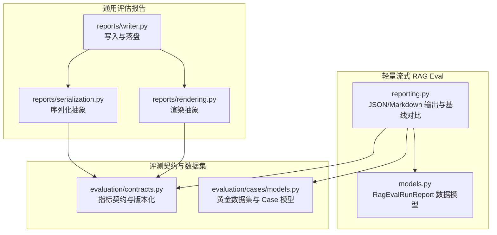
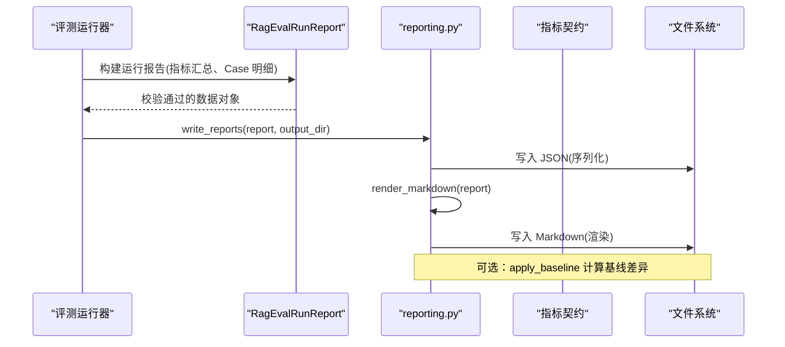
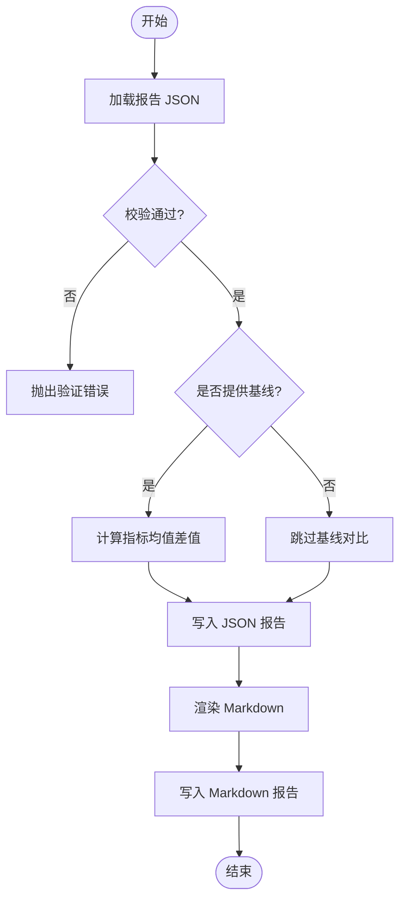
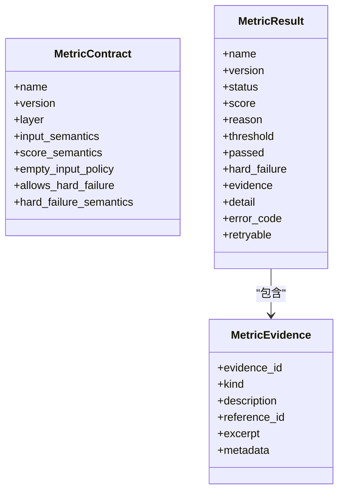
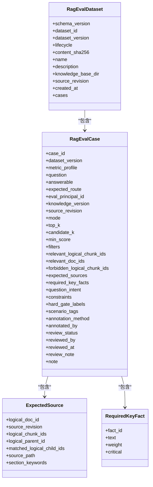
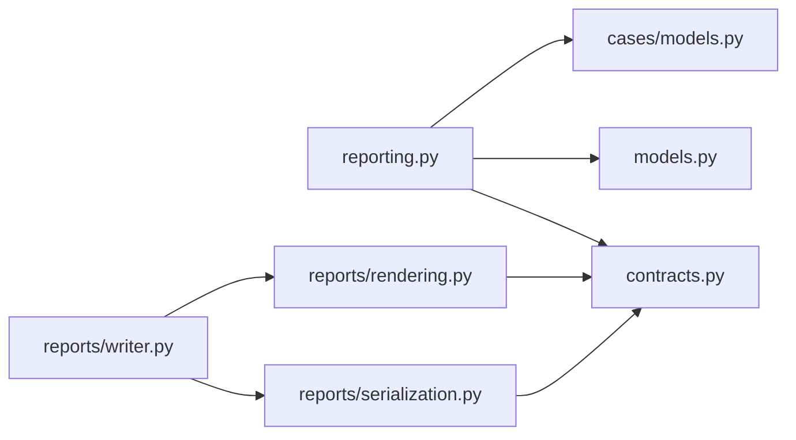

# 评估报告生成

<cite>
**本文引用的文件**
- [reporting.py](file://python-agent-study/src/fast_app/rag_eval/reporting.py)
- [models.py](file://python-agent-study/src/fast_app/rag_eval/models.py)
- [contracts.py](file://python-agent-study/src/fast_app/evaluation/contracts.py)
- [cases/models.py](file://python-agent-study/src/fast_app/evaluation/cases/models.py)
- [reports/rendering.py](file://python-agent-study/src/fast_app/evaluation/reports/rendering.py)
- [reports/serialization.py](file://python-agent-study/src/fast_app/evaluation/reports/serialization.py)
- [reports/writer.py](file://python-agent-study/src/fast_app/evaluation/reports/writer.py)
</cite>

## 目录
1. [简介](#简介)
2. [项目结构](#项目结构)
3. [核心组件](#核心组件)
4. [架构总览](#架构总览)
5. [详细组件分析](#详细组件分析)
6. [依赖关系分析](#依赖关系分析)
7. [性能考量](#性能考量)
8. [故障排查指南](#故障排查指南)
9. [结论](#结论)
10. [附录](#附录)

## 简介
本文件面向“评估报告生成”能力，系统性说明如何从评测运行结果中产出可追溯、可对比、可集成的 Markdown 与 JSON 报告。内容覆盖：
- 报告结构与字段语义（检索质量、生成质量、性能指标）
- Markdown 渲染与 JSON 序列化机制
- 基线对比与趋势跟踪方法
- 质量门禁与 CI/CD 集成建议
- 自动化发布与告警通知方案

## 项目结构
评估报告相关代码主要分布在两个位置：
- 轻量流式 RAG Eval 的报告输出模块：负责将运行报告序列化为 JSON 并渲染为 Markdown，同时支持基线对比
- 通用评估报告子模块：提供更通用的渲染、序列化与写入抽象，便于扩展不同报告格式或存储后端

图表来源
- [reporting.py:1-161](file://python-agent-study/src/fast_app/rag_eval/reporting.py#L1-L161)
- [models.py](file://python-agent-study/src/fast_app/rag_eval/models.py)
- [contracts.py:1-268](file://python-agent-study/src/fast_app/evaluation/contracts.py#L1-L268)
- [cases/models.py:1-512](file://python-agent-study/src/fast_app/evaluation/cases/models.py#L1-L512)

章节来源
- [reporting.py:1-161](file://python-agent-study/src/fast_app/rag_eval/reporting.py#L1-L161)
- [contracts.py:1-268](file://python-agent-study/src/fast_app/evaluation/contracts.py#L1-L268)
- [cases/models.py:1-512](file://python-agent-study/src/fast_app/evaluation/cases/models.py#L1-L512)

## 核心组件
- 轻量流式报告输出器
  - 功能：加载/写入 JSON 报告、渲染 Markdown、计算与注入基线差异
  - 关键入口：加载报告、写入报告、渲染 Markdown、应用基线对比
- 报告数据模型
  - 承载一次运行的元信息、指标汇总、Case 明细、错误与跳过统计等
- 指标契约
  - 定义八项指标的语义、版本、空输入策略、是否允许硬失败等
- 黄金数据集与 Case 模型
  - 定义评测用例的结构、约束与审核流程，确保报告可重放与可审计

章节来源
- [reporting.py:11-65](file://python-agent-study/src/fast_app/rag_eval/reporting.py#L11-L65)
- [reporting.py:68-157](file://python-agent-study/src/fast_app/rag_eval/reporting.py#L68-L157)
- [models.py](file://python-agent-study/src/fast_app/rag_eval/models.py)
- [contracts.py:26-154](file://python-agent-study/src/fast_app/evaluation/contracts.py#L26-L154)
- [cases/models.py:153-417](file://python-agent-study/src/fast_app/evaluation/cases/models.py#L153-L417)

## 架构总览
下图展示从评测运行到报告产出的端到端流程，包括数据模型校验、指标聚合、基线对比、JSON 与 Markdown 输出。

图表来源
- [reporting.py:50-65](file://python-agent-study/src/fast_app/rag_eval/reporting.py#L50-L65)
- [reporting.py:68-157](file://python-agent-study/src/fast_app/rag_eval/reporting.py#L68-L157)
- [models.py](file://python-agent-study/src/fast_app/rag_eval/models.py)

## 详细组件分析

### 轻量流式报告输出器（reporting.py）
- 基线对比
  - 按相同指标名计算当前运行与基线的均值差值，并写入报告的宏平均变化字段
  - 校验 pipeline_provider、dataset_id、dataset_version 一致性，避免跨配置对比
- 报告加载与写入
  - 以 UTF-8 编码读取/写入 JSON；文件名包含 provider 与 run_id，便于追踪
  - 同步生成 Markdown 报告
- Markdown 渲染
  - 头部元信息：run_id、provider、status、dataset、knowledge revision、tested model、judge model、case 计数、耗时等
  - 指标汇总表：名称、均值、评估数、通过数、跳过数、错误数、基线差值
  - Case 明细表：case_id、状态、实际路由、是否检索、知识版本、延迟、错误/跳过原因
  - Case 指标明细表：每个 case 的每个指标的状态、分数、是否通过、原因或错误

图表来源
- [reporting.py:11-43](file://python-agent-study/src/fast_app/rag_eval/reporting.py#L11-L43)
- [reporting.py:46-65](file://python-agent-study/src/fast_app/rag_eval/reporting.py#L46-L65)
- [reporting.py:68-157](file://python-agent-study/src/fast_app/rag_eval/reporting.py#L68-L157)

章节来源
- [reporting.py:11-43](file://python-agent-study/src/fast_app/rag_eval/reporting.py#L11-L43)
- [reporting.py:46-65](file://python-agent-study/src/fast_app/rag_eval/reporting.py#L46-L65)
- [reporting.py:68-157](file://python-agent-study/src/fast_app/rag_eval/reporting.py#L68-L157)

### 报告数据模型（models.py）
- 承载一次评测运行的完整快照，包括：
  - 运行元信息：run_id、pipeline_provider、status、dataset_id、dataset_version、source_revision、tested_model、judge_model
  - 指标汇总：selected_metrics、metric_summaries（含均值、评估数、通过/跳过/错误计数、基线差值）
  - Case 明细：case_id、status、actual_route、knowledge_retrieval_performed、knowledge_version、latency_ms、error/skipped_reason
  - 指标明细：每个 case 的每个指标的结果（score、passed、reason/error）
- 该模型作为 JSON 与 Markdown 的共同数据源，保证两种输出的一致性

章节来源
- [models.py](file://python-agent-study/src/fast_app/rag_eval/models.py)

### 指标契约（contracts.py）
- 定义八项指标的业务语义与版本：
  - 检索层：recall@K、precision@K、hit_rate@K、MRR
  - 生成层：faithfulness、answer_relevance、answer_completeness、context_utilization
- 统一 MetricResult 结构：
  - evaluated/skipped/error 三种状态
  - score、threshold、passed、hard_failure、evidence、detail、error_code、retryable
- 空输入策略与硬失败语义：
  - 明确在缺少上下文或证据时的行为
  - 对 faithfulness 与 answer_completeness 支持 hard_failure，用于质量门禁

图表来源
- [contracts.py:26-154](file://python-agent-study/src/fast_app/evaluation/contracts.py#L26-L154)

章节来源
- [contracts.py:26-154](file://python-agent-study/src/fast_app/evaluation/contracts.py#L26-L154)
- [contracts.py:156-268](file://python-agent-study/src/fast_app/evaluation/contracts.py#L156-L268)

### 黄金数据集与 Case 模型（cases/models.py）
- RagEvalCase
  - 关键字段：case_id、question、answerable、expected_route、eval_principal_id、knowledge_version、mode/top_k/min_score、filters、relevant_logical_chunk_ids、forbidden_logical_chunk_ids、expected_sources、required_key_facts、scenario_tags、constraints、hard_gate_labels 等
  - 强约束：答案可回答性、预期路由、权限过滤、父块扩展、多来源场景、关键事实唯一性与权重、审核流程完整性
- RagEvalDataset
  - 版本化数据集：schema_version、dataset_id、dataset_version、lifecycle、content_sha256、name、description、knowledge_base_dir、source_revision、created_at、cases
  - 校验：case_id 唯一、case 与数据集版本一致、golden 必须全批准且覆盖全部场景标签

图表来源
- [cases/models.py:46-123](file://python-agent-study/src/fast_app/evaluation/cases/models.py#L46-L123)
- [cases/models.py:125-151](file://python-agent-study/src/fast_app/evaluation/cases/models.py#L125-L151)
- [cases/models.py:153-417](file://python-agent-study/src/fast_app/evaluation/cases/models.py#L153-L417)
- [cases/models.py:420-512](file://python-agent-study/src/fast_app/evaluation/cases/models.py#L420-L512)

章节来源
- [cases/models.py:46-123](file://python-agent-study/src/fast_app/evaluation/cases/models.py#L46-L123)
- [cases/models.py:125-151](file://python-agent-study/src/fast_app/evaluation/cases/models.py#L125-L151)
- [cases/models.py:153-417](file://python-agent-study/src/fast_app/evaluation/cases/models.py#L153-L417)
- [cases/models.py:420-512](file://python-agent-study/src/fast_app/evaluation/cases/models.py#L420-L512)

### 通用评估报告子模块（reports/*）
- rendering.py：提供渲染抽象，便于扩展新的可视化格式或模板
- serialization.py：提供序列化抽象，便于对接不同的持久化后端或协议
- writer.py：封装写入逻辑，统一路径、命名与落盘策略

这些模块可与轻量流式报告输出器配合使用，形成可扩展的报告管线。

章节来源
- [reports/rendering.py](file://python-agent-study/src/fast_app/evaluation/reports/rendering.py)
- [reports/serialization.py](file://python-agent-study/src/fast_app/evaluation/reports/serialization.py)
- [reports/writer.py](file://python-agent-study/src/fast_app/evaluation/reports/writer.py)

## 依赖关系分析
- reporting.py 依赖 RagEvalRunReport 数据模型进行 JSON 序列化与 Markdown 渲染
- contracts.py 提供指标契约，确保指标结果版本一致、语义稳定
- cases/models.py 提供黄金数据集与 Case 模型，保障评测可重放与可审计
- reports/* 提供通用渲染、序列化与写入抽象，增强扩展性

图表来源
- [reporting.py:1-161](file://python-agent-study/src/fast_app/rag_eval/reporting.py#L1-L161)
- [contracts.py:1-268](file://python-agent-study/src/fast_app/evaluation/contracts.py#L1-L268)
- [cases/models.py:1-512](file://python-agent-study/src/fast_app/evaluation/cases/models.py#L1-L512)

章节来源
- [reporting.py:1-161](file://python-agent-study/src/fast_app/rag_eval/reporting.py#L1-L161)
- [contracts.py:1-268](file://python-agent-study/src/fast_app/evaluation/contracts.py#L1-L268)
- [cases/models.py:1-512](file://python-agent-study/src/fast_app/evaluation/cases/models.py#L1-L512)

## 性能考量
- 报告写入顺序：先 JSON 后 Markdown，减少重复计算
- 基线对比仅在提供基线时执行，避免不必要的开销
- Markdown 渲染采用行拼接方式，适合中等规模报告；若 Case 数量极大，可考虑分页或抽样展示
- 指标汇总基于已计算的 metric_summaries，避免重复聚合

[本节为通用指导，不直接分析具体文件]

## 故障排查指南
- 基线对比不一致
  - 检查 pipeline_provider、dataset_id、dataset_version 是否与基线一致
  - 若不一致，apply_baseline 会抛出异常，需确认运行配置
- 指标结果无效
  - 检查 MetricResult 的 status 与字段约束：evaluated 必须有 0～1 分数与证据；skipped 不得携带 score/threshold/passed；error 必须提供 error_code
  - 核对指标版本与契约版本匹配
- Case 明细缺失或错误
  - 检查 case.status、actual_route、knowledge_retrieval_performed、latency_ms、error/skipped_reason 是否完整
  - 对于不可回答 case，确保未声明 expected_sources 或 required_key_facts
- 数据集校验失败
  - golden 数据集必须全部 approved 且覆盖所有必需场景标签
  - case_id 必须唯一，case 与数据集版本必须一致

章节来源
- [reporting.py:11-43](file://python-agent-study/src/fast_app/rag_eval/reporting.py#L11-L43)
- [contracts.py:99-154](file://python-agent-study/src/fast_app/evaluation/contracts.py#L99-L154)
- [cases/models.py:326-417](file://python-agent-study/src/fast_app/evaluation/cases/models.py#L326-L417)
- [cases/models.py:478-512](file://python-agent-study/src/fast_app/evaluation/cases/models.py#L478-L512)

## 结论
本系统提供了稳定、可审计、可对比的评估报告生成能力：
- JSON 报告用于机器消费与趋势分析
- Markdown 报告用于人类阅读与问题定位
- 指标契约与黄金数据集确保评测语义一致与可重放
- 基线对比与质量门禁支持回归检测与质量治理
- 通用渲染/序列化/写入抽象便于扩展新格式与新后端

[本节为总结，不直接分析具体文件]

## 附录

### 报告数据分析与趋势跟踪
- 指标趋势
  - 基于 JSON 中的 metric_summaries，按时间维度绘制各指标的均值曲线
  - 结合 baseline_delta 观察相对变化，识别回归与改进
- Case 级诊断
  - 通过 Case 明细表筛选失败或跳过用例，定位路由、检索、生成环节问题
  - 关注 hard_gate_labels 标记的严重问题（如 ACL 泄漏）
- 质量门禁
  - 基于指标阈值与 hard_failure 语义设置门禁规则
  - 在 CI 中判定整体通过率与关键指标是否达标

[本节为通用指导，不直接分析具体文件]

### 定制报告模板与集成 CI/CD
- 模板定制
  - 使用 reports/rendering.py 的渲染抽象替换默认 Markdown 模板
  - 通过 reports/serialization.py 对接自定义序列化器（如 YAML、CSV）
- CI/CD 集成
  - 在流水线中执行评测并生成 JSON/Markdown 报告
  - 解析 JSON 指标，设置门禁阈值，失败则阻断合并
  - 归档报告产物，供后续回溯与审计

[本节为通用指导，不直接分析具体文件]

### 报告自动化发布与告警通知
- 自动化发布
  - 将生成的报告上传至文档站点或制品库，附带 run_id、provider、dataset_version 等元信息
  - 使用 reports/writer.py 的统一写入逻辑确保命名与路径规范
- 告警通知
  - 当关键指标低于阈值或出现 hard_failure 时触发告警
  - 可通过邮件、IM 或工单系统集成通知

[本节为通用指导，不直接分析具体文件]