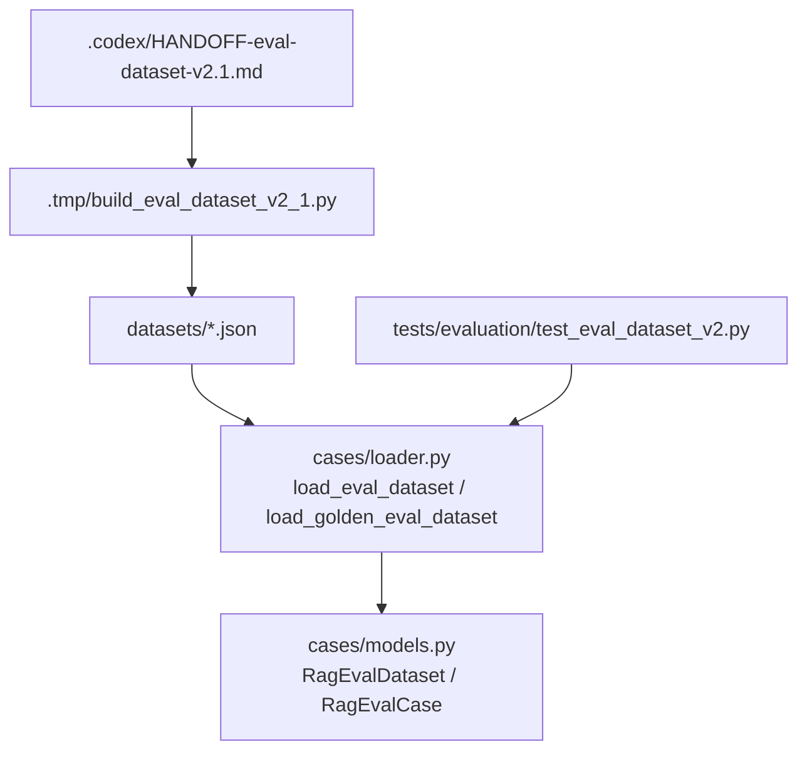
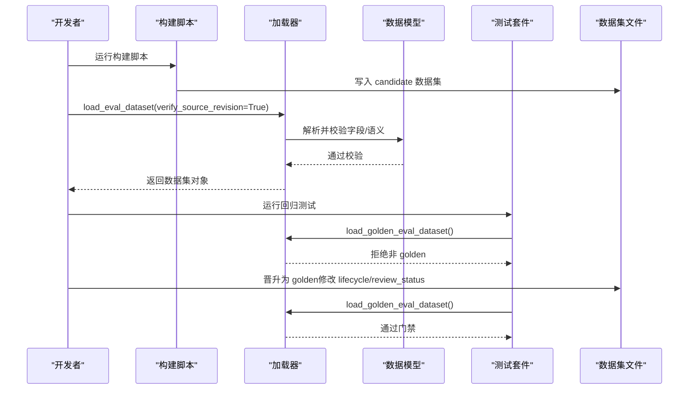
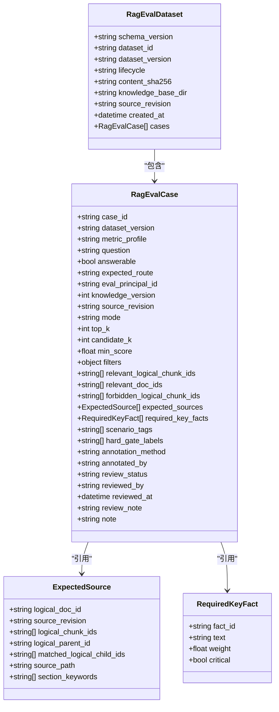
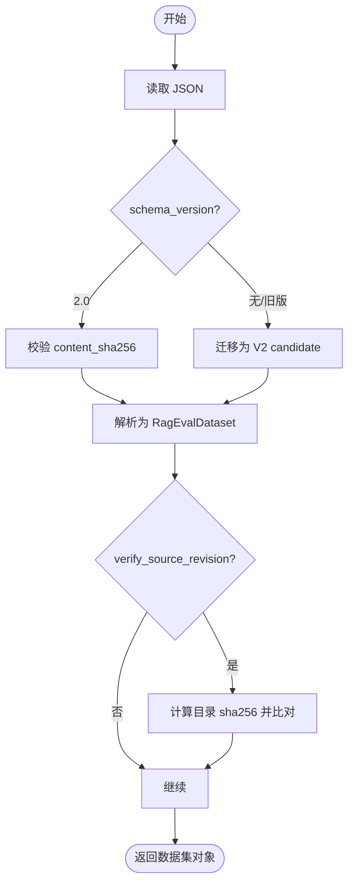
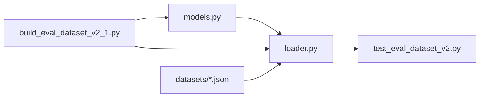

# 评估数据集管理

<cite>
**本文引用的文件**
- [stage11_rag_eval_cases.v2.0.0.json](file://python-agent-study/src/fast_app/evaluation/datasets/stage11_rag_eval_cases.v2.0.0.json)
- [stage11_rag_eval_cases.v2.1.0.json](file://python-agent-study/src/fast_app/evaluation/datasets/stage11_rag_eval_cases.v2.1.0.json)
- [models.py](file://python-agent-study/src/fast_app/evaluation/cases/models.py)
- [loader.py](file://python-agent-study/src/fast_app/evaluation/cases/loader.py)
- [test_eval_dataset_v2.py](file://python-agent-study/scripts/tests/evaluation/test_eval_dataset_v2.py)
- [build_eval_dataset_v2_1.py](file://python-agent-study/.tmp/build_eval_dataset_v2_1.py)
- [HANDOFF-eval-dataset-v2.1.md](file://python-agent-study/.codex/HANDOFF-eval-dataset-v2.1.md)
</cite>

## 目录
1. [简介](#简介)
2. [项目结构](#项目结构)
3. [核心组件](#核心组件)
4. [架构总览](#架构总览)
5. [详细组件分析](#详细组件分析)
6. [依赖关系分析](#依赖关系分析)
7. [性能与质量特性](#性能与质量特性)
8. [故障排查指南](#故障排查指南)
9. [结论](#结论)
10. [附录：版本迁移与最佳实践](#附录：版本迁移与最佳实践)

## 简介
本文件面向 RAG 评估数据集的构建、管理与演进，聚焦 V2 数据模型、版本治理、加载校验、场景覆盖与回归门禁。文档基于仓库中已实现的 Pydantic 模型、加载器、测试脚本以及 v2.0.0 与 v2.1.0 两个真实数据集，系统说明：
- 评测数据集的结构规范与字段语义
- 版本管理与内容完整性校验机制
- 测试用例组织方式与场景矩阵要求
- 如何构建自定义评估数据集、添加新场景与管理回归集
- 数据集验证、质量检查与版本迁移流程
- 实际构建示例与最佳实践

## 项目结构
评估相关代码与数据集中在以下位置：
- 数据模型与加载器：src/fast_app/evaluation/cases
- 数据集 JSON：src/fast_app/evaluation/datasets
- 构建与调试脚本：.tmp
- 验收与回归测试：scripts/tests/evaluation
- 交接与操作指引：.codex

**图表来源**
- [loader.py:299-346](file://python-agent-study/src/fast_app/evaluation/cases/loader.py#L299-L346)
- [models.py:420-512](file://python-agent-study/src/fast_app/evaluation/cases/models.py#L420-L512)
- [test_eval_dataset_v2.py:1-276](file://python-agent-study/scripts/tests/evaluation/test_eval_dataset_v2.py#L1-L276)
- [build_eval_dataset_v2_1.py:1-200](file://python-agent-study/.tmp/build_eval_dataset_v2_1.py#L1-L200)
- [HANDOFF-eval-dataset-v2.1.md:1-92](file://python-agent-study/.codex/HANDOFF-eval-dataset-v2.1.md#L1-L92)

**章节来源**
- [loader.py:299-346](file://python-agent-study/src/fast_app/evaluation/cases/loader.py#L299-L346)
- [models.py:420-512](file://python-agent-study/src/fast_app/evaluation/cases/models.py#L420-L512)
- [test_eval_dataset_v2.py:1-276](file://python-agent-study/scripts/tests/evaluation/test_eval_dataset_v2.py#L1-L276)
- [build_eval_dataset_v2_1.py:1-200](file://python-agent-study/.tmp/build_eval_dataset_v2_1.py#L1-L200)
- [HANDOFF-eval-dataset-v2.1.md:1-92](file://python-agent-study/.codex/HANDOFF-eval-dataset-v2.1.md#L1-L92)

## 核心组件
- 数据模型（Pydantic）：定义数据集、case、来源、关键事实等强约束类型，内置字段校验、语义校验与黄金集场景覆盖检查。
- 加载器：统一读取 V2 或迁移 Legacy 数据，计算并校验 content_sha256，可选校验本地语料 source_revision，提供 golden 门禁。
- 构建脚本：基于知识盘点生成 candidate 数据集，自动 seal 哈希、场景矩阵自检、回读校验。
- 测试套件：覆盖候选集、迁移、晋升 golden、非法契约、错误修订等多类断言。

**章节来源**
- [models.py:9-26](file://python-agent-study/src/fast_app/evaluation/cases/models.py#L9-L26)
- [models.py:46-123](file://python-agent-study/src/fast_app/evaluation/cases/models.py#L46-L123)
- [models.py:125-151](file://python-agent-study/src/fast_app/evaluation/cases/models.py#L125-L151)
- [models.py:153-418](file://python-agent-study/src/fast_app/evaluation/cases/models.py#L153-L418)
- [models.py:420-512](file://python-agent-study/src/fast_app/evaluation/cases/models.py#L420-L512)
- [loader.py:20-31](file://python-agent-study/src/fast_app/evaluation/cases/loader.py#L20-L31)
- [loader.py:105-149](file://python-agent-study/src/fast_app/evaluation/cases/loader.py#L105-L149)
- [loader.py:151-180](file://python-agent-study/src/fast_app/evaluation/cases/loader.py#L151-L180)
- [loader.py:201-346](file://python-agent-study/src/fast_app/evaluation/cases/loader.py#L201-L346)

## 架构总览
V2 数据集从“构建 → 审核 → 晋升 → 回归”形成闭环：
- 构建阶段：使用构建脚本产出 candidate 数据集，包含逻辑 ID、来源修订、关键事实、场景标签等。
- 审核阶段：人工审核 case 标注与来源，确保 no-leak、意图清晰、事实权重合理。
- 晋升阶段：将 lifecycle 改为 golden，所有 case 标记 approved，重算 content_sha256。
- 回归阶段：通过 load_golden_eval_dataset 强制门禁，仅允许 golden 进入正式评测。

**图表来源**
- [loader.py:299-346](file://python-agent-study/src/fast_app/evaluation/cases/loader.py#L299-L346)
- [models.py:420-512](file://python-agent-study/src/fast_app/evaluation/cases/models.py#L420-L512)
- [test_eval_dataset_v2.py:141-173](file://python-agent-study/scripts/tests/evaluation/test_eval_dataset_v2.py#L141-L173)
- [build_eval_dataset_v2_1.py:1-200](file://python-agent-study/.tmp/build_eval_dataset_v2_1.py#L1-L200)

## 详细组件分析

### 数据模型与约束
- 数据集级：schema_version、dataset_id、dataset_version、lifecycle、content_sha256、knowledge_base_dir、source_revision、created_at、cases。
- Case 级：question、answerable、expected_route、eval_principal_id、knowledge_version、mode/top_k/candidate_k/min_score/filters、relevant_logical_chunk_ids、relevant_doc_ids、forbidden_logical_chunk_ids、expected_sources、required_key_facts、scenario_tags、hard_gate_labels、review 审计字段等。
- ExpectedSource：logical_doc_id、source_revision、logical_chunk_ids、logical_parent_id、matched_logical_child_ids、source_path、section_keywords；父块来源必须成对出现且子块属于父集合。
- RequiredKeyFact：fact_id、text、weight、critical；用于答案完整性加权与 hard gate。

**图表来源**
- [models.py:420-512](file://python-agent-study/src/fast_app/evaluation/cases/models.py#L420-L512)
- [models.py:153-418](file://python-agent-study/src/fast_app/evaluation/cases/models.py#L153-L418)
- [models.py:46-123](file://python-agent-study/src/fast_app/evaluation/cases/models.py#L46-L123)
- [models.py:125-151](file://python-agent-study/src/fast_app/evaluation/cases/models.py#L125-L151)

**章节来源**
- [models.py:9-26](file://python-agent-study/src/fast_app/evaluation/cases/models.py#L9-L26)
- [models.py:46-123](file://python-agent-study/src/fast_app/evaluation/cases/models.py#L46-L123)
- [models.py:125-151](file://python-agent-study/src/fast_app/evaluation/cases/models.py#L125-L151)
- [models.py:153-418](file://python-agent-study/src/fast_app/evaluation/cases/models.py#L153-L418)
- [models.py:420-512](file://python-agent-study/src/fast_app/evaluation/cases/models.py#L420-L512)

### 加载与校验流程
- 读取 JSON 后根据 schema_version 分支：
  - V2：校验 content_sha256，解析为 RagEvalDataset，可选校验 source_revision（sha256:前缀）。
  - Legacy：迁移为 V2 candidate，设置 pending_review、legacy source_revision、knowledge_version=0。
- Golden 门禁：load_golden_eval_dataset 仅接受 lifecycle=golden 的数据集。
- 内容完整性：
  - content_sha256：排除自身字段后的规范化 JSON 哈希。
  - source_revision：按知识库目录递归计算 sha256，匹配声明值。
  - 场景覆盖：golden 必须覆盖全部必需场景标签。

**图表来源**
- [loader.py:105-149](file://python-agent-study/src/fast_app/evaluation/cases/loader.py#L105-L149)
- [loader.py:151-180](file://python-agent-study/src/fast_app/evaluation/cases/loader.py#L151-L180)
- [loader.py:201-346](file://python-agent-study/src/fast_app/evaluation/cases/loader.py#L201-L346)

**章节来源**
- [loader.py:105-149](file://python-agent-study/src/fast_app/evaluation/cases/loader.py#L105-L149)
- [loader.py:151-180](file://python-agent-study/src/fast_app/evaluation/cases/loader.py#L151-L180)
- [loader.py:201-346](file://python-agent-study/src/fast_app/evaluation/cases/loader.py#L201-L346)

### 版本差异：v2.0.0 与 v2.1.0
- 共同点：
  - schema_version 均为 2.0，遵循同一套数据模型与校验规则。
  - 均使用 eval_principal_id 绑定服务端身份，不携带 ACL 事实。
  - 均使用 logical chunk/doc IDs 与 source_revision 进行可追溯性标注。
- 主要差异：
  - v2.0.0：lifecycle=golden，7 条 case，覆盖 RBAC/ACL/ABAC、权限过滤、多来源、不可回答等场景，由 codex 标注并经 human:TGG 批准。
  - v2.1.0：lifecycle=candidate，14-15 条 case，基于真实 Milvus/ES 盘点（274 个 markdown_child），覆盖 UE5 战斗系统、GitLab 发布回滚、Worker 失败恢复、增量输入缓存、Milvus 索引检查、权限正负例等场景，由 lingma-agent 构建，待人工审核晋升。
  - source_revision：v2.0.0 使用 knowledge-version 标识；v2.1.0 使用 sha256 目录哈希，增强可重建性。
  - 身份体系：v2.1.0 使用真实 API Key 对应的 user_id（rbac_reader/rbac_operator），更贴近生产环境。

**章节来源**
- [stage11_rag_eval_cases.v2.0.0.json:1-552](file://python-agent-study/src/fast_app/evaluation/datasets/stage11_rag_eval_cases.v2.0.0.json#L1-L552)
- [stage11_rag_eval_cases.v2.1.0.json:1-800](file://python-agent-study/src/fast_app/evaluation/datasets/stage11_rag_eval_cases.v2.1.0.json#L1-L800)
- [HANDOFF-eval-dataset-v2.1.md:17-47](file://python-agent-study/.codex/HANDOFF-eval-dataset-v2.1.md#L17-L47)

### 测试用例组织与场景矩阵
- 场景标签：answerable、unanswerable、permission_filter、parent_expansion、multiple_relevant_sources、no_result、underfilled_k。
- 黄金集要求：必须覆盖全部必需场景标签；任何缺失将导致模型校验失败。
- 组织方式：
  - 每个 case 明确标注 scenario_tags、hard_gate_labels、required_key_facts。
  - 不可回答 case 禁止声明相关来源与关键事实，需包含 forbidden_answer_keywords 或设计说明。
  - 权限过滤负例需声明 forbidden_logical_chunk_ids，防止越权泄漏。

**章节来源**
- [models.py:14-37](file://python-agent-study/src/fast_app/evaluation/cases/models.py#L14-L37)
- [models.py:326-405](file://python-agent-study/src/fast_app/evaluation/cases/models.py#L326-L405)
- [test_eval_dataset_v2.py:67-118](file://python-agent-study/scripts/tests/evaluation/test_eval_dataset_v2.py#L67-L118)

### 数据集格式规范与扩展方法
- 新增 case：
  - 填写 case_id、question、answerable、expected_route、eval_principal_id、knowledge_version、source_revision、mode/top_k/candidate_k/min_score/filters。
  - 声明 relevant_logical_chunk_ids、relevant_doc_ids、forbidden_logical_chunk_ids（如适用）。
  - 编写 expected_sources（含 logical_doc_id、source_revision、logical_chunk_ids、source_path、section_keywords；父块来源需 paired 字段）。
  - 编写 required_key_facts（fact_id 唯一、text 可核验、weight>0、critical 标记硬门）。
  - 标注 scenario_tags、hard_gate_labels、question_intent、constraints、expected/forbidden_answer_keywords、annotation_method、annotated_by、review_status、reviewed_by、reviewed_at、review_note、note。
- 扩展示例：参考构建脚本 base_case 与 source/multi_source 函数，复用盘点数据建立逻辑 ID 映射，避免手写错误。

**章节来源**
- [models.py:153-418](file://python-agent-study/src/fast_app/evaluation/cases/models.py#L153-L418)
- [build_eval_dataset_v2_1.py:45-135](file://python-agent-study/.tmp/build_eval_dataset_v2_1.py#L45-L135)

### 构建自定义评估数据集
步骤建议：
1. 准备知识库目录与盘点数据（logical_record_id、doc_id、source_path、source_revision）。
2. 使用构建脚本生成 candidate 数据集，自动计算 source_revision 与 content_sha256。
3. 运行 load_eval_dataset 校验字段与语义，必要时修复标注。
4. 人工审核 case 标注与来源，确认 no-leak、意图清晰、事实权重合理。
5. 晋升为 golden：修改 lifecycle 与 review_status，重算 content_sha256。
6. 通过 load_golden_eval_dataset 门禁验证，纳入回归测试。

**章节来源**
- [build_eval_dataset_v2_1.py:1-200](file://python-agent-study/.tmp/build_eval_dataset_v2_1.py#L1-L200)
- [loader.py:299-346](file://python-agent-study/src/fast_app/evaluation/cases/loader.py#L299-L346)
- [HANDOFF-eval-dataset-v2.1.md:54-78](file://python-agent-study/.codex/HANDOFF-eval-dataset-v2.1.md#L54-L78)

### 管理回归测试集
- 使用 test_eval_dataset_v2.py 中的断言覆盖：
  - 候选集加载与场景覆盖检查
  - Legacy 迁移为 V2 candidate
  - Golden 晋升与门禁
  - 非法契约与错误修订检测
- 在 CI/CD 中调用 load_golden_eval_dataset，确保只有 golden 进入正式评测。

**章节来源**
- [test_eval_dataset_v2.py:1-276](file://python-agent-study/scripts/tests/evaluation/test_eval_dataset_v2.py#L1-L276)

## 依赖关系分析
- 数据模型依赖：RagEvalDataset 依赖 RagEvalCase，后者依赖 ExpectedSource 与 RequiredKeyFact。
- 加载器依赖：loader.py 依赖 models.py 的模型与校验逻辑，同时提供 legacy 迁移与 integrity 校验。
- 测试依赖：test_eval_dataset_v2.py 依赖 loader 与 models，验证生命周期、迁移、晋升与非法契约。
- 构建脚本依赖：build_eval_dataset_v2_1.py 依赖 loader 的 compute_directory_source_revision 与 seal_eval_dataset_payload，结合盘点数据生成 candidate。

**图表来源**
- [models.py:420-512](file://python-agent-study/src/fast_app/evaluation/cases/models.py#L420-L512)
- [loader.py:299-346](file://python-agent-study/src/fast_app/evaluation/cases/loader.py#L299-L346)
- [test_eval_dataset_v2.py:1-276](file://python-agent-study/scripts/tests/evaluation/test_eval_dataset_v2.py#L1-L276)
- [build_eval_dataset_v2_1.py:1-200](file://python-agent-study/.tmp/build_eval_dataset_v2_1.py#L1-L200)

**章节来源**
- [models.py:420-512](file://python-agent-study/src/fast_app/evaluation/cases/models.py#L420-L512)
- [loader.py:299-346](file://python-agent-study/src/fast_app/evaluation/cases/loader.py#L299-L346)
- [test_eval_dataset_v2.py:1-276](file://python-agent-study/scripts/tests/evaluation/test_eval_dataset_v2.py#L1-L276)
- [build_eval_dataset_v2_1.py:1-200](file://python-agent-study/.tmp/build_eval_dataset_v2_1.py#L1-L200)

## 性能与质量特性
- 检索指标预期：
  - Precision@K 天然偏低：黄金 chunk 1-2 个而 top_k=5-8，precision 0.2-0.4 属预期，主指标看 Recall/HitRate。
  - 多来源 case recall=0.5：两个黄金 chunk 语义相近时 rerank 常只保其一，属检索能力现状。
- Router 波动：
  - 小概率降级为 clarification_required 或误判 question_decomposition，单条 route_mismatch 先复跑确认。
- 安全与合规：
  - ACL 泄漏 hard gate：forbidden_logical_chunk_ids 与 acl_no_leak 标签确保不可见内容不被泄露。
  - 关键事实缺失 hard gate：critical_fact_missing 保障答案完整性。

**章节来源**
- [HANDOFF-eval-dataset-v2.1.md:41-53](file://python-agent-study/.codex/HANDOFF-eval-dataset-v2.1.md#L41-L53)
- [models.py:326-405](file://python-agent-study/src/fast_app/evaluation/cases/models.py#L326-L405)

## 故障排查指南
常见错误与处理：
- DatasetIntegrityError：content_sha256 不匹配或 source_revision 不一致，检查是否被篡改或知识库目录变更。
- DatasetReviewRequiredError：尝试加载非 golden 数据集作为 golden，需先完成审核与晋升。
- 模型校验失败：
  - candidate_k < top_k：调整参数。
  - expected_sources 与 relevant_* 不一致：修正标注。
  - permission_filter 负例未声明 forbidden_logical_chunk_ids：补充标注。
  - parent_expansion 缺少父块来源：补充 logical_parent_id 与 matched_logical_child_ids。
  - 自审冲突：model_assisted 必须由不同 reviewer 审核。

**章节来源**
- [loader.py:20-31](file://python-agent-study/src/fast_app/evaluation/cases/loader.py#L20-L31)
- [loader.py:151-180](file://python-agent-study/src/fast_app/evaluation/cases/loader.py#L151-L180)
- [models.py:326-405](file://python-agent-study/src/fast_app/evaluation/cases/models.py#L326-L405)
- [test_eval_dataset_v2.py:175-263](file://python-agent-study/scripts/tests/evaluation/test_eval_dataset_v2.py#L175-L263)

## 结论
本项目实现了完整的 V2 评估数据集管理体系，涵盖数据模型、加载校验、版本治理、场景覆盖与回归门禁。v2.0.0 作为首个 golden 基线，v2.1.0 基于真实盘点与身份体系扩展了场景覆盖。通过严格的 content_sha256 与 source_revision 校验、场景矩阵强制覆盖、以及 golden 门禁，确保了评测集的稳定性与可重放性。建议在生产环境中持续维护 candidate→golden 的流程，并结合自动化测试与人工审核，保障 RAG 系统的检索与生成质量。

## 附录：版本迁移与最佳实践

### 版本迁移指南
- 从 Legacy 到 V2：
  - 使用 migrate_legacy_eval_dataset 将旧 JSON 转换为 V2 candidate，设置 pending_review 与 legacy source_revision。
  - 人工补充逻辑文档身份、知识版本与关键事实，确保满足黄金集场景覆盖。
- 从 Candidate 到 Golden：
  - 修改 lifecycle 为 golden，所有 case 标记 approved，补全 reviewed_by 与 reviewed_at。
  - 重算 content_sha256，确保除自身外内容不变。
  - 通过 load_golden_eval_dataset 门禁验证。

**章节来源**
- [loader.py:201-297](file://python-agent-study/src/fast_app/evaluation/cases/loader.py#L201-L297)
- [HANDOFF-eval-dataset-v2.1.md:54-63](file://python-agent-study/.codex/HANDOFF-eval-dataset-v2.1.md#L54-L63)

### 最佳实践
- 标注规范：
  - 每个 case 明确标注 scenario_tags、hard_gate_labels、required_key_facts。
  - 不可回答 case 禁止声明相关来源与关键事实，需包含 forbidden_answer_keywords 或设计说明。
  - 权限过滤负例需声明 forbidden_logical_chunk_ids，防止越权泄漏。
- 构建规范：
  - 使用构建脚本生成 candidate 数据集，自动计算 source_revision 与 content_sha256。
  - 基于盘点数据建立逻辑 ID 映射，避免手写错误。
- 审核与晋升：
  - 人工审核 case 标注与来源，确认 no-leak、意图清晰、事实权重合理。
  - 晋升为 golden 后，通过 load_golden_eval_dataset 门禁验证，纳入回归测试。

**章节来源**
- [models.py:326-405](file://python-agent-study/src/fast_app/evaluation/cases/models.py#L326-L405)
- [build_eval_dataset_v2_1.py:1-200](file://python-agent-study/.tmp/build_eval_dataset_v2_1.py#L1-L200)
- [HANDOFF-eval-dataset-v2.1.md:54-78](file://python-agent-study/.codex/HANDOFF-eval-dataset-v2.1.md#L54-L78)