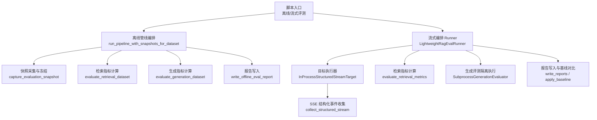
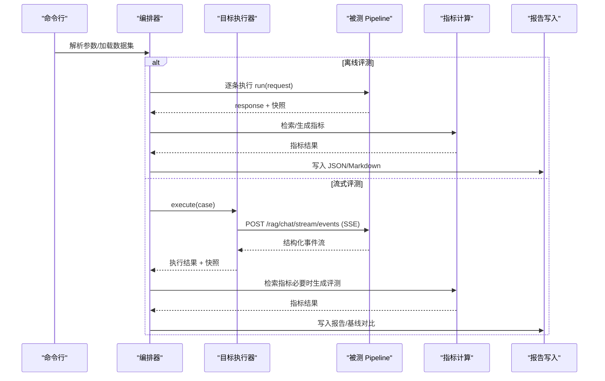
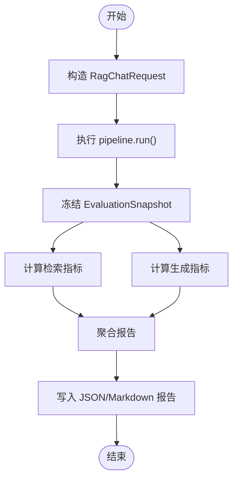
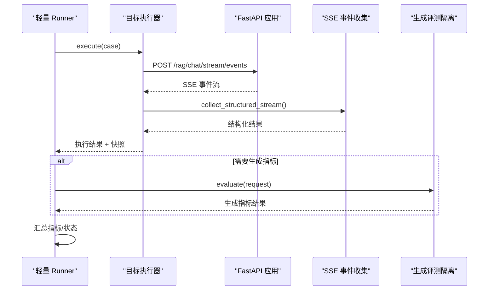
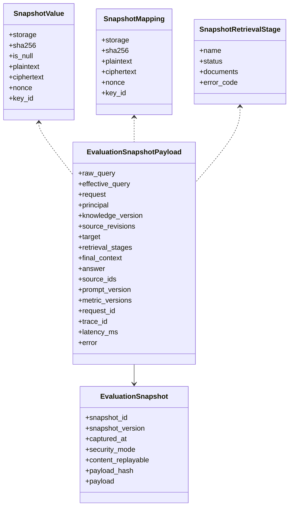
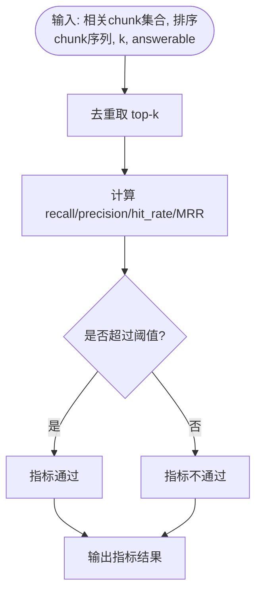
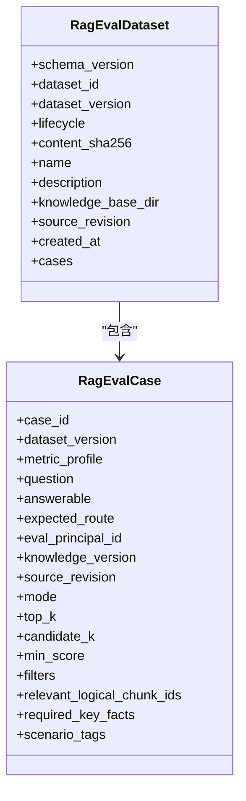
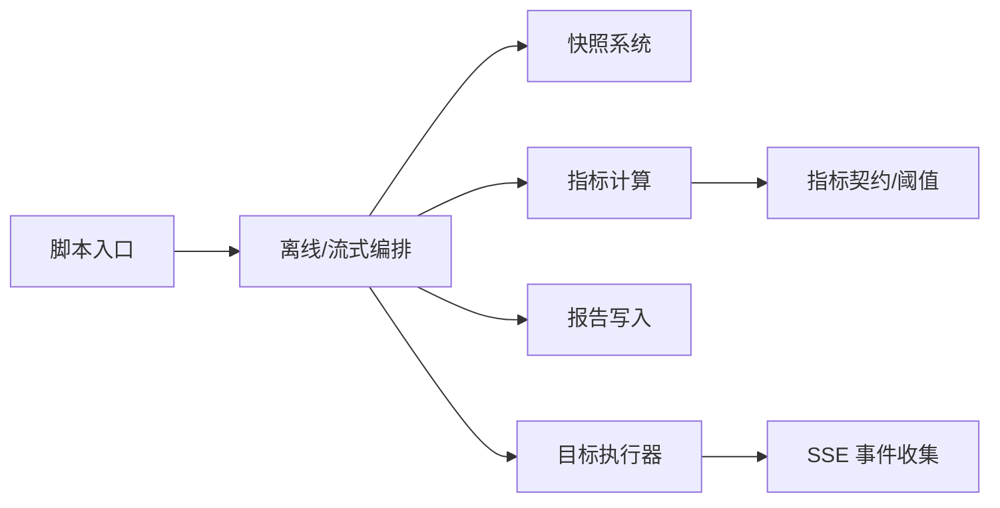

# 评估流水线

<cite>
**本文引用的文件**
- [run_real_offline_rag_eval.py](file://scripts/run_real_offline_rag_eval.py)
- [run_streaming_rag_eval.py](file://scripts/run_streaming_rag_eval.py)
- [runner.py（离线）](file://src/fast_app/evaluation/pipeline/runner.py)
- [models.py（离线报告模型）](file://src/fast_app/evaluation/pipeline/models.py)
- [models.py（评测用例与数据集）](file://src/fast_app/evaluation/cases/models.py)
- [target.py（流式目标执行）](file://src/fast_app/rag_eval/target.py)
- [runner.py（轻量流式编排）](file://src/fast_app/rag_eval/runner.py)
- [retrieval.py（检索指标）](file://src/fast_app/rag_eval/retrieval.py)
- [writer.py（离线报告写入）](file://src/fast_app/evaluation/reports/writer.py)
- [models.py（阈值模型）](file://src/fast_app/evaluation/thresholds/models.py)
</cite>

## 目录
1. [简介](#简介)
2. [项目结构](#项目结构)
3. [核心组件](#核心组件)
4. [架构总览](#架构总览)
5. [详细组件分析](#详细组件分析)
6. [依赖关系分析](#依赖关系分析)
7. [性能与资源管理](#性能与资源管理)
8. [故障排查指南](#故障排查指南)
9. [结论](#结论)
10. [附录：配置与运行](#附录：配置与运行)

## 简介
本文件系统化说明 RAG 评估流水线的实现与使用，覆盖离线评估与流式评估两条主线。重点解释：
- 评估任务编排：从数据加载、请求构造、被测 Pipeline 执行、快照冻结到指标计算与报告输出。
- 并行处理与结果收集：轻量流式 Runner 的顺序化执行策略、隔离生成评测、结构化 SSE 事件收集与快照聚合。
- 阶段划分：数据加载、检索执行、生成评估、结果聚合。
- 调度策略与错误处理：重试边界、可重试标记、失败分类、门禁阈值检查。
- 场景配置：Classic/LangGraph/RAG Agent 三种 Pipeline 提供者；检索、生成或全部指标模式；真实 LLM/Embedding/Reranker 切换。
- 监控与调试：快照完整性校验、路由意图校验、trace/request_id 对齐、报告 JSON/Markdown 双格式输出。
- 扩展实践：自定义评估步骤、新增指标、替换目标执行器、接入分布式 Worker 的约束与注意事项。

## 项目结构
评估相关代码主要分布在以下模块：
- scripts：命令行入口，负责参数解析、环境装配、Pipeline 构建、离线/流式评测调用与报告输出。
- src/fast_app/evaluation：离线评估的数据集模型、快照模型、指标计算、报告写入与阈值门禁。
- src/fast_app/rag_eval：流式评估的编排 Runner、目标执行器（ASGI + SSE）、检索指标、报告与基线对比。

**图示来源**
- [run_real_offline_rag_eval.py:43-118](file://scripts/run_real_offline_rag_eval.py#L43-L118)
- [run_streaming_rag_eval.py:55-142](file://scripts/run_streaming_rag_eval.py#L55-L142)
- [runner.py（离线）:80-190](file://src/fast_app/evaluation/pipeline/runner.py#L80-L190)
- [runner.py（轻量流式编排）:79-136](file://src/fast_app/rag_eval/runner.py#L79-L136)
- [target.py:110-195](file://src/fast_app/rag_eval/target.py#L110-L195)
- [writer.py:28-55](file://src/fast_app/evaluation/reports/writer.py#L28-L55)

**章节来源**
- [run_real_offline_rag_eval.py:43-118](file://scripts/run_real_offline_rag_eval.py#L43-L118)
- [run_streaming_rag_eval.py:55-142](file://scripts/run_streaming_rag_eval.py#L55-L142)
- [runner.py（离线）:80-190](file://src/fast_app/evaluation/pipeline/runner.py#L80-L190)
- [runner.py（轻量流式编排）:79-136](file://src/fast_app/rag_eval/runner.py#L79-L136)
- [target.py:110-195](file://src/fast_app/rag_eval/target.py#L110-L195)
- [writer.py:28-55](file://src/fast_app/evaluation/reports/writer.py#L28-L55)

## 核心组件
- 离线评测编排：将评测用例转换为真实 RAG 请求，逐条执行并冻结完整快照，随后基于快照计算检索与生成指标，输出统一报告。
- 流式评测编排：通过 ASGI 直接调用应用内接口，以 SSE 流方式收集结构化事件，结合快照与路由意图判定执行状态，再按模式选择检索/生成指标进行评测。
- 快照系统：对请求、身份、检索各阶段、最终上下文、答案等进行安全存储（明文/脱敏/加密），附带哈希校验，支持指标重算与审计。
- 指标体系：检索层包含 recall@k、precision@k、hit_rate@k、MRR；生成层由隔离进程执行 Judge，返回 faithfulness、answer_relevance、answer_completeness、context_utilization。
- 报告与门禁：JSON/Markdown 双格式报告；可选阈值门禁，支持 CI 集成。

**章节来源**
- [runner.py（离线）:80-190](file://src/fast_app/evaluation/pipeline/runner.py#L80-L190)
- [runner.py（轻量流式编排）:79-136](file://src/fast_app/rag_eval/runner.py#L79-L136)
- [models.py（离线报告模型）:234-379](file://src/fast_app/evaluation/pipeline/models.py#L234-L379)
- [retrieval.py:64-124](file://src/fast_app/rag_eval/retrieval.py#L64-L124)
- [writer.py:28-55](file://src/fast_app/evaluation/reports/writer.py#L28-L55)
- [models.py（阈值模型）:71-108](file://src/fast_app/evaluation/thresholds/models.py#L71-L108)

## 架构总览
评估流水线提供两种运行形态：
- 离线评测：直接调用被测 Pipeline 的 run 方法，捕获响应与快照，集中计算指标并写报告。
- 流式评测：通过 ASGI 调用 /rag/chat/stream/events，收集 SSE 事件，结合快照与路由判断，按需执行生成评测，输出报告并可叠加基线对比。

**图示来源**
- [run_real_offline_rag_eval.py:268-368](file://scripts/run_real_offline_rag_eval.py#L268-L368)
- [run_streaming_rag_eval.py:55-142](file://scripts/run_streaming_rag_eval.py#L55-L142)
- [runner.py（离线）:80-190](file://src/fast_app/evaluation/pipeline/runner.py#L80-L190)
- [target.py:110-195](file://src/fast_app/rag_eval/target.py#L110-L195)
- [runner.py（轻量流式编排）:79-136](file://src/fast_app/rag_eval/runner.py#L79-L136)

## 详细组件分析

### 离线评测编排与快照机制
- 请求构造：将 RagEvalCase 映射为 RagChatRequest，保留 mode/top_k/min_score/candidate_k/filters 等关键参数。
- 执行与快照：每条 case 仅调用一次 Pipeline，在上下文管理器中冻结请求、身份、检索各阶段、最终上下文、答案等，形成 EvaluationSnapshot。
- 指标计算：基于快照中的 final_context 与检索阶段文档列表，计算检索指标；基于 response 计算生成指标。
- 报告输出：汇总检索/生成报告，附带每个 case 的原始 response 与快照，便于回溯与重放。

**图示来源**
- [runner.py（离线）:40-190](file://src/fast_app/evaluation/pipeline/runner.py#L40-L190)
- [models.py（离线报告模型）:234-379](file://src/fast_app/evaluation/pipeline/models.py#L234-L379)
- [writer.py:28-55](file://src/fast_app/evaluation/reports/writer.py#L28-L55)

**章节来源**
- [runner.py（离线）:40-190](file://src/fast_app/evaluation/pipeline/runner.py#L40-L190)
- [models.py（离线报告模型）:234-379](file://src/fast_app/evaluation/pipeline/models.py#L234-L379)
- [writer.py:28-55](file://src/fast_app/evaluation/reports/writer.py#L28-L55)

### 流式评测编排与目标执行
- 目标执行器：封装 ASGI 调用、SSE 事件收集、认证头注入、身份校验、快照采集与错误分类。
- 执行流程：按 case 顺序执行，收集结构化事件，构建 RagChatResponse 与快照；根据 provider 与路由意图判定是否进入知识检索路径。
- 指标与隔离：检索指标直接基于快照计算；生成指标通过独立子进程执行，避免阻塞主流程且隔离外部依赖风险。
- 报告与基线：输出运行报告，支持加载基线报告进行差异对比。

**图示来源**
- [target.py:110-195](file://src/fast_app/rag_eval/target.py#L110-L195)
- [runner.py（轻量流式编排）:79-136](file://src/fast_app/rag_eval/runner.py#L79-L136)
- [run_streaming_rag_eval.py:55-142](file://scripts/run_streaming_rag_eval.py#L55-L142)

**章节来源**
- [target.py:110-195](file://src/fast_app/rag_eval/target.py#L110-L195)
- [runner.py（轻量流式编排）:79-136](file://src/fast_app/rag_eval/runner.py#L79-L136)
- [run_streaming_rag_eval.py:55-142](file://scripts/run_streaming_rag_eval.py#L55-L142)

### 数据模型与快照契约
- 快照值与映射：支持 plain/redacted/encrypted 三种安全模式，强制 SHA-256 校验，确保内容可追溯与不可篡改。
- 检索阶段快照：记录 vector/keyword/RRF/rerank 各阶段的状态与文档列表，便于诊断召回链路。
- 目标身份快照：记录 pipeline_provider、vector/keyword retriever、reranker、generator 等配置身份，保证实验可复现。
- 报告契约：离线报告包含 dataset_name、case/response 计数、检索/生成报告、每个 case 的 output 与 snapshot，以及合同版本信息。

**图示来源**
- [models.py（离线报告模型）:48-284](file://src/fast_app/evaluation/pipeline/models.py#L48-L284)

**章节来源**
- [models.py（离线报告模型）:48-284](file://src/fast_app/evaluation/pipeline/models.py#L48-L284)

### 检索指标与阈值门禁
- 检索指标：recall@k、precision@k、hit_rate@k、MRR，基于去重后的逻辑 chunk ID 序列计算，支持 underfilled 与 first_rank 诊断。
- 默认阈值：检索指标默认阈值为 0.5，可通过 thresholds 覆盖。
- 门禁检查：离线评测支持设置最低 recall@k、MRR 与 generation pass_rate，未通过时可返回非零退出码用于 CI 阻断。

**图示来源**
- [retrieval.py:64-124](file://src/fast_app/rag_eval/retrieval.py#L64-L124)
- [models.py（阈值模型）:71-108](file://src/fast_app/evaluation/thresholds/models.py#L71-L108)

**章节来源**
- [retrieval.py:64-124](file://src/fast_app/rag_eval/retrieval.py#L64-L124)
- [models.py（阈值模型）:71-108](file://src/fast_app/evaluation/thresholds/models.py#L71-L108)

### 评测用例与数据集契约
- 用例字段：question、answerable、expected_route、eval_principal_id、knowledge_version、mode、top_k、candidate_k、min_score、filters、relevant_logical_chunk_ids、required_key_facts、scenario_tags 等。
- 数据集契约：schema_version=2.0，dataset_version/source_revision 不可变，golden 数据集需包含已批准用例与完整场景矩阵。
- 校验规则：候选与禁止逻辑 chunk 不能重叠；父块扩展需同时提供父块与匹配子块；不可回答用例不得声明相关来源等。

**图示来源**
- [models.py（评测用例与数据集）:153-512](file://src/fast_app/evaluation/cases/models.py#L153-L512)

**章节来源**
- [models.py（评测用例与数据集）:153-512](file://src/fast_app/evaluation/cases/models.py#L153-L512)

## 依赖关系分析
- 脚本层依赖：离线脚本依赖 Milvus/Elasticsearch/LLM/Embedding/Reranker 客户端，组装 Pipeline 后调用离线评测；流式脚本依赖 FastAPI 应用与 SSE 客户端。
- 编排层依赖：离线编排依赖快照采集与指标计算；流式编排依赖目标执行器与隔离生成评测。
- 数据层依赖：快照与报告模型强约束，确保可重放与审计；阈值模型与指标契约绑定，防止版本漂移。

**图示来源**
- [run_real_offline_rag_eval.py:268-368](file://scripts/run_real_offline_rag_eval.py#L268-L368)
- [run_streaming_rag_eval.py:55-142](file://scripts/run_streaming_rag_eval.py#L55-L142)
- [runner.py（离线）:80-190](file://src/fast_app/evaluation/pipeline/runner.py#L80-L190)
- [runner.py（轻量流式编排）:79-136](file://src/fast_app/rag_eval/runner.py#L79-L136)
- [target.py:110-195](file://src/fast_app/rag_eval/target.py#L110-L195)

**章节来源**
- [run_real_offline_rag_eval.py:268-368](file://scripts/run_real_offline_rag_eval.py#L268-L368)
- [run_streaming_rag_eval.py:55-142](file://scripts/run_streaming_rag_eval.py#L55-L142)
- [runner.py（离线）:80-190](file://src/fast_app/evaluation/pipeline/runner.py#L80-L190)
- [runner.py（轻量流式编排）:79-136](file://src/fast_app/rag_eval/runner.py#L79-L136)
- [target.py:110-195](file://src/fast_app/rag_eval/target.py#L110-L195)

## 性能与资源管理
- 顺序执行策略：轻量流式 Runner 采用顺序执行，控制外部 Provider 与 Judge 压力，避免并发风暴导致服务抖动。
- 隔离生成评测：生成指标通过子进程执行，降低主进程风险，提高稳定性。
- 资源释放：离线脚本在 finally 中关闭 Milvus、Elasticsearch、HTTP 客户端，避免连接泄漏。
- 超时与重试：SSE 协议错误与网络传输错误区分，部分错误标记为可重试；生成评测失败被隔离并记录 error。
- 建议优化：
  - 批量场景优先使用离线评测，减少网络开销与鉴权成本。
  - 流式评测时限制 --max-cases 与 --metrics，聚焦关键指标快速回归。
  - 合理设置 top_k/candidate_k 与 min_score，平衡召回质量与延迟。
  - 使用 mock 组件进行单元测试与冒烟测试，减少外部依赖。

[本节为通用指导，无需具体文件引用]

## 故障排查指南
- 认证与身份：
  - 流式评测需在环境变量配置 RAG_EVAL_API_KEY 或 RAG_EVAL_BEARER_TOKEN；若启用认证但未配置凭据会报错。
  - 认证用户必须与 eval_principal_id 一致，否则抛出权限错误。
- 路由与检索：
  - Golden 要求普通 RAG 路径，若实际未进入 knowledge_retrieval，将被判定为 route_mismatch。
  - 不可回答 case 期望 NO_SEARCH_RESULT 错误，否则视为失败。
- 快照与上下文：
  - answerable case 必须捕获 final_context，缺失则失败。
  - 快照 security_mode 与 content_replayable 需一致，否则无法重放内容指标。
- 指标与阈值：
  - 检索指标默认阈值 0.5，可通过 thresholds 覆盖；未达阈值时报告中标记失败。
  - 生成评测隔离失败会被记录为 error，不影响其他指标统计。
- 报告与门禁：
  - 使用 --fail-on-threshold 可在任一阈值失败时返回非零退出码，便于 CI 阻断。
  - 报告 JSON/Markdown 双输出，便于人工复核与自动化解析。

**章节来源**
- [target.py:52-80](file://src/fast_app/rag_eval/target.py#L52-L80)
- [target.py:209-223](file://src/fast_app/rag_eval/target.py#L209-L223)
- [target.py:257-355](file://src/fast_app/rag_eval/target.py#L257-L355)
- [models.py（离线报告模型）:263-284](file://src/fast_app/evaluation/pipeline/models.py#L263-L284)
- [models.py（阈值模型）:71-108](file://src/fast_app/evaluation/thresholds/models.py#L71-L108)
- [run_real_offline_rag_eval.py:330-363](file://scripts/run_real_offline_rag_eval.py#L330-L363)

## 结论
该评估流水线通过“快照+指标”的双轨设计，实现了离线与流式两种评测形态的统一抽象：离线侧重高吞吐与可重放，流式贴近真实服务交互与结构化事件。通过严格的模型契约、路由校验与阈值门禁，保障了评测的可重复性与可审计性。推荐在生产回归中使用流式 Runner 配合隔离生成评测，在大规模回归与基准测试中使用离线 Runner 提升效率。

[本节为总结性内容，无需具体文件引用]

## 附录：配置与运行
- 离线评测命令要点：
  - 数据集路径、输出目录、Pipeline 提供者（classic/langgraph）、LLM/Embedding/Reranker 提供者、ES 认证开关、阈值与门禁选项。
  - 示例参数：--dataset、--output-dir、--pipeline-provider、--llm-provider、--embedding-provider、--reranker-provider、--use-es-auth、--print-json-summary、--min-retrieval-recall、--min-retrieval-mrr、--min-generation-pass-rate、--fail-on-threshold。
- 流式评测命令要点：
  - 指定 pipeline-provider（classic/langgraph/rag_agent）、mode（retrieval/generation/all）、数据集、case-id 过滤、max-cases、eval-principal、metrics、include-judge-reason、baseline-report、output-dir。
  - 示例参数：--pipeline-provider、--mode、--dataset、--case-id、--max-cases、--eval-principal、--metrics、--include-judge-reason、--baseline-report、--output-dir。
- 环境变量与认证：
  - RAG_PIPELINE_PROVIDER：固定 Pipeline 提供者。
  - RAG_EVAL_API_KEY 或 RAG_EVAL_BEARER_TOKEN：流式评测认证凭据。
  - ES 用户名/密码：如需启用 basic_auth。
- 报告与基线：
  - 离线报告：JSON/Markdown 双格式，路径由 writer 生成。
  - 流式报告：支持加载 baseline_report 进行差异对比。

**章节来源**
- [run_real_offline_rag_eval.py:43-118](file://scripts/run_real_offline_rag_eval.py#L43-L118)
- [run_streaming_rag_eval.py:16-52](file://scripts/run_streaming_rag_eval.py#L16-L52)
- [target.py:52-80](file://src/fast_app/rag_eval/target.py#L52-L80)
- [writer.py:28-55](file://src/fast_app/evaluation/reports/writer.py#L28-L55)
- [run_streaming_rag_eval.py:134-142](file://scripts/run_streaming_rag_eval.py#L134-L142)