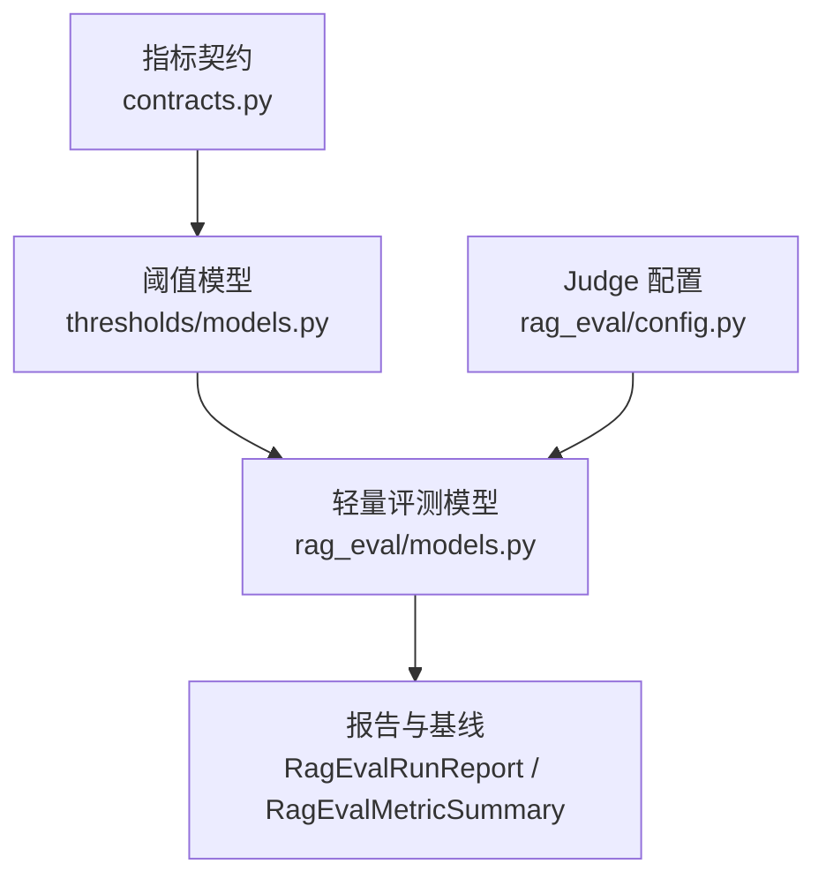
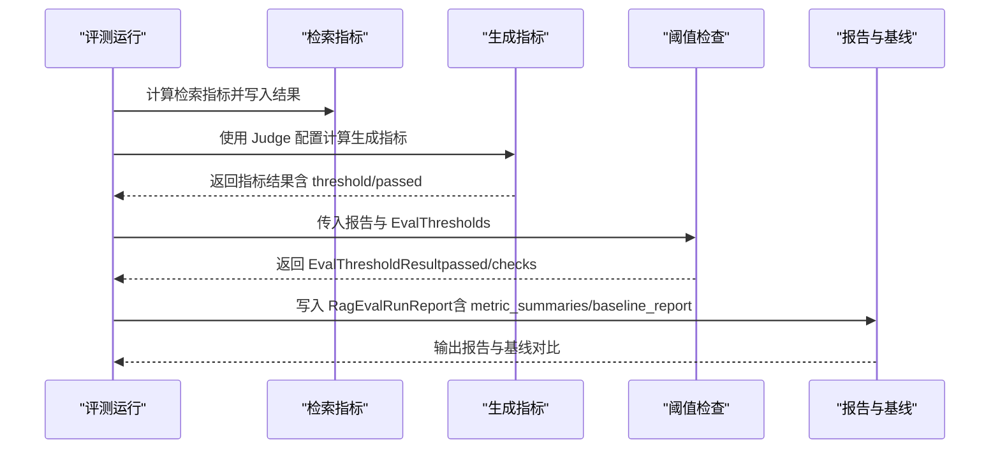
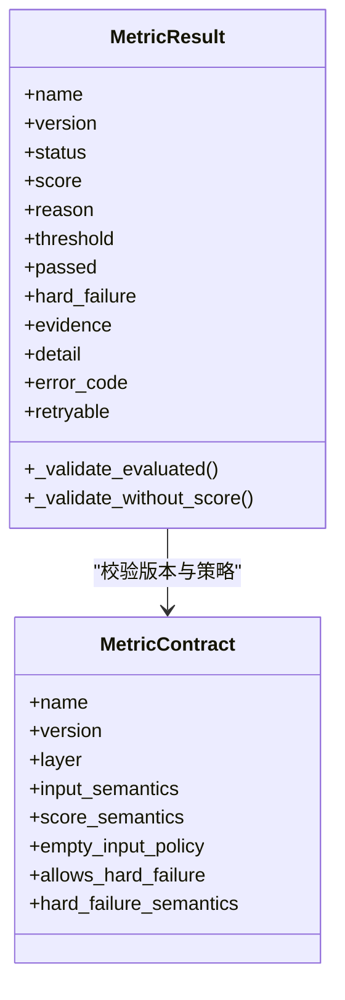
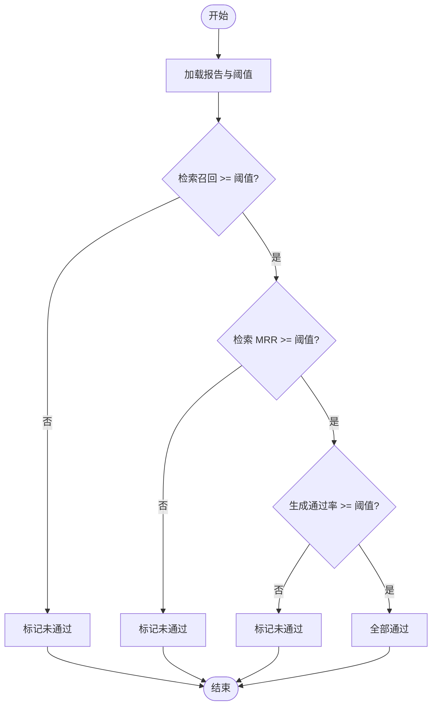
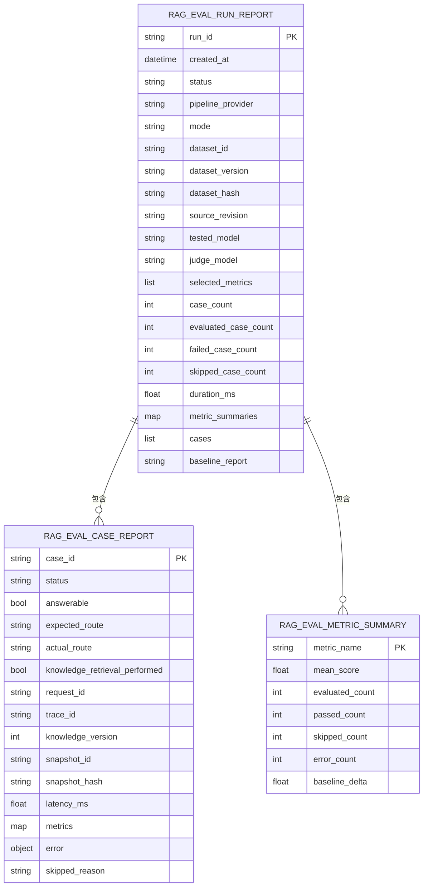
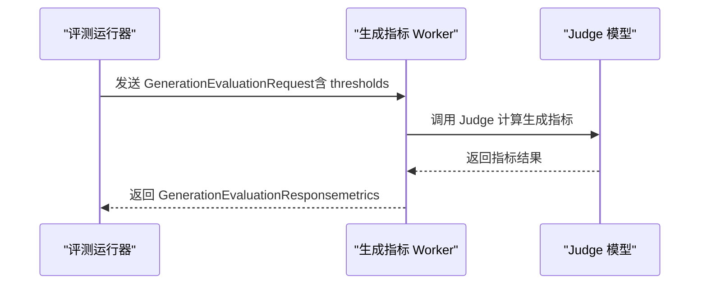
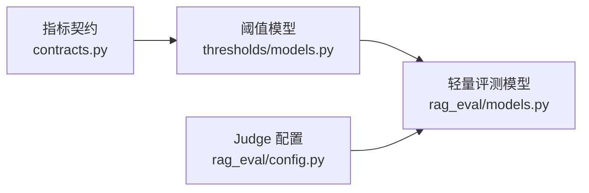

# 质量阈值管理

<cite>
**本文引用的文件**
- [contracts.py](file://python-agent-study/src/fast_app/evaluation/contracts.py)
- [models.py（阈值模型）](file://python-agent-study/src/fast_app/evaluation/thresholds/models.py)
- [__init__.py（阈值模块）](file://python-agent-study/src/fast_app/evaluation/thresholds/__init__.py)
- [config.py（评测 Judge 配置）](file://python-agent-study/src/fast_app/rag_eval/config.py)
- [models.py（轻量评测模型）](file://python-agent-study/src/fast_app/rag_eval/models.py)
</cite>

## 目录
1. [简介](#简介)
2. [项目结构](#项目结构)
3. [核心组件](#核心组件)
4. [架构总览](#架构总览)
5. [详细组件分析](#详细组件分析)
6. [依赖关系分析](#依赖关系分析)
7. [性能与稳定性考虑](#性能与稳定性考虑)
8. [故障排查指南](#故障排查指南)
9. [结论](#结论)
10. [附录：阈值调优与持续改进实践](#附录阈值调优与持续改进实践)

## 简介
本文件围绕“评估质量阈值”的定义、配置与动态调整机制，系统化说明检索与生成两类指标的质量门控策略、等级划分、验证规则与基线管理方法。文档基于仓库中已实现的指标契约、阈值模型与轻量评测输出模型，给出可操作的阈值管理方案，包括渐进式质量提升、异常检测与自动告警的配置思路，以及阈值调优最佳实践和持续改进工作流。

## 项目结构
质量阈值相关能力主要分布在以下模块：
- 指标契约层：定义八项指标的语义、版本与边界约束，确保指标结果可审计、可演进。
- 阈值模型层：提供按指标版本的最低分与硬失败策略，以及离线评测的汇总通过标准。
- 轻量评测模型层：统一报告结构，包含单 case 指标结果、数据集级摘要、运行元数据与基线对比字段。
- Judge 配置层：为生成层指标提供独立的 Judge 模型配置，便于隔离评测与稳定回归。

图表来源
- [contracts.py:26-154](file://python-agent-study/src/fast_app/evaluation/contracts.py#L26-L154)
- [models.py（阈值模型）:7-108](file://python-agent-study/src/fast_app/evaluation/thresholds/models.py#L7-L108)
- [models.py（轻量评测模型）:39-348](file://python-agent-study/src/fast_app/rag_eval/models.py#L39-L348)
- [config.py:11-71](file://python-agent-study/src/fast_app/rag_eval/config.py#L11-L71)

章节来源
- [contracts.py:26-154](file://python-agent-study/src/fast_app/evaluation/contracts.py#L26-L154)
- [models.py（阈值模型）:7-108](file://python-agent-study/src/fast_app/evaluation/thresholds/models.py#L7-L108)
- [models.py（轻量评测模型）:39-348](file://python-agent-study/src/fast_app/rag_eval/models.py#L39-L348)
- [config.py:11-71](file://python-agent-study/src/fast_app/rag_eval/config.py#L11-L71)

## 核心组件
- 指标契约（MetricContract/MetricResult）：为每项指标定义名称、版本、层级、输入/分数语义、空输入策略，以及是否允许硬失败与硬失败语义；对结果进行严格校验（状态、分数范围、证据、阈值一致性等）。
- 阈值配置（MetricThreshold/MetricThresholdProfile/EvalThresholds）：以指标版本为单位设置最低分与硬失败阻断策略；离线评测汇总三个关键阈值（检索召回、检索 MRR、生成通过率）。
- 轻量评测模型（RagEvalMetricResult/RagEvalCaseReport/RagEvalRunReport/RagEvalMetricSummary）：统一指标结果、case 报告、运行报告与指标摘要，支持基线对比字段 baseline_delta。
- Judge 配置（RagEvalJudgeSettings）：独立于主 LLM 的 Judge 模型配置，用于生成层指标的稳定判定。

章节来源
- [contracts.py:26-154](file://python-agent-study/src/fast_app/evaluation/contracts.py#L26-L154)
- [models.py（阈值模型）:7-108](file://python-agent-study/src/fast_app/evaluation/thresholds/models.py#L7-L108)
- [models.py（轻量评测模型）:39-348](file://python-agent-study/src/fast_app/rag_eval/models.py#L39-L348)
- [config.py:11-71](file://python-agent-study/src/fast_app/rag_eval/config.py#L11-L71)

## 架构总览
质量阈值管理的整体流程如下：
- 指标计算阶段：检索层与生成层分别产出指标结果，附带 score、threshold、passed 与 short_reason/error。
- 阈值判定阶段：使用 EvalThresholds 对检索与生成的聚合指标进行比较，得到 EvalThresholdResult。
- 报告与基线：RagEvalRunReport 记录本次运行的 selected_metrics、metric_summaries 与 baseline_report；RagEvalMetricSummary 提供 baseline_delta 用于基线变化度量。
- Judge 隔离：生成层指标通过独立 Judge 配置执行，避免与主 LLM 耦合，保证回归评测稳定性。

图表来源
- [models.py（轻量评测模型）:39-348](file://python-agent-study/src/fast_app/rag_eval/models.py#L39-L348)
- [models.py（阈值模型）:71-108](file://python-agent-study/src/fast_app/evaluation/thresholds/models.py#L71-L108)
- [config.py:11-71](file://python-agent-study/src/fast_app/rag_eval/config.py#L11-L71)

## 详细组件分析

### 指标契约与结果校验
- 指标集合：检索层四项（recall@K、precision@K、hit_rate@K、MRR），生成层四项（faithfulness、answer_relevance、answer_completeness、context_utilization）。
- 版本化契约：每个指标有唯一 version，结果必须匹配当前契约版本，防止漂移。
- 结果状态：evaluated/skipped/error 三种状态，分别对应不同字段约束（如 evaluated 必须有 0~1 的 score、evidence、threshold 与 passed 成对出现）。
- 硬失败：部分生成指标允许 hard_failure，触发时直接阻断质量门控。

图表来源
- [contracts.py:26-154](file://python-agent-study/src/fast_app/evaluation/contracts.py#L26-L154)

章节来源
- [contracts.py:26-154](file://python-agent-study/src/fast_app/evaluation/contracts.py#L26-L154)

### 阈值模型与离线评测门控
- MetricThreshold：针对具体指标版本设定 minimum_score 与 hard_failure_blocks，并进行范围与版本校验。
- MetricThresholdProfile：一组阈值配置的集合，禁止重复指标名，具备 profile_id/version 审计信息。
- EvalThresholds：离线评测的三项最低通过标准（检索召回、检索 MRR、生成通过率）。
- check_offline_eval_thresholds：将报告中的检索与生成聚合指标与阈值逐项比较，输出 EvalThresholdResult（passed 与 checks）。

图表来源
- [models.py（阈值模型）:71-108](file://python-agent-study/src/fast_app/evaluation/thresholds/models.py#L71-L108)

章节来源
- [models.py（阈值模型）:7-108](file://python-agent-study/src/fast_app/evaluation/thresholds/models.py#L7-L108)

### 轻量评测模型与基线管理
- RagEvalMetricResult：单项指标结果，包含 score/threshold/passed/status/short_reason/error，并对状态与字段一致性进行强校验。
- RagEvalCaseReport：单 case 报告，包含路由、快照、延迟、指标字典与错误/跳过原因。
- RagEvalRunReport：运行级报告，记录 selected_metrics、metric_summaries、baseline_report 等元数据，并提供一致性校验。
- RagEvalMetricSummary：数据集级指标摘要，包含 mean_score、evaluated_count、passed_count、skipped_count、error_count 与 baseline_delta。

图表来源
- [models.py（轻量评测模型）:191-348](file://python-agent-study/src/fast_app/rag_eval/models.py#L191-L348)

章节来源
- [models.py（轻量评测模型）:39-348](file://python-agent-study/src/fast_app/rag_eval/models.py#L39-L348)

### Judge 配置与生成指标隔离
- RagEvalJudgeSettings：独立 Judge 模型的 API key、base_url、model_name、temperature、timeout_seconds、max_retries，从环境变量构建，避免与主 LLM 耦合。
- 生成指标请求/响应：GenerationEvaluationRequest/Response 限定仅能执行 generation_* 指标，支持按指标覆盖阈值，并返回指标字典结果。

图表来源
- [config.py:11-71](file://python-agent-study/src/fast_app/rag_eval/config.py#L11-L71)
- [models.py（轻量评测模型）:124-188](file://python-agent-study/src/fast_app/rag_eval/models.py#L124-L188)

章节来源
- [config.py:11-71](file://python-agent-study/src/fast_app/rag_eval/config.py#L11-L71)
- [models.py（轻量评测模型）:124-188](file://python-agent-study/src/fast_app/rag_eval/models.py#L124-L188)

## 依赖关系分析
- 指标契约是阈值模型的基础：MetricThreshold 在构造时会校验 metric_version 与契约版本一致，确保阈值与指标语义绑定。
- 阈值检查依赖轻量评测报告：check_offline_eval_thresholds 读取 report.retrieval_report 与 report.generation_report 的聚合指标，并与 EvalThresholds 比较。
- 报告模型承载基线对比：RagEvalRunReport.baseline_report 与 RagEvalMetricSummary.baseline_delta 共同支撑基线管理与变化量追踪。
- Judge 配置影响生成指标稳定性：独立配置使生成层指标不受主 LLM 变更影响，利于回归评测。

图表来源
- [contracts.py:26-154](file://python-agent-study/src/fast_app/evaluation/contracts.py#L26-L154)
- [models.py（阈值模型）:7-108](file://python-agent-study/src/fast_app/evaluation/thresholds/models.py#L7-L108)
- [models.py（轻量评测模型）:39-348](file://python-agent-study/src/fast_app/rag_eval/models.py#L39-L348)
- [config.py:11-71](file://python-agent-study/src/fast_app/rag_eval/config.py#L11-L71)

章节来源
- [contracts.py:26-154](file://python-agent-study/src/fast_app/evaluation/contracts.py#L26-L154)
- [models.py（阈值模型）:7-108](file://python-agent-study/src/fast_app/evaluation/thresholds/models.py#L7-L108)
- [models.py（轻量评测模型）:39-348](file://python-agent-study/src/fast_app/rag_eval/models.py#L39-L348)
- [config.py:11-71](file://python-agent-study/src/fast_app/rag_eval/config.py#L11-L71)

## 性能与稳定性考虑
- 指标计算隔离：检索与生成指标分离，生成指标通过独立 Judge 配置执行，降低主链路抖动对评测的影响。
- 阈值校验前置：MetricThreshold 与 MetricResult 的 post_init/model_validator 在构造阶段完成版本与范围校验，尽早发现配置错误。
- 报告一致性校验：RagEvalRunReport 对计数、selected_metrics、summary 键等进行一致性校验，保障报告可信度。
- 重试与超时：Judge 配置支持 timeout_seconds 与 max_retries，可在不稳定网络或外部服务波动时提高鲁棒性。

[本节为通用指导，不直接分析具体文件]

## 故障排查指南
- 指标版本不一致：若 MetricResult.version 与契约版本不匹配，会抛出错误；请检查指标实现与契约版本对齐。
- 状态与字段不合法：evaluated 必须携带 score/threshold/passed；skipped/error 不得携带这些字段；error 状态必须提供 error_code。
- 阈值范围非法：minimum_score 必须在 0~1；threshold 也需满足相同范围。
- 硬失败误用：不允许 hard_failure 的指标不可标记 hard_failure；已标记 hard_failure 的指标不能同时 passed=True。
- 报告计数不一致：case_count 与 evaluated/failed/skipped 计数之和必须相等；selected_metrics 与 metric_summaries 的键必须一致。

章节来源
- [contracts.py:99-154](file://python-agent-study/src/fast_app/evaluation/contracts.py#L99-L154)
- [models.py（阈值模型）:16-24](file://python-agent-study/src/fast_app/evaluation/thresholds/models.py#L16-L24)
- [models.py（轻量评测模型）:71-84](file://python-agent-study/src/fast_app/rag_eval/models.py#L71-L84)
- [models.py（轻量评测模型）:324-348](file://python-agent-study/src/fast_app/rag_eval/models.py#L324-L348)

## 结论
该项目的质量阈值管理以“指标契约 + 阈值模型 + 轻量评测报告”为核心，实现了版本化、可审计、可回滚的质量门控。通过检索与生成分层、Judge 隔离与严格的字段校验，系统能够在回归评测中稳定地判断质量是否达标，并借助基线字段追踪变化趋势。结合阈值调优与持续改进流程，可实现渐进式质量提升与自动化质量治理。

[本节为总结性内容，不直接分析具体文件]

## 附录：阈值调优与持续改进实践
- 质量门控配置建议
  - 检索层：优先保障 recall@K 与 MRR 的最低门槛，避免漏检导致下游生成质量下降。
  - 生成层：以 pass_rate 作为总体门控，并结合 faithfulness/completeness 的单项阈值控制事实正确性与完整性。
  - 硬失败策略：对关键事实缺失或关键声明不支持的场景启用 hard_failure，直接阻断发布。
- 渐进式质量提升
  - 基线先行：以 baseline_report 与 baseline_delta 建立历史基线，逐步收紧阈值。
  - 小步快跑：每次迭代只调整一个或两个指标阈值，观察 delta 与通过率变化，避免一次性大幅收紧。
  - 指标分层：先优化检索召回与相关性，再优化生成忠实度与完整性，最后提升上下文利用率。
- 阈值验证规则
  - 版本绑定：所有阈值必须绑定到指标契约版本，避免语义漂移。
  - 范围校验：阈值与分数均在 0~1，越界即报错。
  - 状态约束：evaluated/skipped/error 的字段组合受严格约束，确保报告可读与可判。
- 异常检测与自动告警
  - 指标错误率监控：当某指标 error_count 突增，触发告警并暂停发布。
  - 基线回退告警：当 baseline_delta 低于阈值（如负向变化超过容忍区间），触发回滚或人工评审。
  - 硬失败告警：一旦触发 hard_failure，立即阻断流水线并通知责任人。
- 持续改进工作流
  - 数据采集：收集 case 级指标与报告，沉淀到基线库。
  - 阈值评审：定期回顾阈值与 delta，结合业务目标调整。
  - 回归测试：每次变更运行轻量评测，确保通过阈值门控。
  - 发布门禁：未通过 EvalThresholdResult 的变更禁止合并或发布。

[本节为方法论与实践建议，不直接分析具体文件]