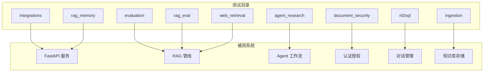
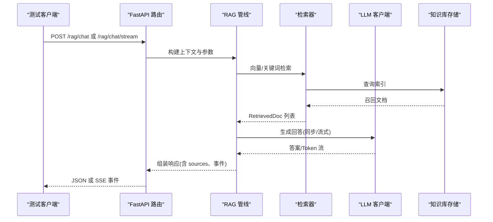
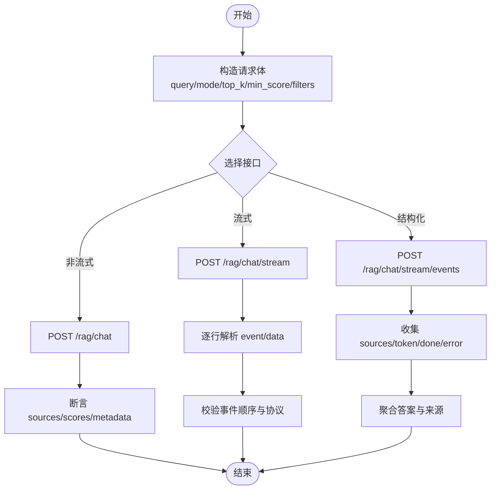
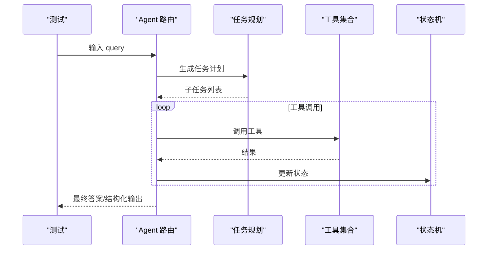
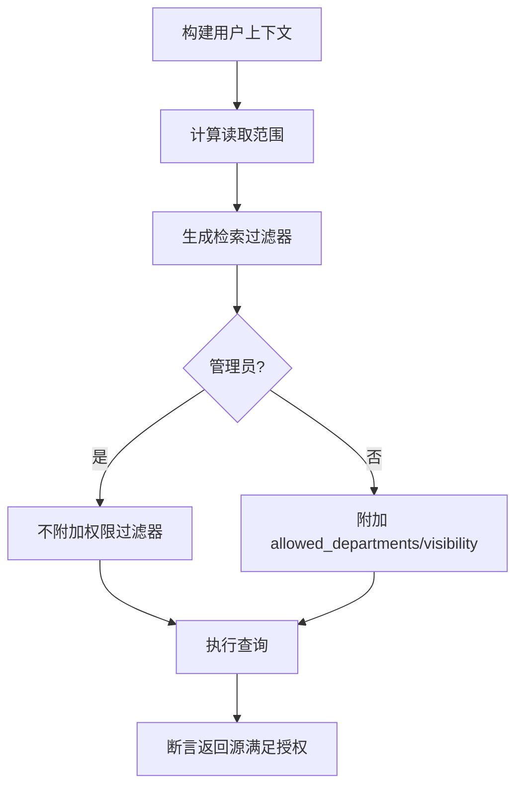
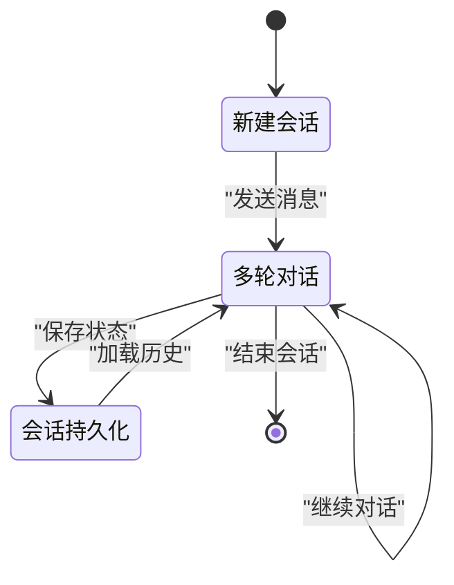
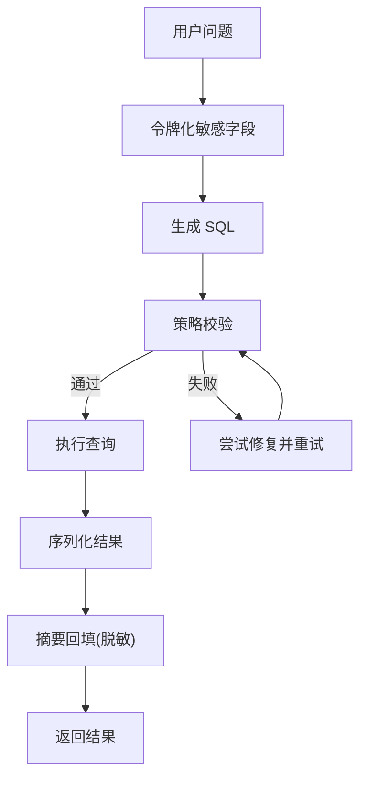
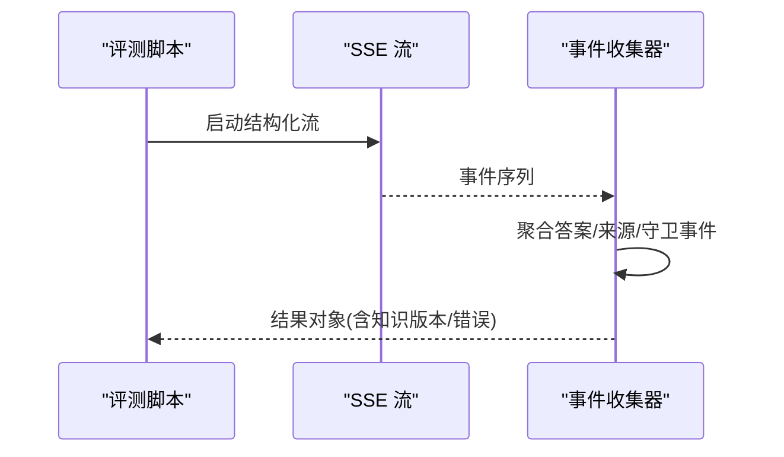
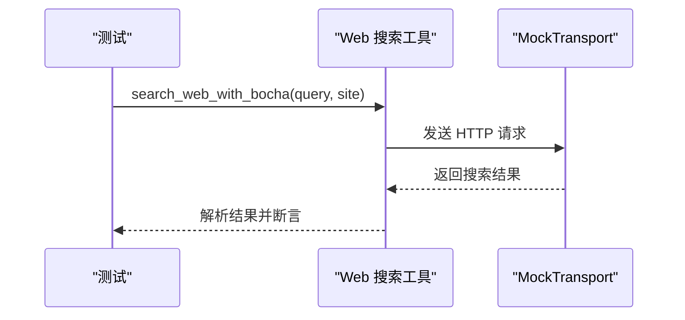
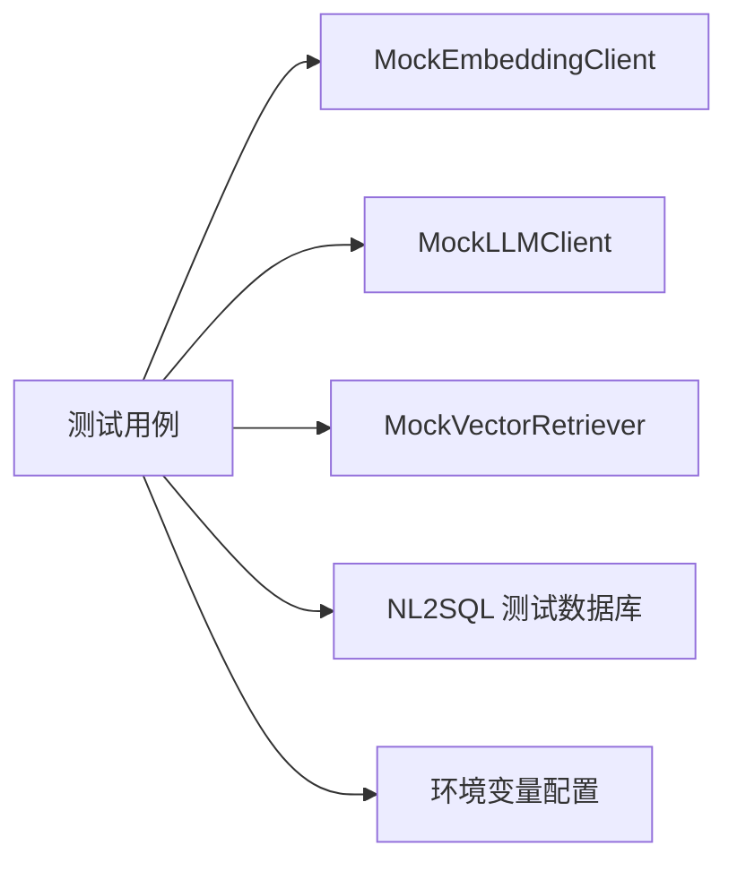

# 单元测试

<cite>
**本文引用的文件**
- [test_rag_chat_api.py](file://scripts/tests/rag_memory/test_rag_chat_api.py)
- [test_department_rag_acl_acceptance.py](file://scripts/tests/document_security/test_department_rag_acl_acceptance.py)
- [test_eval_dataset_v2.py](file://scripts/tests/evaluation/test_eval_dataset_v2.py)
- [test_nl2sql_module.py](file://scripts/tests/nl2sql/test_nl2sql_module.py)
- [test_stream_collector.py](file://scripts/tests/rag_eval/test_stream_collector.py)
- [test_web_search_tool.py](file://scripts/tests/web_retrieval/test_web_search_tool.py)
- [mock_embedding_client.py](file://src/fast_app/components/embeddings/mock_embedding_client.py)
- [mock_llm_client.py](file://src/fast_app/components/llms/mock_llm_client.py)
- [mock_vector_retriever.py](file://src/fast_app/components/retrievers/mock_vector_retriever.py)
- [bootstrap_test_databases.py](file://scripts/nl2sql/bootstrap_test_databases.py)
</cite>

## 目录
1. [简介](#简介)
2. [项目结构](#项目结构)
3. [核心组件](#核心组件)
4. [架构总览](#架构总览)
5. [详细组件分析](#详细组件分析)
6. [依赖关系分析](#依赖关系分析)
7. [性能考虑](#性能考虑)
8. [故障排查指南](#故障排查指南)
9. [结论](#结论)
10. [附录](#附录)

## 简介
本指南面向开发者，系统化说明本项目中单元测试的组织方式与最佳实践。内容覆盖测试目录结构、用例组织策略、RAG 组件、Agent 工作流、认证授权、对话管理等核心功能的测试方法；并给出测试数据准备、Mock 策略、异步测试与性能基准测试的实施建议与示例路径，帮助编写高质量、可维护的单元测试。

## 项目结构
项目的测试主要位于 scripts/tests 下，按功能域划分：
- agent_research：Agent 路由、任务分解、工具循环、对话上下文等
- document_security：文档安全、部门级 ACL、权限迁移、流式防护等
- evaluation：评测数据集校验、指标契约、快照等
- ingestion：Markdown、Office 文档入库流程
- integrations：外部集成（MCP、LangSmith、GitLab）
- nl2sql：NL2SQL 模块、授权、API 契约、真实数据库回归
- rag_eval：SSE 结构化事件聚合、采集器、生成子进程等
- rag_memory：RAG 聊天 API、Provider 矩阵、多轮记忆等
- web_retrieval：网页检索工具、过滤、重定向错误等

此外，src/app/test 下有少量早期或学习性质的测试样例。

**章节来源**
- [test_rag_chat_api.py:1-120](file://scripts/tests/rag_memory/test_rag_chat_api.py#L1-L120)
- [test_department_rag_acl_acceptance.py:1-60](file://scripts/tests/document_security/test_department_rag_acl_acceptance.py#L1-L60)
- [test_eval_dataset_v2.py:1-40](file://scripts/tests/evaluation/test_eval_dataset_v2.py#L1-L40)
- [test_nl2sql_module.py:1-40](file://scripts/tests/nl2sql/test_nl2sql_module.py#L1-L40)
- [test_stream_collector.py:1-20](file://scripts/tests/rag_eval/test_stream_collector.py#L1-L20)
- [test_web_search_tool.py:1-20](file://scripts/tests/web_retrieval/test_web_search_tool.py#L1-L20)

## 核心组件
- RAG 组件测试：通过 HTTP 接口与非流式/流式 SSE 断言，验证检索来源、分数、元数据、错误事件与调试追踪响应结构。
- Agent 工作流测试：围绕任务分解、路由澄清、工具循环、结构化输出传输等进行端到端或单元级验证。
- 认证授权测试：基于部门级 ACL 的策略与过滤器契约，结合登录、用户信息、RAG 查询返回源进行授权断言。
- 对话管理测试：关注消息顺序、历史窗口、会话持久化与多用户隔离。
- NL2SQL 测试：SQL 安全策略、敏感信息脱敏、修复重试、序列化与限制行数等。
- 评测与流式聚合：对 SSE 结构化事件进行协议一致性、错误处理与结果聚合断言。
- Web 检索工具：使用 MockTransport 模拟外部搜索服务，验证请求构造与结果解析。

**章节来源**
- [test_rag_chat_api.py:302-466](file://scripts/tests/rag_memory/test_rag_chat_api.py#L302-L466)
- [test_department_rag_acl_acceptance.py:46-100](file://scripts/tests/document_security/test_department_rag_acl_acceptance.py#L46-L100)
- [test_nl2sql_module.py:184-281](file://scripts/tests/nl2sql/test_nl2sql_module.py#L184-L281)
- [test_stream_collector.py:17-53](file://scripts/tests/rag_eval/test_stream_collector.py#L17-L53)
- [test_web_search_tool.py:18-64](file://scripts/tests/web_retrieval/test_web_search_tool.py#L18-L64)

## 架构总览
下图展示典型 RAG 聊天请求在测试中的调用链：客户端发起请求，经过 FastAPI 路由进入 RAG 管线，执行检索、排序、LLM 生成，并以非流式或 SSE 结构化事件返回。测试脚本负责构造请求、解析响应、断言结构与业务规则。

**图表来源**
- [test_rag_chat_api.py:302-466](file://scripts/tests/rag_memory/test_rag_chat_api.py#L302-L466)
- [test_stream_collector.py:17-53](file://scripts/tests/rag_eval/test_stream_collector.py#L17-L53)

**章节来源**
- [test_rag_chat_api.py:302-466](file://scripts/tests/rag_memory/test_rag_chat_api.py#L302-L466)
- [test_stream_collector.py:17-53](file://scripts/tests/rag_eval/test_stream_collector.py#L17-L53)

## 详细组件分析

### RAG 组件测试
- 非流式接口断言：检查 sources 存在且包含 scores、retrieval_sources、metadata，并按 filters 校验 source_path 与 section_path。
- 调试追踪接口：断言 debug 响应包含 status、request、runtime、latency_ms、error 字段，并在失败时仍返回快照。
- 流式接口：解析 SSE 事件（sources、token、done、error），确保事件顺序与协议正确性。
- 结构化流式：收集 sources、token、guard 事件与 done，断言聚合结果与知识版本。

**图表来源**
- [test_rag_chat_api.py:302-466](file://scripts/tests/rag_memory/test_rag_chat_api.py#L302-L466)
- [test_rag_chat_api.py:475-764](file://scripts/tests/rag_memory/test_rag_chat_api.py#L475-L764)
- [test_stream_collector.py:17-53](file://scripts/tests/rag_eval/test_stream_collector.py#L17-L53)

**章节来源**
- [test_rag_chat_api.py:302-466](file://scripts/tests/rag_memory/test_rag_chat_api.py#L302-L466)
- [test_rag_chat_api.py:475-764](file://scripts/tests/rag_memory/test_rag_chat_api.py#L475-L764)
- [test_stream_collector.py:17-53](file://scripts/tests/rag_eval/test_stream_collector.py#L17-L53)

### Agent 工作流测试
- 任务分解与路由：验证任务计划拆解、路由决策、工具调用循环与终止条件。
- 结构化输出传输：确保 Agent 输出符合预期 schema，便于下游消费。
- 对话上下文：检查消息顺序、历史窗口与上下文构建。

**图表来源**
- [test_agent_task_plan_decomposition.py](file://scripts/tests/agent_research/test_agent_task_plan_decomposition.py)
- [test_agent_task_tool_loop.py](file://scripts/tests/agent_research/test_agent_task_tool_loop.py)
- [test_structured_output_transport.py](file://scripts/tests/agent_research/test_structured_output_transport.py)

**章节来源**
- [test_agent_task_plan_decomposition.py](file://scripts/tests/agent_research/test_agent_task_plan_decomposition.py)
- [test_agent_task_tool_loop.py](file://scripts/tests/agent_research/test_agent_task_tool_loop.py)
- [test_structured_output_transport.py](file://scripts/tests/agent_research/test_structured_output_transport.py)

### 认证授权测试
- 策略与过滤器契约：根据当前用户上下文构建检索范围，断言 ES 与 Milvus 过滤器包含正确的权限约束。
- 数据库种子检查：验证 Alembic 版本与部门种子数据。
- HTTP 场景：登录获取 token，查询 /auth/me 确认部门范围，调用 /rag/chat 断言返回源均被授权。

**图表来源**
- [test_department_rag_acl_acceptance.py:46-100](file://scripts/tests/document_security/test_department_rag_acl_acceptance.py#L46-L100)
- [test_department_rag_acl_acceptance.py:167-254](file://scripts/tests/document_security/test_department_rag_acl_acceptance.py#L167-L254)

**章节来源**
- [test_department_rag_acl_acceptance.py:46-100](file://scripts/tests/document_security/test_department_rag_acl_acceptance.py#L46-L100)
- [test_department_rag_acl_acceptance.py:167-254](file://scripts/tests/document_security/test_department_rag_acl_acceptance.py#L167-L254)

### 对话管理测试
- 消息顺序：验证多轮对话中消息序列的正确性与稳定性。
- 历史窗口：保留最近 N 轮消息，避免上下文膨胀。
- 会话持久化：将对话状态写入 PostgreSQL，支持跨请求恢复。

**图表来源**
- [test_conversation_message_order.py](file://scripts/tests/agent_research/test_conversation_message_order.py)

**章节来源**
- [test_conversation_message_order.py](file://scripts/tests/agent_research/test_conversation_message_order.py)

### NL2SQL 模块测试
- SQL 安全策略：禁止危险语句、限制视图访问、强制参数化与行数上限。
- 敏感信息脱敏：问题中的实体值替换为占位符，结果摘要回填但不泄露原始值。
- 修复重试：遇到可修复 SQL 错误时自动重试一次，保证健壮性。
- 序列化与限制：Decimal、datetime 等类型序列化，长文本截断与警告。

**图表来源**
- [test_nl2sql_module.py:184-281](file://scripts/tests/nl2sql/test_nl2sql_module.py#L184-L281)

**章节来源**
- [test_nl2sql_module.py:184-281](file://scripts/tests/nl2sql/test_nl2sql_module.py#L184-L281)

### 评测与流式聚合测试
- 数据集契约：校验黄金集版本、生命周期、完整性、审查门禁与内容 SHA256。
- 流式事件聚合：收集 agent_route_selected、sources、answer_delta、guard_sanitized/blocked、done 等事件，断言聚合结果与协议一致性。

**图表来源**
- [test_eval_dataset_v2.py:67-155](file://scripts/tests/evaluation/test_eval_dataset_v2.py#L67-L155)
- [test_stream_collector.py:17-53](file://scripts/tests/rag_eval/test_stream_collector.py#L17-L53)

**章节来源**
- [test_eval_dataset_v2.py:67-155](file://scripts/tests/evaluation/test_eval_dataset_v2.py#L67-L155)
- [test_stream_collector.py:17-53](file://scripts/tests/rag_eval/test_stream_collector.py#L17-L53)

### Web 检索工具测试
- 使用 httpx.MockTransport 模拟外部搜索引擎，验证请求体构造（如 summary、site 前缀）与结果解析。
- 可选真实模式：当传入 --real 时，实际调用外部服务并断言域名过滤。

**图表来源**
- [test_web_search_tool.py:18-64](file://scripts/tests/web_retrieval/test_web_search_tool.py#L18-L64)

**章节来源**
- [test_web_search_tool.py:18-64](file://scripts/tests/web_retrieval/test_web_search_tool.py#L18-L64)

## 依赖关系分析
- 测试与 Mock 组件：
  - MockEmbeddingClient：稳定生成固定维度向量，用于本地验证 ingestion/retrieval/evaluation 链路。
  - MockLLMClient：提供同步/流式生成，记录延迟与慢操作日志。
  - MockVectorRetriever：返回预定义 RetrievedDoc 列表，便于断言检索逻辑。
- 测试数据与环境：
  - NL2SQL 测试数据库初始化脚本创建专用数据库并执行种子 SQL。
  - Provider 矩阵测试通过环境变量切换不同实现，支持 mock-only 与 real-only 筛选。

**图表来源**
- [mock_embedding_client.py:1-31](file://src/fast_app/components/embeddings/mock_embedding_client.py#L1-L31)
- [mock_llm_client.py:17-108](file://src/fast_app/components/llms/mock_llm_client.py#L17-L108)
- [mock_vector_retriever.py:7-30](file://src/fast_app/components/retrievers/mock_vector_retriever.py#L7-L30)
- [bootstrap_test_databases.py:1-53](file://scripts/nl2sql/bootstrap_test_databases.py#L1-L53)

**章节来源**
- [mock_embedding_client.py:1-31](file://src/fast_app/components/embeddings/mock_embedding_client.py#L1-L31)
- [mock_llm_client.py:17-108](file://src/fast_app/components/llms/mock_llm_client.py#L17-L108)
- [mock_vector_retriever.py:7-30](file://src/fast_app/components/retrievers/mock_vector_retriever.py#L7-L30)
- [bootstrap_test_databases.py:1-53](file://scripts/nl2sql/bootstrap_test_databases.py#L1-L53)

## 性能考虑
- 使用 Mock 组件降低外部依赖成本，提升测试速度与稳定性。
- 利用 MockLLMClient 的延迟与慢操作日志，评估 LLM 调用耗时阈值。
- 流式接口测试应关注事件顺序与协议一致性，避免阻塞。
- 对于真实服务测试，建议使用 --real-only 或 --mock-only 控制范围，减少不必要开销。

[本节为通用指导，无需具体文件引用]

## 故障排查指南
- RAG 聊天错误：非流式接口在业务失败时返回 JSON 错误，包含 code、message、error_category、error_type；调试接口在失败时仍返回快照。
- 流式错误：SSE error 事件携带错误码与消息，需断言事件出现与内容。
- NL2SQL 安全：非法 SQL 会抛出安全错误；修复重试仅允许一次，避免无限循环。
- 评测数据集：版本不一致、审查未通过或内容篡改会触发校验错误。

**章节来源**
- [test_rag_chat_api.py:406-437](file://scripts/tests/rag_memory/test_rag_chat_api.py#L406-L437)
- [test_rag_chat_api.py:715-764](file://scripts/tests/rag_memory/test_rag_chat_api.py#L715-L764)
- [test_nl2sql_module.py:28-38](file://scripts/tests/nl2sql/test_nl2sql_module.py#L28-L38)
- [test_eval_dataset_v2.py:175-263](file://scripts/tests/evaluation/test_eval_dataset_v2.py#L175-L263)

## 结论
本项目测试体系以功能域为纲，结合 Mock 与真实环境，覆盖了 RAG、Agent、认证授权、对话管理与 NL2SQL 等关键能力。通过结构化断言、协议一致性检查与安全策略验证，确保系统在开发与演进过程中的质量与稳定性。建议遵循本文的最佳实践，持续完善测试覆盖率与可维护性。

[本节为总结，无需具体文件引用]

## 附录
- 快速开始：
  - 运行 RAG 聊天测试：参考 test_rag_chat_api.py 的命令行参数与断言函数。
  - 运行部门 ACL 验收：参考 test_department_rag_acl_acceptance.py 的登录与查询流程。
  - 运行 NL2SQL 模块测试：参考 test_nl2sql_module.py 的安全策略与修复重试。
  - 运行评测数据集校验：参考 test_eval_dataset_v2.py 的版本与完整性检查。
  - 运行流式聚合测试：参考 test_stream_collector.py 的事件协议断言。
  - 运行 Web 检索工具测试：参考 test_web_search_tool.py 的 MockTransport 用法。

[本节为指引，无需具体文件引用]