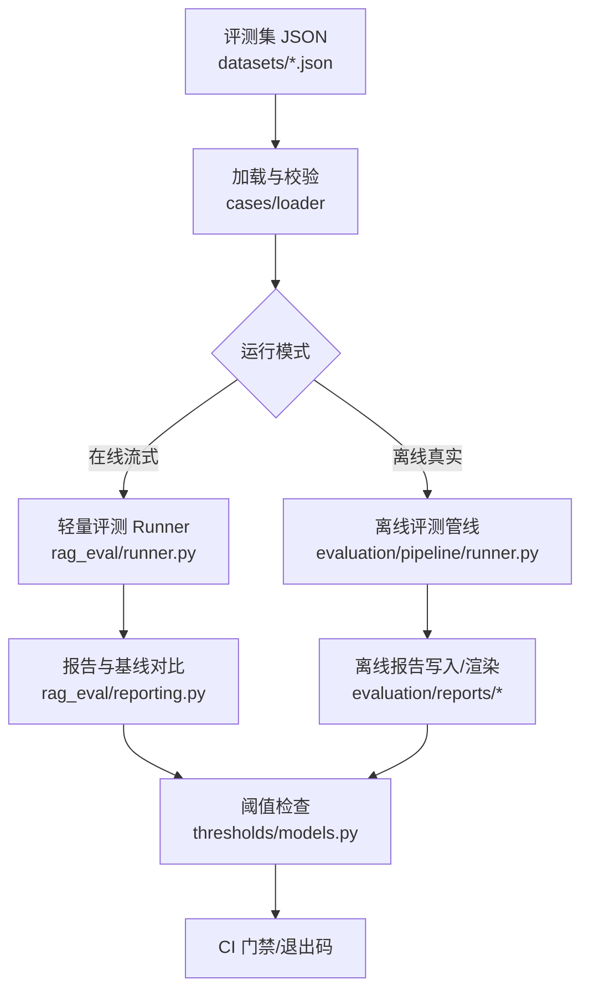
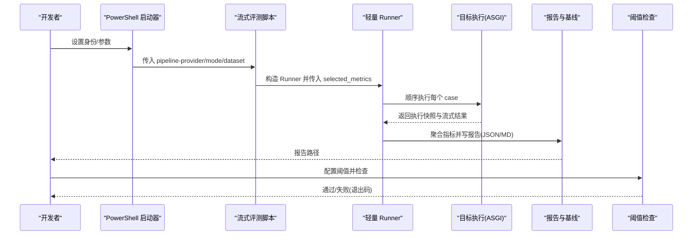
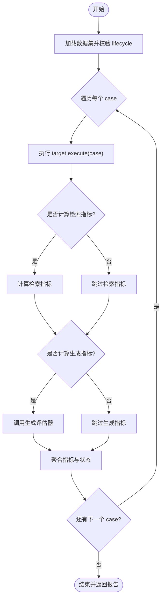
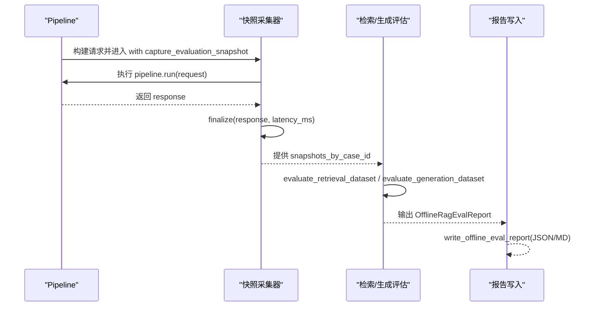
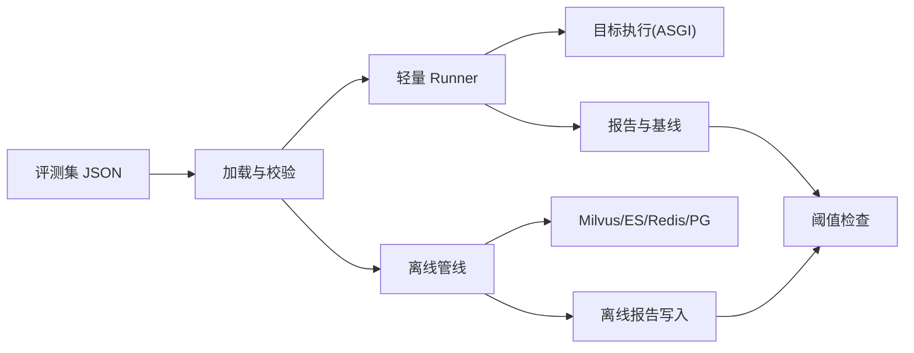

# 回归测试

<cite>
**本文引用的文件**
- [HANDOFF-eval-dataset-v2.1.md](file://python-agent-study/.codex/HANDOFF-eval-dataset-v2.1.md)
- [stage11_rag_eval_cases.v2.1.0.json](file://python-agent-study/src/fast_app/evaluation/datasets/stage11_rag_eval_cases.v2.1.0.json)
- [run_streaming_rag_eval.py](file://python-agent-study/scripts/run_streaming_rag_eval.py)
- [runner.py（轻量流式评测）](file://python-agent-study/src/fast_app/rag_eval/runner.py)
- [reporting.py（轻量报告与基线对比）](file://python-agent-study/src/fast_app/rag_eval/reporting.py)
- [test_eval_dataset_v2.py](file://python-agent-study/scripts/tests/evaluation/test_eval_dataset_v2.py)
- [build_eval_dataset_v2_1.py](file://python-agent-study/.tmp/build_eval_dataset_v2_1.py)
- [summarize_eval_report.py](file://python-agent-study/.tmp/summarize_eval_report.py)
- [run_rag_eval_local.ps1](file://python-agent-study/run_rag_eval_local.ps1)
- [run_real_offline_rag_eval.py](file://python-agent-study/scripts/run_real_offline_rag_eval.py)
- [pipeline_runner.py（离线评测管线）](file://python-agent-study/src/fast_app/evaluation/pipeline/runner.py)
- [thresholds_models.py（阈值模型）](file://python-agent-study/src/fast_app/evaluation/thresholds/models.py)
- [writer.py（离线报告写入）](file://python-agent-study/src/fast_app/evaluation/reports/writer.py)
- [rendering.py（离线报告渲染）](file://python-agent-study/src/fast_app/evaluation/reports/rendering.py)
</cite>

## 目录
1. [简介](#简介)
2. [项目结构](#项目结构)
3. [核心组件](#核心组件)
4. [架构总览](#架构总览)
5. [详细组件分析](#详细组件分析)
6. [依赖关系分析](#依赖关系分析)
7. [性能考虑](#性能考虑)
8. [故障排查指南](#故障排查指南)
9. [结论](#结论)
10. [附录](#附录)

## 简介
本实践指南面向基于评估数据集的自动化回归测试，覆盖从数据集维护、批量执行、结果比较到 CI/CD 集成与质量门禁的全流程。仓库已提供：
- 结构化 V2 评测集（含生命周期 golden/candidate、内容哈希校验、来源版本锁定）
- 两套评测入口：在线流式轻量评测与离线真实检索评测
- 指标阈值检查、报告输出（JSON/Markdown）、基线对比与汇总脚本
- 本地启动器与审核交接文档，便于在发布前进行质量保证

## 项目结构
围绕回归测试的关键目录与文件如下：
- 评测集与构建脚本
  - 数据集：src/fast_app/evaluation/datasets/*.json
  - 候选集构建：.tmp/build_eval_dataset_v2_1.py
  - 审核与验收说明：.codex/HANDOFF-eval-dataset-v2.1.md
- 评测执行入口
  - 在线流式轻量评测：scripts/run_streaming_rag_eval.py + src/fast_app/rag_eval/runner.py
  - 离线真实评测：scripts/run_real_offline_rag_eval.py + src/fast_app/evaluation/pipeline/runner.py
- 报告与阈值
  - 轻量报告与基线对比：src/fast_app/rag_eval/reporting.py
  - 离线报告写入与渲染：src/fast_app/evaluation/reports/writer.py, rendering.py
  - 阈值检查：src/fast_app/evaluation/thresholds/models.py
- 辅助工具
  - 报告汇总：.tmp/summarize_eval_report.py
  - 本地启动器：run_rag_eval_local.ps1
  - 数据集契约与门禁测试：scripts/tests/evaluation/test_eval_dataset_v2.py

图表来源
- [run_streaming_rag_eval.py:16-52](file://python-agent-study/scripts/run_streaming_rag_eval.py#L16-L52)
- [runner.py（轻量流式评测）:43-81](file://python-agent-study/src/fast_app/rag_eval/runner.py#L43-L81)
- [pipeline_runner.py:80-190](file://python-agent-study/src/fast_app/evaluation/pipeline/runner.py#L80-L190)
- [reporting.py:11-65](file://python-agent-study/src/fast_app/rag_eval/reporting.py#L11-L65)
- [writer.py:28-55](file://python-agent-study/src/fast_app/evaluation/reports/writer.py#L28-L55)
- [thresholds_models.py:71-108](file://python-agent-study/src/fast_app/evaluation/thresholds/models.py#L71-L108)

章节来源
- [HANDOFF-eval-dataset-v2.1.md:16-33](file://python-agent-study/.codex/HANDOFF-eval-dataset-v2.1.md#L16-L33)
- [stage11_rag_eval_cases.v2.1.0.json:1-12](file://python-agent-study/src/fast_app/evaluation/datasets/stage11_rag_eval_cases.v2.1.0.json#L1-L12)

## 核心组件
- 评测集数据模型与门禁
  - 支持 schema_version、dataset_version、lifecycle、content_sha256、source_revision 等字段，确保可追溯与防篡改。
  - 通过 load_eval_dataset/load_golden_eval_dataset 实现 candidate/golden 分流与完整性校验。
- 轻量流式评测 Runner
  - LightweightRagEvalRunner 顺序执行 case，隔离外部压力；支持 retrieval/generation/all 模式与指标选择。
  - 对 dataset.lifecycle 做门禁：非 golden 需显式 allow_candidate。
- 离线评测管线
  - run_pipeline_with_snapshots_for_dataset 冻结一次调用快照，统一计算检索与生成指标。
  - run_offline_rag_eval 组装报告并输出。
- 报告与基线对比
  - 轻量报告：write_reports 输出 JSON/Markdown，apply_baseline 计算指标变化 delta。
  - 离线报告：write_offline_eval_report 输出 JSON/Markdown，rendering 渲染摘要与明细。
- 阈值检查
  - check_offline_eval_thresholds 将检索召回/MRR 与生成通过率与最低阈值比较，返回通过/失败。
- 辅助脚本
  - summarize_eval_report 快速汇总状态、指标与路由。
  - run_rag_eval_local.ps1 封装凭据与环境，一键启动评测。

章节来源
- [test_eval_dataset_v2.py:9-22](file://python-agent-study/scripts/tests/evaluation/test_eval_dataset_v2.py#L9-L22)
- [runner.py（轻量流式评测）:43-81](file://python-agent-study/src/fast_app/rag_eval/runner.py#L43-L81)
- [pipeline_runner.py:80-190](file://python-agent-study/src/fast_app/evaluation/pipeline/runner.py#L80-L190)
- [reporting.py:11-65](file://python-agent-study/src/fast_app/rag_eval/reporting.py#L11-L65)
- [writer.py:28-55](file://python-agent-study/src/fast_app/evaluation/reports/writer.py#L28-L55)
- [rendering.py:125-133](file://python-agent-study/src/fast_app/evaluation/reports/rendering.py#L125-L133)
- [thresholds_models.py:71-108](file://python-agent-study/src/fast_app/evaluation/thresholds/models.py#L71-L108)
- [summarize_eval_report.py:10-42](file://python-agent-study/.tmp/summarize_eval_report.py#L10-L42)
- [run_rag_eval_local.ps1:11-79](file://python-agent-study/run_rag_eval_local.ps1#L11-L79)

## 架构总览
回归测试由“数据集 → 执行器 → 指标计算 → 报告 → 阈值门禁”构成。轻量流式评测走进程内 ASGI 调用真实接口；离线评测直接对接 Milvus/ES 等存储，冻结快照后计算指标。两者均输出稳定格式的报告，支持基线对比与 Markdown 可读性。

图表来源
- [run_rag_eval_local.ps1:11-79](file://python-agent-study/run_rag_eval_local.ps1#L11-L79)
- [run_streaming_rag_eval.py:55-142](file://python-agent-study/scripts/run_streaming_rag_eval.py#L55-L142)
- [runner.py（轻量流式评测）:79-136](file://python-agent-study/src/fast_app/rag_eval/runner.py#L79-L136)
- [reporting.py:50-65](file://python-agent-study/src/fast_app/rag_eval/reporting.py#L50-L65)
- [thresholds_models.py:71-108](file://python-agent-study/src/fast_app/evaluation/thresholds/models.py#L71-L108)

## 详细组件分析

### 组件A：轻量流式评测 Runner
- 职责
  - 顺序执行真实 case，控制外部 Provider 与 Judge 压力。
  - 根据 mode 选择检索/生成指标，聚合指标并生成用例级报告。
  - 对 dataset.lifecycle 做门禁：非 golden 必须 allow_candidate。
- 关键流程
  - 初始化时校验 selected_metrics 与 mode 匹配。
  - run() 遍历 cases，执行 target.execute，计算检索/生成指标，汇总状态。
  - _evaluate_case 中读取最终上下文用于生成指标评估。
- 复杂度
  - 时间复杂度 O(N)，N 为 case 数量；检索与生成指标计算受外部服务影响。
- 优化点
  - 仅启用必要指标；使用 --case-id/--max-cases 缩小范围；并行化需保证外部服务限流策略。

图表来源
- [runner.py（轻量流式评测）:79-136](file://python-agent-study/src/fast_app/rag_eval/runner.py#L79-L136)
- [runner.py（轻量流式评测）:138-216](file://python-agent-study/src/fast_app/rag_eval/runner.py#L138-L216)

章节来源
- [runner.py（轻量流式评测）:43-136](file://python-agent-study/src/fast_app/rag_eval/runner.py#L43-L136)
- [runner.py（轻量流式评测）:138-216](file://python-agent-study/src/fast_app/rag_eval/runner.py#L138-L216)

### 组件B：离线评测管线
- 职责
  - 对每条 case 调用一次 Pipeline，冻结完整快照，避免多次调用导致的不一致。
  - 基于快照计算检索与生成指标，输出离线评测报告。
- 关键流程
  - run_pipeline_with_snapshots_for_dataset：构建请求、捕获快照、收集响应。
  - run_offline_rag_eval：组装检索/生成报告，输出包含输出的完整报告。
- 复杂度
  - 时间复杂度 O(N)，N 为 case 数量；主要开销在检索与 LLM 调用。
- 优化点
  - 合理设置 top_k/candidate_k；复用 embedding/LLM 客户端；批处理外部服务调用。

图表来源
- [pipeline_runner.py:80-190](file://python-agent-study/src/fast_app/evaluation/pipeline/runner.py#L80-L190)
- [writer.py:28-55](file://python-agent-study/src/fast_app/evaluation/reports/writer.py#L28-L55)

章节来源
- [pipeline_runner.py:80-190](file://python-agent-study/src/fast_app/evaluation/pipeline/runner.py#L80-L190)
- [writer.py:28-55](file://python-agent-study/src/fast_app/evaluation/reports/writer.py#L28-L55)

### 组件C：报告与基线对比
- 轻量报告
  - write_reports 输出 JSON/Markdown，文件名包含 provider 与 run_id。
  - apply_baseline 按相同指标机器名计算 delta，不掩盖 provider/dataset 差异。
- 离线报告
  - write_offline_eval_report 输出带时间戳的文件名；rendering 渲染摘要、检索/生成结果与失败详情。
- 使用建议
  - 在 CI 中固定 baseline 路径，比较当前运行与基线的指标变化。
  - 使用 Markdown 报告进行人工复核，JSON 报告用于自动化解析。

章节来源
- [reporting.py:11-65](file://python-agent-study/src/fast_app/rag_eval/reporting.py#L11-L65)
- [writer.py:28-55](file://python-agent-study/src/fast_app/evaluation/reports/writer.py#L28-L55)
- [rendering.py:125-133](file://python-agent-study/src/fast_app/evaluation/reports/rendering.py#L125-L133)

### 组件D：阈值检查与质量门禁
- 指标
  - 检索 mean_recall_at_k、mean_mrr；生成 pass_rate。
- 行为
  - check_offline_eval_thresholds 逐项比较实际值与最小阈值，返回整体通过/失败。
  - 脚本支持 --fail-on-threshold 以退出码 1 阻断流水线。
- 建议
  - 在 CI 中配置不同分支/环境的阈值；对关键指标设置硬失败。

章节来源
- [thresholds_models.py:71-108](file://python-agent-study/src/fast_app/evaluation/thresholds/models.py#L71-L108)
- [run_real_offline_rag_eval.py:94-116](file://python-agent-study/scripts/run_real_offline_rag_eval.py#L94-L116)

### 组件E：评测集维护与晋升流程
- 构建候选集
  - .tmp/build_eval_dataset_v2_1.py 从知识盘点生成 case，Pydantic 校验后 seal 计算 content_sha256。
  - lifecycle=candidate，review_status=pending_review，等待人工审核。
- 审核与晋升
  - 用户审核后修改 review_status=approved、reviewed_by，重算 content_sha256。
  - 晋升后 dataset.lifecycle=golden，正式回归才允许加载。
- 门禁验证
  - test_eval_dataset_v2.py 验证 candidate/golden 行为、迁移兼容性与完整性约束。

章节来源
- [build_eval_dataset_v2_1.py:1-8](file://python-agent-study/.tmp/build_eval_dataset_v2_1.py#L1-L8)
- [build_eval_dataset_v2_1.py:138-141](file://python-agent-study/.tmp/build_eval_dataset_v2_1.py#L138-L141)
- [HANDOFF-eval-dataset-v2.1.md:54-63](file://python-agent-study/.codex/HANDOFF-eval-dataset-v2.1.md#L54-L63)
- [test_eval_dataset_v2.py:141-173](file://python-agent-study/scripts/tests/evaluation/test_eval_dataset_v2.py#L141-L173)

## 依赖关系分析
- 评测集依赖
  - knowledge_base_dir/source_revision 锁定知识库版本；eval_principal_id 绑定评测身份。
- 执行器依赖
  - 轻量 Runner 依赖 InProcessStructuredStreamTarget（ASGI 调用）；离线管线依赖 Milvus/ES/Redis/PG。
- 报告与阈值依赖
  - 报告模块依赖模型序列化；阈值检查依赖报告中的检索/生成指标。
- 外部服务
  - LLM/Embedding/Reranker 可通过 mock/qwen 切换；Judge 服务用于生成指标。

图表来源
- [run_streaming_rag_eval.py:55-142](file://python-agent-study/scripts/run_streaming_rag_eval.py#L55-L142)
- [pipeline_runner.py:80-190](file://python-agent-study/src/fast_app/evaluation/pipeline/runner.py#L80-L190)
- [reporting.py:50-65](file://python-agent-study/src/fast_app/rag_eval/reporting.py#L50-L65)
- [writer.py:28-55](file://python-agent-study/src/fast_app/evaluation/reports/writer.py#L28-L55)
- [thresholds_models.py:71-108](file://python-agent-study/src/fast_app/evaluation/thresholds/models.py#L71-L108)

章节来源
- [stage11_rag_eval_cases.v2.1.0.json:1-12](file://python-agent-study/src/fast_app/evaluation/datasets/stage11_rag_eval_cases.v2.1.0.json#L1-L12)
- [run_streaming_rag_eval.py:55-142](file://python-agent-study/scripts/run_streaming_rag_eval.py#L55-L142)
- [pipeline_runner.py:80-190](file://python-agent-study/src/fast_app/evaluation/pipeline/runner.py#L80-L190)

## 性能考虑
- 指标选择
  - 仅启用必要指标以减少外部调用；--mode retrieval 可跳过 Judge。
- 并发与限流
  - 轻量 Runner 顺序执行，避免压垮外部服务；必要时拆分数据集按身份分别运行。
- 缓存与复用
  - 复用 embedding/LLM/reranker 客户端；离线评测冻结快照减少重复调用。
- 报告体积
  - 使用 --case-id/--max-cases 缩小范围；仅保留必要字段以便 CI 快速解析。

[本节为通用指导，无需特定文件引用]

## 故障排查指南
- 常见错误
  - 非 golden 数据集被拒绝：需在 runner 中设置 allow_candidate 或晋升为 golden。
  - 指标与 mode 不匹配：检查 selected_metrics 与 mode 的组合。
  - 生成评估器未配置：当启用 generation 指标时必须提供 generation_evaluator。
  - ES 认证失败：确认 --use-es-auth 与用户名密码为 ASCII。
- 定位方法
  - 使用 summarize_eval_report 快速查看状态、路由与 recall。
  - 使用 Markdown 报告的失败详情定位具体 case 与检查项。
  - 使用 --baseline-report 对比历史报告，观察指标变化。

章节来源
- [runner.py（轻量流式评测）:79-81](file://python-agent-study/src/fast_app/rag_eval/runner.py#L79-L81)
- [runner.py（轻量流式评测）:62-68](file://python-agent-study/src/fast_app/rag_eval/runner.py#L62-L68)
- [run_real_offline_rag_eval.py:172-205](file://python-agent-study/scripts/run_real_offline_rag_eval.py#L172-L205)
- [summarize_eval_report.py:10-42](file://python-agent-study/.tmp/summarize_eval_report.py#L10-L42)
- [rendering.py:88-122](file://python-agent-study/src/fast_app/evaluation/reports/rendering.py#L88-L122)

## 结论
本项目提供了完整的回归测试基础设施：结构化评测集、轻量与离线两种评测入口、稳定的报告与阈值门禁、以及完善的审核与晋升流程。建议在 CI/CD 中：
- 固定 baseline 报告路径，比较指标变化
- 配置阈值门禁，失败则阻断合并
- 分环境/身份运行，确保权限矩阵覆盖
- 使用 Markdown 报告进行人工复核，JSON 报告用于自动化解析

[本节为总结，无需特定文件引用]

## 附录

### 回归测试用例设计原则
- 覆盖多场景标签：answerable、parent_expansion、multiple_relevant_sources、acl_no_leak 等。
- 明确 expected_route、relevant_logical_chunk_ids、required_key_facts 与 hard_gate_labels。
- 绑定 eval_principal_id 与 knowledge_version，确保权限与知识版本一致。
- 使用 scenario_tags 描述意图与约束，便于后续分析与统计。

章节来源
- [stage11_rag_eval_cases.v2.1.0.json:13-101](file://python-agent-study/src/fast_app/evaluation/datasets/stage11_rag_eval_cases.v2.1.0.json#L13-L101)
- [build_eval_dataset_v2_1.py:83-135](file://python-agent-study/.tmp/build_eval_dataset_v2_1.py#L83-L135)

### 测试数据管理最佳实践
- 使用 candidate→golden 生命周期管理，禁止在未晋升前用于正式回归。
- 每次构建后重新计算 content_sha256，确保不可篡改。
- 锁定 source_revision/knowledge_version，保证可复现。
- 旧数据集原样保留，禁止改动。

章节来源
- [HANDOFF-eval-dataset-v2.1.md:17-33](file://python-agent-study/.codex/HANDOFF-eval-dataset-v2.1.md#L17-L33)
- [test_eval_dataset_v2.py:141-173](file://python-agent-study/scripts/tests/evaluation/test_eval_dataset_v2.py#L141-L173)

### 自动化测试脚本编写要点
- 轻量评测：指定 pipeline-provider、mode、dataset、eval-principal，按需启用 judge。
- 离线评测：配置 Milvus/ES/Redis/PG，选择 embedding/llm/reranker 提供者。
- 阈值门禁：设置 min_retrieval_recall_at_k/min_retrieval_mrr/min_generation_pass_rate，并使用 --fail-on-threshold。
- 报告输出：固定 output-dir，结合 summarize_eval_report 快速汇总。

章节来源
- [run_streaming_rag_eval.py:16-52](file://python-agent-study/scripts/run_streaming_rag_eval.py#L16-L52)
- [run_real_offline_rag_eval.py:43-116](file://python-agent-study/scripts/run_real_offline_rag_eval.py#L43-L116)
- [thresholds_models.py:71-108](file://python-agent-study/src/fast_app/evaluation/thresholds/models.py#L71-L108)
- [summarize_eval_report.py:10-42](file://python-agent-study/.tmp/summarize_eval_report.py#L10-L42)

### CI/CD 集成与质量门禁
- 步骤
  - 准备环境与凭据（API Key/Bearer Token），设置 PYTHONPATH。
  - 运行轻量或离线评测，输出 JSON/Markdown 报告。
  - 执行阈值检查，失败则退出码 1 阻断流水线。
  - 上传报告作为工件，供人工复核与审计。
- 建议
  - 分阶段执行：先检索层，再生成层；按身份分别运行。
  - 固定 baseline 报告路径，比较指标变化并告警。
  - 对关键指标设置更严格的阈值，防止性能/准确性回归。

章节来源
- [run_rag_eval_local.ps1:11-79](file://python-agent-study/run_rag_eval_local.ps1#L11-L79)
- [run_streaming_rag_eval.py:55-142](file://python-agent-study/scripts/run_streaming_rag_eval.py#L55-L142)
- [run_real_offline_rag_eval.py:94-116](file://python-agent-study/scripts/run_real_offline_rag_eval.py#L94-L116)
- [reporting.py:11-65](file://python-agent-study/src/fast_app/rag_eval/reporting.py#L11-L65)