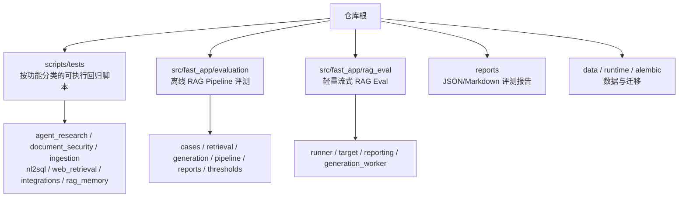
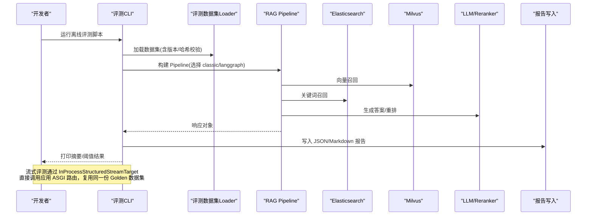
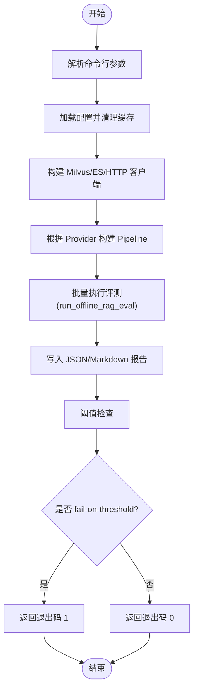
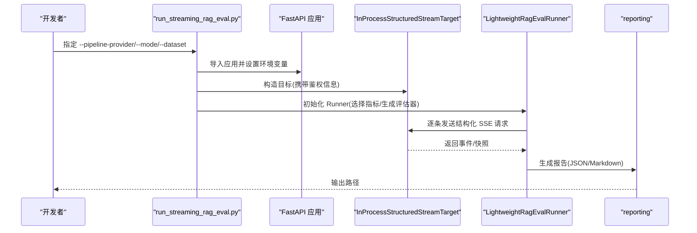
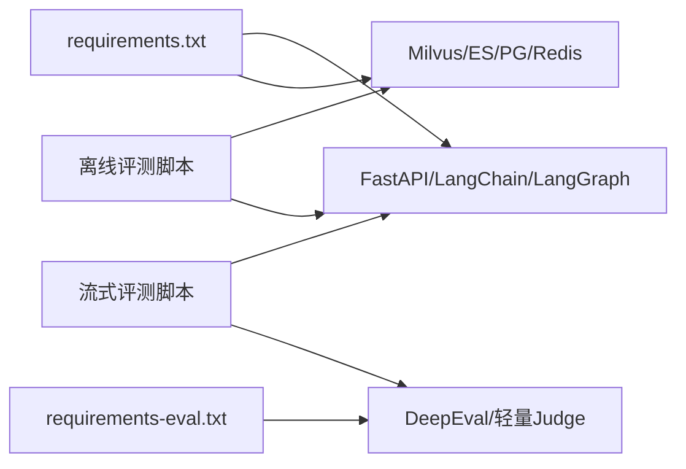

# 测试与质量保证

<cite>
**本文引用的文件**
- [README.md](file://python-agent-study/README.md)
- [requirements.txt](file://python-agent-study/requirements.txt)
- [requirements-eval.txt](file://python-agent-study/requirements-eval.txt)
- [scripts/tests/readme.md](file://python-agent-study/scripts/tests/readme.md)
- [src/fast_app/evaluation/README.md](file://python-agent-study/src/fast_app/evaluation/README.md)
- [src/fast_app/rag_eval/README.md](file://python-agent-study/src/fast_app/rag_eval/README.md)
- [scripts/run_real_offline_rag_eval.py](file://python-agent-study/scripts/run_real_offline_rag_eval.py)
- [scripts/run_streaming_rag_eval.py](file://python-agent-study/scripts/run_streaming_rag_eval.py)
</cite>

## 目录
1. [简介](#简介)
2. [项目结构](#项目结构)
3. [核心组件](#核心组件)
4. [架构总览](#架构总览)
5. [详细组件分析](#详细组件分析)
6. [依赖关系分析](#依赖关系分析)
7. [性能考虑](#性能考虑)
8. [故障排查指南](#故障排查指南)
9. [结论](#结论)
10. [附录](#附录)

## 简介
本指南面向测试工程师与开发者，提供覆盖单元测试、集成测试、RAG 评估框架与回归测试策略的完整质量保证体系。内容涵盖：
- 测试目录结构与脚本使用方法
- 评估数据集管理与版本约束
- 报告生成与阈值门禁
- 性能基准、准确性评估与安全性测试的实施方法
- 如何编写新用例、运行套件与分析结果

本项目后端基于 FastAPI + LangGraph，支持 RAG、Research、NL2SQL、Web 检索、文档多 Agent 等能力；评测体系包含离线批量评测与在线流式轻量评测两套入口，并配套 Golden V2 数据集与阈值检查，用于日常回归与质量门禁。

## 项目结构
仓库将“可执行回归脚本”集中在 scripts/tests，按功能域划分；RAG 评测相关代码位于 src/fast_app/evaluation（离线 pipeline 评测）与 src/fast_app/rag_eval（轻量流式评测）。评测报告输出到 reports 下不同子目录，便于对比与归档。

**图表来源**
- [README.md:99-124](file://python-agent-study/README.md#L99-L124)
- [src/fast_app/evaluation/README.md:5-49](file://python-agent-study/src/fast_app/evaluation/README.md#L5-L49)
- [src/fast_app/rag_eval/README.md:1-57](file://python-agent-study/src/fast_app/rag_eval/README.md#L1-L57)

**章节来源**
- [README.md:99-124](file://python-agent-study/README.md#L99-L124)
- [scripts/tests/readme.md:1-29](file://python-agent-study/scripts/tests/readme.md#L1-L29)

## 核心组件
- 测试执行入口
  - 离线批量评测：通过脚本直接调用本地 Milvus/ElasticSearch 与 Pipeline，产出检索与生成指标及报告。
  - 流式轻量评测：进程内 ASGI 调用真实 /rag/chat/stream/events，复用 Golden V2 与 EvaluationSnapshot，输出检索/生成指标与 Markdown/JSON 报告。
- 评测集管理
  - V2 数据集契约：case_id、dataset_version、knowledge_version、source_revision、logical_chunk_ids、required_key_facts 等字段保证可重放与不可变基线。
  - Golden/Candidate 生命周期：Golden 需人工批准，Candidate 允许试跑；loader 会校验 content_sha256 与 source_revision。
- 指标与报告
  - 检索指标：Recall@K、MRR、first_hit_rank、matched_by 等。
  - 生成指标：关键词覆盖、禁止词检测、拒答判断、sources 引用检查；流式评测还包含 Faithfulness、Answer Relevancy、Completeness、Context Utilization。
  - 报告：JSON（程序读取/对比）+ Markdown（人工阅读），默认输出至 reports/evaluation 或 reports/rag-eval。
- 阈值门禁
  - 支持最小 mean_recall_at_k、mean_mrr、generation pass_rate 阈值，失败时退出码为 1，便于 CI 阻断。

**章节来源**
- [src/fast_app/evaluation/README.md:51-58](file://python-agent-study/src/fast_app/evaluation/README.md#L51-L58)
- [src/fast_app/evaluation/README.md:90-128](file://python-agent-study/src/fast_app/evaluation/README.md#L90-L128)
- [src/fast_app/evaluation/README.md:220-258](file://python-agent-study/src/fast_app/evaluation/README.md#L220-L258)
- [src/fast_app/evaluation/README.md:280-351](file://python-agent-study/src/fast_app/evaluation/README.md#L280-L351)
- [src/fast_app/rag_eval/README.md:49-56](file://python-agent-study/src/fast_app/rag_eval/README.md#L49-L56)
- [scripts/run_real_offline_rag_eval.py:43-118](file://python-agent-study/scripts/run_real_offline_rag_eval.py#L43-L118)
- [scripts/run_streaming_rag_eval.py:16-52](file://python-agent-study/scripts/run_streaming_rag_eval.py#L16-L52)

## 架构总览
下图展示离线评测与流式评测两条主线，以及它们与外部存储、Pipeline、报告模块的关系。

**图表来源**
- [scripts/run_real_offline_rag_eval.py:208-322](file://python-agent-study/scripts/run_real_offline_rag_eval.py#L208-L322)
- [scripts/run_streaming_rag_eval.py:55-142](file://python-agent-study/scripts/run_streaming_rag_eval.py#L55-L142)
- [src/fast_app/evaluation/README.md:260-278](file://python-agent-study/src/fast_app/evaluation/README.md#L260-L278)

## 详细组件分析

### 离线批量评测组件
- 职责
  - 解析参数（数据集路径、输出目录、Pipeline Provider、LLM/Embedding/Reranker Provider、阈值等）。
  - 构建 Milvus/Elasticsearch 客户端与 Pipeline。
  - 执行 run_offline_rag_eval，生成检索与生成报告。
  - 计算阈值并输出 JSON/Markdown 报告。
- 关键流程
  - 参数校验与设置加载
  - 客户端与 Pipeline 装配
  - 批量执行与报告序列化
  - 阈值检查与退出码控制
- 复杂度与性能
  - 评测为 I/O 密集（网络/存储）+ 模型调用；可通过并行化请求、限制 top_k/candidate_k、使用 mock 组件加速回归。
- 错误处理
  - 对不支持的 provider、空凭据、非 ASCII 认证等场景抛出明确异常；最终统一捕获并返回非零退出码。

**图表来源**
- [scripts/run_real_offline_rag_eval.py:43-118](file://python-agent-study/scripts/run_real_offline_rag_eval.py#L43-L118)
- [scripts/run_real_offline_rag_eval.py:268-363](file://python-agent-study/scripts/run_real_offline_rag_eval.py#L268-L363)

**章节来源**
- [scripts/run_real_offline_rag_eval.py:43-118](file://python-agent-study/scripts/run_real_offline_rag_eval.py#L43-L118)
- [scripts/run_real_offline_rag_eval.py:268-363](file://python-agent-study/scripts/run_real_offline_rag_eval.py#L268-L363)

### 流式轻量评测组件
- 职责
  - 在独立虚拟环境中安装轻量依赖，避免与生产环境冲突。
  - 进程内启动 ASGI 应用，调用真实 /rag/chat/stream/events。
  - 按 mode 选择检索/生成指标，支持 baseline 对比与报告输出。
- 关键流程
  - 参数解析与环境变量固定
  - 加载 Golden/Candidate 数据集并过滤 case
  - 构造目标（InProcessStructuredStreamTarget）与 Runner
  - 执行评测、可选 baseline 对比、写入报告
- 安全与隔离
  - Judge 配置独立，禁用 dotenv/遥测/交互提示，检测到敏感 key 直接失败。
  - 认证模式支持 API Key/Bearer Token，并要求 eval_principal_id 一致。

**图表来源**
- [src/fast_app/rag_eval/README.md:1-57](file://python-agent-study/src/fast_app/rag_eval/README.md#L1-L57)
- [scripts/run_streaming_rag_eval.py:55-142](file://python-agent-study/scripts/run_streaming_rag_eval.py#L55-L142)

**章节来源**
- [src/fast_app/rag_eval/README.md:1-57](file://python-agent-study/src/fast_app/rag_eval/README.md#L1-L57)
- [scripts/run_streaming_rag_eval.py:16-52](file://python-agent-study/scripts/run_streaming_rag_eval.py#L16-L52)
- [scripts/run_streaming_rag_eval.py:55-142](file://python-agent-study/scripts/run_streaming_rag_eval.py#L55-L142)

### 评估数据集管理
- 版本与契约
  - 使用 case_id、dataset_version、knowledge_version、source_revision 锁定一次可重放评测。
  - logical_chunk_ids、logical_doc_id 稳定关联来源；父块扩展记录 matched_logical_child_ids。
  - required_key_facts 带 weight 与 critical，用于完整性评估。
- 生命周期
  - Candidate：允许试跑，适合开发阶段验证。
  - Golden：必须人工批准，作为正式质量门禁。
  - loader 会校验 content_sha256 与 source_revision，非法则拒绝加载。
- 迁移兼容
  - Legacy 字段会被显式迁移为 candidate，不能冒充 Golden。

**章节来源**
- [src/fast_app/evaluation/README.md:51-58](file://python-agent-study/src/fast_app/evaluation/README.md#L51-L58)
- [src/fast_app/evaluation/README.md:280-351](file://python-agent-study/src/fast_app/evaluation/README.md#L280-L351)

### 报告生成与阈值门禁
- 输出格式
  - JSON：程序读取、自动化对比、CI 断言。
  - Markdown：人工阅读、失败 case 定位。
- 阈值检查
  - min-retrieval-recall、min-retrieval-mrr、min-generation-pass-rate。
  - 任一阈值失败且启用 fail-on-threshold 时，返回退出码 1。
- 基线对比
  - 流式评测支持 --baseline-report 进行差异标注与对比。

**章节来源**
- [src/fast_app/evaluation/README.md:280-351](file://python-agent-study/src/fast_app/evaluation/README.md#L280-L351)
- [scripts/run_real_offline_rag_eval.py:237-266](file://python-agent-study/scripts/run_real_offline_rag_eval.py#L237-L266)
- [scripts/run_streaming_rag_eval.py:136-142](file://python-agent-study/scripts/run_streaming_rag_eval.py#L136-L142)

### 单元测试与集成测试实践
- 单元/回归脚本组织
  - scripts/tests 下按功能域划分：agent_research、document_security、ingestion、nl2sql、web_retrieval、integrations、rag_memory 等。
  - 每个子目录 readme.md 说明前置条件与运行方式。
- 通用运行方式
  - 设置 PYTHONPATH=src，关闭 LangSmith 追踪，然后执行具体脚本。
- 典型用例
  - Router、TaskPlan、Research 编排、结构化输出、权限与安全、Ingestion、NL2SQL、Web 检索、GitLab/LangSmith/MCP 集成等。

**章节来源**
- [scripts/tests/readme.md:1-29](file://python-agent-study/scripts/tests/readme.md#L1-L29)
- [README.md:282-313](file://python-agent-study/README.md#L282-L313)

### 性能基准测试
- 建议维度
  - 吞吐：单位时间内处理的查询数（QPS）。
  - 延迟：P50/P95/P99 响应时间。
  - 资源：CPU/内存/IO 占用。
- 实施方法
  - 使用离线评测脚本在不同 Provider 组合下运行，记录 mean_recall_at_k、mean_mrr、pass_rate 与耗时。
  - 调整 top_k、candidate_k、rerank 开关，观察指标变化。
  - 使用 mock 组件快速回归，再切换真实组件做压力测试。
- 工具与数据
  - 结合 reports 中的 JSON 报告进行横向对比；必要时引入压测工具对 /rag/chat/stream/events 发起并发请求。

[本节为通用指导，不直接分析具体文件]

### 准确性评估
- 检索准确性
  - Recall@K、MRR、first_hit_rank、matched_by。
  - 单路（Milvus/ES）与混合（RRF/rerank）对比实验。
- 生成准确性
  - 规则型：expected_keywords、forbidden_keywords、no_answer_refusal、source_presence、source_citation。
  - 流式评测：Faithfulness、Answer Relevancy、Completeness、Context Utilization。
- 评估数据
  - 使用 Golden V2 数据集，确保可重放与一致性。

**章节来源**
- [src/fast_app/evaluation/README.md:90-128](file://python-agent-study/src/fast_app/evaluation/README.md#L90-L128)
- [src/fast_app/evaluation/README.md:220-258](file://python-agent-study/src/fast_app/evaluation/README.md#L220-L258)
- [src/fast_app/rag_eval/README.md:49-56](file://python-agent-study/src/fast_app/rag_eval/README.md#L49-L56)

### 安全性测试
- 认证与授权
  - 支持 JWT/API Key，流式评测要求 eval_principal_id 与当前身份一致。
  - 知识库 ACL、部门级权限、Agent Tool 权限与审计。
- Prompt Guard 与输入输出保护
  - 输入、检索上下文、输出 Guard 默认开启；可在配置中控制。
- 数据安全
  - 独立虚拟环境运行评测，禁用 dotenv/遥测/交互提示，防止泄露。
  - 对敏感凭据（如 CONFIDENT_API_KEY）进行检测并拒绝执行。

**章节来源**
- [src/fast_app/rag_eval/README.md:15-25](file://python-agent-study/src/fast_app/rag_eval/README.md#L15-L25)
- [README.md:241-260](file://python-agent-study/README.md#L241-L260)

## 依赖关系分析
- 运行时依赖
  - 主依赖：requirements.txt 包含 FastAPI、LangChain/LangGraph、Milvus、Elasticsearch、PostgreSQL、Redis 等。
  - 评测依赖：requirements-eval.txt 仅包含 DeepEval 及相关轻量依赖，用于独立虚拟环境。
- 评测依赖链
  - 离线评测：MilvusClient、AsyncElasticsearch、httpx、Pipeline 实现（Classic/LangGraph）。
  - 流式评测：ASGI 应用、InProcessStructuredStreamTarget、SubprocessGenerationEvaluator。

**图表来源**
- [requirements.txt:1-111](file://python-agent-study/requirements.txt#L1-L111)
- [requirements-eval.txt:1-8](file://python-agent-study/requirements-eval.txt#L1-L8)
- [scripts/run_real_offline_rag_eval.py:9-40](file://python-agent-study/scripts/run_real_offline_rag_eval.py#L9-L40)
- [scripts/run_streaming_rag_eval.py:55-142](file://python-agent-study/scripts/run_streaming_rag_eval.py#L55-L142)

**章节来源**
- [requirements.txt:1-111](file://python-agent-study/requirements.txt#L1-L111)
- [requirements-eval.txt:1-8](file://python-agent-study/requirements-eval.txt#L1-L8)

## 性能考虑
- 减少外部调用
  - 使用 mock embedding/llm/reranker 提升回归速度；仅在验收阶段切换真实组件。
- 控制候选规模
  - 合理设置 top_k、candidate_k，降低 IO 与模型调用开销。
- 批处理与并行
  - 离线评测可按 batch 并行；流式评测可限制并发度避免压垮服务。
- 指标监控
  - 关注 mean_recall_at_k、mean_mrr、pass_rate 与耗时；结合 reports 进行趋势分析。

[本节为通用指导，不直接分析具体文件]

## 故障排查指南
- 常见问题
  - 未设置 PYTHONPATH 导致导入失败：需在仓库根设置 PYTHONPATH=src。
  - 外部服务未启动：Milvus/ES/PG/Redis 需提前启动并配置正确连接。
  - 认证失败：流式评测需配置 RAG_EVAL_API_KEY 或 RAG_EVAL_BEARER_TOKEN，并确保 eval_principal_id 匹配。
  - 阈值失败：启用 --fail-on-threshold 时，任一阈值不达标将返回退出码 1。
- 诊断步骤
  - 查看 reports 下的 JSON/Markdown 报告，定位失败 case。
  - 逐步缩小范围：先运行检索层指标，再运行生成层指标。
  - 使用 --case-id 或 --eval-principal 聚焦特定用例或身份。
  - 切换 Provider（classic/langgraph/rag_agent）对比行为差异。

**章节来源**
- [scripts/tests/readme.md:17-29](file://python-agent-study/scripts/tests/readme.md#L17-L29)
- [src/fast_app/rag_eval/README.md:27-47](file://python-agent-study/src/fast_app/rag_eval/README.md#L27-L47)
- [scripts/run_real_offline_rag_eval.py:237-266](file://python-agent-study/scripts/run_real_offline_rag_eval.py#L237-L266)

## 结论
本项目的测试与质量保证体系以“可重放的 Golden V2 数据集 + 双入口评测（离线/流式）+ 阈值门禁 + 标准化报告”为核心，既满足快速回归，又支撑严格的质量门禁。建议在日常开发中：
- 优先运行确定性回归脚本，确保 Schema、权限、安全与稳定性。
- 修改 RAG 主链路前，使用同一份数据集与参数复跑，对比指标与失败 case。
- 在 CI 中集成阈值检查，阻断退化变更。
- 结合性能基准与安全性测试，持续优化系统表现与风险面。

[本节为总结性内容，不直接分析具体文件]

## 附录
- 快速命令参考
  - 离线评测：参见脚本参数与示例命令。
  - 流式评测：指定 --pipeline-provider、--mode、--output-dir 等。
- 报告位置
  - 离线：reports/evaluation
  - 流式：reports/rag-eval
- 依赖环境
  - 主环境：requirements.txt
  - 评测环境：requirements-eval.txt（独立虚拟环境）

**章节来源**
- [scripts/run_real_offline_rag_eval.py:43-118](file://python-agent-study/scripts/run_real_offline_rag_eval.py#L43-L118)
- [scripts/run_streaming_rag_eval.py:16-52](file://python-agent-study/scripts/run_streaming_rag_eval.py#L16-L52)
- [src/fast_app/evaluation/README.md:280-351](file://python-agent-study/src/fast_app/evaluation/README.md#L280-L351)
- [src/fast_app/rag_eval/README.md:5-23](file://python-agent-study/src/fast_app/rag_eval/README.md#L5-L23)