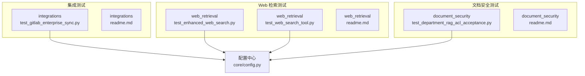
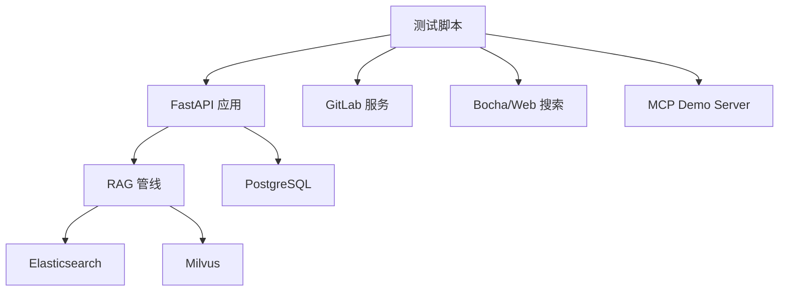
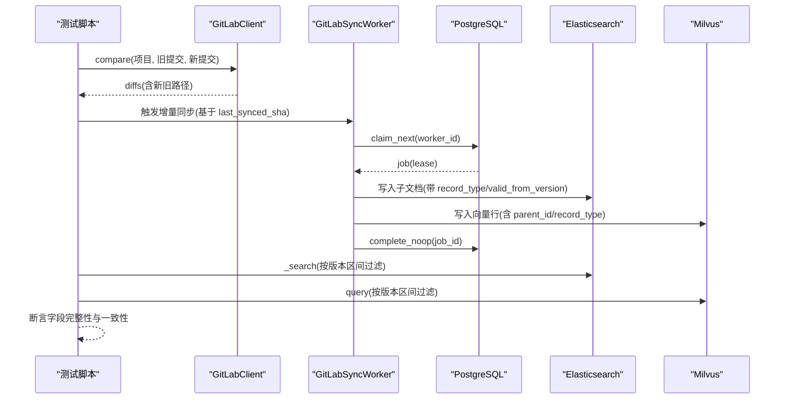
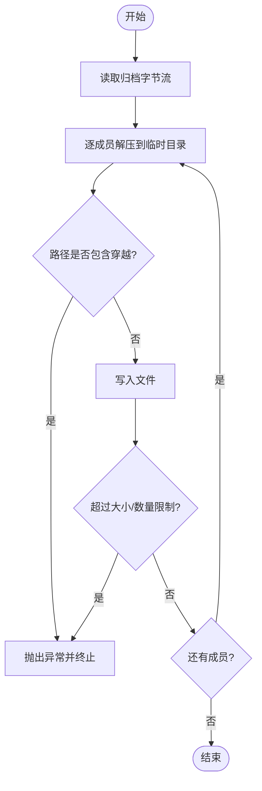
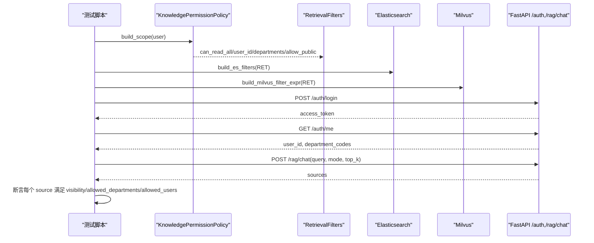
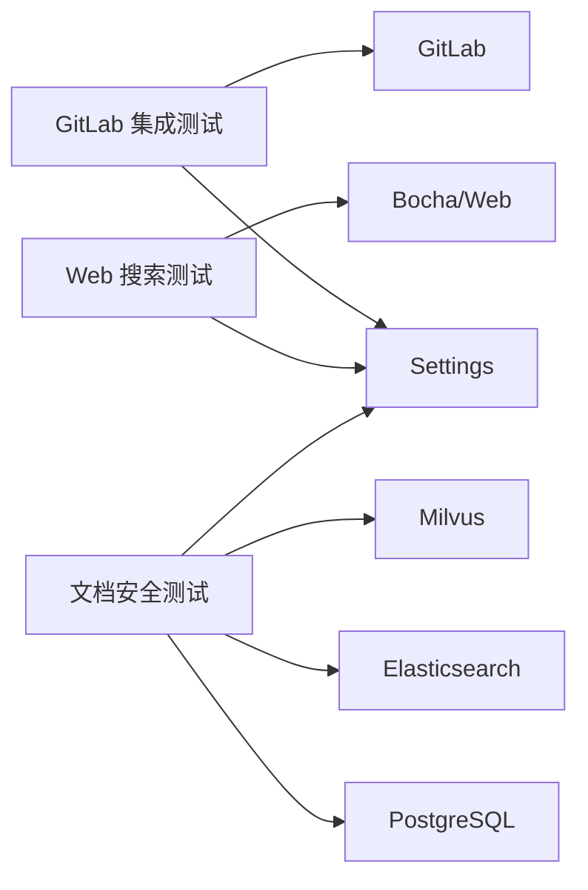

```mermaid
sequenceDiagram
participant T as "测试脚本"
participant P as "EnhancedPlanner(替身)"
participant S as "execute_enhanced_web_search"
participant B as "search_web_with_bocha(替身)"
participant F as "fetch_direct_web_page_texts(替身)"
participant V as "验证器"
T->>P : plan(question,count)
P-->>S : DirectWebSearchPlan
T->>B : 搜索(可带 site/fragments)
B-->>T : 结果列表(WebSearchResult)
T->>F : 抓取正文(可选)
F-->>T : (url,text)
T->>S : 执行增强检索
S-->>T : RetrievedDoc[]
T->>V : 断言内容/元数据/截断/过滤
```

# 集成测试

<cite>
**本文引用的文件**
- [scripts/tests/integrations/test_gitlab_enterprise_sync.py](file://scripts/tests/integrations/test_gitlab_enterprise_sync.py)
- [scripts/tests/integrations/readme.md](file://scripts/tests/integrations/readme.md)
- [scripts/tests/web_retrieval/test_enhanced_web_search.py](file://scripts/tests/web_retrieval/test_enhanced_web_search.py)
- [scripts/tests/web_retrieval/test_web_search_tool.py](file://scripts/tests/web_retrieval/test_web_search_tool.py)
- [scripts/tests/web_retrieval/readme.md](file://scripts/tests/web_retrieval/readme.md)
- [scripts/tests/document_security/test_department_rag_acl_acceptance.py](file://scripts/tests/document_security/test_department_rag_acl_acceptance.py)
- [scripts/tests/document_security/readme.md](file://scripts/tests/document_security/readme.md)
- [src/fast_app/core/config.py](file://src/fast_app/core/config.py)
</cite>

## 目录
1. [简介](#简介)
2. [项目结构](#项目结构)
3. [核心组件](#核心组件)
4. [架构总览](#架构总览)
5. [详细组件分析](#详细组件分析)
6. [依赖关系分析](#依赖关系分析)
7. [性能考虑](#性能考虑)
8. [故障排查指南](#故障排查指南)
9. [结论](#结论)
10. [附录](#附录)

## 简介
本指南面向外部服务集成、数据库集成与安全功能的端到端集成测试，覆盖以下重点：
- GitLab 企业版同步与变更工作流集成测试
- Web 搜索增强检索的离线回归与真实网络验收
- 文档安全（部门级权限、ES/Milvus 过滤、HTTP 接口 ACL）验收
- 测试环境配置、依赖服务模拟、端到端流程与数据验证策略
- API 接口测试、第三方服务调用测试、系统间交互测试的最佳实践

## 项目结构
仓库将集成测试按领域划分在 scripts/tests 下：
- integrations：外部系统集成（GitLab、MCP、LangSmith 等）
- web_retrieval：Web 搜索与直接网页抓取链路
- document_security：文档 Agent、权限与安全相关验收

图表来源
- [scripts/tests/integrations/test_gitlab_enterprise_sync.py:1-626](file://scripts/tests/integrations/test_gitlab_enterprise_sync.py#L1-L626)
- [scripts/tests/web_retrieval/test_enhanced_web_search.py:1-225](file://scripts/tests/web_retrieval/test_enhanced_web_search.py#L1-L225)
- [scripts/tests/web_retrieval/test_web_search_tool.py:1-69](file://scripts/tests/web_retrieval/test_web_search_tool.py#L1-L69)
- [scripts/tests/document_security/test_department_rag_acl_acceptance.py:1-330](file://scripts/tests/document_security/test_department_rag_acl_acceptance.py#L1-L330)
- [src/fast_app/core/config.py:1-200](file://src/fast_app/core/config.py#L1-L200)

章节来源
- [scripts/tests/integrations/readme.md:1-20](file://scripts/tests/integrations/readme.md#L1-L20)
- [scripts/tests/web_retrieval/readme.md:1-23](file://scripts/tests/web_retrieval/readme.md#L1-L23)
- [scripts/tests/document_security/readme.md:1-23](file://scripts/tests/document_security/readme.md#L1-L23)

## 核心组件
- GitLab 集成测试套件
  - 使用 httpx.MockTransport 模拟 GitLab API，验证分页、重试头、令牌传递、增量对比与版本化产物生成。
  - 校验归档解压路径穿越防护、密钥环境变量回退策略。
  - 可选开启真实存储/队列测试，通过环境变量开关控制。
- Web 搜索增强检索测试
  - 通过替换 Bocha 搜索与全文抓取函数为 Fake，验证多来源、强制站点、主题拒绝、候选池过滤与统一 payload 契约。
  - 提供真实网络验收入口（追加参数），用于端到端连通性检查。
- 文档安全验收测试
  - 验证知识权限范围构建、ES 与 Milvus 过滤表达式生成、部门种子数据。
  - 支持 HTTP 模式登录并调用 /rag/chat，断言返回 sources 符合当前用户部门可见性。

章节来源
- [scripts/tests/integrations/test_gitlab_enterprise_sync.py:62-102](file://scripts/tests/integrations/test_gitlab_enterprise_sync.py#L62-L102)
- [scripts/tests/integrations/test_gitlab_enterprise_sync.py:195-232](file://scripts/tests/integrations/test_gitlab_enterprise_sync.py#L195-L232)
- [scripts/tests/integrations/test_gitlab_enterprise_sync.py:234-344](file://scripts/tests/integrations/test_gitlab_enterprise_sync.py#L234-L344)
- [scripts/tests/web_retrieval/test_enhanced_web_search.py:19-72](file://scripts/tests/web_retrieval/test_enhanced_web_search.py#L19-L72)
- [scripts/tests/web_retrieval/test_web_search_tool.py:18-64](file://scripts/tests/web_retrieval/test_web_search_tool.py#L18-L64)
- [scripts/tests/document_security/test_department_rag_acl_acceptance.py:46-100](file://scripts/tests/document_security/test_department_rag_acl_acceptance.py#L46-L100)
- [scripts/tests/document_security/test_department_rag_acl_acceptance.py:103-128](file://scripts/tests/document_security/test_department_rag_acl_acceptance.py#L103-L128)
- [scripts/tests/document_security/test_department_rag_acl_acceptance.py:131-254](file://scripts/tests/document_security/test_department_rag_acl_acceptance.py#L131-L254)

## 架构总览
集成测试围绕“被测服务 + 依赖服务”的双层模型展开：
- 被测服务：FastAPI 应用、RAG 管线、Agent 工具链、GitLab 同步 Worker
- 依赖服务：PostgreSQL、Elasticsearch、Milvus、GitLab、Bocha/Web 搜索引擎、MCP Server

图表来源
- [scripts/tests/integrations/test_gitlab_enterprise_sync.py:234-344](file://scripts/tests/integrations/test_gitlab_enterprise_sync.py#L234-L344)
- [scripts/tests/web_retrieval/test_enhanced_web_search.py:45-72](file://scripts/tests/web_retrieval/test_enhanced_web_search.py#L45-L72)
- [scripts/tests/document_security/test_department_rag_acl_acceptance.py:103-128](file://scripts/tests/document_security/test_department_rag_acl_acceptance.py#L103-L128)

## 详细组件分析

### GitLab 企业同步集成测试
- 目标
  - 验证 GitLab Client 的分页、重试、鉴权头与差异对比
  - 验证版本化产物（父子层级、物理/逻辑 ID、有效版本区间）与 ES/Milvus 写入契约
  - 验证归档解压安全（路径穿越防护）、密钥环境变量回退
  - 可选：连接真实 ES/Milvus/DB 进行契约与队列能力验证
- 关键流程（序列图）

图表来源
- [scripts/tests/integrations/test_gitlab_enterprise_sync.py:62-102](file://scripts/tests/integrations/test_gitlab_enterprise_sync.py#L62-L102)
- [scripts/tests/integrations/test_gitlab_enterprise_sync.py:104-193](file://scripts/tests/integrations/test_gitlab_enterprise_sync.py#L104-L193)
- [scripts/tests/integrations/test_gitlab_enterprise_sync.py:234-344](file://scripts/tests/integrations/test_gitlab_enterprise_sync.py#L234-L344)
- [scripts/tests/integrations/test_gitlab_enterprise_sync.py:347-388](file://scripts/tests/integrations/test_gitlab_enterprise_sync.py#L347-L388)

- 算法流程图（归档解压安全）

图表来源
- [scripts/tests/integrations/test_gitlab_enterprise_sync.py:195-215](file://scripts/tests/integrations/test_gitlab_enterprise_sync.py#L195-L215)

- 环境与运行要点
  - 默认使用 MockTransport 模拟 GitLab API，无需真实 GitLab
  - 真实存储/队列测试需设置环境变量：RUN_GITLAB_LIVE_STORE_TEST=1、RUN_GITLAB_LIVE_QUEUE_TEST=1
  - 需要配置 ES/Milvus/DB 连接信息（由 Settings 管理）

章节来源
- [scripts/tests/integrations/test_gitlab_enterprise_sync.py:62-102](file://scripts/tests/integrations/test_gitlab_enterprise_sync.py#L62-L102)
- [scripts/tests/integrations/test_gitlab_enterprise_sync.py:195-232](file://scripts/tests/integrations/test_gitlab_enterprise_sync.py#L195-L232)
- [scripts/tests/integrations/test_gitlab_enterprise_sync.py:234-344](file://scripts/tests/integrations/test_gitlab_enterprise_sync.py#L234-L344)
- [scripts/tests/integrations/test_gitlab_enterprise_sync.py:347-388](file://scripts/tests/integrations/test_gitlab_enterprise_sync.py#L347-L388)
- [scripts/tests/integrations/readme.md:1-20](file://scripts/tests/integrations/readme.md#L1-L20)
- [src/fast_app/core/config.py:1-200](file://src/fast_app/core/config.py#L1-L200)

### Web 搜索增强检索集成测试
- 目标
  - 验证 execute_enhanced_web_search 主流程与 fallback 双路径
  - 验证多来源、全文抓取、强制站点、主题词过滤、候选池保留 URL 片段约束
  - 验证 payload 构造键集合与内容截断契约
- 关键流程（序列图）

图表来源
- [scripts/tests/web_retrieval/test_enhanced_web_search.py:19-72](file://scripts/tests/web_retrieval/test_enhanced_web_search.py#L19-L72)
- [scripts/tests/web_retrieval/test_enhanced_web_search.py:75-187](file://scripts/tests/web_retrieval/test_enhanced_web_search.py#L75-L187)

- 运行方式
  - 默认使用替身，不访问公网
  - 如需真实网络验收，可使用 test_web_search_tool.py 追加 --real 参数

章节来源
- [scripts/tests/web_retrieval/test_enhanced_web_search.py:75-187](file://scripts/tests/web_retrieval/test_enhanced_web_search.py#L75-L187)
- [scripts/tests/web_retrieval/test_web_search_tool.py:18-64](file://scripts/tests/web_retrieval/test_web_search_tool.py#L18-L64)
- [scripts/tests/web_retrieval/readme.md:1-23](file://scripts/tests/web_retrieval/readme.md#L1-L23)

### 文档安全（部门级权限）集成测试
- 目标
  - 验证 KnowledgePermissionPolicy 构建 scope 与 RetrievalFilters
  - 验证 ES/Milvus 过滤表达式包含部门与可见性约束
  - 验证数据库部门种子数据正确性
  - 可选：HTTP 模式登录并调用 /rag/chat，断言返回 sources 符合当前用户部门可见性
- 关键流程（序列图）

图表来源
- [scripts/tests/document_security/test_department_rag_acl_acceptance.py:46-100](file://scripts/tests/document_security/test_department_rag_acl_acceptance.py#L46-L100)
- [scripts/tests/document_security/test_department_rag_acl_acceptance.py:103-128](file://scripts/tests/document_security/test_department_rag_acl_acceptance.py#L103-L128)
- [scripts/tests/document_security/test_department_rag_acl_acceptance.py:131-254](file://scripts/tests/document_security/test_department_rag_acl_acceptance.py#L131-L254)

- 运行方式
  - 本地合同可用 --skip-db 跳过数据库检查
  - 真实 HTTP 验收需传入 --base-url 及用户凭据（token 或 username/password）

章节来源
- [scripts/tests/document_security/test_department_rag_acl_acceptance.py:46-100](file://scripts/tests/document_security/test_department_rag_acl_acceptance.py#L46-L100)
- [scripts/tests/document_security/test_department_rag_acl_acceptance.py:103-128](file://scripts/tests/document_security/test_department_rag_acl_acceptance.py#L103-L128)
- [scripts/tests/document_security/test_department_rag_acl_acceptance.py:131-254](file://scripts/tests/document_security/test_department_rag_acl_acceptance.py#L131-L254)
- [scripts/tests/document_security/readme.md:1-23](file://scripts/tests/document_security/readme.md#L1-L23)

## 依赖关系分析
- 配置依赖
  - Settings 集中管理 ES/Milvus/DB、认证、Prompt Guard、评估快照等配置项，测试通过 get_settings() 获取
- 外部服务依赖
  - GitLab：可通过 MockTransport 完全隔离；也可启用真实实例
  - Web 搜索：默认替身；可选真实网络
  - 数据库与索引：PostgreSQL、Elasticsearch、Milvus 用于契约与端到端验证
- 模块耦合
  - 测试脚本仅依赖被测模块的公开接口与配置，避免侵入实现细节

图表来源
- [src/fast_app/core/config.py:1-200](file://src/fast_app/core/config.py#L1-L200)
- [scripts/tests/integrations/test_gitlab_enterprise_sync.py:234-344](file://scripts/tests/integrations/test_gitlab_enterprise_sync.py#L234-L344)
- [scripts/tests/web_retrieval/test_enhanced_web_search.py:45-72](file://scripts/tests/web_retrieval/test_enhanced_web_search.py#L45-L72)
- [scripts/tests/document_security/test_department_rag_acl_acceptance.py:103-128](file://scripts/tests/document_security/test_department_rag_acl_acceptance.py#L103-L128)

章节来源
- [src/fast_app/core/config.py:1-200](file://src/fast_app/core/config.py#L1-L200)

## 性能考虑
- 优先使用替身与 MockTransport 降低网络抖动与外部依赖成本
- 对真实网络/存储的测试应通过环境变量开关，避免在常规 CI 中引入不稳定因素
- 批量写入与查询时注意分页与 limit，避免大结果集导致内存压力
- 对全文抓取与并发请求设置合理超时与降级策略，确保失败快速失败

## 故障排查指南
- GitLab 集成
  - 若真实存储/队列测试失败，检查 RUN_GITLAB_LIVE_* 环境变量与 ES/Milvus/DB 连通性
  - 归档解压报错多为路径穿越或大小限制触发，确认 max_files/max_bytes/max_file_bytes 配置
- Web 搜索
  - 若主题拒绝或无结果，检查 required_content_terms 与 forced_site 是否正确注入
  - 真实网络验收失败时，先切换至替身模式定位问题边界
- 文档安全
  - 若 /rag/chat 返回空 sources，确认知识库已重建且携带 ACL metadata
  - 部门种子不一致时，检查 Alembic 版本与 seed 数据

章节来源
- [scripts/tests/integrations/test_gitlab_enterprise_sync.py:195-232](file://scripts/tests/integrations/test_gitlab_enterprise_sync.py#L195-L232)
- [scripts/tests/integrations/test_gitlab_enterprise_sync.py:234-344](file://scripts/tests/integrations/test_gitlab_enterprise_sync.py#L234-L344)
- [scripts/tests/web_retrieval/test_enhanced_web_search.py:129-166](file://scripts/tests/web_retrieval/test_enhanced_web_search.py#L129-L166)
- [scripts/tests/document_security/test_department_rag_acl_acceptance.py:103-128](file://scripts/tests/document_security/test_department_rag_acl_acceptance.py#L103-L128)
- [scripts/tests/document_security/test_department_rag_acl_acceptance.py:210-254](file://scripts/tests/document_security/test_department_rag_acl_acceptance.py#L210-L254)

## 结论
本指南提供了 GitLab 集成、Web 搜索增强检索与文档安全的端到端集成测试方法，涵盖环境配置、依赖模拟、流程编排与数据验证策略。通过替身与真实环境的灵活切换，可在保证稳定性的同时完成严格的契约与验收测试。建议在生产环境中以最小必要依赖运行，并通过环境变量精确控制测试范围。

## 附录
- 常用运行示例
  - GitLab 集成：默认 Mock；设置 RUN_GITLAB_LIVE_STORE_TEST=1 或 RUN_GITLAB_LIVE_QUEUE_TEST=1 启用真实环境
  - Web 搜索：直接运行增强检索测试；追加 --real 执行真实网络验收
  - 文档安全：本地合同可用 --skip-db；HTTP 验收需传入 --base-url 与用户凭据

章节来源
- [scripts/tests/integrations/readme.md:1-20](file://scripts/tests/integrations/readme.md#L1-L20)
- [scripts/tests/web_retrieval/readme.md:1-23](file://scripts/tests/web_retrieval/readme.md#L1-L23)
- [scripts/tests/document_security/readme.md:1-23](file://scripts/tests/document_security/readme.md#L1-L23)