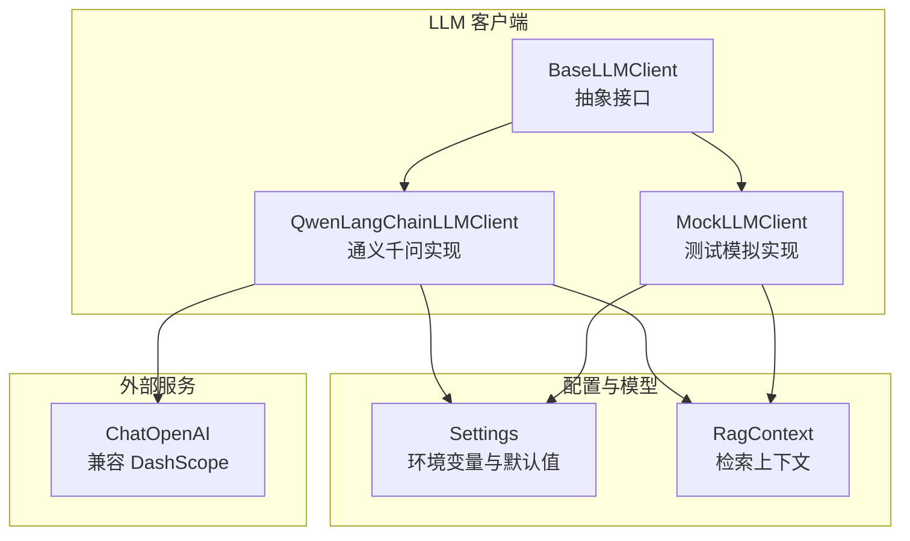
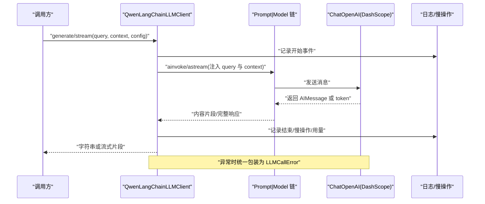
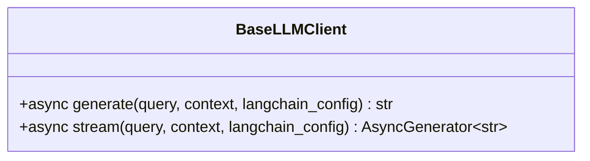
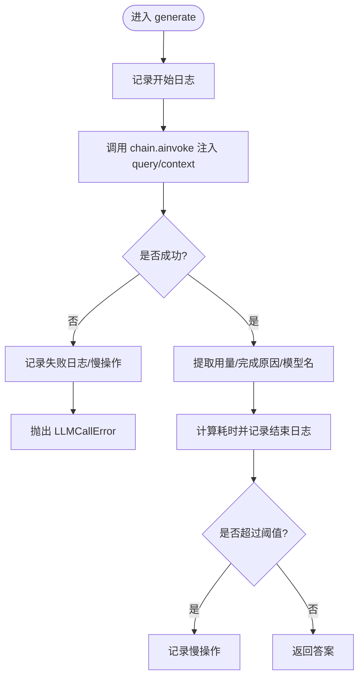
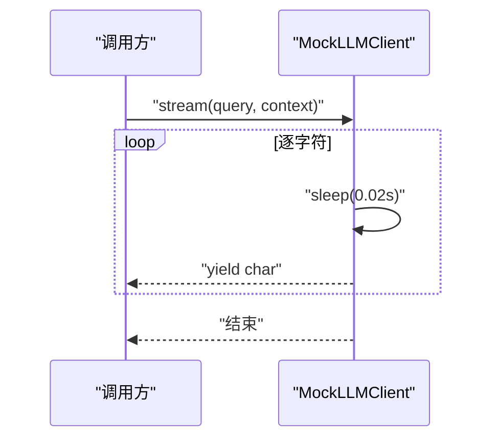
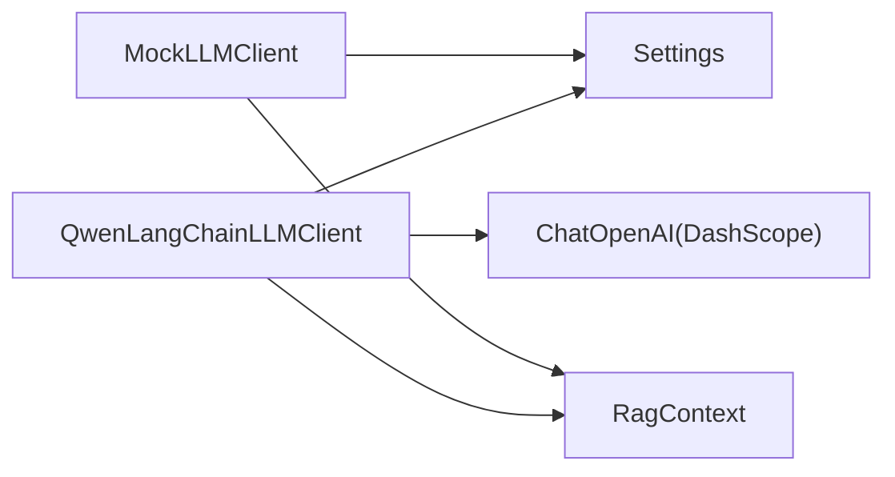

# LLM 客户端组件

<cite>
**本文引用的文件**
- [base.py](file://src/fast_app/components/llms/base.py)
- [qwen_langchain_llm_client.py](file://src/fast_app/components/llms/qwen_langchain_llm_client.py)
- [mock_llm_client.py](file://src/fast_app/components/llms/mock_llm_client.py)
- [config.py](file://src/fast_app/core/config.py)
- [rag_models.py](file://src/fast_app/domain/rag_models.py)
- [exceptions.py](file://src/fast_app/services/exceptions.py)
- [qwen_llm_client_demo.py](file://src/app/qwen_llm_client_demo.py)
</cite>

## 目录
1. [简介](#简介)
2. [项目结构](#项目结构)
3. [核心组件](#核心组件)
4. [架构总览](#架构总览)
5. [详细组件分析](#详细组件分析)
6. [依赖关系分析](#依赖关系分析)
7. [性能与可观测性](#性能与可观测性)
8. [故障排查指南](#故障排查指南)
9. [结论](#结论)
10. [附录：自定义 LLM 客户端开发指南](#附录自定义-llm-客户端开发指南)

## 简介
本组件提供统一的 LLM 调用抽象，屏蔽不同模型服务的差异，为 RAG 链路提供一致的生成与流式输出能力。当前实现包含：
- 统一基类：定义 generate 与 stream 的异步接口契约。
- Qwen LangChain 客户端：基于 ChatOpenAI 兼容接口接入通义千问（DashScope），内置 RAG 提示词、使用量与延迟统计、错误包装。
- Mock 客户端：用于测试与联调，模拟固定响应与流式字符输出。

## 项目结构
LLM 客户端位于 fast_app.components.llms 下，采用“基类 + 多实现”的分层组织方式；配置集中在 core.config.Settings；数据模型在 domain.rag_models；异常类型在 services.exceptions；示例脚本在 app.qwen_llm_client_demo。



图表来源
- [base.py:9-26](file://src/fast_app/components/llms/base.py#L9-L26)
- [qwen_langchain_llm_client.py:107-133](file://src/fast_app/components/llms/qwen_langchain_llm_client.py#L107-L133)
- [mock_llm_client.py:17-19](file://src/fast_app/components/llms/mock_llm_client.py#L17-L19)
- [config.py:230-238](file://src/fast_app/core/config.py#L230-L238)
- [rag_models.py:72-80](file://src/fast_app/domain/rag_models.py#L72-L80)

章节来源
- [base.py:9-26](file://src/fast_app/components/llms/base.py#L9-L26)
- [config.py:230-238](file://src/fast_app/core/config.py#L230-L238)
- [rag_models.py:72-80](file://src/fast_app/domain/rag_models.py#L72-L80)

## 核心组件
- 统一抽象 BaseLLMClient
  - 定义两个异步方法：generate(query, context, langchain_config) -> str 与 stream(query, context, langchain_config) -> AsyncGenerator[str]。
  - 所有上层调用仅依赖该接口，便于替换实现与扩展新模型。

- QwenLangChainLLMClient
  - 通过 ChatOpenAI 兼容模式连接 DashScope，注入系统提示词与人类提示词，构建 prompt | model 链。
  - generate：一次性调用并返回完整回答；stream：按 token 流式产出。
  - 记录开始/结束日志、慢操作告警、使用量统计（若可用）、完成原因与模型名等元信息。
  - 将底层异常统一包装为 LLMCallError，避免上游感知 SDK 细节。

- MockLLMClient
  - generate：固定拼接回答，模拟约 1 秒延迟。
  - stream：逐字符输出，模拟约 0.02 秒间隔，便于端到端流式消费验证。
  - 同样记录开始/结束日志与慢操作指标，便于与真实实现对齐观测。

章节来源
- [base.py:9-26](file://src/fast_app/components/llms/base.py#L9-L26)
- [qwen_langchain_llm_client.py:107-358](file://src/fast_app/components/llms/qwen_langchain_llm_client.py#L107-L358)
- [mock_llm_client.py:17-204](file://src/fast_app/components/llms/mock_llm_client.py#L17-L204)

## 架构总览
下图展示从调用方到模型的请求流程，包括提示词组装、链式调用、流式处理与错误包装。



图表来源
- [qwen_langchain_llm_client.py:136-239](file://src/fast_app/components/llms/qwen_langchain_llm_client.py#L136-L239)
- [qwen_langchain_llm_client.py:241-341](file://src/fast_app/components/llms/qwen_langchain_llm_client.py#L241-L341)

## 详细组件分析

### 统一抽象：BaseLLMClient
- 职责：定义 generate 与 stream 的异步接口契约，约束传入参数与返回值类型。
- 设计要点：
  - 支持可选的 RunnableConfig，便于透传 LangChain 追踪与超时等运行时配置。
  - 以 RagContext 作为上下文载体，解耦检索结果与 LLM 调用。



图表来源
- [base.py:9-26](file://src/fast_app/components/llms/base.py#L9-L26)

章节来源
- [base.py:9-26](file://src/fast_app/components/llms/base.py#L9-L26)

### Qwen LangChain LLM 客户端
- 初始化与配置
  - 校验 API Key，构造 ChatOpenAI 实例，设置模型名、基础 URL、温度等。
  - 构建 ChatPromptTemplate，包含系统提示词与人类提示词，组合成 chain。
- 非流式生成
  - 使用 ainvoke 一次性获取完整回答，提取 content，记录用量与延迟，必要时触发慢操作告警。
- 流式输出
  - 使用 astream 迭代 token，过滤空内容后 yield，累计 chunk 数与输出长度，记录结束日志与慢操作。
- 错误处理
  - 捕获异常并记录失败日志与慢操作，统一抛出 LLMCallError，保持上层无需感知 SDK 异常细节。



图表来源
- [qwen_langchain_llm_client.py:136-239](file://src/fast_app/components/llms/qwen_langchain_llm_client.py#L136-L239)

章节来源
- [qwen_langchain_llm_client.py:107-358](file://src/fast_app/components/llms/qwen_langchain_llm_client.py#L107-L358)
- [config.py:230-238](file://src/fast_app/core/config.py#L230-L238)
- [config.py:49-52](file://src/fast_app/core/config.py#L49-L52)
- [config.py:632-633](file://src/fast_app/core/config.py#L632-L633)

### Mock LLM 客户端（测试用途）
- 生成模式
  - 固定拼接回答，模拟约 1 秒延迟，便于端到端链路压测与超时策略验证。
- 流式模式
  - 逐字符输出，间隔约 0.02 秒，便于验证下游流式消费、缓冲与渲染逻辑。
- 可观测性
  - 与真实实现保持一致的开始/结束日志与慢操作记录，便于对比评测。



图表来源
- [mock_llm_client.py:110-173](file://src/fast_app/components/llms/mock_llm_client.py#L110-L173)

章节来源
- [mock_llm_client.py:17-204](file://src/fast_app/components/llms/mock_llm_client.py#L17-L204)

### 数据模型：RagContext
- 作用：封装查询、检索文档列表与拼接后的上下文文本，作为 LLM 输入的统一载体。
- 字段说明：
  - query：实际用于构建上下文的查询（可能经过改写）。
  - docs：参与回答的检索文档集合。
  - context_text：最终拼接到提示词中的上下文文本。

```mermaid
erDiagram
RAG_CONTEXT {
string query
list RetrievedDoc docs
string context_text
}
```

图表来源
- [rag_models.py:72-80](file://src/fast_app/domain/rag_models.py#L72-L80)

章节来源
- [rag_models.py:72-80](file://src/fast_app/domain/rag_models.py#L72-L80)

## 依赖关系分析
- 组件耦合
  - QwenLangChainLLMClient 依赖 Settings 读取模型名、API Key、基础 URL、超时与慢阈值；依赖 RagContext 传递上下文；依赖 ChatOpenAI 进行实际推理。
  - MockLLMClient 仅依赖 Settings 与 RagContext，不依赖外部网络。
- 外部依赖
  - ChatOpenAI 兼容 DashScope 的 OpenAI 协议；可通过 base_url 切换后端。
- 潜在循环依赖
  - 无直接循环依赖；LLM 客户端仅向上暴露接口，向下依赖配置与外部服务。



图表来源
- [qwen_langchain_llm_client.py:107-133](file://src/fast_app/components/llms/qwen_langchain_llm_client.py#L107-L133)
- [mock_llm_client.py:17-19](file://src/fast_app/components/llms/mock_llm_client.py#L17-L19)
- [config.py:230-238](file://src/fast_app/core/config.py#L230-L238)
- [rag_models.py:72-80](file://src/fast_app/domain/rag_models.py#L72-L80)

章节来源
- [qwen_langchain_llm_client.py:107-133](file://src/fast_app/components/llms/qwen_langchain_llm_client.py#L107-L133)
- [mock_llm_client.py:17-19](file://src/fast_app/components/llms/mock_llm_client.py#L17-L19)
- [config.py:230-238](file://src/fast_app/core/config.py#L230-L238)
- [rag_models.py:72-80](file://src/fast_app/domain/rag_models.py#L72-L80)

## 性能与可观测性
- 延迟与慢操作
  - generate 与 stream 均记录开始/结束时间，计算毫秒级延迟；当超过 slow_llm_threshold_ms 时触发慢操作告警。
- 用量与元信息
  - 尝试从响应中解析 usage_metadata、finish_reason、model_name；若不可用则记录相应原因。
- 流式指标
  - 统计 chunk_count 与 output_length，便于评估首字节延迟与吞吐。
- 配置项
  - llm_model_name、openai_base_url、openai_api_key、llm_timeout_seconds、slow_llm_threshold_ms 等均可通过环境变量覆盖。

章节来源
- [qwen_langchain_llm_client.py:136-239](file://src/fast_app/components/llms/qwen_langchain_llm_client.py#L136-L239)
- [qwen_langchain_llm_client.py:241-341](file://src/fast_app/components/llms/qwen_langchain_llm_client.py#L241-L341)
- [config.py:49-52](file://src/fast_app/core/config.py#L49-L52)
- [config.py:230-238](file://src/fast_app/core/config.py#L230-L238)
- [config.py:632-633](file://src/fast_app/core/config.py#L632-L633)

## 故障排查指南
- 常见错误
  - API Key 缺失：初始化时检查 openai_api_key，为空则抛出 LLMCallError。
  - 网络或服务异常：底层异常被捕获并记录失败日志，统一包装为 LLMCallError 上抛。
  - 超时：由 Settings.llm_timeout_seconds 控制；可在上游重试或降级。
- 定位建议
  - 查看开始/结束日志中的 provider、model_name、operation、latency_ms、error_type 等字段。
  - 关注慢操作告警，结合 chunk_count、output_length 判断是否为长尾问题。
- 恢复策略
  - 对 LLMCallError 进行重试或切换到备用模型/Provider。
  - 调整超时与慢阈值，优化提示词长度与上下文大小。

章节来源
- [qwen_langchain_llm_client.py:107-119](file://src/fast_app/components/llms/qwen_langchain_llm_client.py#L107-L119)
- [qwen_langchain_llm_client.py:205-239](file://src/fast_app/components/llms/qwen_langchain_llm_client.py#L205-L239)
- [qwen_langchain_llm_client.py:309-341](file://src/fast_app/components/llms/qwen_langchain_llm_client.py#L309-L341)
- [exceptions.py](file://src/fast_app/services/exceptions.py)

## 结论
本组件通过统一抽象实现了 LLM 调用的解耦与可替换性，Qwen 实现提供了生产可用的提示词、可观测性与错误包装；Mock 实现确保测试与联调效率。配合 Settings 与环境变量，可灵活切换模型与后端，满足多场景需求。

## 附录：自定义 LLM 客户端开发指南
- 继承基类
  - 新建类继承 BaseLLMClient，实现 generate 与 stream 两个异步方法。
- 消息格式转换
  - 将 RagContext 转换为模型所需的消息格式（如 system/human 或 messages 列表）。
  - 若模型返回对象，需提取文本内容并返回字符串。
- 流式处理
  - 使用模型的异步流式接口迭代 token，过滤空片段后 yield。
  - 记录 chunk_count 与 output_length，并在结束时记录日志与慢操作。
- 错误处理
  - 捕获底层异常，记录失败日志与慢操作，统一抛出 LLMCallError。
- 配置与可观测性
  - 读取 Settings 中的模型名、密钥、基础 URL、超时与慢阈值。
  - 记录开始/结束日志、用量与完成原因（若可用）。
- 接入示例
  - 参考现有 demo 脚本，构造 RagContext 并调用 generate 与 stream。

章节来源
- [base.py:9-26](file://src/fast_app/components/llms/base.py#L9-L26)
- [qwen_llm_client_demo.py:8-58](file://src/app/qwen_llm_client_demo.py#L8-L58)
- [config.py:230-238](file://src/fast_app/core/config.py#L230-L238)
- [rag_models.py:72-80](file://src/fast_app/domain/rag_models.py#L72-L80)
- [exceptions.py](file://src/fast_app/services/exceptions.py)