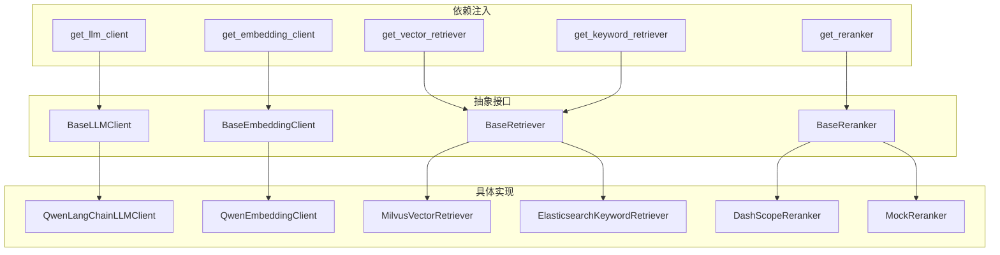
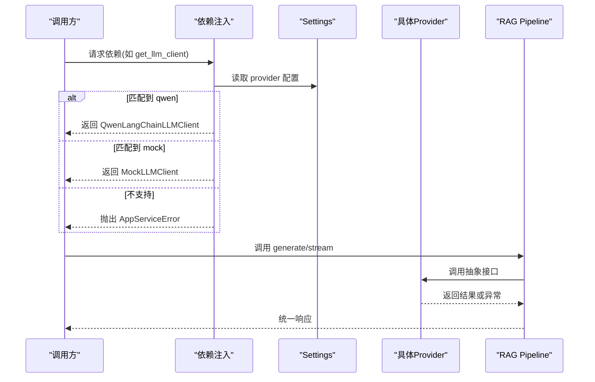
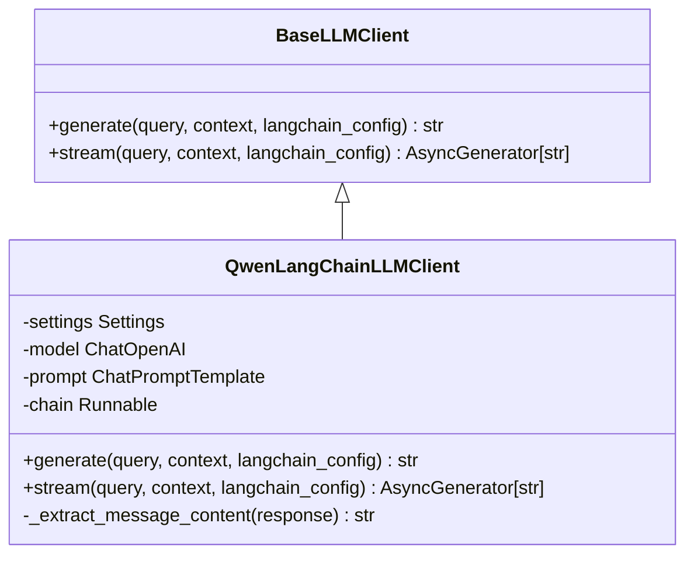
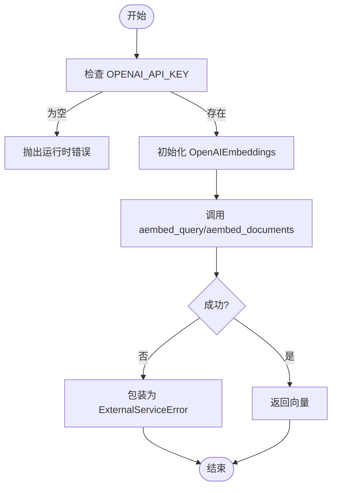
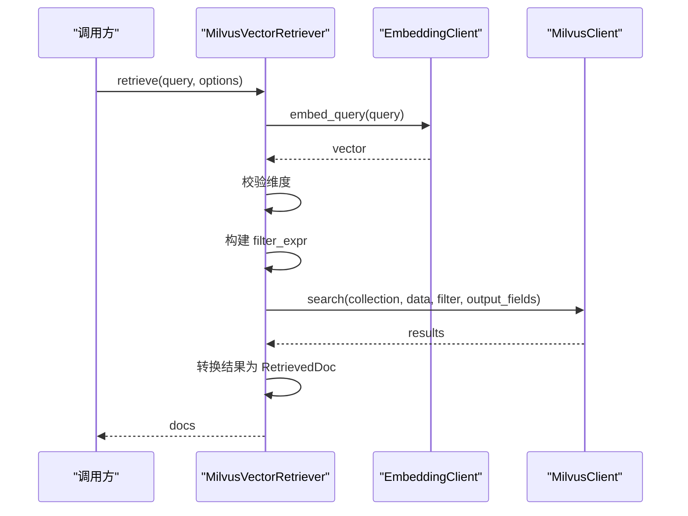
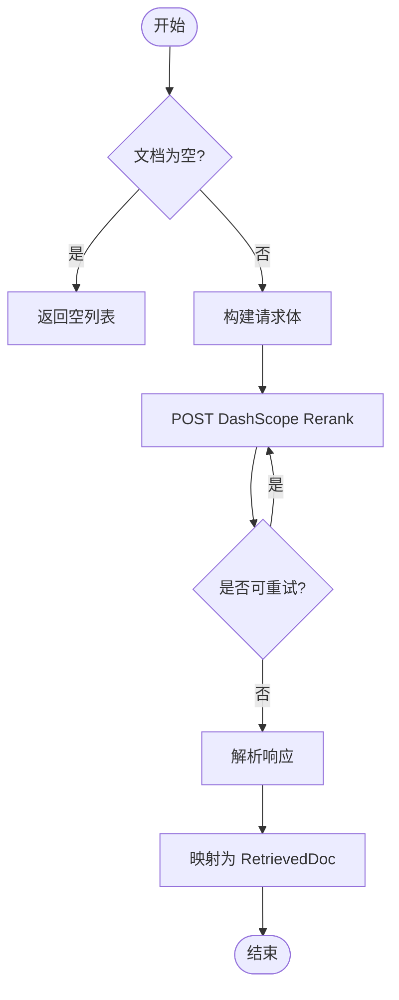
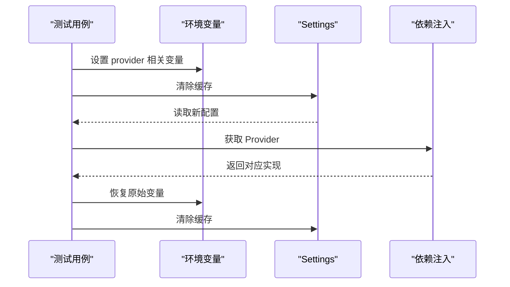

# Provider 模式实现

<cite>
**本文引用的文件**
- [src/fast_app/components/llms/base.py](file://src/fast_app/components/llms/base.py)
- [src/fast_app/components/embeddings/base.py](file://src/fast_app/components/embeddings/base.py)
- [src/fast_app/components/retrievers/base.py](file://src/fast_app/components/retrievers/base.py)
- [src/fast_app/components/rerankers/base.py](file://src/fast_app/components/rerankers/base.py)
- [src/fast_app/components/llms/qwen_langchain_llm_client.py](file://src/fast_app/components/llms/qwen_langchain_llm_client.py)
- [src/fast_app/components/embeddings/qwen_embedding_client.py](file://src/fast_app/components/embeddings/qwen_embedding_client.py)
- [src/fast_app/components/retrievers/milvus_vector_retriever.py](file://src/fast_app/components/retrievers/milvus_vector_retriever.py)
- [src/fast_app/components/rerankers/dashscope_reranker.py](file://src/fast_app/components/rerankers/dashscope_reranker.py)
- [src/fast_app/components/rerankers/mock_reranker.py](file://src/fast_app/components/rerankers/mock_reranker.py)
- [src/fast_app/dependencies/rag_dependencies.py](file://src/fast_app/dependencies/rag_dependencies.py)
- [src/fast_app/core/config.py](file://src/fast_app/core/config.py)
- [scripts/tests/rag_memory/test_rag_provider_matrix.py](file://scripts/tests/rag_memory/test_rag_provider_matrix.py)
</cite>

## 目录
1. [简介](#简介)
2. [项目结构](#项目结构)
3. [核心组件](#核心组件)
4. [架构总览](#架构总览)
5. [详细组件分析](#详细组件分析)
6. [依赖与注册机制](#依赖与注册机制)
7. [运行时动态切换](#运行时动态切换)
8. [自定义 Provider 开发指南](#自定义-provider-开发指南)
9. [扩展点识别与最佳实践](#扩展点识别与最佳实践)
10. [性能与可观测性](#性能与可观测性)
11. [故障排查](#故障排查)
12. [结论](#结论)

## 简介
本项目采用 Provider 模式构建可插拔的 RAG 能力层，通过抽象基类定义统一接口，使用 FastAPI 依赖注入在运行时根据配置选择具体实现。该设计将 LLM、Embedding、检索器、重排器等外部能力解耦，使系统可以在不同环境（本地、测试、生产）中灵活切换实现，同时保持上层业务逻辑稳定。

## 项目结构
Provider 模式在本项目中主要分布在以下位置：
- 抽象基类：位于 components 子模块下，分别定义 LLM、Embedding、Retriever、Reranker 的统一接口。
- 具体实现：每个基类对应多个 Provider 实现，例如 QwenLangChainLLMClient、MilvusVectorRetriever、DashScopeReranker 等。
- 依赖注入与选择：位于 dependencies/rag_dependencies.py，根据 Settings 中的 provider 字段创建并返回对应实例。
- 配置管理：位于 core/config.py，集中声明所有 Provider 开关和参数。
- 测试矩阵：scripts/tests/rag_memory/test_rag_provider_matrix.py 演示如何通过环境变量切换 Provider。



图表来源
- [src/fast_app/components/llms/base.py:9-27](file://src/fast_app/components/llms/base.py#L9-L27)
- [src/fast_app/components/embeddings/base.py:4-13](file://src/fast_app/components/embeddings/base.py#L4-L13)
- [src/fast_app/components/retrievers/base.py:6-13](file://src/fast_app/components/retrievers/base.py#L6-L13)
- [src/fast_app/components/rerankers/base.py:6-14](file://src/fast_app/components/rerankers/base.py#L6-L14)
- [src/fast_app/dependencies/rag_dependencies.py:69-163](file://src/fast_app/dependencies/rag_dependencies.py#L69-L163)

章节来源
- [src/fast_app/components/llms/base.py:9-27](file://src/fast_app/components/llms/base.py#L9-L27)
- [src/fast_app/components/embeddings/base.py:4-13](file://src/fast_app/components/embeddings/base.py#L4-L13)
- [src/fast_app/components/retrievers/base.py:6-13](file://src/fast_app/components/retrievers/base.py#L6-L13)
- [src/fast_app/components/rerankers/base.py:6-14](file://src/fast_app/components/rerankers/base.py#L6-L14)
- [src/fast_app/dependencies/rag_dependencies.py:69-163](file://src/fast_app/dependencies/rag_dependencies.py#L69-L163)

## 核心组件
- LLM Provider：提供生成与流式输出能力，封装模型调用、超时、重试、日志与慢调用告警。
- Embedding Provider：负责查询与文档向量化，支持批量限制与外部服务错误转换。
- Retriever Provider：向量检索与关键词检索，统一返回 RetrievedDoc，内置过滤表达式、权限下推与结果转换。
- Reranker Provider：对候选文档进行相关性重排，支持外部 API 调用、重试策略与响应解析。

章节来源
- [src/fast_app/components/llms/qwen_langchain_llm_client.py:107-358](file://src/fast_app/components/llms/qwen_langchain_llm_client.py#L107-L358)
- [src/fast_app/components/embeddings/qwen_embedding_client.py:15-55](file://src/fast_app/components/embeddings/qwen_embedding_client.py#L15-L55)
- [src/fast_app/components/retrievers/milvus_vector_retriever.py:155-410](file://src/fast_app/components/retrievers/milvus_vector_retriever.py#L155-L410)
- [src/fast_app/components/rerankers/dashscope_reranker.py:24-144](file://src/fast_app/components/rerankers/dashscope_reranker.py#L24-L144)

## 架构总览
Provider 模式的核心在于“接口稳定、实现可变”。本项目的架构如下：
- 抽象层：定义 BaseLLMClient、BaseEmbeddingClient、BaseRetriever、BaseReranker。
- 实现层：各 Provider 实现上述接口，处理外部服务细节（网络、超时、重试、错误映射）。
- 装配层：FastAPI 依赖函数根据 Settings 中的 provider 字段选择具体实现。
- 运行层：Pipeline 或服务仅依赖抽象接口，不感知具体 Provider。



图表来源
- [src/fast_app/dependencies/rag_dependencies.py:69-80](file://src/fast_app/dependencies/rag_dependencies.py#L69-L80)
- [src/fast_app/core/config.py:237-238](file://src/fast_app/core/config.py#L237-L238)
- [src/fast_app/components/llms/qwen_langchain_llm_client.py:136-238](file://src/fast_app/components/llms/qwen_langchain_llm_client.py#L136-L238)

章节来源
- [src/fast_app/dependencies/rag_dependencies.py:69-163](file://src/fast_app/dependencies/rag_dependencies.py#L69-L163)
- [src/fast_app/core/config.py:237-238](file://src/fast_app/core/config.py#L237-L238)

## 详细组件分析

### LLM Provider
- 抽象接口：BaseLLMClient 定义 generate 与 stream 两个异步方法。
- 具体实现：QwenLangChainLLMClient 基于 LangChain ChatOpenAI，封装提示词、调用、日志、慢调用统计与异常转换。
- 错误处理：构造时校验 API Key；调用失败转换为 LLMCallError；流式调用失败同样包装为 LLMCallError。



图表来源
- [src/fast_app/components/llms/base.py:9-27](file://src/fast_app/components/llms/base.py#L9-L27)
- [src/fast_app/components/llms/qwen_langchain_llm_client.py:107-358](file://src/fast_app/components/llms/qwen_langchain_llm_client.py#L107-L358)

章节来源
- [src/fast_app/components/llms/base.py:9-27](file://src/fast_app/components/llms/base.py#L9-L27)
- [src/fast_app/components/llms/qwen_langchain_llm_client.py:107-358](file://src/fast_app/components/llms/qwen_langchain_llm_client.py#L107-L358)

### Embedding Provider
- 抽象接口：BaseEmbeddingClient 定义 embed_query 与 embed_documents。
- 具体实现：QwenEmbeddingClient 基于 OpenAIEmbeddings，按供应商限制分批调用，统一异常为 ExternalServiceError。
- 配置依赖：从 Settings 读取 embedding_model_name、openai_api_key、base_url、dimensions。



图表来源
- [src/fast_app/components/embeddings/base.py:4-13](file://src/fast_app/components/embeddings/base.py#L4-L13)
- [src/fast_app/components/embeddings/qwen_embedding_client.py:15-55](file://src/fast_app/components/embeddings/qwen_embedding_client.py#L15-L55)

章节来源
- [src/fast_app/components/embeddings/base.py:4-13](file://src/fast_app/components/embeddings/base.py#L4-L13)
- [src/fast_app/components/embeddings/qwen_embedding_client.py:15-55](file://src/fast_app/components/embeddings/qwen_embedding_client.py#L15-L55)

### Retriever Provider
- 抽象接口：BaseRetriever 定义 retrieve(query, options) -> list[RetrievedDoc]。
- 具体实现：MilvusVectorRetriever 执行向量检索，包含：
  - 生成 query embedding 并校验维度。
  - 构建 Milvus filter 表达式（业务过滤与权限下推）。
  - 调用 search 并将原始 hits 转换为 RetrievedDoc。
  - 记录耗时、命中数、跳过数与慢调用告警。
  - 异常统一包装为 ExternalServiceError。



图表来源
- [src/fast_app/components/retrievers/base.py:6-13](file://src/fast_app/components/retrievers/base.py#L6-L13)
- [src/fast_app/components/retrievers/milvus_vector_retriever.py:155-410](file://src/fast_app/components/retrievers/milvus_vector_retriever.py#L155-L410)

章节来源
- [src/fast_app/components/retrievers/base.py:6-13](file://src/fast_app/components/retrievers/base.py#L6-L13)
- [src/fast_app/components/retrievers/milvus_vector_retriever.py:155-410](file://src/fast_app/components/retrievers/milvus_vector_retriever.py#L155-L410)

### Reranker Provider
- 抽象接口：BaseReranker 定义 rerank(query, docs, top_k) -> list[RetrievedDoc]。
- 具体实现：DashScopeReranker 调用 DashScope Rerank API，支持重试、超时、状态码错误处理，并将排序结果映射回 RetrievedDoc。
- 降级实现：MockReranker 直接返回前 top_k 文档，用于测试或禁用重排。



图表来源
- [src/fast_app/components/rerankers/base.py:6-14](file://src/fast_app/components/rerankers/base.py#L6-L14)
- [src/fast_app/components/rerankers/dashscope_reranker.py:24-144](file://src/fast_app/components/rerankers/dashscope_reranker.py#L24-L144)
- [src/fast_app/components/rerankers/mock_reranker.py:5-12](file://src/fast_app/components/rerankers/mock_reranker.py#L5-L12)

章节来源
- [src/fast_app/components/rerankers/base.py:6-14](file://src/fast_app/components/rerankers/base.py#L6-L14)
- [src/fast_app/components/rerankers/dashscope_reranker.py:24-144](file://src/fast_app/components/rerankers/dashscope_reranker.py#L24-L144)
- [src/fast_app/components/rerankers/mock_reranker.py:5-12](file://src/fast_app/components/rerankers/mock_reranker.py#L5-L12)

## 依赖与注册机制
- 配置驱动：Settings 中定义 llm_provider、embedding_provider、vector_retriever_provider、keyword_retriever_provider、reranker_provider、rag_pipeline_provider 等字段。
- 依赖工厂：dependencies/rag_dependencies.py 中的 get_llm_client、get_embedding_client、get_vector_retriever、get_keyword_retriever、get_reranker 根据 provider 值创建对应实例。
- 未知 Provider：当 provider 不在白名单内时，抛出 AppServiceError，便于快速定位配置错误。
- 全局资源：部分 Provider 需要 app.state 中的客户端（如 MilvusClient、ElasticsearchClient、HTTP 客户端），由应用生命周期管理并在依赖注入时注入。

```mermaid
graph LR
Settings["Settings"] --> Factory["依赖工厂"]
Factory --> |provider == "qwen"| LLM_Qwen["QwenLangChainLLMClient"]
Factory --> |provider == "mock"| LLM_Mock["MockLLMClient"]
Factory --> |provider == "milvus"| Vec_Milvus["MilvusVectorRetriever"]
Factory --> |provider == "elasticsearch"| Vec_ES["ElasticsearchKeywordRetriever"]
Factory --> |provider == "dashscope"| Rerank_Dash["DashScopeReranker"]
Factory --> |provider == "none"/"mock"| Rerank_Mock["MockReranker"]
```

图表来源
- [src/fast_app/core/config.py:237-238](file://src/fast_app/core/config.py#L237-L238)
- [src/fast_app/core/config.py:598-618](file://src/fast_app/core/config.py#L598-L618)
- [src/fast_app/dependencies/rag_dependencies.py:69-163](file://src/fast_app/dependencies/rag_dependencies.py#L69-L163)

章节来源
- [src/fast_app/core/config.py:237-238](file://src/fast_app/core/config.py#L237-L238)
- [src/fast_app/core/config.py:598-618](file://src/fast_app/core/config.py#L598-L618)
- [src/fast_app/dependencies/rag_dependencies.py:69-163](file://src/fast_app/dependencies/rag_dependencies.py#L69-L163)

## 运行时动态切换
- 环境变量驱动：通过设置 LLM_PROVIDER、EMBEDDING_PROVIDER、VECTOR_RETRIEVER_PROVIDER、KEYWORD_RETRIEVER_PROVIDER、RERANKER_PROVIDER、RAG_PIPELINE_PROVIDER 等环境变量，控制运行时行为。
- 配置缓存：Settings 使用缓存，修改环境变量后需清除缓存以生效。
- 测试矩阵：test_rag_provider_matrix.py 展示了如何临时覆盖环境变量、清理缓存、恢复原值，从而在不同场景下验证 Provider 组合。



图表来源
- [scripts/tests/rag_memory/test_rag_provider_matrix.py:131-161](file://scripts/tests/rag_memory/test_rag_provider_matrix.py#L131-L161)
- [src/fast_app/core/config.py:18-23](file://src/fast_app/core/config.py#L18-L23)

章节来源
- [scripts/tests/rag_memory/test_rag_provider_matrix.py:131-161](file://scripts/tests/rag_memory/test_rag_provider_matrix.py#L131-L161)
- [src/fast_app/core/config.py:18-23](file://src/fast_app/core/config.py#L18-L23)

## 自定义 Provider 开发指南
- 接口实现：新建类继承对应的 Base* 抽象类，实现所有抽象方法。确保方法签名与返回值类型一致。
- 配置管理：从 Settings 读取所需配置项，避免硬编码；必要时在 Settings 中新增字段。
- 错误处理：对外部服务异常进行统一包装（如 ExternalServiceError、LLMCallError），保留原始异常链以便排查。
- 可观测性：记录关键事件（开始、完成、失败）、耗时、输入输出摘要、慢调用阈值告警。
- 依赖注入：在 rag_dependencies.py 中添加新的 provider 分支，返回新实现；若需要 app.state 资源，请确保应用生命周期已初始化。
- 测试覆盖：参考 test_rag_provider_matrix.py 的模式，编写多场景测试，覆盖正常路径、边界条件与异常路径。

章节来源
- [src/fast_app/components/llms/base.py:9-27](file://src/fast_app/components/llms/base.py#L9-L27)
- [src/fast_app/components/embeddings/base.py:4-13](file://src/fast_app/components/embeddings/base.py#L4-L13)
- [src/fast_app/components/retrievers/base.py:6-13](file://src/fast_app/components/retrievers/base.py#L6-L13)
- [src/fast_app/components/rerankers/base.py:6-14](file://src/fast_app/components/rerankers/base.py#L6-L14)
- [src/fast_app/dependencies/rag_dependencies.py:69-163](file://src/fast_app/dependencies/rag_dependencies.py#L69-L163)
- [scripts/tests/rag_memory/test_rag_provider_matrix.py:131-161](file://scripts/tests/rag_memory/test_rag_provider_matrix.py#L131-L161)

## 扩展点识别与最佳实践
- 扩展点：
  - LLM：新增模型或协议适配（如其他兼容 OpenAI 的端点）。
  - Embedding：新增向量模型或批处理策略。
  - Retriever：新增向量库或关键词搜索引擎。
  - Reranker：新增重排服务或本地重排算法。
  - Pipeline：新增 RAG 执行路线（classic、langgraph、rag_agent）。
- 最佳实践：
  - 严格遵循接口契约，避免在实现中引入额外副作用。
  - 所有外部调用必须带超时与重试策略，并对不可重试错误快速失败。
  - 日志结构化，包含事件名、组件名、耗时、关键参数摘要。
  - 配置项集中管理，避免分散在多处。
  - 单元测试覆盖 provider 选择逻辑与异常路径。

章节来源
- [src/fast_app/dependencies/rag_dependencies.py:463-549](file://src/fast_app/dependencies/rag_dependencies.py#L463-L549)
- [src/fast_app/components/retrievers/milvus_vector_retriever.py:182-337](file://src/fast_app/components/retrievers/milvus_vector_retriever.py#L182-L337)
- [src/fast_app/components/rerankers/dashscope_reranker.py:36-100](file://src/fast_app/components/rerankers/dashscope_reranker.py#L36-L100)
- [src/fast_app/components/llms/qwen_langchain_llm_client.py:136-238](file://src/fast_app/components/llms/qwen_langchain_llm_client.py#L136-L238)

## 性能与可观测性
- 慢调用检测：各 Provider 使用 log_slow_operation 记录超过阈值的操作，便于性能优化。
- 指标埋点：记录 embedding、search、rerank、llm 调用的耗时、命中数、token 用量等。
- 资源复用：MilvusClient、ElasticsearchClient、HTTP 客户端等在 app.state 中复用，减少连接开销。
- 批量与分页：Embedding 按供应商限制分批调用，避免超限。

章节来源
- [src/fast_app/components/retrievers/milvus_vector_retriever.py:194-303](file://src/fast_app/components/retrievers/milvus_vector_retriever.py#L194-L303)
- [src/fast_app/components/rerankers/dashscope_reranker.py:64-82](file://src/fast_app/components/rerankers/dashscope_reranker.py#L64-L82)
- [src/fast_app/components/embeddings/qwen_embedding_client.py:39-51](file://src/fast_app/components/embeddings/qwen_embedding_client.py#L39-L51)
- [src/fast_app/components/llms/qwen_langchain_llm_client.py:142-203](file://src/fast_app/components/llms/qwen_langchain_llm_client.py#L142-L203)

## 故障排查
- 常见错误：
  - 不支持的 Provider：检查 Settings 中的 provider 字段是否正确拼写与取值。
  - 外部服务错误：查看 Provider 日志中的事件名与错误类型，确认网络、认证、限流等问题。
  - 维度不匹配：Embedding 维度与配置不一致会导致检索失败，需核对 embedding_dim 与模型实际维度。
  - 权限过滤：Milvus 权限表达式可能导致无命中，检查 filters 与 metadata 字段。
- 排查步骤：
  - 启用调试日志，关注 milvus_search、llm_generate、llm_stream、rerank 等事件。
  - 使用测试矩阵脚本切换 Provider，隔离问题范围。
  - 检查 app.state 中客户端是否已初始化。

章节来源
- [src/fast_app/components/retrievers/milvus_vector_retriever.py:215-233](file://src/fast_app/components/retrievers/milvus_vector_retriever.py#L215-L233)
- [src/fast_app/components/rerankers/dashscope_reranker.py:92-100](file://src/fast_app/components/rerankers/dashscope_reranker.py#L92-L100)
- [src/fast_app/components/llms/qwen_langchain_llm_client.py:205-238](file://src/fast_app/components/llms/qwen_langchain_llm_client.py#L205-L238)
- [src/fast_app/dependencies/rag_dependencies.py:69-163](file://src/fast_app/dependencies/rag_dependencies.py#L69-L163)

## 结论
本项目通过 Provider 模式实现了高度可插拔的 RAG 能力层，借助抽象基类、依赖注入与配置驱动，使得 LLM、Embedding、检索器、重排器等外部能力可在运行时灵活切换。该设计提升了系统的可扩展性与可维护性，并为后续接入更多供应商与执行路线提供了清晰路径。建议在新功能开发中继续遵循接口契约、完善错误处理与可观测性，并通过测试矩阵保障多 Provider 组合的正确性。