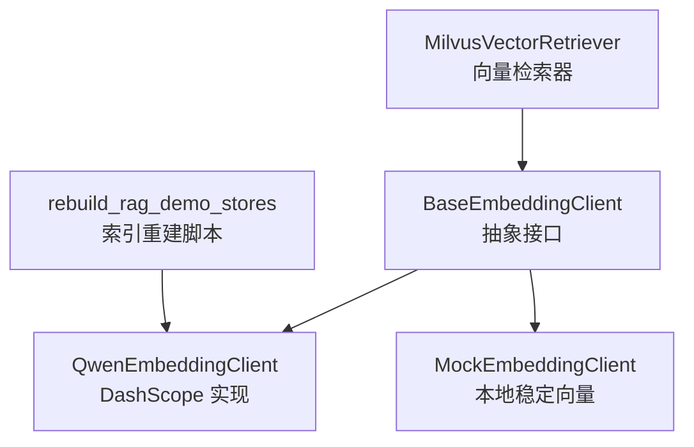
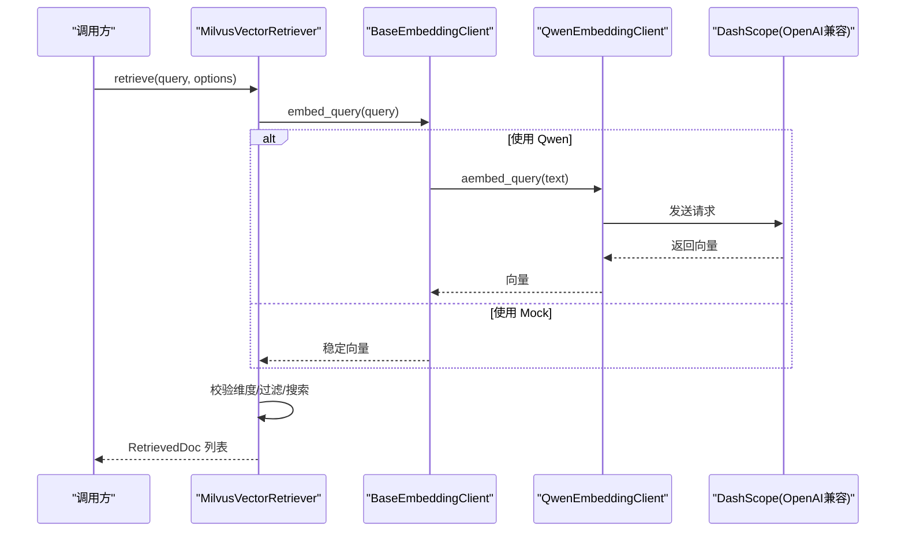
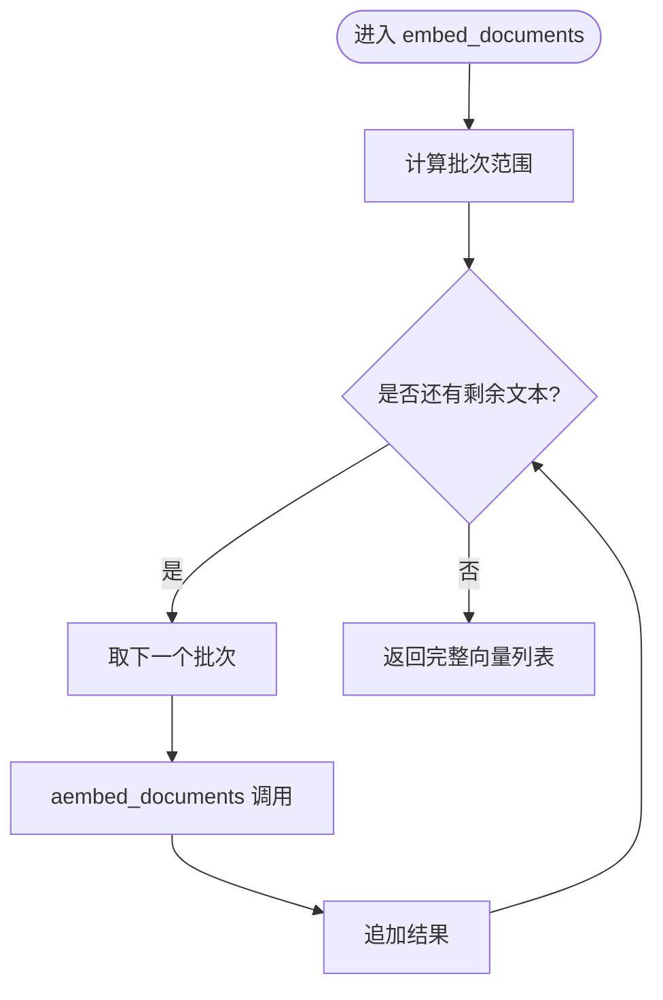
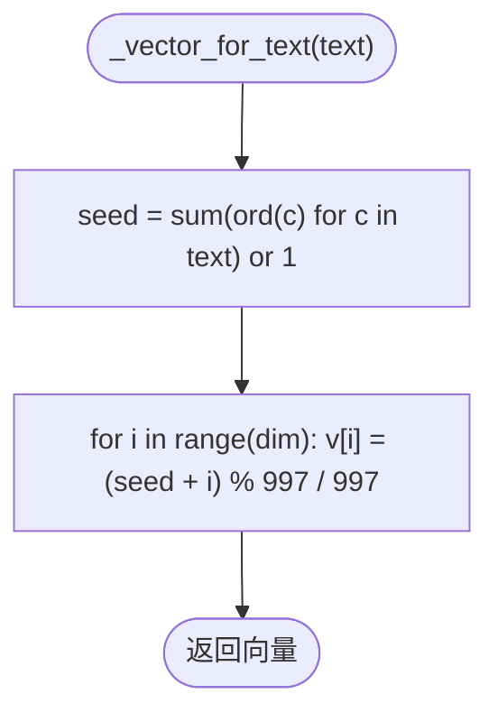
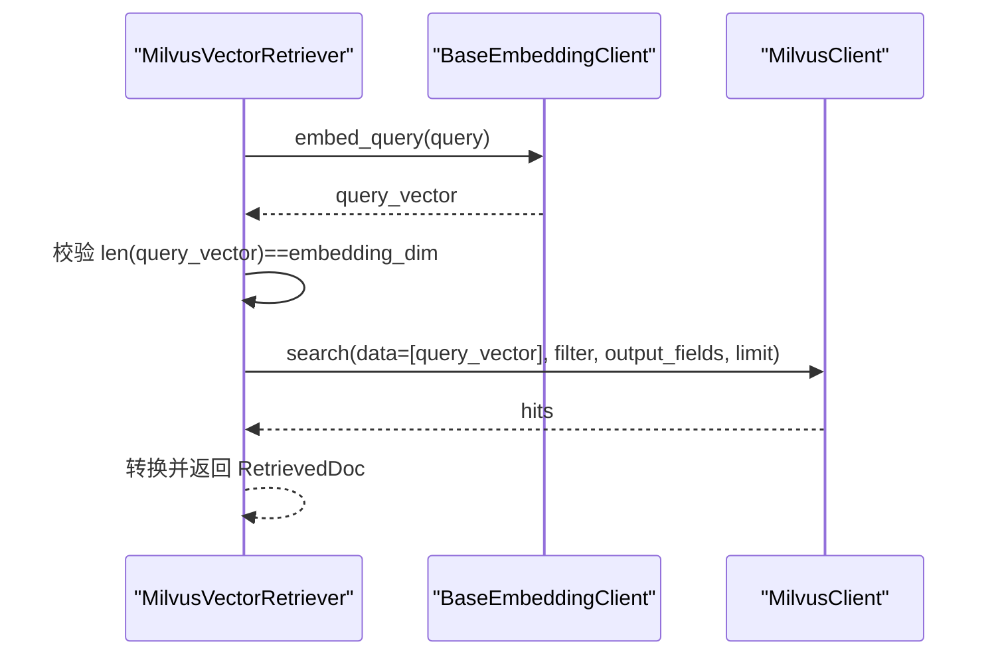
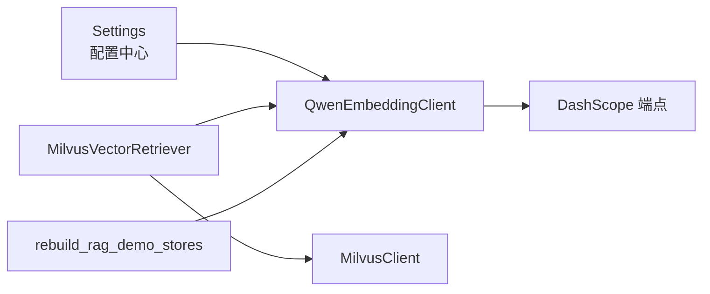

# 嵌入模型组件

<cite>
**本文引用的文件**
- [base.py](file://src/fast_app/components/embeddings/base.py)
- [qwen_embedding_client.py](file://src/fast_app/components/embeddings/qwen_embedding_client.py)
- [mock_embedding_client.py](file://src/fast_app/components/embeddings/mock_embedding_client.py)
- [config.py](file://src/fast_app/core/config.py)
- [milvus_vector_retriever.py](file://src/fast_app/components/retrievers/milvus_vector_retriever.py)
- [rebuild_rag_demo_stores.py](file://scripts/rebuild_rag_demo_stores.py)
</cite>

## 目录
1. [简介](#简介)
2. [项目结构](#项目结构)
3. [核心组件](#核心组件)
4. [架构总览](#架构总览)
5. [详细组件分析](#详细组件分析)
6. [依赖关系分析](#依赖关系分析)
7. [性能与批处理](#性能与批处理)
8. [故障排查指南](#故障排查指南)
9. [结论](#结论)
10. [附录：自定义嵌入模型开发指南](#附录自定义嵌入模型开发指南)

## 简介
本组件为 RAG 链路提供统一的文本向量化接口，屏蔽不同向量模型的差异。当前实现包含：
- Qwen 嵌入客户端：基于 OpenAI 兼容的 DashScope 接口进行批量向量化，支持按供应商限制分批调用。
- Mock 嵌入客户端：本地稳定生成固定维度向量，用于工程链路验证与测试。
- 统一抽象基类：定义 embed_query 与 embed_documents 两个异步方法，作为上层检索、入库等模块的统一入口。

该设计使检索器、索引构建脚本等上游模块无需关心具体模型细节，仅通过配置切换 provider、模型名、维度等参数即可运行。

## 项目结构
嵌入相关代码位于 fast_app/components/embeddings 下，采用“抽象基类 + 多实现”的分层组织：
- base.py：定义 BaseEmbeddingClient 抽象接口。
- qwen_embedding_client.py：Qwen（DashScope OpenAI 兼容）实现。
- mock_embedding_client.py：Mock 实现，用于测试与本地验证。
- 配置项集中在 core/config.py 的 Settings 中，控制 embedding_provider、embedding_model_name、embedding_dim 等。
- 使用方包括 Milvus 向量检索器与重建脚本，均通过注入或构造 BaseEmbeddingClient 实例来调用。

图表来源
- [base.py:4-13](file://src/fast_app/components/embeddings/base.py#L4-L13)
- [qwen_embedding_client.py:15-55](file://src/fast_app/components/embeddings/qwen_embedding_client.py#L15-L55)
- [mock_embedding_client.py:4-31](file://src/fast_app/components/embeddings/mock_embedding_client.py#L4-L31)
- [milvus_vector_retriever.py:155-201](file://src/fast_app/components/retrievers/milvus_vector_retriever.py#L155-L201)
- [rebuild_rag_demo_stores.py:377-393](file://scripts/rebuild_rag_demo_stores.py#L377-L393)

章节来源
- [base.py:4-13](file://src/fast_app/components/embeddings/base.py#L4-L13)
- [qwen_embedding_client.py:15-55](file://src/fast_app/components/embeddings/qwen_embedding_client.py#L15-L55)
- [mock_embedding_client.py:4-31](file://src/fast_app/components/embeddings/mock_embedding_client.py#L4-L31)
- [config.py:597-604](file://src/fast_app/core/config.py#L597-L604)
- [milvus_vector_retriever.py:155-201](file://src/fast_app/components/retrievers/milvus_vector_retriever.py#L155-L201)
- [rebuild_rag_demo_stores.py:377-393](file://scripts/rebuild_rag_demo_stores.py#L377-L393)

## 核心组件
- 抽象接口 BaseEmbeddingClient
  - embed_query(text): 将单条查询文本转换为向量。
  - embed_documents(texts): 将多条文档文本批量转换为向量列表。
- QwenEmbeddingClient
  - 通过 LangChain 的 OpenAIEmbeddings 对接 DashScope 兼容端点。
  - 初始化时校验 API Key，并设置 model、base_url、dimensions、chunk_size 等参数。
  - 对 embed_documents 进行分批调用，避免超过供应商单次上限。
  - 异常统一包装为 ExternalServiceError，便于上层重试/降级。
- MockEmbeddingClient
  - 根据文本字符编码求和生成稳定 seed，再映射到指定维度的浮点向量。
  - 不依赖外部服务，适合本地验证 ingestion/retrieval/evaluation 的工程链路。

章节来源
- [base.py:4-13](file://src/fast_app/components/embeddings/base.py#L4-L13)
- [qwen_embedding_client.py:15-55](file://src/fast_app/components/embeddings/qwen_embedding_client.py#L15-L55)
- [mock_embedding_client.py:4-31](file://src/fast_app/components/embeddings/mock_embedding_client.py#L4-L31)

## 架构总览
嵌入组件在 RAG 链路中的位置如下：
- 检索阶段：MilvusVectorRetriever 调用 BaseEmbeddingClient.embed_query 获取 query 向量，再进行相似度搜索。
- 入库阶段：rebuild_rag_demo_stores 脚本调用 BaseEmbeddingClient.embed_documents 批量生成 chunk 向量，写入 Milvus/ES。

图表来源
- [milvus_vector_retriever.py:182-201](file://src/fast_app/components/retrievers/milvus_vector_retriever.py#L182-L201)
- [qwen_embedding_client.py:31-37](file://src/fast_app/components/embeddings/qwen_embedding_client.py#L31-L37)
- [mock_embedding_client.py:17-21](file://src/fast_app/components/embeddings/mock_embedding_client.py#L17-L21)

## 详细组件分析

### 抽象接口 BaseEmbeddingClient
- 职责：定义统一的异步向量化接口，确保上层模块可插拔替换不同实现。
- 复杂度：O(1) 接口定义；实际复杂度由具体实现决定。
- 扩展性：新增模型只需实现两个异步方法并保持签名一致。

章节来源
- [base.py:4-13](file://src/fast_app/components/embeddings/base.py#L4-L13)

### Qwen 嵌入客户端
- 配置项
  - openai_api_key、openai_base_url、embedding_model_name、embedding_dim 来自 Settings。
  - chunk_size 设置为常量以适配供应商限制。
- 批处理策略
  - embed_documents 按固定批次大小循环切片调用，保证顺序拼接结果。
- 错误处理
  - 捕获异常并记录日志，抛出 ExternalServiceError，便于上层统一处理。
- 性能特征
  - 网络 I/O 为主，延迟受模型端点影响；批处理可降低请求次数。

图表来源
- [qwen_embedding_client.py:39-51](file://src/fast_app/components/embeddings/qwen_embedding_client.py#L39-L51)

章节来源
- [qwen_embedding_client.py:15-55](file://src/fast_app/components/embeddings/qwen_embedding_client.py#L15-L55)
- [config.py:230-235](file://src/fast_app/core/config.py#L230-L235)
- [config.py:597-604](file://src/fast_app/core/config.py#L597-L604)

### Mock 嵌入客户端
- 用途
  - 本地验证 ingestion/retrieval/evaluation 的工程链路，不依赖外部服务。
- 向量生成逻辑
  - 以文本字符编码之和作为 seed，保证同一段文本每次生成相同向量。
  - 每个维度值通过取模归一化到 0~1 区间，仅为构造合法向量，不代表语义相似度。
- 性能特征
  - 纯 CPU 计算，无网络开销，适合快速回归测试。

图表来源
- [mock_embedding_client.py:23-30](file://src/fast_app/components/embeddings/mock_embedding_client.py#L23-L30)

章节来源
- [mock_embedding_client.py:4-31](file://src/fast_app/components/embeddings/mock_embedding_client.py#L4-L31)

### 与检索器的集成
- MilvusVectorRetriever 在检索流程中调用 BaseEmbeddingClient.embed_query 获取 query 向量。
- 随后进行维度校验、过滤表达式构建、Milvus search，并将结果转换为 RetrievedDoc。
- 若向量维度与配置不一致，会记录详细日志并抛出外部服务错误。

图表来源
- [milvus_vector_retriever.py:182-233](file://src/fast_app/components/retrievers/milvus_vector_retriever.py#L182-L233)
- [milvus_vector_retriever.py:253-303](file://src/fast_app/components/retrievers/milvus_vector_retriever.py#L253-L303)

章节来源
- [milvus_vector_retriever.py:155-337](file://src/fast_app/components/retrievers/milvus_vector_retriever.py#L155-L337)

### 与索引重建脚本的集成
- rebuild_rag_demo_stores 在构建向量时直接实例化 QwenEmbeddingClient，并对所有 chunks 调用 embed_documents。
- 成功后校验返回向量维度与配置一致，再写入 Milvus/ES。

章节来源
- [rebuild_rag_demo_stores.py:377-393](file://scripts/rebuild_rag_demo_stores.py#L377-L393)

## 依赖关系分析
- 组件耦合
  - BaseEmbeddingClient 被检索器和脚本解耦依赖，降低耦合度。
  - QwenEmbeddingClient 依赖 Settings 与 LangChain OpenAIEmbeddings。
  - MockEmbeddingClient 无外部依赖，稳定性高。
- 外部依赖
  - DashScope OpenAI 兼容端点（Qwen）。
  - Milvus 向量数据库（检索与存储）。
- 潜在风险
  - 网络抖动导致 embedding 失败，需在上层做重试/降级。
  - 维度不匹配会导致检索失败，需在配置与索引构建阶段严格校验。

图表来源
- [config.py:597-604](file://src/fast_app/core/config.py#L597-L604)
- [qwen_embedding_client.py:15-29](file://src/fast_app/components/embeddings/qwen_embedding_client.py#L15-L29)
- [milvus_vector_retriever.py:155-179](file://src/fast_app/components/retrievers/milvus_vector_retriever.py#L155-L179)
- [rebuild_rag_demo_stores.py:377-393](file://scripts/rebuild_rag_demo_stores.py#L377-L393)

章节来源
- [config.py:597-604](file://src/fast_app/core/config.py#L597-L604)
- [qwen_embedding_client.py:15-29](file://src/fast_app/components/embeddings/qwen_embedding_client.py#L15-L29)
- [milvus_vector_retriever.py:155-179](file://src/fast_app/components/retrievers/milvus_vector_retriever.py#L155-L179)
- [rebuild_rag_demo_stores.py:377-393](file://scripts/rebuild_rag_demo_stores.py#L377-L393)

## 性能与批处理
- 批处理
  - QwenEmbeddingClient 将长文本列表按固定批次大小切分，减少请求次数，提升吞吐。
  - 建议根据供应商限制与网络状况调整批次大小。
- 缓存策略
  - 当前实现未内置缓存；如需优化重复文本的向量生成，可在上层引入文本哈希到向量的内存/磁盘缓存。
- 超时与重试
  - 配置中包含 embedding_timeout_seconds，建议在调用链路上结合超时与重试策略。
- 监控与诊断
  - 检索器记录了 embedding 耗时、维度、过滤条件、命中数等指标，便于定位瓶颈。

[本节为通用指导，不直接分析具体文件]

## 故障排查指南
- 常见错误
  - 缺少 API Key：QwenEmbeddingClient 初始化时会检查并抛出运行时错误。
  - 维度不匹配：检索器会在向量维度与配置不一致时报错并记录详细日志。
  - 外部服务失败：embedding 调用异常会被包装为 ExternalServiceError，便于上层统一处理。
- 排查步骤
  - 检查 Settings 中的 OPENAI_API_KEY、OPENAI_BASE_URL、EMBEDDING_MODEL_NAME、EMBEDDING_DIM。
  - 确认 Milvus collection 的向量字段维度与 embedding_dim 一致。
  - 查看检索日志中的 milvus.embedding.finish、milvus.search.failed 事件，定位问题环节。

章节来源
- [qwen_embedding_client.py:16-18](file://src/fast_app/components/embeddings/qwen_embedding_client.py#L16-L18)
- [milvus_vector_retriever.py:215-233](file://src/fast_app/components/retrievers/milvus_vector_retriever.py#L215-L233)
- [milvus_vector_retriever.py:305-337](file://src/fast_app/components/retrievers/milvus_vector_retriever.py#L305-L337)

## 结论
本嵌入组件通过统一抽象接口实现了 Qwen 与 Mock 两种实现的无缝切换，满足生产与测试场景需求。Qwen 实现遵循供应商限制进行批处理，Mock 实现提供稳定可复现的本地向量。配合检索器的维度校验与详细日志，可有效保障 RAG 链路的稳定性与可观测性。

[本节为总结性内容，不直接分析具体文件]

## 附录：自定义嵌入模型开发指南
- 模型加载
  - 新建一个继承 BaseEmbeddingClient 的类，并在 __init__ 中完成模型加载与配置读取（如从 Settings 获取 key、base_url、model_name、dim）。
- 向量计算
  - 实现 embed_query：将单条文本转为向量。
  - 实现 embed_documents：将多条文本转为向量列表，注意批处理与顺序保持。
- 性能优化
  - 合理设置 batch size，平衡吞吐与延迟。
  - 考虑引入文本哈希缓存，避免重复计算。
  - 使用异步 I/O，避免阻塞事件循环。
- 错误处理
  - 捕获底层异常并记录日志，必要时包装为 ExternalServiceError，便于上层统一处理。
- 选择建议
  - 本地开发与测试：优先使用 MockEmbeddingClient，零依赖、速度快、结果稳定。
  - 生产环境：使用 QwenEmbeddingClient，通过 Settings 配置 provider、模型名、维度与端点。
  - 对比维度：延迟、成本、向量质量、批处理能力、可观测性。

[本节为通用指导，不直接分析具体文件]