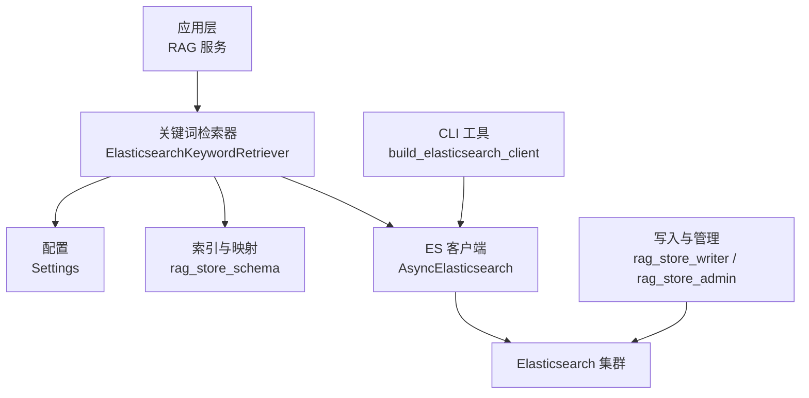
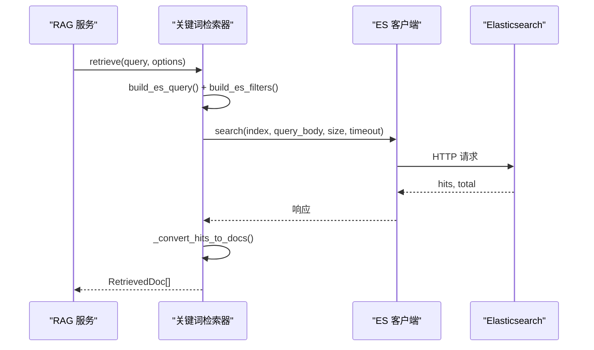
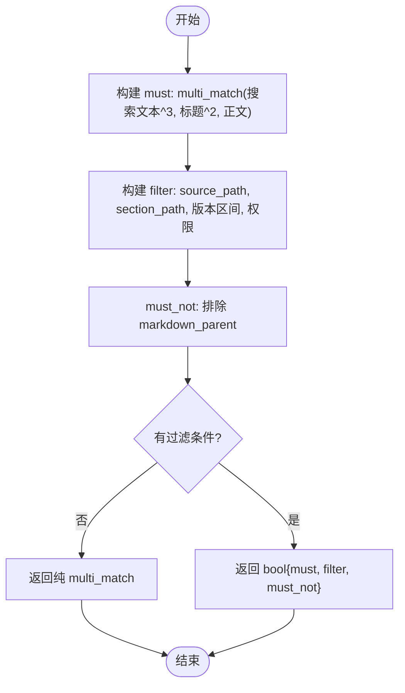
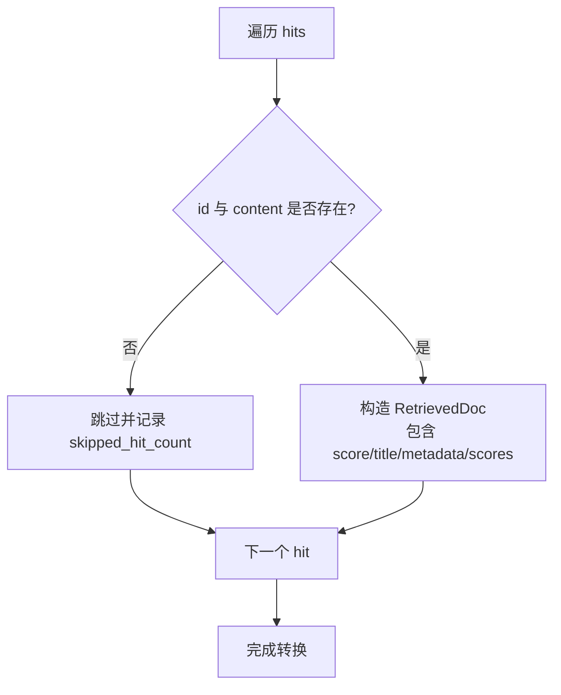
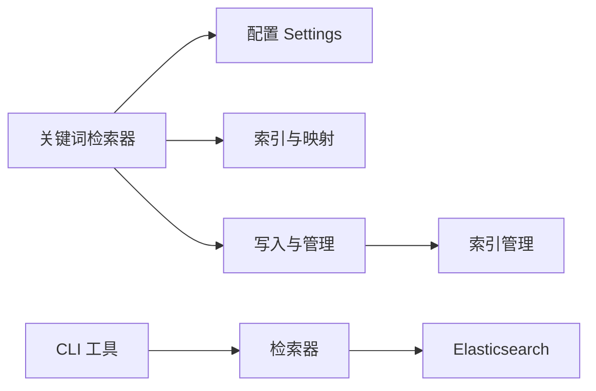

# Elasticsearch 关键词检索器

<cite>
**本文引用的文件**
- [elasticsearch_keyword_retriever.py](file://src/fast_app/components/retrievers/elasticsearch_keyword_retriever.py)
- [rag_store_schema.py](file://src/fast_app/ingestion/stores/rag_store_schema.py)
- [config.py](file://src/fast_app/core/config.py)
- [rag_store_writer.py](file://src/fast_app/ingestion/stores/rag_store_writer.py)
- [rag_store_admin.py](file://src/fast_app/ingestion/stores/rag_store_admin.py)
- [cli.py](file://src/fast_app/ingestion/cli.py)
- [elasticsearch_keyword_retriever_demo.py](file://src/app/elasticsearch_keyword_retriever_demo.py)
- [rag_pipeline_service.py](file://src/fast_app/services/rag/rag_pipeline_service.py)
</cite>

## 目录
1. [简介](#简介)
2. [项目结构](#项目结构)
3. [核心组件](#核心组件)
4. [架构总览](#架构总览)
5. [详细组件分析](#详细组件分析)
6. [依赖关系分析](#依赖关系分析)
7. [性能与优化](#性能与优化)
8. [故障排查指南](#故障排查指南)
9. [结论](#结论)
10. [附录：配置示例与常见问题](#附录：配置示例与常见问题)

## 简介
本文件面向 Elasticsearch 关键词检索器的实现与使用，覆盖以下主题：
- ES 客户端配置、索引映射与分词器设置
- 查询语法构建、布尔搜索与权限下推
- 高亮显示、聚合分析与性能优化技巧
- 索引维护、备份恢复与监控告警
- 完整配置示例与常见问题解决方案

该检索器基于多字段加权匹配（标题、搜索文本、正文）并结合业务过滤与权限控制，在 RAG 主链路中承担精确术语、编号、错误信息等关键词召回职责。

## 项目结构
围绕关键词检索的关键代码分布在如下模块：
- 检索器实现：负责构造 ES 查询、调用 search、转换结果并记录日志
- 索引与映射：定义字段类型、IK 分词器、元数据字段及索引设置
- 写入与管理：负责创建/重建索引、批量写入、按文档 ID 删除与版本关闭
- 配置中心：集中管理 ES 连接、超时、指标阈值等参数
- CLI 工具：提供带认证的 ES 客户端构建方法
- 演示脚本：展示如何初始化检索器并执行检索

图表来源
- [elasticsearch_keyword_retriever.py:210-345](file://src/fast_app/components/retrievers/elasticsearch_keyword_retriever.py#L210-L345)
- [rag_store_schema.py:58-140](file://src/fast_app/ingestion/stores/rag_store_schema.py#L58-L140)
- [config.py:71-82](file://src/fast_app/core/config.py#L71-L82)
- [rag_store_writer.py:219-394](file://src/fast_app/ingestion/stores/rag_store_writer.py#L219-L394)
- [rag_store_admin.py:53-85](file://src/fast_app/ingestion/stores/rag_store_admin.py#L53-L85)
- [cli.py:79-106](file://src/fast_app/ingestion/cli.py#L79-L106)

章节来源
- [elasticsearch_keyword_retriever.py:1-399](file://src/fast_app/components/retrievers/elasticsearch_keyword_retriever.py#L1-L399)
- [rag_store_schema.py:1-140](file://src/fast_app/ingestion/stores/rag_store_schema.py#L1-L140)
- [config.py:71-82](file://src/fast_app/core/config.py#L71-L82)
- [rag_store_writer.py:219-394](file://src/fast_app/ingestion/stores/rag_store_writer.py#L219-L394)
- [rag_store_admin.py:53-85](file://src/fast_app/ingestion/stores/rag_store_admin.py#L53-L85)
- [cli.py:79-106](file://src/fast_app/ingestion/cli.py#L79-L106)

## 核心组件
- ElasticsearchKeywordRetriever：封装 ES 关键词检索的完整流程，包括查询构建、权限过滤、调用 search、结果转换、慢操作日志与异常处理。
- 索引与映射：统一字段常量、IK 分词器、text/keyword 映射、索引设置与 mapping 生成。
- 写入与管理：确保索引存在、增量更新、重建索引、批量写入、按 doc_id 删除、版本关闭。
- 配置：ES URL、索引名、认证、请求超时、慢检索阈值等。
- CLI：集中构建带认证的 ES 客户端，校验用户名密码一致性。
- 演示：快速验证检索器是否可用。

章节来源
- [elasticsearch_keyword_retriever.py:210-399](file://src/fast_app/components/retrievers/elasticsearch_keyword_retriever.py#L210-L399)
- [rag_store_schema.py:58-140](file://src/fast_app/ingestion/stores/rag_store_schema.py#L58-L140)
- [rag_store_writer.py:219-394](file://src/fast_app/ingestion/stores/rag_store_writer.py#L219-L394)
- [config.py:71-82](file://src/fast_app/core/config.py#L71-L82)
- [cli.py:79-106](file://src/fast_app/ingestion/cli.py#L79-L106)
- [elasticsearch_keyword_retriever_demo.py:9-34](file://src/app/elasticsearch_keyword_retriever_demo.py#L9-L34)

## 架构总览
关键词检索在 RAG 主链路中的位置如下：
- 上层服务根据用户查询和选项调用关键词检索器
- 检索器将业务过滤与权限条件下推到 ES filter，提升召回效率
- 通过 multi_match 对标题、搜索文本、正文进行加权匹配
- 返回 RetrievedDoc 列表，供后续混合检索、RRF、重排等环节使用

图表来源
- [rag_pipeline_service.py:1207-1259](file://src/fast_app/services/rag/rag_pipeline_service.py#L1207-L1259)
- [elasticsearch_keyword_retriever.py:227-345](file://src/fast_app/components/retrievers/elasticsearch_keyword_retriever.py#L227-L345)

## 详细组件分析

### 查询构建与布尔搜索
- 查询主体：使用 bool.must 承载 multi_match，对“搜索文本^3、标题^2、正文”进行加权匹配。
- 过滤条件：bool.filter 承载 source_path、section_path、知识版本区间、权限过滤等硬约束。
- 排除规则：must_not 排除父块记录，避免初始召回阶段引入上下文扩展数据。
- 权限下推：将公开可见、部门授权、用户授权合并为 should 子句，最小匹配数为 1；若无任何可访问范围，构造必不命中条件以安全兜底。

图表来源
- [elasticsearch_keyword_retriever.py:47-133](file://src/fast_app/components/retrievers/elasticsearch_keyword_retriever.py#L47-L133)
- [elasticsearch_keyword_retriever.py:176-207](file://src/fast_app/components/retrievers/elasticsearch_keyword_retriever.py#L176-L207)

章节来源
- [elasticsearch_keyword_retriever.py:47-207](file://src/fast_app/components/retrievers/elasticsearch_keyword_retriever.py#L47-L207)

### 结果转换与跳过计数
- 从 ES 响应中安全提取 hits，避免非列表或异常结构导致崩溃。
- 对每个 hit 校验 id 与 content，缺失则跳过并记录 skipped_hit_count，防止脏数据进入 LLM 上下文。
- 保留 keyword_score 用于后续混合检索与重排。

图表来源
- [elasticsearch_keyword_retriever.py:347-398](file://src/fast_app/components/retrievers/elasticsearch_keyword_retriever.py#L347-L398)

章节来源
- [elasticsearch_keyword_retriever.py:347-398](file://src/fast_app/components/retrievers/elasticsearch_keyword_retriever.py#L347-L398)

### 索引映射与分词器设置
- 文本字段：content、search_text、title 使用 text 类型，并配置 IK 分词器（索引 ik_max_word，搜索 ik_smart）。
- 关键字字段：id、doc_id、record_type、source、metadata.* 等使用 keyword 类型，便于精确过滤与聚合。
- 元数据：metadata 内嵌结构化字段，如 visibility、allowed_departments、allowed_users、version 区间等。
- 索引设置：单分片、零副本，适合开发测试环境；生产可按需调整。

章节来源
- [rag_store_schema.py:58-140](file://src/fast_app/ingestion/stores/rag_store_schema.py#L58-L140)

### 写入、重建与维护
- ensure_es_index：若索引不存在则创建；若已存在则补充新增字段映射，兼容演进。
- recreate_es_index：先重置索引（删除并重建 schema），再批量写入 chunks 与 parent 记录。
- upsert_es_index：增量写入，支持父子记录同时写入。
- delete_by_query：按 doc_ids 批量删除。
- close_by_version：通过 painless 脚本更新 valid_to_version，冻结旧版本记录。

章节来源
- [rag_store_writer.py:219-479](file://src/fast_app/ingestion/stores/rag_store_writer.py#L219-L479)
- [rag_store_admin.py:53-85](file://src/fast_app/ingestion/stores/rag_store_admin.py#L53-L85)

### 客户端配置与认证
- Settings：提供 elasticsearch_url、elasticsearch_index_name、elasticsearch_request_timeout 等关键参数。
- CLI：集中构建 AsyncElasticsearch，支持 basic_auth，强制用户名与密码成对配置。
- 检索器：优先复用 FastAPI lifespan 注入的 client；未传入时按 settings.elasticsearch_url 自行创建。

章节来源
- [config.py:71-82](file://src/fast_app/core/config.py#L71-L82)
- [cli.py:79-106](file://src/fast_app/ingestion/cli.py#L79-L106)
- [elasticsearch_keyword_retriever.py:210-225](file://src/fast_app/components/retrievers/elasticsearch_keyword_retriever.py#L210-L225)

### 演示与集成
- 演示脚本：获取 Settings，初始化检索器，执行检索并打印结果。
- RAG 服务集成：在服务层调用关键词检索器，统计耗时、命中数、过滤后数量，并在无结果时抛出明确错误。

章节来源
- [elasticsearch_keyword_retriever_demo.py:9-34](file://src/app/elasticsearch_keyword_retriever_demo.py#L9-L34)
- [rag_pipeline_service.py:1207-1259](file://src/fast_app/services/rag/rag_pipeline_service.py#L1207-L1259)

## 依赖关系分析
- 检索器依赖：
  - 配置：Settings（URL、索引名、超时、阈值）
  - 索引与映射：rag_store_schema（字段常量、mapping、settings）
  - 写入与管理：rag_store_writer、rag_store_admin（索引生命周期管理）
  - CLI：构建带认证的客户端
- 外部依赖：
  - AsyncElasticsearch 客户端
  - Elasticsearch 集群（IK 分词器必须可用）

图表来源
- [elasticsearch_keyword_retriever.py:1-30](file://src/fast_app/components/retrievers/elasticsearch_keyword_retriever.py#L1-L30)
- [rag_store_schema.py:1-140](file://src/fast_app/ingestion/stores/rag_store_schema.py#L1-L140)
- [rag_store_writer.py:1-56](file://src/fast_app/ingestion/stores/rag_store_writer.py#L1-L56)
- [rag_store_admin.py:53-85](file://src/fast_app/ingestion/stores/rag_store_admin.py#L53-L85)
- [cli.py:79-106](file://src/fast_app/ingestion/cli.py#L79-L106)

章节来源
- [elasticsearch_keyword_retriever.py:1-30](file://src/fast_app/components/retrievers/elasticsearch_keyword_retriever.py#L1-L30)
- [rag_store_schema.py:1-140](file://src/fast_app/ingestion/stores/rag_store_schema.py#L1-L140)
- [rag_store_writer.py:1-56](file://src/fast_app/ingestion/stores/rag_store_writer.py#L1-L56)
- [rag_store_admin.py:53-85](file://src/fast_app/ingestion/stores/rag_store_admin.py#L53-L85)
- [cli.py:79-106](file://src/fast_app/ingestion/cli.py#L79-L106)

## 性能与优化
- 查询优化
  - 使用 bool.filter 承载硬约束（路径、版本、权限），不参与评分，减少计算开销。
  - multi_match 加权字段：搜索文本权重最高，标题次之，正文最低，提高术语与标题命中率。
  - 限制 size=candidate_k，避免拉取过多命中。
- 超时与降级
  - 请求级 request_timeout 防止慢查询拖垮整条 RAG 链路。
  - 慢检索阈值 slow_retrieval_threshold_ms 触发告警日志。
- 数据质量
  - 跳过缺少 id/content 的 hit，记录 skipped_hit_count，便于发现脏数据。
- 索引策略
  - 文本字段使用 IK 分词器，中文分词更准确。
  - 元数据字段使用 keyword 类型，利于精确过滤与聚合。
  - 生产环境建议合理设置分片与副本，平衡吞吐与容灾。

[本节为通用指导，不直接分析具体文件]

## 故障排查指南
- 连接与认证
  - 确认 ELASTICSEARCH_URL、ELASTICSEARCH_USERNAME、ELASTICSEARCH_PASSWORD 配置正确且成对出现。
  - CLI 会校验用户名与密码一致性，否则抛出运行时错误。
- 分词器不可用
  - 重建索引前会验证 IK 分词器；若 analyze 失败，说明分词器未安装或未生效。
- 无结果或结果过少
  - 检查 query_body 与 filter_clauses，确认权限过滤是否过于严格。
  - 查看日志中的 hit_count、total_value、skipped_hit_count，定位问题。
- 慢查询
  - 关注 elasticsearch.search.slow 日志，结合 size、filter_count、hit_count 分析瓶颈。
- 脏数据
  - 若 skipped_hit_count > 0，检查索引中是否存在缺失 id 或 content 的记录。

章节来源
- [cli.py:79-106](file://src/fast_app/ingestion/cli.py#L79-L106)
- [rag_store_admin.py:53-85](file://src/fast_app/ingestion/stores/rag_store_admin.py#L53-L85)
- [elasticsearch_keyword_retriever.py:243-340](file://src/fast_app/components/retrievers/elasticsearch_keyword_retriever.py#L243-L340)
- [rag_pipeline_service.py:1207-1259](file://src/fast_app/services/rag/rag_pipeline_service.py#L1207-L1259)

## 结论
该关键词检索器通过多字段加权匹配与严格的权限下推，实现了高效、可控的 ES 关键词召回。配合统一的索引映射、写入管理与配置中心，能够在 RAG 主链路中稳定工作。生产环境中应关注分词器可用性、索引分片与副本、超时与慢查询告警，以及数据质量监控。

[本节为总结性内容，不直接分析具体文件]

## 附录：配置示例与常见问题

### 配置项清单（来自 Settings）
- ELASTICSEARCH_URL：ES 地址
- ELASTICSEARCH_INDEX_NAME：索引名称
- ELASTICSEARCH_USERNAME / ELASTICSEARCH_PASSWORD：认证凭据（需成对配置）
- ELASTICSEARCH_REQUEST_TIMEOUT：单次请求超时秒数
- SLOW_RETRIEVAL_THRESHOLD_MS：慢检索阈值毫秒

章节来源
- [config.py:71-82](file://src/fast_app/core/config.py#L71-L82)
- [config.py:628-632](file://src/fast_app/core/config.py#L628-L632)

### 索引映射要点
- 文本字段：content、search_text、title 使用 text + IK 分词器
- 关键字字段：id、doc_id、record_type、source、metadata.* 使用 keyword
- 元数据：visibility、allowed_departments、allowed_users、版本区间等
- 索引设置：number_of_shards、number_of_replicas

章节来源
- [rag_store_schema.py:58-140](file://src/fast_app/ingestion/stores/rag_store_schema.py#L58-L140)

### 查询语法与布尔搜索
- must：multi_match 加权匹配
- filter：source_path、section_path、版本区间、权限
- must_not：排除 markdown_parent

章节来源
- [elasticsearch_keyword_retriever.py:176-207](file://src/fast_app/components/retrievers/elasticsearch_keyword_retriever.py#L176-L207)
- [elasticsearch_keyword_retriever.py:47-133](file://src/fast_app/components/retrievers/elasticsearch_keyword_retriever.py#L47-L133)

### 高亮显示与聚合分析
- 当前检索器未启用高亮显示；如需高亮可在 ES 查询中添加 highlight 配置。
- 可通过 metadata.visibility、metadata.allowed_departments、metadata.document_type 等 keyword 字段进行聚合分析。

[本节为通用指导，不直接分析具体文件]

### 索引维护、备份恢复与监控告警
- 维护：ensure_es_index、recreate_es_index、delete_by_query、close_by_version
- 备份恢复：建议使用 ES Snapshot API 对索引进行快照与恢复（不在当前仓库实现）
- 监控告警：关注 elasticsearch.search.start/finish/slow/failed 日志事件

章节来源
- [rag_store_writer.py:219-479](file://src/fast_app/ingestion/stores/rag_store_writer.py#L219-L479)
- [elasticsearch_keyword_retriever.py:243-340](file://src/fast_app/components/retrievers/elasticsearch_keyword_retriever.py#L243-L340)

### 常见问题解决方案
- 认证失败：检查用户名与密码是否成对配置，CLI 会强制校验
- 分词器错误：重建索引前验证 IK 分词器是否可用
- 无结果：检查权限过滤与业务过滤是否过严；查看日志中的 hit_count 与 total_value
- 慢查询：降低 size、精简 filter、检查 ES 集群负载与索引健康

章节来源
- [cli.py:79-106](file://src/fast_app/ingestion/cli.py#L79-L106)
- [rag_store_admin.py:53-85](file://src/fast_app/ingestion/stores/rag_store_admin.py#L53-L85)
- [elasticsearch_keyword_retriever.py:243-340](file://src/fast_app/components/retrievers/elasticsearch_keyword_retriever.py#L243-L340)