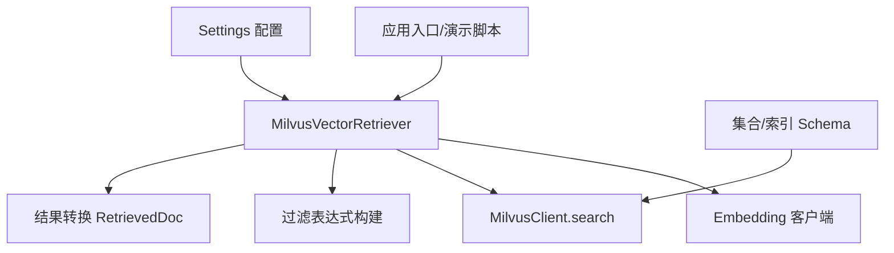
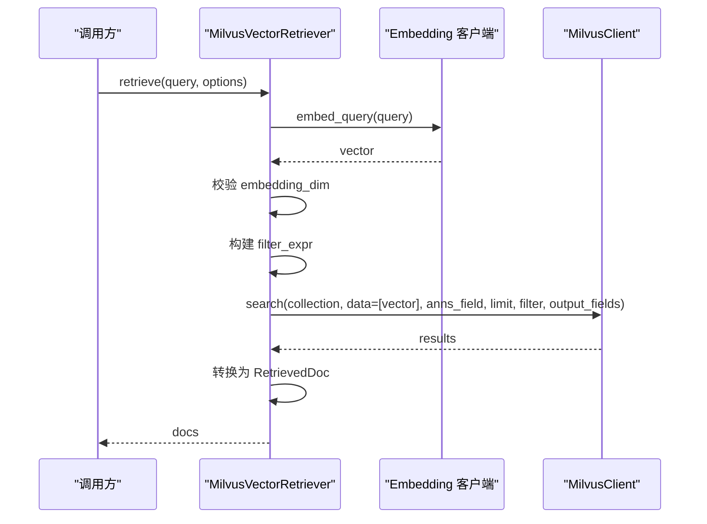
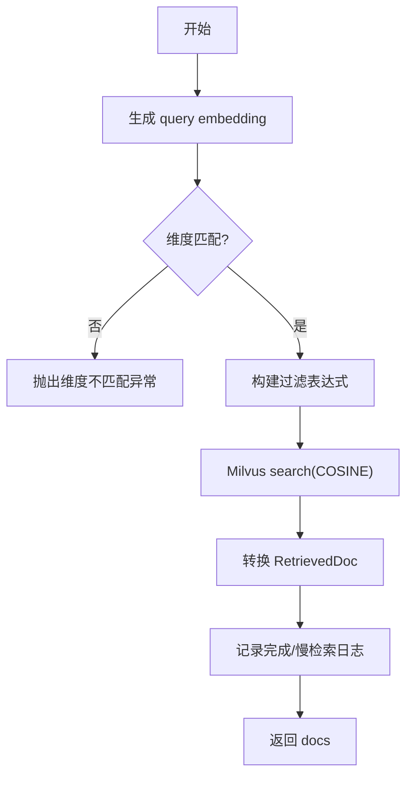
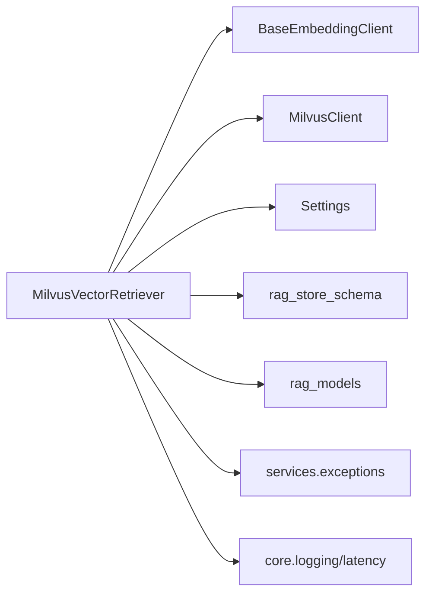

# Milvus 向量检索器

<cite>
**本文引用的文件**
- [milvus_vector_retriever.py](file://src/fast_app/components/retrievers/milvus_vector_retriever.py)
- [config.py](file://src/fast_app/core/config.py)
- [rag_models.py](file://src/fast_app/domain/rag_models.py)
- [rag_store_schema.py](file://src/fast_app/ingestion/stores/rag_store_schema.py)
- [exceptions.py](file://src/fast_app/services/exceptions.py)
- [external_call_policy.py](file://src/fast_app/services/external_call_policy.py)
- [exception_handlers.py](file://src/fast_app/core/exception_handlers.py)
- [rag_service.py](file://src/fast_app/services/rag/rag_service.py)
- [rag_pipeline_service.py](file://src/fast_app/services/rag/rag_pipeline_service.py)
- [milvus_vector_retriever_demo.py](file://src/app/milvus_vector_retriever_demo.py)
- [9-8-超时重试降级与fallback.md](file://learning-docs/phase-9/9-8-超时重试降级与fallback.md)
</cite>

## 目录
1. [简介](#简介)
2. [项目结构](#项目结构)
3. [核心组件](#核心组件)
4. [架构总览](#架构总览)
5. [详细组件分析](#详细组件分析)
6. [依赖关系分析](#依赖关系分析)
7. [性能考虑](#性能考虑)
8. [故障排查指南](#故障排查指南)
9. [结论](#结论)
10. [附录：配置示例与最佳实践](#附录：配置示例与最佳实践)

## 简介
本文件面向使用 Milvus 进行向量召回的 RAG 系统，系统性说明 Milvus 向量检索器的实现原理、连接参数、集合与字段约定、查询过滤与权限控制、相似度计算、阈值与排序逻辑、批量与分页策略、性能调优、错误处理与重试降级，以及可操作的配置示例与排障清单。文档基于仓库中现有代码与学习文档，确保内容与实际实现一致。

## 项目结构
Milvus 向量检索能力集中在“组件层”的检索器中，并通过统一的领域模型与配置项接入上层 RAG Pipeline。关键位置如下：
- 检索器实现：components/retrievers/milvus_vector_retriever.py
- 配置中心：core/config.py（Settings）
- 数据模型：domain/rag_models.py（RetrievalOptions、RetrievedDoc、ScoreBreakdown 等）
- 集合与索引定义：ingestion/stores/rag_store_schema.py
- 异常体系：services/exceptions.py
- 外部调用重试策略：services/external_call_policy.py
- 统一异常处理器：core/exception_handlers.py
- 上层 RAG 服务与管线：services/rag/rag_service.py、services/rag/rag_pipeline_service.py
- 演示脚本：app/milvus_vector_retriever_demo.py

图表来源
- [milvus_vector_retriever.py:155-307](file://src/fast_app/components/retrievers/milvus_vector_retriever.py#L155-L307)
- [config.py:58-68](file://src/fast_app/core/config.py#L58-L68)
- [rag_store_schema.py:148-279](file://src/fast_app/ingestion/stores/rag_store_schema.py#L148-L279)

章节来源
- [milvus_vector_retriever.py:155-307](file://src/fast_app/components/retrievers/milvus_vector_retriever.py#L155-L307)
- [config.py:58-68](file://src/fast_app/core/config.py#L58-L68)
- [rag_store_schema.py:148-279](file://src/fast_app/ingestion/stores/rag_store_schema.py#L148-L279)

## 核心组件
- MilvusVectorRetriever：封装 query embedding、维度校验、过滤表达式构造、Milvus search、结果转换与慢操作日志。
- RetrievalOptions / RetrievalFilters：声明候选数、输出字段、业务与权限过滤条件。
- Settings：集中管理 Milvus 连接、集合名、向量字段、ID/内容字段、embedding 维度、慢检索阈值等。
- rag_store_schema：定义 Milvus Collection Schema、Index 类型与 metric、output_fields 列表。
- 异常与重试：ExternalServiceError 及其子类；call_with_retry 通用重试策略。

章节来源
- [milvus_vector_retriever.py:155-307](file://src/fast_app/components/retrievers/milvus_vector_retriever.py#L155-L307)
- [rag_models.py:1-79](file://src/fast_app/domain/rag_models.py#L1-L79)
- [config.py:58-68](file://src/fast_app/core/config.py#L58-L68)
- [rag_store_schema.py:148-279](file://src/fast_app/ingestion/stores/rag_store_schema.py#L148-L279)
- [exceptions.py:136-154](file://src/fast_app/services/exceptions.py#L136-L154)
- [external_call_policy.py:39-74](file://src/fast_app/services/external_call_policy.py#L39-L74)

## 架构总览
下图展示一次向量检索从请求到返回的关键路径，包括 embedding、过滤、search、转换与日志记录。

图表来源
- [milvus_vector_retriever.py:182-307](file://src/fast_app/components/retrievers/milvus_vector_retriever.py#L182-L307)

章节来源
- [milvus_vector_retriever.py:182-307](file://src/fast_app/components/retrievers/milvus_vector_retriever.py#L182-L307)

## 详细组件分析

### MilvusVectorRetriever 实现要点
- 初始化：支持注入复用 client 或根据 Settings 自动创建 MilvusClient。
- 主流程：
  - 生成 query embedding 并记录耗时与维度信息。
  - 校验 embedding 维度与 Settings.embedding_dim 是否一致，不一致抛出 ExternalServiceError。
  - 构建过滤表达式：组合 source_path、section_path、知识版本区间、权限表达式。
  - 执行 search：metric_type=COSINE，limit=candidate_k，filter=权限+业务过滤，output_fields 由配置或选项决定。
  - 转换结果：将 hits 转为 RetrievedDoc，保留 title、metadata、chunk_index 等追溯字段，并写入 scores.vector_score。
  - 记录慢检索：当超过 slow_retrieval_threshold_ms 时记录慢检索事件。
- 错误处理：捕获非 ExternalServiceError 的异常，记录失败日志并包装为 ExternalServiceError 抛出。

图表来源
- [milvus_vector_retriever.py:194-307](file://src/fast_app/components/retrievers/milvus_vector_retriever.py#L194-L307)

章节来源
- [milvus_vector_retriever.py:194-307](file://src/fast_app/components/retrievers/milvus_vector_retriever.py#L194-L307)

### 过滤与权限控制
- 业务过滤：source_path、section_path（取最后一级）、knowledge_version（valid_from_version <= version and (valid_to_version == 0 or valid_to_version > version)）。
- 权限过滤：
  - can_read_all=True 时不附加权限表达式。
  - allow_public 允许 public 文档。
  - department_codes 通过 array_contains(allowed_departments, ...) 匹配。
  - user_id 通过 array_contains(allowed_users, ...) 显式授权。
  - 若无任何可访问范围，返回必定不命中的表达式，避免误放开权限。
- 过滤表达式在 Milvus 召回阶段生效，减少无权限数据进入候选集。

章节来源
- [milvus_vector_retriever.py:56-133](file://src/fast_app/components/retrievers/milvus_vector_retriever.py#L56-L133)

### 相似度计算与排序
- 相似度：COSINE 距离作为向量相似度度量。
- 分数：Milvus distance 写入 RetrievedDoc.score 与 scores.vector_score，供后续 RRF/rerank 使用。
- 排序：Milvus 按相似度降序返回；上层可按 top_k/candidate_k 截断。

章节来源
- [milvus_vector_retriever.py:253-265](file://src/fast_app/components/retrievers/milvus_vector_retriever.py#L253-L265)
- [rag_models.py:40-69](file://src/fast_app/domain/rag_models.py#L40-L69)

### 集合与字段约定
- 集合名：settings.milvus_collection_name
- 向量字段：settings.milvus_vector_field，类型为 FLOAT_VECTOR，维度 settings.embedding_dim
- ID/内容字段：settings.milvus_id_field、settings.milvus_content_field
- 元数据：JSON 字段 metadata，包含 section_path、source_path、document_type、chunk_index 等
- 索引：AUTOINDEX，metric_type=COSINE
- output_fields：默认包含 id、content、title、source_path、metadata 等必要字段

章节来源
- [rag_store_schema.py:148-279](file://src/fast_app/ingestion/stores/rag_store_schema.py#L148-L279)
- [config.py:58-68](file://src/fast_app/core/config.py#L58-L68)

### 批量查询与分页
- 当前检索器单次传入一个 query vector，返回 candidate_k 条候选。
- 若需批量查询，可在上层循环调用 retrieve，或使用并行调用（注意并发度与资源占用）。
- 分页可通过调整 candidate_k 与 top_k 实现：先取较大 candidate_k，再在上层按 top_k 截断。

章节来源
- [milvus_vector_retriever.py:253-265](file://src/fast_app/components/retrievers/milvus_vector_retriever.py#L253-L265)
- [rag_models.py:27-37](file://src/fast_app/domain/rag_models.py#L27-L37)

### 阈值与结果筛选
- min_score：上层服务对检索结果进行分数过滤，低于阈值的文档会被丢弃。
- 空结果：当结果为空时抛出 NoSearchResultError，便于上游感知。

章节来源
- [rag_service.py:52-81](file://src/fast_app/services/rag/rag_service.py#L52-L81)
- [rag_service.py:84-122](file://src/fast_app/services/rag/rag_service.py#L84-L122)
- [rag_pipeline_service.py:1159-1171](file://src/fast_app/services/rag/rag_pipeline_service.py#L1159-L1171)
- [exceptions.py:20-25](file://src/fast_app/services/exceptions.py#L20-L25)

## 依赖关系分析
- MilvusVectorRetriever 依赖：
  - BaseEmbeddingClient：生成 query embedding
  - MilvusClient：执行 search
  - Settings：读取连接与集合配置
  - rag_store_schema：提供 output_fields 与 schema/index 定义
  - domain.rag_models：RetrievalOptions、RetrievedDoc、ScoreBreakdown
  - services.exceptions：ExternalServiceError 等
  - core.logging/latency：结构化日志与慢检索告警

图表来源
- [milvus_vector_retriever.py:1-23](file://src/fast_app/components/retrievers/milvus_vector_retriever.py#L1-L23)
- [milvus_vector_retriever.py:155-180](file://src/fast_app/components/retrievers/milvus_vector_retriever.py#L155-L180)

章节来源
- [milvus_vector_retriever.py:1-23](file://src/fast_app/components/retrievers/milvus_vector_retriever.py#L1-L23)
- [milvus_vector_retriever.py:155-180](file://src/fast_app/components/retrievers/milvus_vector_retriever.py#L155-L180)

## 性能考虑
- 向量维度一致性：embedding 维度必须与 Settings.embedding_dim 一致，否则直接失败，避免无效搜索。
- 过滤下推：将业务与权限过滤放入 Milvus filter，减少候选集大小，提升搜索效率。
- output_fields 最小化：仅返回必要字段，降低网络与序列化开销。
- candidate_k/top_k 调优：增大 candidate_k 提高召回质量，但会增加后续融合/精排成本；top_k 控制最终返回数量。
- 慢检索告警：超过 slow_retrieval_threshold_ms 会记录慢检索事件，便于定位瓶颈。
- 索引类型：AUTOINDEX + COSINE，适合快速搭建与通用场景；生产可根据数据规模评估更合适的索引类型与参数。

章节来源
- [milvus_vector_retriever.py:215-233](file://src/fast_app/components/retrievers/milvus_vector_retriever.py#L215-L233)
- [milvus_vector_retriever.py:239-265](file://src/fast_app/components/retrievers/milvus_vector_retriever.py#L239-L265)
- [milvus_vector_retriever.py:288-301](file://src/fast_app/components/retrievers/milvus_vector_retriever.py#L288-L301)
- [rag_store_schema.py:271-279](file://src/fast_app/ingestion/stores/rag_store_schema.py#L271-L279)
- [config.py:41-48](file://src/fast_app/core/config.py#L41-L48)

## 故障排查指南
- 维度不匹配：检查 embedding 模型与 Settings.embedding_dim 是否一致。
- 无结果：确认 min_score 阈值、过滤表达式是否正确；检查权限字段与部门/用户授权。
- 慢检索：关注 milvus.search.slow 日志，结合 candidate_k、output_fields、filter_expr 分析。
- 外部服务错误：Milvus 调用失败会包装为 ExternalServiceError，HTTP 层统一处理并返回 503。
- 重试与降级：
  - 通用重试：call_with_retry 用于可重试错误（超时、临时 5xx、限流等），按最大重试次数与退避延迟重试。
  - 降级策略：混合模式下单路召回失败可继续；rerank 失败可回退到 RRF 结果。
- 日志定位：利用 milvus.embedding.finish、milvus.search.start/finish、milvus.hit.skipped 等事件定位问题。

章节来源
- [milvus_vector_retriever.py:215-233](file://src/fast_app/components/retrievers/milvus_vector_retriever.py#L215-L233)
- [milvus_vector_retriever.py:271-301](file://src/fast_app/components/retrievers/milvus_vector_retriever.py#L271-L301)
- [milvus_vector_retriever.py:305-337](file://src/fast_app/components/retrievers/milvus_vector_retriever.py#L305-L337)
- [exception_handlers.py:93-125](file://src/fast_app/core/exception_handlers.py#L93-L125)
- [external_call_policy.py:39-74](file://src/fast_app/services/external_call_policy.py#L39-L74)
- [9-8-超时重试降级与fallback.md:128-144](file://learning-docs/phase-9/9-8-超时重试降级与fallback.md#L128-L144)

## 结论
Milvus 向量检索器在本项目中实现了稳定的 embedding 生成、严格的维度校验、细粒度的业务与权限过滤、COSINE 相似度检索、完整的分数明细与慢检索告警。配合统一的异常体系与重试策略，能够在外部服务不稳定时保持整体链路稳定。通过合理设置 candidate_k/top_k、output_fields 与过滤表达式，可以在召回质量与性能之间取得平衡。

## 附录：配置示例与最佳实践
- 连接与集合
  - MILVUS_HOST/MILVUS_PORT：Milvus HTTP 地址
  - MILVUS_COLLECTION_NAME：集合名
  - MILVUS_VECTOR_FIELD：向量字段名
  - MILVUS_ID_FIELD/MILVUS_CONTENT_FIELD：ID/内容字段名
- Embedding
  - EMBEDDING_PROVIDER/EMBEDDING_MODEL_NAME/EMBEDDING_DIM：嵌入模型与维度
- 检索参数
  - RAG_DEFAULT_TOP_K/RAG_DEFAULT_MIN_SCORE：默认 top_k 与分数阈值
  - VECTOR_RETRIEVER_PROVIDER/KEYWORD_RETRIEVER_PROVIDER：选择 mock 或真实检索器
- 超时与重试
  - EXTERNAL_CALL_MAX_RETRIES/EXTERNAL_CALL_RETRY_BASE_DELAY：外部调用重试策略
  - ELASTICSEARCH_REQUEST_TIMEOUT：ES 请求超时（与 Milvus 协同使用）
  - LLM_TIMEOUT_SECONDS/EMBEDDING_TIMEOUT_SECONDS：LLM/Embedding 超时
- 慢检索阈值
  - SLOW_RETRIEVAL_THRESHOLD_MS：触发慢检索告警的阈值

最佳实践
- 始终保证 embedding 维度与 Settings.embedding_dim 一致。
- 将业务与权限过滤放入 Milvus filter，减少候选集。
- 按需裁剪 output_fields，避免多余字段传输。
- 合理设置 candidate_k 与 top_k，兼顾召回与性能。
- 使用 call_with_retry 对可重试错误进行有限重试，避免无限等待。
- 在混合检索中，单路失败应降级继续，保障可用性。

章节来源
- [config.py:58-68](file://src/fast_app/core/config.py#L58-L68)
- [config.py:597-634](file://src/fast_app/core/config.py#L597-L634)
- [milvus_vector_retriever.py:253-265](file://src/fast_app/components/retrievers/milvus_vector_retriever.py#L253-L265)
- [external_call_policy.py:39-74](file://src/fast_app/services/external_call_policy.py#L39-L74)
- [9-8-超时重试降级与fallback.md:227-337](file://learning-docs/phase-9/9-8-超时重试降级与fallback.md#L227-L337)