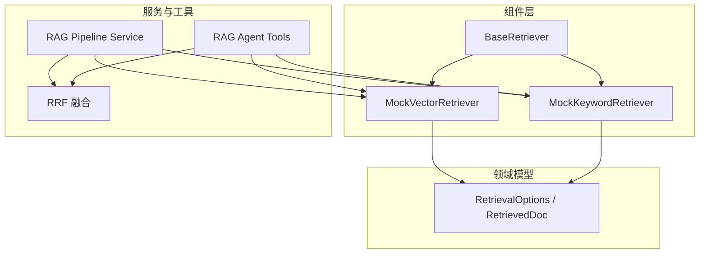
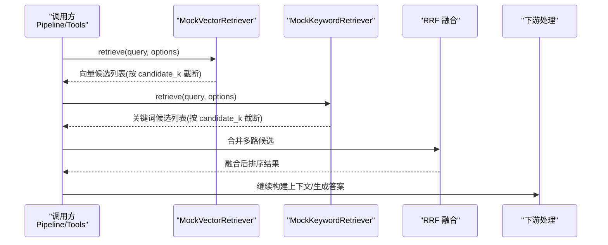
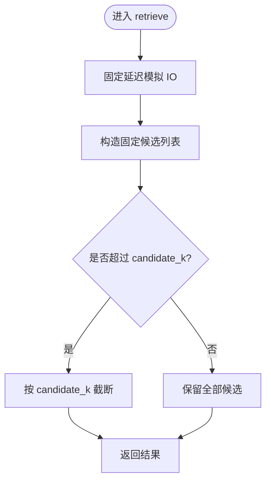
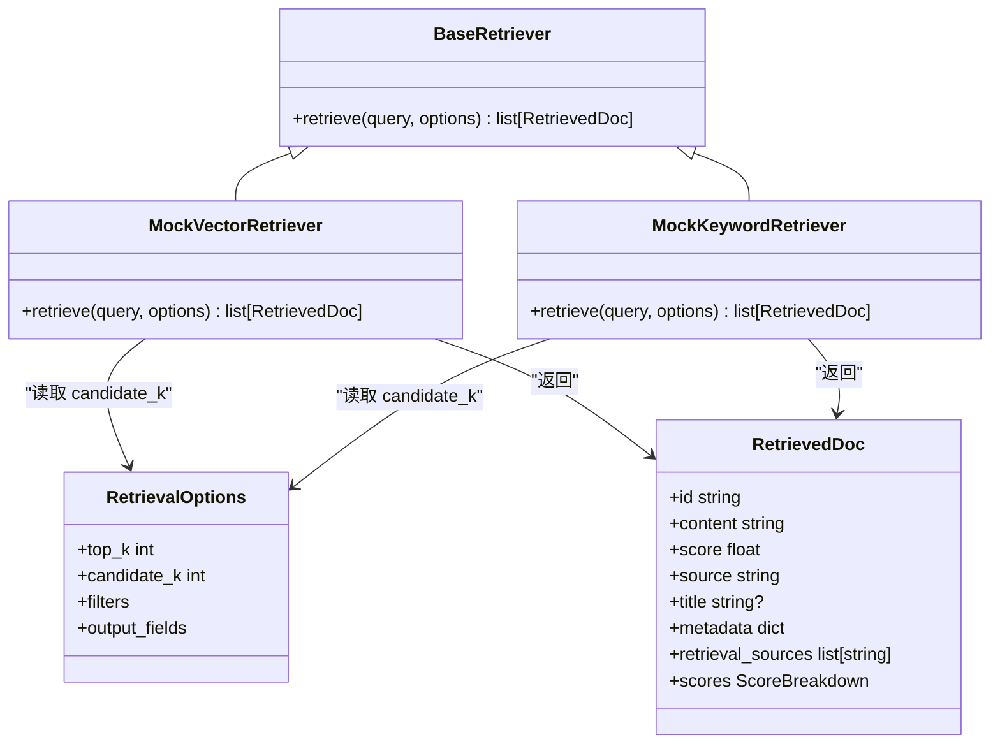

# Mock 检索器实现

<cite>
**本文引用的文件**
- [mock_vector_retriever.py](file://src/fast_app/components/retrievers/mock_vector_retriever.py)
- [mock_keyword_retriever.py](file://src/fast_app/components/retrievers/mock_keyword_retriever.py)
- [base.py](file://src/fast_app/components/retrievers/base.py)
- [rag_models.py](file://src/fast_app/domain/rag_models.py)
- [rag_pipeline_service.py](file://src/fast_app/services/rag/rag_pipeline_service.py)
- [rag_agent_tools.py](file://src/fast_app/agents/tools/rag_agent_tools.py)
- [retrieval_fusion.py](file://src/fast_app/services/rag/retrieval_fusion.py)
- [mock_llm_client.py](file://src/fast_app/components/llms/mock_llm_client.py)
- [real_network_enhanced_web_smoke.py](file://.tmp/real_network_enhanced_web_smoke.py)
- [mock_retriever.py](file://src/app/services/mock_retriever.py)
</cite>

## 目录
1. [简介](#简介)
2. [项目结构](#项目结构)
3. [核心组件](#核心组件)
4. [架构总览](#架构总览)
5. [详细组件分析](#详细组件分析)
6. [依赖关系分析](#依赖关系分析)
7. [性能考虑](#性能考虑)
8. [故障排查指南](#故障排查指南)
9. [结论](#结论)
10. [附录：测试与示例](#附录测试与示例)

## 简介
本文件面向“测试模式下的模拟检索”需求，系统化说明 MockVectorRetriever 与 MockKeywordRetriever 的实现原理、配置项、数据生成策略、响应时间控制、异常模拟方式，以及在单元测试、集成测试、性能与压力测试中的使用方法。文档同时给出调用时序图、类关系图与流程图，帮助读者快速理解并安全使用这两个检索器。

## 项目结构
Mock 检索器位于 fast_app 的 components.retrievers 包中，遵循统一的 BaseRetriever 抽象接口；数据模型定义在 domain.rag_models；上层通过服务层（如 rag_pipeline_service）和工具层（如 rag_agent_tools）统一调度检索流程，并在融合阶段进行 RRF 合并。

图表来源
- [base.py:1-13](file://src/fast_app/components/retrievers/base.py#L1-L13)
- [mock_vector_retriever.py:1-30](file://src/fast_app/components/retrievers/mock_vector_retriever.py#L1-L30)
- [mock_keyword_retriever.py:1-30](file://src/fast_app/components/retrievers/mock_keyword_retriever.py#L1-L30)
- [rag_models.py:1-80](file://src/fast_app/domain/rag_models.py#L1-L80)
- [rag_pipeline_service.py:1294-1327](file://src/fast_app/services/rag/rag_pipeline_service.py#L1294-L1327)
- [rag_agent_tools.py:334-367](file://src/fast_app/agents/tools/rag_agent_tools.py#L334-L367)
- [retrieval_fusion.py:1-40](file://src/fast_app/services/rag/retrieval_fusion.py#L1-L40)

章节来源
- [base.py:1-13](file://src/fast_app/components/retrievers/base.py#L1-L13)
- [rag_models.py:1-80](file://src/fast_app/domain/rag_models.py#L1-L80)

## 核心组件
- BaseRetriever：定义异步 retrieve(query, options) -> list[RetrievedDoc] 的统一接口。
- MockVectorRetriever：模拟向量检索源，返回固定候选集并按 candidate_k 截断。
- MockKeywordRetriever：模拟关键词检索源，返回固定候选集并按 candidate_k 截断。
- RetrievalOptions：包含 top_k、candidate_k、filters、output_fields 等选项，Mock 检索器主要使用 candidate_k 控制返回数量。
- RetrievedDoc：单条召回结果，包含 id、content、score、source、title、metadata、retrieval_sources、scores 等字段。

章节来源
- [base.py:1-13](file://src/fast_app/components/retrievers/base.py#L1-L13)
- [mock_vector_retriever.py:1-30](file://src/fast_app/components/retrievers/mock_vector_retriever.py#L1-L30)
- [mock_keyword_retriever.py:1-30](file://src/fast_app/components/retrievers/mock_keyword_retriever.py#L1-L30)
- [rag_models.py:1-80](file://src/fast_app/domain/rag_models.py#L1-L80)

## 架构总览
Mock 检索器作为可插拔的检索后端，被 RAG 管道与服务工具统一调用。上层负责组装 RetrievalOptions，传入 query 与候选数等参数；Mock 检索器以固定延迟与固定内容返回结果，随后进入过滤与 RRF 融合阶段，最终得到用于回答的上下文。

图表来源
- [rag_pipeline_service.py:1294-1327](file://src/fast_app/services/rag/rag_pipeline_service.py#L1294-L1327)
- [rag_agent_tools.py:334-367](file://src/fast_app/agents/tools/rag_agent_tools.py#L334-L367)
- [retrieval_fusion.py:1-40](file://src/fast_app/services/rag/retrieval_fusion.py#L1-L40)
- [mock_vector_retriever.py:1-30](file://src/fast_app/components/retrievers/mock_vector_retriever.py#L1-L30)
- [mock_keyword_retriever.py:1-30](file://src/fast_app/components/retrievers/mock_keyword_retriever.py#L1-L30)

## 详细组件分析

### MockVectorRetriever
- 功能特性
  - 模拟 Milvus 向量检索，返回固定两条命中结果，source 标记为 milvus。
  - 支持异步调用，内部使用固定延迟模拟网络/IO 耗时。
  - 根据 RetrievalOptions.candidate_k 对候选结果进行截断，便于上层统一控制候选规模。
- 配置选项
  - 无需额外构造参数，行为由 RetrievalOptions.candidate_k 控制。
- 数据生成
  - 固定内容模板中包含查询词占位，便于观察不同 query 的命中差异。
- 响应时间控制
  - 固定 sleep 时长，可用于稳定复现超时或慢查询场景。
- 异常模拟
  - 当前未抛出异常；可在测试中通过包装或替换实现异常注入。
- 适用场景
  - 向量检索链路冒烟、端到端回归、与关键词检索并行融合的稳定性验证。

图表来源
- [mock_vector_retriever.py:1-30](file://src/fast_app/components/retrievers/mock_vector_retriever.py#L1-L30)
- [rag_models.py:27-36](file://src/fast_app/domain/rag_models.py#L27-L36)

章节来源
- [mock_vector_retriever.py:1-30](file://src/fast_app/components/retrievers/mock_vector_retriever.py#L1-L30)
- [rag_models.py:27-36](file://src/fast_app/domain/rag_models.py#L27-L36)

### MockKeywordRetriever
- 功能特性
  - 模拟 ElasticSearch 关键词检索，返回固定两条命中结果，source 标记为 elasticsearch。
  - 同样具备固定延迟与基于 candidate_k 的截断能力。
- 配置选项
  - 仅依赖 RetrievalOptions.candidate_k。
- 数据生成
  - 固定内容模板中包含查询词占位，便于区分不同查询。
- 响应时间控制
  - 固定 sleep 时长，适合与向量检索并行执行时的整体时延评估。
- 异常模拟
  - 当前未抛出异常；可通过测试替身或装饰器注入异常。
- 适用场景
  - 关键词检索链路冒烟、混合检索（vector+keyword）的 RRF 融合验证。

图表来源
- [mock_keyword_retriever.py:1-30](file://src/fast_app/components/retrievers/mock_keyword_retriever.py#L1-L30)
- [rag_models.py:27-36](file://src/fast_app/domain/rag_models.py#L27-L36)

章节来源
- [mock_keyword_retriever.py:1-30](file://src/fast_app/components/retrievers/mock_keyword_retriever.py#L1-L30)
- [rag_models.py:27-36](file://src/fast_app/domain/rag_models.py#L27-L36)

### 基类与数据模型
- BaseRetriever：统一异步 retrieve 契约，确保所有检索器可被上层一致调用。
- RetrievalOptions：top_k 控制最终返回数量，candidate_k 控制各源候选规模；filters 可用于扩展权限与范围过滤；output_fields 供底层引擎按需返回字段。
- RetrievedDoc：承载单条召回结果，包含分数、来源、标题、元数据、多阶段分数明细等，便于后续融合与评测。

章节来源
- [base.py:1-13](file://src/fast_app/components/retrievers/base.py#L1-L13)
- [rag_models.py:1-80](file://src/fast_app/domain/rag_models.py#L1-L80)

## 依赖关系分析
- 组件耦合
  - Mock 检索器仅依赖 BaseRetriever 与领域模型，耦合度低，易于替换与扩展。
- 直接依赖
  - 上层服务与工具通过统一接口调用检索器，不感知具体实现。
- 间接依赖
  - 融合阶段依赖 RetrievedDoc 的结构一致性；若新增字段需同步更新融合逻辑。
- 外部依赖
  - 无外部网络或存储依赖，完全离线可测。

图表来源
- [base.py:1-13](file://src/fast_app/components/retrievers/base.py#L1-L13)
- [mock_vector_retriever.py:1-30](file://src/fast_app/components/retrievers/mock_vector_retriever.py#L1-L30)
- [mock_keyword_retriever.py:1-30](file://src/fast_app/components/retrievers/mock_keyword_retriever.py#L1-L30)
- [rag_models.py:1-80](file://src/fast_app/domain/rag_models.py#L1-L80)

章节来源
- [base.py:1-13](file://src/fast_app/components/retrievers/base.py#L1-L13)
- [rag_models.py:1-80](file://src/fast_app/domain/rag_models.py#L1-L80)

## 性能考虑
- 固定延迟
  - 两个 Mock 检索器均使用固定 sleep，便于稳定测量端到端时延与并发吞吐。
- 并发与并行
  - 上层通常并行调用向量与关键词检索，Mock 的固定延迟有助于评估并行收益与瓶颈。
- 候选规模
  - 通过 candidate_k 控制候选数量，避免下游融合与排序成为瓶颈。
- 流式与 LLM 配合
  - 可与 MockLLMClient 的固定延迟/流式输出组合，形成完整的端到端性能基线。

章节来源
- [mock_vector_retriever.py:1-30](file://src/fast_app/components/retrievers/mock_vector_retriever.py#L1-L30)
- [mock_keyword_retriever.py:1-30](file://src/fast_app/components/retrievers/mock_keyword_retriever.py#L1-L30)
- [mock_llm_client.py:43-145](file://src/fast_app/components/llms/mock_llm_client.py#L43-L145)

## 故障排查指南
- 常见问题
  - 候选数为 0：检查 RetrievalOptions.candidate_k 是否为 0，导致截断为空。
  - 结果重复：确认 vector 与 keyword 返回的 doc.id 是否冲突，必要时在上层去重或调整 ID 策略。
  - 时延过高：确认上层并发度与候选规模，结合 MockLLM 的延迟设置综合评估。
- 定位方法
  - 查看上层日志中的 retrieval.source.finish 事件，核对 raw_count、filtered_count、returned_count 与 latency_ms。
  - 在融合阶段检查 rrf_scores 与 doc_by_id 的累积情况，确认融合逻辑是否符合预期。
- 异常注入建议
  - 在测试中通过子类覆盖 retrieve 抛出自定义异常，验证上层重试、降级与错误传播路径。

章节来源
- [rag_pipeline_service.py:1294-1327](file://src/fast_app/services/rag/rag_pipeline_service.py#L1294-L1327)
- [rag_agent_tools.py:334-367](file://src/fast_app/agents/tools/rag_agent_tools.py#L334-L367)
- [retrieval_fusion.py:1-40](file://src/fast_app/services/rag/retrieval_fusion.py#L1-L40)

## 结论
MockVectorRetriever 与 MockKeywordRetriever 提供了稳定、可预测的检索行为，适用于单元测试、集成测试、性能与压力测试等多种场景。通过统一接口与领域模型，它们能无缝接入现有 RAG 管线，并与 RRF 融合、LLM 生成等环节协同工作。建议在测试中结合 candidate_k、并发度与 MockLLM 延迟，构建可控的性能基线与回归用例。

## 附录：测试与示例

### 单元测试要点
- 目标
  - 验证 retrieve 返回结构与字段完整性。
  - 验证 candidate_k 截断行为。
  - 验证异步调用不会阻塞主线程。
- 建议用例
  - 空候选：将 candidate_k 设为 0，断言返回空列表。
  - 部分候选：将 candidate_k 设为小于固定候选数，断言返回长度等于 candidate_k。
  - 全量候选：将 candidate_k 大于等于固定候选数，断言返回长度等于固定候选数。
  - 字段校验：断言 RetrievedDoc 的 id、content、score、source 存在且类型正确。
- 参考路径
  - [mock_vector_retriever.py:1-30](file://src/fast_app/components/retrievers/mock_vector_retriever.py#L1-L30)
  - [mock_keyword_retriever.py:1-30](file://src/fast_app/components/retrievers/mock_keyword_retriever.py#L1-L30)
  - [rag_models.py:27-80](file://src/fast_app/domain/rag_models.py#L27-L80)

### 集成测试要点
- 目标
  - 验证 Mock 检索器与上层管道、融合、LLM 的端到端协作。
  - 验证日志事件与指标字段完整。
- 建议用例
  - 混合检索：并行调用 vector 与 keyword，断言融合后结果非空且分数合理。
  - 超时与降级：缩短超时阈值，验证上层是否能捕获并回退到默认答案。
  - 流式输出：结合 MockLLM 的流式输出，验证消费端能正确接收分片。
- 参考路径
  - [rag_pipeline_service.py:1294-1327](file://src/fast_app/services/rag/rag_pipeline_service.py#L1294-L1327)
  - [rag_agent_tools.py:334-367](file://src/fast_app/agents/tools/rag_agent_tools.py#L334-L367)
  - [mock_llm_client.py:43-145](file://src/fast_app/components/llms/mock_llm_client.py#L43-L145)

### 性能与压力测试策略
- 策略
  - 固定 candidate_k 与并发度，逐步增加请求数，观察端到端时延与吞吐。
  - 结合 MockLLM 的固定延迟，评估检索与生成阶段的总体瓶颈。
  - 记录 retrieval.source.finish 的 latency_ms，识别热点路径。
- 参考路径
  - [real_network_enhanced_web_smoke.py:20-23](file://.tmp/real_network_enhanced_web_smoke.py#L20-L23)
  - [rag_pipeline_service.py:1294-1327](file://src/fast_app/services/rag/rag_pipeline_service.py#L1294-L1327)
  - [mock_llm_client.py:43-145](file://src/fast_app/components/llms/mock_llm_client.py#L43-L145)

### 调试技巧
- 日志定位
  - 关注 retrieval.source.finish 事件中的 query、top_k、candidate_k、raw_count、filtered_count、returned_count、latency_ms。
- 断点与打印
  - 在 Mock 检索器的 retrieve 入口与出口处添加断点，确认输入 query 与返回候选。
- 简化复现
  - 使用最小化 RetrievalOptions（仅 top_k、candidate_k），排除 filters 干扰。

章节来源
- [rag_pipeline_service.py:1294-1327](file://src/fast_app/services/rag/rag_pipeline_service.py#L1294-L1327)
- [rag_agent_tools.py:334-367](file://src/fast_app/agents/tools/rag_agent_tools.py#L334-L367)

### 历史兼容与替代实现
- 旧版 mock 函数
  - 提供简单的同步 retrieve_docs 函数，便于早期脚本或演示使用。
- 迁移建议
  - 新项目优先使用 FastAPI 组件层的 Mock 检索器，以获得统一接口与更好的可测试性。

章节来源
- [mock_retriever.py:1-29](file://src/app/services/mock_retriever.py#L1-L29)