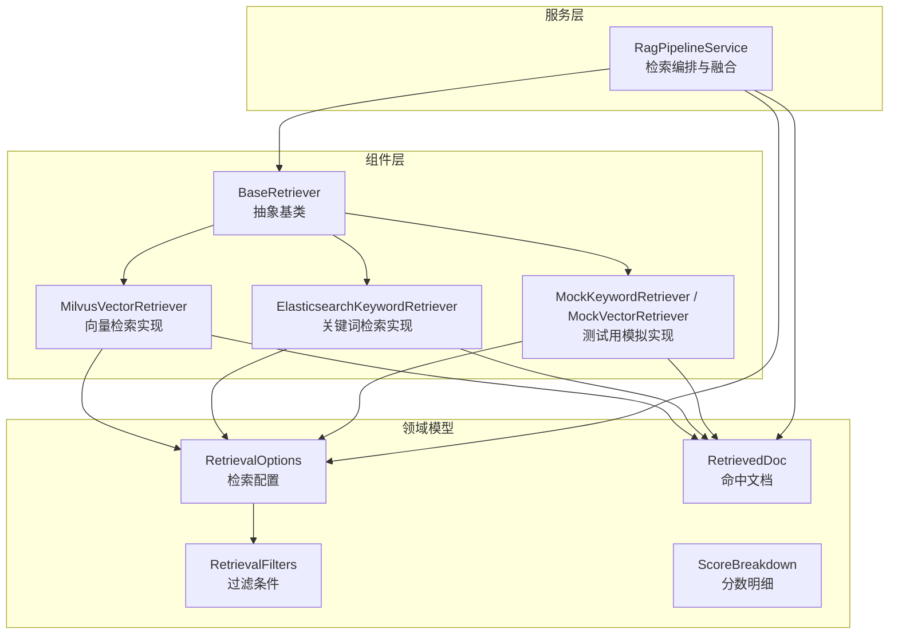
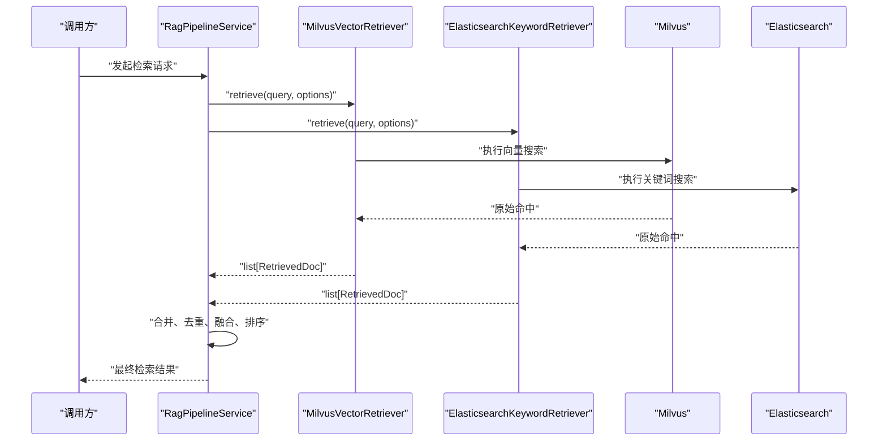
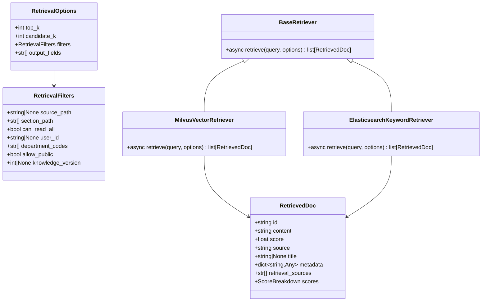

# 检索器基类设计

<cite>
**本文引用的文件**
- [base.py](file://src/fast_app/components/retrievers/base.py)
- [rag_models.py](file://src/fast_app/domain/rag_models.py)
- [milvus_vector_retriever.py](file://src/fast_app/components/retrievers/milvus_vector_retriever.py)
- [elasticsearch_keyword_retriever.py](file://src/fast_app/components/retrievers/elasticsearch_keyword_retriever.py)
- [mock_keyword_retriever.py](file://src/fast_app/components/retrievers/mock_keyword_retriever.py)
- [mock_vector_retriever.py](file://src/fast_app/components/retrievers/mock_vector_retriever.py)
- [rag_pipeline_service.py](file://src/fast_app/services/rag/rag_pipeline_service.py)
</cite>

## 目录
1. [简介](#简介)
2. [项目结构](#项目结构)
3. [核心组件](#核心组件)
4. [架构总览](#架构总览)
5. [详细组件分析](#详细组件分析)
6. [依赖关系分析](#依赖关系分析)
7. [性能考量](#性能考量)
8. [故障排查指南](#故障排查指南)
9. [结论](#结论)
10. [附录：自定义检索器开发指南](#附录：自定义检索器开发指南)

## 简介
本文件围绕检索器抽象基类 BaseRetriever 的设计理念与接口规范展开，系统说明 retrieve 方法的参数、返回值、错误处理机制，解释 RetrievalOptions 配置项的作用与使用方式，并给出 RetrievedDoc 数据模型的结构与字段含义。同时提供基于现有实现的自定义检索器开发指南、最佳实践与常见陷阱规避建议，帮助读者快速构建可插拔的向量或关键词检索器，并融入统一的 RAG 流水线。

## 项目结构
检索器相关代码位于 fast_app 组件层，采用“抽象基类 + 多实现”的分层组织方式：
- 抽象基类定义统一检索接口
- 领域模型集中定义检索选项、过滤条件与返回文档结构
- 具体检索器分别对接 Milvus 向量检索与 Elasticsearch 关键词检索
- 管道服务负责编排多个检索器、融合结果与上下文构建

图表来源
- [base.py:1-13](file://src/fast_app/components/retrievers/base.py#L1-L13)
- [rag_models.py:1-80](file://src/fast_app/domain/rag_models.py#L1-L80)
- [milvus_vector_retriever.py:155-337](file://src/fast_app/components/retrievers/milvus_vector_retriever.py#L155-L337)
- [elasticsearch_keyword_retriever.py:210-340](file://src/fast_app/components/retrievers/elasticsearch_keyword_retriever.py#L210-L340)
- [rag_pipeline_service.py:1-200](file://src/fast_app/services/rag/rag_pipeline_service.py#L1-L200)

章节来源
- [base.py:1-13](file://src/fast_app/components/retrievers/base.py#L1-L13)
- [rag_models.py:1-80](file://src/fast_app/domain/rag_models.py#L1-L80)

## 核心组件
- BaseRetriever 抽象基类：定义统一的异步检索接口，强制所有检索器实现 retrieve(query, options) -> list[RetrievedDoc]。
- RetrievalOptions：描述检索请求的配置，包括 top_k、candidate_k、filters、output_fields。
- RetrievalFilters：描述业务与权限过滤条件，如 source_path、section_path、department_codes、user_id、knowledge_version 等。
- RetrievedDoc：描述命中的 chunk 或文档，包含 id、content、score、source、title、metadata、retrieval_sources、scores。
- ScoreBreakdown：记录多阶段检索与排序的分数明细（向量、关键词、RRF、重排）。

章节来源
- [base.py:1-13](file://src/fast_app/components/retrievers/base.py#L1-L13)
- [rag_models.py:1-80](file://src/fast_app/domain/rag_models.py#L1-L80)

## 架构总览
检索器在 RAG 流水线中作为可插拔能力被调用。上层服务通过统一的 BaseRetriever 接口并发调用多种检索器，将结果进行去重、融合与排序，再构建上下文供 LLM 生成回答。

图表来源
- [milvus_vector_retriever.py:182-337](file://src/fast_app/components/retrievers/milvus_vector_retriever.py#L182-L337)
- [elasticsearch_keyword_retriever.py:227-340](file://src/fast_app/components/retrievers/elasticsearch_keyword_retriever.py#L227-L340)
- [rag_pipeline_service.py:133-200](file://src/fast_app/services/rag/rag_pipeline_service.py#L133-L200)

## 详细组件分析

### BaseRetriever 抽象基类
- 设计理念：以最小接口约束不同存储后端的检索行为，屏蔽底层差异，便于扩展新检索源。
- 接口规范：
  - 方法名：retrieve
  - 参数：
    - query: str，用户查询文本
    - options: RetrievalOptions，检索配置
  - 返回值：list[RetrievedDoc]，命中文档列表
- 错误处理：基类不捕获异常，由具体实现决定抛出何种异常；通常外部服务错误会被包装为统一的外部服务异常类型，便于上层降级或重试。

章节来源
- [base.py:1-13](file://src/fast_app/components/retrievers/base.py#L1-L13)

### RetrievalOptions 配置选项
- top_k: int，最终返回给上游的文档数量。
- candidate_k: int，每个召回源或融合前先取的候选数量。
- filters: RetrievalFilters，包含来源、章节、权限范围等过滤条件。
- output_fields: list[str]，底层检索引擎需要返回的额外字段名，用于后续转换与溯源。

使用方式：
- 在管道服务中根据请求参数构造 RetrievalOptions，并将权限范围合并进 filters。
- 在评测场景中，将评测用例转换为 RetrievalOptions，避免评测代码直接依赖 API 请求结构。

章节来源
- [rag_models.py:27-36](file://src/fast_app/domain/rag_models.py#L27-L36)
- [rag_pipeline_service.py:221-233](file://src/fast_app/services/rag/rag_pipeline_service.py#L221-L233)

### RetrievalFilters 过滤条件
- source_path: str | None，限定检索的原始文档路径。
- section_path: list[str]，限定检索的章节路径。
- can_read_all: bool，管理员或高权限用户可跳过权限过滤。
- user_id: str | None，当前检索用户 ID，用于私有文档过滤或审计扩展。
- department_codes: list[str]，当前用户可读取的部门 code 列表，用于部门级 ACL 过滤。
- allow_public: bool，是否允许读取公共文档。
- knowledge_version: int | None，服务端冻结的知识版本，客户端不可直接决定。

作用：
- 将业务过滤与权限过滤下推到检索引擎侧，减少无效召回，提升性能与安全性。

章节来源
- [rag_models.py:9-25](file://src/fast_app/domain/rag_models.py#L9-L25)

### RetrievedDoc 数据模型
- id: str，命中的 chunk 或文档 ID。
- content: str，命中文档内容。
- score: float，当前阶段用于排序的最终分数。
- source: str，主要检索来源，例如 milvus 或 elasticsearch。
- title: str | None，chunk 所属标题，可能为空。
- metadata: dict[str, Any]，结构化元数据，例如 source_path、section_path、department_codes。
- retrieval_sources: list[str]，实际命中过该 chunk 的召回来源列表。
- scores: ScoreBreakdown，多阶段检索和排序分数明细。

用途：
- 作为检索器统一输出，供上层进行去重、融合、排序与上下文构建。

章节来源
- [rag_models.py:52-69](file://src/fast_app/domain/rag_models.py#L52-L69)

### Milvus 向量检索器实现
- 职责：将 query 转为向量，构造 Milvus filter，执行 search，将原始 hits 转换为 RetrievedDoc。
- 关键流程：
  - 生成 embedding 并校验维度，维度不匹配时抛出外部服务错误。
  - 构造业务与权限过滤表达式，并在 search 阶段下推。
  - 记录日志与慢操作告警，统计命中数与跳过数。
  - 转换结果时补齐 metadata 与分数明细。
- 错误处理：
  - 外部服务错误直接抛出，避免重复包装。
  - 其他异常记录日志并包装为外部服务错误。

章节来源
- [milvus_vector_retriever.py:155-337](file://src/fast_app/components/retrievers/milvus_vector_retriever.py#L155-L337)

### Elasticsearch 关键词检索器实现
- 职责：构造 ES 查询体，执行 search，将 hits 转换为 RetrievedDoc。
- 关键流程：
  - 将 RetrievalFilters 转换为 ES bool.filter，确保权限与业务过滤下推。
  - 使用 multi_match 对正文、标题等字段加权匹配。
  - 记录日志与慢操作告警，统计 total 与跳过数。
  - 转换结果时保留 keyword_score 与 metadata。
- 错误处理：
  - 捕获异常记录日志并包装为外部服务错误。

章节来源
- [elasticsearch_keyword_retriever.py:210-340](file://src/fast_app/components/retrievers/elasticsearch_keyword_retriever.py#L210-L340)

### 模拟检索器（测试与示例）
- MockKeywordRetriever：模拟关键词召回，返回固定结果并按 candidate_k 截取。
- MockVectorRetriever：模拟向量召回，返回固定结果并按 candidate_k 截取。
- 用途：单元测试、集成测试与演示场景，避免依赖真实后端。

章节来源
- [mock_keyword_retriever.py:1-30](file://src/fast_app/components/retrievers/mock_keyword_retriever.py#L1-L30)
- [mock_vector_retriever.py:1-30](file://src/fast_app/components/retrievers/mock_vector_retriever.py#L1-L30)

## 依赖关系分析
- BaseRetriever 依赖 RetrievalOptions 与 RetrievedDoc 领域模型。
- MilvusVectorRetriever 依赖 Settings、EmbeddingClient、MilvusClient 以及领域模型。
- ElasticsearchKeywordRetriever 依赖 Settings、AsyncElasticsearch 以及领域模型。
- RagPipelineService 依赖 BaseRetriever 接口，负责并发调用、结果合并与上下文构建。

图表来源
- [base.py:1-13](file://src/fast_app/components/retrievers/base.py#L1-L13)
- [rag_models.py:1-80](file://src/fast_app/domain/rag_models.py#L1-L80)
- [milvus_vector_retriever.py:155-337](file://src/fast_app/components/retrievers/milvus_vector_retriever.py#L155-L337)
- [elasticsearch_keyword_retriever.py:210-340](file://src/fast_app/components/retrievers/elasticsearch_keyword_retriever.py#L210-L340)

章节来源
- [rag_pipeline_service.py:133-200](file://src/fast_app/services/rag/rag_pipeline_service.py#L133-L200)

## 性能考量
- 候选数量控制：candidate_k 控制每路召回的候选规模，避免下游融合与排序压力过大。
- 过滤下推：将业务与权限过滤下推到检索引擎侧，减少无效召回，提高整体吞吐。
- 慢操作告警：检索器内部记录耗时并触发慢操作告警，便于定位瓶颈。
- 日志安全：只记录少量 doc.id，避免完整内容进入日志造成泄露或膨胀。
- 超时与重试：ES 检索设置请求级 timeout，防止慢查询拖住整条链路。

章节来源
- [milvus_vector_retriever.py:288-337](file://src/fast_app/components/retrievers/milvus_vector_retriever.py#L288-L337)
- [elasticsearch_keyword_retriever.py:292-340](file://src/fast_app/components/retrievers/elasticsearch_keyword_retriever.py#L292-L340)

## 故障排查指南
- 向量维度不匹配：当 embedding 维度与配置不一致时，会记录失败事件并抛出外部服务错误。检查 embedding 模型与集合维度配置。
- 命中缺失关键字段：若命中缺少 id 或 content，将被跳过并记录警告，检查索引数据完整性。
- 权限过滤导致无结果：当无任何可访问范围时，构造必定不命中的条件，避免误放开权限。检查 department_codes、allow_public、user_id 等配置。
- 外部服务异常：检索器捕获异常并包装为外部服务错误，结合日志事件与慢操作告警定位问题。

章节来源
- [milvus_vector_retriever.py:215-233](file://src/fast_app/components/retrievers/milvus_vector_retriever.py#L215-L233)
- [milvus_vector_retriever.py:339-409](file://src/fast_app/components/retrievers/milvus_vector_retriever.py#L339-L409)
- [elasticsearch_keyword_retriever.py:347-399](file://src/fast_app/components/retrievers/elasticsearch_keyword_retriever.py#L347-L399)

## 结论
BaseRetriever 抽象基类通过统一接口屏蔽了不同检索后端的差异，配合 RetrievalOptions 与 RetrievalFilters 实现了灵活且安全的检索配置。RetrievedDoc 作为统一输出模型，支撑多路召回、融合与排序。Milvus 与 Elasticsearch 的具体实现展示了如何将业务与权限过滤下推至检索引擎，并通过完善的日志与错误处理保障稳定性与可观测性。遵循本文的开发指南与最佳实践，可以快速构建新的检索器并无缝接入 RAG 流水线。

## 附录：自定义检索器开发指南

### 继承基类与实现必要方法
- 新建类继承 BaseRetriever。
- 实现异步方法 retrieve(query, options) -> list[RetrievedDoc]。
- 在方法内完成查询解析、过滤构造、检索调用与结果转换。

章节来源
- [base.py:1-13](file://src/fast_app/components/retrievers/base.py#L1-L13)

### 使用 RetrievalOptions 与 RetrievalFilters
- 从 options 读取 top_k、candidate_k、filters、output_fields。
- 将业务过滤（source_path、section_path）与权限过滤（department_codes、user_id、allow_public、knowledge_version）组合为检索引擎可用的过滤条件。
- 合理设置 candidate_k，避免下游压力过大。

章节来源
- [rag_models.py:27-36](file://src/fast_app/domain/rag_models.py#L27-L36)
- [rag_models.py:9-25](file://src/fast_app/domain/rag_models.py#L9-L25)

### 构造 RetrievedDoc 输出
- 必填字段：id、content、score、source。
- 可选字段：title、metadata、retrieval_sources、scores。
- 将多阶段分数写入 scores，便于后续融合与评估。

章节来源
- [rag_models.py:52-69](file://src/fast_app/domain/rag_models.py#L52-L69)

### 错误处理与日志
- 捕获外部服务异常并包装为统一的外部服务错误类型。
- 记录检索开始、结束、失败事件与慢操作告警。
- 仅记录少量 doc.id，避免敏感信息泄露。

章节来源
- [milvus_vector_retriever.py:305-337](file://src/fast_app/components/retrievers/milvus_vector_retriever.py#L305-L337)
- [elasticsearch_keyword_retriever.py:311-340](file://src/fast_app/components/retrievers/elasticsearch_keyword_retriever.py#L311-L340)

### 最佳实践
- 过滤下推：尽量将业务与权限过滤下推到检索引擎侧，减少无效召回。
- 超时与限流：为外部服务调用设置合理的超时与重试策略。
- 可观测性：完善日志与指标，记录关键步骤耗时与命中情况。
- 测试覆盖：使用 Mock 检索器进行单元测试，验证边界条件与异常分支。

章节来源
- [mock_keyword_retriever.py:1-30](file://src/fast_app/components/retrievers/mock_keyword_retriever.py#L1-L30)
- [mock_vector_retriever.py:1-30](file://src/fast_app/components/retrievers/mock_vector_retriever.py#L1-L30)

### 常见陷阱与避免
- 忽略 candidate_k：未限制候选数量可能导致下游融合与排序性能下降。
- 未下推权限过滤：在 Python 层后过滤会导致大量无效召回，影响性能与安全。
- 未处理脏数据：命中缺少 id 或 content 时应跳过并记录警告，避免污染上下文。
- 过度记录日志：避免将完整 content 写入日志，仅记录少量标识字段。

章节来源
- [milvus_vector_retriever.py:339-409](file://src/fast_app/components/retrievers/milvus_vector_retriever.py#L339-L409)
- [elasticsearch_keyword_retriever.py:347-399](file://src/fast_app/components/retrievers/elasticsearch_keyword_retriever.py#L347-L399)