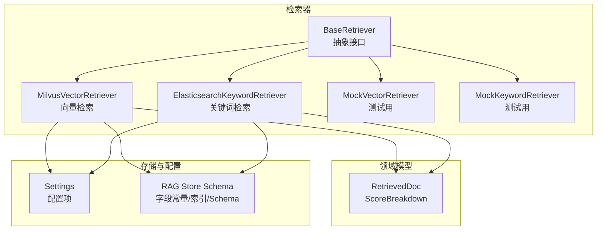
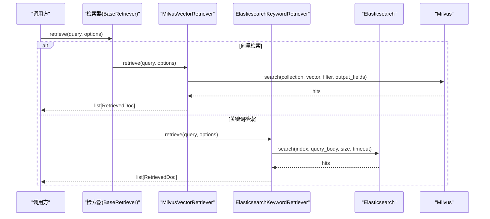
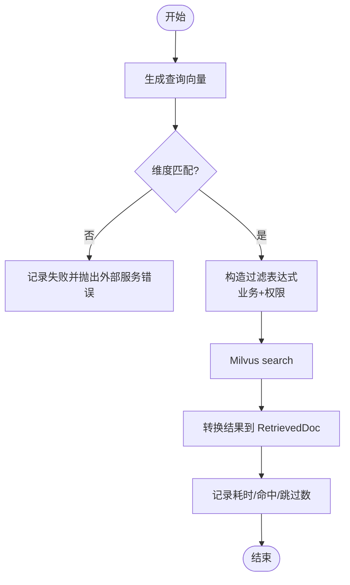
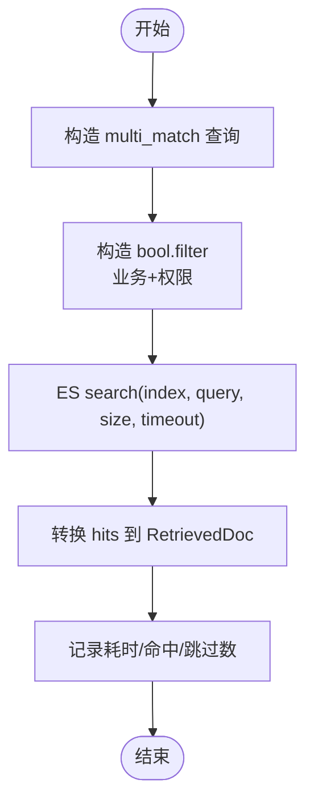
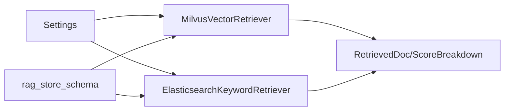

# 检索器组件

<cite>
**本文引用的文件**
- [base.py](file://src/fast_app/components/retrievers/base.py)
- [milvus_vector_retriever.py](file://src/fast_app/components/retrievers/milvus_vector_retriever.py)
- [elasticsearch_keyword_retriever.py](file://src/fast_app/components/retrievers/elasticsearch_keyword_retriever.py)
- [mock_vector_retriever.py](file://src/fast_app/components/retrievers/mock_vector_retriever.py)
- [mock_keyword_retriever.py](file://src/fast_app/components/retrievers/mock_keyword_retriever.py)
- [rag_models.py](file://src/fast_app/domain/rag_models.py)
- [config.py](file://src/fast_app/core/config.py)
- [rag_store_schema.py](file://src/fast_app/ingestion/stores/rag_store_schema.py)
</cite>

## 目录
1. [简介](#简介)
2. [项目结构](#项目结构)
3. [核心组件](#核心组件)
4. [架构总览](#架构总览)
5. [详细组件分析](#详细组件分析)
6. [依赖关系分析](#依赖关系分析)
7. [性能与优化](#性能与优化)
8. [故障排查指南](#故障排查指南)
9. [结论](#结论)
10. [附录：混合检索配置与使用示例](#附录混合检索配置与使用示例)

## 简介
本组件提供统一的检索抽象，并实现三类检索器：
- 向量检索器：基于 Milvus 的语义召回。
- 关键词检索器：基于 Elasticsearch 的 BM25/全文匹配。
- Mock 检索器：用于测试、演示和离线评测。

所有检索器统一返回领域模型 RetrievedDoc，便于上层进行 RRF 融合、重排与上下文构建。

## 项目结构
检索器位于 fast_app/components/retrievers，遵循“基类 + 多实现”的结构：
- BaseRetriever：定义异步 retrieve(query, options) -> list[RetrievedDoc] 接口。
- MilvusVectorRetriever：向量检索实现。
- ElasticsearchKeywordRetriever：关键词检索实现。
- MockVectorRetriever / MockKeywordRetriever：测试用模拟实现。

图表来源
- [base.py:6-13](file://src/fast_app/components/retrievers/base.py#L6-L13)
- [milvus_vector_retriever.py:155-180](file://src/fast_app/components/retrievers/milvus_vector_retriever.py#L155-L180)
- [elasticsearch_keyword_retriever.py:210-226](file://src/fast_app/components/retrievers/elasticsearch_keyword_retriever.py#L210-L226)
- [rag_models.py:40-70](file://src/fast_app/domain/rag_models.py#L40-L70)
- [config.py:58-82](file://src/fast_app/core/config.py#L58-L82)
- [rag_store_schema.py:8-56](file://src/fast_app/ingestion/stores/rag_store_schema.py#L8-L56)

章节来源
- [base.py:6-13](file://src/fast_app/components/retrievers/base.py#L6-L13)
- [rag_models.py:8-37](file://src/fast_app/domain/rag_models.py#L8-L37)
- [config.py:58-82](file://src/fast_app/core/config.py#L58-L82)
- [rag_store_schema.py:8-56](file://src/fast_app/ingestion/stores/rag_store_schema.py#L8-L56)

## 核心组件
- 抽象基类 BaseRetriever：定义统一的异步检索接口，屏蔽底层差异。
- 领域模型：
  - RetrievalFilters：业务过滤（来源路径、章节路径、知识版本）与权限过滤（是否可读取全部、部门、用户、公开）。
  - RetrievalOptions：候选数 candidate_k、最终返回 top_k、输出字段等。
  - RetrievedDoc：统一文档对象，包含 id、content、score、source、title、metadata、retrieval_sources、scores。
  - ScoreBreakdown：记录各阶段分数（向量、关键词、RRF、重排）。

章节来源
- [base.py:6-13](file://src/fast_app/components/retrievers/base.py#L6-L13)
- [rag_models.py:8-70](file://src/fast_app/domain/rag_models.py#L8-L70)

## 架构总览
检索流程由上层编排，调用具体检索器的 retrieve 方法，得到 RetrievedDoc 列表后进入融合/重排/上下文构建。

图表来源
- [milvus_vector_retriever.py:182-303](file://src/fast_app/components/retrievers/milvus_vector_retriever.py#L182-L303)
- [elasticsearch_keyword_retriever.py:227-340](file://src/fast_app/components/retrievers/elasticsearch_keyword_retriever.py#L227-L340)

## 详细组件分析

### Milvus 向量检索器
- 职责
  - 将查询文本通过嵌入客户端转为向量。
  - 校验向量维度与配置一致。
  - 构造过滤表达式（业务过滤 + 权限下推）。
  - 执行 Milvus search，转换结果为 RetrievedDoc。
  - 记录详细日志与慢操作告警。

- 关键参数与配置
  - Settings 中 Milvus 相关：host/port、collection_name、vector_field、id_field、content_field、embedding_dim。
  - RetrievalOptions.candidate_k：候选数量。
  - RetrievalOptions.output_fields：按需指定输出字段，默认使用 schema 提供的完整字段集。
  - 指标类型：COSINE；索引类型：AUTOINDEX。

- 过滤与权限
  - 业务过滤：source_path、section_path（取最后一级）、knowledge_version 区间。
  - 权限过滤：public、allowed_departments、allowed_users；无权限时返回“必定不命中”条件，避免误放行。
  - 权限表达式在 Milvus 搜索阶段下推，减少无效候选。

- 结果转换
  - 跳过缺少 id 或 content 的 hit，并记录 skipped_hit_count。
  - 保留 distance 作为 vector_score，写入 scores.vector_score。

- 错误处理
  - 维度不匹配抛出外部服务错误。
  - 其他异常统一包装为 ExternalServiceError，并记录失败事件。

图表来源
- [milvus_vector_retriever.py:182-337](file://src/fast_app/components/retrievers/milvus_vector_retriever.py#L182-L337)
- [rag_store_schema.py:148-280](file://src/fast_app/ingestion/stores/rag_store_schema.py#L148-L280)

章节来源
- [milvus_vector_retriever.py:155-410](file://src/fast_app/components/retrievers/milvus_vector_retriever.py#L155-L410)
- [rag_store_schema.py:148-280](file://src/fast_app/ingestion/stores/rag_store_schema.py#L148-L280)
- [config.py:58-69](file://src/fast_app/core/config.py#L58-L69)

### Elasticsearch 关键词检索器
- 职责
  - 构造 multi_match 查询，对标题、正文等加权匹配。
  - 将业务过滤与权限过滤放入 bool.filter，不参与评分。
  - 调用 ES search，转换 hits 为 RetrievedDoc。
  - 记录请求体、过滤数量、耗时与跳过数。

- 索引策略与分词
  - 内容字段使用 ik_max_word 作为索引分词器，ik_smart 作为搜索分词器。
  - 标题字段支持 text 与 keyword 双映射，便于精确匹配与全文检索。
  - metadata 子字段多为 keyword，适合 term/terms 过滤。

- 过滤与权限
  - 业务过滤：source_path(term)、section_path(terms)、knowledge_version(range)。
  - 权限过滤：visibility=public、allowed_departments(terms)、allowed_users(term)；无权限时使用“必定不命中”条件。
  - must_not 排除父块类型，避免父块参与初始召回。

- 结果转换
  - 跳过缺少 id 或 content 的 hit，记录 skipped_hit_count。
  - 保留 _score 作为 keyword_score，写入 scores.keyword_score。

图表来源
- [elasticsearch_keyword_retriever.py:176-207](file://src/fast_app/components/retrievers/elasticsearch_keyword_retriever.py#L176-L207)
- [elasticsearch_keyword_retriever.py:227-340](file://src/fast_app/components/retrievers/elasticsearch_keyword_retriever.py#L227-L340)
- [rag_store_schema.py:58-140](file://src/fast_app/ingestion/stores/rag_store_schema.py#L58-L140)

章节来源
- [elasticsearch_keyword_retriever.py:210-399](file://src/fast_app/components/retrievers/elasticsearch_keyword_retriever.py#L210-L399)
- [rag_store_schema.py:58-140](file://src/fast_app/ingestion/stores/rag_store_schema.py#L58-L140)
- [config.py:71-82](file://src/fast_app/core/config.py#L71-L82)

### Mock 检索器
- 用途
  - 本地开发、单元测试、离线评测与回归验证。
  - 无需真实 Milvus/ES 即可运行主链路，快速验证融合与重排逻辑。
- 行为
  - 固定延迟模拟网络开销。
  - 返回少量预置 RetrievedDoc，按 candidate_k 截断。
- 适用场景
  - 调试混合检索、RRF 融合、重排排序。
  - 编写端到端用例，避免对外部服务强依赖。

章节来源
- [mock_vector_retriever.py:7-30](file://src/fast_app/components/retrievers/mock_vector_retriever.py#L7-L30)
- [mock_keyword_retriever.py:7-30](file://src/fast_app/components/retrievers/mock_keyword_retriever.py#L7-L30)

### 自定义检索器开发指南
- 继承基类
  - 继承 BaseRetriever，实现 async retrieve(query, options) -> list[RetrievedDoc]。
- 数据模型
  - 使用 RetrievalFilters 表达业务与权限过滤。
  - 使用 RetrievalOptions 控制候选数与输出字段。
  - 返回 RetrievedDoc，并在 scores 中记录当前阶段分数。
- 错误处理
  - 外部服务异常建议包装为 ExternalServiceError，便于上层统一降级与重试。
  - 记录结构化日志，包含 collection/index、filter、size、latency、hit/skipped 等。
- 最佳实践
  - 尽量将过滤下推到搜索引擎侧，减少无效候选。
  - 对缺失关键字段的数据做防御性处理并记录告警。
  - 使用 log_slow_operation 标记慢操作，配合阈值监控。

章节来源
- [base.py:6-13](file://src/fast_app/components/retrievers/base.py#L6-L13)
- [rag_models.py:8-70](file://src/fast_app/domain/rag_models.py#L8-L70)

## 依赖关系分析
- 组件耦合
  - 检索器依赖 Settings 获取连接与字段名。
  - Milvus 检索器依赖 rag_store_schema 中的字段常量与 schema 构建函数。
  - ES 检索器依赖 rag_store_schema 中的 mapping 与分词配置。
- 外部依赖
  - pymilvus.MilvusClient。
  - elasticsearch.AsyncElasticsearch。
- 潜在循环依赖
  - 检索器仅单向依赖 domain、core、ingestion，无反向引用，结构清晰。

图表来源
- [config.py:58-82](file://src/fast_app/core/config.py#L58-L82)
- [rag_store_schema.py:8-56](file://src/fast_app/ingestion/stores/rag_store_schema.py#L8-L56)
- [milvus_vector_retriever.py:155-180](file://src/fast_app/components/retrievers/milvus_vector_retriever.py#L155-L180)
- [elasticsearch_keyword_retriever.py:210-226](file://src/fast_app/components/retrievers/elasticsearch_keyword_retriever.py#L210-L226)
- [rag_models.py:40-70](file://src/fast_app/domain/rag_models.py#L40-L70)

章节来源
- [config.py:58-82](file://src/fast_app/core/config.py#L58-L82)
- [rag_store_schema.py:8-56](file://src/fast_app/ingestion/stores/rag_store_schema.py#L8-L56)
- [rag_models.py:40-70](file://src/fast_app/domain/rag_models.py#L40-L70)

## 性能与优化
- Milvus 向量检索
  - 指标与索引：COSINE 相似度，AUTOINDEX 自动索引。
  - 过滤下推：业务与权限过滤在搜索阶段生效，减少候选集。
  - 输出字段：按需指定 output_fields，避免多余字段传输。
  - 维度校验：提前检查 embedding 维度，避免无效搜索。
  - 慢操作告警：log_slow_operation 结合 slow_retrieval_threshold_ms 监控。
- Elasticsearch 关键词检索
  - 分词策略：索引 ik_max_word，搜索 ik_smart，提升中文召回质量。
  - 查询权重：标题与正文加权 multi_match，提高相关性。
  - 过滤下推：bool.filter 不参与评分，保证硬约束高效执行。
  - 超时保护：request_timeout 防止慢查询阻塞链路。
- 通用优化
  - candidate_k 与 top_k 分离：扩大候选集有助于后续融合/重排。
  - 日志观测：记录 filter、size、hit、skipped、latency，辅助定位瓶颈。
  - 降级与容错：外部服务异常统一包装，便于上层 fallback。

章节来源
- [milvus_vector_retriever.py:182-337](file://src/fast_app/components/retrievers/milvus_vector_retriever.py#L182-L337)
- [elasticsearch_keyword_retriever.py:227-340](file://src/fast_app/components/retrievers/elasticsearch_keyword_retriever.py#L227-L340)
- [rag_store_schema.py:58-140](file://src/fast_app/ingestion/stores/rag_store_schema.py#L58-L140)
- [rag_store_schema.py:148-280](file://src/fast_app/ingestion/stores/rag_store_schema.py#L148-L280)
- [config.py:41-48](file://src/fast_app/core/config.py#L41-L48)
- [config.py:627-633](file://src/fast_app/core/config.py#L627-L633)

## 故障排查指南
- 常见问题
  - 向量维度不匹配：检查 embedding 模型与 Settings.embedding_dim 是否一致。
  - 命中为空：检查过滤表达式是否正确，尤其是 section_path、knowledge_version、权限字段。
  - 大量跳过命中：检查是否存在缺少 id/content 的脏数据，关注 skipped_hit_count。
  - ES 慢查询：检查 request_timeout、filter 复杂度、索引分词配置。
- 日志定位
  - 检索开始/结束事件：包含 collection/index、filter、size、latency、top_doc_ids。
  - 慢操作事件：threshold 触发时记录详细上下文。
  - 跳过命中事件：记录 reason、has_id、has_content。

章节来源
- [milvus_vector_retriever.py:194-337](file://src/fast_app/components/retrievers/milvus_vector_retriever.py#L194-L337)
- [elasticsearch_keyword_retriever.py:239-340](file://src/fast_app/components/retrievers/elasticsearch_keyword_retriever.py#L239-L340)

## 结论
本检索器组件以统一抽象封装了向量与关键词两种检索方式，并通过严格的过滤下推、权限控制与结构化日志，保障召回质量与可观测性。Mock 检索器为开发与测试提供了便捷支撑。结合 RRF 融合与重排，可在异构检索源上获得更稳定的召回效果。

## 附录：混合检索配置与使用示例
- 配置要点
  - 选择检索提供者：vector_retriever_provider、keyword_retriever_provider 可切换 mock 或真实服务。
  - 候选数：candidate_k 决定每路召回的候选规模，top_k 为最终返回数量。
  - 超时与阈值：elasticsearch_request_timeout、slow_retrieval_threshold_ms。
- 使用步骤
  - 准备 RetrievalOptions，设置 candidate_k、filters、output_fields。
  - 分别调用向量与关键词检索器，得到两组 RetrievedDoc。
  - 使用 RRF 融合两路结果，再可选地接入重排器进一步提升相关性。
  - 将融合后的 docs 用于上下文构建与 LLM 回答。
- 参考入口
  - 评估脚本中对混合检索与 RRF 的调用流程可作为集成参考。

章节来源
- [config.py:610-618](file://src/fast_app/core/config.py#L610-L618)
- [config.py:627-633](file://src/fast_app/core/config.py#L627-L633)
- [rag_models.py:27-70](file://src/fast_app/domain/rag_models.py#L27-L70)