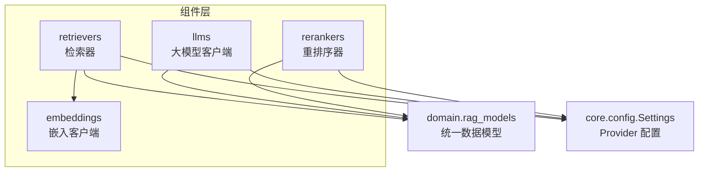
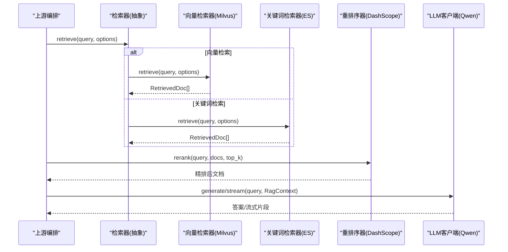
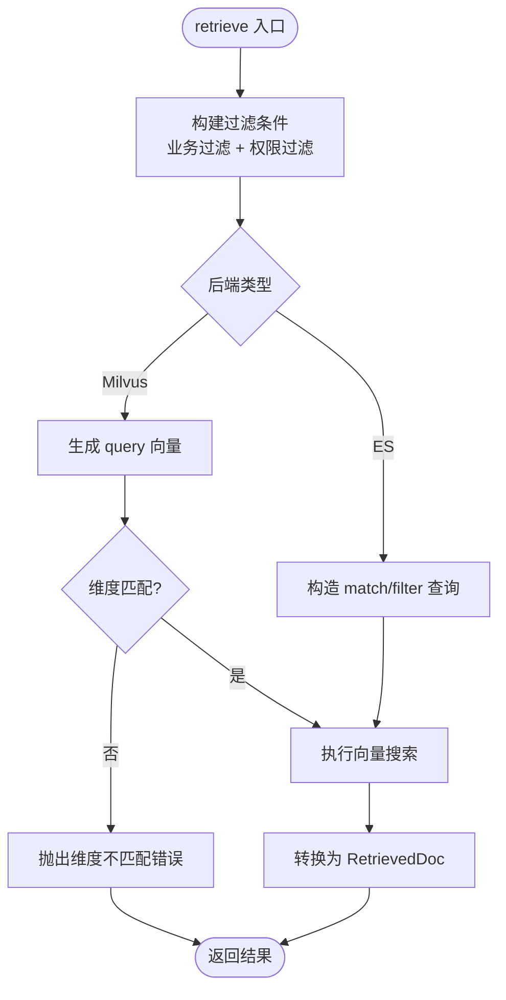
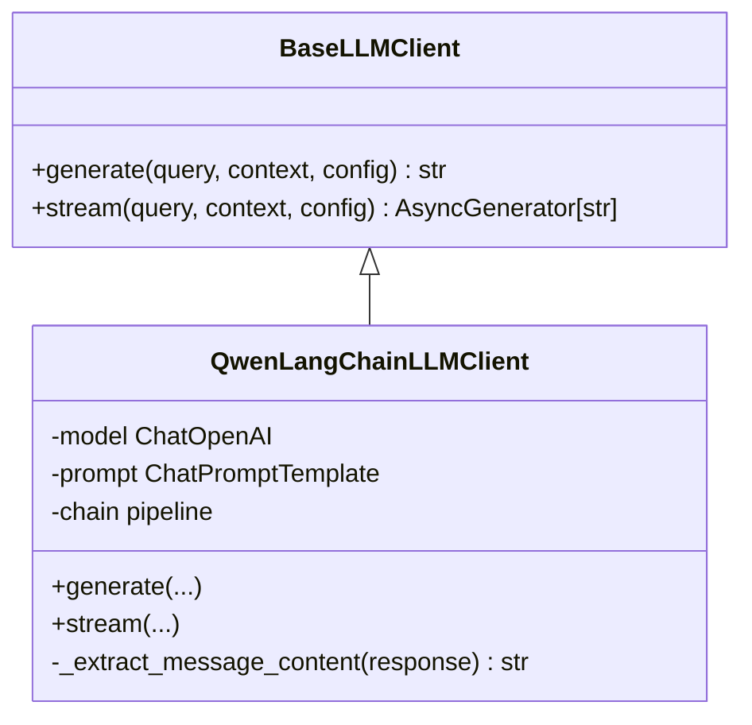
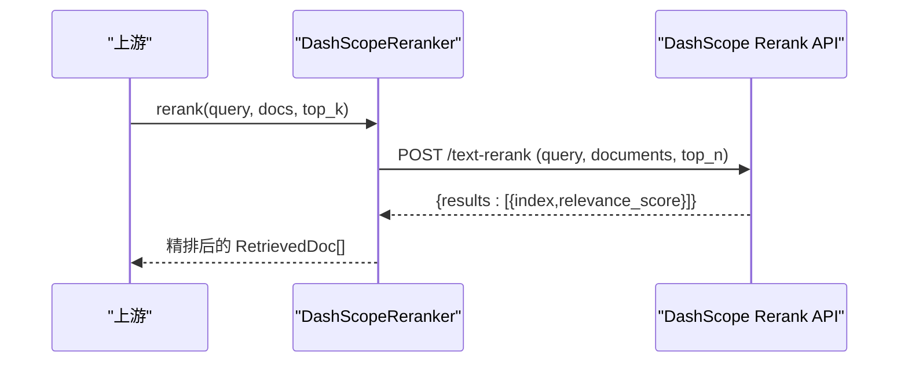
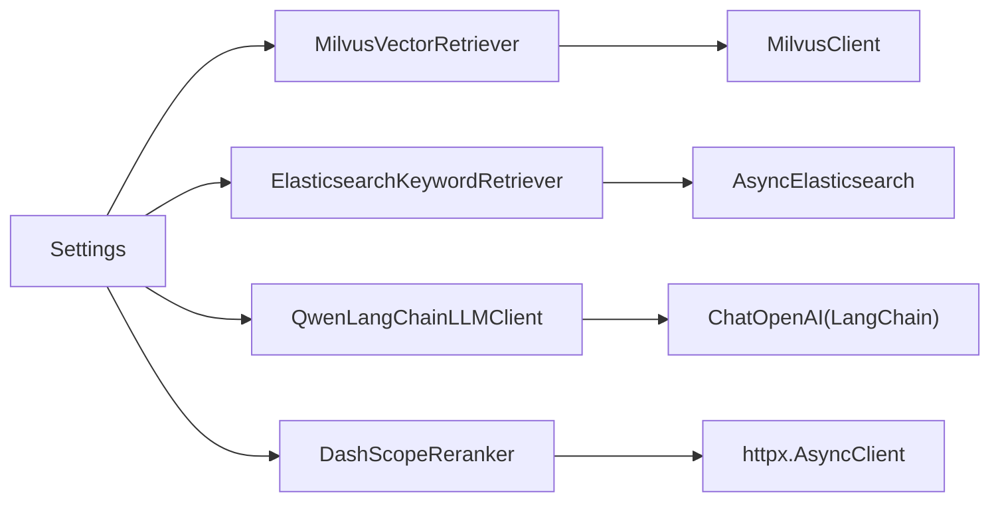

# 组件层设计

<cite>
**本文引用的文件**
- [src/fast_app/components/retrievers/base.py](file://src/fast_app/components/retrievers/base.py)
- [src/fast_app/components/retrievers/milvus_vector_retriever.py](file://src/fast_app/components/retrievers/milvus_vector_retriever.py)
- [src/fast_app/components/retrievers/elasticsearch_keyword_retriever.py](file://src/fast_app/components/retrievers/elasticsearch_keyword_retriever.py)
- [src/fast_app/components/llms/base.py](file://src/fast_app/components/llms/base.py)
- [src/fast_app/components/llms/qwen_langchain_llm_client.py](file://src/fast_app/components/llms/qwen_langchain_llm_client.py)
- [src/fast_app/components/rerankers/base.py](file://src/fast_app/components/rerankers/base.py)
- [src/fast_app/components/rerankers/dashscope_reranker.py](file://src/fast_app/components/rerankers/dashscope_reranker.py)
- [src/fast_app/domain/rag_models.py](file://src/fast_app/domain/rag_models.py)
- [src/fast_app/core/config.py](file://src/fast_app/core/config.py)
</cite>

## 目录
1. [简介](#简介)
2. [项目结构](#项目结构)
3. [核心组件](#核心组件)
4. [架构总览](#架构总览)
5. [详细组件分析](#详细组件分析)
6. [依赖关系分析](#依赖关系分析)
7. [性能考量](#性能考量)
8. [故障排查指南](#故障排查指南)
9. [结论](#结论)
10. [附录：自定义组件开发指南](#附录自定义组件开发指南)

## 简介
本文件面向扩展开发者，系统化说明可插拔组件层的设计与实现。围绕检索器（向量检索器、关键词检索器）、LLM 客户端、重排序器三大类组件，阐述其抽象基类、接口规范、具体实现与扩展机制；并给出 Provider 模式的落地方式、配置项与接入规范，帮助你在不改动上层编排逻辑的前提下替换或新增组件。

## 项目结构
组件层位于 fast_app/components 下，按能力域划分为 retrievers、llms、rerankers、embeddings 等子包。每个子包遵循“抽象基类 + 具体实现”的目录组织方式，并通过 domain.rag_models 中的统一数据模型进行解耦。

图表来源
- [src/fast_app/components/retrievers/base.py:1-13](file://src/fast_app/components/retrievers/base.py#L1-L13)
- [src/fast_app/components/llms/base.py:1-27](file://src/fast_app/components/llms/base.py#L1-L27)
- [src/fast_app/components/rerankers/base.py:1-14](file://src/fast_app/components/rerankers/base.py#L1-L14)
- [src/fast_app/domain/rag_models.py:1-80](file://src/fast_app/domain/rag_models.py#L1-L80)
- [src/fast_app/core/config.py:597-634](file://src/fast_app/core/config.py#L597-L634)

章节来源
- [src/fast_app/components/retrievers/base.py:1-13](file://src/fast_app/components/retrievers/base.py#L1-L13)
- [src/fast_app/components/llms/base.py:1-27](file://src/fast_app/components/llms/base.py#L1-L27)
- [src/fast_app/components/rerankers/base.py:1-14](file://src/fast_app/components/rerankers/base.py#L1-L14)
- [src/fast_app/domain/rag_models.py:1-80](file://src/fast_app/domain/rag_models.py#L1-L80)
- [src/fast_app/core/config.py:597-634](file://src/fast_app/core/config.py#L597-L634)

## 核心组件
- 检索器组件
  - 抽象基类：BaseRetriever，定义异步 retrieve(query, options) -> list[RetrievedDoc] 接口。
  - 向量检索器：MilvusVectorRetriever，基于 Milvus 向量相似度召回，内置权限过滤表达式构建与维度校验。
  - 关键词检索器：ElasticsearchKeywordRetriever，基于 ES multi_match 召回，支持业务与权限 filter 下推。
- LLM 客户端组件
  - 抽象基类：BaseLLMClient，定义 generate 与 stream 两种调用模式。
  - 具体实现：QwenLangChainLLMClient，封装 LangChain 链式调用、流式输出、使用量与慢调用日志。
- 重排序器组件
  - 抽象基类：BaseReranker，定义 rerank(query, docs, top_k) -> list[RetrievedDoc]。
  - 具体实现：DashScopeReranker，调用 DashScope Rerank API，带重试与错误包装。

章节来源
- [src/fast_app/components/retrievers/base.py:1-13](file://src/fast_app/components/retrievers/base.py#L1-L13)
- [src/fast_app/components/retrievers/milvus_vector_retriever.py:155-338](file://src/fast_app/components/retrievers/milvus_vector_retriever.py#L155-L338)
- [src/fast_app/components/retrievers/elasticsearch_keyword_retriever.py:210-341](file://src/fast_app/components/retrievers/elasticsearch_keyword_retriever.py#L210-L341)
- [src/fast_app/components/llms/base.py:1-27](file://src/fast_app/components/llms/base.py#L1-L27)
- [src/fast_app/components/llms/qwen_langchain_llm_client.py:107-341](file://src/fast_app/components/llms/qwen_langchain_llm_client.py#L107-L341)
- [src/fast_app/components/rerankers/base.py:1-14](file://src/fast_app/components/rerankers/base.py#L1-L14)
- [src/fast_app/components/rerankers/dashscope_reranker.py:24-144](file://src/fast_app/components/rerankers/dashscope_reranker.py#L24-L144)

## 架构总览
组件层通过统一的领域模型与配置项解耦上层编排与底层实现。Provider 模式体现在 Settings 中声明 provider 类型与参数，由上层装配器根据配置创建对应实现。

图表来源
- [src/fast_app/components/retrievers/base.py:1-13](file://src/fast_app/components/retrievers/base.py#L1-L13)
- [src/fast_app/components/retrievers/milvus_vector_retriever.py:182-303](file://src/fast_app/components/retrievers/milvus_vector_retriever.py#L182-L303)
- [src/fast_app/components/retrievers/elasticsearch_keyword_retriever.py:227-310](file://src/fast_app/components/retrievers/elasticsearch_keyword_retriever.py#L227-L310)
- [src/fast_app/components/rerankers/dashscope_reranker.py:36-100](file://src/fast_app/components/rerankers/dashscope_reranker.py#L36-L100)
- [src/fast_app/components/llms/qwen_langchain_llm_client.py:136-341](file://src/fast_app/components/llms/qwen_langchain_llm_client.py#L136-L341)

## 详细组件分析

### 检索器组件
- 抽象基类 BaseRetriever
  - 职责：定义统一的异步检索接口，屏蔽不同后端差异。
  - 输入：query、RetrievalOptions（含 top_k、candidate_k、filters、output_fields）。
  - 输出：RetrievedDoc 列表，包含 id、content、score、source、metadata、scores 等。
- Milvus 向量检索器
  - 关键流程：生成 query embedding -> 校验维度 -> 构造 filter（业务+权限）-> search -> 转换 RetrievedDoc。
  - 权限下推：将部门、用户、可见性、知识版本等条件编译为 Milvus 表达式，在搜索阶段过滤。
  - 容错：记录慢操作、异常堆栈、跳过命中数，便于定位脏数据与性能瓶颈。
- Elasticsearch 关键词检索器
  - 关键流程：构造 bool 查询（multi_match + must_not）-> 附加 filter（业务+权限）-> search -> 转换 RetrievedDoc。
  - 权限下推：使用 terms/range/bool.should 组合，确保无权限文档不会进入候选集。
  - 观测：记录 total.value/relation、filter 数量、耗时与 top doc ids。

图表来源
- [src/fast_app/components/retrievers/milvus_vector_retriever.py:56-133](file://src/fast_app/components/retrievers/milvus_vector_retriever.py#L56-L133)
- [src/fast_app/components/retrievers/milvus_vector_retriever.py:182-338](file://src/fast_app/components/retrievers/milvus_vector_retriever.py#L182-L338)
- [src/fast_app/components/retrievers/elasticsearch_keyword_retriever.py:47-133](file://src/fast_app/components/retrievers/elasticsearch_keyword_retriever.py#L47-L133)
- [src/fast_app/components/retrievers/elasticsearch_keyword_retriever.py:176-341](file://src/fast_app/components/retrievers/elasticsearch_keyword_retriever.py#L176-L341)

章节来源
- [src/fast_app/components/retrievers/base.py:1-13](file://src/fast_app/components/retrievers/base.py#L1-L13)
- [src/fast_app/components/retrievers/milvus_vector_retriever.py:155-410](file://src/fast_app/components/retrievers/milvus_vector_retriever.py#L155-L410)
- [src/fast_app/components/retrievers/elasticsearch_keyword_retriever.py:210-399](file://src/fast_app/components/retrievers/elasticsearch_keyword_retriever.py#L210-L399)
- [src/fast_app/domain/rag_models.py:8-80](file://src/fast_app/domain/rag_models.py#L8-L80)

### LLM 客户端组件
- 抽象基类 BaseLLMClient
  - 职责：统一 generate 与 stream 两种调用模式，屏蔽下游 SDK 差异。
  - 输入：query、RagContext（含上下文文本与文档）、可选 LangChain RunnableConfig。
  - 输出：字符串或异步字符流。
- QwenLangChainLLMClient
  - 关键流程：组装 system/human prompt -> 调用 chain.ainvoke/astream -> 提取内容/统计用量 -> 记录慢调用与失败日志。
  - 健壮性：捕获底层异常并包装为 LLMCallError，避免上层感知具体 SDK。

图表来源
- [src/fast_app/components/llms/base.py:1-27](file://src/fast_app/components/llms/base.py#L1-L27)
- [src/fast_app/components/llms/qwen_langchain_llm_client.py:107-358](file://src/fast_app/components/llms/qwen_langchain_llm_client.py#L107-L358)

章节来源
- [src/fast_app/components/llms/base.py:1-27](file://src/fast_app/components/llms/base.py#L1-L27)
- [src/fast_app/components/llms/qwen_langchain_llm_client.py:107-358](file://src/fast_app/components/llms/qwen_langchain_llm_client.py#L107-L358)

### 重排序器组件
- 抽象基类 BaseReranker
  - 职责：对候选文档进行精排，返回 top_k 个文档。
- DashScopeReranker
  - 关键流程：构造请求体 -> 带重试 POST 到 DashScope Rerank -> 解析 results -> 映射回原始文档顺序 -> 更新 score 与 scores 明细。
  - 健壮性：HTTPStatusError 与通用异常均包装为 ExternalServiceError，便于上层统一处理。

图表来源
- [src/fast_app/components/rerankers/base.py:1-14](file://src/fast_app/components/rerankers/base.py#L1-L14)
- [src/fast_app/components/rerankers/dashscope_reranker.py:24-144](file://src/fast_app/components/rerankers/dashscope_reranker.py#L24-L144)

章节来源
- [src/fast_app/components/rerankers/base.py:1-14](file://src/fast_app/components/rerankers/base.py#L1-L14)
- [src/fast_app/components/rerankers/dashscope_reranker.py:24-144](file://src/fast_app/components/rerankers/dashscope_reranker.py#L24-L144)

## 依赖关系分析
- 数据模型依赖
  - 检索器与重排序器共同依赖 RetrievedDoc、ScoreBreakdown、RetrievalFilters、RetrievalOptions。
  - LLM 客户端依赖 RagContext。
- 配置依赖
  - Settings 提供各组件所需的关键配置：embedding_dim、milvus/ES 连接信息、rerank 模型名、超时与重试策略、provider 选择开关等。
- 外部服务依赖
  - MilvusClient、AsyncElasticsearch、httpx.AsyncClient、LangChain ChatOpenAI。

图表来源
- [src/fast_app/core/config.py:58-82](file://src/fast_app/core/config.py#L58-L82)
- [src/fast_app/core/config.py:597-634](file://src/fast_app/core/config.py#L597-L634)
- [src/fast_app/components/retrievers/milvus_vector_retriever.py:155-180](file://src/fast_app/components/retrievers/milvus_vector_retriever.py#L155-L180)
- [src/fast_app/components/retrievers/elasticsearch_keyword_retriever.py:210-225](file://src/fast_app/components/retrievers/elasticsearch_keyword_retriever.py#L210-L225)
- [src/fast_app/components/rerankers/dashscope_reranker.py:24-35](file://src/fast_app/components/rerankers/dashscope_reranker.py#L24-L35)
- [src/fast_app/components/llms/qwen_langchain_llm_client.py:107-134](file://src/fast_app/components/llms/qwen_langchain_llm_client.py#L107-L134)

章节来源
- [src/fast_app/domain/rag_models.py:8-80](file://src/fast_app/domain/rag_models.py#L8-L80)
- [src/fast_app/core/config.py:58-82](file://src/fast_app/core/config.py#L58-L82)
- [src/fast_app/core/config.py:597-634](file://src/fast_app/core/config.py#L597-L634)

## 性能考量
- 向量检索
  - 维度校验：embedding 维度与配置不一致会快速失败，避免无效搜索。
  - 权限下推：在 Milvus 搜索阶段完成 ACL 过滤，减少候选集大小。
  - 慢操作告警：统一记录 slow_retrieval_threshold_ms，便于定位热点集合与高延迟查询。
- 关键词检索
  - 查询优化：multi_match 字段加权、must_not 排除父块、filter 不参与评分。
  - 超时控制：request_timeout 防止慢查询阻塞链路。
- LLM 调用
  - 流式输出：降低首字延迟，提升交互体验。
  - 慢调用追踪：slow_llm_threshold_ms 与 token 用量统计辅助容量规划。
- 重排序
  - 重试策略：网络抖动、429、5xx 自动重试，提高稳定性。
  - top_k 裁剪：限制请求长度与响应规模，降低开销。

章节来源
- [src/fast_app/components/retrievers/milvus_vector_retriever.py:198-303](file://src/fast_app/components/retrievers/milvus_vector_retriever.py#L198-L303)
- [src/fast_app/components/retrievers/elasticsearch_keyword_retriever.py:239-310](file://src/fast_app/components/retrievers/elasticsearch_keyword_retriever.py#L239-L310)
- [src/fast_app/components/llms/qwen_langchain_llm_client.py:136-341](file://src/fast_app/components/llms/qwen_langchain_llm_client.py#L136-L341)
- [src/fast_app/components/rerankers/dashscope_reranker.py:64-100](file://src/fast_app/components/rerankers/dashscope_reranker.py#L64-L100)

## 故障排查指南
- 向量检索失败
  - 现象：embedding 维度不匹配、搜索结果为空、大量 skipped_hit_count。
  - 排查：检查 embedding_dim 配置、collection 字段映射、filter_expr 是否正确转义、是否存在脏数据导致 id/content 缺失。
  - 参考日志事件：milvus.embedding.finish、milvus.search.start/finish/failed、milvus.hit.skipped。
- 关键词检索失败
  - 现象：total 为空、hit 数为零、中文分词效果不佳。
  - 排查：确认 IK 分词器配置、字段权重、filter 是否过严、索引是否存在。
  - 参考日志事件：elasticsearch.search.start/finish/failed、elasticsearch.hit.skipped。
- LLM 调用失败
  - 现象：超时、token 用量异常、流式中断。
  - 排查：检查 OPENAI_API_KEY、base_url、模型名称、timeout 设置；关注 llm.generate/stream 的 start/finish/failed 日志。
- 重排序失败
  - 现象：HTTP 状态码非 200、重试耗尽。
  - 排查：检查 API Key、top_n 上限、网络与限流；关注 ExternalServiceError 与重试策略。

章节来源
- [src/fast_app/components/retrievers/milvus_vector_retriever.py:198-338](file://src/fast_app/components/retrievers/milvus_vector_retriever.py#L198-L338)
- [src/fast_app/components/retrievers/elasticsearch_keyword_retriever.py:239-341](file://src/fast_app/components/retrievers/elasticsearch_keyword_retriever.py#L239-L341)
- [src/fast_app/components/llms/qwen_langchain_llm_client.py:136-341](file://src/fast_app/components/llms/qwen_langchain_llm_client.py#L136-L341)
- [src/fast_app/components/rerankers/dashscope_reranker.py:64-100](file://src/fast_app/components/rerankers/dashscope_reranker.py#L64-L100)

## 结论
组件层通过清晰的抽象基类与统一数据模型实现了高度可插拔的检索、生成与重排序能力。Provider 模式借助 Settings 集中管理配置，使上层编排无需关心底层实现细节。结合完善的日志与慢调用追踪，系统具备良好的可观测性与可维护性。

## 附录：自定义组件开发指南

### 接入规范总览
- 明确目标组件类型：检索器、LLM 客户端或重排序器。
- 继承对应抽象基类并实现全部抽象方法。
- 使用 domain.rag_models 中的统一数据结构作为输入输出契约。
- 通过 Settings 读取配置，保持配置与实现解耦。
- 遵循现有日志与慢调用上报约定，便于统一观测。

### 自定义检索器
- 步骤
  - 新建类继承 BaseRetriever，实现 async retrieve(query, options) -> list[RetrievedDoc]。
  - 使用 RetrievalFilters 构建后端特定过滤条件，尽量将权限与业务条件下推到后端。
  - 将后端原始结果映射为 RetrievedDoc，填充 source、metadata、scores 等字段。
  - 记录检索开始/结束、耗时、命中数、跳过数等关键指标。
- 最佳实践
  - 对缺失关键字段（id/content）的命中进行跳过并记录告警。
  - 对慢查询与异常进行统一包装与上报。
  - 若涉及外部服务，使用重试与超时保护。

章节来源
- [src/fast_app/components/retrievers/base.py:1-13](file://src/fast_app/components/retrievers/base.py#L1-L13)
- [src/fast_app/domain/rag_models.py:8-80](file://src/fast_app/domain/rag_models.py#L8-L80)
- [src/fast_app/components/retrievers/milvus_vector_retriever.py:182-338](file://src/fast_app/components/retrievers/milvus_vector_retriever.py#L182-L338)
- [src/fast_app/components/retrievers/elasticsearch_keyword_retriever.py:227-341](file://src/fast_app/components/retrievers/elasticsearch_keyword_retriever.py#L227-L341)

### 自定义 LLM 客户端
- 步骤
  - 继承 BaseLLMClient，实现 async generate 与 async stream。
  - 使用 RagContext 构建提示词，必要时注入 LangChain RunnableConfig。
  - 抽取模型响应内容，兼容多种消息对象格式。
  - 记录 token 用量、finish_reason、慢调用与失败原因。
- 最佳实践
  - 对外暴露统一异常类型（如 LLMCallError），隐藏 SDK 细节。
  - 流式输出时逐块 yield，保证低延迟。
  - 合理设置 timeout 与重试策略。

章节来源
- [src/fast_app/components/llms/base.py:1-27](file://src/fast_app/components/llms/base.py#L1-L27)
- [src/fast_app/components/llms/qwen_langchain_llm_client.py:107-358](file://src/fast_app/components/llms/qwen_langchain_llm_client.py#L107-L358)

### 自定义重排序器
- 步骤
  - 继承 BaseReranker，实现 async rerank(query, docs, top_k) -> list[RetrievedDoc]。
  - 将 docs 的 content 提交给后端服务，解析返回的 index 与相关性分数。
  - 将分数写回 RetrievedDoc.scores，并更新最终 score。
- 最佳实践
  - 对 HTTP 错误与网络异常进行重试与错误包装。
  - 限制 top_n 与请求体大小，避免超限。
  - 记录完整响应以便问题回溯。

章节来源
- [src/fast_app/components/rerankers/base.py:1-14](file://src/fast_app/components/rerankers/base.py#L1-L14)
- [src/fast_app/components/rerankers/dashscope_reranker.py:24-144](file://src/fast_app/components/rerankers/dashscope_reranker.py#L24-L144)

### Provider 模式与配置
- 配置要点
  - vector_retriever_provider、keyword_retriever_provider：选择向量/关键词检索实现。
  - embedding_provider、embedding_model_name、embedding_dim：嵌入模型与维度。
  - reranker_provider、rerank_model_name、rerank_top_k：重排序器与参数。
  - llm_provider、llm_model_name、openai_base_url、openai_api_key：LLM 相关配置。
  - 超时与重试：external_call_max_retries、external_call_retry_base_delay、各组件 timeout。
- 接入方式
  - 在应用启动时读取 Settings，根据 provider 字段实例化对应组件。
  - 将组件注入到上层编排器（如 RAG Pipeline），无需修改调用方代码。
  - 测试场景可通过环境变量切换 mock 或真实实现。

章节来源
- [src/fast_app/core/config.py:230-238](file://src/fast_app/core/config.py#L230-L238)
- [src/fast_app/core/config.py:597-634](file://src/fast_app/core/config.py#L597-L634)