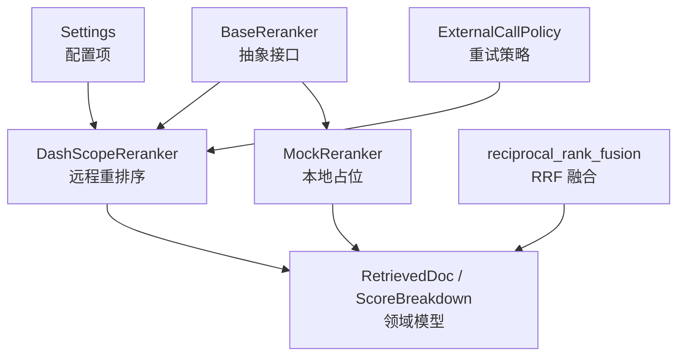
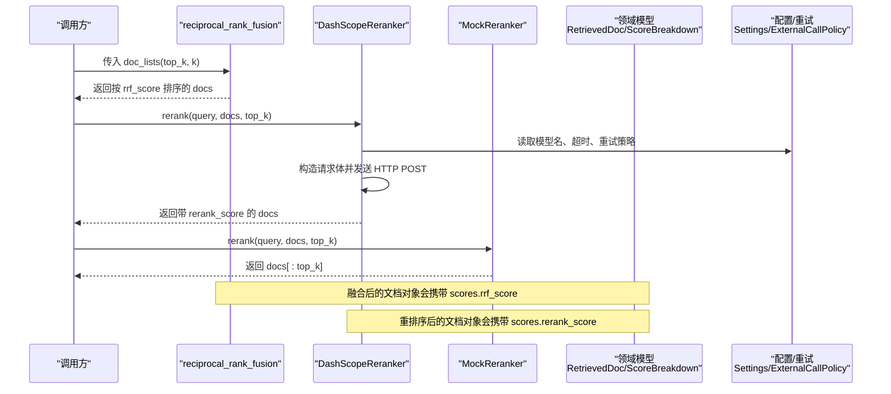
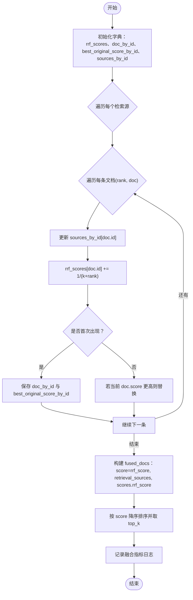
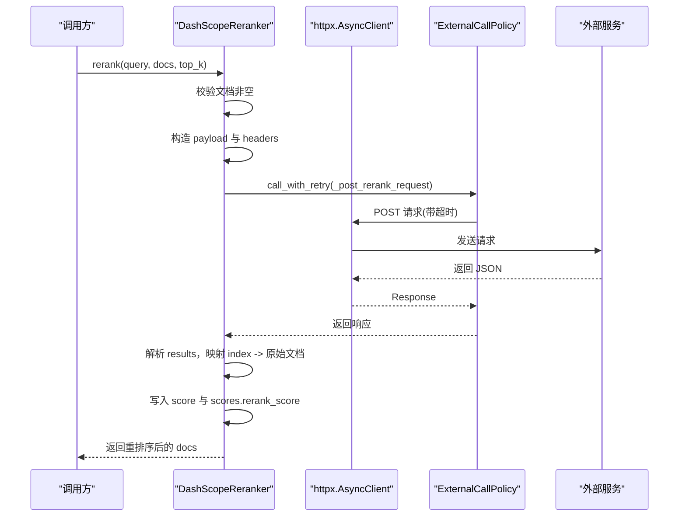
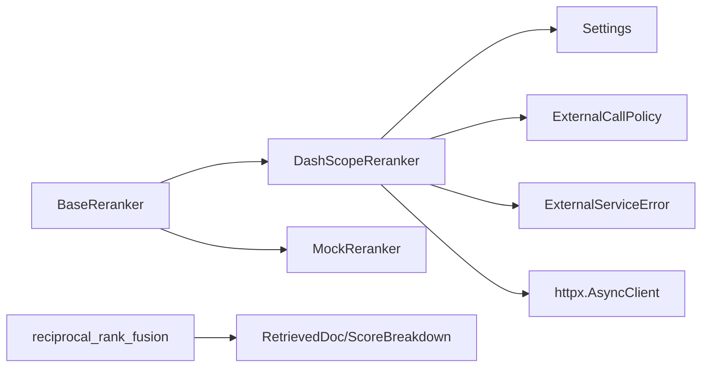

# 重排序器组件

<cite>
**本文引用的文件**
- [src/fast_app/components/rerankers/base.py](file://src/fast_app/components/rerankers/base.py)
- [src/fast_app/components/rerankers/dashscope_reranker.py](file://src/fast_app/components/rerankers/dashscope_reranker.py)
- [src/fast_app/components/rerankers/mock_reranker.py](file://src/fast_app/components/rerankers/mock_reranker.py)
- [src/fast_app/services/rag/retrieval_fusion.py](file://src/fast_app/services/rag/retrieval_fusion.py)
- [src/app/rrf_demo.py](file://src/app/rrf_demo.py)
- [src/app/dashscope_reranker_demo.py](file://src/app/dashscope_reranker_demo.py)
- [src/fast_app/domain/rag_models.py](file://src/fast_app/domain/rag_models.py)
- [src/fast_app/core/config.py](file://src/fast_app/core/config.py)
- [src/fast_app/services/external_call_policy.py](file://src/fast_app/services/external_call_policy.py)
- [src/fast_app/services/exceptions.py](file://src/fast_app/services/exceptions.py)
</cite>

## 目录
1. [简介](#简介)
2. [项目结构](#项目结构)
3. [核心组件](#核心组件)
4. [架构总览](#架构总览)
5. [详细组件分析](#详细组件分析)
6. [依赖关系分析](#依赖关系分析)
7. [性能考量](#性能考量)
8. [故障排查指南](#故障排查指南)
9. [结论](#结论)
10. [附录](#附录)

## 简介
本文件围绕“重排序器组件”进行系统化说明，重点覆盖：
- RRF（Reciprocal Rank Fusion，倒数排名融合）算法在本仓库中的实现原理与数据流。
- DashScope 重排序器的配置参数、HTTP API 调用方式与结果处理流程。
- Mock 重排序器的测试用途与模拟排序逻辑。
- 自定义重排序器的开发指南：如何定义接口、计算分数、格式化结果。
- 混合检索后使用 RRF 或外部重排序的示例与效果评估方法。

## 项目结构
重排序能力由“统一抽象 + 多实现 + 融合函数”构成：
- 抽象基类：定义统一的 rerank 接口，屏蔽不同实现的差异。
- 具体实现：DashScopeReranker（远程服务）、MockReranker（本地占位）。
- 融合函数：reciprocal_rank_fusion 用于将多个检索源的结果按 RRF 规则合并排序。
- 领域模型：RetrievedDoc、ScoreBreakdown 等承载文档、来源与多阶段分数。
- 配置与重试：Settings 提供模型名、超时、重试策略；ExternalCallPolicy 提供可重试的外部调用封装。

图表来源
- [src/fast_app/components/rerankers/base.py:6-14](file://src/fast_app/components/rerankers/base.py#L6-L14)
- [src/fast_app/components/rerankers/dashscope_reranker.py:24-139](file://src/fast_app/components/rerankers/dashscope_reranker.py#L24-L139)
- [src/fast_app/components/rerankers/mock_reranker.py:5-12](file://src/fast_app/components/rerankers/mock_reranker.py#L5-L12)
- [src/fast_app/services/rag/retrieval_fusion.py:8-79](file://src/fast_app/services/rag/retrieval_fusion.py#L8-L79)
- [src/fast_app/domain/rag_models.py](file://src/fast_app/domain/rag_models.py)
- [src/fast_app/core/config.py](file://src/fast_app/core/config.py)
- [src/fast_app/services/external_call_policy.py](file://src/fast_app/services/external_call_policy.py)

章节来源
- [src/fast_app/components/rerankers/base.py:6-14](file://src/fast_app/components/rerankers/base.py#L6-L14)
- [src/fast_app/components/rerankers/dashscope_reranker.py:24-139](file://src/fast_app/components/rerankers/dashscope_reranker.py#L24-L139)
- [src/fast_app/components/rerankers/mock_reranker.py:5-12](file://src/fast_app/components/rerankers/mock_reranker.py#L5-L12)
- [src/fast_app/services/rag/retrieval_fusion.py:8-79](file://src/fast_app/services/rag/retrieval_fusion.py#L8-L79)

## 核心组件
- BaseReranker：定义异步 rerank(query, docs, top_k) -> list[RetrievedDoc] 的统一接口，所有重排序实现必须遵循该契约。
- DashScopeReranker：通过 HTTP 调用 DashScope 文本重排序接口，支持超时、重试、错误转换与结果映射。
- MockReranker：返回输入文档的前 top_k 条，用于单元测试、集成测试与回归验证。
- reciprocal_rank_fusion：对多个检索源的结果执行 RRF 融合，输出带 rrf_score 的最终排序列表。

章节来源
- [src/fast_app/components/rerankers/base.py:6-14](file://src/fast_app/components/rerankers/base.py#L6-L14)
- [src/fast_app/components/rerankers/dashscope_reranker.py:24-139](file://src/fast_app/components/rerankers/dashscope_reranker.py#L24-L139)
- [src/fast_app/components/rerankers/mock_reranker.py:5-12](file://src/fast_app/components/rerankers/mock_reranker.py#L5-L12)
- [src/fast_app/services/rag/retrieval_fusion.py:8-79](file://src/fast_app/services/rag/retrieval_fusion.py#L8-L79)

## 架构总览
下图展示从“混合检索召回”到“RRF 融合/外部重排序”的整体流程，以及各组件之间的交互关系。

图表来源
- [src/fast_app/services/rag/retrieval_fusion.py:8-79](file://src/fast_app/services/rag/retrieval_fusion.py#L8-L79)
- [src/fast_app/components/rerankers/dashscope_reranker.py:36-139](file://src/fast_app/components/rerankers/dashscope_reranker.py#L36-L139)
- [src/fast_app/components/rerankers/mock_reranker.py:5-12](file://src/fast_app/components/rerankers/mock_reranker.py#L5-L12)
- [src/fast_app/domain/rag_models.py](file://src/fast_app/domain/rag_models.py)
- [src/fast_app/core/config.py](file://src/fast_app/core/config.py)
- [src/fast_app/services/external_call_policy.py](file://src/fast_app/services/external_call_policy.py)

## 详细组件分析

### RRF（倒数排名融合）算法
- 目标：在不直接比较不同检索源原始分数的情况下，基于每个源内部的相对排名进行融合，得到更稳健的排序。
- 关键步骤：
  - 遍历每个检索源的结果，按 rank 累加 1/(k+rank) 作为该文档的 RRF 分数。
  - 以 doc.id 为键去重，保留最佳原始分数与来源集合。
  - 将融合分数写回文档对象的 score 与 scores.rrf_score，并按分数降序截断 top_k。
- 复杂度：时间 O(N log N)（N 为唯一文档数），空间 O(N)。
- 日志：记录输入总数、唯一文档数、输出数量、top_k、k 与 top_doc_ids，便于观测与回溯。

图表来源
- [src/fast_app/services/rag/retrieval_fusion.py:8-79](file://src/fast_app/services/rag/retrieval_fusion.py#L8-L79)

章节来源
- [src/fast_app/services/rag/retrieval_fusion.py:8-79](file://src/fast_app/services/rag/retrieval_fusion.py#L8-L79)
- [src/app/rrf_demo.py:1-65](file://src/app/rrf_demo.py#L1-L65)

### DashScope 重排序器
- 职责：将 query 与候选文档发送到 DashScope 文本重排序接口，获取重新排序后的结果，并将 relevance_score 写入文档的 score 与 scores.rerank_score。
- 配置要点：
  - 模型名称：settings.rerank_model_name
  - 超时：settings.rerank_timeout_seconds
  - 重试：settings.external_call_max_retries、settings.external_call_retry_base_delay
  - 鉴权：使用 settings.openai_api_key 作为 Authorization Bearer
- 调用流程：
  - 构造 payload（model、input.query、input.documents、parameters.return_documents/top_n）。
  - 设置 headers（Authorization、Content-Type）。
  - 使用 call_with_retry 包装 HTTP POST，捕获并重试可重试错误。
  - 解析 output.results，按 index 映射回原始文档，填充分数并返回。
- 错误处理：
  - HTTPStatusError 转换为 ExternalServiceError 并记录状态码与响应体。
  - 其他异常统一转换为 ExternalServiceError。

图表来源
- [src/fast_app/components/rerankers/dashscope_reranker.py:24-139](file://src/fast_app/components/rerankers/dashscope_reranker.py#L24-L139)
- [src/fast_app/services/external_call_policy.py](file://src/fast_app/services/external_call_policy.py)
- [src/fast_app/services/exceptions.py](file://src/fast_app/services/exceptions.py)

章节来源
- [src/fast_app/components/rerankers/dashscope_reranker.py:24-139](file://src/fast_app/components/rerankers/dashscope_reranker.py#L24-L139)
- [src/fast_app/core/config.py](file://src/fast_app/core/config.py)
- [src/fast_app/services/external_call_policy.py](file://src/fast_app/services/external_call_policy.py)
- [src/fast_app/services/exceptions.py](file://src/fast_app/services/exceptions.py)

### Mock 重排序器
- 用途：在测试环境中替代真实重排序服务，保证链路可运行且稳定。
- 行为：直接返回输入文档的前 top_k 条，不改变顺序。
- 适用场景：单元测试、端到端回归、性能压测占位。

章节来源
- [src/fast_app/components/rerankers/mock_reranker.py:5-12](file://src/fast_app/components/rerankers/mock_reranker.py#L5-L12)

### 领域模型与数据结构
- RetrievedDoc：表示一条检索到的文档，包含 id、content、source、score、scores、retrieval_sources 等字段。
- ScoreBreakdown：用于记录多阶段分数（如 vector_score、keyword_score、rrf_score、rerank_score），便于评测与归因。
- 融合与重排序都会将对应阶段的分数写入 scores，并在最终输出中保留。

章节来源
- [src/fast_app/domain/rag_models.py](file://src/fast_app/domain/rag_models.py)

## 依赖关系分析
- BaseReranker 被 DashScopeReranker 与 MockReranker 继承，形成统一的重排序抽象。
- DashScopeReranker 依赖 Settings（配置）、httpx（HTTP 客户端）、ExternalCallPolicy（重试）、Exceptions（错误转换）。
- reciprocal_rank_fusion 依赖 RetrievedDoc 与日志工具，无外部网络依赖。
- 示例脚本演示了 RRF 与 DashScope 重排序的使用方式。

图表来源
- [src/fast_app/components/rerankers/base.py:6-14](file://src/fast_app/components/rerankers/base.py#L6-L14)
- [src/fast_app/components/rerankers/dashscope_reranker.py:24-139](file://src/fast_app/components/rerankers/dashscope_reranker.py#L24-L139)
- [src/fast_app/components/rerankers/mock_reranker.py:5-12](file://src/fast_app/components/rerankers/mock_reranker.py#L5-L12)
- [src/fast_app/services/rag/retrieval_fusion.py:8-79](file://src/fast_app/services/rag/retrieval_fusion.py#L8-L79)
- [src/fast_app/core/config.py](file://src/fast_app/core/config.py)
- [src/fast_app/services/external_call_policy.py](file://src/fast_app/services/external_call_policy.py)
- [src/fast_app/services/exceptions.py](file://src/fast_app/services/exceptions.py)

章节来源
- [src/fast_app/components/rerankers/base.py:6-14](file://src/fast_app/components/rerankers/base.py#L6-L14)
- [src/fast_app/components/rerankers/dashscope_reranker.py:24-139](file://src/fast_app/components/rerankers/dashscope_reranker.py#L24-L139)
- [src/fast_app/components/rerankers/mock_reranker.py:5-12](file://src/fast_app/components/rerankers/mock_reranker.py#L5-L12)
- [src/fast_app/services/rag/retrieval_fusion.py:8-79](file://src/fast_app/services/rag/retrieval_fusion.py#L8-L79)

## 性能考量
- RRF 融合：
  - 时间复杂度 O(N log N)，主要开销在排序；可通过合理设置 top_k 控制输出规模。
  - 空间复杂度 O(N)，用于存储分数与文档映射。
  - 建议：对大规模候选集先做粗排再 RRF，或在业务层限制 doc_lists 的总量。
- DashScope 重排序：
  - 网络延迟与超时：通过 settings.rerank_timeout_seconds 控制；结合 ExternalCallPolicy 的重试策略提升鲁棒性。
  - 并发与吞吐：httpx.AsyncClient 可复用连接；注意服务端 QPS 限制与限流（429）重试退避。
  - 成本与延迟权衡：top_n 越小，请求负载越低，但可能影响召回质量。
- Mock 重排序：
  - 零网络开销，适合快速迭代与回归测试；不建议在生产环境启用。

## 故障排查指南
- 认证失败（401/403）：
  - 检查 settings.openai_api_key 是否正确配置。
  - 确认 Authorization 头格式为 Bearer Token。
- 超时或网络抖动：
  - 调整 settings.rerank_timeout_seconds。
  - 检查 settings.external_call_max_retries 与 base_delay 是否合理。
- 参数错误（400）：
  - 检查 payload 中 model、input.query、input.documents、parameters.top_n 是否符合要求。
  - 避免传入空文档列表。
- 结果缺失字段：
  - 当 results 缺少 index 或 relevance_score 时，会记录警告并跳过该条目。
- 错误类型：
  - HTTP 状态错误会被转换为 ExternalServiceError，并附带状态码与响应体，便于定位问题。

章节来源
- [src/fast_app/components/rerankers/dashscope_reranker.py:64-100](file://src/fast_app/components/rerankers/dashscope_reranker.py#L64-L100)
- [src/fast_app/services/exceptions.py](file://src/fast_app/services/exceptions.py)

## 结论
- 本仓库通过统一抽象实现了可扩展的重排序体系：本地 RRF 融合与外部 DashScope 重排序并存。
- RRF 适用于多源召回后的稳健融合；DashScope 重排序提供更强的语义相关性打分。
- Mock 重排序保障了测试链路的稳定性与可重复性。
- 建议在工程实践中：先用 RRF 融合多路召回，再视需求接入外部重排序以提升最终质量。

## 附录

### 使用示例
- RRF 融合示例：
  - 参考路径：[src/app/rrf_demo.py:1-65](file://src/app/rrf_demo.py#L1-L65)
  - 说明：构造 Milvus 与 Elasticsearch 的两路召回结果，调用 reciprocal_rank_fusion 进行融合，输出带 rrf_score 的排序结果。
- DashScope 重排序示例：
  - 参考路径：[src/app/dashscope_reranker_demo.py:1-47](file://src/app/dashscope_reranker_demo.py#L1-L47)
  - 说明：加载配置，创建 DashScopeReranker，传入 query 与候选文档，获取带 rerank_score 的排序结果。

章节来源
- [src/app/rrf_demo.py:1-65](file://src/app/rrf_demo.py#L1-L65)
- [src/app/dashscope_reranker_demo.py:1-47](file://src/app/dashscope_reranker_demo.py#L1-L47)

### 自定义重排序器开发指南
- 步骤：
  - 继承 BaseReranker 并实现 async rerank(query, docs, top_k) -> list[RetrievedDoc]。
  - 在实现中计算新分数，并写入文档的 score 与 scores.rerank_score（或自定义字段）。
  - 保持文档 ID 不变，确保下游能正确关联原始内容。
  - 如需外部调用，建议使用 httpx.AsyncClient 并结合 ExternalCallPolicy 进行重试与超时控制。
  - 添加必要的日志与异常处理，必要时抛出 ExternalServiceError。
- 建议：
  - 对空输入进行防御性处理，返回空列表。
  - 对 top_k 进行边界保护（不超过文档数量）。
  - 在单元测试中使用 MockReranker 或内置的 Mock 策略验证链路。

章节来源
- [src/fast_app/components/rerankers/base.py:6-14](file://src/fast_app/components/rerankers/base.py#L6-L14)
- [src/fast_app/components/rerankers/dashscope_reranker.py:36-139](file://src/fast_app/components/rerankers/dashscope_reranker.py#L36-L139)
- [src/fast_app/services/external_call_policy.py](file://src/fast_app/services/external_call_policy.py)
- [src/fast_app/services/exceptions.py](file://src/fast_app/services/exceptions.py)

### 混合检索后重排序的使用与评估
- 使用方式：
  - 先分别执行向量检索与关键词检索，得到 doc_lists。
  - 调用 reciprocal_rank_fusion 进行 RRF 融合，得到融合后的候选集。
  - 可选：对融合结果再次调用 DashScopeReranker 进行细粒度重排序。
- 评估方法：
  - 指标：mean_recall_at_k、mean_MRR 等检索指标。
  - 过程：对每个评测用例准备 question、top_k、candidate_k 与 filters，分别收集向量与关键词召回结果，执行 RRF 融合，再计算指标。
  - 对比：对比仅 RRF 与 RRF + 外部重排序的效果差异，观察召回率与排序质量变化。

章节来源
- [src/fast_app/services/rag/retrieval_fusion.py:8-79](file://src/fast_app/services/rag/retrieval_fusion.py#L8-L79)
- [src/fast_app/domain/rag_models.py](file://src/fast_app/domain/rag_models.py)