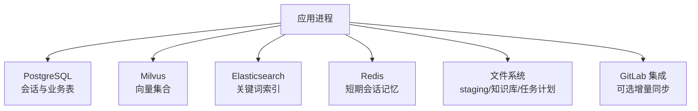
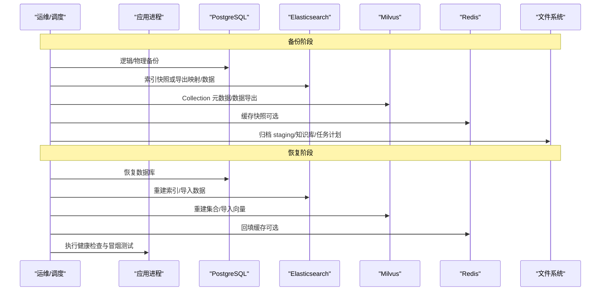
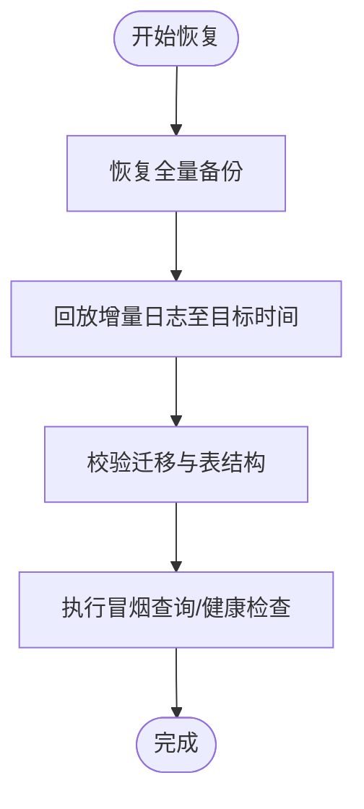
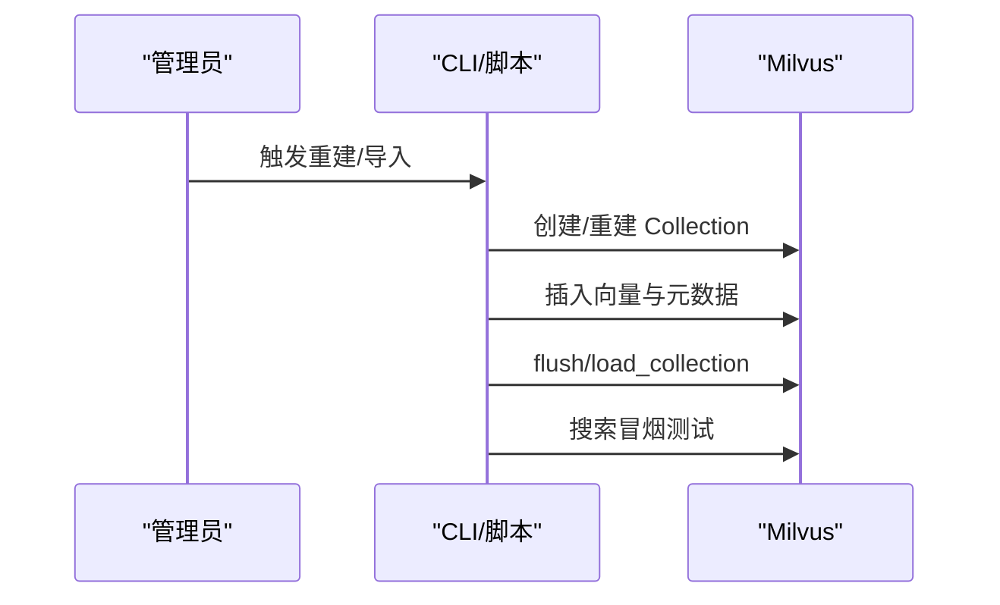
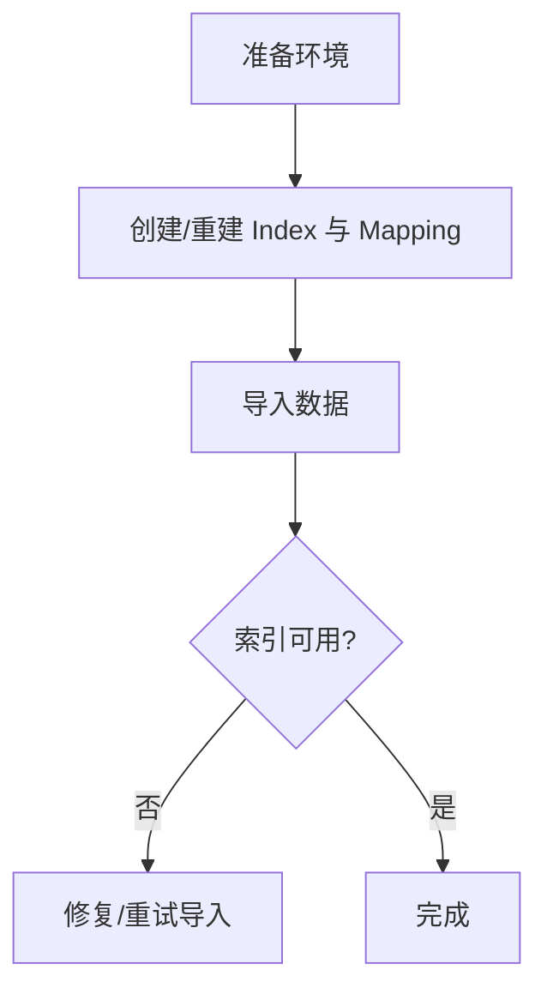
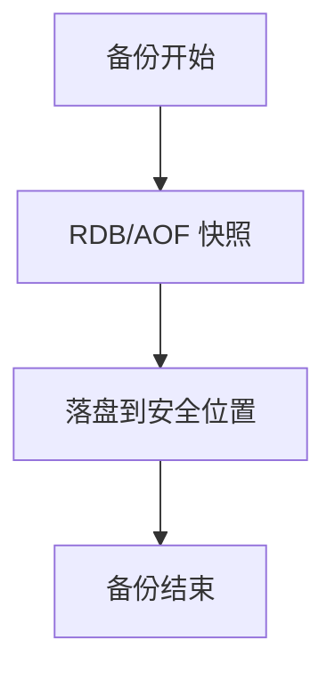
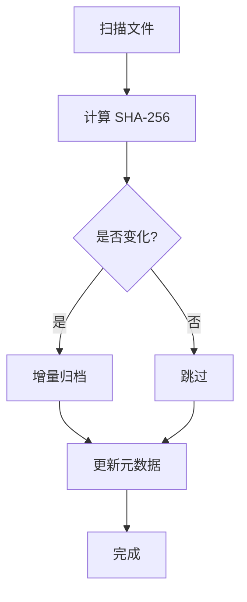
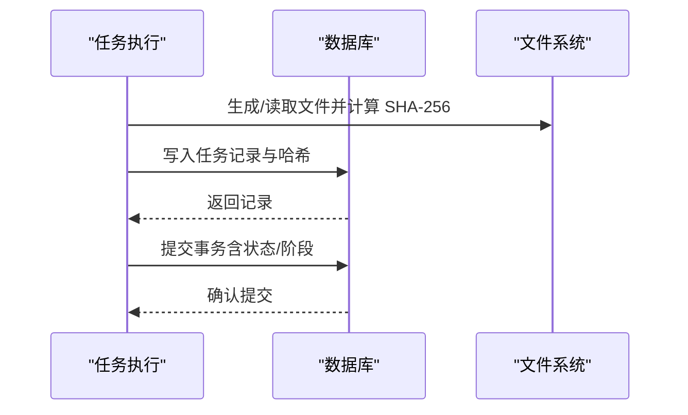
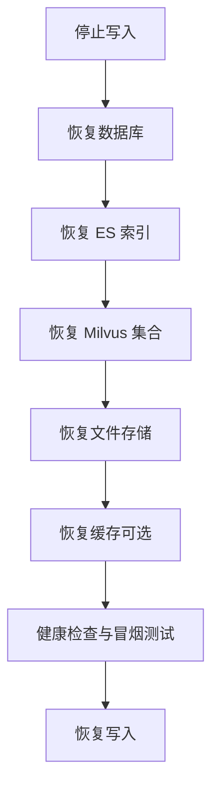
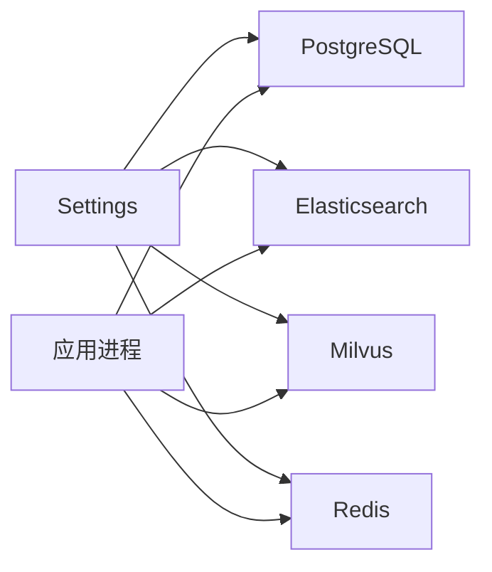

# 备份恢复策略

<cite>
**本文引用的文件**
- [config.py](file://src/fast_app/core/config.py)
- [session.py](file://src/fast_app/db/session.py)
- [ingestion_tables.py](file://src/fast_app/db/ingestion_tables.py)
- [rag_store_admin.py](file://src/fast_app/ingestion/stores/rag_store_admin.py)
- [rag_store_schema.py](file://src/fast_app/ingestion/stores/rag_store_schema.py)
- [cli.py](file://src/fast_app/ingestion/cli.py)
- [knowledge_import_routes.py](file://src/fast_app/api/knowledge_import_routes.py)
- [snapshot_capture.py](file://src/fast_app/evaluation/pipeline/snapshot_capture.py)
- [health_routes.py](file://src/fast_app/api/health_routes.py)
- [repository.py](file://src/fast_app/integrations/gitlab/repository.py)
- [rebuild_rag_demo_stores.py](file://scripts/rebuild_rag_demo_stores.py)
- [14-2-Redis短期会话记忆-最近消息-TTL-会话状态.md](file://learning-docs/phase-14/14-2-Redis短期会话记忆-最近消息-TTL-会话状态.md)
- [PPT，Excel，PDF文档处理实现方案 + 技术点讲解.md](file://scripts/docs/PPT，Excel，PDF文档处理实现方案 + 技术点讲解.md)
- [.tmp/knowledge_inventory.json](file://.tmp/knowledge_inventory.json)
</cite>

## 目录
1. [简介](#简介)
2. [项目结构](#项目结构)
3. [核心组件](#核心组件)
4. [架构总览](#架构总览)
5. [详细组件分析](#详细组件分析)
6. [依赖关系分析](#依赖关系分析)
7. [性能与容量规划](#性能与容量规划)
8. [故障排查指南](#故障排查指南)
9. [结论](#结论)
10. [附录：RTO/RPO 目标与演练清单](#附录rtorpo-目标与演练清单)

## 简介
本文件为 AI Agent 项目的备份与恢复策略说明，覆盖数据库、向量存储、缓存数据与文件存储四类关键资产。结合现有代码中的配置、索引重建、任务持久化、快照校验等能力，给出全量与增量备份策略、数据一致性保证、灾难恢复流程、自动化脚本建议、备份验证机制与恢复演练流程，并针对不同存储组件提供可操作的方案与故障场景处理指南。

## 项目结构
本项目涉及多类数据与外部服务：
- 数据库：PostgreSQL（通过 SQLAlchemy 异步引擎与会话工厂管理）
- 向量检索：Milvus（Collection、Schema、Index）
- 关键词检索：Elasticsearch（Index、Mapping）
- 缓存：Redis（会话记忆、TTL、最近消息）
- 文件与对象：本地 staging 目录、知识库目录、Agent 任务计划目录
- 外部系统：GitLab（可选集成，支持增量同步与租约）

**章节来源**
- [config.py:58-81](file://src/fast_app/core/config.py#L58-L81)
- [config.py:457-476](file://src/fast_app/core/config.py#L457-L476)
- [config.py:520-535](file://src/fast_app/core/config.py#L520-L535)
- [session.py:11-32](file://src/fast_app/db/session.py#L11-L32)
- [rag_store_schema.py:248-279](file://src/fast_app/ingestion/stores/rag_store_schema.py#L248-L279)
- [cli.py:75-106](file://src/fast_app/ingestion/cli.py#L75-L106)
- [14-2-Redis短期会话记忆-最近消息-TTL-会话状态.md:1-348](file://learning-docs/phase-14/14-2-Redis短期会话记忆-最近消息-TTL-会话状态.md#L1-L348)

## 核心组件
- 配置中心：统一读取环境变量与 .env，集中暴露数据库、ES、Milvus、Redis、模型与导入相关参数。
- 数据库连接：异步 Engine 与 SessionFactory，用于会话、迁移与业务写入。
- 向量与关键词索引：Milvus Collection 与 ES Index 的创建、重建与查询字段定义。
- 导入与任务：知识导入 API、分块复制、SHA-256 校验、任务状态机与阶段推进。
- 快照与校验：评测快照的安全模式、哈希与 AES-GCM 认证，保障数据完整性。
- 健康检查：基础 /health 接口，可用于编排与监控。

**章节来源**
- [config.py:18-1103](file://src/fast_app/core/config.py#L18-L1103)
- [session.py:11-32](file://src/fast_app/db/session.py#L11-L32)
- [rag_store_admin.py:21-161](file://src/fast_app/ingestion/stores/rag_store_admin.py#L21-L161)
- [knowledge_import_routes.py:538-566](file://src/fast_app/api/knowledge_import_routes.py#L538-L566)
- [snapshot_capture.py:43-233](file://src/fast_app/evaluation/pipeline/snapshot_capture.py#L43-L233)
- [health_routes.py:1-11](file://src/fast_app/api/health_routes.py#L1-L11)

## 架构总览
下图展示备份恢复涉及的组件与交互：备份侧从数据库导出、索引快照或元数据记录、文件归档；恢复侧按顺序重建索引、导入数据、校验一致性与健康检查。

**图示来源**
- [config.py:58-81](file://src/fast_app/core/config.py#L58-L81)
- [config.py:457-476](file://src/fast_app/core/config.py#L457-L476)
- [config.py:520-535](file://src/fast_app/core/config.py#L520-L535)
- [rag_store_schema.py:248-279](file://src/fast_app/ingestion/stores/rag_store_schema.py#L248-L279)
- [cli.py:75-106](file://src/fast_app/ingestion/cli.py#L75-L106)
- [health_routes.py:1-11](file://src/fast_app/api/health_routes.py#L1-L11)

## 详细组件分析

### 数据库备份与恢复（PostgreSQL）
- 备份策略
  - 全量备份：定期冷备或热备（如 pg_basebackup），保留 N 天。
  - 增量备份：基于 WAL 的连续归档（pg_wal），配合时间点恢复（PITR）。
  - 事务一致性：使用数据库自带工具确保 ACID 与一致性快照。
- 恢复流程
  - 先恢复全量，再回放增量至目标时间点。
  - 校验表结构与迁移版本（Alembic）与业务数据一致性。
  - 启动应用后执行健康检查与冒烟查询。
- 与项目代码的衔接
  - 数据库连接由异步 Engine 与 SessionFactory 管理，便于在恢复后快速建立连接池。
  - 导入任务表包含 sha256、base_sha256、new_sha256 等字段，可用于重跑与一致性比对。

**章节来源**
- [session.py:11-32](file://src/fast_app/db/session.py#L11-L32)
- [ingestion_tables.py:29-54](file://src/fast_app/db/ingestion_tables.py#L29-L54)
- [health_routes.py:1-11](file://src/fast_app/api/health_routes.py#L1-L11)

### 向量存储备份与恢复（Milvus）
- 备份策略
  - 全量：导出 Collection 数据与 Schema/Index 定义。
  - 增量：基于变更日志或按 doc_id/chunk_id 的 Upsert/删除记录进行增量同步。
- 恢复流程
  - 先重建 Schema 与 Index，再导入数据，最后加载集合。
  - 使用内置搜索进行冒烟验证。
- 与项目代码的衔接
  - 提供 Collection 重置与重建入口，便于灾难恢复时快速重建空结构。
  - 输出字段与索引参数集中定义，确保重建一致性。

**图示来源**
- [rag_store_admin.py:95-129](file://src/fast_app/ingestion/stores/rag_store_admin.py#L95-L129)
- [rag_store_schema.py:248-279](file://src/fast_app/ingestion/stores/rag_store_schema.py#L248-L279)
- [rebuild_rag_demo_stores.py:272-366](file://scripts/rebuild_rag_demo_stores.py#L272-L366)

**章节来源**
- [rag_store_admin.py:21-161](file://src/fast_app/ingestion/stores/rag_store_admin.py#L21-L161)
- [rag_store_schema.py:248-279](file://src/fast_app/ingestion/stores/rag_store_schema.py#L248-L279)
- [rebuild_rag_demo_stores.py:272-366](file://scripts/rebuild_rag_demo_stores.py#L272-L366)

### 关键词检索备份与恢复（Elasticsearch）
- 备份策略
  - 全量：快照/导出索引数据与 Mapping。
  - 增量：基于滚动索引或变更事件增量同步。
- 恢复流程
  - 先创建/重建 Index 与 IK 分析器，再导入数据。
  - 使用 CLI 构建客户端，支持超时与认证。
- 与项目代码的衔接
  - CLI 集中处理 ES 客户端构建、认证与超时，便于在恢复脚本中复用。

**章节来源**
- [cli.py:75-106](file://src/fast_app/ingestion/cli.py#L75-L106)
- [rag_store_admin.py:70-93](file://src/fast_app/ingestion/stores/rag_store_admin.py#L70-L93)

### 缓存数据管理（Redis）
- 角色定位
  - 短期会话记忆：保存最近若干条消息，具备 TTL 与跨进程共享能力。
  - 非业务事实库：不承载长期一致性要求，适合快速读写与过期清理。
- 备份与恢复
  - 全量：RDB/AOF 快照。
  - 增量：AOF 追加日志。
  - 恢复：重启后自动加载，或通过命令回填最近消息。
- 与项目代码的衔接
  - Settings 提供 Redis URL、TTL、最大消息数等配置。
  - 学习文档描述了 List 数据结构与键设计，便于编写恢复脚本。

**章节来源**
- [config.py:457-476](file://src/fast_app/core/config.py#L457-L476)
- [14-2-Redis短期会话记忆-最近消息-TTL-会话状态.md:1-348](file://learning-docs/phase-14/14-2-Redis短期会话记忆-最近消息-TTL-会话状态.md#L1-L348)

### 文件存储备份与恢复
- 范围
  - 上传暂存目录（staging）、知识库目录、Agent 任务计划目录。
- 策略
  - 全量：定期打包归档，保留历史版本。
  - 增量：基于文件修改时间与大小变化，或使用 SHA-256 校验差异。
- 与项目代码的衔接
  - 导入路由对上传文件进行分块复制与 SHA-256 计算，便于恢复后校验一致性。
  - 任务表记录 staged_path、target_path、sha256 等，支撑重跑与回滚。

**章节来源**
- [knowledge_import_routes.py:538-566](file://src/fast_app/api/knowledge_import_routes.py#L538-L566)
- [ingestion_tables.py:29-54](file://src/fast_app/db/ingestion_tables.py#L29-L54)

### 数据一致性保证
- 哈希与校验
  - 评测快照采用 JSON 规范化、SHA-256 校验与 AES-GCM 认证，防止篡改与损坏。
- 任务级一致性
  - 导入任务使用 sha256/base_sha256/new_sha256 追踪源文件与目标内容，支持重跑与回滚。
- 并发与租约
  - GitLab 同步任务使用 with_for_update(skip_locked=True) 与租约过期机制，避免重复领取与覆盖。

**章节来源**
- [snapshot_capture.py:43-233](file://src/fast_app/evaluation/pipeline/snapshot_capture.py#L43-L233)
- [ingestion_tables.py:29-54](file://src/fast_app/db/ingestion_tables.py#L29-L54)
- [repository.py:202-241](file://src/fast_app/integrations/gitlab/repository.py#L202-L241)

### 灾难恢复流程
- 总体步骤
  - 停止写入：暂停导入与同步任务，避免恢复期间数据变更。
  - 恢复数据库：全量+增量至目标时间点。
  - 恢复索引：重建 ES/Milvus 索引并导入数据。
  - 恢复文件：还原 staging/知识库/任务计划目录。
  - 恢复缓存：按需回填 Redis 会话记忆。
  - 验证：执行健康检查与冒烟测试，核对关键指标。
- 与项目代码的衔接
  - 使用 CLI 与重建脚本快速重建索引。
  - 使用健康接口与搜索冒烟验证可用性。

**章节来源**
- [cli.py:75-106](file://src/fast_app/ingestion/cli.py#L75-L106)
- [rag_store_admin.py:131-161](file://src/fast_app/ingestion/stores/rag_store_admin.py#L131-L161)
- [health_routes.py:1-11](file://src/fast_app/api/health_routes.py#L1-L11)

### 自动化备份脚本建议
- 数据库
  - 定时执行全量备份与 WAL 归档，保留策略按天数配置。
  - 恢复前校验备份完整性（如 pg_restore --list）。
- 向量与关键词
  - 定时导出 Milvus Collection 与 ES Index 数据与映射。
  - 使用 CLI 构建客户端，统一超时与认证。
- 文件与缓存
  - 基于 SHA-256 的差异归档，减少带宽与存储占用。
  - Redis 使用 RDB/AOF 组合，定期落盘。
- 验证
  - 每次备份后执行冒烟测试（如 Milvus 搜索、ES 查询、数据库连通性）。

**章节来源**
- [cli.py:75-106](file://src/fast_app/ingestion/cli.py#L75-L106)
- [rebuild_rag_demo_stores.py:272-366](file://scripts/rebuild_rag_demo_stores.py#L272-L366)
- [knowledge_import_routes.py:538-566](file://src/fast_app/api/knowledge_import_routes.py#L538-L566)

### 备份验证机制
- 完整性校验
  - 使用 SHA-256 校验文件与快照内容。
  - 评测快照支持 redacted/encrypted 模式与 key ring 校验。
- 可用性验证
  - 健康检查接口返回 ok。
  - 向量与关键词索引执行搜索/查询冒烟测试。
- 一致性验证
  - 对比导入任务的 sha256 与 base_sha256/new_sha256。
  - 校验 Alembic 迁移版本与表结构。

**章节来源**
- [snapshot_capture.py:43-233](file://src/fast_app/evaluation/pipeline/snapshot_capture.py#L43-L233)
- [health_routes.py:1-11](file://src/fast_app/api/health_routes.py#L1-L11)
- [ingestion_tables.py:29-54](file://src/fast_app/db/ingestion_tables.py#L29-L54)

### 恢复演练流程
- 演练目标
  - 验证 RTO/RPO 是否达标。
  - 验证各组件恢复顺序与依赖关系。
- 演练步骤
  - 模拟故障：关闭服务、删除索引或数据库。
  - 执行恢复：按顺序恢复数据库、索引、文件与缓存。
  - 验证：健康检查、搜索冒烟、导入任务重跑。
- 记录与改进
  - 记录每个阶段的耗时与失败点。
  - 优化脚本与流程，提升恢复效率。

**章节来源**
- [rag_store_admin.py:131-161](file://src/fast_app/ingestion/stores/rag_store_admin.py#L131-L161)
- [health_routes.py:1-11](file://src/fast_app/api/health_routes.py#L1-L11)

## 依赖关系分析
- 配置依赖
  - 所有组件通过 Settings 获取连接参数与行为开关，确保环境隔离与可配置性。
- 组件耦合
  - 导入流程依赖数据库、文件存储与索引；恢复时需按依赖顺序执行。
- 外部依赖
  - GitLab 集成提供增量同步能力，需考虑网络与权限。

**图示来源**
- [config.py:58-81](file://src/fast_app/core/config.py#L58-L81)
- [config.py:457-476](file://src/fast_app/core/config.py#L457-L476)
- [config.py:520-535](file://src/fast_app/core/config.py#L520-L535)

**章节来源**
- [config.py:18-1103](file://src/fast_app/core/config.py#L18-L1103)

## 性能与容量规划
- 备份窗口
  - 根据数据增长速率与 RPO 目标设定备份频率（小时/天）。
- 存储容量
  - 预估数据库、索引与文件的增长，预留扩容空间。
- 网络与 I/O
  - 大文件与向量数据备份需考虑带宽与磁盘 I/O。
- 资源限制
  - 导入请求体与文件大小上限已在配置中设置，避免过载。

[本节为通用指导，无需具体文件引用]

## 故障排查指南
- 常见问题
  - 连接失败：检查数据库、ES、Milvus、Redis 的连接地址与认证。
  - 索引不可用：重建索引并导入数据，执行冒烟测试。
  - 文件不一致：核对 SHA-256，重新导入或重跑任务。
  - 快照解密失败：检查 key ring 与 active key ID。
- 排查步骤
  - 查看健康接口与日志。
  - 使用 CLI 构建客户端进行连通性测试。
  - 重跑导入任务并观察阶段推进。

**章节来源**
- [health_routes.py:1-11](file://src/fast_app/api/health_routes.py#L1-L11)
- [cli.py:75-106](file://src/fast_app/ingestion/cli.py#L75-L106)
- [snapshot_capture.py:43-233](file://src/fast_app/evaluation/pipeline/snapshot_capture.py#L43-L233)

## 结论
本项目已具备多组件备份恢复的基础能力：配置集中、索引重建、任务持久化、快照校验与健康检查。建议在此基础上完善自动化备份脚本、增量同步策略与恢复演练流程，明确 RTO/RPO 目标，并通过持续验证确保灾难恢复的有效性。

[本节为总结，无需具体文件引用]

## 附录：RTO/RPO 目标与演练清单
- RTO（恢复时间目标）
  - 数据库：分钟级（基于 PITR）。
  - 索引：分钟级（重建+导入）。
  - 文件：分钟级（增量归档）。
  - 缓存：秒级（AOF 回放）。
- RPO（恢复点目标）
  - 数据库：基于 WAL 归档，可达秒级。
  - 索引：基于增量同步，可达分钟级。
  - 文件：基于差异归档，可达分钟级。
  - 缓存：AOF 可接近零丢失。
- 演练清单
  - 停止写入、恢复数据库、重建索引、恢复文件、回填缓存、健康检查、冒烟测试、恢复写入。
  - 记录各阶段耗时与失败点，优化脚本与流程。

**章节来源**
- [config.py:520-535](file://src/fast_app/core/config.py#L520-L535)
- [cli.py:75-106](file://src/fast_app/ingestion/cli.py#L75-L106)
- [rag_store_admin.py:131-161](file://src/fast_app/ingestion/stores/rag_store_admin.py#L131-L161)
- [health_routes.py:1-11](file://src/fast_app/api/health_routes.py#L1-L11)