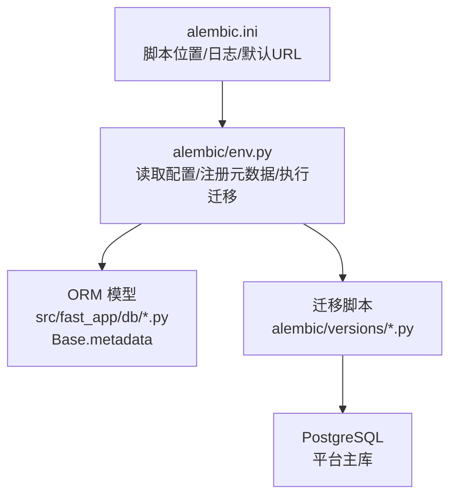
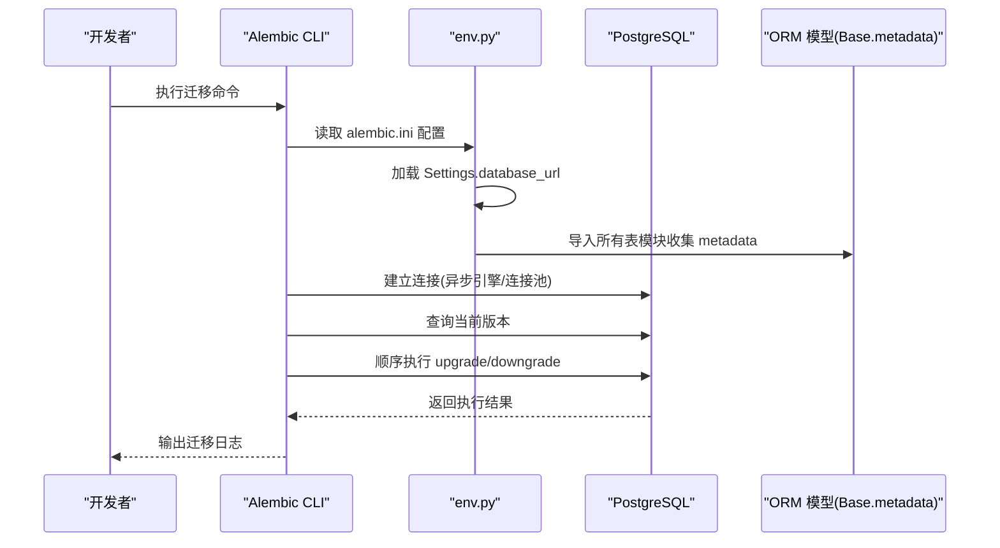
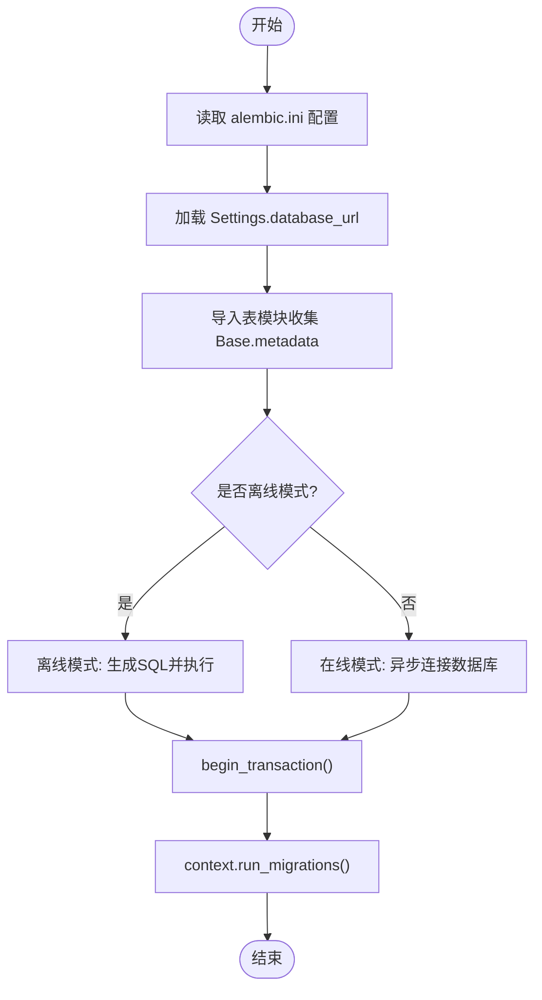
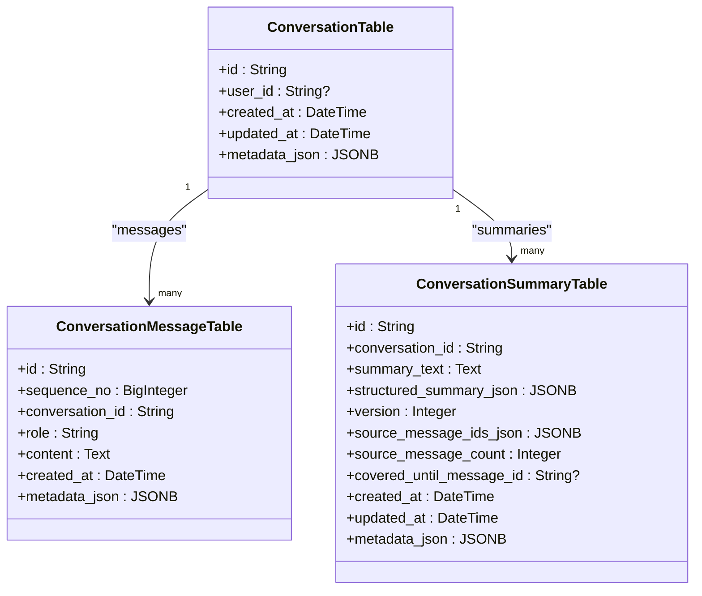
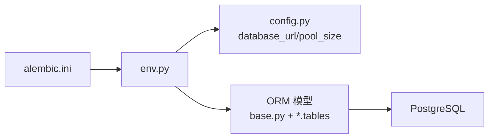

# 数据库迁移管理

<cite>
**本文引用的文件**
- [alembic.ini](file://python-agent-study/alembic.ini)
- [env.py](file://python-agent-study/alembic/env.py)
- [base.py](file://python-agent-study/src/fast_app/db/base.py)
- [conversation_tables.py](file://python-agent-study/src/fast_app/db/conversation_tables.py)
- [auth_tables.py](file://python-agent-study/src/fast_app/db/auth_tables.py)
- [config.py](file://python-agent-study/src/fast_app/core/config.py)
- [20260624_0001_create_conversation_tables.py](file://python-agent-study/alembic/versions/20260624_0001_create_conversation_tables.py)
- [20260731_0012_add_nl2sql_datasets.py](file://python-agent-study/alembic/versions/20260731_0012_add_nl2sql_datasets.py)
</cite>

## 目录
1. [简介](#简介)
2. [项目结构](#项目结构)
3. [核心组件](#核心组件)
4. [架构总览](#架构总览)
5. [详细组件分析](#详细组件分析)
6. [依赖关系分析](#依赖关系分析)
7. [性能与并发考虑](#性能与并发考虑)
8. [故障排查指南](#故障排查指南)
9. [结论](#结论)
10. [附录：命令与最佳实践](#附录命令与最佳实践)

## 简介
本文件面向本项目基于 Alembic 的数据库迁移体系，覆盖迁移脚本创建与执行、版本控制、数据模型变更管理、生产环境迁移策略、多环境配置、并发迁移处理、失败恢复方案以及常见问题排障。文档以仓库中实际的 Alembic 配置、迁移脚本和 SQLAlchemy ORM 模型为依据，提供可操作的流程与图示说明。

## 项目结构
项目的数据库迁移由以下关键部分组成：
- Alembic 配置文件 alembic.ini：定义脚本位置、日志级别与默认数据库连接字符串。
- Alembic 运行环境 env.py：加载应用设置、注册所有表模型元数据，并实现在线/离线迁移执行逻辑。
- 迁移脚本 versions/*：按时间戳+序号命名，包含 upgrade/downgrade 方法，描述每次变更。
- ORM 模型 src/fast_app/db/*：通过 DeclarativeBase 派生的 Base.metadata 被 Alembic 用于生成差异或校验结构。

图表来源
- [alembic.ini:1-41](file://python-agent-study/alembic.ini#L1-L41)
- [env.py:1-83](file://python-agent-study/alembic/env.py#L1-L83)
- [base.py:1-8](file://python-agent-study/src/fast_app/db/base.py#L1-L8)

章节来源
- [alembic.ini:1-41](file://python-agent-study/alembic.ini#L1-L41)
- [env.py:1-83](file://python-agent-study/alembic/env.py#L1-L83)
- [base.py:1-8](file://python-agent-study/src/fast_app/db/base.py#L1-L8)

## 核心组件
- Alembic 配置与环境
  - alembic.ini 指定脚本目录、日志级别与默认数据库 URL（开发示例）。
  - env.py 将应用 Settings 中的 database_url 注入到 Alembic 上下文，并导入所有表模块以收集 Base.metadata。
- ORM 基类与模型
  - base.py 提供 DeclarativeBase；各业务表模块在自身文件中声明表结构与关系。
- 迁移脚本
  - 每个脚本包含 revision、down_revision、upgrade、downgrade，描述增量变更与回滚逻辑。

章节来源
- [alembic.ini:1-41](file://python-agent-study/alembic.ini#L1-L41)
- [env.py:18-34](file://python-agent-study/alembic/env.py#L18-L34)
- [base.py:1-8](file://python-agent-study/src/fast_app/db/base.py#L1-L8)

## 架构总览
Alembic 在执行迁移时，会读取 alembic.ini 的配置，进入 env.py 加载应用设置并绑定目标元数据，随后根据当前数据库版本与脚本链决定执行哪些 upgrade 或 downgrade。

图表来源
- [alembic.ini:1-41](file://python-agent-study/alembic.ini#L1-L41)
- [env.py:26-83](file://python-agent-study/alembic/env.py#L26-L83)

## 详细组件分析

### 迁移环境与执行流程
- 配置注入
  - env.py 从应用 Settings 获取 database_url 并写入 Alembic 配置项，确保迁移使用正确的数据库连接。
- 元数据收集
  - 通过导入各表模块，使 Base.metadata 包含全部表结构，便于生成 SQL 或进行一致性检查。
- 在线/离线模式
  - 离线模式仅生成 SQL，不连接真实数据库；在线模式通过异步引擎连接 PostgreSQL 执行迁移。
- 事务边界
  - 迁移在 begin_transaction() 包裹内执行，保证原子性。

图表来源
- [env.py:26-83](file://python-agent-study/alembic/env.py#L26-L83)

章节来源
- [env.py:18-83](file://python-agent-study/alembic/env.py#L18-L83)
- [config.py:520-535](file://python-agent-study/src/fast_app/core/config.py#L520-L535)

### 数据模型与迁移脚本对应关系
- 会话相关表
  - conversation_tables.py 定义了 conversations、conversation_messages、conversation_summaries 等表结构，并在迁移脚本中创建相应对象与索引。
  - 首个迁移脚本创建了基础会话表与消息表，并建立了必要的索引。
- NL2SQL 数据集定义表
  - 最新迁移脚本新增了 nl2sql_datasets 表，并在升级时批量插入测试数据集定义，同时定义了约束与 JSONB 字段。

图表来源
- [conversation_tables.py:24-171](file://python-agent-study/src/fast_app/db/conversation_tables.py#L24-L171)

章节来源
- [20260624_0001_create_conversation_tables.py:1-86](file://python-agent-study/alembic/versions/20260624_0001_create_conversation_tables.py#L1-L86)
- [20260731_0012_add_nl2sql_datasets.py:1-126](file://python-agent-study/alembic/versions/20260731_0012_add_nl2sql_datasets.py#L1-L126)
- [conversation_tables.py:24-171](file://python-agent-study/src/fast_app/db/conversation_tables.py#L24-L171)

### 认证与权限相关表
- auth_tables.py 定义了用户、部门、角色、权限、API Key、刷新令牌等实体及其关系，并通过外键、唯一约束与索引保障数据一致性与查询性能。
- 这些表结构由后续迁移脚本逐步创建与维护，迁移脚本需与模型保持同步。

章节来源
- [auth_tables.py:13-431](file://python-agent-study/src/fast_app/db/auth_tables.py#L13-L431)

### 版本管理与迁移链
- 每个迁移脚本通过 revision 与 down_revision 形成线性版本链。
- 最新版本为 20260731_0012，其 down_revision 指向 20260729_0011，表明该迁移在上一个版本基础上扩展了 NL2SQL 数据集能力。
- 建议新增迁移时遵循“时间戳+序号”命名规范，并确保 upgrade/downgrade 成对且幂等。

章节来源
- [20260731_0012_add_nl2sql_datasets.py:1-16](file://python-agent-study/alembic/versions/20260731_0012_add_nl2sql_datasets.py#L1-L16)

## 依赖关系分析
- Alembic 依赖
  - alembic.ini 提供脚本路径与日志配置。
  - env.py 依赖应用 Settings 与 ORM 模型集合。
- 应用依赖
  - config.py 提供数据库连接参数与连接池大小等配置。
  - 各表模块通过 Base 派生，统一纳入 Alembic 元数据。

图表来源
- [alembic.ini:1-41](file://python-agent-study/alembic.ini#L1-L41)
- [env.py:18-34](file://python-agent-study/alembic/env.py#L18-L34)
- [config.py:520-535](file://python-agent-study/src/fast_app/core/config.py#L520-L535)

章节来源
- [alembic.ini:1-41](file://python-agent-study/alembic.ini#L1-L41)
- [env.py:18-34](file://python-agent-study/alembic/env.py#L18-L34)
- [config.py:520-535](file://python-agent-study/src/fast_app/core/config.py#L520-L535)

## 性能与并发考虑
- 连接与池化
  - env.py 使用 NullPool 进行一次性连接执行迁移，避免长连接占用；应用运行时可通过 Settings 配置 pool_size 与 max_overflow。
- 索引与约束
  - 迁移脚本中为高频查询创建复合索引（如 conversation_id + created_at），提升检索性能。
  - 使用 CheckConstraint 与 UniqueConstraint 保证数据质量。
- 大表与批量数据
  - 对于批量插入（如 nl2sql_datasets 初始数据），建议使用 bulk_insert 减少开销。
- 并发迁移
  - 生产环境应避免多个实例同时执行迁移；建议在部署流水线中串行执行，或使用分布式锁。

[本节为通用指导，无需特定文件引用]

## 故障排查指南
- 无法连接数据库
  - 检查 alembic.ini 与 Settings.database_url 是否正确，确认网络与凭据。
- 元数据不一致
  - 若报错提示模型与数据库结构不一致，需先创建或修复迁移脚本，再执行升级。
- 迁移失败回滚
  - 使用 downgrade 回到上一个稳定版本；必要时结合数据库备份恢复。
- 日志定位
  - 调整 alembic.ini 日志级别，查看 sqlalchemy.engine 与 alembic 日志输出。

章节来源
- [alembic.ini:9-41](file://python-agent-study/alembic.ini#L9-L41)
- [env.py:26-83](file://python-agent-study/alembic/env.py#L26-L83)

## 结论
本项目采用 Alembic 进行数据库版本化管理，配合 SQLAlchemy ORM 模型与清晰的迁移脚本组织，实现了可追溯、可回滚的结构变更流程。通过环境变量与集中式配置，支持多环境切换；通过索引与约束设计，兼顾性能与数据完整性。生产环境应严格管控迁移执行时机与并发，确保数据安全与系统稳定。

[本节为总结性内容，无需特定文件引用]

## 附录：命令与最佳实践
- 常用命令
  - 初始化迁移环境：alembic init
  - 生成迁移脚本：alembic revision --autogenerate -m "描述"
  - 查看历史版本：alembic history
  - 查看当前版本：alembic current
  - 升级到最新版本：alembic upgrade head
  - 升级到指定版本：alembic upgrade <revision>
  - 回滚到上一版本：alembic downgrade -1
  - 回滚到指定版本：alembic downgrade <revision>
  - 离线生成 SQL：alembic revision --autogenerate -m "描述"（结合离线模式）
- 多环境迁移管理
  - 通过 .env 或环境变量设置 DATABASE_URL，不同环境使用不同值。
  - 在 CI/CD 中按阶段执行迁移，确保服务启动前数据库已就绪。
- 并发迁移处理
  - 使用部署编排工具串行执行迁移，或在数据库层加锁。
  - 避免多 Worker 实例同时执行 alembic upgrade。
- 生产环境迁移策略
  - 先灰度小流量验证，再全量发布。
  - 迁移前后进行数据备份与校验。
  - 对破坏性变更（删除列/表）谨慎评估影响范围。
- 数据备份与恢复
  - 使用 pg_dump/pg_restore 或云厂商备份方案。
  - 迁移失败时优先回滚并恢复备份，再分析问题。
- 常见错误与解决
  - 模型未导入导致元数据缺失：确保 env.py 导入所有表模块。
  - 版本冲突：检查 down_revision 链是否连续。
  - 索引重复或约束冲突：在迁移脚本中显式处理存在性判断。

[本节为通用指导，无需特定文件引用]