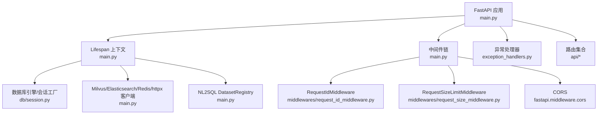
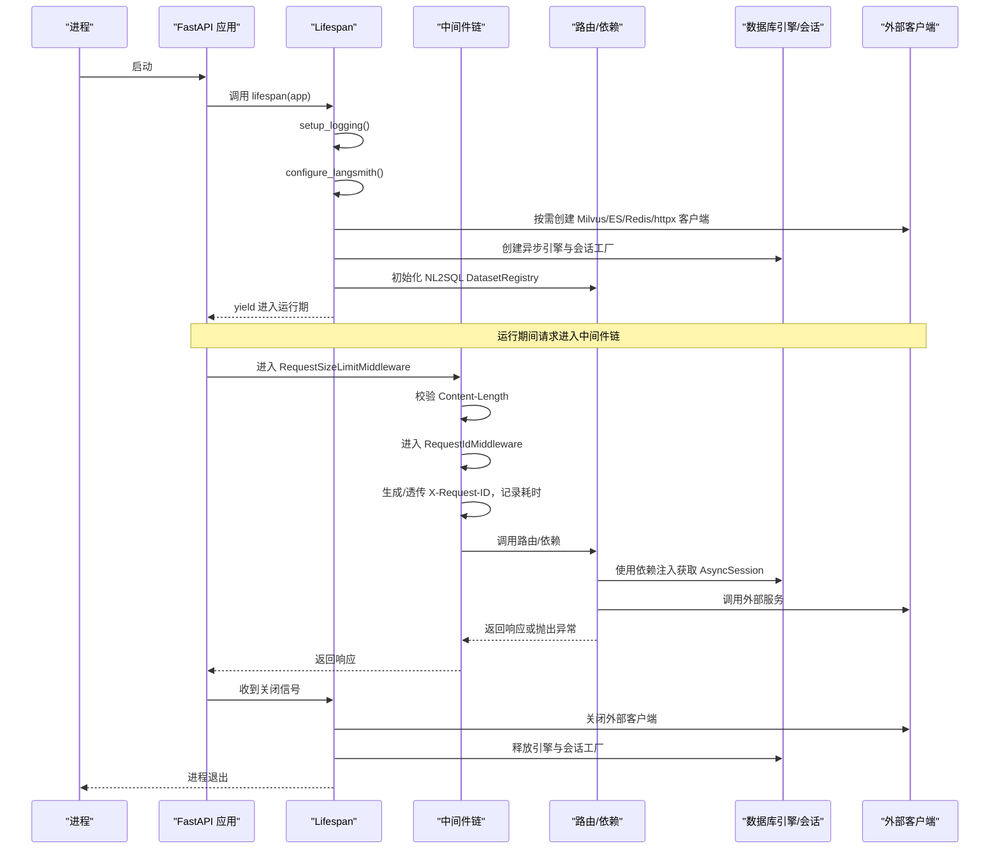
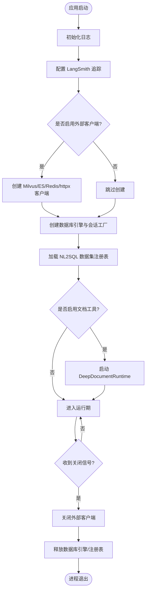
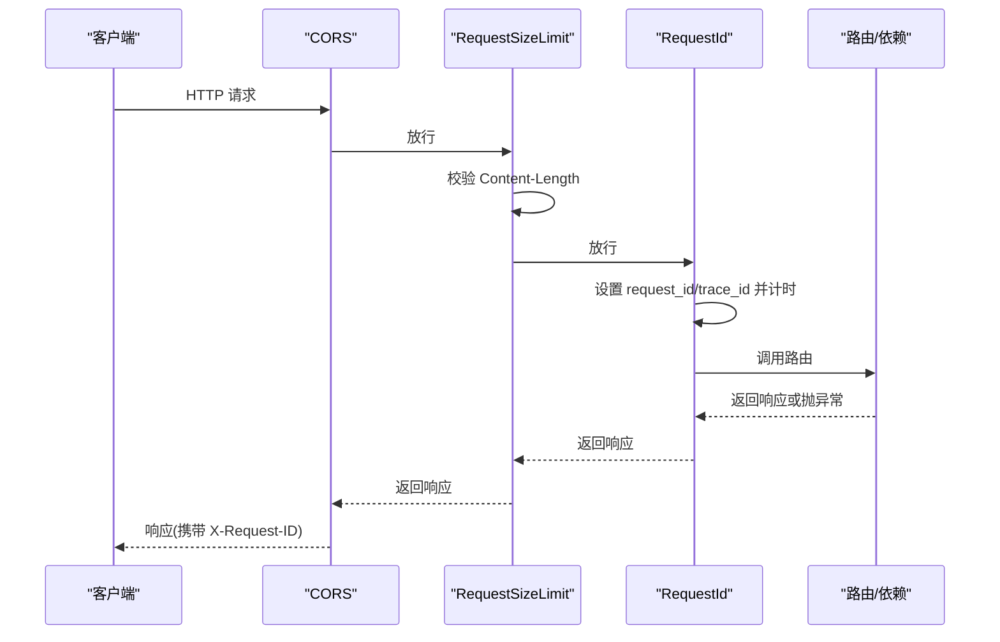
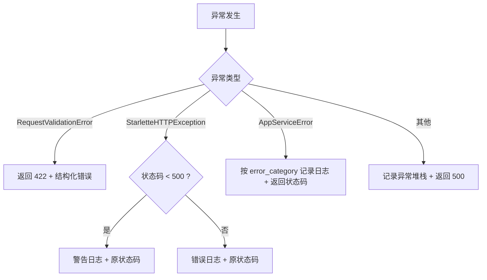
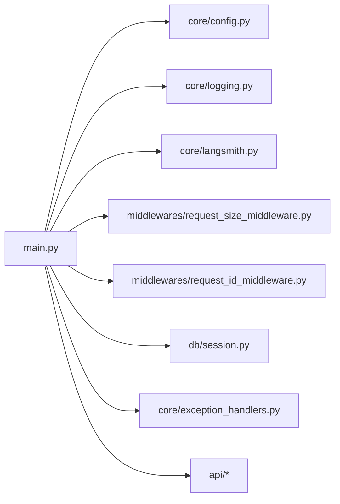

# 服务生命周期管理

<cite>
**本文引用的文件**
- [src/fast_app/main.py](file://src/fast_app/main.py)
- [src/fast_app/core/config.py](file://src/fast_app/core/config.py)
- [src/fast_app/core/logging.py](file://src/fast_app/core/logging.py)
- [src/fast_app/core/langsmith.py](file://src/fast_app/core/langsmith.py)
- [src/fast_app/api/health_routes.py](file://src/fast_app/api/health_routes.py)
- [src/fast_app/middlewares/request_id_middleware.py](file://src/fast_app/middlewares/request_id_middleware.py)
- [src/fast_app/middlewares/request_size_middleware.py](file://src/fast_app/middlewares/request_size_middleware.py)
- [src/fast_app/db/session.py](file://src/fast_app/db/session.py)
- [src/fast_app/core/exception_handlers.py](file://src/fast_app/core/exception_handlers.py)
- [src/fast_app/core/request_context.py](file://src/fast_app/core/request_context.py)
</cite>

## 目录
1. [简介](#简介)
2. [项目结构](#项目结构)
3. [核心组件](#核心组件)
4. [架构总览](#架构总览)
5. [详细组件分析](#详细组件分析)
6. [依赖关系分析](#依赖关系分析)
7. [性能与资源管理](#性能与资源管理)
8. [故障排查指南](#故障排查指南)
9. [结论](#结论)
10. [附录](#附录)

## 简介
本文件聚焦 FastAPI 应用的生命周期管理，覆盖启动与关闭流程、资源初始化与管理、外部服务客户端连接池管理、lifespan 上下文管理器工作原理、依赖注入机制、中间件注册顺序与异常处理策略。同时说明日志系统配置、LangSmith 追踪集成、健康检查端点与优雅停机处理，并给出性能监控与资源泄漏防护的最佳实践。

## 项目结构
FastAPI 应用入口位于 src/fast_app/main.py，集中完成：
- 通过 lifespan 上下文管理器进行应用级资源初始化与释放
- 注册中间件（CORS、请求体大小限制、请求 ID 与慢请求记录）
- 注册全局异常处理器
- 挂载各业务路由（含健康检查）

图表来源
- [src/fast_app/main.py:41-170](file://src/fast_app/main.py#L41-L170)
- [src/fast_app/db/session.py:11-33](file://src/fast_app/db/session.py#L11-L33)
- [src/fast_app/middlewares/request_id_middleware.py:19-98](file://src/fast_app/middlewares/request_id_middleware.py#L19-L98)
- [src/fast_app/middlewares/request_size_middleware.py:20-110](file://src/fast_app/middlewares/request_size_middleware.py#L20-L110)

章节来源
- [src/fast_app/main.py:1-170](file://src/fast_app/main.py#L1-L170)

## 核心组件
- 应用生命周期：使用 asynccontextmanager 包装的 lifespan，负责在启动时创建并缓存外部客户端、数据库引擎与业务单例，在关闭时安全释放。
- 配置中心：基于 Pydantic Settings 统一读取环境变量与 .env，提供所有运行时开关与阈值。
- 日志系统：在启动时按配置初始化 logging，并通过 ContextVar 将 request_id/trace_id 注入到每条日志。
- LangSmith 追踪：在启动时根据配置决定是否启用，并将配置同步到 SDK 可读取的环境变量；提供统一的 trace 构造与脱敏工具。
- 中间件：CORS、请求体大小限制、请求 ID 与慢请求记录，形成请求进入前的第一道防线。
- 异常处理：统一捕获参数校验错误、HTTP 异常、业务异常与未预期异常，输出结构化错误响应并记录日志。
- 健康检查：提供 /health 端点用于存活探针。

章节来源
- [src/fast_app/main.py:41-170](file://src/fast_app/main.py#L41-L170)
- [src/fast_app/core/config.py:18-1103](file://src/fast_app/core/config.py#L18-L1103)
- [src/fast_app/core/logging.py:1-77](file://src/fast_app/core/logging.py#L1-L77)
- [src/fast_app/core/langsmith.py:1-604](file://src/fast_app/core/langsmith.py#L1-L604)
- [src/fast_app/middlewares/request_id_middleware.py:19-98](file://src/fast_app/middlewares/request_id_middleware.py#L19-L98)
- [src/fast_app/middlewares/request_size_middleware.py:20-110](file://src/fast_app/middlewares/request_size_middleware.py#L20-L110)
- [src/fast_app/core/exception_handlers.py:1-153](file://src/fast_app/core/exception_handlers.py#L1-L153)
- [src/fast_app/api/health_routes.py:1-11](file://src/fast_app/api/health_routes.py#L1-L11)

## 架构总览
下图展示从进程启动到请求处理的完整链路，包括 lifespan 初始化、中间件执行、路由处理与异常处理。

图表来源
- [src/fast_app/main.py:41-170](file://src/fast_app/main.py#L41-L170)
- [src/fast_app/db/session.py:11-33](file://src/fast_app/db/session.py#L11-L33)
- [src/fast_app/middlewares/request_size_middleware.py:20-110](file://src/fast_app/middlewares/request_size_middleware.py#L20-L110)
- [src/fast_app/middlewares/request_id_middleware.py:19-98](file://src/fast_app/middlewares/request_id_middleware.py#L19-L98)

## 详细组件分析

### 应用启动与关闭（Lifespan）
- 启动阶段
  - 初始化日志与 LangSmith 追踪
  - 根据配置条件化创建外部客户端：Milvus、Elasticsearch、httpx（重排序）、Redis
  - 创建 SQLAlchemy 异步引擎与会话工厂，并加载 NL2SQL 数据集注册表
  - 可选启动 Deep Document Runtime（持久化 checkpoint/store）
- 关闭阶段
  - 依次安全关闭外部客户端、数据库引擎、NL2SQL 注册表等，确保无资源泄漏
  - 使用 getattr 与类型判断保证健壮性，避免重复关闭或空引用

图表来源
- [src/fast_app/main.py:41-130](file://src/fast_app/main.py#L41-L130)

章节来源
- [src/fast_app/main.py:41-130](file://src/fast_app/main.py#L41-L130)

### 依赖注入机制
- 数据库会话：通过 db/session.py 创建异步引擎与会话工厂；业务层通过 FastAPI 依赖注入获取 AsyncSession，由框架负责请求级打开与关闭。
- 外部客户端：在 lifespan 中创建并挂载到 app.state，供业务模块直接复用，避免每次请求新建连接导致连接池抖动。
- 配置：通过 core/config.py 的 Settings 集中管理，支持环境变量与 .env，并提供字段校验与默认值。

章节来源
- [src/fast_app/db/session.py:11-33](file://src/fast_app/db/session.py#L11-L33)
- [src/fast_app/core/config.py:18-1103](file://src/fast_app/core/config.py#L18-L1103)
- [src/fast_app/main.py:77-83](file://src/fast_app/main.py#L77-L83)

### 中间件注册顺序与作用
- CORS：允许跨域访问，暴露请求 ID 头以便前端调试。
- RequestSizeLimitMiddleware：在进入路由前基于 Content-Length 拒绝超大请求体，保护后端解析与内存占用。
- RequestIdMiddleware：为每个请求生成/透传 X-Request-ID，记录请求耗时与慢请求告警，并在 finally 中清理上下文，防止污染后续任务。

图表来源
- [src/fast_app/main.py:138-154](file://src/fast_app/main.py#L138-L154)
- [src/fast_app/middlewares/request_size_middleware.py:20-110](file://src/fast_app/middlewares/request_size_middleware.py#L20-L110)
- [src/fast_app/middlewares/request_id_middleware.py:19-98](file://src/fast_app/middlewares/request_id_middleware.py#L19-L98)

章节来源
- [src/fast_app/main.py:138-154](file://src/fast_app/main.py#L138-L154)
- [src/fast_app/middlewares/request_size_middleware.py:20-110](file://src/fast_app/middlewares/request_size_middleware.py#L20-L110)
- [src/fast_app/middlewares/request_id_middleware.py:19-98](file://src/fast_app/middlewares/request_id_middleware.py#L19-L98)

### 异常处理策略
- 参数校验错误：统一返回 422，附带结构化错误信息。
- HTTP 异常：区分用户错误与系统错误，记录对应级别日志并返回原状态码。
- 业务异常：通过自定义 AppServiceError 分类（如 external_service_error），便于监控与告警。
- 未预期异常：兜底捕获，记录堆栈并返回 500。

图表来源
- [src/fast_app/core/exception_handlers.py:26-153](file://src/fast_app/core/exception_handlers.py#L26-L153)

章节来源
- [src/fast_app/core/exception_handlers.py:26-153](file://src/fast_app/core/exception_handlers.py#L26-L153)

### 日志系统与上下文传播
- 启动时按配置设置日志级别与格式，并注入 RequestContextFilter，使每条日志包含 request_id 与 trace_id。
- 请求级上下文通过 ContextVar 维护，中间件在请求开始时设置，结束时重置，避免跨并发请求污染。

章节来源
- [src/fast_app/core/logging.py:1-77](file://src/fast_app/core/logging.py#L1-L77)
- [src/fast_app/core/request_context.py:1-39](file://src/fast_app/core/request_context.py#L1-L39)
- [src/fast_app/middlewares/request_id_middleware.py:19-98](file://src/fast_app/middlewares/request_id_middleware.py#L19-L98)

### LangSmith 追踪集成
- 启动时根据配置决定是否启用，并将 API Key、Endpoint、Project 等同步到 SDK 环境变量。
- 提供统一的 metadata/tags 构造与敏感字段脱敏，确保本地与生产一致的可观测性。
- 对 RAG 链路提供 pipeline root run 与 step run 的统一封装，便于在 LangSmith UI 中定位问题。

章节来源
- [src/fast_app/core/langsmith.py:1-604](file://src/fast_app/core/langsmith.py#L1-L604)
- [src/fast_app/main.py:43-45](file://src/fast_app/main.py#L43-L45)

### 健康检查端点
- 提供 /health GET 接口，返回 {status: "ok"}，可用于容器编排中的存活探针。

章节来源
- [src/fast_app/api/health_routes.py:1-11](file://src/fast_app/api/health_routes.py#L1-L11)

## 依赖关系分析
- main.py 依赖：
  - core.config.Settings：统一配置
  - core.logging：日志初始化与上下文过滤
  - core.langsmith：追踪配置
  - middlewares.*：请求拦截与上下文传播
  - db.session：数据库引擎与会话工厂
  - api.*：路由注册
- 中间件之间：
  - RequestSizeLimitMiddleware 先于 RequestIdMiddleware，确保在解析 body 前做体积限制
  - RequestIdMiddleware 负责上下文传播与慢请求记录
- 异常处理器：
  - 统一捕获并标准化错误响应，结合日志与追踪上下文提升可观测性

图表来源
- [src/fast_app/main.py:1-170](file://src/fast_app/main.py#L1-L170)
- [src/fast_app/core/config.py:18-1103](file://src/fast_app/core/config.py#L18-L1103)
- [src/fast_app/core/logging.py:1-77](file://src/fast_app/core/logging.py#L1-L77)
- [src/fast_app/core/langsmith.py:1-604](file://src/fast_app/core/langsmith.py#L1-L604)
- [src/fast_app/middlewares/request_size_middleware.py:20-110](file://src/fast_app/middlewares/request_size_middleware.py#L20-L110)
- [src/fast_app/middlewares/request_id_middleware.py:19-98](file://src/fast_app/middlewares/request_id_middleware.py#L19-L98)
- [src/fast_app/db/session.py:11-33](file://src/fast_app/db/session.py#L11-L33)
- [src/fast_app/core/exception_handlers.py:26-153](file://src/fast_app/core/exception_handlers.py#L26-L153)

章节来源
- [src/fast_app/main.py:1-170](file://src/fast_app/main.py#L1-L170)

## 性能与资源管理
- 连接池与超时
  - 数据库引擎：通过 pool_size 与 max_overflow 控制连接池规模，配合 pool_pre_ping 提高可用性。
  - httpx 客户端：为重排序服务设置超时，避免长尾阻塞。
  - Redis/Milvus/ES 客户端：在 lifespan 中创建并复用，减少握手开销。
- 请求体限制
  - 在中间件中基于 Content-Length 快速拒绝超大请求，降低内存压力与解析成本。
- 慢请求与慢步骤
  - RequestIdMiddleware 记录请求耗时，并按阈值输出慢请求日志，便于定位瓶颈。
  - 可通过配置调整不同阶段的慢阈值（如检索、重排、LLM）。
- 资源释放
  - lifespan 的 finally 块中按序关闭外部客户端与数据库引擎，避免句柄泄漏。
  - NL2SQL 注册表在关闭时释放只读连接池。
- 最佳实践建议
  - 将外部客户端作为应用级单例，避免请求级创建销毁。
  - 合理设置超时与重试次数，避免雪崩。
  - 使用健康检查端点进行滚动更新与自愈。
  - 在生产环境开启 LangSmith 追踪并启用敏感数据脱敏。

章节来源
- [src/fast_app/db/session.py:11-33](file://src/fast_app/db/session.py#L11-L33)
- [src/fast_app/main.py:64-127](file://src/fast_app/main.py#L64-L127)
- [src/fast_app/middlewares/request_size_middleware.py:20-110](file://src/fast_app/middlewares/request_size_middleware.py#L20-L110)
- [src/fast_app/middlewares/request_id_middleware.py:19-98](file://src/fast_app/middlewares/request_id_middleware.py#L19-L98)
- [src/fast_app/core/config.py:620-634](file://src/fast_app/core/config.py#L620-L634)

## 故障排查指南
- 启动失败
  - 检查外部服务可达性与凭据（Milvus/ES/Redis/httpx）。
  - 确认数据库连接字符串与池参数正确。
  - 查看日志中“已创建/已关闭”的客户端日志，确认初始化顺序。
- 请求被拒
  - 若返回 413，检查请求体大小是否超过中间件限制。
  - 若返回 422，检查请求参数是否符合 Pydantic 模型约束。
- 慢请求与超时
  - 通过 RequestIdMiddleware 的慢请求日志定位瓶颈阶段。
  - 调整对应阶段的超时与重试配置。
- 追踪与日志关联
  - 使用 request_id/trace_id 将本地日志与 LangSmith trace 串联，快速定位问题。
  - 在 LangSmith 中按 tags 过滤 pipeline 与 step，缩小范围。

章节来源
- [src/fast_app/middlewares/request_size_middleware.py:61-82](file://src/fast_app/middlewares/request_size_middleware.py#L61-L82)
- [src/fast_app/core/exception_handlers.py:26-153](file://src/fast_app/core/exception_handlers.py#L26-L153)
- [src/fast_app/middlewares/request_id_middleware.py:40-98](file://src/fast_app/middlewares/request_id_middleware.py#L40-L98)
- [src/fast_app/core/langsmith.py:83-107](file://src/fast_app/core/langsmith.py#L83-L107)

## 结论
本项目通过 lifespan 统一管理应用生命周期，集中初始化与释放外部客户端与数据库连接，结合中间件链实现请求边界保护与上下文传播，配合统一的异常处理与结构化日志，以及 LangSmith 追踪，形成了高可用、可观测、易维护的服务生命周期管理体系。遵循本文给出的最佳实践，可有效避免资源泄漏、提升性能并增强故障定位能力。

## 附录
- 关键配置项参考
  - 日志级别：LOG_LEVEL
  - 慢请求阈值：SLOW_HTTP_REQUEST_THRESHOLD_MS
  - 请求体上限：MAX_REQUEST_BODY_BYTES / MAX_UPLOAD_REQUEST_BODY_BYTES
  - 数据库池：DATABASE_POOL_SIZE / DATABASE_MAX_OVERFLOW
  - 外部调用重试：EXTERNAL_CALL_MAX_RETRIES / EXTERNAL_CALL_RETRY_BASE_DELAY
  - LangSmith：LANGSMITH_TRACING / LANGSMITH_API_KEY / LANGSMITH_PROJECT
- 健康检查
  - GET /health → {"status": "ok"}

章节来源
- [src/fast_app/core/config.py:84-102](file://src/fast_app/core/config.py#L84-L102)
- [src/fast_app/core/config.py:161-176](file://src/fast_app/core/config.py#L161-L176)
- [src/fast_app/core/config.py:521-535](file://src/fast_app/core/config.py#L521-L535)
- [src/fast_app/core/config.py:620-634](file://src/fast_app/core/config.py#L620-L634)
- [src/fast_app/api/health_routes.py:7-11](file://src/fast_app/api/health_routes.py#L7-L11)