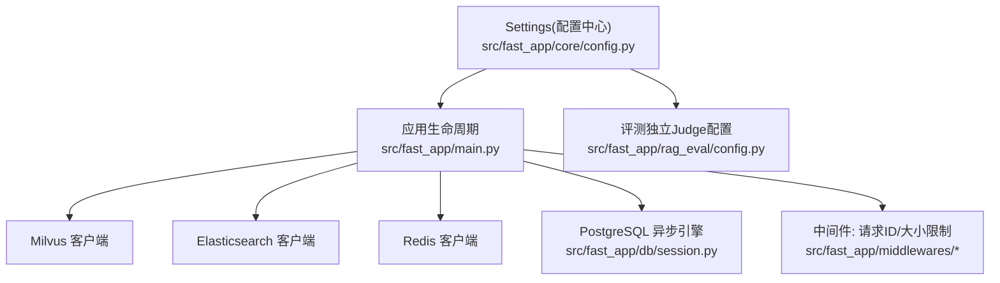
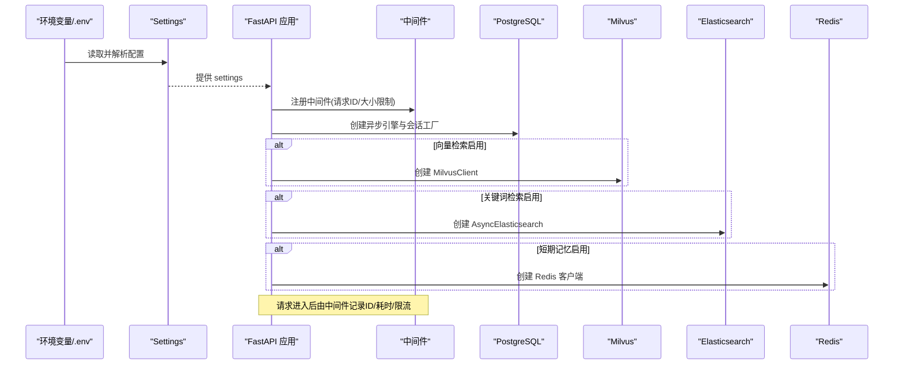
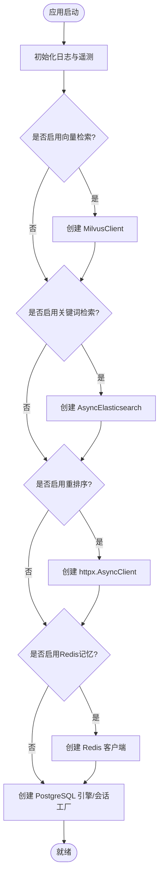
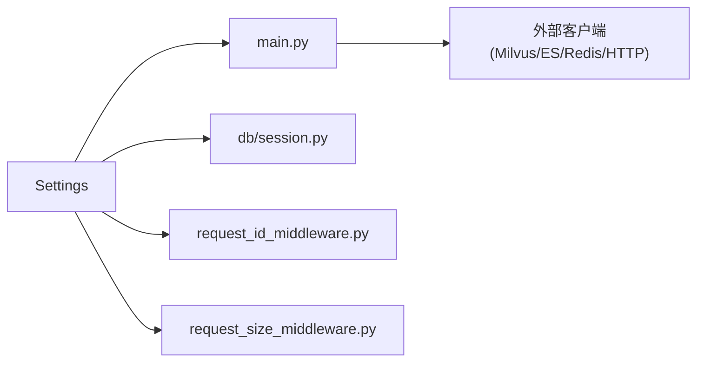

# 环境配置管理

<cite>
**本文引用的文件**
- [src/fast_app/core/config.py](file://src/fast_app/core/config.py)
- [src/fast_app/rag_eval/config.py](file://src/fast_app/rag_eval/config.py)
- [src/fast_app/main.py](file://src/fast_app/main.py)
- [src/fast_app/middlewares/request_id_middleware.py](file://src/fast_app/middlewares/request_id_middleware.py)
- [src/fast_app/middlewares/request_size_middleware.py](file://src/fast_app/middlewares/request_size_middleware.py)
- [src/fast_app/db/session.py](file://src/fast_app/db/session.py)
</cite>

## 目录
1. [简介](#简介)
2. [项目结构](#项目结构)
3. [核心组件](#核心组件)
4. [架构总览](#架构总览)
5. [详细组件分析](#详细组件分析)
6. [依赖关系分析](#依赖关系分析)
7. [性能与容量规划](#性能与容量规划)
8. [故障排查指南](#故障排查指南)
9. [结论](#结论)
10. [附录：环境变量清单与示例](#附录：环境变量清单与示例)

## 简介
本文件聚焦于项目的“环境配置管理”，围绕 Pydantic Settings 配置中心、环境变量管理、配置文件结构与安全配置展开，覆盖数据库连接、外部服务集成（Milvus、Elasticsearch、Redis、LLM API）、应用运行参数与中间件配置。文档同时给出开发、测试、生产环境的差异建议与安全最佳实践，并提供完整的配置示例与故障排查指引。

## 项目结构
本项目将配置集中在 Pydantic Settings 中，通过环境变量注入；应用启动时根据配置按需创建外部客户端（Milvus、Elasticsearch、Redis、HTTP 客户端）和数据库引擎，并通过中间件对请求进行限流与追踪。

图表来源
- [src/fast_app/core/config.py:18-800](file://src/fast_app/core/config.py#L18-L800)
- [src/fast_app/main.py:41-129](file://src/fast_app/main.py#L41-L129)
- [src/fast_app/db/session.py:11-33](file://src/fast_app/db/session.py#L11-L33)
- [src/fast_app/middlewares/request_id_middleware.py:19-98](file://src/fast_app/middlewares/request_id_middleware.py#L19-L98)
- [src/fast_app/middlewares/request_size_middleware.py:20-110](file://src/fast_app/middlewares/request_size_middleware.py#L20-L110)
- [src/fast_app/rag_eval/config.py:11-72](file://src/fast_app/rag_eval/config.py#L11-L72)

章节来源
- [src/fast_app/core/config.py:18-800](file://src/fast_app/core/config.py#L18-L800)
- [src/fast_app/main.py:41-129](file://src/fast_app/main.py#L41-L129)
- [src/fast_app/db/session.py:11-33](file://src/fast_app/db/session.py#L11-L33)
- [src/fast_app/middlewares/request_id_middleware.py:19-98](file://src/fast_app/middlewares/request_id_middleware.py#L19-L98)
- [src/fast_app/middlewares/request_size_middleware.py:20-110](file://src/fast_app/middlewares/request_size_middleware.py#L20-L110)
- [src/fast_app/rag_eval/config.py:11-72](file://src/fast_app/rag_eval/config.py#L11-L72)

## 核心组件
- 配置中心 Settings：基于 pydantic_settings.BaseSettings，统一从 .env 与环境变量加载，提供类型校验、默认值与约束。
- 应用生命周期：在 lifespan 中按配置初始化外部客户端与数据库连接，并在关闭时释放资源。
- 中间件：请求 ID 追踪与慢请求告警、请求体大小限制。
- 评测独立 Judge 配置：隔离的 LLM 凭据与超时重试策略，避免污染主模型配置。

章节来源
- [src/fast_app/core/config.py:18-800](file://src/fast_app/core/config.py#L18-L800)
- [src/fast_app/main.py:41-129](file://src/fast_app/main.py#L41-L129)
- [src/fast_app/middlewares/request_id_middleware.py:19-98](file://src/fast_app/middlewares/request_id_middleware.py#L19-L98)
- [src/fast_app/middlewares/request_size_middleware.py:20-110](file://src/fast_app/middlewares/request_size_middleware.py#L20-L110)
- [src/fast_app/rag_eval/config.py:11-72](file://src/fast_app/rag_eval/config.py#L11-L72)

## 架构总览
下图展示配置如何驱动应用启动与外部服务连接，以及中间件如何保护入口。

图表来源
- [src/fast_app/core/config.py:18-800](file://src/fast_app/core/config.py#L18-L800)
- [src/fast_app/main.py:41-129](file://src/fast_app/main.py#L41-L129)
- [src/fast_app/db/session.py:11-33](file://src/fast_app/db/session.py#L11-L33)
- [src/fast_app/middlewares/request_id_middleware.py:19-98](file://src/fast_app/middlewares/request_id_middleware.py#L19-L98)
- [src/fast_app/middlewares/request_size_middleware.py:20-110](file://src/fast_app/middlewares/request_size_middleware.py#L20-L110)

## 详细组件分析

### 配置中心 Settings（Pydantic Settings）
- 设计要点
  - 使用 BaseSettings 从 .env 与环境变量加载，字段具备默认值、别名、取值范围与描述。
  - 集中管理应用名、环境、调试开关、慢阈值、CORS、鉴权、JWT、Prompt Guard、LLM/Embedding/Rerank、Agent 循环与工具调用预算、多轮记忆、数据库、NL2SQL、网络搜索、计算工具、Ingestion、GitLab 集成等。
  - 提供 model_validator 用于跨字段一致性校验（例如上传大小限制）。
- 关键分组
  - 应用运行参数：app_name、app_env、debug、日志级别、慢阈值、CORS、最大请求体/上传大小。
  - 鉴权与安全：auth_enabled、JWT 密钥/算法/过期时间、API_KEY_PEPPER、Prompt Guard 开关与模式。
  - 外部服务：Milvus、Elasticsearch、Redis、LangSmith、LLM/Embedding/Rerank、Bocha 搜索、GitLab。
  - Agent 与 RAG：top_k、min_score、pipeline provider、max_steps、并行度、超时与重试、上下文扩展开关。
  - 数据持久化：PostgreSQL 连接池、NL2SQL 只读库映射、Deep Agent checkpoint 保留天数。
  - 评测快照：明文/脱敏/加密模式与保留天数、Key Ring JSON。
- 安全建议
  - 敏感字段使用 SecretStr 或 repr=False 隐藏打印。
  - 生产环境强制开启 auth_enabled，设置强 JWT_SECRET_KEY，限制 CORS。
  - 关闭 LangSmith 遥测或仅允许内部网络访问，禁止上传业务敏感数据。
  - Prompt Guard 在生产保持开启，严格阈值与最小化结构化输出方法。

章节来源
- [src/fast_app/core/config.py:18-800](file://src/fast_app/core/config.py#L18-L800)

### 应用生命周期与外部客户端初始化
- 启动流程
  - 读取 settings，初始化日志与 LangSmith。
  - 根据 vector_retriever_provider 创建 Milvus 客户端。
  - 根据 keyword_retriever_provider 创建 Elasticsearch 客户端。
  - 根据 reranker_provider 创建 httpx.AsyncClient。
  - 根据 memory_store_provider 创建 Redis 客户端。
  - 创建 PostgreSQL 异步引擎与会话工厂，并刷新 NL2SQL 数据集注册表。
  - 可选：启动 Deep Document Runtime（带加密 checkpoint）。
- 关闭流程
  - 依次关闭 Milvus、Elasticsearch、httpx、Redis、Deep Document Runtime、数据库引擎与注册表。

图表来源
- [src/fast_app/main.py:41-129](file://src/fast_app/main.py#L41-L129)

章节来源
- [src/fast_app/main.py:41-129](file://src/fast_app/main.py#L41-L129)

### 数据库连接配置（PostgreSQL）
- 配置项
  - database_url：异步连接串。
  - database_echo：是否打印 SQL。
  - database_pool_size / database_max_overflow：连接池大小与溢出。
- 实现
  - 使用 SQLAlchemy 异步引擎与 sessionmaker，配合 pool_pre_ping 提升健壮性。
- 建议
  - 生产环境使用只读副本进行查询，主库仅写。
  - 合理设置池大小与溢出，结合并发与连接数上限。

章节来源
- [src/fast_app/core/config.py:520-535](file://src/fast_app/core/config.py#L520-L535)
- [src/fast_app/db/session.py:11-33](file://src/fast_app/db/session.py#L11-L33)

### 外部服务集成配置
- Milvus（向量检索）
  - 通过 host/port 构建 URI，按需创建客户端。
  - 可配置 collection、向量字段、ID/内容字段名。
- Elasticsearch（关键词检索）
  - 通过 URL、用户名/密码连接，按需创建客户端。
  - 可配置 index 名称与请求超时。
- Redis（短期记忆）
  - 通过 redis_url 创建异步客户端，支持 TTL、消息窗口等。
- LLM/Embedding/Rerank
  - 支持 OpenAI 兼容接口、DashScope、本地 mock 等。
  - 独立 Router 配置，避免继承主凭据。
  - 统一的超时与重试控制。
- LangSmith（遥测）
  - 默认关闭，避免误传敏感数据。
- Bocha 搜索、计算工具、GitLab 集成
  - 均提供开关、超时、重试与大小限制等配置。

章节来源
- [src/fast_app/core/config.py:58-102](file://src/fast_app/core/config.py#L58-L102)
- [src/fast_app/core/config.py:230-284](file://src/fast_app/core/config.py#L230-L284)
- [src/fast_app/core/config.py:457-518](file://src/fast_app/core/config.py#L457-L518)
- [src/fast_app/core/config.py:568-595](file://src/fast_app/core/config.py#L568-L595)
- [src/fast_app/core/config.py:597-634](file://src/fast_app/core/config.py#L597-L634)
- [src/fast_app/core/config.py:637-797](file://src/fast_app/core/config.py#L637-L797)
- [src/fast_app/main.py:49-75](file://src/fast_app/main.py#L49-L75)

### 应用运行参数与中间件配置
- 运行参数
  - app_name、app_env、debug、日志级别、慢阈值、CORS、最大请求体/上传大小。
- 中间件
  - RequestIdMiddleware：生成/透传 request_id，记录耗时与慢请求告警。
  - RequestSizeLimitMiddleware：基于 Content-Length 快速拦截超大请求，区分普通与上传路径。
- 建议
  - 生产环境关闭 debug，收紧 CORS 白名单，设置合理的慢阈值与请求体上限。

章节来源
- [src/fast_app/core/config.py:25-52](file://src/fast_app/core/config.py#L25-L52)
- [src/fast_app/core/config.py:133-176](file://src/fast_app/core/config.py#L133-L176)
- [src/fast_app/middlewares/request_id_middleware.py:19-98](file://src/fast_app/middlewares/request_id_middleware.py#L19-L98)
- [src/fast_app/middlewares/request_size_middleware.py:20-110](file://src/fast_app/middlewares/request_size_middleware.py#L20-L110)
- [src/fast_app/main.py:138-154](file://src/fast_app/main.py#L138-L154)

### 评测独立 Judge 配置
- 目的：为评测 Judge 提供独立的 LLM 凭据与超时重试，避免与主模型共享凭据。
- 行为：仅从 RAG_EVAL_JUDGE_* 环境变量构造，缺失必填项会抛出错误。
- 建议：生产环境固定 temperature=0，限制 max_retries，确保评估稳定性。

章节来源
- [src/fast_app/rag_eval/config.py:11-72](file://src/fast_app/rag_eval/config.py#L11-L72)

## 依赖关系分析
- Settings 被 main、db.session、各模块消费，形成单一事实源。
- main 在生命周期内根据 Settings 动态装配客户端，降低耦合。
- 中间件依赖 Settings 中的阈值与头部常量，实现横切关注点。

图表来源
- [src/fast_app/core/config.py:18-800](file://src/fast_app/core/config.py#L18-L800)
- [src/fast_app/main.py:41-129](file://src/fast_app/main.py#L41-L129)
- [src/fast_app/db/session.py:11-33](file://src/fast_app/db/session.py#L11-L33)
- [src/fast_app/middlewares/request_id_middleware.py:19-98](file://src/fast_app/middlewares/request_id_middleware.py#L19-L98)
- [src/fast_app/middlewares/request_size_middleware.py:20-110](file://src/fast_app/middlewares/request_size_middleware.py#L20-L110)

章节来源
- [src/fast_app/core/config.py:18-800](file://src/fast_app/core/config.py#L18-L800)
- [src/fast_app/main.py:41-129](file://src/fast_app/main.py#L41-L129)
- [src/fast_app/db/session.py:11-33](file://src/fast_app/db/session.py#L11-L33)
- [src/fast_app/middlewares/request_id_middleware.py:19-98](file://src/fast_app/middlewares/request_id_middleware.py#L19-L98)
- [src/fast_app/middlewares/request_size_middleware.py:20-110](file://src/fast_app/middlewares/request_size_middleware.py#L20-L110)

## 性能与容量规划
- 连接池
  - PostgreSQL：根据并发与实例规格调整 pool_size 与 max_overflow，开启 pool_pre_ping。
  - Milvus/ES：合理设置超时与重试，避免雪崩。
- 超时与重试
  - LLM/Embedding/Rerank/ES/Milvus/Bocha 均提供超时与重试配置，生产建议保守重试次数，配合熔断/降级。
- 内存与缓存
  - Redis 作为短期记忆，设置合适的 TTL 与消息窗口，避免内存膨胀。
- 请求体限制
  - 通过 RequestSizeLimitMiddleware 限制普通与上传路径的请求体大小，防止恶意或异常大请求。
- 慢请求监控
  - 通过 RequestIdMiddleware 记录慢请求阈值，定位瓶颈。

[本节为通用指导，不直接分析具体文件]

## 故障排查指南
- 启动失败
  - 检查数据库连接串、凭证与网络连通性。
  - 确认 Milvus/ES/Redis 地址端口正确且可达。
  - 若未配置但启用了相应功能，需补齐环境变量。
- 鉴权与令牌
  - 生产务必开启 AUTH_ENABLED，设置强 JWT_SECRET_KEY，核对 JWT_ALGORITHM/AUDIENCE/ISSUER。
  - 若使用 Bearer Token，确认客户端携带 Authorization 头。
- 请求过大
  - 观察 413 响应与日志 REQUEST_BODY_TOO_LARGE，调整 MAX_REQUEST_BODY_BYTES 或优化上传策略。
- 慢请求与超时
  - 查看慢阈值日志与组件级慢操作日志，调整对应超时与重试。
- 评测失败
  - 检查 RAG_EVAL_JUDGE_* 环境变量是否齐全，temperature 与 timeout 是否合理。

章节来源
- [src/fast_app/middlewares/request_size_middleware.py:61-82](file://src/fast_app/middlewares/request_size_middleware.py#L61-L82)
- [src/fast_app/middlewares/request_id_middleware.py:40-91](file://src/fast_app/middlewares/request_id_middleware.py#L40-L91)
- [src/fast_app/core/config.py:138-176](file://src/fast_app/core/config.py#L138-L176)
- [src/fast_app/rag_eval/config.py:45-68](file://src/fast_app/rag_eval/config.py#L45-L68)

## 结论
本项目以 Pydantic Settings 为核心，实现了集中化、类型安全的环境配置管理。通过应用生命周期按需装配外部客户端与数据库连接，结合中间件完成请求追踪与安全防护。建议在开发、测试、生产环境中分层配置，遵循最小权限与默认安全原则，确保系统稳定与可观测。

[本节为总结，不直接分析具体文件]

## 附录：环境变量清单与示例
以下为常用环境变量分类与说明（键名来自 Settings 字段别名），请根据实际部署替换占位值。

- 应用与调试
  - APP_NAME、APP_ENV、DEBUG、LOG_LEVEL
  - SLOW_HTTP_REQUEST_THRESHOLD_MS、SLOW_RAG_PIPELINE_THRESHOLD_MS、SLOW_RETRIEVAL_THRESHOLD_MS、SLOW_RERANK_THRESHOLD_MS、SLOW_LLM_THRESHOLD_MS
- 鉴权与CORS
  - AUTH_ENABLED、AUTH_ALLOW_DEMO_USER_HEADER
  - JWT_SECRET_KEY、JWT_ALGORITHM、JWT_ISSUER、JWT_AUDIENCE、JWT_ACCESS_TOKEN_EXPIRE_MINUTES、JWT_REFRESH_TOKEN_EXPIRE_DAYS
  - CORS_ALLOW_ORIGINS
  - MAX_REQUEST_BODY_BYTES、MAX_UPLOAD_FILE_BYTES、MAX_UPLOAD_REQUEST_BODY_BYTES
- 向量与关键词检索
  - MILVUS_HOST、MILVUS_PORT、MILVUS_COLLECTION_NAME、MILVUS_VECTOR_FIELD、MILVUS_ID_FIELD、MILVUS_CONTENT_FIELD
  - ELASTICSEARCH_URL、ELASTICSEARCH_INDEX_NAME、ELASTICSEARCH_USERNAME、ELASTICSEARCH_PASSWORD、ELASTICSEARCH_REQUEST_TIMEOUT
- 短期记忆
  - MEMORY_STORE_PROVIDER、REDIS_URL、MEMORY_TTL_SECONDS、MEMORY_MAX_MESSAGES、MEMORY_HISTORY_MAX_TURNS
- LLM/Embedding/Rerank/Router
  - OPENAI_API_KEY、OPENAI_BASE_URL、LLM_MODEL_NAME、LLM_PROVIDER、LLM_TIMEOUT_SECONDS
  - EMBEDDING_PROVIDER、EMBEDDING_MODEL_NAME、EMBEDDING_DIM、EMBEDDING_TIMEOUT_SECONDS
  - RERANKER_PROVIDER、RERANK_MODEL_NAME、RERANK_TOP_K、RERANK_TIMEOUT_SECONDS
  - AGENT_ROUTER_API_KEY、AGENT_ROUTER_BASE_URL、AGENT_ROUTER_MODEL_NAME、AGENT_ROUTER_TEMPERATURE、AGENT_ROUTER_TIMEOUT_SECONDS、AGENT_ROUTER_MAX_RETRIES
- Agent 与 RAG
  - RAG_DEFAULT_TOP_K、RAG_DEFAULT_MIN_SCORE、RAG_USE_MOCK、RAG_PIPELINE_PROVIDER
  - AGENT_MAX_STEPS、AGENT_MAX_TOOL_CALLS、AGENT_MAX_PARALLEL_TOOL_CALLS
  - QUERY_REWRITE_ENABLED、QUERY_REWRITE_MODEL_NAME、QUERY_REWRITE_TEMPERATURE
  - PROMPT_GUARD_ENABLED、PROMPT_GUARD_MODE、PROMPT_GUARD_BLOCK_THRESHOLD、PROMPT_GUARD_STRUCTURED_OUTPUT_ENABLED
- 数据库与 NL2SQL
  - DATABASE_URL、DATABASE_ECHO、DATABASE_POOL_SIZE、DATABASE_MAX_OVERFLOW
  - NL2SQL_ENABLED、NL2SQL_DATABASE_URLS_JSON、NL2SQL_MODEL_NAME、NL2SQL_MODEL_TEMPERATURE、NL2SQL_MODEL_TIMEOUT_SECONDS、NL2SQL_DEFAULT_MAX_ROWS
- 其他外部服务
  - LANGSMITH_TRACING、LANGSMITH_API_KEY、LANGSMITH_ENDPOINT、LANGSMITH_PROJECT、LANGSMITH_TAGS、LANGSMITH_INCLUDE_SENSITIVE_DATA
  - BOCHA_API_KEY、BOCHA_WEB_SEARCH_URL、BOCHA_WEB_SEARCH_TIMEOUT_SECONDS
  - GITLAB_INTEGRATION_ENABLED、GITLAB_REQUEST_TIMEOUT_SECONDS、GITLAB_MAX_RETRIES、GITLAB_ARCHIVE_MAX_BYTES、GITLAB_SOURCE_FILE_MAX_BYTES
- Ingestion 与知识库
  - KNOWLEDGE_BASE_DIR、INGESTION_SOURCE_NAME、INGESTION_WRITE_MODE
  - MARKDOWN_CHUNK_MAX_CHARS、MARKDOWN_CHUNK_OVERLAP_CHARS、MARKDOWN_CHUNK_MAX_TOKENS、MARKDOWN_CHUNK_MIN_CHARS
  - RAG_PARENT_CONTEXT_MAX_TOKENS、RAG_PARENT_CONTEXT_MAX_PARENTS、RAG_PARENT_EXPANSION_ENABLED
- 评测快照与评测Judge
  - EVAL_SNAPSHOT_SECURITY_MODE、EVAL_SNAPSHOT_RETENTION_DAYS、EVAL_SNAPSHOT_ENCRYPTION_ACTIVE_KEY_ID、EVAL_SNAPSHOT_ENCRYPTION_KEYS_JSON
  - RAG_EVAL_JUDGE_API_KEY、RAG_EVAL_JUDGE_BASE_URL、RAG_EVAL_JUDGE_MODEL_NAME、RAG_EVAL_JUDGE_TEMPERATURE、RAG_EVAL_JUDGE_TIMEOUT_SECONDS、RAG_EVAL_JUDGE_MAX_RETRIES

[本节为配置参考，不直接分析具体文件]