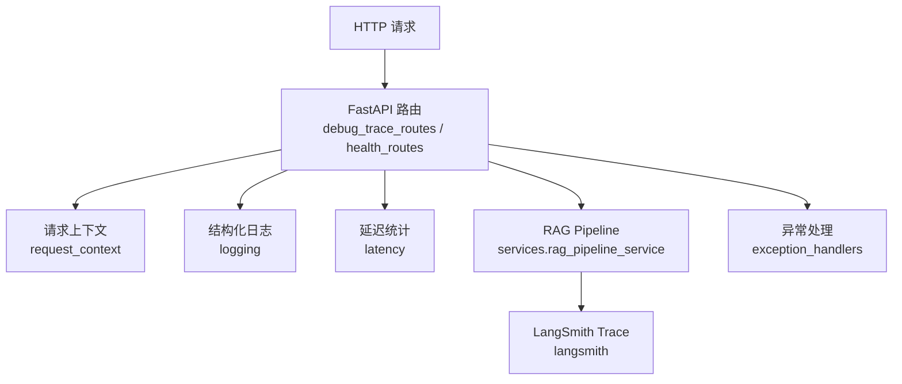
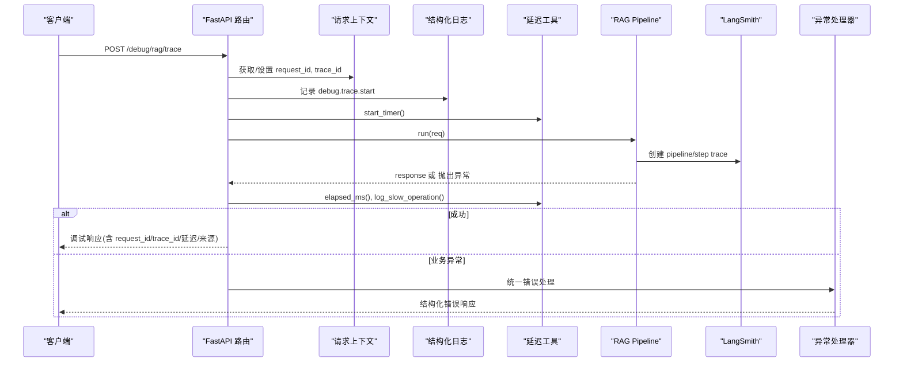
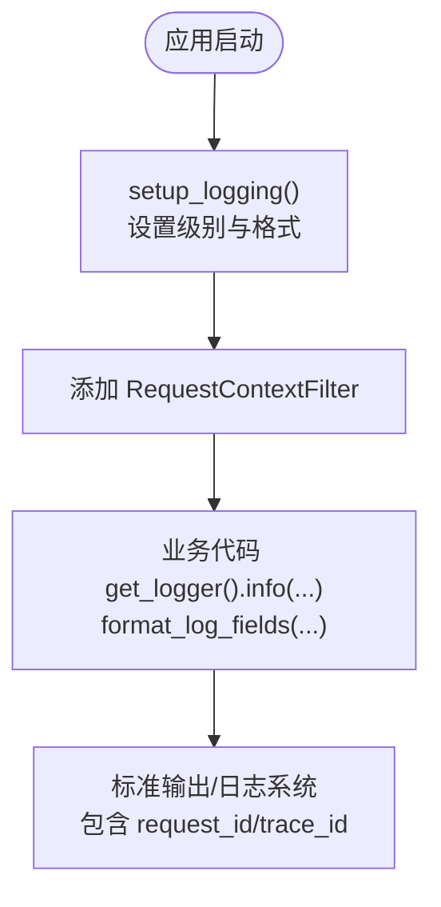
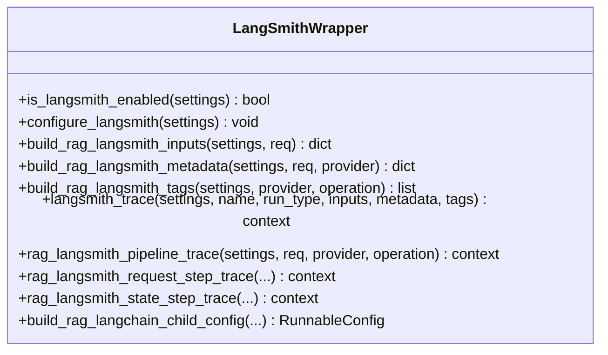
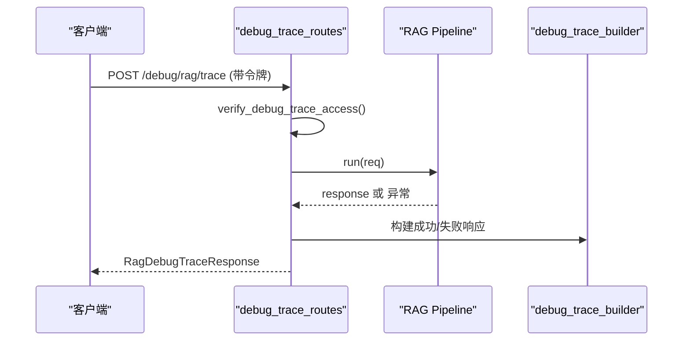
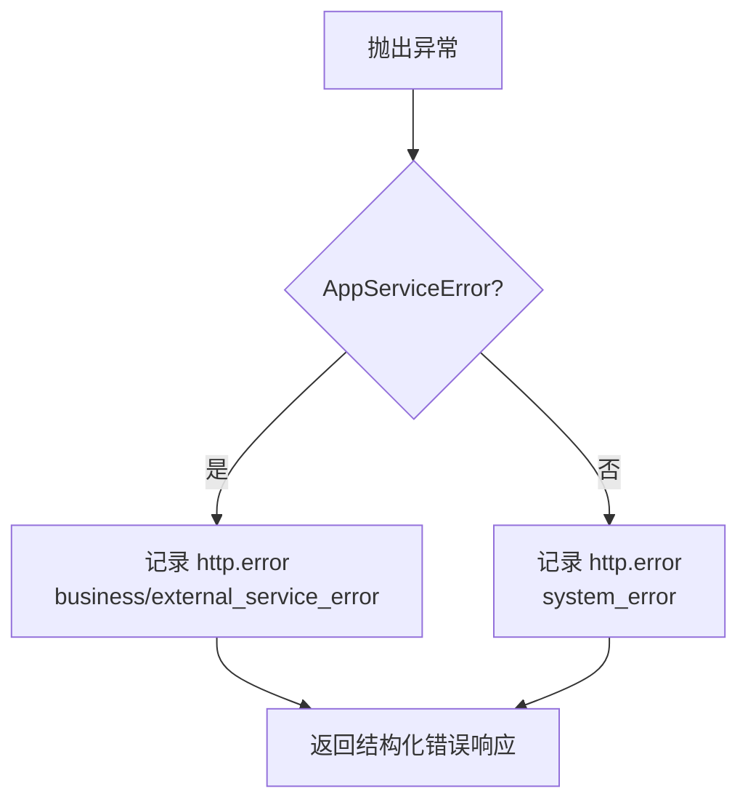
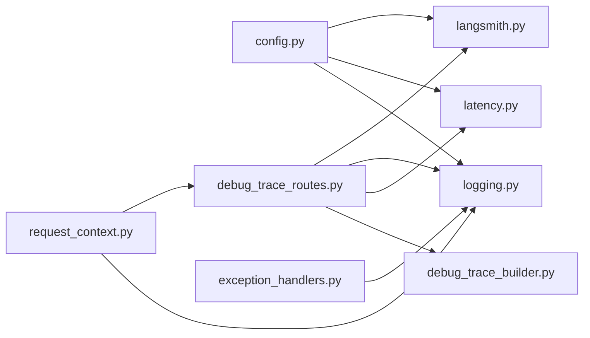

# 监控告警系统

<cite>
**本文引用的文件**
- [src/fast_app/core/langsmith.py](file://src/fast_app/core/langsmith.py)
- [src/fast_app/core/logging.py](file://src/fast_app/core/logging.py)
- [src/fast_app/core/latency.py](file://src/fast_app/core/latency.py)
- [src/fast_app/core/config.py](file://src/fast_app/core/config.py)
- [src/fast_app/core/request_context.py](file://src/fast_app/core/request_context.py)
- [src/fast_app/api/debug_trace_routes.py](file://src/fast_app/api/debug_trace_routes.py)
- [src/fast_app/api/health_routes.py](file://src/fast_app/api/health_routes.py)
- [src/fast_app/services/debug_trace_builder.py](file://src/fast_app/services/debug_trace_builder.py)
- [src/fast_app/core/exception_handlers.py](file://src/fast_app/core/exception_handlers.py)
</cite>

## 目录
1. [简介](#简介)
2. [项目结构](#项目结构)
3. [核心组件](#核心组件)
4. [架构总览](#架构总览)
5. [详细组件分析](#详细组件分析)
6. [依赖关系分析](#依赖关系分析)
7. [性能与指标](#性能与指标)
8. [故障诊断与排错](#故障诊断与排错)
9. [结论](#结论)
10. [附录：面板与告警建议](#附录面板与告警建议)

## 简介
本监控告警系统围绕“可观测性三要素”（日志、追踪、指标）构建，覆盖结构化日志配置、分布式追踪、错误追踪、性能指标收集、健康检查、LangSmith 集成、调试接口以及告警规则与通知渠道的落地建议。通过统一的 request_id 与 trace_id 贯穿请求链路，结合 LangSmith 的 pipeline/step 级 trace，形成从 HTTP 入口到 RAG 各步骤的端到端可观测能力。

## 项目结构
- 核心可观测性位于 fast_app/core：
  - 结构化日志：logging.py
  - 延迟与慢操作告警：latency.py
  - 上下文传播：request_context.py
  - 配置中心：config.py（包含日志级别、慢阈值、LangSmith 开关等）
  - 异常处理与统一错误响应：exception_handlers.py
- API 层：
  - 调试追踪接口：debug_trace_routes.py
  - 健康检查：health_routes.py
- 服务层：
  - 调试响应组装：debug_trace_builder.py
- 追踪集成：
  - LangSmith 封装：langsmith.py

**图表来源**
- [src/fast_app/api/debug_trace_routes.py:43-129](file://src/fast_app/api/debug_trace_routes.py#L43-L129)
- [src/fast_app/api/health_routes.py:7-11](file://src/fast_app/api/health_routes.py#L7-L11)
- [src/fast_app/core/request_context.py:1-39](file://src/fast_app/core/request_context.py#L1-L39)
- [src/fast_app/core/logging.py:59-76](file://src/fast_app/core/logging.py#L59-L76)
- [src/fast_app/core/latency.py:7-38](file://src/fast_app/core/latency.py#L7-L38)
- [src/fast_app/core/langsmith.py:34-80](file://src/fast_app/core/langsmith.py#L34-L80)
- [src/fast_app/core/exception_handlers.py:93-152](file://src/fast_app/core/exception_handlers.py#L93-L152)

**章节来源**
- [src/fast_app/core/logging.py:59-76](file://src/fast_app/core/logging.py#L59-L76)
- [src/fast_app/core/config.py:84-102](file://src/fast_app/core/config.py#L84-L102)
- [src/fast_app/core/request_context.py:1-39](file://src/fast_app/core/request_context.py#L1-L39)
- [src/fast_app/api/debug_trace_routes.py:43-129](file://src/fast_app/api/debug_trace_routes.py#L43-L129)
- [src/fast_app/api/health_routes.py:7-11](file://src/fast_app/api/health_routes.py#L7-L11)
- [src/fast_app/core/langsmith.py:34-80](file://src/fast_app/core/langsmith.py#L34-L80)
- [src/fast_app/core/exception_handlers.py:93-152](file://src/fast_app/core/exception_handlers.py#L93-L152)

## 核心组件
- 结构化日志
  - 基于 Python logging，注入 request_id 与 trace_id，统一输出格式，便于聚合与分析。
  - 提供 format_log_fields 将字段序列化为键值对字符串，兼容 JSON 聚合器。
- 分布式追踪
  - 使用 ContextVar 维护 request_id 与 trace_id，跨中间件、服务调用传递。
  - 与 LangSmith 集成，为 RAG pipeline 和 step 创建 trace，支持敏感字段脱敏与标签过滤。
- 性能指标与慢操作告警
  - 提供 start_timer/elapsed_ms/is_slow_latency/log_slow_operation，按配置阈值记录慢操作警告日志。
- 健康检查
  - 暴露 /health 端点，返回服务状态。
- 调试追踪接口
  - 受令牌保护的 /debug/rag/trace，执行 RAG 并返回请求快照、运行时信息、延迟与来源摘要，便于问题定位。
- 异常处理与错误追踪
  - 统一捕获业务异常与未预期异常，写入结构化错误日志，并返回带 request_id/trace_id 的错误响应。

**章节来源**
- [src/fast_app/core/logging.py:8-76](file://src/fast_app/core/logging.py#L8-L76)
- [src/fast_app/core/request_context.py:1-39](file://src/fast_app/core/request_context.py#L1-L39)
- [src/fast_app/core/latency.py:7-38](file://src/fast_app/core/latency.py#L7-L38)
- [src/fast_app/api/health_routes.py:7-11](file://src/fast_app/api/health_routes.py#L7-L11)
- [src/fast_app/api/debug_trace_routes.py:28-129](file://src/fast_app/api/debug_trace_routes.py#L28-L129)
- [src/fast_app/core/exception_handlers.py:93-152](file://src/fast_app/core/exception_handlers.py#L93-L152)

## 架构总览
下图展示一次 RAG 调试请求的完整可观测链路：从 HTTP 入口到 RAG 执行、LangSmith trace 写入、慢操作告警与错误处理。

**图表来源**
- [src/fast_app/api/debug_trace_routes.py:43-129](file://src/fast_app/api/debug_trace_routes.py#L43-L129)
- [src/fast_app/core/request_context.py:16-30](file://src/fast_app/core/request_context.py#L16-L30)
- [src/fast_app/core/logging.py:59-76](file://src/fast_app/core/logging.py#L59-L76)
- [src/fast_app/core/latency.py:7-38](file://src/fast_app/core/latency.py#L7-L38)
- [src/fast_app/core/langsmith.py:221-254](file://src/fast_app/core/langsmith.py#L221-L254)
- [src/fast_app/core/exception_handlers.py:93-152](file://src/fast_app/core/exception_handlers.py#L93-L152)

## 详细组件分析

### 结构化日志与上下文传播
- 日志初始化
  - 在应用启动时调用 setup_logging，设置日志级别与输出格式，自动注入 request_id 与 trace_id。
- 上下文传播
  - 通过 ContextVar 保存 request_id 与 trace_id，RequestContextFilter 在日志中附加这两个字段，便于跨模块追踪。
- 字段格式化
  - format_log_fields 将任意字段转为键值对字符串，兼容 JSON 聚合器，避免换行破坏日志行。

**图表来源**
- [src/fast_app/core/logging.py:59-76](file://src/fast_app/core/logging.py#L59-L76)
- [src/fast_app/core/logging.py:8-26](file://src/fast_app/core/logging.py#L8-L26)
- [src/fast_app/core/request_context.py:1-39](file://src/fast_app/core/request_context.py#L1-L39)

**章节来源**
- [src/fast_app/core/logging.py:8-76](file://src/fast_app/core/logging.py#L8-L76)
- [src/fast_app/core/request_context.py:1-39](file://src/fast_app/core/request_context.py#L1-L39)

### LangSmith 集成与分布式追踪
- 启用判断与环境同步
  - is_langsmith_enabled 同时检查 tracing 开关与 API Key；configure_langsmith 将 Settings 同步到环境变量，控制 SDK 行为。
- Trace 构造
  - build_rag_langsmith_inputs/metadata/tags 统一构造 pipeline root run 的输入、元数据与标签，支持敏感字段脱敏。
  - rag_langsmith_pipeline_trace 创建 pipeline 级 trace；step 级 trace 由 rag_langsmith_request_step_trace/rag_langsmith_state_step_trace 生成。
- 子调用上下文
  - build_rag_langchain_child_config/pipeline_child_config 将当前 step 上下文传递给 LangChain 子调用，保持父子 trace 关联。

**图表来源**
- [src/fast_app/core/langsmith.py:34-80](file://src/fast_app/core/langsmith.py#L34-L80)
- [src/fast_app/core/langsmith.py:83-218](file://src/fast_app/core/langsmith.py#L83-L218)
- [src/fast_app/core/langsmith.py:221-254](file://src/fast_app/core/langsmith.py#L221-L254)
- [src/fast_app/core/langsmith.py:257-319](file://src/fast_app/core/langsmith.py#L257-L319)
- [src/fast_app/core/langsmith.py:421-537](file://src/fast_app/core/langsmith.py#L421-L537)

**章节来源**
- [src/fast_app/core/langsmith.py:34-80](file://src/fast_app/core/langsmith.py#L34-L80)
- [src/fast_app/core/langsmith.py:83-218](file://src/fast_app/core/langsmith.py#L83-L218)
- [src/fast_app/core/langsmith.py:221-254](file://src/fast_app/core/langsmith.py#L221-L254)
- [src/fast_app/core/langsmith.py:257-319](file://src/fast_app/core/langsmith.py#L257-L319)
- [src/fast_app/core/langsmith.py:421-537](file://src/fast_app/core/langsmith.py#L421-L537)

### 调试追踪接口与响应组装
- 访问控制
  - verify_debug_trace_access 校验 DEBUG_TRACE_ENABLED 与 X-Debug-Trace-Token，防止未授权访问。
- 执行流程
  - 记录开始日志、执行 RAG、计算延迟、记录结束日志、触发慢操作告警。
- 响应组装
  - build_debug_success_response/build_debug_error_response 构造请求快照、运行时快照、延迟、来源摘要或错误信息。

**图表来源**
- [src/fast_app/api/debug_trace_routes.py:28-129](file://src/fast_app/api/debug_trace_routes.py#L28-L129)
- [src/fast_app/services/debug_trace_builder.py:14-104](file://src/fast_app/services/debug_trace_builder.py#L14-L104)

**章节来源**
- [src/fast_app/api/debug_trace_routes.py:28-129](file://src/fast_app/api/debug_trace_routes.py#L28-L129)
- [src/fast_app/services/debug_trace_builder.py:14-104](file://src/fast_app/services/debug_trace_builder.py#L14-L104)

### 健康检查
- /health 返回 {"status": "ok"}，用于探针与健康检查。

**章节来源**
- [src/fast_app/api/health_routes.py:7-11](file://src/fast_app/api/health_routes.py#L7-L11)

### 异常处理与错误追踪
- 业务异常
  - AppServiceError 被统一捕获，记录 http.error 事件，包含 error_category、error_code、path、method、status_code、error_type、message。
- 未预期异常
  - Exception 被捕获为 system_error，返回 500 并附带 request_id/trace_id。

**图表来源**
- [src/fast_app/core/exception_handlers.py:93-152](file://src/fast_app/core/exception_handlers.py#L93-L152)

**章节来源**
- [src/fast_app/core/exception_handlers.py:93-152](file://src/fast_app/core/exception_handlers.py#L93-L152)

## 依赖关系分析
- 配置驱动的可观测性
  - config.py 提供日志级别、慢阈值、LangSmith 开关与项目名等关键配置项，影响日志、追踪与告警行为。
- 组件耦合
  - debug_trace_routes 依赖 latency、logging、request_context、services.debug_trace_builder 与 RAG Pipeline。
  - langsmith.py 依赖 config、logging、request_context 与 schemas。
  - exception_handlers 依赖 logging、request_context 与错误响应构建逻辑。

**图表来源**
- [src/fast_app/core/config.py:84-102](file://src/fast_app/core/config.py#L84-L102)
- [src/fast_app/core/logging.py:59-76](file://src/fast_app/core/logging.py#L59-L76)
- [src/fast_app/core/latency.py:7-38](file://src/fast_app/core/latency.py#L7-L38)
- [src/fast_app/core/request_context.py:1-39](file://src/fast_app/core/request_context.py#L1-L39)
- [src/fast_app/api/debug_trace_routes.py:43-129](file://src/fast_app/api/debug_trace_routes.py#L43-L129)
- [src/fast_app/services/debug_trace_builder.py:14-104](file://src/fast_app/services/debug_trace_builder.py#L14-L104)
- [src/fast_app/core/langsmith.py:34-80](file://src/fast_app/core/langsmith.py#L34-L80)
- [src/fast_app/core/exception_handlers.py:93-152](file://src/fast_app/core/exception_handlers.py#L93-L152)

**章节来源**
- [src/fast_app/core/config.py:84-102](file://src/fast_app/core/config.py#L84-L102)
- [src/fast_app/api/debug_trace_routes.py:43-129](file://src/fast_app/api/debug_trace_routes.py#L43-L129)
- [src/fast_app/core/langsmith.py:34-80](file://src/fast_app/core/langsmith.py#L34-L80)
- [src/fast_app/core/exception_handlers.py:93-152](file://src/fast_app/core/exception_handlers.py#L93-L152)

## 性能与指标
- 延迟测量
  - start_timer/elapsed_ms 提供高精度计时；log_slow_operation 根据阈值输出慢操作警告日志。
- 慢阈值配置
  - config.py 定义 slow_http_request_threshold_ms、slow_rag_pipeline_threshold_ms、slow_retrieval/rerank/llm_threshold_ms 等，可按场景调优。
- 指标采集建议
  - 将慢操作日志作为指标源，接入 Prometheus/Grafana 或日志平台进行计数与时序分析。
  - 在 LangSmith 中按 tags（如 pipeline、operation、step）分组查看耗时分布与错误率。

**章节来源**
- [src/fast_app/core/latency.py:7-38](file://src/fast_app/core/latency.py#L7-L38)
- [src/fast_app/core/config.py:33-52](file://src/fast_app/core/config.py#L33-L52)

## 故障诊断与排错
- 快速定位
  - 使用 /debug/rag/trace 接口，携带 X-Debug-Trace-Token，获取请求快照、运行时配置、延迟与来源摘要，快速复现与对比。
- 日志排查
  - 通过 request_id/trace_id 在日志系统中检索全链路日志；关注 http.error、debug.trace.*、slow_operation 事件。
- 错误分类
  - 业务异常：error_category 为 external_service_error 或 business_error，优先检查外部依赖与参数。
  - 系统异常：error_category 为 system_error，检查堆栈与资源占用。
- 健康检查
  - /health 返回 ok 表示服务进程存活；若持续失败，检查依赖服务（数据库、向量库、LLM、Elasticsearch）。

**章节来源**
- [src/fast_app/api/debug_trace_routes.py:28-129](file://src/fast_app/api/debug_trace_routes.py#L28-L129)
- [src/fast_app/core/exception_handlers.py:93-152](file://src/fast_app/core/exception_handlers.py#L93-L152)
- [src/fast_app/api/health_routes.py:7-11](file://src/fast_app/api/health_routes.py#L7-L11)

## 结论
本系统以结构化日志、分布式追踪与延迟告警为核心，结合 LangSmith 的 pipeline/step 级 trace，实现了 RAG 链路的端到端可观测性。通过统一的 request_id/trace_id、可调阈值与调试接口，能够快速定位问题、评估性能并支撑告警策略落地。建议在生产环境开启 LangSmith 追踪、配置合适的慢阈值，并将日志与追踪数据接入统一平台，形成完整的监控面板与告警闭环。

## 附录：面板与告警建议
- 日志聚合分析
  - 关键字段：event、request_id、trace_id、error_category、error_code、latency_ms、threshold_ms、pipeline_provider、operation、step_name。
  - 推荐索引：按 event 与时间分片，建立 request_id/trace_id 的全文索引以便快速检索。
- APM 工具集成
  - 将 LangSmith 作为 APM 前端，使用 tags（pipeline、operation、step、env）进行过滤与分组；结合本地日志中的 request_id/trace_id 做交叉验证。
- 自定义指标定义
  - 慢操作计数：slow_operation(event=...)
  - 错误率：http.error(error_category=...)
  - 调试接口调用量：debug.trace.*
- 告警规则建议
  - 慢 RAG 管道：当 latency_ms >= slow_rag_pipeline_threshold_ms 且频率突增时触发。
  - 高错误率：http.error 的 system_error 比例超过阈值时触发。
  - 外部服务错误：external_service_error 频繁出现时触发，提示下游依赖异常。
- 通知渠道
  - 企业微信/钉钉/邮件/短信：根据告警级别选择不同通道；严重错误即时通知，慢操作与趋势变化定时汇总。
- 监控面板配置要点
  - 概览：QPS、错误率、平均/分位延迟、慢操作占比。
  - 链路：按 pipeline/operation/step 维度查看耗时与错误分布。
  - 调试：最近 N 次 /debug/rag/trace 结果与典型错误样例。

[本节为通用实践建议，不直接分析具体文件]