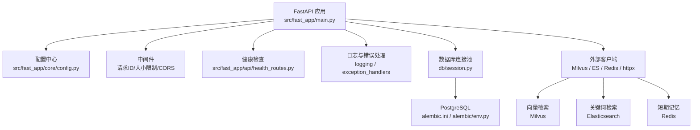
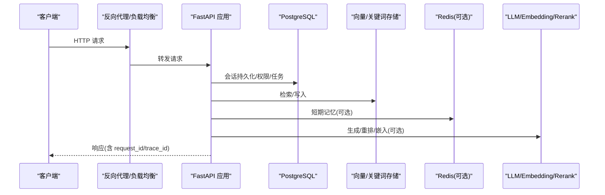
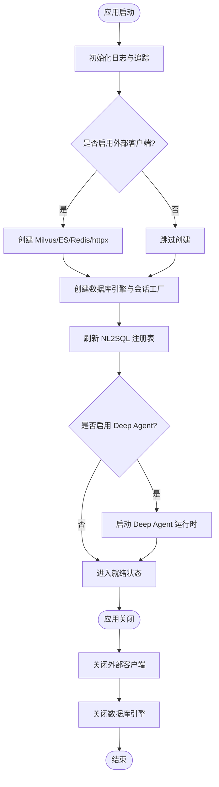
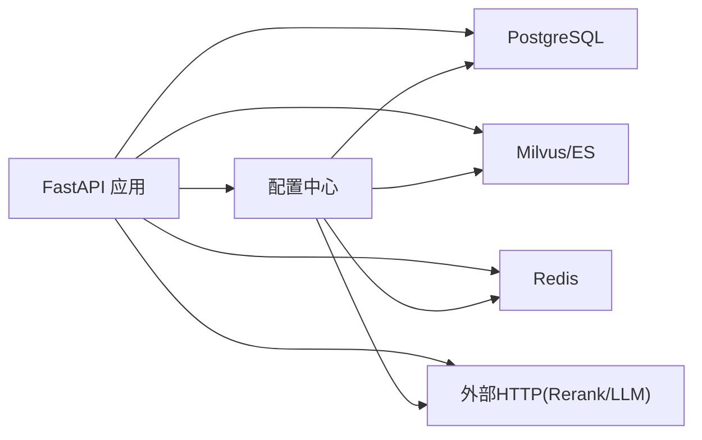

# 部署与运维

<cite>
**本文引用的文件**
- [src/fast_app/core/config.py](file://src/fast_app/core/config.py)
- [src/fast_app/main.py](file://src/fast_app/main.py)
- [alembic.ini](file://alembic.ini)
- [alembic/env.py](file://alembic/env.py)
- [src/fast_app/db/session.py](file://src/fast_app/db/session.py)
- [requirements.txt](file://requirements.txt)
- [src/fast_app/api/health_routes.py](file://src/fast_app/api/health_routes.py)
- [src/fast_app/core/logging.py](file://src/fast_app/core/logging.py)
- [src/fast_app/middlewares/request_id_middleware.py](file://src/fast_app/middlewares/request_id_middleware.py)
- [src/fast_app/core/exception_handlers.py](file://src/fast_app/core/exception_handlers.py)
- [src/fast_app/services/auth/jwt_service.py](file://src/fast_app/services/auth/jwt_service.py)
- [src/fast_app/components/retrievers/milvus_vector_retriever.py](file://src/fast_app/components/retrievers/milvus_vector_retriever.py)
</cite>

## 目录
1. [简介](#简介)
2. [项目结构](#项目结构)
3. [核心组件](#核心组件)
4. [架构总览](#架构总览)
5. [详细组件分析](#详细组件分析)
6. [依赖关系分析](#依赖关系分析)
7. [性能考虑](#性能考虑)
8. [故障排查指南](#故障排查指南)
9. [结论](#结论)
10. [附录](#附录)

## 简介
本指南面向生产环境的部署与运维，覆盖环境变量配置、服务启动、数据库初始化、外部服务集成、监控告警、安全加固、性能调优、备份恢复、升级维护与回滚策略。系统基于 FastAPI 构建，使用异步 PostgreSQL（asyncpg）、可选 Milvus/Elasticsearch 检索、Redis 短期记忆、LangSmith 追踪，以及可插拔的 LLM/Embedding/Rerank 提供者。所有关键运行参数通过 Settings 集中管理，支持 .env 与环境变量注入。

## 项目结构
- 应用入口与生命周期：FastAPI 在 lifespan 中创建并关闭外部客户端、数据库引擎、NL2SQL 数据集注册表等。
- 配置中心：Settings 集中定义全部环境变量与默认值，提供校验与类型转换。
- 数据层：Alembic 迁移 + SQLAlchemy 异步 Engine/Session；迁移脚本通过 env.py 读取 Settings 中的数据库 URL。
- 中间件：CORS、请求大小限制、请求 ID 与慢请求日志。
- 健康检查：/health 返回基础状态。
- 日志与错误：统一日志格式、请求上下文过滤、异常分类与响应结构。

**图表来源**
- [src/fast_app/main.py:41-129](file://src/fast_app/main.py#L41-L129)
- [src/fast_app/core/config.py:18-800](file://src/fast_app/core/config.py#L18-L800)
- [alembic/env.py:26-83](file://alembic/env.py#L26-L83)
- [src/fast_app/db/session.py:11-32](file://src/fast_app/db/session.py#L11-L32)

**章节来源**
- [src/fast_app/main.py:1-170](file://src/fast_app/main.py#L1-L170)
- [src/fast_app/core/config.py:18-800](file://src/fast_app/core/config.py#L18-L800)
- [alembic/env.py:26-83](file://alembic/env.py#L26-L83)
- [src/fast_app/db/session.py:11-32](file://src/fast_app/db/session.py#L11-L32)

## 核心组件
- 配置中心（Settings）：集中管理 APP_NAME、APP_ENV、DEBUG、LOG_LEVEL、鉴权开关、JWT、RAG、LLM/Embedding/Rerank、Milvus、Elasticsearch、Redis、NL2SQL、Ingestion、Agent 行为、超时重试等。
- 应用生命周期（lifespan）：按配置按需创建 Milvus/ES/Redis/httpx 客户端、数据库引擎、NL2SQL 注册表、Deep Agent 运行时；在退出时统一关闭资源。
- 数据库层：异步 Engine/Session，Alembic 迁移在线/离线模式。
- 中间件：CORS、请求体大小限制、请求 ID 与慢请求告警。
- 健康检查：/health 用于就绪探针。
- 日志与错误：结构化日志、请求上下文、异常分类与统一响应。

**章节来源**
- [src/fast_app/core/config.py:18-800](file://src/fast_app/core/config.py#L18-L800)
- [src/fast_app/main.py:41-129](file://src/fast_app/main.py#L41-L129)
- [alembic/env.py:26-83](file://alembic/env.py#L26-L83)
- [src/fast_app/db/session.py:11-32](file://src/fast_app/db/session.py#L11-L32)
- [src/fast_app/api/health_routes.py:7-11](file://src/fast_app/api/health_routes.py#L7-L11)
- [src/fast_app/core/logging.py:59-76](file://src/fast_app/core/logging.py#L59-L76)
- [src/fast_app/middlewares/request_id_middleware.py:41-76](file://src/fast_app/middlewares/request_id_middleware.py#L41-L76)
- [src/fast_app/core/exception_handlers.py:93-152](file://src/fast_app/core/exception_handlers.py#L93-L152)

## 架构总览
系统在启动时根据配置动态装配外部依赖，形成“应用-中间件-路由-服务-存储”的分层调用链。生产环境建议将应用置于反向代理之后，配合容器编排与健康检查实现负载均衡与弹性伸缩。

**图表来源**
- [src/fast_app/main.py:41-129](file://src/fast_app/main.py#L41-L129)
- [src/fast_app/core/config.py:18-800](file://src/fast_app/core/config.py#L18-L800)

## 详细组件分析

### 环境变量与配置管理
- 配置文件位置与加载顺序：Settings 从 .env 与环境变量加载，字段带别名与默认值，支持范围校验与模型级验证。
- 关键配置类别：
  - 应用与日志：APP_NAME、APP_ENV、DEBUG、LOG_LEVEL、慢请求阈值。
  - 鉴权与安全：AUTH_ENABLED、JWT_*、API_KEY_PEPPER、CORS_ALLOW_ORIGINS、MAX_REQUEST_BODY_BYTES、MAX_UPLOAD_*_BYTES。
  - RAG 与检索：RAG_DEFAULT_TOP_K、VECTOR_RETRIEVER_PROVIDER、KEYWORD_RETRIEVER_PROVIDER、MILVUS_*、ELASTICSEARCH_*。
  - LLM/Embedding/Rerank：LLM_MODEL_NAME、EMBEDDING_*、RERANK_*、超时与重试。
  - 数据库：DATABASE_URL、DATABASE_POOL_SIZE、DATABASE_MAX_OVERFLOW、DATABASE_ECHO。
  - 短期记忆：MEMORY_STORE_PROVIDER、REDIS_URL、MEMORY_TTL_SECONDS、MEMORY_MAX_MESSAGES。
  - NL2SQL：NL2SQL_ENABLED、NL2SQL_DATABASE_URLS_JSON、模型与超时。
  - Ingestion/GitLab：知识库目录、分块策略、GitLab 集成开关与 Worker 参数。
  - LangSmith：追踪开关、密钥、端点、项目、标签与敏感数据开关。
- 生产建议：
  - 严格区分开发/测试/生产环境变量，禁止提交 .env。
  - 对 JWT_SECRET_KEY、API_KEY_PEPPER、数据库凭据等敏感项使用密钥管理服务或平台 Secret。
  - CORS 仅放行受信任域名；开启 AUTH_ENABLED 并配置 JWT。
  - 合理设置 MAX_REQUEST_BODY_BYTES/MAX_UPLOAD_*_BYTES 防止超大请求。
  - 为外部调用设置合理的超时与重试上限，避免雪崩。

**章节来源**
- [src/fast_app/core/config.py:18-800](file://src/fast_app/core/config.py#L18-L800)

### 服务启动与生命周期
- 启动流程要点：
  - 初始化日志与 LangSmith 追踪。
  - 根据 PROVIDER 创建 Milvus/ES/Redis/httpx 客户端。
  - 创建 PostgreSQL 异步 Engine 与 SessionFactory。
  - 刷新 NL2SQL Dataset 注册表。
  - 可选启动 Deep Agent 运行时（加密 checkpoint）。
  - 优雅关闭：依次关闭各客户端与连接池。
- 生产建议：
  - 使用进程管理器（如 systemd/supervisor）或容器编排管理生命周期。
  - 结合健康检查接口进行就绪探测。
  - 确保外部依赖可用后再暴露服务端口。

**图表来源**
- [src/fast_app/main.py:41-129](file://src/fast_app/main.py#L41-L129)

**章节来源**
- [src/fast_app/main.py:41-129](file://src/fast_app/main.py#L41-L129)

### 数据库初始化与迁移
- Alembic 配置：
  - 脚本目录与 Python 路径已在 alembic.ini 中配置。
  - 迁移目标元数据由 Base.metadata 提供。
  - env.py 通过 Settings 注入 DATABASE_URL，并支持在线/离线迁移。
- 生产步骤：
  - 准备 PostgreSQL 实例与数据库。
  - 设置 DATABASE_URL 指向生产库。
  - 执行迁移：在线模式自动执行迁移脚本；离线模式仅生成 SQL。
  - 验证表结构与索引是否符合预期。
- 注意事项：
  - 迁移期间避免并发写操作。
  - 大表变更建议在低峰期执行，并评估锁等待与超时。
  - 记录迁移版本与回滚方案。

**章节来源**
- [alembic.ini:1-42](file://alembic.ini#L1-L42)
- [alembic/env.py:26-83](file://alembic/env.py#L26-L83)
- [src/fast_app/db/session.py:11-32](file://src/fast_app/db/session.py#L11-L32)

### 外部服务集成
- Milvus（向量检索）：
  - 通过 provider 控制是否创建客户端；URI 由工具函数组装。
  - 生产需配置集合名、向量字段、内容字段等。
- Elasticsearch（关键词检索）：
  - 通过 provider 控制是否创建客户端；URL、索引名、认证信息来自配置。
- Redis（短期记忆）：
  - 通过 provider 控制是否创建客户端；TTL 与消息上限可调。
- LLM/Embedding/Rerank：
  - 通过对应 PROVIDER 与模型名称、温度、超时等参数切换提供商。
  - 注意外部调用重试与超时，避免阻塞主链路。
- NL2SQL：
  - 通过 JSON 映射多只读数据库 URL，按 dataset_key 查找。
  - 建议在生产启用白名单与最小权限账号。

**章节来源**
- [src/fast_app/main.py:49-83](file://src/fast_app/main.py#L49-L83)
- [src/fast_app/core/config.py:58-131](file://src/fast_app/core/config.py#L58-L131)
- [src/fast_app/core/config.py:597-634](file://src/fast_app/core/config.py#L597-L634)
- [src/fast_app/core/config.py:520-567](file://src/fast_app/core/config.py#L520-L567)
- [src/fast_app/components/retrievers/milvus_vector_retriever.py](file://src/fast_app/components/retrievers/milvus_vector_retriever.py)

### 监控与告警
- 日志：
  - 统一日志格式包含 request_id、trace_id、事件、延迟等。
  - 慢请求/慢检索/慢 LLM 等阈值可通过配置调整。
- 健康检查：
  - /health 返回基础状态，可用于存活/就绪探针。
- 追踪：
  - LangSmith 追踪可开关，生产建议开启并配置项目与标签。
- 告警建议：
  - 基于日志关键字（http.error、slow_operation）建立告警规则。
  - 关注外部服务错误比例、P95/P99 延迟、错误率突增。
  - 对数据库连接池耗尽、外部调用超时激增设置阈值告警。

**章节来源**
- [src/fast_app/core/logging.py:59-76](file://src/fast_app/core/logging.py#L59-L76)
- [src/fast_app/middlewares/request_id_middleware.py:41-76](file://src/fast_app/middlewares/request_id_middleware.py#L41-L76)
- [src/fast_app/api/health_routes.py:7-11](file://src/fast_app/api/health_routes.py#L7-L11)
- [src/fast_app/core/config.py:25-52](file://src/fast_app/core/config.py#L25-L52)

### 安全加固
- 鉴权：
  - 开启 AUTH_ENABLED 并配置 JWT 密钥、算法、签发者、受众与过期时间。
  - API Key 支持 pepper 加盐与常量时间比较，降低侧信道风险。
- 输入防护：
  - 限制请求体与上传文件大小，防止资源耗尽。
  - Prompt Guard 可开启规则检测与 LLM 分类，保护检索文档与输出。
- 网络与跨域：
  - 收紧 CORS 白名单，仅允许受信任来源。
- 敏感数据：
  - LangSmith 追踪默认不上传业务敏感数据，可按需开启。
  - 评测快照支持脱敏或加密模式，生产建议使用 redacted/encrypted。
- 最小权限：
  - 数据库账号使用只读最小权限；NL2SQL 通过白名单映射访问。

**章节来源**
- [src/fast_app/core/config.py:133-228](file://src/fast_app/core/config.py#L133-L228)
- [src/fast_app/core/config.py:138-176](file://src/fast_app/core/config.py#L138-L176)
- [src/fast_app/services/auth/jwt_service.py:63-88](file://src/fast_app/services/auth/jwt_service.py#L63-L88)

### 性能调优
- 数据库连接池：
  - 调整 pool_size 与 max_overflow，结合负载压测确定最佳值。
  - 开启 pool_pre_ping 提升连接健壮性。
- 外部调用：
  - 设置合理的超时与最大重试次数，避免级联失败。
  - 对高延迟组件（LLM/Embedding/Rerank）设置独立超时。
- 检索与重排：
  - top_k、min_score、rerank_top_k 影响召回质量与延迟，需平衡。
- 内存与流式：
  - 短期记忆 TTL 与消息上限控制内存占用。
  - 流式输出可降低首字节延迟。
- 慢操作观测：
  - 通过慢请求/慢检索/慢 LLM 阈值定位瓶颈。

**章节来源**
- [src/fast_app/db/session.py:11-32](file://src/fast_app/db/session.py#L11-L32)
- [src/fast_app/core/config.py:520-634](file://src/fast_app/core/config.py#L520-L634)
- [src/fast_app/middlewares/request_id_middleware.py:41-76](file://src/fast_app/middlewares/request_id_middleware.py#L41-L76)

### 备份与恢复
- 数据库：
  - 定期全量+增量备份 PostgreSQL；保留足够历史版本。
  - 迁移前务必备份，并在预生产验证回滚脚本。
- 向量/关键词存储：
  - 对 Milvus collection 与 ES index 制定导出/重建策略。
  - 索引重建期间做好流量切换与降级。
- 短期记忆：
  - Redis 数据可丢失，但需保证 TTL 与容量规划。
- 任务与检查点：
  - Deep Agent 的 checkpoint 与运行事实持久化到 PostgreSQL，支持断点恢复。
  - 恢复时需校验 ACL 指纹与源文件一致性，再从中断节点继续。

**章节来源**
- [src/fast_app/services/agent_tasks/deep_document_runtime.py:1-24](file://src/fast_app/services/agent_tasks/deep_document_runtime.py#L1-L24)

### 升级与维护
- 灰度发布：
  - 先扩容新实例，逐步切流，观察健康检查与错误率。
- 滚动更新：
  - 逐实例重启，确保外部依赖可用；失败立即回滚。
- 回滚策略：
  - 镜像回退到上一稳定版本；必要时回滚数据库迁移（谨慎）。
  - 若涉及索引重建，优先回滚到旧索引版本。
- 维护窗口：
  - 迁移与重建索引安排在低峰期；提前通知相关方。

[本节为通用运维实践，不直接引用具体代码文件]

## 依赖关系分析
- 应用依赖：
  - FastAPI、Starlette、Uvicorn 作为 Web 框架与服务器。
  - Pydantic/Pydantic Settings 负责配置校验。
  - asyncpg/SQLAlchemy 提供异步数据库访问。
  - Alembic 管理数据库迁移。
  - pymilvus/elasticsearch/redis 作为可选外部存储。
  - httpx 用于外部 HTTP 调用（如 Rerank）。
  - LangChain/LangGraph/LangSmith 用于 Agent 与追踪。
- 依赖耦合：
  - main.py 在 lifespan 中集中装配依赖，降低模块间耦合。
  - config.py 集中暴露所有外部依赖开关与参数，便于环境隔离。
- 潜在风险：
  - 外部依赖不可用会导致服务降级或报错，需配置超时与重试。
  - 数据库连接池不足会引发请求排队与超时。

**图表来源**
- [src/fast_app/main.py:41-129](file://src/fast_app/main.py#L41-L129)
- [src/fast_app/core/config.py:18-800](file://src/fast_app/core/config.py#L18-L800)
- [requirements.txt:1-111](file://requirements.txt#L1-L111)

**章节来源**
- [requirements.txt:1-111](file://requirements.txt#L1-L111)
- [src/fast_app/main.py:41-129](file://src/fast_app/main.py#L41-L129)
- [src/fast_app/core/config.py:18-800](file://src/fast_app/core/config.py#L18-L800)

## 性能考虑
- 连接池与超时：
  - 根据 QPS 与 P95 延迟调整数据库连接池大小与外部调用超时。
- 检索优化：
  - 合理设置 top_k、min_score、rerank_top_k，减少不必要计算。
- 缓存与记忆：
  - 短期记忆 TTL 与消息上限控制内存；避免过长上下文导致延迟上升。
- 慢操作观测：
  - 利用慢请求/慢检索/慢 LLM 阈值定位瓶颈，持续优化。
- 资源隔离：
  - 将 LLM/Embedding/Rerank 与检索链路解耦，避免相互影响。

[本节为通用性能指导，不直接引用具体代码文件]

## 故障排查指南
- 常见问题定位：
  - 健康检查失败：检查 /health 与外部依赖连通性。
  - 数据库连接失败：核对 DATABASE_URL、连接池配置与网络策略。
  - 外部服务错误：查看日志中的 error_category 与 error_code，确认超时与重试。
  - 慢请求/慢检索：根据阈值日志定位瓶颈组件。
- 错误分类与响应：
  - user_error：客户端请求问题，通常 4xx。
  - external_service_error：外部依赖失败，需重点记录 provider/operation/latency。
  - system_error：未预期异常，返回 500 并记录堆栈。
- 恢复策略：
  - 外部服务短暂失败：启用重试与降级。
  - 数据库迁移失败：回滚迁移并恢复备份。
  - 索引损坏：重建索引并切换流量。

**章节来源**
- [src/fast_app/core/exception_handlers.py:93-152](file://src/fast_app/core/exception_handlers.py#L93-L152)
- [src/fast_app/middlewares/request_id_middleware.py:41-76](file://src/fast_app/middlewares/request_id_middleware.py#L41-L76)
- [src/fast_app/api/health_routes.py:7-11](file://src/fast_app/api/health_routes.py#L7-L11)

## 结论
本指南基于代码实际实现，提供了生产环境部署与运维的系统化方法。通过集中配置、分层中间件、统一日志与错误处理、可插拔外部依赖与健壮的数据库迁移机制，系统具备可扩展、可观测、可恢复的生产能力。建议在生产环境中严格遵循安全加固、性能调优与备份恢复策略，并结合监控告警实现闭环运维。

[本节为总结性内容，不直接引用具体代码文件]

## 附录
- 环境变量清单（节选）：
  - 应用与日志：APP_NAME、APP_ENV、DEBUG、LOG_LEVEL、SLOW_HTTP_REQUEST_THRESHOLD_MS。
  - 鉴权：AUTH_ENABLED、JWT_SECRET_KEY、JWT_ALGORITHM、JWT_ISSUER、JWT_AUDIENCE、JWT_ACCESS_TOKEN_EXPIRE_MINUTES、JWT_REFRESH_TOKEN_EXPIRE_DAYS、API_KEY_PEPPER。
  - 输入限制：MAX_REQUEST_BODY_BYTES、MAX_UPLOAD_FILE_BYTES、MAX_UPLOAD_REQUEST_BODY_BYTES。
  - RAG：RAG_DEFAULT_TOP_K、RAG_DEFAULT_MIN_SCORE、RAG_USE_MOCK、RAG_PIPELINE_PROVIDER。
  - 检索：VECTOR_RETRIEVER_PROVIDER、KEYWORD_RETRIEVER_PROVIDER、MILVUS_HOST、MILVUS_PORT、MILVUS_COLLECTION_NAME、ELASTICSEARCH_URL、ELASTICSEARCH_INDEX_NAME。
  - LLM/Embedding/Rerank：LLM_MODEL_NAME、EMBEDDING_PROVIDER、EMBEDDING_MODEL_NAME、EMBEDDING_DIM、RERANKER_PROVIDER、RERANK_MODEL_NAME、RERANK_TOP_K。
  - 数据库：DATABASE_URL、DATABASE_POOL_SIZE、DATABASE_MAX_OVERFLOW、DATABASE_ECHO。
  - 短期记忆：MEMORY_STORE_PROVIDER、REDIS_URL、MEMORY_TTL_SECONDS、MEMORY_MAX_MESSAGES、MEMORY_HISTORY_MAX_TURNS。
  - NL2SQL：NL2SQL_ENABLED、NL2SQL_DATABASE_URLS_JSON、NL2SQL_MODEL_NAME、NL2SQL_MODEL_TEMPERATURE、NL2SQL_MODEL_TIMEOUT_SECONDS、NL2SQL_DEFAULT_MAX_ROWS。
  - Ingestion/GitLab：KNOWLEDGE_BASE_DIR、INGESTION_SOURCE_NAME、INGESTION_WRITE_MODE、MARKDOWN_CHUNK_*、GITLAB_INTEGRATION_ENABLED、GITLAB_*。
  - LangSmith：LANGSMITH_TRACING、LANGSMITH_API_KEY、LANGSMITH_ENDPOINT、LANGSMITH_PROJECT、LANGSMITH_TAGS、LANGSMITH_INCLUDE_SENSITIVE_DATA。
- 启动命令参考：
  - 使用 Uvicorn 启动 FastAPI 应用，确保 .env 或环境变量已正确设置。
  - 执行 Alembic 迁移以初始化数据库结构。
- 健康检查：
  - GET /health 返回 {"status": "ok"}，可用于存活/就绪探针。

**章节来源**
- [src/fast_app/core/config.py:18-800](file://src/fast_app/core/config.py#L18-L800)
- [alembic.ini:1-42](file://alembic.ini#L1-L42)
- [alembic/env.py:26-83](file://alembic/env.py#L26-L83)
- [src/fast_app/api/health_routes.py:7-11](file://src/fast_app/api/health_routes.py#L7-L11)