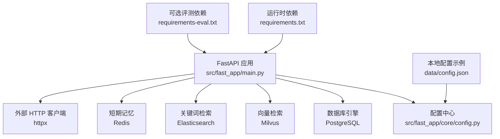
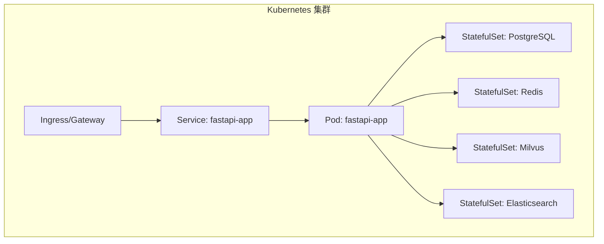
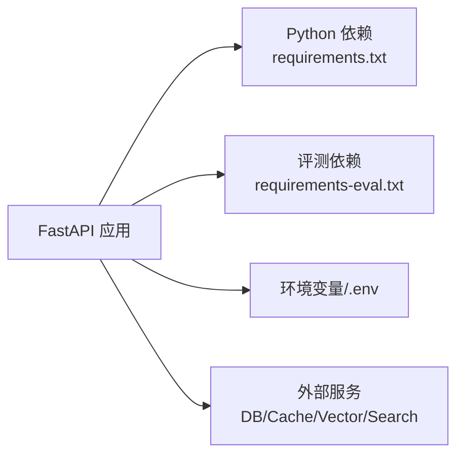

# 部署策略与容器化

<cite>
**本文引用的文件**
- [requirements.txt](file://python-agent-study/requirements.txt)
- [requirements-eval.txt](file://python-agent-study/requirements-eval.txt)
- [config.json](file://python-agent-study/data/config.json)
- [Settings 配置](file://python-agent-study/src/fast_app/core/config.py)
- [FastAPI 应用入口与生命周期](file://python-agent-study/src/fast_app/main.py)
- [RAG 部署检查清单元数据](file://python-agent-study/docs/knowledge-base-acl-test/development/rag-deployment-checklist.md.meta.json)
</cite>

## 目录
1. [简介](#简介)
2. [项目结构](#项目结构)
3. [核心组件](#核心组件)
4. [架构总览](#架构总览)
5. [详细组件分析](#详细组件分析)
6. [依赖分析](#依赖分析)
7. [性能考虑](#性能考虑)
8. [故障排查指南](#故障排查指南)
9. [结论](#结论)
10. [附录](#附录)

## 简介
本文件面向将当前 Python Agent/RAG 服务进行生产级容器化与编排的目标，结合代码中已有的配置模型、外部依赖和启动生命周期，给出可落地的 Docker 镜像构建、容器编排、Kubernetes 部署清单与服务发现方案。文档同时覆盖多环境部署策略、负载均衡、滚动更新与蓝绿发布、微服务间通信、配置与密钥管理、监控指标与日志收集，以及完整的部署脚本建议。

## 项目结构
本项目采用 FastAPI 作为 Web 框架，通过环境变量驱动配置，并在应用启动时按需创建外部客户端（Milvus、Elasticsearch、Redis、PostgreSQL、HTTP 客户端等）。依赖通过 requirements 文件声明，评测相关依赖独立维护。

图表来源
- [FastAPI 应用入口与生命周期:1-170](file://python-agent-study/src/fast_app/main.py#L1-L170)
- [Settings 配置:1-800](file://python-agent-study/src/fast_app/core/config.py#L1-L800)
- [requirements.txt:1-111](file://python-agent-study/requirements.txt#L1-L111)
- [requirements-eval.txt:1-8](file://python-agent-study/requirements-eval.txt#L1-L8)
- [config.json:1-5](file://python-agent-study/data/config.json#L1-L5)

章节来源
- [FastAPI 应用入口与生命周期:1-170](file://python-agent-study/src/fast_app/main.py#L1-L170)
- [Settings 配置:1-800](file://python-agent-study/src/fast_app/core/config.py#L1-L800)
- [requirements.txt:1-111](file://python-agent-study/requirements.txt#L1-L111)
- [requirements-eval.txt:1-8](file://python-agent-study/requirements-eval.txt#L1-L8)
- [config.json:1-5](file://python-agent-study/data/config.json#L1-L5)

## 核心组件
- 配置系统：基于 Pydantic Settings，从 .env 与环境变量加载，支持严格类型校验与默认值；涵盖 LLM、嵌入、重排、检索器、数据库、缓存、安全、超时、提示词防护、Agent 行为等大量参数。
- 应用生命周期：在 lifespan 中根据配置动态初始化 Milvus、Elasticsearch、Redis、PostgreSQL、httpx 客户端，并注册中间件、路由与异常处理器。
- 依赖管理：主依赖与评测依赖分离，便于最小化生产镜像体积。
- 本地配置：提供 data/config.json 作为轻量示例配置。

章节来源
- [Settings 配置:1-800](file://python-agent-study/src/fast_app/core/config.py#L1-L800)
- [FastAPI 应用入口与生命周期:1-170](file://python-agent-study/src/fast_app/main.py#L1-L170)
- [requirements.txt:1-111](file://python-agent-study/requirements.txt#L1-L111)
- [requirements-eval.txt:1-8](file://python-agent-study/requirements-eval.txt#L1-L8)
- [config.json:1-5](file://python-agent-study/data/config.json#L1-L5)

## 架构总览
下图展示容器化后的典型部署拓扑：Ingress/Gateway 暴露 API，后端服务通过 Kubernetes Service 发现内部依赖（PostgreSQL、Redis、Milvus、Elasticsearch），并通过环境变量注入配置与密钥。

图表来源
- [FastAPI 应用入口与生命周期:1-170](file://python-agent-study/src/fast_app/main.py#L1-L170)
- [Settings 配置:1-800](file://python-agent-study/src/fast_app/core/config.py#L1-L800)

## 详细组件分析

### 容器镜像构建
- 基础镜像：选择精简的 Python 官方镜像（如 slim），安装系统依赖后复制 requirements 并执行 pip 安装，再复制应用代码。
- 依赖分层：先安装依赖再复制代码，利用 Docker 缓存加速构建。
- 运行用户：以非 root 用户运行，提升安全性。
- 健康检查：使用 /health 端点或自定义 readiness 探针。
- 环境变量：通过 ConfigMap/Secret 注入 APP_ENV、DATABASE_URL、MILVUS_*、ELASTICSEARCH_*、OPENAI_*、JWT_* 等。
- 评测依赖：如需运行评测任务，单独构建包含 requirements-eval.txt 的镜像或使用独立 Job。

章节来源
- [requirements.txt:1-111](file://python-agent-study/requirements.txt#L1-L111)
- [requirements-eval.txt:1-8](file://python-agent-study/requirements-eval.txt#L1-L8)
- [FastAPI 应用入口与生命周期:1-170](file://python-agent-study/src/fast_app/main.py#L1-L170)
- [Settings 配置:1-800](file://python-agent-study/src/fast_app/core/config.py#L1-L800)

### 容器编排与启动顺序
- 启动顺序：优先确保 PostgreSQL、Redis、Milvus、Elasticsearch 就绪，再启动 FastAPI 应用。
- 健康检查：为各依赖服务配置 liveness/readiness 探针；应用侧可通过 /health 返回状态。
- 初始化：可在应用启动阶段检查并创建必要的索引/集合（例如 Milvus collection、Elasticsearch index），或在 CI/CD 中以 Job 形式完成。
- 资源限制：为每个容器设置 CPU/内存请求与上限，避免争用。

章节来源
- [FastAPI 应用入口与生命周期:1-170](file://python-agent-study/src/fast_app/main.py#L1-L170)
- [Settings 配置:1-800](file://python-agent-study/src/fast_app/core/config.py#L1-L800)

### Kubernetes 部署清单与服务发现
- Deployment：定义副本数、镜像、环境变量、探针、资源限制与卷挂载。
- Service：ClusterIP 暴露内部访问，配合 Ingress 暴露外部。
- ConfigMap：存放非敏感配置（如 RAG_TOP_K、LOG_LEVEL、CORS 等）。
- Secret：存放敏感信息（如 DATABASE_URL、JWT_SECRET_KEY、OPENAI_API_KEY 等）。
- Ingress：统一入口，启用 TLS、路径路由与限流。
- HorizontalPodAutoscaler：基于 CPU/内存或自定义指标自动扩缩容。
- NetworkPolicy：限制 Pod 间网络访问，仅允许必要通信。

章节来源
- [FastAPI 应用入口与生命周期:1-170](file://python-agent-study/src/fast_app/main.py#L1-L170)
- [Settings 配置:1-800](file://python-agent-study/src/fast_app/core/config.py#L1-L800)

### 多环境部署策略
- 环境划分：dev/test/staging/prod，通过 APP_ENV 区分。
- 配置隔离：不同环境使用不同的 ConfigMap/Secret，或通过 Helm values 注入。
- 镜像版本：按环境固定镜像标签，禁止跨环境共享未验证镜像。
- 回滚策略：保留历史 Revision，支持一键回滚。
- 权限与审计：生产环境开启鉴权、审计日志与访问控制。

章节来源
- [Settings 配置:1-800](file://python-agent-study/src/fast_app/core/config.py#L1-L800)

### 负载均衡配置
- 入站流量：通过 Ingress 实现七层负载均衡与 TLS 终止。
- 出站连接：合理设置 httpx 超时与重试，避免雪崩。
- 会话亲和：若需要粘性会话，可在 Ingress 层配置会话保持。
- 限流与熔断：在网关层实施速率限制与熔断保护。

章节来源
- [FastAPI 应用入口与生命周期:1-170](file://python-agent-study/src/fast_app/main.py#L1-L170)
- [Settings 配置:1-800](file://python-agent-study/src/fast_app/core/config.py#L1-L800)

### 滚动更新与蓝绿部署
- 滚动更新：使用 RollingUpdate 策略，逐步替换 Pod，确保零停机。
- 蓝绿部署：通过两个 Deployment（blue/green）与 Service 切换，快速回滚。
- 预热与就绪：确保新 Pod 完全就绪后再切流，避免冷启动失败。
- 灰度发布：结合 Ingress 权重或 ServiceMesh 进行小流量灰度。

章节来源
- [FastAPI 应用入口与生命周期:1-170](file://python-agent-study/src/fast_app/main.py#L1-L170)

### 微服务间通信
- 同步调用：通过 Kubernetes Service 名称解析进行 HTTP/gRPC 调用。
- 异步消息：可使用消息队列（如 RabbitMQ/Kafka）解耦耗时任务。
- 服务发现：依赖 K8s DNS，无需额外注册中心。
- 安全通信：启用 mTLS 与网络策略，限制跨命名空间访问。

章节来源
- [FastAPI 应用入口与生命周期:1-170](file://python-agent-study/src/fast_app/main.py#L1-L170)

### 配置管理与密钥管理
- 配置来源：优先使用环境变量与 ConfigMap，敏感信息放入 Secret。
- 配置校验：利用 Pydantic Settings 的类型校验与默认值，减少运行时错误。
- 密钥轮换：定期轮换 JWT 密钥与外部服务凭据，支持多 key 兼容。
- 审计与脱敏：对日志中的敏感字段进行脱敏处理。

章节来源
- [Settings 配置:1-800](file://python-agent-study/src/fast_app/core/config.py#L1-L800)

### 监控指标与日志收集
- 指标采集：暴露 Prometheus 指标端点，采集 QPS、延迟、错误率、资源使用等。
- 日志规范：结构化 JSON 日志，包含请求 ID、用户标识、耗时等上下文。
- 日志收集：通过 Filebeat/Fluent Bit 收集到 ELK/Loki，集中查询与分析。
- 告警规则：基于关键指标（错误率、延迟、资源水位）设置告警。

章节来源
- [FastAPI 应用入口与生命周期:1-170](file://python-agent-study/src/fast_app/main.py#L1-L170)
- [Settings 配置:1-800](file://python-agent-study/src/fast_app/core/config.py#L1-L800)

### 完整部署脚本建议
- 构建镜像：使用 docker build 或 kaniko 构建镜像，推送至镜像仓库。
- 生成清单：通过 Helm/Kustomize 生成不同环境的 K8s 清单。
- 部署流程：apply ConfigMap/Secret -> apply StatefulSets -> apply Deployment -> 等待就绪 -> 验证健康检查。
- 回滚与升级：记录每次变更，支持快速回滚与灰度发布。
- 清理与归档：定期清理旧镜像、日志与临时数据。

章节来源
- [FastAPI 应用入口与生命周期:1-170](file://python-agent-study/src/fast_app/main.py#L1-L170)
- [Settings 配置:1-800](file://python-agent-study/src/fast_app/core/config.py#L1-L800)

## 依赖分析
- 运行时依赖：FastAPI、Uvicorn、Pydantic、SQLAlchemy、AsyncPG、Elasticsearch、Pymilvus、Redis、OpenAI/DashScope SDK、LangChain/LangGraph、httpx 等。
- 评测依赖：deepeval、langchain-openai、openai、pydantic 等，独立于生产依赖。
- 配置依赖：通过环境变量与 .env 文件注入，避免硬编码。

图表来源
- [requirements.txt:1-111](file://python-agent-study/requirements.txt#L1-L111)
- [requirements-eval.txt:1-8](file://python-agent-study/requirements-eval.txt#L1-L8)
- [FastAPI 应用入口与生命周期:1-170](file://python-agent-study/src/fast_app/main.py#L1-L170)
- [Settings 配置:1-800](file://python-agent-study/src/fast_app/core/config.py#L1-L800)

章节来源
- [requirements.txt:1-111](file://python-agent-study/requirements.txt#L1-L111)
- [requirements-eval.txt:1-8](file://python-agent-study/requirements-eval.txt#L1-L8)
- [FastAPI 应用入口与生命周期:1-170](file://python-agent-study/src/fast_app/main.py#L1-L170)
- [Settings 配置:1-800](file://python-agent-study/src/fast_app/core/config.py#L1-L800)

## 性能考虑
- 连接池：为数据库、Redis、ES、Milvus 配置合理的连接池大小与超时。
- 超时与重试：为外部调用设置超时与退避重试，避免级联失败。
- 资源配额：为 Pod 设置 CPU/内存请求与上限，防止资源争用。
- 缓存策略：合理使用 Redis 缓存热点数据，降低下游压力。
- 批处理与分页：对大结果集进行分页与批量处理，减少内存占用。
- 冷启动优化：预加载必要模型或索引，缩短首次请求延迟。

[本节为通用指导，不直接分析具体文件]

## 故障排查指南
- 启动失败：检查环境变量是否完整、外部服务是否可达、端口是否冲突。
- 健康检查失败：确认 /health 端点逻辑与依赖服务状态。
- 连接超时：调整超时与重试参数，检查网络策略与防火墙。
- 内存溢出：增大内存限制或优化数据处理逻辑。
- 日志缺失：检查日志级别与输出格式，确认日志收集器正常工作。

章节来源
- [FastAPI 应用入口与生命周期:1-170](file://python-agent-study/src/fast_app/main.py#L1-L170)
- [Settings 配置:1-800](file://python-agent-study/src/fast_app/core/config.py#L1-L800)

## 结论
本项目已具备清晰的配置模型与外部依赖管理，适合通过 Docker 与 Kubernetes 进行容器化与编排。通过环境变量与 ConfigMap/Secret 实现多环境隔离，结合滚动更新与蓝绿发布保障高可用。建议在 CI/CD 中集成镜像构建、清单生成与健康检查，完善监控与日志体系，持续提升交付质量与稳定性。

[本节为总结性内容，不直接分析具体文件]

## 附录

### 环境变量与配置映射建议
- 应用标识：APP_NAME、APP_ENV
- 日志级别：LOG_LEVEL
- 鉴权：AUTH_ENABLED、JWT_SECRET_KEY、JWT_ALGORITHM、JWT_ISSUER、JWT_AUDIENCE、JWT_ACCESS_TOKEN_EXPIRE_MINUTES、JWT_REFRESH_TOKEN_EXPIRE_DAYS、API_KEY_PEPPER
- 数据库：DATABASE_URL、DATABASE_ECHO、DATABASE_POOL_SIZE、DATABASE_MAX_OVERFLOW
- 向量检索：MILVUS_HOST、MILVUS_PORT、MILVUS_COLLECTION_NAME、MILVUS_VECTOR_FIELD、MILVUS_ID_FIELD、MILVUS_CONTENT_FIELD
- 关键词检索：ELASTICSEARCH_URL、ELASTICSEARCH_INDEX_NAME、ELASTICSEARCH_USERNAME、ELASTICSEARCH_PASSWORD
- 缓存：REDIS_URL、MEMORY_TTL_SECONDS、MEMORY_MAX_MESSAGES、MEMORY_HISTORY_MAX_TURNS
- LLM/嵌入/重排：OPENAI_API_KEY、OPENAI_BASE_URL、LLM_MODEL_NAME、EMBEDDING_PROVIDER、EMBEDDING_MODEL_NAME、EMBEDDING_DIM、RERANKER_PROVIDER、RERANK_MODEL_NAME、RERANK_TOP_K
- 其他：CORS_ALLOW_ORIGINS、MAX_REQUEST_BODY_BYTES、MAX_UPLOAD_FILE_BYTES、SLOW_HTTP_REQUEST_THRESHOLD_MS、SLOW_RAG_PIPELINE_THRESHOLD_MS

章节来源
- [Settings 配置:1-800](file://python-agent-study/src/fast_app/core/config.py#L1-L800)

### 部署检查清单参考
- 服务启动顺序与健康检查
- 日志目录与数据卷规划
- 外部服务（Redis、PostgreSQL、Milvus、Elasticsearch）初始化与可用性
- LangSmith/外部模型服务配置管理
- 部署文档与故障排查手册

章节来源
- [RAG 部署检查清单元数据:1-200](file://python-agent-study/docs/knowledge-base-acl-test/development/rag-deployment-checklist.md.meta.json#L1-L200)