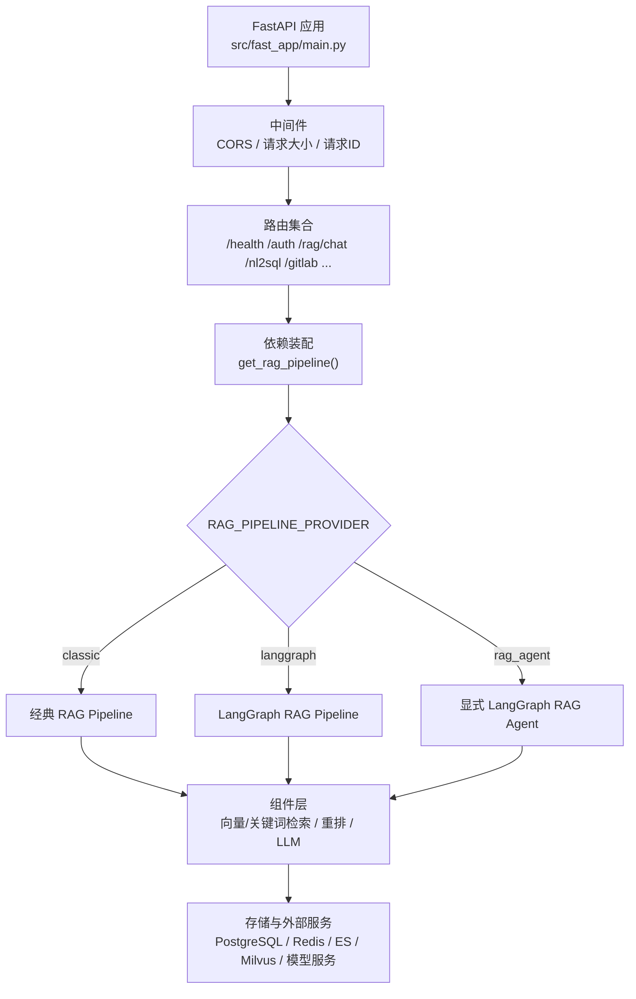
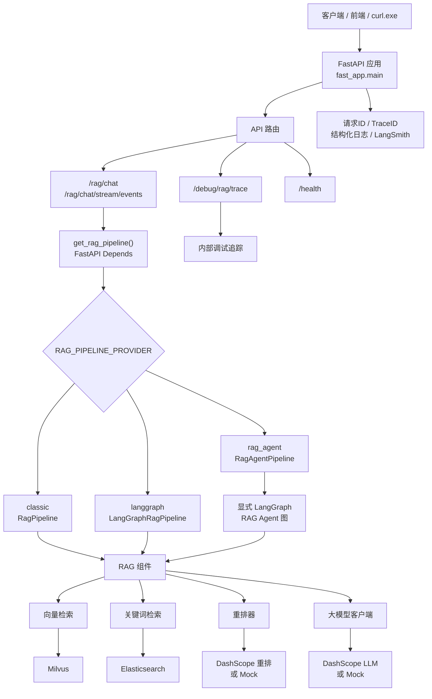
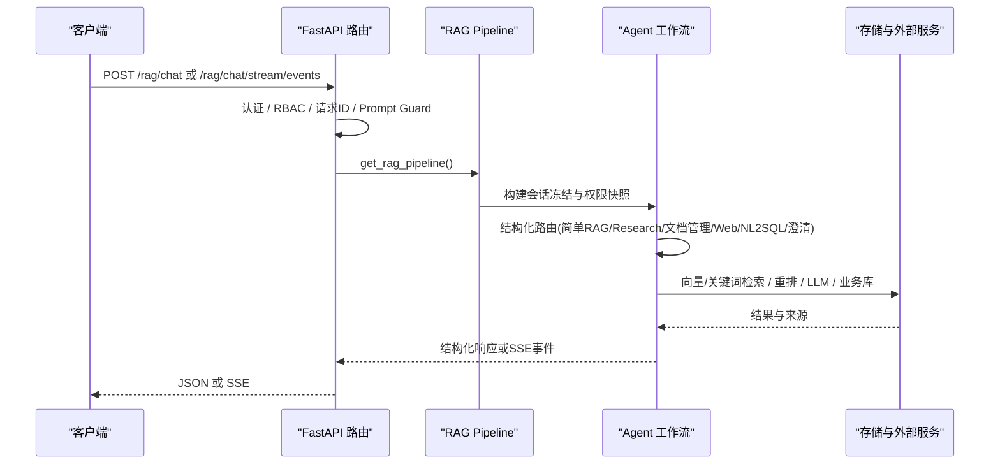
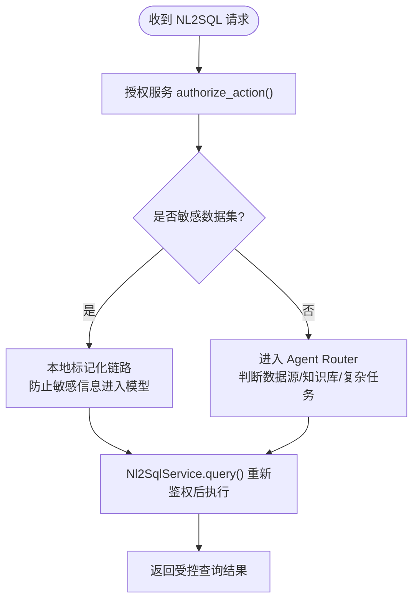
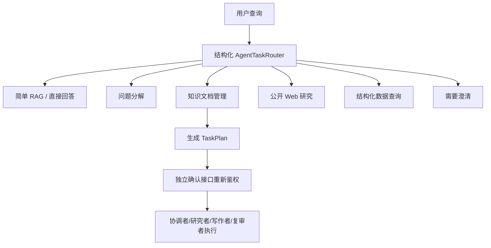
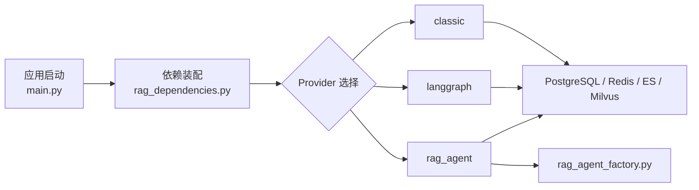

# 项目概述

<cite>
**本文引用的文件**
- [README.md](file://README.md)
- [main.py](file://src/fast_app/main.py)
- [config.py](file://src/fast_app/core/config.py)
- [20-2-架构图-API-Pipeline-Components-Storage-External-Services.md](file://learning-docs/phase-20/20-2-架构图-API-Pipeline-Components-Storage-External-Services.md)
- [rag_dependencies.py](file://src/fast_app/dependencies/rag_dependencies.py)
- [rag_chat_routes.py](file://src/fast_app/api/rag_chat_routes.py)
- [rag_agent_factory.py](file://src/fast_app/agents/runtime/rag_agent_factory.py)
- [NL2SQL自然语言转SQL实现教程.md](file://scripts/docs/NL2SQL自然语言转SQL实现教程.md)
</cite>

## 目录
1. [简介](#简介)
2. [项目结构](#项目结构)
3. [核心组件](#核心组件)
4. [架构总览](#架构总览)
5. [关键流程与数据流](#关键流程与数据流)
6. [依赖关系分析](#依赖关系分析)
7. [性能与可观测性](#性能与可观测性)
8. [故障排查指南](#故障排查指南)
9. [结论](#结论)
10. [附录：与前端接口约定](#附录与前端接口约定)

## 简介
本项目是一个面向企业知识场景的后端系统，基于 Python、FastAPI 与 LangGraph，提供从基础混合检索演进而来的 RAG Agent 能力。它支持普通 RAG、复杂 Research、知识文档管理、公开 Web 检索以及受控 NL2SQL，并通过 JSON 或 SSE 向后续 React 前端返回稳定状态。当前仓库仅包含后端；React 前端是接口设计的目标消费者，尚未包含在本仓库中。

项目的演进方向是从“基础混合检索”走向“可评测、可观察、可授权、可人工确认”的 Agent 后端：统一聊天入口负责意图识别与结构化路由，Agent 工作流在权限快照和会话冻结上下文中执行，最终将结果、来源、调试追踪信息以稳定协议返回给前端。

**章节来源**
- [README.md:1-27](file://README.md#L1-L27)

## 项目结构
后端代码位于 `src/fast_app`，采用分层与按功能域组织的方式：
- API 层：FastAPI 路由、SSE 与 HTTP 边界
- Graph 层：LangGraph RAG / Agent 状态、节点与图构建器
- Services 层：RAG、Agent 任务、认证、NL2SQL、对话记忆、知识库等
- Agents 层：工具、MCP 适配器、运行时策略与技能
- Ingestion 层：Loader、父子 Chunk、metadata 与 ES/Milvus 写入
- Integrations 层：GitLab 同步、Webhook、Worker 与 MR
- Evaluation 层：RAG 离线评测
- DB 层：SQLAlchemy 表、Session 与持久化边界
- Core 层：配置、日志、异常、LangSmith 与请求上下文
- Schemas 层：FastAPI / OpenAPI 公共模型

应用启动时通过 lifespan 初始化外部客户端（Milvus、Elasticsearch、Redis、httpx）、数据库引擎、NL2SQL Dataset 注册表，并在关闭时安全释放资源。中间件包括 CORS、请求大小限制、请求 ID 注入与慢请求告警。

**图表来源**
- [main.py:41-129](file://src/fast_app/main.py#L41-L129)
- [20-2-架构图-API-Pipeline-Components-Storage-External-Services.md:23-69](file://learning-docs/phase-20/20-2-架构图-API-Pipeline-Components-Storage-External-Services.md#L23-L69)

**章节来源**
- [README.md:99-124](file://README.md#L99-L124)
- [main.py:132-169](file://src/fast_app/main.py#L132-L169)

## 核心组件
- 配置中心：集中管理所有开关、超时、重试、模型、检索、Ingestion、NL2SQL、GitLab、评估与安全相关参数，并提供校验逻辑。
- 应用生命周期：创建并缓存外部客户端、数据库连接池、NL2SQL Dataset 注册表与 Deep Agent 运行时，确保资源复用与优雅关闭。
- 依赖装配：根据配置选择 RAG Provider（classic/langgraph/rag_agent），组装 retriever、reranker、LLM、Prompt Guard、对话记忆与查询改写等能力。
- 路由与协议：暴露健康检查、认证、RAG 主接口、流式事件、TaskPlan 管理、知识导入、NL2SQL、GitLab Webhook 与内部调试接口。
- Agent 工作流：结构化路由到简单 RAG、问题分解、知识文档管理、Web 研究、结构化数据查询或澄清回复；高风险操作生成 TaskPlan 并由独立确认接口执行。
- 认证与授权：JWT、API Key、全局/部门 RBAC、知识检索 ACL、Agent Tool 权限与审计；敏感 NL2SQL 查询在服务端重新鉴权。
- 可观测性与评测：Request/Trace ID、结构化日志、LangSmith tracing、debug trace、离线评测数据集与报告。

**章节来源**
- [config.py:18-797](file://src/fast_app/core/config.py#L18-L797)
- [main.py:41-129](file://src/fast_app/main.py#L41-L129)
- [rag_dependencies.py:462-535](file://src/fast_app/dependencies/rag_dependencies.py#L462-L535)
- [README.md:69-97](file://README.md#L69-L97)

## 架构总览
整体架构遵循清晰的工程边界：API 层只处理 HTTP/SSE 与协议；依赖层负责 provider 选择与装配；pipeline 层负责业务流程；components 层封装外部能力；storage/external services 层承载真实基础设施；observability/eval 层证明系统行为。

**图表来源**
- [20-2-架构图-API-Pipeline-Components-Storage-External-Services.md:23-69](file://learning-docs/phase-20/20-2-架构图-API-Pipeline-Components-Storage-External-Services.md#L23-L69)

**章节来源**
- [README.md:29-68](file://README.md#L29-L68)
- [20-2-架构图-API-Pipeline-Components-Storage-External-Services.md:23-69](file://learning-docs/phase-20/20-2-架构图-API-Pipeline-Components-Storage-External-Services.md#L23-L69)

## 关键流程与数据流
### 统一聊天入口与结构化路由
- 非流式 `/rag/chat` 与流式 `/rag/chat/stream/events` 是产品主线入口。
- 请求进入后，先进行认证与权限上下文构建，再调用 `get_rag_pipeline()` 装配 pipeline。
- 若携带 `dataset_id`，会优先走 NL2SQL 授权路径；敏感数据集会在任何 Router/普通 RAG 模型调用前执行本地标记化链路。
- 非敏感 query 进入 Agent Router，由 Router 判断数据库、知识库或复杂任务。

**图表来源**
- [rag_chat_routes.py:43-73](file://src/fast_app/api/rag_chat_routes.py#L43-L73)
- [rag_dependencies.py:462-535](file://src/fast_app/dependencies/rag_dependencies.py#L462-L535)
- [README.md:29-68](file://README.md#L29-L68)

**章节来源**
- [rag_chat_routes.py:43-73](file://src/fast_app/api/rag_chat_routes.py#L43-L73)
- [rag_dependencies.py:462-535](file://src/fast_app/dependencies/rag_dependencies.py#L462-L535)
- [README.md:69-97](file://README.md#L69-L97)

### NL2SQL 授权与执行
- 当请求携带 `dataset_id` 且动作类型为 `query` 时，服务端调用授权服务对当前用户与数据集进行鉴权。
- 对于敏感数据集，会在 Router 与普通 RAG 模型调用前执行本地标记化链路，避免敏感信息泄露。
- 真正执行 SQL 时，Tool 会再次使用当前账户重新计算 Scope，保证安全边界不被绕过。

**图表来源**
- [rag_chat_routes.py:43-73](file://src/fast_app/api/rag_chat_routes.py#L43-L73)
- [NL2SQL自然语言转SQL实现教程.md:6916-6975](file://scripts/docs/NL2SQL自然语言转SQL实现教程.md#L6916-L6975)

**章节来源**
- [rag_chat_routes.py:43-73](file://src/fast_app/api/rag_chat_routes.py#L43-L73)
- [NL2SQL自然语言转SQL实现教程.md:6916-6975](file://scripts/docs/NL2SQL自然语言转SQL实现教程.md#L6916-L6975)

### Agent 工作流与 TaskPlan
- 结构化路由决定执行路径：简单 RAG、问题分解、知识文档管理、Web 研究、结构化数据查询或澄清回复。
- 高风险文档操作先生成 TaskPlan，再由独立确认接口执行；确认时重新检查权限和资源状态。
- Planner / Reviewer 的结构化输出仍需经过服务端 Validator，Prompt 不能代替确定性约束。

**图表来源**
- [README.md:29-68](file://README.md#L29-L68)

**章节来源**
- [README.md:29-68](file://README.md#L29-L68)

## 依赖关系分析
- 应用启动依赖：PostgreSQL（业务事实、会话、Task audit、NL2SQL Dataset/Grant）、Redis（有 TTL 的最近对话窗口）、Milvus（向量召回与版本/ACL filter）、Elasticsearch（关键词召回与已发布知识索引）、GitLab（企业文档源与变更审查）、LangSmith（trace）。
- 依赖装配：`get_rag_pipeline()` 根据 `RAG_PIPELINE_PROVIDER` 选择 classic、langgraph 或 rag_agent；后者复用同一组 retriever/reranker/llm 依赖，但进入显式 LangGraph 图。
- Agent 工厂：`build_rag_agent()` 当前仅支持 `explicit_graph` 模式，用于构建显式 RAG Agent 图。

**图表来源**
- [main.py:41-129](file://src/fast_app/main.py#L41-L129)
- [rag_dependencies.py:462-535](file://src/fast_app/dependencies/rag_dependencies.py#L462-L535)
- [rag_agent_factory.py:36-57](file://src/fast_app/agents/runtime/rag_agent_factory.py#L36-L57)

**章节来源**
- [main.py:41-129](file://src/fast_app/main.py#L41-L129)
- [rag_dependencies.py:462-535](file://src/fast_app/dependencies/rag_dependencies.py#L462-L535)
- [rag_agent_factory.py:36-57](file://src/fast_app/agents/runtime/rag_agent_factory.py#L36-L57)

## 性能与可观测性
- 性能控制：通过配置项设置慢请求阈值、RAG Pipeline 阈值、检索与重排阈值、LLM 超时、外部调用重试与退避。
- 可观测性：启用 Request ID、Trace ID、结构化日志与 LangSmith tracing；可选 debug trace 内部接口用于 RAG 调试。
- 资源管理：应用生命周期内创建并复用外部客户端与数据库连接池，关闭时安全释放，避免连接泄漏。

**章节来源**
- [config.py:25-118](file://src/fast_app/core/config.py#L25-L118)
- [config.py:620-634](file://src/fast_app/core/config.py#L620-L634)
- [main.py:41-129](file://src/fast_app/main.py#L41-L129)

## 故障排查指南
- 启动失败：检查环境变量与最小本地环境配置，确保 PostgreSQL 可连接；即使使用 mock 检索也必须满足 Agent Router 占位配置。
- 认证失败：确认 `AUTH_ENABLED` 与 JWT/API Key 配置；启用认证后需传入 `Authorization: Bearer token` 或 `X-API-Key`。
- 检索无结果：检查 Milvus/ES 连接、collection/index 名称、ACL metadata 过滤条件与 top_k/min_score。
- NL2SQL 报错：确认 `NL2SQL_ENABLED`、Dataset 注册表刷新、只读连接可用、RBAC/Grant 正确；敏感数据集需本地标记化链路。
- 流式接口：新 sources、Guard、TaskPlan、Agent step 与错误事件应走 `/rag/chat/stream/events`；旧 `/rag/chat/stream` 仅保留兼容 token 流。
- 调试追踪：启用 `DEBUG_TRACE_ENABLED` 并使用 `/debug/rag/trace` 获取内部 RAG 调试信息。

**章节来源**
- [README.md:126-193](file://README.md#L126-L193)
- [README.md:241-260](file://README.md#L241-L260)
- [README.md:331-339](file://README.md#L331-L339)

## 结论
该项目为企业级知识场景提供了完整的 RAG Agent 后端能力，覆盖检索、Agent 工作流、NL2SQL、认证授权、文档处理与外部集成。其设计强调工程边界清晰、权限严格、可观测与可评测，适合需要可控、可审计、可扩展的企业知识问答与研究场景。初学者可通过最小本地环境快速上手；有经验开发者可基于 Provider 切换、显式 LangGraph 图与工具扩展实现定制化工作流。

## 附录：与前端接口约定
- 健康检查：`GET /health`
- 认证：`POST /auth/login`、`POST /auth/refresh`、`GET /auth/me`、`POST /auth/api-keys`
- RAG 主接口：`POST /rag/chat`（非流式）、`POST /rag/chat/stream/events`（主流式）
- TaskPlan：`GET /agent/task-plans/{id}`、`POST /agent/task-plans/{id}/confirm`、`POST /agent/task-plans/{id}/cancel`、`POST /agent/task-plans/{id}/retry`
- 知识导入：`POST /knowledge-documents/import-jobs`、`GET /knowledge-documents/import-jobs/{job_id}`
- NL2SQL：`GET /nl2sql/datasets`、`POST /nl2sql/query`
- GitLab：`POST /integrations/gitlab/webhooks/{source_id}`
- 调试：`POST /debug/rag/trace`

**章节来源**
- [README.md:69-97](file://README.md#L69-L97)