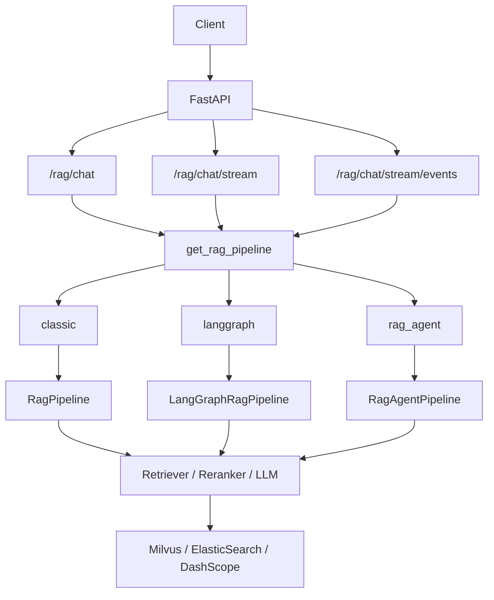
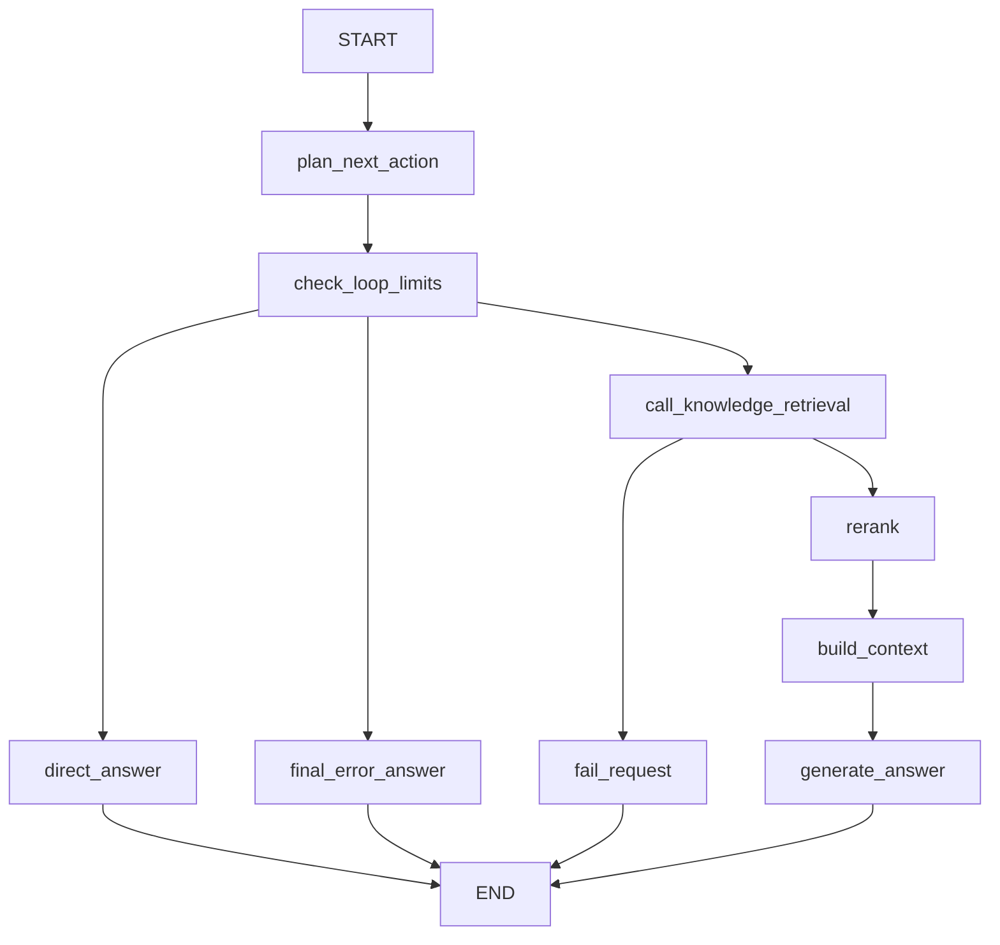

# Python Agent Study

基于 FastAPI + LangGraph 的可评测、可观察、可控 RAG Agent 后端学习项目。

这个项目不是单纯的 RAG demo，而是围绕一个可以写进简历、可以在面试中讲清楚、可以本地运行和评测的后端作品逐步演进出来的工程。当前主线是：

```text
FastAPI API
-> RAG / LangGraph / RAG Agent provider
-> Milvus 向量检索 + ElasticSearch 关键词检索
-> RRF 融合 + rerank
-> LLM 生成
-> sources / scores / trace / eval
```

## 核心能力

- FastAPI 后端接口：普通问答、token-only SSE、结构化 SSE。
- 三条可切换执行路线：`classic`、`langgraph`、`rag_agent`。
- 混合检索：Milvus 向量检索 + ElasticSearch 关键词检索 + RRF 融合。
- 精排：支持 DashScope `qwen3-rerank`，并带 fallback。
- 结果可解释：返回 sources、metadata、retrieval_sources、score breakdown。
- 知识库构建：Markdown / Text ingestion，支持 dry-run、validate、真实写入和重建。
- 离线评测：检索指标、生成指标、Markdown / JSON 报告。
- 可观测性：request_id、trace_id、结构化日志、debug trace、LangSmith。
- Agent 工程化：条件边、工具节点、MCP adapter、循环控制、错误策略、RAG Agent 最小闭环。
- 多轮记忆：Redis 最近窗口、PostgreSQL 消息持久化、可追溯 ConversationSummary 摘要压缩。

## 当前架构

更完整的作品架构图见：[阶段 20-2 架构图](learning-docs/phase-20/20-2-架构图-API-Pipeline-Components-Storage-External-Services.md)。



## 三条执行路线

通过 `RAG_PIPELINE_PROVIDER` 切换：

```text
classic    普通函数链 RAG，适合作为稳定基线
langgraph  显式 LangGraph RAG 状态机，适合观察节点与条件边
rag_agent  显式 LangGraph RAG Agent，当前作品主线
```

`create_agent` 当前是对照路线：项目已经有 middleware 准备层，但没有替换当前显式 LangGraph RAG Agent 主线。

## RAG Agent 主线

`rag_agent` provider 的核心流程：



这条路线用显式状态记录：

```text
route
route_reason
final_reason
step_count
tool_call_count
loop_decision
error_decision
tool_name
tool_error
docs
context
answer
```

它的定位是：把 RAG 从固定链路推进到可控 Agent 决策链路，同时保留 sources、trace、eval 和 stream 协议。

## 目录结构

```text
src/fast_app
  api              HTTP 接口与 SSE 包装
  dependencies     FastAPI Depends 与 provider 装配
  services         RAG pipeline、RAG Agent pipeline、debug trace
  graph            LangGraph state、nodes、builder
  agents           Agent tools、middleware、MCP adapter、loop/error policy
  components       LLM、Embedding、Retriever、Reranker 封装
  ingestion        Markdown/Text ingestion 工程化链路
  evaluation       RAG 离线评测体系
  core             Settings、日志、trace、异常处理
  schemas          HTTP 请求响应模型
  domain           内部业务模型
```

## 环境准备

推荐使用项目虚拟环境：

```powershell
.\.venv\Scripts\python.exe --version
```

安装依赖：

```powershell
.\.venv\Scripts\python.exe -m pip install -r requirements.txt
```

关键依赖版本以 `requirements.txt` 为准，当前包括：

```text
fastapi==0.136.1
uvicorn==0.47.0
langchain==1.3.2
langgraph==1.2.2
langsmith==0.8.6
elasticsearch==8.17.0
pymilvus==3.0.0
mcp==1.28.0
```

## 本地启动

Mock 模式启动 `rag_agent` 主线：

```powershell
$env:PYTHONPATH="src"
$env:RAG_PIPELINE_PROVIDER="rag_agent"
$env:LLM_PROVIDER="mock"
$env:VECTOR_RETRIEVER_PROVIDER="mock"
$env:KEYWORD_RETRIEVER_PROVIDER="mock"
$env:RERANKER_PROVIDER="mock"

.\.venv\Scripts\uvicorn.exe fast_app.main:app --reload
```

健康检查：

```powershell
curl.exe "http://127.0.0.1:8000/health"
```

## 多轮对话与 Redis 观察

`rag_agent` provider 支持通过 `session_id` 保留最近对话窗口。Redis 负责短期会话消息，PostgreSQL 负责持久化完整 user / assistant 消息。
启用 `SUMMARY_MEMORY_ENABLED=true` 后，系统还会把窗口外旧消息压缩成带版本和来源 message id 的 `ConversationSummary`，供 query rewrite 使用。

启动多轮链路时，建议确认 `.env` 至少包含：

```text
RAG_PIPELINE_PROVIDER=rag_agent
MEMORY_STORE_PROVIDER=redis
QUERY_REWRITE_ENABLED=true
```

交互式测试：

```powershell
$env:PYTHONPATH="src"

.\.venv\Scripts\python.exe scripts\test_multiturn_rag_agent_terminal.py `
  --base-url "http://127.0.0.1:8000" `
  --session-id "demo-session-14-11" `
  --mode "hybrid" `
  --top-k 3
```

Redis Insight 如果是桌面版，连接当前工程 Redis：

```text
Host: 127.0.0.1
Port: 6379
Database: 0
Username: 留空
Password: 留空
TLS: 关闭
```

如果 Redis Insight 运行在 Docker 容器里，`127.0.0.1` 会指向 Redis Insight 容器自身。此时优先使用：

```text
Host: host.docker.internal
Port: 6379
Database: 0
Username: 留空
Password: 留空
TLS: 关闭
```

如果 Redis 和 Redis Insight 在同一个 Docker Compose 网络里，也可以把 Host 填成 Redis 服务名，例如：

```text
Host: redis
Port: 6379
```

连接成功后搜索当前会话 key：

```text
conversation:demo-session-14-11:messages
```

其中 `demo-session-14-11` 对应测试脚本里的 `--session-id`。正常情况下，第一轮对话后 Redis list 中有 2 条消息，第二轮后有 4 条消息。

## RAG 接口

完整接口说明见：[阶段 20-3 接口文档](learning-docs/phase-20/20-3-接口文档整理.md)。

非流式问答：

```powershell
$body = @{
  query = "什么是混合检索？"
  mode = "hybrid"
  top_k = 5
  min_score = 0
} | ConvertTo-Json -Compress

curl.exe -X POST "http://127.0.0.1:8000/rag/chat" `
  -H "Content-Type: application/json" `
  --data-raw $body
```

token-only SSE：

```powershell
curl.exe -N -X POST "http://127.0.0.1:8000/rag/chat/stream" `
  -H "Content-Type: application/json" `
  --data-raw $body
```

结构化 SSE：

```powershell
curl.exe -N -X POST "http://127.0.0.1:8000/rag/chat/stream/events" `
  -H "Content-Type: application/json" `
  --data-raw $body
```

当前协议边界：

```text
pipeline.stream(req) 只产出 token。
API 层负责包装 SSE。
sources 走 stream_events()。
done / error 由 API 层包装。
```

## 切换 Provider

Classic Pipeline：

```powershell
$env:RAG_PIPELINE_PROVIDER="classic"
```

显式 LangGraph Pipeline：

```powershell
$env:RAG_PIPELINE_PROVIDER="langgraph"
```

显式 LangGraph RAG Agent：

```powershell
$env:RAG_PIPELINE_PROVIDER="rag_agent"
```

## 知识库 Ingestion

只读取和切分，不写入外部存储：

```powershell
$env:PYTHONPATH="src"
.\.venv\Scripts\python.exe -m fast_app.ingestion.cli dry-run `
  --knowledge-base-dir "knowledge-base" `
  --sample-size 3
```

校验本地文档和 chunk metadata：

```powershell
$env:PYTHONPATH="src"
.\.venv\Scripts\python.exe -m fast_app.ingestion.cli validate `
  --knowledge-base-dir "knowledge-base"
```

真实写入 ES / Milvus：

```powershell
$env:PYTHONPATH="src"
.\.venv\Scripts\python.exe -m fast_app.ingestion.cli ingest `
  --knowledge-base-dir "knowledge-base" `
  --write-mode replace_docs `
  --yes `
  --no-es-auth
```

重建 ES / Milvus 结构是危险操作，需要显式确认：

```powershell
$env:PYTHONPATH="src"
.\.venv\Scripts\python.exe -m fast_app.ingestion.cli reset-stores `
  --target both `
  --yes `
  --no-es-auth
```

## 测试和评测

完整测试和评测说明见：[阶段 20-5 测试和评测手册](learning-docs/phase-20/20-5-测试和评测手册.md)。

API 冒烟测试：

```powershell
.\.venv\Scripts\python.exe scripts\test_rag_chat_api.py
```

RAG Agent 专用测试：

```powershell
.\.venv\Scripts\python.exe scripts\test_rag_chat_api.py --rag-agent-suite
```

结构化流测试：

```powershell
.\.venv\Scripts\python.exe scripts\test_rag_chat_api.py --structured-stream-only
```

MCP tool adapter 测试：

```powershell
.\.venv\Scripts\python.exe scripts\test_mcp_tool_adapter.py
```

离线 RAG 评测：

```powershell
.\.venv\Scripts\python.exe scripts\run_real_offline_rag_eval.py
```

评测报告输出到：

```text
reports/
```

## Debug Trace

开启内部 debug trace：

```powershell
$env:DEBUG_TRACE_ENABLED="true"
$env:DEBUG_TRACE_TOKEN="local-debug-token"
```

请求：

```powershell
$body = @{
  query = "什么是混合检索？"
  mode = "hybrid"
  top_k = 5
  min_score = 0
} | ConvertTo-Json -Compress

curl.exe -X POST "http://127.0.0.1:8000/debug/rag/trace" `
  -H "Content-Type: application/json" `
  -H "X-Debug-Trace-Token: local-debug-token" `
  --data-raw $body
```

debug trace 是内部调试接口，不应该直接暴露给公网用户。

## LangSmith

开启 LangSmith：

```powershell
$env:LANGSMITH_TRACING="true"
$env:LANGSMITH_API_KEY="你的 key"
$env:LANGSMITH_PROJECT="python-agent-study"
```

服务启动后，RAG pipeline、LangGraph pipeline、RAG Agent pipeline 会写入对应 trace metadata 和 tags。

## 关键设计决策

### 保留三条 Provider

`classic`、`langgraph`、`rag_agent` 同时保留，不是为了堆功能，而是为了形成清晰对照：

```text
classic    验证基础 RAG 链路
langgraph  验证 RAG 状态机
rag_agent  展示 Agent 决策、工具调用、循环控制和错误分支
```

### 不用 create_agent 替换主线

`create_agent` 当前用于学习官方 Agent 工厂和 middleware。项目主线保留显式 LangGraph RAG Agent，因为它更适合展示：

```text
状态字段
条件边
工具调用
错误分支
sources
scores
trace
stream 协议
```

### stream 保持 token-only

`pipeline.stream()` 不返回 dict、sources 或 event。结构化信息统一走 `stream_events()`。

### eval 和 trace 是作品的一部分

项目不只追求“接口能返回答案”，还需要能证明：

```text
检索是否命中
回答是否引用来源
参数调整是否带来质量变化
Agent 每一步为什么这么走
失败时错误如何被分类
```

## 已知局限

- `create_agent` 尚未作为 provider 接入 `/rag/chat`。
- 阶段 13-10 人工确认节点已后置，后续出现高风险工具时再补。
- 阶段 12-12 日志脱敏和生产安全边界暂时跳过，生产化前需要补。
- 阶段 14 多轮对话最小链路已接入非流式 `/rag/chat`；流式接口的 PostgreSQL 持久化仍待后续阶段补齐。
- 阶段 15 权限、安全与接口治理尚未实现。
- 阶段 16 Docker Compose / `.env.example` / 部署说明尚未收口。
- 阶段 17-19 暂时作为后续演进，不阻塞当前作品成型。

## 后续路线

优先级建议：

```text
1. 阶段 20：继续补齐启动手册、评测说明、设计决策记录和最终演示流程
2. 阶段 14：多轮对话与记忆的最小作品版
3. 阶段 15：基础权限和工具安全边界
4. 阶段 16：展示级 Docker Compose 与配置收口
5. 阶段 17-19：后续演进
```
