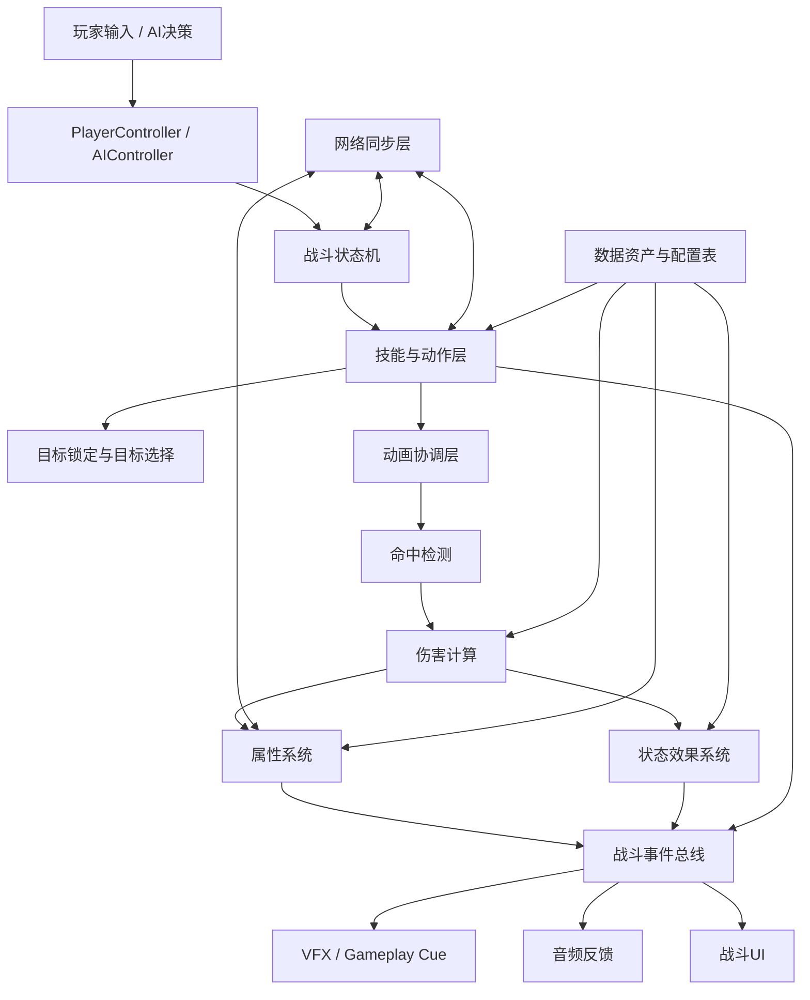
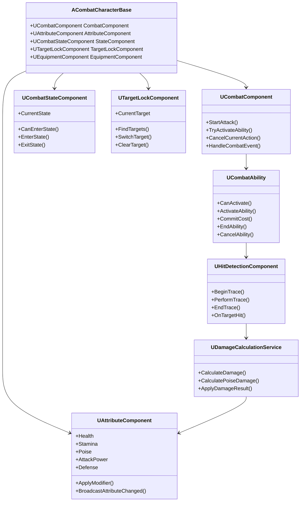
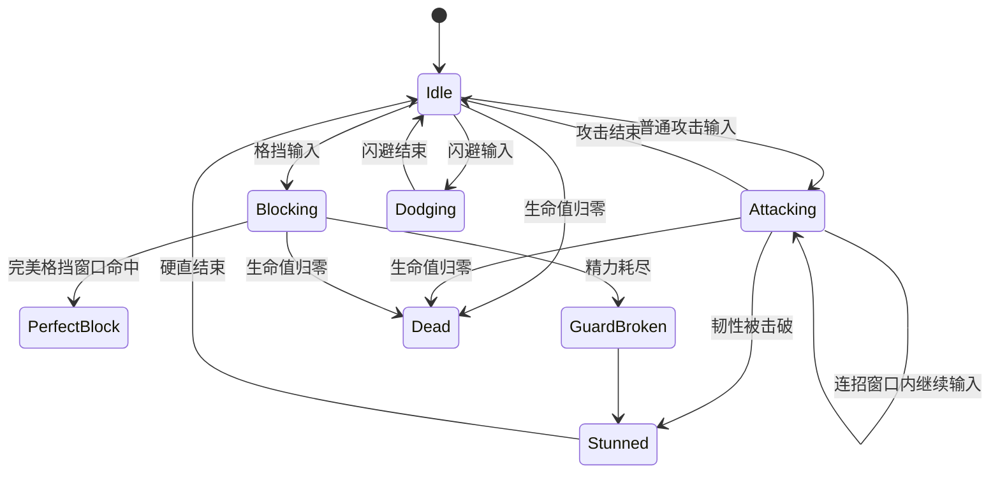
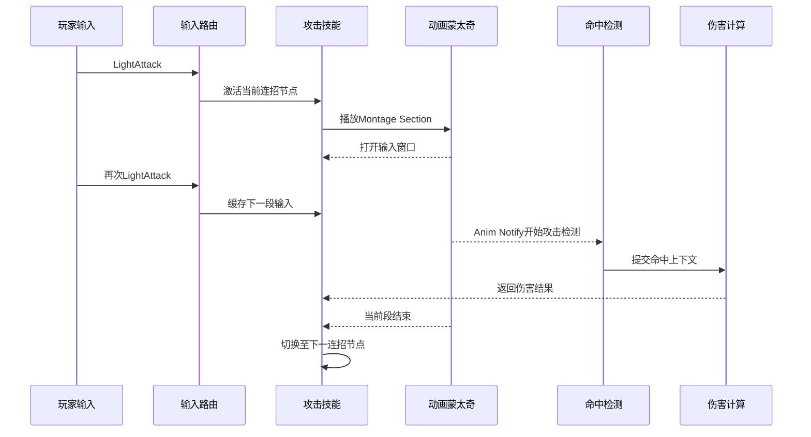
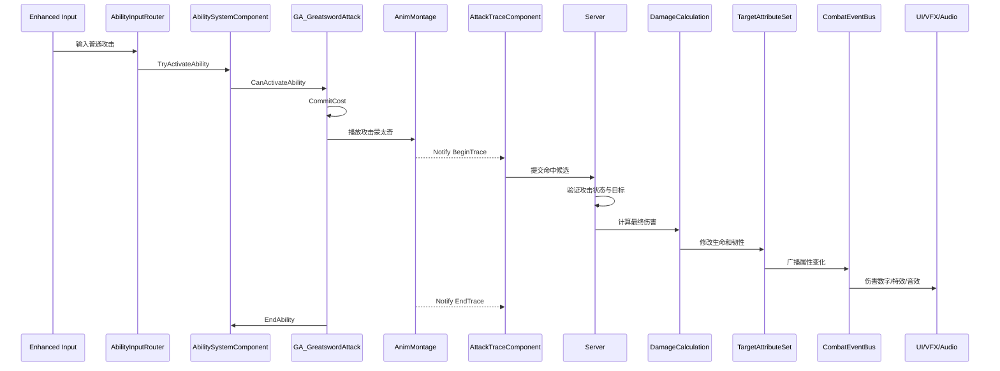

## 1. 文档目标

本文档描述一套适用于 Unreal Engine 5 的中型动作角色扮演游戏战斗系统程序架构。

系统需要支持以下能力：

- 玩家与敌人的基础属性管理。
- 普通攻击、连招、蓄力攻击和空中攻击。
- 闪避、格挡、完美格挡和受击硬直。
- 主动技能、被动技能和状态效果。
- 武器、装备和元素伤害。
- AI 敌人和 Boss 战斗行为。
- 单机模式与多人联机模式。
- 动画、特效、音频和 UI 的统一事件驱动。
- 通过数据资产和配置表扩展战斗内容。
- 支持自动化测试、日志追踪和性能分析。

本文档重点关注程序架构、模块边界和运行时数据流，不展开角色建模、动画制作和关卡美术流程。

---

## 2. 设计原则

### 2.1 数据驱动

战斗数值、技能配置、武器属性和状态效果不应直接硬编码在角色蓝图中。

推荐使用以下数据载体：

- `UPrimaryDataAsset`
- `UDataAsset`
- `UDataTable`
- `Gameplay Tag`
- `Curve Table`
- `Data Registry`

数据驱动可以降低程序代码与具体战斗内容之间的耦合，使策划能够在不修改核心代码的情况下调整技能和数值。

### 2.2 职责单一

每个模块只负责一类明确问题。

例如：

- 属性组件负责保存和修改属性。
- 伤害计算模块负责计算最终伤害。
- 目标锁定组件负责目标筛选和切换。
- 动画层负责视觉表现，不负责决定最终伤害。
- UI 层负责展示状态，不直接修改战斗数据。

### 2.3 服务器权威

多人联机模式下，决定战斗结果的逻辑应由服务器执行。

客户端可以负责：

- 输入采集。
- 本地预测。
- 摄像机反馈。
- 非关键视觉效果。
- UI 临时展示。

服务器负责：

- 技能是否合法。
- 是否命中目标。
- 最终伤害数值。
- 状态效果应用。
- 死亡结果。
- 战斗奖励结算。

### 2.4 事件驱动

模块之间优先通过事件、接口和委托通信，避免跨模块直接访问内部状态。

推荐使用：

- C++ Delegate。
- Blueprint Event Dispatcher。
- Gameplay Event。
- Gameplay Message Subsystem。
- Gameplay Tag Event。
- Interface。
- Gameplay Cue。

### 2.5 可测试与可观测

核心战斗计算应尽量设计成纯逻辑或低依赖逻辑，便于自动化测试。

系统应记录：

- 技能激活与结束。
- 命中判定。
- 伤害输入与输出。
- 属性变化。
- 状态效果添加与移除。
- 网络预测失败。
- 服务器校正。
- 战斗状态切换。

---

## 3. 总体架构



总体架构可以分为六个层次：

1. 输入与决策层。
2. 战斗状态与技能执行层。
3. 命中与伤害结算层。
4. 属性与状态效果层。
5. 表现与反馈层。
6. 网络与数据支撑层。

---

## 4. 模块划分

### 4.1 CombatCore 模块

`CombatCore` 是战斗系统的基础模块，包含稳定、通用且不依赖具体角色内容的核心类型。

建议包含：

- 战斗枚举。
- 战斗结构体。
- 战斗接口。
- Gameplay Tag 定义。
- 通用伤害上下文。
- 战斗事件结构。
- 战斗日志工具。
- 通用数学和数值计算函数。

示例目录：

```text
Source/GameCombat/CombatCore/
├── Public/
│   ├── CombatTypes.h
│   ├── CombatTags.h
│   ├── CombatInterfaces.h
│   ├── DamageContext.h
│   └── CombatEvent.h
└── Private/
    ├── CombatTags.cpp
    ├── DamageContext.cpp
    └── CombatMathLibrary.cpp
```

### 4.2 CombatCharacter 模块

该模块负责角色在战斗中的通用能力。

主要对象：

- `ACombatCharacterBase`
- `UCombatComponent`
- `UCombatStateComponent`
- `UTargetLockComponent`
- `UEquipmentComponent`
- `UHitReactionComponent`

其中，角色基类只负责组合组件，不应承载全部战斗逻辑。

### 4.3 CombatAbility 模块

该模块负责技能、攻击动作和技能生命周期。

可以基于 Gameplay Ability System，也可以使用自研技能框架。

推荐对象：

- `UCombatAbility`
- `UAttackAbility`
- `UDodgeAbility`
- `UBlockAbility`
- `UExecuteAbility`
- `UCombatAbilitySet`
- `UAbilityInputRouter`

### 4.4 CombatDamage 模块

该模块负责命中信息转换、伤害计算和结算。

推荐对象：

- `UDamageCalculationService`
- `UDamageExecutionCalculation`
- `UDamageRuleSet`
- `UHitDetectionComponent`
- `UAttackTraceComponent`
- `UDamageTypeDataAsset`

### 4.5 CombatPresentation 模块

该模块负责战斗表现，不负责决定战斗结果。

包含：

- 动画协调。
- Niagara 特效。
- Gameplay Cue。
- 音效。
- 摄像机震动。
- 命中停顿。
- UI 战斗反馈。

### 4.6 CombatAI 模块

该模块负责 AI 战斗决策。

包含：

- 行为树任务。
- EQS 查询。
- 战斗距离评估。
- 技能选择。
- Boss 阶段管理。
- 仇恨系统。
- 目标切换。

---

## 5. 关键类关系



---

## 6. 角色基类设计

### 6.1 ACombatCharacterBase

`ACombatCharacterBase` 作为玩家角色、普通敌人和 Boss 的共同基类。

建议职责：

- 创建并持有通用战斗组件。
- 初始化属性。
- 提供受击和死亡接口。
- 绑定属性变化事件。
- 向动画实例暴露只读战斗状态。
- 提供团队、阵营和敌我判断接口。

不建议将以下逻辑直接写入角色基类：

- 复杂技能流程。
- 最终伤害计算。
- 连招窗口判断。
- 目标搜索算法。
- UI 更新。
- 特效生成。
- 具体 Boss 阶段逻辑。

角色基类应作为组件容器和生命周期协调者，而不是大型战斗管理器。

### 6.2 组件组合

```text
ACombatCharacterBase
├── UAttributeComponent
├── UCombatComponent
├── UCombatStateComponent
├── UTargetLockComponent
├── UEquipmentComponent
├── UHitReactionComponent
├── UAbilitySystemComponent
└── USkeletalMeshComponent
```

组件组合可以让不同类型角色选择性启用功能。

例如：

- 普通 NPC 可以不包含目标锁定组件。
- 远程炮塔可以不包含装备组件。
- Boss 可以额外增加阶段管理组件。
- 可破坏物可以只包含属性组件和受击组件。

---

## 7. 战斗状态机

### 7.1 状态定义

推荐使用 Gameplay Tag 表示战斗状态，而不是仅使用单一枚举。

示例：

```text
State.Combat.Idle
State.Combat.Attacking
State.Combat.Blocking
State.Combat.Dodging
State.Combat.Stunned
State.Combat.Executing
State.Combat.Dead
State.Movement.Sprinting
State.Movement.Falling
State.Control.InputBlocked
```

Gameplay Tag 支持层级判断。

例如：

- 查询 `State.Combat` 可以匹配所有战斗状态。
- `State.Combat.Stunned` 可以阻止攻击和闪避。
- `State.Control.InputBlocked` 可以统一控制输入禁用。

### 7.2 状态转换规则



### 7.3 状态组件职责

`UCombatStateComponent` 负责：

- 保存当前状态标签。
- 检查状态互斥。
- 广播状态变化。
- 控制状态进入和退出。
- 向技能系统提供激活前置条件。
- 向动画层提供只读状态。

状态组件不负责播放动画，也不负责直接执行伤害。

---

## 8. 输入系统与技能路由

### 8.1 Enhanced Input

玩家输入建议使用 Enhanced Input。

输入动作示例：

```text
IA_LightAttack
IA_HeavyAttack
IA_Dodge
IA_Block
IA_Skill1
IA_Skill2
IA_TargetLock
IA_SwitchTarget
```

输入层只负责表达玩家意图，不应直接操作属性。

错误示例：

```cpp
// 不推荐：输入回调直接修改敌人生命值
Target->Health -= 20.0f;
```

推荐流程：

```text
输入事件
→ AbilityInputRouter
→ 检查当前状态
→ 请求激活对应技能
→ 技能提交消耗
→ 动画和命中检测
→ 服务器伤害结算
```

### 8.2 输入缓冲

动作游戏通常需要输入缓冲。

输入缓冲记录：

- 输入类型。
- 输入时间。
- 当前动作阶段。
- 输入有效期。
- 是否允许覆盖。
- 是否已消费。

示例结构：

```cpp
USTRUCT(BlueprintType)
struct FBufferedCombatInput
{
    GENERATED_BODY()

    UPROPERTY()
    FGameplayTag InputTag;

    UPROPERTY()
    float Timestamp = 0.0f;

    UPROPERTY()
    float ExpireTime = 0.25f;

    UPROPERTY()
    bool bConsumed = false;
};
```

输入缓冲由 `UAbilityInputRouter` 或 `UCombatComponent` 管理。

---

## 9. 连招系统

### 9.1 连招数据

连招不应通过大量 `if-else` 写死。

推荐使用数据资产描述连招节点。

```text
ComboNode
├── NodeId
├── AbilityClass
├── MontageSection
├── RequiredInputTag
├── NextNodeIds
├── StaminaCost
├── DamageMultiplier
├── InputWindowStart
├── InputWindowEnd
└── CancelRules
```

### 9.2 连招执行流程



### 9.3 动画通知职责

Anim Notify 可以负责：

- 开始武器 Trace。
- 结束武器 Trace。
- 打开连招输入窗口。
- 关闭连招输入窗口。
- 触发脚步音效。
- 触发非关键 VFX。

Anim Notify 不应直接决定最终伤害数值。

---

## 10. 命中检测

### 10.1 检测方式

常见命中检测方式：

- 武器 Socket 轨迹检测。
- Sphere Trace。
- Capsule Trace。
- Box Trace。
- Projectile Collision。
- Overlap Volume。
- Gameplay Ability Target Actor。

近战武器推荐使用上一帧和当前帧的 Socket 位置进行连续轨迹检测，降低高速动画漏判风险。

### 10.2 命中去重

一次攻击窗口内，同一个目标通常只能被命中一次。

`UHitDetectionComponent` 需要维护：

```cpp
TSet<TWeakObjectPtr<AActor>> HitActors;
```

攻击窗口开始时清空集合。

检测到目标后：

1. 检查目标是否已经存在于集合。
2. 检查阵营关系。
3. 检查目标是否可受伤。
4. 生成 `FCombatHitContext`。
5. 将目标加入集合。
6. 提交服务器伤害结算。

### 10.3 命中上下文

```cpp
USTRUCT(BlueprintType)
struct FCombatHitContext
{
    GENERATED_BODY()

    UPROPERTY()
    TObjectPtr<AActor> InstigatorActor;

    UPROPERTY()
    TObjectPtr<AActor> TargetActor;

    UPROPERTY()
    FGameplayTag AttackTag;

    UPROPERTY()
    FVector HitLocation;

    UPROPERTY()
    FVector HitDirection;

    UPROPERTY()
    float BaseDamage = 0.0f;

    UPROPERTY()
    float PoiseDamage = 0.0f;

    UPROPERTY()
    bool bCriticalHit = false;

    UPROPERTY()
    bool bBlocked = false;
};
```

---

## 11. 伤害计算架构

### 11.1 计算流程

```text
基础伤害
× 技能倍率
× 武器倍率
× 属性倍率
× 暴击倍率
× 元素克制倍率
- 防御减伤
- 格挡减伤
= 最终生命伤害
```

伤害系统还可以同时计算：

- 韧性伤害。
- 精力伤害。
- 部位伤害。
- 元素积累。
- 仇恨值。
- 吸血值。
- 击退强度。

### 11.2 伤害计算服务

建议将伤害计算集中在独立服务或 GAS Execution Calculation 中。

输入：

- 攻击者属性快照。
- 目标属性快照。
- 技能配置。
- 武器配置。
- 命中部位。
- 攻击标签。
- 防御状态。
- 随机种子。

输出：

```cpp
USTRUCT(BlueprintType)
struct FDamageResult
{
    GENERATED_BODY()

    UPROPERTY()
    float HealthDamage = 0.0f;

    UPROPERTY()
    float StaminaDamage = 0.0f;

    UPROPERTY()
    float PoiseDamage = 0.0f;

    UPROPERTY()
    bool bCritical = false;

    UPROPERTY()
    bool bBlocked = false;

    UPROPERTY()
    bool bPerfectBlocked = false;

    UPROPERTY()
    bool bKilledTarget = false;
};
```

### 11.3 确定性

多人联机时，随机暴击和随机伤害浮动需要由服务器决定。

如果需要客户端预测，应使用可复现随机种子，并允许服务器校正。

---

## 12. 属性系统

### 12.1 属性分类

基础属性：

- 最大生命值。
- 当前生命值。
- 最大精力。
- 当前精力。
- 攻击力。
- 防御力。
- 韧性。
- 暴击率。
- 暴击伤害。
- 移动速度。

元素属性：

- 火焰攻击。
- 冰霜攻击。
- 雷电攻击。
- 毒素攻击。
- 对应抗性。

战斗临时属性：

- 当前格挡强度。
- 当前伤害倍率。
- 受击伤害倍率。
- 技能冷却倍率。
- 精力恢复倍率。

### 12.2 属性修改规则

属性修改来源应可追踪。

建议记录：

- 来源技能。
- 来源装备。
- 来源状态效果。
- 持续时间。
- 修改方式。
- 叠加规则。
- 是否可驱散。

修改方式示例：

```text
Add：基础值加法
Multiply：倍率乘法
Override：覆盖
Clamp：范围限制
```

---

## 13. 状态效果系统

### 13.1 状态效果类型

- 燃烧。
- 中毒。
- 冰冻。
- 眩晕。
- 流血。
- 攻击力提升。
- 防御力降低。
- 无敌。
- 霸体。
- 沉默。
- 减速。

### 13.2 状态效果数据

```text
StatusEffectData
├── EffectTag
├── Duration
├── TickInterval
├── StackPolicy
├── MaxStacks
├── GrantedTags
├── BlockedAbilityTags
├── AttributeModifiers
├── GameplayCueTag
└── DispelCategory
```

### 13.3 叠加策略

常见策略：

- 不可叠加，重复施加刷新时间。
- 可叠加层数，独立计时。
- 可叠加层数，共享计时。
- 新效果覆盖旧效果。
- 只保留数值更高的效果。
- 同来源不可叠加，不同来源可叠加。

---

## 14. 闪避、格挡与受击

### 14.1 闪避

闪避技能需要处理：

- 精力消耗。
- 无敌帧。
- Root Motion。
- 方向选择。
- 输入锁定。
- 技能取消。
- 网络预测。
- 摄像机跟随。

无敌帧建议通过临时 Gameplay Tag 或 Gameplay Effect 实现：

```text
State.Invulnerable.Dodge
```

伤害结算时统一检查该标签。

### 14.2 格挡

格挡流程：

1. 玩家进入格挡状态。
2. 正面攻击命中。
3. 判断攻击方向是否在格挡角度内。
4. 消耗精力。
5. 降低生命伤害。
6. 应用韧性或精力伤害。
7. 精力耗尽时触发破防。

### 14.3 完美格挡

完美格挡是格挡状态中的短时间窗口。

成功后可以：

- 将伤害降为零。
- 返还部分精力。
- 对攻击者施加硬直。
- 触发慢动作。
- 触发摄像机震动。
- 播放专用特效和音效。

完美格挡窗口应由技能时间轴或动画通知控制，不应在 Tick 中使用多个时间判断分支。

### 14.4 受击反应

受击反应根据以下信息选择：

- 伤害方向。
- 伤害等级。
- 是否暴击。
- 是否破韧。
- 是否击飞。
- 是否击倒。
- 目标当前状态。
- 角色体型。

受击动画只负责表现，是否进入硬直由战斗状态和韧性计算决定。

---

## 15. 目标锁定系统

### 15.1 目标筛选

候选目标需要满足：

- 在最大锁定距离内。
- 位于摄像机前方。
- 未死亡。
- 属于敌对阵营。
- 未被障碍物完全遮挡。
- 允许被锁定。
- 与玩家高度差在允许范围内。

### 15.2 评分模型

```text
TargetScore
= 屏幕中心距离权重
+ 世界距离权重
+ 摄像机夹角权重
+ 当前威胁权重
+ 可见性权重
```

评分最高的目标成为当前锁定目标。

### 15.3 目标切换

左右切换目标时，不应重新使用全局最高评分。

应基于当前目标的屏幕位置，寻找左侧或右侧最近候选目标。

---

## 16. 装备与武器系统

### 16.1 武器数据

```text
WeaponData
├── WeaponId
├── WeaponType
├── WeaponMesh
├── EquipSocket
├── SheathSocket
├── AttackAbilitySet
├── BaseDamage
├── PoiseDamage
├── ElementType
├── TraceSockets
├── AnimationLayer
└── GameplayTags
```

### 16.2 装备切换

装备切换流程：

```text
请求切换武器
→ 检查当前状态
→ 取消不兼容技能
→ 播放切换动画
→ 更新Mesh与Socket
→ 更新Ability Set
→ 更新属性修饰
→ 广播装备变化事件
→ 更新UI
```

装备组件不直接计算最终伤害，只提供武器配置和属性修饰。

---

## 17. Gameplay Ability System 方案

### 17.1 GAS 适用范围

对于包含以下需求的项目，推荐使用 Gameplay Ability System：

- 多种技能。
- 状态效果。
- 属性修改。
- 技能冷却。
- 技能消耗。
- Gameplay Tag 状态。
- 网络预测。
- 复杂 Buff 和 Debuff。
- 多人联机。

### 17.2 GAS 核心对象映射

| 战斗概念 | GAS 对象 |
|---|---|
| 角色属性 | Attribute Set |
| 普通攻击 | Gameplay Ability |
| 精力消耗 | Gameplay Effect Cost |
| 技能冷却 | Gameplay Effect Cooldown |
| 燃烧状态 | Gameplay Effect |
| 无敌状态 | Granted Gameplay Tag |
| 命中特效 | Gameplay Cue |
| 伤害计算 | Execution Calculation |
| 技能输入 | Ability Input Binding |
| 技能事件 | Gameplay Event |

### 17.3 自研组件与 GAS 的边界

即使使用 GAS，也仍然需要自研模块：

- 目标锁定。
- 武器 Trace。
- 连招图。
- AI 技能选择。
- Boss 阶段管理。
- 摄像机反馈。
- 特殊移动。
- 装备外观。
- 战斗日志。

GAS 不是完整战斗系统，而是技能、属性和状态效果的基础框架。

---

## 18. 动画架构

### 18.1 Animation Blueprint 职责

动画蓝图负责：

- 移动状态混合。
- 上下半身分层。
- 武器动画层。
- Aim Offset。
- Turn In Place。
- 受击动画表现。
- 读取只读战斗状态。
- 播放由技能触发的 Montage。

动画蓝图不应：

- 直接扣除生命值。
- 决定技能是否合法。
- 修改服务端权威状态。
- 执行复杂目标搜索。
- 保存核心战斗数值。

### 18.2 Linked Anim Layer

不同武器可以通过 Linked Anim Layer 替换攻击姿势和动画逻辑。

例如：

```text
UnarmedAnimLayer
SwordAnimLayer
GreatswordAnimLayer
BowAnimLayer
ShieldAnimLayer
```

角色不需要为每种武器复制完整动画蓝图。

---

## 19. 战斗事件总线

### 19.1 事件类型

```text
Event.Combat.AbilityStarted
Event.Combat.AbilityEnded
Event.Combat.HitConfirmed
Event.Combat.DamageApplied
Event.Combat.BlockSucceeded
Event.Combat.PerfectBlock
Event.Combat.PoiseBroken
Event.Combat.TargetKilled
Event.Combat.StatusApplied
Event.Combat.StatusRemoved
```

### 19.2 事件消费者

同一个战斗事件可以被多个表现模块消费。

例如 `Event.Combat.DamageApplied`：

- UI 显示伤害数字。
- 音频系统播放命中音效。
- 特效系统播放血液或火花特效。
- 摄像机系统执行轻微震动。
- 任务系统统计伤害。
- 日志系统记录伤害详情。

事件生产者不需要知道具体消费者。

---

## 20. AI 战斗架构

### 20.1 分层决策

AI 战斗可以分为三层：

1. 战略层：是否进入战斗、逃跑、召唤支援。
2. 战术层：选择攻击、格挡、绕后或拉开距离。
3. 执行层：激活具体技能并完成移动和朝向。

### 20.2 技能评分

AI 技能选择可以使用评分模型：

```text
AbilityScore
= 距离匹配
+ 当前精力
+ 技能冷却状态
+ 目标状态
+ 连招上下文
+ Boss阶段权重
+ 随机扰动
```

### 20.3 Boss 阶段

Boss 阶段管理器负责：

- 阶段进入条件。
- 技能池切换。
- 属性倍率变化。
- 场景事件。
- 音乐切换。
- 阶段演出。
- 阶段检查点。
- 多人难度缩放。

Boss 阶段逻辑不应全部写在行为树单个 Task 中。

---

## 21. 网络同步

### 21.1 权威边界

服务端权威数据：

- 生命值。
- 精力值。
- 韧性值。
- 技能激活结果。
- 命中结果。
- 状态效果。
- 死亡状态。
- 奖励掉落。

客户端本地数据：

- 输入缓存。
- 摄像机抖动。
- 非关键 UI 动画。
- 部分预测动画。
- 本地命中特效预览。

### 21.2 RPC 建议

客户端到服务器：

```text
ServerTryActivateAbility
ServerRequestTargetLock
ServerRequestEquipWeapon
ServerSubmitPredictedAction
```

服务器到客户端：

```text
ClientCorrectCombatState
ClientConfirmAbility
ClientRejectAbility
MulticastPlayCombatCue
```

不要为每一帧武器轨迹发送 RPC。

推荐由客户端播放预测动画，服务器根据权威角色状态和攻击时间窗执行命中验证。

### 21.3 属性同步

高频变化属性应谨慎同步。

可采用：

- 属性 Replication。
- RepNotify。
- GAS Attribute Replication。
- 条件复制。
- 低频聚合。
- 仅向拥有者同步精确值。
- 向其他玩家同步简化状态。

---

## 22. 数据资产设计

### 22.1 技能数据资产

```cpp
UCLASS(BlueprintType)
class UCombatAbilityData : public UPrimaryDataAsset
{
    GENERATED_BODY()

public:
    UPROPERTY(EditDefaultsOnly)
    FPrimaryAssetId AbilityId;

    UPROPERTY(EditDefaultsOnly)
    FGameplayTag AbilityTag;

    UPROPERTY(EditDefaultsOnly)
    TSubclassOf<class UGameplayAbility> AbilityClass;

    UPROPERTY(EditDefaultsOnly)
    TObjectPtr<UAnimMontage> Montage;

    UPROPERTY(EditDefaultsOnly)
    float StaminaCost = 0.0f;

    UPROPERTY(EditDefaultsOnly)
    float Cooldown = 0.0f;

    UPROPERTY(EditDefaultsOnly)
    float DamageMultiplier = 1.0f;
};
```

### 22.2 配置版本管理

数据资产需要考虑字段迁移。

建议：

- 为资产添加版本字段。
- 为弃用字段保留过渡期。
- 在加载时执行兼容转换。
- 提供编辑器校验。
- 在 CI 中执行资产验证命令。
- 禁止运行时依赖缺失字段的隐式默认值。

---

## 23. 战斗流程示例

以下示例描述玩家使用大剑普通攻击命中敌人的完整流程。



---

## 24. 错误处理

战斗系统应明确处理以下异常情况：

- 技能配置不存在。
- Montage 资源为空。
- 目标已经销毁。
- 目标在伤害结算前死亡。
- 武器 Socket 缺失。
- 属性组件未初始化。
- 客户端预测技能被服务器拒绝。
- 状态效果引用无效。
- 资产版本不兼容。
- Gameplay Tag 未注册。
- 攻击事件重复提交。
- 同一目标被重复命中。

建议统一使用战斗日志分类：

```cpp
DECLARE_LOG_CATEGORY_EXTERN(LogCombat, Log, All);
DECLARE_LOG_CATEGORY_EXTERN(LogCombatAbility, Log, All);
DECLARE_LOG_CATEGORY_EXTERN(LogCombatDamage, Log, All);
DECLARE_LOG_CATEGORY_EXTERN(LogCombatNetwork, Log, All);
```

---

## 25. 性能设计

### 25.1 避免无意义 Tick

以下逻辑不应默认每帧执行：

- 技能冷却检查。
- 状态效果持续时间检查。
- 目标列表全量搜索。
- 装备属性重复计算。
- UI 数值轮询。
- 攻击 Trace 组件常驻检测。

替代方式：

- Timer。
- 事件回调。
- 动画通知。
- 状态变化委托。
- 按需启用 Tick。
- 分帧处理。

### 25.2 对象池

适合使用对象池的对象：

- 伤害数字。
- 投射物。
- 命中特效。
- 地面范围提示。
- 临时音频组件。
- AI 感知辅助对象。

### 25.3 网络带宽

避免同步：

- 每帧瞄准方向。
- 每帧武器 Socket 坐标。
- 所有非关键特效参数。
- 可由客户端推导的动画状态。
- 高频重复战斗日志。

---

## 26. 自动化测试

### 26.1 单元测试

建议覆盖：

- 伤害公式。
- 暴击计算。
- 防御减伤。
- 格挡角度。
- 元素克制。
- 状态效果叠加。
- 连招节点切换。
- 目标评分。
- 属性上下限。
- 技能消耗检查。

### 26.2 集成测试

建议场景：

- 玩家普通攻击命中敌人。
- 攻击被格挡。
- 完美格挡反制攻击者。
- 精力耗尽导致破防。
- 韧性归零进入硬直。
- 状态效果周期伤害。
- Boss 阶段转换。
- 客户端预测被服务器拒绝。
- 玩家掉线后状态清理。
- 高延迟环境下连续攻击。

### 26.3 性能测试

- 同屏 50 个敌人。
- 多个 Niagara 效果同时触发。
- 大量状态效果周期更新。
- 多人同时攻击同一 Boss。
- 复杂装备属性叠加。
- 高频伤害数字生成。
- AI 目标搜索压力。

---

## 27. 推荐开发顺序

### 阶段一：基础骨架

- 定义战斗核心类型。
- 创建角色基类。
- 创建属性组件。
- 创建战斗状态组件。
- 完成基础伤害计算。
- 实现死亡流程。

### 阶段二：基础动作

- 接入 Enhanced Input。
- 实现普通攻击。
- 实现动画通知和武器 Trace。
- 实现受击反应。
- 实现闪避和格挡。
- 实现目标锁定。

### 阶段三：技能与状态

- 接入 Gameplay Ability System。
- 实现精力消耗和冷却。
- 实现状态效果。
- 实现元素伤害。
- 实现连招数据资产。
- 实现 Gameplay Cue。

### 阶段四：AI 与 Boss

- 实现 AI 技能选择。
- 实现仇恨系统。
- 实现 Boss 阶段。
- 实现特殊受击和处决。
- 实现场景联动。

### 阶段五：联机与优化

- 明确服务器权威边界。
- 接入客户端预测。
- 增加服务器校正。
- 优化属性同步。
- 完善自动化测试。
- 完善性能分析和日志。

---

## 28. 目录结构示例

```text
Source/GameCombat/
├── CombatCore/
│   ├── CombatTypes
│   ├── CombatTags
│   ├── CombatInterfaces
│   └── CombatMath
├── CombatCharacter/
│   ├── CombatCharacterBase
│   ├── CombatComponent
│   ├── CombatStateComponent
│   ├── AttributeComponent
│   └── HitReactionComponent
├── CombatAbility/
│   ├── CombatAbility
│   ├── AbilityInputRouter
│   ├── ComboSystem
│   └── AbilityData
├── CombatDamage/
│   ├── HitDetectionComponent
│   ├── AttackTraceComponent
│   ├── DamageCalculationService
│   └── DamageExecutionCalculation
├── CombatEquipment/
│   ├── EquipmentComponent
│   ├── WeaponData
│   └── ArmorData
├── CombatAI/
│   ├── CombatAIController
│   ├── AbilityScoring
│   ├── ThreatComponent
│   └── BossPhaseComponent
├── CombatPresentation/
│   ├── CombatAnimationCoordinator
│   ├── CombatCueManager
│   ├── CombatAudioManager
│   └── CombatCameraFeedback
└── CombatTests/
    ├── DamageCalculationTests
    ├── ComboTests
    ├── TargetLockTests
    └── NetworkCombatTests
```

---

## 29. 架构风险

### 29.1 角色类过度膨胀

风险：

所有战斗逻辑都写入 `Character` 类，导致类体积不断扩大，难以复用和测试。

解决方案：

- 使用组件拆分职责。
- 使用接口隔离模块。
- 使用数据资产表达内容差异。
- 将计算逻辑放入独立服务。

### 29.2 动画驱动全部游戏逻辑

风险：

将攻击伤害、状态修改和技能结束全部放在动画蓝图或 Anim Notify 中。

后果：

- 网络结果不稳定。
- 动画资源变化影响战斗逻辑。
- 自动化测试困难。
- 动画与程序相互锁死。

解决方案：

动画通知只发送时间点事件，最终业务逻辑由技能和服务器处理。

### 29.3 蓝图之间大量强引用

风险：

角色蓝图直接引用 UI、特效、武器、技能和 Boss 资源。

后果：

- 加载链过长。
- 内存占用增加。
- 资源难以拆包。
- 修改影响范围不清晰。

解决方案：

- 使用 Primary Asset。
- 使用 Soft Object Reference。
- 使用事件总线。
- 使用接口。
- 使用模块化配置资产。

### 29.4 客户端决定伤害

风险：

客户端直接上传最终伤害值。

后果：

- 容易作弊。
- 网络结果不一致。
- 服务器无法验证战斗上下文。

解决方案：

客户端仅提交动作和命中候选，服务器重新验证并计算最终结果。

---

## 30. RAG 检索测试建议

本文档适合用于验证 Markdown 文档解析、章节分块和代码块处理。

建议测试以下问题：

1. `ACombatCharacterBase` 应该承担哪些职责？
2. 为什么不应该在 Anim Notify 中直接决定最终伤害？
3. UE5 战斗系统中哪些数据应该由服务器权威管理？
4. 目标锁定系统如何给候选目标评分？
5. Gameplay Ability System 与自研战斗组件之间应该如何划分边界？
6. 连招数据资产应该包含哪些字段？
7. 如何避免同一次攻击重复命中同一个目标？
8. 完美格挡和普通格挡在程序流程上有什么区别？
9. 战斗事件总线可以有哪些消费者？
10. 为什么不建议将所有战斗逻辑写入 Character 类？
11. 如何设计状态效果的叠加规则？
12. 多人联机中为什么不应该每帧同步武器 Socket 坐标？
13. 战斗系统自动化测试应该覆盖哪些场景？
14. UE5 战斗模块推荐采用怎样的目录结构？
15. 哪些战斗逻辑应避免常驻 Tick？

---

## 31. 总结

UE5 战斗系统的核心不是某一个攻击蓝图，而是一套明确分层的运行时架构。

推荐将系统拆分为：

- 输入与决策。
- 状态管理。
- 技能执行。
- 动画协调。
- 命中检测。
- 伤害结算。
- 属性和状态效果。
- 表现反馈。
- AI 决策。
- 网络同步。
- 数据配置。
- 测试与观测。

其中最重要的架构边界是：

- 输入表达意图，不直接修改结果。
- 动画提供表现和时间点，不决定权威数值。
- 命中检测生成上下文，不负责完整伤害公式。
- 伤害计算集中处理，不分散在角色和武器蓝图中。
- 属性变化通过事件通知 UI 和表现层。
- 多人模式下由服务器决定最终战斗结果。
- 具体战斗内容通过数据资产扩展，而不是不断修改核心类。
