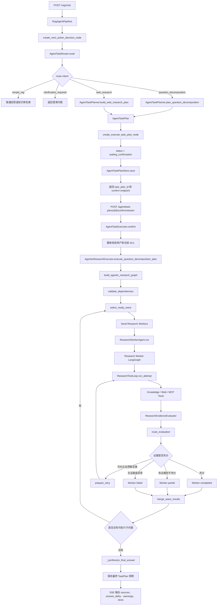
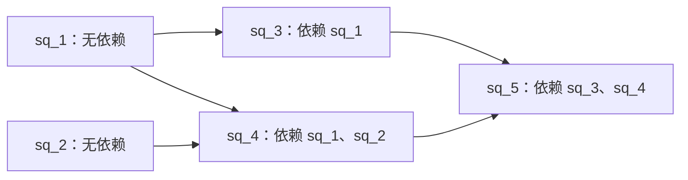
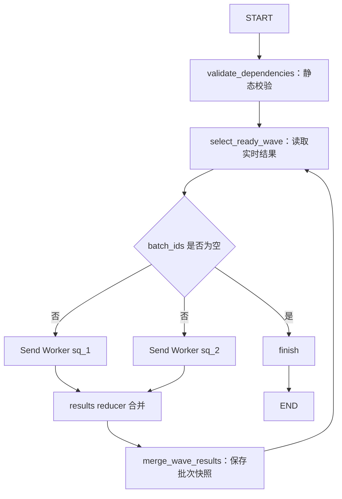
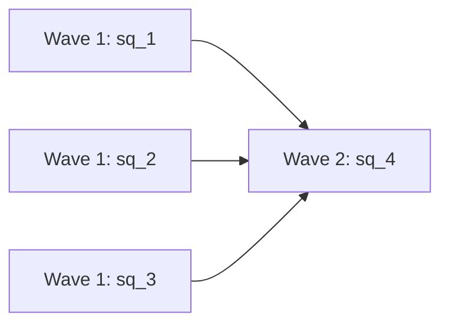

# Agentic Research 多 Agent 代码学习指南：一次真实 TaskPlan 的完整生命周期

## 1. 文档目标

这份文档不从泛化的“什么是多 Agent”开始，而是围绕当前工程中的一条真实运行链路展开：

```text
用户提交复杂问题
→ Router 判断任务类型
→ Planner 生成 TaskPlan
→ TaskPlan 等待人工确认
→ 用户通过独立 API 确认
→ LangGraph Orchestrator 按依赖波次派发 Research Worker
→ Worker 调用本地检索、WebSearch 或 MCP
→ Evidence Evaluator 判断证据是否充分
→ 必要时有限纠正检索
→ 合并各 Worker 结果
→ Final Synthesizer 生成最终回答
→ TaskPlan 保存最终状态、警告、证据和来源
→ SSE 把执行过程发送给 React 前端
```

学习完成后，你应该能够回答：

1. 当前工程中的“多 Agent”具体体现在哪里。
2. 为什么没有 `RetrieverAgent`、`WebSearchAgent` 等一组独立 Python 类。
3. Router、Planner、Orchestrator、Worker、Evaluator、Final Synthesizer 各自负责什么。
4. `AgentTaskPlan` 为什么既是执行输入，也是任务状态快照。
5. LangGraph 的 `Send` 如何让多个 Worker 并行执行。
6. 子问题依赖失败后，为什么有些任务是 `failed`，有些是 `skipped`。
7. 为什么一个 Worker 失败后，整个任务不一定失败。
8. `completed_with_warnings` 和普通 `completed` 有什么区别。
9. 为什么确认 TaskPlan 时必须重新读取当前用户权限。
10. SSE 为什么可以在后台任务执行期间持续返回进度。

本阶段只讲只读的 Agentic Research 链路。文档管理、多格式 ingestion、PPTX/XLSX 更新和文档写入确认属于其他链路，不在这里展开。

---

## 2. 学习前先建立正确认识

### 2.1 当前实现不是“多个独立服务进程”

当前工程中的多 Agent，不是下面这种部署形态：

```text
Supervisor 独立进程
Retriever 独立进程
Evaluator 独立进程
Answer Agent 独立进程
```

当前实现是在同一个 FastAPI 进程中，使用以下方式划分 Agent 职责：

```text
结构化领域模型
+ LangGraph 状态图
+ asyncio 并发任务
+ 隔离的 Worker 输入输出
+ 工具白名单
+ 独立 Evidence Evaluator
+ 最终综合节点
```

所以“Agent”在这里首先是一种职责边界，而不是必须对应一个独立类、独立模型或独立进程。

### 2.2 当前角色和代码的对应关系

| 架构角色 | 当前代码实现 | 主要职责 |
|---|---|---|
| Router | `AgentTaskRouter` | 只判断业务意图，不生成可信 Tool 参数 |
| Planner | `AgentTaskPlanner` | 把复杂问题拆成结构化子问题和依赖 |
| API Facade | `AgentTaskExecutor` | 只负责确认、重试、当前 ACL 和任务类型分派 |
| Research Supervisor | `AgenticResearchExecutor` | 负责研究进度、结果汇总、任务终态和最终综合 |
| Orchestrator | `agentic_research_graph.py` | 校验依赖图，选择波次，用 `Send` 派发 Worker |
| Research Worker Agent | `ResearchWorkerAgent.run()` | 调用独立 Worker LangGraph，完成一个子问题的有限纠正循环 |
| Worker Graph | `research_worker_graph.py` | 显式展示 attempt、evaluator、route、retry 和完成状态 |
| Research Tool Loop | `ResearchToolLoop.run_attempt()` | 完成一轮工具选择、执行、证据汇总和候选答案生成 |
| Retriever Agent 职责 | Worker 内的 `knowledge_retrieval` 工具 | 检索 ES/Milvus，并生成本地证据 |
| WebSearch Agent 职责 | Worker 内的 `web_search` 工具 | 搜索公开网络资料 |
| MCP Agent 职责 | Worker 内的 `mcp__*` 工具 | 调用白名单 MCP 工具 |
| Evaluator | `ResearchEvidenceEvaluator` | 判断证据是否充分、冲突或需要继续检索 |
| Final Synthesizer | `AgenticResearchExecutor._synthesize_final_answer()` | 只使用可用 Worker 结果生成最终回答 |
| 前端进度适配层 | `confirm/stream` 路由 | 把 TaskPlan 快照转换成 SSE 事件 |

### 2.3 当前链路中存在两层并发

第一层并发是多个子问题 Worker 的并发：

```text
sq_1 无依赖 ─┐
              ├→ 同一个 wave 并行执行
sq_2 无依赖 ─┘

sq_3 depends_on=[sq_1, sq_2]
→ 等 sq_1、sq_2 完成后进入下一个 wave
```

第二层并发是单个 Worker 内同一轮只读工具调用的并发：

```text
Research Worker sq_1
→ LLM 一轮选择 knowledge_retrieval + web_search
→ 两个工具通过批次安全校验
→ asyncio.gather() 并行执行
```

这两层并发不要混淆：

- `agentic_research_graph.py` 负责 Worker 级并发。
- `research_worker_graph.py` 负责一个 Worker 内的纠正状态循环。
- `ResearchToolLoop.run_attempt()` 负责一次 attempt 内的 ToolCall 级并发。

---

## 3. 完整运行链路总图



---

## 4. 第一阶段：HTTP 请求如何进入 Router

### 4.1 请求中的关键研究参数

请求模型位于：

[rag_chat_schema.py](D:/AI_Agent_Project/AI_Python_Project/python-agent-study/src/fast_app/schemas/rag_chat_schema.py:16)

与 Agentic Research 直接相关的字段包括：

```python
query
mode
top_k
candidate_k
min_score
filters.source_path
filters.section_path
allow_web_fallback
```

其中：

- `query` 是用户的当前问题。
- `mode/top_k/candidate_k/min_score` 控制本地知识库检索。
- `source_path/section_path` 限制允许检索的文档范围。
- `allow_web_fallback` 只表示用户是否允许“本地证据不足后访问公网”。

`allow_web_fallback=true` 不等于任务一开始就必须联网。它只允许 Evaluator 在证据不足时建议 Web 补充。

### 4.2 Router 的职责

Router 入口位于：

[agent_task_router.py](D:/AI_Agent_Project/AI_Python_Project/python-agent-study/src/fast_app/services/agent_tasks/agent_task_router.py:136)

核心方法是：

```python
AgentTaskRouter.route()
```

Router 的输出是结构化意图，例如：

```text
simple_rag
question_decomposition
knowledge_document_management
web_research
clarification_required
```

Router 只回答一个问题：

```text
“这个请求接下来应该走哪条业务链路？”
```

Router 不应该生成：

```text
文件路径
doc_id
ACL
部门权限
文档写入动作
可信 Tool 参数
最终 TaskPlan steps
```

这是安全边界。意图识别结果不能代替后端权限校验和工具参数校验。

### 4.3 Router 的决策顺序

`route()` 的实际顺序是：

```text
1. 先执行高置信度本地规则。
2. 规则没有命中时调用 Router 小模型。
3. 使用 Pydantic 结构化输出校验模型结果。
4. 模型超时、异常或输出无效时进入 clarification_required。
5. 模型置信度低于阈值时也进入 clarification_required。
```

因此 Router 不可用时不会随机选择一个高风险意图，而是要求用户补充说明。

### 4.4 Router 结果如何进入 RagAgentState

连接 Router 和 Planner 的节点位于：

[rag_agent_nodes.py](D:/AI_Agent_Project/AI_Python_Project/python-agent-study/src/fast_app/graph/rag_agent/rag_agent_nodes.py:240)

核心闭包是：

```python
decide_next_action_node(state)
```

它把 Router 输出写入状态：

```text
route_intent
route_confidence
route_source
route_model
route_latency_ms
route_rule_matched
```

然后根据意图决定是否调用 Planner。

---

## 5. 第二阶段：为什么要保存 ResearchPolicy

### 5.1 计划创建和计划执行不是同一个 HTTP 请求

复杂研究分成两个请求：

```text
请求一：POST /rag/chat
→ 创建 TaskPlan
→ 返回 waiting_confirmation

请求二：POST /agent/task-plans/{id}/confirm
→ 用户稍后确认
→ 执行 TaskPlan
```

如果 TaskPlan 不保存研究参数，确认时就无法知道用户创建计划时选择了：

```text
keyword 还是 hybrid
top_k 是 3 还是 10
限制了哪个 source_path
是否允许 Web fallback
```

所以领域模型中增加了：

[AgentResearchPolicy](D:/AI_Agent_Project/AI_Python_Project/python-agent-study/src/fast_app/domain/agent_task_plan.py:94)

```python
class AgentResearchPolicy(BaseModel):
    mode
    top_k
    candidate_k
    min_score
    source_path
    section_path
    web_policy
```

### 5.2 为什么 ResearchPolicy 不保存 ACL

TaskPlan 可以等待几分钟甚至更久才被确认。在这期间，用户权限可能已经被管理员撤销。

错误做法：

```text
创建计划时把 allowed_departments=[development] 永久保存
→ 用户权限被撤销
→ 确认时继续使用旧权限
```

正确做法：

```text
TaskPlan 只保存用户选择的 source_path 等研究参数
→ 确认时重新读取 CurrentUserContext
→ 用当前 user_id、department_codes、permissions 重新构造 RetrievalFilters
```

所以代码中的注释强调：

```text
只冻结本次请求选择的检索参数和联网许可；ACL 必须在 confirm 时重建。
```

### 5.3 三种 WebPolicy

```text
disabled
    不允许 Worker 自动访问公网。

fallback
    第一轮优先本地；Evaluator 判断不足后可以访问公网。

required
    用户明确要求联网研究，第一轮就必须使用 WebSearch。
```

生成规则是：

```text
普通复杂问题 + allow_web_fallback=false
→ disabled

普通复杂问题 + allow_web_fallback=true
→ fallback

Router 判定 web_research
→ required
```

---

## 6. 第三阶段：Planner 如何生成 TaskPlan

### 6.1 Planner 入口

Planner 位于：

[agent_task_planner.py](D:/AI_Agent_Project/AI_Python_Project/python-agent-study/src/fast_app/services/agent_tasks/agent_task_planner.py:132)

核心方法：

```python
plan_question_decomposition()
```

输入包括：

```text
当前 query
冻结的会话 history
当前 user_id
research_policy
LangSmith 子调用配置
```

输出是一个 `AgentTaskPlan`。

### 6.2 Planner 的降级顺序

```text
1. 优先使用 json_schema 结构化输出。
2. 失败后尝试 function_calling。
3. 再失败后尝试普通 JSON object。
4. 仍然失败时使用规则计划。
5. Planner confidence < 0.65 时也使用规则计划。
6. 子问题解析失败或全部非法时使用规则计划。
```

这里的关键思想是：

```text
Router 已经决定“这是一个复杂研究任务”。
Planner 低置信度时不能反过来改变 Router 的业务意图，
只能退化成更保守的本地拆解计划。
```

### 6.3 TaskPlan 中最重要的字段

领域模型位于：

[agent_task_plan.py](D:/AI_Agent_Project/AI_Python_Project/python-agent-study/src/fast_app/domain/agent_task_plan.py:186)

```text
task_plan_id
    当前任务的稳定标识，后续查询、确认、取消和重试都使用它。

task_kind
    question_decomposition 或 knowledge_document_management。

original_query
    用户最初提出的问题。

objective
    Planner 归纳的最终目标。

sub_questions
    子问题列表，是研究任务的核心计划。

research_policy
    跨确认请求保存的检索参数和 Web 许可。

final_synthesis_instruction
    最终回答如何整合多个子问题。

status
    整个 TaskPlan 的状态。

final_output
    执行进度、Worker 结果、Sources、warnings 和 final_answer。
```

### 6.4 SubQuestion 字段

```text
sub_question_id
    当前 TaskPlan 内唯一 ID。

order
    最终输出的稳定排序依据。

question
    Worker 真正要回答的问题。

purpose
    为什么需要拆出这个问题。

depends_on
    当前问题依赖哪些前置问题。

information_source_hint
    建议使用 knowledge_retrieval、web_search 或 none。

expected_evidence
    理想情况下需要什么证据。
```

`order` 和 `depends_on` 的含义不同：

- `order` 控制稳定展示和最终综合顺序。
- `depends_on` 控制是否允许开始执行。

一个 `order=3` 的子问题如果没有依赖，可以和 `order=1` 同时执行；最终结果仍按 `(order, sub_question_id)` 排序。

---

## 7. 第四阶段：为什么 TaskPlan 先停在 waiting_confirmation

TaskPlan 创建后不会立即执行 Research Worker。

对应节点位于：

[rag_agent_nodes.py](D:/AI_Agent_Project/AI_Python_Project/python-agent-study/src/fast_app/graph/rag_agent/rag_agent_nodes.py:701)

当 `task_kind == question_decomposition` 时：

```python
plan.status = WAITING_CONFIRMATION
task_executor.save_plan(plan)
return requires_confirmation=True
```

这意味着第一次 `/rag/chat` 请求只完成：

```text
识别意图
生成计划
保存计划
返回人工审查信息
```

还没有发生：

```text
Research Worker 执行
本地知识库检索
WebSearch
MCP 调用
最终综合
```

这样 React 可以先展示：

```text
原始问题
子问题
依赖关系
研究参数
是否允许联网
确认按钮
取消按钮
```

---

## 8. 第五阶段：TaskPlanStore 如何保存快照

TaskPlanStore 位于：

[agent_task_plan_store.py](D:/AI_Agent_Project/AI_Python_Project/python-agent-study/src/fast_app/services/agent_tasks/agent_task_plan_store.py:17)

### 8.1 为什么同时保存 JSON 和 Markdown

```text
JSON
    程序读取的事实快照，API、Executor 和 SSE 都使用它。

Markdown
    面向人工审查的可读视图。
```

两者来源是同一个 `AgentTaskPlan` 对象。

### 8.2 为什么使用临时文件加 os.replace

保存顺序：

```text
在目标目录创建临时文件
→ 写入全部内容
→ flush
→ fsync
→ os.replace 原子替换目标文件
```

原因是 SSE 每秒读取一次 TaskPlan。如果直接覆盖目标 JSON，读取者可能在写入一半时读到残缺 JSON。

`os.replace()` 保证读取者看到的要么是旧完整文件，要么是新完整文件，不会看到中间状态。

### 8.3 当前快照的边界

当前快照保存在：

```text
runtime/agent-task-plans
```

它适合当前单机学习和验收环境，但不是跨进程任务租约系统：

- `_ACTIVE_RESEARCH_TASK_PLAN_IDS` 是进程内集合。
- FastAPI 多进程部署时，各进程不会共享这个集合。
- 当前没有 PostgreSQL lease 防止不同进程重复执行同一 Research TaskPlan。

如果未来部署多个 API Worker，应把任务所有权和租约迁移到 PostgreSQL，而不是继续扩展进程内集合。

---

## 9. 第六阶段：确认接口为什么重新鉴权

确认入口位于：

[agent_task_plan_routes.py](D:/AI_Agent_Project/AI_Python_Project/python-agent-study/src/fast_app/api/agent_task_plan_routes.py:185)

真正的统一业务入口位于：

[agent_task_executor.py](D:/AI_Agent_Project/AI_Python_Project/python-agent-study/src/fast_app/services/agent_tasks/agent_task_executor.py:224)

执行顺序：

```text
1. 从 TaskPlanStore 重新读取最新计划。
2. 校验当前用户是否是创建者或 admin。
3. 校验状态是否仍是 waiting_confirmation。
4. 校验当前用户仍然通过认证。
5. 读取保存的 ResearchPolicy。
6. 使用当前用户的 permissions 和 department_codes 重建 RetrievalFilters。
7. 防止同一进程重复确认同一个研究任务。
8. 调用 execute_question_decomposition_plan()。
```

必须区分两种事实：

```text
ResearchPolicy
    创建计划时用户选择的研究参数。

CurrentUserContext
    确认执行这一刻仍然有效的身份和权限。
```

确认时不会信任 TaskPlan 中保存的旧权限，也不会从会话历史中推断权限。

---

## 10. 第七阶段：Supervisor 主入口

研究任务主入口位于：

[agentic_research_executor.py](D:/AI_Agent_Project/AI_Python_Project/python-agent-study/src/fast_app/services/research/agentic_research_executor.py:74)

```python
execute_question_decomposition_plan()
```

这是当前 Supervisor 的核心函数。

### 10.1 输入

```text
plan
    待执行的 TaskPlan。

user
    确认时的当前用户。

mode/top_k/candidate_k/min_score
    ResearchPolicy 还原出的检索参数。

filters
    使用当前 ACL 和保存的 source/section 共同生成的过滤条件。

resume
    是否为重试恢复。
```

### 10.2 开始执行前的检查

```text
task_kind 必须是 question_decomposition
sub_questions 数量不能超过 AGENT_RESEARCH_MAX_SUB_QUESTIONS
```

当前最大子问题数默认是 8。

### 10.3 resume 为什么只保留 completed

重试时：

```python
retained_results = [
    result
    for result in old_results
    if result.status == "completed"
]
```

原因：

- `completed` 已经有充分证据，不需要重复调用工具和模型。
- `partial` 仍有缺口，需要重新执行。
- `failed` 需要重新执行。
- `skipped` 可能因为原先依赖失败；依赖修复后应重新判断。

### 10.4 final_output 初始化

执行开始后，`final_output` 被初始化为：

```text
research_progress
sub_question_results
failed_sub_questions
skipped_sub_questions
warnings
used_tools
sources
```

其中 `research_progress` 包含：

```text
current_wave
workers
events
```

这既用于运行时快照，也用于 SSE 前端展示。

### 10.5 为什么需要 asyncio.Lock

同一个 wave 中多个 Worker 会并行完成，它们都可能尝试更新同一个 `plan.final_output` 并保存快照。

所以使用：

```python
snapshot_lock = asyncio.Lock()
```

保护以下操作：

```text
更新 progress
更新 worker 状态
合并结果
保存 JSON/Markdown 快照
```

这个锁只保护当前 Python 进程中的共享 `plan` 对象，不是跨进程分布式锁。

### 10.6 worker_runner 为什么是异常边界

`worker_runner()` 包装 `ResearchWorkerAgent.run()`：

```text
Worker 超时
→ 转成 failed + WORKER_TIMEOUT

普通 Worker 异常
→ 转成 failed + 结构化错误

ResearchExecutionCancelled
→ 继续抛出，终止任务派发

ToolPermissionDeniedError
→ 继续抛出，作为任务级安全异常

TaskPlan 持久化异常
→ 继续抛出，作为任务级异常
```

这就是“局部异常”和“任务级异常”的分界。

如果所有异常都被转换成 Worker failed，权限系统或持久化系统已经失效时，任务仍可能继续运行，这是不安全的。

### 10.7 整体终态如何计算

图执行完成后：

```text
usable = completed + partial
```

然后：

```text
没有任何 usable
→ TaskPlan failed
→ 不生成 final_answer

所有结果都是 completed
→ TaskPlan completed

至少一个结果可用，但存在 partial/failed/skipped
→ TaskPlan completed_with_warnings
```

`completed_with_warnings` 不是异常中断。它表示任务流程正常结束，但成果不完整。

---

## 11. 第八阶段：LangGraph Orchestrator 如何按波次调度

调度子图位于：

[agentic_research_graph.py](D:/AI_Agent_Project/AI_Python_Project/python-agent-study/src/fast_app/graph/research/agentic_research_graph.py:45)

这一阶段最容易让人困惑，是因为代码同时使用了三组新概念：

```text
图论概念：节点、边、依赖、入度、循环
LangGraph 概念：State、Node、Send、Reducer
asyncio 概念：并发协程、等待、超时
```

不需要先系统学习完整图论。理解当前工程只需要掌握“课程前置关系”这一个模型。

### 11.1 先不看代码：把子问题理解成课程

假设学校有五门课：

```text
课程 A：没有前置课
课程 B：没有前置课
课程 C：必须先完成 A
课程 D：必须先完成 A 和 B
课程 E：必须先完成 C 和 D
```

学生不能在完成 A 之前学习 C，也不能在只完成 A、没有完成 B 时学习 D。

但 A 和 B 互不依赖，可以同时学习。

对应到当前工程：

| 课程例子 | 当前工程 |
|---|---|
| 一门课程 | 一个 `AgentTaskSubQuestion` |
| 前置课程 | `depends_on` |
| 一批可以同时学习的课程 | 一个执行 `wave` |
| 学完课程 | Worker 返回 `completed/partial` |
| 课程失败 | Worker 返回 `failed` |
| 因前置课程失败而不能学习 | `skipped / DEPENDENCY_FAILED` |

转换成子问题：

```text
sq_1 depends_on=[]
sq_2 depends_on=[]
sq_3 depends_on=[sq_1]
sq_4 depends_on=[sq_1, sq_2]
sq_5 depends_on=[sq_3, sq_4]
```

理论执行顺序为：

```text
Wave 1: sq_1、sq_2
Wave 2: sq_3、sq_4
Wave 3: sq_5
```

图示：



这里的箭头方向是：

```text
前置问题 → 依赖它的后续问题
```

例如：

```text
sq_1 → sq_3
```

表示 `sq_3` 必须等待 `sq_1`，不是 `sq_1` 等待 `sq_3`。

### 11.2 什么是“节点、边、有向图”

在当前问题中：

```text
节点 Node
    一个子问题，例如 sq_1。

边 Edge
    两个子问题之间的依赖关系，例如 sq_1 → sq_3。

有向 Directed
    箭头有方向。sq_1 → sq_3 和 sq_3 → sq_1 含义不同。

图 Graph
    全部子问题和全部依赖关系的集合。
```

因此 Planner 产生的 `sub_questions` 不只是普通列表。只要其中存在 `depends_on`，它们共同形成了一张“有向依赖图”。

### 11.3 什么是循环依赖

下面的关系无法执行：

```text
sq_1 depends_on=[sq_2]
sq_2 depends_on=[sq_1]
```

因为：

```text
sq_1 等 sq_2
sq_2 又等 sq_1
```

两者永远没有一个能先开始。

再例如：

```text
sq_1 → sq_2 → sq_3 → sq_1
```

虽然循环经过三个节点，本质仍然相同：没有任何节点可以成为合法起点。

没有循环依赖的有向图叫作 DAG：

```text
Directed Acyclic Graph
有向无环图
```

当前工程不要求你记住英文缩写，但要理解：Research TaskPlan 的依赖必须是一张没有循环的图。

### 11.4 什么是“入度”

Kahn 算法中最重要的概念只有一个：入度。

在当前依赖场景，可以把入度直接理解成：

```text
一个子问题还有多少个前置子问题没有被移除。
```

更严格的定义是：

```text
有多少条箭头指向当前节点。
```

使用前面的例子：

```text
sq_1 depends_on=[]
sq_2 depends_on=[]
sq_3 depends_on=[sq_1]
sq_4 depends_on=[sq_1, sq_2]
sq_5 depends_on=[sq_3, sq_4]
```

初始入度为：

| 子问题 | 前置依赖 | 入度 | 现在能否开始 |
|---|---|---:|---|
| `sq_1` | 无 | 0 | 可以 |
| `sq_2` | 无 | 0 | 可以 |
| `sq_3` | `sq_1` | 1 | 不可以 |
| `sq_4` | `sq_1、sq_2` | 2 | 不可以 |
| `sq_5` | `sq_3、sq_4` | 2 | 不可以 |

所以第一轮只需要寻找：

```text
入度为 0 的节点
```

在这个例子中就是：

```text
sq_1、sq_2
```

### 11.5 Kahn 算法到底是什么

Kahn 只是这个算法提出者的名字。对当前工程而言，可以把它叫作：

```text
“不断找出没有前置依赖的任务，并把它们从图中移除”算法
```

算法步骤：

```text
1. 统计每个节点的入度。
2. 找出所有入度为 0 的节点。
3. 把这些节点放进当前理论波次。
4. 假设这些节点已经完成，把它们从依赖图中移除。
5. 它们指向的后续节点，入度各减 1。
6. 再次寻找新的入度为 0 的节点。
7. 重复，直到没有节点。
```

如果最后出现：

```text
还有节点没有处理
但已经找不到入度为 0 的节点
```

说明剩余节点互相等待，图中存在循环依赖。

### 11.6 手工执行一次 Kahn 算法

仍使用五个子问题。

#### 初始状态

| 子问题 | 入度 |
|---|---:|
| `sq_1` | 0 |
| `sq_2` | 0 |
| `sq_3` | 1 |
| `sq_4` | 2 |
| `sq_5` | 2 |

入度为 0：

```text
sq_1、sq_2
```

所以：

```text
理论 Wave 1 = [sq_1, sq_2]
```

#### 移除 sq_1、sq_2

`sq_1` 指向：

```text
sq_3
sq_4
```

所以：

```text
sq_3 入度：1 → 0
sq_4 入度：2 → 1
```

`sq_2` 指向：

```text
sq_4
```

所以：

```text
sq_4 入度：1 → 0
```

当前剩余节点：

| 子问题 | 新入度 |
|---|---:|
| `sq_3` | 0 |
| `sq_4` | 0 |
| `sq_5` | 2 |

新的入度为 0：

```text
sq_3、sq_4
```

因此：

```text
理论 Wave 2 = [sq_3, sq_4]
```

#### 移除 sq_3、sq_4

两者都指向 `sq_5`：

```text
移除 sq_3：sq_5 入度 2 → 1
移除 sq_4：sq_5 入度 1 → 0
```

因此：

```text
理论 Wave 3 = [sq_5]
```

#### 最终结果

```text
Wave 1: sq_1、sq_2
Wave 2: sq_3、sq_4
Wave 3: sq_5
```

处理节点数为 5，等于总节点数 5，所以没有循环。

### 11.7 Kahn 如何发现循环

假设：

```text
sq_1 depends_on=[sq_2]
sq_2 depends_on=[sq_1]
```

初始入度：

| 子问题 | 入度 |
|---|---:|
| `sq_1` | 1 |
| `sq_2` | 1 |

没有任何入度为 0 的节点，所以第一轮 `ready=[]`。

算法不能处理任何节点：

```text
visited = 0
节点总数 = 2
```

最终：

```python
if visited != len(by_id):
    raise ValueError("子问题依赖图存在循环依赖")
```

Kahn 不需要专门沿着每条路径寻找圆圈。只要最后还有无法移除的节点，就能确定这些节点中存在循环。

### 11.8 把 Kahn 概念映射到当前代码变量

静态校验函数：

[validate_research_dependencies()](D:/AI_Agent_Project/AI_Python_Project/python-agent-study/src/fast_app/graph/research/agentic_research_graph.py:45)

变量对应关系：

| 代码变量 | 含义 |
|---|---|
| `by_id` | 根据 ID 找到完整子问题对象 |
| `indegree` | 每个子问题当前还剩几条入边 |
| `children` | 一个前置问题完成后，会影响哪些后续问题 |
| `ready` | 当前入度为 0、可以移除的节点 |
| `wave` | 本轮全部 ready 节点 |
| `next_ready` | 移除当前 wave 后，新变成入度 0 的节点 |
| `waves` | 静态算法计算出的全部理论层级 |
| `visited` | 已经从图中移除多少节点 |

#### 第一步：建立查找表

```python
by_id = {
    "sq_1": sq_1_object,
    "sq_2": sq_2_object,
}
```

这样后面可以通过依赖 ID 找到对应节点，也可以检查依赖是否真的存在。

#### 第二步：初始化入度和子节点表

```python
indegree = {item_id: 0 for item_id in by_id}
children = {item_id: [] for item_id in by_id}
```

对于：

```text
sq_3 depends_on=[sq_1]
```

代码会记录：

```text
indegree["sq_3"] += 1
children["sq_1"].append("sq_3")
```

得到：

```text
sq_3 有一个前置依赖
sq_1 完成后需要通知 sq_3
```

#### 第三步：寻找初始 ready

```python
ready = sorted(
    item_id
    for item_id, value in indegree.items()
    if value == 0
)
```

只有入度为 0 的节点进入第一轮。

实际代码还使用：

```python
key = lambda item_id: (by_id[item_id].order, item_id)
```

保证同一层中的顺序稳定：

```text
先按 order
order 相同再按 sub_question_id
```

#### 第四步：移除当前 wave

```python
for item_id in wave:
    for child_id in children[item_id]:
        indegree[child_id] -= 1
```

这不是删除真实 TaskPlan，也不是执行 Worker。

它只是在一份临时计数表中模拟：

```text
“假设当前节点已经处理完，后续节点还剩多少前置依赖？”
```

#### 第五步：检查是否有循环

```python
if visited != len(by_id):
    raise ValueError("子问题依赖图存在循环依赖")
```

如果能不断找到入度 0 的节点，最终所有节点都会被访问。

如果存在循环，循环中的节点永远不能降到入度 0。

### 11.9 重要区别：Kahn 只做静态校验，不直接执行 Worker

这是理解当前代码最关键的一点。

`validate_research_dependencies()` 会返回理论上的 `waves`，但 LangGraph 节点调用它时是：

```python
async def validate_dependencies(state):
    validate_research_dependencies(state["sub_questions"])
    return {}
```

返回的 `waves` 没有保存进 Graph State，也没有直接用于派发 Worker。

所以它在当前运行链路中的主要作用是：

```text
执行前验证整张依赖图是否合法
```

而不负责：

```text
根据 Worker 实际 completed/partial/failed/skipped 状态决定下一批任务
```

为什么不直接使用静态 `waves`？

因为 Kahn 在执行前只能知道依赖关系，不知道运行时结果：

```text
sq_1 会 completed 吗？
sq_2 会 partial 吗？
sq_3 会 timeout 吗？
用户会中途 cancel 吗？
```

这些只能在运行过程中知道。

因此当前系统分为两层：

| 层 | 函数 | 解决的问题 |
|---|---|---|
| 静态计划校验 | `validate_research_dependencies()` | 依赖是否存在、是否自依赖、是否有环 |
| 动态运行调度 | `select_ready_wave()` | 根据当前真实结果，现在应该运行、跳过还是结束哪些问题 |

可以把它理解为：

```text
Kahn 校验：课程培养方案在纸面上能不能毕业？
动态调度：学生这学期实际通过/挂科后，下学期能选哪些课？
```

### 11.10 ResearchGraphState 是什么

```python
class ResearchGraphState(TypedDict):
    sub_questions: list[AgentTaskSubQuestion]
    results: Annotated[list[AgentTaskSubQuestionResult], operator.add]
    current_wave: int
    batch_ids: list[str]
    max_parallel_workers: int
```

逐个理解：

```text
sub_questions
    Planner 生成的完整计划。运行过程中基本不变。

results
    到目前为止所有 Worker 的 completed/partial/failed/skipped 结果。

current_wave
    当前执行批次编号。

batch_ids
    本次准备派发的子问题 ID。

max_parallel_workers
    一个批次最多同时运行多少 Worker，当前默认最多 4。
```

### 11.11 operator.add 是什么，为什么 results 要配置 Reducer

`results` 的声明是：

```python
Annotated[list[...], operator.add]
```

这里的 `operator.add` 对列表来说等价于：

```python
old_results + new_results
```

例如两个并发 Worker 分别返回：

```python
Worker sq_1 → {"results": [result_1]}
Worker sq_2 → {"results": [result_2]}
```

如果没有 reducer，两个分支都写 `results` 时，LangGraph 不知道应该覆盖还是合并。

配置 `operator.add` 后，合并结果是：

```python
{"results": [result_1, result_2]}
```

必须注意：

```text
operator.add 只负责合并并发分支的状态更新，
它本身不负责创建并发。
```

真正派发并发分支的是 `Send`。

### 11.12 select_ready_wave：运行时真正的动态调度器

运行时调度函数位于：

[select_ready_wave()](D:/AI_Agent_Project/AI_Python_Project/python-agent-study/src/fast_app/graph/research/agentic_research_graph.py:104)

它每次进入时都重新查看：

```text
完整 sub_questions
当前累计 results
```

#### 第一步：找出已完成状态

```python
result_by_id = {
    item.sub_question_id: item
    for item in state["results"]
}
```

例如当前结果：

```text
sq_1 = completed
sq_2 = failed
```

得到：

```python
result_by_id = {
    "sq_1": completed_result,
    "sq_2": failed_result,
}
```

#### 第二步：找出 pending

```python
pending = [
    question
    for question in sub_questions
    if question.sub_question_id not in result_by_id
]
```

`pending` 不是 TaskPlan 的正式状态值，它只是当前函数中的临时列表，表示：

```text
还没有任何结果的子问题
```

#### 第三步：传播 skipped

如果：

```text
sq_2 = failed
sq_4 depends_on=[sq_2]
```

那么 `sq_4` 不应该再调用 Worker，而是直接生成：

```text
status = skipped
error = DEPENDENCY_FAILED: sq_2
```

代码使用：

```python
while changed:
```

反复传播失败。

为什么不能只扫描一次？

例如：

```text
sq_1 failed
sq_2 depends_on=[sq_1]
sq_3 depends_on=[sq_2]
```

第一次扫描：

```text
sq_2 → skipped
```

第二次扫描才能确定：

```text
sq_3 → skipped，因为它依赖已经 skipped 的 sq_2
```

循环持续到没有新增 skipped，依赖失败传播才算稳定。

#### 第四步：选择 ready

当前代码对 ready 的要求是：

```python
all(
    dependency_id in known
    and known[dependency_id].status in {"completed", "partial"}
    for dependency_id in item.depends_on
)
```

翻译成中文：

```text
当前子问题的每一个依赖都已经有结果，
并且每一个结果都是 completed 或 partial。
```

无依赖问题的 `depends_on=[]`。Python 的 `all([])` 返回 `True`，所以无依赖问题天然 ready。

#### 第五步：限制并发数量

```python
ready = ready[: state["max_parallel_workers"]]
```

假设同一时刻有 6 个无依赖问题都 ready，但最大并发数是 4：

```text
执行 Wave 1：前 4 个
执行 Wave 2：剩余 2 个
```

因此运行时的 `wave` 更准确地说是“执行批次编号”，不一定和 Kahn 静态计算的理论层级一一对应。

例如 Kahn 认为 6 个问题都属于理论第一层，但运行时因为并发上限，会拆成两个执行 wave。

### 11.13 用失败场景理解动态调度

假设计划是：

```text
sq_1 无依赖
sq_2 无依赖
sq_3 depends_on=[sq_1]
sq_4 depends_on=[sq_2]
sq_5 depends_on=[sq_3]
```

Wave 1 并行执行 `sq_1、sq_2`，结果为：

```text
sq_1 = completed
sq_2 = failed
```

下一次 `select_ready_wave()`：

```text
sq_3 依赖 sq_1 completed
→ ready

sq_4 依赖 sq_2 failed
→ skipped

sq_5 依赖 sq_3，但 sq_3 还没有结果
→ 继续等待
```

Wave 2 只执行 `sq_3`。

假设：

```text
sq_3 = partial
```

下一次调度：

```text
sq_5 依赖 sq_3 partial
→ ready
```

最终：

| 子问题 | 结果 |
|---|---|
| `sq_1` | completed |
| `sq_2` | failed |
| `sq_3` | partial |
| `sq_4` | skipped |
| `sq_5` | 执行 |

这个例子说明：

- 一个 Worker failed，不会阻止无关依赖链继续运行。
- partial 仍然可以满足下游依赖。
- 只有依赖 failed/skipped 的分支被剪掉。

### 11.14 dispatch_wave 和 Send 做了什么

条件派发函数位于：

[dispatch_wave()](D:/AI_Agent_Project/AI_Python_Project/python-agent-study/src/fast_app/graph/research/agentic_research_graph.py:165)

如果：

```python
batch_ids = ["sq_1", "sq_2"]
```

它返回：

```python
[
    Send(
        "research_worker",
        {
            "sub_question": sq_1,
            "dependency_results": [],
            "wave": 1,
        },
    ),
    Send(
        "research_worker",
        {
            "sub_question": sq_2,
            "dependency_results": [],
            "wave": 1,
        },
    ),
]
```

意思是：

```text
使用第一份独立输入运行一次 research_worker 节点，
同时使用第二份独立输入再运行一次 research_worker 节点。
```

不是创建两个新的 Worker 类，也不是复制两个 LangGraph 节点定义。

而是：

```text
同一个节点函数
+ 多份隔离输入
= 多个并发 Worker 实例
```

### 11.15 Send 和 for + await 的区别

顺序执行：

```python
for question in ready_questions:
    result = await worker(question)
```

时间线：

```text
0 秒：sq_1 开始
3 秒：sq_1 完成，sq_2 才开始
6 秒：sq_2 完成
总耗时约 6 秒
```

`Send` 并发执行：

```text
0 秒：sq_1 开始
0 秒：sq_2 开始
3 秒：两者先后完成
总耗时约 3 秒
```

这里是 asyncio I/O 并发，不是启动两个 CPU 进程。

Worker 在等待这些 I/O 时可以让出事件循环：

```text
Qwen LLM HTTP 请求
Elasticsearch 查询
Milvus 查询
Bocha WebSearch
MCP 子进程 I/O
```

如果 Worker 内部执行长时间纯 CPU 计算且不 `await`，`Send` 不会自动获得多核 CPU 并行能力。

### 11.16 ResearchWorkerState 为什么只包含三个字段

```python
class ResearchWorkerState(TypedDict):
    sub_question
    dependency_results
    wave
```

每个 Worker 只获得：

```text
当前要回答的子问题
它直接依赖的结果
当前执行波次
```

`dispatch_wave()` 根据当前子问题的 `depends_on` 精确提取：

```python
dependency_results = [
    result_by_id[dependency_id]
    for dependency_id in current_question.depends_on
]
```

不会把所有 Worker 的完整结果都发给无关 Worker。

这样减少：

```text
上下文污染
Token 消耗
无关私有证据传播
Worker 之间的隐式耦合
```

### 11.17 research_worker 节点为什么很薄

图中的 Worker 节点只做：

```python
result = await worker_runner(
    sub_question,
    dependency_results,
    wave,
)
return {"results": [result]}
```

LangGraph 子图只负责调度，不负责知道：

```text
如何检索 ES/Milvus
如何调用 Web
如何调用 MCP
如何执行 Evaluator
如何记录 TaskPlan 快照
```

调度节点随后通过 `worker_runner` 明确调用 `ResearchWorkerAgent.run()`。Worker
自己的纠正循环位于 `research_worker_graph.py`，工具选择和执行位于
`ResearchToolLoop.run_attempt()`；业务逻辑已经不再藏在 `AgentTaskExecutor` 中。

这种边界让调度图保持简单：

```text
父级 Graph 决定“谁现在运行”
Worker Graph 决定“是否评估、重试或结束”
ResearchToolLoop 决定“一次 attempt 如何调用工具”
```

### 11.18 merge_wave_results 为什么要等一个批次

一个 wave 中的 Worker 完成先后顺序不确定：

```text
sq_2 可能先完成
sq_1 可能后完成
```

但在当前 wave 的并行分支都返回、`results` reducer 合并状态后，图进入：

```python
merge_wave_results
```

它执行：

```text
1. 根据 batch_ids 取出当前批次结果。
2. 按原计划 (order, sub_question_id) 排序。
3. 调用 on_wave_merged() 更新 TaskPlan 快照。
4. 清空 batch_ids。
5. 回到 select_ready_wave()。
```

为什么不能某个 Worker 一完成就立即启动下游？

当前设计采用 wave 屏障，目的是：

```text
同一批次结果统一合并
快照状态稳定
SSE 展示清楚
异常和 skipped 传播集中处理
结果顺序不受网络完成顺序影响
```

代价是：即使 `sq_3` 只依赖先完成的 `sq_1`，它也会等待当前 wave 中其他 Worker 完成后，下一轮调度才开始。

这是当前实现选择的“批次稳定性优先”策略，不是最细粒度的流水线调度。

### 11.19 整个 LangGraph 子图到底如何循环

构图代码位于：

[build_agentic_research_graph()](D:/AI_Agent_Project/AI_Python_Project/python-agent-study/src/fast_app/graph/research/agentic_research_graph.py:91)

完整顺序：

```text
START
→ validate_dependencies
→ select_ready_wave
→ dispatch_wave
```

`dispatch_wave` 有两种返回：

```text
batch_ids 非空
→ 返回多个 Send
→ 并发执行 research_worker
→ merge_wave_results
→ 再回 select_ready_wave

batch_ids 为空
→ finish
→ END
```

图示：



### 11.20 用一次状态变化理解整个循环

初始状态：

```python
{
    "sub_questions": [sq_1, sq_2, sq_3],
    "results": [],
    "current_wave": 0,
    "batch_ids": [],
    "max_parallel_workers": 4,
}
```

假设：

```text
sq_1 无依赖
sq_2 无依赖
sq_3 depends_on=[sq_1, sq_2]
```

第一次 `select_ready_wave()` 后：

```python
{
    "results": [],
    "current_wave": 1,
    "batch_ids": ["sq_1", "sq_2"],
}
```

两个 `Send` Worker 返回并合并：

```python
{
    "results": [result_sq_1, result_sq_2],
    "current_wave": 1,
    "batch_ids": ["sq_1", "sq_2"],
}
```

`merge_wave_results()` 清空批次：

```python
{
    "results": [result_sq_1, result_sq_2],
    "current_wave": 1,
    "batch_ids": [],
}
```

第二次 `select_ready_wave()` 发现 `sq_3` 的依赖已完成：

```python
{
    "results": [result_sq_1, result_sq_2],
    "current_wave": 2,
    "batch_ids": ["sq_3"],
}
```

`sq_3` 完成并合并后，第三次选择没有 pending：

```python
{
    "results": [result_sq_1, result_sq_2, result_sq_3],
    "current_wave": 2,
    "batch_ids": [],
}
```

于是：

```text
dispatch_wave → finish → END
```

### 11.21 当前章节需要记住的最小结论

如果暂时记不住 Kahn 的名称，只需要记住下面六句话：

```text
1. depends_on 把普通子问题列表变成了有向依赖图。
2. 入度就是一个任务有多少个前置依赖。
3. Kahn 通过不断移除入度为 0 的节点判断依赖图是否有环。
4. 当前 Kahn 函数主要负责执行前静态校验，不直接派发 Worker。
5. select_ready_wave 根据 completed/partial/failed/skipped 实时决定下一批任务。
6. Send 创建并发 Worker 分支，operator.add 负责合并它们返回的 results。
```

### 11.22 建议的断点观察方法

先使用自动测试，不需要调用真实外部模型：

```powershell
Set-Location "D:\AI_Agent_Project\AI_Python_Project\python-agent-study"

$env:PYTHONPATH = "src"
$env:LANGSMITH_TRACING = "false"
$env:LANGCHAIN_TRACING_V2 = "false"

.\.venv\Scripts\python.exe `
  scripts\tests\agent_research\test_agentic_research_orchestration.py
```

建议设置三个断点：

#### 断点一：静态 Kahn 校验

[agentic_research_graph.py](D:/AI_Agent_Project/AI_Python_Project/python-agent-study/src/fast_app/graph/research/agentic_research_graph.py:45)

观察：

```text
indegree
children
ready
waves
visited
```

#### 断点二：运行时选择 wave

[agentic_research_graph.py](D:/AI_Agent_Project/AI_Python_Project/python-agent-study/src/fast_app/graph/research/agentic_research_graph.py:104)

观察：

```text
result_by_id
pending
skipped
known
ready
batch_ids
```

#### 断点三：Send 派发

[agentic_research_graph.py](D:/AI_Agent_Project/AI_Python_Project/python-agent-study/src/fast_app/graph/research/agentic_research_graph.py:165)

观察两个 `Send` 对象是否分别拥有：

```text
不同 sub_question
各自的 dependency_results
相同 wave
```

调试时不要只看最终 `completed`。真正应该观察的是 State 如何从：

```text
results=[]
→ batch_ids=[sq_1, sq_2]
→ results=[result_1, result_2]
→ batch_ids=[sq_3]
→ END
```

逐步变化。

---

## 12. 第九阶段：一个 Research Worker 的完整内部循环

Worker 入口位于：

[research_worker_agent.py](D:/AI_Agent_Project/AI_Python_Project/python-agent-study/src/fast_app/services/research/research_worker_agent.py:75)

```python
ResearchWorkerAgent.run()
```

### 12.1 Worker 为什么是“隔离的”

每个 Worker 只接收：

```text
当前 TaskPlan 的必要公共信息
当前 sub_question
直接依赖结果
ResearchPolicy
当前 ACL filters
wave
预算
进度回调
取消检查器
```

每个 Worker 自己维护：

```text
attempts
all_tool_calls
all_evidence
all_context_doc_groups
used_tool_calls
force_web
retry_missing_points
```

这些变量不会在不同 Worker 之间共享。

### 12.2 attempt 和 tool call 是两种预算

```text
attempt
    一次“执行工具 → 生成候选回答 → Evaluator 评估”的完整尝试。

tool call
    某次尝试内调用的一个具体工具。
```

默认配置：

```text
AGENT_RESEARCH_MAX_CORRECTION_ROUNDS=2
→ 最多 1 次初始尝试 + 2 次纠正 = 3 attempts

AGENT_RESEARCH_MAX_TOOL_CALLS_PER_WORKER=4
→ 整个 Worker 生命周期最多 4 次工具调用
```

即使还有纠正轮次，如果工具调用预算已经耗尽，也不能继续调用工具。

### 12.3 一次 attempt 的执行顺序

```text
检查是否取消
→ 计算剩余 ToolCall 预算
→ 决定本轮是否强制 Web
→ 把历史 ToolCall、Evidence、完整临时上下文和 missing_points 传给 ResearchToolLoop
→ 分轮选择并执行本 attempt 的全部工具
→ 合并历史 attempt 与当前 attempt 的完整证据
→ LLM 最多生成一次候选答案
→ 累计工具调用、Evidence 和临时上下文
→ 调用 Evidence Evaluator
→ 保存 evaluation 进度事件
→ completed / retry / partial / failed
```

这段流程现在不是隐藏在一个普通 `for` 循环中，而是由
`research_worker_graph.py` 的节点直接表达：

```text
run_attempt
→ evaluate_evidence
→ route_evaluation
   ├─ complete
   ├─ prepare_retry → run_attempt
   └─ finalize_limited
```

`ResearchWorkerAgent.run()` 只负责创建初始 State、调用编译后的子图并取出
`final_result`。因此阅读 Worker 时，可以先看图结构，再进入对应节点，不必在一个
巨型 Executor 中追踪多层 `for/if`。

### 12.4 Evidence 和完整上下文为什么都要跨纠正轮累积

第一轮本地检索可能已经获得部分证据，第二轮 WebSearch 只是补充缺口。

所以使用：

```python
all_evidence = merge_evidence(all_evidence, last_result.evidence)
```

而不是每次重试清空旧证据。

但 `all_evidence` 只包含可持久化的标题、来源和内容预览，不能单独承担回答上下文。
如果第二轮候选答案只读取第二轮文档，而 Evaluator 却读取两轮累计 Evidence，就会出现：

```text
候选答案依据：只有第二轮
Evaluator 依据：第一轮 + 第二轮
```

当前实现还会在 Worker Graph 内存中保留：

```python
all_context_doc_groups: list[list[RetrievedDoc]]
```

它保存各次工具调用获得的完整授权文档，供纠正后的候选答案统一使用。该字段不会进入
`AgentTaskSubQuestionResult`、TaskPlan JSON、HTTP 或 SSE；对外只返回 `all_evidence`
中的摘要。

去重键为：

```text
(source, id 或 url)
```

### 12.5 Evaluator 不可用时如何降级

```text
Evaluator 异常 + 已有 evidence
→ Worker partial

Evaluator 异常 + 没有 evidence
→ Worker failed
```

系统不会因为 Evaluator 自己异常就自动访问公网。

### 12.6 什么时候 completed

只有：

```text
evaluation.verdict == sufficient
且 confidence >= 0.65
```

Worker 才转为 `completed`。

### 12.7 什么时候触发纠正

Evaluator 的 `recommended_action` 为：

```text
rewrite_local_query
search_web
combine_local_and_web
```

并且满足：

```text
还有 attempt 预算
还有 ToolCall 预算
Web 行为符合 web_policy
```

才会进入下一轮。

### 12.8 Web disabled 时的行为

如果 Evaluator 建议 Web，但 policy 是 `disabled`：

```text
已有 evidence
→ partial
→ warning = 证据不足，但本次请求未授权 WebSearch

没有 evidence
→ failed
```

这保证系统不会因为模型认为“联网更好”就绕过用户许可。

---

## 13. 第十阶段：单个子问题中的 Tool Loop

Tool Loop 位于：

[research_tool_loop.py](D:/AI_Agent_Project/AI_Python_Project/python-agent-study/src/fast_app/services/research/research_tool_loop.py:101)

```python
ResearchToolLoop.run_attempt()
```

### 13.1 Tool Loop 的输入

```text
原 TaskPlan
当前子问题
直接依赖结果
检索参数
当前 ACL filters
当前 Worker 剩余工具预算
是否允许 Web
清洗后的 Web query
历史 attempt 的 ToolCall 和 Evidence
历史 attempt 的完整临时上下文
Evaluator 给出的 retry_missing_points
```

### 13.2 构造工具白名单

```python
available_tools = await _build_available_task_tools(
    allow_web_search=allow_web_search
)
```

工具来源：

```text
knowledge_retrieval
    始终存在。

web_search
    只有 allow_web_search=true 且配置了 Bocha API Key 时存在。

mcp__*
    只有启用 MCP，并通过 server/tool 白名单发现后存在。
```

LLM 不能通过输出任意名字调用未注册工具。

### 13.3 Tool Selection 的优先级

```text
1. 原生 bind_tools ToolCall。
2. Provider 不支持时退到结构化 JSON。
3. 没有 LLM 时按 information_source_hint 做测试兜底。
```

`web_policy=required` 时，如果模型没有生成原生 Web ToolCall，后端会构造一个最小 WebSearch 调用，防止模型能力差异破坏用户明确的联网请求。

实际 query 在执行前仍会被 `_build_public_web_query()` 覆盖和清洗。

### 13.4 一轮为什么可以选择多个工具

原生 Tool Calling 可能返回多个 ToolCall，例如：

```text
knowledge_retrieval
web_search
```

代码先整体校验：

```text
工具是否注册
工具是否允许并行
批次是否超出最大并行数
批次是否超出剩余调用预算
```

只有整个批次通过校验后，才会启动任何协程。

这样可以避免一个批次中安全工具已经执行，另一个危险或未知工具才被发现。

当前普通 Research 链路显式允许同轮并行的工具是 `knowledge_retrieval`、
`web_search`、`nl2sql_query` 和 `mcp__fetch`。`mcp__fetch` 是当前唯一被明确认定为
只读并行安全的 MCP 工具；多个互不依赖的公开 URL 可以同轮抓取。其他 `mcp__*`
工具仍默认副作用未知；只要多调用批次包含这些工具，批次就会在协程启动前被拒绝。

### 13.5 asyncio.gather 在这里做什么

```python
batch_results = await asyncio.gather(
    run_selection(selection_1),
    run_selection(selection_2),
)

for trace, evidence, context_docs in batch_results:
    tool_calls.append(trace)
```

两个工具同时开始。

`gather()` 返回结果时仍保持输入顺序，因此：

- 实际完成顺序可以不同。
- TaskPlan 中保存的 ToolCall 顺序仍然稳定。

### 13.6 Tool Loop 三种结果

#### 有成功 ToolCall

```text
等待当前 attempt 的全部 ToolCall 完成
→ 合并历史 attempt 和当前 attempt 的完整 RetrievedDoc
→ 按工具调用组轮询取文档并稳定去重
→ 复用 build_rag_context() 限制上下文长度
→ LLM 只生成一次子问题候选答案
→ 保存 Evidence 摘要
→ 返回 completed 候选结果
→ 交给外层 Evaluator 再判断是否真正 completed
```

这里 `ResearchToolLoop.run_attempt()` 返回的 `completed` 只是表示工具循环成功获得候选结果。最终 Worker 状态仍由 Evaluator 决定。

#### 选择过工具，但全部失败

```text
返回 failed
保留 tool_calls 和最后错误
```

#### 没有选择任何工具

```text
只使用直接依赖问题的答案推理
不主动访问知识库或公网
```

由于没有外部 Evidence，外层 Evaluator 通常会把它判断为 insufficient。

### 13.7 为什么工具自己不再生成回答

Knowledge、WebSearch 和 MCP 工具现在统一返回：

```text
tool_output
    可写入 ToolCall trace 的结构化事实和统计。

evidence
    可写入 TaskPlan 的来源、标题、URL、坐标和内容预览。

context_docs
    只在当前 Worker 内存中使用的完整授权内容。
```

单个工具执行结束后不会调用 LLM，也不会向 `tool_output` 填入 `answer`。原因是单个
工具此时看不到同批或后续工具，提前回答会让最终综合变成“模型结论再综合模型结论”。

以一个 attempt 调用 Knowledge 和 WebSearch 为例，当前顺序是：

```text
Knowledge 返回事实和文档 ─┐
                           ├─ 合并完整证据 → 一次 tool_answer → Evaluator
WebSearch 返回事实和文档 ──┘
```

而不是：

```text
Knowledge → knowledge_answer
WebSearch → web_answer
两个局部答案 → tool_answer
```

因此两个工具的回答生成从三次降为一次，同时让冲突、互补和来源权威性在同一个 Prompt
中处理。Tool selection LLM 和 Evaluator LLM 仍然存在，它们分别负责决定是否继续调用
工具和判断证据是否充分，不属于工具级回答生成。

### 13.8 dependency_results 与历史 ToolCall 的区别

```text
dependency_results
    来自 depends_on 指定的其他子问题，在当前 Worker 的所有 attempt 中保持不变。

prior_attempt_tool_calls / prior_attempt_evidence
    来自当前 Worker 之前的纠正 attempt，用于避免重复工具调用。

current_attempt_tool_calls / current_attempt_evidence
    当前 attempt 已经完成的调用，用于判断本 attempt 是否还需要下一批工具。
```

Evaluator 返回 `rewrite_local_query` 时，`retry_missing_points` 会进入下一 attempt 的工具
选择上下文；返回 `search_web` 或 `combine_local_and_web` 时，同一缺失点还会经过安全
清洗后参与公开 Web query 构造。

---

## 14. 第十一阶段：本地检索、Web 和 MCP 的区别

### 14.1 knowledge_retrieval

入口：

[research_tool_loop.py](D:/AI_Agent_Project/AI_Python_Project/python-agent-study/src/fast_app/services/research/research_tool_loop.py:679)

执行顺序：

```text
校正 LLM 提供的 query/mode/top_k
→ 调用已有 retrieve_knowledge_docs()
→ ACL filters 下推到 ES/Milvus
→ build_rag_context()
→ LLM 基于文档回答当前子问题
→ RetrievedDoc 转成 Evidence 摘要
```

它复用了现有 RAG 基础设施，没有新建一套 Retriever。

### 14.2 web_search

入口：

[research_tool_loop.py](D:/AI_Agent_Project/AI_Python_Project/python-agent-study/src/fast_app/services/research/research_tool_loop.py:733)

执行顺序：

```text
使用已经清洗的公开 query
→ 调用 Bocha
→ Web 结果临时转换为 RetrievedDoc
→ build_rag_context()
→ 结合直接依赖答案生成当前子问题回答
→ 保存 URL 和摘要 Evidence
```

Web 结果不会写入知识库 ES/Milvus，它只是当前 Research Worker 的临时证据。

### 14.3 MCP

MCP 工具首先经过配置发现和白名单包装，然后通过：

```python
tool.ainvoke(tool_input)
```

执行。

MCP 输出会被统一转换成：

```text
tool_output
answer
evidence
```

因此后续 Evaluator 和 Final Synthesizer 不需要知道工具是内置工具还是 MCP 工具。

---

## 15. 第十二阶段：Web 查询为什么要单独脱敏

脱敏入口：

[research_tool_loop.py](D:/AI_Agent_Project/AI_Python_Project/python-agent-study/src/fast_app/services/research/research_tool_loop.py:993)

Web query 只能由以下内容构造：

```text
用户原始问题
当前子问题
Evaluator 返回的 missing_points
```

不能包含：

```text
私有 Chunk 正文
内部文档完整路径
ACL metadata
用户部门字段
其他 Worker 的内部证据原文
```

当前会移除：

```text
邮箱
Windows 本地路径
md/txt/pptx/xlsx 文件路径
AST/EMP/USER/ASSET 等常见内部编号
user_id、department_codes、allowed_departments、can_read_all、ACL
```

例如：

```text
原输入：
查询 AST-0002 和 D:\knowledge\secret.md user_id=u1 的公开替代方案

清洗后：
查询 和 的公开替代方案
```

这个清洗器是当前的最低安全边界，不代表已经实现通用 DLP。新增企业敏感字段类型时，需要扩展共享敏感字段策略和 Web 出站测试。

---

## 16. 第十三阶段：Evidence Evaluator 如何判断“够不够”

Evaluator 位于：

[research_evidence_evaluator.py](D:/AI_Agent_Project/AI_Python_Project/python-agent-study/src/fast_app/services/research/research_evidence_evaluator.py:33)

### 16.1 为什么不能只看候选答案

LLM 即使没有证据也可能生成流畅答案。

所以 Evaluator 同时接收：

```text
当前子问题
expected_evidence
候选答案
Evidence 摘要
```

Evaluator 只做评估，不应该补写事实。

### 16.2 Evaluation 字段

```text
verdict
    sufficient / partial / insufficient / conflict

confidence
    对当前评估结论的置信度。

relevance
    证据和问题的相关程度。

coverage
    证据覆盖了多少问题要点。

authority
    证据来源是否权威。

freshness_required
    当前问题是否强依赖最新信息。

missing_points
    仍然缺少哪些主题。

recommended_action
    accept / rewrite_local_query / search_web /
    combine_local_and_web / clarify / stop_with_limitation

reason
    为什么给出这个判断。
```

### 16.3 Evaluator 调用顺序

```text
没有 evidence
→ 直接 insufficient，不调用模型

有 evidence
→ json_schema structured output
→ function_calling structured output
→ 普通 JSON object
→ 全部失败则抛出异常，由 Worker 保守降级
```

### 16.4 低置信度为什么按 insufficient

即使模型输出 `sufficient`，如果：

```text
confidence < 0.65
```

代码仍会把它改成：

```text
verdict = insufficient
recommended_action = rewrite_local_query
```

原因是证据闸门应保守，不应让低置信度判断直接结束研究。

### 16.5 当前真实案例暴露的 Evaluator 局限

真实任务 `task_plan_20260716144129_ea8699022c02` 中，`sq_2` 已检索到部门内部文档，但 Evaluator 给出的理由包含：

```text
文档属于受限访问的内部文档，因此不能验证完整内容，判定 insufficient。
```

这不符合系统内部 RAG 的理想语义：

```text
如果当前用户已经通过 ACL 并合法检索到内部文档，
Evaluator 应评价证据与问题是否相关、充分，
而不是因为文档是内部资料就自动降低为不足。
```

因此这个真实任务适合学习生命周期和部分完成语义，但不能作为“Evaluator 质量完全通过”的证据。后续质量调优应明确告诉 Evaluator：传入的 Evidence 已经过服务端 ACL 校验，内部可访问性本身不是证据不足理由。

---

## 17. 第十四阶段：依赖结果如何传给下游 Worker

下游 Worker 不会收到所有子问题结果，只收到 `depends_on` 指定的直接依赖结果。

格式化入口：

[agentic_research_executor.py](D:/AI_Agent_Project/AI_Python_Project/python-agent-study/src/fast_app/services/research/agentic_research_executor.py:418)

只有状态为：

```text
completed
partial
```

的结果会进入前置答案上下文。

如果前置结果是 `partial`，还会附带：

```text
warnings
evaluation.missing_points
```

这非常重要。下游 Worker 可以使用部分成果，但必须知道它的不足，不能把 partial 当作确定事实。

---

## 18. 第十五阶段：最终综合为什么只使用 usable 结果

最终综合入口：

[agentic_research_executor.py](D:/AI_Agent_Project/AI_Python_Project/python-agent-study/src/fast_app/services/research/agentic_research_executor.py:360)

输入只包含：

```text
completed Worker
partial Worker
failed_sub_questions
skipped_sub_questions
```

Prompt 明确要求：

```text
只能使用 completed/partial 结果和实际证据
不得推测失败问题
必须说明未完成部分
必须说明证据不足
必须说明冲突内容
```

如果所有 Worker 都 failed/skipped：

```text
不调用 Final Synthesizer
不生成 final_answer
TaskPlan = failed
```

这避免系统在没有任何证据时，仍然生成一段看起来完整的答案。

---

## 19. 第十六阶段：状态语义必须分两层理解

### 19.1 子问题状态

| 状态 | 含义 | 能否满足下游依赖 |
|---|---|---|
| `completed` | 证据充分并通过 Evaluator | 可以 |
| `partial` | 有可用证据，但仍有缺口 | 可以，同时传递不足说明 |
| `failed` | 没有可用结果或 Worker 执行失败 | 不可以 |
| `skipped` | 因依赖失败等原因没有执行 | 不可以 |

### 19.2 TaskPlan 状态

| 状态 | 含义 |
|---|---|
| `waiting_confirmation` | 计划已创建，但尚未执行 Research Worker |
| `running` | 已确认，正在执行 |
| `completed` | 所有子问题都 completed |
| `completed_with_warnings` | 至少一个结果可用，但存在 partial/failed/skipped |
| `failed` | 没有任何可综合结果，或发生任务级异常 |
| `cancelled` | 用户通过控制 API 取消任务 |

### 19.3 为什么 completed_with_warnings 返回 HTTP 200

它表示：

```text
执行流程正常完成
有可用成果
但成果不完整
```

这不是 HTTP 层的服务器错误。

React 应显示黄色警告和缺失项，而不是错误页面。

---

## 20. 第十七阶段：SSE 如何在执行中持续返回进度

SSE 确认入口：

[agent_task_plan_routes.py](D:/AI_Agent_Project/AI_Python_Project/python-agent-study/src/fast_app/api/agent_task_plan_routes.py:242)

### 20.1 为什么不能直接 await confirm

如果代码这样写：

```python
plan = await task_executor.confirm(...)
yield final_event
```

那么必须等整个任务完成后，浏览器才会收到第一个事件。

当前做法是：

```python
task = asyncio.create_task(task_executor.confirm(...))

while not task.done():
    plan = task_plan_store.load(task_plan_id)
    yield progress_events(plan)
    await asyncio.sleep(1)
```

于是：

- 后台 Task 继续执行 Research Graph。
- SSE 协程每秒读取一次最新 TaskPlan 快照。
- 新状态被转换成结构化 SSE 事件。

### 20.2 为什么要去重

每秒读取到的快照包含此前所有结果。如果每次都全部发送，前端会反复收到相同事件。

所以维护：

```text
seen_sub_questions
seen_steps
seen_research_events
```

### 20.3 Research SSE 事件

事件转换位于：

[agent_task_plan_routes.py](D:/AI_Agent_Project/AI_Python_Project/python-agent-study/src/fast_app/api/agent_task_plan_routes.py:408)

关键事件：

```text
agent_task_execution_started
agent_task_status
agent_task_research_wave_started
agent_task_evidence_evaluated
agent_task_sub_question_retrying
agent_task_sub_question_completed
sources
answer_delta
agent_task_final_synthesis_completed
done
```

`completed_with_warnings` 不发送 `error` SSE。最终综合事件会附带：

```text
warnings
failed_sub_questions
skipped_sub_questions
```

### 20.4 当前 SSE 方案的边界

当前通过一秒轮询文件快照实现进度流，优点是简单、可恢复、无需额外事件总线。

当前限制：

```text
事件最多有约一秒延迟
临时 load 异常会被忽略并等待下一轮
多进程共享仍依赖同一文件系统
高并发时不适合持续轮询大量任务文件
```

只有在实际并发量证明文件轮询成为瓶颈后，才需要升级为 PostgreSQL/Redis 事件或消息流。

---

## 21. 第十八阶段：取消和重试

### 21.1 取消

控制接口：

```text
POST /agent/task-plans/{task_plan_id}/cancel
```

取消不是强制杀死正在进行的网络请求。

执行器在这些边界检查取消：

```text
派发新 wave 前
Worker attempt 开始前
Evaluator 开始前
合并 wave 前
```

已经发出的外部调用完成返回后，Worker 才能观察取消并停止下一步。

### 21.2 重试

控制接口：

```text
POST /agent/task-plans/{task_plan_id}/retry
```

研究任务允许从以下状态重试：

```text
running
failed
completed_with_warnings
```

重试时：

```text
保留 completed
重新执行 partial
重新执行 failed
重新判断 skipped
重新读取当前用户 ACL
继续使用保存的 ResearchPolicy
```

如果原先失败的 Worker 重试成功，任务可以从：

```text
completed_with_warnings
→ completed
```

---

## 22. 一次真实 TaskPlan 案例

真实快照：

```text
runtime/agent-task-plans/
20260716_144129_task_plan_20260716144129_ea8699022c02.json
```

### 22.1 原始问题

```text
请分别研究输入缓存窗口建议是多少秒，
以及为什么不应该在 Anim Notify 中决定最终伤害；
最后比较它们分别属于哪个系统职责。
```

### 22.2 ResearchPolicy

```json
{
  "mode": "keyword",
  "top_k": 3,
  "candidate_k": 3,
  "min_score": 0.0,
  "source_path": "docs/knowledge-base-acl-test/development/UE5战斗系统程序架构设计_RAG测试.md",
  "section_path": [],
  "web_policy": "disabled"
}
```

### 22.3 Planner 产生的依赖图

```text
sq_1 输入缓存窗口建议
    无依赖

sq_2 Anim Notify 为什么不负责最终伤害
    无依赖

sq_3 两者分别属于哪个系统职责
    无依赖

sq_4 比较主题之间的协作关系和差异
    depends_on=[sq_1, sq_2, sq_3]
```

对应执行图：



### 22.4 实际结果

| 子问题 | 状态 | 工具 | 原因 |
|---|---|---|---|
| `sq_1` | `partial` | `knowledge_retrieval` | 有证据，但 Evaluator 希望补充，Web 未授权 |
| `sq_2` | `partial` | `knowledge_retrieval` | 有证据，但 Evaluator 对内部资料作了过度保守判断 |
| `sq_3` | `failed` | `none` | `WORKER_TIMEOUT` |
| `sq_4` | `skipped` | `none` | `DEPENDENCY_FAILED: sq_3` |

最终：

```text
TaskPlan.status = completed_with_warnings
Sources = 19
```

### 22.5 为什么不是 failed

因为 `sq_1`、`sq_2` 虽然是 partial，但已经有 Evidence，可以参与综合。

### 22.6 为什么 sq_4 没有执行

`sq_4` 同时依赖三个前置问题，`sq_3` failed，因此依赖不满足。

### 22.7 为什么这个案例能证明局部异常隔离

`sq_3` 超时没有抹掉 `sq_1`、`sq_2` 已经取得的 19 条 Sources，也没有让整个 LangGraph wave 抛出未处理异常。

### 22.8 为什么这个案例不能证明全部质量问题已经解决

它仍暴露两个真实限制：

1. 一个 Worker 在 120 秒达到超时。
2. Evaluator 对合法的内部 ACL Evidence 作出了过度保守判断。

因此它证明“多 Agent 控制语义有效”，但不等于“每个 Worker 的检索和评估质量都已达到生产最优”。

---

## 23. 动手实验一：运行确定性调度测试

```powershell
Set-Location "D:\AI_Agent_Project\AI_Python_Project\python-agent-study"

$env:PYTHONPATH = "src"
$env:LANGSMITH_TRACING = "false"
$env:LANGCHAIN_TRACING_V2 = "false"

.\.venv\Scripts\python.exe `
  scripts\tests\agent_research\test_agentic_research_orchestration.py
```

预期：

```text
agentic_research_orchestration=passed
```

必须显式关闭 LangSmith。否则当前网络环境中的 LangSmith 连接失败可能拖慢并发计时，使严格耗时断言失败。

测试脚本位于：

[test_agentic_research_orchestration.py](D:/AI_Agent_Project/AI_Python_Project/python-agent-study/scripts/tests/agent_research/test_agentic_research_orchestration.py:204)

重点断言：

```text
两个独立 Worker 的执行区间发生重叠
失败 Worker 不影响独立 Worker
失败依赖导致 skipped
retry 只重跑未完成项
Web fallback 需要明确授权
全部失败时没有 final_answer
Worker timeout 被转换为结构化失败
```

---

## 24. 动手实验二：读取真实 TaskPlan

```powershell
$file = Get-ChildItem `
  "runtime\agent-task-plans\*ea8699022c02.json" |
  Select-Object -First 1

$plan = Get-Content -Raw -Encoding UTF8 $file.FullName |
  ConvertFrom-Json
```

### 24.1 查看任务概要

```powershell
$plan |
  Select-Object task_plan_id, task_kind, status, original_query
```

### 24.2 查看研究参数

```powershell
$plan.research_policy |
  ConvertTo-Json -Depth 10
```

### 24.3 查看依赖图

```powershell
$plan.sub_questions |
  Select-Object sub_question_id, order, question, depends_on
```

### 24.4 查看 Worker 结果

```powershell
$plan.final_output.sub_question_results |
  Select-Object sub_question_id, status, selected_tool,
    attempt_count, error, warnings
```

### 24.5 查看进度事件

```powershell
$plan.final_output.research_progress.events |
  ConvertTo-Json -Depth 15
```

### 24.6 查看 Evidence 和 Sources

```powershell
$plan.final_output.sources |
  Select-Object -First 5 |
  ConvertTo-Json -Depth 15
```

---

## 25. 动手实验三：通过真实 HTTP 创建并确认计划

### 25.1 启动独立验收服务

```powershell
Set-Location "D:\AI_Agent_Project\AI_Python_Project\python-agent-study"

$env:PYTHONPATH = "src"
$env:RAG_PIPELINE_PROVIDER = "rag_agent"
$env:LANGSMITH_TRACING = "false"

.\.venv\Scripts\python.exe `
  scripts\phase_15\run_agentic_research_acceptance_server.py
```

服务地址：

```text
http://127.0.0.1:8010
```

### 25.2 创建计划

下面假设已经取得测试用户 Token：

```powershell
$headers = @{
    Authorization = "Bearer $token"
}

$body = @{
    query = "请基于游戏开发知识库，分别分析输入缓存、伤害判定和动画通知的职责、风险及相互关系，并明确指出证据不足的部分。"
    mode = "keyword"
    top_k = 3
    min_score = 0
    allow_web_fallback = $false
    filters = @{
        source_path = "docs/knowledge-base-acl-test/development/UE5战斗系统程序架构设计_RAG测试.md"
        section_path = @()
    }
} | ConvertTo-Json -Depth 6

$result = Invoke-RestMethod `
    -Method Post `
    -Uri "http://127.0.0.1:8010/rag/chat" `
    -Headers $headers `
    -ContentType "application/json; charset=utf-8" `
    -Body $body
```

检查：

```powershell
$result |
  Select-Object route_intent, agent_task_plan_id,
    agent_task_status, task_confirmation_required

$result.agent_task_plan.research_policy |
  ConvertTo-Json -Depth 10
```

预期：

```text
route_intent = question_decomposition
agent_task_status = waiting_confirmation
task_confirmation_required = true
mode/top_k/source_path 与请求一致
web_policy = disabled
```

### 25.3 SSE 确认执行

```powershell
$confirmFile = Join-Path $env:TEMP "agent-confirm.json"
'{"confirmed":true}' |
    Set-Content -Encoding UTF8 $confirmFile

curl.exe -N `
  -X POST "http://127.0.0.1:8010/agent/task-plans/$($result.agent_task_plan_id)/confirm/stream" `
  -H "Content-Type: application/json; charset=utf-8" `
  -H ("Authorization: Bearer {0}" -f $token) `
  --data-binary ("@{0}" -f $confirmFile)
```

按顺序观察：

```text
任务开始
→ wave 开始
→ Worker evaluation
→ 可能发生 retry
→ 子问题完成
→ Sources
→ answer_delta
→ final synthesis completed
→ done
```

---

## 26. 如何使用断点学习这条链路

第一次不要设置几十个断点，只设置以下断点：

### 断点 1：Router 输出

[rag_agent_nodes.py](D:/AI_Agent_Project/AI_Python_Project/python-agent-study/src/fast_app/graph/rag_agent/rag_agent_nodes.py:295)

观察：

```text
decision.intent
decision.confidence
route_result.source
```

### 断点 2：Planner 返回 TaskPlan

[agent_task_planner.py](D:/AI_Agent_Project/AI_Python_Project/python-agent-study/src/fast_app/services/agent_tasks/agent_task_planner.py:169)

观察：

```text
plan.sub_questions
plan.research_policy
plan.status
```

### 断点 3：确认时重建 ACL

[agent_task_executor.py](D:/AI_Agent_Project/AI_Python_Project/python-agent-study/src/fast_app/services/agent_tasks/agent_task_executor.py:224)

观察：

```text
policy
current_permissions
user.department_codes
RetrievalFilters
```

### 断点 4：选择当前 wave

[agentic_research_graph.py](D:/AI_Agent_Project/AI_Python_Project/python-agent-study/src/fast_app/graph/research/agentic_research_graph.py:104)

观察：

```text
pending
known
ready
batch_ids
current_wave
```

### 断点 5：Worker attempt

[research_worker_agent.py](D:/AI_Agent_Project/AI_Python_Project/python-agent-study/src/fast_app/services/research/research_worker_agent.py:251)

观察：

```text
attempt
remaining_calls
force_web
dependency_results
```

### 断点 6：Evaluator 结果

[research_worker_agent.py](D:/AI_Agent_Project/AI_Python_Project/python-agent-study/src/fast_app/services/research/research_worker_agent.py:292)

观察：

```text
candidate_answer
all_evidence
evaluation.verdict
evaluation.confidence
evaluation.recommended_action
evaluation.missing_points
```

### 断点 7：最终状态

[agentic_research_executor.py](D:/AI_Agent_Project/AI_Python_Project/python-agent-study/src/fast_app/services/research/agentic_research_executor.py:74)

观察：

```text
usable
failed
skipped
warnings
plan.status
```

---

## 27. 常见误解

### 误解一：有多个子问题就是多 Agent

不是。如果仍然使用：

```python
for question in questions:
    await execute(question)
```

它仍然是顺序任务执行。

当前多 Agent 的关键证据是：

```text
独立 Worker State
LangGraph Send
同 wave 并发
局部异常隔离
独立 Evidence Evaluation
统一 Supervisor 综合
```

### 误解二：Worker 返回 completed 就是最终 completed

`ResearchToolLoop.run_attempt()` 的 completed 只说明工具循环取得候选结果。

外层 `ResearchWorkerAgent.run()` 还必须经过 Evidence Evaluator。

### 误解三：partial 等于失败

`partial` 有可用证据和答案，可以参与下游依赖和最终综合，但必须携带不足说明。

### 误解四：allow_web_fallback=true 会立即联网

不会。它产生 `web_policy=fallback`。第一轮仍可以只做本地检索，只有 Evaluator 建议时才联网。

### 误解五：Planner 保存的权限可以在确认时继续用

不能。确认时必须使用当前权限重新构造 ACL filters。

### 误解六：SSE 在直接监听 LangGraph 内部事件

当前不是。SSE 在后台运行 confirm，同时每秒轮询 TaskPlan JSON 快照。

### 误解七：completed_with_warnings 是 HTTP 错误

不是。它是具有可用成果的正常业务终态。

---

## 28. 当前设计的边界和后续演进条件

### 28.1 当前已经解决

```text
复杂问题结构化拆解
依赖图校验
无依赖 Worker 并行
Worker 局部异常隔离
依赖失败传播
Evidence Evaluator
有限纠正循环
Web 明确授权和查询脱敏
部分完成终态
TaskPlan 原子快照
确认、取消、重试 API
React 可消费 SSE 事件
LangSmith 子 run 命名
```

### 28.2 当前没有解决

```text
跨 FastAPI 进程的 Research lease
独立模型配置的 Evaluator
最终答案 Reviewer Agent
通用企业 DLP
基于数据库或消息队列的高并发任务事件流
动态增加无限子问题
文档 Draft/Reviewer 多 Agent
Office 文件内容编辑 Agent
```

### 28.3 什么时候需要升级

| 当前实现 | 何时升级 |
|---|---|
| 进程内 active set | 部署多个 FastAPI Worker 时升级为 PostgreSQL lease |
| JSON 文件快照 | 多实例或高并发长任务时迁移到业务数据库 |
| SSE 每秒轮询 | 任务量导致文件轮询成为可测瓶颈时升级 |
| 共享主 LLM Evaluator | Eval 成本或准确率证明需要独立模型时拆分 |
| 正则 Web 脱敏 | 出现更多敏感字段或正式生产外发时接入 DLP 策略 |
| 无 Final Reviewer | 评测证明综合答案仍经常遗漏/误用证据时增加 |

---

## 29. 人工验收清单

### 29.1 Router 和 Planner

- [ ] 简单问题不创建 TaskPlan。
- [ ] 复杂问题创建 `question_decomposition` TaskPlan。
- [ ] 明确联网任务生成 `web_policy=required`。
- [ ] `sub_question_id` 唯一。
- [ ] 依赖不存在、自依赖和循环依赖被拒绝。
- [ ] LLM Planner 输出超过 8 个子问题时被拒绝并改用规则兜底；执行器也拒绝任何仍超过 8 个子问题的计划。

### 29.2 参数和权限

- [ ] 创建时的 `mode/top_k/source_path` 保存到 ResearchPolicy。
- [ ] 确认时仍使用保存的检索参数。
- [ ] 确认时重新读取当前用户身份和部门权限。
- [ ] 创建后权限被撤销时，确认被拒绝。
- [ ] TaskPlan 中没有保存可信 ACL 快照。

### 29.3 并发和依赖

- [ ] 两个独立 Worker 的运行时间区间发生重叠。
- [ ] 同 wave 最多并发 4 个 Worker。
- [ ] 下游只在直接依赖 completed/partial 后启动。
- [ ] 失败依赖使下游变为 skipped。
- [ ] 与失败 Worker 无关的任务继续运行。
- [ ] 并发完成顺序不影响最终结果顺序。

### 29.4 Evaluator 和纠正

- [ ] 没有 Evidence 时强制 insufficient。
- [ ] 充分证据不会产生多余纠正轮。
- [ ] 低置信度按 insufficient 处理。
- [ ] 达到纠正预算后有证据则 partial。
- [ ] 达到预算且无证据则 failed。
- [ ] Evaluator 异常时不会自动联网。

### 29.5 Web 安全

- [ ] `web_policy=disabled` 时没有 Web ToolCall。
- [ ] `fallback` 只在 Evaluator 建议后联网。
- [ ] `required` 第一轮使用 WebSearch。
- [ ] Web query 不包含私有 Chunk 正文。
- [ ] Web query 不包含内部路径和 ACL。
- [ ] Web query 不包含常见员工或资产编号。

### 29.6 整体状态

- [ ] 所有 Worker completed 时 TaskPlan 为 completed。
- [ ] 至少一个可用但存在缺口时为 completed_with_warnings。
- [ ] 所有 Worker failed/skipped 时为 failed。
- [ ] 全部失败时不存在 final_answer。
- [ ] completed_with_warnings 仍返回 Sources 和限制说明。

### 29.7 控制和 SSE

- [ ] TaskPlan 在确认前为 waiting_confirmation。
- [ ] 重复确认同一计划被拒绝。
- [ ] 取消后不再派发新 Worker。
- [ ] retry 保留 completed，只重跑其余结果。
- [ ] SSE 能看到 wave、evaluation、retry 和子问题结果。
- [ ] completed_with_warnings 发送 done 而不是 error。

---

## 30. 建议的学习顺序

### 第一轮：只理解数据流

```text
RagChatRequest
→ Router decision
→ AgentTaskPlan
→ AgentTaskSubQuestionResult
→ ResearchEvidenceEvaluation
→ final_output
```

阅读：

1. `rag_chat_schema.py`
2. `agent_task_plan.py`
3. 一个真实 TaskPlan JSON

### 第二轮：只理解依赖调度

阅读：

1. `validate_research_dependencies()`
2. `select_ready_wave()`
3. `dispatch_wave()`
4. `merge_wave()`
5. 并发验收脚本中的 overlap 断言

### 第三轮：只理解一个 Worker

阅读：

1. `ResearchWorkerAgent.run()`
2. `ResearchToolLoop.run_attempt()`
3. `_run_knowledge_retrieval_for_sub_question()`
4. `ResearchEvidenceEvaluator.evaluate()`

### 第四轮：理解控制面

阅读：

1. `AgentTaskPlanStore`
2. `confirm()`
3. `resume()`
4. `cancel()`
5. `_confirm_task_plan_sse_generator()`

### 第五轮：真实 HTTP 和断点

```text
创建 TaskPlan
→ 人工检查 ResearchPolicy 和依赖
→ SSE 确认执行
→ 查看 runtime JSON
→ 对照 Sources、warnings 和最终回答
```

---

## 31. 自测问题

如果你能不看代码回答下面问题，就说明已经理解当前主链路。

1. 为什么 Router 不能直接生成 Tool 参数？
2. 为什么 ResearchPolicy 保存 source_path，却不保存 department_codes？
3. 为什么 TaskPlan 要停在 waiting_confirmation？
4. `order` 和 `depends_on` 有什么区别？
5. `operator.add` 在 ResearchGraphState 中解决了什么问题？
6. `Send` 和普通 `for + await` 有什么区别？
7. 为什么 partial 可以满足下游依赖？
8. 为什么 failed 依赖会让下游 skipped？
9. 为什么 `worker_runner()` 不能捕获并吞掉 ToolPermissionDenied？
10. attempt 预算和 ToolCall 预算有什么区别？
11. 为什么 `ResearchToolLoop.run_attempt()` 返回 completed 后仍要调用 Evaluator？
12. 为什么 Web fallback 需要用户明确允许？
13. 为什么 Web query 不能包含 dependency_results 的原文？
14. 为什么所有 Worker 失败时不能调用 Final Synthesizer？
15. 为什么 completed_with_warnings 应返回 HTTP 200？
16. SSE 为什么使用 `asyncio.create_task()`？
17. 为什么 TaskPlan 快照使用 `os.replace()`？
18. retry 为什么只保留 completed？
19. 当前进程内 active set 在多进程部署中有什么问题？
20. 真实案例为什么能证明异常隔离，却不能证明 Evaluator 质量完全通过？

---

## 32. 总结

当前 Agentic Research 的核心不是“创建了很多带 Agent 名字的类”，而是建立了以下可验证的工程闭环：

```text
Router 只判断意图
→ Planner 生成结构化依赖计划
→ TaskPlan 跨请求保存研究参数
→ 确认时重新鉴权
→ LangGraph 按依赖波次并行派发隔离 Worker
→ Worker 在有限预算内调用白名单工具
→ Evaluator 判断证据充分性并触发有限纠正
→ 局部失败不终止无关 Worker
→ Final Synthesizer 只使用实际可用证据
→ completed_with_warnings 明确表达部分完成
→ JSON 快照和 SSE 为 React 提供结构化进度
```

理解这条链路后，再学习文档 Draft/Reviewer 多 Agent、跨进程任务租约或最终答案 Reviewer，会有清晰的演进基础，而不是继续堆叠无法解释的 Agent 类。
