# GitLab 企业文档资产管理后端实现教程

> 教学对象：会写基础 Python / FastAPI，但没有学习过 GitLab 工作原理、GitLab REST API，
> 也没有使用 Python 开发过 GitLab 集成能力的开发者。
>
> 本文讲解的是当前工程已经实现的真实代码，不是 GitLab 通用 API 速查表。
> 阅读时请始终跟随文中的真实业务案例：技术部员工修改文档、主管合并 MR、
> GitLab 通知后端、Worker 构建新知识版本，以及 Agent 创建临时分支和 MR。

本文中的代码行号基于当前工程快照。后续代码增加注释或函数时，行号可能移动；
遇到这种情况，应优先搜索函数名，而不是只依赖行号。

---

# 账号：

## 可登录的 GitLab 测试账号

我已在当前 GitLab 容器中验证以下账号均为 `active`，且密码校验全部通过。

登录地址：http://localhost:8929/users/sign_in

| 用户名                | 密码                   | 当前权限    | 可访问范围                  |
| --------------------- | ---------------------- | ----------- | --------------------------- |
| `tgg`                 | `Learn!459da49680af`   | Group Owner | `rag-kb-dev` 下全部 Project |
| `rag-editor`          | `Learn!5534ca001437`   | Developer   | `rag-development-docs`      |
| `rag-reader`          | `Learn!9992fbe86737`   | Reporter    | `rag-public-docs`           |
| `tech-developer-e2e`  | `Aa1!5WBJ8ldUI1uSase6` | Developer   | `rag-development-docs`      |
| `tech-maintainer-e2e` | `Aa1!hskQrCzErlqgvEbc` | Maintainer  | `rag-development-docs`      |

### 端到端验收主要使用的账号

场景 1～4 的 GitLab Web 验收主要使用：

- `tech-developer-e2e`
  - 模拟技术部员工。
  - 修改或新增文档。
  - Push 普通分支并创建 MR。
  - 不能直接 Push `main`。
- `tech-maintainer-e2e`
  - 模拟技术部主管。
  - 审查 MR。
  - 点击 Approve 和 Merge。
  - 验证合并后 Webhook、Worker 和 RAG 发布链路。

详细记录位于 [GitLab文档变更端到端测试报告.md (line 44)](D:\\AI_Agent_Project\\AI_Python_Project\\python-agent-study\\scripts\\docs\\GitLab文档变更端到端测试报告.md:44)。

### 其他账号说明

- `tgg`、`rag-editor`、`rag-reader` 是最初用于熟悉 GitLab 权限差异的学习账号。

- `root` 账号当前存在且是管理员，但当前明文密码没有可靠记录；GitLab 只能校验密码哈希，不能反查明文，所以我没有猜测或重置。

- ```
  rag-sync
  ```

  、

  ```
  rag-agent
  ```

   是 Project Access Token 创建的机器人账号，不使用用户名密码登录 Web：

  - `rag-sync` 用于后端只读同步。
  - `rag-agent` 用于创建临时分支、Commit 和 MR。
  - 它们的 Token 不应作为人工登录密码使用。


# Merge 审核 合并：

 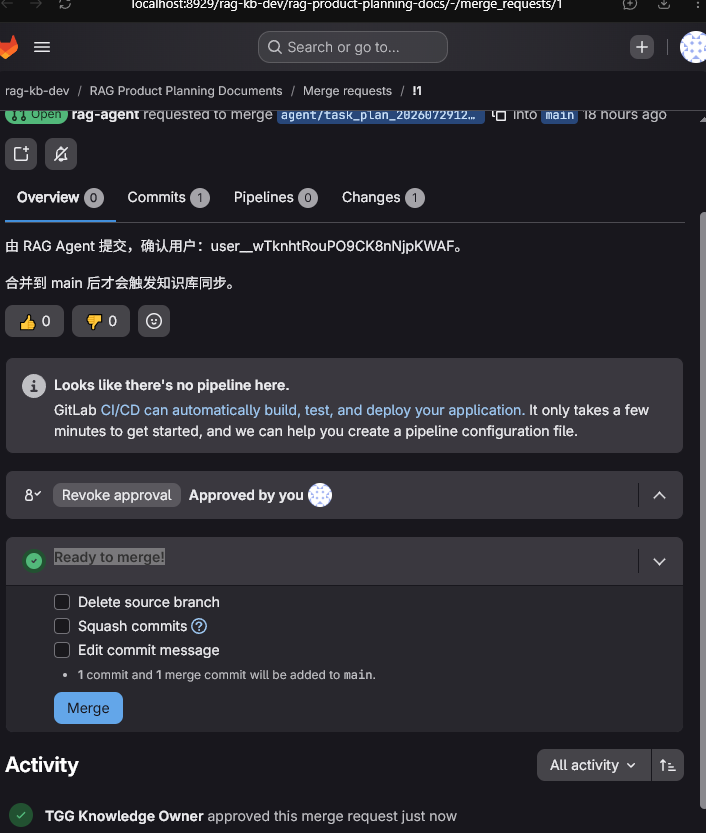

### Annotation 1

“Ready to merge!” 下的三个选项是：

1. **Delete source branch**
   - 合并后删除临时分支 `agent/task_plan_...`。
   - 不会删除合并到 `main` 的报告。
   - 本次是 Agent 临时分支，建议勾选。
2. **Squash commits**
   - 将源分支的多个 Commit 压缩成一个。
   - 当前 MR 只有 1 个 Commit，没有必要，建议不勾选。
3. **Edit commit message**
   - 在合并前修改最终 Merge Commit 的提交说明。
   - 不需要自定义审计说明时，建议不勾选。

本次推荐：只勾选 **Delete source branch**，然后点击 **Merge**。我没有替你修改选项或执行合并。

### Annotation 1

“删除临时分支”是指：MR 合并到 `main` 后，删除提交 MR 使用的源分支，例如：

```
feature/add-report
employee/asset-update
agent/task_plan_...
```

它不会删除：

- 已合并到 `main` 的代码或文档
- Commit 历史
- MR 审核记录
- 员工 GitLab 账号

员工账号提交的 MR 也可以勾选，通常建议勾选，前提是该分支只是本次任务的短期分支。

以下情况不要勾选：

- `develop`、`release` 等长期公共分支
- 其他员工或其他 MR 仍依赖该分支
- 分支中还有尚未合并的后续修改
- 团队规定需要保留该分支

当前 `agent/task_plan_...` 是一次性 Agent 工作分支，合并后删除是合适的。即使删除，必要时仍可根据 Commit SHA 重新创建分支。

# 第一部分：先跟着一个真实业务故事建立整体认知

## 1. 学完这份教程后，你应该能讲清楚什么

假设面试官或新同事问你：

> “公司把 Markdown 文档放在 GitLab 中。员工合并一个 MR 后，
> 这份文档是怎样进入 RAG 知识库的？Agent 修改文档时又怎样保证不会直接写 `main`？”

阅读完成后，你不应该只回答“我们用了 Webhook 和 Worker”。你应该能继续讲清楚：

1. GitLab 为什么是正式文档源，而 Elasticsearch、Milvus 只是派生索引。
2. GitLab 如何用 Webhook 告诉 FastAPI：`main` 已从 Commit A 前进到 Commit B。
3. 为什么 Webhook 收到通知后只登记任务并返回 `202`，不在 HTTP 请求内解析文档。
4. Worker 如何用 Compare API 找到新增、修改和删除的文件。
5. 为什么真正的文件正文必须用固定 Commit SHA 再次读取。
6. Markdown 为什么拆成父块和子块，以及为什么只有子块生成向量。
7. PostgreSQL、Elasticsearch、Milvus 分别保存什么。
8. 为什么新数据写入 ES/Milvus 后，还不能立刻让用户检索。
9. Agent 如何从 TaskPlan 走到临时分支、Commit 和 MR。
10. 服务端代码和 GitLab 保护分支如何共同阻止 Agent 直接写 `main`。

这十个问题会通过四条连续的执行主线来学习，而不是通过背诵模块职责来学习。

## 2. 我们要跟踪的真实场景

技术部有一份文档：

```text
development/release/production-rollback-runbook.md
```

文档不是一行测试文本，而是一份实际可用的生产回滚手册，内容至少包括：

```markdown
# 生产发布回滚手册

## 回滚触发条件

- 新版本错误率连续五分钟超过 2%。
- 核心接口 P95 延迟超过基线两倍。
- 数据迁移出现不可逆异常。

## 回滚执行步骤

1. 值班负责人宣布进入回滚状态。
2. 暂停后续发布流水线。
3. 将应用镜像恢复到上一个已验证版本。
4. 执行健康检查和核心交易回归。
5. 记录回滚时间、负责人和影响范围。

## 回滚后的审计

回滚完成后一个工作日内提交事故复盘，并关联本次 GitLab MR。
```

我们会连续观察四个事件：

### 事件 A：员工创建这份文档

技术部 Developer 在功能分支创建文件并提交 MR。主管作为 Maintainer 审核后合并到
`main`。这时 GitLab 才把该文档视为正式资产。

### 事件 B：后端把新文档同步到 RAG

GitLab 向 FastAPI 发送 Push Webhook。FastAPI 只登记 PostgreSQL 任务。
独立 Worker 读取文件、解析 Markdown、生成 Embedding、写入 ES/Milvus，
验证成功后发布新的知识版本。

### 事件 C：员工更新回滚手册

员工不是简单改一句话，而是补充“数据库回滚”“回滚失败升级机制”等完整章节。
后端必须关闭旧父子块的版本区间，并写入一套完整的新父子块。

### 事件 D：Agent 创建另一份治理文档

普通知识库用户在 React 页面提出文档需求。多 Agent 工作流生成并审查内容，
但它不能直接修改 `main`。人工确认 TaskPlan 后，后端使用专用机器人 Token
创建 `agent/...` 分支、Commit 和 MR。只有 Maintainer 合并后才进入与事件 B
完全相同的同步链路。

这四个事件就是本文的教学主线。

## 3. 先理解故事中会出现的 GitLab 概念

这里不从 Git 命令历史开始讲，只学习当前工程真正会用到的概念。

### 3.1 Project：资产边界，不只是一个文件夹

当前系统使用四个私有 Project：

```text
rag-development-docs
rag-art-docs
rag-product-planning-docs
rag-public-docs
```

以 `rag-development-docs` 为例，它同时提供：

- Git Repository：保存文档和提交历史；
- Branch：保存不同开发线；
- Merge Request：承载审核过程；
- Member / Role：区分 Developer 和 Maintainer；
- Protected Branch：限制谁能直接写 `main`；
- Project Access Token：让后端机器身份调用 API；
- Webhook：在 `main` 变化后主动通知后端。

因此 Project 在本系统中是一个“部门级资产管理边界”。它比普通目录多出了权限、
审计和审核流程。

### 3.2 Branch：让未审核变更与正式文档隔离

`main` 是正式文档线。Developer 或 Agent 的变更先进入临时分支：

```text
main
 ├─ feature/add-rollback-runbook
 └─ agent/task-plan-1234-a1b2c3d4
```

分支的关键意义不是“复制一份文件”，而是：

> 未审核内容可以形成 Commit 和 Diff，但不会改变正式 `main`。

### 3.3 Commit：一次不可变的仓库快照

GitLab API 使用 Commit SHA 标识一次提交，例如：

```text
049c22ae7853e9318018e2e4a32ca49b71ed451d
```

后端不会在同步过程中反复读取“当前最新 main”。它先冻结目标 SHA，
然后所有下载都针对这个 SHA。这样可以避免同步开始时看到版本 B，
解析到一半却又读到版本 C。

### 3.4 Merge Request：把“写文件”和“批准正式资产”分开

MR 包含：

- source branch：本次变更来自哪个分支；
- target branch：准备合并到哪个分支；
- diff：具体改了什么；
- discussion / approval：审核意见；
- merge result：是否进入正式分支。

在当前设计中，创建 MR 不触发 RAG 写入。只有 MR 被合并并真正改变 `main`，
GitLab 才发送正式分支 Push Webhook。

### 3.5 Webhook：GitLab 主动发出的变化通知

Webhook 可以理解为 GitLab 对 FastAPI 说：

```text
Project 21 的 refs/heads/main
已经从 SHA A 前进到了 SHA B。
```

它不是完整文件，也不是后台任务执行结果。它只负责把变化事实及时送到后端。

### 3.6 Project Access Token：后端的机器身份

员工通过用户名和密码登录 GitLab；后端程序不能复用员工密码。
当前系统为每个 Project 配置两枚不同的机器 Token：

| Token 名称 | Project 角色 | Scope | 当前工程用途 |
| --- | --- | --- | --- |
| `rag-sync` | Reporter | `read_api`、`read_repository` | Worker 读取 Branch、Compare、Raw File、Archive |
| `rag-agent` | Developer | `api`、`write_repository` | Agent 创建临时分支、Commit 和 MR |

真正的 Token 值保存在环境变量。数据库只保存环境变量名称，
例如 `GITLAB_DEVELOPMENT_SYNC_TOKEN`，不会把 Secret 明文写进业务表。

## 4. 先记住三个“事实来源”

初学者最容易把 GitLab、PostgreSQL、Elasticsearch、Milvus 都理解成“存文档的数据库”。
这样会导致后续很难理解同步与发布。正确划分是：

| 系统 | 保存的事实 | 丢失后如何恢复 |
| --- | --- | --- |
| GitLab `main` | 正式文档内容、Commit 历史、MR 审核记录 | 它本身就是正式源 |
| PostgreSQL | Source、Delivery、Job、Manifest、MR 映射、正式知识版本 | 可从 GitLab 重建文档状态，但业务审计需要备份 |
| Elasticsearch | 父块和子块、关键词检索字段、版本区间 | 可从 GitLab 重新解析构建 |
| Milvus | 子块向量和版本过滤字段 | 可从 GitLab 重新解析、重新 Embedding |

⭐ 最重要的工程结论：

> GitLab 保存“资产事实”；PostgreSQL 保存“同步与发布事实”；
> ES/Milvus 保存“可以重建的检索派生数据”。

## 5. 全局调用图：先看方向，不要求现在记住细节

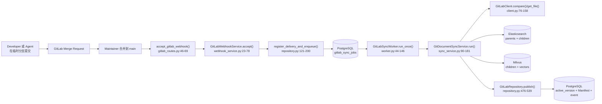

先观察两个进程边界：

1. `accept_gitlab_webhook()` 在 FastAPI API 进程中运行。
2. `GitLabSyncWorker.run_once()` 在单独启动的 Worker 进程中运行。

FastAPI 收到事件不等于 Worker 已经执行，更不等于知识版本已经发布。

---

# 第二部分：第一条主线——一次 main 合并怎样变成同步任务

## 6. 从 Maintainer 点击 Merge 的那一刻开始

假设 Developer 的 MR 已通过审核。Maintainer 点击 Merge 后：

1. GitLab 在 `main` 上生成或快进到新的 Commit。
2. Project 的 Push Webhook 被触发。
3. GitLab 调用：

```text
POST /integrations/gitlab/webhooks/{source_id}
```

请求中至少有三类信息：

- Header `X-Gitlab-Token`：双方约定的 Webhook Secret；
- Header `X-Gitlab-Event-UUID`：本次投递的唯一标识；
- JSON body：Project、ref、before SHA、after SHA 等事件事实。

这里的 `source_id` 不是 GitLab Project ID。它是当前系统 `gitlab_sources`
中的业务主键，用于找到 Project 配置、正式分支和 Secret 环境变量名。

## 7. FastAPI 路由为什么只做很少的工作

入口是：

```text
src/fast_app/api/gitlab_routes.py
accept_gitlab_webhook()：46-69 行
```

关键代码如下：

```python
source = await repository.get_source(source_id)
if source is None or source.status != "active":
    raise AppServiceError("GitLab Source 不存在或未启用")

raw_body = await request.body()
return await GitLabWebhookService(repository).accept(
    source=source,
    raw_body=raw_body,
    token=x_gitlab_token,
    event_uuid=x_gitlab_event_uuid,
    event_type=x_gitlab_event,
)
```

不要只看到“路由把参数传给 Service”。这里存在一个清晰的分层：

- API 层理解 HTTP：Path、Header、Request Body、状态码；
- Webhook Service 理解 GitLab 事件：Secret、Project、Branch、SHA；
- Repository 理解数据库事务：Delivery 去重、Source 状态、Job 入队。

如果把下载 Archive、解析 Markdown、Embedding 都塞进路由，
GitLab 会长时间等不到响应；反向代理也可能超时并触发重投。
所以路由只负责把 HTTP 请求安全地交给业务层。

## 8. Webhook Service 为什么必须“先验 Secret，再信 Body”

核心函数：

```text
GitLabWebhookService.accept()
src/fast_app/integrations/gitlab/webhook_service.py:23-78
```

函数第一条业务语句是：

```python
self._verify_secret(source, token)
```

之后才执行：

```python
payload = GitLabPushWebhook.model_validate_json(raw_body)
```

这个顺序很重要。请求体里的 `project.id`、`ref` 和 `after` 都是请求者提交的文本。
在 Secret 验证前，它们不能被当成可信事实。

`_verify_secret()` 在 81-84 行读取 Source 配置的环境变量，并使用：

```python
hmac.compare_digest(expected, received)
```

Webhook Secret 与 Project Access Token 不是同一种凭据：

- Webhook Secret 用于证明“GitLab 发来的请求知道双方共享 Secret”；
- Project Access Token 用于证明“后端有权调用 GitLab API”。

方向也相反：

```text
Webhook Secret：GitLab → FastAPI
Project Access Token：FastAPI / Worker → GitLab
```

## 9. 为什么临时分支 Push 和 MR 创建都不会进入同步队列

`accept()` 在 39-44 行执行四个过滤条件：

```python
if (
    payload.object_kind != "push"
    or payload.project.id != source.project_id
    or payload.ref != f"refs/heads/{source.target_branch}"
    or payload.after == ZERO_SHA
):
    return GitLabWebhookAcceptedResponse(accepted=False, ...)
```

逐项理解：

1. `object_kind != "push"`
   MR 创建、评论等事件不属于正式分支 Push。

2. `payload.project.id != source.project_id`
   即使 URL 中使用了合法 `source_id`，请求体也必须属于同一个 Project。

3. `payload.ref != refs/heads/main`
   `agent/...` 或 `feature/...` 分支 Push 仍是待审核内容。

4. `payload.after == ZERO_SHA`
   Git 使用全零 SHA 表示分支删除，不能把它当作目标版本下载。

因此，“Agent 已创建 Commit”与“知识库已更新”之间有一道明确边界：

> 只有正式 Source 配置的目标分支发生 Push，才登记同步任务。

## 10. 同一个 Webhook 为什么可能到达两次

网络世界中，请求发出成功不等于调用方收到响应。

可能出现：

```text
GitLab 发送事件
  → FastAPI 已经写入数据库
  → 返回 202 的网络连接中断
  → GitLab 认为失败并重投
```

如果没有去重，同一个 Commit 会创建两个任务。

当前代码优先使用 `X-Gitlab-Event-UUID`。如果 GitLab 没提供 UUID，
则用下面的不变事实计算替代键：

```text
project_id + before_sha + after_sha + payload_hash
```

`gitlab_webhook_deliveries.delivery_key` 是主键。第一次写入成功后，
同一个 key 的后续投递会返回 `duplicate=True`，不会再次创建任务。

## 11. 一次数据库事务如何同时保证“记了事件，也一定有任务”

函数位置：

```text
GitLabRepository.register_delivery_and_enqueue()
src/fast_app/integrations/gitlab/repository.py:121-200
```

它在同一个事务中完成三件事：

1. 插入 `gitlab_webhook_deliveries`；
2. 把 Source 的 `desired_sha` 推进到 `after_sha`；
3. 合并现有活动任务，或者创建新的 `gitlab_sync_jobs`。

为什么必须同一事务？

如果先提交 Delivery，再创建 Job，而第二步失败，数据库会留下：

```text
事件显示“已接收”
但系统中没有任何任务处理它
```

之后 GitLab 重投同一 UUID，又会被 Delivery 去重挡住，文档就永久漏同步。
所以 Delivery 与 Job 必须一起成功或一起回滚。

## 12. `last_synced_sha` 和 `desired_sha` 是怎样配合的

这两个字段解决的是“提交速度可能快于同步速度”的问题。

- `last_synced_sha`：已经成功发布到 RAG 的 Git Commit；
- `desired_sha`：当前 Source 最终必须追赶到的最新 Git Commit。

假设系统状态按时间变化：

| 时刻 | 发生的事情 | `last_synced_sha` | 运行任务 | `desired_sha` |
| --- | --- | --- | --- | --- |
| T0 | 已发布 A | A | 无 | A |
| T1 | 收到 B | A | pending B | B |
| T2 | Worker 开始 B | A | running B | B |
| T3 | 又收到 C | A | running B | C |
| T4 | B 发布 | B | 完成 B | C |
| T5 | 创建追赶任务 | B | pending C | C |
| T6 | C 发布 | C | 无 | C |

注意 T3：正在运行的任务仍处理冻结的 B，不能把执行中的目标偷偷改成 C。
但 Source 的 `desired_sha` 会前进到 C。任务完成后，
`worker.py:110-124` 检测两者不同并创建追赶任务。

## 13. Webhook 完整时序图

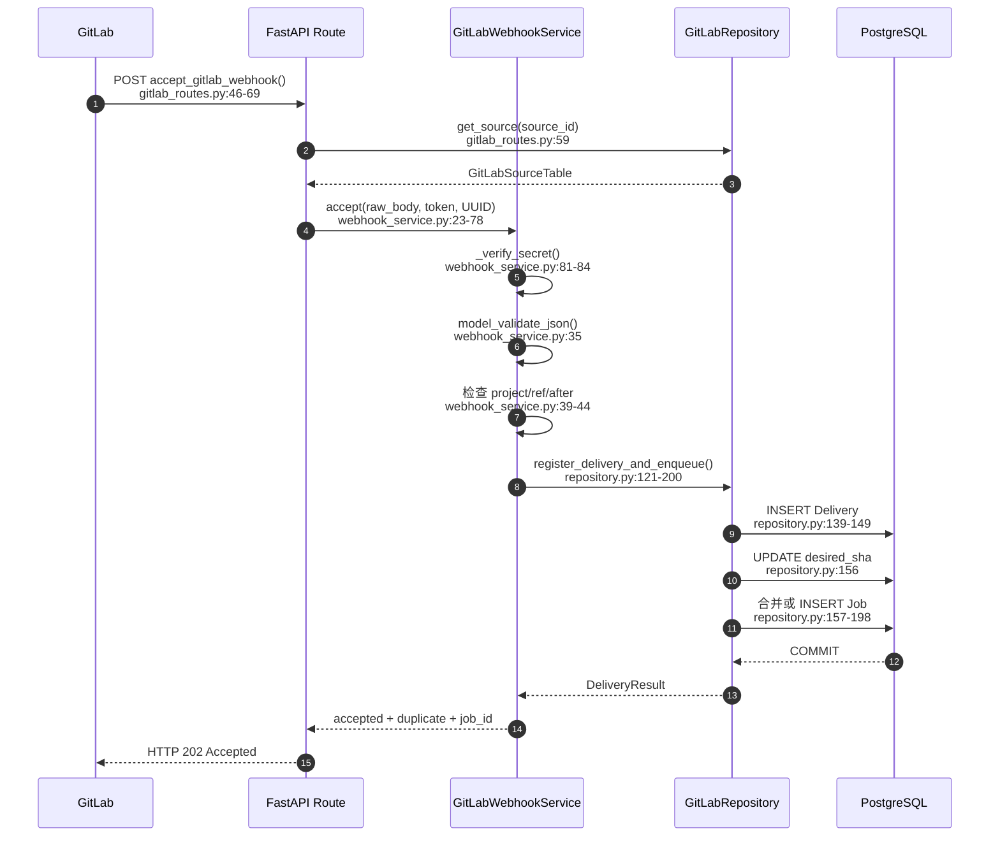

⭐ 学习检查点：

`202 Accepted` 表示事件已安全登记，不表示 Markdown 已解析，
也不表示 ES/Milvus 已更新。

---

# 第三部分：第二条主线——Worker 怎样把新增 Markdown 变成可检索知识

## 14. 为什么 Worker 必须是 FastAPI 之外的独立进程

一次 GitLab 同步可能包含：

- 下载多个文件或整个 Archive；
- 解析 Markdown、PPTX、XLSX；
- 为大量子块调用 Embedding；
- 写 Elasticsearch；
- 写 Milvus；
- 反查两套存储并验证；
- 在 PostgreSQL 中发布版本。

这些操作可能持续几十秒甚至更久。如果放在 Webhook 请求中：

- GitLab 容易超时重投；
- FastAPI Worker 被长任务占用；
- 多文档提交会降低普通 RAG 请求响应能力；
- 进程重启后难以恢复任务状态。

所以当前工程把 `gitlab_sync_jobs` 当作 PostgreSQL 队列，
由单独进程轮询处理。

启动常驻 Worker：

```powershell
$env:PYTHONPATH = "src"
.\.venv\Scripts\python.exe -m fast_app.integrations.gitlab.worker --no-es-auth
```

入口是：

```text
run_worker()
src/fast_app/integrations/gitlab/worker.py:224-263
```

它创建数据库 Session Factory、ES Client、Milvus Client、Embedding Client，
然后循环调用 `GitLabSyncWorker.run_once()`。队列为空时才按配置休眠。

FastAPI 启动不会自动创建这个 Worker。

## 15. 多个 Worker 为什么不会抢到同一个任务

领取函数：

```text
GitLabRepository.claim_next()
src/fast_app/integrations/gitlab/repository.py:202-241
```

关键数据库语句是：

```python
.with_for_update(skip_locked=True)
```

可以把两个 Worker 的并发过程想成：

```text
Worker-1 查询最早任务并锁住 Job-10
Worker-2 同时查询
Worker-2 看到 Job-10 已锁定，直接跳过它，尝试领取 Job-11
```

领取成功后还会写入：

```text
status = running
phase = claiming
worker_id = 主机名:进程号
lease_expires_at = 当前时间 + 租约秒数
attempt_count += 1
```

`FOR UPDATE SKIP LOCKED` 解决“同时领取”；
`worker_id + lease_expires_at` 解决“领取后进程崩溃”。

`GitLabSyncWorker._heartbeat()`（`worker.py:205-215`）定期续租。
如果 Worker 崩溃，心跳停止，租约到期后其他 Worker 可以重新领取。

## 16. `run_once()` 如何把领取事务与耗时工作分开

`GitLabSyncWorker.run_once()` 位于 `worker.py:44-146`。

它先在一个短 Session 中领取任务：

```python
async with self.session_factory() as session:
    job = await GitLabRepository(session).claim_next(...)
```

领取完成、事务提交、行锁释放后，才开启心跳并执行下载与 Embedding。

为什么不一直持有领取事务？

如果一个 90 秒的 Embedding 过程一直占着事务和行锁：

- 数据库连接池会被长任务消耗；
- 管理接口更难读取任务状态；
- 其他 Worker 的调度会受到影响。

因此“领取任务”是短事务，“执行任务”是可恢复的长流程。

## 17. 新增文档案例的输入状态

假设 `production-rollback-runbook.md` 合并前：

```text
Source.last_synced_sha = A
Source.desired_sha = B
Job.base_sha = A
Job.target_sha = B
Job.mode = incremental
旧 Manifest 中没有该 repository_path
```

Worker 创建的 GitLab Client 使用：

```text
source.sync_token_env → GITLAB_DEVELOPMENT_SYNC_TOKEN → rag-sync Token
```

代码位置：

```text
GitLabSyncWorker._client()
worker.py:177-184
```

该 Token 只有只读能力。即使同步代码出现错误，它也不能创建 Commit 或修改分支。

## 18. 第一步：用 Compare API 找到新增路径

同步总编排：

```text
GitDocumentSyncService.run()
src/fast_app/integrations/gitlab/sync_service.py:90-181
```

当 `job.mode == "incremental"` 且存在 `base_sha` 时，调用：

```python
await self._prepare_incremental(client, source, job, existing)
```

`_prepare_incremental()` 位于 `sync_service.py:331-408`，先调用：

```python
compare = await client.compare(
    source.project_id,
    str(job.base_sha),
    job.target_sha,
)
```

底层请求类似：

```text
GET /api/v4/projects/21/repository/compare
    ?from=A
    &to=B
    &straight=true
    &page=1
    &per_page=100
```

新增文件对应的 Diff 事实通常是：

```text
old_path = development/release/production-rollback-runbook.md
new_path = development/release/production-rollback-runbook.md
new_file = true
deleted_file = false
renamed_file = false
```

代码把 `new_path` 放入 `changed_paths`。

### 18.1 为什么 Compare API 还需要分页

一次 Commit 或一次 MR 可能修改超过 100 个文件。
`GitLabClient.compare()`（`client.py:115-158`）读取响应头 `X-Next-Page`：

```python
next_page = response.headers.get("X-Next-Page", "").strip()
if not next_page:
    break
page = int(next_page)
```

如果只读取第一页，后面的文件会永久漏同步。
分页不是性能优化细节，而是数据完整性要求。

### 18.2 为什么不能直接使用 Webhook 中的 commits

Webhook 的职责是通知，不是完整差异传输。Payload 可能被截断，
也可能只带有限数量 Commit。Worker 必须从已发布 SHA A 到目标 SHA B
重新调用 Compare API。

## 19. 第二步：用 Raw File API 读取固定 SHA 的完整正文

知道路径后，代码调用：

```python
content = await client.get_file(
    source.project_id,
    path,
    job.target_sha,
)
```

函数位置：

```text
GitLabClient.get_file()
client.py:76-88
```

请求的是：

```text
GET /api/v4/projects/{project_id}/repository/files/{encoded_path}/raw?ref=B
```

这里有两个教学重点：

1. 路径使用 URL 编码，`development/release/...` 不会被误解为 API 路径层级。
2. `ref` 使用冻结的 Commit B，不使用会继续变化的 `main`。

Diff 只用来判断“哪些路径变了”；Raw File 才提供“目标版本的完整正文”。

## 20. 第三步：把 GitLab 路径转换成稳定文档身份

适配器：

```text
GitLabProjectSource
src/fast_app/integrations/gitlab/project_source.py:23-114
```

路径先经过 `normalize_path()`：

```python
value = repository_path.replace("\\", "/").strip("/")
path = PurePosixPath(value)
if not value or path.is_absolute() or ".." in path.parts:
    raise ValueError("GitLab repository_path 非法")
```

然后生成：

```text
source_uri = gitlab://<host_id>/<project_id>/<repository_path>
doc_id = sha256("gitlab:<host_id>:<project_id>:<repository_path>")
```

为什么 `doc_id` 不包含 Commit SHA？

因为它表示“逻辑文档身份”。同一路径从版本 B 更新到版本 C，
仍然是同一个文档。版本变化由 `source_revision` 和知识版本字段表达。

为什么不能使用 Archive 解压后的临时目录？

因为临时目录每次都不同：

```text
C:\Temp\rag-gitlab-a1\...
C:\Temp\rag-gitlab-b7\...
```

如果它进入 `doc_id`，每次同步都会被误判为新增文档。

## 21. 第四步：Manifest 为什么不只保存文件 hash

`_prepare_paths()`（`sync_service.py:410-532`）生成 Manifest，至少包含：

```text
repository_path
doc_id
blob_id
source_revision
content_hash
acl_hash
parser_version
chunk_strategy_version
chunk_config_fingerprint
document_type
acl_json
```

对于首次出现的路径：

```text
old Manifest = None
change_type = added
```

Manifest 保存解析器和分块配置，是因为“Git 文件没变”不一定意味着
“RAG 派生数据不用重建”。

例如把 Markdown 子块上限从 400 tokens 调整为 300 tokens：

- GitLab 文件没有变化；
- 旧 Chunk 形状已经不符合新策略；
- `chunk_config_fingerprint` 变化；
- 系统必须重新构建父子块。

## 22. 第五步：Markdown 如何形成父块和子块

关键函数：

```text
GitDocumentSyncService._build_artifacts()
sync_service.py:534-613
```

执行顺序：

```text
GitLab Raw Markdown
  → GitLabProjectSource.build_text_document()
  → LoadedDocument
  → MarkdownHierarchyBuilder.build()
  → MarkdownParentChunk[]
  → KnowledgeChunk[]
```

`LoadedDocument.metadata` 在进入 Builder 前已经带有：

```text
doc_id
source_path
source_uri
source_id
source_revision
document_type
visibility
allowed_departments
allowed_users
```

这意味着父块和子块继承的是同一份可信 GitLab 身份与 ACL。

### 22.1 父块负责什么

父块通常覆盖一个较完整的章节，例如“回滚执行步骤”。
它只写 Elasticsearch，用于子块命中后的上下文扩展。

### 22.2 子块负责什么

子块更小，适合精确召回。例如：

```text
“将应用镜像恢复到上一个已验证版本，并执行健康检查。”
```

子块：

- 写 Elasticsearch，参与关键词检索；
- 写 Milvus，参与向量检索；
- `search_text` 用作关键词与 Embedding 输入；
- 保存父块引用。

### 22.3 为什么父块不写 Milvus

如果父块和子块都参与向量召回，同一段正文可能用两种粒度重复占据 Top K，
降低结果多样性。当前策略是：

```text
子块负责“找到”
父块负责“补全上下文”
```

## 23. 第六步：只为子块生成 Embedding

`_prepare_paths()` 在 `sync_service.py:516-523` 执行：

```python
vectors = await self.embedding_client.embed_documents(
    [chunk.search_text or chunk.content for chunk in chunks]
)
```

这里必须保证：

```text
chunks[0] ↔ vectors[0]
chunks[1] ↔ vectors[1]
...
```

后续写 Milvus 时通过相同顺序把向量与子块身份组合。

## 24. 第七步：申请候选知识版本，而不是立刻覆盖正式数据

`GitLabRepository.reserve_publication()` 位于 `repository.py:401-447`。

假设当前正式版本是 7，它会创建：

```text
previous_version = 7
candidate version = 8
status = building
```

`knowledge_publication_state` 的唯一一行会被 `FOR UPDATE` 锁定。
不同 Source 可以并行下载和解析，但候选版本号和最终发布必须串行，
否则两个 Worker 可能都认为自己应该发布版本 8。

## 25. 第八步：新增文档分别写入三个存储

### 25.1 Elasticsearch

写入：

```text
Markdown parents
Markdown children
```

每条记录都有：

```text
physical_record_id
logical_record_id
doc_id
record_type
source_id
source_revision
valid_from_version = 8
valid_to_version = 0
```

### 25.2 Milvus

只写：

```text
children + vectors
```

版本和 ACL 字段是可过滤的标量字段，不依赖只在 JSON metadata 中过滤。

### 25.3 PostgreSQL

此时还没有切换正式指针。PostgreSQL 中先有候选 Publication；
Manifest 和 `active_version` 要等验证通过后在 `publish()` 中提交。

## 26. 第九步：反查候选数据，证明它真的写完整了

验证函数：

```text
GitDocumentSyncService._verify_candidate()
sync_service.py:643-796
```

它不是只检查“写入函数没有抛异常”，而是反查：

- ES 中候选版本的父块和子块 ID 集合；
- ES 顶层版本字段与 metadata；
- Milvus 中候选版本的子块 ID 集合；
- 向量维度；
- ACL；
- `source_revision`；
- `chunk_strategy_version`；
- 子块引用的物理父块是否存在。

只有全部收敛，才允许调用 `publish()`。

## 27. 第十步：一次 PostgreSQL 事务把候选版本变成正式版本

发布函数：

```text
GitLabRepository.publish()
repository.py:476-539
```

它先重新检查：

- 正式版本仍等于候选的 `previous_version`；
- Job、Source、Publication 仍存在；
- 当前 Worker 仍持有有效租约。

然后在一个事务中：

1. 新增 `gitlab_documents` Manifest；
2. 把 Publication 标记为 `published`；
3. 把 `active_version` 从 7 切到 8；
4. 把 Source 的 `last_synced_sha` 更新为 B；
5. 把 Job 标记为 `succeeded/published`；
6. 写入 `knowledge_change_events`，变化类型为 `added`。

到这里，下一次 RAG 请求才会看到新文档。

## 28. 新增文档完整时序图

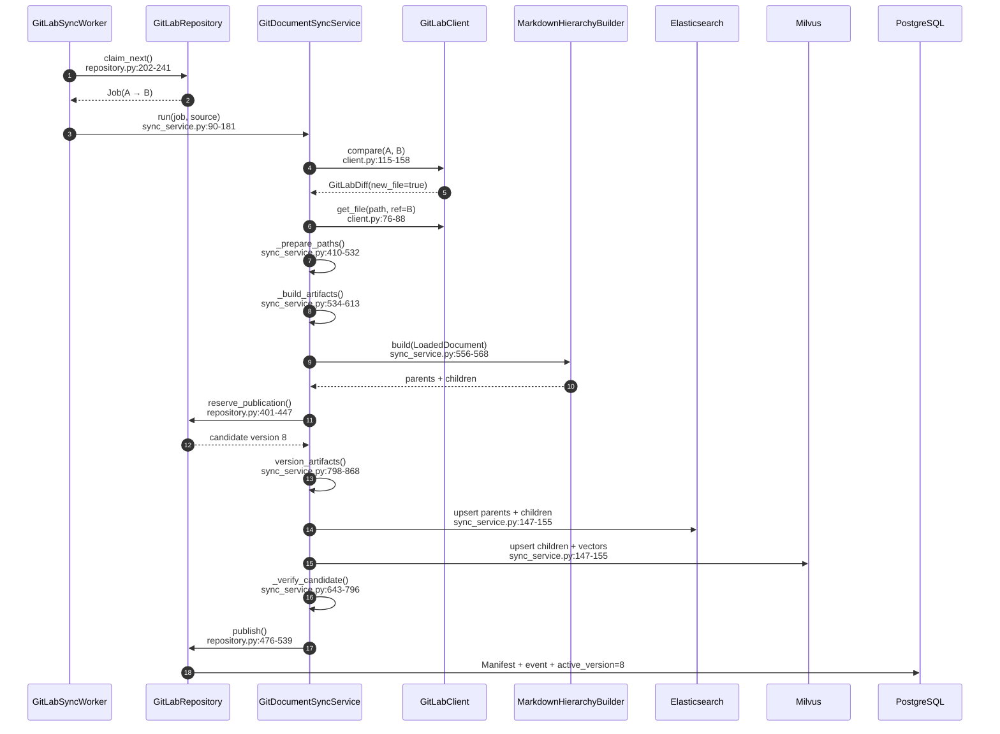

---

# 第四部分：第三条主线——修改文档时怎样避免新旧内容混用

## 29. 修改场景与新增场景的共同部分

一周后，员工更新回滚手册：

- 新增“数据库迁移回滚”章节；
- 新增“回滚失败后的升级路径”；
- 调整“事故复盘”的责任人和时限；
- 更新 ACL Sidecar，使文档仅技术部可检索。

MR 合并后，Webhook 入队、Worker 领取、Compare、Raw File 下载都与新增场景相同。
真正不同的是：

```text
旧 Manifest 已经存在
旧 ES/Milvus 父子记录正在服务用户
系统不能简单覆盖或先删除旧记录
```

## 30. 系统怎样判断“这篇文档必须重建”

`_prepare_paths()` 在 `sync_service.py:473-485` 比较：

```python
unchanged = (
    old is not None
    and old.content_hash == content_hash
    and old.acl_hash == acl_hash
    and old.parser_version == adapter.parser_version
    and old.chunk_strategy_version == strategy_version
    and old.chunk_config_fingerprint == config_fingerprint
)
```

逐项理解：

- `content_hash`：正文或结构化内容是否变化；
- `acl_hash`：检索权限是否变化；
- `parser_version`：解析器语义是否变化；
- `chunk_strategy_version`：父子分块策略是否变化；
- `chunk_config_fingerprint`：token、字符、overlap 配置是否变化。

任意一项变化，都以文档为单位重建完整父子集合。

当前实现不做 Chunk 级补丁。原因是：

- 标题变化可能改变后续多个块的 section path；
- overlap 变化会影响相邻子块；
- 父块边界变化会改变多个 child 的 parent 引用；
- ACL 变化必须覆盖整篇文档。

## 31. 为什么更新不能直接覆盖旧 ES/Milvus 记录

假设用户请求 Q1 开始时，正式版本是 7。
Worker 同时在构建版本 8。

如果 Worker直接覆盖同一个 Chunk ID：

```text
Q1 的向量检索可能读到版本 7
Q1 的父块扩展却读到版本 8
```

同一次回答会混合两个版本的需求，造成事实不一致。

当前系统使用版本区间：

| 记录 | `valid_from_version` | `valid_to_version` | 对版本 7 可见 | 对版本 8 可见 |
| --- | ---: | ---: | --- | --- |
| 旧子块 | 7 | 8 | 是 | 否 |
| 旧父块 | 7 | 8 | 是 | 否 |
| 新子块 | 8 | 0 | 否 | 是 |
| 新父块 | 8 | 0 | 否 | 是 |

`valid_to_version = 0` 表示还没有结束版本。

## 32. 更新时的实际写入顺序

候选版本为 8 时，`run()` 按以下顺序工作：

1. `close_rag_docs_for_version()`
   把变化文档的旧 ES/Milvus 记录设置为 `valid_to_version=8`。

2. `version_artifacts()`
   为新父块和子块生成版本 8 的物理 ID。

3. `upsert_rag_stores()`
   ES 写新父块和新子块；Milvus 写新子块和向量。

4. `_verify_candidate()`
   反查版本 8 的集合、向量、ACL、父子引用。

5. `publish()`
   更新原 `gitlab_documents` Manifest，并把正式版本切到 8。

在第 5 步之前，所有新请求仍冻结版本 7，因此候选记录不会提前对外可见。

## 33. 逻辑 ID 与物理 ID 为什么必须同时存在

`version_artifacts()` 位于 `sync_service.py:798-868`。

Builder 生成的是跨版本稳定的逻辑 ID：

```text
logical_record_id = “回滚触发条件”这个逻辑块的身份
```

发布时派生物理 ID：

```text
physical_record_id = sha256(logical_record_id + version)
```

于是同一个逻辑块在两个版本中可以安全共存：

```text
logical child C
 ├─ physical child C@7
 └─ physical child C@8
```

前端和通知使用稳定的 `doc_id`、`logical_chunk_id`；
ES/Milvus 内部写入与关联使用 `physical_record_id`。

## 34. 为什么子块要保存 `physical_parent_id`

只有 `logical_parent_id` 还不够。

假设父块 P 在版本 7 和 8 都存在：

```text
logical parent P
 ├─ physical parent P@7
 └─ physical parent P@8
```

版本 7 的 child 必须明确引用 P@7，而不是只说“我属于逻辑 P”。
所以 `version_artifacts()` 在 837-857 行把：

```text
logical_parent_id → 当前候选版本的 physical_parent_id
```

这样旧子块无法扩展到新父块。

## 35. RAG 请求如何冻结知识版本

每次请求在入口只读取一次正式 `active_version`，并把它放进请求状态。
ES、Milvus和父块扩展统一使用：

```text
valid_from_version <= request_version
AND
(valid_to_version = 0 OR valid_to_version > request_version)
```

因此：

```text
请求 Q1 在版本 7 开始
  → 整次请求都读版本 7

Worker 在 Q1 期间发布版本 8
  → Q1 不切换

请求 Q2 在发布后开始
  → Q2 读版本 8
```

如果业务不能接受旧版本，React 可提交 `min_knowledge_version`。
正式版本不足时后端返回结构化：

```text
409 knowledge_version_not_ready
```

这让调用方明确选择“等待新版本”，而不是误以为旧内容是最新内容。

## 36. 修改文档完整时序图

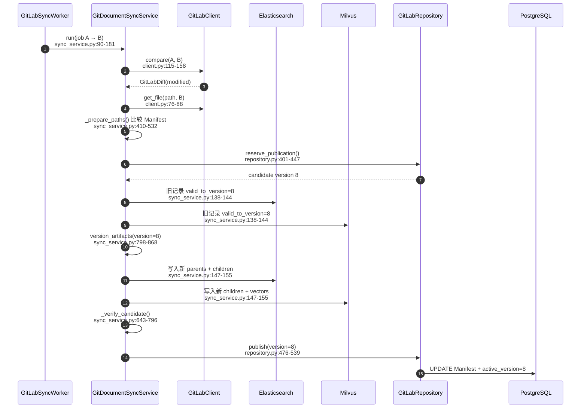

## 37. 新增、修改、删除、重命名最终如何表达

| GitLab 变化 | Manifest 行为 | ES/Milvus 行为 | 通知 |
| --- | --- | --- | --- |
| 新增 | INSERT 新 `doc_id` | 写入新版本记录 | `added` |
| 修改 | UPDATE 原 `doc_id` | 关闭旧版本，写新版本 | `modified` |
| 删除 | Manifest 标记删除/移出当前集合 | 关闭旧版本，不写新记录 | `deleted` |
| 重命名 | 旧路径删除 + 新路径新增 | 关闭旧 `doc_id`，写新 `doc_id` | `deleted` + `added` |

重命名不用猜测“它是不是同一篇文档”。因为稳定身份包含规范化路径，
路径变化就明确表达为旧身份结束、新身份开始。

---

# 第五部分：第四条主线——Agent 怎样安全地创建临时分支和 MR

## 38. Agent 完成写作，不等于 Agent 获得仓库控制权

用户可能在 React 中提出：

> “请综合内部 GitLab 发布规范、权限治理和 Agent 操作要求，
> 创建一份《Agent 文档 MR 治理规范》。”

多 Agent 工作流会经历 Researcher、Writer、Reviewer、Coordinator。
这些角色负责研究和生成内容，但下面这些不是模型可以信任地决定的：

```text
Project
repository_path
doc_id
ACL
正式分支
base SHA
是否已经人工确认
```

它们必须由 TaskPlan、服务器配置、Manifest、当前用户和数据库状态确定。

## 39. 从用户请求到确认页面的前半段

Agent 文档操作首先经过：

```text
Router
  → 文档多 Agent 工作流
  → dry-run
  → TaskPlan
  → React 展示路径、Diff、风险和权限
  → 用户点击确认
```

确认动作应该调用专用控制 API，而不是只在聊天中输入“确认”。
确认后，服务端进入：

```text
KnowledgeDocumentManagementService.execute_confirmed_actions()
src/fast_app/services/knowledge/knowledge_document_management_service.py:227-296
```

当 `GITLAB_AGENT_CHANGES_ENABLED=true` 时，它不会直接写本地文件或 ES/Milvus，
而是调用：

```python
submitted = await self.gitlab_change_service.submit_changes(
    task_plan_id=task_plan_id,
    actions=[...],
    user=user,
)
```

返回消息明确说明：

```text
已提交 GitLab Merge Request；
main 合并前不会修改 Elasticsearch 或 Milvus。
```

## 40. Agent 使用哪一种身份访问 GitLab

`GitLabAgentChangeService._client()` 位于
`agent_change_service.py:382-390`。

它读取：

```text
source.agent_token_env
  → GITLAB_DEVELOPMENT_AGENT_TOKEN
  → rag-agent Project Access Token
```

这枚 Token：

- 属于 Project，不属于员工；
- 角色为 Developer；
- 用于分支、Commit 和 MR；
- 不使用 `root`；
- 不使用普通员工账号；
- 不使用 Maintainer 的个人 Token；
- 不复用 Worker 的只读 `rag-sync` Token。

即使 Agent 服务使用了 Developer Token，GitLab 的 Protected Branch
仍应禁止 Developer 直接 Push `main`。

## 41. 第一步：把动作定位到唯一 Project 和路径

`submit_changes()`（`agent_change_service.py:137-167`）先解析动作，
再按 `source_id` 分组。一个 TaskPlan 如果涉及两个部门，
会产生两个独立 MR，避免跨 Project 的半完成提交。

真正决定位置的是：

```text
_resolve_location()
agent_change_service.py:349-380
```

### 41.1 修改已有文档

已有文档带 `doc_id`。服务端查询已发布 Manifest：

```python
document = await self.repository.get_document(doc_id)
source = await self.repository.get_source(document.source_id)
return source, document.repository_path, document
```

因此 Project 和路径来自已发布事实，不让模型重新猜测。

### 41.2 创建新文档

新文档没有 Manifest。服务端使用已经确认的部门找到唯一 Source：

```python
source = await self.repository.find_source_by_department(department_code)
```

但路径仍保留完整规范化结果：

```text
development/gitlab-agent-mr-governance.md
```

不能因为 Project 已经代表 development 部门，就擅自改成：

```text
gitlab-agent-mr-governance.md
```

路径必须在 TaskPlan、dry-run、Commit、Compare、Manifest 和通知中保持一致。

## 42. 第二步：服务端生成分支名

`_branch_name()` 位于 `agent_change_service.py:401-406`：

```text
agent/<task_plan_id安全slug>-<task_plan_id与部门的8位hash>
```

例如：

```text
agent/task-plan-20260728-4d92c1ab
```

分支名不是 LLM 输出。确定性命名带来两个好处：

1. 同一个 TaskPlan 重试时能找到原分支；
2. 不允许模型把 Commit 目标伪装成 `main`。

## 43. 第三步：从正式分支当前 SHA 创建临时分支

核心编排：

```text
GitLabAgentChangeService._submit_project()
agent_change_service.py:169-264
```

它先读取：

```python
main_sha = await client.get_branch_head(
    source.project_id,
    source.target_branch,
)
```

然后：

```python
await client.create_branch(
    source.project_id,
    branch=branch_name,
    ref=main_sha,
)
```

注意两个参数的来源：

- `branch_name`：服务端确定性生成的 `agent/...`；
- `ref`：服务端配置的正式分支当前 SHA。

模型不能提供任意源分支或任意基线。

## 44. 第四步：人工确认后仍要重新检查 main

用户看到 dry-run 到点击确认之间可能间隔几分钟。
这期间另一名员工可能已经修改目标文档。

`_build_commit_actions()` 位于 `agent_change_service.py:266-320`。
对于 update/delete，它重新读取 `base_sha` 文件并检查：

```python
current_hash = hashlib.sha256(current).hexdigest()
if (
    item.expected_before_hash
    and current_hash != item.expected_before_hash
):
    raise AppServiceError(
        "GitLab main 文档已变化，拒绝执行旧的确认计划"
    )
```

同时提交动作带：

```python
"last_commit_id": base_sha
```

两层乐观并发检查分别表达：

- 内容 hash：用户确认的内容前提是否仍成立；
- `last_commit_id`：GitLab 执行 update/delete 时文件基线是否仍是该 Commit。

旧计划不会静默覆盖新内容，而是失败并要求重新生成预览。

## 45. 第五步：Commit 只能创建在临时分支

`GitLabClient.create_commit()` 位于 `client.py:196-213`。

调用方传入：

```python
branch=branch_name
```

而不是：

```python
branch=source.target_branch
```

CREATE 动作包含：

```text
action=create
file_path=规范化完整路径
content=已确认正文
encoding=text
```

UPDATE 动作还包含 `last_commit_id`。

## 46. 第六步：MR 的目标分支来自 Source 配置

创建 MR：

```python
merge_request = await client.create_merge_request(
    source.project_id,
    source_branch=branch_name,
    target_branch=source.target_branch,
    ...
)
```

`source.target_branch` 由管理员注册 Source 时配置，当前是 `main`。
它不是模型输出，也不是前端自由传入字段。

因此防错链路是：

```text
服务端生成 agent/... 分支
  → Commit 固定写该临时分支
  → MR target 读取 Source.main
  → GitLab Protected Branch 禁止 Developer 直接 Push main
```

服务端约束正常代码路径，GitLab 保护分支约束最终仓库权限。

## 47. 为什么重复点击确认不会创建多个 MR

React 请求可能因网络超时重发。`_submit_project()` 先按：

```text
task_plan_id + source_id
```

查询 `gitlab_change_requests`。

恢复规则是：

1. 已有 MR URL：直接返回原 MR；
2. 已有数据库记录但分支不存在：创建分支；
3. 分支仍等于 base SHA：创建 Commit；
4. 分支已有 Commit：复用该 Commit；
5. 已有 MR：复用；
6. 没有 MR：才创建。

这不是简单的“接口加一个幂等键”，而是把外部 GitLab 状态与本地业务状态逐步对齐。

## 48. Agent MR 完整时序图

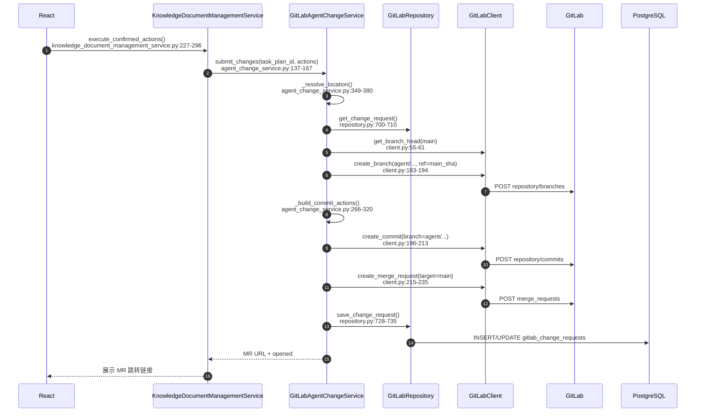

## 49. MR 合并后的链路为什么与人工提交完全相同

Agent 创建 MR 后不会调用同步 Service，也不会写 ES/Milvus。

Maintainer 合并后：

```text
GitLab main Push
  → Webhook
  → PostgreSQL Job
  → 独立 Worker
  → Compare / Raw File
  → 解析与 Embedding
  → 候选版本验证
  → 正式发布
```

这样无论内容来自人工编辑还是 Agent，正式知识都只有一个入口：

> 合并后的 GitLab `main`。

---

# 第六部分：关键函数精讲——不只知道位置，还要理解输入、分支和输出

## 50. `GitLabClient._request()`：所有 GitLab HTTP 调用的协议底座

位置：

```text
src/fast_app/integrations/gitlab/client.py:259-310
```

### 它接收什么

- HTTP method；
- GitLab API v4 相对路径；
- query、form 或 JSON 参数；
- 少量允许特殊处理的状态码，例如可选文件读取允许 404。

### 它按什么顺序执行

1. 拼接 `{base_url}/api/v4{path}`；
2. 添加 `PRIVATE-TOKEN`；
3. 使用共享 `httpx.AsyncClient` 发请求；
4. 网络异常时有限指数退避；
5. 429 或 5xx 时读取 `Retry-After` 或指数退避；
6. 普通 4xx 立即映射为外部服务错误；
7. 正常响应返回给上层。

### 为什么普通 4xx 不自动重试

401、403、404、400 通常意味着：

- Token 错误；
- Scope 不足；
- Project 或路径错误；
- 参数非法。

重复三次不会让错误自己消失，反而会延迟暴露确定性问题。
所以只有网络错误、429 和 5xx 被视为可重试故障。

### 调试时先看什么

遇到 GitLab 请求失败时，先区分：

```text
网络/429/5xx → 可能是瞬时故障
401/403      → Token 或角色/Scope
404          → Project、Branch、Path、URL 编码
400          → GitLab 请求参数或分支状态
```

## 51. `GitLabWebhookService.accept()`：外部事件进入系统的信任边界

位置：

```text
webhook_service.py:23-78
```

### 输入

- 数据库已确认的 Source；
- 原始请求体 bytes；
- Webhook Token；
- Event UUID；
- Event Type。

### 核心分支

```text
Secret 无效
  → 立即拒绝

Payload 不是合法 Schema
  → 结构化业务错误

不是指定 Project 的正式分支 Push
  → accepted=false，不入队

合法正式 Push
  → 生成 delivery_key 并登记任务
```

### 输出

`GitLabWebhookAcceptedResponse` 告诉 GitLab/调用方：

- 是否接受；
- 是否重复；
- 对应 Job ID；
- 目标 SHA。

它不返回“解析了多少 Chunk”，因为这些工作还没有发生。

## 52. `register_delivery_and_enqueue()`：事件去重与任务合并的事务边界

位置：

```text
repository.py:121-200
```

### 它解决的不是普通 INSERT

它要同时保证：

- 同一 Delivery 只登记一次；
- 新提交不会丢失；
- 每个 Source 只有一个活动任务；
- SHA 不连续时不再盲信增量；
- Delivery 与 Job 原子提交。

### SHA 不连续为什么升级为 full

如果：

```text
source.last_synced_sha = A
Webhook.before_sha = X
A != X
```

说明系统可能漏掉事件、仓库可能 Force Push，或历史已经不连续。
此时 A→B 的增量假设不可靠，代码把任务模式升级为 `full`，
通过 Archive 对目标 SHA 做完整对账。

## 53. `claim_next()`：PostgreSQL 怎样承担一个小规模可靠队列

位置：

```text
repository.py:202-241
```

### 可领取的任务

- `pending`；
- `retry_wait`；
- 租约已过期的 `running/publishing`；
- 且 `attempt_count < max_attempts`。

### 为什么它适合当前规模

当前企业验收规模是 3–4 人同时提交文档。PostgreSQL 已经是系统依赖，
`SKIP LOCKED + lease + heartbeat` 足以提供：

- 多 Worker 并发；
- 不重复领取；
- 崩溃恢复；
- 任务状态可查询；
- 不增加 RabbitMQ 运维成本。

如果未来提交量和文档体量显著上升，应先通过队列等待时间、处理吞吐和数据库负载
判断是否引入专用消息中间件，而不是仅凭“企业系统”四个字提前替换。

## 54. `GitDocumentSyncService.run()`：一次固定 SHA 发布的总导演

位置：

```text
sync_service.py:90-181
```

### 输入

- `job`：base SHA、target SHA、mode；
- `source`：Project、正式分支、ACL 边界；
- `repository`：PostgreSQL 状态操作；
- `client`：GitLab 只读 API；
- `worker_id`：租约所有者。

### 主流程

```text
读取旧 Manifest
  → incremental 或 full 准备
  → 无变化则 complete_noop
  → reserve_publication
  → 关闭旧版本区间
  → 为候选版本派生物理 ID
  → 写 ES/Milvus
  → 验证候选集合
  → publish
```

### 输出

返回发布后的知识版本号。

### 为什么 Service 不自己实现 GitLab HTTP 和 SQL

它负责“同步业务编排”，不是协议细节：

- HTTP 交给 `GitLabClient`；
- SQL/事务交给 `GitLabRepository`；
- GitLab 到 RAG 身份转换交给 `GitLabProjectSource`；
- Markdown 解析复用现有 Builder。

这样才能在测试中分别验证协议、状态和业务编排。

## 55. `_prepare_incremental()`：高效路径与正确性回退

位置：

```text
sync_service.py:331-408
```

### 正常路径

```text
Compare(base, target)
  → 收集 changed_paths / deleted_paths
  → Raw File 下载 changed_paths
  → 下载权限 Sidecar
  → _prepare_paths()
```

### 自动回退 Archive 的情况

- `compare_timeout=true`；
- `overflow=true`；
- `.permission-rules.json` 变化；
- 文档权限 Sidecar 变化；
- XLSX 需要连同 Profile 全量对账；
- 上游已判断 SHA 历史不连续；
- 首次同步没有 base SHA。

### 为什么权限文件变化要全量

一个 `.permission-rules.json` 可能影响整个目录，
仅查看当前 diff 无法可靠计算全部受影响文档。
此时多下载一次 Archive 比漏掉 ACL 更新更安全。

## 56. `_prepare_paths()`：新增、修改和删除真正汇合的差异引擎

位置：

```text
sync_service.py:410-532
```

### 输入

- 固定目标 SHA；
- 当前路径到本地临时文件的映射；
- 旧 Manifest；
- 是完整快照还是只包含变化路径；
- 明确删除的路径。

### 它做的关键工作

1. 全量模式下计算旧有新无的删除；
2. 读取文件和 ACL；
3. 计算内容、ACL、解析器、策略和配置指纹；
4. 跳过真正未变化的文档；
5. 生成稳定 `doc_id`；
6. 调用 Builder 生成父子块；
7. 形成 added/modified/deleted 变化；
8. 为所有子块批量生成 Embedding；
9. 返回完整候选 Manifest 与写入数据。

### 输出 `PreparedSync`

```text
manifests
changes
changed_doc_ids
parents
chunks
vectors
```

这个对象是“准备结果”，还不是“已发布结果”。

## 57. `_build_artifacts()`：复用现有解析能力，而不是再造 GitLab 解析器

位置：

```text
sync_service.py:534-613
```

GitLab 只改变“文件从哪里来”，不改变“Markdown 怎样分块”。

因此当前实现：

- Markdown → `MarkdownHierarchyBuilder`；
- TXT → `MarkdownChunkBuilder`；
- PPTX → `PowerPointDocumentLoader` + `PowerPointChunkBuilder`；
- XLSX → `ExcelDocumentLoader` + `ExcelChunkBuilder`；
- PDF → 当前明确拒绝。

这条边界很重要：

> `GitLabProjectSource` 负责数据源身份；
> Builder 负责文档结构和 Chunk 策略。

## 58. `version_artifacts()`：把稳定逻辑块转换成可并存的物理记录

位置：

```text
sync_service.py:798-868
```

输入是 Builder 的逻辑父块、逻辑子块和候选版本 N。

输出是：

- 物理 ID 已包含 N 的父块；
- 物理 ID 已包含 N 的子块；
- child 的 `physical_parent_id` 指向同版本 parent；
- `valid_from_version=N`；
- `valid_to_version=0`。

它没有网络和数据库操作，是一个适合单元测试的确定性转换函数。

## 59. `_verify_candidate()`：把“写请求成功”升级为“数据收敛成功”

位置：

```text
sync_service.py:643-796
```

外部存储调用返回成功，不代表：

- 所有批次都写入；
- parent 和 child 数量正确；
- 向量维度正确；
- metadata 与顶层字段一致；
- parent 引用存在。

所以验证函数按 `source_id + valid_from_version` 反查候选集合，
逐条核对身份、版本、ACL、策略和父子引用。

如果失败，`repository.publish()` 不会被调用，旧 `active_version`
继续服务用户。

## 60. `GitLabRepository.publish()`：系统唯一的正式知识切换点

位置：

```text
repository.py:476-539
```

它不是“写完最后一张表”的普通 Repository 方法。
它代表候选版本从不可见变为正式可见。

一次事务中同时更新 Manifest、Publication、Source SHA、Job、通知和
`active_version`，可以避免 React 看到“版本已更新但通知缺失”，
或 Worker 显示成功但 Source SHA 仍落后的半完成状态。

## 61. `_submit_project()`：Agent 外部写操作的恢复型编排器

位置：

```text
agent_change_service.py:169-264
```

它的难点不只是按顺序调用三个 API，而是处理每一步都可能已经成功的重试场景：

```text
数据库记录创建成功，分支 API 超时
分支已创建，Commit 响应丢失
Commit 已创建，MR API 超时
MR 已创建，React 重发确认
```

函数通过数据库 Change Request、分支 HEAD 和 MR 查询恢复进度，
避免重复创建外部资源。

---

# 第七部分：复杂机制专题——把容易混淆的边界彻底拆开

## 62. 三套认证不能混在一起

### 62.1 用户访问 FastAPI

React 用户使用当前系统自己的 JWT、角色和权限。
普通 RAG 用户不需要拿到 GitLab Token。

### 62.2 GitLab 调用 FastAPI

Project Webhook 使用 `X-Gitlab-Token` 中的共享 Secret。
它只能证明 Webhook 来源，不授予 GitLab API 读取权限。

### 62.3 FastAPI / Worker 调用 GitLab

`GitLabClient` 使用：

```python
self._headers = {"PRIVATE-TOKEN": token}
```

同步和 Agent 分别使用最小权限 Token。

信任边界图：

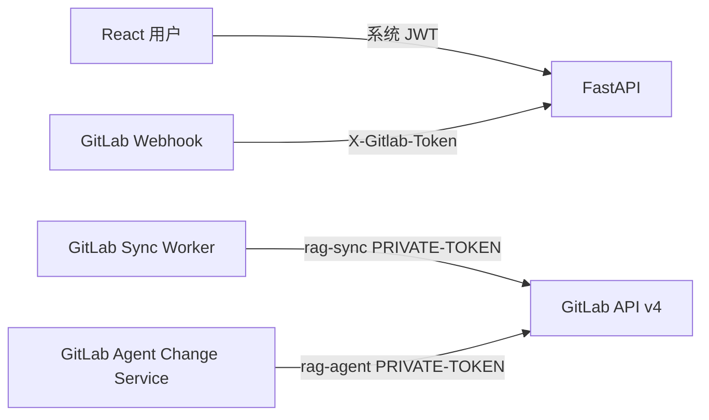

任何一种凭据都不能替代另外一种。

## 63. 全量与增量为什么必须混合

### 63.1 增量路径

适合连续、可信的 A→B：

```text
Compare A→B
  → 下载变化文件
  → 只解析受影响文档
```

优点是网络、解析和 Embedding 成本低。

### 63.2 全量路径

适合首次同步或增量不可信：

```text
固定 target SHA
  → 下载 archive.tar.gz
  → 安全解压
  → 枚举完整仓库
  → 与旧 Manifest 对账
```

`safe_extract_archive()` 位于 `sync_service.py:871-906`，
它限制 Archive 总大小、文件数量、单文件大小，并拒绝：

- 绝对路径；
- `..` 路径穿越；
- 符号链接和硬链接；
- 特殊文件；
- 解压后越出目标目录。

### 63.3 全量不等于无条件重做全部 Embedding

Archive 提供完整事实集合，但 `_prepare_paths()` 仍比较 Manifest。
真正未变化的文件会跳过。

所以混合架构同时获得：

```text
正常提交的效率
异常历史的正确性
同一套解析和发布规则
```

## 64. GitLab Project 权限与 RAG 文档 ACL 为什么同时存在

GitLab 的 Project 角色主要控制“谁能管理仓库资产”。
一个用户有 Project 读取权限，通常能看到仓库内所有文件。

RAG 还要控制“谁能在问答中检索某篇文档”：

```text
visibility
allowed_departments
allowed_users
```

`GitLabProjectSource.default_acl()` 先建立 Project 的最大安全边界。
`_load_narrow_acl()`（`sync_service.py:908-947`）允许 Sidecar 进一步收窄，
但不能扩大：

- 部门 Project 不能通过 Sidecar 变成 public；
- `allowed_departments` 不能超出 Project 部门；
- 当前规则不能通过仓库文件任意添加用户扩权。

一句话区分：

> GitLab 权限控制资产管理；RAG ACL 控制内容检索。

## 65. 为什么 ES 与 Milvus 无法用一个数据库事务解决

PostgreSQL、Elasticsearch、Milvus 是三个独立系统。
它们不能参加当前工程中的同一个 ACID 事务。

因此系统没有假装实现“跨三库瞬时事务”，而是采用：

```text
写候选数据
  → 验证候选数据收敛
  → 最后切 PostgreSQL 正式指针
```

如果 ES 成功、Milvus 失败：

- 候选 ES 记录可能存在；
- `_verify_candidate()` 失败；
- `active_version` 不变；
- 用户仍读取旧版本；
- Worker 根据错误分类决定重试或终止。

这是一种发布协议，不是分布式事务。

## 66. 哪些错误应该重试，哪些不应该

`GitLabClient._request()` 对网络异常、429、5xx 有限重试。

Worker 的 `_is_retryable_sync_error()` 位于 `worker.py:218-221`。
当前明确把 `ValueError` 视为确定性错误，例如：

- 非法路径；
- PDF 不支持；
- Archive 超限；
- ACL 扩大 Project 边界；
- XLSX 缺少 Profile。

这些错误重试不会改变输入，应该进入终态并让管理员修复源文件或配置。

## 67. React 前端怎样消费这套能力

### 67.1 GitLab 管理页

```text
GET  /admin/gitlab/sources
GET  /admin/gitlab/sync-jobs
POST /admin/gitlab/sources/{source_id}/sync
POST /admin/gitlab/sync-jobs/{job_id}/retry
```

页面应展示：

- `last_synced_sha` 与 `desired_sha`；
- Job status / phase；
- attempt count；
- added / modified / deleted 数量；
- error code / message。

### 67.2 知识版本与通知

```text
GET /knowledge/publication/status
GET /knowledge/change-events?after_id=...&limit=...
```

通知只在正式版本发布后生成，并按当前用户 ACL 过滤。
React 用：

```text
通知 affected_doc_ids
∩
当前答案 sources[].doc_id
```

判断是否提示用户“本次回答引用的文档刚刚更新，建议重新检索”。

### 67.3 Agent 确认页

React 应显示：

- TaskPlan；
- 完整目标路径；
- Diff 预览；
- 操作风险；
- 权限结果；
- 确认按钮；
- 创建后的 MR URL 和状态。

高风险操作由专用确认 API 执行，不依赖用户在聊天框输入自然语言“确认”。

## 68. 对 Classic、LangGraph 和流式接口的影响

### Classic RAG

检索算法没有换一套实现。它仍读取 ES/Milvus，
但请求需要带冻结的知识版本和 ACL 过滤。

### LangGraph RAG

显式 LangGraph 仍是主链路。GitLab 改变的是知识来源和发布边界，
不把主链路替换为 `create_agent()`。

### 结构化流式接口

新 React 主链路使用：

```text
POST /rag/chat/stream/events
```

结构化完成事件可以携带：

```text
knowledge_version
stale
stale_doc_ids
sources
```

### 旧流式接口

```text
POST /rag/chat/stream
```

仍是兼容用 token-only 路径，不新增 GitLab 通知、来源或任务状态功能。

---

# 第八部分：动手实验——亲自观察一次完整状态变化

## 69. 实验前先确认配置，而不是直接点击 Merge

`.env` 中每个 GitLab 配置上方已经有用途注释。关键开关：

```dotenv
# 是否启用 GitLab 文档数据源、Webhook 和后台同步能力。
GITLAB_INTEGRATION_ENABLED=true

# 是否将人工确认后的 Agent 文档操作提交为临时分支、Commit 和 Merge Request。
GITLAB_AGENT_CHANGES_ENABLED=true

# GitLab HTTP API 单次请求超时时间，单位为秒。
GITLAB_REQUEST_TIMEOUT_SECONDS=20

# GitLab 网络错误、HTTP 429 和 5xx 响应的最大自动重试次数。
GITLAB_MAX_RETRIES=3

# 独立 GitLab Worker 在任务队列为空时的轮询间隔，单位为秒。
GITLAB_WORKER_POLL_SECONDS=2

# GitLab 同步任务被 Worker 领取后的租约时长，单位为秒。
GITLAB_WORKER_LEASE_SECONDS=300

# GitLab Worker 的续租心跳间隔，必须小于任务租约时长，单位为秒。
GITLAB_WORKER_HEARTBEAT_SECONDS=60
```

每个 Project 还需要：

```text
*_SYNC_TOKEN
*_AGENT_TOKEN
*_WEBHOOK_SECRET
```

不要把真实 Secret 提交到 Git 仓库。

## 70. 启动 API 和 Worker

API：

```powershell
$env:PYTHONPATH = "src"
.\.venv\Scripts\python.exe -m uvicorn fast_app.main:app --reload
```

另一个 PowerShell 窗口启动 Worker：

```powershell
$env:PYTHONPATH = "src"
.\.venv\Scripts\python.exe -m fast_app.integrations.gitlab.worker --no-es-auth
```

只处理一个任务并退出：

```powershell
$env:PYTHONPATH = "src"
.\.venv\Scripts\python.exe -m fast_app.integrations.gitlab.worker --once --no-es-auth
```

## 71. 实验一：Developer 新增真实 Markdown

### GitLab Web 操作

1. 使用 Developer 账号登录 GitLab。
2. 打开 `rag-development-docs`。
3. 从 `main` 创建功能分支，例如 `feature/add-production-rollback-runbook`。
4. 创建：

```text
development/release/production-rollback-runbook.md
```

5. 写入本教程第 2 章给出的完整回滚手册内容。
6. Commit 到功能分支。
7. 创建目标为 `main` 的 MR。

### 合并前应该观察到

- MR 状态为 opened；
- `main` 中还没有新文件；
- Webhook 不应触发正式同步；
- `knowledge_publication_state.active_version` 不变；
- ES/Milvus 不出现该 `doc_id` 的新正式记录。

### Maintainer 合并后应该观察到

- GitLab `main` 包含新文件；
- Webhook 返回 202；
- `gitlab_webhook_deliveries` 新增一条；
- `gitlab_sync_jobs` 从 pending 进入 running/publishing；
- Worker 日志显示固定 target SHA；
- Job 最终为 `succeeded/published`；
- Manifest 新增；
- ES 有 parent + child；
- Milvus 只有 child；
- `active_version` 增加；
- change event 类型为 `added`。

## 72. 实验二：Developer 修改同一 Markdown

不要只改一句话。新增完整的：

```text
数据库迁移回滚
回滚失败升级机制
事故审计材料
```

提交新 MR，合并前再次确认知识版本不变。

合并后检查：

- `doc_id` 与新增时相同；
- `source_revision` 变成新的 main SHA；
- Manifest 的 `content_hash` 更新；
- 旧父子记录 `valid_to_version` 等于新版本；
- 新父子记录 `valid_from_version` 等于新版本；
- 新 child 引用新 physical parent；
- change event 类型为 `modified`；
- 新请求检索到更新内容。

## 73. 实验三：Agent 创建文档并提交 MR

通过当前 Agent Web 测试页面创建一个新的 TaskPlan。
确认页面应展示：

```text
operation = create
target_path = development/gitlab-agent-mr-governance.md
完整 Markdown Diff
受影响部门
人工确认状态
```

点击确认后检查：

- 返回 `gitlab_branch`，格式为 `agent/...`；
- 返回 `merge_request_url`；
- GitLab 中 Commit 位于临时分支；
- MR target 为 `main`；
- PostgreSQL `gitlab_change_requests` 有映射；
- MR 合并前 ES/Milvus 与正式版本不变。

Maintainer 合并后，再按实验一的方式观察 Webhook、Job、Manifest、ES、Milvus和
`active_version`。

## 74. 使用管理接口观察状态

先通过系统登录获得 Bearer Token：

```powershell
$headers = @{ Authorization = "Bearer $token" }
```

查询 Source：

```powershell
Invoke-RestMethod `
  -Method Get `
  -Uri "http://127.0.0.1:8000/admin/gitlab/sources" `
  -Headers $headers
```

查询同步任务：

```powershell
Invoke-RestMethod `
  -Method Get `
  -Uri "http://127.0.0.1:8000/admin/gitlab/sync-jobs?limit=20" `
  -Headers $headers
```

查询正式知识版本：

```powershell
Invoke-RestMethod `
  -Method Get `
  -Uri "http://127.0.0.1:8000/knowledge/publication/status" `
  -Headers $headers
```

查询变更通知：

```powershell
Invoke-RestMethod `
  -Method Get `
  -Uri "http://127.0.0.1:8000/knowledge/change-events?after_id=0&limit=50" `
  -Headers $headers
```

## 75. 运行工程回归测试

```powershell
$env:PYTHONPATH = "src"
.\.venv\Scripts\python.exe scripts\test_gitlab_enterprise_sync.py
```

预期：

```text
gitlab_enterprise_sync=passed
```

这个脚本能验证核心协议和状态转换，但不能替代真实 GitLab Web、真实 Webhook、
真实 ES/Milvus 的端到端验收。

## 76. 常见故障应该沿哪条链路排查

### GitLab 合并了，但没有 Job

依次检查：

1. Webhook URL 的 `source_id`；
2. `X-Gitlab-Token` 是否与环境变量一致；
3. Source 是否 active；
4. Payload Project ID；
5. ref 是否 `refs/heads/main`；
6. GitLab 是否允许向本地网络地址发送 Webhook。

### 有 Job，但一直 pending

检查独立 Worker 是否启动。FastAPI 不会自动消费该队列。

### Job 失败并显示 403

检查 `rag-sync` Token：

- 是否属于正确 Project；
- 是否过期；
- 是否有 Reporter 角色；
- 是否有 `read_api`、`read_repository`。

### Compare 成功但漏文件

检查是否读取 `X-Next-Page`，以及 GitLab 是否返回 overflow/timeout。
当前 Client 已实现分页和自动 Archive 回退。

### ES 有新数据，但用户仍看到旧版本

先确认 `_verify_candidate()` 是否通过和 `active_version` 是否切换。
候选记录存在不代表已经正式发布。

### Agent MR 路径不正确

比较以下位置是否完全相同：

```text
TaskPlan preview
confirmed preview
GitLab Commit file_path
Compare new_path
gitlab_documents.repository_path
knowledge_change_events affected path
```

## 77. 完整验收标准

### 人工新增/修改

1. Developer 不能直接 Push `main`。
2. Developer 可从临时分支创建 MR。
3. MR 合并前 RAG 正式版本不变。
4. Maintainer 合并后 Webhook 返回 202。
5. Delivery 与 Job 正确登记且不重复。
6. Worker 最终发布成功。
7. Manifest 的 path、SHA、ACL、指纹正确。
8. ES parent/child 与 Milvus child 数量收敛。
9. 新增和修改的版本区间正确。
10. 真实 RAG 查询能检索到预期正文。

### Agent 创建/修改

1. 使用新 TaskPlan，不复用历史失败状态。
2. 有 dry-run、Diff 和人工确认。
3. 使用独立 `rag-agent` Token。
4. 分支名为服务端生成的 `agent/...`。
5. Commit 不写 `main`。
6. MR target 来自 Source 配置。
7. 重复确认不重复创建 MR。
8. 路径从 TaskPlan 到通知完全一致。
9. MR 合并前不修改 ES/Milvus。
10. 合并后走统一 Webhook/Worker/Publication 链路。

---

# 第九部分：七个重点问题的完整回答

这一部分是一篇可以脱离前八部分单独阅读的“小教程”。阅读者不需要预先知道本工程的
GitLab 模块，也不需要预先理解 RAG 文档同步。下面会先建立本部分需要的全部背景，
再逐一回答七个问题。

## 78. 独立阅读入口：先认识系统、角色和术语

### 78.1 我们要解决的业务问题

假设公司技术部有一份文档：

```text
development/release/production-rollback-runbook.md
```

它是一份生产发布回滚手册。技术部员工会持续新增和修改内容，但普通员工不能随意把
未审核内容变成正式知识。公司希望实现下面的流程：

```text
Developer 修改文档
  → 创建 Merge Request
  → Maintainer 审核并合并到 main
  → GitLab 通知 FastAPI
  → 后台 Worker 读取新版本
  → 解析和分块
  → 写入 Elasticsearch 与 Milvus
  → 发布新的 RAG 知识版本
```

系统还允许 RAG Agent 创建或修改文档，但 Agent 同样不能直接写 `main`。
它只能创建临时分支、Commit 和 Merge Request，等待 Maintainer 审核。

### 78.2 四个参与者分别做什么

| 参与者 | 在本系统中的职责 |
| --- | --- |
| GitLab | 保存正式文档、分支、Commit、MR 和审核记录 |
| FastAPI | 接收 Webhook，提供管理接口，编排 Agent 文档操作 |
| GitLab Sync Worker | 在独立进程中执行下载、解析、Embedding、写入和发布 |
| React 前端 | 展示 TaskPlan、Diff、任务状态、通知和人工确认按钮 |

### 78.3 必须先理解的 GitLab 术语

#### Project

Project 是 GitLab 中的资产边界。当前系统按部门拆成多个私有 Project，例如：

```text
rag-development-docs
rag-art-docs
rag-product-planning-docs
rag-public-docs
```

一个 Project 不只是文件目录，还包含成员角色、分支、MR、Webhook、
Project Access Token 和审计历史。

#### Repository

Repository 是 Project 内部的 Git 仓库，保存文件和 Commit 历史。

#### `main`

`main` 是当前系统约定的正式分支。只有 `main` 中的文档才是 RAG 的正式来源。
临时分支中的文件仍处于待审核状态。

#### Commit 与 Commit SHA

Commit 是一次不可变的仓库快照。Commit SHA 是这次快照的唯一标识，例如：

```text
049c22ae7853e9318018e2e4a32ca49b71ed451d
```

后端同步时会冻结一个具体 SHA。即使同步期间 `main` 又有新提交，
本次任务仍只读取冻结 SHA 中的文件。

#### Merge Request

Merge Request，简称 MR，是把源分支变更提交给目标分支审核的请求。
本系统中 Agent 的源分支是 `agent/...`，目标分支是 `main`。

#### Webhook

Webhook 是 GitLab 主动发送给 FastAPI 的 HTTP 请求。它告诉后端：

```text
某个 Project 的 main 已经从 SHA A 变化到 SHA B。
```

Webhook 不是完整文件，也不代表后台同步已经完成。

### 78.4 必须先理解的后端术语

#### GitLab Source

`gitlab_sources` 中的一条 Source 记录描述一个受管理的 GitLab Project，包括：

```text
GitLab 地址
Project ID
正式分支
部门代码
默认 ACL
同步 Token 环境变量名
Agent Token 环境变量名
Webhook Secret 环境变量名
last_synced_sha
desired_sha
```

Source 是“GitLab Project 如何接入当前 RAG 系统”的配置。

#### Sync Job

Sync Job 是 PostgreSQL 中的一条后台任务，保存：

```text
base_sha
target_sha
mode
status
phase
worker_id
lease_expires_at
attempt_count
同步统计和错误
```

FastAPI 只登记 Job，独立 Worker 负责执行它。

#### Manifest

Manifest 是后端为每篇已发布文档保存的同步事实。它记录：

```text
repository_path
doc_id
source_revision
content_hash
acl_hash
parser_version
chunk_strategy_version
chunk_config_fingerprint
document_type
```

Manifest 让系统知道文档是新增、修改、删除，还是虽然 Git 文件未变但分块策略已经变化。

#### ACL

ACL 是 RAG 检索权限，例如：

```text
visibility
allowed_departments
allowed_users
```

GitLab Project 权限控制谁能管理资产；RAG ACL 控制谁能检索文档内容。

#### 父块和子块

Markdown 会拆成两种记录：

- 子块较小，用于关键词和向量召回；
- 父块较大，在子块命中后提供完整上下文。

Elasticsearch 保存父块和子块；Milvus 只保存带向量的子块。

#### 知识版本

`knowledge_publication_state.active_version` 表示当前正式知识版本。
Worker 会先构建候选版本，验证 ES/Milvus 完整后才切换 `active_version`。

### 78.5 四个存储系统不是重复保存同一份数据

| 存储 | 负责保存什么 |
| --- | --- |
| GitLab | 正式文件、Commit 历史、MR 和审核记录 |
| PostgreSQL | Source、Webhook Delivery、Job、Manifest、MR 映射、知识版本和通知 |
| Elasticsearch | Markdown 父块和子块，用于关键词召回及父块扩展 |
| Milvus | 子块向量，用于语义相似度召回 |

⭐ 本部分后面所有流程都建立在一个原则上：

> GitLab `main` 是正式文档源；PostgreSQL 保存同步业务状态；
> ES 与 Milvus 是可以从 GitLab 重建的检索索引。

## 79. 问题一：后端系统与 GitLab 的交互方式是什么，使用什么认证

这个问题不能只回答“使用 REST API 和 Token”，因为系统中实际存在三个方向、
四种身份。把它们混在一起，最容易造成权限泄漏。

### 79.1 第一种交互：Worker 从 GitLab 读取正式文档

Worker 需要执行：

- 查询 Project；
- 读取 `main` 当前 Commit SHA；
- Compare 两个 Commit；
- 读取 Raw File；
- 下载 Archive。

这些操作通过 GitLab REST API v4 完成。当前工程把协议封装在：

```text
src/fast_app/integrations/gitlab/client.py
GitLabClient：20-310 行
```

例如读取文件时调用：

```text
GitLabClient.get_file()
client.py:76-88
```

底层 HTTP 请求类似：

```text
GET /api/v4/projects/21/repository/files/
    development%2Frelease%2Fproduction-rollback-runbook.md/raw
    ?ref=<target_sha>
```

Worker 使用每个 Project 单独创建的 `rag-sync` Project Access Token：

| 属性 | 配置 |
| --- | --- |
| GitLab 角色 | Reporter |
| Scope | `read_api`、`read_repository` |
| 用途 | 只读取 GitLab 正式仓库 |
| 环境变量示例 | `GITLAB_DEVELOPMENT_SYNC_TOKEN` |

`GitLabSyncWorker._client()` 位于 `worker.py:177-184`。它根据
`source.sync_token_env` 读取真正的环境变量，再创建 `GitLabClient`。

### 79.2 第二种交互：Agent 服务向 GitLab 创建分支、Commit 和 MR

Agent 文档变更需要写操作：

- 创建 `agent/...` 分支；
- 创建 Commit；
- 创建 Merge Request；
- 查询已有 MR，支持幂等恢复。

这类操作使用另一枚 `rag-agent` Project Access Token：

| 属性 | 配置 |
| --- | --- |
| GitLab 角色 | Developer |
| Scope | `api`、`write_repository` |
| 用途 | 只创建临时分支、Commit 和 MR |
| 环境变量示例 | `GITLAB_DEVELOPMENT_AGENT_TOKEN` |

创建 Client 的函数是：

```text
GitLabAgentChangeService._client()
agent_change_service.py:382-390
```

同步 Token 与 Agent Token 必须分开。否则只负责读取的 Worker 也会拥有仓库写权限。

### 79.3 Project Access Token 怎样放入 HTTP 请求

`GitLabClient.__init__()` 位于 `client.py:23-42`。它把调用方传入的 Token 放入：

```python
self._headers = {"PRIVATE-TOKEN": token}
```

所有 API 最终经过：

```text
GitLabClient._request()
client.py:259-310
```

因此一次 Worker 读取的真实认证链是：

```text
gitlab_sources.sync_token_env
  → GITLAB_DEVELOPMENT_SYNC_TOKEN
  → get_secret_env_value()
  → GitLabClient(token=...)
  → PRIVATE-TOKEN Header
  → GitLab REST API v4
```

数据库保存的是环境变量名称，不保存真正 Token。这让数据库备份不会直接包含 GitLab
机器凭据，也方便在服务器 Secret 管理系统中轮换 Token。

### 79.4 第三种交互：GitLab 主动调用 FastAPI

GitLab 通知后端时不使用上面两枚 Project Access Token，而是使用 Webhook Secret：

```text
X-Gitlab-Token: <双方约定的 Webhook Secret>
```

Source 表保存 `webhook_secret_env`，例如：

```text
GITLAB_DEVELOPMENT_WEBHOOK_SECRET
```

后端通过 `hmac.compare_digest()` 验证。Webhook Secret 只用于验证事件来源，
不能拿它调用 GitLab REST API。

### 79.5 第四种身份：React 用户访问 FastAPI

React 用户访问管理接口或确认 Agent TaskPlan 时，使用当前系统自己的 JWT、
用户角色和权限。普通 RAG 用户不会获得 `rag-sync` 或 `rag-agent` Token。

所以四种身份必须严格区分：

| 请求方向 | 凭据 | 证明什么 |
| --- | --- | --- |
| React → FastAPI | 系统 JWT | 当前系统用户是谁、有什么业务权限 |
| GitLab → FastAPI | Webhook Secret | 请求来自已配置 Webhook |
| Worker → GitLab | `rag-sync` Token | 后端有权读取该 Project |
| Agent Service → GitLab | `rag-agent` Token | 后端有权写临时分支并创建 MR |

### 79.6 为什么不能复用 `root`、员工或 Maintainer Token

如果使用员工个人 Token：

- 员工离职或修改密码可能导致系统突然失效；
- 审计记录会混淆“机器提交”和“员工提交”；
- Token 权限通常大于实际需要；
- 很难按 Project 独立轮换；
- 泄漏后影响范围更大。

Project Access Token 属于 Project 机器身份，权限范围更清晰。
本系统明确不使用 `root`、`tgg`、普通员工或主管个人 Token。

### 79.7 HTTP 错误怎样帮助判断认证问题

`GitLabClient._request()` 只重试网络异常、429 和 5xx。
普通 4xx 不自动重试，因为它们通常是确定性错误：

```text
401 → Token 无效或过期
403 → 角色或 Scope 不足
404 → Project、Branch 或文件路径错误
400 → API 参数或分支状态错误
```

看到 403 时，应该检查 Token 角色和 Scope，而不是继续增加重试次数。

## 80. 问题二：GitLab 收到新的 Push 后，怎样通知后端

### 80.1 哪一个动作真正触发通知

Developer 或 Agent 在临时分支创建 Commit，不会更新 RAG。
创建 MR、修改 MR、评论 MR，同样不会更新 RAG。

只有 Maintainer 把 MR 合并到 `main`，GitLab 的正式分支从 SHA A 前进到 SHA B，
Project Push Webhook 才触发后端同步。

### 80.2 GitLab Webhook 调用哪个接口

当前接口是：

```text
POST /integrations/gitlab/webhooks/{source_id}
```

路由函数：

```text
accept_gitlab_webhook()
src/fast_app/api/gitlab_routes.py:46-69
```

这里的 `source_id` 是当前系统 `gitlab_sources` 的业务 ID，不是 GitLab Project ID。
路由先根据它找到 Project ID、正式分支和 Secret 配置。

### 80.3 GitLab 请求中包含什么

关键 Header：

```text
X-Gitlab-Token
X-Gitlab-Event-UUID
X-Gitlab-Event
```

关键 JSON 字段可以简化理解为：

```json
{
  "object_kind": "push",
  "before": "SHA_A",
  "after": "SHA_B",
  "ref": "refs/heads/main",
  "project": {
    "id": 21
  }
}
```

`before` 表示变化前 Commit，`after` 表示变化后 Commit。
Webhook 可以告诉后端仓库版本变化了，但不能替代后续文件下载。

### 80.4 FastAPI 路由做什么

`accept_gitlab_webhook()` 只负责 HTTP 层：

1. 检查 GitLab 集成开关；
2. 查询并验证 Source 是 active；
3. 读取原始 Request Body；
4. 读取 GitLab Header；
5. 调用 `GitLabWebhookService.accept()`；
6. 返回 HTTP 202。

它不下载文件、不解析 Markdown、不调用 Embedding。

### 80.5 Webhook Service 按什么顺序验证

核心函数：

```text
GitLabWebhookService.accept()
webhook_service.py:23-78
```

它按以下顺序执行：

```text
验证 Webhook Secret
  → 用 Pydantic 解析 JSON
  → 检查 object_kind
  → 检查 Project ID
  → 检查 refs/heads/main
  → 排除分支删除的全零 SHA
  → 生成去重键
  → 登记 Delivery 和 Job
```

必须先验证 Secret，再信任请求体里的 Project、Branch 和 SHA。
否则任何人都可以伪造 JSON 让后端创建任务。

### 80.6 为什么临时分支 Push 会被忽略

代码要求：

```python
payload.ref == f"refs/heads/{source.target_branch}"
```

假设 `source.target_branch == "main"`：

```text
refs/heads/agent/task-123 → 忽略
refs/heads/feature/doc    → 忽略
refs/heads/main           → 接受
```

这是“MR 合并前不修改 RAG”的第一道业务边界。

### 80.7 为什么需要 Delivery 去重

可能发生：

```text
FastAPI 已把事件写入 PostgreSQL
  → 返回 202 时网络中断
  → GitLab 没收到响应
  → GitLab 重投同一个事件
```

后端优先使用 `X-Gitlab-Event-UUID` 作为 `delivery_key`。
没有 UUID 时，使用：

```text
project_id + before_sha + after_sha + payload_hash
```

生成稳定键。`gitlab_webhook_deliveries.delivery_key` 是主键，
所以重复投递不会创建第二个同步任务。

### 80.8 为什么 Delivery 与 Job 要放在一个事务

函数：

```text
GitLabRepository.register_delivery_and_enqueue()
repository.py:121-200
```

它在同一个 PostgreSQL 事务中：

1. INSERT Webhook Delivery；
2. 更新 Source 的 `desired_sha=after_sha`；
3. 合并现有活动 Job，或创建新 Job；
4. COMMIT。

如果 Delivery 已提交但 Job 创建失败，GitLab 下次重投又会被去重，
这次变更就永远没有任务处理。因此二者必须原子提交。

### 80.9 `202 Accepted` 到底代表什么

它只代表：

```text
请求通过验证
事件已去重
目标 SHA 已记录
后台任务已创建或合并
```

它不代表：

```text
文件已下载
Markdown 已解析
Embedding 已生成
ES/Milvus 已写入
知识版本已发布
```

React 应通过管理接口继续查看 Job 状态，不能把 Webhook 的 202 当作同步成功。

### 80.10 完整通知时序

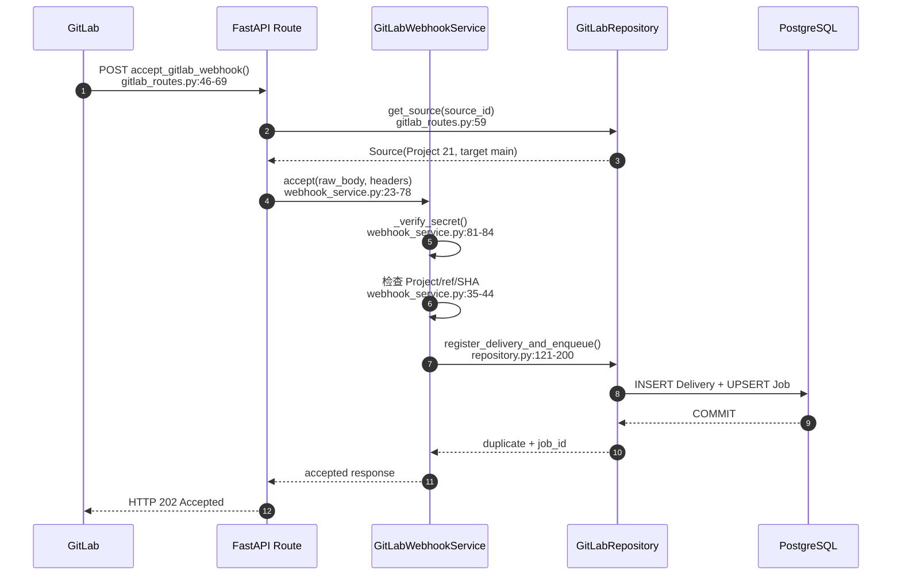

## 81. 问题三：后端收到“新增文档”通知后怎样处理

下面假设 `main` 新增：

```text
development/release/production-rollback-runbook.md
```

变化前 `main` 是 SHA A，合并后是 SHA B。

### 81.1 Webhook 不直接说“新增了哪篇完整文档”

Webhook 只把目标 SHA B 安全登记到 Job。真正的文件变化由 Worker
针对 A→B 重新查询 GitLab。

这样做有两个原因：

1. Webhook 中的 commits/diff 可能被截断；
2. 文件正文必须从固定目标 SHA 读取，不能读取不断变化的 `main`。

### 81.2 独立 Worker 怎样领取任务

Worker 是 FastAPI 之外的常驻进程，入口：

```text
run_worker()
src/fast_app/integrations/gitlab/worker.py:224-263
```

它循环调用：

```text
GitLabSyncWorker.run_once()
worker.py:44-146
```

`run_once()` 先调用：

```text
GitLabRepository.claim_next()
repository.py:202-241
```

`claim_next()` 使用 `FOR UPDATE SKIP LOCKED`，保证多个 Worker 不会同时领取同一 Job。
领取后记录 `worker_id` 和租约，心跳定期续租。Worker 崩溃后，
租约过期的 Job 可以被其他 Worker 重新领取。

### 81.3 Worker 怎样确定新增路径

同步总编排：

```text
GitDocumentSyncService.run()
sync_service.py:90-181
```

增量任务进入：

```text
_prepare_incremental()
sync_service.py:331-408
```

然后调用：

```text
GitLabClient.compare()
client.py:115-158
```

Compare API 请求固定的 A→B：

```text
GET /api/v4/projects/{project_id}/repository/compare
    ?from=A
    &to=B
    &straight=true
    &page=1
    &per_page=100
```

新增文件 Diff 通常包含：

```text
new_file = true
deleted_file = false
renamed_file = false
new_path = development/release/production-rollback-runbook.md
```

`GitLabClient.compare()` 持续读取 `X-Next-Page`，直到分页结束。
如果只读第一页，一次大 MR 会漏掉后续文件。

### 81.4 Compare 不可信时怎样处理

如果 GitLab 返回：

```text
compare_timeout = true
overflow = true
```

或者权限规则文件变化、SHA 历史不连续，系统自动下载目标 SHA B 的 Archive，
对完整仓库进行全量对账。

全量不是无条件重新 Embedding 所有文档。Archive 提供完整文件集合，
Manifest 仍会跳过真正未变化的文档。

### 81.5 怎样读取新增文件正文

知道路径后，Worker 调用：

```text
GitLabClient.get_file()
client.py:76-88
```

并明确传入：

```text
repository_path = development/release/production-rollback-runbook.md
ref = SHA B
```

Compare 只负责找路径；Raw File API 负责读取 SHA B 的完整正文。

### 81.6 怎样生成稳定 `doc_id`

`GitLabProjectSource` 使用：

```text
doc_id = sha256(
  "gitlab:<host_id>:<project_id>:<normalized_repository_path>"
)
```

这个 ID 不包含 Commit SHA，因此同一路径以后的修改仍属于同一个逻辑文档。
它也不包含 Archive 临时目录，因此重新解压不会改变文档身份。

### 81.7 怎样计算文档 ACL

Source 先给出 Project 最大安全边界。例如 development Project 默认：

```json
{
  "visibility": "department",
  "allowed_departments": ["development"],
  "allowed_users": []
}
```

仓库 Sidecar 可以进一步收窄权限，但不能把部门文档扩大为 public，
也不能添加超出 Project 边界的部门。

### 81.8 Manifest 怎样表示这是新增文档

`_prepare_paths()` 位于 `sync_service.py:410-532`。
它在旧 Manifest 中找不到该路径，因此：

```text
old = None
change_type = added
```

同时准备新的 Manifest：

```text
repository_path
doc_id
blob_id
source_revision = SHA B
content_hash
acl_hash
parser_version
chunk_strategy_version
chunk_config_fingerprint
document_type = markdown
acl_json
```

### 81.9 Markdown 怎样变成可检索记录

`_build_artifacts()` 位于 `sync_service.py:534-613`：

```text
Raw Markdown
  → GitLabProjectSource.build_text_document()
  → LoadedDocument
  → MarkdownHierarchyBuilder.build()
  → parents + children
```

父块保存完整章节，用于命中后扩展上下文。
子块较小，用于精确关键词和向量召回。

只有子块的 `search_text` 生成 Embedding：

```text
Elasticsearch = parents + children
Milvus = children + vectors
```

### 81.10 为什么先创建候选版本

假设当前正式知识版本是 7。Worker 调用：

```text
GitLabRepository.reserve_publication()
repository.py:401-447
```

得到候选版本 8：

```text
previous_version = 7
version = 8
status = building
```

此时用户仍然检索版本 7。版本 8 只有在完整写入和验证后才会正式生效。

### 81.11 三个存储怎样写入

新增 Markdown 时：

| 存储 | 写入内容 |
| --- | --- |
| Elasticsearch | 版本 8 的父块和子块 |
| Milvus | 版本 8 的子块和向量 |
| PostgreSQL | 候选 Publication；验证成功后再 INSERT Manifest 并切换正式版本 |

每条检索记录都带：

```text
doc_id
source_id
source_revision
valid_from_version = 8
valid_to_version = 0
```

### 81.12 怎样验证和正式发布

`_verify_candidate()`（`sync_service.py:643-796`）反查并验证：

- ES 父块和子块 ID 集合；
- Milvus 子块 ID 集合；
- 向量维度；
- ACL；
- GitLab source revision；
- 分块策略版本；
- 子块是否引用同版本父块。

验证成功后，`GitLabRepository.publish()`（`repository.py:476-539`）
在一个 PostgreSQL 事务中：

1. INSERT `gitlab_documents` Manifest；
2. Publication 变成 `published`；
3. `active_version` 从 7 切到 8；
4. Source 的 `last_synced_sha` 更新为 B；
5. Job 变成 `succeeded/published`；
6. 创建 `added` 类型的知识变更通知。

如果 ES 或 Milvus 验证失败，第 3 步不会发生，旧版本 7 继续服务用户。

### 81.13 新增文档完整时序

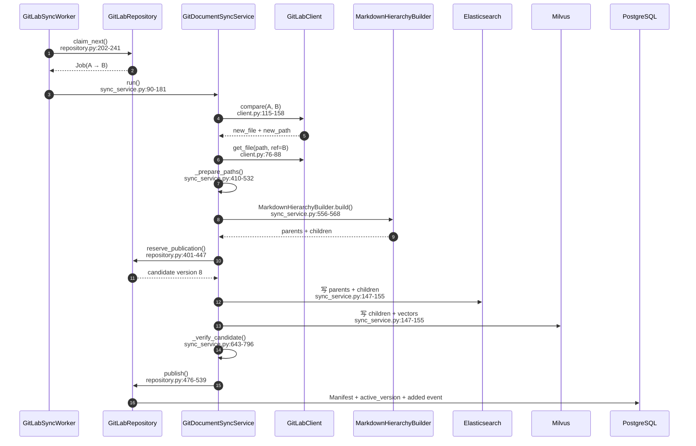

## 82. 问题四：后端收到“修改文档”通知后怎样处理

修改文档与新增文档共享 Webhook、Job、Worker、Compare 和 Raw File 流程。
区别在于旧 Manifest 和旧 ES/Milvus 记录已经存在，并且可能正被用户检索。

### 82.1 修改案例

假设版本 7 中已有回滚手册。员工在 GitLab 中：

- 新增“数据库迁移回滚”章节；
- 新增“回滚失败升级机制”；
- 调整事故复盘时限；
- 收窄 ACL。

MR 合并后 `main` 从 SHA B 前进到 SHA C。

### 82.2 怎样确认文档确实需要重建

`_prepare_paths()` 不只比较 Git 文件内容，而是比较：

```python
old.content_hash == content_hash
old.acl_hash == acl_hash
old.parser_version == adapter.parser_version
old.chunk_strategy_version == strategy_version
old.chunk_config_fingerprint == config_fingerprint
```

任何一项变化都重建整篇文档：

- 正文变化；
- ACL 变化；
- 解析器升级；
- 父子分块策略升级；
- token、字符或 overlap 配置变化。

所以即使 Git 文件没有变化，只要分块配置变化，索引也必须重建。

### 82.3 为什么不是只修改变化的几个 Chunk

当前实现采用“文档级父子集合替换”，原因包括：

- 标题变化可能影响后续所有 section path；
- overlap 变化会影响相邻子块；
- 父块边界变化会影响多个子块的 parent；
- ACL 变化必须覆盖整篇文档；
- Chunk 级补丁会显著增加身份和一致性复杂度。

### 82.4 `doc_id` 为什么不变

同一 Project、同一路径仍是同一逻辑文档，所以 `doc_id` 不变。

变化由以下字段表达：

```text
source_revision: SHA B → SHA C
content_hash: old → new
知识版本: 7 → 8
物理父子块 ID: old → new
```

如果路径重命名，则按“旧 `doc_id` 删除 + 新 `doc_id` 新增”处理。

### 82.5 为什么不能直接覆盖旧记录

假设一个 RAG 请求 Q1 在版本 7 开始，Worker 同时构建版本 8。
如果直接覆盖同一个 Chunk：

```text
Q1 的向量检索可能读到旧子块
Q1 的父块扩展却读到新正文
```

同一次回答会混合两个版本。

系统给记录增加版本区间：

| 记录 | `valid_from_version` | `valid_to_version` | 版本 7 可见 | 版本 8 可见 |
| --- | ---: | ---: | --- | --- |
| 旧父块 | 7 | 8 | 是 | 否 |
| 旧子块 | 7 | 8 | 是 | 否 |
| 新父块 | 8 | 0 | 否 | 是 |
| 新子块 | 8 | 0 | 否 | 是 |

`valid_to_version=0` 表示仍有效。

### 82.6 Worker 的更新写入顺序

候选版本是 8 时：

1. `close_rag_docs_for_version()`
   把变化文档的旧父块和子块设置为 `valid_to_version=8`。

2. `version_artifacts()`（`sync_service.py:798-868`）
   为新父子块生成版本 8 的物理 ID。

3. `upsert_rag_stores()`
   ES 写新父块和子块；Milvus 写新子块和向量。

4. `_verify_candidate()`
   验证版本 8 的集合、向量、ACL 和父子关系。

5. `publish()`
   更新 Manifest，把 `active_version` 切到 8。

第 5 步之前，候选数据不会成为正式查询版本。

### 82.7 为什么需要逻辑 ID 和物理 ID

逻辑 ID 表示“这是同一个语义块”：

```text
logical_record_id = rollback-trigger-section
```

物理 ID 表示“这是某个知识版本中的具体记录”：

```text
physical_record_id = sha256(logical_record_id + version)
```

因此同一个逻辑块可以同时存在：

```text
rollback-trigger-section@7
rollback-trigger-section@8
```

旧请求读取 `@7`，新请求读取 `@8`。

### 82.8 为什么子块要引用同版本物理父块

版本 7 和 8 都可能存在同一个逻辑父块。
如果 child 只保存逻辑 parent ID，父块扩展可能选错版本。

`version_artifacts()` 为 child 保存：

```text
logical_parent_id
physical_parent_id
```

版本 7 child 明确指向版本 7 parent，版本 8 child 明确指向版本 8 parent。

### 82.9 正在检索的用户会看到哪个版本

每次 RAG 请求在入口读取一次 `active_version`，然后冻结到请求状态。
ES、Milvus 和父块扩展统一过滤：

```text
valid_from_version <= request_version
AND
(valid_to_version = 0 OR valid_to_version > request_version)
```

所以：

```text
Q1 在版本 7 开始 → 整次都看版本 7
Worker 发布版本 8  → 不改变 Q1
Q2 在发布后开始   → 看版本 8
```

如果业务要求必须等待版本 8，可以传 `min_knowledge_version=8`。
版本未就绪时后端返回结构化 `409 knowledge_version_not_ready`。

### 82.10 修改文档完整时序

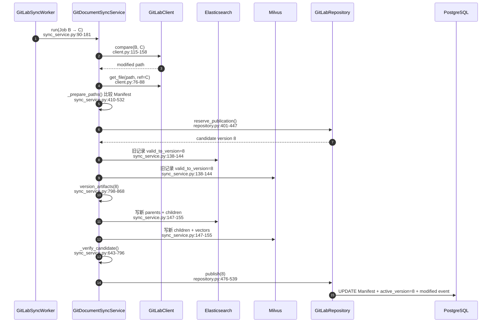

## 83. 问题五：Worker 收到任务后，怎样完成数据库写入

“数据库写入”不能只理解为 PostgreSQL INSERT。当前 Worker 要协调 PostgreSQL、
Elasticsearch 和 Milvus，三者职责与事务能力不同。

### 83.1 Worker 从哪里开始执行

`GitLabSyncWorker.run_once()`（`worker.py:44-146`）执行：

```text
领取 Job
  → 创建心跳
  → 查询 Source
  → 创建只读 GitLabClient
  → 调用 GitDocumentSyncService.run()
  → 检查是否需要追赶更新的 desired_sha
  → 成功或记录失败
```

领取任务使用短事务。下载、Embedding 和双库写入不会一直占着领取行锁。

### 83.2 PostgreSQL 在同步中的职责

PostgreSQL 保存业务状态，而不是正文向量：

| 表 | 保存的事实 |
| --- | --- |
| `gitlab_sources` | Project 配置、`last_synced_sha`、`desired_sha` |
| `gitlab_webhook_deliveries` | Webhook 去重与审计 |
| `gitlab_sync_jobs` | 队列、状态、阶段、租约、重试和统计 |
| `gitlab_documents` | 已发布 Manifest |
| `knowledge_publications` | 候选/正式知识版本 |
| `knowledge_publication_state` | 当前唯一 `active_version` |
| `knowledge_change_events` | 发布后受影响文档通知 |

### 83.3 Elasticsearch 在同步中的职责

Markdown 写入：

```text
parent records
child records
```

父块用于最终上下文扩展；子块用于关键词召回。

### 83.4 Milvus 在同步中的职责

Milvus 只写：

```text
child records + embedding vectors
```

父块不写 Milvus，避免同一正文以父块和子块两种粒度重复占据向量 Top K。

### 83.5 新增文档时具体写什么

假设新文档生成两个父块、六个子块，候选版本为 8：

```text
Elasticsearch
  INSERT 2 个 version=8 parent
  INSERT 6 个 version=8 child

Milvus
  INSERT 6 个 version=8 child + vector

PostgreSQL（验证成功后）
  INSERT 1 条 gitlab_documents Manifest
  UPDATE publication status=published
  UPDATE active_version=8
  UPDATE source.last_synced_sha
  UPDATE job status=succeeded
  INSERT added change event
```

Manifest 写入函数：

```text
GitLabRepository._apply_manifests()
repository.py:611-649
```

找不到 `doc_id` 时创建 `GitLabDocumentTable`。

### 83.6 修改文档时具体写什么

假设原文档有两个旧父块、六个旧子块，新版本生成三个父块、八个子块：

```text
Elasticsearch
  UPDATE 旧 parent/child valid_to_version=8
  INSERT 3 个 version=8 parent
  INSERT 8 个 version=8 child

Milvus
  UPDATE 旧 child valid_to_version=8
  INSERT 8 个 version=8 child + vector

PostgreSQL（验证成功后）
  UPDATE 原 doc_id 对应 Manifest
  UPDATE publication status=published
  UPDATE active_version=8
  UPDATE source.last_synced_sha
  UPDATE job status=succeeded
  INSERT modified change event
```

PostgreSQL 不创建第二个逻辑文档，因为 `doc_id` 没变；
ES/Milvus 创建新物理记录，因为版本已经变化。

### 83.7 删除文档时具体写什么

删除时没有新正文：

```text
ES/Milvus
  只关闭旧记录 valid_to_version=8
  不写新父子块

PostgreSQL
  Manifest 状态变为 deleted 或移出正式集合
  active_version 切到 8
  change event 记录 deleted
```

### 83.8 为什么不能把三套存储放进一个事务

PostgreSQL、Elasticsearch 和 Milvus 是三个独立系统。
当前工程不能让它们参加同一个 ACID 事务。

所以系统采用发布协议：

```text
申请候选版本
  → 关闭旧版本区间
  → 写候选 ES/Milvus
  → 反查并验证候选集合
  → 最后在 PostgreSQL 事务中切 active_version
```

如果 ES 写入成功但 Milvus 写入失败：

- 候选 ES 数据可能已经存在；
- `_verify_candidate()` 不通过；
- `publish()` 不执行；
- `active_version` 保持旧值；
- 用户继续检索旧版本。

### 83.9 `publish()` 的 PostgreSQL 事务保证什么

`GitLabRepository.publish()` 位于 `repository.py:476-539`。
它在一个事务中同时提交：

```text
Manifest
Publication 状态
active_version
Source SHA
Job 状态和统计
Knowledge Change Event
```

这避免出现：

```text
版本已切换，但 Manifest 仍是旧值
Job 显示成功，但 Source SHA 没前进
前端看到新版本，但没有通知事件
```

### 83.10 Worker 失败后怎样处理

Job 状态大致经历：

```text
pending
  → running
  → publishing
  → succeeded
```

失败时进入：

```text
retry_wait
或
failed
```

网络错误、429、5xx 等瞬时故障可以重试。
路径非法、PDF 不支持、ACL 越界、Archive 超限等确定性错误不会无效重放。

## 84. 问题六：后端 Agent 与 GitLab 怎样交互，认证方式是什么

这里的 Agent 指多 Agent 文档工作流，不是一个拿着 GitLab Token 随意调用 API 的模型。

### 84.1 Agent 工作流负责什么

Agent 可以负责：

- 理解用户文档需求；
- Researcher 检索内部资料；
- Writer 编写 Markdown；
- Reviewer 检查质量；
- 生成文档新增或修改动作；
- 形成 dry-run 和 Diff。

Agent 不能作为可信来源决定：

```text
Project ID
正式分支
doc_id
repository_path
ACL
base SHA
是否已人工确认
```

这些必须由服务器端数据库、Source 配置、Manifest、权限和 TaskPlan 确定。

### 84.2 从用户请求到 GitLab 的真实边界

执行链是：

```text
用户 Query
  → Router 判断文档意图
  → 多 Agent 工作流生成内容
  → 服务端 dry-run
  → 创建 TaskPlan
  → React 展示完整路径和 Diff
  → 用户点击确认
  → 专用确认 API
  → KnowledgeDocumentManagementService
  → GitLabAgentChangeService
  → GitLab REST API
```

只有人工确认后的服务端阶段能够调用 GitLab 写 API。

### 84.3 哪个函数把确认结果交给 GitLab

入口：

```text
KnowledgeDocumentManagementService.execute_confirmed_actions()
knowledge_document_management_service.py:227-296
```

当：

```text
GITLAB_AGENT_CHANGES_ENABLED=true
```

它不会直接写本地文件、Elasticsearch 或 Milvus，而是调用：

```text
GitLabAgentChangeService.submit_changes()
agent_change_service.py:137-167
```

返回结果包含：

```text
gitlab_source_id
gitlab_branch
gitlab_commit_sha
merge_request_iid
merge_request_url
merge_request_status
```

React 可以把 MR URL 展示给用户。

### 84.4 Agent 使用什么 GitLab 身份

`GitLabAgentChangeService` 使用每个 Project 的 `rag-agent`
Project Access Token：

```text
角色 = Developer
Scope = api + write_repository
```

它不使用：

- 系统 `root`；
- 普通员工 Token；
- Maintainer 个人 Token；
- Worker 的 `rag-sync` Token。

### 84.5 为什么 Developer 角色足够

Agent 只需要：

- 创建临时分支；
- 创建 Commit；
- 创建 MR。

它不应该拥有直接写受保护 `main` 的能力。
GitLab 中必须把 `main` 配置为 Protected Branch，并禁止 Developer 直接 Push。

### 84.6 系统用户权限与 GitLab Token 权限是什么关系

用户能否请求某个文档操作，先由当前系统鉴权。
通过确认后，后端才使用机器 Token 执行已经验证的动作。

机器 Token 不会绕过服务端用户权限：

```text
系统 JWT/权限
  → 决定用户是否能提出和确认操作

rag-agent Token
  → 决定服务端能否在 GitLab 创建分支、Commit 和 MR
```

### 84.7 Agent 创建 MR 后为什么不更新 RAG

因为 MR 仍可能：

- 被 Maintainer 拒绝；
- 要求修改；
- 被关闭；
- 长时间不合并。

如果 MR 一创建就写 ES/Milvus，未批准内容会进入正式知识库。
因此 Agent 只负责创建 MR。Maintainer 合并到 `main` 后，
GitLab Webhook 才启动正式同步。

### 84.8 Agent 与 GitLab 交互图

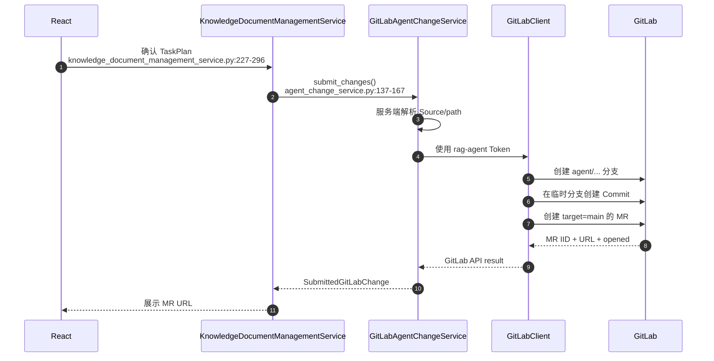

## 85. 问题七：Agent 完成文档后怎样创建 MR，并确保路径和分支正确

这个问题包含两个必须一起理解的部分：

1. 怎样按顺序创建 Branch、Commit 和 MR；
2. 怎样防止写错 Project、路径或 `main`。

### 85.1 `submit_changes()` 先按 Project 分组

`GitLabAgentChangeService.submit_changes()` 位于
`agent_change_service.py:137-167`。

它先把每个动作解析为：

```text
可信 Source
可信 repository_path
已有或新建文档身份
已确认正文
expected_before_hash
```

然后按 `source_id` 分组。

如果一个 TaskPlan 同时修改 development 和 art 两个 Project，
系统会创建两个独立 MR。GitLab 无法用一个 Commit 原子修改两个 Project，
所以不能假装它们是一个 MR。

### 85.2 已有文档怎样确定 Project 和路径

对于 UPDATE/DELETE，TaskPlan 带有已发布 `doc_id`。

`_resolve_location()` 位于 `agent_change_service.py:349-380`：

```text
doc_id
  → 查询 gitlab_documents
  → 得到 source_id
  → 查询 gitlab_sources
  → 得到 Project
  → 使用 Manifest.repository_path
```

因此模型或前端不能把已有文档从 development Project 偷换到 art Project，
也不能改变它的真实仓库路径。

### 85.3 新文档怎样确定 Project 和路径

CREATE 还没有 Manifest。服务端使用已经确认的部门代码查询唯一 Source：

```text
department_code=development
  → rag-development-docs Source
```

路径则使用 TaskPlan 已确认的完整规范化路径：

```text
development/gitlab-agent-mr-governance.md
```

即使 Project 已代表技术部，也不能擅自剥离 `development/` 前缀。
否则 TaskPlan、Commit、Compare、Manifest 和通知会出现不同路径。

### 85.4 路径怎样规范化和防止穿越

`_repository_path()` 位于 `agent_change_service.py:393-398`。

它：

- 把 `\` 转成 `/`；
- 去除首尾 `/`；
- 使用 `PurePosixPath`；
- 拒绝空路径；
- 拒绝绝对路径；
- 拒绝任何 `..`。

示例：

```text
development\guide.md
  → development/guide.md

/etc/passwd
  → 拒绝

development/../../secret.md
  → 拒绝
```

### 85.5 分支名怎样生成

`_branch_name()` 位于 `agent_change_service.py:401-406`。

格式：

```text
agent/<task_plan_id安全slug>-<8位hash>
```

例如：

```text
agent/task-plan-20260728-4d92c1ab
```

分支名由服务端确定性生成，不接受 LLM 提供的 `main` 或任意分支名。

### 85.6 临时分支从哪里创建

`_submit_project()` 位于 `agent_change_service.py:169-264`。

它先读取 Source 配置的正式分支当前 SHA：

```text
GitLabClient.get_branch_head()
client.py:55-61
```

然后创建：

```text
branch = agent/...
ref = main_sha
```

`ref` 使用具体 Commit SHA，不使用模型输入。
这样本次 MR 的基线是确定的。

### 85.7 人工确认后为什么还要重新读取文件

用户查看 Diff 到点击确认之间，其他人可能已修改 `main`。
因此 `_build_commit_actions()`（`agent_change_service.py:266-320`）
重新读取基线文件并检查：

```text
expected_before_hash
last_commit_id = base_sha
```

如果文件已经变化，服务端返回：

```text
GitLab main 文档已变化，拒绝执行旧的确认计划
```

用户必须基于新内容重新生成预览，旧计划不能覆盖他人的新提交。

### 85.8 Commit 怎样保证不写 `main`

创建 Commit 的 API：

```text
GitLabClient.create_commit()
client.py:196-213
```

调用参数明确是：

```text
branch = 服务端生成的 agent/...
```

不是：

```text
branch = source.target_branch
```

CREATE 动作写完整 `file_path` 和正文；UPDATE/DELETE 还携带
`last_commit_id` 做 GitLab 侧并发校验。

### 85.9 MR 怎样保证目标是正式分支

创建 MR 的 API：

```text
GitLabClient.create_merge_request()
client.py:215-235
```

参数：

```text
source_branch = agent/...
target_branch = source.target_branch
```

`source.target_branch` 来自管理员配置的 Source，当前是 `main`，
不是 LLM 或 React 自由提交的值。

### 85.10 GitLab Protected Branch 是最后一道防线

应用代码保证正常调用不会选择 `main` 作为 Commit branch。
GitLab 还必须配置：

```text
main = Protected Branch
Developer = 禁止直接 Push
Maintainer = 可以审核和合并
```

即使 `rag-agent` Token 被错误调用，GitLab 权限仍拒绝 Developer 直接 Push `main`。

### 85.11 重复确认怎样避免重复 MR

网络超时可能导致 React 重发确认请求。
`_submit_project()` 使用：

```text
task_plan_id + source_id
```

查询 `gitlab_change_requests`，并根据 GitLab 实际状态恢复：

```text
已有 MR URL
  → 返回原 MR

已有分支但没有 Commit
  → 继续创建 Commit

分支已有 Commit
  → 复用 Commit

已有 MR
  → 复用 MR

都没有
  → 创建新 MR
```

这避免同一人工确认生成多个分支和 MR。

### 85.12 路径必须在哪些阶段保持一致

同一文档路径必须贯穿：

| 阶段 | 路径来源 |
| --- | --- |
| TaskPlan | 已验证的文档动作 |
| React Preview | TaskPlan 的规范化路径 |
| Confirmed Preview | 用户实际确认的同一路径 |
| GitLab Commit | `file_path` |
| GitLab Compare | `new_path` / `old_path` |
| Manifest | `gitlab_documents.repository_path` |
| Notification | affected document path |

任一阶段擅自删前缀或重新拼路径，都会形成重复文档、错误 ACL 或通知无法匹配。

### 85.13 完整 MR 创建与合并时序

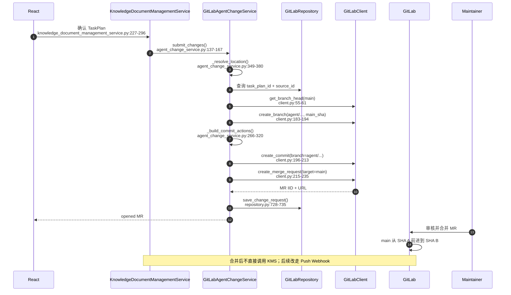

### 85.14 MR 创建成功后，怎样判断 GitLab 模块真正工作正常

MR 创建成功只证明 Agent 写链路完成了一半。完整验收还要确认：

1. MR source 是 `agent/...`；
2. MR target 是 `main`；
3. `main` 在合并前未变化；
4. ES/Milvus 在合并前未变化；
5. Maintainer 合并后 GitLab 发出 Push Webhook；
6. Worker Job 成功；
7. Manifest 路径与 Commit 路径一致；
8. 新知识版本发布；
9. RAG 能检索到合并后的正文；
10. `gitlab_change_requests` 最终与 GitLab merged 状态对齐。

---

# 第十部分：完成学习后的工程判断

## 86. 不要只记住 API，要记住这些设计因果

1. Webhook 要快，因为它是事件入口，不是任务执行器。
2. 固定 SHA 是为了让一次同步读取同一仓库快照。
3. Compare 提供效率，Archive 提供异常情况下的完整性。
4. Manifest 不只比较文件内容，还承担派生索引重建判断。
5. 父子分块把“精确召回”和“完整上下文”分开。
6. 候选版本与最后切指针解决跨 ES/Milvus 的对外一致性。
7. `SKIP LOCKED + lease + heartbeat` 让 PostgreSQL 队列可以多 Worker 恢复。
8. Agent 写作结果不是可信执行参数，Project、路径、ACL、分支必须由服务端事实决定。
9. MR 是审核入口，不是知识发布入口。
10. GitLab `main` 是唯一正式源，RAG 索引必须始终可重建。

## 87. 自检：尝试不用看文档讲完下面的执行链

请从 Maintainer 点击 Merge 开始，连续解释：

```text
GitLab Push
  → Webhook Secret
  → accept()
  → Delivery 去重
  → desired_sha
  → PostgreSQL Job
  → Worker claim + lease
  → Compare / Archive
  → Raw File at target SHA
  → Manifest
  → Markdown parents / children
  → child Embedding
  → candidate publication
  → ES / Milvus
  → candidate verification
  → active_version
  → change event
  → 下一次 RAG 请求
```

再从用户点击 Agent 确认开始，连续解释：

```text
confirmed TaskPlan
  → execute_confirmed_actions()
  → submit_changes()
  → resolve Source/path
  → read main SHA
  → create agent/... branch
  → optimistic concurrency check
  → create Commit
  → create MR to main
  → Maintainer merge
  → 进入统一 Webhook/Worker 链路
```

如果你能够说明每个箭头为什么存在、失败时正式知识是否变化，
就已经真正理解了当前后端与 GitLab 的交互方式，而不只是能查到函数位置。
