# Gitlab学习：准备接入RAG

# 1、学习知识点目录：

## 一、先明确：这次迁移不只是“换一个文档目录”

你现在的流程大致是：

```text
本地目录
├── 文档文件
└── 权限 JSON
        ↓
扫描整个目录
        ↓
解析、分块、Embedding
        ↓
写入 ES / Milvus / PostgreSQL
```

接入 GitLab 后，理想流程会变成：

```text
GitLab Group / Project / Repository
        ↓
GitLab API 初次拉取仓库快照
        ↓
解析文档和权限配置
        ↓
写入知识库
        ↓
GitLab Webhook 通知后续变更
        ↓
按 Commit 差异进行增量更新
```

因此你真正需要学习的是三个领域：

1. **GitLab 如何组织企业内部资产和人员权限**
2. **你的程序如何通过 API、Webhook 与 GitLab 通信**
3. **如何把 Git 的版本变化转换成 RAG 数据库的新增、修改和删除**

这已经不再是单纯的“文档导入功能”，而是一个小型的：

> **GitLab 文档数据源连接器 + 增量同步系统**

------

## 二、必须优先理解的关键问题：GitLab 权限不等于文档权限

你当前的权限模型可能类似：

```json
{
  "visibility": "private",
  "allowed_departments": ["development"],
  "allowed_users": ["user_001"]
}
```

但 GitLab 原生权限主要作用于：

```text
GitLab 实例
└── Group
    └── Subgroup
        └── Project
            └── Repository
```

用户角色也是授予到 Group 或 Project，例如 Guest、Reporter、Developer、Maintainer、Owner。GitLab 的 Group 可以统一管理下属项目成员和权限。([GitLab Docs](https://docs.gitlab.com/user/permissions/?utm_source=chatgpt.com))

GitLab 的 `CODEOWNERS` 虽然可以为不同文件或目录指定负责人，但它解决的是：

- 谁负责这部分文件；
- 谁应该审核这些文件的修改；
- 合并请求是否需要指定人员批准。

它**不是文件读取权限系统**，不能让用户看到同一仓库中的 A 文件却看不到 B 文件。([GitLab Docs](https://docs.gitlab.com/user/project/codeowners/?utm_source=chatgpt.com))

因此，你后续大概率应该采用：

```text
GitLab Group / Project 权限
    → 控制哪些团队可以访问整个资产仓库

仓库中的权限 JSON
    → 控制仓库内部每份文档的知识库检索权限

RAG 服务端权限过滤
    → 最终决定当前用户能检索哪些 Chunk
```

也就是：

> **GitLab 提供粗粒度资产权限，现有 ACL 系统继续提供细粒度文档权限。**

这是本次方案设计中最重要的原则，不建议一开始就尝试完全删除现有权限 JSON。

------

## 三、建议学习的完整技术路线

下面按照实际依赖关系排序。

------

## 1. Git 核心对象与版本模型

虽然你使用过 Git，但为了实现增量同步，需要比日常 `add / commit / push` 多理解一层。

### 必须掌握

- 工作区、暂存区、本地仓库、远程仓库
- Commit 是什么
- Commit SHA 是什么
- Tree、Blob、Commit 之间的关系
- Branch 本质是什么
- `HEAD` 是什么
- 默认分支是什么
- 两个 Commit 之间如何产生 Diff
- 文件新增、修改、删除、重命名在 Git 中如何表示
- 为什么文件路径不能作为唯一文档身份
- 为什么 Commit SHA 可以作为同步检查点

GitLab 的提交记录会保存 Commit SHA、作者、时间和提交信息；仓库内容也可以按照分支、标签或者某个确定的 Commit SHA 查看。([GitLab Docs](https://docs.gitlab.com/user/project/repository/?utm_source=chatgpt.com))

### 为什么 RAG 同步必须理解这些

未来你不能只记录：

```text
上次同步时间：2026-07-24 10:00
```

更可靠的方式是记录：

```text
project_id = 15
branch = main
last_synced_commit_sha = abc123
```

下一次同步时：

```text
比较 abc123 和最新 Commit def456
        ↓
得到新增、修改、删除的文件列表
        ↓
只重新处理发生变化的文件
```

### 学习完成标准

你能够解释：

> 为什么知识库同步进度应该记录 Commit SHA，而不能只记录时间或文件修改时间。

------

## 2. GitLab 基础对象模型

你需要先学会通过网页正常使用 GitLab，而不是直接开始调用 API。

### 必须掌握的对象

```text
GitLab Instance
├── User
├── Group
│   ├── Members
│   ├── Subgroup
│   └── Project
│       ├── Repository
│       ├── Branch
│       ├── Commit
│       ├── Merge Request
│       ├── Webhook
│       └── Access Token
```

重点理解以下区别：

| 对象       | 作用                                    |
| ---------- | --------------------------------------- |
| Instance   | 你运行的整个 GitLab CE 服务             |
| Group      | 企业部门、团队或者业务域                |
| Subgroup   | Group 下更细的组织层级                  |
| Project    | 一个独立项目及其配置                    |
| Repository | Project 中由 Git 管理的文件内容         |
| Namespace  | Group、用户和项目在 GitLab 中的路径空间 |
| Member     | 被授予 Group 或 Project 权限的用户      |

GitLab 中 Repository 属于 Project，不能脱离 Project 单独存在；Group 则用于组织项目以及统一管理成员和权限。([GitLab Docs](https://docs.gitlab.com/user/project/repository/?utm_source=chatgpt.com))

### 推荐你建立的测试结构

```text
company-assets
├── development
│   ├── backend-documents
│   └── ai-documents
├── art
│   └── art-assets
└── product-planning
    └── product-documents
```

对应到 GitLab：

```text
Group: company-assets
├── Subgroup: development
│   ├── Project: backend-documents
│   └── Project: ai-documents
├── Subgroup: art
│   └── Project: art-assets
└── Subgroup: product-planning
    └── Project: product-documents
```

这比把公司所有文档都放在一个超级仓库中，更接近企业中的权限隔离方式。

### 学习完成标准

你能够独立完成：

1. 创建 Group 和 Subgroup；
2. 创建 Project；
3. 为用户分配不同角色；
4. 创建私有 Project；
5. Clone、修改、Commit、Push；
6. 在网页上查看仓库和提交历史。

------

## 3. GitLab 团队协作工作流

你的目标虽然是管理文档，但企业中通常不会允许所有人直接修改正式资产。

### 必须掌握

- 默认分支 `main`
- 功能分支或文档修改分支
- Merge Request
- Reviewer 和 Approver
- Protected Branch
- 直接 Push 与通过 MR 合并的区别
- CODEOWNERS 的作用
- 删除、回滚和恢复历史版本

GitLab 的 Merge Request 用于集中展示变更、进行讨论和审查；默认分支可以配置保护规则，限制哪些角色能够直接 Push 或合并。([GitLab Docs](https://docs.gitlab.com/user/project/repository/branches/default/?utm_source=chatgpt.com))

### 推荐的文档工作流

```text
员工创建分支
    ↓
修改或新增文档
    ↓
提交 Merge Request
    ↓
部门负责人审核
    ↓
合并到 main
    ↓
GitLab 触发 Webhook
    ↓
RAG 同步 main 最新版本
```

你的知识库通常只同步：

```text
main 分支
```

而不是同步员工尚未审核的临时分支。

### CODEOWNERS 的正确定位

例如：

```text
/development/ @backend-team
/art/ @art-leads
/product_planning/ @product-leads
```

它可以帮助 GitLab 判断这些路径应由谁负责审核，但它不控制谁可以读取对应文件。([GitLab Docs](https://docs.gitlab.com/user/project/codeowners/?utm_source=chatgpt.com))

### 学习完成标准

你能够解释：

> 为什么 RAG 知识库应该默认只同步受保护的主分支，而不是同步所有分支。

------

## 4. GitLab 身份认证与 Token

这是你的 FastAPI 服务访问 GitLab 时必须学习的部分。

### 需要区分的认证方式

- 用户账号和密码
- SSH Key
- Personal Access Token
- Project Access Token
- Group Access Token
- Deploy Token
- Deploy Key
- CI Job Token

但第一阶段不需要全部深入。

### 当前最需要掌握

#### Personal Access Token

适合：

- 开发阶段手动测试；
- 以某个真实用户身份调用 API；
- 临时调试。

缺点是它绑定个人账号，不适合作为最终生产服务凭证。

#### Project Access Token

适合：

- 某个 RAG 服务读取一个指定项目；
- 权限范围限制在该项目；
- 不依赖某个开发者个人账号。

GitLab 会为 Project Access Token 建立对应的机器人用户，而且该 Token 不能访问其他项目。([GitLab Docs](https://docs.gitlab.com/user/project/settings/project_access_tokens/?utm_source=chatgpt.com))

#### Deploy Token

适合：

- 自动化系统读取仓库；
- Clone 私有仓库；
- 不希望凭证绑定个人账户。

GitLab 将 Deploy Token 定位为不依赖个人账号的自动化访问凭证。([GitLab Docs](https://docs.gitlab.com/user/project/deploy_tokens/?utm_source=chatgpt.com))

### 还需要理解

- Token scope
- `read_api`
- `read_repository`
- 最小权限原则
- Token 有效期
- Token 轮换
- Token 撤销
- 环境变量与密钥管理
- 为什么不能把 Token 提交到仓库

### 你需要做出的架构选择

未来应该区分：

```text
读取仓库文件
    → read_repository

调用 GitLab REST API
    → read_api 或 api，取决于实际接口要求

管理 Webhook
    → 需要更高 API 权限
```

不要因为实现方便，直接给 RAG 服务管理员级 Token。

### 学习完成标准

你能够判断：

> 为什么开发测试可以先使用 Personal Access Token，但正式运行的同步服务不应长期依赖开发者个人 Token。

------

## 5. GitLab REST API

这是 Codex 实现连接器前，你最需要系统学习的技术。

GitLab REST API 的基础路径通常是：

```text
http://你的GitLab地址/api/v4
```

### 必须学习的 API 类别

#### Projects API

用于：

- 获取项目基本信息；
- 获取默认分支；
- 获取项目可见性；
- 根据项目 ID 操作仓库。

#### Repositories API

用于：

- 获取仓库目录树；
- 获取 Blob；
- 下载仓库归档；
- 比较两个 Commit；
- 获取贡献者等仓库信息。

Repositories API 支持下载仓库归档以及比较两个 Git Revision。([GitLab Docs](https://docs.gitlab.com/api/repositories/?utm_source=chatgpt.com))

#### Repository Files API

用于：

- 获取指定文件；
- 获取 Raw 文件内容；
- 获取文件元数据；
- 指定 Branch、Tag 或 Commit SHA 读取文件。

Repository Files API 的 `ref` 可以指定分支、标签或 Commit，因此你的同步过程可以读取一个确定版本的文件，而不是在同步过程中始终读取不断变化的 `main`。([GitLab Docs](https://docs.gitlab.com/api/repository_files/?utm_source=chatgpt.com))

#### Branches API

用于：

- 查询分支；
- 获取默认分支当前 Commit；
- 查看分支保护状态。

#### Commits API

用于：

- 查询提交历史；
- 获取提交详情；
- 获取 Commit Diff；
- 比较同步起点和终点。

### HTTP 基础也必须掌握

- GET、POST、PUT、DELETE
- Header
- Query Parameter
- Path Parameter
- URL 编码
- JSON 响应
- Base64 文件内容
- HTTP 状态码
- `401 Unauthorized`
- `403 Forbidden`
- `404 Not Found`
- `409 Conflict`
- `429 Too Many Requests`
- `5xx` 服务异常

### 分页

GitLab API 返回列表时通常会分页。你不能默认一次调用就获取了所有项目或文件。REST API 支持分页机制，部分接口也支持更适合大规模数据的 keyset pagination。([GitLab Docs](https://docs.gitlab.com/api/rest/?utm_source=chatgpt.com))

### 限流

同步程序必须正确处理：

```text
429 Too Many Requests
```

并使用退避重试，而不是立即无限重发。GitLab 的 API 会受到实例限流配置影响，Repository Files API 也可以单独配置限流。([GitLab Docs](https://docs.gitlab.com/security/rate_limits/?utm_source=chatgpt.com))

### 学习完成标准

不使用 Codex，你至少能够使用 Python `httpx.AsyncClient`：

1. 调用 GitLab API；
2. 获取一个 Project；
3. 遍历 Repository Tree；
4. 下载一个 Markdown 文件；
5. 下载一个 PDF 文件；
6. 获取 `main` 当前 Commit SHA；
7. 比较两个 Commit。

------

## 6. GitLab Webhook 事件机制

API 解决的是：

> RAG 系统主动向 GitLab询问当前内容。

Webhook 解决的是：

> GitLab 发生变化时，主动通知 RAG 系统。

GitLab Webhook 会在指定事件发生时向外部 URL 发送 HTTP POST 请求，其中可以包含项目、用户、Commit 和事件信息。([GitLab Docs](https://docs.gitlab.com/user/project/integrations/webhooks/?utm_source=chatgpt.com))

### 必须掌握

- Project Webhook
- Group Webhook
- System Hook
- Push Event
- Merge Request Event
- Webhook HTTP Payload
- Webhook Secret
- 签名验证
- 重放攻击
- 超时与重试
- 重复事件
- 事件乱序
- Webhook 丢失后的主动补偿

### 对你最重要的是 Push Event

推荐初期只监听：

```text
main 分支 Push Event
```

因为 Merge Request 合并后，最终仍然会在目标分支产生仓库变化。

### Webhook 接口不能直接做文档解析

错误设计：

```python
@router.post("/gitlab/webhook")
async def webhook(payload: dict):
    # 直接下载所有文件
    # 直接解析 PDF
    # 直接生成 Embedding
    # 直接写入 ES 和 Milvus
```

正确方向：

```text
Webhook 请求
    ↓
校验 Token 或签名
    ↓
提取 project_id、branch、before_sha、after_sha
    ↓
创建同步任务
    ↓
尽快返回 200
    ↓
后台 Worker 执行文档同步
```

### 安全验证

较新的 GitLab 版本支持 Webhook 签名 Token，通过 HMAC-SHA256 验证请求；传统 Secret Token 则通过 `X-Gitlab-Token` Header 发送。具体可用方式需要与你本地安装的 GitLab 版本对应。([GitLab Docs](https://docs.gitlab.com/user/project/integrations/webhooks/?utm_source=chatgpt.com))

### 学习完成标准

你能够解释：

> 为什么 Webhook 只是“变化通知”，不能被当作知识库最终一致性的唯一来源。

------

## 7. RAG 全量同步与增量同步原理

这一部分不是 GitLab 本身的功能，而是本次工程实现的核心。

### 需要区分两种同步

#### 全量同步

用于：

- 第一次接入项目；
- 同步状态丢失；
- 管理员手动重建；
- 怀疑索引和 GitLab 不一致；
- 解析器版本大范围升级。

流程：

```text
读取目标 Commit 的完整 Repository Tree
    ↓
筛选支持的文件类型
    ↓
下载全部文件
    ↓
解析、分块、Embedding
    ↓
建立完整索引
```

#### 增量同步

用于日常更新：

```text
last_synced_commit
        ↓ Compare
latest_target_commit
        ↓
新增文件
修改文件
删除文件
重命名文件
        ↓
只更新受影响的数据
```

### 必须掌握的同步状态

建议至少保存：

```text
GitLabSource
- gitlab_instance_id
- project_id
- project_path
- target_branch
- last_synced_commit_sha
- current_sync_status
- last_success_at
- last_error
```

每个文档还应该保存：

```text
GitLabDocument
- project_id
- repository_path
- blob_sha
- last_commit_sha
- content_hash
- parser_version
- permission_hash
- sync_status
```

### 为什么需要多个 Hash

你已经在 PPTX/XLSX 增量更新方案中接触过类似概念。

```text
blob_sha
    → Git 中这个文件内容对应的对象标识

content_hash
    → 解析后的有效正文是否变化

permission_hash
    → 文档权限是否变化

parser_version
    → 解析程序是否升级
```

例如，权限 JSON 发生变化时：

```text
文档正文没有变化
Embedding 不一定需要重算
但 ES / Milvus 中的权限 Metadata 必须更新
```

### 必须处理的四种文件变化

```text
A：新增
    创建文档、Chunk 和向量

M：修改
    重新解析并更新变化内容

D：删除
    删除数据库、ES、Milvus 中对应记录

R：重命名
    判断是更新路径还是删除旧文档后新增
```

### 学习完成标准

你能够自己设计：

```text
GitLab Commit 变化
    → 文档变化集合
    → Chunk 差异
    → ES / Milvus 增删改
```

这一整条状态转换链路。

------

## 8. 幂等性、事务与最终一致性

Webhook 可能重复发送，同一个同步任务也可能由于异常重新执行。

因此系统必须满足：

```text
同一个 project_id + target_commit_sha
执行一次和执行多次
最终结果相同
```

这就是幂等性。

### 必须学习

- 幂等操作
- 幂等键
- 唯一约束
- 乐观锁
- 数据库事务
- 任务状态机
- 重试
- 指数退避
- 死信任务
- 租约与 Worker 并发
- 最终一致性
- 补偿同步

### 推荐幂等键

```text
project_id + branch + target_commit_sha
```

或者：

```text
source_id + target_commit_sha
```

### 推荐同步状态机

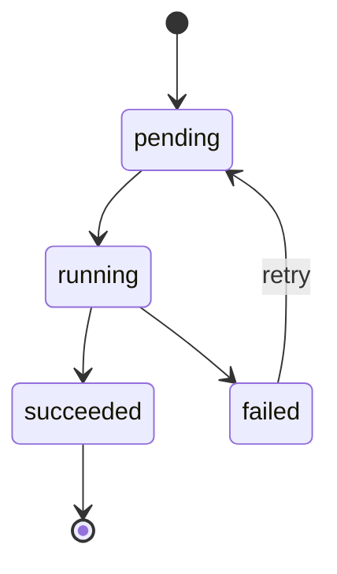

### 必须考虑的并发场景

```text
Webhook 1：main 从 A 更新到 B
Webhook 2：main 从 B 更新到 C
```

但 Worker 2 可能比 Worker 1 先执行。

因此不能简单假设事件严格按顺序处理。同步时应再次查询目标分支的状态，或者使用项目级串行队列和同步锁。

### 学习完成标准

你能够回答：

> 同一个项目连续收到三个 Push Webhook 时，如何避免旧任务覆盖新任务的同步结果。

------

## 9. 权限迁移和身份映射

你的 RAG 用户系统和 GitLab 用户系统可能是两套独立身份。

例如：

```text
RAG user_id = 123
GitLab user_id = 27
GitLab username = zhangsan
GitLab email = zhangsan@company.com
```

因此需要学习身份映射。

### 必须考虑

- RAG 用户和 GitLab 用户如何绑定
- 使用邮箱、用户名还是外部 ID
- GitLab Group 与 RAG department_code 如何映射
- GitLab Project 与知识库数据源如何映射
- GitLab 成员变更后权限如何同步
- 用户退出 Group 后，RAG 权限何时失效
- GitLab 权限与仓库权限 JSON 冲突时谁优先
- 管理员是否允许手动覆盖

### 推荐的权限组合

```text
最终可访问文档
=
用户有权访问对应 GitLab Project
AND
用户满足文档 ACL
```

而不是：

```text
GitLab 有权限
OR
文档 ACL 有权限
```

前者更符合安全上的“权限取交集”。

### 推荐的第一阶段

不要立刻自动同步所有 GitLab 用户权限。

先采用：

```text
GitLab Project
    → 映射到知识库数据源

权限 JSON
    → 继续生成 allowed_departments / allowed_users

RAG 登录用户
    → 仍使用现有认证和 department_codes
```

等 GitLab 文档同步稳定后，再增加 GitLab 成员和 RAG 用户的身份联动。

------

## 10. 二进制文档与 Git LFS

你的知识库不仅处理 Markdown，还可能处理：

- PDF
- DOCX
- PPTX
- XLSX
- 图片
- 压缩包

这些文件放入普通 Git 仓库后，每次修改都会产生新的 Git 对象，长期可能导致仓库体积快速增加。

Git LFS 会在 Git 仓库中保存指针，并将大文件内容存储到 LFS 对象存储中，用于避免大文件历史持续膨胀仓库。([GitLab Docs](https://docs.gitlab.com/administration/lfs/?utm_source=chatgpt.com))

### 必须学习

- 普通 Git Blob 与 LFS Pointer 的区别
- `.gitattributes`
- 哪些文件应进入 LFS
- Clone 时如何下载 LFS 对象
- GitLab API 获取的是指针还是实际文件
- LFS 对象下载认证
- 文件大小限制
- 超大文件解析限制

### 第一阶段建议

初期测试先使用：

```text
Markdown
TXT
小型 PDF
小型 DOCX
小型 PPTX
小型 XLSX
```

先不要立刻接入大量大文件和复杂 LFS 下载逻辑。

------

## 11. GitLab API 客户端设计

在了解接口之后，还需要学习如何将它封装成稳定的 Python 模块。

### 不建议

在 Service 中到处直接调用：

```python
await client.get(
    f"{base_url}/api/v4/projects/{project_id}/repository/files/..."
)
```

### 推荐结构

```text
GitLabClient
├── get_project()
├── get_default_branch()
├── get_branch_head()
├── list_repository_tree()
├── get_file()
├── download_raw_file()
├── compare_commits()
└── get_commit_diff()
```

上层再建立：

```text
GitLabSourceService
GitLabSyncService
GitLabPermissionService
GitLabWebhookService
```

### 必须学习

- API Client 与业务 Service 的区别
- DTO / Pydantic Model
- 统一异常转换
- 请求超时
- 连接池
- 重试策略
- 分页迭代器
- 流式下载
- 文件大小限制
- 日志脱敏
- Mock 测试

你已经学习过 `httpx.AsyncClient`、FastAPI Service 层和异步任务，这部分能够直接衔接现有知识。

------

## 12. 安全和运维知识

等基本同步跑通后，再学习这一层。

### 必须掌握

- Token 最小权限
- Token 加密存储
- Token 轮换
- Webhook 签名验证
- 防止 SSRF
- GitLab URL 白名单
- 下载文件大小限制
- MIME 类型和扩展名双重检查
- Zip Bomb 防御
- 路径穿越防御
- 日志中禁止输出 Token
- API 超时与熔断
- 审计日志
- 同步指标
- 告警
- 定期全量一致性校验

尤其不能允许普通用户随意配置：

```text
gitlab_url = http://任意内网地址
```

否则 GitLab 数据源功能可能变成 SSRF 请求入口。

------

## 四、当前不需要优先学习的 GitLab 功能

你不需要为了本次迁移先完整学习 GitLab DevOps 全家桶。

可以暂时跳过：

- GitLab Runner 深入原理
- CI/CD Pipeline 高级语法
- Container Registry
- Package Registry
- Kubernetes Agent
- GitLab Pages
- Terraform State
- Releases
- Environments 和 Deployment
- Auto DevOps
- Geo
- 高可用 GitLab 集群
- Gitaly 集群内部原理

CI/CD 后面可以用于：

```text
文档格式校验
权限 JSON Schema 校验
敏感信息检查
合并前解析测试
```

但它不是第一阶段完成 GitLab 文档同步的前置知识。

------

## 五、推荐学习顺序

我建议按照下面的顺序学习，而不是按 GitLab 官方功能目录从头到尾学习。

### 第一阶段：先会使用 GitLab

1. GitLab Instance、Group、Subgroup、Project、Repository
2. 用户、成员、角色和私有项目
3. Branch、Commit、Merge Request
4. Protected Branch
5. CODEOWNERS

**阶段成果：**

手动建立一个模拟企业文档仓库，并完成一次完整的文档审核和合并流程。

------

### 第二阶段：学会让 Python 读取 GitLab

1. Access Token
2. GitLab REST API 基础
3. Projects API
4. Repository Tree API
5. Repository Files API
6. Branches 和 Commits API
7. 分页、错误处理、限流

**阶段成果：**

写一个独立 Python 脚本，把 GitLab 项目指定 Commit 下的全部支持文档下载到本地临时目录。

------

### 第三阶段：学习事件驱动同步

1. Project Webhook
2. Push Event
3. Webhook 验签
4. `before_sha` 与 `after_sha`
5. Webhook 接口与 Worker 解耦
6. 幂等任务和重试

**阶段成果：**

文档合并到 `main` 后，FastAPI 收到通知并创建同步任务。

------

### 第四阶段：学习增量索引

1. Commit 比较
2. 文件新增、修改和删除
3. Stable Document ID
4. `blob_sha`、`content_hash`、`permission_hash`
5. Chunk 增量更新
6. ES、Milvus、PostgreSQL 一致性
7. 同步检查点
8. 补偿性全量同步

**阶段成果：**

修改一个 GitLab 文档时，只更新该文档对应的 Chunk，不重建整个知识库。

------

### 第五阶段：迁移权限模型

1. GitLab Group / Project 权限
2. GitLab 与 RAG 身份映射
3. 权限 JSON 的仓库化管理
4. 权限变更增量更新
5. GitLab 粗粒度权限与 RAG ACL 取交集
6. 用户移出 Group 后的权限失效

**阶段成果：**

GitLab 管理资产边界，RAG ACL 管理文档检索边界。

------

### 第六阶段：企业化强化

1. Git LFS
2. 大文件和流式下载
3. Token 加密与轮换
4. 审计、指标、告警
5. SSRF 和恶意文件防御
6. 定期一致性扫描
7. 多项目、Group 和系统级接入

------

## 六、建议你最终实现的总体架构

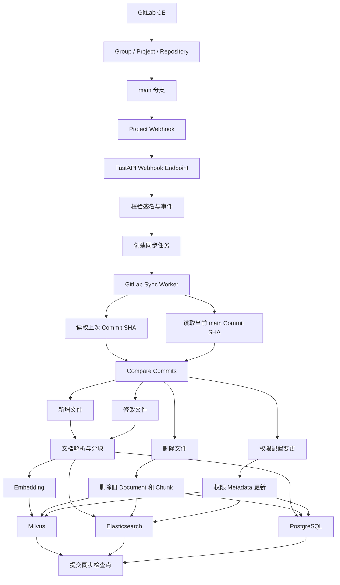

------

## 七、你接下来应当先学习的第一个模块

最合理的起点是：

> **GitLab 的组织与权限模型：Instance、Group、Subgroup、Project、Repository、Member、Role 之间是什么关系。**

原因是你当前最容易出现的设计错误，不是 API 调用错误，而是：

- 不知道一个部门应该对应 Group、Subgroup 还是 Project；
- 把所有文档放进同一个仓库；
- 错误地认为 GitLab 可以直接替代文档级 ACL；
- 不知道 RAG 服务账号应该被授予什么权限；
- 后续数据库无法稳定表示 GitLab 数据源。

学习完这个模块之后，再进入：

> **GitLab 中 Branch、Commit、Merge Request 和受保护主分支的协作流程。**


# 2、模块一：GitLab 的组织结构与权限模型

这一模块先不调用 API，也不编写代码。目标是建立一套正确的 GitLab 心智模型，避免后续让 Codex 按错误的资产结构实现同步功能。

学完后，你应当能够回答：

1. Instance、Namespace、Group、Subgroup、Project、Repository 分别是什么；
2. 企业部门、业务项目、文档仓库应分别映射到哪一层；
3. 用户权限为什么会从 Group 继承到 Project；
4. 为什么 GitLab 无法直接代替你现有的文档级 ACL；
5. 一个 GitLab Project 为什么适合作为 RAG 的“数据源边界”。

---

## 一、先建立完整层级关系

GitLab 中的主要对象关系可以表示为：

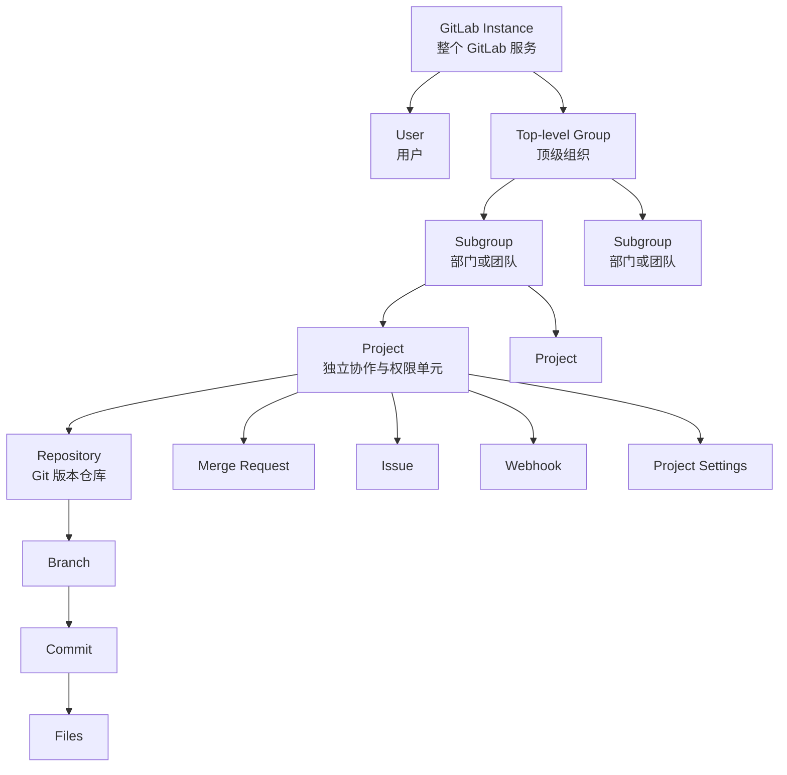

需要首先记住一句话：

> Group 用来组织项目和管理权限，Project 用来承载一项具体工作，Repository 只是 Project 中负责保存版本化文件的一个组件。

---

## 二、GitLab Instance：整个 GitLab 服务

### 1. Instance 是什么

你在 Docker 中启动的 GitLab CE，就是一个独立的 GitLab Instance。

例如：

```text
http://localhost:8929
```

或者：

```text
http://gitlab.local
```

这个地址所代表的完整 GitLab 系统，就是一个 Instance。

它内部包含：

```text
GitLab Instance
├── 所有用户
├── 所有 Group
├── 所有 Project
├── 全局配置
├── 身份认证配置
├── 邮件配置
├── 全局访问限制
└── 管理员后台
```

### 2. Instance Administrator 与 Group Owner 不同

这是初学 GitLab 时很容易混淆的地方。

#### Instance Administrator

管理员管理整个 GitLab 服务，例如：

- 创建或禁用用户；
- 修改实例级设置；
- 设置默认项目可见性；
- 查看所有 Group 和 Project；
- 管理全局认证和安全配置。

你的 Docker GitLab 中的 `root` 用户通常就是 Instance Administrator。

#### Group Owner

Owner 只管理某个 Group 及其下属资源，例如：

- 管理 Group 成员；
- 创建 Subgroup；
- 创建 Project；
- 修改 Group 设置；
- 管理下属项目。

所以：

```text
GitLab Administrator
≠
Group Owner
```

管理员是实例级身份，而 Owner 是某个资源层级中的成员角色。

### 3. 对你的工程有什么意义

未来你的 RAG 服务不应该使用 GitLab `root` 管理员账号读取文档。

正确方向是：

```text
root 管理员
    ↓
创建 Group / Project
    ↓
创建专门的 RAG 服务身份
    ↓
只授予读取目标仓库所需的权限
```

这就是最小权限原则。

---

## 三、Namespace：GitLab 资源的地址空间

### 1. Namespace 是什么

Namespace 可以理解成：

> GitLab 中用于确定项目归属和 URL 路径的命名空间。

GitLab 主要有两类 Namespace：

| Namespace 类型  | 示例                           | 用途           |
| --------------- | ------------------------------ | -------------- |
| User Namespace  | `zhangsan/demo`                | 个人项目       |
| Group Namespace | `company/development/rag-docs` | 团队或企业项目 |

例如：

```text
development/rag-docs
art/rag-docs
```

这两个项目都叫 `rag-docs`，但它们属于不同 Namespace，因此不会冲突。

### 2. URL 如何反映 Namespace

假设你的 GitLab 地址是：

```text
http://gitlab.local
```

你建立以下结构：

```text
company-assets
└── development
    └── backend-documents
```

那么项目路径可能是：

```text
http://gitlab.local/company-assets/development/backend-documents
```

其中：

```text
company-assets/development
```

是 Group Namespace。

```text
backend-documents
```

是 Project 路径。

Git Clone 地址则可能是：

```text
http://gitlab.local/company-assets/development/backend-documents.git
```

### 3. Namespace 不是文件目录

它们看起来都像路径：

```text
company-assets/development/backend-documents
```

但这不是操作系统中的文件夹路径。

它表示的是：

```text
顶级 Group / Subgroup / Project
```

进入项目后，Repository 内部才是 Git 管理的文件目录：

```text
backend-documents Repository
├── architecture/
│   ├── overview.md
│   └── deployment.md
├── permissions.json
└── README.md
```

所以必须区分：

```text
GitLab Namespace 路径
company-assets/development/backend-documents

Repository 文件路径
architecture/deployment.md
```

未来调用 GitLab API 时，这两个路径会出现在不同字段中。

---

## 四、Group：企业组织和权限容器

### 1. Group 是什么

Group 是用来同时组织多个 Project、管理成员和继承权限的容器。

例如：

```text
Group: development
├── Project: rag-backend
├── Project: deployment-docs
├── Project: coding-standards
└── Project: api-documents
```

你不需要分别把后端开发人员添加到四个 Project。

可以直接：

```text
将用户加入 development Group
        ↓
用户继承下属 Project 权限
```

### 2. Group 本身不保存普通 Git 文件

下面这种理解是错误的：

```text
Group = 一个大文件夹
Project = 文件夹中的子目录
```

Group 是组织与权限容器，不是普通 Git 仓库。

通常真正存放文档的是 Project 中的 Repository。

正确关系是：

```text
Group
└── Project
    └── Repository
        └── 文档文件
```

### 3. 企业中的 Group 通常对应什么

Group 可以对应：

- 公司；
- 事业部；
- 部门；
- 产品线；
- 大型业务域；
- 需要统一管理权限的一组团队。

例如：

```text
company-assets
```

可以表示公司内部资产的总入口。

下面再按照部门划分 Subgroup：

```text
company-assets
├── development
├── art
└── product-planning
```

### 4. Group 不应该对应单个文档

不建议这样设计：

```text
Group: rag-architecture-document
Group: rag-deployment-document
Group: coding-standards-document
```

**Group 粒度太大，主要用于组织成员和多个 Project，而不是表示单个文件。**

---

## 五、Subgroup：更细的组织与权限边界

### 1. Subgroup 是什么

Subgroup 就是位于另一个 Group 下的 Group。

例如：

```text
company-assets
└── development
    ├── backend
    ├── frontend
    └── ai-platform
```

这里：

- `company-assets` 是 Top-level Group；
- `development` 是它的 Subgroup；
- `backend`、`frontend`、`ai-platform` 又是更下一层 Subgroup。

### 2. Subgroup 的核心价值不是“目录分类”

虽然 Subgroup 看起来像目录，但它真正的价值是：

> 在组织树中创建新的成员管理和权限继承节点。

例如：

```text
company-assets
├── development
│   ├── backend
│   └── ai-platform
└── art
```

假设用户权限是：

```text
张三：development / Reporter
李四：ai-platform / Developer
王五：art / Reporter
```

那么：

- 张三可以继承访问 `development` 下的项目；
- 李四只获得 `ai-platform` 下的权限；
- 王五不会因为属于 `art` 而自动获得 `development` 权限。

### 3. 什么时候需要 Subgroup

可以使用一个判断原则：

> 是否需要在这一层单独管理一批人和一批项目？

需要，就适合使用 Subgroup。

例如：

```text
company-assets
└── development
    └── ai-platform
```

假设 AI 平台团队有自己的：

- 成员；
- 文档；
- 项目；
- 权限；
- 负责人。

那么创建 `ai-platform` Subgroup 是合理的。

如果只是想把一个仓库中的 Markdown 文件分成几个类别，应该使用 Repository 目录，而不是继续创建 Subgroup。

---

## 六、Project：你后续最重要的数据源边界

### 1. Project 是什么

Project 可以理解成：

> GitLab 中一个独立的协作、权限、配置和生命周期管理单元。

一个 Project 通常包含：

```text
Project
├── Repository
├── Members
├── Branches
├── Merge Requests
├── Issues
├── Webhooks
├── Access Tokens
├── CI/CD
└── Project Settings
```

Repository 只是其中一部分。

### 2. Project 与 Repository 为什么容易混淆

当你平时使用 Git 时，主要接触：

```bash
git clone
git add
git commit
git push
```

所以很容易把 GitLab Project 当成 Repository。

但实际上：

```text
Repository
```

只负责保存和版本控制文件。

```text
Project
```

还负责：

- 谁可以访问；
- 谁可以修改；
- 哪个分支受到保护；
- 哪些 Webhook 被触发；
- 哪些 Token 可以读取；
- Merge Request 如何审核；
- 项目是否公开。

因此，从 RAG 的角度看，Project 比 Repository 更适合作为数据源配置对象。

### 3. 为什么 Project 适合作为 RAG 数据源边界

未来你可以建立：

```text
RAG GitLabSource
- gitlab_instance_url
- project_id
- project_path
- target_branch
- last_synced_commit_sha
- credential_id
- webhook_secret
- sync_status
```

每接入一个 Project，就创建一条 GitLab 数据源记录。

例如：

| GitLab Project                | RAG 数据源 |
| ----------------------------- | ---------- |
| `development/rag-docs`        | 数据源 A   |
| `development/deployment-docs` | 数据源 B   |
| `art/character-guidelines`    | 数据源 C   |

每个数据源可以独立：

- 设置目标分支；
- 配置 Webhook；
- 保存最后同步 Commit；
- 执行全量同步；
- 执行增量同步；
- 失败重试；
- 暂停同步。

### 4. Project 粒度如何选择

Project 应该形成一个相对独立的：

```text
权限边界
+
协作边界
+
版本边界
+
同步边界
```

例如，下面的划分是合理的：

```text
development
├── rag-platform-docs
├── backend-deployment-docs
└── engineering-standards
```

因为它们可能拥有不同的：

- 维护人员；
- 审核流程；
- 文档生命周期；
- 访问人员；
- 同步配置。

---

## 七、Repository：真正存放文档的版本仓库

### 1. Repository 是什么

Repository 是 Git 版本仓库，内部保存：

- 目录；
- 文档；
- 分支；
- Commit；
- Tag；
- 文件历史。

你的 Repository 可以这样组织：

```text
rag-platform-docs/
├── README.md
├── architecture/
│   ├── system-overview.md
│   ├── retrieval-pipeline.md
│   └── agent-design.md
├── deployment/
│   ├── docker-deployment.md
│   └── environment-variables.md
├── operations/
│   └── troubleshooting.md
└── .knowledge-base/
    └── permissions.json
```

### 2. 【重点】Repository 目录可以分类，但不能独立控制读取权限

这是本模块最重要的结论之一。

假设一个私有 Project 的 Repository 是：

```text
company-documents/
├── development/
├── art/
└── product-planning/
```

只要某个用户拥有读取这个私有 Repository 的权限，他通常就可以 Clone 或下载整个 Repository。

GitLab 的标准 Group/Project 权限不能表达：

```text
张三只能读取 development/
但不能读取 art/
```

也不能表达：

```text
张三能看 architecture.md
但不能看 salary-policy.md
```

GitLab 的标准权限边界主要是 Group 和 Project，不是 Repository 内的单个目录或文件。

因此，如果两类文档在 GitLab 层面必须真正隔离，就不应该仅放在同一 Repository 的不同目录，而应该拆分到不同 Project。

---

## 八、Member、Membership 和 Role

这三个词需要分别理解。

### 1. Member

Member 是获得某个 Group 或 Project 访问权限的用户或受邀 Group。

例如：

```text
用户：zhangsan
资源：development Group
角色：Reporter
```

张三就是 `development` 的 Member。

### 2. Membership

Membership 是用户和资源之间的授权关系。

它包含的信息类似：

```text
user_id = 12
source_type = group
source_id = 8
role = reporter
expires_at = null
```

同一个用户可以拥有多条 Membership：

```text
张三
├── development Group：Reporter
├── rag-docs Project：Developer
└── art Project：Guest
```

### 3. Role

Role 表示用户能在资源中做什么。

你本次不需要一开始掌握全部角色，先重点掌握：

```text
Reporter
Developer
Maintainer
Owner
```

---

## 九、当前需要掌握的四个核心角色

### 1. Reporter：可以读取，但通常不能修改仓库

在企业文档场景中，Reporter 可以近似理解为：

> 文档读者。

适合：

- 只需要查看内部文档的员工；
- RAG 知识库的只读同步用户；
- 测试读取权限的账号。

对于私有 Project，Guest 通常不能 Clone Repository；Reporter 更适合作为标准只读角色。

### 2. Developer：可以参与日常内容修改

Developer 可以近似理解成：

> 文档贡献者或开发人员。

适合：

- 创建分支；
- Push 普通分支；
- 创建 Merge Request；
- 修改项目内容；
- 参与协作。

但 Developer 不应该负责项目级管理。

### 3. Maintainer：负责管理整个 Project

Maintainer 可以近似理解成：

> 项目负责人。

适合：

- 管理 Project 成员；
- 配置 Project；
- 管理分支保护；
- 管理 Webhook；
- 审核和合并内容；
- 管理项目级自动化设置。

你的 RAG 数据源连接器接入过程中，配置 Webhook、Token 等操作通常需要由 Maintainer 或更高权限的人员完成。

### 4. Owner：负责管理 Group

Owner 可以近似理解成：

> Group 或组织层级的负责人。

适合：

- 管理 Group 成员；
- 创建和管理 Subgroup；
- 管理整个 Group 下的项目；
- 进行高风险 Group 操作。

在企业结构中通常是：

```text
普通员工：Reporter 或 Developer
项目负责人：Maintainer
部门或组织管理员：Owner
实例运维人员：GitLab Administrator
```

---

## 十、权限继承机制

这是 Group 设计真正有价值的地方。

假设结构如下：

```text
company-assets
└── development
    ├── rag-docs
    └── deployment-docs
```

现在把张三添加到：

```text
development Group
角色：Reporter
```

张三会继承访问：

```text
development/rag-docs
development/deployment-docs
```

可以表示为：

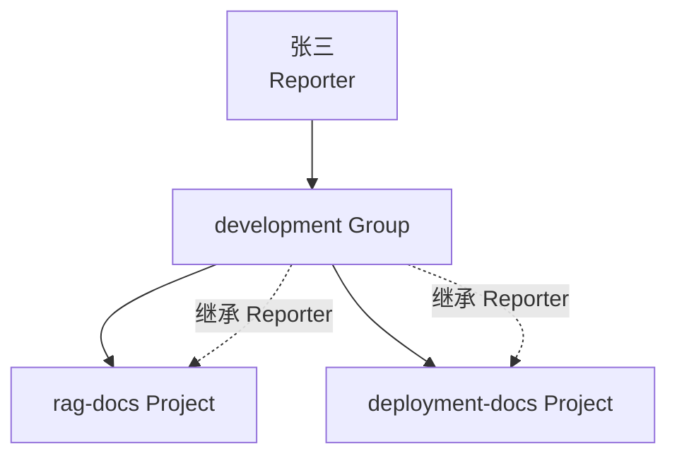

### 1. 直接成员

直接把张三加入 Project：

```text
rag-docs
└── 张三：Developer
```

这称为 Direct Membership。

### 2. 继承成员

张三是父 Group 成员，因此自动获得 Project 权限：

```text
development
└── 张三：Reporter
```

这称为 Inherited Membership。

### 3. 多个权限同时存在时取较高权限

假设：

```text
张三在 development Group 中是 Reporter
张三在 rag-docs Project 中是 Developer
```

那么张三在 `rag-docs` 中的有效权限是：

```text
Developer
```

### 4. 【重点】子层级不能用较低角色覆盖父层级

假设：

```text
张三在 company-assets 中是 Developer
```

你不能在下属 `development` Subgroup 中把他降为 Reporter，借此限制权限。

因为来自父 Group 的 Developer 权限已经继承下来。子层级可以授予更高权限，但不能通过较低角色抵消父层级权限。

这条规则非常重要。

---

## 十一、一个典型的权限继承案例

假设有以下组织：

```text
company-assets
├── development
│   ├── rag-docs
│   └── deployment-docs
└── art
    └── character-art-docs
```

成员配置如下：

| 用户  | 添加位置         | 角色       |
| ----- | ---------------- | ---------- |
| Alice | `company-assets` | Reporter   |
| Bob   | `development`    | Developer  |
| Carol | `rag-docs`       | Maintainer |
| David | `art`            | Reporter   |

那么有效权限是：

| 用户  |   rag-docs | deployment-docs | character-art-docs |
| ----- | ---------: | --------------: | -----------------: |
| Alice |   Reporter |        Reporter |           Reporter |
| Bob   |  Developer |       Developer |             无权限 |
| Carol | Maintainer |          无权限 |             无权限 |
| David |     无权限 |          无权限 |           Reporter |

### Alice

Alice 被添加到顶级 `company-assets`，权限向所有下属 Subgroup 和 Project 继承。

### Bob

Bob 只被添加到 `development`，所以只能访问 `development` 下属项目。

### Carol

Carol 直接加入 `rag-docs`，因此只拥有该项目的权限。

### David

David 加入 `art`，因此只能继承 `art` 下属项目权限。

这就是为什么：

> 越靠近顶层授予权限，影响范围越大。

所以企业中不应随意把大量用户加入顶级 Group。

---

## 十二、Visibility 与 Role 不是同一个概念

### 1. Visibility 解决“哪些人能够发现或访问资源”

GitLab Group 和 Project 可以配置：

| Visibility | 含义                                  |
| ---------- | ------------------------------------- |
| Private    | 只有被明确授权的成员可以访问          |
| Internal   | GitLab 实例中的普通已认证用户可以访问 |
| Public     | 未登录用户也可能访问                  |

企业内部知识资产建议默认使用：

```text
Private
```

而不是仅依赖 Internal。

因为 Internal 通常意味着：

```text
GitLab 实例中的普通内部用户都可能访问
```

这不适合部门隔离文档。

### 2. Role 解决“成员进入以后能做什么”

例如：

```text
Project Visibility = Private
```

并不代表所有成员权限相同。

项目成员仍可能分别是：

```text
Reporter
Developer
Maintainer
```

所以：

```text
Visibility
    → 谁可能访问资源

Role
    → 已获得成员资格后能执行什么操作
```

---

## 十三、GitLab 权限为什么不能完全替代现有 ACL

你现在的权限 JSON 可能是：

```json
{
  "visibility": "private",
  "allowed_departments": ["development"],
  "allowed_users": ["user_001"]
}
```

它可以对单个文档表达：

```text
该文档只允许 development 部门访问
或者只允许某些指定用户访问
```

GitLab 标准权限主要授予到：

```text
Group
Project
```

它不能方便地对同一个 Repository 中的每个文件分别设置读取权限。

因此未来应当理解成两层权限：

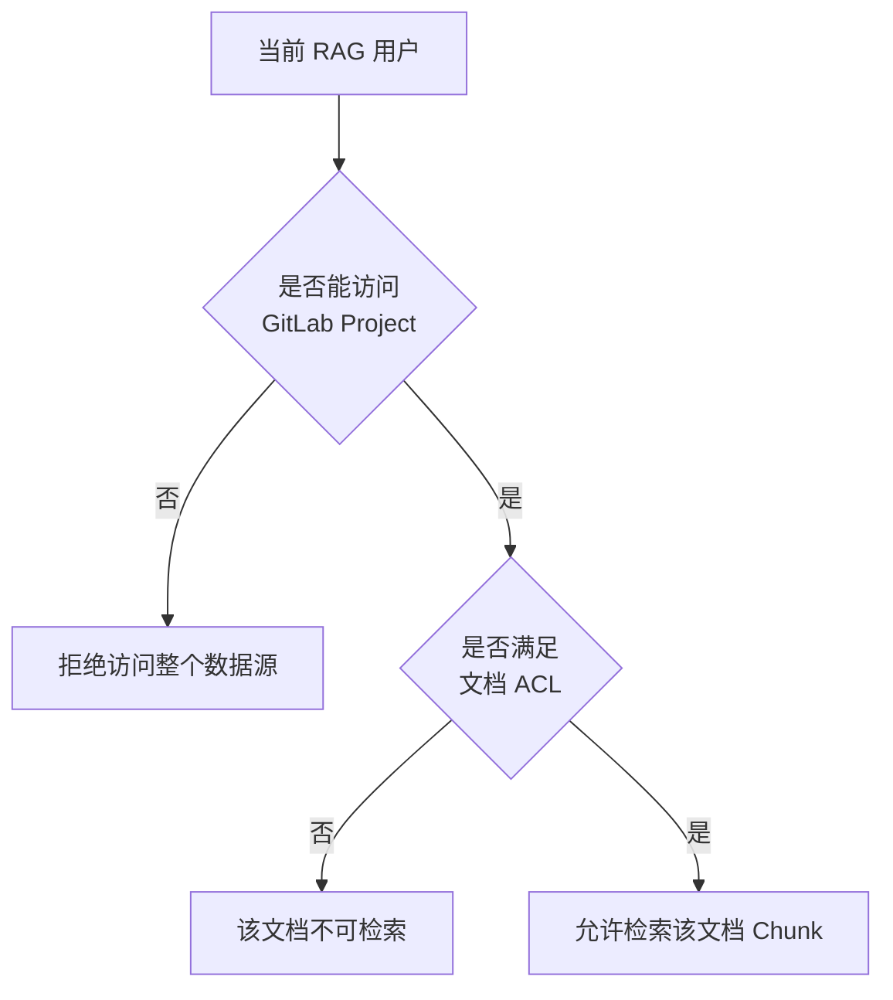

最终权限建议是：

```text
最终允许访问
=
GitLab Project 访问权限
AND
RAG 文档 ACL
```

不是二选一。

### 示例

假设：

```text
Project：development-docs
Project 成员：整个 development 部门
```

Repository 中有：

```text
public-guideline.md
architecture.md
salary-adjustment.md
```

其中：

```json
{
  "path": "salary-adjustment.md",
  "allowed_users": ["development_director"]
}
```

那么：

- GitLab Project 权限决定这个人是否属于该资产仓库；
- 文档 ACL 再决定他是否能通过 RAG 检索 `salary-adjustment.md`。

但需要注意一个安全边界：

> 只要用户拥有 GitLab Repository 的读取权限，他仍然可能直接在 GitLab 中读取或 Clone 这个文件。

所以，如果某份文档在 GitLab 层面也必须严格保密，就必须将它拆到独立的私有 Project，而不能只依赖 RAG ACL。

---

## 十四、如何将现在的目录迁移到 GitLab

假设当前本地目录是：

```text
knowledge-base/
├── development/
│   ├── rag-backend-deployment.md
│   └── permissions.json
├── art/
│   ├── character-art-style.md
│   └── permissions.json
├── product_planning/
│   ├── combat-design.md
│   └── permissions.json
└── public/
    ├── project-overview.md
    └── permissions.json
```

最直接的 GitLab 映射可以是：

```text
Top-level Group: company-knowledge
├── Subgroup: development
│   └── Project: development-documents
├── Subgroup: art
│   └── Project: art-documents
├── Subgroup: product-planning
│   └── Project: product-documents
└── Subgroup: common
    └── Project: common-documents
```

各 Project 的 Repository 内部：

```text
development-documents/
├── README.md
├── rag-backend-deployment.md
└── .knowledge-base/
    └── permissions.json
```

这里的对应关系是：

| 现有概念                         | GitLab 概念             |
| -------------------------------- | ----------------------- |
| 整个企业知识资产                 | Top-level Group         |
| 部门目录                         | Subgroup                |
| 一组具有共同权限和维护流程的文档 | Project                 |
| 文档目录和文件                   | Repository 内容         |
| 权限 JSON                        | Repository 中的配置文件 |
| 一次导入目录                     | 一次同步 Project        |
| 本地目录路径                     | Repository Path         |
| 数据源名称                       | Project Path            |
| 文件修改状态                     | Commit                  |
| 目录扫描                         | Repository Tree 遍历    |

---

## 十五、不要机械地“一目录对应一个 Project”

你现有目录结构不一定就是未来最合理的 GitLab 结构。

判断是否拆分 Project 时，应考虑四个边界。

### 1. 权限边界

两组人是否可以访问相同文档？

不能，就应该拆 Project。

### 2. 维护边界

是否由不同团队负责维护？

是，可以拆 Project。

### 3. 审核边界

是否需要不同负责人审核？

是，可以拆 Project。

### 4. 同步边界

是否希望能够独立暂停、重建或同步？

是，可以拆 Project。

因此：

```text
一个 Project
```

不应简单等于：

```text
一个文件夹
```

而应该等于：

```text
一组权限、维护、审核和同步生命周期相对一致的资产
```

---

## 十六、推荐的第一版 GitLab 结构

结合你当前的 RAG ACL 测试结构，建议先建立一个最小模型：

```text
company-knowledge
├── development
│   └── development-documents
├── art
│   └── art-documents
├── product-planning
│   └── product-documents
└── common
    └── common-documents
```

所有 Group 和 Project 暂时设置为：

```text
Visibility: Private
```

成员示例：

| 用户                 | Group 或 Project  | Role      |
| -------------------- | ----------------- | --------- |
| `development_user`   | development       | Reporter  |
| `art_user`           | art               | Reporter  |
| `product_user`       | product-planning  | Reporter  |
| `development_editor` | development       | Developer |
| `knowledge_admin`    | company-knowledge | Owner     |
| `rag_sync_service`   | 目标 Project      | Reporter  |

其中 `rag_sync_service` 现在可以先用普通测试用户模拟。正式实现时，再学习 Project Access Token、Deploy Token 或其他服务身份方案。

---

## 十七、需要特别避免的三种错误设计

### 错误一：所有文档放入一个 Project

```text
company-documents
├── development
├── art
├── finance
└── hr
```

问题是：

> 任何能读取 Repository 的用户，都可能读取所有目录。

即使 RAG 检索时实施 ACL，用户仍可能直接从 GitLab Clone 整个仓库。

### 错误二：把每个文档都建立成一个 Project

```text
Project: architecture-document
Project: deployment-document
Project: coding-standards-document
```

问题是：

- Project 数量过多；
- 成员管理困难；
- Webhook 和同步配置过多；
- 每个文件一次 Commit，协作体验差；
- 无法自然组织相关文档。

Project 应该管理一组生命周期一致的文档，而不是单个文件。

### 错误三：把用户全部加入顶级 Group

例如：

```text
所有员工
    → company-knowledge / Reporter
```

这样所有员工都会继承到下面的部门 Project。

如果部门之间需要隔离，应分别把用户加入：

```text
development
art
product-planning
```

而不是顶级 Group。

---

## 十八、本模块的实践任务

你现在可以在本地 GitLab 中完成一次最小实验。

### 第一步：确认 GitLab 版本

由于 `gitlab/gitlab-ce:latest` 只表示拉取镜像时的最新版本，不代表当前容器一定始终自动升级，先在 GitLab 管理页面查看当前版本。

也可以在 Docker 环境中执行类似：

```bash
docker exec -it <gitlab容器名> gitlab-rake gitlab:env:info
```

不同版本的界面菜单和角色显示可能略有区别。

### 第二步：创建顶级 Group

创建：

```text
Name: Company Knowledge
Path: company-knowledge
Visibility: Private
```

### 第三步：创建三个 Subgroup

```text
development
art
product-planning
```

都设置成 Private。

### 第四步：创建三个 Project

分别创建：

```text
company-knowledge/development/development-documents
company-knowledge/art/art-documents
company-knowledge/product-planning/product-documents
```

创建 Project 时可以勾选：

```text
Initialize repository with a README
```

这样 GitLab 会初始化 Repository 和默认分支。

### 第五步：创建三个测试用户

例如：

```text
dev_reader
art_reader
knowledge_admin
```

为了方便实验，可以由 `root` 在 Admin Area 中创建。

### 第六步：分配权限

```text
dev_reader
    → development / Reporter

art_reader
    → art / Reporter

knowledge_admin
    → company-knowledge / Owner
```

### 第七步：验证权限继承

分别登录三个账号验证：

```text
dev_reader
    能看到 development-documents
    看不到 art-documents

art_reader
    能看到 art-documents
    看不到 development-documents

knowledge_admin
    能看到所有下属 Project
```

这次实验的重点不是上传文档，而是亲眼观察：

```text
Group Membership
        ↓
Subgroup 权限继承
        ↓
Project 有效权限
```

---

## 十九、本模块必须形成的最终认识

请先记住下面六条结论：

1. **Instance 是整个 GitLab 服务，不是一个仓库。**
2. **Namespace 决定 Group 和 Project 的归属路径。**
3. **Group 和 Subgroup 负责组织项目、成员和权限继承。**
4. **Project 是权限、协作、配置和同步的独立边界。**
5. **Repository 是 Project 中真正保存版本化文档的地方。**
6. **GitLab 标准权限主要控制 Group 和 Project，无法替代文件级 RAG ACL。**

对你的工程来说，可以进一步浓缩为：

```text
GitLab Instance
    → 外部资产管理平台

GitLab Group / Subgroup
    → 企业组织与粗粒度权限

GitLab Project
    → RAG 数据源和同步边界

GitLab Repository
    → 文档实际存储位置

Repository 权限 JSON
    → 文档级检索 ACL

RAG 权限过滤
    → 最终执行访问控制
```

下一节最适合继续学习：

> GitLab 成员权限的实际判定：直接成员、继承成员、共享成员、角色叠加，以及如何设计部门权限测试。

---

## 参考资料

- GitLab Repository：https://docs.gitlab.com/user/project/repository/
- GitLab Namespace：https://docs.gitlab.com/user/namespace/
- GitLab Group：https://docs.gitlab.com/user/group/
- GitLab Subgroups：https://docs.gitlab.com/user/group/subgroups/
- GitLab Project Members：https://docs.gitlab.com/user/project/members/
- GitLab Permissions：https://docs.gitlab.com/user/permissions/
- GitLab Public Access：https://docs.gitlab.com/user/public_access/


# 3、第二节：GitLab 成员权限的实际判定

上一节建立了 GitLab 的层级关系：

```text
Instance
└── Group
    └── Subgroup
        └── Project
            └── Repository
```

这一节进一步解决：

> 一个用户最终为什么能访问某个 Project，以及他最终获得什么角色？

在 GitLab 中，仅查看用户是否被“直接添加到 Project”是不够的，因为权限可能来自多个位置：

```text
直接加入 Project
从父 Group 继承
从更上层 Group 继承
通过邀请其他 Group 获得
多条授权路径同时存在
```

因此需要区分两个概念：

```text
Membership Source
    → 权限从哪里来

Effective Role
    → 多条权限合并后，用户最终拥有什么权限
```

------

## 一、先理解权限判定的整体过程

假设张三正在访问：

```text
company-knowledge/development/rag-documents
```

GitLab 不会只检查：

```text
张三是不是 rag-documents 的直接成员？
```

它还会检查：

```text
1. 张三是否是 rag-documents 的直接成员？

2. 张三是否是 development Group 的成员？

3. 张三是否是 company-knowledge Group 的成员？

4. rag-documents 是否邀请过张三所属的其他 Group？

5. 张三是否通过多条路径同时获得权限？

6. 多条路径中，哪一条提供的角色最高？
```

可以将它抽象成：

```text
用户对 Project 的有效角色
=
所有有效授权路径中的最高角色
```

例如：

```text
父 Group：Reporter
Project 直接成员：Developer
其他邀请 Group：Reporter
```

最终有效角色是：

```text
Developer
```

GitLab 的预定义角色具有访问级别顺序，例如 Reporter、Developer、Maintainer、Owner 的访问级别依次提高；当用户同时通过 Project 和父 Group 获得权限时，GitLab采用较高的有效访问级别。([GitLab Docs](https://docs.gitlab.com/development/permissions/predefined_roles/?utm_source=chatgpt.com))

------

## 二、Direct Member：直接成员

### 1. 什么是直接成员

直接成员是指：

> 用户被直接添加到当前 Group 或当前 Project。

例如，你进入：

```text
rag-documents
→ Manage
→ Members
→ Invite members
```

然后添加：

```text
用户：zhangsan
角色：Developer
```

那么张三就是 `rag-documents` 的直接成员。

关系可以表示为：

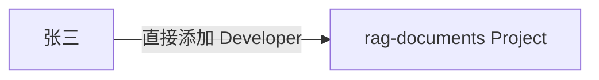

### 2. 直接成员的权限来源

张三的权限来源就是当前 Project：

```text
membership_source = rag-documents
membership_type = direct
role = Developer
```

在 GitLab 的 Members 页面中，通常可以通过 `Source` 或成员类型看到这条权限从哪里产生。

### 3. 直接成员在哪里管理

因为权限是在 Project 上直接添加的，所以可以直接在 Project 中：

- 修改角色；
- 设置过期时间；
- 删除成员。

GitLab 明确区分直接成员和继承成员：直接成员可以从当前 Project 中直接删除，而继承成员必须回到产生权限的父 Group 中删除。([GitLab Docs](https://docs.gitlab.com/user/project/members/))

### 4. 适合使用直接成员的场景

直接成员适合表示“例外授权”。

例如：

```text
development Group
├── 后端团队成员
└── rag-documents Project
```

正常情况下，后端团队成员通过 `development` Group 继承权限。

但现在需要让安全部门的李四临时参与 `rag-documents`，又不希望他访问整个 `development` 下的其他 Project。

可以直接添加：

```text
李四
→ rag-documents
→ Reporter
```

这样李四只获得这个 Project 的权限。

### 5. 不建议全部使用直接成员

假设部门有 50 人，下面有 10 个 Project。

如果每个 Project 都逐个添加 50 人，就会产生：

```text
50 × 10 = 500 条成员配置
```

人员离职、调岗或者角色变化时，还要逐个 Project 修改。

更合理的是：

```text
把员工加入 department Group
        ↓
权限自动继承到下属 Project
```

因此：

> Group 成员是常规授权，Project 直接成员更适合作为例外授权。

------

## 三、Inherited Member：继承成员

### 1. 什么是继承成员

继承成员是指：

> 用户并没有直接加入当前资源，但因为属于它的父 Group，所以继承了权限。

例如：

```text
company-knowledge
└── development
    └── rag-documents
```

将张三添加到：

```text
development Group
角色：Reporter
```

张三没有直接加入 `rag-documents`，但他仍然可以访问这个 Project。

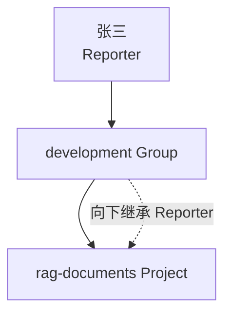

GitLab 会把 Group 成员权限向下继承到其 Subgroup 和 Project；GitLab 的成员界面也会在 `Source` 中显示权限来自哪个父 Group。([GitLab Docs](https://docs.gitlab.com/user/group/subgroups/))

### 2. 权限只向下继承

这是必须掌握的规则。

假设：

```text
company-knowledge
└── development
    ├── backend
    │   └── backend-documents
    └── ai-platform
        └── rag-documents
```

如果张三是：

```text
development / Reporter
```

那么权限会向下继承：

```text
backend
backend-documents
ai-platform
rag-documents
```

但如果张三只被加入：

```text
ai-platform / Reporter
```

他只能访问：

```text
ai-platform
rag-documents
```

不能访问：

```text
development 下的 backend
```

也不会因为加入 `ai-platform` 而自动成为 `development` 的成员。

可以理解为：

```text
父级权限 → 可以向下传播
子级权限 → 不会向上传播
子级权限 → 也不会横向传播到兄弟节点
```

------

## 四、继承成员不能在子 Project 中单独删除

假设张三的权限来自：

```text
development / Reporter
```

那么在 `rag-documents` Project 中看到张三时，他是继承成员。

你不能只在 `rag-documents` 中删除这条继承权限，因为：

```text
权限不是在 rag-documents 中创建的
权限是在 development Group 中创建的
```

要取消权限，必须到：

```text
development
→ Manage
→ Members
```

将张三移出 `development`，或者修改他在 `development` 中的角色。GitLab 的项目成员规则明确要求：从父 Group 继承的成员只能从对应父 Group 中移除。([GitLab Docs](https://docs.gitlab.com/user/project/members/))

可以类比成 Python 继承：

```python
class Development:
    permissions = ["read"]

class RagDocuments(Development):
    pass
```

`RagDocuments` 的 `read` 权限来自父级。

你不能假装它是当前类自己定义的权限；必须修改真正的权限来源。

------

## 【重点】五、不能在子层级通过低角色抵消高角色

这是权限设计中很容易理解错误的地方。

假设：

```text
张三
→ development Group
→ Developer
```

由于 `rag-documents` 位于 `development` 下，张三已经继承：

```text
rag-documents / Developer
```

现在你又把张三直接添加到 `rag-documents`：

```text
rag-documents / Reporter
```

最终权限不会降低为 Reporter，而仍然是：

```text
Developer
```

原因是张三同时拥有两条授权路径：

```text
路径一：development → Developer
路径二：rag-documents → Reporter
```

GitLab 取较高权限：

```text
max(Developer, Reporter)
=
Developer
```

GitLab 的有效权限规则是：用户同时拥有 Project 权限和父 Group 权限时，使用其中最高的访问级别。([GitLab Docs](https://docs.gitlab.com/development/permissions/predefined_roles/?utm_source=chatgpt.com))

### 错误理解

```text
父 Group 授予 Developer
Project 再设置 Reporter
        ↓
将用户降级成 Reporter
```

这是错误的。

### 正确理解

```text
父 Group 授予 Developer
Project 再设置 Reporter
        ↓
两条权限都存在
        ↓
最终仍然是 Developer
```

因此，一旦在较高层级授予了较高角色，下面的 Project 很难再缩小其权限范围。

这也是为什么：

> 不应轻易在顶级 Group 给大量用户较高权限。

------

## 六、角色叠加的判定方法

当前阶段可以先使用下面的角色顺序：

```text
Reporter < Developer < Maintainer < Owner
```

它们在 GitLab 内部对应不同的访问级别。GitLab 当前还可能提供 Minimal Access、Guest、Planner、Security Manager 或自定义角色；具体可见角色会受到 GitLab 版本、许可证和实例配置影响。([GitLab Docs](https://docs.gitlab.com/user/permissions/?utm_source=chatgpt.com))

假设某用户对一个 Project 有以下权限：

| 权限来源           | 角色       |
| ------------------ | ---------- |
| 顶级 Group         | Reporter   |
| 部门 Subgroup      | Developer  |
| Project 直接成员   | Reporter   |
| 被邀请的其他 Group | Maintainer |

那么最终需要在所有有效授权路径中选择最高角色：

```text
Reporter
Developer
Reporter
Maintainer
        ↓
最终角色：Maintainer
```

但注意：

> 必须先确认每条授权路径真的能够到达这个 Project。

例如，兄弟 Subgroup 中的权限不会横向继承，所以不能参与最终计算。

------

## 七、Shared Member：通过邀请 Group 获得权限

除了直接添加用户，GitLab 还允许：

```text
把一个 Group 邀请到另一个 Project
```

例如有两个互不隶属的组织：

```text
company-knowledge
└── development
    └── rag-documents

security-team
├── security_lead
└── security_engineer
```

现在 `rag-documents` 需要让安全团队参与审核。

不必逐个添加：

```text
security_lead
security_engineer
```

可以将整个 `security-team` 邀请到 `rag-documents`：

```text
rag-documents
→ Invite a group
→ security-team
→ Maximum role: Reporter
```

于是安全团队成员通过 Group 邀请获得 Project 权限。

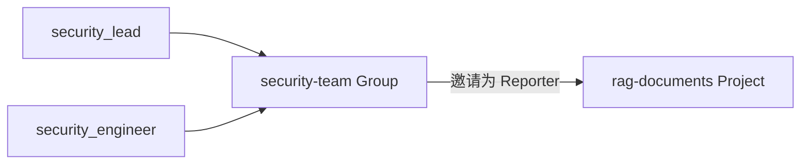

GitLab 将这种 Project 称为共享 Project。被邀请 Group 的直接成员和从其父 Group 继承的成员可以获得 Project 访问权。([GitLab Docs](https://docs.gitlab.com/user/project/members/sharing_projects_groups/))

------

## 八、邀请 Group 时为什么存在“最大角色”

假设：

```text
security_lead
→ security-team / Maintainer
```

现在 `security-team` 被邀请到：

```text
rag-documents
Maximum role = Reporter
```

安全负责人在 `security-team` 中虽然是 Maintainer，但他通过这条邀请路径进入 `rag-documents` 时只能得到：

```text
Reporter
```

计算方式是：

```text
通过 Group 邀请获得的角色
=
min(
    用户在被邀请 Group 中的角色,
    邀请时设置的最大角色
)
```

具体例子：

| 用户在 security-team 的角色 | 邀请最大角色 | 在 rag-documents 的角色 |
| --------------------------- | ------------ | ----------------------- |
| Reporter                    | Maintainer   | Reporter                |
| Developer                   | Reporter     | Reporter                |
| Maintainer                  | Developer    | Developer               |
| Maintainer                  | Maintainer   | Maintainer              |

GitLab 官方规则是：通过邀请 Group 获得权限时，成员保留“自身 Group 角色”和“邀请最大角色”中较低的一个。([GitLab Docs](https://docs.gitlab.com/user/project/members/sharing_projects_groups/))

这是为了避免：

```text
把整个团队邀请进来
        ↓
意外给所有人过高权限
```

------

## 九、先取邀请路径中的低角色，再取所有路径中的高角色

这里存在两个不同的计算步骤，不能混淆。

### 第一步：计算邀请路径提供的角色

```text
邀请路径角色
=
min(用户在被邀请 Group 中的角色, 邀请最大角色)
```

例如：

```text
用户在 security-team 中：Maintainer
邀请最大角色：Reporter

邀请路径结果：Reporter
```

### 第二步：和用户的其他权限路径比较

假设同一个用户又是：

```text
development / Developer
```

那么用户对 `rag-documents` 的权限路径有：

```text
路径一：development 继承 → Developer
路径二：security-team 邀请 → Reporter
```

最终有效角色：

```text
max(Developer, Reporter)
=
Developer
```

所以完整模型可以写成：

```text
每条 Group 邀请路径
    → 先受到邀请最大角色限制

所有直接、继承和邀请路径
    → 再选择最高有效角色
```

------

## 十、Subgroup 成员不等于父 Group 成员

这是 Group 邀请中非常容易踩坑的规则。

假设：

```text
security-team
└── penetration-testing
    └── user_a
```

`user_a` 只是 `penetration-testing` 的直接成员，不是 `security-team` 的直接成员，也没有从 `security-team` 继承权限。

现在把：

```text
security-team
```

邀请到 `rag-documents`。

不能简单认为：

```text
security-team 下面的所有 Subgroup 成员
都能访问 rag-documents
```

对于 Project 邀请，GitLab允许被邀请 Group 的直接成员及其继承成员访问，但“仅属于被邀请 Group 下某个 Subgroup 的成员”不会因为父 Group 被邀请而自动获得权限；需要直接邀请对应 Subgroup。([GitLab Docs](https://docs.gitlab.com/user/project/members/sharing_projects_groups/))

原因是权限传播方向仍然是向下，而不是向上。

`user_a` 的关系是：

```text
security-team
└── penetration-testing
    └── user_a
```

`user_a` 的权限不会从 `penetration-testing` 向上传播到 `security-team`。

因此，如果要让这个团队进入 Project，应邀请：

```text
security-team/penetration-testing
```

而不是只邀请它的父 Group。

------

## 十一、Project 邀请 Group 与 Group 邀请 Group 不完全相同

GitLab 支持两种相似但规则不同的操作：

```text
Project 邀请 Group
Group 邀请 Group
```

### Project 邀请 Group

例如：

```text
rag-documents Project
邀请 security-team Group
```

被邀请 Group 的以下成员通常可以获得访问：

- 直接成员；
- 从父 Group 继承到该 Group 的成员。

### Group 邀请 Group

例如：

```text
development Group
邀请 security-team Group
```

当前 GitLab 规则更严格，通常只有被邀请 Group 的直接成员获得共享 Group 的访问；它的继承成员、共享成员和仅属于 Subgroup 的成员不会自动进入。([GitLab Docs](https://docs.gitlab.com/user/project/members/sharing_projects_groups/))

你现在不需要立即在工程中使用 Group-to-Group sharing，但需要知道：

> “邀请一个 Group”并不总是意味着把该 Group 整棵子树中的所有用户都带进来。

第一版企业模拟环境建议尽量保持简单：

```text
使用父 Group 权限继承
+
少量 Project 直接成员
```

暂时不要大量使用 Group sharing，否则成员权限来源会变得难以排查。

------

## 十二、完整案例：计算五个用户的最终权限

假设 GitLab 结构如下：

```text
company-knowledge
├── development
│   ├── ai-platform
│   │   └── rag-documents
│   └── deployment-documents
└── art
    └── art-documents

security-team
```

成员配置如下：

| 用户  | 添加位置          | 角色       |
| ----- | ----------------- | ---------- |
| Alice | company-knowledge | Reporter   |
| Bob   | development       | Developer  |
| Carol | ai-platform       | Maintainer |
| David | rag-documents     | Reporter   |
| Eve   | security-team     | Developer  |

另外：

```text
security-team
被邀请到
rag-documents
Maximum role = Reporter
```

### Alice

Alice 是：

```text
company-knowledge / Reporter
```

权限从顶级 Group 向下继承。

所以她可以访问：

```text
rag-documents：Reporter
deployment-documents：Reporter
art-documents：Reporter
```

这说明：

> 顶级 Group 的授权范围非常大。

------

### Bob

Bob 是：

```text
development / Developer
```

所以他可以访问：

```text
rag-documents：Developer
deployment-documents：Developer
art-documents：无权限
```

因为 `art` 是 `development` 的兄弟节点，权限不会横向传播。

------

### Carol

Carol 是：

```text
ai-platform / Maintainer
```

所以她可以访问：

```text
rag-documents：Maintainer
deployment-documents：无权限
art-documents：无权限
```

她的权限只能从 `ai-platform` 向下传播。

------

### David

David 被直接加入：

```text
rag-documents / Reporter
```

所以：

```text
rag-documents：Reporter
deployment-documents：无权限
art-documents：无权限
```

这是一个典型的例外授权。

------

### Eve

Eve 是：

```text
security-team / Developer
```

`security-team` 被邀请到：

```text
rag-documents
Maximum role = Reporter
```

所以邀请路径计算结果是：

```text
min(Developer, Reporter)
=
Reporter
```

最终：

```text
rag-documents：Reporter
deployment-documents：无权限
art-documents：无权限
```

### 汇总表

| 用户  | rag-documents | deployment-documents | art-documents |
| ----- | ------------- | -------------------- | ------------- |
| Alice | Reporter      | Reporter             | Reporter      |
| Bob   | Developer     | Developer            | 无权限        |
| Carol | Maintainer    | 无权限               | 无权限        |
| David | Reporter      | 无权限               | 无权限        |
| Eve   | Reporter      | 无权限               | 无权限        |

------

## 十三、再加入角色冲突

现在对 Bob 增加一条配置：

```text
Bob
→ rag-documents 直接成员
→ Reporter
```

Bob 已经从 `development` 继承：

```text
Developer
```

现在拥有两条权限路径：

```text
development → Developer
rag-documents → Reporter
```

最终仍然是：

```text
Developer
```

### 再对 David 增加父级权限

原来：

```text
David
→ rag-documents / Reporter
```

现在又把 David 加入：

```text
development / Maintainer
```

他的权限变成：

```text
rag-documents 直接路径：Reporter
development 继承路径：Maintainer
```

最终：

```text
Maintainer
```

这证明：

> 不能只查看 Project 中直接配置的角色，必须计算所有有效权限来源。

------

## 十四、Members 页面为什么有时看起来很复杂

进入：

```text
Project
→ Manage
→ Members
```

你可能会看到一个用户出现，但无法直接修改或者删除。

通常是因为他不是 Direct Member，而是通过以下方式进入：

```text
Inherited
Project Invite
Group Invite
其他间接权限
```

当前 GitLab 的 Members 页面支持区分 Direct 和 Indirect 成员，并通过权限来源帮助管理员判断用户从哪里获得访问。([GitLab Docs](https://docs.gitlab.com/user/project/members/))

排查权限时，应按照下面的顺序：

```text
1. 查看用户最终角色

2. 查看 Source

3. 判断是 Direct 还是 Indirect

4. 找到真正产生权限的 Group 或 Project

5. 在权限源头修改配置
```

不要只在当前 Project 页面反复尝试删除。

------

## 十五、以后调用 API 时必须区分两个接口

虽然目前还没有进入 GitLab API 模块，但现在必须提前知道一个关键差别。

### 只查询直接成员

```http
GET /projects/:id/members
```

这个接口只返回当前 Project 的直接成员，不包含从父 Group 继承的成员。([GitLab Docs](https://docs.gitlab.com/api/project_members/))

例如：

```text
Alice：从 company-knowledge 继承
Bob：从 development 继承
David：直接加入 rag-documents
```

调用直接成员接口时，可能只看到：

```text
David
```

如果错误地用这个结果判断权限，就会得出：

```text
Alice 无权访问
Bob 无权访问
```

但实际上他们有继承权限。

### 查询全部有效成员

```http
GET /projects/:id/members/all
```

该接口会包含可见的直接成员、继承成员、邀请成员及祖先 Group 权限；同一用户有多条祖先或 Project 权限时，返回最高 `access_level`，代表有效权限。([GitLab Docs](https://docs.gitlab.com/api/project_members/))

Group API 也有类似区别：

```http
GET /groups/:id/members
```

只返回直接成员。

```http
GET /groups/:id/members/all
```

返回直接、继承和邀请等成员，并对多条祖先权限取最高有效级别。([GitLab Docs](https://docs.gitlab.com/api/group_members/))

------

## 十六、这对你的 RAG 工程有什么影响

### 1. 不能只同步 Project 的直接成员

未来假设你要将 GitLab 权限同步到 RAG：

```text
GitLab Project Members
        ↓
生成 RAG 可访问用户列表
```

如果只调用：

```http
/projects/:id/members
```

会遗漏所有父 Group 继承成员。

正确方向是使用：

```http
/projects/:id/members/all
```

或者按照完整的 Group 层级自己计算有效权限。

第一版更适合直接使用 GitLab 提供的有效成员结果，不建议自己重新实现整套权限继承算法。

------

### 2. 数据库应区分权限来源与有效结果

以后如果需要缓存 GitLab 权限，可以考虑保存：

```text
GitLabProjectMembership
- project_id
- gitlab_user_id
- effective_access_level
- membership_source
- source_group_id
- expires_at
- evaluated_at
```

其中：

```text
effective_access_level
```

表示用户最终对 Project 的权限。

```text
membership_source
```

表示它可能来自：

```text
direct
inherited
project_invited_group
group_invited_group
```

但第一阶段不必立刻设计这张表。先实现 Project 文档同步，再逐步接入成员同步，会更容易控制复杂度。

------

### 3. GitLab 权限仍然只是外层权限

你的最终访问控制仍应分两层：

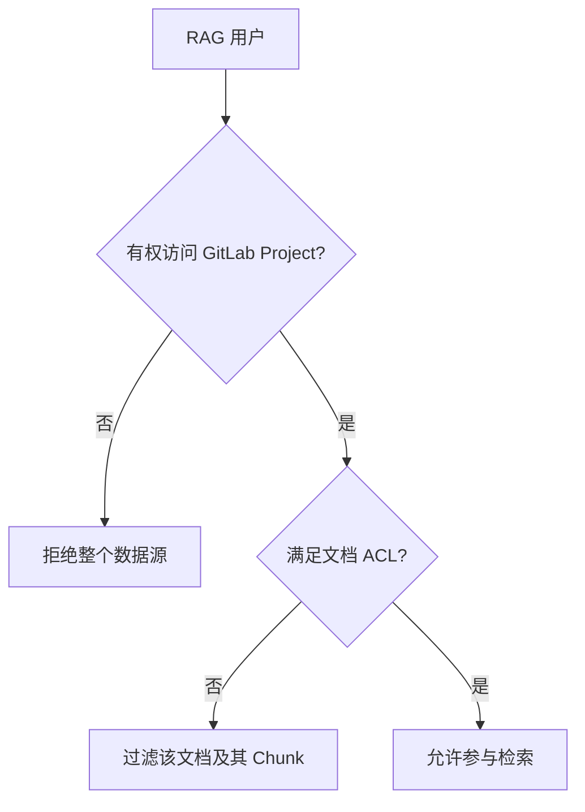

外层：

```text
GitLab Project 权限
```

决定用户能否进入整个资产仓库。

内层：

```text
permissions.json
```

决定用户能否通过 RAG 检索具体文档。

------

### 4. 不能把 RAG ACL 当成 GitLab 文件保密措施

Git 是分布式版本控制系统。GitLab 当前权限规则允许具备相应仓库读取权限的成员 Clone 完整 Repository；一旦用户获得本地副本，GitLab 无法阻止其进一步复制已有内容。([GitLab Docs](https://docs.gitlab.com/user/project/members/))

所以假设同一 Project 中有：

```text
normal-documents/
salary-documents/
```

即使 RAG 的 `permissions.json` 不让普通开发者检索工资文档，只要开发者能读取 GitLab Repository，他仍可能直接在 GitLab 中查看或 Clone 文件。

因此真正敏感的资产必须拆分：

```text
development-documents Project
salary-documents Project
```

而不是仅拆成两个目录。

------

## 十七、对你当前工程的第一版建议

第一版先不要使用复杂的 Group sharing。

推荐仅使用：

```text
1. Group 直接成员
2. 父 Group 权限继承
3. 少量 Project 直接成员
```

结构：

```text
company-knowledge
├── development
│   └── development-documents
├── art
│   └── art-documents
└── product-planning
    └── product-documents
```

成员：

```text
dev_reader
→ development / Reporter

art_reader
→ art / Reporter

product_reader
→ product-planning / Reporter

knowledge_admin
→ company-knowledge / Owner
```

这样权限来源清晰：

```text
部门 Group
    ↓
部门 Project
```

等你理解 API 和同步状态后，再实验：

```text
Project 邀请其他 Group
Group 邀请其他 Group
临时权限
权限过期
用户跨部门访问
```

------

## 十八、本节实践任务

你可以在上一节建立的 GitLab 环境中完成下面的实验。

### 实验一：验证向下继承

创建：

```text
company-knowledge
└── development
    └── development-documents
```

将：

```text
dev_reader
```

加入：

```text
development / Reporter
```

验证：

```text
dev_reader 可以访问 development-documents
```

然后进入 `development-documents → Manage → Members`，观察：

```text
dev_reader 的 Source
是否显示来自 development
```

------

### 实验二：验证权限不能向上和横向传播

创建：

```text
development
├── backend
│   └── backend-documents
└── ai-platform
    └── ai-documents
```

将用户添加到：

```text
ai-platform / Reporter
```

验证该用户：

```text
能访问 ai-documents
不能访问 backend-documents
```

------

### 实验三：验证高角色覆盖低角色

配置：

```text
test_user
→ development / Developer
```

再配置：

```text
test_user
→ development-documents / Reporter
```

观察 `development-documents` 中的最终角色。

预期：

```text
Developer
```

而不是 Reporter。

------

### 实验四：验证直接成员和继承成员删除方式不同

创建两个用户：

```text
inherited_user
→ development / Reporter

direct_user
→ development-documents / Reporter
```

进入 Project 删除成员：

```text
direct_user
    → 可以直接从 Project 删除

inherited_user
    → 需要回到 development Group 删除
```

------

### 实验五：验证 Group 邀请角色上限

创建：

```text
security-team
└── security_user / Developer
```

将 `security-team` 邀请到：

```text
development-documents
Maximum role = Reporter
```

预期 `security_user` 在 Project 中的有效角色是：

```text
Reporter
```

------

## 十九、本节的核心结论

需要记住以下规则：

```text
1. Direct Member
   权限直接配置在当前 Group 或 Project。

2. Inherited Member
   权限来自父 Group，并向下继承。

3. 权限只向下传播
   不向上传播，也不横向传播。

4. 继承成员不能在子 Project 单独删除
   必须修改真正的权限来源。

5. 低角色不能覆盖高角色
   多条有效路径最终取最高权限。

6. Group 邀请路径受到最大角色限制
   先取用户角色和邀请上限中的较低者。

7. 查询直接成员和查询有效成员不是一回事
   `/members` 与 `/members/all` 的结果不同。

8. GitLab Project 权限是仓库级权限
   不能替代 RAG 的文档级 ACL。
```

可以将完整判定过程总结为：

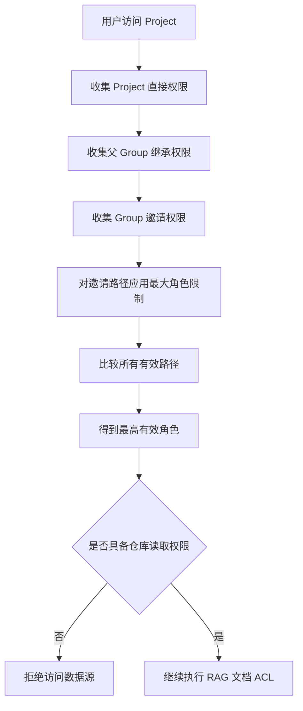

下一节将进入：

> **GitLab 的 Branch、Commit、Merge Request 与受保护主分支：企业文档如何经过修改、审核和正式发布。**


# 4、第三节：Branch、Commit、Merge Request 与受保护主分支

这一节要解决的是：

> 企业成员修改 GitLab 中的文档后，怎样经过版本记录、审核和发布，最终成为 RAG 知识库应当同步的正式内容？

建议你先建立下面这条主线：

```text
main 是正式文档版本
        ↓
员工不能随意直接修改 main
        ↓
从 main 创建独立分支
        ↓
在分支中修改文档并提交 Commit
        ↓
创建 Merge Request
        ↓
负责人审查变更
        ↓
合并到 main
        ↓
RAG 只同步 main 的新 Commit
```

------

## 一、本节需要掌握的核心对象

这几个对象并不处于同一个层次：

| 对象             | 属于谁         | 核心作用                                 |
| ---------------- | -------------- | ---------------------------------------- |
| Branch           | Git            | 指向某个 Commit 的可移动引用             |
| Commit           | Git            | 一次确定的版本快照                       |
| Merge Request    | GitLab         | 对分支变更进行讨论、审核和合并的协作对象 |
| Protected Branch | GitLab         | 限制哪些人可以直接推送或合并分支         |
| Default Branch   | GitLab Project | 项目默认展示和协作的主要分支             |

其中最重要的区别是：

```text
Branch 和 Commit
    → Git 自身的版本模型

Merge Request 和 Protected Branch
    → GitLab 在 Git 之上提供的协作与权限机制
```

------

## 二、Commit：一个不可变的版本节点

### 1. Commit 不只是“修改记录”

你平时执行：

```bash
git add .
git commit -m "更新 RAG 部署文档"
```

Git 会创建一个新的 Commit。

可以先将 Commit 理解为：

> Repository 在某一时刻的完整版本快照，加上作者、时间、说明和父 Commit 等元数据。

一个 Commit 通常包含：

```text
Commit
├── 当前版本的文件树
├── 父 Commit SHA
├── Author
├── Committer
├── Commit message
├── Timestamp
└── Commit SHA
```

GitLab 的 Commit 页面会显示 Commit SHA、作者、提交时间、父 Commit、文件差异，以及哪些 Branch、Tag 和 Merge Request 与这个 Commit 相关。([GitLab Docs](https://docs.gitlab.com/user/project/repository/commits/?utm_source=chatgpt.com))

------

### 2. Commit SHA 是什么

每个 Commit 都有一个唯一标识，例如：

```text
d918e4ca62e1f7e83b66bc13d32d61bfae5e6531
```

通常页面和日志只显示前几位：

```text
d918e4ca
```

这就是 Commit SHA。

你可以将它理解为：

> 某个确定版本的身份证号。

例如：

```text
main
```

只是一个会不断变化的分支名。

但是：

```text
d918e4ca62e1f7e83b66bc13d32d61bfae5e6531
```

代表一个已经确定的历史版本。

------

### 3. Commit 通常不会被修改

假设当前历史是：

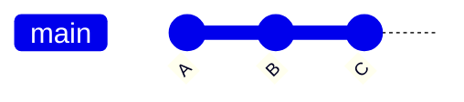

创建新的 Commit 后，不是在 C 内部追加修改，而是创建 D：

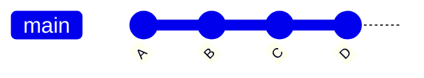

D 保存：

```text
自己的文件树
+
父 Commit C 的 SHA
+
本次提交元数据
```

所以 Commit 会形成一条有方向的版本历史。

------

### 4. 为什么 Commit 对 RAG 同步非常重要

假设你的同步程序开始执行时：

```text
main → Commit A
```

同步过程中，另一个人又提交了修改：

```text
main → Commit B
```

如果你的程序始终通过：

```text
ref=main
```

读取文件，那么可能发生：

```text
第一个文件读取自 Commit A
第二个文件读取自 Commit B
第三个文件又因为目录变化读取失败
```

最终得到一个并不对应任何真实 Git 版本的混合快照。

正确做法是：

```text
1. 先查询 main 当前指向的 Commit SHA

2. 假设得到 Commit A

3. 本轮所有目录和文件都固定使用 ref=Commit A

4. 同步成功后保存 last_synced_commit_sha=A
```

GitLab 支持按照 Commit SHA、Branch 或 Tag 浏览确定版本的文件。([GitLab Docs](https://docs.gitlab.com/user/project/repository/commits/?utm_source=chatgpt.com))

因此：

> Branch 用来找到“当前正式版本”，Commit SHA 用来固定“本次实际同步的版本”。

------

## 三、Branch：指向 Commit 的可移动引用

### 1. Branch 不是完整复制一份仓库

很多入门教程会把 Branch 描述成：

> 仓库的一份副本。

这种说法便于入门，但从 Git 原理看并不准确。

Branch 本质上是：

> 一个有名字的引用，当前指向某个 Commit。

例如：

```text
main → Commit C
```

可以画成：

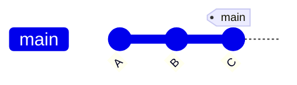

现在从 C 创建分支：

```bash
git switch -c docs/update-deployment
```

刚创建时，两个分支指向同一个 Commit：

```text
main                   → C
docs/update-deployment → C
```

在新分支提交 D 后：

~~~
main                   → C
docs/update-deployment → D
~~~


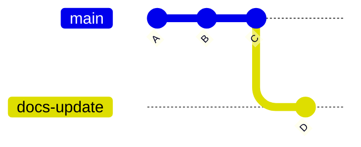

原来的 `main` 没有改变。

这就是分支能够隔离修改的原因。

------

### 2. 为什么员工不应直接在 main 上工作

假设三个人都直接向 `main` 提交：

```text
张三：修改部署文档
李四：修改权限 JSON
王五：删除旧架构文档
```

那么正式分支会持续接收未经审核的内容：

```text
main
├── 可能存在错误格式
├── 可能包含无效权限配置
├── 可能误删文档
└── 可能导致 RAG 立即同步错误内容
```

如果使用独立分支：

```text
main
├── docs/update-deployment
├── permission/update-development-acl
└── docs/remove-old-architecture
```

每个人的修改暂时只存在自己的分支中，不会直接影响 `main`。

GitLab 推荐的简单分支策略就是：在独立分支完成修改，然后将该分支合并回 `main`。([GitLab Docs](https://docs.gitlab.com/user/project/repository/branches/strategies/?utm_source=chatgpt.com))

------

### 3. 默认分支 Default Branch

每个正常使用的 Project 都有一个默认分支，通常是：

```text
main
```

默认分支通常用于：

- 打开 Project 时默认展示文件；
- 创建新分支时作为默认起点；
- 创建 Merge Request 时作为默认目标；
- 表示项目当前主要版本；
- 作为 CI/CD 和其他集成的默认分支。

GitLab 的默认初始分支通常使用 `main`，但实例管理员、Group Owner 或 Project Maintainer 可以调整默认分支相关设置。([GitLab Docs](https://docs.gitlab.com/user/project/repository/branches/default/?utm_source=chatgpt.com))

对你的 RAG 工程来说，可以约定：

```text
GitLabSource.target_branch = main
```

表示：

> 这个知识库数据源只接收 `main` 中已经正式发布的文档。

------

### 4. Source Branch 与 Target Branch

在 Merge Request 中会经常看到两个概念。

#### Source Branch

包含本次修改的来源分支：

```text
docs/update-deployment
```

#### Target Branch

准备接收修改的目标分支：

```text
main
```

因此 Merge Request 表达的是：

```text
请求把 docs/update-deployment 中的修改
合并到 main
```

即：

```text
source_branch → target_branch
```

------

## 四、推荐的分支命名方式

你的文档仓库可以使用：

```text
docs/<修改主题>
permission/<权限主题>
fix/<修复主题>
```

例如：

```text
docs/update-rag-deployment
docs/add-agent-architecture
permission/update-development-acl
fix/correct-api-example
```

不建议使用：

```text
test
new
update
zhangsan
branch1
```

因为这些名字不能说明分支意图。

第一版可以采用：

```text
类型/简短任务名称
```

不必马上引入复杂的 Git Flow。

------

## 五、Merge Request：不是 Git Commit，而是 GitLab 协作对象

### 1. Merge Request 是什么

Merge Request，简称 MR，可以理解为：

> 请求团队检查某个分支的变更，并在确认后将其合并到目标分支。

它不是 Git 中的 Commit，也不是一个特殊 Branch。

MR 是 GitLab 创建的协作对象，里面包含：

```text
Merge Request
├── 标题
├── 描述
├── Source Branch
├── Target Branch
├── 变更文件 Diff
├── Commit 列表
├── 评论与讨论
├── Reviewer
├── Approval
├── Pipeline 状态
├── 冲突状态
└── 合并状态
```

GitLab 将 Merge Request 作为集中查看变更、讨论内容、执行审查并跟踪合并状态的入口。([GitLab Docs](https://docs.gitlab.com/user/project/merge_requests/?utm_source=chatgpt.com))

------

### 2. Merge Request 不是“马上合并”

创建 MR 只表示：

```text
我已经完成一组修改
请检查这些修改是否可以进入 main
```

它并不代表修改已经进入 `main`。

MR 可能经历：

```text
Draft
    ↓
Open
    ↓
Reviewing
    ↓
Approved 或需要修改
    ↓
Merged
```

也可能变成：

```text
Closed
```

`Closed` 表示不再继续这个 MR，但没有合并到目标分支。

------

### 3. MR 页面主要看什么

#### Changes

显示 Source Branch 相对于 Target Branch 的文件差异：

```diff
- 旧内容
+ 新内容
```

对于你的文档仓库，Reviewer 需要重点检查：

- 文档正文是否正确；
- 文件是否放在正确目录；
- 权限 JSON 是否符合 Schema；
- 是否误删文件；
- 是否包含敏感信息；
- Markdown 链接是否有效；
- 二进制文件是否过大。

#### Commits

显示这个分支包含哪些 Commit。

#### Discussion

Reviewer 可以针对某一行提出问题：

```text
这里的部署端口是否已经更新？
```

修改者继续向原分支 Push 新 Commit 后，MR 会自动包含这些新修改。

#### Pipeline

如果项目配置了 CI/CD，可以自动检查：

```text
JSON Schema
Markdown 格式
文件大小
敏感信息
文档解析是否成功
```

Pipeline 不是本阶段的前置内容，后续再单独学习。

------

## 六、从修改文档到完成 MR 的完整过程

假设要修改：

```text
deployment/rag-backend-deployment.md
```

### 1. 更新本地 main

```bash
git switch main
git pull origin main
```

目的：

```text
确保从最新正式版本开始工作
```

------

### 2. 创建修改分支

```bash
git switch -c docs/update-rag-deployment
```

此时：

```text
main
docs/update-rag-deployment
```

最初指向同一个 Commit。

------

### 3. 修改文件

编辑：

```text
deployment/rag-backend-deployment.md
```

------

### 4. 查看变更

```bash
git status
git diff
```

------

### 5. 提交 Commit

```bash
git add deployment/rag-backend-deployment.md

git commit -m "docs: update RAG backend deployment guide"
```

此时只移动本地的：

```text
docs/update-rag-deployment
```

`main` 仍然不变。

------

### 6. Push 到 GitLab

```bash
git push -u origin docs/update-rag-deployment
```

GitLab 现在能够看到这个远程分支。

------

### 7. 创建 Merge Request

在 GitLab 中配置：

```text
Source branch:
docs/update-rag-deployment

Target branch:
main
```

填写：

```text
Title:
更新 RAG 后端部署文档

Description:
- 更新 Docker 服务说明
- 修正 Elasticsearch 版本
- 补充环境变量配置
```

GitLab 也会在 `git push` 后提供创建 MR 的入口。([GitLab Docs](https://docs.gitlab.com/user/project/merge_requests/creating_merge_requests/?utm_source=chatgpt.com))

------

### 8. Reviewer 检查

Reviewer 可以：

```text
发表评论
提出修改要求
批准
拒绝
```

修改者根据意见继续修改：

```bash
git add .
git commit -m "docs: address deployment review comments"
git push
```

不需要重新创建 MR。

因为 MR 关联的是 Source Branch，分支新增 Commit 后，MR 会自动更新。

------

### 9. 合并到 main

审核完成后，有权限的人执行 Merge：

```text
docs/update-rag-deployment
        ↓
       main
```

此时 `main` 指向新的 Commit。

------

### 10. 删除修改分支

MR 合并后，可以删除：

```text
docs/update-rag-deployment
```

删除分支不会删除已经合并到 `main` 的 Commit。

因为相关 Commit 已经成为 `main` 历史的一部分。

------

## 七、Protected Branch：保护正式版本

### 1. 什么是受保护分支

Protected Branch 是 GitLab 对关键分支设置的权限规则。

它可以控制：

- 谁可以直接 Push；
- 谁可以通过 MR 合并；
- 是否允许 Force Push；
- 是否允许删除；
- 是否应用 Code Owner 等审核要求。

GitLab 默认会保护 Repository 的默认分支，但具体保护级别可能受到实例、Group 和 Project 设置影响，因此你仍应在本地项目中实际检查。([GitLab Docs](https://docs.gitlab.com/user/project/repository/branches/protected/?utm_source=chatgpt.com))

------

### 2. 为什么 main 必须保护

如果 `main` 不受保护，Developer 可能直接执行：

```bash
git push origin main
```

这会绕过：

```text
Merge Request
Reviewer
讨论
Approval
部分合并检查
```

如果 RAG 又自动监听 `main`，未经审核的修改就可能马上进入知识库。

因此应形成：

```text
Developer
    → 可以 Push 普通分支

Developer
    → 不能直接 Push main

Maintainer
    → 审核并合并 MR

RAG
    → 只同步 main
```

------

## 八、两个容易混淆的保护配置

当前 GitLab 的 Branch Rule 中，常见两个设置：

### 1. Allowed to merge

控制：

> 哪些角色可以通过 Merge Request 将修改合并到该分支。

例如：

```text
Allowed to merge:
Maintainers
```

表示 Maintainer 可以通过 MR 合并到 `main`。

------

### 2. Allowed to push and merge

控制：

> 哪些角色可以直接向受保护分支 Push，同时也可以合并。

这个权限比名称看起来更强。

假设配置：

```text
Allowed to push and merge:
Developers + Maintainers
```

那么 Developer 可能直接向 `main` Push，从而绕过 MR 审核流程。

GitLab 官方特别说明，`Allowed to push and merge` 同时授予直接 Push 和合并能力。要真正禁止直接 Push，必须明确设置为 `No one`，而不能只依赖空白或未配置状态。([GitLab Docs](https://docs.gitlab.com/user/project/repository/branches/protected/?utm_source=chatgpt.com))

------

## 九、你的第一版 main 保护配置

建议进入：

```text
Project
→ Settings
→ Repository
→ Branch rules
→ main
```

配置为：

```text
Allowed to merge:
Maintainers

Allowed to push and merge:
No one

Allowed to force push:
关闭
```

这样能够形成：

```text
Developer
    → 创建普通分支
    → Push 普通分支
    → 创建 MR

Maintainer
    → 审核
    → 通过 MR 合并到 main

任何人
    → 不直接 Push main
```

GitLab 官方的受保护工作流教程也推荐通过将 `Allowed to push and merge` 设置为 `No one`，强制所有修改经过 MR。([GitLab Docs](https://docs.gitlab.com/tutorials/protected_workflow/?utm_source=chatgpt.com))

------

## 十、GitLab CE 中 Approval 的现实限制

你使用的是 GitLab CE，对应免费功能范围，因此必须区分：

```text
可以进行人工 Review 和点击 Approve
```

与：

```text
系统强制要求达到指定 Approval 数量后才能合并
```

在 GitLab Free 中，具有相应角色的用户可以对 MR 表示批准，但这些 Approval 默认是可选的，并不能像 Premium 或 Ultimate 的 Required Approval Rules 那样强制阻止未批准的 MR 合并。强制指定批准人数和批准者属于更高付费层级能力。([GitLab Docs](https://docs.gitlab.com/user/project/merge_requests/approvals/?utm_source=chatgpt.com))

因此你当前可以模拟：

```text
开发者创建 MR
        ↓
Maintainer 人工检查
        ↓
确认无误后由 Maintainer 合并
```

但不能假设 GitLab CE 一定能原生强制：

```text
至少两名 Reviewer 批准
        ↓
否则 Merge 按钮完全不可用
```

### 对你的模拟环境意味着什么

第一阶段足够使用：

```text
受保护 main
+
Developer 不能直接 Push
+
只有 Maintainer 可以合并
+
团队约定 Maintainer 审核后再合并
```

这已经能够模拟基本企业协作流程。

后续还可以通过 CI Pipeline 增加机器强制检查：

```text
permissions.json Schema 校验失败
        ↓
Pipeline 失败
        ↓
禁止合并
```

------

## 十一、Merge 与 Approval 不是同一件事

### Approval

表示：

```text
我审查过这些修改，并认为可以接受
```

### Merge

表示：

```text
把 Source Branch 的修改真正写入 Target Branch
```

某人可能有资格 Approval，但没有权限 Merge。

也可能某个 Maintainer 有权限 Merge，但在 GitLab CE 的默认设置下，不一定必须先获得 Approval。

因此：

```text
Review
Approval
Merge
```

是三个相关但不同的动作。

------

## 十二、合并之后 Git 历史会发生什么

GitLab 支持多种 Merge Method，主要包括：

- Merge commit；
- Merge commit with semi-linear history；
- Fast-forward merge；
- 可配合 Squash 使用。

这些方式都会把最终内容带入目标分支，但生成的 Commit 历史不同。([GitLab Docs](https://docs.gitlab.com/user/project/merge_requests/methods/?utm_source=chatgpt.com))

------

### 1. Merge Commit

合并前：

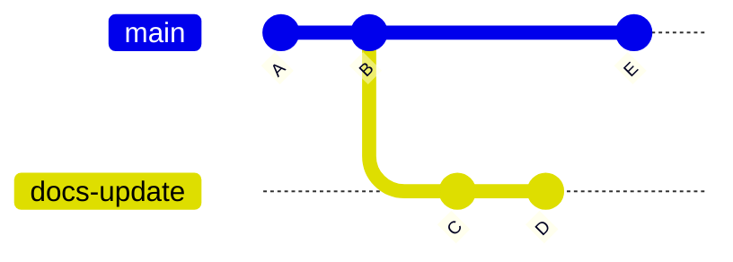

合并后会额外创建 Merge Commit：

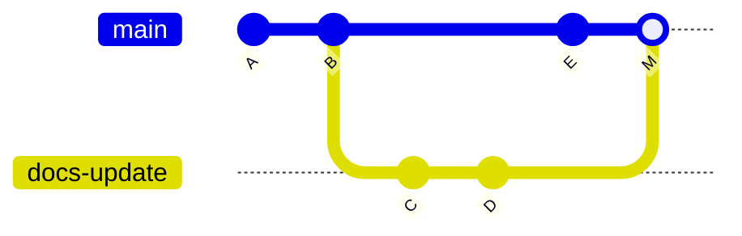

Merge Commit 通常有两个父 Commit：

```text
父节点一：原 main
父节点二：Source Branch
```

优点：

- 清楚保留分支合并边界；
- 可以看到 MR 的完整 Commit；
- 审计信息丰富。

缺点：

- 历史中 Merge Commit 较多。

------

### 2. Fast-forward Merge

如果 `main` 在创建分支后没有产生其他 Commit，可以直接把 `main` 指针向前移动。

合并前：

```text
main → A

docs-update:
A → B → C
```

合并后：

```text
main:
A → B → C
```

不会额外创建 Merge Commit。

优点：

- 历史保持线性；
- Commit 数量较少。

缺点：

- 从 Git 图形上不容易直接看出哪些 Commit 原来属于一个 MR。

GitLab 的 Fast-forward 模式要求目标分支没有与来源分支发生分叉；否则通常需要先 Rebase。([GitLab Docs](https://docs.gitlab.com/user/project/merge_requests/methods/?utm_source=chatgpt.com))

------

### 3. Squash and Merge

假设一个修改分支有多个小 Commit：

```text
B：补充部署说明
C：修复错别字
D：根据审核意见修改端口
```

Squash 会将它们合成一个新 Commit：

```text
S：更新 RAG 后端部署文档
```

GitLab 的 Squash and Merge 可以把一个 MR 中的多个小 Commit 合并成一个有意义的 Commit，使主分支历史更简洁。([GitLab Docs](https://docs.gitlab.com/user/project/merge_requests/squash_and_merge/?utm_source=chatgpt.com))

------

## 十三、文档仓库建议使用哪种合并方式

你的第一版测试项目可以选择：

```text
Merge commit
```

原因是：

- 最容易观察分支结构；
- 最容易理解 MR 如何进入 `main`；
- 可以保留完整的实验历史；
- 对学习 GitLab 协作机制最直观。

等你熟悉后，企业文档仓库可以考虑：

```text
Squash and Merge
```

使一个 MR 在 `main` 中主要对应一个清晰 Commit：

```text
一个 MR
    → 一项完整的文档变更
    → 一个主分支 Commit
```

例如：

```text
docs: update RAG deployment guide
permission: grant AI platform access
docs: remove obsolete Elasticsearch guide
```

但对你的 RAG 增量同步来说，合并方式不是核心依赖。

同步程序应该处理：

```text
上次成功同步 Commit
        ↓
当前 main Commit
        ↓
比较两个 Git Revision
```

而不是依赖：

```text
一个 MR 一定对应一个 Commit
```

------

## 十四、RAG 应该监听 MR Event 还是 Push Event

这是后续架构设计的重要问题。

假设：

```text
docs/update-deployment
        ↓
创建 MR
```

此时文档还没有进入 `main`。

如果 RAG 在创建 MR 时就同步：

```text
未经正式审核的文档
    → 进入知识库
```

这通常不符合企业正式知识库的要求。

正确策略是：

```text
Merge Request
    → 只用于审核

合并进入 main
    → main 产生新的 Commit

Push Event
    → 通知 RAG 同步 main
```

因此第一版建议：

```text
只处理 main 分支的 Push Event
```

MR 合并最终也会使目标分支发生更新，所以正式知识库同步可以围绕 `main` 的变化设计。

------

## 十五、为什么不能把 MR Webhook 当成唯一同步信号

除了 MR 合并，`main` 还可能通过其他方式变化：

- 管理员直接 Push；
- API 创建 Commit；
- Revert；
- Cherry-pick；
- 自动化服务更新；
- 修改保护规则后直接提交。

即使你计划禁止这些操作，同步系统也不应假设：

```text
main 的所有变化都必然来自 MR Event
```

更稳妥的原则是：

> RAG 关心的是目标分支最终 Commit 是否变化，而不是它通过什么协作动作发生变化。

因此：

```text
main Push Event
    → 触发同步

定期主动查询 main HEAD
    → 补偿可能丢失的 Webhook
```

------

## 十六、一个完整的企业文档发布流程

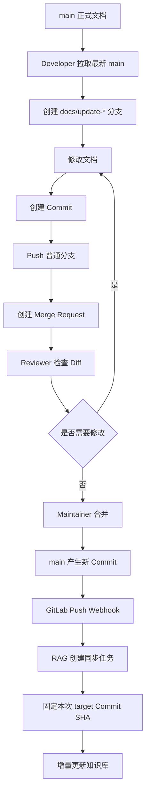

在这个流程中：

```text
普通分支
    → 工作区

Merge Request
    → 审核区

main
    → 正式发布区

RAG
    → 正式内容的下游消费者
```

------

## 十七、这套流程如何映射到你的工程

以后你的 GitLab 数据源可以保存：

```text
GitLabSource
- project_id
- target_branch = "main"
- last_synced_commit_sha
- latest_observed_commit_sha
- sync_status
```

假设当前状态：

```text
last_synced_commit_sha = A
main HEAD = A
```

MR 合并后：

```text
main HEAD = B
```

Webhook 创建任务：

```text
source_commit = A
target_commit = B
```

同步程序比较：

```text
A...B
```

得到：

```text
新增文件
修改文件
删除文件
重命名文件
权限配置变化
```

同步成功后：

```text
last_synced_commit_sha = B
```

因此 GitLab 协作流程和 RAG 同步状态的连接点是：

```text
main HEAD Commit SHA
```

而不是：

```text
MR 标题
Reviewer
Approval 数量
普通分支名称
```

这些是协作信息，不是知识库版本检查点。

------

## 十八、本节实践任务

建议在上一节创建的：

```text
company-knowledge/development/development-documents
```

中完成一次完整实验。

### 1. 准备两个用户

```text
dev_editor
→ development / Developer

development_maintainer
→ development-documents / Maintainer
```

------

### 2. 检查 main 保护规则

配置：

```text
Allowed to merge:
Maintainers

Allowed to push and merge:
No one

Force push:
关闭
```

------

### 3. 使用 Developer 创建分支

```bash
git clone <development-documents仓库地址>
cd development-documents

git switch -c docs/add-rag-overview
```

新建：

```text
architecture/rag-overview.md
```

内容可以简单写成：

```markdown
## RAG 系统概览

该文档用于说明 RAG 系统的主要组成模块。

### 核心组件

- FastAPI
- Elasticsearch
- Milvus
- PostgreSQL
```

------

### 4. 提交并 Push

```bash
git add architecture/rag-overview.md

git commit -m "docs: add RAG system overview"

git push -u origin docs/add-rag-overview
```

------

### 5. 创建 MR

```text
Source:
docs/add-rag-overview

Target:
main
```

------

### 6. 使用 Maintainer 审查

在 `Changes` 中评论：

```text
请补充 Rerank 模块。
```

------

### 7. Developer 继续修改

```bash
git add architecture/rag-overview.md

git commit -m "docs: add rerank component"

git push
```

观察原来的 MR 是否自动出现新 Commit 和新 Diff。

------

### 8. Maintainer 合并

合并后检查：

```text
main 是否出现新文档
Commit 历史是否变化
Source Branch 是否被删除
```

------

### 9. 测试直接 Push main

使用 Developer 尝试：

```bash
git switch main
git pull origin main

echo "test" >> README.md
git add README.md
git commit -m "test direct main push"
git push origin main
```

在保护规则正确的情况下，GitLab 应拒绝该直接 Push。

这次失败正是你希望得到的结果：

```text
普通贡献者不能绕过 MR 修改正式知识库来源
```

------

## 十九、本节必须掌握的结论

```text
1. Commit 是一个确定的版本节点
   Commit SHA 可以固定本轮同步快照。

2. Branch 是指向 Commit 的可移动引用
   main 会随着正式提交不断向前移动。

3. 普通分支用于隔离尚未正式发布的修改
   不应被正式 RAG 知识库直接同步。

4. Merge Request 是 GitLab 协作对象
   它用于展示、讨论、审核和合并分支差异。

5. main 应当作为正式文档分支
   RAG 默认只同步 main。

6. Protected Branch 用来防止绕过审核
   禁止直接 Push 时，要将 Allowed to push and merge 明确设为 No one。

7. GitLab CE 可以进行 Review 和可选 Approval
   但高级的强制 Approval Rules 属于更高层级功能。

8. MR 合并方式可以不同
   RAG 不应依赖固定的 Commit 图形结构。

9. RAG 的同步检查点是 main Commit SHA
   不是 MR 编号或分支名称。

10. 正式同步应围绕 main Push Event
    再配合主动检查实现最终一致性。
```

下一节应当进入：

> **Git 核心版本模型：Commit、Tree、Blob、Branch 和 Diff，以及 GitLab 如何根据两个 Commit 找出新增、修改、删除和重命名的文档。**


# 5、多人协同 场景时如何push？

## 普通员工对于protected branch操作：

公司内部的普通开发成员通常采用以下流程：

```text
从 main 拉取最新代码
    ↓
在本地创建工作分支
    ↓
修改文件
    ↓
在工作分支中执行本地 Commit
    ↓
将工作分支 Push 到 GitLab
    ↓
创建 Merge Request
    ↓
负责人审核
    ↓
审核通过后合并到 main
```

对应命令大致是：

```bash
# 切换并更新本地 main
git switch main
git pull origin main

# 从最新 main 创建工作分支
git switch -c docs/update-deployment

# 修改后，在本地提交
git add .
git commit -m "docs: update deployment guide"

# 推送的是工作分支，不是 main
git push -u origin docs/update-deployment
```

然后在 GitLab 网页中创建：

```text
Source Branch：docs/update-deployment
Target Branch：main
```

这就是 Merge Request。

### push 和 merge的区别：

不是“使用 MR 的方式提交”，而是分成三个不同动作：

```text
Commit
→ 将修改提交到本地 Git 分支

Push
→ 将本地工作分支上传到 GitLab

Merge Request
→ 请求将工作分支合并到 main
```

所以准确表述是：

> 普通开发成员先在本地工作分支中 Commit，再把工作分支 Push 到 GitLab，最后创建 MR，请求将修改合并到 `main`。

### 是否必须由权限更高的人审核

这取决于 GitLab 的权限和分支保护配置。

在你准备模拟的企业工作流中，建议设置成：

| 角色       | 创建工作分支 | Push 工作分支 | 直接 Push main | 合并 MR |
| ---------- | ------------ | ------------- | -------------- | ------- |
| Developer  | 可以         | 可以          | 不可以         | 不可以  |
| Maintainer | 可以         | 可以          | 不建议允许     | 可以    |

`main` 设置为受保护分支：

```text
Allowed to merge：Maintainers
Allowed to push and merge：No one
```

这样普通 Developer 就无法直接修改远程 `main`，必须提交 MR，由 Maintainer 检查后合并。

### main 仍然只有一个

“成员创建分支”并不代表企业需要长期维护大量正式分支。

通常是：

```text
main                         长期存在，正式版本
docs/update-deployment       临时工作分支
fix/permission-config        临时工作分支
```

MR 合并后，临时分支可以删除，最终仍然只长期保留一个正式的 `main`。

因此，你现在的理解可以调整为：

> 公司普通开发成员不能直接修改远程 `main`。他们需要从 `main` 创建临时工作分支，在该分支中 Commit 并 Push，然后创建 MR；由 Maintainer 审核并决定是否合并到 `main`。


## Maintainer 级别的员工：

**角色本身不等于一定可以直接 Push `main`。**
真正决定能否直接修改 `main` 的，是该分支的：

```text
Allowed to push and merge
```

配置。GitLab 将“允许通过 MR 合并”和“允许直接 Push”作为两项独立的分支权限。([GitLab Docs](https://docs.gitlab.com/user/project/repository/branches/protected/?utm_source=chatgpt.com))

### 情况一：推荐的企业配置

假设 `main` 配置为：

```text
Allowed to merge:
Maintainers

Allowed to push and merge:
No one
```

那么 Maintainer：

- 可以审核并合并 Merge Request；
- 不可以直接执行 `git push origin main`；
- 自己修改文件时，也需要创建工作分支并提交 MR。

流程仍然是：

```text
main 拉取最新版本
    ↓
创建工作分支
    ↓
本地 Commit
    ↓
Push 工作分支
    ↓
创建 MR
    ↓
审核后合并到 main
```

GitLab 官方给出的受保护工作流示例也采用这种配置：Maintainer 可以合并，但任何人都不能直接 Push 受保护分支。([GitLab Docs](https://docs.gitlab.com/tutorials/protected_workflow/?utm_source=chatgpt.com))

这也是你的企业文档仓库最推荐的设置。

------

### 情况二：允许 Maintainer 直接 Push

假设配置为：

```text
Allowed to merge:
Maintainers

Allowed to push and merge:
Maintainers
```

那么 Maintainer 可以直接：

```bash
git switch main
git pull origin main

# 修改文件
git add .
git commit -m "docs: update deployment guide"

git push origin main
```

远程 `main` 会直接更新，不需要创建 MR。

需要注意，这个动作不是“直接提交合并”，而是：

```text
直接 Push Commit 到 main
```

因为不存在两个分支，所以没有发生 Merge，也没有 Merge Request。

`Allowed to push and merge` 会同时授予直接 Push 和通过 MR 合并的能力。([GitLab Docs](https://docs.gitlab.com/user/project/repository/branches/protected/?utm_source=chatgpt.com))

------

### 情况三：main 没有受到保护

如果 `main` 不是受保护分支，Maintainer 通常也可以直接 Push。

这种情况下，是否创建分支和 MR 主要依赖团队约定，而不是 GitLab 强制限制。

但是对于你的 RAG 文档仓库，不建议这样配置，因为：

```text
Maintainer 修改错误
    ↓
直接 Push main
    ↓
Webhook 触发
    ↓
错误内容进入 RAG 知识库
```

------

### Maintainer 自己创建的 MR 由谁审核

这是另一个问题。

假设 Maintainer 张三修改文档并创建 MR：

```text
docs/update-permissions
    ↓
main
```

可能有三种团队规则。

#### **自己创建、自己合并**

技术上可能允许：

```text
张三创建 MR
张三自己检查
张三自己点击 Merge
```

但这样 MR 主要用于：

- 保留变更记录；
- 执行 Pipeline；
- 查看 Diff；
- 避免直接 Push。

它没有真正实现双人审核。

#### **由另一个 Maintainer 审核**

更规范的方式是：

```text
Maintainer A 创建 MR
    ↓
Maintainer B 审核并合并
```

这样可以减少一个人误操作的风险。

### 由指定负责人审核

例如：

```text
普通文档
    → 项目 Maintainer 审核

权限 JSON
    → 安全负责人审核

架构文档
    → 技术负责人审核
```

GitLab CE 可以支持人工 Review 和 Approval，但免费版本的高级强制审批规则有限，因此部分流程仍依赖团队制度或 CI 检查。

------

### 对你的项目最合适的配置

建议你的 `main` 设置为：

```text
Allowed to merge:
Maintainers

Allowed to push and merge:
No one

Force push:
关闭
```

然后无论是 Developer 还是 Maintainer，只要修改正式文档，都统一采用：

```text
工作分支
→ Commit
→ Push
→ Merge Request
→ 合并 main
```

区别只是：

| 角色       | 创建和 Push 工作分支 | 创建 MR | 合并 MR |
| ---------- | -------------------- | ------- | ------- |
| Developer  | 可以                 | 可以    | 不可以  |
| Maintainer | 可以                 | 可以    | 可以    |

更严格的团队还会要求：

```text
MR 作者不能自己合并
```

但这需要额外的审批规则、团队制度或者更高版本 GitLab 功能配合。

### 最终结论

Maintainer **可以不可以直接 Push `main`，不是由 Maintainer 身份单独决定，而是由受保护分支规则决定**。

对你的企业 RAG 文档场景，建议禁止包括 Maintainer 在内的所有人直接 Push `main`。Maintainer 修改文件时也创建工作分支和 MR，只允许 Maintainer 通过 MR 将审核后的内容合并到 `main`。


# 6、普通权限员工 MR 保护分支的过程：

## 场景前提

假设普通员工在 GitLab Project 中的角色是：

```text
Developer
```

`main` 已配置为受保护分支：

```text
Allowed to merge:
Maintainers

Allowed to push and merge:
No one

Force push:
关闭
```

这意味着：

- Developer 可以读取仓库；
- Developer 可以创建和 Push 普通分支；
- Developer 不能直接 Push 远程 `main`；
- Maintainer 可以通过 Merge Request 合并到 `main`；
- 包括 Maintainer 在内，所有人都不能直接 Push `main`。

------

## 一、普通员工直接修改本地 main 时会发生什么

假设 GitLab 远程仓库当前状态是：

```text
远程 main → Commit A
```

员工 Clone 仓库：

```bash
git clone <repository-url>
cd project
```

此时存在三个相关引用：

```text
本地 main          → Commit A
origin/main        → Commit A
GitLab 远程 main   → Commit A
```

这里的 `origin/main` 是本地保存的远程分支状态，不是 GitLab 服务器上的实际分支。

------

### 员工在本地 main 修改并 Commit

员工修改文档后执行：

```bash
git add .
git commit -m "docs: update deployment guide"
```

此时会生成本地 Commit B：

```text
本地 main          → Commit B
origin/main        → Commit A
GitLab 远程 main   → Commit A
```

流程如下：

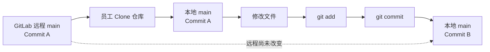

关键点是：

> 本地 `git commit` 不会访问 GitLab，也不会受到 Protected Branch 限制。

Protected Branch 只能限制 GitLab 服务器接收 Push，不能阻止员工在自己电脑上修改和提交本地 `main`。

------

## 二、员工尝试 Push 本地 main

员工执行：

```bash
git push origin main
```

这个命令的含义是：

```text
请把本地 main 指向的 Commit B
推送到 GitLab 的远程 main
```

GitLab 收到请求后开始检查权限：

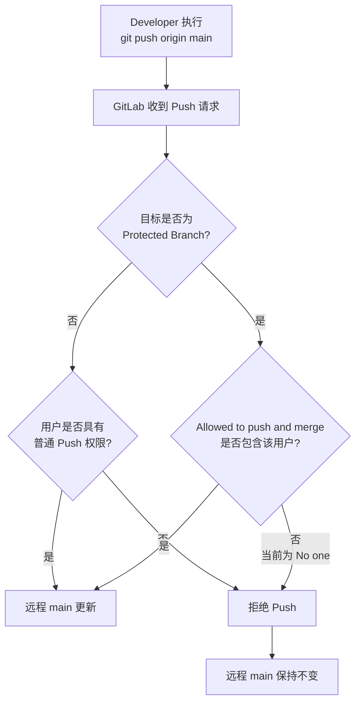

因为配置是：

```text
Allowed to push and merge: No one
```

所以 GitLab 拒绝请求。

员工通常会看到类似错误：

```text
remote: GitLab: You are not allowed to push code to protected branches
```

最终状态仍然是：

```text
本地 main          → Commit B
origin/main        → Commit A
GitLab 远程 main   → Commit A
```

Commit B 没有丢失，只是还留在员工本地。

------

## 三、Push 被拒绝后如何处理

员工不需要重新修改文件，也不需要重新 Commit。

可以在当前 Commit B 上创建工作分支：

```bash
git switch -c docs/update-deployment
```

此时：

```text
本地 main                    → Commit B
本地 docs/update-deployment  → Commit B
GitLab 远程 main             → Commit A
```

然后 Push 工作分支：

```bash
git push -u origin docs/update-deployment
```

GitLab 允许 Developer Push 普通分支，所以这次可以成功：

```text
GitLab 远程 main                     → Commit A
GitLab 远程 docs/update-deployment   → Commit B
flowchart TD
    A[本地 main<br/>Commit B] --> B[直接 Push main 被拒绝]

    B --> C[创建工作分支<br/>git switch -c docs/update-deployment]

    C --> D[本地工作分支<br/>Commit B]

    D --> E[git push origin<br/>docs/update-deployment]

    E --> F{工作分支是否受保护?}

    F -->|否| G[Push 成功]
    G --> H[GitLab 保存工作分支<br/>Commit B]

    H --> I[远程 main 仍为 Commit A]
```

------

## 四、创建 Merge Request

工作分支 Push 成功后，员工在 GitLab 创建 MR：

```text
Source Branch:
docs/update-deployment

Target Branch:
main
```

MR 的含义不是再次上传文件，而是：

> 请求将已经存在于 GitLab 工作分支中的 Commit B 合并到 `main`。

此时 GitLab 中同时存在：

```text
main                    → Commit A
docs/update-deployment  → Commit B
```

员工可以创建 MR，但由于他只是 Developer，并且规则规定只有 Maintainer 可以合并，所以他不能完成最终合并。

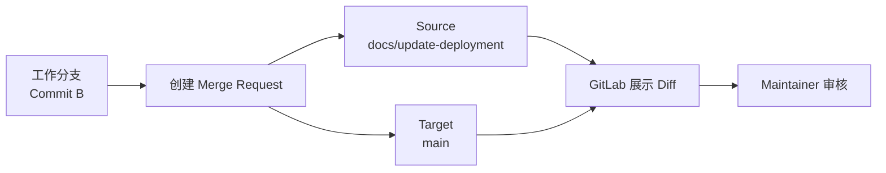

------

## 五、Maintainer 审核

Maintainer 在 MR 页面检查：

- 哪些文件被新增；
- 哪些文件被修改；
- 哪些文件被删除；
- 权限 JSON 是否正确；
- 是否存在敏感信息；
- 文档内容是否符合要求；
- 自动检查是否通过。

如果发现问题，Maintainer 不会直接修改员工的本地仓库，而是在 MR 中提出修改意见。

```mermaid
flowchart TD
    A[Maintainer 查看 MR] --> B[检查文件 Diff]

    B --> C{修改是否符合要求?}

    C -->|否| D[在 MR 中提出修改意见]
    D --> E[Developer 继续修改工作分支]
    E --> F[创建新的本地 Commit]
    F --> G[Push 到同一个工作分支]
    G --> A

    C -->|是| H[允许进入合并阶段]
```

员工根据意见继续修改：

```bash
git add .
git commit -m "docs: address review comments"
git push
```

因为当前分支已经通过 `-u` 绑定了远程分支，所以可以直接执行：

```bash
git push
```

新 Commit 会自动出现在原来的 MR 中，不需要重新创建 MR。

------

## 六、Maintainer 合并到 main

审核通过后，Maintainer 在 GitLab 点击 Merge。

GitLab 才会真正更新远程 `main`：

```text
合并前：

main                    → Commit A
docs/update-deployment  → Commit B

合并后：

main                    → Commit B 或新的 Merge Commit
docs/update-deployment  → 可以删除
```

具体是直接指向 Commit B，还是产生新的 Merge Commit，取决于 Project 的 Merge Method。

整体流程如下：

```mermaid
sequenceDiagram
    participant D as Developer
    participant L as Developer本地Git
    participant G as GitLab
    participant M as Maintainer
    participant R as RAG系统

    D->>L: 修改文件
    D->>L: git add + git commit
    Note over L: 本地生成 Commit B

    D->>G: git push origin main
    G-->>D: 拒绝，main 是保护分支

    D->>L: 创建工作分支
    D->>G: Push 工作分支
    G-->>D: Push 成功

    D->>G: 创建 Merge Request
    G->>M: 展示 MR 和 Diff

    M->>G: 审核修改

    alt 审核未通过
        M-->>D: 提出修改意见
        D->>L: 继续修改并 Commit
        D->>G: Push 到原工作分支
        G->>M: MR 自动更新
    else 审核通过
        M->>G: 点击 Merge
        G->>G: 更新远程 main
        G->>R: main Push Webhook
        R->>G: 读取新的 main Commit
    end
```

------

## 七、推荐的正确操作流程

虽然员工可以先在本地 `main` Commit，再在 Push 被拒绝后创建分支，但这属于补救操作。

企业中推荐从一开始就在工作分支中修改。

### 第一步：更新本地 main

```bash
git switch main
git pull origin main
```

### 第二步：立即创建工作分支

```bash
git switch -c docs/update-deployment
```

### 第三步：修改并 Commit

```bash
git add .
git commit -m "docs: update deployment guide"
```

### 第四步：Push 工作分支

```bash
git push -u origin docs/update-deployment
```

### 第五步：创建 MR

```text
docs/update-deployment
        ↓
       main
```

### 第六步：Maintainer 审核并合并

完整推荐流程：

```mermaid
flowchart TD
    A[Developer 拉取最新 main] --> B[创建本地工作分支]

    B --> C[修改文档]

    C --> D[在工作分支中 Commit]

    D --> E[Push 工作分支到 GitLab]

    E --> F[创建 Merge Request]

    F --> G[Maintainer 审核]

    G --> H{审核结果}

    H -->|需要修改| C
    H -->|审核通过| I[Maintainer 合并 MR]

    I --> J[GitLab 远程 main 更新]

    J --> K[触发 RAG 同步]
```

------

## 八、每个阶段的仓库状态

### 初始状态

```text
GitLab main    → A
本地 main      → A
```

### 创建工作分支

```text
GitLab main          → A
本地 main            → A
本地 docs/update     → A
```

### 本地修改并 Commit

```text
GitLab main          → A
本地 main            → A
本地 docs/update     → B
```

### Push 工作分支

```text
GitLab main            → A
GitLab docs/update     → B
本地 docs/update       → B
```

### 创建 MR

仓库指针暂时不变：

```text
GitLab main            → A
GitLab docs/update     → B
```

GitLab 只是新增了一个协作对象：

```text
MR：请求把 docs/update 的变更合并到 main
```

### Maintainer 合并

```text
GitLab main            → B 或 Merge Commit M
GitLab docs/update     → B，可删除
```

------

## 九、为什么 Developer 能 Push 工作分支，却不能 Push main

因为 GitLab 检查的是：

```text
用户权限
+
目标分支规则
```

同一个 Developer 执行不同 Push，结果可以不同：

```bash
git push origin docs/update-deployment
```

目标是普通分支：

```text
允许
```

而执行：

```bash
git push origin main
```

目标是受保护分支：

```text
拒绝
```

可以表示为：

```mermaid
flowchart TD
    A[Developer 执行 Push] --> B{目标分支是什么?}

    B -->|普通工作分支| C{Developer 是否有仓库写入权限?}
    C -->|有| D[Push 成功]

    B -->|保护分支 main| E{Branch Rule 是否允许<br/>Developer 直接 Push?}
    E -->|否| F[Push 被拒绝]
    E -->|是| G[Push 成功]
```

因此，Developer 不是完全没有 Push 权限，而是：

> 有权 Push 普通工作分支，但没有权直接 Push 受保护的 `main`。

------

## 十、在你的 RAG 项目中的最终作用

这套流程会让 `main` 成为经过审核的正式知识源：

```mermaid
flowchart LR
    A[Developer 工作分支] --> B[Merge Request]
    B --> C[Maintainer 审核]
    C --> D[Protected main]
    D --> E[GitLab Webhook]
    E --> F[RAG 增量同步]
    F --> G[正式知识库]
```

普通员工修改工作分支时：

```text
RAG 不同步
```

创建 MR 时：

```text
RAG 仍然不同步
```

只有 MR 被合并、远程 `main` 发生变化后：

```text
RAG 才同步正式文档
```

## 最核心的理解

普通权限员工直接 Push 保护分支 `main` 时，流程不是：

```text
Push main
→ 自动创建 MR
→ 等待审核
```

而是：

```text
Push main
→ GitLab 检查保护规则
→ 直接拒绝 Push
```

员工必须主动改为：

```text
创建工作分支
→ Push 工作分支
→ 创建 MR
→ Maintainer 审核
→ 合并到 main
```

Protected Branch 负责阻止未经审核的修改直接进入正式分支；Merge Request 则负责承载后续的审核与合并流程。


# 7、RAG接入Gitlab需要学习的内容：

## 先明确你要实现的工程是什么

你的目标不是简单地：

```text
把 GitLab 仓库 Clone 到本地
→ 再调用原来的目录导入功能
```

而是实现一个正式的：

> **GitLab 文档数据源连接器（GitLab Document Source Connector）**

它负责将 GitLab 中 `main` 分支的正式文档，持续同步到 PostgreSQL、Elasticsearch 和 Milvus。

整体结构应当是：

```mermaid
flowchart TD
    A[GitLab Project] --> B[Protected main]
    B --> C[Commit SHA]

    C --> D[GitLab Webhook]
    D --> E[FastAPI Webhook 接口]
    E --> F[创建同步任务]

    F --> G[GitLab Sync Worker]
    G --> H[读取上次同步 Commit]
    G --> I[读取当前目标 Commit]

    H --> J[Compare Commits]
    I --> J

    J --> K[新增文件]
    J --> L[修改文件]
    J --> M[删除文件]
    J --> N[重命名文件]

    K --> O[文档解析和 Chunk 构建]
    L --> O
    N --> O

    O --> P[PostgreSQL]
    O --> Q[Elasticsearch]
    O --> R[Milvus]

    M --> S[删除旧文档和 Chunk]
    S --> P
    S --> Q
    S --> R

    P --> T[更新同步检查点]
    Q --> T
    R --> T
```

下面这些技术原理，就是你在让 Codex 编码前应当依次学习的内容。

------

## 一、数据源抽象与系统边界

这是最先需要学习的工程设计内容。

你当前的数据源是：

```text
本地目录
```

未来会增加：

```text
GitLab Project
```

不建议把 GitLab 下载逻辑直接写进现有目录导入 Service，而应该先抽象“文档数据源”。

例如：

```text
DocumentSource
├── LocalDirectorySource
└── GitLabProjectSource
```

上层解析流程不关心文档来自哪里：

```mermaid
flowchart LR
    A[LocalDirectorySource] --> C[统一文档输入模型]
    B[GitLabProjectSource] --> C

    C --> D[Parser]
    D --> E[Chunk Builder]
    E --> F[Embedding]
    F --> G[ES / Milvus / PostgreSQL]
```

### 必须理解的原理

- 数据源与文档解析器为什么要解耦；
- Adapter / Connector 模式；
- Source、Document、DocumentVersion 的区别；
- GitLab Project 为什么适合作为一个数据源；
- `main` 为什么只是目标分支；
- Commit SHA 为什么才是一次确定的文档快照；
- GitLab 是原始数据源，RAG 数据库是派生索引；
- 为什么不应该让用户直接修改索引数据库中的 GitLab 文档。

建议未来的数据源对象至少包含：

```text
GitLabSource
- id
- gitlab_base_url
- project_id
- project_path
- target_branch
- last_synced_commit_sha
- latest_observed_commit_sha
- credential_id
- sync_status
- last_success_at
- last_error
```

### 本模块学习成果

你能够解释：

> GitLab Project、Repository、Branch、Commit 与 RAG 数据源之间分别是什么关系。

------

## 二、GitLab Token 与服务端认证

你的 FastAPI 服务需要以一个非人工身份访问 GitLab。

### 需要学习的 Token

开发阶段可以使用：

```text
Personal Access Token
```

正式运行时更适合使用：

```text
Project Access Token
```

Project Access Token 绑定到指定 Project，而不是某个普通员工账号；在 GitLab Self-Managed 中，它可以用于调用 GitLab API 和通过 HTTPS 访问仓库。建议只授予 `read_api` 和 `read_repository` 等必要 Scope。([GitLab Docs](https://docs.gitlab.com/user/project/settings/project_access_tokens/?utm_source=chatgpt.com))

还要特别区分：

```text
Deploy Token
```

Deploy Token 可以使用 `read_repository` Clone 仓库，但不能调用普通 GitLab API。因此，如果你的连接器需要查询 Project、Branch、Compare 和 Members API，仅有 Deploy Token 不够。([GitLab Docs](https://docs.gitlab.com/user/project/deploy_tokens/?utm_source=chatgpt.com))

### 必须理解的原理

- Token 与账号密码的区别；
- Personal、Project、Group、Deploy Token 的作用域；
- `read_api` 与 `read_repository` 的区别；
- 最小权限原则；
- Token 过期、撤销和轮换；
- Token 为什么不能明文写进数据库；
- Token 加密存储与应用启动时解密；
- 为什么日志中不能输出请求 Header；
- 一个 Token 能访问哪些 Project。

### 建议选择

你的第一版可以采用：

```text
开发调试：
Personal Access Token

正式数据源：
Project Access Token
- access_level = Reporter
- scopes = read_api + read_repository
```

### 本模块学习成果

你能够判断：

> 哪一种 Token 可以读取 Repository，哪一种可以调用 REST API，以及为什么不能直接使用 GitLab root Token。

------

## 三、GitLab REST API 与异步客户端设计

你的工程需要一个独立的 `GitLabClient`，统一处理所有 GitLab HTTP 调用。

GitLab REST API 可以操作 Project、Group、Repository、Branch 和 Merge Request 等资源。列表接口存在分页，默认每页通常为 20 条，`per_page` 最大通常为 100；大规模数据需要正确处理分页。([GitLab Docs](https://docs.gitlab.com/api/api_resources/?utm_source=chatgpt.com))

### 必须学习的 API

#### Projects API

用途：

- 获取 Project 基本信息；
- 获取 `project_id`；
- 获取默认分支；
- 获取 Project 可见性和状态。

#### Branches API

用途：

- 查询 `main`；
- 获取 `main` 当前 Commit SHA；
- 检查分支是否受保护。

#### Repository Tree API

用途：

- 遍历仓库目录；
- 获取文件和目录列表；
- 递归扫描支持的文档。

#### Repository Files API

用途：

- 获取文件元数据；
- 获取文件原始内容；
- 读取指定 Branch、Tag 或 Commit 下的文件；
- 获取 `blob_id`、`commit_id`、`content_sha256` 等信息。

Repository Files API 的 `ref` 可以指定分支名、Tag 或 Commit SHA；普通文件响应中的内容可能以 Base64 返回，也可以使用 Raw File 接口直接获取原始内容。([GitLab Docs](https://docs.gitlab.com/api/repository_files/))

#### Compare API

用途：

```text
上次同步 Commit A
        ↓
比较
当前 main Commit B
        ↓
得到文件差异
```

GitLab Repositories API 可以比较两个 Branch、Tag 或 Commit。([GitLab Docs](https://docs.gitlab.com/api/repositories/))

### HTTP 客户端必须掌握

你已经学习过 `httpx.AsyncClient`，这里需要进一步掌握：

- 连接池复用；
- 请求超时；
- Connect Timeout 与 Read Timeout；
- Header 注入；
- URL 编码；
- 分页迭代器；
- Base64 解码；
- 二进制流式下载；
- 401、403、404、409、429、5xx；
- 指数退避重试；
- 统一异常转换；
- 日志脱敏。

GitLab 部分 Repository 文件和 Blob 接口对大文件存在专门的限流，因此不能无控制地并发下载大量文件。([GitLab Docs](https://docs.gitlab.com/security/rate_limits/))

### 推荐客户端结构

```text
GitLabClient
├── get_project()
├── get_branch()
├── get_branch_head_sha()
├── list_repository_tree()
├── get_file_metadata()
├── download_raw_file()
├── compare_commits()
├── list_effective_members()
└── create_project_webhook()
```

### 本模块学习成果

你能够使用 `httpx.AsyncClient` 编写独立脚本：

```text
读取一个 Project
→ 获取 main Commit SHA
→ 遍历 Repository Tree
→ 下载指定 Commit 下的文档
```

------

## 四、Git Commit、Tree、Blob 与 Diff

这是增量同步的理论基础。

你虽然会日常使用 Git，但连接器需要理解更底层的对象关系：

```mermaid
flowchart TD
    A[Branch: main] --> B[Commit SHA]
    B --> C[Root Tree]
    C --> D[Sub Tree]
    C --> E[Blob]
    D --> F[Blob]

    E --> G[文件内容]
    F --> H[文件内容]
```

### 必须理解

- Branch 只是指向 Commit 的引用；
- Commit 表示一个确定版本；
- Tree 表示目录结构；
- Blob 表示文件内容；
- Blob SHA 与 Commit SHA 的区别；
- 两个 Commit 如何计算 Diff；
- 新增、修改、删除、重命名分别如何表示；
- 为什么相同文件内容可能对应相同 Blob；
- 为什么文件修改后 Blob SHA 会变化；
- 为什么 Blob SHA 不能直接作为永久 Document ID；
- 为什么文件路径也不一定是永久身份。

### 对 RAG 的影响

假设文件发生修改：

```text
原路径相同
Blob SHA 改变
Content Hash 改变
```

假设文件发生重命名：

```text
旧路径消失
新路径出现
文件内容可能完全不变
```

因此需要区分：

```text
document_id
    → 文档在知识库中的稳定身份

repository_path
    → 文档当前在仓库中的位置

blob_sha
    → 当前 Git 文件内容身份

content_hash
    → 解析后正文是否变化
```

### 第一版可以简化

第一版可以把重命名处理为：

```text
删除旧路径
+
新增新路径
```

后续再实现真正的文档身份保持。

### 本模块学习成果

你能够解释：

> 为什么 `project_id + file_path` 可以作为第一版文档键，但不能完美处理重命名。

------

## 五、全量同步与快照一致性

第一次接入 GitLab Project 时，需要执行全量同步。

### 错误做法

```text
读取 main 目录
读取第一个文件
读取第二个文件
读取第三个文件
```

如果同步过程中 `main` 又发生了 Push，不同文件可能来自不同 Commit。

### 正确做法

```text
1. 查询 main 当前 Commit SHA
2. 假设得到 Commit A
3. 所有 Tree 和 File 请求都使用 ref=Commit A
4. 同步成功后保存 last_synced_commit_sha=A
```

Repository Files API 支持使用确定的 Commit SHA 作为 `ref`，所以连接器可以将一次同步固定在一个不可变化的版本上。([GitLab Docs](https://docs.gitlab.com/api/repository_files/))

### 两种全量同步方式

#### 方式一：Repository Tree + Raw File

```text
遍历 Tree
→ 筛选支持文件
→ 逐个下载
```

优点：

- 可以按文件大小和类型过滤；
- 可以精细控制；
- 便于记录每个 Blob SHA。

缺点：

- API 调用次数较多；
- 必须处理分页和限流。

#### 方式二：下载 Repository Archive

```text
下载指定 Commit 的压缩包
→ 解压到临时工作区
→ 调用现有目录解析流程
```

GitLab Repository API 支持下载指定 Repository 的归档，并可以控制是否包含 Git LFS 对象。([GitLab Docs](https://docs.gitlab.com/api/repositories/))

优点：

- 很容易复用你现有的目录导入功能；
- 适合第一版迁移。

缺点：

- 每次需要下载完整仓库；
- 不适合作为长期增量同步方案；
- 需要防止压缩包路径穿越和超大压缩包。

### 推荐演进方式

```text
第一版：
GitLab Archive
→ 临时目录
→ 复用原有全量导入

第二版：
Tree + Files + Compare
→ 真正的文件级增量同步
```

### 本模块学习成果

你能够设计：

```text
target_commit_sha
→ 固定版本下载
→ 全量解析
→ 成功后提交同步检查点
```

------

## 六、GitLab Webhook 与事件驱动同步

Webhook 负责在 `main` 发生变化时通知 RAG。

你的 GitLab CE 第一版应使用：

```text
Project Webhook
```

不要把架构建立在 Group Webhook 上，因为当前 GitLab 文档将 Group Webhook 标记为 Premium/Ultimate，而 Project Webhook 可以按单个 Project 配置。([GitLab Docs](https://docs.gitlab.com/api/group_webhooks/))

### 需要监听的事件

第一版只需要：

```text
Push Event
```

收到事件后检查：

```text
ref == refs/heads/main
```

Push Event Payload 中包含：

```text
project_id
before
after
ref
checkout_sha
commits
```

但 GitLab 在一次 Push 包含超过 20 个 Commit 时，Payload 中的 `commits` 只保留最新 20 个，`total_commits_count` 才表示真实数量。因此，不能把 Webhook Payload 中的 Commit 文件列表当成完整增量结果；应使用 `before`、`after` 调用 Compare API。([GitLab Docs](https://docs.gitlab.com/user/project/integrations/webhook_events/))

### 正确的 Webhook 流程

```mermaid
sequenceDiagram
    participant G as GitLab
    participant API as FastAPI Webhook
    participant DB as PostgreSQL
    participant W as Sync Worker

    G->>API: Push Event
    API->>API: 验证签名和目标分支
    API->>DB: 创建同步任务
    API-->>G: 200 OK

    W->>DB: 领取同步任务
    W->>G: 查询 main 当前 Commit
    W->>G: Compare last_synced 与 target
    W->>W: 更新文档索引
```

Webhook 接口不能直接完成：

- 下载文档；
- 解析 PDF；
- 生成 Embedding；
- 写入 ES 和 Milvus。

它应该：

```text
验证
→ 去重
→ 创建任务
→ 快速返回
```

### Webhook 安全

较新的 GitLab 版本支持基于 HMAC-SHA256 的 Signing Token，并带有 `webhook-id`、`webhook-timestamp` 和 `webhook-signature`；同时建议检查时间戳以防重放攻击。这个机制是在较新的 GitLab 版本中加入的，所以编码前需要先确认你本地 GitLab 的准确版本；旧版本可能只能使用 `X-Gitlab-Token`。([GitLab Docs](https://docs.gitlab.com/user/project/integrations/webhooks/))

### 本模块学习成果

你能够解释：

> Webhook 只是同步触发信号，真正的文件差异必须由 Worker 再次查询 GitLab。

------

## 七、增量同步与 Chunk 增量更新

这是整个工程中最核心的模块。

### 文件级变化

需要处理：

```text
A = Added
M = Modified
D = Deleted
R = Renamed
```

对应操作：

| Git 变化       | RAG 操作                                      |
| -------------- | --------------------------------------------- |
| 新增文件       | 解析、分块、Embedding、写入索引               |
| 修改文件       | 比较并更新变化的 Chunk                        |
| 删除文件       | 删除 PostgreSQL、ES、Milvus 数据              |
| 重命名文件     | 更新路径或删除旧文档后新增                    |
| 权限 JSON 修改 | 更新权限 Metadata，正文可能无需重新 Embedding |

### 需要学习的 Hash

建议延续你之前 PPTX/XLSX Builder 的设计：

```text
blob_sha
    → Git 文件原始内容是否变化

content_hash
    → 解析后的正文是否变化

index_hash
    → 影响检索索引的内容是否变化

permission_hash
    → 权限配置是否变化

parser_version
    → 解析器实现是否变化
```

例如权限 JSON 变化时：

```text
文档正文未变化
        ↓
不需要重新调用 Embedding

权限 Metadata 变化
        ↓
需要更新 ES / Milvus / PostgreSQL
```

### Chunk 稳定身份

需要学习：

- Stable Document ID；
- Stable Chunk ID；
- 文件修改后如何保留未变化 Chunk；
- Chunk 内容 Hash；
- Chunk 删除检测；
- Parser Version；
- 文档级更新与 Chunk 级更新的区别。

### 本模块学习成果

你能够画出：

```text
Commit Diff
→ 文件 Diff
→ 文档 Diff
→ Chunk Diff
→ ES / Milvus / PostgreSQL 增删改
```

------

## 八、幂等性、任务队列与并发控制

Webhook 可能重试，同一个 Commit 也可能被多次提交到任务系统。

较新 GitLab Webhook 会提供在重试之间保持一致的消息 ID，例如 `Idempotency-Key` 或 `webhook-id`，可以用于接收端去重；实际可用 Header 取决于本地 GitLab 版本。([GitLab Docs](https://docs.gitlab.com/user/project/integrations/webhooks/))

但你的业务幂等键不应只依赖 Webhook Header，还可以使用：

```text
source_id + target_commit_sha
```

### 必须学习

- 幂等键；
- 唯一约束；
- Webhook 重复投递；
- 任务重试；
- 指数退避；
- Worker Lease；
- 项目级互斥锁；
- 乐观锁；
- 事件乱序；
- 同步任务状态机；
- 死信任务；
- 补偿同步。

### 典型并发问题

```text
任务一：A → B
任务二：B → C
```

如果任务二先完成，任务一后完成，任务一不能把同步检查点重新写回 B。

建议：

```text
同一个 GitLabSource
→ 同一时刻只允许一个同步任务执行
```

任务执行时再读取：

```text
数据库 last_synced_commit_sha
GitLab main HEAD
```

而不是完全相信 Webhook 中的信息。

### 同步状态机

```mermaid
stateDiagram-v2
    [*] --> pending
    pending --> running
    running --> succeeded
    running --> failed
    failed --> retry_wait
    retry_wait --> pending
    failed --> dead
    succeeded --> [*]
```

### 本模块学习成果

你能够回答：

> 同一个 Project 连续收到多个 Push Event 时，如何防止旧任务覆盖新任务。

------

## 九、PostgreSQL、ES、Milvus 的一致性

你当前一次同步需要修改三个存储系统：

```text
PostgreSQL
Elasticsearch
Milvus
```

它们无法天然加入同一个普通数据库事务。

因此需要学习：

- 本地事务；
- 分布式事务为什么困难；
- 最终一致性；
- 幂等写入；
- 补偿操作；
- Outbox 思想；
- 同步检查点；
- 部分成功如何恢复；
- 双存状态检查；
- 重建索引。

### 最重要的原则

不要在 PostgreSQL 写完后立刻更新：

```text
last_synced_commit_sha
```

而应该等：

```text
PostgreSQL 成功
+
Elasticsearch 成功
+
Milvus 成功
+
删除操作成功
```

之后再推进同步检查点。

否则可能出现：

```text
last_synced_commit_sha = B
但 Milvus 仍然停留在 A
```

下一次同步从 B 开始，就无法自然修复漏掉的数据。

### 推荐结构

```text
GitLabSyncRun
- id
- source_id
- base_commit_sha
- target_commit_sha
- status
- started_at
- finished_at
- error_code
- error_detail
- retry_count
```

### 本模块学习成果

你能够设计：

> 某次同步 PostgreSQL 成功、Milvus 失败时，下一次如何安全重试。

------

## 十、GitLab 权限与现有 RAG ACL 的结合

这一模块建议分两阶段实现。

### 第一阶段：不要同步 GitLab 用户

继续使用你现有的：

```text
RAG 用户
role
permissions
department_codes
```

GitLab 只负责：

```text
存储文档
管理 Project
管理协作和主分支
```

Repository 中仍保留：

```text
permissions.json
```

最终权限仍然由 RAG 后端判断：

```text
GitLab Project 数据源范围
AND
permissions.json 文档 ACL
```

### 第二阶段：同步 GitLab 成员权限

以后需要把 GitLab Project 访问权也纳入检索时，再学习：

```http
GET /projects/:id/members/all
```

这个接口会返回直接成员、继承成员、邀请成员以及祖先 Group 权限，并对同一用户返回最高的有效 `access_level`。不能只使用 `/members`，因为它只返回直接成员。([GitLab Docs](https://docs.gitlab.com/api/project_members/))

### 身份映射

还需要设计：

```text
RAG user_id
        ↕
GitLab user_id
GitLab username
GitLab email
```

不能简单依赖显示名称。

### 本模块学习成果

你能够区分：

```text
GitLab Project 访问权限
```

和：

```text
RAG 文档级 ACL
```

分别在哪一层生效。

------

## 十一、安全与文件处理

GitLab 仓库中的文件不能默认视为安全输入。

### 必须学习

- GitLab URL 白名单；
- SSRF 防护；
- Token 加密；
- 日志脱敏；
- 文件大小限制；
- MIME 类型检查；
- 扩展名检查；
- 压缩包路径穿越；
- Zip Bomb；
- PDF、Office 文档解析隔离；
- 超时与内存限制；
- 恶意文档；
- Git LFS；
- 临时文件清理；
- 失败任务的工作区回收。

特别是数据源配置接口不能允许普通用户随意填写：

```text
http://任意内网地址
```

否则你的 GitLab Connector 可能变成访问内部网络的 SSRF 工具。

------

## 十二、测试与可观测性

不能只测试“新增一个 Markdown”。

至少需要覆盖：

```text
首次全量同步
新增文件
修改文件
删除文件
重命名文件
权限 JSON 修改
不支持文件类型
空仓库
大文件
Git LFS 文件
Token 失效
GitLab 429
GitLab 500
Webhook 重复
Webhook 乱序
Worker 中途崩溃
ES 成功但 Milvus 失败
main 回滚到旧 Commit
Force Push
```

还需要监控：

```text
每个 Project 的同步状态
同步耗时
文件数量
Chunk 数量
Embedding 调用量
失败原因
重试次数
最后成功 Commit
GitLab API 请求数量
```

------

## 十三、推荐学习顺序

结合你的现有工程进度，建议按以下顺序学习。

### 第一阶段：连接器基础

1. 数据源抽象；
2. GitLab Token；
3. GitLab REST API；
4. GitLab 异步客户端封装；
5. Commit、Tree、Blob、Diff。

阶段成果：

```text
Python 脚本能够读取指定 Project
并下载指定 Commit 下的全部支持文档
```

### 第二阶段：全量同步

1. 固定 Commit 快照；
2. Repository Tree 或 Archive；
3. 临时工作区；
4. 复用现有 Parser；
5. 保存同步检查点。

阶段成果：

```text
首次接入 GitLab Project
→ 完整导入知识库
```

### 第三阶段：事件同步

1. Project Webhook；
2. Push Event；
3. 签名验证；
4. Webhook 接口；
5. 后台同步任务；
6. 幂等与重试。

阶段成果：

```text
main 更新
→ 自动创建同步任务
```

### 第四阶段：增量更新

1. Compare Commits；
2. 文件增删改；
3. Stable Document ID；
4. Hash；
5. Chunk Diff；
6. 三存储一致性。

阶段成果：

```text
只处理发生变化的文档和 Chunk
```

### 第五阶段：权限与企业化

1. GitLab 成员同步；
2. 身份映射；
3. Project 权限与文档 ACL 组合；
4. Token 轮换；
5. 审计与监控；
6. Git LFS 和大文件。

------

## 十四、接下来最适合学习的模块

下一模块建议从：

> **GitLab 数据源连接器的总体架构：为什么要抽象 DocumentSource，以及 API 拉取模式和 Git Clone 模式应该如何选择。**

开始。

这是后续所有代码设计的基础。没有先确定这个边界，Codex 很容易直接把 `git clone`、临时目录、文档解析和数据库写入混在同一个 Service 中，后续难以支持增量同步和多数据源。


# 8、工程模块一：GitLab 数据源连接器与 `DocumentSource` 抽象

本模块要解决一个核心问题：

> GitLab 接入代码应该放在现有文档导入流程的哪个位置，才能既复用当前能力，又不把 GitLab API、文件解析和数据库写入混成一团？

你当前的系统大致是：

```mermaid
flowchart LR
    A[本地目录] --> B[扫描文件]
    B --> C[文档解析]
    C --> D[Chunk Builder]
    D --> E[Embedding]
    E --> F[PostgreSQL]
    E --> G[Elasticsearch]
    E --> H[Milvus]
```

接入 GitLab 后，不应该复制一套完整流程：

```text
GitLab 下载
→ GitLab 专属解析
→ GitLab 专属 Chunk
→ GitLab 专属数据库写入
```

更合理的结构是：

```mermaid
flowchart LR
    A[本地目录数据源] --> C[统一文档输入]
    B[GitLab Project 数据源] --> C

    C --> D[现有 Parser]
    D --> E[现有 Chunk Builder]
    E --> F[Embedding]
    F --> G[PostgreSQL]
    F --> H[Elasticsearch]
    F --> I[Milvus]
```

也就是：

> GitLab 只替换“文档从哪里来”，不替换后面的解析、分块和索引流程。

------

## 一、这一模块必须掌握的知识点

本模块重点包括：

1. 什么是数据源连接器；
2. 为什么 GitLab API 不能直接调用 Parser；
3. 为什么 Parser 不应该知道 GitLab Project；
4. `DocumentSource` 应提供哪些能力；
5. GitLab Project、Branch、Commit 与同步快照如何映射；
6. GitLab API、仓库归档和 `git clone` 三种方式的区别；
7. 第一版工程应该选择哪种方式；
8. 全量同步和增量同步如何共用一个数据源抽象。

------

## 二、什么是数据源连接器

数据源连接器可以理解为：

> 将外部数据源中的内容，转换成知识库内部能够统一处理的文件模型。

例如，你现在已经隐含存在一个本地目录连接器：

```text
输入：
本地目录路径

执行：
递归扫描文件

输出：
文件路径、文件内容、文件类型
```

只是你当前可能没有把它显式抽象成一个独立模块。

GitLab 连接器的职责类似：

```text
输入：
GitLab Project、目标分支、访问凭证

执行：
查询 Commit、遍历仓库、下载文件

输出：
文件路径、文件内容、文件类型
```

两者的来源不同，但后续 Parser 真正关心的信息基本一致：

```text
文件名
文件路径
文件内容
文件类型
文件大小
文档 Metadata
```

因此可以统一成：

```mermaid
flowchart TD
    A[LocalDirectorySource] --> C[SourceFile]
    B[GitLabProjectSource] --> C

    C --> D[Markdown Parser]
    C --> E[PDF Parser]
    C --> F[PowerPoint Parser]
    C --> G[Excel Parser]
```

------

## 三、为什么必须解耦数据源与 Parser

假设不做数据源抽象，你可能会写出：

```python
async def import_gitlab_project(project_id: int):
    files = await gitlab_client.list_files(project_id)

    for file in files:
        content = await gitlab_client.download_file(file)

        if file.path.endswith(".pdf"):
            parsed = await pdf_parser.parse(content)
        elif file.path.endswith(".pptx"):
            parsed = await ppt_parser.parse(content)

        chunks = chunk_builder.build(parsed)
        await postgres.save(chunks)
        await elasticsearch.save(chunks)
        await milvus.save(chunks)
```

这段代码的问题不是不能运行，而是职责严重混合。

它同时负责：

```text
GitLab 网络访问
GitLab 鉴权
仓库遍历
文件下载
文件类型判断
文档解析
Chunk 构建
Embedding
数据库写入
异常重试
同步状态
```

后续任何变化都会影响这个巨大函数。

例如：

- 增加 GitHub 数据源；
- 支持本地目录重新导入；
- GitLab Token 失效重试；
- 修改 PPTX Builder；
- Milvus 写入失败；
- 增加 Webhook；
- 支持 Commit 增量同步。

最终会形成大量交叉依赖。

------

## 四、正确的职责划分

建议将工程拆分成下面几层：

```mermaid
flowchart TD
    A[GitLabClient] --> B[GitLabProjectSource]
    B --> C[DocumentSyncService]

    C --> D[DocumentParserRegistry]
    D --> E[Chunk Builder]

    E --> F[Indexing Service]

    F --> G[PostgreSQL]
    F --> H[Elasticsearch]
    F --> I[Milvus]
```

每一层只负责一种职责。

### `GitLabClient`

负责和 GitLab HTTP API 通信：

```text
认证
发送请求
处理分页
处理超时
处理限流
解析 GitLab 响应
下载原始文件
```

它不应该知道：

```text
Chunk
Embedding
Milvus
文档 ACL
RAG 检索
```

------

### `GitLabProjectSource`

负责把 GitLab 的概念转换成统一数据源概念：

```text
Project
Branch
Commit
Repository Path
Blob
```

转换成：

```text
SourceSnapshot
SourceFile
SourceChange
```

它不负责文档内容解析。

------

### `DocumentSyncService`

负责组织一次完整同步：

```text
确定同步版本
获取文件变化
调用 Parser
调用 Chunk Builder
写入索引
更新同步检查点
```

它是流程编排层。

------

### `DocumentParserRegistry`

根据文件类型选择解析器：

```text
.md   → MarkdownParser
.pdf  → PDFParser
.pptx → PowerPointParser
.xlsx → ExcelParser
```

Parser 不需要知道文件来自：

```text
本地目录
GitLab
GitHub
对象存储
```

------

### `IndexingService`

负责将 Document 和 Chunk 写入：

```text
PostgreSQL
Elasticsearch
Milvus
```

它不负责从 GitLab 下载文件。

------

## 五、`DocumentSource` 应该抽象哪些能力

不要一开始把抽象设计得过于复杂。

第一版可以围绕四个能力设计：

```text
1. 确定一个同步快照
2. 列出该快照中的文件
3. 读取指定文件内容
4. 比较两个快照之间的变化
```

概念接口可以写成：

```python
from abc import ABC, abstractmethod
from collections.abc import AsyncIterator


class DocumentSource(ABC):
    @abstractmethod
    async def resolve_snapshot(self) -> "SourceSnapshot":
        """确定本次同步对应的不可变版本。"""

    @abstractmethod
    async def iter_files(
        self,
        snapshot: "SourceSnapshot",
    ) -> AsyncIterator["SourceFile"]:
        """遍历指定版本中的所有支持文件。"""

    @abstractmethod
    async def read_file(
        self,
        snapshot: "SourceSnapshot",
        path: str,
    ) -> bytes:
        """读取指定版本中的文件内容。"""

    @abstractmethod
    async def compare(
        self,
        base_snapshot: "SourceSnapshot",
        target_snapshot: "SourceSnapshot",
    ) -> list["SourceChange"]:
        """比较两个版本间的文件变化。"""
```

这不是要求你现在立刻照抄，而是先理解它的边界。

------

## 六、三个重要的统一模型

### `SourceSnapshot`

表示数据源的一个不可变版本。

对于本地目录，可以是：

```text
目录扫描批次 ID
```

对于 GitLab，可以是：

```text
Commit SHA
```

示例：

```python
class SourceSnapshot(BaseModel):
    source_id: str
    version: str
    branch: str | None = None
```

GitLab 中：

```text
source_id = GitLabSource 数据库主键
version = Commit SHA
branch = main
```

注意：

```text
branch = main
```

只是告诉你版本来自哪个分支。

真正固定版本的是：

```text
version = Commit SHA
```

------

### `SourceFile`

表示数据源中的一个文件。

```python
class SourceFile(BaseModel):
    path: str
    name: str
    size: int | None = None
    content_type: str | None = None
    source_version: str
    content_version: str | None = None
```

GitLab 中可以映射为：

```text
path
    → Repository Path

source_version
    → Commit SHA

content_version
    → Blob SHA
```

例如：

```text
path = architecture/rag-overview.md
source_version = commit_abc123
content_version = blob_def456
```

------

### `SourceChange`

表示两个快照之间的文件变化。

```python
class SourceChange(BaseModel):
    change_type: str
    old_path: str | None = None
    new_path: str | None = None
    old_content_version: str | None = None
    new_content_version: str | None = None
```

变化类型可以是：

```text
added
modified
deleted
renamed
```

例如：

```text
change_type = renamed
old_path = docs/old-name.md
new_path = docs/new-name.md
```

------

## 七、全量同步如何工作

第一次接入 GitLab Project 时，数据库中还没有：

```text
last_synced_commit_sha
```

所以需要执行全量同步。

流程是：

```mermaid
sequenceDiagram
    participant S as DocumentSyncService
    participant G as GitLabProjectSource
    participant P as Parser
    participant I as IndexingService
    participant DB as PostgreSQL

    S->>G: resolve_snapshot(main)
    G-->>S: Commit A

    S->>G: iter_files(Commit A)

    loop 每个支持文件
        G-->>S: SourceFile
        S->>G: read_file(Commit A, path)
        G-->>S: bytes
        S->>P: parse(SourceFile, bytes)
        P-->>S: ParsedDocument
        S->>I: index(document)
    end

    S->>DB: 保存 last_synced_commit_sha=A
```

这里最重要的是：

> 遍历目录和读取文件，都必须固定使用 Commit A。

不能先用 `main` 遍历，再继续用 `main` 下载，因为 `main` 在同步期间可能变化。

------

## 八、增量同步如何工作

假设上次同步成功版本是：

```text
Commit A
```

当前 `main` 指向：

```text
Commit B
```

流程变成：

```mermaid
sequenceDiagram
    participant S as DocumentSyncService
    participant G as GitLabProjectSource
    participant P as Parser
    participant I as IndexingService
    participant DB as PostgreSQL

    S->>DB: 读取 last_synced_commit
    DB-->>S: Commit A

    S->>G: resolve_snapshot(main)
    G-->>S: Commit B

    S->>G: compare(A, B)
    G-->>S: 新增、修改、删除、重命名

    loop 新增或修改文件
        S->>G: read_file(B, path)
        G-->>S: bytes
        S->>P: 解析文件
        S->>I: 增量更新索引
    end

    loop 删除文件
        S->>I: 删除旧文档和 Chunk
    end

    S->>DB: 更新 last_synced_commit=B
```

全量和增量使用的是同一个数据源抽象。

区别只是：

```text
全量同步
→ iter_files(snapshot)

增量同步
→ compare(base, target)
```

------

## 九、三种获取 GitLab 文件的方式

GitLab 接入通常有三种方案：

1. GitLab REST API；
2. Repository Archive；
3. `git clone`。

它们并不是谁绝对更好，而是适用于不同场景。

------

## 十、方案一：GitLab REST API

### 工作方式

连接器调用 GitLab API：

```text
获取 Project
获取 main Commit SHA
遍历 Repository Tree
下载 Raw File
比较两个 Commit
```

流程：

```mermaid
flowchart LR
    A[GitLab REST API] --> B[查询 main Commit]
    B --> C[遍历 Repository Tree]
    C --> D[筛选支持文件]
    D --> E[逐个下载 Raw File]
    E --> F[解析与索引]
```

### 优点

- 不需要本地 Git 客户端；
- 不需要维护 `.git` 目录；
- 可以精确读取指定 Commit；
- 方便获取 Project、Branch、成员和 Webhook 信息；
- 适合增量同步；
- 可以只下载发生变化的文件；
- 更适合运行在无状态 Worker 中。

### 缺点

- 文件较多时 API 请求次数较多；
- 必须处理分页；
- 必须处理限流；
- 每个文件可能都需要一次网络请求；
- Git LFS 和 Submodule 需要额外设计。

### 适用场景

非常适合你的正式连接器：

```text
Project 配置
Commit 快照
Repository Tree
Compare
增量文件下载
```

------

## 十一、方案二：Repository Archive

### 工作方式

通过 GitLab 下载指定 Commit 的仓库压缩包：

```text
Commit A
→ 下载 ZIP/TAR
→ 解压到临时目录
→ 调用现有目录导入流程
flowchart LR
    A[GitLab Archive API] --> B[下载指定 Commit 压缩包]
    B --> C[安全解压到临时工作区]
    C --> D[复用现有目录扫描]
    D --> E[Parser / Chunk / Index]
    E --> F[清理临时目录]
```

### 优点

- 最容易复用你现有的目录导入功能；
- API 调用次数少；
- 文件数量较多时比逐文件下载更直接；
- 非常适合第一次全量同步；
- 实现难度相对较低。

### 缺点

- 每次都是完整仓库；
- 不适合高频增量更新；
- 仓库大时网络和磁盘消耗高；
- 需要临时工作区；
- 需要防止压缩包路径穿越；
- 需要处理解压失败和垃圾文件清理；
- 很难直接得到每个文件的 Blob SHA。

### 适用场景

适合第一版全量同步：

```text
首次接入 Project
管理员手动全量重建
索引损坏后的恢复
```

------

## 十二、方案三：`git clone`

### 工作方式

Worker 执行：

```bash
git clone <repository-url>
git checkout <commit-sha>
```

增量时可以执行：

```bash
git fetch
git diff <old-sha> <new-sha>
```

### 优点

- 能使用完整 Git 命令；
- Diff、历史、重命名检测能力强；
- 可以处理复杂 Git 操作；
- 适合需要保留本地工作区的场景；
- 对 Submodule、Git LFS 可以配合 Git 工具处理。

### 缺点

- 依赖系统 Git；
- 需要管理凭证；
- 需要维护本地仓库缓存；
- 多 Worker 并发容易冲突；
- `.git` 目录可能很大；
- 需要处理仓库锁；
- 容器重启后缓存可能丢失；
- 清理临时仓库更复杂；
- 需要防止恶意仓库内容影响工作区；
- `git clone` 属于外部进程调用，错误处理比 HTTP API 更复杂。

### `--depth=1` 也不能解决所有问题

浅克隆：

```bash
git clone --depth=1
```

虽然可以减少下载量，但它只保留有限历史。

如果你的数据库记录：

```text
last_synced_commit_sha = A
```

当前仓库浅克隆中只有：

```text
Commit B
```

那么可能无法直接比较：

```text
A → B
```

除非再额外拉取历史。

### 适用场景

当你确实需要以下能力时再考虑：

```text
复杂 Git 历史分析
本地离线工作区
Git LFS 完整支持
Submodule
必须执行原生 Git 命令
```

------

## 十三、三种方式对比

| 维度                | REST API | Archive    | `git clone` |
| ------------------- | -------- | ---------- | ----------- |
| 初次实现难度        | 中等     | 低         | 中等        |
| 全量同步            | 可以     | 很适合     | 可以        |
| 增量同步            | 很适合   | 不适合     | 很适合      |
| 复用现有目录扫描    | 较弱     | 很强       | 很强        |
| 本地磁盘占用        | 低       | 中等       | 高          |
| 需要维护 Git 工作区 | 否       | 否         | 是          |
| 适合无状态 Worker   | 很适合   | 较适合     | 较差        |
| API 分页            | 需要     | 通常不需要 | 不需要      |
| 文件级精确下载      | 很适合   | 不适合     | 可以        |
| Git 历史能力        | 中等     | 弱         | 最强        |
| 并发控制复杂度      | 低       | 中等       | 高          |

------

## 十四、你的工程推荐采用混合方案

针对你当前工程，建议不是三选一，而是分阶段组合。

### 第一版：Archive 完成全量同步

```text
GitLab Project
→ 查询 main Commit SHA
→ 下载该 Commit 的 Repository Archive
→ 解压到临时目录
→ 复用现有目录导入流程
→ 保存 Commit SHA
```

这样可以最快验证：

- GitLab Token；
- Project 配置；
- Commit 快照；
- 文档下载；
- 现有 Parser 复用；
- 同步检查点。

### 第二版：REST API 完成增量同步

```text
last_synced_commit = A
current_main_commit = B
        ↓
Compare API
        ↓
只下载新增和修改文件
        ↓
删除已删除文件
```

### 长期方案

```mermaid
flowchart TD
    A[GitLabProjectSource] --> B{同步类型}

    B -->|首次接入或全量重建| C[Repository Archive]
    C --> D[临时目录]
    D --> E[全量解析]

    B -->|日常更新| F[Compare API]
    F --> G[Raw File API]
    G --> H[文件级增量更新]

    E --> I[统一 Parser / Chunk / Index]
    H --> I
```

暂时不建议把 `git clone` 作为第一版核心方案。

------

## 十五、为什么不建议直接复用目录导入入口

你可能会想到：

```text
GitLab Archive 解压
→ 直接调用原有 import_directory(path)
```

短期可以复用底层能力，但不能让 GitLab Service 直接调用一个包含全部业务逻辑的旧接口。

因为原有目录导入接口可能假设：

```text
目录由用户手动提供
文件修改时间可信
同步只执行一次
不存在 Commit
不存在 Webhook
不存在增量比较
不存在数据源状态
```

建议拆成：

```mermaid
flowchart TD
    A[LocalDirectoryImportService] --> C[DirectoryDocumentLoader]
    B[GitLabArchiveLoader] --> C

    C --> D[统一文档解析流程]
```

也就是：

```text
可以复用目录扫描和解析能力
但不要把 GitLab 伪装成一次普通用户上传
```

GitLab 数据源必须拥有独立的：

```text
source_id
project_id
target_branch
target_commit_sha
last_synced_commit_sha
sync_status
```

------

## 十六、`GitLabClient` 和 `GitLabProjectSource` 的区别

这两个很容易被设计成同一个类。

### `GitLabClient`

是低层 HTTP 客户端：

```python
project = await client.get_project(project_id)
branch = await client.get_branch(project_id, "main")
tree = await client.list_repository_tree(project_id, ref=commit_sha)
```

它返回的是 GitLab API 模型。

------

### `GitLabProjectSource`

是知识库数据源适配器：

```python
snapshot = await source.resolve_snapshot()
files = source.iter_files(snapshot)
changes = await source.compare(old_snapshot, new_snapshot)
```

它返回的是知识库统一模型：

```text
SourceSnapshot
SourceFile
SourceChange
```

关系是：

```mermaid
flowchart LR
    A[DocumentSyncService] --> B[GitLabProjectSource]
    B --> C[GitLabClient]
    C --> D[GitLab REST API]
```

上层 `DocumentSyncService` 不需要知道 GitLab API 的 URL、Header 和分页。

------

## 十七、推荐的模块结构

第一版可以按下面的职责组织：

```text
fast_app/
├── sources/
│   ├── models.py
│   ├── base.py
│   ├── local_directory_source.py
│   └── gitlab/
│       ├── client.py
│       ├── models.py
│       ├── project_source.py
│       ├── archive_loader.py
│       └── exceptions.py
│
├── document_ingestion/
│   ├── parser_registry.py
│   ├── parsing_service.py
│   ├── chunk_service.py
│   └── indexing_service.py
│
└── sync/
    ├── document_sync_service.py
    ├── sync_task_service.py
    └── models.py
```

这里不要求你现在立即重构，而是先理解各模块边界。

------

## 十八、一次同步的完整职责链

```mermaid
sequenceDiagram
    participant API as FastAPI
    participant S as DocumentSyncService
    participant Source as GitLabProjectSource
    participant Client as GitLabClient
    participant Parser as ParserRegistry
    participant Index as IndexingService
    participant DB as PostgreSQL

    API->>S: sync(source_id)

    S->>DB: 读取数据源配置和检查点
    S->>Source: resolve_snapshot()

    Source->>Client: 查询 main
    Client-->>Source: Commit SHA
    Source-->>S: SourceSnapshot

    S->>Source: 获取文件或变化

    Source->>Client: Tree / Compare / Raw File
    Client-->>Source: GitLab 响应
    Source-->>S: SourceFile / SourceChange

    S->>Parser: 解析文件
    Parser-->>S: ParsedDocument

    S->>Index: 写入 Document 和 Chunk
    Index-->>S: 写入结果

    S->>DB: 推进同步检查点
```

------

## 十九、这一阶段最容易犯的错误

### 错误一：用 Branch 名作为同步版本

```text
同步版本 = main
```

错误原因是 `main` 会变化。

应该是：

```text
目标分支 = main
同步版本 = Commit SHA
```

------

### 错误二：GitLabClient 直接写数据库

```text
GitLabClient.download_file()
→ PostgreSQL
```

这会把网络层和业务层耦合。

------

### 错误三：Parser 接收 GitLab Project ID

```python
parser.parse(project_id, file_path)
```

Parser 应该只关心文件，不应该知道 GitLab。

------

### 错误四：每次 Webhook 都重新下载完整仓库

小仓库短期可行，但无法扩展。

日常同步最终应该使用：

```text
Compare
→ 变化文件
→ 增量下载
```

------

### 错误五：同步完成前推进 Commit 检查点

必须等所有索引写入成功后，再更新：

```text
last_synced_commit_sha
```

------

### 错误六：把解压临时目录当永久数据源

临时目录只是某次同步的工作区。

真正的数据源身份是：

```text
GitLab Project + target_branch
```

真正的数据版本是：

```text
Commit SHA
```

------

## 二十、本模块最终需要形成的认识

```text
GitLabClient
    → 负责调用 GitLab API

GitLabProjectSource
    → 把 GitLab 对象转换成统一数据源模型

SourceSnapshot
    → 表示一个确定的 Commit 版本

SourceFile
    → 表示该版本中的一个文件

SourceChange
    → 表示两个 Commit 之间的文件变化

DocumentSyncService
    → 编排同步流程

Parser / Chunk Builder
    → 不关心文件来自 GitLab 还是本地目录

IndexingService
    → 负责写入 PostgreSQL、ES 和 Milvus
```

对于你的项目，推荐的演进路线是：

```text
第一版全量接入：
Commit SHA + Repository Archive + 现有解析流程

第二版增量更新：
Compare API + Raw File API + Chunk 增量更新

暂不优先使用：
git clone 作为核心同步方式
```

下一模块应进入：

> **GitLab Token、API 鉴权和 `GitLabClient` 设计：FastAPI 服务如何安全地调用 GitLab CE REST API。**


# 9、工程模块二：GitLab Token、API 鉴权与 `GitLabClient` 设计

这一模块要解决的是：

> FastAPI 后端应该以什么身份访问 GitLab CE，如何安全保存凭证，以及如何把 GitLab REST API 封装成稳定、可测试的异步客户端？

本模块暂时不处理文档解析、Webhook 和增量同步，只完成：

```text
FastAPI
→ 使用 Token 调用 GitLab REST API
→ 获取 Project
→ 获取 main 当前 Commit
→ 遍历仓库目录
→ 下载指定版本的文件
```

整体结构如下：

```mermaid
flowchart LR
    A[DocumentSyncService] --> B[GitLabProjectSource]
    B --> C[GitLabClient]
    C --> D[httpx.AsyncClient]
    D --> E[GitLab REST API]

    F[GitLabCredential] --> C
    F --> G[Token]
    F --> H[Base URL]
```

------

## 一、必须先区分三个权限维度

GitLab Token 最容易被误解为：

> 只要 Token Scope 是 `read_api`，就一定可以读取目标 Project。

这是不完整的。

一个 Token 最终能够做什么，由三个维度共同决定：

```text
资源范围
×
Token 绑定角色
×
Token Scope
```

可以画成：

```mermaid
flowchart TD
    A[Token 请求读取 Project] --> B{Token 能否到达该 Project?}
    B -->|否| X[无权访问]
    B -->|是| C{绑定角色是否允许读取仓库?}
    C -->|否| X
    C -->|是| D{Scope 是否允许调用该 API?}
    D -->|否| X
    D -->|是| E[请求允许执行]
```

### 资源范围

决定 Token 可以访问哪些 Project：

```text
Personal Access Token
→ 用户本人能访问的所有资源

Group Access Token
→ 所属 Group 及其下属资源

Project Access Token
→ 仅所属 Project
```

GitLab 官方明确区分了这些作用范围：Personal Token 跟随用户权限，Group Token 限制在对应 Group，Project Token 限制在对应 Project。([GitLab Docs](https://docs.gitlab.com/security/tokens/access_token_scopes/))

### 角色

例如 Project Access Token 可以绑定：

```text
Reporter
Developer
Maintainer
```

角色决定它在该 Project 中能进行什么操作。对于你的只读 RAG 同步服务，`Reporter` 已经能够读取代码和仓库内容，同时不能 Push 代码或管理受保护分支。([GitLab Docs](https://docs.gitlab.com/user/permissions/?utm_source=chatgpt.com))

### Scope

Scope 决定 Token 可以使用哪些访问通道：

```text
read_api
read_repository
api
write_repository
```

Scope 不会突破角色权限，也不会突破 Token 的资源范围。

------

## 二、你需要了解的四种 Token

### Personal Access Token

Personal Access Token，简称 PAT，绑定某个真实 GitLab 用户。

例如：

```text
用户：knowledge_admin
角色：多个 Project 的 Maintainer

PAT：
由 knowledge_admin 创建
```

PAT 可以访问这个用户本身有权访问的所有 Group 和 Project，因此它适合：

- 初期学习和手动测试；
- 调试 GitLab API；
- 验证不同 API Endpoint；
- 临时诊断权限问题。

但不适合作为长期生产凭证，因为：

```text
员工账号被禁用
员工离职
员工角色变化
Token 被个人撤销
```

都可能影响 RAG 同步服务。

PAT 可以通过 `PRIVATE-TOKEN` Header 调用 GitLab API，也可以用于 Git over HTTPS。([GitLab Docs](https://docs.gitlab.com/user/profile/personal_access_tokens/?utm_source=chatgpt.com))

------

### Project Access Token

Project Access Token 绑定一个具体 Project，而不是某个真实员工。

创建后，GitLab 会自动创建一个与 Token 关联的 Project Bot 用户。这个 Bot 只属于该 Project，不能使用该 Token访问其他 Project。GitLab Self-Managed 的各许可证层级都可以使用 Project Access Token。([GitLab Docs](https://docs.gitlab.com/user/project/settings/project_access_tokens/))

例如：

```text
Project:
company-knowledge/development/development-documents

Project Access Token:
rag-sync-development-documents
```

它只能访问：

```text
development-documents
```

不能访问：

```text
art-documents
product-documents
```

这非常适合你当前的设计：

```text
一个 GitLab Project
↔
一个 RAG GitLabSource
↔
一个 Project Access Token
```

优点是故障和泄露影响范围较小：

```text
development-documents Token 泄露
→ 不能自动读取 art-documents
```

------

### Group Access Token

Group Access Token 绑定一个 Group，可以访问该 Group 及其下属 Subgroup 和 Project。

例如：

```text
Group:
company-knowledge/development

Group Access Token:
rag-sync-development
```

它可以访问：

```text
development/backend-documents
development/rag-documents
development/deployment-documents
```

适合未来的：

```text
一个部门 Group
→ 自动发现和同步该部门多个 Project
```

但第一版不建议立即使用，因为它会增加：

- Project 自动发现；
- 多 Project 同步；
- Group 权限继承；
- 单个 Token 泄露后的影响范围；
- 数据源自动注册。

第一版先使用 Project Access Token，边界更清晰。

------

### Deploy Token

Deploy Token 主要用于读取 Repository、Package Registry 和 Container Registry，可以配合 `read_repository` 执行 Git Clone。

但 Deploy Token **不能用来调用普通 GitLab REST API**。([GitLab Docs](https://docs.gitlab.com/api/rest/authentication/))

因此它不能单独满足你的连接器需求，因为你需要调用：

```text
Projects API
Branches API
Repository Tree API
Compare API
Repository Files API
```

Deploy Token 更适合：

```text
只需要 git clone
不需要查询 GitLab API
```

所以第一版不选 Deploy Token。

------

## 三、针对你的工程应该怎么选择

### 开发学习阶段

使用：

```text
Personal Access Token
Role：你当前测试账号已有的角色
Scope：read_api
```

原因是：

- 创建方便；
- 容易调试多个测试 Project；
- 可以快速验证 API；
- 暂时不用为每个 Project 创建独立凭证。

### 正式接入阶段

使用：

```text
Project Access Token
Role：Reporter
Scope：read_api
```

Project Access Token 绑定具体 Project，Reporter 能读取仓库但不能 Push；`read_api` 授予该 Token 资源范围内的只读 API 访问。([GitLab Docs](https://docs.gitlab.com/user/project/settings/project_access_tokens/))

### 是否还需要 `read_repository`

需要根据你的接入方式判断。

#### 只使用 REST API

如果你的连接器只调用：

```text
Projects API
Branches API
Repository Tree API
Repository Files API
Compare API
Archive API
```

优先只授予：

```text
read_api
```

因为这些都是 REST API 读取操作。

#### 还需要 `git clone`

如果后续决定使用：

```bash
git clone
git fetch
```

再增加：

```text
read_repository
```

`read_repository` 允许通过 Git over HTTP 拉取 Repository，也可以使用 Repository Files API，但它不能代替完整的 `read_api` 去访问所有只读 API。([GitLab Docs](https://docs.gitlab.com/security/tokens/access_token_scopes/))

### 不要授予的 Scope

你的 RAG 同步服务第一版不应拥有：

```text
api
write_repository
```

原因是：

```text
api
→ 完整的 API 读写权限

write_repository
→ 可以通过 Git over HTTP Push 仓库
```

GitLab 对这些 Scope 的定义明确包含写权限。([GitLab Docs](https://docs.gitlab.com/security/tokens/access_token_scopes/))

你的连接器应当是：

> GitLab 的只读消费者，而不是文档修改者。

------

## 四、Token 的角色和 Scope 是两道独立的门

假设创建 Project Access Token 时配置：

```text
Role：Maintainer
Scope：read_api
```

它虽然绑定了 Maintainer，但 Scope 只允许读取 API，因此不能通过 API 修改 Project。

反过来：

```text
Role：Reporter
Scope：api
```

Scope 虽然是完整 API，但 Reporter 角色本身没有管理 Project、修改受保护分支等权限，所以 Token 仍不能突破 Reporter 的角色边界。

可以抽象为：

```text
最终权限
=
Token 资源范围
∩
Token Role
∩
Token Scope
```

不是：

```text
Role + Scope
```

而是三者取交集。

因此，推荐配置：

```text
Project 范围
∩
Reporter
∩
read_api
```

最终只得到：

```text
读取这个 Project 所需 API
```

------

## 五、GitLab REST API 的认证方式

你的本地 GitLab REST API 根路径通常是：

```text
http://<gitlab-host>/api/v4
```

例如：

```text
http://localhost:8929/api/v4
```

GitLab 官方推荐 Personal、Project、Group Access Token 使用：

```http
PRIVATE-TOKEN: <access-token>
```

也支持：

```http
Authorization: Bearer <access-token>
```

第一版建议统一使用官方推荐的 `PRIVATE-TOKEN` Header。([GitLab Docs](https://docs.gitlab.com/api/rest/authentication/))

### 正确请求

```bash
curl \
  --header "PRIVATE-TOKEN: <your-token>" \
  "http://localhost:8929/api/v4/projects/15"
```

### 不建议把 Token 放进 URL

不要使用：

```text
http://gitlab.local/api/v4/projects?private_token=glpat-xxxx
```

因为 URL 更容易进入：

- 访问日志；
- 浏览器历史；
- 代理日志；
- 错误追踪；
- 监控记录。

使用 Header 更容易集中脱敏。

------

## 六、Token 为什么不能保存在普通配置 JSON 中

错误方式：

```json
{
  "gitlab_url": "http://localhost:8929",
  "token": "glpat-xxxxxxxx"
}
```

然后将它提交到 Git 仓库。

一旦提交，即使后来删除，Token 也可能留在 Git 历史中。

### 开发阶段

优先使用环境变量：

```env
GITLAB_BASE_URL=http://localhost:8929
GITLAB_ACCESS_TOKEN=glpat-xxxxxxxx
GITLAB_PROJECT_ID=15
```

不要把真实 `.env` 提交到仓库：

```gitignore
.env
.env.*
!.env.example
```

`.env.example` 只能保留占位符：

```env
GITLAB_BASE_URL=http://localhost:8929
GITLAB_ACCESS_TOKEN=
GITLAB_PROJECT_ID=
```

### 正式阶段

建议数据库只保存：

```text
credential_id
token_ciphertext
key_version
created_at
rotated_at
expires_at
```

而不是：

```text
token_plaintext
```

连接器运行时：

```mermaid
flowchart LR
    A[GitLabSource] --> B[credential_id]
    B --> C[读取密文]
    C --> D[应用侧解密]
    D --> E[构造 GitLabClient]
    E --> F[调用 GitLab API]
```

Token 加密存储可以在后续安全模块详细学习。当前学习阶段先用环境变量。

------

## 七、Token 会过期，而且轮换会立即影响服务

GitLab 当前要求新建 Personal、Group 和 Project Access Token 具有过期时间；没有显式指定时，通常会应用默认期限。Project Access Token 过期后无法继续认证。([GitLab Docs](https://docs.gitlab.com/user/project/settings/project_access_tokens/))

Project Access Token 可以轮换。轮换会生成一个具有相同权限和 Scope 的新 Token，但旧 Token 会立即失效，因此应用必须同步更新凭证。([GitLab Docs](https://docs.gitlab.com/user/project/settings/project_access_tokens/))

因此，数据库未来需要记录：

```text
expires_at
last_verified_at
last_used_at
credential_status
```

同步任务遇到 `401` 时，不能无限重试，而应将数据源标记为：

```text
credential_invalid
```

等待管理员更新 Token。

------

## 八、`GitLabClient` 的职责边界

`GitLabClient` 是一个低层基础设施客户端。

它负责：

```text
构造 API URL
添加认证 Header
复用 HTTP 连接
设置超时
发送请求
处理分页
解析 JSON
处理网络异常
转换 GitLab HTTP 错误
下载二进制文件
日志脱敏
```

它不负责：

```text
选择 Parser
构建 Chunk
调用 Embedding
写入 Milvus
更新文档 ACL
推进同步检查点
```

关系如下：

```mermaid
flowchart TD
    A[DocumentSyncService] --> B[GitLabProjectSource]
    B --> C[GitLabClient]

    C --> D[HTTP 和 GitLab API]
    B --> E[GitLab 到 Source 模型的转换]
    A --> F[同步业务编排]
```

------

## 九、为什么使用一个长期存活的 `AsyncClient`

错误设计：

```python
async def get_project(project_id: int):
    async with httpx.AsyncClient() as client:
        return await client.get(...)
```

每调用一次都创建并关闭客户端，会反复建立网络连接。

更合适的是：

```text
FastAPI 启动
→ 创建一个 GitLabClient
→ 内部持有一个 AsyncClient
→ 多次请求复用连接池
→ FastAPI 关闭时统一关闭
```

HTTPX 同时支持同步和异步客户端；当前 PyPI 发布版本为 `0.28.1`。([PyPI](https://pypi.org/project/httpx/))

如果项目中尚未安装，可以锁定：

```bash
pip install httpx==0.28.1
```

------

## 十、推荐的配置模型

在你的 `fast_app` 工程中，可以先设计：

```python
from pydantic import BaseModel, Field, HttpUrl, SecretStr


class GitLabClientConfig(BaseModel):
    base_url: HttpUrl
    access_token: SecretStr

    request_timeout_seconds: float = Field(
        default=30.0,
        gt=0,
    )
    connect_timeout_seconds: float = Field(
        default=5.0,
        gt=0,
    )
    max_connections: int = Field(
        default=20,
        gt=0,
    )
    max_keepalive_connections: int = Field(
        default=10,
        gt=0,
    )
```

### 为什么使用 `SecretStr`

如果直接使用：

```python
access_token: str
```

打印配置对象时，Token 可能被直接输出。

`SecretStr` 的目标是降低意外日志泄露风险：

```python
print(config)
```

不应该直接显示完整 Token。

真正使用时调用：

```python
config.access_token.get_secret_value()
```

但要理解：

> `SecretStr` 只是防止意外展示，不是数据库加密方案。

------

## 十一、第一版 `GitLabClient` 骨架

下面代码用于帮助你理解客户端职责，不要求现在马上集成到工程。

```python
from __future__ import annotations

from typing import Any

import httpx


class GitLabClientError(Exception):
    """GitLab 客户端基础异常。"""


class GitLabAuthenticationError(GitLabClientError):
    """Token 缺失、无效或已经过期。"""


class GitLabPermissionError(GitLabClientError):
    """Token 有效，但没有执行当前操作的权限。"""


class GitLabResourceNotFoundError(GitLabClientError):
    """目标 Project、Branch 或文件不存在，或当前身份不可见。"""


class GitLabRateLimitError(GitLabClientError):
    """GitLab API 触发限流。"""

    def __init__(self, message: str, retry_after: float | None = None):
        super().__init__(message)
        self.retry_after = retry_after


class GitLabServiceError(GitLabClientError):
    """GitLab 服务端暂时不可用。"""


class GitLabClient:
    def __init__(
        self,
        *,
        base_url: str,
        access_token: str,
        request_timeout_seconds: float = 30.0,
    ) -> None:
        api_base_url = f"{base_url.rstrip('/')}/api/v4"

        timeout = httpx.Timeout(
            connect=5.0,
            read=request_timeout_seconds,
            write=request_timeout_seconds,
            pool=5.0,
        )

        limits = httpx.Limits(
            max_connections=20,
            max_keepalive_connections=10,
        )

        self._client = httpx.AsyncClient(
            base_url=api_base_url,
            headers={
                "PRIVATE-TOKEN": access_token,
                "Accept": "application/json",
            },
            timeout=timeout,
            limits=limits,
            follow_redirects=False,
        )

    async def close(self) -> None:
        await self._client.aclose()

    async def get_project(
        self,
        project_id: int,
    ) -> dict[str, Any]:
        return await self._request_json(
            "GET",
            f"/projects/{project_id}",
        )

    async def get_branch(
        self,
        project_id: int,
        branch_name: str,
    ) -> dict[str, Any]:
        encoded_branch = httpx.URL("").copy_with(
            path=branch_name,
        ).raw_path.decode()

        return await self._request_json(
            "GET",
            f"/projects/{project_id}/repository/branches/{encoded_branch}",
        )

    async def _request_json(
        self,
        method: str,
        url: str,
        **kwargs: Any,
    ) -> Any:
        try:
            response = await self._client.request(
                method,
                url,
                **kwargs,
            )
        except httpx.TimeoutException as exc:
            raise GitLabServiceError(
                "GitLab 请求超时"
            ) from exc
        except httpx.NetworkError as exc:
            raise GitLabServiceError(
                "无法连接 GitLab 服务"
            ) from exc

        self._raise_for_status(response)

        try:
            return response.json()
        except ValueError as exc:
            raise GitLabServiceError(
                "GitLab 返回了无效 JSON"
            ) from exc

    @staticmethod
    def _raise_for_status(
        response: httpx.Response,
    ) -> None:
        status = response.status_code

        if 200 <= status < 300:
            return

        if status == 401:
            raise GitLabAuthenticationError(
                "GitLab Token 无效、缺失或已经过期"
            )

        if status == 403:
            raise GitLabPermissionError(
                "GitLab Token 没有执行当前操作的权限"
            )

        if status == 404:
            raise GitLabResourceNotFoundError(
                "GitLab 资源不存在或当前身份不可见"
            )

        if status == 429:
            retry_after_value = response.headers.get("Retry-After")
            retry_after = (
                float(retry_after_value)
                if retry_after_value
                and retry_after_value.isdigit()
                else None
            )

            raise GitLabRateLimitError(
                "GitLab API 请求过于频繁",
                retry_after=retry_after,
            )

        if status >= 500:
            raise GitLabServiceError(
                f"GitLab 服务端异常，status={status}"
            )

        raise GitLabClientError(
            f"GitLab API 请求失败，status={status}"
        )
```

------

## 十二、这段客户端代码的执行流程

```mermaid
sequenceDiagram
    participant S as GitLabProjectSource
    participant C as GitLabClient
    participant H as httpx.AsyncClient
    participant G as GitLab REST API

    S->>C: get_project(project_id)
    C->>H: GET /api/v4/projects/:id
    H->>G: PRIVATE-TOKEN Header

    alt Token 无效
        G-->>H: 401
        H-->>C: Response
        C-->>S: GitLabAuthenticationError
    else 权限不足
        G-->>H: 403
        H-->>C: Response
        C-->>S: GitLabPermissionError
    else 请求成功
        G-->>H: 200 + JSON
        H-->>C: Response
        C-->>S: Project 数据
    end
```

------

## 十三、为什么不能直接到处调用 `response.raise_for_status()`

`httpx` 的 `raise_for_status()` 可以发现 HTTP 错误，但它只会抛出通用异常。

你的业务层需要区分：

```text
Token 无效
权限不足
资源不存在
限流
GitLab 暂时故障
```

因为处理策略完全不同：

| 错误                     | 是否重试 | 数据源状态                |
| ------------------------ | -------- | ------------------------- |
| `401` Token 无效         | 否       | `credential_invalid`      |
| `403` 权限不足           | 否       | `permission_denied`       |
| `404` 资源不可见或不存在 | 通常否   | `source_not_found`        |
| `429` 限流               | 是       | `retry_wait`              |
| `500/503` 服务异常       | 是       | `retry_wait`              |
| Connect Timeout          | 是       | `retry_wait`              |
| JSON 解析异常            | 谨慎重试 | `remote_response_invalid` |

GitLab 对常见状态码的定义包括：`401` 表示未认证，`403` 表示不允许执行请求，`404` 可能表示资源不存在或无权看到该资源，`429` 表示超过限流，`500/503` 表示服务端错误或临时不可用。([GitLab Docs](https://docs.gitlab.com/api/rest/troubleshooting/))

### 特别注意 `404`

GitLab 有时会用 `404` 隐藏私有资源的存在。

所以：

```text
404
```

不一定能精确断言：

```text
Project 真的不存在
```

也可能是：

```text
Token 无权看到这个 Project
```

因此你的错误信息应当写成：

```text
资源不存在或当前身份不可见
```

而不是绝对写成：

```text
Project 不存在
```

------

## 十四、哪些错误应该自动重试

### 不应该自动重试

```text
400
401
403
404
422
```

因为重复发送同一个请求，通常不会改变结果。

例如 Token 已过期：

```text
重试 10 次
→ 仍然是 401
```

### 可以自动重试

```text
429
500
502
503
504
网络连接失败
读取超时
```

这些错误可能是暂时性的。

建议使用指数退避：

```text
第 1 次失败 → 等待约 1 秒
第 2 次失败 → 等待约 2 秒
第 3 次失败 → 等待约 4 秒
第 4 次失败 → 等待约 8 秒
```

还要加入少量随机抖动，避免多个 Worker 同时重试。

对于 `429`，优先读取：

```http
Retry-After
```

如果 GitLab 给出了等待时间，就使用服务端建议值。GitLab 的文件和大对象接口可能受到实例限流配置影响，某些大文件接口还有单独的限制。([GitLab Docs](https://docs.gitlab.com/administration/settings/files_api_rate_limits/?utm_source=chatgpt.com))

第一版不必立即引入第三方重试库，可以先手写受控重试，方便理解其机制。

------

## 十五、分页为什么必须由 `GitLabClient` 处理

Repository Tree 可能包含：

```text
10 个文件
100 个文件
10,000 个文件
```

列表接口不会保证一次返回全部结果。

如果只执行一次：

```python
response = await client.get(
    "/projects/15/repository/tree"
)
```

很可能只得到第一页。

正确结构应该是：

```python
async for item in client.iter_repository_tree(...):
    ...
```

GitLab REST API 会返回分页 `Link` Header，其中可能包含 `next`、`prev`、`first` 和 `last`。官方建议跟随响应提供的链接，而不是自己拼接下一页 URL。([GitLab Docs](https://docs.gitlab.com/api/rest/))

概念代码：

```python
from collections.abc import AsyncIterator
from typing import Any


class GitLabClient:
    async def iter_repository_tree(
        self,
        *,
        project_id: int,
        ref: str,
        recursive: bool = True,
    ) -> AsyncIterator[dict[str, Any]]:
        url: str | None = (
            f"/projects/{project_id}/repository/tree"
        )
        params: dict[str, Any] | None = {
            "ref": ref,
            "recursive": recursive,
            "per_page": 100,
        }

        while url is not None:
            response = await self._client.get(
                url,
                params=params,
            )
            self._raise_for_status(response)

            items = response.json()
            if not isinstance(items, list):
                raise GitLabServiceError(
                    "Repository Tree 响应格式错误"
                )

            for item in items:
                yield item

            url = response.links.get("next", {}).get("url")
            params = None
```

这里：

```text
第一页
→ 使用 endpoint + params

后续页
→ 直接跟随 Link Header 中的完整 next URL
```

------

## 十六、为什么数据库优先保存 `project_id`

GitLab API 通常允许使用：

```text
数值 Project ID
```

或者：

```text
URL 编码后的完整 Project Path
```

例如：

```text
15
```

或者：

```text
company-knowledge%2Fdevelopment%2Fdevelopment-documents
```

你的数据库建议同时保存：

```text
project_id
project_path
project_name
```

但 API 主键优先使用：

```text
project_id
```

原因是：

```text
Project Path 可能重命名
Project ID 通常作为稳定资源标识
```

同步时可以定期刷新 `project_path`，用于页面展示和审计。

------

## 十七、`GitLabClient` 不应该接收数据库实体

不建议：

```python
async def get_project(
    self,
    source: GitLabSourceORM,
) -> dict:
    ...
```

因为低层客户端不应该依赖 SQLAlchemy ORM。

更合适的是：

```python
await client.get_project(
    project_id=source.project_id,
)
```

或者：

```python
client = client_factory.create(
    credential=credential,
)
```

关系如下：

```mermaid
flowchart TD
    A[GitLabSource ORM] --> B[GitLabProjectSource]
    B --> C[提取 project_id]
    B --> D[根据 credential_id 创建 Client]
    C --> E[GitLabClient]
    D --> E
```

这样 `GitLabClient` 可以脱离数据库进行单元测试。

------

## 十八、FastAPI 生命周期中的客户端管理

推荐结构：

```mermaid
sequenceDiagram
    participant F as FastAPI
    participant C as GitLabClient
    participant S as Sync Service

    F->>C: 应用启动时创建
    loop 多次同步请求
        S->>C: 复用 AsyncClient
        C-->>S: GitLab 响应
    end
    F->>C: 应用关闭时 close
```

不过你的系统未来可能为不同 Project 使用不同 Token，因此不一定只有一个全局 `GitLabClient`。

更实际的方式是：

```text
GitLabClientFactory
    ↓
根据 base_url + credential_id
创建或复用 Client
```

第一版学习阶段可以只配置一个全局 Token；等实现多数据源时再引入 Client Factory 和凭证缓存。

------

## 十九、第一阶段需要验证的四个 API

### 获取 Project

```http
GET /api/v4/projects/:project_id
```

验证：

- Token 是否有效；
- Project 是否存在；
- Token 是否能访问；
- 默认分支是什么。

------

### 获取 `main` 分支

```http
GET /api/v4/projects/:project_id/repository/branches/main
```

重点读取：

```text
commit.id
```

它就是：

```text
main 当前 Commit SHA
```

------

### 遍历 Repository Tree

```http
GET /api/v4/projects/:project_id/repository/tree
    ?ref=<commit-sha>
    &recursive=true
```

Repository Tree API 用于列出指定 Project 和版本中的文件与目录，功能近似 `git ls-tree`。([GitLab Docs](https://docs.gitlab.com/api/repositories/?utm_source=chatgpt.com))

关键是：

```text
ref 使用 Commit SHA
```

而不是一直使用 `main`。

------

### 获取文件内容

可以使用 Repository Files API：

```http
GET /api/v4/projects/:project_id/repository/files/:file_path
    ?ref=<commit-sha>
```

返回内容中，文件正文通常是 Base64 编码；也可以调用 Raw File Endpoint 直接获取原始字节。([GitLab Docs](https://docs.gitlab.com/api/repository_files/?utm_source=chatgpt.com))

对于 PDF、PPTX、XLSX 等二进制文件，应优先读取 Raw Bytes，不要先转换成文本。

------

## 二十、本模块实践步骤

### 第一步：创建测试 Token

开发阶段可以先创建 PAT：

```text
Scope：read_api
Expiration：设置一个明确日期
```

正式练习完成后，再在测试 Project 中创建：

```text
Project Access Token

Name:
rag-sync-test

Role:
Reporter

Scope:
read_api
```

Project Access Token 需要由 Project 的 Maintainer 或 Owner 创建；Token 值只在创建后显示一次，因此必须立即保存。([GitLab Docs](https://docs.gitlab.com/user/project/settings/project_access_tokens/))

------

### 第二步：使用 curl 验证

```bash
curl ^
  --header "PRIVATE-TOKEN: <your-token>" ^
  "http://localhost:8929/api/v4/projects/<project-id>"
```

你使用 Windows PowerShell 时，也可以使用：

```powershell
$headers = @{
    "PRIVATE-TOKEN" = "<your-token>"
}

Invoke-RestMethod `
    -Uri "http://localhost:8929/api/v4/projects/<project-id>" `
    -Headers $headers `
    -Method Get
```

------

### 第三步：使用 Python 验证

建立临时测试脚本：

```python
import asyncio
import os

from fast_app.sources.gitlab.client import GitLabClient


async def main() -> None:
    base_url = os.environ["GITLAB_BASE_URL"]
    access_token = os.environ["GITLAB_ACCESS_TOKEN"]
    project_id = int(os.environ["GITLAB_PROJECT_ID"])

    client = GitLabClient(
        base_url=base_url,
        access_token=access_token,
    )

    try:
        project = await client.get_project(project_id)
        print("Project:", project["path_with_namespace"])
        print("Default branch:", project["default_branch"])

        branch = await client.get_branch(
            project_id,
            project["default_branch"],
        )
        print("Commit SHA:", branch["commit"]["id"])
    finally:
        await client.close()


if __name__ == "__main__":
    asyncio.run(main())
```

预期输出类似：

```text
Project: company-knowledge/development/development-documents
Default branch: main
Commit SHA: 9af012...
```

------

### 第四步：主动测试错误分类

分别验证：

```text
错误 Token
→ 401
→ GitLabAuthenticationError

没有目标 Project 权限的 Token
→ 404 或 403
→ Permission / NotFound

错误 Project ID
→ 404
→ GitLabResourceNotFoundError

关闭 GitLab Docker
→ NetworkError
→ GitLabServiceError
```

这一阶段不要只验证成功请求。

稳定连接器最重要的是：

> 外部服务异常时，系统能否准确判断发生了什么。

------

## 二十一、本模块最容易犯的错误

### 使用 root Token

问题：

```text
任何客户端漏洞
→ 可能扩大为整个 GitLab Instance 的权限泄露
```

### 为只读连接器授予 `api`

问题：

```text
同步服务获得了不必要的写权限
```

### 一个 PAT 读取整个公司所有 Project

开发阶段可以接受，正式运行风险过大。

### Token 写入日志

禁止记录：

```text
PRIVATE-TOKEN
Authorization
完整请求 Header
带 Token 的 URL
```

### 每次请求创建 `AsyncClient`

会失去连接池复用，也使生命周期和资源清理更混乱。

### 所有错误都重试

`401`、`403` 重试没有意义，还可能造成日志和请求风暴。

### 只读取 Repository Tree 第一页

文件多时会静默漏掉后续文档。

### 用 `main` 作为每个文件请求的 `ref`

同步过程中 `main` 变化时，可能读取到混合版本。

应当先固定：

```text
target_commit_sha
```

------

## 二十二、本模块最终需要形成的认识

```text
Personal Access Token
→ 适合开发调试，跟随真实用户权限

Project Access Token
→ 适合正式的单 Project 数据源

Group Access Token
→ 适合未来的多 Project、部门级接入

Deploy Token
→ 适合 Git Clone，不足以单独调用普通 REST API
```

你的第一版正式配置应该是：

```text
Token 类型：
Project Access Token

Role：
Reporter

Scope：
read_api

用途：
只读取一个 GitLab Project 的配置、Commit、Tree、Diff 和文件
```

客户端架构应该是：

```text
GitLabClient
→ 负责 HTTP、认证、分页、错误、限流

GitLabProjectSource
→ 负责把 GitLab 模型转换成 SourceSnapshot、SourceFile、SourceChange

DocumentSyncService
→ 负责同步流程
```

下一模块应进入：

> **GitLab REST API 的具体数据模型：如何读取 Project、Branch、Commit、Repository Tree 和文件内容，并固定一次不可变的同步快照。**


# 10、GitLab 分页是什么

GitLab 分页是指：

> 当某个 API 可能返回大量数据时，GitLab 不会一次性把全部数据返回，而是拆成多页，客户端需要逐页请求。

例如你的仓库中有 850 个文件，调用 Repository Tree API 时，GitLab 不会一次返回 850 条，而可能拆成：

```text
第 1 页：前 100 条
第 2 页：接下来 100 条
……
第 9 页：最后 50 条
```

你的程序需要不断请求下一页，直到没有下一页为止。

------

## 为什么需要分页

假设一个 GitLab Group 中有：

```text
20,000 个 Project
```

或者某个仓库中有：

```text
50,000 个文件和目录
```

如果 GitLab 一次返回全部结果，会产生：

- 响应体过大；
- 内存占用过高；
- 请求耗时过长；
- 网络传输压力大；
- 请求更容易超时；
- GitLab 服务端负担过重。

所以 GitLab 把大量数据切成多批返回。

```mermaid
flowchart LR
    A[客户端请求列表] --> B[GitLab 查询大量数据]
    B --> C[只返回当前一页]
    C --> D{还有下一页吗}
    D -->|有| E[客户端请求下一页]
    E --> C
    D -->|没有| F[获取完成]
```

------

## 哪些 GitLab API 会出现分页

通常只要 API 返回的是一个列表，就可能分页。

例如：

```text
获取 Group 下的所有 Project
获取 Project 成员
获取 Commit 列表
获取 Branch 列表
获取 Repository Tree
获取 Merge Request 列表
获取 Webhook 列表
```

而获取一个确定对象通常不需要分页：

```text
获取指定 Project
获取指定 Branch
获取指定文件
获取指定 Commit
```

可以简单判断：

```text
返回一个对象
→ 通常不分页

返回对象数组
→ 通常需要考虑分页
```

------

## 结合你的仓库文件扫描理解

假设仓库结构里一共有 230 个文件和目录。

你调用：

```http
GET /api/v4/projects/15/repository/tree
```

GitLab 第一页可能只返回一部分：

```json
[
  {
    "name": "README.md",
    "type": "blob",
    "path": "README.md"
  },
  {
    "name": "architecture",
    "type": "tree",
    "path": "architecture"
  }
]
```

响应虽然成功，但不代表已经返回全部 230 条。

如果你的程序只处理第一次响应：

```python
response = await client.get(...)
items = response.json()
```

那么程序可能只导入第一页中的文件，剩余文件全部漏掉。

更危险的是：

> 请求不会报错，程序可能显示“同步成功”，但实际上知识库只导入了一部分文档。

------

## `page` 和 `per_page`

常见分页参数包括：

```text
page
per_page
```

### `page`

表示请求第几页。

```text
page=1
page=2
page=3
```

### `per_page`

表示每页希望返回多少条。

例如：

```http
GET /api/v4/projects/15/repository/tree?page=1&per_page=100
```

含义是：

```text
获取第 1 页
每页最多返回 100 条
```

下一页：

```http
GET /api/v4/projects/15/repository/tree?page=2&per_page=100
```

------

## 一个完整例子

假设仓库共有 250 条目录树记录，每页请求 100 条。

### 第一次请求

```http
GET /repository/tree?page=1&per_page=100
```

返回：

```text
第 1～100 条
```

### 第二次请求

```http
GET /repository/tree?page=2&per_page=100
```

返回：

```text
第 101～200 条
```

### 第三次请求

```http
GET /repository/tree?page=3&per_page=100
```

返回：

```text
第 201～250 条
```

第三页之后没有更多数据，同步结束。

```mermaid
flowchart TD
    A[请求 page=1] --> B[返回 100 条]
    B --> C[请求 page=2]
    C --> D[返回 100 条]
    D --> E[请求 page=3]
    E --> F[返回 50 条]
    F --> G[没有下一页]
    G --> H[共收集 250 条]
```

------

## GitLab 怎么告诉客户端还有下一页

GitLab 通常会通过响应 Header 提供分页信息。

常见信息可能包括：

```text
当前页
下一页
上一页
总页数
总记录数
```

或者在 `Link` Header 中提供：

```text
next
prev
first
last
```

概念上类似：

```http
Link: <...page=2>; rel="next"
```

表示：

> 下一页请求地址是这个 URL。

你的程序应当优先读取 GitLab 返回的下一页信息，而不是完全依赖自己猜测页数。

------

## 两种常见遍历方法

### 方法一：手动增加页码

```python
page = 1
all_items = []

while True:
    response = await client.get(
        "/projects/15/repository/tree",
        params={
            "page": page,
            "per_page": 100,
        },
    )

    items = response.json()

    if not items:
        break

    all_items.extend(items)
    page += 1
```

这段逻辑是：

```text
请求第一页
→ 有数据
→ 请求第二页
→ 有数据
→ 请求第三页
→ 没有数据
→ 停止
```

但这种方式不够理想，因为你是在根据空数组判断结束。

------

### 方法二：跟随下一页链接

更稳妥的方式是读取响应中的下一页 URL。

```python
from collections.abc import AsyncIterator
from typing import Any

import httpx


async def iter_repository_tree(
    client: httpx.AsyncClient,
    project_id: int,
    commit_sha: str,
) -> AsyncIterator[dict[str, Any]]:
    url: str | None = (
        f"/projects/{project_id}/repository/tree"
    )

    params: dict[str, Any] | None = {
        "ref": commit_sha,
        "recursive": True,
        "per_page": 100,
    }

    while url is not None:
        response = await client.get(
            url,
            params=params,
        )
        response.raise_for_status()

        items = response.json()

        if not isinstance(items, list):
            raise ValueError(
                "GitLab Repository Tree 响应不是列表"
            )

        for item in items:
            yield item

        next_link = response.links.get("next")
        url = next_link["url"] if next_link else None

        # 下一页 URL 中通常已经包含查询参数，
        # 因此不能再次追加第一页的 params。
        params = None
```

调用时：

```python
async for item in iter_repository_tree(
    client,
    project_id=15,
    commit_sha="abc123",
):
    print(item["path"])
```

这里使用 `AsyncIterator` 的好处是：

> 不必先把所有文件记录全部装进内存，再开始处理。

而是：

```text
GitLab 返回一页
→ 程序逐条处理
→ 再读取下一页
```

------

## 为什么使用 `yield` 而不是一次返回整个列表

假设仓库中有 100,000 个文件。

如果写成：

```python
async def list_all_files() -> list[dict]:
    all_files = []

    # 获取所有页面
    # 全部加入 all_files

    return all_files
```

那么在开始处理第一个文件之前，必须：

- 下载所有页面；
- 在内存中保存所有条目；
- 等待列表完整构建。

如果使用异步生成器：

```python
async def iter_files() -> AsyncIterator[dict]:
    ...
    yield item
```

流程会变成：

```mermaid
flowchart LR
    A[请求第一页] --> B[返回文件条目]
    B --> C[逐条筛选和处理]
    C --> D[请求下一页]
    D --> B
```

这样更适合大型仓库。

------

## 对你的 RAG 工程有什么具体影响

你的 GitLab 全量同步流程可能是：

```text
查询 main Commit SHA
→ 遍历 Repository Tree
→ 筛选支持文件
→ 下载文件
→ 解析
→ 分块
→ 写入知识库
```

其中 Repository Tree 一定要正确处理分页：

```mermaid
flowchart TD
    A[固定目标 Commit SHA] --> B[请求 Tree 第 1 页]
    B --> C[筛选支持文件]
    C --> D{存在下一页吗}
    D -->|有| E[请求下一页]
    E --> C
    D -->|没有| F[目录遍历完成]
```

如果没有处理分页：

```text
GitLab 实际有 500 个文件
第一页只返回 100 个
RAG 最终只导入 100 个
```

数据库却可能错误记录：

```text
last_synced_commit_sha = 当前 Commit
```

这会导致剩余 400 个文件以后也无法通过正常增量同步补回来，因为系统认为当前 Commit 已经同步完成。

------

## 分页和文件递归不是一回事

这两个概念容易混淆。

### 递归

解决：

> 是否进入子目录。

例如：

```text
docs/
├── architecture/
│   └── overview.md
└── deployment/
    └── docker.md
```

使用：

```text
recursive=true
```

表示返回子目录中的内容。

### 分页

解决：

> 返回结果太多时，是否继续读取下一批。

所以即使：

```text
recursive=true
```

也不代表所有结果一次返回。

可能是：

```text
递归找到了 5,000 个条目
但 API 分成 50 页返回
```

可以表示为：

```text
recursive
→ 决定查找范围

pagination
→ 决定结果如何分批传输
```

------

## 分页和文件下载也不是一回事

Repository Tree 返回的是文件元数据，例如：

```json
{
  "id": "blob-sha",
  "name": "overview.md",
  "type": "blob",
  "path": "docs/overview.md",
  "mode": "100644"
}
```

它通常不是完整文件内容。

所以完整流程是：

```text
分页遍历 Tree
→ 得到所有文件路径
→ 对支持的文件调用 Raw File API
→ 下载真实文件内容
```

不是：

```text
请求 Tree 第一页
→ 已经拿到所有文档正文
```

------

## 如何判断 Tree 中是文件还是目录

常见类型：

```text
type = tree
→ 目录

type = blob
→ 文件
```

例如：

```python
async for item in client.iter_repository_tree(
    project_id=15,
    ref=commit_sha,
):
    if item["type"] != "blob":
        continue

    if not is_supported_file(item["path"]):
        continue

    # 下载真实文件内容
```

这样可以过滤掉目录，只处理文件。

------

## 分页失败时如何处理同步检查点

假设：

```text
第 1 页成功
第 2 页成功
第 3 页请求超时
```

这时不能认为全量同步成功。

错误做法：

```text
已经处理前两页
→ 更新 last_synced_commit_sha
```

正确做法：

```text
同步任务失败
→ 不推进 last_synced_commit_sha
→ 后续重试整次同步或从可靠中间状态恢复
```

否则知识库会处于：

```text
Commit 记录显示已经完成
但实际只导入了部分文件
```

------

## 最终理解

GitLab 分页可以浓缩为：

```text
一次 API 请求
≠
返回全部列表数据
```

你的客户端必须不断执行：

```text
请求当前页
→ 处理当前页
→ 读取下一页地址
→ 请求下一页
→ 直到没有下一页
```

对于你的 RAG 工程，分页最重要的地方是：

```text
Repository Tree
Project 列表
Group Project 列表
成员列表
Commit 列表
```

其中，第一版 GitLab 文档全量导入最需要正确处理的是：

> **Repository Tree API 的分页，否则大型仓库会只同步第一页中的文件。**


# 11、工程模块三：Project、Branch、Commit、Repository Tree 与不可变同步快照

本模块要解决的是：

> RAG 服务如何从一个 GitLab Project 出发，找到 `main` 当前的正式版本，并保证本轮同步读取到的所有文件都属于同一个 Commit。

完整调用链是：

```mermaid
flowchart LR
    A[GitLab Project ID] --> B[读取 Project]
    B --> C[获得 default_branch]
    C --> D[读取 Branch]
    D --> E[获得 Commit SHA]
    E --> F[创建不可变 SourceSnapshot]
    F --> G[遍历 Repository Tree]
    G --> H[筛选支持的文件]
    H --> I[按 Commit SHA 下载文件]
    I --> J[交给现有 Parser]
```

这一模块是后续全量同步、Webhook 和增量同步的共同基础。

------

## 一、为什么不能直接从 `main` 下载所有文件

你可能最先想到：

```text
遍历 main
→ 下载 main 中的文件
→ 导入知识库
```

单看每次请求都没有问题，但连续执行多个请求时会有一致性风险。

假设同步开始时：

```text
main → Commit A
```

程序先读取：

```text
architecture.md
```

此时该文件来自 Commit A。

然后主管直接 Push 了新版本：

```text
main → Commit B
```

同步程序继续使用：

```text
ref=main
```

读取：

```text
deployment.md
```

这个文件可能已经来自 Commit B。

最终本轮同步内容变成：

```text
architecture.md → Commit A
deployment.md   → Commit B
```

但 Git 仓库中并不存在这样一个正式版本。

```mermaid
sequenceDiagram
    participant S as RAG同步程序
    participant G as GitLab
    participant M as Maintainer

    Note over G: main 指向 Commit A

    S->>G: 读取 architecture.md，ref=main
    G-->>S: 返回 Commit A 中的文件

    M->>G: Push 新 Commit B 到 main
    Note over G: main 现在指向 Commit B

    S->>G: 读取 deployment.md，ref=main
    G-->>S: 返回 Commit B 中的文件

    Note over S: 本轮数据混合了 A 和 B
```

正确做法是：

```text
1. 先读取 main 当前 Commit SHA
2. 假设得到 Commit A
3. 本轮所有 Tree 和 File 请求都使用 ref=Commit A
4. 全部写入成功后，保存 last_synced_commit_sha=A
```

Branch 名是可移动引用，而 Commit SHA 是本轮同步需要固定的版本标识。GitLab 的 Branch API 会返回该分支当前最新 Commit 的完整 SHA。([GitLab Docs](https://docs.gitlab.com/api/branches/))

------

## 二、第一步：读取 Project

### Project API 的作用

请求：

```http
GET /api/v4/projects/:project_id
```

它不是用来读取仓库文件，而是用来确认：

- Project 是否存在并且当前 Token 可见；
- Project 是否为空；
- 默认分支是什么；
- Project 当前路径是什么；
- Project 是否已归档；
- Project 的可见性是什么。

GitLab Project 响应中包含 `id`、`path_with_namespace`、`default_branch`、`visibility`、`empty_repo`、`archived` 等字段。([GitLab Docs](https://docs.gitlab.com/api/projects/))

### 一个简化响应

```json
{
  "id": 15,
  "name": "development-documents",
  "path_with_namespace": "company-knowledge/development/development-documents",
  "default_branch": "main",
  "visibility": "private",
  "empty_repo": false,
  "archived": false
}
```

### 对你的 RAG 工程有用的字段

| 字段                  | 用途                       |
| --------------------- | -------------------------- |
| `id`                  | GitLab 稳定的 Project 标识 |
| `path_with_namespace` | 页面展示、日志和审计       |
| `default_branch`      | 首次确定目标分支           |
| `visibility`          | 辅助记录资产可见性         |
| `empty_repo`          | 判断是否存在可同步内容     |
| `archived`            | 判断数据源是否已归档       |

------

## 三、为什么同时保存 `project_id` 和 `project_path`

假设项目最初是：

```text
company-knowledge/development/development-documents
```

后来被重命名为：

```text
company-knowledge/development/backend-documents
```

它的：

```text
project_path
```

可能变化，但数值：

```text
project_id = 15
```

通常仍然代表同一个 GitLab Project。

因此数据库可以同时保存：

```text
project_id
project_path
project_name
```

其中：

```text
project_id
```

用于 API 调用和资源身份。

```text
project_path
```

用于页面显示、日志和审计。

不建议只把完整路径当成永久主键。

------

## 四、Project 响应中的 `default_branch` 只是分支名

假设 Project API 返回：

```json
{
  "default_branch": "main"
}
```

它只告诉你：

```text
该 Project 默认使用 main
```

它没有告诉你：

```text
main 当前具体是哪一个 Commit
```

所以还要调用 Branch API。

```mermaid
flowchart TD
    A[Project API] --> B[default_branch = main]
    B --> C[Branch API]
    C --> D[commit.id = 完整 Commit SHA]
```

------

## 五、第二步：读取目标 Branch

### Branch API

请求：

```http
GET /api/v4/projects/:project_id/repository/branches/:branch
```

GitLab 要求 Branch 名作为路径参数时进行 URL 编码；该接口返回分支保护状态、可合并状态和当前 Commit 信息。([GitLab Docs](https://docs.gitlab.com/api/branches/))

假设目标分支是：

```text
main
```

请求类似：

```http
GET /api/v4/projects/15/repository/branches/main
```

简化响应：

```json
{
  "name": "main",
  "default": true,
  "merged": false,
  "protected": true,
  "can_push": false,
  "commit": {
    "id": "d5a3ff139356ce33e37e73add446f16869741b50",
    "short_id": "d5a3ff13",
    "title": "docs: update deployment guide",
    "parent_ids": [
      "570e7b2abdd848b95f2f578043fc23bd6f6fd24d"
    ],
    "committed_date": "2026-07-25T10:30:00Z"
  }
}
```

------

## 六、Branch 响应中最重要的字段

### `name`

```text
main
```

表示当前查询的分支名称。

### `protected`

```text
true
```

表示它是受保护分支。

这个字段可以用于数据源接入校验：

```text
target_branch 必须是 Protected Branch
```

但要注意，`protected=true` 并不能说明谁可以直接 Push；具体权限仍由 Branch Rule 决定。

### `can_push`

表示当前认证 Token 对这个 Branch 是否具备 Push 能力。

你的 RAG Project Access Token 推荐使用 Reporter 只读权限，所以通常应该是：

```text
can_push = false
```

### `commit.id`

这是本模块最重要的字段：

```text
d5a3ff139356ce33e37e73add446f16869741b50
```

它是当前 Branch 指向的完整 Commit SHA。GitLab Branch API 的 Commit 对象会返回完整 SHA、父 Commit、作者和提交时间等信息。([GitLab Docs](https://docs.gitlab.com/api/branches/))

------

## 七、第三步：建立不可变 `SourceSnapshot`

获得 Commit SHA 后，不要继续让后续代码直接传递：

```text
branch_name = main
```

而应立即转换为知识库内部的快照模型：

```python
from datetime import datetime

from pydantic import BaseModel


class SourceSnapshot(BaseModel):
    source_id: int
    project_id: int
    branch: str
    commit_sha: str
    resolved_at: datetime
```

实例：

```python
snapshot = SourceSnapshot(
    source_id=8,
    project_id=15,
    branch="main",
    commit_sha="d5a3ff139356ce33e37e73add446f16869741b50",
    resolved_at=datetime.now(),
)
```

它表达的是：

```text
数据源：
GitLabSource 8

项目：
Project 15

目标分支：
main

本次实际读取版本：
d5a3ff...
```

------

## 八、`branch` 和 `commit_sha` 的职责不同

### `branch`

表示：

> 我们长期跟踪哪个发布通道？

例如：

```text
main
```

### `commit_sha`

表示：

> 本轮同步实际处理哪个确定版本？

例如：

```text
d5a3ff...
```

可以理解成：

```text
target_branch
    → 同步策略配置

target_commit_sha
    → 本次同步运行时数据
```

数据库中可能同时保存：

```text
GitLabSource.target_branch = main

GitLabSyncRun.target_commit_sha = d5a3ff...

GitLabSource.last_synced_commit_sha = d5a3ff...
```

------

## 九、不可变快照解决了什么问题

```mermaid
flowchart TD
    A[读取 main 当前 Commit] --> B[Commit A]
    B --> C[创建 SourceSnapshot A]

    C --> D[Tree 请求 ref=A]
    C --> E[文件 1 请求 ref=A]
    C --> F[文件 2 请求 ref=A]
    C --> G[文件 3 请求 ref=A]

    H[main 后续移动到 Commit B] -.不影响本轮同步.-> C
```

即使同步期间：

```text
main → Commit B
```

本轮所有请求仍然固定使用：

```text
ref=Commit A
```

所以最终知识库对应 GitLab 中一个真实存在的完整版本。

------

## 十、第四步：遍历 Repository Tree

### Repository Tree 是什么

Repository Tree API 用于列出指定 Project、路径和 Git 版本中的目录与文件，其作用近似于 Git 的 `git ls-tree`。([GitLab Docs](https://docs.gitlab.com/api/repositories/))

请求：

```http
GET /api/v4/projects/:project_id/repository/tree
```

推荐参数：

```text
ref=<commit-sha>
recursive=true
per_page=100
```

例如：

```http
GET /api/v4/projects/15/repository/tree
    ?ref=d5a3ff139356ce33e37e73add446f16869741b50
    &recursive=true
    &per_page=100
```

GitLab 的 `recursive` 默认是 `false`，Repository Tree 默认每页返回 20 条；因此你的连接器需要显式启用递归，并正确处理分页。([GitLab Docs](https://docs.gitlab.com/api/repositories/))

------

## 十一、Tree 响应中的 `tree` 和 `blob`

简化响应：

```json
[
  {
    "id": "4b825dc642cb6eb9a060e54bf8d69288fbee4904",
    "name": "architecture",
    "type": "tree",
    "path": "docs/architecture",
    "mode": "040000"
  },
  {
    "id": "79f7bbd25901e8334750839545a9bd021f0e4c83",
    "name": "overview.md",
    "type": "blob",
    "path": "docs/architecture/overview.md",
    "mode": "100644"
  }
]
```

### `type = tree`

表示目录：

```text
docs/architecture
```

### `type = blob`

表示普通 Git 文件：

```text
docs/architecture/overview.md
```

你的 RAG 文档连接器通常只处理：

```python
if item["type"] == "blob":
    ...
```

------

## 十二、Tree Item 中的 `id` 是什么

对于文件条目：

```json
{
  "id": "79f7bbd25901e8334750839545a9bd021f0e4c83",
  "type": "blob"
}
```

这个 `id` 是 Blob SHA。

它表示：

> 这个版本下该文件的原始字节内容对应的 Git 对象身份。

如果文件内容改变：

```text
旧内容 → Blob A
新内容 → Blob B
```

即使路径没变，Blob SHA 通常也会变化。

因此可以把 Tree Item 转换成内部模型：

```python
from typing import Literal

from pydantic import BaseModel


class SourceFileEntry(BaseModel):
    path: str
    name: str
    entry_type: Literal["blob", "tree"]
    blob_sha: str | None = None
```

例如：

```python
SourceFileEntry(
    path="docs/architecture/overview.md",
    name="overview.md",
    entry_type="blob",
    blob_sha="79f7bbd25901e8334750839545a9bd021f0e4c83",
)
```

------

## 十三、Commit SHA 和 Blob SHA 的区别

这是必须掌握的地方。

### Commit SHA

表示整个 Repository 的一个完整版本：

```text
Commit A
├── docs/a.md
├── docs/b.md
└── permissions.json
```

一个 Commit 对应整个文件树的状态。

### Blob SHA

表示一个文件的原始内容：

```text
docs/a.md 的内容
```

### 二者关系

```mermaid
flowchart TD
    A[Branch main] --> B[Commit SHA]
    B --> C[Root Tree]
    C --> D[docs Tree]
    D --> E[a.md Blob SHA]
    D --> F[b.md Blob SHA]
    C --> G[permissions.json Blob SHA]
```

可以记成：

```text
Commit SHA
    → 整个仓库版本

Blob SHA
    → 单个文件原始内容版本
```

------

## 十四、为什么不能只用 Blob SHA 作为文档 ID

假设两个不同路径中的文件内容完全相同：

```text
department-a/guide.md
department-b/guide.md
```

Git 可能让它们指向同一个 Blob SHA。

但从你的知识库角度，它们可能具有：

- 不同文档路径；
- 不同部门权限；
- 不同来源；
- 不同业务含义。

因此：

```text
blob_sha
```

适合判断原始文件内容是否变化，但不适合单独作为永久 `document_id`。

第一版可以使用：

```text
document_key
=
source_id + repository_path
```

例如：

```text
8:docs/architecture/overview.md
```

Blob SHA 作为版本字段：

```text
current_blob_sha
```

------

## 十五、第五步：筛选支持的文件

Tree 遍历完成后，不能马上下载所有 Blob。

应先根据路径和文件大小进行筛选。

例如：

```python
SUPPORTED_EXTENSIONS = {
    ".md",
    ".txt",
    ".pdf",
    ".docx",
    ".pptx",
    ".xlsx",
}


def is_supported_repository_file(path: str) -> bool:
    normalized = path.lower()

    return any(
        normalized.endswith(extension)
        for extension in SUPPORTED_EXTENSIONS
    )
```

处理流程：

```python
async for item in client.iter_repository_tree(
    project_id=project_id,
    ref=snapshot.commit_sha,
):
    if item["type"] != "blob":
        continue

    if not is_supported_repository_file(item["path"]):
        continue

    # 只有到这里才下载文件
```

这样可以跳过：

```text
.py
.js
.gitignore
Dockerfile
图片
视频
编译产物
```

当然，未来是否把代码文件加入知识库，可以单独配置，而不是写死。

------

## 十六、第六步：读取文件内容

GitLab 提供两种主要文件读取方式。

### 方式一：Repository Files 元数据接口

请求：

```http
GET /api/v4/projects/:id/repository/files/:file_path
    ?ref=<commit-sha>
```

响应包含：

- 文件名；
- 文件路径；
- 文件大小；
- Base64 编码内容；
- `blob_id`；
- `commit_id`；
- `last_commit_id`；
- `content_sha256`。

GitLab 当前 Repository Files API 的文件响应会返回这些字段；超过 10 MB 的 Blob 使用该 JSON 接口时受到专门的请求限流。([GitLab Docs](https://docs.gitlab.com/api/repository_files/))

示例：

```json
{
  "file_name": "overview.md",
  "file_path": "docs/architecture/overview.md",
  "size": 1476,
  "encoding": "base64",
  "content": "IyBSQUcgU3lzdGVt...",
  "content_sha256": "4c294617b60715c1d218e61164a3abd4808a4284cbc30e6728a01ad9aada4481",
  "ref": "d5a3ff...",
  "blob_id": "79f7bbd25901e8334750839545a9bd021f0e4c83",
  "commit_id": "d5a3ff...",
  "last_commit_id": "570e7b..."
}
```

------

### 方式二：Raw File 接口

请求：

```http
GET /api/v4/projects/:id/repository/files/:file_path/raw
    ?ref=<commit-sha>
```

该接口直接返回文件原始字节，并支持用 Branch、Tag 或 Commit 作为 `ref`。如果文件由 Git LFS 管理，还可以通过 `lfs=true` 请求实际 LFS 内容，而非指针文件。([GitLab Docs](https://docs.gitlab.com/api/repository_files/))

对于你的 RAG 工程，通常更适合：

```text
Raw File API
```

因为 Parser 需要的是：

```text
bytes
```

尤其是：

```text
PDF
DOCX
PPTX
XLSX
```

这些二进制文件不需要先 Base64 解码 JSON。

------

## 十七、两种接口该如何选择

### 读取文档内容

使用：

```text
Raw File API
```

得到：

```python
bytes
```

### 需要文件元数据

使用：

```text
Repository Files API
```

得到：

```text
size
blob_id
content_sha256
last_commit_id
```

### 第一版推荐

Tree API 已经会给你：

```text
path
blob_sha
```

因此第一版可以采用：

```text
Tree API
→ 获取 path 和 blob_sha

Raw File API
→ 获取 bytes
```

不需要每个文件再额外请求一次元数据 JSON。

```mermaid
flowchart LR
    A[Tree Item] --> B[path]
    A --> C[blob_sha]
    B --> D[Raw File API]
    D --> E[file bytes]
```

这样每个文档通常只需要一次文件下载请求。

------

## 十八、`commit_id` 与 `last_commit_id` 不一样

Repository Files API 响应中经常同时出现：

```text
commit_id
last_commit_id
```

### `commit_id`

表示：

> 本次 `ref` 解析到的 Repository Commit。

假设请求：

```text
ref=Commit B
```

那么：

```text
commit_id = Commit B
```

### `last_commit_id`

表示：

> 最后一次实际修改该文件的 Commit。

假设文件在 Commit A 被修改，在 Commit B 中没有变化：

```text
Commit A：修改 overview.md
Commit B：只修改 deployment.md
```

读取 Commit B 中的 `overview.md` 时可能出现：

```text
commit_id = Commit B
last_commit_id = Commit A
```

GitLab 将 `last_commit_id` 定义为最后一次修改该文件的 Commit SHA。([GitLab Docs](https://docs.gitlab.com/api/repository_files/))

所以：

```text
commit_id
    → 当前读取的是哪个仓库快照

last_commit_id
    → 这个文件最后在哪次 Commit 被改过
```

------

## 十九、`blob_id` 与 `content_sha256` 的区别

### `blob_id`

是 Git Blob SHA：

```text
Git 对象层面的内容标识
```

### `content_sha256`

是 GitLab 返回的文件内容 SHA-256：

```text
标准 SHA-256 内容摘要
```

GitLab Repository Files API 会同时返回这两个值。([GitLab Docs](https://docs.gitlab.com/api/repository_files/))

对于你的工程，可以考虑：

```text
source_blob_sha = GitLab blob_id
source_content_sha256 = GitLab content_sha256
```

但你的：

```text
content_hash
```

可能是对 Parser 输出的正文计算，而不是对原始二进制文件计算。

例如 PPTX：

```text
源文件原始 Hash
    → 文件字节是否变化

解析后 content_hash
    → 实际文本和结构是否变化
```

这两个 Hash 解决的问题不同。

------

## 二十、文件路径为什么必须 URL 编码

假设仓库文件路径是：

```text
docs/architecture/overview.md
```

它作为 API 路径参数时，不能直接拼接：

```http
/repository/files/docs/architecture/overview.md/raw
```

因为 GitLab 会把 `/` 当成 API 路由层级。

必须编码成：

```text
docs%2Farchitecture%2Foverview.md
```

GitLab REST API 文档明确要求包含 `/` 的文件路径、Branch 名和 Tag 名进行 URL 编码。([GitLab Docs](https://docs.gitlab.com/api/rest/))

Python 中可以使用：

```python
from urllib.parse import quote


encoded_path = quote(
    "docs/architecture/overview.md",
    safe="",
)

print(encoded_path)
```

输出：

```text
docs%2Farchitecture%2Foverview.md
```

`safe=""` 很重要，因为默认情况下 `quote()` 可能保留 `/`。

------

## 二十一、一个较完整的客户端方法

```python
from __future__ import annotations

from collections.abc import AsyncIterator
from typing import Any
from urllib.parse import quote

import httpx


class GitLabClient:
    def __init__(
        self,
        *,
        base_url: str,
        access_token: str,
    ) -> None:
        self._client = httpx.AsyncClient(
            base_url=f"{base_url.rstrip('/')}/api/v4",
            headers={
                "PRIVATE-TOKEN": access_token,
            },
            timeout=httpx.Timeout(
                connect=5.0,
                read=30.0,
                write=30.0,
                pool=5.0,
            ),
        )

    async def close(self) -> None:
        await self._client.aclose()

    async def get_project(
        self,
        project_id: int,
    ) -> dict[str, Any]:
        response = await self._client.get(
            f"/projects/{project_id}",
        )
        response.raise_for_status()
        return response.json()

    async def get_branch(
        self,
        *,
        project_id: int,
        branch_name: str,
    ) -> dict[str, Any]:
        encoded_branch = quote(
            branch_name,
            safe="",
        )

        response = await self._client.get(
            (
                f"/projects/{project_id}"
                f"/repository/branches/{encoded_branch}"
            ),
        )
        response.raise_for_status()
        return response.json()

    async def iter_repository_tree(
        self,
        *,
        project_id: int,
        ref: str,
    ) -> AsyncIterator[dict[str, Any]]:
        url: str | None = (
            f"/projects/{project_id}/repository/tree"
        )

        params: dict[str, Any] | None = {
            "ref": ref,
            "recursive": True,
            "per_page": 100,
        }

        while url is not None:
            response = await self._client.get(
                url,
                params=params,
            )
            response.raise_for_status()

            items = response.json()
            if not isinstance(items, list):
                raise ValueError(
                    "GitLab Repository Tree 返回值不是列表"
                )

            for item in items:
                yield item

            next_link = response.links.get("next")
            url = (
                next_link["url"]
                if next_link
                else None
            )

            # next URL 已包含分页参数
            params = None

    async def download_raw_file(
        self,
        *,
        project_id: int,
        file_path: str,
        ref: str,
    ) -> bytes:
        encoded_path = quote(
            file_path,
            safe="",
        )

        response = await self._client.get(
            (
                f"/projects/{project_id}"
                f"/repository/files/{encoded_path}/raw"
            ),
            params={
                "ref": ref,
            },
        )
        response.raise_for_status()
        return response.content
```

------

## 二十二、固定快照的完整调用代码

```python
from datetime import datetime, timezone


async def read_gitlab_snapshot(
    client: GitLabClient,
    *,
    source_id: int,
    project_id: int,
) -> None:
    project = await client.get_project(
        project_id,
    )

    if project.get("empty_repo"):
        raise ValueError(
            "GitLab Project Repository 为空"
        )

    if project.get("archived"):
        raise ValueError(
            "GitLab Project 已归档"
        )

    default_branch = project.get(
        "default_branch"
    )

    if not default_branch:
        raise ValueError(
            "GitLab Project 没有默认分支"
        )

    branch = await client.get_branch(
        project_id=project_id,
        branch_name=default_branch,
    )

    commit_sha = branch["commit"]["id"]

    snapshot = SourceSnapshot(
        source_id=source_id,
        project_id=project_id,
        branch=default_branch,
        commit_sha=commit_sha,
        resolved_at=datetime.now(
            timezone.utc
        ),
    )

    async for item in client.iter_repository_tree(
        project_id=project_id,
        ref=snapshot.commit_sha,
    ):
        if item["type"] != "blob":
            continue

        file_path = item["path"]

        if not is_supported_repository_file(
            file_path
        ):
            continue

        content = await client.download_raw_file(
            project_id=project_id,
            file_path=file_path,
            ref=snapshot.commit_sha,
        )

        print(
            file_path,
            item["id"],
            len(content),
        )
```

------

## 二十三、这个函数的输入、过程和输出

### 输入

```text
source_id
project_id
GitLabClient
```

### 当前做了什么

```text
1. 获取 Project
2. 检查 Project 是否为空或归档
3. 读取默认分支
4. 获取分支当前 Commit SHA
5. 创建 SourceSnapshot
6. 以该 Commit SHA 遍历全部 Tree 页面
7. 筛选支持文件
8. 以同一个 Commit SHA 下载文件
```

### 输出

目前示例只是打印：

```text
路径
Blob SHA
字节大小
```

正式工程中会输出：

```text
SourceSnapshot
+
SourceFileContent
```

交给 Parser。

### 为什么这样设计

因为：

```text
Project、Branch 和 GitLab API
```

属于数据源层。

```text
PDF、PPTX、XLSX 解析
```

属于文档处理层。

这两层之间通过：

```text
SourceSnapshot
SourceFileEntry
bytes
```

传递数据。

------

## 二十四、正式的文件输入模型可以怎样设计

```python
from pydantic import BaseModel


class SourceFileContent(BaseModel):
    source_id: int
    project_id: int
    snapshot_version: str

    repository_path: str
    file_name: str
    blob_sha: str
    content: bytes
```

例如：

```python
SourceFileContent(
    source_id=8,
    project_id=15,
    snapshot_version="d5a3ff...",
    repository_path=(
        "docs/architecture/overview.md"
    ),
    file_name="overview.md",
    blob_sha="79f7bb...",
    content=b"...",
)
```

Parser 收到的应当是：

```text
文件信息
+
原始 bytes
```

而不是：

```text
GitLab Token
GitLab Project ID
GitLab API URL
```

------

## 二十五、异常场景必须提前考虑

### Project 为空

```text
empty_repo = true
```

不能继续调用 Branch API。

### 没有默认分支

新建但未初始化的 Project 可能没有：

```text
default_branch
```

### 目标 Branch 不存在

Branch API 返回失败，应将数据源标记为配置无效。

### Tree 中路径不存在

GitLab 17.7 起，Repository Tree 请求不存在的路径会返回 `404`，旧版本曾可能返回 `200` 和空数组。因此你的客户端不应把所有 `404` 都简单解释成 Project 不存在。([GitLab Docs](https://docs.gitlab.com/api/repositories/))

### 文件在 Tree 后被删除

由于本轮使用的是 Commit SHA，而不是 `main`，即使新 Commit 删除了文件，旧 Commit 中的文件仍然可以按照旧快照读取。

这也是固定 Commit 的价值。

### 文件太大

在下载前应设置文件大小上限；Tree Item 本身不一定包含完整文件大小，因此第一版可以：

- 下载时限制响应大小；
- 或先通过文件元数据接口读取 `size`；
- 或在 Archive 全量导入中解压后检查。

### Git LFS

Raw File API 默认可能返回 LFS 指针；后续支持 Git LFS 时，需要使用：

```text
lfs=true
```

请求实际 LFS 文件内容。([GitLab Docs](https://docs.gitlab.com/api/repository_files/))

------

## 二十六、不要在同步结束前重新读取 `main`

假设本轮已经固定：

```text
snapshot.commit_sha = A
```

同步过程中不应该因为发现：

```text
main 已经变成 B
```

就临时切换到 B。

本轮应该继续完成 A：

```mermaid
flowchart TD
    A[本轮固定 Commit A] --> B[完整同步 A]
    B --> C[成功保存检查点 A]
    C --> D{main 当前是否为 B}
    D -->|是| E[创建下一次 A 到 B 的增量任务]
    D -->|否| F[同步结束]
```

否则一次同步任务的目标版本会在执行过程中变化，无法保证幂等性。

------

## 二十七、本模块实践任务

建议你在正式重构工程前，先编写一个独立测试脚本完成：

```text
1. 使用 Project Access Token 调用 Project API
2. 输出 path_with_namespace
3. 输出 default_branch
4. 查询 default_branch
5. 输出完整 Commit SHA
6. 使用该 Commit SHA 遍历 Repository Tree
7. 只筛选 .md、.pdf、.pptx、.xlsx
8. 下载一个 Markdown 和一个二进制文档
9. 将文件保存到临时测试目录
```

预期输出类似：

```text
Project:
company-knowledge/development/development-documents

Target branch:
main

Snapshot:
d5a3ff139356ce33e37e73add446f16869741b50

Files:
README.md
docs/architecture/overview.md
docs/deployment/guide.pdf
assets/system-design.pptx
```

然后在同步脚本运行期间直接向 `main` Push 一个新 Commit，验证本轮所有文件仍然来自旧的固定 Commit。

------

## 二十八、本模块核心结论

```text
1. Project API
   用来确认数据源和获取默认分支。

2. Branch API
   用来获得 Branch 当前指向的 Commit SHA。

3. Branch 名会移动
   不能作为一次同步的不可变版本。

4. Commit SHA
   是本轮同步真正的 SourceSnapshot 版本。

5. Repository Tree
   用来列出指定 Commit 下的目录和文件。

6. Tree 中 type=blob
   表示普通文件。

7. Tree Item 的文件 id
   是 Blob SHA，用于判断原始文件内容版本。

8. Raw File API
   用于按路径和 Commit SHA 获取原始 bytes。

9. 所有 Tree 和 File 请求
   必须使用同一个 Commit SHA。

10. 同步全部成功后
    才能把 Commit SHA 写入 last_synced_commit_sha。
```

完整流程可以浓缩为：

```mermaid
flowchart TD
    A[Project ID] --> B[Project API]
    B --> C[default_branch = main]
    C --> D[Branch API]
    D --> E[commit.id = Commit A]
    E --> F[SourceSnapshot A]

    F --> G[Tree API ref=A]
    G --> H[分页遍历全部 Blob]
    H --> I[筛选支持文件]
    I --> J[Raw File API ref=A]
    J --> K[Parser / Chunk / Index]
    K --> L{全部成功?}
    L -->|否| M[不推进检查点]
    L -->|是| N[last_synced_commit_sha=A]
```

下一模块应进入：

> **第一次全量同步的工程实现：Repository Archive 和 Tree + Raw File 两种模式如何选择，以及临时工作区、文件筛选和同步检查点如何设计。**