# Gitlab接入设计方案：

# 1、用户类别划分：

GitLab 的权限边界主要是：

```
Instance
→ Group / Subgroup
→ Project
→ Repository
```

它没有提供“同一 Repository 中，用户 A 能读 `art/a.md`，但不能读 `development/b.md`”这种文件级读取 ACL。

`CODEOWNERS` 只能决定谁负责审核、谁应当批准文件修改，不能限制文件读取。[GitLab Code Owners](https://docs.gitlab.com/user/project/codeowners/)

而且 Reporter 已经可以查看项目代码，Developer 还可以推送非保护分支。[GitLab Roles and permissions](https://docs.gitlab.com/user/permissions/)

因此，目前的 `rag-reader` 虽然叫“只读”，但它能够读取 `rag-knowledge-docs` Repository 中的所有文档。

## 必须先纠正一个权限公式

当用户同时能访问 GitLab 和 RAG 系统时，真实权限不是两边取交集，而是：

```
用户最终能够获得文档
= GitLab 可以读取
  或
  RAG 可以检索
```

因为即使 RAG 拒绝了某篇文档，用户仍可以绕过 RAG，直接去 GitLab 打开或克隆文件。

所以：

> GitLab Project 中最敏感文档的权限，决定了整个 Repository 可以分配给哪些用户。

## 当前工程比 GitLab更细的地方

当前 `.permission-rules.json` 已经按路径划分了四种文档范围：

- `public/`
- `art/`
- `development/`
- `product_planning/`

对应规则见 [.permission-rules.json](D:/AI_Agent_Project/AI_Python_Project/python-agent-study/docs/knowledge-base-acl-test/.permission-rules.json)。

而且系统还支持：

- `visibility=public`
- `allowed_departments`
- `allowed_users`
- 单篇文档 `.meta.json` 覆盖

这些权限不是检索后过滤，而是在 Elasticsearch 和 Milvus 召回阶段直接下推：

- [elasticsearch_keyword_retriever.py (line 72)](D:/AI_Agent_Project/AI_Python_Project/python-agent-study/src/fast_app/components/retrievers/elasticsearch_keyword_retriever.py:72)
- [milvus_vector_retriever.py (line 86)](D:/AI_Agent_Project/AI_Python_Project/python-agent-study/src/fast_app/components/retrievers/milvus_vector_retriever.py:86)

所以现有 RAG 权限必须保留，不能被 GitLab 权限替换。

## 推荐方案：两类用户、两层权限

### 1. GitLab 只面向资产管理者

可以访问 GitLab 的人：

- 文档管理员
- 部门文档编辑者
- 审核者
- GitLab 同步机器人

普通知识库使用者：

- 不分配 GitLab Repository 权限
- 只通过 React/RAG 接口查询文档
- 继续使用当前 `department_codes`、`allowed_users` 控制单篇文档

这样 GitLab 负责：

```
原始文件
版本历史
Branch
Commit
Merge Request
文档审核
```

RAG 系统负责：

```
用户查询
部门权限
单篇文档授权
检索过滤
回答生成
```

这是最推荐的企业方案。

### 2. GitLab Project 按“安全边界”拆分

如果不同部门的普通员工也必须进入 GitLab 浏览原始文件，就不能把所有部门文档放在同一 Project。

建议调整为：

```
rag-kb-dev
├── rag-public-docs
├── rag-art-docs
├── rag-development-docs
└── rag-product-planning-docs
```

权限示例：

| Project                     | GitLab 成员            |
| --------------------------- | ---------------------- |
| `rag-art-docs`              | 美术部门编辑者、审核者 |
| `rag-development-docs`      | 开发部门编辑者、审核者 |
| `rag-product-planning-docs` | 产品策划编辑者、审核者 |
| `rag-public-docs`           | 需要维护公共知识的人   |

注意：这里的 `public` 是“RAG 用户都能检索”，不代表 GitLab Project 必须设置成公网 `Public`。公司内部资产项目仍建议保持 `Private`。

如果某个部门未来有多个资产项目，再引入 Department Subgroup；现在一个部门一个 Project 就够了。

## 单篇文档例外怎么处理

假设开发部门 Project 中有一篇只有 `user_001` 可以看的文档。

有两种情况。

### 仅通过 RAG 使用

可以继续放在原 Project：

```
{
  "visibility": "restricted",
  "allowed_users": ["user_001"]
}
```

前提是普通开发用户没有这个 GitLab Project 的读取权限，只有资产管理员和同步机器人可以进入 GitLab。

### 用户也能进入 GitLab

必须把这篇文档放到单独的受限 Project，例如：

```
rag-development-docs
rag-development-confidential-docs
```

否则 GitLab 无法阻止其他 Project 成员直接打开文件。

## 不推荐的方案

### 一篇文档一个 Project

权限最精细，但会产生大量：

- Project
- 成员配置
- Webhook
- Access Token
- 同步检查点
- 运维和审计工作

除非文档数量极少且每篇都属于独立安全资产，否则不推荐。

### 单文件加密

虽然可以在 GitLab 中保存加密文件，但会破坏：

- GitLab 网页预览
- Diff
- 文档搜索
- RAG 自动解析
- 普通编辑流程

还会引入密钥管理问题，不值得。

### 使用 CODEOWNERS

CODEOWNERS 是“谁审核修改”，不是“谁能读取”。不能解决当前问题。

## 对当前 GitLab 配置的建议

目前三个账号都是 `rag-kb-dev` Group 成员，所以会继承该 Group 下所有项目的权限。GitLab 官方也明确说明，Group 成员会获得其中所有 Project 的访问权。[GitLab Groups](https://docs.gitlab.com/user/group/)、[Project membership inheritance](https://docs.gitlab.com/user/project/members/)

正式设计时建议：

```
rag-kb-dev Group
    只保留：
    - tgg / 系统管理员
    - GitLab 同步机器人

rag-editor
    从顶层 Group 移除
    按实际部门添加到具体 Project

rag-reader
    从顶层 Group 移除
    如果只是 RAG 使用者，则不分配任何 GitLab Project 权限
```

## 最终推荐

采用下面的组合：

```
GitLab Project
    控制原始资产的粗粒度安全边界

现有 .permission-rules.json / sidecar
    控制 RAG 部门级和单文档权限

普通用户
    只通过 React/RAG 使用知识库

文档管理员和编辑者
    通过 GitLab Branch + Merge Request 管理原始文件
```

第一步应当先把当前单个 `rag-knowledge-docs` 按 `art`、`development`、`product_planning`、`public` 四个安全边界拆成四个私有 Project，并把 `rag-editor`、`rag-reader` 从顶层 Group 权限中移除。此轮没有执行这些权限变更。

# 2、文档同步策略【需要前端实现通知接口】

~~~cpp
Gitlab中的文档被修改后，什么时候同步到RAG系统中？
此时如果系统正在被使用检索功能，正在搜索数据库chunk，应该如何更新文档？确保数据实时性？

//能否实现一个通知接口，如果Gitlab推送了新的文档请求，react前端访问这个接口，响应哪个文档被更新，或者新增了哪些文档，弹出通知提示用户，由用户自己判断是否需要重新进行检索操作
~~~

建议新增独立的“知识库变更通知”接口。但要注意通知时机：

- MR 刚创建：只是变更提案，只通知审核人员。
- MR 合并、RAG 新版本发布成功：通知普通检索用户“哪些文档已经变化，可以重新检索”。
- 不应在原始 Webhook 刚到达、索引尚未更新时就提示重新检索，否则用户重新执行仍可能得到旧内容。

## 推荐的最小方案：REST 轮询通知

React 每隔 5～10 秒请求：

```
GET /knowledge/change-notifications?after_event_id=1024&limit=50
Authorization: Bearer <token>
```

响应示例：

```
{
  "events": [
    {
      "event_id": 1025,
      "event_type": "knowledge_published",
      "project_id": 37,
      "project_name": "rag-product-planning-docs",
      "generation": 42,
      "commit_sha": "a81f9d...",
      "changes": [
        {
          "change_type": "modified",
          "doc_id": "doc_requirement_001",
          "title": "支付需求说明",
          "source_path": "product_planning/payment.md"
        },
        {
          "change_type": "added",
          "doc_id": "doc_requirement_002",
          "title": "退款流程说明",
          "source_path": "product_planning/refund.md"
        }
      ],
      "published_at": "2026-07-24T16:30:00+08:00"
    }
  ],
  "next_after_event_id": 1025
}
```

React 保存 `next_after_event_id`，下一次只查询新事件，不会重复弹窗。

## 事件产生链路

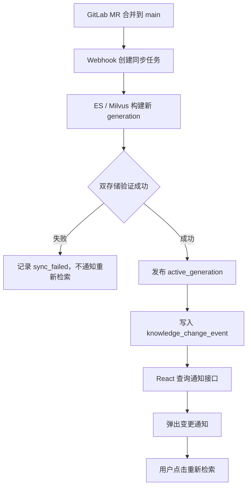

通知记录应当在新 generation 发布成功后创建，而不是直接由 Webhook 创建。

## React 可以判断当前答案是否受影响

当前 RAG 响应已经返回 `sources`，但 [RagSource (line 113)](D:/AI_Agent_Project/AI_Python_Project/python-agent-study/src/fast_app/schemas/rag_chat_schema.py:113) 的顶层 `id` 是 Chunk ID，`doc_id` 还在 `metadata` 中。

企业化改造时建议把这些字段提升为稳定字段：

```
{
  "doc_id": "doc_requirement_001",
  "chunk_id": "chunk_001",
  "generation": 41,
  "git_commit_sha": "old-sha"
}
```

React 保存当前答案引用的 `doc_id`，收到通知后计算交集：

```
当前答案 sources doc_id
∩
通知 affected doc_id
```

处理方式：

- 存在交集：红色高优先级通知。
- 没有交集但新增了文档：普通通知，因为新文档也可能改变检索结果。
- 只是其他无关 Project 更新：不提示或者只显示通知中心角标。

示例提示：

```
你当前回答引用的《支付需求说明》已经更新。

更新类型：修改
新版本：generation 42
发布时间：16:30

[使用最新文档重新检索] [稍后处理]
```

## “重新检索”按钮需要携带版本要求

用户点击后，不应只是原样重新请求。建议携带通知中的 generation：

```
{
  "query": "支付需求中的退款规则是什么？",
  "minimum_knowledge_generation": 42
}
```

后端必须保证：

```
active_generation >= 42
```

否则返回“知识库仍在更新”，避免用户点击重新检索后再次得到旧版本。

这个字段只是新鲜度约束，不能让前端传递部门或用户权限范围。

## 通知也必须经过权限过滤

不能把全部 GitLab文档变更广播给所有用户。

通知接口应复用当前 `CurrentUserContext` 权限范围：

- 公共文档：允许访问公共知识库的用户可见。
- 部门文档：只有对应部门用户可见。
- 用户级文档：只有显式授权用户可见。
- 管理员：可以查看全部事件。
- 无权访问的文档：连标题和路径也不能出现在响应中。

通知记录可以只保存一份，查询时根据当前服务端权限过滤，不需要为每个用户复制一份通知。

## 建议区分三种事件

| 事件                    | 接收人               | React 行为                           |
| ----------------------- | -------------------- | ------------------------------------ |
| `change_proposed`       | 审核人员、编辑人员   | 提示存在新 MR，不提示重新检索        |
| `knowledge_published`   | 有文档访问权限的用户 | 提示新增、修改、删除，可重新检索     |
| `knowledge_sync_failed` | 管理员、运维人员     | 提示同步失败，普通用户继续使用旧版本 |

普通用户最关心的是 `knowledge_published`。

## 是否需要 SSE

第一阶段推荐 REST 轮询，因为：

- 实现简单。
- Bearer Token 使用自然。
- 前端刷新或断线后不会丢通知。
- 不需要立即引入跨 FastAPI 实例的实时消息分发。
- 5～10 秒延迟通常足够。

如果以后需要秒级通知，再复用同一数据模型增加：

```
GET /knowledge/change-notifications/stream
```

使用 SSE 推送实时事件；断线重连后再通过 REST 补查遗漏事件。这个通知流应独立于 `POST /rag/chat/stream/events`，因为聊天流在一次回答结束后就会关闭。

## 方案边界

这个通知功能可以让普通文档采用：

> 系统提示变化，由用户决定是否重新检索。

但对于需求、制度、权限、合规等关键文档，不建议完全依赖用户判断。用户可能忽略弹窗，因此仍应保留上一轮讨论的强一致策略：发现 generation 变化后自动作废旧回答。

推荐组合：

- 普通文档：通知 + 用户主动重新检索。
- 关键文档：后端强制重新检索 + 前端通知原因。
- MR 未合并：只通知审核人员。
- main 已发布：才通知检索用户。

本轮只完成方案设计，没有修改代码。

# 3、Agent操作文档的能力应该如何修改？

接入 GitLab 后，Agent 的定位应该从：

> 文档执行者

改成：

> 文档变更提议者

**Agent 只能在临时分支创建提交并发起 Merge Request**，不能直接修改 `main`，也不能在创建 MR 时立即修改 ES/Milvus。只有人工将 MR 合并到 `main` 后，GitLab Webhook 才触发 RAG 同步。

## 当前链路需要改变的地方

现在的真实链路是：

```
POST /agent/task-plans/{task_plan_id}/confirm
→ DocumentTaskExecutor.confirm()
→ KnowledgeDocumentManagementService.execute_confirmed_actions()
→ 本地文件 write_text() / unlink()
→ 直接替换或删除 ES、Milvus Chunk
```

关键位置：

- [确认接口 (line 184)](D:/AI_Agent_Project/AI_Python_Project/python-agent-study/src/fast_app/api/agent_task_plan_routes.py:184)
- [确认后调用文档 Service (line 1259)](D:/AI_Agent_Project/AI_Python_Project/python-agent-study/src/fast_app/services/agent_tasks/document_task_executor.py:1259)
- [当前批量真实执行入口 (line 168)](D:/AI_Agent_Project/AI_Python_Project/python-agent-study/src/fast_app/services/knowledge/knowledge_document_management_service.py:168)
- [当前直接修改文件的位置 (line 285)](D:/AI_Agent_Project/AI_Python_Project/python-agent-study/src/fast_app/services/knowledge/knowledge_document_management_service.py:285)
- [当前直接同步索引的位置 (line 310)](D:/AI_Agent_Project/AI_Python_Project/python-agent-study/src/fast_app/services/knowledge/knowledge_document_management_service.py:310)

其中最后两步需要被替换。

## 改造后的链路

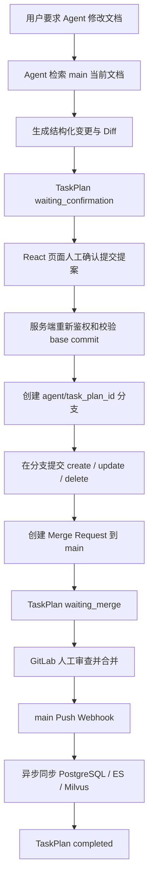

这里存在两层确认：

1. RAG 系统确认：允许 Agent 创建分支和 MR。
2. GitLab 合并确认：允许变更进入 `main` 并影响正式知识库。

第一层不能代替第二层。

## 哪些现有能力可以保留

下面这些不需要推翻：

- Agent intent Router。
- 文档候选检索和 `doc_id` 范围限制。
- TaskPlan 和 dry-run。
- Diff 预览。
- `before_hash` 乐观锁。
- 当前用户权限二次校验。
- Agent Tool 审计。
- `POST /agent/task-plans/{task_plan_id}/confirm` 独立确认接口。

但确认接口的语义需要变成：

> 确认创建 GitLab 变更提案

而不是：

> 确认直接修改正式文档和检索索引

## 确认后应该执行什么

`execute_confirmed_actions()` 不再调用 `_apply_prepared_mutation()`，而是完成以下操作：

1. 根据部门和文档路径，由服务端确定目标 GitLab Project。
2. 获取 `main` 最新 commit SHA 和目标文件 blob SHA。
3. 比较 TaskPlan 保存的 `base_commit_sha`，防止用户确认期间文档已经变化。
4. 从这个 SHA 创建分支：

```
agent/{task_plan_id}
```

1. 使用 GitLab Commits API，将一批 create/update/delete 动作提交成一个 commit。
2. 创建目标为 `main` 的 Merge Request。
3. 保存：

```
gitlab_project_id
source_branch
target_branch
base_commit_sha
head_commit_sha
merge_request_iid
merge_request_url
merge_status
```

GitLab 的 Commits API 原生支持在新分支上批量执行 `create`、`update`、`delete` 等文件动作，不需要先在服务器维护一个可写 Git 工作区。[GitLab Commits API](https://docs.gitlab.com/api/commits/)
MR 可以通过 API 指定 source branch 和 target branch 创建。[GitLab Merge Requests API](https://docs.gitlab.com/api/merge_requests/)

## 三类文档操作的变化

| Agent 操作 | 用户确认后            | MR 合并后                                          |
| ---------- | --------------------- | -------------------------------------------------- |
| Create     | 分支新增文件并创建 MR | main 出现文件，Webhook 新增 RAG 文档               |
| Update     | 分支修改文件并创建 MR | main 更新文件，Webhook 增量更新 Chunk              |
| Delete     | 分支删除文件并创建 MR | main 删除文件，Webhook关闭文档版本并延迟清理 Chunk |

MR 被关闭或拒绝时，正式 RAG 数据完全不变。

## GitLab 权限必须形成硬隔离

建议创建独立的 Agent 项目令牌或 Bot，不要复用 `root`、`tgg` 或普通员工账号。

Agent Bot：

```
Project role: Developer
Token scope: api
```

它只能：

- 读取目标项目。
- 创建 `agent/*` 分支。
- 在该分支提交。
- 创建 Merge Request。

它不能：

- 直接 push `main`。
- 合并 MR。
- 修改分支保护规则。
- 访问未授权的其他 Project。

GitLab Self-Managed 的 Project Access Token 支持项目级隔离，并会创建对应 Bot 用户。[GitLab Project Access Tokens](https://docs.gitlab.com/user/project/settings/project_access_tokens/)

每个文档 Project 建议使用独立 Token，避免一个 Token 泄漏后影响四个安全边界。

## `main` 分支保护配置

四个文档 Project 都应配置：

```
Branch: main
Allowed to merge: Maintainers
Allowed to push and merge: No one
Force push: Disabled
```

注意必须把 `Allowed to push and merge` 明确设置为 `No one`，不能只留空。GitLab 官方文档明确区分了“未配置”和“No one”。[GitLab Protected Branches](https://docs.gitlab.com/user/project/repository/branches/protected/)

可选地再保护：

```
Branch pattern: agent/*
Allowed to push and merge: Developers + Maintainers
Force push: Disabled
```

不要配置允许 Developer push 的宽泛 `*` 规则，因为 GitLab 多条分支规则冲突时通常采用更宽松的权限，可能意外放开 `main`。[GitLab Protection Rules](https://docs.gitlab.com/user/project/repository/branches/protection_rules/)

## GitLab CE 的实际审批边界

当前本地是 GitLab CE，因此可以可靠使用：

- Protected Branch。
- Developer 创建分支和 MR。
- Maintainer 才能合并到 `main`。
- Agent Bot 无法自行合并。

但是强制 Code Owner 审批、多审批人规则属于更高 GitLab 版本能力。CE 阶段最可靠的强制边界是：

> Bot 只有 Developer，只有人工 Maintainer 能点击合并。

以后公司 GitLab 如果具有 Premium/Ultimate，再增加 Code Owner 和强制审批规则。[GitLab Merge Request Approvals](https://docs.gitlab.com/administration/merge_requests_approvals/)

## RAG 同步只能监听 `main`

不能监听 Agent 分支的 Push，否则 MR 尚未审查，文档就进入正式知识库。

建议：

- Merge Request Webhook：更新 TaskPlan 的 `waiting_merge/merged/closed` 状态。
- `main` Push Webhook：真正创建 RAG 同步任务。
- 同步任务使用 `project_id + after_commit_sha` 做幂等键。
- 只接受 `refs/heads/main`。
- Webhook 的 `before/after` SHA 用来获取完整 Git Diff。
- 同步成功后才把 TaskPlan 标记为 `completed`。

GitLab Webhook能够提供 Push 和 MR 的 merged/closed 等事件。[GitLab Webhook Events](https://docs.gitlab.com/user/project/integrations/webhook_events/)

## TaskPlan 状态建议

最小只需要增加一个状态：

```
waiting_confirmation
→ running
→ waiting_merge
→ running
→ completed
```

异常分支：

```
MR closed       → cancelled
MR merge conflict → waiting_merge + error
RAG sync failed → failed，可重试同步
```

React 页面在 `waiting_merge` 时展示：

- MR 标题。
- 修改文件列表。
- Diff。
- GitLab MR 链接。
- 当前合并状态。
- RAG 同步状态。

## 最重要的职责边界

```
Agent：
生成内容、生成 Diff、创建分支、提交 MR

GitLab：
保存正式文档、保护 main、承载审查和合并

Webhook 同步服务：
只把 main 的已合并状态同步到 RAG

PostgreSQL：
保存 TaskPlan、MR、同步任务和发布版本状态

ES / Milvus：
只保存已经进入 main 的可检索版本
```

因此，接入 GitLab 后应删除 Agent 确认链路中的“直接写正式文件、直接更新索引”语义。确认操作到“MR 已创建”为止；只有 `main` Webhook 才能触发正式 RAG 发布。本轮没有修改代码或 GitLab配置。

# 4、是否需要引入任务队列？

~~~
这个系统部署到企业服务器后，可能会有3-4个人同时提交文档，如果不引入rabbitmq，沿用目前的Worker机制，系统能不能承受？
~~~

## 结论

能承受。对于企业服务器上 **3～4 人同时提交文档** 的规模，RabbitMQ 没有必要，沿用当前“PostgreSQL 持久化队列 + 独立 Worker 进程”足够。

但要区分两个结论：

- **系统不会卡住或丢任务**：现有队列机制可以做到。
- **所有文档能多快完成索引**：取决于文档大小、解析耗时、Embedding 服务以及 ES/Milvus 性能，需要压测确认。

## 当前机制如何处理4个并发任务

假设同时提交4份文档：

```
PostgreSQL Queue
├── Job A：pending
├── Job B：pending
├── Job C：pending
└── Job D：pending
```

如果只启动一个 Worker：

```
Worker 1：A → B → C → D
```

系统仍然安全，只是后面的任务需要排队。

如果启动两个 Worker 进程：

```
Worker 1：A → C
Worker 2：B → D
```

当前 [import_jobs.py (line 297)](D:/AI_Agent_Project/AI_Python_Project/python-agent-study/src/fast_app/ingestion/import_jobs.py:297) 使用 `FOR UPDATE SKIP LOCKED` 领取任务，两个 Worker 不会领取同一条任务。

## 推荐部署配置

初始部署建议：

```
FastAPI：2～4 个 API Worker
Ingestion Worker：2 个独立进程
单个 Ingestion Worker：一次处理1个任务
总文档处理并发：2
```

不要一开始就启动4～8个 ingestion Worker。文档解析、Embedding 和 Milvus 写入可能争抢：

- CPU和内存
- Embedding API并发额度
- Elasticsearch连接
- Milvus写入能力
- 数据库连接池

从2个 Worker 开始，压测后再增加，是最稳妥的配置。

## RabbitMQ现在解决不了核心瓶颈

RabbitMQ主要改善的是任务消息的分发能力，但不会让下面这些操作自动变快：

- PDF、PPT、Excel解析
- Chunk生成
- Embedding调用
- Elasticsearch写入
- Milvus向量写入

3～4个用户产生的任务量，对PostgreSQL队列表非常小。此时增加RabbitMQ只会额外引入：

- RabbitMQ服务器部署与监控
- Celery等任务框架
- 消息确认和重试语义
- 数据库任务状态与消息状态的一致性问题
- 新的故障点

## GitLab接入还需要补充的部分

现有 Worker 机制可以复用，但现有任务模型主要为用户上传 Office 文档设计。GitLab接入仍需补充：

1. **GitLab Push去重，避免同一提交被重复处理。**
2. `added/modified/deleted` 三种操作。
3. 同一 GitLab Project 的提交串行处理。
4. 不同 Project 可以并行处理。
5. 一次提交的多份文档作为一个 Generation 统一发布。
6. Worker失败后的租约回收和有限重试。

这些都可以继续使用PostgreSQL实现，不需要RabbitMQ。

## 需要重点防止的情况

假设同一个 Project 连续提交：

```
Commit A：修改 demand.md
Commit B：再次修改 demand.md
Commit C：删除 demand.md
```

不能让两个 Worker 同时乱序处理 A、B、C。推荐：

```
同一个 Project：串行同步
不同 Project：允许并行
```

如果 A 还在运行时又收到 B、C，只记录最新的 `desired_sha`。A结束后直接从当前 `active_sha` 同步到最新提交，避免处理已经过时的中间版本。

## 上线前最小压测标准

用4个并发提交进行验证：

- Webhook都能快速返回 `202 Accepted`。
- 4个任务全部进入数据库队列。
- 两个 Worker各自领取不同任务。
- Worker异常退出后任务能被重新领取。
- 没有重复 Chunk。
- 同一 Project 的提交没有乱序。
- 检索接口在导入期间仍能正常响应。
- CPU、内存、ES和Milvus没有持续饱和。
- 所有文档最终进入 `succeeded` 或明确的 `failed` 状态。

因此，当前规模直接使用 **PostgreSQL任务队列 + 2个独立Worker进程** 就够了。等出现几十个持续并发任务、跨服务器任务路由或队列隔离需求时，再评估RabbitMQ。


# 5、具体方案：

接下来开始讨论Gitlab接入的完整实现方案，我只列出部分需求，其他需求由你来补充，最终给出完整实现方案。我的部分需求如下：

1.用户类别划分：当前系统分为两类用户，分别是“资产管理者”和“普通知识库使用者”。“资产管理者”分配给每个部门的主管（分配Maintainer角色，能够直接push到main保护分支） 和 小组组长（分配Developer角色，在本地创建分支，不能直接push到main分支，通过MR的方式提交，由Maintainer审核），能够使用Gitlab。“普通知识库使用者”只能使用RAG知识库系统进行检索和文档操作，目前Agent调用的tool还没有实现根据不同账户权限分配，暂时放后，先接入Gitlab模块。

2.工程中实现独立模块 Gitlab Client，专门负责与Gitlab交互的相关逻辑，尽可能不影响目前工程中的其他功能模块，避免和其他模块的耦合。文档解析模块复用工程中现有的功能。不同功能采用子模块的架构实现，不要把所有逻辑混合在一个模块，根据职责划分模块。例如`GitLabClient`负责和 GitLab HTTP API 通信；`GitLabProjectSource`负责把 GitLab 的概念转换成统一数据源概念。`GitDocumentSyncService`负责组织一次完整同步。我只是提供了示例，具体的模块划分由你根据目前工程结构设计。

3.你的实现方案中需要描述全量同步，增量同步的实现方案，可以使用混合架构 Archive 完成全量同步 + REST API 完成增量同步；如果你有更合适的方案，必须向我提出建议。需要描述当前后端系统访问Gitlab时要使用的的认证方式。需要描述Gitlab分页的处理方案。

4.目前工程中Agent操作文档的能力需要修改，**Agent 只能在临时分支创建提交并发起 Merge Request**，不能直接修改 `main`，也不能在创建 MR 时立即修改 ES/Milvus。只有人工将 MR 合并到 `main` 后，GitLab Webhook 才触发 RAG 同步，不要复用 `root`、`tgg` 或普通员工账号

5.Gitlab接入成功后，允许你清空现有数据库（ES，milvus，PostgreSQL中的数据），验证Gitlab功能是否正确接入当前系统


# 6、Codex方案解析：GPT

## 先给出结论：这份 Plan 实际上在做什么

这不是一份简单的“让 RAG 从 GitLab 下载文件”的方案，而是一份**企业级知识资产迁移方案**。

它准备同时完成五件事：

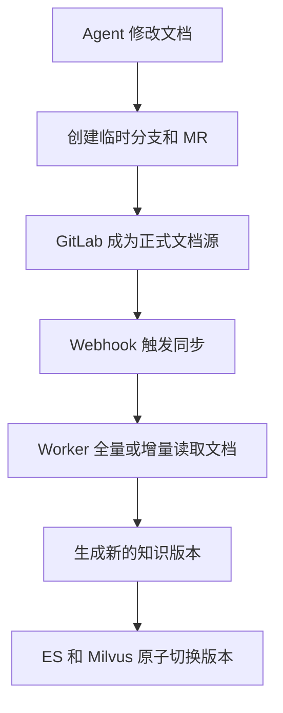

它的核心思想是：

> GitLab 保存“原始正式文档”，PostgreSQL、Elasticsearch 和 Milvus只保存由这些文档派生出来的知识库数据。

GitLab 中的 `main` 一旦变化，系统不会立即在 Webhook 请求中解析文档，而是创建同步任务，由独立 Worker 下载、解析、分块、Embedding，最后将一整批文档一次性发布成新的知识版本。

------

## 一、这份 Plan 对你当前工程做了哪些根本改变

你当前的模式大致是：

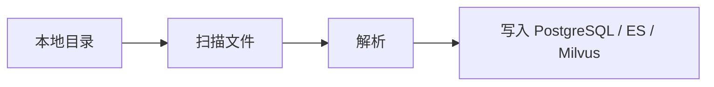

新模式变成：

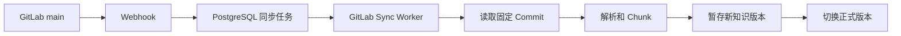

这里最重要的变化是：

### GitLab 成为唯一正式写入源

以后正式文档不能再通过：

```text
本地目录直接导入
上传接口直接写入
Agent 直接写入 ES / Milvus
```

正式文档必须先进入 GitLab，再由同步系统生成知识库数据。

Plan 明确规定旧上传和本地直接写入入口停止实际写入；Agent 也不能直接修改 `main` 或更新 ES/Milvus。

因此，系统中的数据关系变成：

```text
GitLab 文档
    ↓ 解析生成
PostgreSQL 文档记录
    ↓
ES 全文索引
Milvus 向量索引
```

如果知识库索引损坏，理论上可以重新从 GitLab 构建。

这就是所谓的：

> **GitLab 是 Source of Truth，知识库索引是派生数据。**

------

## 二、为什么继续保留四个 GitLab Project

Plan 保留：

```text
art
development
product_planning
public
```

四个私有 Project，并把它们继续作为安全边界。

这意味着不是建立一个超级仓库：

```text
company-documents/
├── art/
├── development/
├── product_planning/
└── public/
```

而是建立四个独立的 GitLab Project：

```text
GitLab
├── art Project
├── development Project
├── product_planning Project
└── public Project
```

原因是 GitLab 的读取权限主要控制到 Project 层级。

如果所有文档都在同一个 Project 中，即使 RAG 可以使用 ACL 过滤，GitLab 用户仍可能直接读取整个仓库。

### `public` 为什么也是私有 Project

这里的 `public` 不是说 GitLab 仓库必须对互联网公开。

它的含义是：

```text
public Project 中的文档
→ 可以被所有合格 RAG 用户检索
```

但 GitLab Project 本身仍然可以是 Private，避免企业文档直接暴露在 GitLab 外部。

------

## 三、人员和机器人权限怎么分配

Plan 定义了五种身份。

| 身份               | GitLab 角色   | 主要能力                          |
| ------------------ | ------------- | --------------------------------- |
| 部门主管           | Maintainer    | 可直接 Push `main`，也可合并 MR   |
| 小组组长或普通开发 | Developer     | Push 普通分支、创建 MR            |
| 普通知识库用户     | 不加入 GitLab | 只使用 RAG                        |
| 同步机器人         | Reporter      | 只读 Project、Commit 和文件       |
| Agent 机器人       | Developer     | 创建 `agent/*` 分支、Commit 和 MR |

这里有两个不同的机器人。

### 同步机器人 `rag-sync`

职责是：

```text
GitLab → RAG
```

它只需要：

- 查询 Project；
- 查询 Branch 和 Commit；
- 下载文件；
  -调用 Compare API；
- 下载 Archive。

所以给它：

```text
Reporter
read_api + read_repository
```

它不能修改仓库。

### Agent 机器人 `rag-agent`

职责是：

```text
RAG Agent → GitLab 变更提案
```

它需要：

- 创建临时分支；
- 创建 Commit；
- 新建或修改文件；
- 创建 Merge Request。

所以它需要 Developer 角色和更高的 API Scope。

但它不能：

- 直接 Push `main`；
- 合并 MR；
- 直接修改 ES/Milvus。

两个机器人分开，是为了避免“只读同步凭证”同时拥有文档写入权限。

Plan 要求每个 Project 都建立两个独立 Project Access Token，并且不复用管理员、主管或普通员工账号。Token 本身不存入 PostgreSQL，数据库只记录对应的环境变量名称。

四个 Project 最终可能有八个 Token：

```text
art:
  rag-sync
  rag-agent

development:
  rag-sync
  rag-agent

product_planning:
  rag-sync
  rag-agent

public:
  rag-sync
  rag-agent
```

虽然管理量较大，但每个 Token 泄露时影响范围有限。

------

## 四、Webhook 在这套系统中的作用

Webhook 不是文档同步器，它只是一个通知。

当 GitLab 的 `main` 变化时：

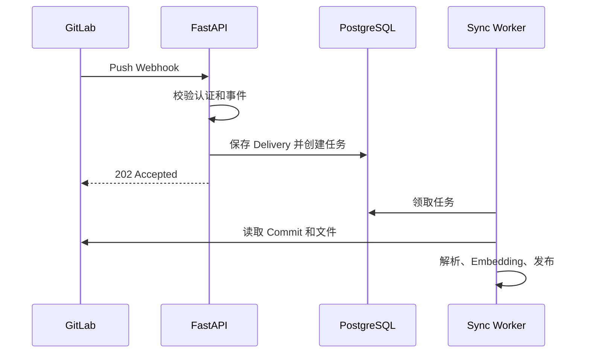

Webhook 接口只做四件事：

```text
校验请求
→ 判断是否为 main Push
→ 幂等落库
→ 返回 202
```

它不会在 HTTP 请求中：

- 下载 ZIP；
- 解析 PPTX；
- 调用 Embedding；
- 写 ES；
- 写 Milvus。

Plan 还要求处理 Webhook 重复投递，并根据 GitLab 版本选择签名验证或 `X-Gitlab-Token`。

### 为什么返回 `202` 而不是 `200`

`202 Accepted` 表示：

> 我已经接收了这次通知并创建任务，但同步还没有完成。

因为真正同步可能需要几十秒甚至更久。

------

## 五、Plan 中各个代码模块分别负责什么

Plan 准备在：

```text
fast_app/integrations/gitlab/
```

建立独立模块。

### `client.py`

它是最低层 GitLab HTTP 客户端。

负责：

```text
Token Header
URL 编码
分页
超时
429 限流重试
GitLab 状态码转换
下载文件
```

它不负责：

```text
Parser
Chunk
Embedding
数据库业务
```

------

### `models.py`

保存 GitLab API 对应的 Pydantic DTO，例如：

```text
GitLabProject
GitLabCommit
GitLabDiff
GitLabFile
GitLabMergeRequest
GitLabWebhookPayload
```

作用是避免整个系统都直接操作无类型的 `dict`。

------

### `project_source.py`

`GitLabProjectSource` 负责把 GitLab 的概念转换成知识库概念：

```text
GitLab Project
GitLab Repository Path
GitLab Commit
```

转换为：

```text
source_uri
doc_id
source_revision
部门 ACL
GitLab Web URL
```

例如：

```text
source_uri =
gitlab://gitlab-dev/project/15/docs/rag-design.md
doc_id =
hash("gitlab:gitlab-dev:15:docs/rag-design.md")
```

这个 `doc_id` 不依赖 Worker 的本地临时路径。

------

### `sync_service.py`

这是同步流程的编排层：

```text
全量同步
增量同步
文档解析
Chunk 构建
Embedding
发布
失败恢复
```

它会调用其他模块，但不自己处理 HTTP Header，也不自己实现 PPTX/XLSX Loader。

------

### `repository.py`

这里的 `repository.py` 不是 Git Repository。

它是数据库访问层，负责：

```text
GitLab Source 表
Webhook Delivery 表
同步任务表
文档清单
MR 状态
```

------

### `worker.py`

独立运行的同步 Worker：

```text
领取任务
→ 下载 GitLab 文档
→ 解析
→ 构建索引
→ 发布
```

它复用你当前工程已经有的：

```text
租约
心跳
有限重试
FOR UPDATE SKIP LOCKED
```

------

### `agent_change_service.py`

它负责把 Agent 已经确认的文档修改动作转换成：

```text
GitLab 分支
Commit Actions
Merge Request
```

不是直接修改知识库。

------

### `webhook_service.py`

负责：

```text
验证 Webhook
解析 Push/MR Event
生成幂等键
保存 Delivery
更新 desired_sha
```

------

## 六、这些 PostgreSQL 表分别存什么

这一部分看起来复杂，但每张表的职责其实很清晰。

### `gitlab_sources`

表示一个已经接入的 GitLab 数据源。

例如一条记录：

```text
source_id = 1
project_id = 15
project_path = company/development
target_branch = main
department = development
last_synced_sha = A
desired_sha = B
```

它同时保存：

- Project 配置；
- 目标分支；
- 默认 ACL；
- Token 对应的环境变量名；
- 同步进度；
- 健康状态。

------

### `gitlab_webhook_deliveries`

表示：

> GitLab 曾经向系统发送过一次 Webhook。

主要用于：

- 防止重复处理；
- 审计；
- 记录 `before_sha` 和 `after_sha`；
- 记录 Payload Hash。

它不是同步任务本身。

------

### `gitlab_sync_jobs`

表示一次实际同步任务：

```text
把 development Project
从 Commit A
同步到 Commit B
```

任务模式包括：

```text
full
incremental
reconcile
bootstrap
```

它会保存：

- 当前状态；
- 当前阶段；
- Worker；
- 租约；
- 重试次数；
  -目标 SHA；
- 新增、修改、删除数量；
- 错误码。

------

### `gitlab_documents`

保存 GitLab 文件与 RAG 文档之间的映射：

```text
GitLab Repository Path
        ↕
稳定 doc_id
        ↕
PostgreSQL / ES / Milvus 文档
```

例如：

```text
doc_id = xxx
project_id = 15
repository_path = docs/rag-design.md
blob_id = abc123
last_commit_id = def456
```

------

### `gitlab_change_requests`

保存 Agent 创建的变更提案。

例如：

```text
task_plan_id
source_id
agent 分支
Commit SHA
MR IID
MR URL
状态
```

它解决的是：

> 用户确认同一个 TaskPlan 两次时，不能创建两个完全相同的 MR。

------

### `knowledge_publication_state`

这是最关键、但结构最简单的表。

Plan 说它只有一行，保存：

```text
当前正式 publication_version
```

例如：

```text
publication_version = 37
```

这表示当前所有新 RAG 请求都查询知识版本 37。

------

### `knowledge_change_events`

保存正式发布后产生的通知事件：

```text
版本 37 发布
development Project 更新到 Commit B
影响文档：A、B、C
发布时间：……
```

React 前端可以轮询这些事件。

------

## 七、最重要的两个 SHA：`last_synced_sha` 和 `desired_sha`

这是理解整个 Worker 系统的关键。

### `last_synced_sha`

表示：

> 已经成功解析、写入 ES/Milvus，并正式发布的最新 Commit。

### `desired_sha`

表示：

> GitLab `main` 当前希望系统追赶到的最新 Commit。

假设初始状态：

```text
last_synced_sha = A
desired_sha = A
```

主管连续 Push：

```text
A → B → C
```

Webhook 到达后：

```text
last_synced_sha = A
desired_sha = C
```

Worker 不一定必须先同步 B 再同步 C，可以直接：

```text
Compare A → C
```

最终发布成功：

```text
last_synced_sha = C
desired_sha = C
stateDiagram-v2
    [*] --> A_A: 已同步 A / 期望 A
    A_A --> A_B: Webhook B
    A_B --> A_C: Webhook C
    A_C --> C_C: Worker 成功发布 C
```

这种设计能合并短时间内连续出现的多个 Push，避免为每个 Commit 都重复执行完整解析。

------

## 八、四种同步任务模式是什么意思

### `full`

对一个 Project 做完整扫描：

```text
下载整个目标 Commit
→ 生成全部文档 Manifest
→ 与数据库清单比较
```

适合：

- 首次同步；
- 手动重建；
- 增量同步无法确认完整性。

------

### `incremental`

比较两个 Commit：

```text
last_synced_sha → target_sha
```

只处理变化的文件。

适合正常 Push。

------

### `reconcile`

可以理解为：

> 全量对账。

它不是简单地无条件重建所有 Embedding，而是重新获取完整仓库清单，与 `gitlab_documents`、ES、Milvus 当前状态进行核对。

用于：

- Webhook 丢失；
- 怀疑索引不一致；
- 定期健康检查；
  -权限规则发生全局变化。

------

### `bootstrap`

表示系统正式切换到 GitLab 时的首次初始化发布。

Plan 准备在清库后同时读取四个 Project，并把它们作为一个初始正式知识版本发布。

------

## 九、全量同步是怎么执行的

Plan 的全量同步流程如下。

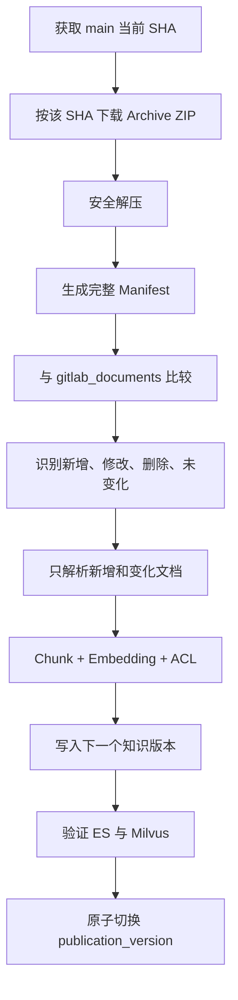

### 为什么使用 Archive

它一次性下载指定 Commit 的完整仓库：

```text
Commit A
→ archive.zip
```

优点是：

- 容易固定版本；
- 容易复用现有目录 Loader；
- 适合首次同步和全量对账；
- 不需要逐个调用 Raw File API。

### 什么是 Manifest

Manifest 是一份文档清单，例如：

```text
docs/a.md
  blob_sha = aaa
  size = 1000

docs/b.pptx
  blob_sha = bbb
  size = 50000
```

它不等于文档正文，而是帮助系统判断：

```text
哪些文档新增
哪些修改
哪些删除
哪些完全没变
```

所以全量同步也不代表所有文件都重新 Embedding。

------

## 十、增量同步是怎么执行的

Plan 的增量路径是：

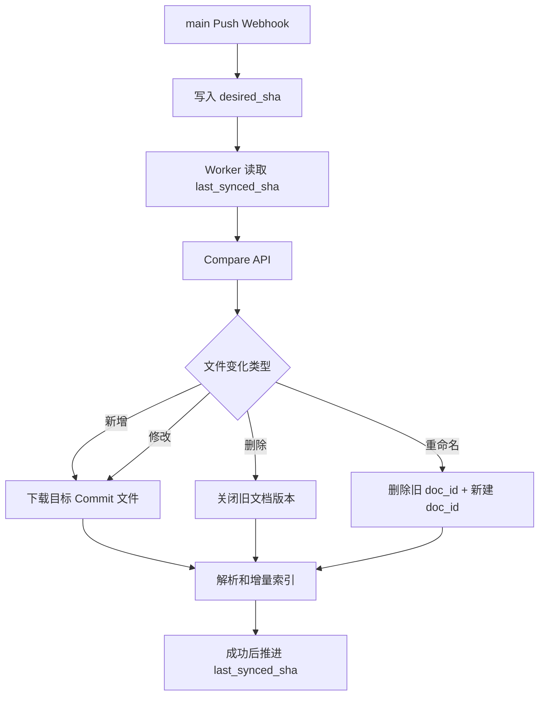

### 为什么不直接使用 Webhook 中的 `commits`

Webhook 里的 Commit 数组可能被截断。

因此 Webhook 只提供：

```text
before SHA
after SHA
```

Worker 再通过 Compare API 获取完整文件差异。

### `straight=true` 是什么意思

Plan 想表达的是：

> 直接比较 `last_synced_sha` 和 `target_sha`，而不是围绕分支合并基点推导另一种比较范围。

对你的主分支连续同步来说，目标是明确得到：

```text
从上次已发布版本
到本次目标版本
究竟有哪些文件发生变化
```

### 增量无法信任时怎么办

出现以下情况：

- Compare 超时；
- 旧 SHA 不存在；
- Force Push；
- 两个 SHA 不是正常祖先关系；
- Diff 结果疑似不完整；

系统自动降级为：

```text
Archive 全量对账
```

这体现了一个重要原则：

> 增量同步优先保证效率，全量对账负责保证正确性。

------

## 十一、权限配置和 XLSX Sidecar 为什么特殊处理

Plan 规定支持的格式包括 Markdown、TXT、PPTX、XLSX，PDF 当前明确报不支持，而不是静默忽略。

### `.permission-rules.json`

这个文件可能影响整个 Project 内多个文档的 ACL。

例如从：

```json
{
  "path": "docs/**",
  "allowed_departments": ["development"]
}
```

改为：

```json
{
  "path": "docs/**",
  "allowed_departments": ["development", "art"]
}
```

即使所有正文文件都没有变化，很多文档的权限 Metadata 都变了。

所以 Plan 选择：

```text
权限规则变化
→ 整个 Source 全量对账
```

这是为了避免漏更新权限。

### XLSX Sidecar Profile

例如仓库中存在：

```text
资产.xlsx
资产.xlsx.rag-profile.json
```

这个 JSON 用于说明：

- Excel 使用 Record 模式还是 Section 模式；
- 哪些 Sheet 要处理；
- 哪些列是关键字段；
- 使用哪个 Profile。

它与 XLSX 一起提交到 GitLab，因此：

```text
Commit A
→ Excel 文件 A + Profile A

Commit B
→ Excel 文件 B + Profile B
```

任何人都可以准确恢复某个 Commit 下的解析规则。

这就是“随仓库版本化的 Sidecar Profile”。

------

## 十二、ACL“只能收窄，不能扩大”是什么意思

Plan 规定：

```text
GitLabProjectSource 服务端配置
→ 权限上限

仓库中的权限 JSON
→ 只能在这个范围内进一步限制
```

例如 `development` Project 的服务端配置是：

```text
最大范围 = development 部门
```

仓库中的 JSON 可以写：

```text
只允许 development 部门中的 user_001
```

这是收窄。

但不能写：

```text
允许 art 部门
```

也不能自行写：

```text
visibility = public
```

因为这会突破 Project 原本的安全边界。

只有 `public` Project 才允许生成 RAG 的 public 文档。

这种设计防止普通 GitLab Developer 通过修改 JSON，擅自扩大文档权限。

------

## 十三、最难理解的部分：什么是“原子知识版本”

这是整个 Plan 中最复杂、也最有价值的设计。

Plan 要求一个 GitLab Commit 中的所有文档：

> 要么全部以新版本生效，要么全部不生效。


### 没有原子版本时的问题

假设一个 Commit 同时修改三份文档：

```text
A.md
B.md
C.md
```

普通更新过程可能是：

```text
10:00:01 更新 A
10:00:05 更新 B
10:00:10 更新 C
```

在 10:00:06 发起 RAG 查询的用户可能看到：

```text
A = 新版本
B = 新版本
C = 旧版本
```

这叫新旧版本混合。

### Plan 如何解决

每个 Chunk 增加：

```text
logical_chunk_id
valid_from_version
valid_to_version
source_id
source_revision
```

假设当前正式知识版本是 20。

旧 Chunk：

```text
valid_from_version = 18
valid_to_version = 21
```

新 Chunk：

```text
valid_from_version = 21
valid_to_version = 无穷大
```

但正式指针暂时仍是：

```text
publication_version = 20
```

因此查询版本 20 时：

```text
旧 Chunk 可见
新 Chunk 不可见
```

系统在 ES 和 Milvus 写完、验证完以后，只需要在 PostgreSQL 中执行一次事务：

```text
publication_version: 20 → 21
```

此后新请求全部使用版本 21。

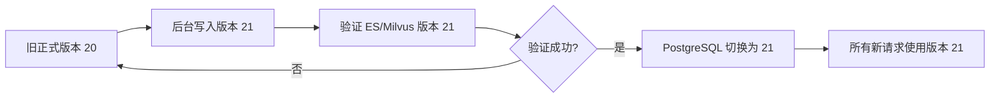

### 为什么称为“原子”

这里不是说 PostgreSQL、ES、Milvus真的加入了一个数据库事务。

而是通过“版本不可见”实现逻辑原子性：

```text
写入过程中
→ 新版本存在，但检索不到

切换指针后
→ 新版本一次性全部可见
```

只要 PostgreSQL 指针还没有切换，旧知识版本就继续完整服务。

------

## 十四、RAG 请求为什么要在开始时冻结知识版本

假设请求开始时：

```text
publication_version = 20
```

请求执行到一半时，系统切换到：

```text
publication_version = 21
```

如果每个检索节点都重新读取版本，可能出现：

```text
第一次检索使用 20
第二次检索使用 21
```

所以 Plan 要求每个 RAG 请求只读取一次：

```text
request_version = 20
```

之后 Classic RAG、LangGraph 和 Agent 所有检索都固定使用版本 20。

旧请求完成旧版本回答，新请求使用版本 21。

如果请求结束时发现引用文档已经更新，可以返回：

```text
stale = true
stale_doc_ids = [...]
```

这并不是说回答必然错误，而是提醒前端：

> 这次回答基于请求开始时的旧知识版本，相关文档刚刚发生了更新。

------

## 十五、Agent 修改文档的流程发生了什么变化

Plan 不再让 Agent 确认后直接修改知识库。

确认的语义从：

```text
确认后立即修改正式文档
```

改为：

```text
确认后向 GitLab 提交一个变更提案
```

完整流程是：

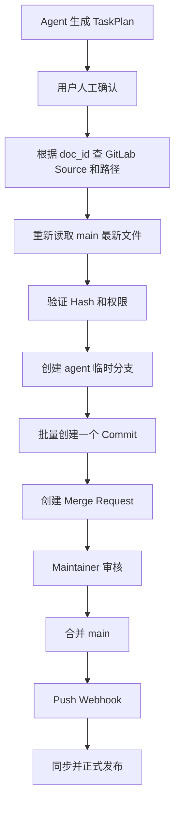

### 为什么确认后还要重新读取文件

Agent 制定计划时，文档可能是 Commit A。

用户确认前，主管可能已经修改成 Commit B。

如果 Agent仍然使用 A 直接更新，就可能覆盖 B。

因此确认后要重新读取当前已发布 `main`，验证：

```text
文件 Hash
last_commit_id
权限
```

### 什么是 `last_commit_id` 乐观并发控制

Agent 提交更新时告诉 GitLab：

```text
我制定计划时，这个文件最后一次修改 Commit 是 A
```

如果现在文件已经变成 B，GitLab 应拒绝更新。

它的作用类似：

```text
UPDATE document
SET content = new_content
WHERE version = old_version
```

防止 Agent覆盖别人刚提交的修改。

### 为什么一个 Project 创建一个 MR

TaskPlan 可能同时修改：

```text
development Project
art Project
```

不同 Project 有不同主管和权限边界，因此不能用一个 MR 跨 Project。

系统会按 Project 分组：

```text
development → MR 1
art → MR 2
```

### TaskPlan 什么时候算完成

不是文档正式发布时，而是：

```text
MR 已创建
```

之后状态继续变化：

```text
opened
→ merged_waiting_sync
→ published
```

也就是说：

```text
Agent 完成提案
Maintainer 完成审批
Sync Worker 完成正式发布
```

三方职责明确分开。

------

## 十六、为什么 MR 合并后不能直接更新 ES/Milvus

MR Webhook 只负责更新：

```text
gitlab_change_requests.status
```

它不会触发正式知识写入。

只有：

```text
main Push Webhook
```

才创建同步任务。

原因是 `main` 才是正式文档状态。

例如：

```text
MR 创建
→ RAG 不变化

MR 被关闭
→ RAG 不变化

MR 被合并
→ main 变化
→ Push Webhook
→ RAG 同步
```

这样即使 MR 状态事件丢失，只要 `main` 的 SHA 变化，周期对账仍然可以恢复正式同步。

------

## 十七、两个 Worker 怎么协同

Plan 部署三个进程：

```text
rag-api
gitlab-sync-worker-1
gitlab-sync-worker-2
```

### FastAPI

只负责：

- 接口；
- Webhook；
  -查询任务；
  -创建任务。

它不在自身进程里运行同步 Worker。

这样 API 重启、扩容不会重复启动后台任务。

### 两个 Worker

两个 Worker 可以并行处理不同 Project：

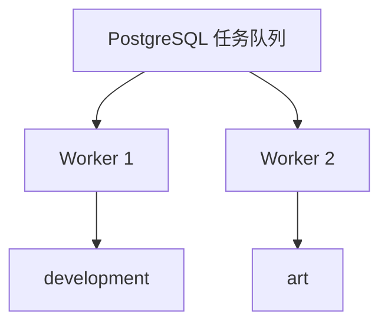

但同一个 Source 必须串行：

```text
development A→B
development B→C
```

不能被两个 Worker 同时执行。

------

## 十八、`FOR UPDATE SKIP LOCKED` 是什么意思

假设数据库中有任务：

```text
Job 1：development
Job 2：art
Job 3：product
```

两个 Worker 同时查询待处理任务。

`FOR UPDATE` 会锁定 Worker 正在领取的记录。

`SKIP LOCKED` 表示：

> 如果某条任务已经被另一个 Worker 锁住，不要等待，跳过去领取其他任务。

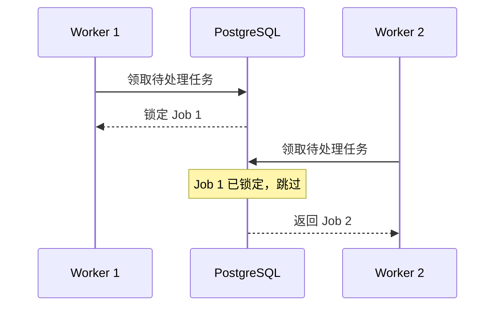

这样两个 Worker 不会重复处理同一个任务。

------

## 十九、租约和心跳解决什么问题

Worker 领取任务后保存：

```text
worker_id
lease_expires_at
last_heartbeat_at
```

Plan 设置：

```text
租约：5 分钟
心跳：60 秒
```

正常 Worker 每分钟续租。

如果 Worker 崩溃：

```text
不再发送心跳
→ 5 分钟后租约过期
→ 另一个 Worker 可以重新领取
```

因此任务不会永远卡在 `running`。

------

## 二十、为什么还要每 10 分钟周期对账

Webhook 并不保证永远不会丢失。

可能发生：

- GitLab 暂时无法访问 RAG；
- FastAPI 正在重启；
- 网络故障；
- Webhook 多次失败后被禁用。

所以 Worker 空闲时定期查询：

```text
GitLab main 当前 SHA
```

并与：

```text
last_synced_sha
desired_sha
```

比较。

如果发现不一致，就补建任务。

这就是：

> Webhook 提供实时性，周期对账提供最终一致性。

------

## 二十一、测试部分为什么这么多

Plan 的测试不是只验证“能下载 Markdown”，而是验证整个企业级闭环。

它重点测试：

- Webhook 重复；
- Worker 崩溃；
- 两个 Worker 是否重复领取；
- Compare 超时；
- Force Push；
- Archive 路径穿越；
- ES 成功但 Milvus 失败；
- Agent 能否绕过 MR；
- 一个 Commit 多文档是否发生新旧混合；
- RAG 权限是否正确。

尤其是故障注入：

```text
ES 写完后故意失败
Milvus 写完后故意失败
发布前故意失败
```

都要验证：

```text
旧知识版本仍然完整可用
```

这正是原子知识版本设计是否有效的核心验收。

------

## 二十二、清库和正式切换在做什么

最后一部分是从旧本地导入系统切换到 GitLab 的上线流程。

流程可以简化成：

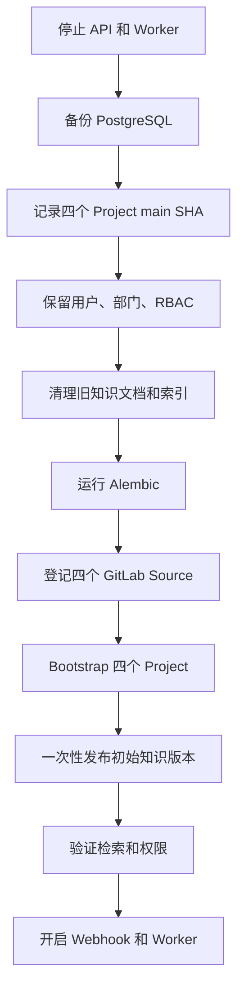

这里不会删除：

```text
用户账号
部门
角色
权限
审计数据
```

只重建知识库相关数据。

### 为什么四个 Project 首次要一起发布

如果先发布 development，再发布 art，中间可能出现系统只有一部分部门文档的新旧混合状态。

Bootstrap 准备把四个 Project 一次性作为新的初始知识版本激活。

------

## 二十三、这份 Plan 可以压缩成六条主线

### 主线一：正式文档在哪里

```text
GitLab main
```

### 主线二：怎么发现变化

```text
Push Webhook + 定期对账
```

### 主线三：怎么同步

```text
首次或异常：Archive 全量
正常情况：Compare + Raw File 增量
```

### 主线四：怎么避免知识新旧混合

```text
版本化暂存
→ 验证
→ publication_version 原子切换
```

### 主线五：Agent 怎么改文档

```text
TaskPlan
→ 人工确认
→ 分支
→ Commit
→ MR
→ Maintainer 合并
```

### 主线六：发生故障怎么办

```text
任务幂等
租约
心跳
重试
全量回退
周期对账
旧版本继续服务
```

------

## 二十四、这份 Plan 的复杂程度如何

这份 Plan 的复杂度明显高于普通的 GitLab 接入。

普通第一版可能只有：

```text
GitLab Archive
→ 解压
→ 复用目录导入
```

但这份 Plan 还加入了：

- Webhook 幂等；
- PostgreSQL 任务队列；
- 两个 Worker；
- 增量 Compare；
- 原子知识版本；
- Agent MR 工作流；
- 前端变更通知；
  -请求级知识版本冻结；
  -自动故障恢复；
  -完整生产切换。

因此它更像：

> **企业级 GitLab 知识资产平台改造方案**

而不是一个简单功能补丁。

------

## 二十五、你现在最需要先掌握的五个概念

不要试图一次理解全部 410 行。按照下面顺序理解即可：

1. **`last_synced_sha` 与 `desired_sha`**
   一个代表已经正式发布到哪里，一个代表需要追赶到哪里。
2. **Archive 全量与 Compare 增量**
   全量负责正确性，增量负责效率。
3. **Webhook 与 Worker 分离**
   Webhook 只创建任务，Worker 才执行耗时同步。
4. **原子知识版本**
   先写入不可见新版本，验证后再切换正式版本。
5. **Agent 的 MR 工作流**
   Agent 只能提出修改，不能直接改变正式知识库。

这五点理解后，这份 Plan 的主体就已经掌握了约 80%。下一步最应该单独深入的是其中最陌生的：

> **`last_synced_sha`、`desired_sha`、Webhook 和同步任务之间如何协同。**


# 6.5、Codex方案解析：GPT-2

## 下一步：`last_synced_sha`、`desired_sha`、Webhook 与同步任务如何协同

这一模块要解决的是：

> GitLab 的 `main` 可能不断产生新 Commit，RAG 系统如何知道自己已经同步到哪里、还需要追赶到哪里，并且在重复 Webhook、连续 Push、Worker 崩溃等情况下仍然保持正确？

这套机制的核心不是“每来一个 Webhook 就同步一次”，而是维护两个位置：

```text
已经完成的位置：last_synced_sha
希望追赶的位置：desired_sha
```

然后由同步任务负责把系统从前者推进到后者。

------

## 一、先理解两个 SHA 的准确含义

假设 GitLab `main` 的提交历史是：

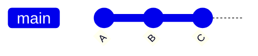

### `last_synced_sha`

表示：

> 最后一个已经完成解析、Chunk、Embedding、ES/Milvus 写入，并且正式发布成功的 GitLab Commit。

例如：

```text
last_synced_sha = A
```

它不是“已经下载到 A”，也不是“任务执行到 A”。

它必须表示：

```text
Commit A 对应的文档
+
Chunk
+
Embedding
+
ACL
+
ES
+
Milvus
+
知识版本发布

全部成功
```

只有全部成功后，才能更新 `last_synced_sha`。

Plan 明确要求只有发布成功，才推进 `last_synced_sha`。

------

### `desired_sha`

表示：

> 根据目前已经收到的 GitLab 通知，RAG 系统最终希望同步到的最新 `main` Commit。

例如 GitLab 当前是：

```text
main → C
```

那么：

```text
desired_sha = C
```

但是此时 RAG 可能仍然停留在：

```text
last_synced_sha = A
```

完整状态就是：

```text
GitLab main         = C
desired_sha         = C
last_synced_sha     = A
```

含义是：

> GitLab 已经更新到 C，但知识库目前只正式发布到 A，系统还需要从 A 追赶到 C。

Plan 将这两个字段放在 `gitlab_sources` 中，同时还保存健康状态和下一次对账时间。

------

## 二、为什么不能只有 `last_synced_sha`

假设数据库只有：

```text
last_synced_sha = A
```

GitLab 收到新 Push：

```text
A → B
```

系统可以创建任务：

```text
同步 A → B
```

但任务运行期间，又发生了 Push：

```text
B → C
```

这时系统必须记住：

```text
即使当前 A → B 任务正在运行，
后面仍然需要继续同步到 C。
```

如果没有 `desired_sha`，第二次 Push 只能依赖：

- 再创建一个新任务；
- 或依赖 Worker 运行完后重新查询 GitLab；
- 或依赖另一次 Webhook 不丢失。

这些方案容易产生任务堆积或丢失更新。

有了 `desired_sha` 后，状态非常清楚：

```text
last_synced_sha = A
desired_sha = C
```

系统一眼就能看出：

```text
A != C
→ 仍有同步工作需要完成
```

------

## 三、为什么不能只有 `desired_sha`

反过来，假设只保存：

```text
desired_sha = C
```

系统知道自己想同步到 C，却不知道当前正式知识库对应哪个 GitLab Commit。

因此无法确定：

```text
应该 Compare A → C
还是 Compare B → C
还是应该进行全量同步
```

所以两个字段缺一不可：

```text
last_synced_sha
→ 已确认成功的起点

desired_sha
→ 当前需要追赶的终点
```

可以理解为：

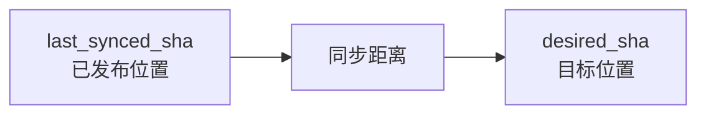

------

## 四、Webhook 在这里到底做什么

Webhook 的主要任务不是同步文档，而是更新目标。

GitLab `main` 从 A 更新到 B 时，会发送 Push Webhook：

```json
{
  "ref": "refs/heads/main",
  "before": "A",
  "after": "B"
}
```

Webhook 接口执行：

```text
1. 验证请求来自 GitLab
2. 判断 ref 是否为 refs/heads/main
3. 检查这次 Delivery 是否重复
4. 将 desired_sha 更新为 B
5. 创建或唤醒同步任务
6. 返回 202
sequenceDiagram
    participant G as GitLab
    participant API as Webhook API
    participant DB as PostgreSQL
    participant W as Sync Worker

    G->>API: Push main，A → B
    API->>API: 验证 Token/HMAC
    API->>DB: 保存 Webhook Delivery
    API->>DB: desired_sha = B
    API->>DB: 创建同步任务
    API-->>G: 202 Accepted

    Note over W: 后续异步执行
    W->>DB: 领取同步任务
```

Plan 明确要求 Webhook 只校验、落库并返回 `202`，不在 HTTP 请求内解析文档。

------

## 五、Webhook、Delivery 和同步任务不是同一个东西

这三个对象容易混淆。

### Webhook

是 GitLab 发过来的一次 HTTP 通知：

```text
main 从 A 变化到 B
```

------

### `gitlab_webhook_deliveries`

保存“这次通知是否已经收到和处理过”。

例如：

```text
delivery_id = webhook-123
source_id = development
before_sha = A
after_sha = B
status = accepted
```

它主要用于：

- 幂等去重；
- 审计；
- 排查 GitLab 是否发送过事件。

------

### `gitlab_sync_jobs`

表示真正需要 Worker 执行的业务任务：

```text
将 Source 1
从 A
同步到 B
```

可能包含：

```text
job_id
source_id
base_sha
target_sha
mode
status
phase
worker_id
lease_expires_at
attempt
```

Plan 对 `(source_id, target_sha)` 设置唯一约束，并要求同一个 Source 只能有一个活动任务。

关系如下：

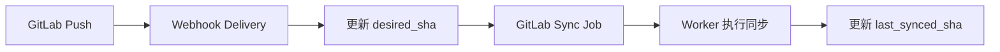

------

## 六、一次普通 Push 的完整流程

假设初始状态：

```text
GitLab main      = A
last_synced_sha  = A
desired_sha      = A
```

主管 Push 新 Commit B：

```text
main: A → B
```

### 第一步：GitLab 发送 Webhook

```text
before = A
after = B
ref = refs/heads/main
```

### 第二步：Webhook 更新数据库

```text
desired_sha = B
```

此时：

```text
last_synced_sha = A
desired_sha = B
```

并创建任务：

```text
base_sha = A
target_sha = B
mode = incremental
status = pending
```

### 第三步：Worker 领取任务

Worker 从数据库读取：

```text
当前正式版本：A
目标版本：B
```

然后调用 GitLab Compare API：

```text
Compare A → B
```

得到文件变化：

```text
新增：new.md
修改：design.pptx
删除：old.txt
```

### 第四步：处理变化

```text
新增/修改
→ 下载 B 版本的文件
→ Parser
→ Chunk
→ Embedding
→ 写入新知识版本

删除
→ 关闭旧文档和 Chunk 的有效期
```

### 第五步：正式发布

所有存储验证通过后：

```text
publication_version: 20 → 21
```

然后更新：

```text
last_synced_sha = B
```

最终：

```text
last_synced_sha = B
desired_sha = B
```

这表示系统已经追赶完成。

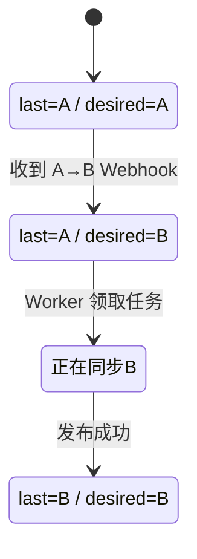

------

## 七、连续 Push 时会发生什么

这是 `desired_sha` 最有价值的场景。

假设初始：

```text
last_synced_sha = A
desired_sha = A
```

短时间内连续发生：

```text
A → B
B → C
C → D
```

### 第一个 Webhook

```text
desired_sha = B
```

### 第二个 Webhook

```text
desired_sha = C
```

### 第三个 Webhook

```text
desired_sha = D
```

最终数据库：

```text
last_synced_sha = A
desired_sha = D
```

系统不一定需要执行三个完整任务：

```text
A → B
B → C
C → D
```

它可以直接执行：

```text
A → D
flowchart LR
    A["已发布 A"] --> B["Push B"]
    B --> C["desired=B"]
    C --> D["Push C"]
    D --> E["desired=C"]
    E --> F["Push D"]
    F --> G["desired=D"]
    G --> H["Worker Compare A→D"]
    H --> I["发布 D"]
```

这样会自动合并中间的同步需求。

Git 历史中的 B、C 并没有消失，只是 RAG 不需要为每个中间 Commit 单独发布一个知识版本。

------

## 八、任务运行期间又有新 Push 怎么办

假设 Worker 已经开始执行：

```text
A → B
```

此时状态：

```text
last_synced_sha = A
desired_sha = B
running job target_sha = B
```

同步过程中又收到：

```text
B → C
```

Webhook 不应该修改正在运行任务的 `target_sha`。

正在运行的任务已经固定到 B，必须继续完成 B，不能执行到一半突然切换目标。

Webhook只更新：

```text
desired_sha = C
```

于是状态变成：

```text
last_synced_sha = A
desired_sha = C
running job target_sha = B
sequenceDiagram
    participant G as GitLab
    participant API as Webhook
    participant DB as PostgreSQL
    participant W as Worker

    W->>DB: 领取 A→B 任务
    Note over W: 目标固定为 B

    G->>API: 新 Push B→C
    API->>DB: desired_sha 更新为 C
    Note over W: 当前任务仍继续同步 B

    W->>DB: 发布 B，last_synced_sha=B
    W->>DB: 检查 last_synced_sha != desired_sha
    Note over DB: B != C

    W->>DB: 创建或领取 B→C 任务
```

Plan 也明确说明，新 Push 到达时只更新 `desired_sha`；正在运行的固定 SHA 任务结束后，再从已发布 SHA 追到最新 SHA。

------

## 九、为什么不建议执行到一半切换目标 SHA

假设 Worker 原本同步 A → B：

```text
已经下载了 B 的 a.md
已经解析了 B 的 b.pptx
```

然后突然把目标切换成 C，再下载：

```text
C 的 c.xlsx
```

最终批次可能混合：

```text
a.md    来自 B
b.pptx  来自 B
c.xlsx  来自 C
```

这个批次不对应任何真实 Git Commit。

所以任务创建后：

```text
target_sha
```

必须不可变。

可以这样区分：

```text
desired_sha
→ 可以不断更新，表示最新目标

job.target_sha
→ 创建任务后固定，表示这次任务的确定快照
```

------

## 十、为什么 `desired_sha` 和任务的 `target_sha` 都需要

它们看起来都像“目标 SHA”，但职责不同。

### `desired_sha`

保存在 `gitlab_sources`：

```text
Source 当前最终想同步到哪里
```

它会随着新 Webhook不断变化。

### `target_sha`

保存在 `gitlab_sync_jobs`：

```text
这一个具体任务准备同步到哪里
```

任务启动后不能变化。

例如：

```text
gitlab_sources.desired_sha = C

正在运行的 Job：
target_sha = B
```

这并不矛盾，含义是：

```text
当前任务先完成 B
最终仍需要继续追到 C
```

------

## 十一、重复 Webhook 怎么处理

GitLab 可能因为网络超时重复发送同一个 Webhook。

例如两次收到：

```text
before = A
after = B
```

如果每次都创建任务，就会得到：

```text
Job 1：A → B
Job 2：A → B
```

因此 Plan 设置两层幂等。

### 第一层：Webhook Delivery 去重

优先使用：

```text
webhook-id
Idempotency-Key
```

作为唯一键。

旧 GitLab 版本没有这些 Header 时，可以生成：

```text
hash(
    project_id
    + event_type
    + ref
    + before_sha
    + after_sha
)
```

第二次收到相同事件时：

```text
发现 Delivery 已存在
→ 不重复创建任务
→ 返回已有结果
```

### 第二层：同步任务唯一约束

数据库设置：

```text
(source_id, target_sha) 唯一
```

即使 Webhook 去重失效，也不能重复插入：

```text
同一个 Source
同步到同一个 Commit
flowchart TD
    A[收到 Webhook A→B] --> B{Delivery 已存在?}
    B -->|是| C[返回已有任务]
    B -->|否| D[保存 Delivery]
    D --> E{Source+B 任务已存在?}
    E -->|是| C
    E -->|否| F[创建新同步任务]
```

------

## 十二、任务失败时两个 SHA 怎么变化

假设：

```text
last_synced_sha = A
desired_sha = B
```

Worker 执行 A → B，但 Milvus 写入失败。

这时绝对不能更新：

```text
last_synced_sha = B
```

正确状态仍然是：

```text
last_synced_sha = A
desired_sha = B
job.status = failed 或 retry_wait
```

含义是：

```text
B 仍然是目标
但 B 尚未成功成为正式知识版本
```

用户继续使用 A 对应的旧知识版本。

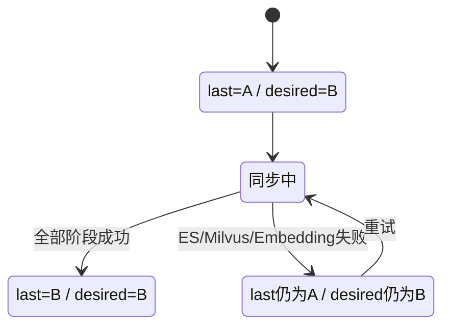

Plan 的失败语义也是：GitLab、解析、Embedding、ES 或 Milvus 任一失败，正式知识版本保持不变。

------

## 十三、为什么失败后可以安全重试

因为：

```text
last_synced_sha
```

没有提前推进。

下一次任务仍然知道正确起点：

```text
A
```

正确目标仍然是：

```text
B
```

所以可以重新执行：

```text
A → B
```

如果提前把 `last_synced_sha` 写成 B，就会出现：

```text
数据库认为已经同步 B
Milvus 实际仍然只有 A
```

下次系统看到：

```text
last_synced_sha = B
desired_sha = B
```

就会误以为无需处理，从而永久漏掉数据。

------

## 十四、Worker 崩溃时怎么办

假设 Worker 1 领取了 A → B：

```text
status = running
worker_id = worker-1
lease_expires_at = 12:05
```

Worker 每 60 秒发送心跳，延长租约。

如果 Worker 1 在 12:02 崩溃：

```text
心跳停止
```

到 12:05 后，其他 Worker 可以判断：

```text
租约已经过期
```

然后重新领取任务。

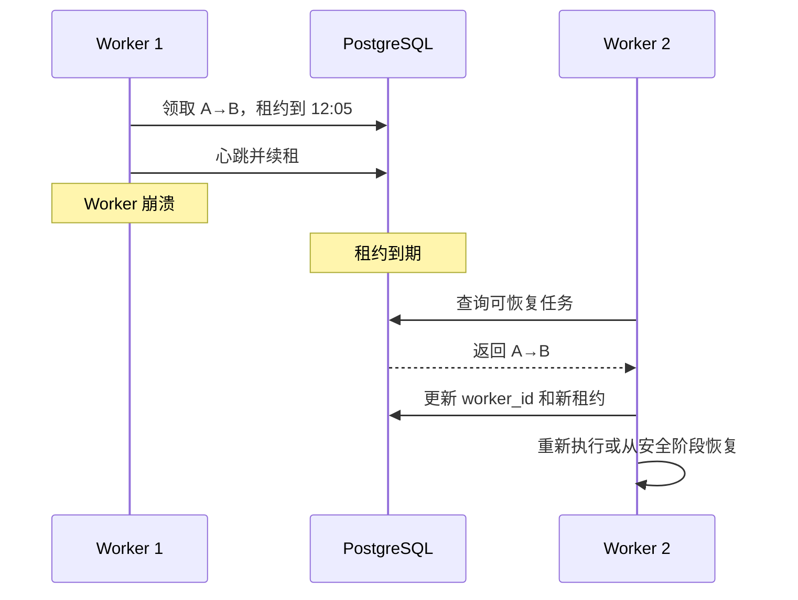

由于正式发布指针尚未切换，旧版本仍然可用。

------

## 十五、两个 Worker 为什么不会同时处理同一个任务

Plan 复用：

```sql
FOR UPDATE SKIP LOCKED
```

假设有两个任务：

```text
Job 1：development A → B
Job 2：art X → Y
```

Worker 1 锁定 Job 1。

Worker 2 查询任务时：

```text
Job 1 已锁定
→ 跳过
→ 领取 Job 2
```

但是除了任务行锁，还需要保证：

```text
同一 Source 只能有一个活动任务
```

否则可能出现：

```text
development A → B
development B → C
```

被两个 Worker 同时执行。

所以 Plan 同时使用：

- 任务行锁；
- Source 级串行约束；
- 活动任务唯一规则；
- 租约。

------

## 十六、Webhook 丢失时怎么办

假设 GitLab 从 A Push 到 B，但由于网络故障，Webhook 没有成功到达 RAG。

数据库仍然是：

```text
last_synced_sha = A
desired_sha = A
```

但 GitLab 实际：

```text
main = B
```

如果系统完全依赖 Webhook，这次更新就永久丢失了。

因此 Worker 空闲时每隔一段时间执行对账：

```text
查询 GitLab main 当前 SHA
```

发现：

```text
GitLab main = B
last_synced_sha = A
```

于是补充：

~~~
desired_sha = B
创建 A → B 任务
~~~

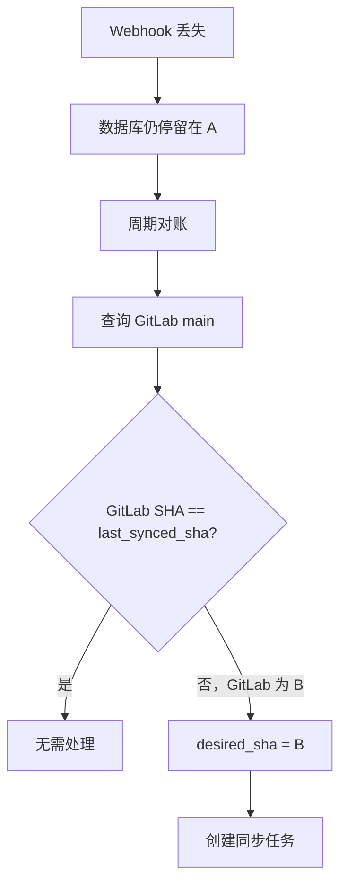

因此：

```text
Webhook
→ 提供及时性

周期对账
→ 提供最终可靠性
```

------

## 十七、为什么不能直接相信 Webhook 的 `after`

Webhook 中的 `after` 通常表示 Push 后的目标 SHA，但 Worker 执行时仍要重新查询 GitLab。

原因包括：

- Webhook 可能乱序；
- 后续可能已经有新 Push；
- Force Push 可能改变历史；
- Webhook Payload 可能来自错误 Project；
- 任务可能隔了一段时间才执行。

Webhook 的职责是：

```text
提供一个新的候选目标
```

Worker 执行时应重新核对：

```text
Source 的 Project ID
目标 Branch
当前 main HEAD
数据库 last_synced_sha
desired_sha
```

但已经创建并启动的任务仍固定使用它自己的 `target_sha`。

------

## 十八、Force Push 时这套机制如何处理

正常 Git 历史：

```text
A → B → C
```

此时 A 是 C 的祖先，可以直接 Compare A → C。

Force Push 后可能变成：

```text
旧历史：
A → B → C

新 main：
A → X → Y
```

如果 `last_synced_sha = C`，而 `desired_sha = Y`，C 并不是 Y 的祖先。

这时普通增量 Compare 可能无法可靠表达“当前完整仓库应该是什么”。

Plan 的处理方式是：

~~~
检测到非祖先、Force Push、Compare 超时或结果不完整
→ 放弃普通增量
→ 使用 Archive 做全量对账
~~~

```mermaid
flowchart TD
    A[last_synced_sha = C] --> B[desired_sha = Y]
    B --> C[检查 Commit 关系]
    C --> D{C 是 Y 的祖先吗?}
    D -->|是| E[Compare C→Y]
    D -->|否| F[Archive 全量对账]
```

这再次体现：

```text
增量同步
→ 优先效率

Archive 对账
→ 兜底正确性
```

------

## 十九、一个完整的 Worker 判断流程

Worker 领取任务后，大致可以按照下面思路执行：

```python
async def run_sync(source_id: int) -> None:
    source = await repository.get_source_for_update(
        source_id
    )

    base_sha = source.last_synced_sha
    target_sha = source.desired_sha

    if target_sha is None:
        return

    if base_sha == target_sha:
        return

    job = await repository.get_or_create_job(
        source_id=source_id,
        base_sha=base_sha,
        target_sha=target_sha,
    )

    if base_sha is None:
        await run_full_sync(job)
    elif await can_compare_safely(
        base_sha,
        target_sha,
    ):
        await run_incremental_sync(job)
    else:
        await run_full_reconcile(job)

    await publish_new_version(job)

    await repository.mark_success(
        job_id=job.id,
        last_synced_sha=target_sha,
    )
```

它表达的核心不是具体代码，而是判断顺序：

```text
1. 读取已经发布到哪里
2. 读取希望追赶到哪里
3. 相同则无需同步
4. 不同则创建固定 target_sha 任务
5. 能安全 Compare 就增量
6. 不能安全 Compare 就全量
7. 发布成功后才推进 last_synced_sha
```

------

## 二十、你可以把整个机制理解成“追赶模型”

GitLab 是前方不断前进的列车：

```text
main HEAD
```

RAG 知识库是后方正在追赶的位置：

```text
last_synced_sha
```

`desired_sha` 是系统最后一次确认的前方位置：

我们目前需要追到这里

```mermaid

flowchart LR
    A["RAG 已发布位置<br/>last_synced_sha=A"] --> B["待同步区间"]
    B --> C["系统目标<br/>desired_sha=D"]
    C --> D["GitLab main HEAD=D"]
```

如果 GitLab 又前进到 E：

```text
desired_sha = E
```

正在追赶 D 的任务不必立刻改变路线；它可以先完成 D，然后继续追 E。

------

## 二十一、最容易混淆的几个结论

### Webhook 到达不等于文档已经同步

Webhook 到达只说明：

```text
系统知道 GitLab 变了
```

不代表：

```text
新文档已经可以被 RAG 检索
```

------

### `desired_sha` 不等于正式知识版本

```text
desired_sha = C
```

只说明系统想追到 C。

正式知识可能仍是：

```text
last_synced_sha = A
```

------

### 任务成功不只是文件下载成功

只有：

```text
下载
解析
Chunk
Embedding
ES
Milvus
验证
publication_version 切换
```

全部完成，任务才算成功。

------

### 当前运行任务的 `target_sha` 不能随新 Webhook 改变

新 Webhook 只更新 Source 的 `desired_sha`。

当前任务仍然处理自己固定的目标快照。

------

### `last_synced_sha` 是发布检查点，不是处理进度

不要在每处理一个文件后修改它。

它只能在整批知识版本发布成功后一次性推进。

------

## 二十二、本模块最终需要形成的认识

```text
last_synced_sha
→ 当前已经正式发布并可被 RAG 使用的 GitLab Commit

desired_sha
→ 系统目前最终希望追赶到的 GitLab Commit

Webhook
→ 发现 main 变化并更新 desired_sha

Webhook Delivery
→ 记录和去重一次 GitLab 通知

Sync Job
→ 将一个确定的 base_sha 同步到固定 target_sha

Worker
→ 执行下载、解析、索引和发布

周期对账
→ 在 Webhook 丢失时重新发现 GitLab main 变化
```

完整协作流程是：

```mermaid
flowchart TD
    A[GitLab main 产生新 Commit] --> B[Push Webhook]
    B --> C[验证并记录 Delivery]
    C --> D[更新 desired_sha]
    D --> E[创建固定 target_sha 同步任务]
    E --> F[Worker 领取任务]
    F --> G{可以安全增量吗}

    G -->|可以| H[Compare + Raw File]
    G -->|不可以| I[Archive 全量对账]

    H --> J[解析、Chunk、Embedding]
    I --> J

    J --> K[写入新知识版本]
    K --> L{全部验证成功?}

    L -->|否| M[last_synced_sha 不变]
    L -->|是| N[切换 publication_version]
    N --> O[更新 last_synced_sha]

    O --> P{last_synced_sha = desired_sha?}
    P -->|是| Q[追赶完成]
    P -->|否| E
```

下一步最适合深入的是：

> **Archive 全量同步与 Compare 增量同步的详细执行过程：Manifest 怎么生成，文件新增、修改、删除和重命名如何转化为 RAG 操作。**
