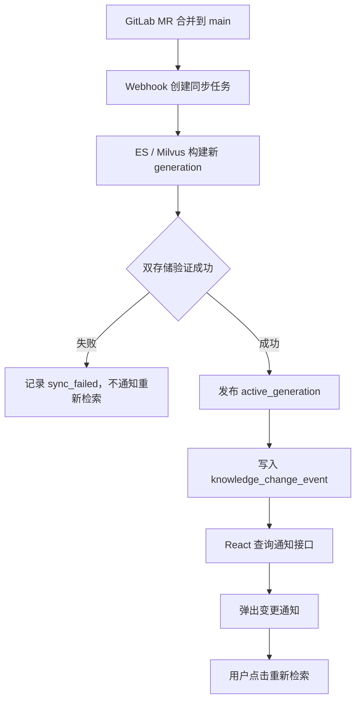
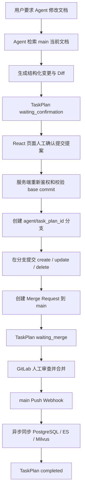

# Gitlab接入设计方案：

# 1、用户类别划分：

GitLab 的权限边界主要是：

```
Instance
→ Group / Subgroup
→ Project
→ Repository
```

它没有提供“同一 Repository 中，用户 A 能读 `art/a.md`，但不能读 `development/b.md`”这种文件级读取 ACL。

`CODEOWNERS` 只能决定谁负责审核、谁应当批准文件修改，不能限制文件读取。[GitLab Code Owners](https://docs.gitlab.com/user/project/codeowners/)

而且 Reporter 已经可以查看项目代码，Developer 还可以推送非保护分支。[GitLab Roles and permissions](https://docs.gitlab.com/user/permissions/)

因此，目前的 `rag-reader` 虽然叫“只读”，但它能够读取 `rag-knowledge-docs` Repository 中的所有文档。

## 必须先纠正一个权限公式

当用户同时能访问 GitLab 和 RAG 系统时，真实权限不是两边取交集，而是：

```
用户最终能够获得文档
= GitLab 可以读取
  或
  RAG 可以检索
```

因为即使 RAG 拒绝了某篇文档，用户仍可以绕过 RAG，直接去 GitLab 打开或克隆文件。

所以：

> GitLab Project 中最敏感文档的权限，决定了整个 Repository 可以分配给哪些用户。

## 当前工程比 GitLab更细的地方

当前 `.permission-rules.json` 已经按路径划分了四种文档范围：

- `public/`
- `art/`
- `development/`
- `product_planning/`

对应规则见 [.permission-rules.json](D:/AI_Agent_Project/AI_Python_Project/python-agent-study/docs/knowledge-base-acl-test/.permission-rules.json)。

而且系统还支持：

- `visibility=public`
- `allowed_departments`
- `allowed_users`
- 单篇文档 `.meta.json` 覆盖

这些权限不是检索后过滤，而是在 Elasticsearch 和 Milvus 召回阶段直接下推：

- [elasticsearch_keyword_retriever.py (line 72)](D:/AI_Agent_Project/AI_Python_Project/python-agent-study/src/fast_app/components/retrievers/elasticsearch_keyword_retriever.py:72)
- [milvus_vector_retriever.py (line 86)](D:/AI_Agent_Project/AI_Python_Project/python-agent-study/src/fast_app/components/retrievers/milvus_vector_retriever.py:86)

所以现有 RAG 权限必须保留，不能被 GitLab 权限替换。

## 推荐方案：两类用户、两层权限

### 1. GitLab 只面向资产管理者

可以访问 GitLab 的人：

- 文档管理员
- 部门文档编辑者
- 审核者
- GitLab 同步机器人

普通知识库使用者：

- 不分配 GitLab Repository 权限
- 只通过 React/RAG 接口查询文档
- 继续使用当前 `department_codes`、`allowed_users` 控制单篇文档

这样 GitLab 负责：

```
原始文件
版本历史
Branch
Commit
Merge Request
文档审核
```

RAG 系统负责：

```
用户查询
部门权限
单篇文档授权
检索过滤
回答生成
```

这是最推荐的企业方案。

### 2. GitLab Project 按“安全边界”拆分

如果不同部门的普通员工也必须进入 GitLab 浏览原始文件，就不能把所有部门文档放在同一 Project。

建议调整为：

```
rag-kb-dev
├── rag-public-docs
├── rag-art-docs
├── rag-development-docs
└── rag-product-planning-docs
```

权限示例：

| Project                     | GitLab 成员            |
| --------------------------- | ---------------------- |
| `rag-art-docs`              | 美术部门编辑者、审核者 |
| `rag-development-docs`      | 开发部门编辑者、审核者 |
| `rag-product-planning-docs` | 产品策划编辑者、审核者 |
| `rag-public-docs`           | 需要维护公共知识的人   |

注意：这里的 `public` 是“RAG 用户都能检索”，不代表 GitLab Project 必须设置成公网 `Public`。公司内部资产项目仍建议保持 `Private`。

如果某个部门未来有多个资产项目，再引入 Department Subgroup；现在一个部门一个 Project 就够了。

## 单篇文档例外怎么处理

假设开发部门 Project 中有一篇只有 `user_001` 可以看的文档。

有两种情况。

### 仅通过 RAG 使用

可以继续放在原 Project：

```
{
  "visibility": "restricted",
  "allowed_users": ["user_001"]
}
```

前提是普通开发用户没有这个 GitLab Project 的读取权限，只有资产管理员和同步机器人可以进入 GitLab。

### 用户也能进入 GitLab

必须把这篇文档放到单独的受限 Project，例如：

```
rag-development-docs
rag-development-confidential-docs
```

否则 GitLab 无法阻止其他 Project 成员直接打开文件。

## 不推荐的方案

### 一篇文档一个 Project

权限最精细，但会产生大量：

- Project
- 成员配置
- Webhook
- Access Token
- 同步检查点
- 运维和审计工作

除非文档数量极少且每篇都属于独立安全资产，否则不推荐。

### 单文件加密

虽然可以在 GitLab 中保存加密文件，但会破坏：

- GitLab 网页预览
- Diff
- 文档搜索
- RAG 自动解析
- 普通编辑流程

还会引入密钥管理问题，不值得。

### 使用 CODEOWNERS

CODEOWNERS 是“谁审核修改”，不是“谁能读取”。不能解决当前问题。

## 对当前 GitLab 配置的建议

目前三个账号都是 `rag-kb-dev` Group 成员，所以会继承该 Group 下所有项目的权限。GitLab 官方也明确说明，Group 成员会获得其中所有 Project 的访问权。[GitLab Groups](https://docs.gitlab.com/user/group/)、[Project membership inheritance](https://docs.gitlab.com/user/project/members/)

正式设计时建议：

```
rag-kb-dev Group
    只保留：
    - tgg / 系统管理员
    - GitLab 同步机器人

rag-editor
    从顶层 Group 移除
    按实际部门添加到具体 Project

rag-reader
    从顶层 Group 移除
    如果只是 RAG 使用者，则不分配任何 GitLab Project 权限
```

## 最终推荐

采用下面的组合：

```
GitLab Project
    控制原始资产的粗粒度安全边界

现有 .permission-rules.json / sidecar
    控制 RAG 部门级和单文档权限

普通用户
    只通过 React/RAG 使用知识库

文档管理员和编辑者
    通过 GitLab Branch + Merge Request 管理原始文件
```

第一步应当先把当前单个 `rag-knowledge-docs` 按 `art`、`development`、`product_planning`、`public` 四个安全边界拆成四个私有 Project，并把 `rag-editor`、`rag-reader` 从顶层 Group 权限中移除。此轮没有执行这些权限变更。

# 2、文档同步策略

~~~
Gitlab中的文档被修改后，什么时候同步到RAG系统中？
此时如果系统正在被使用检索功能，正在搜索数据库chunk，应该如何更新文档？确保数据实时性？

能否实现一个通知接口，如果Gitlab推送了新的文档请求，react前端访问这个接口，响应哪个文档被更新，或者新增了哪些文档，弹出通知提示用户，由用户自己判断是否需要重新进行检索操作
~~~

建议新增独立的“知识库变更通知”接口。但要注意通知时机：

- MR 刚创建：只是变更提案，只通知审核人员。
- MR 合并、RAG 新版本发布成功：通知普通检索用户“哪些文档已经变化，可以重新检索”。
- 不应在原始 Webhook 刚到达、索引尚未更新时就提示重新检索，否则用户重新执行仍可能得到旧内容。

## 推荐的最小方案：REST 轮询通知

React 每隔 5～10 秒请求：

```
GET /knowledge/change-notifications?after_event_id=1024&limit=50
Authorization: Bearer <token>
```

响应示例：

```
{
  "events": [
    {
      "event_id": 1025,
      "event_type": "knowledge_published",
      "project_id": 37,
      "project_name": "rag-product-planning-docs",
      "generation": 42,
      "commit_sha": "a81f9d...",
      "changes": [
        {
          "change_type": "modified",
          "doc_id": "doc_requirement_001",
          "title": "支付需求说明",
          "source_path": "product_planning/payment.md"
        },
        {
          "change_type": "added",
          "doc_id": "doc_requirement_002",
          "title": "退款流程说明",
          "source_path": "product_planning/refund.md"
        }
      ],
      "published_at": "2026-07-24T16:30:00+08:00"
    }
  ],
  "next_after_event_id": 1025
}
```

React 保存 `next_after_event_id`，下一次只查询新事件，不会重复弹窗。

## 事件产生链路



通知记录应当在新 generation 发布成功后创建，而不是直接由 Webhook 创建。

## React 可以判断当前答案是否受影响

当前 RAG 响应已经返回 `sources`，但 [RagSource (line 113)](D:/AI_Agent_Project/AI_Python_Project/python-agent-study/src/fast_app/schemas/rag_chat_schema.py:113) 的顶层 `id` 是 Chunk ID，`doc_id` 还在 `metadata` 中。

企业化改造时建议把这些字段提升为稳定字段：

```
{
  "doc_id": "doc_requirement_001",
  "chunk_id": "chunk_001",
  "generation": 41,
  "git_commit_sha": "old-sha"
}
```

React 保存当前答案引用的 `doc_id`，收到通知后计算交集：

```
当前答案 sources doc_id
∩
通知 affected doc_id
```

处理方式：

- 存在交集：红色高优先级通知。
- 没有交集但新增了文档：普通通知，因为新文档也可能改变检索结果。
- 只是其他无关 Project 更新：不提示或者只显示通知中心角标。

示例提示：

```
你当前回答引用的《支付需求说明》已经更新。

更新类型：修改
新版本：generation 42
发布时间：16:30

[使用最新文档重新检索] [稍后处理]
```

## “重新检索”按钮需要携带版本要求

用户点击后，不应只是原样重新请求。建议携带通知中的 generation：

```
{
  "query": "支付需求中的退款规则是什么？",
  "minimum_knowledge_generation": 42
}
```

后端必须保证：

```
active_generation >= 42
```

否则返回“知识库仍在更新”，避免用户点击重新检索后再次得到旧版本。

这个字段只是新鲜度约束，不能让前端传递部门或用户权限范围。

## 通知也必须经过权限过滤

不能把全部 GitLab文档变更广播给所有用户。

通知接口应复用当前 `CurrentUserContext` 权限范围：

- 公共文档：允许访问公共知识库的用户可见。
- 部门文档：只有对应部门用户可见。
- 用户级文档：只有显式授权用户可见。
- 管理员：可以查看全部事件。
- 无权访问的文档：连标题和路径也不能出现在响应中。

通知记录可以只保存一份，查询时根据当前服务端权限过滤，不需要为每个用户复制一份通知。

## 建议区分三种事件

| 事件                    | 接收人               | React 行为                           |
| ----------------------- | -------------------- | ------------------------------------ |
| `change_proposed`       | 审核人员、编辑人员   | 提示存在新 MR，不提示重新检索        |
| `knowledge_published`   | 有文档访问权限的用户 | 提示新增、修改、删除，可重新检索     |
| `knowledge_sync_failed` | 管理员、运维人员     | 提示同步失败，普通用户继续使用旧版本 |

普通用户最关心的是 `knowledge_published`。

## 是否需要 SSE

第一阶段推荐 REST 轮询，因为：

- 实现简单。
- Bearer Token 使用自然。
- 前端刷新或断线后不会丢通知。
- 不需要立即引入跨 FastAPI 实例的实时消息分发。
- 5～10 秒延迟通常足够。

如果以后需要秒级通知，再复用同一数据模型增加：

```
GET /knowledge/change-notifications/stream
```

使用 SSE 推送实时事件；断线重连后再通过 REST 补查遗漏事件。这个通知流应独立于 `POST /rag/chat/stream/events`，因为聊天流在一次回答结束后就会关闭。

## 方案边界

这个通知功能可以让普通文档采用：

> 系统提示变化，由用户决定是否重新检索。

但对于需求、制度、权限、合规等关键文档，不建议完全依赖用户判断。用户可能忽略弹窗，因此仍应保留上一轮讨论的强一致策略：发现 generation 变化后自动作废旧回答。

推荐组合：

- 普通文档：通知 + 用户主动重新检索。
- 关键文档：后端强制重新检索 + 前端通知原因。
- MR 未合并：只通知审核人员。
- main 已发布：才通知检索用户。

本轮只完成方案设计，没有修改代码。

# 3、Agent操作文档的能力应该如何修改？

接入 GitLab 后，Agent 的定位应该从：

> 文档执行者

改成：

> 文档变更提议者

**Agent 只能在临时分支创建提交并发起 Merge Request**，不能直接修改 `main`，也不能在创建 MR 时立即修改 ES/Milvus。只有人工将 MR 合并到 `main` 后，GitLab Webhook 才触发 RAG 同步。

## 当前链路需要改变的地方

现在的真实链路是：

```
POST /agent/task-plans/{task_plan_id}/confirm
→ DocumentTaskExecutor.confirm()
→ KnowledgeDocumentManagementService.execute_confirmed_actions()
→ 本地文件 write_text() / unlink()
→ 直接替换或删除 ES、Milvus Chunk
```

关键位置：

- [确认接口 (line 184)](D:/AI_Agent_Project/AI_Python_Project/python-agent-study/src/fast_app/api/agent_task_plan_routes.py:184)
- [确认后调用文档 Service (line 1259)](D:/AI_Agent_Project/AI_Python_Project/python-agent-study/src/fast_app/services/agent_tasks/document_task_executor.py:1259)
- [当前批量真实执行入口 (line 168)](D:/AI_Agent_Project/AI_Python_Project/python-agent-study/src/fast_app/services/knowledge/knowledge_document_management_service.py:168)
- [当前直接修改文件的位置 (line 285)](D:/AI_Agent_Project/AI_Python_Project/python-agent-study/src/fast_app/services/knowledge/knowledge_document_management_service.py:285)
- [当前直接同步索引的位置 (line 310)](D:/AI_Agent_Project/AI_Python_Project/python-agent-study/src/fast_app/services/knowledge/knowledge_document_management_service.py:310)

其中最后两步需要被替换。

## 改造后的链路



这里存在两层确认：

1. RAG 系统确认：允许 Agent 创建分支和 MR。
2. GitLab 合并确认：允许变更进入 `main` 并影响正式知识库。

第一层不能代替第二层。

## 哪些现有能力可以保留

下面这些不需要推翻：

- Agent intent Router。
- 文档候选检索和 `doc_id` 范围限制。
- TaskPlan 和 dry-run。
- Diff 预览。
- `before_hash` 乐观锁。
- 当前用户权限二次校验。
- Agent Tool 审计。
- `POST /agent/task-plans/{task_plan_id}/confirm` 独立确认接口。

但确认接口的语义需要变成：

> 确认创建 GitLab 变更提案

而不是：

> 确认直接修改正式文档和检索索引

## 确认后应该执行什么

`execute_confirmed_actions()` 不再调用 `_apply_prepared_mutation()`，而是完成以下操作：

1. 根据部门和文档路径，由服务端确定目标 GitLab Project。
2. 获取 `main` 最新 commit SHA 和目标文件 blob SHA。
3. 比较 TaskPlan 保存的 `base_commit_sha`，防止用户确认期间文档已经变化。
4. 从这个 SHA 创建分支：

```
agent/{task_plan_id}
```

1. 使用 GitLab Commits API，将一批 create/update/delete 动作提交成一个 commit。
2. 创建目标为 `main` 的 Merge Request。
3. 保存：

```
gitlab_project_id
source_branch
target_branch
base_commit_sha
head_commit_sha
merge_request_iid
merge_request_url
merge_status
```

GitLab 的 Commits API 原生支持在新分支上批量执行 `create`、`update`、`delete` 等文件动作，不需要先在服务器维护一个可写 Git 工作区。[GitLab Commits API](https://docs.gitlab.com/api/commits/)
MR 可以通过 API 指定 source branch 和 target branch 创建。[GitLab Merge Requests API](https://docs.gitlab.com/api/merge_requests/)

## 三类文档操作的变化

| Agent 操作 | 用户确认后            | MR 合并后                                          |
| ---------- | --------------------- | -------------------------------------------------- |
| Create     | 分支新增文件并创建 MR | main 出现文件，Webhook 新增 RAG 文档               |
| Update     | 分支修改文件并创建 MR | main 更新文件，Webhook 增量更新 Chunk              |
| Delete     | 分支删除文件并创建 MR | main 删除文件，Webhook关闭文档版本并延迟清理 Chunk |

MR 被关闭或拒绝时，正式 RAG 数据完全不变。

## GitLab 权限必须形成硬隔离

建议创建独立的 Agent 项目令牌或 Bot，不要复用 `root`、`tgg` 或普通员工账号。

Agent Bot：

```
Project role: Developer
Token scope: api
```

它只能：

- 读取目标项目。
- 创建 `agent/*` 分支。
- 在该分支提交。
- 创建 Merge Request。

它不能：

- 直接 push `main`。
- 合并 MR。
- 修改分支保护规则。
- 访问未授权的其他 Project。

GitLab Self-Managed 的 Project Access Token 支持项目级隔离，并会创建对应 Bot 用户。[GitLab Project Access Tokens](https://docs.gitlab.com/user/project/settings/project_access_tokens/)

每个文档 Project 建议使用独立 Token，避免一个 Token 泄漏后影响四个安全边界。

## `main` 分支保护配置

四个文档 Project 都应配置：

```
Branch: main
Allowed to merge: Maintainers
Allowed to push and merge: No one
Force push: Disabled
```

注意必须把 `Allowed to push and merge` 明确设置为 `No one`，不能只留空。GitLab 官方文档明确区分了“未配置”和“No one”。[GitLab Protected Branches](https://docs.gitlab.com/user/project/repository/branches/protected/)

可选地再保护：

```
Branch pattern: agent/*
Allowed to push and merge: Developers + Maintainers
Force push: Disabled
```

不要配置允许 Developer push 的宽泛 `*` 规则，因为 GitLab 多条分支规则冲突时通常采用更宽松的权限，可能意外放开 `main`。[GitLab Protection Rules](https://docs.gitlab.com/user/project/repository/branches/protection_rules/)

## GitLab CE 的实际审批边界

当前本地是 GitLab CE，因此可以可靠使用：

- Protected Branch。
- Developer 创建分支和 MR。
- Maintainer 才能合并到 `main`。
- Agent Bot 无法自行合并。

但是强制 Code Owner 审批、多审批人规则属于更高 GitLab 版本能力。CE 阶段最可靠的强制边界是：

> Bot 只有 Developer，只有人工 Maintainer 能点击合并。

以后公司 GitLab 如果具有 Premium/Ultimate，再增加 Code Owner 和强制审批规则。[GitLab Merge Request Approvals](https://docs.gitlab.com/administration/merge_requests_approvals/)

## RAG 同步只能监听 `main`

不能监听 Agent 分支的 Push，否则 MR 尚未审查，文档就进入正式知识库。

建议：

- Merge Request Webhook：更新 TaskPlan 的 `waiting_merge/merged/closed` 状态。
- `main` Push Webhook：真正创建 RAG 同步任务。
- 同步任务使用 `project_id + after_commit_sha` 做幂等键。
- 只接受 `refs/heads/main`。
- Webhook 的 `before/after` SHA 用来获取完整 Git Diff。
- 同步成功后才把 TaskPlan 标记为 `completed`。

GitLab Webhook能够提供 Push 和 MR 的 merged/closed 等事件。[GitLab Webhook Events](https://docs.gitlab.com/user/project/integrations/webhook_events/)

## TaskPlan 状态建议

最小只需要增加一个状态：

```
waiting_confirmation
→ running
→ waiting_merge
→ running
→ completed
```

异常分支：

```
MR closed       → cancelled
MR merge conflict → waiting_merge + error
RAG sync failed → failed，可重试同步
```

React 页面在 `waiting_merge` 时展示：

- MR 标题。
- 修改文件列表。
- Diff。
- GitLab MR 链接。
- 当前合并状态。
- RAG 同步状态。

## 最重要的职责边界

```
Agent：
生成内容、生成 Diff、创建分支、提交 MR

GitLab：
保存正式文档、保护 main、承载审查和合并

Webhook 同步服务：
只把 main 的已合并状态同步到 RAG

PostgreSQL：
保存 TaskPlan、MR、同步任务和发布版本状态

ES / Milvus：
只保存已经进入 main 的可检索版本
```

因此，接入 GitLab 后应删除 Agent 确认链路中的“直接写正式文件、直接更新索引”语义。确认操作到“MR 已创建”为止；只有 `main` Webhook 才能触发正式 RAG 发布。本轮没有修改代码或 GitLab配置。

# 4、是否需要引入任务队列？

~~~
这个系统部署到企业服务器后，可能会有3-4个人同时提交文档，如果不引入rabbitmq，沿用目前的Worker机制，系统能不能承受？
~~~

## 结论

能承受。对于企业服务器上 **3～4 人同时提交文档** 的规模，RabbitMQ 没有必要，沿用当前“PostgreSQL 持久化队列 + 独立 Worker 进程”足够。

但要区分两个结论：

- **系统不会卡住或丢任务**：现有队列机制可以做到。
- **所有文档能多快完成索引**：取决于文档大小、解析耗时、Embedding 服务以及 ES/Milvus 性能，需要压测确认。

## 当前机制如何处理4个并发任务

假设同时提交4份文档：

```
PostgreSQL Queue
├── Job A：pending
├── Job B：pending
├── Job C：pending
└── Job D：pending
```

如果只启动一个 Worker：

```
Worker 1：A → B → C → D
```

系统仍然安全，只是后面的任务需要排队。

如果启动两个 Worker 进程：

```
Worker 1：A → C
Worker 2：B → D
```

当前 [import_jobs.py (line 297)](D:/AI_Agent_Project/AI_Python_Project/python-agent-study/src/fast_app/ingestion/import_jobs.py:297) 使用 `FOR UPDATE SKIP LOCKED` 领取任务，两个 Worker 不会领取同一条任务。

## 推荐部署配置

初始部署建议：

```
FastAPI：2～4 个 API Worker
Ingestion Worker：2 个独立进程
单个 Ingestion Worker：一次处理1个任务
总文档处理并发：2
```

不要一开始就启动4～8个 ingestion Worker。文档解析、Embedding 和 Milvus 写入可能争抢：

- CPU和内存
- Embedding API并发额度
- Elasticsearch连接
- Milvus写入能力
- 数据库连接池

从2个 Worker 开始，压测后再增加，是最稳妥的配置。

## RabbitMQ现在解决不了核心瓶颈

RabbitMQ主要改善的是任务消息的分发能力，但不会让下面这些操作自动变快：

- PDF、PPT、Excel解析
- Chunk生成
- Embedding调用
- Elasticsearch写入
- Milvus向量写入

3～4个用户产生的任务量，对PostgreSQL队列表非常小。此时增加RabbitMQ只会额外引入：

- RabbitMQ服务器部署与监控
- Celery等任务框架
- 消息确认和重试语义
- 数据库任务状态与消息状态的一致性问题
- 新的故障点

## GitLab接入还需要补充的部分

现有 Worker 机制可以复用，但现有任务模型主要为用户上传 Office 文档设计。GitLab接入仍需补充：

1. **GitLab Push去重，避免同一提交被重复处理。**
2. `added/modified/deleted` 三种操作。
3. 同一 GitLab Project 的提交串行处理。
4. 不同 Project 可以并行处理。
5. 一次提交的多份文档作为一个 Generation 统一发布。
6. Worker失败后的租约回收和有限重试。

这些都可以继续使用PostgreSQL实现，不需要RabbitMQ。

## 需要重点防止的情况

假设同一个 Project 连续提交：

```
Commit A：修改 demand.md
Commit B：再次修改 demand.md
Commit C：删除 demand.md
```

不能让两个 Worker 同时乱序处理 A、B、C。推荐：

```
同一个 Project：串行同步
不同 Project：允许并行
```

如果 A 还在运行时又收到 B、C，只记录最新的 `desired_sha`。A结束后直接从当前 `active_sha` 同步到最新提交，避免处理已经过时的中间版本。

## 上线前最小压测标准

用4个并发提交进行验证：

- Webhook都能快速返回 `202 Accepted`。
- 4个任务全部进入数据库队列。
- 两个 Worker各自领取不同任务。
- Worker异常退出后任务能被重新领取。
- 没有重复 Chunk。
- 同一 Project 的提交没有乱序。
- 检索接口在导入期间仍能正常响应。
- CPU、内存、ES和Milvus没有持续饱和。
- 所有文档最终进入 `succeeded` 或明确的 `failed` 状态。

因此，当前规模直接使用 **PostgreSQL任务队列 + 2个独立Worker进程** 就够了。等出现几十个持续并发任务、跨服务器任务路由或队列隔离需求时，再评估RabbitMQ。


# 5、具体方案：

1.用户类别划分：当前系统分为两类用户，分别是“资产管理者”和“普通知识库使用者”。“资产管理者”分配给每个部门的主管（分配Maintainer角色，能够直接push到main保护分支） 和 小组组长（分配Developer角色，在本地创建分支，不能直接push到main分支，通过MR的方式提交，由Maintainer审核），能够使用Gitlab。“普通知识库使用者”只能使用RAG知识库系统进行检索和文档操作，目前Agent调用的tool还没有实现根据不同账户权限分配，暂时放后，先接入Gitlab模块。

2.工程中实现独立模块 Gitlab Client，专门负责与Gitlab交互的相关逻辑，尽可能不影响目前工程中的其他功能模块，避免和其他模块的耦合。文档解析模块复用工程中现有的功能。不同功能采用子模块的架构实现，不要把所有逻辑混合在一个模块，根据职责划分模块。例如`GitLabClient`负责和 GitLab HTTP API 通信；`GitLabProjectSource`负责把 GitLab 的概念转换成统一数据源概念。`GitDocumentSyncService`负责组织一次完整同步。我只是提供了示例，具体的模块划分由你根据目前工程结构设计。

3.你的实现方案中需要描述全量同步，增量同步的实现方案，可以使用混合架构 Archive 完成全量同步 + REST API 完成增量同步；如果你有更合适的方案，必须向我提出建议。需要描述当前后端系统访问Gitlab时要使用的的认证方式。需要描述Gitlab分页的处理方案。

4.目前工程中Agent操作文档的能力需要修改，**Agent 只能在临时分支创建提交并发起 Merge Request**，不能直接修改 `main`，也不能在创建 MR 时立即修改 ES/Milvus。只有人工将 MR 合并到 `main` 后，GitLab Webhook 才触发 RAG 同步，不要复用 `root`、`tgg` 或普通员工账号

5.Gitlab接入成功后，允许你清空现有数据库（ES，milvus，PostgreSQL中的数据），验证Gitlab功能是否正确接入当前系统
