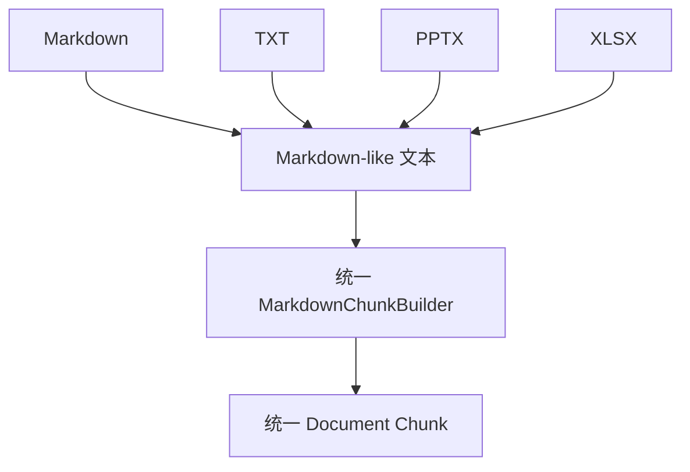
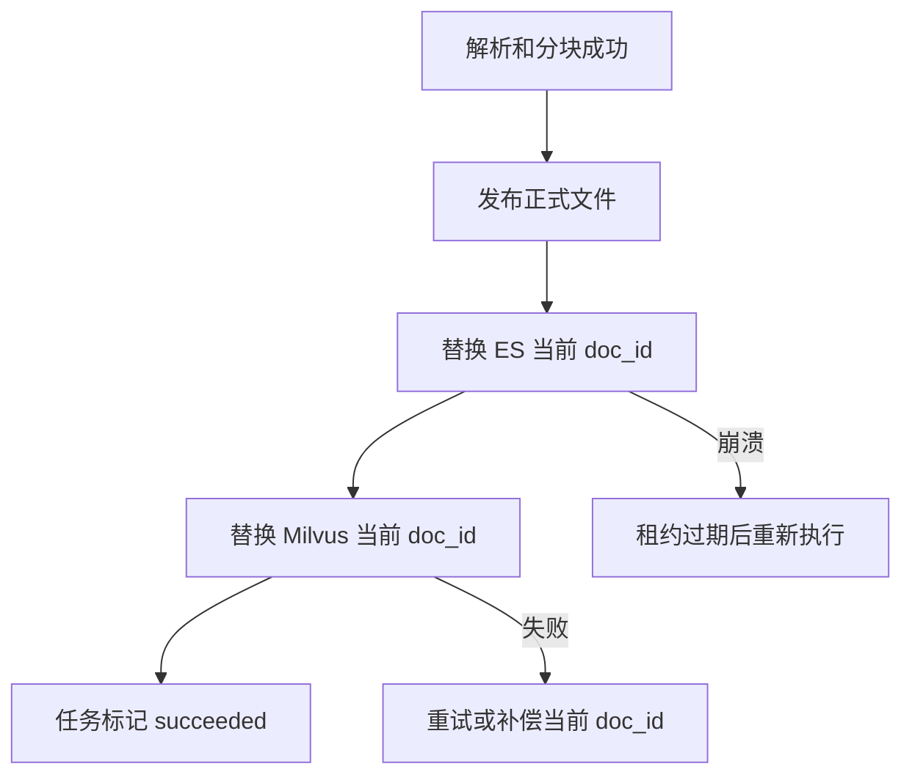
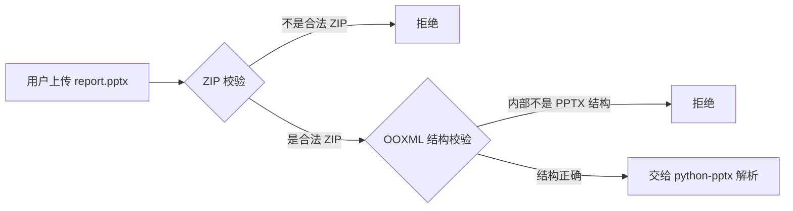
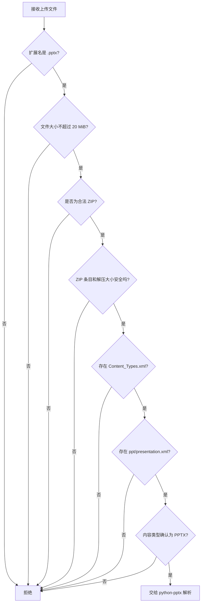
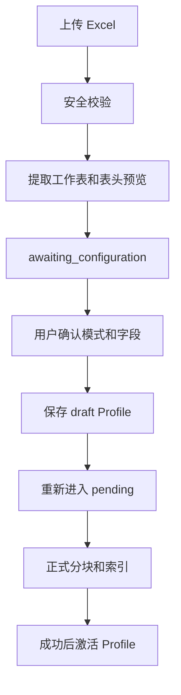
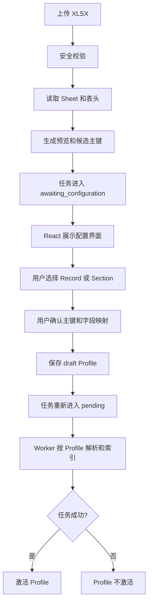

# 【方案-旧】PPTX / XLSX 异步导入与检索实施计划

## 方案摘要

复用现有 Loader、`MarkdownChunkBuilder`、稳定 `doc_id/chunk_id` 和 `replace_docs_rag_stores()`：

- `.pptx` 使用 `python-pptx==1.0.2`
- `.xlsx` 使用 `openpyxl==3.1.5`
- XML 防护使用 `defusedxml==0.7.1`
- PostgreSQL 保存导入任务，独立 Worker 执行
- 不引入 MarkItDown、Unstructured、Celery、RabbitMQ、OCR
- PPTX/XLSX 只支持导入检索，不加入 Agent 文件创建或修改能力

## 核心实现

### 1. PPTX Loader

新增 `PowerPointDocumentLoader`，每个文件生成一个 `LoadedDocument`。

处理规则：

- 每页生成 `Slide {n}: {title}` section。
- 同级 Shape 按 `(top, left)` 排序。
- 遇到 `MSO_SHAPE_TYPE.GROUP` 时递归遍历 `group_shape.shapes`；每一级分别排序，确保嵌套组合图形中的文本和表格不会丢失。python-pptx 的 GroupShape 本身就是递归 Shape Tree。[官方 Shapes API](https://python-pptx.readthedocs.io/en/stable/api/shapes.html)
- 提取普通文本框和表格单元格。
- 图片、图表、SmartArt 等无法提取的视觉内容不做 OCR，记录结构化 warning。

备注必须按以下顺序读取：

```python
if slide.has_notes_slide:
    notes_slide = slide.notes_slide
    if notes_slide.notes_text_frame is not None:
        notes = notes_slide.notes_text_frame.text
```

先检查 `has_notes_slide`，避免访问 `slide.notes_slide` 时隐式创建备注页。[官方 Notes 文档](https://python-pptx.readthedocs.io/en/latest/dev/analysis/sld-notes-slide.html)

### 2. XLSX Loader

新增 `ExcelDocumentLoader`，公式与缓存值使用两个只读 Workbook：

```python
formula_wb = load_workbook(
    path,
    read_only=True,
    data_only=False,
    keep_links=False,
)
value_wb = load_workbook(
    path,
    read_only=True,
    data_only=True,
    keep_links=False,
)
```

两个 Workbook 在 `finally` 中分别关闭。`data_only=False` 返回公式，`data_only=True` 返回 Excel 最后保存的缓存值，单个 Workbook 无法同时获得两者。[openpyxl 官方说明](https://openpyxl.readthedocs.io/en/stable/api/openpyxl.reader.excel.html)

处理规则：

- 两个 Workbook 按相同工作表名称和单元格坐标配对。
- 只处理可见工作表；隐藏工作表跳过并记录 warning。
- 每 100 行形成一个 `Sheet {name} / Rows {start}-{end}` section。
- 列的权威标识始终是原始 Excel 坐标 `A/B/C/...`，行使用原始行号。
- 第一条非空行可额外记录为 `business_header_hint`，例如 `A=资产编号`，但不得替换坐标，也不得作为权限、更新或定位依据。
- 公式内容表示为 `公式 + 缓存值`；无缓存值时保留公式并记录 `xlsx_formula_cache_missing`。
- 跳过全空行，限制单文件最多 100,000 个非空单元格。
- 图片、图表和嵌入对象不解析。

现有 `MarkdownChunkBuilder` 继续处理转换后的 Markdown-like 内容，不新增专用 ChunkBuilder。

### 3. OOXML 上传校验

上传只允许 `.pptx`、`.xlsx`，扩展名和 MIME 均不能单独作为可信依据。

ZIP 校验必须检查：

```text
PPTX:
[Content_Types].xml
_rels/.rels
ppt/presentation.xml

XLSX:
[Content_Types].xml
_rels/.rels
xl/workbook.xml
```

同时执行：

- 拒绝 ZIP 内绝对路径、目录穿越和异常文件名。
- 上传文件最大 20 MiB。
- ZIP 解压后总大小最大 200 MiB。
- ZIP 条目最多 10,000 个。
- 单条目及总体压缩比最大 100。
- 加密、损坏或核心文件缺失返回 `422` 和稳定错误码。
- 同目标文件或同名活动任务返回 `409`，不覆盖现有文件。

### 4. 全局请求大小限制

现有 `RequestSizeLimitMiddleware` 在路由之前执行，因此必须直接修改它的限额选择逻辑：

```text
POST /knowledge-documents/import-jobs
    → 上传请求上限 21 MiB

其他路径
    → 保持现有 64 KiB
```

21 MiB 包含 20 MiB 文件和 multipart 边界、字段等开销。匹配时规范化尾部 `/`，但只给该 POST 路径放宽。

配置增加：

```text
MAX_UPLOAD_FILE_BYTES=20971520
MAX_UPLOAD_REQUEST_BODY_BYTES=22020096
```

Middleware 根据 `method + request.url.path` 选择请求上限；上传处理仍以分块复制方式累计实际文件字节，超过 20 MiB 立即停止、删除 staging 文件并返回 `413`。这样即使 `Content-Length` 缺失或不可信，文件本身仍受实际大小约束。

### 5. 导入 API 与持久化任务

提供：

- `POST /knowledge-documents/import-jobs`
- `GET /knowledge-documents/import-jobs/{job_id}`
- `GET /knowledge-documents/import-jobs?status=&limit=`

POST 使用 `UploadFile`，返回 `202`。任务状态：

```text
pending | running | succeeded | failed
```

阶段：

```text
queued → validating → extracting → chunking
→ embedding → indexing → completed
```

PostgreSQL 任务记录保存用户、部门、文件路径、SHA-256、状态、阶段、尝试次数、Worker、租约、计数、warning、错误码和追踪 ID。

上传者必须具备 `knowledge:document:create`，目标目录由服务端根据有效部门权限生成，客户端不能提交任意路径。

## Worker、续租与幂等性

Worker 使用：

```powershell
.\.venv\Scripts\python.exe -m fast_app.ingestion.worker
```

领取任务使用 `SELECT ... FOR UPDATE SKIP LOCKED`。

租约机制明确为：

- 租约有效期：5 分钟。
- Worker 启动独立 heartbeat，每 60 秒续租一次，而不是只在阶段切换时续租。
- 续租条件包含 `job_id + worker_id + status=running`。
- 阶段切换时仍额外续租。
- 如果任务所有权丢失，Worker 不得继续发布文件或写索引。
- Worker 崩溃后，其他实例可以回收已过期任务。

执行顺序：

```text
校验 → 解析 → 分块 → Embedding
→ 独占发布文件 → replace_docs_rag_stores → 完成
```

幂等约束：

- `doc_id` 继续由最终 `source_path` 稳定生成。
- `chunk_id` 继续由 `doc_id + section_path + chunk_index` 稳定生成。
- 同一文件重复解析必须产生相同的 section 顺序和 Chunk ID。
- 每次执行都显式调用 `replace_docs_rag_stores()`，先按 `doc_id` 删除旧 Chunk，再使用稳定主键写入。
- ES 使用稳定 `_id`；Milvus 使用稳定主键 Upsert。
- 如果在 ES 成功、Milvus 失败后重跑，第二次执行必须使两个存储最终收敛，而不是追加副本。
- 已成功任务不会被正常领取；过期租约、进程崩溃等恢复场景允许安全重跑。

## 测试与验收

最小但完整的测试集：

- PPTX：普通文本、表格、两级 GroupShape、备注存在、备注缺失、`notes_text_frame=None`、视觉内容 warning。
- XLSX：双 Workbook 公式/缓存配对、缓存缺失、坐标 `A/B/C`、业务表头 hint、多工作表、隐藏表、空行和行区段。
- OOXML：伪造 ZIP、缺少 `ppt/presentation.xml`、缺少 `xl/workbook.xml`、目录穿越、ZIP Bomb、加密和损坏文件。
- Middleware：普通接口超过 64 KiB 被拒绝；上传接口 64 KiB 以上可进入路由；上传请求超过 21 MiB 被路由前拒绝；实际文件超过 20 MiB 被上传处理拒绝。
- Worker：并发领取、60 秒定期续租、租约过期回收、丢失所有权后停止写入。
- 幂等验收：对同一个 `job_id`、相同 staging 文件连续执行两次，验证：
  - 两次产生完全相同的 `doc_id` 和 Chunk ID 集合。
  - ES 按 `doc_id` 查询的数量等于预期唯一 Chunk 数。
  - Milvus 按 `doc_id` 查询的数量等于预期唯一 Chunk 数。
  - 不存在重复主键或额外 Chunk。
- 真实链路：使用实际 PostgreSQL、ES、Milvus 导入一个 PPTX 和 XLSX，再通过 `POST /rag/chat` 验证内容可检索，并返回正确的 Slide、Sheet、行号和列坐标。
- 原有 `.md/.txt` 导入、Agent Router 和文档写入工具保持不变。

# 【方案-旧】PPT，Excel 文档处理：

## 一、这份方案本质上解决了三个问题

它并不只是“让 RAG 能读取 PPT 和 Excel”，而是同时建立了三层能力：


分别是：

1. **解析层**：从 PPTX、XLSX 中提取可以检索的文本。
2. **导入层**：把解析、分块、Embedding、索引变成一个异步任务。
3. **可靠性层**：处理并发、重试、Worker 崩溃、文件冲突和部分索引失败。

整体方向是合理的，尤其适合你目前已经具备 Loader、ChunkBuilder、PostgreSQL、Elasticsearch 和 Milvus 的系统。没有必要为了两个新格式重新引入一整套文档处理框架。

------

## 二、为什么使用 `python-pptx` 和 `openpyxl`

`.pptx` 和 `.xlsx` 都属于 Office Open XML 格式。它们本质上是一个 ZIP 容器，内部包含大量 XML 文件、关系文件和资源文件。

例如：

```text
example.pptx
├── [Content_Types].xml
├── ppt/
│   ├── presentation.xml
│   ├── slides/
│   │   ├── slide1.xml
│   │   └── slide2.xml
│   └── notesSlides/
example.xlsx
├── [Content_Types].xml
├── xl/
│   ├── workbook.xml
│   ├── worksheets/
│   │   ├── sheet1.xml
│   │   └── sheet2.xml
│   └── sharedStrings.xml
```

`python-pptx` 和 `openpyxl` 已经封装了这些 XML 和关联关系，因此你的 Loader 不需要自己解析 OOXML 文件。

- `python-pptx` 可以读取 PPTX 中的幻灯片、文本 Shape、表格和备注。
- `openpyxl` 可以读取 XLSX 中的工作表、单元格、公式、坐标和工作表状态。
- 二者都不需要安装 Microsoft Office。
- `openpyxl==3.1.5` 和 `python-pptx==1.0.2` 都是这里合理的固定版本。([PyPI](https://pypi.org/project/python-pptx/?utm_source=chatgpt.com))

原生库的主要优势不是“功能最多”，而是你可以精确控制：

```text
这段文字来自哪一页 PPT
这个值来自哪个 Sheet、哪一行、哪一个单元格
哪些内容没有提取
如何生成 section_path
```

这些信息对于 RAG 的引用定位，比简单地把整个文件转换成一大段 Markdown 更重要。

------

## 三、`PowerPointDocumentLoader` 的技术原理

### 1. PPT 中的内容不是按照阅读顺序存储的

一页 PPT 内部保存的是一个 Shape 集合：

```text
Slide
├── 标题 Shape
├── 文本框 Shape
├── 图片 Shape
├── 表格 GraphicFrame
├── 图表 GraphicFrame
└── GroupShape
    ├── 文本框
    └── 图形
```

其中：

- 文本框、标题占位符等通常具有 `text_frame`。
- 表格位于一个 GraphicFrame 中，可以通过 `has_table` 和 `table` 访问。
- 图表和 SmartArt 也可能位于 GraphicFrame 中，但不属于普通文本框。
- GroupShape 本身没有文本，但可能包含多个子 Shape。([python-pptx.readthedocs.io](https://python-pptx.readthedocs.io/en/latest/api/shapes.html?utm_source=chatgpt.com))

所以 Loader 大致会执行：

```python
for slide_index, slide in enumerate(presentation.slides, start=1):
    shapes = sorted(slide.shapes, key=lambda shape: (shape.top, shape.left))

    for shape in shapes:
        if shape.has_text_frame:
            extract_text(shape)
        elif shape.has_table:
            extract_table(shape.table)
        else:
            record_skipped_warning(shape)
```

### 2. 为什么按 `(top, left)` 排序

PPTX 中 Shape 集合的原始顺序不一定等于人看到的阅读顺序。

按照：

```python
(shape.top, shape.left)
```

排序，意思是：

1. 先从上到下；
2. 同一高度下再从左到右。

例如：

```text
┌─────────────────────┐
│       标题          │
├──────────┬──────────┤
│ 左侧文字 │ 右侧文字 │
└──────────┴──────────┘
```

排序后大致会得到：

```text
标题 → 左侧文字 → 右侧文字
```

但它只是一个**阅读顺序近似算法**。对于多栏交错布局、浮动标注和复杂图形，不一定完全正确。

### 3. 生成 Markdown-like 文本

解析结果可能被转换为：

```markdown
# Slide 1: 2026 年销售总结

## 文本框 1

本季度销售额同比增长 15%。

## 表格 1

| 区域 | 销售额 | 增长率 |
|---|---:|---:|
| 华东 | 1200 万 | 12% |
| 华南 | 980 万 | 18% |

## 演讲者备注

华南区域增长主要来自新渠道。
```

这样现有 `MarkdownChunkBuilder` 可以继续按照标题、段落和表格进行分块，不需要新增 `PptChunkBuilder`。

### 4. `section_path` 的作用

假设检索命中了表格内容，返回结果可以是：

```json
{
  "source_path": "sales/2026-summary.pptx",
  "section_path": "Slide 1 / 表格 1"
}
```

这比只返回文件名更有价值，因为用户可以直接定位到具体幻灯片。

### 5. 演讲者备注怎么读取

`python-pptx` 中备注位于 Notes Slide 中。读取前应先检查：

```python
if slide.has_notes_slide:
    notes_text_frame = slide.notes_slide.notes_text_frame
```

因为直接访问 `slide.notes_slide`，在原本没有备注页的情况下可能创建一个新的空 Notes Slide；同时，`notes_text_frame` 在异常或特殊模板中也可能为 `None`。([python-pptx.readthedocs.io](https://python-pptx.readthedocs.io/en/latest/dev/analysis/sld-notes-slide.html?utm_source=chatgpt.com))

### 6. 图片、图表和 SmartArt 为什么只产生警告

当前方案不做 OCR 或视觉理解，因此：

- 图片中的文字无法提取；
- 流程图中的文字可能属于 SmartArt，未必能通过普通文本框读取；
- 图表标题、图例、数据标签可能无法按照普通 Shape 方式完整提取；
- 截图形式的表格完全无法读取。

所以记录：

```text
pptx_visual_content_skipped
```

不是报错，而是在告诉用户：

> 文件已成功导入，但其中存在当前系统没有处理的视觉内容。

这是比静默丢弃更合理的设计。

### 7. 这里必须补充一个实现要求

**GroupShape 必须递归遍历。**

下面这种判断还不够：

```python
for shape in slide.shapes:
    if shape.has_text_frame:
        ...
```

因为一组组合图形中，外层 GroupShape 没有 `text_frame`，真正的文本在它的子 Shape 中。正确逻辑应类似：

```python
def iter_shapes(shapes):
    for shape in shapes:
        if shape.shape_type == MSO_SHAPE_TYPE.GROUP:
            yield from iter_shapes(shape.shapes)
        else:
            yield shape
```

否则很多企业 PPT 中的组合文本会被遗漏。

------

## 四、`ExcelDocumentLoader` 的技术原理

## 1. 为什么使用 `read_only=True`

普通模式会把大量单元格对象加载到内存。

只读模式使用延迟读取：

```python
workbook = load_workbook(
    path,
    read_only=True,
    keep_links=False,
)
```

然后逐行读取：

```python
for row in worksheet.iter_rows():
    for cell in row:
        ...
```

这种模式适合大型 Excel，因为数据在遍历过程中逐步加载，而不是一次性构造全部单元格对象。只读 Workbook 使用完后还应显式调用 `close()`。([openpyxl.readthedocs.io](https://openpyxl.readthedocs.io/en/3.1/optimized.html?utm_source=chatgpt.com))

### 2. `keep_links=False` 是什么

Excel 可能包含对其他工作簿的外部链接：

```excel
='[其他公司数据.xlsx]Sheet1'!A10
```

`keep_links=False` 表示不保留这些外部工作簿链接的缓存数据。

它主要用于：

- 减少无关结构；
- 避免导入结果依赖其他未上传文件；
- 简化解析行为。

但要注意，它不是 ZIP Bomb 或 XML 攻击防护措施，也不是完整的外部链接安全检查。

------

## 五、Excel 的分区方式

假设一个工作表有 350 行，按每个区段最多 100 行划分：

```text
Sheet 资产列表 / Rows 1-100
Sheet 资产列表 / Rows 101-200
Sheet 资产列表 / Rows 201-300
Sheet 资产列表 / Rows 301-350
```

转换结果可能是：

```markdown
# Sheet: 资产列表

## Rows 1-100

| Row | A: 资产编号 | B: 资产名称 | C: 所属部门 |
|---:|---|---|---|
| 2 | A-001 | 开发服务器 | development |
| 3 | A-002 | 数位板 | art |
```

这样设计有三个作用。

### 第一，保留原始行号

即使跳过全空行，也不能重新编号。

原始数据：

```text
第 1 行：标题
第 2 行：数据
第 3 行：空行
第 4 行：数据
```

输出应该保留：

```text
Row 2
Row 4
```

而不是变成：

```text
Row 1
Row 2
```

否则检索结果无法和原 Excel 对应。

### 第二，控制单个 Chunk 的规模

如果把 10,000 行表格一次转换成 Markdown：

- 单段文本会很长；
- Embedding 输入可能超限；
- 召回结果会过于粗糙；
- LLM 得到大量无关行。

每 100 行建立一个结构化区段，再交给 ChunkBuilder，是比较合理的两级切分：

```text
工作表级分区
    ↓
每 100 行一个区段
    ↓
MarkdownChunkBuilder 根据 token 数继续分块
```

### 第三，生成稳定引用

检索结果可以返回：

```json
{
  "source_path": "finance/assets.xlsx",
  "section_path": "Sheet 资产列表 / Rows 101-200"
}
```

------

## 六、Excel 公式与缓存值是怎么回事

这是计划中最容易被误解的部分。

假设单元格内容是：

```excel
=SUM(B2:B10)
```

XLSX 中可能同时存在：

```text
公式文本：=SUM(B2:B10)
上一次 Excel 计算并保存的结果：12800
```

`openpyxl` 的 `data_only` 参数决定读取哪个：

```python
load_workbook(data_only=False)
```

得到：

```text
=SUM(B2:B10)
```

而：

```python
load_workbook(data_only=True)
```

得到 Excel 上一次保存的缓存值：

```text
12800
```

`openpyxl` 本身不会像 Excel 一样执行公式计算；缓存值可能为空，也可能已经过期。([openpyxl.readthedocs.io](https://openpyxl.readthedocs.io/en/3.1/tutorial.html?utm_source=chatgpt.com))

因此“同时读取公式和缓存值”通常意味着将同一文件打开两次：

```python
formula_wb = load_workbook(
    path,
    read_only=True,
    data_only=False,
    keep_links=False,
)

value_wb = load_workbook(
    path,
    read_only=True,
    data_only=True,
    keep_links=False,
)
```

然后按相同坐标配对：

```text
Sheet1!D8
├── formula: =SUM(D2:D7)
└── cached_value: 12800
```

可能输出为：

```markdown
| Cell | Formula | Value |
|---|---|---:|
| D8 | `=SUM(D2:D7)` | 12800 |
```

如果缓存值为空：

```markdown
| D8 | `=SUM(D2:D7)` | 未缓存 |
```

并记录：

```text
xlsx_formula_cached_value_missing
```

因此，Codex 不能试图从一个 Workbook 对象中同时拿到公式和缓存值。

------

## 七、Excel Loader 还需要明确的细节

### 1. “列名”的含义

计划中的“保留列名”可能有两种含义：

```text
Excel 坐标列名：A、B、C、D
业务表头名称：资产编号、资产名称、价格
```

建议始终保留坐标：

```text
A / B / C
```

如果第一行明显是表头，可以额外输出：

```text
A: 资产编号
B: 资产名称
C: 价格
```

但不要默认认为第一行一定是表头，因为企业 Excel 经常包含：

- 合并标题；
- 多级表头；
- 文件说明；
- 空白前置行。

### 2. 隐藏工作表

Excel 工作表可能具有：

```text
visible
hidden
veryHidden
```

方案中“只处理可见工作表”应同时跳过 `hidden` 和 `veryHidden`。openpyxl 提供了这三种状态。([openpyxl.readthedocs.io](https://openpyxl.readthedocs.io/en/3.1/api/openpyxl.worksheet.worksheet.html?utm_source=chatgpt.com))

### 3. 只读模式的维度异常

只读模式依赖 XLSX 中记录的工作表维度。有些第三方软件生成的 Excel 会错误地声明：

```text
A1:A1
```

即使工作表中实际上还有大量内容。

openpyxl 官方建议检查：

```python
worksheet.calculate_dimension()
```

必要时调用：

```python
worksheet.reset_dimensions()
```

因此这也应纳入兼容性测试。([openpyxl.readthedocs.io](https://openpyxl.readthedocs.io/en/3.1/optimized.html?utm_source=chatgpt.com))

------

## 八、为什么转换为 Markdown-like 文本，而不是建立第二套分块器

这是方案里非常重要的架构决策。

错误方向是：

```text
MarkdownLoader → MarkdownChunkBuilder
PPTLoader      → PptChunkBuilder
ExcelLoader    → ExcelChunkBuilder
PDFLoader      → PdfChunkBuilder
```

这样每增加一种格式，就要新增一套：

- 分块逻辑；
- token 限制；
- metadata 生成；
- section_path 逻辑；
- 测试。

当前方案使用统一中间表示：



也就是：

```text
文件格式负责“解析”
ChunkBuilder 负责“分块”
```

这属于职责分离。

Loader 不需要理解向量模型的 token 上限；ChunkBuilder 也不需要知道内容原来来自 PPT 还是 Excel。

------

## 九、上传 API 为什么返回 `202 Accepted`

上传 PPTX/XLSX 之后，后端还需要执行：

```text
安全检查
→ 解析
→ 分块
→ Embedding
→ 写入 ES
→ 写入 Milvus
```

这个过程可能持续数秒甚至数分钟，不适合让浏览器一直等待一个 HTTP 请求。

因此：

```http
POST /knowledge-documents/import-jobs
```

只负责：

1. 接收文件；
2. 写入 staging；
3. 创建任务记录；
4. 返回任务 ID。

响应：

```http
HTTP/1.1 202 Accepted
```

表示：

> 请求已经被接受，但实际处理尚未完成。

这正是 HTTP `202 Accepted` 的典型语义。响应中应提供任务状态查询地址。([RFC Editor](https://www.rfc-editor.org/info/rfc7231/?utm_source=chatgpt.com))

例如：

```json
{
  "job_id": "job-123",
  "status": "pending",
  "phase": "queued",
  "status_url": "/knowledge-documents/import-jobs/job-123"
}
```

React 随后每 2～3 秒查询：

```http
GET /knowledge-documents/import-jobs/job-123
```

得到：

```json
{
  "status": "running",
  "phase": "embedding",
  "chunk_count": 83
}
```

这里没有必要新增 SSE，因为导入进度更新频率不高，轮询实现简单，也更容易恢复页面状态。

------

## 十、为什么使用 `UploadFile`

如果接口直接声明：

```python
file: bytes
```

FastAPI 会把整个文件读取到内存。

使用：

```python
file: UploadFile
```

底层是 `SpooledTemporaryFile`：

- 小文件先放在内存；
- 超过一定大小后落到临时磁盘；
- 提供异步文件接口；
- 可以逐块读取。([FastAPI](https://fastapi.tiangolo.com/tutorial/request-files/?utm_source=chatgpt.com))

但使用 `UploadFile` 不代表自动获得 20 MiB 限制。仍然要在写 staging 时累计实际字节数：

```python
written_size = 0

while chunk := await file.read(1024 * 1024):
    written_size += len(chunk)

    if written_size > MAX_UPLOAD_SIZE:
        raise UploadTooLargeError()

    destination.write(chunk)
```

这是为了防止客户端伪造或省略 `Content-Length`。

------

## 十一、文件上传安全方案

PPTX/XLSX 是由外部用户提交、随后由解析库处理的二进制文件，因此必须视为不可信输入。

OWASP 建议文件上传至少同时使用扩展名白名单、内容类型检查、签名检查、安全文件名、大小限制、鉴权和非公开目录存储；不能只依赖某一项检查。([OWASP Cheat Sheet Series](https://cheatsheetseries.owasp.org/cheatsheets/File_Upload_Cheat_Sheet.html?utm_source=chatgpt.com))

### 1. 文件名规范化

Unicode 中，外观相同的字符可能有不同编码。

NFC 规范化用于把：

```text
é
```

的不同 Unicode 表示转换为统一形式，避免：

- 同名判断绕过；
- 文件冲突判断不一致；
- 权限或日志记录不一致。

随后拒绝：

```text
../secret.xlsx
..\secret.xlsx
CON.xlsx
NUL.pptx
.hidden.xlsx
a/b.xlsx
带控制字符的文件名
```

客户端文件名只用于显示或生成业务名称，不能直接决定服务端目录。

### 2. MIME 只能作为参考

客户端可以提交：

```http
Content-Type: application/vnd.openxmlformats-officedocument.spreadsheetml.sheet
```

但实际上传任意文件，因此 MIME 不能作为最终安全依据。OWASP 也明确指出客户端提供的 Content-Type 很容易伪造。([OWASP Cheat Sheet Series](https://cheatsheetseries.owasp.org/cheatsheets/File_Upload_Cheat_Sheet.html?utm_source=chatgpt.com))

### 3. ZIP 和 OOXML 结构校验

PPTX/XLSX 都是 ZIP，所以至少要验证：

```text
ZIP 文件签名
[Content_Types].xml
```

对于 PPTX，建议检查精确的核心文件：

```text
ppt/presentation.xml
```

对于 XLSX：

```text
xl/workbook.xml
```

只检查“存在 `ppt/` 或 `xl/` 目录”略显宽松。

完整判断大致是：

```text
扩展名是 .pptx
+ 是合法 ZIP
+ 存在 [Content_Types].xml
+ 存在 ppt/presentation.xml
+ Content Type 声明为 PowerPoint
```

### 4. ZIP Bomb 防护

一个 1 MiB 的压缩文件，解压后可能变成几十 GiB，这就是 ZIP Bomb。

因此要检查：

```text
上传压缩大小 ≤ 20 MiB
所有 ZIP 条目解压后总大小 ≤ 200 MiB
ZIP 条目数 ≤ 10,000
压缩比 ≤ 100
```

压缩比可以理解为：

```text
总解压大小 ÷ 总压缩大小
```

Python 官方文档也指出，恶意压缩包可能耗尽磁盘和内存。([Python documentation](https://docs.python.org/3/library/zipfile.html?utm_source=chatgpt.com))

### 5. `defusedxml` 解决的是另一类攻击

恶意 XML 可能构造实体递归展开，例如“Billion Laughs”，使少量 XML 在解析时膨胀为大量数据。

`openpyxl` 官方明确建议安装 `defusedxml`，以防止 XML quadratic blowup 和 billion laughs 攻击。([openpyxl.readthedocs.io](https://openpyxl.readthedocs.io/en/3.1/?utm_source=chatgpt.com))

但必须区分：

```text
defusedxml
    → 防御恶意 XML 实体扩展

ZIP 条目数、解压大小、压缩比限制
    → 防御 ZIP Bomb
```

安装 `defusedxml` 不能代替 ZIP 安全检查。

### 6. staging 目录

上传后不要立即放入正式知识库目录，而是：

```text
staging/
    job-123/
        uploaded-file.bin
```

通过全部校验和解析后，再发布为：

```text
knowledge-base/development/project-plan.pptx
```

这样损坏、伪造或解析失败的文件不会进入正式知识库。

------

## 十二、为什么不用 FastAPI `BackgroundTasks`

FastAPI 的 `BackgroundTasks` 本质上仍然依附于 Web 服务进程。

可能出现：

```text
API 返回成功
    ↓
后台任务开始
    ↓
Web 服务重启
    ↓
后台任务丢失
```

它更适合：

- 发送一封邮件；
- 写一条日志；
- 短时间的小任务。

FastAPI 官方也指出，重量级后台计算通常更适合由独立进程或任务系统执行。([FastAPI](https://fastapi.tiangolo.com/tutorial/background-tasks/?utm_source=chatgpt.com))

这份方案没有引入 Celery，而是采用：

```text
PostgreSQL 任务表 + 独立 Worker
```

相当于把 PostgreSQL 同时用于：

1. 保存任务状态；
2. 充当轻量级任务队列；
3. 实现崩溃恢复。

对于当前规模，这比引入 Celery、Redis/RabbitMQ 更简单。

------

## 十三、`SELECT ... FOR UPDATE SKIP LOCKED` 是什么

假设数据库中有三个待处理任务：

```text
job-1 pending
job-2 pending
job-3 pending
```

现在同时启动两个 Worker。

Worker A 执行：

```sql
SELECT *
FROM knowledge_ingestion_jobs
WHERE status = 'pending'
ORDER BY created_at
FOR UPDATE SKIP LOCKED
LIMIT 1;
```

获得并锁定 `job-1`。

Worker B 同时执行相同 SQL：

- 发现 `job-1` 已经被锁定；
- `SKIP LOCKED` 表示不要等待；
- 跳过 `job-1`；
- 领取 `job-2`。

结果：

```text
Worker A → job-1
Worker B → job-2
```

PostgreSQL 官方说明，`SKIP LOCKED` 不适合普通一致性查询，但适合多个消费者竞争队列任务，避免锁等待。([PostgreSQL](https://www.postgresql.org/docs/current/sql-select.html?utm_source=chatgpt.com))

实际领取过程应是一个很短的事务：

```sql
BEGIN;

SELECT ...
FOR UPDATE SKIP LOCKED
LIMIT 1;

UPDATE knowledge_ingestion_jobs
SET
    status = 'running',
    worker_id = 'worker-a',
    lease_expires_at = now() + interval '30 minutes'
WHERE id = 'job-1';

COMMIT;
```

**不能在整个 Embedding 和索引过程中一直持有数据库行锁。**

领取后应立即提交事务，后续通过租约判断任务归属。

------

## 十四、租约机制解决什么问题

假设 Worker A 领取了任务：

```text
worker_id = worker-a
lease_expires_at = 18:30
```

处理到一半时 Worker A 崩溃。

如果没有租约，这个任务会永远停留在：

```text
status = running
```

加入租约后，其他 Worker 可以发现：

```text
status = running
lease_expires_at < 当前时间
```

然后重新领取。

阶段切换时续租：

```text
extracting → chunking → embedding → indexing
```

但这里建议比 Codex 计划再加强一步：

> 不要只在阶段切换时续租，还应定期发送 heartbeat。

因为单次 Embedding 或 Milvus 写入也可能超过较长时间。可以每隔 30～60 秒续租一次，而不是等待阶段结束。

------

## 十五、状态与阶段为什么分开

任务状态：

```text
pending
running
succeeded
failed
```

回答的是：

> 任务整体处于什么状态？

任务阶段：

```text
queued
validating
extracting
chunking
embedding
indexing
completed
```

回答的是：

> 当前具体执行到哪一步？

例如：

```json
{
  "status": "running",
  "phase": "embedding"
}
```

状态和阶段分开后，前端展示、重试判断和故障排查都会更清晰。

------

## 十六、`replace_docs` 与 `recreate` 的区别

`recreate` 通常意味着：

```text
清空整个索引
→ 重新创建
→ 导入全部文档
```

上传单个 PPT 时如果错误继承了 `recreate`，可能把其他知识库文档全部删除。

所以上传任务必须显式使用：

```text
replace_docs
```

含义是：

```text
只删除当前 doc_id 的旧 Chunk
→ 写入当前文件生成的新 Chunk
```

例如：

```text
doc_id = hash(final_source_path)
```

同一路径：

```text
development/system-design.pptx
```

永远生成同一个 `doc_id`，从而可以稳定替换旧版本。

------

## 十七、SHA-256 和崩溃恢复

SHA-256 在这里不是为了密码学认证，而是给文件生成稳定内容指纹。

例如：

```text
source_path: development/design.pptx
sha256: 12ab34...
```

Worker 崩溃重启后检查：

### 情况一：正式文件哈希与任务一致

```text
任务 SHA = 12ab34
正式文件 SHA = 12ab34
```

说明文件可能已经发布，只是后续索引尚未完成。

可以继续执行：

```text
分块/Embedding/索引
```

### 情况二：哈希不同

```text
任务 SHA = 12ab34
正式文件 SHA = 98cd76
```

说明相同路径现在可能属于其他任务或更新版本。

当前任务不能覆盖，应按冲突失败。

这样可以避免旧 Worker 恢复后覆盖新文件。

------

## 十八、为什么 ES、Milvus 和 PostgreSQL 无法真正原子提交

你当前涉及三个独立系统：

```text
PostgreSQL
Elasticsearch
Milvus
```

它们没有一个共同的 ACID 事务。

可能发生：

```text
ES 写入成功
→ Milvus 写入失败
```

此时数据库无法通过一次 `ROLLBACK` 自动撤销 ES。

因此这里依赖的是：

```text
幂等操作
+ 任务状态
+ doc_id
+ 文件哈希
+ 重试
+ 补偿删除
```

而不是传统数据库事务。

一个合理的状态顺序是：



要求 `replace_docs_rag_stores` 必须幂等：

```text
相同 doc_id + 相同内容重复执行
```

不能产生重复 Chunk。

------

## 十九、为什么区分可重试错误和永久错误

### 可重试错误

例如：

```text
PostgreSQL 临时连接失败
Embedding API 超时
Elasticsearch 暂时不可用
Milvus 网络断开
```

这些错误稍后可能恢复，因此按照：

```text
5 秒
30 秒
120 秒
```

退避重试。

### 永久错误

例如：

```text
文件损坏
不是合法 PPTX/XLSX
ZIP Bomb
文件加密
危险文件名
同路径冲突
```

无论重试多少次都不会自行恢复，所以应立即失败。

这种分类可以避免 Worker 对坏文件进行无意义重试。

------

## 二十、为什么不使用 MarkItDown 和 Unstructured

### MarkItDown

MarkItDown 可以把 PPTX、XLSX 等格式转换成 Markdown，截至 2026 年发布的 PyPI 包仍标记为 Beta，并支持大量文档和媒体格式。([GitHub](https://github.com/microsoft/markitdown?utm_source=chatgpt.com))

但你的目标不是简单得到 Markdown，而是需要精确控制：

```text
Slide 3 / 表格 1
Sheet 资产列表 / Rows 101-200
公式与缓存值
隐藏 Sheet 警告
图片跳过警告
单元格数量限制
```

直接使用原生库更容易保留这些工程元数据。

### Unstructured

Unstructured 的优势是格式覆盖广，可以统一输出 `Title`、`NarrativeText`、`Table` 等 Element。

但它的抽象和依赖更重；旧 `.ppt` 处理还需要借助 LibreOffice 转换成 `.pptx`。对于当前只支持 PPTX/XLSX 且不接 OCR 的需求，明显超出必要复杂度。([Unstructured](https://docs.unstructured.io/open-source/core-functionality/partitioning?utm_source=chatgpt.com))

------

## 二十一、这份计划中建议让 Codex修正或明确的部分

### 1. 公式与缓存值必须双 Workbook 读取

不能用一个 `load_workbook()` 同时获得两者。

### 2. PPT GroupShape 必须递归解析

否则组合图形中的文本会丢失。

### 3. 读取备注前检查两个条件

```python
slide.has_notes_slide
notes_slide.notes_text_frame is not None
```

### 4. OOXML 校验应检查精确核心文件

建议检查：

```text
ppt/presentation.xml
xl/workbook.xml
```

而不只是是否存在 `ppt/` 或 `xl/` 前缀。

### 5. Worker 应定期续租

不能只在阶段切换时续租。

### 6. 明确 Excel “列名”的含义

应至少保留原始坐标 `A/B/C`；业务表头只能作为额外信息。

### 7. 明确索引操作的幂等约束

应测试：

```text
同一个任务重复执行两次
```

是否会生成重复 ES/Milvus Chunk。

### 8. 处理全局 64 KiB 请求限制

如果现有 64 KiB 限制由全局 Middleware 在路由执行前完成，那么仅在上传 endpoint 中声明 20 MiB 上限是不够的。

全局限制逻辑必须能够根据路径识别：

```text
/knowledge-documents/import-jobs
```

并使用上传专用上限，否则请求还没进入路由就已经被拒绝。

### 9. 统一 PDF 支持描述

方案前面写：

```text
支持 .md、.txt、.pptx、.xlsx
```

但文档类型又包含：

```python
"pdf"
```

如果你的系统已经支持文本型 PDF，应明确保留；如果还没有 PDF Loader，就不应在这次类型扩展中提前加入，避免类型声明与真实能力不一致。

------

## 二十二、最终评价

这份方案可以概括为：

```text
原生格式解析
+ 统一 Markdown 中间表示
+ PostgreSQL 持久化任务队列
+ 独立 Worker
+ 文件上传纵深防御
+ 幂等索引与租约恢复
```

对于你当前的 RAG 系统，它比“在 Loader 中加两个 `if suffix == ...`”成熟得多，也没有过早引入 Celery、RabbitMQ、OCR 和综合文档框架。

最值得保留的设计是：

- PPT、Excel 只负责解析，继续复用现有 ChunkBuilder；
- `source_path` 与 `section_path` 保持现有 RAG 协议不变；
- 上传和处理彻底分离；
- PostgreSQL 任务表提供持久化和崩溃恢复；
- 不让 Agent 获得 PPTX/XLSX 二进制写入能力。

最需要 Codex补强的是：**公式双读取、组合 Shape 递归、Worker 心跳续租、OOXML 精确验证，以及 ES/Milvus 跨系统幂等恢复。**


# 【原理】ZIP 和 OOXML 技术讲解：

## 一、先理解核心关系

`.pptx` 和 `.xlsx` 看起来是 PowerPoint、Excel 文件，但它们本质上并不是一个完整的二进制文件，而是：

> **一个符合 Office 规范的 ZIP 压缩包。**

可以把它们理解成：

```text
PPTX / XLSX
= ZIP 压缩包外壳
+ Office 规定的目录和 XML 文件
```

因此，上传文件时需要进行两层检查：



它们分别检查不同的问题：

- **ZIP 校验**：这个文件是不是一个合法、安全的压缩包。
- **OOXML 结构校验**：这个压缩包里面是不是一个真正的 PPTX 或 XLSX。

------

## 二、什么是 ZIP 校验

### 1. PPTX 和 XLSX 都可以当作 ZIP 解压

例如，把：

```text
项目报告.pptx
```

复制一份并改名为：

```text
项目报告.zip
```

然后解压，通常会看到：

```text
[Content_Types].xml
_rels/
docProps/
ppt/
```

Excel 文件解压后则可能看到：

```text
[Content_Types].xml
_rels/
docProps/
xl/
```

所以后端收到 `.pptx` 文件后，不能直接相信扩展名，而要先尝试把它当作 ZIP 文件检查。

------

### 2. ZIP 文件签名是什么

ZIP 文件开头通常具有特定的二进制标记，常见形式是：

```text
PK
```

对应十六进制字节通常是：

```text
50 4B 03 04
```

这被称为文件签名或者 Magic Number。

例如，一个攻击者可以把：

```text
virus.exe
```

直接改名为：

```text
report.pptx
```

文件名虽然变成了 `.pptx`，但文件开头和内部结构仍然不是 ZIP。

ZIP 签名检查就能初步发现：

```text
扩展名：.pptx
实际内容：不是 ZIP
```

但只检查前几个字节仍然不够，因为攻击者也可以伪造 ZIP 文件头。因此还需要真正使用 ZIP 解析器读取文件目录。

Python 中可以这样检查：

```python
from zipfile import BadZipFile, ZipFile


def validate_zip(path: str) -> None:
    try:
        with ZipFile(path, "r") as archive:
            bad_entry = archive.testzip()

            if bad_entry is not None:
                raise ValueError(f"ZIP 条目损坏: {bad_entry}")

    except BadZipFile as exc:
        raise ValueError("文件不是合法 ZIP") from exc
```

这里检查的是：

- ZIP 文件能否正常打开；
- ZIP 中的目录结构能否读取；
- 压缩数据是否损坏。

------

### 3. ZIP 校验还要防止 ZIP Bomb

ZIP 文件有一个特点：压缩后的文件可能很小，解压后却非常大。

例如：

```text
上传大小：5 MiB
解压大小：20 GiB
```

这种恶意文件叫作 **ZIP Bomb**。

如果后端直接解压，可能导致：

- 内存耗尽；
- 磁盘写满；
- CPU 长时间占用；
- Worker 崩溃；
- 其他上传任务无法执行。

所以计划中还规定：

```text
上传文件最大：20 MiB
解压后总大小最大：200 MiB
ZIP 条目最多：10,000 个
最大压缩比：100
```

压缩比可以简单理解为：

```text
压缩比 = 解压后大小 ÷ 压缩文件大小
```

例如：

```text
压缩大小：2 MiB
解压大小：150 MiB

压缩比 = 150 ÷ 2 = 75
```

没有超过 100，可以继续处理。

如果：

```text
压缩大小：1 MiB
解压大小：500 MiB

压缩比 = 500
```

则应当拒绝。

因此，**ZIP 校验不只是检查文件能不能解压，还要检查解压行为是否安全。**

------

## 三、什么是 OOXML

OOXML 全称是：

> **Office Open XML**

它是 Microsoft Office 用于描述现代 Office 文档内容的一套标准。

主要包括：

| 文件格式 | 对应 Office 类型    |
| -------- | ------------------- |
| `.docx`  | Word 文档           |
| `.xlsx`  | Excel 工作簿        |
| `.pptx`  | PowerPoint 演示文稿 |

OOXML 使用多个 XML 文件分别描述：

- 文档内容；
- 工作表；
- 幻灯片；
- 样式；
- 关系；
- 图片引用；
- 备注；
- 表格；
- 文档属性。

例如，一个 PPTX 解压后可能是：

```text
report.pptx
├── [Content_Types].xml
├── _rels/
├── docProps/
└── ppt/
    ├── presentation.xml
    ├── slides/
    │   ├── slide1.xml
    │   └── slide2.xml
    ├── notesSlides/
    ├── media/
    └── theme/
```

Excel 则可能是：

```text
data.xlsx
├── [Content_Types].xml
├── _rels/
├── docProps/
└── xl/
    ├── workbook.xml
    ├── worksheets/
    │   ├── sheet1.xml
    │   └── sheet2.xml
    ├── styles.xml
    └── sharedStrings.xml
```

------

## 四、什么是 OOXML 结构校验

OOXML 结构校验就是：

> 文件是合法 ZIP 之后，再检查 ZIP 内部是否符合 PPTX 或 XLSX 的 Office 目录结构。

因为：

```text
合法 ZIP
≠
合法 PPTX/XLSX
```

攻击者完全可以创建一个普通 ZIP：

```text
fake.pptx
├── hello.txt
└── image.jpg
```

然后将扩展名命名为 `.pptx`。

这个文件：

- 是合法 ZIP；
- 但不是合法 PowerPoint 文件。

因此需要继续检查内部结构。

------

## 五、PPTX 需要检查哪些内容

一个真正的 PPTX 通常至少应包含：

```text
[Content_Types].xml
ppt/presentation.xml
```

它们的含义分别是：

### `[Content_Types].xml`

这个文件声明 ZIP 包中各种文件的内容类型。

例如，它会说明：

```text
某个 XML 是 PowerPoint 演示文稿
某个 XML 是幻灯片
某个文件是 PNG 图片
```

它相当于整个 OOXML 文件的“内容类型清单”。

### `ppt/presentation.xml`

这是 PowerPoint 的核心入口文件。

它通常记录：

- 演示文稿包含哪些幻灯片；
- 幻灯片之间的关系；
- 幻灯片尺寸；
- 演示文稿属性。

因此，一个 `.pptx` 文件至少应该具有：

```text
[Content_Types].xml
ppt/presentation.xml
```

之后还可以进一步检查：

```text
ppt/_rels/presentation.xml.rels
ppt/slides/slide1.xml
```

------

## 六、XLSX 需要检查哪些内容

一个真正的 XLSX 通常至少应包含：

```text
[Content_Types].xml
xl/workbook.xml
```

### `xl/workbook.xml`

这是 Excel 工作簿的核心入口文件，里面记录：

- 工作表名称；
- 工作表顺序；
- 隐藏状态；
- 工作表与实际 XML 文件的关系。

具体的单元格内容通常位于：

```text
xl/worksheets/sheet1.xml
xl/worksheets/sheet2.xml
```

所以 XLSX 校验至少应确认：

```text
[Content_Types].xml
xl/workbook.xml
```

------

## 七、为什么不能只检查 `ppt/` 或 `xl/` 目录

计划中提到：

```text
校验 [Content_Types].xml、ppt/ 或 xl/
```

更严格的实现不应只检查目录前缀。

因为攻击者可以构造：

```text
fake.pptx
├── [Content_Types].xml
└── ppt/
    └── fake.txt
```

它虽然存在 `ppt/` 目录，但并没有真正的：

```text
ppt/presentation.xml
```

因此，更准确的检查应该是：

### PPTX

```text
必须存在：
[Content_Types].xml
ppt/presentation.xml
```

### XLSX

```text
必须存在：
[Content_Types].xml
xl/workbook.xml
```

而不是简单判断：

```python
any(name.startswith("ppt/") for name in names)
```

------

## 八、ZIP 校验和 OOXML 校验有什么区别

可以把一个 Office 文件想象成一栋楼。

### ZIP 校验

检查的是：

> 这个东西是不是一栋结构正常、不会突然爆炸的楼。

关注：

- 能不能正常打开；
- 有没有损坏；
- 内部文件数量是否异常；
- 解压后是否过大；
- 是否存在 ZIP Bomb。

### OOXML 结构校验

检查的是：

> 这栋楼是不是真正按照 PowerPoint 或 Excel 的设计图建造的。

关注：

- 是否有 `[Content_Types].xml`；
- PPTX 是否有 `ppt/presentation.xml`；
- XLSX 是否有 `xl/workbook.xml`；
- 内容类型是否与扩展名一致。

二者关系是：

```text
ZIP 校验通过
    ↓
证明它是一个合法 ZIP

OOXML 校验通过
    ↓
证明它是一个结构合理的 Office 文件
```

------

## 九、一个完整的校验过程

假设用户上传：

```text
季度销售报告.pptx
```

后端可以按下面顺序检查：



可以将其概括成四层：

```text
第一层：文件名和扩展名检查
第二层：ZIP 合法性与安全性检查
第三层：OOXML Office 结构检查
第四层：python-pptx/openpyxl 实际解析
```

------

## 十、简化代码示例

下面这段代码展示核心概念，不包含完整 ZIP Bomb 和权限校验：

```python
from pathlib import Path
from zipfile import BadZipFile, ZipFile


class InvalidOfficeFileError(ValueError):
    pass


def validate_office_ooxml(path: Path) -> str:
    suffix = path.suffix.lower()

    if suffix not in {".pptx", ".xlsx"}:
        raise InvalidOfficeFileError("只支持 .pptx 和 .xlsx")

    try:
        with ZipFile(path, "r") as archive:
            names = set(archive.namelist())

            if "[Content_Types].xml" not in names:
                raise InvalidOfficeFileError(
                    "缺少 [Content_Types].xml，不是合法 OOXML 文件"
                )

            if suffix == ".pptx":
                if "ppt/presentation.xml" not in names:
                    raise InvalidOfficeFileError(
                        "缺少 ppt/presentation.xml，不是合法 PPTX"
                    )

                return "powerpoint"

            if suffix == ".xlsx":
                if "xl/workbook.xml" not in names:
                    raise InvalidOfficeFileError(
                        "缺少 xl/workbook.xml，不是合法 XLSX"
                    )

                return "spreadsheet"

    except BadZipFile as exc:
        raise InvalidOfficeFileError(
            "文件不是合法 ZIP，可能损坏或扩展名被伪造"
        ) from exc
```

它体现的是：

```text
先检查是否为 ZIP
→ 再检查是否为 OOXML
→ 再判断是 PPTX 还是 XLSX
```

不过实际项目还必须增加：

- 上传字节数限制；
- ZIP 条目数限制；
- 解压后总大小限制；
- 单条目大小限制；
- 压缩比限制；
- 加密 ZIP 检测；
- `[Content_Types].xml` 内容检查；
- 稳定的业务错误码。

------

## 十一、最简单的记忆方式

你可以这样记：

```text
ZIP 校验：
检查“外壳”是否合法、安全。

OOXML 结构校验：
检查“外壳里面”是不是真正的 Office 文档结构。
```

例如一个文件叫：

```text
report.pptx
```

只看文件名，相当于只看快递箱上的标签。

ZIP 校验是打开快递箱，确认箱子可以正常打开，没有异常膨胀。

OOXML 校验则是继续检查箱子里面是否真的有：

```text
PowerPoint 核心文件
幻灯片文件
内容类型清单
```

而不是一堆与 PowerPoint 无关的内容。

# 【原理】PDF Loader技术原理讲解：

## 一、必须先掌握的核心认识

`PdfDocumentLoader` 并不是简单地调用：

```python
text = read_pdf(path)
```

然后得到完整文章。

它真正做的是：

> 从 PDF 页面中读取字符、坐标、线条和矩形等底层对象，再通过一系列规则，推测哪些字符属于同一个单词、同一行、同一段、同一张表格，最后重建成适合 RAG 处理的结构化文本。

整体流程是：


理解 `PdfDocumentLoader` 的关键，是理解：

> PDF 保存的是“页面应该怎么画”，而不是“文章由哪些段落组成”。

------

## 二、PDF 与 Markdown、Word 的根本区别

Markdown 原文可能是：

```markdown
# 系统介绍

本系统用于管理企业知识文档。
```

它天然包含：

- 标题；
- 段落；
- 换行；
- 内容顺序。

Word 也通常具有段落、表格、标题等文档结构。

但是 PDF 更接近下面这种描述：

```text
在坐标 x=80、y=720 的位置绘制字符“本”
在坐标 x=95、y=720 的位置绘制字符“系”
在坐标 x=110、y=720 的位置绘制字符“统”
在坐标 x=125、y=720 的位置绘制字符“用”
……
```

它可能只告诉阅读器：

```text
使用某个字体
把这些字符画在这些位置
把这条线画在这里
把这个矩形画在这里
```

PDF 通常没有可靠地告诉解析器：

```text
这是标题
这是第一段
这是页眉
这是表格第二行第三列
这是正文的下一句话
```

PDF 文本往往按照绝对坐标放置，格式本身不保证存在完整的段落、表格、页眉和页脚语义。因此 PDF 文本提取本质上需要使用启发式规则恢复结构。([pypdf](https://pypdf.readthedocs.io/en/latest/user/extract-text.html))

------

## 三、`PdfDocumentLoader` 的本质职责

可以将它理解为一个转换器：

```text
PDF 的页面绘制对象
            ↓
具有页面、顺序、类型和来源位置的结构化文本
```

它不负责：

- Embedding；
- 向量检索；
- ES 索引；
- 最终 token 分块。

它只负责：

```text
从 PDF 中尽可能准确地恢复文本结构
```

因此它的输出应当仍然是你的统一中间格式：

```python
LoadedDocument(
    content="Markdown-like 文本",
    source_path="development/system-design.pdf",
    document_type="pdf",
    warnings=[...],
)
```

之后继续传给：

```python
MarkdownChunkBuilder
```

------

## 四、PDF 页面内部大概有哪些对象

使用 `pdfplumber` 打开一页 PDF 后，可以接触到的主要对象包括：

```text
Page
├── chars       字符对象
├── words       根据字符坐标组合出来的单词
├── lines       页面中的直线
├── rects       矩形
├── curves      曲线
├── images      图片对象
└── tables      根据线条和文字位置推断出的表格
```

`pdfplumber` 可以提供字符、矩形、线条等详细页面对象，并提供文本提取、表格提取和可视化调试能力；它建立在 `pdfminer.six` 之上，主要适用于机器生成的 PDF，而不是纯扫描 PDF。([GitHub](https://github.com/jsvine/pdfplumber))

例如一个字符对象可能近似为：

```python
{
    "text": "知",
    "x0": 80.5,
    "x1": 92.3,
    "top": 120.4,
    "bottom": 134.8,
    "size": 12.0,
    "fontname": "MicrosoftYaHei"
}
```

这里的含义是：

```text
text       字符内容
x0 / x1    字符左右位置
top        距离页面顶部的位置
bottom     字符底部位置
size       字号
fontname   字体
```

`PdfDocumentLoader` 就是利用这些数据重建文字结构。

------

## 五、第一阶段：打开和验证 PDF

Loader 首先不能直接相信扩展名。

用户上传：

```text
report.pdf
```

并不代表它一定是合法 PDF。

基础检查通常包括：

```text
扩展名是否为 .pdf
文件头是否为 %PDF-
文件大小是否超限
PDF 是否损坏
是否加密
页数是否超限
单页内容流是否异常巨大
```

简化流程：

```python
def validate_pdf(path: Path) -> None:
    if path.suffix.lower() != ".pdf":
        raise InvalidPdfError("扩展名不是 .pdf")

    with path.open("rb") as file:
        header = file.read(5)

    if header != b"%PDF-":
        raise InvalidPdfError("文件不是合法 PDF")
```

然后由解析库真正打开：

```python
import pdfplumber

with pdfplumber.open(path) as pdf:
    page_count = len(pdf.pages)
```

文件头只能作为第一层检查，真正打开和逐页解析才能发现：

- 交叉引用表损坏；
- 页面对象损坏；
- 字体映射异常；
- 加密限制；
- 内容流损坏。

另外，恶意或异常 PDF 的单页内容流可能非常大，解析完整内容流可能消耗大量内存，所以计划中还应设置文件大小、页数和单页解析资源限制。([pypdf](https://pypdf.readthedocs.io/en/latest/user/extract-text.html))

------

## 六、第二阶段：逐页读取

PDF Loader 通常逐页处理，而不是把整个文件一次性转换为字符串。

```python
with pdfplumber.open(path) as pdf:
    for page_number, page in enumerate(pdf.pages, start=1):
        page_result = extract_page(page, page_number)
```

逐页处理有几个原因：

1. 可以生成稳定的 `Page N` 定位；
2. 可以限制单页资源使用；
3. 某一页解析失败时可以记录页级警告；
4. 可以防止一个 Chunk 跨越多个页面；
5. 可以判断哪些页面没有文本。

每页最后生成：

```python
PdfPageResult(
    page_number=3,
    blocks=[...],
    warnings=[...],
)
```

------

## 七、第三阶段：字符如何组合成单词和文本行

假设 PDF 中有这些字符：

```text
字符   x 坐标   y 坐标
知     80      100
识     95      100
库     110     100
系     140     100
统     155     100
```

解析器需要判断：

```text
“知”“识”“库”属于同一词组
“系”“统”属于同一词组
它们属于同一行
```

它通常根据：

- 字符纵坐标是否接近；
- 字符之间的横向距离；
- 字号是否相近；
- 字体是否一致；
- 文字方向是否一致；

将字符组合起来。

例如：

```text
x 距离很小：
知 + 识 + 库 → 知识库

x 距离明显更大：
知识库 + 系统 → 知识库 系统
```

对应的简化算法可以理解为：

```python
if abs(current.top - previous.top) <= y_tolerance:
    # 大致在同一行
    if current.x0 - previous.x1 <= x_tolerance:
        # 字符之间距离较小，继续组合
        current_word += current.text
```

实际实现比这更复杂，还要处理：

- 中文没有天然空格；
- 英文单词间距；
- 字号变化；
- 旋转文字；
- 上标和下标；
- 字体编码；
- 连字，例如 `fi`；
- 字符重叠。

所以 PDF 解析不可能对所有文件都达到百分之百正确。

------

## 八、第四阶段：恢复阅读顺序

这是 `PdfDocumentLoader` 最重要、也最困难的部分之一。

### 1. 单栏页面

单栏页面比较简单：

```text
标题
第一段
第二段
表格
总结
```

可以按照：

```python
(top, x0)
```

排序：

```python
blocks.sort(key=lambda block: (block.top, block.left))
```

也就是：

1. 从上往下；
2. 同一高度从左往右。

------

### 2. 双栏页面

双栏页面如果只按 `(top, left)` 排序，可能出错。

页面实际结构：

```text
┌─────────────────────────┐
│          标题           │
├────────────┬────────────┤
│ 左栏第1行  │ 右栏第1行  │
│ 左栏第2行  │ 右栏第2行  │
│ 左栏第3行  │ 右栏第3行  │
└────────────┴────────────┘
```

按单纯坐标排序，可能得到：

```text
左栏第1行
右栏第1行
左栏第2行
右栏第2行
```

但正确阅读顺序通常是：

```text
左栏第1行
左栏第2行
左栏第3行
右栏第1行
右栏第2行
右栏第3行
```

因此 Loader 需要先判断页面是否存在分栏：

```text
收集文本块横向分布
→ 查找明显的中间空白区域
→ 将页面划分为左栏和右栏
→ 每一栏内部从上到下排序
```

简化逻辑：

```python
left_blocks = []
right_blocks = []

page_middle = page.width / 2

for block in blocks:
    if block.center_x < page_middle:
        left_blocks.append(block)
    else:
        right_blocks.append(block)

ordered = (
    sort_top_to_bottom(left_blocks)
    + sort_top_to_bottom(right_blocks)
)
```

不过这种简单算法也可能误判跨栏标题和跨栏表格，所以企业级实现通常需要：

- 识别横跨页面的大标题；
- 识别跨栏表格；
- 根据空白间距判断分栏；
- 允许页面级降级策略。

------

## 九、第五阶段：恢复段落

解析器得到文本行后，还需要判断：

```text
哪些行属于同一段
哪些行应该换段
哪些行是标题
```

例如原页面：

```text
企业知识库系统用于统一管理公司内部
的技术文档、产品文档和运营资料。

系统主要包含以下三个模块：
```

解析后可能得到：

```python
[
    "企业知识库系统用于统一管理公司内部",
    "的技术文档、产品文档和运营资料。",
    "系统主要包含以下三个模块：",
]
```

Loader 根据行距判断：

```text
第一行与第二行距离较小
→ 合并为同一段

第二行与第三行距离明显较大
→ 开始新段落
```

最后得到：

```text
企业知识库系统用于统一管理公司内部的技术文档、产品文档和运营资料。

系统主要包含以下三个模块：
```

常用判断因素包括：

- 相邻行的垂直距离；
- 左边界是否一致；
- 字体和字号是否一致；
- 前一行是否以句号结束；
- 下一行是否具有明显缩进；
- 当前行是否很短；
- 是否属于项目符号列表。

这些都是启发式规则，而不是 PDF 提供的可靠语义。

------

## 十、如何推测标题

PDF 通常没有告诉你“这句话是二级标题”，因此只能推测。

例如：

```text
字号 20，粗体，居中：
企业知识库设计方案

字号 16，粗体：
1. 系统架构

字号 12，常规：
本系统采用……
```

Loader 可以根据：

- 字号；
- 字体粗细；
- 是否居中；
- 行长度；
- 与上下文本的间距；
- 编号模式；

推测标题等级。

例如：

```python
if font_size >= 20 and is_centered:
    block_type = "title"
elif font_size >= 16 and is_bold:
    block_type = "heading"
else:
    block_type = "paragraph"
```

然后格式化为：

```markdown
# Page 1

## 企业知识库设计方案

### 1. 系统架构

本系统采用……
```

但对于你的第一版实现，不建议过度依赖标题识别。

更稳妥的方案是：

```markdown
# Page 1

## 正文

……
```

先保证：

- 页面顺序正确；
- 文字不遗漏；
- 来源定位正确。

以后再增加字号标题推断。

------

## 十一、第六阶段：表格是如何识别的

PDF 中的表格通常并不是一个真正的“Table 对象”。

人看到的是：

```text
┌──────────┬──────────┐
│ 姓名     │ 部门     │
├──────────┼──────────┤
│ 张三     │ 开发部   │
└──────────┴──────────┘
```

但 PDF 里可能只是：

```text
若干横线
若干竖线
若干分别定位的文字
```

因此表格提取通常有两种主要方式。

### 1. 根据线条识别

如果表格有明显边框：

```text
识别横线和竖线
→ 找到交点
→ 根据交点形成单元格矩形
→ 将文字放入对应单元格
```

例如：

```text
横线：y=100、130、160
竖线：x=50、150、250
```

可以形成：

```text
2 行 × 2 列
```

### 2. 根据文字对齐识别

无边框表格可能是：

```text
姓名      部门       职位
张三      开发部     后端工程师
李四      产品部     产品经理
```

解析器根据文字的横坐标聚类：

```text
x≈50   → 第一列
x≈160  → 第二列
x≈280  → 第三列
```

再根据纵坐标组成行。

`pdfplumber` 提供了表格提取能力，但表格本质上仍然是根据线条、矩形和文本位置推断出来的，并非所有复杂表格都能准确还原。([GitHub](https://github.com/jsvine/pdfplumber))

------

## 十二、为什么需要排除表格区域中的正文文字

假设直接执行：

```python
page_text = page.extract_text()
tables = page.extract_tables()
```

可能得到：

```text
page_text:
姓名 部门 张三 开发部
```

同时又得到表格：

```markdown
| 姓名 | 部门 |
|---|---|
| 张三 | 开发部 |
```

最终内容重复：

```markdown
姓名 部门 张三 开发部

| 姓名 | 部门 |
|---|---|
| 张三 | 开发部 |
```

这会导致：

- Embedding 中重复内容；
- 检索结果重复；
- 表格权重被不合理放大；
- LLM 上下文冗余。

所以正确逻辑是：

```text
先识别表格区域坐标
→ 记录表格 bounding box
→ 提取普通正文时排除表格区域内字符
→ 将表格作为独立 Block 插回原位置
```

例如：

```python
PdfContentBlock(
    block_type="table",
    page_number=2,
    top=320,
    left=50,
    content="| 姓名 | 部门 | ... |",
)
```

------

## 十三、第七阶段：页眉和页脚清理

企业 PDF 经常每页都有：

```text
公司机密
第 1 页
XX 科技有限公司
```

如果原样导入，每一页都会重复这些内容。

最终知识库可能出现：

```text
公司机密
公司机密
公司机密
公司机密
```

这会污染检索结果。

Loader 可以统计多个页面中重复出现、位置相近的文本：

```text
文本“公司机密”
在 80% 页面出现
top 都接近 20
```

于是判断它可能是页眉。

类似地：

```text
bottom 接近页面底部
每页出现
内容是“第 N 页”
```

可能是页脚。

简化流程：

```python
candidate_headers = collect_top_area_text(pages)
candidate_footers = collect_bottom_area_text(pages)

repeated_headers = find_repeated_text(candidate_headers)
repeated_footers = find_repeated_text(candidate_footers)
```

然后在输出正文时过滤。

这里要谨慎：

- 不能直接删除页面顶部所有文字；
- 不能因为同一句话出现两次就删除；
- 最好要求跨多个页面重复且坐标稳定；
- 页数太少时不应自动判断。

------

## 十四、第八阶段：生成统一的结构化 Block

不建议直接在提取过程中拼接字符串：

```python
markdown += page.extract_text()
```

更合理的方式是先生成内部 Block。

```python
from dataclasses import dataclass
from typing import Literal


@dataclass
class PdfContentBlock:
    page_number: int
    block_type: Literal[
        "heading",
        "paragraph",
        "table",
        "list",
    ]
    top: float
    left: float
    content: str
    section_label: str | None = None
```

例如一页 PDF 可能得到：

```python
[
    PdfContentBlock(
        page_number=1,
        block_type="heading",
        top=80,
        left=120,
        content="企业知识库设计方案",
    ),
    PdfContentBlock(
        page_number=1,
        block_type="paragraph",
        top=140,
        left=60,
        content="本系统用于管理企业内部文档。",
    ),
    PdfContentBlock(
        page_number=1,
        block_type="table",
        top=300,
        left=60,
        content="| 模块 | 作用 |\n|---|---|\n...",
    ),
]
```

再统一排序：

```python
blocks.sort(key=lambda block: (block.top, block.left))
```

最后交给 Formatter。

这样做的好处是：

- 提取逻辑和 Markdown 输出分离；
- 后续可以修改阅读顺序；
- 可以单独测试表格；
- 可以增加 OCR Block；
- 可以增加坐标定位；
- 可以过滤页眉页脚；
- 不需要修改 ChunkBuilder。

------

## 十五、第九阶段：转换为 Markdown-like 文本

Formatter 把 Block 转换为统一格式：

```markdown
# Page 1

## 企业知识库设计方案

本系统用于管理企业内部文档。

### 表格 1

| 模块 | 作用 |
|---|---|
| Loader | 解析文件 |
| ChunkBuilder | 构建分块 |

# Page 2

系统使用 PostgreSQL、Elasticsearch 和 Milvus。
```

这里的 Markdown 并不是为了尽量还原 PDF 外观，而是为了：

1. 给 ChunkBuilder 提供结构；
2. 保留页面边界；
3. 保留表格结构；
4. 生成 `section_path`；
5. 让检索结果便于阅读。

因此目标不是：

> PDF 像素级转换成 Markdown。

而是：

> 把 PDF 中可检索的语义内容转换成稳定、简洁的结构化文本。

------

## 十六、`section_path` 是如何产生的

假设命中的是第三页中的第二张表格：

```text
Page 3 / 表格 2
```

这可以有两种实现方式。

### 方式一：Loader 把标题写进文本

```markdown
# Page 3

## 表格 2
```

`MarkdownChunkBuilder` 读取标题层级，自动生成：

```text
Page 3 / 表格 2
```

### 方式二：Block 自带定位信息

```python
PdfContentBlock(
    page_number=3,
    block_type="table",
    section_label="表格 2",
)
```

Formatter 再将它转换为标题。

建议优先使用第一种，因为可以继续复用现有 Builder。

------

## 十七、扫描 PDF 为什么无法直接处理

扫描 PDF 页面本质上可能只有：

```text
Page
└── 一张扫描图片
```

没有：

```text
chars
words
text lines
```

所以：

```python
page.extract_text()
```

可能返回：

```python
None
```

或者空字符串。

`pdfplumber` 本身不提供 OCR，更适合机器生成 PDF；普通 PDF 文本提取工具也无法直接从图片像素中识别文字。([GitHub](https://github.com/jsvine/pdfplumber))

因此当前不接 OCR 时，应区分两种情况。

### 部分页面没有文字

例如：

```text
第 1 页：有文字
第 2 页：纯图片
第 3 页：有文字
```

文件可以继续导入，但记录：

```json
{
  "code": "pdf_page_no_extractable_text",
  "pages": [2]
}
```

### 所有页面都没有文字

不应标记导入成功，应失败：

```json
{
  "error_code": "pdf_no_extractable_text",
  "message": "PDF 没有可提取文字，可能是扫描件或纯图片 PDF"
}
```

------

## 十八、`load()` 函数的完整工作过程

按照你习惯的方式拆解这个关键函数。

### 输入是什么

```python
source_path: str
```

例如：

```text
knowledge-base/development/system-design.pdf
```

还可能包含：

```python
department_code = "development"
```

------

### 当前做了什么

```text
1. 校验 PDF 文件
2. 打开 PDF
3. 检查加密和页数
4. 逐页提取字符、单词和线条
5. 检测表格
6. 排除表格区域中的重复正文
7. 恢复页面阅读顺序
8. 合并文本行和段落
9. 清理页眉页脚
10. 生成结构化 Block
11. 转换为 Markdown-like 文本
12. 汇总警告
```

------

### 输出是什么

```python
LoadedDocument(
    source_path="development/system-design.pdf",
    document_type="pdf",
    content=markdown_text,
    warnings=warnings,
)
```

示例：

```python
LoadedDocument(
    source_path="development/system-design.pdf",
    document_type="pdf",
    content="""
# Page 1

## 系统简介

本系统用于管理企业知识文档。

# Page 2

## 表格 1

| 模块 | 作用 |
|---|---|
| Loader | 文件解析 |
""",
    warnings=[
        {
            "code": "pdf_page_no_extractable_text",
            "pages": [3],
        }
    ],
)
```

------

### 为什么这样设计

因为 PDF 解析和 RAG 分块属于不同职责：

```text
PdfDocumentLoader
负责恢复 PDF 内容结构

MarkdownChunkBuilder
负责按照标题和 token 构建 Chunk
```

这样增加 PDF 支持后，不需要再实现：

```text
PdfChunkBuilder
PdfEmbeddingPipeline
PdfIndexPipeline
```

只增加一个新的输入适配器即可。

------

## 十九、简化版伪代码

下面的代码主要用于理解架构，不是最终生产实现：

```python
from pathlib import Path

import pdfplumber


class PdfDocumentLoader:
    def load(self, source_path: str) -> LoadedDocument:
        path = Path(source_path)

        self._validate_file(path)

        page_results: list[PdfPageResult] = []
        warnings: list[dict] = []

        with pdfplumber.open(path) as pdf:
            self._validate_pdf(pdf)

            for page_number, page in enumerate(pdf.pages, start=1):
                result = self._extract_page(
                    page=page,
                    page_number=page_number,
                )

                page_results.append(result)
                warnings.extend(result.warnings)

        if not self._has_extractable_content(page_results):
            raise PdfNoExtractableTextError(
                "PDF 没有可提取文字，可能是扫描文件"
            )

        repeated_headers, repeated_footers = (
            self._detect_repeated_page_content(page_results)
        )

        normalized_pages = [
            self._normalize_page(
                page_result,
                repeated_headers=repeated_headers,
                repeated_footers=repeated_footers,
            )
            for page_result in page_results
        ]

        markdown_text = self._format_as_markdown(normalized_pages)

        return LoadedDocument(
            source_path=source_path,
            document_type="pdf",
            content=markdown_text,
            warnings=warnings,
        )
```

------

## 二十、单页提取函数的核心流程

```python
def _extract_page(
    self,
    page,
    page_number: int,
) -> PdfPageResult:
    tables = self._extract_tables(page)

    table_areas = [
        table.bounding_box
        for table in tables
    ]

    words = page.extract_words(
        keep_blank_chars=False,
        use_text_flow=False,
    )

    body_words = [
        word
        for word in words
        if not self._inside_any_table(
            word,
            table_areas,
        )
    ]

    text_blocks = self._build_text_blocks(body_words)
    table_blocks = self._build_table_blocks(tables)

    blocks = text_blocks + table_blocks

    blocks = self._restore_reading_order(
        page=page,
        blocks=blocks,
    )

    warnings = []

    if not blocks:
        warnings.append(
            {
                "code": "pdf_page_no_extractable_text",
                "page": page_number,
            }
        )

    return PdfPageResult(
        page_number=page_number,
        blocks=blocks,
        warnings=warnings,
    )
```

它体现了最重要的顺序：

```text
先识别表格
→ 获取表格区域
→ 普通正文排除表格内容
→ 生成正文 Block 和表格 Block
→ 按坐标恢复顺序
```

------

## 二十一、它与 `MarkdownChunkBuilder` 的衔接

Loader 输出：

```markdown
# Page 1

第一段……

第二段……

# Page 2

第三段……
```

Builder 处理：

```text
先按 Page 一级标题划分硬边界
→ 在每个 Page 内按 token 限制分块
→ 生成 chunk_index
→ 生成 section_path
→ 添加 overlap
```

例如：

```text
Chunk 1
section_path = Page 1

Chunk 2
section_path = Page 1

Chunk 3
section_path = Page 2
```

不应出现：

```text
Chunk 2 同时包含 Page 1 和 Page 2
```

否则命中结果无法准确指向某一页。

------

## 二十二、第一版不建议一次实现的功能

你的第一版 `PdfDocumentLoader` 不需要直接追求：

- 复杂双栏论文完美恢复；
- 跨页表格合并；
- 数学公式还原；
- PDF 标题层级完全识别；
- 图表语义理解；
- 图片文字提取；
- 手写文字识别；
- 坐标级检索高亮；
- 极复杂无边框表格。

第一版的合理目标是：

```text
机器生成 PDF
+ 可选择文本
+ 页面定位
+ 基本阅读顺序
+ 简单表格
+ 扫描页警告
+ 统一 Markdown 输出
```

------

## 二十三、最简单的理解方式

可以把 `PdfDocumentLoader` 想成一个人在看 PDF。

这个人会依次做：

```text
这是第一页
→ 先看最上面的标题
→ 再从上往下阅读正文
→ 如果是双栏，先读左栏再读右栏
→ 看到线条和规则排列的文字，判断这是表格
→ 忽略每页重复的公司名称和页码
→ 把读到的内容整理成 Markdown
```

不同点在于，人依靠视觉和理解能力完成判断，而 `PdfDocumentLoader` 主要依靠：

```text
字符内容
字符坐标
字体大小
字符间距
文本块位置
线条和矩形
跨页重复规律
```

所以它并不是“读取 PDF 原文”，而是在执行：

> **从页面排版对象中重建可检索文档结构。**


# 【补充】PDF内容流概念：

## 什么是 PDF 的“单页内容流”

PDF 的一页并不是直接保存为一张完整图片，也不一定保存成一段普通文本。

它通常会引用一个或多个 **Content Stream（内容流）**，里面记录了：

> 这一页应该按照什么顺序绘制文字、线条、图形和图片。

可以把内容流理解为这一页的“绘图指令脚本”。

------

## 一个简单例子

假设 PDF 页面显示：

```text
企业知识库
```

其内部内容流可能近似于：

```pdf
BT
/F1 18 Tf
100 700 Td
(Enterprise Knowledge Base) Tj
ET
```

这些指令大致表示：

```text
BT          开始绘制文字
/F1 18 Tf   使用 F1 字体，字号 18
100 700 Td  移动到页面坐标
(...) Tj    绘制这段文字
ET          结束文字绘制
```

如果页面还有表格，内容流中可能有大量画线指令：

```pdf
50 600 m
500 600 l
S
```

大致表示：

```text
移动到某个坐标
画一条线到另一个坐标
执行描边
```

所以 PDF 页面本质上更像：

```text
在这里画一个字
在那里画一条线
再在另一个位置放一张图片
```

而不是：

```text
标题
第一段
第二段
表格
```

------

## “单页内容流非常大”是什么意思

它表示某一页背后的绘图指令数据量异常大。

例如，正常一页可能只有：

```text
几百个文字绘制指令
几十条线条指令
一两张图片
```

但异常 PDF 的一页可能包含：

```text
几百万个字符绘制指令
大量重复图形
数十万个线段
巨大的内嵌对象
大量无意义的重复操作
```

虽然用户看起来只看到一页，解析器却可能需要处理数百万条底层指令。

------

## 为什么一页看起来简单，内容流却可能很大

例如用户看到的页面只是一个黑色矩形。

正常 PDF 可以用一条矩形指令绘制：

```text
画一个矩形并填充黑色
```

但异常 PDF 也可能使用：

```text
画 100 万条很短的黑线
```

最终视觉效果可能差不多，但解析成本完全不同。

同样，一段文字可以正常保存为：

```text
一次绘制完整字符串
```

也可能被拆成：

```text
一个字符一个字符绘制
每个字符单独设置坐标和字体
```

例如：

```text
绘制“知”
移动坐标
绘制“识”
移动坐标
绘制“库”
```

如果 PDF 生成软件质量较差，或者文件被故意构造，内容流就可能变得非常庞大。

------

## 内容流通常还会被压缩

PDF 内容流经常使用压缩存储。

文件内部可能近似为：

```pdf
5 0 obj
<<
  /Length 1024
  /Filter /FlateDecode
>>
stream
...压缩后的数据...
endstream
endobj
```

这里的：

```text
/Filter /FlateDecode
```

表示内容流经过了类似 ZIP 的压缩。

因此可能出现：

```text
PDF 文件本身：5 MiB
某一页压缩内容流：1 MiB
解压后的页面指令：500 MiB
```

解析库为了提取文字，通常要先：

```text
读取压缩内容流
→ 解压
→ 解析所有绘图指令
→ 识别其中的文本对象
```

所以不能只根据 PDF 文件的磁盘大小判断解析成本。

------

## 它为什么会导致内存问题

假设解析器执行：

```python
page.extract_text()
```

背后可能发生：

```text
读取整页内容流
→ 解压为大量字节
→ 解析成大量操作符
→ 为每个字符创建对象
→ 保存字符坐标、字体、字号等信息
```

例如一个字符对象可能包含：

```python
{
    "text": "知",
    "x0": 100.2,
    "x1": 112.4,
    "top": 80.1,
    "bottom": 94.3,
    "fontname": "Font1",
    "size": 12.0,
}
```

如果一页产生 200 万个字符或图形对象，Python 对象本身的内存开销可能远大于原始 PDF 文件。

因此可能出现：

```text
20 MiB PDF
→ 解压后的内容流几百 MiB
→ 转换成 Python 对象后占用数 GiB 内存
```

最终导致：

- Worker 内存暴涨；
- 解析速度极慢；
- 进程被操作系统终止；
- 其他导入任务受影响。

------

## 内容流和图片有什么区别

一页 PDF 可能主要由两类内容组成。

### 文字和矢量绘图内容流

例如：

```text
文字绘制命令
直线
矩形
曲线
坐标变换
```

这些通常存在页面内容流中。

### 图片对象

图片通常作为独立的 XObject 保存，然后内容流中只写一条“把这张图片画到页面上”的指令。

类似：

```text
调用图片对象 Image1
将其缩放
放置到页面坐标
```

因此：

- 一张超大图片可能让 PDF 资源占用很高；
- 大量矢量指令也可能让内容流非常大；
- 二者是不同的风险来源。

------

## 它和“PDF 页数很多”不是一回事

这两个限制解决不同的问题。

### 页数过多

例如：

```text
10,000 页，每页内容很少
```

问题是总处理时间和总资源消耗过高。

### 单页内容流过大

例如：

```text
只有 1 页，但这一页包含几百万条绘图指令
```

问题是单次解析就可能耗尽内存。

因此安全限制通常需要同时考虑：

```text
文件总大小
总页数
单页内容复杂度
总提取字符数
单页提取字符数
解析时间
Worker 内存
```

------

## 对你的 `PdfDocumentLoader` 有什么影响

不能只做：

```python
with pdfplumber.open(path) as pdf:
    for page in pdf.pages:
        text = page.extract_text()
```

还应加入资源保护。

例如：

```text
PDF 最大文件大小：20 MiB
最大页数：500 页
单页最大提取字符数：例如 500,000
整个文件最大提取字符数：例如 5,000,000
单页解析超时或 Worker 级任务超时
```

需要注意：

> 只限制最终提取出的字符数，并不能完全防止解析器在提取前已经消耗大量内存。

所以更可靠的防护还包括：

- 独立 Worker 运行解析；
- 限制 Worker 内存；
- 为任务设置超时；
- 异常 PDF 失败后不影响 Web API；
- 避免在 FastAPI 请求进程内直接解析。

这也正是前面方案选择独立 Worker，而不是 `BackgroundTasks` 的一个重要原因。

------

## 一个具体例子

假设有两个 PDF。

### PDF A

```text
文件大小：10 MiB
页数：100 页
每页约 1,000 个字符
```

这通常是比较正常的文件。

### PDF B

```text
文件大小：2 MiB
页数：1 页
内容流解压后：800 MiB
绘图指令：300 万条
```

虽然 PDF B：

- 文件更小；
- 页数更少；

但它可能比 PDF A 危险得多。

------

## 最简单的记忆方式

可以把 PDF 页面想象成一幅由程序现场画出来的画。

**页面内容流**就是这段绘图程序：

```text
移动画笔
选择字体
绘制文字
绘制线条
放置图片
改变坐标
```

“单页内容流非常大”表示：

> 用户看到的虽然只是一页，但后台为了画出这一页，需要执行数量异常庞大的绘图指令。

因此，`PdfDocumentLoader` 不仅要限制文件大小和页数，还要防止某一页本身复杂到耗尽 Worker 的内存或处理时间。

# 【原理】PPT Loader技术原理讲解：

## 一、先抛开 Markdown，PPTX 解析到底在做什么

`PowerPointDocumentLoader` 的核心任务可以简化成一句话：

> 打开 PPTX 文件，逐张幻灯片读取其中的结构化对象，再提取这些对象中的文本、表格和备注信息。

它并不需要像 PDF 那样从单个字符坐标重新猜测段落。

原因是 PPTX 内部已经保存了比较明确的对象结构：

```text
演示文稿
└── 幻灯片
    ├── 标题
    ├── 文本框
    ├── 表格
    ├── 图片
    ├── 图表
    ├── 组合图形
    └── 演讲者备注
```

因此，PPTX Loader 主要是在做：


------

## 二、PPTX 文件本质是什么

`.pptx` 本质上是一个 ZIP 压缩包。

里面包含大量 XML 文件和资源文件，例如：

```text
presentation.pptx
├── [Content_Types].xml
├── ppt/
│   ├── presentation.xml
│   ├── slides/
│   │   ├── slide1.xml
│   │   └── slide2.xml
│   ├── notesSlides/
│   ├── media/
│   ├── charts/
│   └── theme/
```

这些文件分别描述：

- 演示文稿有多少张幻灯片；
- 幻灯片的排列顺序；
- 每张幻灯片中有哪些对象；
- 对象的位置和大小；
- 文本框中有什么文字；
- 表格有多少行和列；
- 图片存放在哪里；
- 演讲者备注是什么。

你通常不需要直接解析这些 XML，因为 `python-pptx` 已经将它们封装成 Python 对象。

------

## 三、`python-pptx` 帮你完成了什么

最基础的打开方式是：

```python
from pptx import Presentation

presentation = Presentation("report.pptx")
```

`presentation` 是整个 PowerPoint 演示文稿对象。

它内部提供：

```python
presentation.slides
```

用于遍历所有幻灯片：

```python
for slide in presentation.slides:
    ...
```

因此，`python-pptx` 把复杂的 XML 结构转换成了比较容易理解的对象模型：

```text
Presentation
└── Slides
    └── Slide
        └── Shapes
            └── Shape
```

这就是 `PowerPointDocumentLoader` 解析 PPTX 的基础。

------

## 四、第一层：遍历幻灯片

假设 PPT 有三页：

```text
第 1 页：系统介绍
第 2 页：系统架构
第 3 页：部署流程
```

Loader 会按照 PowerPoint 中的原始顺序遍历：

```python
for slide_number, slide in enumerate(
    presentation.slides,
    start=1,
):
    ...
```

此时：

```text
slide_number = 1  对应第一页
slide_number = 2  对应第二页
slide_number = 3  对应第三页
```

每一张 `slide` 对象内部都包含一个 Shape 集合：

```python
slide.shapes
```

因此，PPTX 解析的基本单位通常是：

> 先按幻灯片遍历，再按 Shape 遍历。

------

## 五、什么是 Shape

在 PowerPoint 中，几乎所有放在幻灯片上的对象都属于 Shape。

例如：

```text
文本框
标题占位符
矩形
圆形
箭头
图片
表格
图表
SmartArt
组合图形
连接线
```

一张幻灯片可能是：

```text
Slide 1
├── Shape 1：标题占位符
├── Shape 2：正文文本框
├── Shape 3：图片
├── Shape 4：表格
└── Shape 5：页码
```

代码中可以这样遍历：

```python
for shape in slide.shapes:
    ...
```

但每个 Shape 的类型不同，所以接下来必须判断：

```text
它是文本框吗？
它是表格吗？
它是图片吗？
它是图表吗？
它是组合图形吗？
```

------

## 六、Shape 类型判断

最常用的判断包括：

```python
shape.has_text_frame
shape.has_table
shape.has_chart
shape.shape_type
```

大致逻辑是：

```python
for shape in slide.shapes:
    if shape.has_table:
        extract_table(shape.table)

    elif shape.has_text_frame:
        extract_text(shape.text_frame)

    elif shape.has_chart:
        record_chart_warning()

    else:
        handle_other_shape(shape)
```

这里的顺序也需要注意。

某些对象可能同时暴露不同属性，因此一般要根据项目需求明确优先级，例如优先处理表格，再处理普通文本框。

------

## 七、文本 Shape 是怎么存储文字的

文本框内部并不是只有一个字符串。

它通常分为三层：

```text
TextFrame
└── Paragraph
    └── Run
```

例如文本框显示：

```text
RAG 系统支持多种文档
```

内部可能是：

```text
TextFrame
└── Paragraph 1
    ├── Run 1："RAG"，粗体
    ├── Run 2：" 系统支持"
    └── Run 3："多种文档"，蓝色
```

对应代码：

```python
for paragraph in shape.text_frame.paragraphs:
    for run in paragraph.runs:
        print(run.text)
```

### `TextFrame`

表示一个文本容器。

一个文本框、标题框或者图形中的文字区域，通常都有一个 `TextFrame`。

### `Paragraph`

表示段落。

例如文本框中按了两次回车，就可能产生多个 Paragraph。

### `Run`

表示一段具有相同格式的连续文字。

只要字体、颜色、粗体等格式改变，就可能拆分成不同 Run。

------

## 八、为什么有时直接使用 `shape.text`

如果当前目标只需要文本内容，不关心：

- 字体；
- 字号；
- 粗体；
- 颜色；
- Run 分割；

可以直接使用：

```python
text = shape.text
```

它会把文本框中的段落组合成字符串。

例如：

```python
if shape.has_text_frame:
    text = shape.text.strip()
```

这种方式简单，适合第一版。

但它可能丢失部分格式语义，例如：

```text
一级项目符号
    二级项目符号
```

如果以后需要恢复列表层级，就要读取：

```python
paragraph.level
```

以及 Paragraph 和 Run 的格式信息。

------

## 九、标题是怎么识别的

PowerPoint 中的标题通常有两种情况。

### 情况一：真正的标题占位符

使用标准 PowerPoint 模板创建幻灯片时，标题通常是 Placeholder。

可以直接尝试获取：

```python
title_shape = slide.shapes.title
```

如果存在：

```python
title = title_shape.text.strip()
```

这是最可靠的标题来源，因为 PowerPoint 已经明确标记它是标题。

------

### 情况二：普通文本框充当标题

有些 PPT 没有使用标准版式，用户只是手动插入一个大文本框作为标题。

这时：

```python
slide.shapes.title
```

可能返回 `None`。

Loader 只能通过启发式规则猜测，例如：

- 位于页面顶部；
- 字号最大；
- 文本较短；
- 宽度较大；
- 可能居中；
- 与其他 Shape 有较大垂直间距。

但这类判断不是绝对准确。

因此比较稳妥的策略是：

```text
优先使用标题 Placeholder
没有时再尝试位置和字号推断
仍不确定时不强行识别标题
```

------

## 十、Shape 为什么需要排序

`slide.shapes` 的原始顺序不一定等于人类阅读顺序。

它更多反映：

- Shape 创建顺序；
- Shape Tree 顺序；
- 前后叠放关系。

例如用户可能先创建正文，再创建标题。

内部顺序可能是：

```text
正文文本框
图片
标题文本框
表格
```

但人类阅读顺序应该是：

```text
标题
正文
图片说明
表格
```

所以常见做法是按坐标排序：

```python
shapes = sorted(
    slide.shapes,
    key=lambda shape: (
        shape.top,
        shape.left,
    ),
)
```

表示：

```text
先从上往下
同一高度再从左往右
```

------

## 十一、`top` 和 `left` 是什么

每个 Shape 都具有页面位置信息：

```python
shape.top
shape.left
shape.width
shape.height
```

例如：

```text
top     距离页面顶部的位置
left    距离页面左侧的位置
width   Shape 的宽度
height  Shape 的高度
```

一张页面可能是：

```text
┌──────────────────────────────┐
│ 标题 Shape                   │  top 较小
├──────────────┬───────────────┤
│ 左侧正文     │ 右侧正文      │
└──────────────┴───────────────┘
```

排序后大致得到：

```text
标题
左侧正文
右侧正文
```

------

## 十二、为什么位置排序只是近似

对于复杂布局：

```text
┌──────────────┬───────────────┐
│ 左栏第1段    │ 右栏第1段     │
│ 左栏第2段    │ 右栏第2段     │
└──────────────┴───────────────┘
```

按照 `(top, left)` 可能得到：

```text
左栏第1段
右栏第1段
左栏第2段
右栏第2段
```

但用户可能希望：

```text
左栏第1段
左栏第2段
右栏第1段
右栏第2段
```

因此，坐标排序只能对常规 PPT 提供合理近似。

第一版通常不需要实现复杂版面分析，只需要在支持范围中明确：

> 复杂多栏、交错布局可能无法完全恢复原始阅读顺序。

------

## 十三、组合图形为什么必须递归处理

PowerPoint 支持把多个 Shape 组合成一个整体。

例如架构图中的一个节点可能由：

```text
矩形
+ 图标
+ 文本框
```

组成，用户将它们执行了“组合”。

内部结构是：

```text
GroupShape
├── AutoShape：矩形
├── Picture：图标
└── TextBox：Loader 服务
```

外层 `GroupShape` 通常没有文本：

```python
group_shape.has_text_frame == False
```

但子 Shape 中可能有文本。

如果只遍历最外层：

```python
for shape in slide.shapes:
    if shape.has_text_frame:
        ...
```

组合图形内部的文字可能被遗漏。

因此需要递归遍历：

```python
from pptx.enum.shapes import MSO_SHAPE_TYPE


def iter_shapes(shapes):
    for shape in shapes:
        if shape.shape_type == MSO_SHAPE_TYPE.GROUP:
            yield from iter_shapes(shape.shapes)
        else:
            yield shape
```

然后：

```python
for shape in iter_shapes(slide.shapes):
    ...
```

这意味着：

```text
遇到普通 Shape
→ 直接处理

遇到 GroupShape
→ 进入它内部继续遍历
```

------

## 十四、表格是怎么读取的

PowerPoint 中的表格属于一个特殊 Shape。

判断方式：

```python
if shape.has_table:
    table = shape.table
```

表格内部结构是：

```text
Table
├── Row 1
│   ├── Cell 1
│   ├── Cell 2
│   └── Cell 3
├── Row 2
│   ├── Cell 1
│   ├── Cell 2
│   └── Cell 3
```

读取代码：

```python
for row_index, row in enumerate(table.rows, start=1):
    for column_index, cell in enumerate(row.cells, start=1):
        value = cell.text
```

例如：

```text
模块          作用
Loader        解析文件
Embedding     生成向量
```

可以提取为结构化数据：

```python
[
    ["模块", "作用"],
    ["Loader", "解析文件"],
    ["Embedding", "生成向量"],
]
```

这里不需要考虑最终怎么展示，只需要先正确保留：

- 行顺序；
- 列顺序；
- 单元格内容；
- 表格在幻灯片中的位置；
- 表格编号。

------

## 十五、表格中的单元格本身也是文本容器

一个表格单元格中也可能包含：

- 多个段落；
- 多种字体格式；
- 换行；
- 项目符号。

简单提取可以使用：

```python
cell.text
```

更细致的提取可以访问：

```python
cell.text_frame.paragraphs
```

因此表格单元格的文本模型与普通文本框类似：

```text
Cell
└── TextFrame
    └── Paragraph
        └── Run
```

------

## 十六、合并单元格怎么处理

PowerPoint 表格可能包含合并单元格。

例如：

```text
┌─────────────────────────┐
│       2026 年数据       │
├────────────┬────────────┤
│ Q1         │ Q2         │
└────────────┴────────────┘
```

提取时要面对两个问题：

1. 合并单元格的内容放在哪个逻辑位置；
2. 被合并覆盖的位置是否返回空值。

第一版通常不需要完整恢复视觉布局，只要保证：

- 合并区域中的文字不会丢失；
- 行列遍历不会报错；
- 必要时记录合并信息。

可以保存为：

```python
ExtractedTable(
    rows=[
        ["2026 年数据", None],
        ["Q1", "Q2"],
    ],
)
```

或者额外保存：

```python
merged_ranges=[...]
```

具体取决于你当前的数据模型是否需要复杂表格信息。

------

## 十七、演讲者备注是怎么读取的

每张幻灯片都可能有 Notes Slide，也就是演讲者备注页。

先检查：

```python
if slide.has_notes_slide:
    ...
```

然后访问：

```python
notes_slide = slide.notes_slide
notes_text_frame = notes_slide.notes_text_frame
```

提取文字：

```python
if notes_text_frame is not None:
    notes_text = notes_text_frame.text.strip()
```

注意不能盲目访问：

```python
slide.notes_slide
```

因为在某些情况下，访问这个属性可能创建一个空的备注页对象。

因此更稳妥的顺序是：

```python
if slide.has_notes_slide:
    notes_slide = slide.notes_slide
```

------

## 十八、备注中的内容为什么单独保存

备注不在幻灯片可见区域中，但它通常具有重要信息：

```text
这张图的数据来源是 2025 年审计报告
这里需要强调 Q4 增长原因
该模块尚未正式上线
```

因此 Loader 可以将它保存为独立字段：

```python
ExtractedSlide(
    slide_number=1,
    title="销售总结",
    text_blocks=[...],
    tables=[...],
    notes="增长主要来自华南地区。",
)
```

而不是把备注和普通正文混在一起。

这样后续系统可以决定：

- 是否索引备注；
- 是否单独标记来源；
- 是否对备注使用相同权限；
- 是否在前端显示备注命中。

------

## 十九、图片为什么只能识别“存在”，不能读取文字

图片 Shape 中保存的是：

- 图片二进制数据；
- 图片位置；
- 图片尺寸；
- 裁剪信息；
- 图片格式。

例如：

```python
shape.shape_type == MSO_SHAPE_TYPE.PICTURE
```

Loader 可以知道：

```text
Slide 3 中存在一张图片
```

但如果图片中写着：

```text
Loader → ChunkBuilder → Embedding
```

这些文字只是图片像素的一部分。

没有 OCR 或视觉模型时，`python-pptx` 无法提取这些文字。

因此当前阶段只能记录：

```python
DocumentWarning(
    code="pptx_visual_content_skipped",
    slide_number=3,
    content_type="picture",
)
```

------

## 二十、图表为什么不等于普通文本

图表 Shape 可能包含：

- 图表标题；
- 数据系列；
- 横轴；
- 纵轴；
- 图例；
- 数据标签；
- 外部 Excel 数据。

例如柱状图：

```text
华东  1200
华南  980
华北  760
```

虽然底层可能可以读取部分图表数据，但它不是简单的文本提取问题。

Loader 需要进一步决定：

- 数据系列名称是什么；
- 分类名称是什么；
- 每个数值对应哪个分类；
- 是否存在多级分类；
- 图表标题是否重要；
- 怎样表达图表含义。

因此第一版通常只做：

```text
识别到图表
→ 不提取图表语义
→ 记录跳过警告
```

------

## 二十一、SmartArt 为什么难以处理

SmartArt 常见于：

- 流程图；
- 组织结构图；
- 循环图；
- 层次结构图。

它的内部结构通常比普通 Shape 复杂，可能由：

- SmartArt 数据 XML；
- 布局 XML；
- 样式 XML；
- 生成出的多个子图形；

共同组成。

`python-pptx` 对 SmartArt 没有像文本框和表格那样完整、稳定的高级接口。

所以第一版不建议承诺：

```text
完整提取 SmartArt 文字和关系
```

即使有些 SmartArt 中的文字偶尔可以通过 Shape 获取，也不能保证结构和顺序准确。

------

## 二十二、解析结果应该是什么形态

不考虑 Markdown 后，建议 `PowerPointDocumentLoader` 先输出结构化结果。

例如：

```python
from dataclasses import dataclass, field
from typing import Literal


@dataclass
class ExtractedTextBlock:
    text: str
    top: int
    left: int
    block_type: Literal[
        "title",
        "text",
        "placeholder",
        "autoshape_text",
    ]


@dataclass
class ExtractedTable:
    rows: list[list[str | None]]
    top: int
    left: int
    table_number: int


@dataclass
class ExtractedSlide:
    slide_number: int
    title: str | None
    text_blocks: list[ExtractedTextBlock]
    tables: list[ExtractedTable]
    notes: str | None
    warnings: list[str]


@dataclass
class ExtractedPresentation:
    source_path: str
    slides: list[ExtractedSlide]
```

解析后的结果可能是：

```python
ExtractedPresentation(
    source_path="rag-design.pptx",
    slides=[
        ExtractedSlide(
            slide_number=1,
            title="RAG 系统架构",
            text_blocks=[
                ExtractedTextBlock(
                    text="系统包含 Loader 和索引模块。",
                    top=120,
                    left=60,
                    block_type="text",
                ),
            ],
            tables=[
                ExtractedTable(
                    rows=[
                        ["模块", "作用"],
                        ["Loader", "解析文件"],
                    ],
                    top=300,
                    left=60,
                    table_number=1,
                ),
            ],
            notes="这里需要介绍异步导入流程。",
            warnings=[
                "pptx_visual_content_skipped: picture",
            ],
        ),
    ],
)
```

这样更加符合职责划分：

```text
PowerPointDocumentLoader
负责提取结构

后续组件
负责决定如何展示、分块和索引
```

------

## 二十三、一个简化的 Loader 工作过程

```python
from pathlib import Path

from pptx import Presentation
from pptx.enum.shapes import MSO_SHAPE_TYPE


class PowerPointDocumentLoader:
    def load(self, source_path: str) -> ExtractedPresentation:
        path = Path(source_path)

        self._validate_pptx(path)

        presentation = Presentation(str(path))
        extracted_slides: list[ExtractedSlide] = []

        for slide_number, slide in enumerate(
            presentation.slides,
            start=1,
        ):
            extracted_slide = self._extract_slide(
                slide=slide,
                slide_number=slide_number,
            )
            extracted_slides.append(extracted_slide)

        return ExtractedPresentation(
            source_path=source_path,
            slides=extracted_slides,
        )
```

单张幻灯片提取：

```python
def _extract_slide(
    self,
    slide,
    slide_number: int,
) -> ExtractedSlide:
    title = self._extract_title(slide)

    text_blocks = []
    tables = []
    warnings = []

    shapes = list(self._iter_leaf_shapes(slide.shapes))
    shapes.sort(key=lambda shape: (shape.top, shape.left))

    table_number = 0

    for shape in shapes:
        if shape.has_table:
            table_number += 1

            tables.append(
                self._extract_table(
                    shape=shape,
                    table_number=table_number,
                )
            )

        elif shape.has_text_frame:
            if self._is_title_shape(slide, shape):
                continue

            text = shape.text.strip()

            if text:
                text_blocks.append(
                    ExtractedTextBlock(
                        text=text,
                        top=int(shape.top),
                        left=int(shape.left),
                        block_type="text",
                    )
                )

        elif shape.shape_type == MSO_SHAPE_TYPE.PICTURE:
            warnings.append(
                "pptx_visual_content_skipped: picture"
            )

        elif shape.has_chart:
            warnings.append(
                "pptx_visual_content_skipped: chart"
            )

    notes = self._extract_notes(slide)

    return ExtractedSlide(
        slide_number=slide_number,
        title=title,
        text_blocks=text_blocks,
        tables=tables,
        notes=notes,
        warnings=warnings,
    )
```

------

## 二十四、`_extract_slide()` 的完整逻辑

### 输入是什么

输入是一张幻灯片对象：

```python
slide
```

以及幻灯片编号：

```python
slide_number
```

------

### 当前做了什么

```text
1. 查找幻灯片标题
2. 遍历所有 Shape
3. 递归展开组合图形
4. 按位置对 Shape 排序
5. 提取普通文本
6. 提取表格
7. 提取演讲者备注
8. 对图片、图表、SmartArt 等记录警告
```

------

### 输出是什么

输出一张幻灯片的结构化解析结果：

```python
ExtractedSlide(
    slide_number=3,
    title="系统架构",
    text_blocks=[...],
    tables=[...],
    notes="...",
    warnings=[...],
)
```

------

### 为什么这样设计

因为 PowerPoint 的天然结构就是：

```text
演示文稿
→ 幻灯片
→ Shape
```

所以 Loader 的结构也应该与原文件保持一致。

这样后续无论是：

- 构建 Chunk；
- 前端展示；
- 调试解析结果；
- 定位命中来源；
- 增加 OCR；
- 增加图表提取；

都可以基于稳定的结构化数据继续处理。

------

## 二十五、它与 PDF 解析的根本区别

PDF 中通常得到的是：

```text
字符
坐标
线条
矩形
```

Loader 需要重新推测：

```text
单词
文本行
段落
表格
```

而 PPTX 中已经有：

```text
文本框
标题占位符
表格
备注
图片
图表
```

所以 PPTX 解析不是“从字符恢复文档”，而是：

> 遍历已经存在的页面对象，并提取各对象自身的数据。

PPTX 的难点主要是：

```text
Shape 类型判断
阅读顺序近似
组合图形递归
标题识别
复杂视觉内容跳过
```

而不是字符重组。

------

## 二十六、最终可以这样理解

`PowerPointDocumentLoader` 相当于按照下面的方式检查每一张幻灯片：

```text
这张幻灯片的标题是什么？

页面上有哪些 Shape？

哪些 Shape 包含文本？

哪些 Shape 是表格？

哪些 Shape 是组合图形，需要进入内部继续寻找？

这些 Shape 在页面上的大致阅读顺序是什么？

有没有演讲者备注？

有没有图片、图表或 SmartArt 无法处理？
```

最终得到的不是对幻灯片视觉效果的还原，而是：

```text
幻灯片编号
标题
文本块
表格
演讲者备注
未提取内容警告
位置信息
```

这就是 `PowerPointDocumentLoader` 的完整技术原理。

# 【原理】Excel Loader技术原理讲解：

## 一、先建立对 XLSX 的整体认识

下面只讲 **Excel 文件是怎样被解析的**，不讨论后续如何转换、分块和索引。

`.xlsx` 与 `.pptx` 类似，本质上也是：

> 一个 ZIP 压缩包，内部包含符合 Office Open XML 规范的 XML 文件。

但它和 PPTX 的数据组织方式不同：

```text
PPTX 的核心结构：
演示文稿 → 幻灯片 → Shape

XLSX 的核心结构：
工作簿 → 工作表 → 行 → 单元格
```

因此，`ExcelDocumentLoader` 的主要工作是：


与 PDF 不同，Excel 不需要根据字符坐标推测段落；与 PPTX 不同，Excel 也不需要遍历页面上的 Shape。Excel 的主体是一张由行和列组成的二维网格。

------

## 二、XLSX 解压后是什么样的

假设文件名是：

```text
企业资产列表.xlsx
```

将其复制后改名为：

```text
企业资产列表.zip
```

解压后可能看到：

```text
企业资产列表/
├── [Content_Types].xml
├── _rels/
├── docProps/
└── xl/
    ├── workbook.xml
    ├── _rels/
    │   └── workbook.xml.rels
    ├── worksheets/
    │   ├── sheet1.xml
    │   ├── sheet2.xml
    │   └── sheet3.xml
    ├── sharedStrings.xml
    ├── styles.xml
    ├── theme/
    ├── charts/
    ├── drawings/
    └── externalLinks/
```

`workbook.xml` 描述工作簿包含哪些工作表；具体单元格数据主要位于 `xl/worksheets/sheetN.xml` 中。`workbook.xml.rels` 则负责把工作表名称、关系 ID 和实际 XML 文件连接起来。([Microsoft Learn](https://learn.microsoft.com/en-us/office/open-xml/spreadsheet/structure-of-a-spreadsheetml-document?utm_source=chatgpt.com))

------

## 三、几个重要的内部文件

### `xl/workbook.xml`

它描述整个 Excel 工作簿的结构，例如：

```text
工作表名称
工作表顺序
工作表是否隐藏
工作表对应的关系 ID
```

它类似于一本书的目录，不直接保存所有单元格值。

------

### `xl/worksheets/sheet1.xml`

它保存某张工作表的行和单元格信息。

内部结构可以简化成：

```xml
<worksheet>
    <sheetData>
        <row r="1">
            <c r="A1">
                <v>100</v>
            </c>
        </row>
    </sheetData>
</worksheet>
```

这里：

```text
row r="1"  表示第 1 行
c r="A1"   表示 A1 单元格
v          表示单元格中保存的值
```

SpreadsheetML 的核心数据结构就是 `sheetData → row → cell`；每个单元格通过类似 `A1` 的坐标定位。空行和默认空单元格通常不需要写入 XML。([Microsoft Learn](https://learn.microsoft.com/en-us/office/open-xml/spreadsheet/working-with-sheets?utm_source=chatgpt.com))

------

### `xl/sharedStrings.xml`

Excel 中大量重复字符串可能不会直接存入每个单元格，而是统一保存到“共享字符串表”。

例如：

```text
sharedStrings.xml：

索引 0 → development
索引 1 → art
索引 2 → product
```

某个单元格内部可能只保存：

```xml
<c r="B2" t="s">
    <v>0</v>
</c>
```

这里的 `0` 不是数字零，而是：

```text
sharedStrings.xml 中第 0 个字符串
```

也就是：

```text
development
```

这种设计可以减少重复字符串占用。`openpyxl` 会自动解析这个映射，开发者读取 `cell.value` 时通常直接得到最终字符串，不需要手动访问 `sharedStrings.xml`。([Microsoft Learn](https://learn.microsoft.com/en-us/office/open-xml/spreadsheet/working-with-the-shared-string-table?utm_source=chatgpt.com))

------

### `xl/styles.xml`

这个文件保存：

- 字体；
- 边框；
- 填充色；
- 数字格式；
- 日期格式；
- 对齐方式。

同一个底层数字：

```text
45292
```

根据样式不同，可能显示为：

```text
45292
```

也可能显示为日期：

```text
2024-01-01
```

所以读取 Excel 时不能只看底层值，还要结合单元格类型和样式。`openpyxl` 的 `Cell` 对象会管理单元格值、类型和显示相关属性，并能把日期类单元格转换成相应的 Python 日期时间对象。([Openpyxl](https://openpyxl.readthedocs.io/en/stable/api/openpyxl.cell.cell.html?utm_source=chatgpt.com))

------

## 四、`openpyxl` 帮你完成了什么

使用：

```python
from openpyxl import load_workbook

workbook = load_workbook("企业资产列表.xlsx")
```

`openpyxl` 会负责：

```text
打开 XLSX ZIP 包
→ 解析 workbook.xml
→ 解析关系文件
→ 解析各个 worksheet XML
→ 解析共享字符串
→ 解析单元格类型和样式
→ 构建 Python 对象
```

最终得到的对象模型是：

```text
Workbook
└── Worksheet
    └── Row
        └── Cell
```

`openpyxl==3.1.5` 是用于原生读写 XLSX/XLSM 等 Office Open XML 工作簿的稳定版本。([PyPI](https://pypi.org/project/openpyxl/?utm_source=chatgpt.com))

------

## 五、Workbook、Worksheet 和 Cell 是什么

### Workbook

`Workbook` 表示整个 Excel 文件：

```python
workbook = load_workbook("assets.xlsx")
```

可以获得所有工作表名称：

```python
print(workbook.sheetnames)
```

例如：

```python
[
    "资产列表",
    "员工列表",
    "配置说明",
]
```

------

### Worksheet

`Worksheet` 表示一张工作表：

```python
worksheet = workbook["资产列表"]
```

它本质上是一张二维网格：

```text
        A           B           C
1    资产编号     资产名称     所属部门
2    A-001        服务器       development
3    A-002        数位板       art
```

------

### Cell

`Cell` 表示一个单元格：

```python
cell = worksheet["B2"]
```

常用属性包括：

```python
cell.coordinate   # B2
cell.row          # 2
cell.column       # 2
cell.value        # 服务器
cell.data_type    # 单元格数据类型
```

`Cell` 同时保留单元格值和 `A1` 风格坐标，这对 RAG 的来源定位非常重要。([Openpyxl](https://openpyxl.readthedocs.io/en/stable/api/openpyxl.cell.cell.html?utm_source=chatgpt.com))

------

## 六、Excel Loader 为什么按工作表和行读取

Excel 数据天然按照行和列组织。

因此 Loader 通常这样处理：

```python
for worksheet in workbook.worksheets:
    for row in worksheet.iter_rows():
        for cell in row:
            ...
```

假设工作表内容为：

```text
A1 = 资产编号
B1 = 资产名称
C1 = 所属部门

A2 = A-001
B2 = 开发服务器
C2 = development
```

遍历时会依次得到：

```text
第 1 行：
A1、B1、C1

第 2 行：
A2、B2、C2
```

`iter_rows()` 返回按行排列的单元格生成器，并允许指定起始行、结束行、起始列和结束列。([Openpyxl](https://openpyxl.readthedocs.io/en/3.1/api/openpyxl.worksheet.worksheet.html?utm_source=chatgpt.com))

------

## 七、为什么使用 `read_only=True`

计划中使用：

```python
workbook = load_workbook(
    filename,
    read_only=True,
    keep_links=False,
)
```

普通模式下，`openpyxl` 会在内存中建立较完整的 Workbook、Worksheet 和 Cell 对象。

如果 Excel 很大，例如：

```text
50 个工作表
100 万行数据
几十万个非空单元格
```

内存占用可能非常高。

使用只读模式后，`openpyxl` 会以流式方式逐步读取工作表，而不是一次性把全部单元格完整加载到内存。官方文档将其描述为接近常量内存的读取模式，适合大型工作簿。([Openpyxl](https://openpyxl.readthedocs.io/en/3.1/optimized.html?utm_source=chatgpt.com))

可以把它理解为：

```text
普通模式：
先把整本 Excel 搬进内存
→ 再开始读取

只读模式：
读取一部分
→ 处理一部分
→ 再继续向后读取
```

只读模式的代价是：

- 不能修改单元格；
- 不能保存修改结果；
- 部分图表、图片和高级功能不可用；
- 不适合随机访问和复杂编辑。

只读 Workbook 使用结束后应显式关闭：

```python
workbook.close()
```

------

## 八、为什么不能直接使用 `values_only=True`

下面这种代码只返回值：

```python
for row in worksheet.iter_rows(values_only=True):
    print(row)
```

结果可能是：

```python
("A-001", "服务器", "development")
```

但你会失去 Cell 对象，进而不容易获得：

```text
单元格坐标
原始行号
列号
数据类型
公式类型
日期判断
```

对于普通数据分析，`values_only=True` 很方便。

但对于 RAG 导入系统，更合适的是：

```python
for row in worksheet.iter_rows(values_only=False):
    for cell in row:
        ...
```

因为你需要保留：

```python
cell.coordinate
cell.row
cell.column
cell.value
cell.data_type
```

------

## 九、为什么必须保留原始行号和列号

假设原 Excel 是：

```text
第 1 行：资产编号 | 资产名称
第 2 行：A-001   | 服务器
第 3 行：空行
第 4 行：A-002   | 数位板
```

Loader 可以跳过第 3 行，因为它是全空行。

但是不能把第 4 行重新编号为第 3 行。

正确结果应保留：

```text
A2 = A-001
B2 = 服务器

A4 = A-002
B4 = 数位板
```

这样检索命中后，用户才能回到 Excel 中准确定位：

```text
资产列表!A4
```

而不是一个经过 Loader 重新计算的虚假行号。

------

## 十、为什么跳过全空行

Excel 中经常包含大量空白区域：

```text
第 1～100 行有数据
第 101～10000 行为空
```

还可能因为用户设置过格式，导致 Excel 认为较远位置仍然属于“使用区域”。

如果 Loader 将所有空行都保留，会产生：

- 大量无意义数据；
- 处理时间增加；
- 分区数量增加；
- 空内容进入后续流程。

因此通常判断：

```python
row_has_value = any(
    cell.value is not None
    for cell in row
)

if not row_has_value:
    continue
```

要注意：

```text
None        表示真正空单元格
""          可能是空字符串
"   "       可能只有空格
公式结果 "" 可能视觉上为空
```

所以实际项目通常还要做一次标准化。

------

## 十一、Excel 是稀疏数据结构

假设工作表只使用：

```text
A1
C10
Z100
```

并不代表 XLSX 内部会保存 A1 到 Z100 之间的所有空单元格。

SpreadsheetML 可以只保存实际存在的行和单元格，通过单元格坐标确定位置；空行和默认空值可以直接省略。([Microsoft Learn](https://learn.microsoft.com/en-us/office/open-xml/spreadsheet/working-with-sheets?utm_source=chatgpt.com))

这就是“稀疏”：

```text
逻辑上存在一个大网格
但文件中只保存真正使用的部分
```

`openpyxl` 会替你恢复这些坐标关系。

------

## 十二、工作表维度可能不准确

只读模式需要依赖 XLSX 内部声明的工作表使用范围。

例如文件可能声明：

```text
A1:A1
```

但实际上数据延伸到了：

```text
A1:H500
```

这种情况常出现在某些第三方程序生成的 XLSX 中。

可以检查：

```python
worksheet.calculate_dimension()
```

如果得到明显错误的范围，可考虑：

```python
worksheet.reset_dimensions()
```

官方文档特别说明，只读模式依赖文件生成程序正确写入工作表维度信息，错误维度可能需要手动重置。([Openpyxl](https://openpyxl.readthedocs.io/en/stable/optimized.html?utm_source=chatgpt.com))

------

## 十三、单元格中可能有哪些数据类型

Excel 单元格不只有字符串。

常见内容包括：

```text
字符串
整数
小数
布尔值
日期
时间
公式
错误值
空值
```

例如：

```text
A1 = "张三"             字符串
B1 = 28                 数字
C1 = TRUE               布尔值
D1 = 2026-07-15         日期
E1 = =SUM(B2:B10)       公式
F1 = #DIV/0!            错误值
```

SpreadsheetML 的单元格可以保存字符串、数字、布尔值、日期和公式等类型；`openpyxl` 的 Cell 对象会将这些值映射成相应的 Python 类型。([Microsoft Learn](https://learn.microsoft.com/en-us/office/open-xml/spreadsheet/working-with-sheets?utm_source=chatgpt.com))

Loader 通常需要统一转换，例如：

```python
def normalize_cell_value(value) -> str | None:
    if value is None:
        return None

    if isinstance(value, datetime):
        return value.isoformat()

    if isinstance(value, bool):
        return "true" if value else "false"

    return str(value)
```

------

## 十四、公式是怎么保存的

假设单元格 `D10` 的公式是：

```excel
=SUM(D2:D9)
```

XLSX 中可能同时保存两部分信息：

```text
公式文本：
=SUM(D2:D9)

Excel 上一次计算并保存的结果：
12800
```

注意：

> `openpyxl` 不负责像 Excel 一样重新计算公式。

它可以读取公式，也可以读取文件中已经保存的最后计算结果，但不会执行完整的 Excel 计算引擎。`data_only` 参数决定返回公式文本还是 Excel 上次保存的缓存值。([Openpyxl](https://openpyxl.readthedocs.io/en/3.1/tutorial.html?utm_source=chatgpt.com))

------

## 十五、`data_only=False` 和 `data_only=True`

### 读取公式文本

```python
formula_workbook = load_workbook(
    path,
    read_only=True,
    data_only=False,
)
```

读取 `D10`：

```python
formula_workbook["Sheet1"]["D10"].value
```

结果：

```text
=SUM(D2:D9)
```

------

### 读取缓存结果

```python
value_workbook = load_workbook(
    path,
    read_only=True,
    data_only=True,
)
```

读取同一个 `D10`：

```text
12800
```

如果 Excel 没有计算并保存过这个公式，结果可能是：

```python
None
```

因此计划中“同时读取公式文本和缓存值”，通常意味着：

> 将同一个 XLSX 打开两次，并按照工作表名称和单元格坐标进行配对。

------

## 十六、双 Workbook 配对是怎么工作的

假设有：

```text
资产列表!D10
```

Loader 会分别读取：

```python
formula_cell = formula_ws["D10"]
value_cell = value_ws["D10"]
```

得到：

```python
ExtractedCell(
    coordinate="D10",
    formula="=SUM(D2:D9)",
    cached_value=12800,
)
```

如果没有缓存：

```python
ExtractedCell(
    coordinate="D10",
    formula="=SUM(D2:D9)",
    cached_value=None,
)
```

同时记录：

```text
xlsx_formula_cached_value_missing
```

核心配对键是：

```text
工作表名称 + 单元格坐标
```

例如：

```text
资产列表!D10
```

而不是只使用 `D10`，因为不同工作表都可能存在同一个坐标。

------

## 十七、为什么没有缓存值时仍然保留公式

假设：

```text
D10 = =SUM(D2:D9)
缓存值 = None
```

不能直接丢弃这个单元格。

公式本身仍然包含有价值的信息：

```text
D10 是 D2 到 D9 的合计
```

所以应该保留：

```python
formula="=SUM(D2:D9)"
cached_value=None
```

但不能假装知道计算结果。

这反映了一个重要原则：

```text
公式是文件中真实存在的内容
缓存值只是 Excel 上一次保存的计算结果
```

------

## 十八、可见工作表和隐藏工作表

工作表状态通常有三种：

```text
visible
hidden
veryHidden
```

`hidden` 可以通过 Excel 界面取消隐藏。

`veryHidden` 通常不能直接通过普通 Excel 界面取消，需要开发工具或代码处理。

`openpyxl` 使用 `sheet_state` 表示这三种状态。([Openpyxl](https://openpyxl.readthedocs.io/en/3.1/api/openpyxl.worksheet.worksheet.html?utm_source=chatgpt.com))

Loader 可以这样判断：

```python
if worksheet.sheet_state != "visible":
    warnings.append(
        {
            "code": "xlsx_hidden_sheet_skipped",
            "sheet_name": worksheet.title,
        }
    )
    continue
```

计划中选择跳过隐藏工作表，是一种业务策略，不是 `openpyxl` 的强制要求。

这样做通常是为了避免把用户刻意隐藏的：

- 中间计算表；
- 临时数据；
- 后台配置；
- 内部辅助表；

直接导入知识库。

------

## 十九、隐藏工作表与隐藏行列不是一回事

需要区分：

```text
隐藏工作表
隐藏行
隐藏列
```

计划目前只明确：

```text
隐藏工作表跳过
```

它没有说明是否跳过隐藏行和隐藏列。

因此默认实现通常仍会读取隐藏行列中的单元格，除非额外检查：

```python
worksheet.row_dimensions[row_number].hidden
worksheet.column_dimensions[column_letter].hidden
```

这部分需要在 Plan 中明确，否则可能出现：

```text
工作表可见
但其中隐藏的辅助列仍然被导入
```

第一版可以选择：

```text
只跳过隐藏工作表
隐藏行列仍正常读取
```

但应写进支持范围。

------

## 二十、合并单元格是怎么保存的

假设 Excel 中：

```text
A1:C1 合并
内容为“2026 年资产列表”
```

逻辑上看起来是：

```text
┌────────────────────────┐
│   2026 年资产列表      │
└────────────────────────┘
```

但在 `openpyxl` 中，只有左上角单元格 `A1` 真正保存值：

```text
A1 = 2026 年资产列表
B1 = None
C1 = None
```

合并区域除左上角以外的单元格会成为 `MergedCell`，其值始终为 `None`。([Openpyxl](https://openpyxl.readthedocs.io/en/stable/editing_worksheets.html?utm_source=chatgpt.com))

因此 Loader 不能把：

```text
B1 = None
C1 = None
```

误认为数据丢失。

------

## 二十一、第一行不一定是表头

很多 Excel 是规则表格：

```text
第 1 行：资产编号 | 资产名称 | 所属部门
第 2 行：A-001   | 服务器   | development
```

但企业 Excel 也可能是：

```text
第 1 行：2026 年资产盘点表
第 2 行：统计日期：2026-07-15
第 3 行：空行
第 4 行：资产编号 | 资产名称 | 所属部门
```

因此，Loader 不应该默认：

```text
第一行一定是业务列名
```

它应该始终保留物理坐标：

```text
A
B
C
```

至于：

```text
资产编号
资产名称
所属部门
```

是否为表头，可以作为后续启发式判断，但不能替代原始列坐标。

------

## 二十二、为什么要限制非空单元格数量

计划规定：

```text
单文件最多处理 100,000 个非空单元格
```

这是业务安全限制，不是 XLSX 格式本身的限制。

原因是一个 Excel 可能包含：

```text
100 个工作表
每个工作表 10 万行
每行 50 个单元格
```

即使文件压缩后不大，解析、序列化和后续索引成本也会非常高。

因此 Loader 会维护计数器：

```python
non_empty_cell_count = 0

for cell in row:
    if cell.value is not None:
        non_empty_cell_count += 1

        if non_empty_cell_count > MAX_NON_EMPTY_CELLS:
            raise SpreadsheetCellLimitExceededError()
```

它限制的是：

```text
真正有内容的单元格数量
```

而不是遍历到的所有空格子。

------

## 二十三、为什么按每 100 行划分区段

一个工作表可能有：

```text
10,000 行
```

如果从头到尾当成一个整体处理，会带来：

- 单次内存对象过大；
- 定位范围过粗；
- 出错时难以定位；
- 后续处理成本过高。

因此 Loader 可以生成逻辑区段：

```text
Rows 1-100
Rows 101-200
Rows 201-300
```

这一步本质上只是对提取结果进行分组：

```python
ExtractedRowSection(
    start_row=1,
    end_row=100,
    rows=[...],
)
```

即使某些空行被跳过，区段名称仍然基于原始 Excel 行号。

例如实际保留：

```text
第 1 行
第 2 行
第 4 行
第 98 行
```

它们仍然属于：

```text
Rows 1-100
```

------

## 二十四、`keep_links=False` 是什么

Excel 可以引用其他工作簿：

```excel
='[其他部门预算.xlsx]Sheet1'!B10
```

XLSX 中可能保存：

- 外部文件关系；
- 外部工作簿名称；
- 外部数据缓存；
- 公式引用。

`keep_links=False` 表示加载时不保留外部工作簿链接的缓存信息。官方文档将 `keep_links` 定义为是否保留外部工作簿链接及其缓存。([Openpyxl](https://openpyxl.readthedocs.io/en/3.1/tutorial.html?utm_source=chatgpt.com))

它的主要作用是：

- 减少无关数据；
- 避免依赖未上传的其他工作簿；
- 简化导入；
- 降低外部链接结构带来的复杂度。

但它不会把外部引用公式自动计算成正确结果。

------

## 二十五、图片和图表为什么不属于普通单元格

Excel 工作表中可以插入：

- 图片；
- 柱状图；
- 饼图；
- 文本框；
- Shape；
- SmartArt。

它们通常是锚定在某个单元格附近的独立 Drawing 对象，而不是单元格值。

例如一张图表可能锚定在：

```text
E15
```

但并不意味着：

```text
E15.value
```

就是图表内容。图表由系列和单元格范围引用构成，并作为独立对象锚定到工作表位置。([Openpyxl](https://openpyxl.readthedocs.io/en/stable/charts/introduction.html?utm_source=chatgpt.com))

所以仅遍历：

```python
worksheet.iter_rows()
```

只能读取单元格数据，不能理解：

- 图片中的文字；
- 图表表达的趋势；
- SmartArt 关系；
- 文本框内容。

这与计划中“不识别图片和图表”是一致的。

------

## 二十六、建议的结构化解析结果

不考虑后续文本转换时，可以定义：

```python
from dataclasses import dataclass
from datetime import date, datetime
from typing import Any


@dataclass
class ExtractedCell:
    coordinate: str
    row_number: int
    column_number: int
    column_letter: str
    value: Any
    formula: str | None
    cached_value: Any | None
    data_type: str


@dataclass
class ExtractedRow:
    row_number: int
    cells: list[ExtractedCell]


@dataclass
class ExtractedRowSection:
    start_row: int
    end_row: int
    rows: list[ExtractedRow]


@dataclass
class ExtractedWorksheet:
    sheet_name: str
    sheet_state: str
    sections: list[ExtractedRowSection]
    non_empty_cell_count: int
    warnings: list[str]


@dataclass
class ExtractedWorkbook:
    source_path: str
    worksheets: list[ExtractedWorksheet]
    warnings: list[str]
```

例如：

```python
ExtractedWorkbook(
    source_path="assets.xlsx",
    worksheets=[
        ExtractedWorksheet(
            sheet_name="资产列表",
            sheet_state="visible",
            sections=[
                ExtractedRowSection(
                    start_row=1,
                    end_row=100,
                    rows=[
                        ExtractedRow(
                            row_number=2,
                            cells=[
                                ExtractedCell(
                                    coordinate="A2",
                                    row_number=2,
                                    column_number=1,
                                    column_letter="A",
                                    value="A-001",
                                    formula=None,
                                    cached_value=None,
                                    data_type="s",
                                ),
                            ],
                        ),
                    ],
                ),
            ],
            non_empty_cell_count=35,
            warnings=[],
        ),
    ],
    warnings=[
        "xlsx_hidden_sheet_skipped: 内部计算",
    ],
)
```

------

## 二十七、一个简化的 `ExcelDocumentLoader`

下面只展示解析逻辑：

```python
from pathlib import Path
from typing import Any

from openpyxl import load_workbook
from openpyxl.utils import get_column_letter


class ExcelDocumentLoader:
    def load(self, source_path: str) -> ExtractedWorkbook:
        path = Path(source_path)

        self._validate_xlsx(path)

        formula_workbook = load_workbook(
            path,
            read_only=True,
            data_only=False,
            keep_links=False,
        )

        value_workbook = load_workbook(
            path,
            read_only=True,
            data_only=True,
            keep_links=False,
        )

        extracted_worksheets: list[ExtractedWorksheet] = []
        workbook_warnings: list[str] = []

        try:
            for formula_sheet in formula_workbook.worksheets:
                sheet_name = formula_sheet.title

                if formula_sheet.sheet_state != "visible":
                    workbook_warnings.append(
                        f"xlsx_hidden_sheet_skipped: {sheet_name}"
                    )
                    continue

                value_sheet = value_workbook[sheet_name]

                extracted_sheet = self._extract_worksheet(
                    formula_sheet=formula_sheet,
                    value_sheet=value_sheet,
                )

                extracted_worksheets.append(extracted_sheet)

        finally:
            formula_workbook.close()
            value_workbook.close()

        return ExtractedWorkbook(
            source_path=source_path,
            worksheets=extracted_worksheets,
            warnings=workbook_warnings,
        )
```

------

## 二十八、单个工作表如何提取

```python
def _extract_worksheet(
    self,
    formula_sheet,
    value_sheet,
) -> ExtractedWorksheet:
    rows: list[ExtractedRow] = []
    warnings: list[str] = []
    non_empty_cell_count = 0

    formula_rows = formula_sheet.iter_rows()
    value_rows = value_sheet.iter_rows()

    for formula_row, value_row in zip(
        formula_rows,
        value_rows,
        strict=True,
    ):
        extracted_cells: list[ExtractedCell] = []

        for formula_cell, value_cell in zip(
            formula_row,
            value_row,
            strict=True,
        ):
            raw_value = formula_cell.value

            if raw_value is None:
                continue

            non_empty_cell_count += 1

            if non_empty_cell_count > 100_000:
                raise SpreadsheetCellLimitExceededError()

            formula: str | None = None
            cached_value: Any | None = None

            if formula_cell.data_type == "f":
                formula = str(formula_cell.value)
                cached_value = value_cell.value

                if cached_value is None:
                    warnings.append(
                        "xlsx_formula_cached_value_missing:"
                        f"{formula_sheet.title}!{formula_cell.coordinate}"
                    )

            extracted_cells.append(
                ExtractedCell(
                    coordinate=formula_cell.coordinate,
                    row_number=formula_cell.row,
                    column_number=formula_cell.column,
                    column_letter=get_column_letter(
                        formula_cell.column
                    ),
                    value=self._normalize_value(raw_value),
                    formula=formula,
                    cached_value=self._normalize_value(
                        cached_value
                    ),
                    data_type=formula_cell.data_type,
                )
            )

        if not extracted_cells:
            continue

        rows.append(
            ExtractedRow(
                row_number=formula_row[0].row,
                cells=extracted_cells,
            )
        )

    sections = self._group_rows_into_sections(
        rows=rows,
        section_size=100,
    )

    return ExtractedWorksheet(
        sheet_name=formula_sheet.title,
        sheet_state=formula_sheet.sheet_state,
        sections=sections,
        non_empty_cell_count=non_empty_cell_count,
        warnings=warnings,
    )
```

这是简化代码。生产实现还要处理：

- 工作表维度异常；
- 损坏的 XML；
- 公式 Workbook 和值 Workbook 行列不一致；
- 超长单元格；
- Excel 错误值；
- 日期和时区；
- 合并单元格；
- 非法控制字符；
- 总工作表数量限制。

------

## 二十九、`load()` 函数的完整流程

### 输入是什么

```python
source_path: str
```

例如：

```text
knowledge-base/development/assets.xlsx
```

------

### 当前做了什么

```text
1. 校验 XLSX 扩展名、ZIP 和 OOXML 结构
2. 以公式模式打开 Workbook
3. 以缓存值模式再次打开 Workbook
4. 按原始顺序遍历工作表
5. 跳过 hidden 和 veryHidden 工作表
6. 按行读取单元格
7. 跳过全空行
8. 保留工作表名称、行号、列号和坐标
9. 识别字符串、数字、日期、布尔、公式和错误值
10. 将公式与缓存值按坐标配对
11. 统计非空单元格数量
12. 按原始行号划分逻辑区段
13. 汇总工作表级和文件级警告
```

------

### 输出是什么

输出一个结构化工作簿：

```python
ExtractedWorkbook(
    source_path="assets.xlsx",
    worksheets=[...],
    warnings=[...],
)
```

------

### 为什么这样设计

因为 Excel 的天然数据结构就是：

```text
Workbook
→ Worksheet
→ Row
→ Cell
```

Loader 应尽量保留这个结构，而不是一开始就把所有单元格拼接成一段无法定位的字符串。

保留结构后，后续组件可以准确知道：

```text
内容来自哪个文件
来自哪个工作表
来自第几行
来自哪个单元格
是否为公式
公式缓存值是否缺失
```

------

## 三十、Excel 与 PPTX、PDF 的根本区别

### PDF

原始结构更接近：

```text
字符
坐标
线条
矩形
```

需要恢复：

```text
文本行
段落
表格
阅读顺序
```

------

### PPTX

原始结构是：

```text
Slide
→ Shape
→ 文本框、表格、图片、备注
```

主要问题是：

```text
Shape 类型
Shape 阅读顺序
组合图形
视觉内容
```

------

### XLSX

原始结构是：

```text
Workbook
→ Worksheet
→ Row
→ Cell
```

主要问题是：

```text
单元格坐标
空行和稀疏数据
数据类型
公式与缓存值
隐藏工作表
合并单元格
大型工作簿资源限制
```

因此，XLSX 通常比 PDF 更容易准确提取，因为单元格、行列和公式本身就具有明确结构。

------

## 三十一、最简单的理解方式

可以把 `ExcelDocumentLoader` 想象成一个人打开 Excel 后执行：

```text
先查看文件中有哪些工作表
→ 跳过被隐藏的工作表
→ 进入第一张可见工作表
→ 从第一行开始逐行查看
→ 记录每个非空单元格的位置和值
→ 遇到公式时同时记录公式和已有计算结果
→ 保留真实行号和列号
→ 跳过完全空白的行
→ 每处理一定行数划分一个逻辑区域
→ 继续处理下一张工作表
```

它依赖的不是视觉识别，而是 XLSX 内部已经明确保存的：

```text
工作表
行
列
单元格坐标
单元格值
数据类型
公式
样式
工作表状态
```

所以 `ExcelDocumentLoader` 的本质是：

> **将 Excel 的二维单元格网格，恢复成带有工作表、行号、列号、坐标、值和公式信息的结构化数据。**

# 【设计方案】codex的实现方案为什么不直接使用 LangChain 框架提供的Loader？

你观察得没错，但这里不是“忽略了 LangChain Loader”，而是这次需求下有意没有使用。主要原因是：LangChain 的 PPT/Excel Loader 并不是 LangChain 自己实现了解析能力，它们主要是对 `Unstructured` 的包装，而计划已经明确“不引入 Unstructured”。

当前环境也验证了：

- 已安装 `langchain==1.3.2`、`langchain-core==1.4.0`
- 没有安装 `langchain-community`
- 没有安装 `unstructured`

LangChain 官方说明，本地使用这些 Loader 需要同时安装 `langchain-community` 和 `unstructured`，部分 Office 场景还可能涉及 LibreOffice 等系统依赖。[LangChain Unstructured 集成文档](https://docs.langchain.com/oss/python/integrations/providers/unstructured)

例如 `UnstructuredExcelLoader` 的实际实现最终只是调用：

```
from unstructured.partition.xlsx import partition_xlsx
```

也就是说它提供的是统一 Loader 外壳，真正解析 Excel 的仍然是另一个底层库。[LangChain 官方源码](https://github.com/langchain-ai/langchain/blob/master/libs/community/langchain_community/document_loaders/excel.py)

更关键的是，本项目的要求已经超过了通用 Loader 的输出契约：

| 本项目要求                         | 通用 LangChain Loader                         |
| ---------------------------------- | --------------------------------------------- |
| 公式和缓存值使用两个 Workbook 配对 | 不保证同时输出公式和缓存值                    |
| 保留原始 `A/B/C` 列坐标和原始行号  | 通常输出文本、HTML 或 Element                 |
| 记录 `business_header_hint`        | 没有这个业务元数据契约                        |
| 公式无缓存时产生稳定 warning       | 没有对应稳定错误码                            |
| PPT GroupShape 每级排序后递归      | Loader API 不暴露 Shape Tree 控制             |
| 读取备注前检查两个指定条件         | Loader API 不提供这种底层控制                 |
| 输出稳定 Slide/Sheet/Rows section  | 通用 Element 顺序和 metadata 不等同于项目契约 |
| 解析 warning 进入任务状态          | 仍需自行增加适配和错误映射                    |

因此即使改成：

```
UnstructuredPowerPointLoader(path).load()
UnstructuredExcelLoader(path).load()
```

后面仍然需要编写一层较重的转换代码，把 LangChain `Document` 转成项目的 `LoadedDocument`，重新生成 section、坐标、warning 和权限元数据。最终依赖更多，关键逻辑仍然要自己实现。

当前直接使用：

- `python-pptx`：控制 Shape Tree、GroupShape、表格和备注
- `openpyxl`：控制公式 Workbook、缓存值 Workbook、工作表状态和原始坐标

然后统一转换成项目已有的 [LoadedDocument](D:/AI_Agent_Project/AI_Python_Project/python-agent-study/src/fast_app/domain/knowledge_models.py)，继续复用 `MarkdownChunkBuilder`。这条链路更短，也能保证稳定 `doc_id/chunk_id`。

所以我的判断是：当前选择合理，不建议为了“使用 LangChain API”而额外引入 LangChain Community + Unstructured。LangChain Loader 更适合“快速支持大量格式、接受通用文本输出”的场景；本项目要求精确结构、稳定坐标、公式缓存、warning 和幂等索引，直接使用格式库更合适。


# 【设计方案】复用md builder 可能导致的问题：

## 当前方案的稳定性：

结论：当前方案能保证“同一文件、同一依赖版本、同一配置重复解析”的基本确定性，但不能保证“局部修改只影响局部 Chunk”。Office Worker 当前采用的是文档级全量替换，不是指定 Chunk 增量更新。

### 1. Markdown-like 输出的稳定性

PPTX 的稳定措施：

- 按幻灯片原始顺序解析。
- 每页生成 `# Slide {n}: {title}`。
- Shape 按 `(top, left, shape_id)` 排序。
- GroupShape 每层递归并重新排序。
- warning 使用集合收集，最后排序。

代码位于 [document_loaders.py (line 79)](D:/AI_Agent_Project/AI_Python_Project/python-agent-study/src/fast_app/ingestion/processing/document_loaders.py:79)。

XLSX 的稳定措施：

- 按 Workbook 工作表顺序解析。
- 按原始行号、列坐标读取。
- 固定每100行形成一个区段。
- 行块和列坐标都会排序。
- 公式和缓存值按相同工作表、单元格坐标配对。

代码位于 [document_loaders.py (line 199)](D:/AI_Agent_Project/AI_Python_Project/python-agent-study/src/fast_app/ingestion/processing/document_loaders.py:199)。

所以，同一个文件重复解析通常会产生完全相同的 Markdown-like 内容和 Chunk ID。

但它不是“局部修改隔离稳定”。

### 2. 当前 Chunk ID 的生成方式

`doc_id` 只依赖文件路径：

```
doc_id = hash(source_path)
```

`chunk_id` 依赖：

```
chunk_id = hash(doc_id + section_path + 全局chunk_index)
```

见 [metadata_models.py (line 21)](D:/AI_Agent_Project/AI_Python_Project/python-agent-study/src/fast_app/ingestion/processing/metadata_models.py:21)。

这里有一个关键问题：`chunk_index` 是整个文档范围内递增，不是每个 Slide 或 Rows 区段独立递增：

```
chunk_index = 0

for section in sections:
    for part in parts:
        chunk_index += 1
```

见 [chunk_builders.py (line 83)](D:/AI_Agent_Project/AI_Python_Project/python-agent-study/src/fast_app/ingestion/processing/chunk_builders.py:83)。

因此局部修改可能产生两种结果：

| 修改情况                                       | Chunk ID 影响                             |
| ---------------------------------------------- | ----------------------------------------- |
| 修改一页文字，但 Chunk 数量不变                | Chunk ID 通常不变                         |
| 修改一行数据，但所在100行区段的 Chunk 数量不变 | Chunk ID 通常不变                         |
| 修改后一个区段由1个 Chunk 变成2个              | 后面所有 Chunk 的全局序号都会偏移         |
| 在前面插入幻灯片                               | 后续 Slide 编号和 `section_path` 都会变化 |
| Excel 插入行导致行号或100行边界变化            | 后续区段路径和 Chunk ID 可能变化          |
| 修改幻灯片标题或工作表名称                     | 对应 `section_path` 改变，Chunk ID 改变   |

另外，当前 `TextSplitter` 是按字符窗口切割。对较长区段，在前部插入少量字符可能让后续窗口内容整体偏移。

所以当前的“稳定 Chunk ID”准确含义是：

> 输入结构和分块数量不变时，位置相同的 Chunk ID 稳定。

它不是基于内容哈希的局部增量标识。

### 3. 当前实际写入方式：文档级全部替换

Office Worker 无条件调用：

```
await replace_docs_rag_stores(...)
```

见 [worker.py (line 280)](D:/AI_Agent_Project/AI_Python_Project/python-agent-study/src/fast_app/ingestion/worker.py:280)。

执行过程是：

```
根据 doc_id 删除 ES 中该文档的全部 Chunk
→ 写入全部新 Chunk
→ 根据 doc_id 删除 Milvus 中该文档的全部 Chunk
→ 写入全部新 Chunk
```

ES 删除逻辑见 [rag_store_writer.py (line 206)](D:/AI_Agent_Project/AI_Python_Project/python-agent-study/src/fast_app/ingestion/stores/rag_store_writer.py:206)，Milvus 删除逻辑见 [rag_store_writer.py (line 339)](D:/AI_Agent_Project/AI_Python_Project/python-agent-study/src/fast_app/ingestion/stores/rag_store_writer.py:339)。

因此，即使只修改 PPT 的一页或 Excel 的一行：

- 整个文件会重新解析。
- 所有 Chunk 都会重新生成。
- 所有 Chunk 都会重新计算 Embedding。
- ES 中该 `doc_id` 的所有 Chunk 都会删除并重写。
- Milvus 中该 `doc_id` 的所有 Chunk 都会删除并重写。

PostgreSQL 当前只保存导入任务，不保存 Chunk；真正的 Chunk 数据在 ES 和 Milvus 中。

### 4. 还有一个更直接的限制

当前上传 API 实际上不允许覆盖同名目标文件：

```
if physical_target.exists():
    raise ImportJobConflictError("目标文档已存在，不允许覆盖")
```

见 [knowledge_import_routes.py (line 108)](D:/AI_Agent_Project/AI_Python_Project/python-agent-study/src/fast_app/api/knowledge_import_routes.py:108)。

所以严格来说，目前用户还不能通过 Office 导入 API 更新已经存在的 PPTX/XLSX。当前全量替换主要用于：

- Worker 崩溃后的安全重跑。
- 同一任务的幂等恢复。
- 内部重新执行索引写入。

### 判断

当前实现优先保证正确性、幂等性和 ES/Milvus 最终收敛，代价是局部修改也要全量重新解析、Embedding 和替换。

在目前20 MiB文件上限下，这种方案是合理的第一版。只有当真实导入性能表明全量 Embedding 成本明显过高时，才值得增加“Slide/100行区段级增量更新”；否则会额外引入 Chunk 清单、内容哈希、删除差异和双存储一致性问题。

## 企业化方案的差距：

从真实企业场景看，既不建议“完全沿用现状”，也不建议“按文件格式复制三套完整流程”。推荐：共享主干 + 格式专属解析/章节化，做局部重构。

```
上传与安全校验
        ↓
格式专属解析器
PPT / Excel / Markdown
        ↓
统一的结构化 Section
        ↓
共享 Chunk 切割、权限、Embedding
        ↓
共享 ES / Milvus 写入与恢复
```

### 为什么不能完全保持现状

当前把 PPT/XLSX 先转成字符串，再由 `MarkdownChunkBuilder` 重新识别标题：

```
PPT Shape
→ "# Slide 1..."
→ MarkdownChunkBuilder 再解析 "#"
```

这存在几个企业级隐患：

- PPT 文本自身以 `#` 开头时，可能被误认为 Markdown 标题。
- Loader 已经知道 Slide、Sheet、行区段结构，却转换成字符串后又重新解析一次。
- 使用文档全局 `chunk_index`，前面一个区段的 Chunk 数量变化会影响后续 Chunk ID。
- Excel 表格语义被压平成 Markdown 表格，后续难以按行、坐标或业务记录更新。
- 当前上传 API不允许更新同名文件，尚未形成正式的文档版本更新链路。

因此，Markdown-like 可以继续作为最终检索文本，但不应该继续作为 Loader 与 Builder 之间唯一的结构协议。

### 为什么不建议完全按格式复制三套 Builder

如果创建三套完整流程：

```
MarkdownChunkBuilder
PowerPointChunkBuilder
ExcelChunkBuilder
```

很快会重复维护：

- 字符和 Token 上限。
- overlap。
- 权限 metadata。
- `doc_id/chunk_id`。
- Embedding。
- ES/Milvus 写入。
- warning、追踪和失败恢复。
- 幂等和双存储收敛。

这会增加规则漂移风险，例如 Excel Builder 修复了权限字段，PPT Builder 忘记同步。

### 推荐的职责边界

格式专属部分只负责“理解源文件结构”：

| 格式     | 专属处理单元                    |
| -------- | ------------------------------- |
| Markdown | 标题章节                        |
| PPTX     | Slide、Shape、Table、Notes      |
| XLSX     | Sheet、原始行区段、列坐标、公式 |
| 未来 PDF | Page、段落、表格                |

输出统一的结构化 Section，例如概念上：

```
DocumentSection(
    section_key="sheet:Assets:rows:1-100",
    section_path=["Sheet: Assets", "Rows 1-100"],
    content="Markdown-like 检索文本",
    metadata={
        "sheet_name": "Assets",
        "row_start": 1,
        "row_end": 100,
    },
)
```

共享 Builder 只负责：

```
Section 内容过长
→ 按统一字符/Token规则切割
→ 使用章节内局部序号生成 Chunk
```

Chunk ID 改为：

```
doc_id + stable_section_key + section_local_chunk_index
```

这样既保留一套切割逻辑，又不会因为前面某页变长而改变后续所有 Chunk ID。

### 写入策略暂时保持文档级替换

即使完成上述重构，我仍建议第一阶段继续使用：

```
按 doc_id 删除旧 Chunk
→ 写入完整新版本
```

因为它最容易保证：

- 删除内容不会残留旧 Chunk。
- ES/Milvus 失败重试后可以最终收敛。
- Worker 崩溃恢复简单。
- 权限变更能覆盖文档全部 Chunk。

等实际监控证明全量 Embedding 成本不可接受，再增加：

```
content_hash 对比
→ 只 Embedding 新增/变化 Chunk
→ 删除消失 Chunk
→ 保留未变化 Chunk
```

不要在没有性能数据时直接引入复杂的差异写入。

最终建议：保留现有 Loader、Embedding、权限、Worker 和 Writer 主干；局部重构 Loader 到 Builder 之间的数据结构，引入格式专属 Section 生成逻辑和章节内 Chunk ID。无需全部推翻，也不应继续长期依赖纯 Markdown-like 字符串传递结构。

# 【方案重构】重构企业级实现方案：

## 一、这份重构方案的本质变化

这次重构不只是：

```
MarkdownChunkBuilder
→ PowerPointChunkBuilder / ExcelChunkBuilder
```

真正的变化是把 Office 文档导入从：

> **“读取文件并重新生成全部 Chunk”**

升级为：

> **“识别文档中的稳定业务对象，只更新真正发生变化的 Chunk”**

旧方案更像一次性导入：


新方案则是版本化增量同步：


它主要解决四个企业级问题：

1. 修改一个页面或单元格时，不再重新 Embedding 整个文件。
2. 插入、删除、移动页面或行列时，未变化内容的 Chunk ID 保持稳定。
3. ES 和 Milvus 某一方写入失败后，可以自动检查并修复。
4. 文件更新失败时，可以恢复旧文件对应的检索状态。

------

## 二、为什么原来的统一 Builder 不符合实际场景

原来的方案把 PPTX、XLSX 都转成一段连续文本，再让 `MarkdownChunkBuilder` 根据标题和位置生成 Chunk。

这种方式的问题是：

> Markdown Builder 只能看到最终文本，不知道内容原来代表一张幻灯片、一条 Excel 记录，还是某个业务字段。

### PPT 插入一页的例子

原 PPT：

```
Slide 1：项目介绍
Slide 2：系统架构
Slide 3：部署方案
```

假设 Chunk ID 依赖页码：

```
doc_id + Slide 1
doc_id + Slide 2
doc_id + Slide 3
```

现在在第一页后插入一页：

```
Slide 1：项目介绍
Slide 2：新增内容
Slide 3：系统架构
Slide 4：部署方案
```

虽然“系统架构”和“部署方案”内容完全没有变化，但页码变化了。

旧方案可能认为：

```
旧 Slide 2 被删除
旧 Slide 3 被删除
新增 Slide 2
新增 Slide 3
新增 Slide 4
```

最终导致后面所有页面重新分块、重新 Embedding。

### Excel 插入一行的例子

原 Excel：

```
第 2 行：员工 1001，张三
第 3 行：员工 1002，李四
第 4 行：员工 1003，王五
```

如果 Chunk 身份依赖行号：

```
row_2
row_3
row_4
```

在第 2 行后插入一条记录后，后面所有行号都会变化。

但业务上，员工 `1002` 仍然是同一个员工，只是从第 3 行移动到了第 4 行。

因此，企业场景需要区分：

```
对象是谁        稳定身份
对象现在在哪里  可变位置
对象写了什么    内容
```

这正是新方案的核心。

------

## 三、理解方案必须掌握的三个概念

## 1. 稳定身份

稳定身份回答：

> 这个对象在不同文件版本之间，是否还是同一个对象？

例如：

```
PPT 页面身份：slide_id
Excel 记录身份：员工编号 1002
Excel 字段身份：employee_name
```

稳定身份不能依赖：

```
当前页码
当前行号
当前列字母
```

因为这些位置都可能变化。

------

## 2. 内容指纹

内容指纹回答：

> 这个对象的检索文本是否发生了变化？

方案中使用：

```
content_hash
```

例如：

```
旧内容：员工姓名：张三
新内容：员工姓名：张三
```

即使该记录从第 3 行移动到第 20 行，`content_hash` 仍然相同。

所以不需要重新生成向量。

------

## 3. 索引状态指纹

索引状态指纹回答：

> 内容、权限、来源位置、Builder 版本或其他索引信息是否发生变化？

方案中使用：

```
index_hash
```

例如：

```
内容没变
但允许访问的部门从 development 改成 product
```

此时：

```
content_hash 不变
index_hash 改变
```

向量可以复用，但 ES 和 Milvus 中的 metadata 必须更新。

------

## 四、PPTX 的专属 Builder 如何工作

## 1. `slide_number` 和 `slide_id` 的区别

假设 PPT 中有三页：

```
第 1 页：项目介绍
第 2 页：系统架构
第 3 页：部署方案
```

它们同时具有两种信息：

```
slide_number：当前排在第几页
slide_id：PowerPoint 为这张页面分配的内部身份
```

例如：

```
slide_id=256，当前第 1 页
slide_id=257，当前第 2 页
slide_id=258，当前第 3 页
```

重新排序后可能变成：

```
slide_id=258，当前第 1 页
slide_id=256，当前第 2 页
slide_id=257，当前第 3 页
```

页码变化了，但 `slide_id` 没变。

`python-pptx` 官方说明，`slide_id` 在一个演示文稿内部唯一，而且添加、删除或重新排列其他幻灯片不会改变已有页面的 ID。

所以：

```
slide_id 适合身份计算
slide_number 适合用户定位
```

------

## 2. PPT Chunk ID 如何计算

方案使用：

```
chunk_id =
hash(doc_id + slide_id + slide_local_chunk_index)
```

例如：

```
doc_id = presentation-001
slide_id = 257
slide_local_chunk_index = 0
```

生成：

```
hash(presentation-001 + 257 + 0)
```

其中：

- `doc_id`：确定属于哪个 PPT 文件；
- `slide_id`：确定属于哪张幻灯片；
- `slide_local_chunk_index`：确定是该页拆出的第几个 Chunk。

------

## 3. 插入页面时发生什么

原 PPT：

```
slide_id=256：项目介绍
slide_id=257：系统架构
slide_id=258：部署方案
```

中间插入一个新页面：

```
slide_id=256：项目介绍
slide_id=300：新增页面
slide_id=257：系统架构
slide_id=258：部署方案
```

差异计算结果：

```
256：内容、身份都没变
300：新增
257：内容没变，只是 slide_number 改变
258：内容没变，只是 slide_number 改变
```

因此：

- 新页面需要 Embedding；
- 原页面不需要重新 Embedding；
- 页码 metadata 需要更新；
- 原有 Chunk ID 保持不变。

------

## 4. 为什么标题不参与身份计算

假设标题从：

```
系统架构
```

改成：

```
RAG 系统整体架构
```

它仍然是同一张页面。

如果标题参与 `chunk_id` 计算，修改标题会导致：

```
旧 Chunk 被删除
新 Chunk 被创建
```

实际上只需要：

```
同一个 Chunk 内容发生变化
→ 重新 Embedding
→ 使用原 Chunk ID Upsert
```

因此身份和内容必须分开。

------

## 5. 为什么仍需要 `slide_local_chunk_index`

一张页面可能太长，无法只生成一个 Chunk：

```
Slide 5
├── Chunk 0
├── Chunk 1
└── Chunk 2
```

所以需要页内局部序号。

但这里存在一个需要注意的问题：

> 如果修改页面前部内容导致分割边界变化，后续页内 Chunk 的序号仍可能整体偏移。

例如原来：

```
Chunk 0：A、B
Chunk 1：C、D
Chunk 2：E、F
```

加入较长的内容 X 后，可能变成：

```
Chunk 0：A、X
Chunk 1：B、C
Chunk 2：D、E
Chunk 3：F
```

这时同一页面内多个 Chunk 都会变化。

所以当前方案解决了“页面之间的级联更新”，但不一定完全解决“页面内部的级联分块”。

第一版这样设计是可以接受的；后续若需要更细粒度稳定性，可以给 Shape 或内容 Block 分配身份。

------

## 6. PPT Builder 与 Loader 的职责区别

`PowerPointDocumentLoader` 负责：

```
读取 Slide
提取 slide_id
提取标题
提取 Shape 文本
递归 GroupShape
提取表格
提取备注
记录图片和图表警告
```

`PowerPointChunkBuilder` 负责：

```
根据 slide_id 建立稳定身份
组织该页的检索内容
控制 Chunk 大小
生成 Chunk ID
计算 Hash
添加页面 metadata
```

也就是：

```
Loader：读取文件真实结构
Builder：把结构化对象构造成检索单元
```

------

## 五、为什么 Excel 比 PPT 更复杂

PPT 本身提供稳定的 `slide_id`。

但普通 Excel 不会告诉系统：

```
第 10 行与上个版本第 8 行是同一条业务记录
```

Excel 只知道：

```
A10
B10
C10
```

这些是物理位置，不是业务身份。

因此 Excel 必须由业务配置告诉系统：

```
哪一行是表头
哪个字段是主键
哪些字段需要索引
字段改名后如何匹配
哪些列属于同一字段组
```

这个配置就是：

```
Excel Profile
```

------

## 六、Excel 的两种模式

## 1. Record 模式

Record 模式适合“数据库表式”的 Excel。

例如：

| 员工编号 | 姓名 | 部门   | 职位       |
| -------- | ---- | ------ | ---------- |
| E001     | 张三 | 开发部 | 后端工程师 |
| E002     | 李四 | 产品部 | 产品经理   |

这种表中：

```
一行 = 一条业务记录
一列 = 一个业务字段
```

可以定义：

```
员工编号是主键
employee_id 是字段身份
employee_name 是字段身份
department 是字段身份
job_title 是字段身份
```

------

## 2. Section 模式

Section 模式适合不规则报表：

```
2026 年度财务报告

一、收入情况
……
二、成本情况
……

合并单元格
多级标题
说明区域
多个独立小表
```

这种 Excel 很难确定：

```
哪一行是一条稳定记录
哪一列是一个固定字段
```

所以不做强行识别，只按照 Sheet 和区域切块。

这意味着：

```
某个 Sheet 内发生行列结构变化
→ 整个 Sheet 的 Chunk 重新生成

其他没有变化的 Sheet
→ 不受影响
```

它比整个 Excel 全量替换更细，但不如 Record 模式精确。

------

## 七、Record 模式中的稳定身份

## 1. `sheet_key`

`sheet_key` 是工作表的稳定业务身份。

它不能简单等于当前工作表名称，因为用户可能把：

```
员工信息
```

重命名为：

```
员工名单
```

Profile 可以配置：

```
sheet_key = employees

sheet_name_aliases:
- 员工信息
- 员工名单
- Employee List
```

无论当前 Sheet 显示什么名字，系统都将它识别为：

```
employees
```

------

## 2. `row_identity`

`row_identity` 是一条记录的稳定业务身份。

例如 Profile 指定：

```
identity_field_ids = [employee_id]
```

记录：

```
员工编号 = E002
姓名 = 李四
```

生成：

```
row_identity = hash(employee_id=E002)
```

即使这一行从第 3 行移动到第 200 行，它仍然是同一条记录。

### 组合主键

有些表没有单一主键：

| 年份 | 月份 | 产品编号 | 销售额 |
| ---- | ---- | -------- | ------ |
|      |      |          |        |

可以定义：

```
identity_field_ids:
- year
- month
- product_id
```

生成：

```
row_identity =
hash(year=2026 + month=07 + product_id=P001)
```

------

## 3. `field_id`

`field_id` 是字段稳定身份。

例如当前 Excel 表头为：

```
员工姓名
```

Profile 中定义：

```
field_id = employee_name
display_name = 员工姓名
header_aliases:
- 姓名
- 员工姓名
- Employee Name
```

用户以后将列名改成“姓名”，系统仍能识别它是：

```
employee_name
```

因此：

```
A/B/C：当前物理位置
field_id：稳定业务身份
```

------

## 八、为什么列顺序不能决定内容顺序

假设原表是：

```
A：员工编号
B：姓名
C：部门
```

用户将列重排为：

```
A：部门
B：员工编号
C：姓名
```

业务内容没有变化，只是物理位置变化。

如果根据物理列顺序序列化：

```
员工编号=E001 | 姓名=张三 | 部门=开发部
```

变成：

```
部门=开发部 | 员工编号=E001 | 姓名=张三
```

字符串变化，`content_hash` 也会变化，从而触发无意义的重新 Embedding。

因此必须根据 Profile 中的稳定字段顺序组织：

```
employee_id
employee_name
department
```

无论当前对应 A、B 还是 C，生成的规范内容始终相同。

------

## 九、Excel 行列变化的处理规则

## 1. 插入空列

例如中间插入一列，但全部为空：

```
员工编号 | 空列 | 姓名 | 部门
```

它没有业务内容，可以忽略，但记录 warning。

------

## 2. 插入未知且有值的列

例如新增：

```
员工编号 | 姓名 | 部门 | 紧急联系人
```

Profile 中不存在“紧急联系人”。

系统不能静默忽略，因为这可能是需要进入知识库的重要字段。

所以任务变成：

```
awaiting_configuration
```

由用户决定：

- 是否索引；
- 对应什么 `field_id`；
- 属于哪个字段组；
- 是否为必填字段。

------

## 3. 修改一个普通单元格

例如：

```
E002 的部门：
产品部 → 商业化产品部
```

`row_identity` 没变。

只有 E002 对应的记录 Chunk：

```
content_hash 改变
→ 重新 Embedding
→ 使用原 Chunk ID Upsert
```

其他员工完全不受影响。

------

## 4. 修改主键

例如：

```
员工编号：
E002 → E200
```

系统无法自动证明它还是同一名员工，因为主键就是记录身份。

所以按：

```
删除旧记录 E002
新增记录 E200
```

处理。

这是数据库系统中常见且安全的做法。

------

## 5. 删除字段

假设删除：

```
department
```

只需要更新实际包含该字段的记录 Chunk。

如果某个字段组没有包含 `department`，其 Chunk 可以保持不变。

------

## 十、宽表和 `field_group`

假设一个 Excel 有 80 个字段：

```
基本信息 10 列
联系方式 10 列
工作信息 20 列
绩效信息 20 列
薪资信息 20 列
```

如果一行全部生成一个 Chunk：

- 内容可能过长；
- 检索噪声高；
- 修改一个字段可能导致整条超长记录重新 Embedding。

所以可以配置：

```
field_group = basic
field_group = contact
field_group = work
field_group = performance
```

Chunk 身份变成：

```
doc_id
+ sheet_key
+ row_identity
+ field_group
+ local_index
```

例如员工 E001：

```
E001/basic
E001/contact
E001/work
E001/performance
```

修改联系方式时，只更新：

```
E001/contact
```

这比“一行一个巨大 Chunk”更适合宽表。

但方案要求只有 Profile 显式配置后才启用字段组，避免系统自行猜测业务分类。

------

## 十一、Excel Profile 是什么

Excel Profile 可以理解为：

> 服务器保存的一份“这类 Excel 应该怎样解释”的版本化规则。

例如：

```
sheet_key: employees
sheet_name_aliases:
  - 员工信息
  - 员工名单

header_row: 3

identity_field_ids:
  - employee_id

fields:
  - field_id: employee_id
    display_name: 员工编号
    header_aliases:
      - 编号
      - 员工编号
    required: true
    indexed: true

  - field_id: employee_name
    display_name: 姓名
    header_aliases:
      - 姓名
      - 员工姓名
    required: true
    indexed: true
```

它解决的问题是：

```
表头在哪一行？
哪个字段是主键？
字段改名后怎么匹配？
哪些字段进入检索？
哪些字段属于同一 Chunk？
```

------

## 十二、首次上传为什么需要预览确认

第一次上传 Excel 时，系统不知道：

- 哪一行是表头；
- 哪些列是业务字段；
- 哪些字段可以作为主键；
- 应该使用 Record 还是 Section 模式。

所以流程为：



这是一种典型的：

> 机器提供候选结构，用户确认业务语义。

------

## 十三、`preview_fingerprint` 解决什么问题

假设用户打开了预览页面：

```
预览文件 SHA：版本 A
```

但用户确认前，文件或预览内容已经变化成版本 B。

如果仍然根据旧预览提交配置，字段可能对应错误。

因此确认请求携带：

```
preview_fingerprint
```

后端比较：

```
客户端确认的 fingerprint
当前任务预览 fingerprint
```

不一致时返回：

```
409 EXCEL_PREVIEW_CHANGED
```

它本质上是针对配置预览的乐观并发控制。

------

## 十四、为什么 Profile 有 draft、active、superseded

假设当前线上使用 Profile v1。

更新文件时发现新列，需要用户配置 Profile v2。

不能一创建 v2 就立即替换 v1，因为：

```
文件更新可能失败
索引可能失败
新 Profile 可能无法正确解析
```

因此：

```
v1：active
v2：draft
```

只有新文件：

```
解析成功
分块成功
ES/Milvus 收敛
文件发布成功
```

之后才执行：

```
v1 → superseded
v2 → active
```

失败时继续使用 v1。

这保证了：

> 配置版本和成功发布的文件版本始终对应。

------

## 十五、为什么需要 `knowledge_documents` 注册表

以前系统可能把文档身份隐式绑定在文件路径上。

新方案建立：

```
knowledge_documents
```

它相当于每个知识库文档的主档案。

记录：

```
这个文档是谁
当前文件在哪里
属于哪个部门
是什么类型
当前有效 SHA-256 是什么
当前是第几个版本
使用哪个 Excel Profile
```

例如：

```
doc_id = doc-001
source_path = development/employees.xlsx
document_type = spreadsheet
current_sha256 = abc123
version = 7
status = active
active_excel_profile_id = profile-v3
```

从此：

```
doc_id 是稳定文档身份
文件路径和 SHA 是当前版本属性
```

------

## 十六、为什么创建和更新要使用不同接口

创建：

```
POST /knowledge-documents/import-jobs
```

用户可以提供：

```
文件
department_code
```

更新：

```
POST /knowledge-documents/{doc_id}/import-jobs
```

用户只能提供：

```
新文件
expected_sha256
```

更新时下面这些信息必须从注册表读取：

```
目标路径
文件名
部门
文档类型
doc_id
```

这样可以防止客户端在更新时偷偷改变：

- 文件路径；
- 所属部门；
- 文档类型；
- 目标文件名。

------

## 十七、`expected_sha256` 是什么

它是一种乐观锁。

假设用户打开更新页面时，文档当前版本是：

```
current_sha256 = AAA
```

用户上传新文件时提交：

```
expected_sha256 = AAA
```

但是在提交前，另一位管理员已经更新了文件：

```
current_sha256 = BBB
```

后端比较：

```
expected_sha256 = AAA
current_sha256 = BBB
```

不一致时返回：

```
409 KNOWLEDGE_DOCUMENT_VERSION_CONFLICT
```

这可以防止：

```
管理员 A 的旧修改
覆盖管理员 B 的新修改
```

------

## 十八、`content_hash` 是什么

计算方式：

```
content_hash =
SHA-256(规范化后的检索文本)
```

它只关心：

> 用于 Embedding 的文本是否变化。

例如：

```
旧位置：B10
新位置：D35
内容：员工编号 E001，姓名张三
```

内容相同：

```
content_hash 相同
```

因此向量仍然可以使用。

规范化只处理：

- 换行符统一；
- 首尾空白；

而不能随意压缩内部空格，因为内部空格可能具有业务意义，例如：

```
产品 A
产品A
```

不一定代表同一个值。

------

## 十九、`index_hash` 是什么

它表示整个索引状态：

```
index_hash =
SHA-256(
    content_hash
    + 权限 metadata
    + identity_key
    + 来源位置
    + Builder 版本
    + Embedding 配置
)
```

其中：

### `identity_key`

表示该 Chunk 的稳定业务身份，例如：

```
PPT：
slide_id=257/chunk=0

Excel：
employees/E001/contact
```

### 来源 metadata

例如：

```
当前第 5 页
当前第 20 行
当前位于 D20
```

这些信息改变时，需要更新索引 metadata，但未必需要重新 Embedding。

### `builder_schema_version`

例如：

```
powerpoint-builder-v1
excel-record-builder-v2
```

如果 Builder 的序列化规则改变，系统可以识别旧 Chunk 不再符合当前规则。

### `embedding_fingerprint`

可以包含：

```
模型名称
模型版本
向量维度
Embedding 参数
```

用于判断现有向量是否仍兼容。

------

## 二十、差异计算如何工作

Worker 得到三个集合：

```
新文件生成的目标 Chunk
ES 当前 Chunk
Milvus 当前 Chunk
```

然后按 Chunk ID 比较。

### 完全相同

```
ES 存在
Milvus 存在
content_hash 相同
index_hash 相同
```

处理：

```
什么都不做
不 Embedding
不写 ES
不写 Milvus
```

------

### 内容相同，metadata 不同

例如 PPT 页面从第 3 页移动到第 8 页：

```
content_hash 相同
index_hash 不同
```

处理：

```
复用旧向量
更新 ES metadata
更新 Milvus metadata
```

------

### 内容变化

例如修改正文：

```
content_hash 不同
```

处理：

```
重新 Embedding
Upsert ES
Upsert Milvus
```

------

### 新 Chunk

处理：

```
Embedding
写入 ES
写入 Milvus
```

------

### Chunk 消失

例如删除 PPT 页面或 Excel 记录：

```
旧版本存在
新版本不存在
```

处理：

```
从 ES 删除
从 Milvus 删除
```

------

### 只存在于一个存储

例如：

```
ES 有 Chunk A
Milvus 没有 Chunk A
```

说明上次写入中断或存储发生数据丢失。

处理：

```
修复 Milvus
```

如果旧向量可读取，就复用；不能读取则重新 Embedding。

------

## 二十一、为什么先 Upsert，再删除

假设旧版本有：

```
A、B、C
```

新版本有：

```
A、B2、D
```

正常顺序是：

```
先写入 B2、D
再删除旧 B、C
```

这样可以减少更新期间的检索空窗。

如果先删除：

```
删除 B、C
→ Embedding API 暂时失败
```

系统会暂时缺少大量内容。

------

## 二十二、什么叫 ES/Milvus“收敛”

收敛表示两个存储最终都与新文件生成的目标状态完全一致。

目标：

```
目标 Chunk = {A, B, C}
```

验证：

```
ES Chunk ID = {A, B, C}
Milvus Chunk ID = {A, B, C}
```

并且每个 Chunk：

```
content_hash 相同
index_hash 相同
```

同时：

```
没有多余旧 Chunk
没有只存在于一边的 Chunk
向量维度正确
```

这是一种“期望状态对账”机制。

它不是依赖一次写入必须绝对成功，而是：

> 无论中间失败多少次，重跑后都能修复到目标状态。

------

## 二十三、为什么更新文件最后才发布

新文件最开始只存在：

```
staging
```

正式目录仍然保存旧文件。

处理顺序：

```
新文件解析
→ 生成新 Chunk
→ 更新 ES/Milvus
→ 验证
→ 替换正式文件
→ 提交数据库版本
```

这样，如果新文件本身无法解析，旧文件不会被覆盖。

发布时先把新文件复制到目标目录所在文件系统中的临时路径，再调用：

```
os.replace(temp_path, target_path)
```

`os.replace()` 会覆盖已有目标文件；成功时重命名操作是原子的，但源和目标跨文件系统时可能失败，因此计划强调“同盘临时文件”。

原子的含义是：

```
其他进程要么看到旧文件
要么看到新文件
不会看到替换到一半的文件
```

------

## 二十四、什么是提交点

方案规定：

```
目标文件已经被替换成 new_sha256
```

就是提交点。

### 提交点之前失败

正式文件仍然是旧文件。

可以：

```
重新读取旧文件
使用旧 active Profile
修复 ES/Milvus 回旧状态
任务标记 failed
```

### 提交点之后失败

正式文件已经是新文件。

这时不能再回滚旧索引，否则会变成：

```
正式文件是新版本
检索数据是旧版本
```

所以只能向前修复：

```
重新验证新索引
补全 PostgreSQL 版本提交
完成新版本激活
```

这类似数据库中的：

```
提交前可以回滚
提交后只能恢复并完成提交
```

------

## 二十五、租约为什么在这里更加重要

Worker 在更新过程中会执行：

```
Upsert
Delete
验证
文件发布
版本提交
```

如果 Worker 的租约已经失效，可能意味着另一实例已接管任务。

旧 Worker 如果继续写入，就可能与新 Worker 相互覆盖。

所以计划明确：

```
失去租约后禁止：
Upsert
Delete
文件发布
数据库版本提交
```

租约相当于：

> 当前 Worker 对该任务临时持有的写入许可证。

------

## 二十六、这份方案中两个值得特别检查的问题

## 1. `embedding_fingerprint` 的差异规则存在冲突

方案把：

```
embedding_fingerprint
```

加入 `index_hash`。

但差异表又规定：

```
content_hash 相同、index_hash 不同
→ 复用旧向量
```

如果变化原因是：

```
Embedding 模型从 model-A 改成 model-B
```

即使文本相同，旧向量也不能复用。

所以实现时应增加：

```
vector_hash =
SHA-256(content_hash + embedding_fingerprint)
```

或者明确判断：

```
content_hash 相同
+ embedding_fingerprint 相同
→ 可以复用向量

embedding_fingerprint 不同
→ 必须重新 Embedding
```

否则会把旧模型生成的向量错误地保留到新配置中。

------

## 2. 更新索引后、发布文件前可能出现短暂版本不一致

当前顺序是：

```
先更新 ES/Milvus
后替换正式文件
```

在两者之间，用户可能检索到新内容，但正式目录中的文件仍然是旧版本。

如果更新最终失败，虽然系统会回滚索引，但期间可能短暂暴露候选版本。

更严格的企业方案通常会给 Chunk 增加：

```
document_version
generation
is_active
```

先写入不可见的候选版本：

```
version = 8
active = false
```

文件和数据库提交后，再把当前活动版本切换为 8。

查询时只检索：

```
active document version
```

这样可以避免候选版本提前被用户检索到。

------

## 二十七、关于 `slide_id` 和 Excel TableColumn 的边界

### `slide_id`

`slide_id` 只保证在当前 PowerPoint 演示文稿内部唯一。它适合同一个注册文档的连续版本更新，但如果用户把页面删除后重新创建，或者从另一个 PPT 复制出一个新页面，新的页面可能获得新 ID，此时系统会将其视为删除旧页面并新增新页面。

这是合理行为，不应使用模糊文本匹配强行认定为同一页。

### Excel `tableColumn.id`

Excel 原生 Table 中的 `tableColumn.id` 和名称在该 Table 内要求唯一。

但它仍然不能作为整个企业系统的最终字段身份，因为：

- 不是所有 Excel 区域都是原生 Table；
- 用户可能把 Table 删除后重新创建；
- TableColumn ID 只在该 Table 内有意义；
- 业务字段可能改名或跨版本迁移。

所以方案将它作为：

```
字段匹配信号
```

而不是最终身份来源。

最终身份仍由服务端 Profile 中的：

```
field_id
```

决定，这是合理的。

------

## 二十八、如何整体理解这套方案

可以将它分成五层。

### 第一层：格式结构

```
PPT：
Slide、Shape、Table、Notes

Excel：
Sheet、Record、Field、Cell
```

### 第二层：稳定业务身份

```
PPT：
doc_id + slide_id

Excel：
doc_id + sheet_key + row_identity + field_group
```

### 第三层：Chunk 状态

```
content_hash
index_hash
embedding_fingerprint
```

### 第四层：版本和并发

```
knowledge_documents
expected_sha256
Profile 版本
任务租约
```

### 第五层：跨存储一致性

```
ES
Milvus
文件目录
PostgreSQL
```

它们之间没有一个共同事务，所以通过：

```
稳定身份
+ Hash 对账
+ 幂等 Upsert
+ 验证
+ 回滚
+ 向前修复
```

实现最终一致性。

------

## 二十九、最终评价

这份重构方案的方向比原来的统一 Markdown Builder 明显更适合企业文档。

最大的提升是：

- PPT 页面身份不再依赖页码；
- Excel 记录身份不再依赖行号；
- Excel 字段身份不再依赖列字母；
- 修改一个单元格可以只更新一条记录；
- 文档完全未变化时可以做到零 Embedding、零写入；
- ES/Milvus 部分失败后可以自动对账修复；


# 【方案重构】Excel Profile机制：

## 一、Excel Profile 到底是什么

`Excel Profile` 可以理解成：

> **服务端为某一类 Excel 文件保存的一份“结构解释规则”。**

它告诉系统：

- 哪个 Sheet 才是需要处理的业务表；
- 表头在哪一行；
- 哪些列代表哪些业务字段；
- 哪些字段组成一条记录的唯一身份；
- 哪些字段需要进入检索；
- 列改名、列移动后应该如何继续识别；
- 宽表应该如何拆成多个 Chunk。

它不是 Excel 文件本身的数据，也不是一次性的解析结果，而是一份可复用、可版本化的配置。

可以把它类比为数据库表的 schema：

```text
Excel 文件：
用户每次上传的实际数据

Excel Profile：
系统理解这些数据所依据的结构规则
```

例如，同一份“员工信息表”每个月都会上传新版本：

```text
员工信息_2026-06.xlsx
员工信息_2026-07.xlsx
员工信息_2026-08.xlsx
```

虽然数据内容变化了，但它们在业务上仍然遵循同一套规则：

```text
员工编号是唯一主键
姓名对应 employee_name
部门对应 department
岗位对应 position
备注字段不进入索引
```

这套稳定规则就是 Excel Profile。

------

## 二、为什么不能直接按照 A、B、C 列处理

假设第一次上传的 Excel 是：

| A        | B    | C      | D          |
| -------- | ---- | ------ | ---------- |
| 员工编号 | 姓名 | 部门   | 岗位       |
| E001     | 张三 | 开发部 | 后端工程师 |
| E002     | 李四 | 产品部 | 产品经理   |

如果直接按照物理列处理，系统可能认为：

```text
A 列 = 员工编号
B 列 = 姓名
C 列 = 部门
D 列 = 岗位
```

下一次用户把“岗位”移动到了 B 列：

| A        | B          | C    | D      |
| -------- | ---------- | ---- | ------ |
| 员工编号 | 岗位       | 姓名 | 部门   |
| E001     | 后端工程师 | 张三 | 开发部 |
| E002     | 产品经理   | 李四 | 产品部 |

如果系统仍然按照物理位置理解：

```text
B 列 = 姓名
C 列 = 部门
D 列 = 岗位
```

就会错误地解析成：

```text
姓名 = 后端工程师
部门 = 张三
岗位 = 开发部
```

所以企业系统不能把字段身份绑定到：

```text
A、B、C、D
```

而应绑定到稳定的逻辑字段：

```text
employee_id
employee_name
department
position
```

Excel Profile 的作用，就是建立这种映射：

```text
当前 A 列“员工编号”
    → field_id = employee_id

当前 B 列“岗位”
    → field_id = position

当前 C 列“姓名”
    → field_id = employee_name

当前 D 列“部门”
    → field_id = department
```

因此：

```text
A/B/C/D
```

只是当前版本 Excel 中的物理位置。

而：

```text
employee_id
employee_name
department
position
```

才是系统长期使用的逻辑身份。

------

## 三、Excel Profile 解决的核心问题

它主要解决三个“稳定身份”问题。

### 1. Sheet 的稳定身份

用户可能把工作表名称从：

```text
员工列表
```

改成：

```text
员工信息
```

甚至：

```text
2026员工名册
```

如果系统直接使用工作表名称作为身份，那么改名后就会被认为是一张全新的 Sheet。

因此 Profile 使用：

```text
sheet_key = employees
```

作为稳定身份，同时允许多个名称别名：

```text
sheet_name_aliases:
- 员工列表
- 员工信息
- 员工名册
```

这样：

```text
工作表名称会变化
sheet_key 不变化
```

------

### 2. 字段的稳定身份

表头可能从：

```text
员工编号
```

改成：

```text
工号
```

或者：

```text
员工ID
```

系统不应该因此认为旧字段被删除、新字段被新增。

Profile 可以定义：

```text
field_id = employee_id

header_aliases:
- 员工编号
- 工号
- 员工ID
```

于是这些表头都会被识别为同一个业务字段：

```text
employee_id
```

------

### 3. 每一行记录的稳定身份

假设员工张三从第 2 行移动到了第 500 行。

如果使用行号作为身份：

```text
row_identity = 第 2 行
```

系统会认为：

```text
原第 2 行记录被删除
第 500 行新增一条记录
```

但实际上张三还是同一名员工，只是物理位置变了。

所以 Record 模式中必须用业务主键生成 `row_identity`：

```text
row_identity = employee_id:E001
```

而不是：

```text
row_identity = row_number:2
```

这样无论这一行移动到哪里：

```text
E001 位于第 2 行
E001 位于第 500 行
```

它仍然是同一条业务记录。

------

## 四、一个完整的 Excel Profile 示例

假设你导入的是员工信息表。

可以设计成：

```json
{
  "mode": "record",
  "profile_name": "员工信息表",
  "sheet_configs": [
    {
      "sheet_key": "employees",
      "sheet_name_aliases": [
        "员工列表",
        "员工信息",
        "员工名册"
      ],
      "header_row": 1,
      "identity_field_ids": [
        "employee_id"
      ],
      "fields": [
        {
          "field_id": "employee_id",
          "display_name": "员工编号",
          "header_aliases": [
            "员工编号",
            "工号",
            "员工ID"
          ],
          "required": true,
          "indexed": true
        },
        {
          "field_id": "employee_name",
          "display_name": "姓名",
          "header_aliases": [
            "姓名",
            "员工姓名"
          ],
          "required": true,
          "indexed": true
        },
        {
          "field_id": "department",
          "display_name": "部门",
          "header_aliases": [
            "部门",
            "所属部门",
            "部门名称"
          ],
          "required": false,
          "indexed": true
        },
        {
          "field_id": "internal_comment",
          "display_name": "内部备注",
          "header_aliases": [
            "内部备注",
            "管理员备注"
          ],
          "required": false,
          "indexed": false
        }
      ]
    }
  ]
}
```

这份配置表达的是：

```text
工作表的业务身份是 employees

第 1 行是表头

员工编号是主键

员工编号、姓名、部门进入检索

内部备注可以读取，但不进入检索
```

------

## 五、`sheet_key` 是什么

`sheet_key` 是工作表的稳定逻辑 ID。

例如：

```text
sheet_key = employees
```

它不会因为用户把 Sheet 名从：

```text
员工列表
```

改成：

```text
员工信息
```

而变化。

两者关系是：

```text
sheet_key
    稳定业务身份

sheet_name
    当前 Excel 中显示的名字
```

例如：

```python
sheet_key = "employees"
current_sheet_name = "2026员工信息"
```

Chunk ID 中应使用：

```text
employees
```

而不是：

```text
2026员工信息
```

否则 Sheet 改名会导致所有 Chunk ID 改变。

------

## 六、`header_row` 是什么

`header_row` 表示哪一行是表头。

规则 Excel 可能是：

```text
第 1 行：员工编号 | 姓名 | 部门
第 2 行：E001 | 张三 | 开发部
```

那么：

```text
header_row = 1
```

但企业 Excel 经常是：

```text
第 1 行：XX公司员工信息表
第 2 行：更新日期：2026-07-15
第 3 行：空行
第 4 行：员工编号 | 姓名 | 部门
第 5 行：E001 | 张三 | 开发部
```

此时：

```text
header_row = 4
```

如果不保存这个配置，系统下一次更新时仍然需要重新猜测表头位置。

Profile 固化之后，后续版本可以直接知道：

```text
第 4 行是表头
第 5 行开始是记录
```

------

## 七、`field_id` 是什么

`field_id` 是字段在系统内部的稳定身份。

例如：

```text
员工编号
工号
员工ID
```

可能只是不同人对同一个字段的命名。

系统统一映射成：

```text
field_id = employee_id
```

`field_id` 应用于：

- 生成规范化内容；
- 计算内容哈希；
- 字段分组；
- 生成 Chunk 身份；
- 判断某个字段是否被删除；
- 判断某个字段是否发生变化。

例如两个 Excel 版本：

第一版：

| A    | B        |
| ---- | -------- |
| 工号 | 员工姓名 |
| E001 | 张三     |

第二版：

| A      | B    |
| ------ | ---- |
| 员工ID | 姓名 |
| E001   | 张三 |

只看表头文字，它们不同。

但通过 Profile：

```text
工号、员工ID
    → employee_id

员工姓名、姓名
    → employee_name
```

系统知道业务结构没有发生变化。

------

## 八、`header_aliases` 是什么

`header_aliases` 就是表头别名列表。

例如：

```json
{
  "field_id": "department",
  "header_aliases": [
    "部门",
    "所属部门",
    "部门名称",
    "组织部门"
  ]
}
```

新 Excel 上传后，系统读取表头：

```text
所属部门
```

再到 Profile 中匹配：

```text
所属部门
→ department
```

这使得轻微的表头改名不会阻断导入。

但别名匹配必须唯一。

假设两个字段都配置了：

```text
名称
```

系统就无法确定“名称”到底是：

```text
员工名称
```

还是：

```text
部门名称
```

这种情况下不能随便选一个，而应进入：

```text
awaiting_configuration
```

让用户确认。

------

## 九、`identity_field_ids` 是什么

`identity_field_ids` 表示哪些字段共同构成一行记录的业务主键。

例如员工表：

```text
identity_field_ids = ["employee_id"]
```

那么：

```text
employee_id = E001
```

生成：

```text
row_identity = employees + E001
```

如果是订单明细表，一条记录可能必须由两个字段共同确定：

```text
订单编号 + 商品编号
```

Profile 可以配置：

```json
{
  "identity_field_ids": [
    "order_id",
    "product_id"
  ]
}
```

例如：

```text
order_id = O1001
product_id = P20
```

生成：

```text
row_identity = order_id:O1001|product_id:P20
```

这就是组合主键。

------

## 十、为什么主键字段必须非空且唯一

如果记录身份依赖：

```text
员工编号
```

但某一行员工编号为空：

| 员工编号 | 姓名 |
| -------- | ---- |
| 空       | 张三 |

系统无法生成稳定的：

```text
row_identity
```

它不知道以后更新时，哪一行仍然代表张三。

如果出现重复主键：

| 员工编号 | 姓名 |
| -------- | ---- |
| E001     | 张三 |
| E001     | 李四 |

则两条记录会得到相同身份：

```text
employees:E001
```

Chunk ID 会冲突，系统也无法判断哪一条才是 E001。

因此 Record 模式强制要求：

```text
主键不能为空
主键组合必须唯一
```

否则应：

- 让用户重新选择主键；
- 修复 Excel 数据；
- 或退回 Section 模式。

------

## 十一、Profile 如何让列移动不影响记录

第一次 Excel：

| A    | B    | C      |
| ---- | ---- | ------ |
| 工号 | 姓名 | 部门   |
| E001 | 张三 | 开发部 |

Profile 映射：

```text
A → employee_id
B → employee_name
C → department
```

第二次 Excel：

| A      | B    | C    |
| ------ | ---- | ---- |
| 部门   | 工号 | 姓名 |
| 开发部 | E001 | 张三 |

更新时系统重新根据表头匹配：

```text
A 的“部门”
→ department

B 的“工号”
→ employee_id

C 的“姓名”
→ employee_name
```

最终规范化后的记录仍然是：

```text
employee_id = E001
employee_name = 张三
department = 开发部
```

因此：

```text
row_identity 不变
内容哈希不变
Chunk ID 不变
无需重新 Embedding
```

虽然物理列从：

```text
A/B/C
```

变成：

```text
B/C/A
```

**但业务字段没有变化。**

这就是 Profile 最大的价值之一。

------

## 十二、为什么字段要按照 Profile 顺序序列化

假设第一版列顺序是：

```text
员工编号 → 姓名 → 部门
```

第二版列顺序是：

```text
部门 → 员工编号 → 姓名
```

如果系统直接按照 Excel 当前物理列顺序生成内容：

第一版：

```text
员工编号: E001
姓名: 张三
部门: 开发部
```

第二版：

```text
部门: 开发部
员工编号: E001
姓名: 张三
```

虽然业务内容完全相同，但字符串顺序变化了，因此：

```text
content_hash 改变
```

系统会误判为内容更新并重新 Embedding。

Profile 可以固定字段顺序：

```text
employee_id
employee_name
department
```

无论当前物理列怎么排列，最终都按照这个顺序生成：

```text
employee_id: E001
employee_name: 张三
department: 开发部
```

这样列重排不会改变内容哈希。

------

## 十三、`required` 和 `indexed` 是什么

### `required`

表示字段是否必须存在。

例如：

```text
employee_id required=true
employee_name required=true
department required=false
```

如果新 Excel 缺少 `employee_id`：

```text
无法确定记录身份
```

任务不能继续。

如果缺少可选字段 `department`：

```text
可以继续，但可能记录警告
```

------

### `indexed`

表示该字段是否进入 RAG 检索内容。

例如：

```text
员工姓名 indexed=true
岗位 indexed=true
部门 indexed=true
内部备注 indexed=false
```

系统仍然可以读取内部备注，但不会把它加入 Chunk 内容。

这可能出于：

- 隐私；
- 安全；
- 检索噪声；
- 业务无关；
- 字段值过长；

等原因。

------

## 十四、`field_group` 是什么

`field_group` 用于处理非常宽的 Excel 表。

假设一条客户记录有 80 个字段：

```text
基础信息 10 列
联系信息 10 列
合同信息 20 列
财务信息 20 列
售后信息 20 列
```

如果一行生成一个 Chunk：

```text
一条记录的内容可能过长
```

如果简单按 token 切割，又可能切断字段语义。

Profile 可以把字段划分成稳定组：

```text
field_group = basic
field_group = contract
field_group = finance
field_group = service
```

例如：

```json
{
  "field_id": "customer_name",
  "field_group": "basic"
}
{
  "field_id": "contract_amount",
  "field_group": "contract"
}
```

最终同一客户可以生成：

```text
客户 C001 / basic
客户 C001 / contract
客户 C001 / finance
客户 C001 / service
```

对应 Chunk 身份：

```text
doc_id
+ sheet_key
+ row_identity
+ field_group
+ local_index
```

如果只修改财务字段：

```text
只更新 finance Chunk
```

其他字段组不需要重新 Embedding。

------

## 十五、Profile 如何处理新增列

这是企业更新中非常重要的情况。

### 新增的是全空列

例如：

| 工号 | 姓名 | 空白列 | 部门 |
| ---- | ---- | ------ | ---- |
|      |      |        |      |

如果新列没有任何值，可能只是用户调整格式。

系统可以：

```text
忽略
记录 warning
继续导入
```

因为它没有业务内容。

------

### 新增的是有值的未知列

例如：

| 工号 | 姓名 | 办公地点 | 部门 |
| ---- | ---- | -------- | ---- |
|      |      |          |      |

Profile 中没有：

```text
办公地点
```

此时系统不能静默忽略。

因为“办公地点”可能是重要的新字段。

如果直接忽略，会导致：

```text
Excel 中明明存在数据
知识库却永远检索不到
```

所以任务进入：

```text
awaiting_configuration
```

由用户确认：

- 新字段是否进入 Profile；
- 它的 `field_id` 是什么；
- 是否 required；
- 是否 indexed；
- 属于哪个 field_group。

------

## 十六、Profile 如何处理删除列

假设 Profile 中存在：

```text
department
```

而新 Excel 删除了“部门”列。

系统会发现：

```text
Profile 期望 department
新文件中无法匹配
```

接下来取决于字段配置。

如果：

```text
required=true
```

任务应暂停或失败，要求用户处理。

如果：

```text
required=false
```

可以继续，但所有旧记录中原先存在的部门内容都需要更新。

例如旧记录：

```text
员工编号: E001
姓名: 张三
部门: 开发部
```

新记录：

```text
员工编号: E001
姓名: 张三
```

这些记录的内容发生变化，因此需要重新计算 hash，必要时重新 Embedding。

------

## 十七、Profile 如何处理主键修改

假设旧 Excel：

| 工号 | 姓名 |
| ---- | ---- |
| E001 | 张三 |

新 Excel：

| 工号 | 姓名 |
| ---- | ---- |
| E009 | 张三 |

从人的角度可能仍然是张三，只是工号修改了。

但系统使用：

```text
employee_id
```

作为记录身份，因此：

```text
旧 row_identity = E001
新 row_identity = E009
```

无法证明它们是同一条记录。

所以按照确定性规则处理为：

```text
删除旧记录 E001
新增新记录 E009
```

而不是模糊猜测：

```text
姓名都是张三，所以可能是同一个人
```

企业系统不应依赖这种模糊匹配，因为可能有重名。

------

## 十八、Profile 为什么要版本化

Excel 的业务结构不是永远不变的。

例如初版 Profile：

```text
version 1
字段：
员工编号
姓名
部门
```

后来新增：

```text
岗位
办公地点
```

用户确认后会产生：

```text
version 2
```

所以 Profile 具有状态：

```text
draft
active
superseded
```

### `draft`

新配置已经生成或用户正在确认，但尚未成功完成导入。

不能立刻替换现有 active Profile。

### `active`

当前正式用于该文档更新的 Profile。

### `superseded`

曾经使用过，但已经被新版本替代。

------

## 十九、为什么新 Profile 必须成功后才激活

假设当前：

```text
active Profile = version 1
```

新 Excel 增加字段，用户确认生成：

```text
draft Profile = version 2
```

然后导入过程中：

```text
Embedding 失败
Milvus 写入失败
```

如果在任务开始时就把 version 2 设为 active，那么：

- 文件仍是旧版本；
- 索引仍可能是旧版本；
- Profile 却变成新版本。

三者不一致。

正确流程是：

```text
创建 draft Profile v2
→ 使用 v2 完成解析和索引
→ 验证成功
→ 发布新文件
→ 将 v2 激活
→ 将 v1 标记 superseded
```

失败时：

```text
v1 继续保持 active
v2 保持 draft 或标记失败
```

这样旧文档仍然可以正常使用。

------

## 二十、`preview_fingerprint` 是什么

首次上传 Excel 后，系统会先解析出预览：

```text
有哪些 Sheet
表头在哪一行
有哪些字段
候选主键有哪些
部分样例数据
```

用户在 React 页面上查看并确认 Profile。

但存在一个并发问题。

例如：

```text
10:00 用户上传文件 A
10:01 系统生成文件 A 的预览
10:02 用户又上传了文件 B
10:03 用户还在旧页面上确认文件 A 的预览
```

如果服务端直接接受确认，可能把文件 A 的 Profile 应用到文件 B。

所以系统给预览计算一个指纹：

```text
preview_fingerprint
```

它可以基于以下内容生成：

```text
文件 SHA-256
Sheet 名称
表头位置
字段名称
候选主键
```

确认请求必须携带：

```text
preview_fingerprint
```

服务端对比：

```text
请求中的 fingerprint
是否等于当前任务预览 fingerprint
```

如果不相等，返回：

```text
409 EXCEL_PREVIEW_CHANGED
```

意思是：

> 你确认的预览已经不是当前文件对应的最新预览，请重新查看。

------

## 二十一、首次上传 Excel 的完整流程

首次上传时没有 Profile，系统不知道如何解释文件。

流程是：



这里的 `awaiting_configuration` 不是失败。

它表示：

> 文件合法，但系统需要用户告诉它应该如何解释业务结构。

------

## 二十二、后续更新时如何复用 Profile

后续上传新版本时，系统先读取 active Profile。

例如 active Profile 定义：

```text
Sheet：员工列表
表头行：第 1 行
主键：员工编号
字段：姓名、部门、岗位
```

新文件上传后自动检查：

```text
能否找到对应 Sheet？
能否找到表头？
别名能否唯一匹配？
主键是否存在且唯一？
字段是否完整？
是否出现未知有值列？
```

如果全部正常：

```text
直接使用 active Profile
不需要用户再次配置
```

如果出现结构歧义：

```text
未知有值列
主键列消失
主键重复
表头匹配到多个字段
```

任务重新进入：

```text
awaiting_configuration
```

用户确认新 Profile 后再继续。

------

## 二十三、Record 模式和 Section 模式与 Profile 的关系

### Record 模式

适用于规则数据表：

| 员工编号 | 姓名 | 部门   |
| -------- | ---- | ------ |
| E001     | 张三 | 开发部 |
| E002     | 李四 | 产品部 |

特点：

```text
一行代表一条业务记录
存在稳定主键
列具有明确字段含义
```

Profile 需要明确：

```text
header_row
identity_field_ids
field_id
header_aliases
field_group
```

这种模式支持精确增量更新。

------

### Section 模式

适用于不规则 Excel：

```text
第一部分：项目说明
若干空行
第二部分：预算数据
合并单元格
多级表头
说明文字
零散表格
```

这类文件无法可靠定义：

```text
一行就是一条记录
某些列就是稳定字段
```

因此不建立严格的行身份和字段身份，而是按：

```text
Sheet + 行列区域
```

处理。

Profile 在 Section 模式下主要定义：

- 哪些 Sheet 处理；
- 哪些区域处理；
- 表头或区域规则；
- 区段大小。

一旦该 Sheet 中发生插行、删行、列重排：

```text
该 Sheet 全量替换
```

因为没有足够稳定的业务身份进行精确增量更新。

------

## 二十四、为什么多级表头和合并单元格适合 Section 模式

例如：

| A        | B    | C        | D      |
| -------- | ---- | -------- | ------ |
| 员工信息 |      | 工作信息 |        |
| 工号     | 姓名 | 部门     | 岗位   |
| E001     | 张三 | 开发部   | 工程师 |

这里有两级表头：

```text
员工信息
    工号
    姓名

工作信息
    部门
    岗位
```

系统很难自动确定：

```text
字段名到底是“工号”
还是“员工信息/工号”
```

再例如大量合并单元格：

```text
某些行是标题
某些行是说明
某些行是数据
```

它们不适合稳定的一行一记录模型。

计划要求：

```text
不能可靠映射时改用 Section 模式
```

这是为了避免系统通过模糊规则生成错误身份。

------

## 二十五、Profile 如何参与 Chunk ID 和增量更新

Record 模式下，一条记录 Chunk 的稳定身份可能是：

```text
doc_id
+ sheet_key
+ row_identity
```

例如：

```text
doc-123
+ employees
+ employee_id:E001
```

生成：

```text
chunk_id = hash(
    doc-123
    + employees
    + employee_id:E001
)
```

这些值都来自 Profile：

```text
sheet_key
identity_field_ids
```

如果列移动，但 Profile 映射仍然成功：

```text
chunk_id 不变
```

如果普通字段修改：

```text
chunk_id 不变
content_hash 改变
重新 Embedding
```

如果主键修改：

```text
row_identity 改变
旧 chunk_id 删除
新 chunk_id 新增
```

因此，Excel Profile 不只是解析配置，它直接决定了：

> 系统如何判断“这还是不是原来的那条业务记录”。

------

## 二十六、一个具体的更新案例

### 旧版本

| A    | B    | C      |
| ---- | ---- | ------ |
| 工号 | 姓名 | 部门   |
| E001 | 张三 | 开发部 |
| E002 | 李四 | 产品部 |

Profile：

```text
A → employee_id
B → employee_name
C → department

identity = employee_id
```

生成：

```text
E001 Chunk
E002 Chunk
```

------

### 新版本

| A        | B      | C    | D        |
| -------- | ------ | ---- | -------- |
| 部门名称 | 员工ID | 姓名 | 办公地点 |
| 开发部   | E001   | 张三 | 北京     |
| 产品部   | E002   | 李四 | 上海     |

系统根据 aliases 识别：

```text
部门名称 → department
员工ID → employee_id
姓名 → employee_name
```

但：

```text
办公地点
```

不在 Profile 中，而且有值。

因此系统不会直接导入，而是：

```text
awaiting_configuration
```

用户确认新增：

```text
field_id = office_location
header_aliases = ["办公地点"]
indexed = true
```

生成 Profile v2。

随后：

```text
E001 row_identity 仍是 E001
E002 row_identity 仍是 E002
Chunk ID 不变
```

但是内容新增了办公地点：

```text
content_hash 改变
```

因此只重新 Embedding 这两条记录，而不是把整份 Excel 全量重建。

------

## 二十七、最简单的理解方式

你可以把 Excel Profile 想成一份长期有效的“Excel 使用说明书”。

这份说明书告诉系统：

```text
“员工列表”“员工信息”“员工名册”
其实是同一张业务表

“工号”“员工编号”“员工ID”
其实是同一个字段

员工编号是每一行的唯一身份

姓名、部门、岗位需要进入检索

内部备注不进入检索

即使列移动，也按照业务字段顺序生成内容
```

没有 Profile，系统只能看到：

```text
A 列
B 列
C 列
第 2 行
第 3 行
```

这些物理位置非常容易变化。

有了 Profile，系统看到的是：

```text
employees Sheet
employee_id 字段
employee_name 字段
employee_id:E001 记录
```

这些业务身份更加稳定。

因此，Excel Profile 的本质是：

> **把不稳定的 Excel 物理结构，映射成稳定的业务结构，从而支持可靠解析、精确 Chunk 身份和增量更新。**

