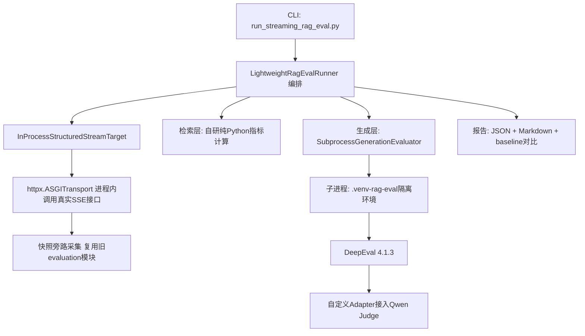
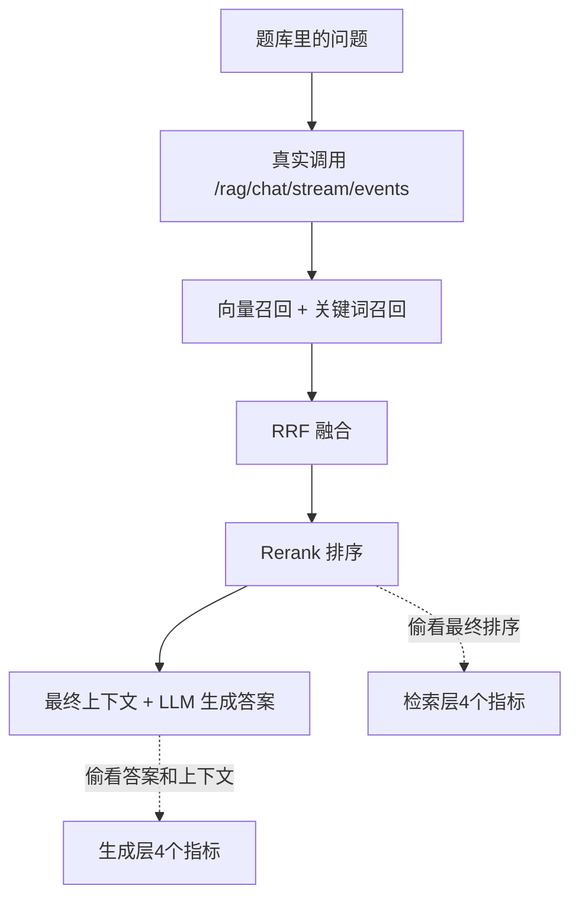
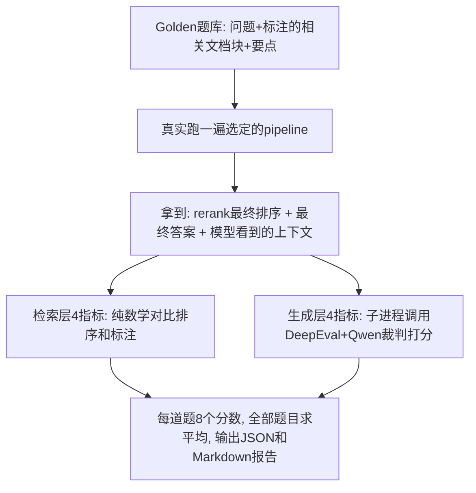
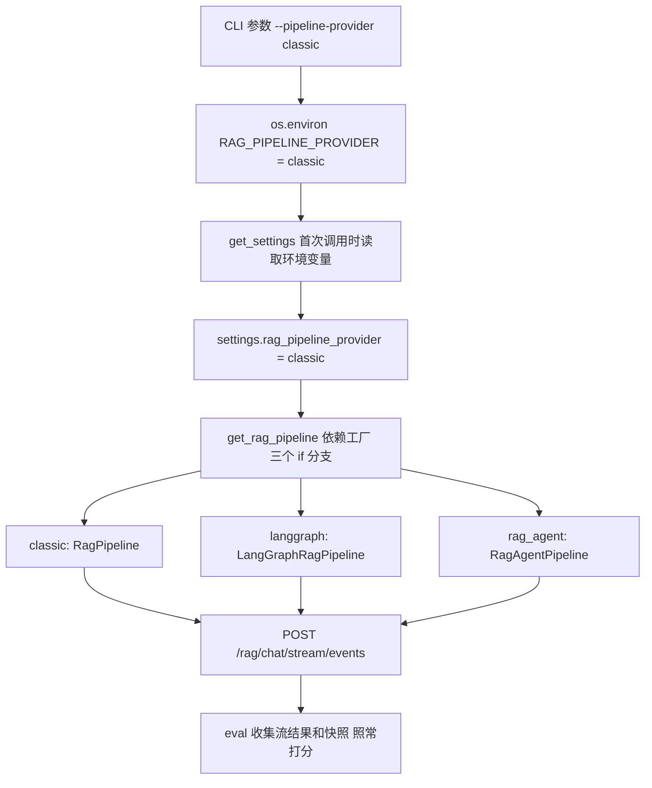
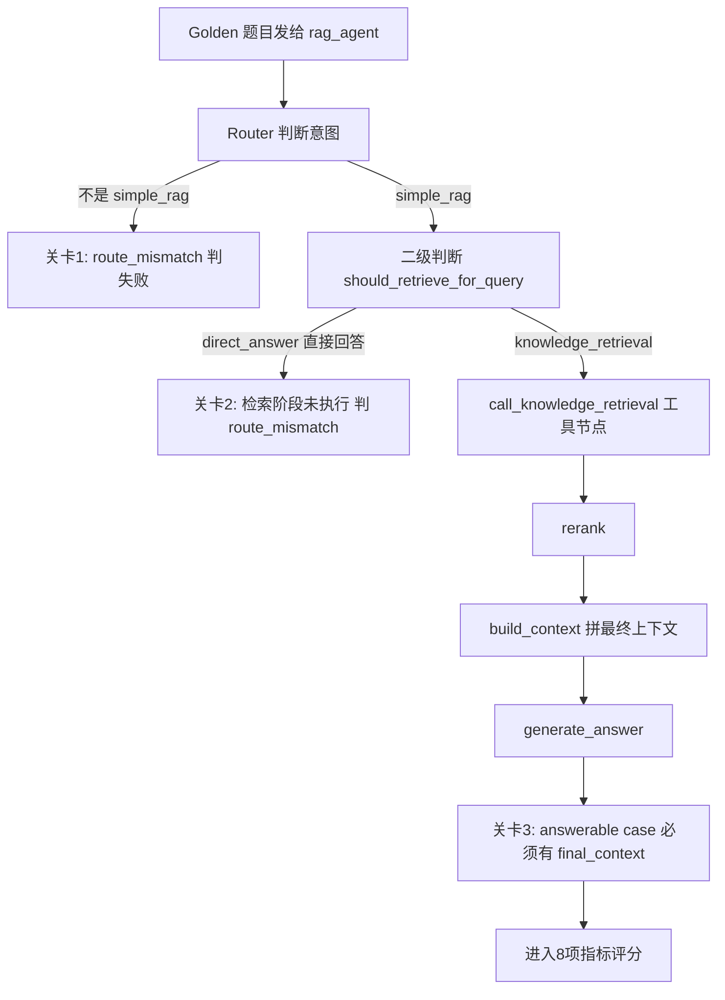
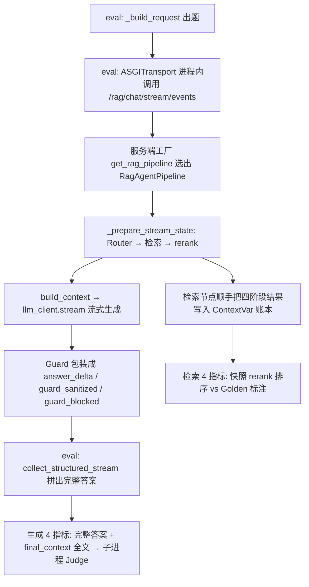

# Rag-Eval 模块技术方案：

我先确认一个和配置相关的关键点：快照的安全模式默认值（它影响生成指标能否读到最终上下文）。


## Codex 的技术方案总览

先看一张技术选型全景图，再逐项解释为什么这么选：



### 方案 1：进程内真实调用，而不是另造测试链路

用 `httpx.ASGITransport` 把 FastAPI app 直接当作 HTTP 服务调用，打真实的 `POST /rag/chat/stream/events`。

- **为什么**：评测的就是生产链路本身——认证、路由、pipeline、Guard 一个都不绕过，但又不需要真的起服务、不走外网端口，测试可复现。
- **代价**：需要本地 Milvus / ES / 知识库可用，评测结果依赖真实环境状态。

### 方案 2：快照旁路采集（复用旧封档模块）

通过 `ContextVar` 在评测请求期间挂一个采集器，pipeline 各阶段（vector / keyword / rrf / rerank）执行时顺手把文档列表和分数记进快照，最后冻结"模型实际收到的 final_context"。

- **为什么**：检索指标需要知道 rerank 的最终排序，但这个信息 SSE 事件里不完全公开。旁路采集对正常请求零侵入（没开评测时这些函数直接返回）。
- 这部分是**复用旧的 `src/fast_app/evaluation`**，Codex 没有重写。

### 方案 3：检索指标自研，不引第三方 IR 库

Recall/Precision/HitRate/MRR 只有几十行纯 Python（[retrieval.py](file:///d:/AI_Agent_Project/AI_Python_Project/python-agent-study/src/fast_app/rag_eval/retrieval.py)）。

- **为什么**：四个指标逻辑简单，自己写可以完全控制边界语义（去重、K 不足、no-answer 跳过），还不用引入 ranx、ir-measures 这类重依赖。

### 方案 4：生成指标用 DeepEval，但做了三层隔离

这是最重的一个技术决策，核心矛盾是：**DeepEval 4.1.3 要求 `click<8.4.0`，而生产环境固定 `click==8.4.1`**，两者装不进同一个环境。所以：

1. **独立虚拟环境** `.venv-rag-eval`：专门装 deepeval==4.1.3 + langchain-openai 等（见 [requirements-eval.txt](file:///d:/AI_Agent_Project/AI_Python_Project/python-agent-study/requirements-eval.txt)），生产环境完全不碰；
2. **子进程 JSON 协议**：主进程把题目、答案、上下文序列化成 JSON 从 stdin 传给子进程 worker，子进程跑完 DeepEval 再从 stdout 传回分数。带超时 kill、返回校验、case_id 一致性检查；
3. **安全加固**：导入 DeepEval 前强制禁用 dotenv 自动读取、遥测、磁盘写入；检测到 `CONFIDENT_API_KEY`（DeepEval 云端上传密钥）直接报错拒绝运行。

### 方案 5：自定义 Judge Adapter 接 Qwen

DeepEval 默认用 OpenAI 官方模型，Codex 写了 `QwenDeepEvalModel`（继承 `DeepEvalBaseLLM`），把 DeepEval 的所有内部 LLM 调用转发到你自己配的 OpenAI-compatible 端点。关键细节：结构化输出做了**三级降级**（json_schema → function_calling → 纯文本提示后手动解析 JSON），兼容对 structured output 支持不全的国产端点。

### 方案 6：数据集复用 Golden V2

直接复用旧模块的 `stage11_rag_eval_cases.v2.0.0.json`（已审核的黄金集），加载时校验内容哈希和语料 revision，防止数据集被悄悄改过导致分数不可比。

---

## 你需要手动配置的内容

按"必须 → 视情况 → 可选"分三档。我先检查了你当前的 `.env`：**`AUTH_ENABLED=true` 已开启，且没有任何 `RAG_EVAL_*` 配置**，所以下面第 2 档对你是必须的。

### 第一档：必须配置（生成层指标要用）

生成层 4 个指标没有这三个变量会直接报"缺少独立 Judge 配置"：

```powershell
$env:RAG_EVAL_JUDGE_API_KEY = "你的评测专用key"
$env:RAG_EVAL_JUDGE_BASE_URL = "https://你的OpenAI兼容端点/v1"
$env:RAG_EVAL_JUDGE_MODEL_NAME = "qwen-plus"   # 或其他可用模型
```

设计意图：裁判模型**不允许复用主生成模型的凭据**，防止"自己给自己打分"，也避免评测流量混进生产账单。

只跑检索层（`--mode retrieval`）时这三个可以不配。

### 第二档：你的环境必须配（因为 AUTH_ENABLED=true）

```powershell
# 二选一，不能同时配
$env:RAG_EVAL_API_KEY = "..."
# 或
$env:RAG_EVAL_BEARER_TOKEN = "..."
```

另外有一个隐性要求：这个凭据对应的用户，必须和 Golden 数据集里每条 case 标注的 `eval_principal_id` 一致——评测前会先调 `/auth/me` 验证身份匹配，不匹配直接报 `PermissionError`。如果数据集里多条 case 属于不同用户身份，单次凭据可能跑不全，这是运行时需要注意的点。

如果哪天把 `AUTH_ENABLED` 关掉，则什么都不用配，CLI 会自动按 case 身份发 Demo 用户头。

### 第三档：可选调优参数

| 环境变量                         | 默认值                              | 作用                                         |
| -------------------------------- | ----------------------------------- | -------------------------------------------- |
| `RAG_EVAL_JUDGE_TEMPERATURE`     | 0                                   | 裁判采样温度，回归评测保持 0                 |
| `RAG_EVAL_JUDGE_TIMEOUT_SECONDS` | 60                                  | 单次裁判调用超时                             |
| `RAG_EVAL_JUDGE_MAX_RETRIES`     | 0                                   | 瞬态失败重试次数（上限 3）                   |
| `RAG_EVAL_JUDGE_PYTHON`          | `.venv-rag-eval\Scripts\python.exe` | 隔离环境 Python 路径，默认路径已存在就不用配 |

### 已经就绪、不用你动手的部分

- `.venv-rag-eval` 隔离环境已创建且依赖已装好（我今天用它跑通了 DeepEval 相关测试）；
- `EVAL_SNAPSHOT_SECURITY_MODE` 默认 `plain`，本地环境合法，final_context 可明文重放。**注意**：如果以后改成 `redacted`，Faithfulness 和 Context Utilization 会因读不到上下文而被跳过；
- 数据集默认路径 `src/fast_app/evaluation/datasets/stage11_rag_eval_cases.v2.0.0.json` 已存在。

### 一个绝对不要做的配置

**不要配置 `CONFIDENT_API_KEY`**（DeepEval 云平台密钥）。代码在两个位置检测它，一旦存在就拒绝运行——这是刻意设计，防止评测结果被上传到 DeepEval 云端。

---

## 实际运行命令（配置好之后）

```powershell
$env:PYTHONPATH = "src"
.\.venv\Scripts\python.exe scripts\run_streaming_rag_eval.py `
  --pipeline-provider classic `
  --mode all `
  --output-dir reports\rag-eval
```

首次验证建议先小规模试跑，确认链路通再放开：

```powershell
.\.venv\Scripts\python.exe scripts\run_streaming_rag_eval.py `
  --pipeline-provider classic `
  --mode retrieval `
  --max-cases 2
```

`--mode retrieval` 只算检索层，不需要 Judge 配置，最适合做第一次冒烟；跑通后再加生成层。三条链路要对比就换 `--pipeline-provider` 为 `langgraph`、`rag_agent` 各跑一次。

# 8个指标：

## eval 模块现在评测的是哪条检索链路

一句话：**评测的不是模拟数据，而是真实跑一遍你工程里正在使用的 RAG 问答主链路**。

具体来说，评测脚本会做这件事：拿着题库（Golden 数据集）里的每个问题，真的发给 `POST /rag/chat/stream/events` 这个接口，让系统像接待真实用户一样完整走一遍：检索 → RRF 融合 → rerank → 拼上下文 → LLM 生成答案。然后在旁边"偷看"两个东西：

1. **检索最终吐出了哪些文档块**（看 rerank 阶段的最终排序）；
2. **最后生成了什么答案**，以及 **LLM 当时实际看到的上下文是什么**。



还有一件事要知道：**一次运行只评一条链路**。工程里有三条 pipeline（classic、langgraph、rag_agent），CLI 用 `--pipeline-provider` 参数选一条，想对比三条链路的效果就分别跑三次。

评测的前提是：每道题都有人工标注的"标准答案文档块"（哪几个 chunk 才是真正相关的），指标就是拿"系统实际捞上来的"和"人工标注的"做对比。

---

## 用一个例子看懂检索层 4 个指标

假设有一道题：

- 人工标注的相关文档块（标准答案）：`A`、`B` 共 2 个
- 系统 rerank 后实际返回的前 3 名（top_k=3）：`X`、`A`、`C`
- 其中只有 `A` 命中，`X`、`C` 是没用的

四个指标就是四种不同的"扣分角度"：

| 指标            | 问的问题                         | 公式                        | 例子得分           |
| --------------- | -------------------------------- | --------------------------- | ------------------ |
| **Recall@K**    | 该找到的，找回来了多少？         | 命中数 ÷ 标准答案总数 = 1/2 | **0.5**            |
| **Precision@K** | 捞上来的东西里，有多少是有用的？ | 命中数 ÷ 返回条数 = 1/3     | **0.33**           |
| **HitRate@K**   | 至少有没有捞到 1 个对的？        | 命中≥1 就是 1，否则 0       | **1.0**            |
| **MRR**         | 第一个对的排第几？               | 1 ÷ 第一个命中的名次        | A 排第 2 → **0.5** |

记忆方式：
- Recall 站在"标准答案"视角——漏没漏；
- Precision 站在"返回结果"视角——纯不纯；
- HitRate 只看有没有，不管漏了几个；
- MRR 只看第一个对的排得多靠前（排第 1 得 1 分，排第 2 得 0.5，没命中 0 分）。

这 4 个指标全是纯数学计算，代码就在 [retrieval.py](file:///d:/AI_Agent_Project/AI_Python_Project/python-agent-study/src/fast_app/rag_eval/retrieval.py) 里，不调用任何模型，所以算出来一定是准的、可复现的。

两个特殊规则：
- **"无法回答"的题**（知识库里本来就没有答案的题）：4 个检索指标直接跳过不算分，因为这种题没有"标准答案文档块"可以对比；
- **返回不足 K 条**：比如要 5 条只回来 1 条且这 1 条是对的，Precision 用 1/1=1.0，而不是 1/5=0.2，避免冤枉系统。

---

## 生成层 4 个指标：让另一个 LLM 当"阅卷老师"

检索指标能算出来，但"答案写得好不好"没法用公式算，所以 Codex 找了一个**独立的 LLM 当裁判**（Qwen，通过 `RAG_EVAL_JUDGE_*` 环境变量配置，和主系统用的模型分开）。给每道题喂四样东西：

- **题目**（用户问题）
- **学生的答卷**（系统真实生成的答案）
- **学生开卷时看到的资料**（模型实际收到的最终上下文，从快照里还原）
- **参考答案要点**（人工标注的 required_key_facts）

然后 4 个指标分别从四个角度打分（都是 0~1）：

### 1. Faithfulness（忠实度）——"有没有瞎编"

把答案拆成一条条独立的说法（比如"系统支持混合检索"算一条），逐条去"开卷资料"里找依据：

- 资料里有 → supported
- 资料里只沾点边 → partial
- 资料里完全没有 → unsupported（这就是幻觉）

有依据的比例越高，分数越高。**它抓的是编造内容**。

### 2. Answer Relevance（答案相关性）——"答的是不是这道题"

思路很巧妙：让裁判**从答案反推**——"写出这段话的人，大概在回答什么问题？"如果反推出的问题和原题很接近，说明答案没跑题；如果答案扯到别的地方去了，分数就低。

### 3. Answer Completeness（答案完整性）——"答题要点齐不齐"

人工给每道题标注了"必须覆盖的事实要点"（比如 3 条）。裁判拿着要点清单逐条核对：答案有没有把每条要点的核心意思表达出来（不要求一字不差）。覆盖了 2/3 条，大约就是 0.67 分。**它用的是人工标注的要点，不需要标准答案全文**。

### 4. Context Utilization（上下文利用率）——"给的资料用没用、用得对不对"

双向检查：

- 正向：答案里的信息点，是不是都有"开卷资料"支撑（和 Faithfulness 有点像，但更侧重"有没有好好利用资料"）；
- 反向：资料里和问题直接相关的证据，答案有没有真的用上——资料明明给了却没用，也扣分。

---

## 整体流程一张图



最后补一个直觉：**检索层指标是确定的**（同一份结果算一百次都一样），**生成层指标是裁判打的**（temperature=0 尽量稳定，但本质还是模型判断，会有小波动）。所以看生成层分数时，更适合看趋势变化（这次改版后是升了还是降了），而不是纠结 0.62 和 0.65 的区别。

# 1、代码入口讲解：

你补充的 Judge 配置我注意到了（key 已写入本地脚本，该文件已被 gitignore，不会进仓库）。讲解前我先确认"切换链路"的关键机制——`RAG_PIPELINE_PROVIDER` 这个环境变量到底在哪里被消费、怎么决定走哪条 pipeline。


再看 SSE 接口本身怎么消费这个依赖：


三个关键点我都在代码里核实过了，下面按"入口 → 链路切换机制 → eval 模块自己怎么感知 provider"讲解。

## 一、入口在哪里：`scripts/run_streaming_rag_eval.py`

eval 模块没有 API 入口，它是**命令行工具**，入口就是 [run_streaming_rag_eval.py 的 `main()`](file:///d:/AI_Agent_Project/AI_Python_Project/python-agent-study/scripts/run_streaming_rag_eval.py)。执行顺序拆开看：

```text
1. parse_args()                    解析 CLI 参数（provider、mode、metrics 等）
2. 设置环境变量 RAG_PIPELINE_PROVIDER   ← 关键步骤，在所有 import 之前
3. 延迟 import fast_app 相关模块        ← 必须在第 2 步之后
4. load_golden_eval_dataset()      加载并校验 Golden V2 数据集（哈希 + revision）
5. 过滤 case                        按 --case-id / --max-cases
6. 组装四个组件：
   - SubprocessGenerationEvaluator   生成层子进程评估器（选了生成指标才创建）
   - RagEvalAuth                     认证方式（demo / api_key / bearer）
   - InProcessStructuredStreamTarget 真实 SSE 执行器
   - LightweightRagEvalRunner        编排器
7. async with app.router.lifespan_context(app)   启动应用生命周期（连 Milvus/ES 等）
8. runner.run(dataset) → write_reports()         跑完写 JSON + Markdown
```

注意第 7 步：它复用了 FastAPI app 自己的 lifespan，等价于"把服务启动过程走了一遍但不开端口"，所以 Milvus、ES、数据库这些依赖都是真实初始化的。

## 二、不同链路的切换机制：环境变量 + 依赖注入工厂

**核心结论：eval 模块自己不持有任何 pipeline，它是靠"借用"主应用现成的依赖注入机制来切换链路的。** 完整链路是：



逐环说明：

**环节 1：CLI 把参数写进环境变量**（[run_streaming_rag_eval.py 第 52 行](file:///d:/AI_Agent_Project/AI_Python_Project/python-agent-study/scripts/run_streaming_rag_eval.py#L52)）

```python
os.environ["RAG_PIPELINE_PROVIDER"] = args.pipeline_provider
# provider 环境必须在导入 fast_app.main 和构造全局依赖前固定。
from fast_app.core.config import get_settings
from fast_app.main import app
```

**环节 2：Settings 读取环境变量**。[config.py](file:///d:/AI_Agent_Project/AI_Python_Project/python-agent-study/src/fast_app/core/config.py) 里声明了 `rag_pipeline_provider` 字段（别名 `RAG_PIPELINE_PROVIDER`，默认 `classic`）。

**环节 3：依赖工厂三分支构造 pipeline**。真正的切换逻辑在主应用早就有的 [get_rag_pipeline()](file:///d:/AI_Agent_Project/AI_Python_Project/python-agent-study/src/fast_app/dependencies/rag_dependencies.py#L463-L549)：

```python
provider = settings.rag_pipeline_provider.lower().strip()
if provider == "classic":     return RagPipeline(...)
if provider == "langgraph":   return LangGraphRagPipeline(...)
if provider == "rag_agent":   return RagAgentPipeline(...)   # 额外注入 router/planner/executor
```

**环节 4：SSE 接口消费**。[rag_chat_routes.py](file:///d:/AI_Agent_Project/AI_Python_Project/python-agent-study/src/fast_app/api/rag_chat_routes.py) 的 `/chat/stream/events` 端点写着 `pipeline: RagPipeline = Depends(get_rag_pipeline)`——每个请求进来时，FastAPI 自动调工厂拿到当前 provider 对应的 pipeline。

**这个设计的精妙之处**：切换链路是主应用本来就有的生产能力（你平时用 `$env:RAG_PIPELINE_PROVIDER` 启动服务就是这么切的），eval 只是复用了它。所以**评测代码对三条链路完全无感**——它只管往同一个接口发请求，至于背后是 classic 还是 rag_agent，由环境变量决定。三条链路的检索、rerank、快照采集埋点都是同一套约定，指标才能公平对比。

## 三、两个必须理解的设计约束

### 约束 1：为什么环境变量必须在 import 之前设置

`get_settings()` 上有 `@lru_cache`——**整个进程生命周期里 Settings 只创建一次**，第一次读到什么 provider，后面就固定是什么。如果先 import 了 `fast_app.main` 再改环境变量，Settings 可能已经用旧值创建好了，切换就失效。这也是为什么一次运行只能测一条链路：**一个进程 = 一个 provider**，测三条链路就跑三次进程（你的启动脚本跑三次即可）。

### 约束 2：eval 模块里的 `pipeline_provider` 参数有什么用

既然链路切换靠环境变量，runner/target 里为什么还要再传一遍 `pipeline_provider`？它不参与切换，只有三个用途：

1. **报告身份**：写进 `RagEvalRunReport.pipeline_provider` 和报告文件名（`rag-eval-classic-{run_id}.json`），`apply_baseline` 做基线对比时会**强制校验两次运行的 provider 相同**，防止拿 classic 的分数和 langgraph 的比；
2. **快照身份**：记录进 EvaluationSnapshot，供事后追溯"这份快照是哪条链路产生的"；
3. **rag_agent 专属的路由校验**：这是唯一的逻辑差异，在 [target.py `_classify_execution()`](file:///d:/AI_Agent_Project/AI_Python_Project/python-agent-study/src/fast_app/rag_eval/target.py#L268-L286)——rag_agent 链路前面多了一个 Router 节点，可能把问题分给 Research/Web/NL2SQL 等其他意图。Golden 题要求的是"普通 RAG"，所以如果 `route_intent != "simple_rag"`，case 直接判 `route_mismatch` 失败，**不给检索伪分数**。classic 和 langgraph 没有 Router，不需要这个检查。

## 四、小结

```text
入口：scripts/run_streaming_rag_eval.py（CLI，无 API 入口）
切换：CLI 参数 → RAG_PIPELINE_PROVIDER 环境变量 → get_rag_pipeline 依赖工厂 → 三条 pipeline 之一
公平性：eval 打的是同一个真实 SSE 接口 + 同一套快照埋点，链路切换对评测代码透明
约束：@lru_cache 导致一个进程只能测一个 provider，所以三条链路跑三次，报告文件名和基线校验保证不混淆
```

你可以按这个顺序看代码：`run_streaming_rag_eval.py`（入口组装）→ `rag_dependencies.py` 的 `get_rag_pipeline()`（切换工厂，这是主应用的旧代码）→ `target.py`（eval 侧怎么用 provider 做校验）→ `runner.py`（provider 只进报告不进逻辑）。

# 2、代码检索链路讲解：2026年8月11日

~~~cpp
//provider == "rag_agent"时 目前只实现了simple_rag → knowledge_retrieval分支
~~~

这个问题问得很准。我先核实 RagAgent pipeline 里 Router 的分支定义和 `simple_rag` 分支的实际走向，再回答。


再确认一个细节：eval 发请求时关掉了哪些旁路（web fallback 等），保证分支判断说准确。


核实完毕，可以准确回答了。

## 结论：eval 只评 `simple_rag → knowledge_retrieval` 这一条分支

rag_agent 链路里 Router 确实能分出 6 种意图（[agent_task_router.py](file:///d:/AI_Agent_Project/AI_Python_Project/python-agent-study/src/fast_app/services/agent_tasks/agent_task_router.py#L24-L37)）：

```text
simple_rag                    普通问答/知识库检索
question_decomposition        复杂问题拆解（TaskPlan）
knowledge_document_management 文档管理（TaskPlan）
web_research                  单步联网研究
structured_data_query         NL2SQL 数据库查询
clarification_required        追问澄清
```

但 eval 模块通过**三道关卡**，只放行其中一条路径进入评分：



### 关卡 1：Router 意图必须是 simple_rag

[target.py `_classify_execution()`](file:///d:/AI_Agent_Project/AI_Python_Project/python-agent-study/src/fast_app/rag_eval/target.py#L268-L286)：SSE 流里的 `agent_route_selected` 事件会公开 Router 的意图，只要 `route_intent != "simple_rag"`，case 直接判 `route_mismatch` 失败。所以 Router 把题目分给联网、NL2SQL、文档管理、澄清的，**都不在评分范围，而是记为失败**——因为 Golden 题的标注（相关文档块、关键事实）只对知识库检索有效，给别的分支算分就是伪造分数。

### 关卡 2：simple_rag 之后还必须真的去检索

这里有个容易忽略的细节：**Router 说 simple_rag 不等于一定检索**。代码注释写得很清楚（agent_task_router.py 第 23 行）：simple_rag 只表示"无需多步骤 TaskPlan"，之后还要过二级判断 `should_retrieve_for_query()`，可能走 `direct_answer`（不检索直接答）。如果没执行任何检索阶段（快照里四个 stage 全是 `not_executed`），同样判 `route_mismatch` 失败。

### 关卡 3：请求参数主动封死旁路

eval 构造请求时（[target.py `_build_request()`](file:///d:/AI_Agent_Project/AI_Python_Project/python-agent-study/src/fast_app/rag_eval/target.py#L225-L236)）显式设置：

```python
allow_web_fallback=False,
allow_direct_web=False,
```

即使意图判断有偏差，也不允许偷偷走联网分支凑答案。

### 最终被评测的实际链路

```text
decide_next_action(Router)
  → knowledge_retrieval（call_knowledge_retrieval 工具节点）
  → rerank
  → build_context（parent 扩展 + Prompt Guard + 冻结 final_context）
  → generate_answer
```

检索段的底层和 classic **是同一套组件**：[rag_agent_builder.py](file:///d:/AI_Agent_Project/AI_Python_Project/python-agent-study/src/fast_app/graph/rag_agent/rag_agent_builder.py#L82-L105) 里 `call_knowledge_retrieval` 节点注入的是依赖工厂传来的同一个 `vector_retriever` / `keyword_retriever`，rerank 用同一个 `reranker`。所以三条 provider 的分数可比——检索段行为一致，快照埋点一致。

## 这意味着什么（评测语义上的两点提醒）

1. **rag_agent 的分数实际包含 Router 的准确率**。一条题如果被 Router 误分到别的意图，就算检索本身能答对，也会记为 `route_mismatch` 失败拉低报告。所以对比三条链路时，rag_agent 分数低未必是检索差，可能是 Router 分错了——报告里的 `actual_route` 字段和 error code 能帮你区分这两种失败。

2. **当前轻量 eval 不评复杂分支**。`question_decomposition`、文档管理、NL2SQL、web_research 这些 TaskPlan/工具分支完全不在 8 项指标的覆盖范围内——Golden V2 数据集只定义了 `metric_profile="rag"` 的题目。这些分支的质量评测属于后续阶段的事（旧 evaluation 模块封档时也没做完）。

顺带说明：classic 和 langgraph 两条链路没有 Router，所以不存在关卡 1/2，它们的题只要进了检索就直接评分。这也是 rag_agent 报告里失败原因会更多样的结构性原因。

# 3、代码讲解：eval 进程怎么进入检索链路

我先重新读一下教学讲解规范，按规范重讲——这次把每一步对应的真实代码片段直接贴出来。


这次我换一种讲法：**按一条评测请求的生命周期走一遍，每一步都贴出对应的真实代码片段**。你拿着这些片段可以去代码里一一对上。

## 先给一个总览：eval 进程就是一个"质检员"

eval 进程自己**不做任何检索、不调任何 LLM**。它只做三件事：

1. 像普通前端一样，向真实接口发一个问题；
2. 把接口流式吐回来的答案碎片拼成完整答案；
3. 拿"完整答案"和"服务端悄悄记录的检索中间结果"去打分。

整个过程的代码分工（这就是你要找的"哪些代码做了哪些步骤"的索引表）：

| 步骤       | 做什么                            | 代码位置                                                     |
| ---------- | --------------------------------- | ------------------------------------------------------------ |
| ① 组装请求 | 把 Golden 题目变成 HTTP 请求体    | `rag_eval/target.py` 的 `_build_request`                     |
| ② 发请求   | 进程内调真实 SSE 接口             | `rag_eval/target.py` 的 `_request_stream`                    |
| ③ 选链路   | 根据环境变量选出 RagAgentPipeline | `dependencies/rag_dependencies.py` 的 `get_rag_pipeline`     |
| ④ 走检索   | Router → 检索 → rerank 节点推进   | `services/rag/rag_agent_pipeline_service.py` 的 `_prepare_stream_state` |
| ⑤ 记快照   | 检索节点把中间结果写进"质检账本"  | `agents/tools/rag_agent_tools.py` + `evaluation/pipeline/snapshot_capture.py` |
| ⑥ 流式生成 | LLM 逐 token 吐答案               | `rag_agent_pipeline_service.py` 的 `_stream_events`          |
| ⑦ 拼答案   | eval 把事件流拼回完整答案         | `rag_eval/streaming.py` 的 `collect_structured_stream`       |
| ⑧ 打分     | 检索 4 指标 + 生成 4 指标         | `rag_eval/runner.py` + `retrieval.py` + `generation_worker.py` |

下面逐步展开。

## 第①步：eval 怎么把一道题变成请求（target.py）

打开 `src/fast_app/rag_eval/target.py`，找到 `_build_request`（第 225-236 行），这就是"出题"代码：

```python
def _build_request(case: RagEvalCase) -> RagChatRequest:
    return RagChatRequest(
        query=case.question,          # Golden 数据集里的原题
        mode=case.mode,               # 检索模式，如 hybrid
        top_k=case.top_k,             # 要求返回几条
        candidate_k=case.candidate_k,
        min_score=case.min_score,
        filters=case.filters,
        allow_web_fallback=False,     # ← 写死：不许甩给联网检索
        allow_direct_web=False,       # ← 写死：不许走 Direct Web
        min_knowledge_version=case.knowledge_version,
    )
```

**通俗理解**：Golden 数据集里每道题除了"问题"，还标注了"该用什么参数问"。eval 照着填表，只加了两条硬规定——禁止联网兜底。这是为了保证评的一定是知识库检索链路，而不是模型瞎编或上网搜。

## 第②步：eval 怎么"不发网络请求"地调用真实接口（target.py）

接着看同一个文件的 `_request_stream`（第 165-195 行），核心就三行：

```python
transport = httpx.ASGITransport(app=self.app)   # 关键：不走网卡，直接对接 FastAPI 应用
async with httpx.AsyncClient(transport=transport, base_url="http://rag-eval.local", ...) as client:
    async with aconnect_sse(client, "POST", "/rag/chat/stream/events",
                            headers=headers, json=request.model_dump(mode="json")) as event_source:
        result = await collect_structured_stream(_decoded_events(event_source.aiter_sse()))
```

**通俗理解**：正常前端是用 HTTP 走网络访问 `http://127.0.0.1:8000`。eval 用 `ASGITransport` 把 FastAPI 应用对象直接塞给 httpx，请求**在同一个 Python 进程里**走完认证、路由、pipeline，一字节网络都不经过。但认证、参数校验、SSE 协议这些环节一个不少——所以它和真实请求的行为是一致的。

注意第 176-178 行还有认证：`headers = self.auth.headers_for(case.eval_principal_id)`，这就是你脚本里那个 `RAG_EVAL_API_KEY` 最终被用的地方——拼成 `X-API-Key` 请求头。

## 第③步：请求进入服务端后，怎么被分给 rag_agent 链路

这一步 eval 完全不管，是服务端的工厂函数决定的。在 `src/fast_app/dependencies/rag_dependencies.py` 的 `get_rag_pipeline()` 里（之前已核实过）：

```text
settings.rag_pipeline_provider == "classic"     → 返回 RagPipeline
settings.rag_pipeline_provider == "langgraph"   → 返回 LangGraphRagPipeline
settings.rag_pipeline_provider == "rag_agent"   → 返回 RagAgentPipeline
```

而 `settings.rag_pipeline_provider` 的值来自环境变量 `RAG_PIPELINE_PROVIDER`——CLI 脚本在 import 任何 fast_app 模块之前就把它设好了。**这就是"切换链路"的全部机制：改一个环境变量，重新跑一次。**

## 第④步：rag_agent 内部怎么一步步走进检索（服务端代码）

请求到达 `/rag/chat/stream/events` 后，服务端调用 `RagAgentPipeline.stream_events()`，它第一步是 `_prepare_stream_state()`。打开 `src/fast_app/services/rag/rag_agent_pipeline_service.py` 第 765-841 行，这个函数就是**手动按顺序调节点**：

```python
async def _prepare_stream_state(self, req, operation) -> RagAgentState:
    state = await self._prepare_initial_state(req, operation=operation)

    decision_update = await self.decide_next_action_node(state)   # 节点1: Router 判意图
    state.update(decision_update)

    loop_update = await self.check_loop_limits_node(state)        # 节点2: 预算检查
    state.update(loop_update)

    next_route = route_after_loop_check(state)                    # 节点3: 分流
    if next_route == "direct_answer": ...                          # 不检索，直接答
    if next_route == "clarification_required": ...                 # 追问
    if next_route == "execute_task_plan": ...                      # 复杂任务
    if next_route == "structured_data_query": ...                  # NL2SQL
    if next_route == "direct_web": ...                             # 联网

    # ↓↓↓ Golden 题目是普通 RAG 问题，会落到这里 ↓↓↓
    tool_update = await self.call_knowledge_retrieval_node(state)  # 节点4: 真实检索
    state.update(tool_update)

    rerank_update = await self.rerank_node(state)                  # 节点5: 重排序
    state.update(rerank_update)
    return state
```

**通俗理解**：`route_after_loop_check` 是个岔路口，有 6 条路。前 5 条都不做知识库检索（直接返回了）。只有"普通 RAG 问题"才会继续往下走到第 822 行的 `call_knowledge_retrieval_node`——**这一行就是"进入检索链路"的确切位置**。它内部真实打 Milvus（向量）和 ES（关键词）。

之后第 837 行 `rerank_node` 对候选做重排序，返回。接着 `_stream_events` 继续（第 1343 行）：`build_context_node` 把 rerank 后的文档拼成上下文，然后才交给 LLM 生成。

## 第⑤步：检索中间结果怎么被"偷记下来"（快照机制）

这是最容易看不懂的一步，因为**代码表面上没有任何传参**。秘密是 ContextVar（上下文变量），可以理解成"质检员随身带了一本账本"：

**开账本**——eval 发请求前，在 `target.py` 的 `execute()`（第 113-118 行）：

```python
with capture_evaluation_snapshot(req=request, ...) as collector:
    stream = await self._request_stream(case, request)   # 账本打开期间发请求
```

对应 `evaluation/pipeline/snapshot_capture.py` 第 442-468 行，本质是：

```python
_snapshot_collector_var: ContextVar[...] = ContextVar("evaluation_snapshot_collector", default=None)

@contextmanager
def capture_evaluation_snapshot(...):
    collector = EvaluationSnapshotCollector(...)
    token = _snapshot_collector_var.set(collector)   # 把账本放进当前上下文
    try:
        yield collector
    finally:
        _snapshot_collector_var.reset(token)         # 请求结束，收起账本
```

**记账**——服务端的检索代码执行时顺手看一眼"有没有账本"，在 `agents/tools/rag_agent_tools.py`（第 177、280、368、482 行，分别对应 vector/keyword/rrf/rerank 四个阶段）：

```python
record_snapshot_retrieval_stage("vector", docs, query=query)
```

这个函数在 `snapshot_capture.py` 第 471-481 行，逻辑非常简单：

```python
def record_snapshot_retrieval_stage(stage, docs, *, query=None) -> None:
    collector = _snapshot_collector_var.get()   # 看有没有账本
    if collector is not None:                    # 有 → 记一笔
        collector.record_retrieval_stage(stage, docs, query=query)
    # 没有（普通用户请求）→ 什么都不做，零开销
```

同理，模型最终拿到的上下文在 `services/rag/rag_context_assembler.py` 第 44 行被记下来：

```python
record_snapshot_final_context(context)
```

**通俗理解**：普通用户请求时"账本"是 `None`，这些记账调用等于空操作；只有 eval 请求期间账本存在，检索的每一步都被录下来。**这就是为什么检索指标不依赖 SSE 流——数据走的是这条旁路。**

## 第⑥步：LLM 的流式答案是怎么发出来的（服务端）

检索完成后，`_stream_events` 走到第 1394-1415 行，这是真正的"LLM 流式生成"：

```python
async for event in guarded_answer_delta_events(
    self.llm_client.stream(                     # ← LLM 逐 token 产出答案
        build_rag_agent_answer_query(state),
        context,
        ...
    ),
    prompt_guard=self.prompt_guard,             # ← 每个 token 先过安全检查
    source="rag_agent.stream_events.output",
    mode=self.settings.prompt_guard_stream_output_mode,
    ...
):
    yield event                                  # ← 以 SSE 事件发给调用方
```

**通俗理解**：`llm_client.stream()` 是水管，LLM 一个字一个字往外吐；`guarded_answer_delta_events` 是水管上的安检员，检查后把内容包装成三种事件之一再放出去：

- `answer_delta`：正常内容，放行；
- `guard_sanitized`：发现敏感片段，清洗后放行（替换成安全文本）；
- `guard_blocked`：整段拦截，换成拦截说明文本。

这三种事件的 `text` 字段拼起来，就是用户最终看到的完整答案。

## 第⑦步：eval 怎么把流拼回完整答案（streaming.py）

打开 `src/fast_app/rag_eval/streaming.py`，`collect_structured_stream`（第 74-157 行）就是一个"边收边攒"的循环。核心骨架：

```python
answer_parts: list[str] = []          # 攒答案碎片的桶

async for item in events:             # 一条条 SSE 事件进来
    if terminal_seen:
        raise SseProtocolError("done/error 终态后不能继续发送事件")

    if item.event in {"answer_delta", "guard_sanitized", "guard_blocked"}:
        text = item.data.get("text") or item.data.get("answer") or ""
        answer_parts.append(text)     # ← 碎片进桶
        ...
    if item.event == "sources":
        sources = list(...)           # 记录来源
    if item.event == "agent_route_selected":
        route_intent = ...            # 记录 Router 判的意图（rag_agent 专属）
    if item.event == "done":
        done_count += 1               # 终态标记
        terminal_seen = True
    if item.event == "error":
        error = RagEvalError(...)     # 错误终态
        terminal_seen = True

if error is None and done_count != 1:
    raise SseProtocolError("结构化流必须以唯一 done 或 error 结束")

return RagStreamExecutionResult(answer="".join(answer_parts), ...)   # ← 拼接成完整答案
```

**举个具体例子**，一次请求收到的事件序列可能是：

```text
agent_route_selected  {intent: "simple_rag"}      → 记下 route_intent
sources               {sources: [3 条来源]}        → 记下来源
answer_delta          {text: "混合检索是指"}        → 进桶
answer_delta          {text: "把向量检索和"}        → 进桶
guard_sanitized       {text: "关键词检索结合……"}    → 进桶，并记录发生过 guard
done                  {knowledge_version: 3}       → 终态，停止
```

最后 `answer = "混合检索是指把向量检索和关键词检索结合……"`。**注意：如果 Guard 中途拦截/清洗过内容，eval 拼出来的就是清洗后的版本——评的是"用户真实看到的答案"。**

另外 `agent_route_selected` 事件记下的 `route_intent` 会被 `target.py` 的 `_classify_execution`（第 268-271 行）用来做关卡检查：

```python
wrong_rag_agent_intent = (
    provider == "rag_agent"
    and stream.route_intent != "simple_rag"     # Router 没判成普通 RAG → 直接判失败
)
```

## 第⑧步：8 个指标分别拿什么数据打分（runner.py）

现在 eval 手里有两样东西：**⑦拼出的完整答案** + **⑤冻结的快照**。打分入口是 `runner.py` 的 `_evaluate_case`（第 136-214 行）。

**检索层 4 指标**——看第 232-248 行：

```python
def _evaluate_retrieval(case, execution, thresholds):
    rerank = execution.snapshot.payload.retrieval_stages["rerank"]   # 取快照里 rerank 阶段
    ranked_ids = [
        document.logical_chunk_id or f"__missing_logical_id__:{document.id}"
        for document in rerank.documents                              # 实际返回的排序列表
    ]
    return evaluate_retrieval_metrics(
        relevant_logical_chunk_ids=case.relevant_logical_chunk_ids,   # Golden 标注的正确答案
        ranked_logical_chunk_ids=ranked_ids,
        k=case.top_k,
        ...
    )
```

就是拿"实际排出来的顺序"对"标准答案"，纯数学计算。例如 gold 是 `[A, B]`，实际返回 `[X, A, C]`（top_k=3）：Recall=1/2=0.5，Precision=1/3≈0.33，HitRate=1.0，MRR=1/2=0.5。

**生成层 4 指标**——看第 159-179 行，本质是打包四个输入：

```python
request = GenerationEvaluationRequest(
    case_id=case.case_id,
    question=case.question,                                    # 原题
    answer=execution.stream.answer,                            # ⑦拼出的完整答案
    retrieval_context=_read_final_context(execution, ...),     # ⑤快照里的 final_context 全文
    required_key_facts=[fact.text for fact in case.required_key_facts],  # Golden 关键点
    metrics=generation_names,
    ...
)
response = await evaluator.evaluate(request)   # 发给子进程里的 DeepEval + Qwen Judge
```

其中 `retrieval_context` 值得注意（第 260-271 行的 `_read_final_context`）：它不是 SSE 里的 sources 摘要，而是快照中 **LLM 实际收到的完整上下文原文**——这样 Faithfulness（答案是否忠于资料）和 Context Utilization（资料是否被用好）才有准确的判据。

## 总结：一张图串起来



**一句话回顾**：eval 进程只发一次真实请求；"进检索链路"是服务端 `_prepare_stream_state` 走到 `call_knowledge_retrieval_node` 那一行实现的；"拿完整答案"是 `collect_structured_stream` 把流式碎片拼起来的；"检索中间结果"走的是 ContextVar 快照旁路，不在流里。

如果哪一步你还想继续往下钻（比如 `guarded_answer_delta_events` 内部怎么分块做 Guard，或者子进程 worker 里 Judge 怎么打分），告诉我具体步骤编号即可。

# 3.1、ASGITransport 函数讲解：

这段代码展示了在 **Python 异步环境**下，对 **FastAPI/Starlette** 应用进行**进程内测试（In-process Testing）\**或\**内部调用**的标准模式。

下面我为你逐层拆解：

### 1. `httpx.ASGITransport` 是什么？

`httpx.ASGITransport` 是 `httpx` 库提供的一个特殊传输层适配器。它的核心作用是：**让 HTTP 客户端绕过真实的网络协议栈（TCP/IP、网卡、端口监听），直接在内存中与一个 ASGI 应用（如 FastAPI）进行通信。**

#### 工作原理对比

| 特性             | 普通 HTTP 请求 (`http://localhost:8000`)                | ASGITransport (`ASGITransport(app=...)`)     |
| ---------------- | ------------------------------------------------------- | -------------------------------------------- |
| **网络路径**     | 客户端 → TCP/IP → 网卡 → 服务端端口 → ASGI Server → App | 客户端 → **直接函数调用** → App              |
| **依赖**         | 需要服务真正启动并监听端口                              | **不需要**启动服务器，无需占用端口           |
| **性能**         | 受限于网络 I/O、序列化/反序列化开销                     | 极快，零网络开销，纯内存交互                 |
| **适用场景**     | 集成测试、生产环境调用                                  | **单元测试**、E2E 测试、同进程内部微服务调用 |
| **SSE/流式支持** | ✅ 支持                                                  | ✅ **同样支持**（这是关键优势）               |

> 💡 **本质理解**：它把 ASGI 应用变成了一个“可被 httpx 调用的函数”。`httpx` 发出的请求对象会被直接转换成 ASGI `scope/receive/send` 三元组传入你的 FastAPI app，app 的响应再被转换回 `httpx.Response`。整个过程没有真正的 HTTP 报文在网络上传输。

### 2. 代码逐行解析

```python
# ① 创建传输层：将 FastAPI app 实例绑定到 transport
transport = httpx.ASGITransport(app=self.app)

# ② 创建异步客户端，base_url 仅用于路由匹配，不会真正发起网络连接
async with httpx.AsyncClient(transport=transport, base_url="http://rag-eval.local", ...) as client:

    # ③ 通过 SSE 方式调用流式接口（即使走 ASGITransport，SSE 依然正常工作）
    async with aconnect_sse(client, "POST", "/rag/chat/stream/events",
                            headers=headers, json=request.model_dump(mode="json")) as event_source:

        # ④ 消费 SSE 事件流，收集结构化结果
        result = await collect_structured_stream(_decoded_events(event_source.aiter_sse()))
```

#### 关键点说明

- **`base_url="http://rag-eval.local"`**：这个域名是**虚拟的**，永远不会被 DNS 解析。它的作用仅仅是满足 `httpx` 对 URL 格式的校验要求，以及在日志/调试中提供一个可读的标识。实际请求完全由 `ASGITransport` 在内存中处理。
- **`aconnect_sse` + `ASGITransport`**：这是一个非常重要的组合。很多开发者误以为 SSE/流式响应必须走真实网络，但 `ASGITransport` 完整实现了 ASGI 协议的 `send`/`receive` 异步生成器语义，因此 **Server-Sent Events 在进程内也能正确流式传输**。
- **`request.model_dump(mode="json")`**：使用 Pydantic v2 的 JSON 模式序列化，确保日期、枚举等类型被正确转换为 JSON 兼容格式，避免 ASGI 层收到不可序列化的 Python 对象。

### 3. 为什么不用 `TestClient`？

你可能会问：FastAPI 自带的 `TestClient` 不也是进程内测试吗？

|                      | `TestClient` (Starlette)        | `httpx.AsyncClient` + `ASGITransport` |
| -------------------- | ------------------------------- | ------------------------------------- |
| **同步/异步**        | 同步 API（内部用 `anyio` 桥接） | **原生异步**                          |
| **SSE 流式测试**     | ❌ 不支持 / 极其困难             | ✅ 原生支持                            |
| **与生产代码一致性** | 低（同步包装可能掩盖并发 bug）  | **高**（和生产调用方式完全一致）      |
| **连接池/重试/超时** | 有限                            | 完整的 `httpx` 功能集                 |

> ⚠️ **结论**：当你需要测试 **SSE/流式端点** 或编写 **纯异步测试** 时，`ASGITransport` 是目前 Python 生态中的最佳实践。

### 4. 注意事项

- **中间件行为差异**：某些依赖真实网络信息的中间件（如获取客户端 IP、HTTPS 检测）在 `ASGITransport` 下可能返回默认值，因为不存在真实的 socket 连接。
- **数据库/外部依赖**：虽然 HTTP 层是内存级的，但 app 内部仍然会真实执行数据库查询、LLM 调用等。测试时仍需 mock 这些外部依赖。
- **版本要求**：`ASGITransport` 需要 `httpx >= 0.27.0`，旧版本使用的是已废弃的 `ASGIDispatch`。


# 3.2、评估快照的构建方式 + 上下文管理器

~~~cpp
//D:\AI_Agent_Project\AI_Python_Project\python-agent-study\src\fast_app\evaluation\pipeline\snapshot_capture.py
~~~


我们完全抛开之前的代码，从零开始用一个**最小、最直观的例子**来理解这两个概念。

------

### 场景：记录函数调用链

假设你有一个嵌套调用的函数链，你想记录"谁调用了谁"，但**不想通过参数一层层传递记录器**。

#### ❌ 不用 ContextVar 的笨办法

```python
def outer(trace: list):
    trace.append("enter outer")
    middle(trace)          # ← 必须手动传 trace
    trace.append("exit outer")

def middle(trace: list):
    trace.append("enter middle")
    inner(trace)           # ← 必须手动传 trace
    trace.append("exit middle")

def inner(trace: list):
    trace.append("enter inner")
    trace.append("exit inner")

# 调用
trace = []
outer(trace)
print(trace)
```

问题很明显：**每一层函数签名都要加一个 `trace` 参数**。如果调用链有 10 层，或者中间有些函数不是你写的（比如第三方库），你根本没法把 `trace` 传进去。

------

### ✅ 用 ContextVar + 上下文管理器

#### 第一步：定义一块"白板"

```python
import contextvars

# 创建一块白板，默认上面什么都没写（None）
_trace_var: contextvars.ContextVar[list | None] = contextvars.ContextVar("_trace_var", default=None)
```

就这一行。现在每个异步任务都有了自己独立的一块白板。

#### 第二步：写一个"贴白板/撕白板"的工具

```python
from contextlib import contextmanager

@contextmanager
def tracing():
    """进入 with 块时贴上记录列表，离开时自动撕掉"""
    trace = []                              # ① 准备一张新的记录纸
    token = _trace_var.set(trace)           # ② 贴到白板上
    try:
        yield trace                         # ③ 让 with ... as trace 能拿到这张纸
    finally:
        _trace_var.reset(token)             # ④ 离开 with 块时撕掉，恢复原样
```

#### 第三步：业务函数只需要"看一眼白板"

```python
def record(msg: str):
    """在任何地方调用，不需要传参"""
    trace = _trace_var.get()                # 看一眼白板
    if trace is None:                       # 白板上没东西 → 不在追踪模式
        return                              # 什么都不做
    trace.append(msg)                       # 白板上有条子 → 写上去


def outer():
    record("enter outer")                   # ← 不需要任何参数！
    middle()
    record("exit outer")

def middle():
    record("enter middle")                  # ← 不需要任何参数！
    inner()
    record("exit middle")

def inner():
    record("enter inner")                   # ← 不需要任何参数！
    record("exit inner")
```

#### 第四步：使用

```python
# ===== 追踪模式 =====
with tracing() as trace:
    outer()

print(trace)
# ['enter outer', 'enter middle', 'enter inner', 'exit inner', 'exit middle', 'exit outer']

# ===== 普通模式 =====
outer()   # record() 内部 get() 返回 None，直接跳过，零影响
```

------

### 运行流程图

```
with tracing() as trace:        ← 白板贴上 [ ]
│
├─ outer()
│   ├─ record("enter outer")    ← get() → [ ] → append → ["enter outer"]
│   ├─ middle()
│   │   ├─ record("enter mid")  ← get() → [ ] → append → [..., "enter middle"]
│   │   ├─ inner()
│   │   │   ├─ record("in")     ← get() → [ ] → append → [..., "enter inner"]
│   │   │   └─ record("out")    ← get() → [ ] → append → [..., "exit inner"]
│   │   └─ record("exit mid")   ← get() → [ ] → append → [..., "exit middle"]
│   └─ record("exit outer")     ← get() → [ ] → append → [..., "exit outer"]
│
← 白板自动撕掉，恢复为 None

print(trace)  →  ['enter outer', 'enter middle', 'enter inner',
                   'exit inner', 'exit middle', 'exit outer']
```

------

### 三个核心要点

| 要点                         | 说明                                                         |
| ---------------------------- | ------------------------------------------------------------ |
| **ContextVar 是隐式传参**    | 替代了函数签名里的显式参数，任何深度的函数都能通过 `.get()` 访问到 |
| **上下文管理器控制生命周期** | `with` 块内有效，块外自动清理，不会泄漏到其他请求/任务       |
| **guard 模式实现非侵入**     | `if xxx is None: return` 让业务代码在"非追踪模式"下零开销跳过 |

------

### 回到快照功能的对应关系

现在你再回头看之前的快照代码，就会发现它和这个最小例子**结构完全一样**：

| 最小例子            | 快照代码                                            |
| ------------------- | --------------------------------------------------- |
| `_trace_var`        | `_snapshot_collector_var`                           |
| `tracing()`         | `capture_evaluation_snapshot()`                     |
| `record(msg)`       | `record_snapshot_retrieval_stage(...)`              |
| `trace.append(msg)` | `collector.record_retrieval_stage(...)`             |
| `trace` (list)      | `EvaluationSnapshotCollector` (对象，内部也是 list) |

唯一的区别是：最小例子里攒的是字符串列表，快照代码里攒的是结构化的检索阶段数据。机制完全相同。

你可以先把这个最小例子跑一遍，确认理解了之后再回看原始代码，应该会清晰很多。


已经理解了最小案例。现在我们做一个**精确的映射**，把最小案例里的每一行代码，直接对应到快照代码中的具体位置。

我会用 **"最小案例 → 快照代码"** 的对照格式，让你一眼看到"哦，原来就是同一个东西换了个名字"。

------

### 对照 1：定义白板

**最小案例：**

```python
_trace_var: contextvars.ContextVar[list | None] = contextvars.ContextVar("_trace_var", default=None)
```

**快照代码（完全同构）：**

```python
_snapshot_collector_var: contextvars.ContextVar[EvaluationSnapshotCollector | None] = (
    contextvars.ContextVar("_snapshot_collector_var", default=None)
)
```

| 最小案例       | 快照代码                             | 区别                                        |
| -------------- | ------------------------------------ | ------------------------------------------- |
| `_trace_var`   | `_snapshot_collector_var`            | 只是变量名不同                              |
| `list | None`  | `EvaluationSnapshotCollector | None` | 白板上贴的东西从"列表"变成了"collector对象" |
| `default=None` | `default=None`                       | **完全一样**                                |

> 💡 唯一的变化是类型：最小案例里白板贴的是简单的 `list`，快照里贴的是一个有方法的对象。但 ContextVar 本身不关心你贴的是什么类型，它只是一个"容器"。

------

### 对照 2：上下文管理器（贴/撕白板）

**最小案例：**

```python
@contextmanager
def tracing():
    trace = []                              # ① 创建记录纸
    token = _trace_var.set(trace)           # ② 贴上白板
    try:
        yield trace                         # ③ 交出记录纸
    finally:
        _trace_var.reset(token)             # ④ 撕掉白板
```

**快照代码：**

```python
@contextmanager
def capture_evaluation_snapshot(...) -> Iterator[EvaluationSnapshotCollector]:
    collector = EvaluationSnapshotCollector(...)   # ① 创建collector（=记录纸）
    token = _snapshot_collector_var.set(collector) # ② 贴上白板
    try:
        yield collector                            # ③ 交出collector
    finally:
        _snapshot_collector_var.reset(token)       # ④ 撕掉白板
```

**逐行对比：**

| 步骤   | 最小案例                  | 快照代码                                       | 说明                                   |
| ------ | ------------------------- | ---------------------------------------------- | -------------------------------------- |
| ① 创建 | `trace = []`              | `collector = EvaluationSnapshotCollector(...)` | 列表 vs 对象，但都是"新建一个记录载体" |
| ② 贴上 | `_trace_var.set(trace)`   | `_snapshot_collector_var.set(collector)`       | **语法完全一样**，只是变量名不同       |
| ③ 交出 | `yield trace`             | `yield collector`                              | **语法完全一样**                       |
| ④ 撕掉 | `_trace_var.reset(token)` | `_snapshot_collector_var.reset(token)`         | **语法完全一样**                       |

> 🎯 **关键认知**：这两个函数的**骨架是完全相同的**。`capture_evaluation_snapshot` 就是 `tracing()` 的"换皮版"，多了一些初始化参数而已。

------

### 对照 3：业务函数里的 guard（看一眼白板）

**最小案例：**

```python
def record(msg: str):
    trace = _trace_var.get()                # 看一眼白板
    if trace is None:                       # 没东西 → 跳过
        return
    trace.append(msg)                       # 有东西 → 写入
```

**快照代码：**

```python
def record_snapshot_retrieval_stage(stage_name, documents):
    collector = _snapshot_collector_var.get()   # 看一眼白板
    if collector is None:                       # 没东西 → 跳过
        return
    collector.record_retrieval_stage(stage_name, documents)  # 有东西 → 写入
```

**逐行对比：**

| 步骤   | 最小案例            | 快照代码                                |
| ------ | ------------------- | --------------------------------------- |
| 看白板 | `_trace_var.get()`  | `_snapshot_collector_var.get()`         |
| 判空   | `if trace is None:` | `if collector is None:`                 |
| 跳过   | `return`            | `return`                                |
| 写入   | `trace.append(msg)` | `collector.record_retrieval_stage(...)` |

> 🎯 **这就是你在原始代码中看到的 `record_snapshot_xxx` 函数的全部核心逻辑**。其余的参数处理、类型转换都是细节，骨架就是这个 guard 模式。

------

### 对照 4：写入的具体内容

**最小案例：**

```python
trace.append(msg)   # 往列表里追加一个字符串
```

**快照代码：**

```python
# collector.record_retrieval_stage 内部
self._retrieval_stages.append(SnapshotRetrievalStage(
    stage_name=stage_name,
    documents=[doc.model_dump(mode="json") for doc in documents],
))
```

| 最小案例       | 快照代码                               | 区别                               |
| -------------- | -------------------------------------- | ---------------------------------- |
| `trace` (list) | `self._retrieval_stages` (list)        | 都是列表                           |
| `.append(msg)` | `.append(SnapshotRetrievalStage(...))` | 追加的内容从字符串变成了结构化对象 |

> 💡 这里就是之前说的"攒快照"的过程。随着 RAG pipeline 依次执行 vector → keyword → rrf → rerank，这个列表就一条条被填充了。**和最小案例里 `trace.append("enter outer")` → `trace.append("enter middle")` 的过程完全一样**，只是每条记录更复杂。

------

### 对照 5：使用方式

**最小案例：**

```python
with tracing() as trace:
    outer()
print(trace)
```

**快照代码：**

```python
with capture_evaluation_snapshot(request_params=params) as collector:
    result = await call_rag_pipeline(query)
    snapshot = collector.finalize(answer=result.answer, latency_ms=result.latency_ms)
# 后续用 snapshot 做评估
```

| 最小案例                   | 快照代码                                              |
| -------------------------- | ----------------------------------------------------- |
| `with tracing() as trace:` | `with capture_evaluation_snapshot(...) as collector:` |
| `outer()`                  | `await call_rag_pipeline(query)`                      |
| `print(trace)`             | `snapshot = collector.finalize(...)`                  |

------

### 现在重新看原始代码的阅读路径

有了上面的映射，建议你按以下顺序重新阅读原始文件，每一步都带着"这就是最小案例里的 XXX"的认知：

1. **找到 `_snapshot_collector_var` 的定义** → 这就是 `_trace_var`
2. **找到 `capture_evaluation_snapshot` 函数** → 这就是 `tracing()`，只看 set/yield/reset 三行骨架
3. **找到任意一个 `record_snapshot_xxx` 函数** → 这就是 `record(msg)`，只看 get/if None/return 三行骨架
4. **找到 `EvaluationSnapshotCollector.record_retrieval_stage` 方法** → 这就是 `trace.append(msg)`，只是 append 的内容更丰富
5. **找到 `finalize` 方法** → 这就是 `print(trace)` 的升级版，把攒好的列表打包成最终产物

你会发现，**整个快照构建机制的代码量其实只有十几行**，剩下的几百行都是数据结构定义、安全加密、完整性校验等"附加功能"。核心的"怎么攒起来"这件事，和那个最小案例是同构的。


# 3.3、ContextVar 按 asyncio Task 隔离：

好的，我们先彻底搞懂 asyncio Task，然后再看 ContextVar 为什么要按它隔离。

------

### 一、先理解一个根本问题：为什么需要 asyncio？

假设你的 RAG 系统要同时服务 100 个用户请求。每个请求都要：

1. 查向量数据库（等 50ms）
2. 查关键词索引（等 30ms）
3. 调 LLM（等 2000ms）

**如果用传统多线程**：开 100 个线程，每个线程大部分时间在"等"，但每个线程占 8MB 栈内存 + OS 调度开销。100 个线程还行，10000 个就崩了。

**asyncio 的核心思想**：既然大部分时间在"等"，那就**别等了，先去干别的**。用一个线程就够了，在等待的时候切换到其他任务。

------

### 二、什么是 asyncio Task？

#### 最直观的理解

Task = **一个可以暂停和恢复的函数执行过程**。

```python
import asyncio

async def handle_request(user_id: str):
    print(f"[{user_id}] 开始查向量库")
    await asyncio.sleep(0.05)          # ← 暂停点：让出控制权
    print(f"[{user_id}] 查完向量库，开始调LLM")
    await asyncio.sleep(2.0)           # ← 暂停点：让出控制权
    print(f"[{user_id}] 完成")
    return f"answer for {user_id}"
```

当你写 `await asyncio.sleep(0.05)` 时，这个函数**不是真的睡了 50ms**，而是告诉事件循环："我现在没事干了，你去忙别的，50ms 后再叫我回来继续执行"。

#### 创建 Task

```python
async def main():
    # 创建3个Task，它们会在同一个线程里并发执行
    task_a = asyncio.create_task(handle_request("Alice"))
    task_b = asyncio.create_task(handle_request("Bob"))
    task_c = asyncio.create_task(handle_request("Charlie"))

    results = await asyncio.gather(task_a, task_b, task_c)
    print(results)

asyncio.run(main())
```

#### 实际执行顺序（单线程！）

```
时间线 →

Task-Alice:   [查向量库] ──暂停──                    [调LLM] ──────暂停────────── [完成]
Task-Bob:              [查向量库] ──暂停──           [调LLM] ──────暂停────────── [完成]  
Task-Charlie:                     [查向量库] ──暂停── [调LLM] ──────暂停────────── [完成]
             ↑               ↑                ↑
          Alice暂停       Bob暂停          Charlie暂停
          切到Bob         切到Charlie      切回Alice(LLM就绪)
```

> 🎯 **关键认知**：三个 Task 在**同一个线程**里交替执行。任何一个时刻只有一个 Task 在运行，但在"等待I/O"的间隙会切换到其他 Task。这就是"协作式多任务"。

------

### 三、问题来了：同一线程里的全局变量会互相污染

既然所有 Task 共享同一个线程，那传统的"线程局部变量"（`threading.local()`）就没用了——因为它们是按线程隔离的，而现在所有 Task 都在同一个线程里。

#### 演示污染问题

```python
# ❌ 用普通全局变量：会互相覆盖
current_user = None

async def handle_request(user_id: str):
    global current_user
    current_user = user_id              # Alice 设为 "Alice"
    await asyncio.sleep(0.05)           # ← 暂停！此时 Bob 进来把 current_user 改成了 "Bob"
    print(f"我是 {current_user}")       # Alice 醒来后发现自己是 "Bob" 😱

async def main():
    await asyncio.gather(
        handle_request("Alice"),
        handle_request("Bob"),
    )

asyncio.run(main())
# 输出可能是：
# 我是 Bob    ← Alice 的结果被污染了
# 我是 Bob
```

**这就是为什么需要 ContextVar**：它不是按线程隔离，而是**按 Task 隔离**。

------

### 四、ContextVar 按 Task 隔离是什么意思

#### 核心规则

> **每个 Task 在创建时，会继承父 Task 当前的 ContextVar 值作为自己的初始副本。之后各自修改互不影响。**

#### 用代码验证

```python
import contextvars
import asyncio

_user_var: contextvars.ContextVar[str] = contextvars.ContextVar("_user_var", default="nobody")

async def handle_request(user_id: str):
    _user_var.set(user_id)              # 只修改当前Task的副本
    await asyncio.sleep(0.05)           # 暂停，让其他Task运行
    print(f"我是 {_user_var.get()}")    # 醒来后读到的仍然是自己设的值 ✅

async def main():
    await asyncio.gather(
        handle_request("Alice"),
        handle_request("Bob"),
        handle_request("Charlie"),
    )

asyncio.run(main())
# 输出（顺序可能不同，但值一定正确）：
# 我是 Alice
# 我是 Bob
# 我是 Charlie
```

#### 隔离的时机图

```
main() Task
│  _user_var = "nobody"
│
├─ create_task(handle_request("Alice"))
│   │  Alice Task 创建时：复制父Task的上下文 → _user_var = "nobody"
│   │  Alice set("Alice") → Alice Task: _user_var = "Alice"
│   │  await sleep → 暂停
│   │  ... 其他Task运行 ...
│   │  恢复 → get() → "Alice" ✅ （不受Bob/Charlie影响）
│
├─ create_task(handle_request("Bob"))
│   │  Bob Task 创建时：复制父Task的上下文 → _user_var = "nobody"
│   │  Bob set("Bob") → Bob Task: _user_var = "Bob"
│   │  await sleep → 暂停
│   │  ... 其他Task运行 ...
│   │  恢复 → get() → "Bob" ✅ （不受Alice/Charlie影响）
│
└─ create_task(handle_request("Charlie"))
    │  Charlie Task 创建时：复制父Task的上下文 → _user_var = "nobody"
    │  ... 同理
```

> 🎯 **关键点**：`set()` 只修改**当前 Task 的副本**，不会写入某个全局共享的位置。所以即使 100 个 Task 在同一线程里交替执行，各自的 ContextVar 值也永远不会串。

------

### 五、回到快照场景：为什么这很重要

在你的 RAG 系统中：

```
服务器同时处理多个请求（每个请求 = 一个 asyncio Task）

Task-请求A:  with capture_evaluation_snapshot() → 白板贴上 collector_A
             ├─ vector_search() → record("vector", docs_A)  → 写入 collector_A
             ├─ await db_query() → 暂停
             │
Task-请求B:     with capture_evaluation_snapshot() → 白板贴上 collector_B
                ├─ vector_search() → record("vector", docs_B) → 写入 collector_B
                ├─ await db_query() → 暂停
             │
Task-请求A:  恢复 → keyword_search() → record("keyword", docs_A) → 写入 collector_A ✅
             │                           （不会误写到 collector_B）
Task-请求B:  恢复 → keyword_search() → record("keyword", docs_B) → 写入 collector_B ✅
```

如果没有 Task 级别的隔离：

- 请求 A 和请求 B 的检索文档会混在同一个 collector 里
- 评估结果完全错乱
- 更严重的是：线上请求（没有 `with capture_evaluation_snapshot`）的 `record_snapshot_xxx` 调用可能会意外写入某个正在进行的评估 collector，导致线上性能下降或数据泄漏

**ContextVar 按 Task 隔离保证了**：

1. 每个评估请求有自己的 collector，互不干扰
2. 线上请求的白板永远是 `None`，guard 直接跳过，零开销
3. 即使同一时刻有 1000 个并发请求，也不会出现数据串台

------

### 总结

| 概念                    | 一句话解释                                                   |
| ----------------------- | ------------------------------------------------------------ |
| asyncio Task            | 一个可以在 `await` 处暂停/恢复的函数执行单元，多个 Task 在同一线程里交替运行 |
| 为什么不能用全局变量    | 所有 Task 共享同一线程，全局变量会在 Task 切换时被覆盖       |
| ContextVar 按 Task 隔离 | 每个 Task 有自己的 ContextVar 副本，`set()` 只改自己的，`get()` 只读自己的 |
| 对快照的意义            | 保证并发请求的 collector 互不污染，线上请求零开销跳过        |

现在你可以带着这个理解重新看快照代码中的 `_snapshot_collector_var`，它就是那个"每个 Task 各自一块、互不干扰的白板"。