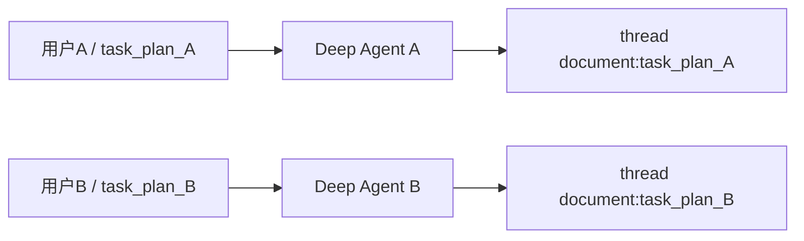
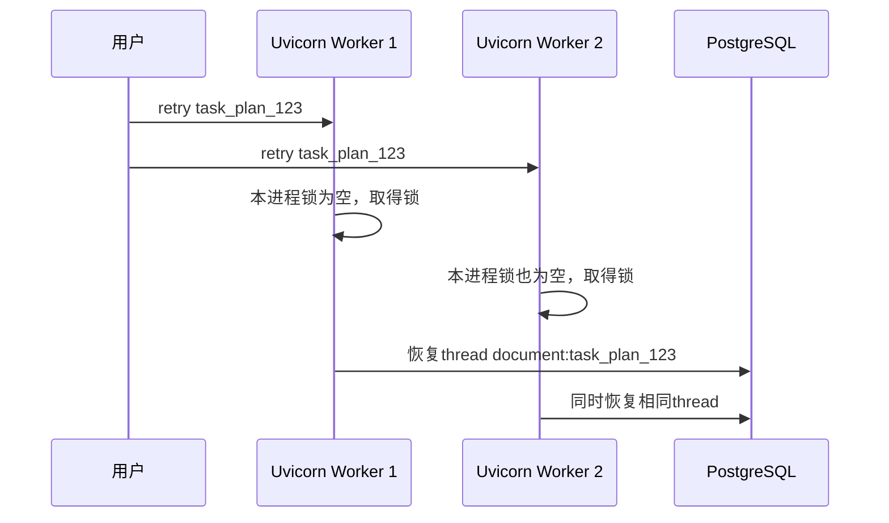

# 多 Worker / 多实例下 Agent TaskPlan 的重复执行与状态一致性问题

## 结论

问题确实存在，但主要不是传统的“多个线程同时修改变量”，也不是“多人同时使用”本身，而是同一个 `task_plan_id` 被不同 Uvicorn Worker 或不同应用实例同时执行时的业务一致性问题：

```
多进程/多实例之间的任务重复执行
PostgreSQL Store 记录的非原子版本更新
TaskPlan文件快照的最后写入覆盖
取消状态与运行结果之间的竞争
```

当前已经确认的安全边界是：

```
单个FastAPI进程
+ 不同用户执行不同task_plan_id
+ 同一Agent run内由局部锁保护的并行SubAgent
```

但如果生产部署为：

```
uvicorn fast_app.main:app --workers 4
```

或者部署多个容器实例，当前 Agent TaskPlan 控制机制还不能保证同一任务只被一个执行者处理。这个结论只针对 Agent TaskPlan 的执行、恢复、确认、取消和文件快照，不应扩大为“工程中所有 Worker 模块都不安全”。

## 本次核验范围

本结论来自当前真实代码、现有单进程锁回归以及三个隔离式并发复现：

- 单进程同一 TaskPlan 的第二个请求返回 `HTTP 409 / AGENT_TASK_PLAN_BUSY`，现有回归已通过。
- 两个独立 Python 进程针对同一个 `task_plan_id` 调用真实 `_TASK_PLAN_LOCKS.hold()`，两个进程都成功取得锁，证明该锁不能跨进程互斥。
- 两个旧写入者都以 `expected_version=1` 调用真实 `DeepDocumentRuntime.update_record()`，两者都返回 `record_version=2`，最终仅保留最后一次写入，证明当前实现不是数据库原子 CAS。
- 使用真实 `AgentTaskPlanStore` 复现 `cancelled` 保存后被旧运行快照覆盖为 `completed`，证明文件原子替换不能保证状态转换单调。

没有执行全服务并发压测。因此本文关于容量、延迟、连接池和外部服务配额的内容只能作为待验证风险，不能作为已通过的容量结论。

## 一、先区分三种“并发”

当前工程里存在三种并发。

### 1. asyncio 协程并发

FastAPI 请求、Research Worker、Deep Agent SubAgent 主要属于：

```
通常由一个事件循环线程调度
→ 一个asyncio事件循环
→ 多个协程交替执行
```

这类协程并发本身不等同于传统共享内存多线程竞争；但协程在 `await` 边界交错执行时，仍需由锁或原子持久化操作保护共享业务状态。

### 2. `asyncio.to_thread()` 线程并发

Checkpoint PostgreSQL 兼容层会把同步操作交给线程池：

```
asyncio事件循环
→ asyncio.to_thread()
→ 后台线程执行PostgresSaver
```

这一部分使用 `ConnectionPool` 和 `PostgresSaver`。当前代码检查没有发现适配器自身的明确线程安全缺陷，但本次没有对第三方实现做专项压力测试；已实际复现的问题位于其上层的 TaskPlan 所有权和条件更新语义。

### 3. Uvicorn 多 Worker

```
uvicorn fast_app.main:app --workers 4
```

会启动四个独立进程：

```
Worker进程1
Worker进程2
Worker进程3
Worker进程4
```

每个进程都有自己的：

```
asyncio.Lock
Python set
Python dict
内存对象
```

进程间完全不共享这些锁。这是当前最大的生产并发缺口。

## 二、不同用户执行不同任务是否安全

如果两个用户执行不同任务：

```
用户A → task_plan_A
用户B → task_plan_B
```

从任务身份和状态隔离上看，没有发现同一 TaskPlan 快照被共享的问题：

- `task_plan_id` 不同。
- LangGraph `thread_id` 不同。
- Runtime Store key 不同。
- Checkpoint 数据不同。
- TaskPlan JSON 文件不同。
- 每次 Deep Agent 都有独立 StateBackend。
- `candidates/read_snapshots` 是单次 `run()` 的局部对象。

因此下面这种场景在一致性边界上基本隔离，但这不等于已经通过容量或性能压测：

````

````

真正危险的是：

```
同一个task_plan_id
被两个请求、两个Worker或两个实例同时处理
```

这可能来自：

- 用户连续点击两次 retry。
- 前端重复提交 confirm。
- 负载均衡器重试请求。
- HTTP 客户端超时后自动重试。
- 两个管理员同时操作同一任务。
- 一个 Worker 超时，但实际仍在运行，另一个 Worker重新领取。

## 三、单进程内同任务并发已经有保护

当前锁位于：

[agent_task_executor.py (line 81)](D:/AI_Agent_Project/AI_Python_Project/python-agent-study/src/fast_app/services/agent_tasks/agent_task_executor.py:81)

```
class _TaskPlanLockRegistry:
```

它维护：

```
task_plan_id → asyncio.Lock
```

以下操作使用同一把锁：

```
首次文档任务execute
retry/resume
confirm
```

第二个并发请求不会排队后重复执行，而是返回：

```
HTTP 409
AGENT_TASK_PLAN_BUSY
```

因此，在单个 FastAPI 进程中：

```
请求1：retry task_plan_123 → 取得锁
请求2：retry task_plan_123 → HTTP 409
```

这部分对单进程同任务重复提交提供了有效保护，现有回归 `test_same_task_fail_fast_lock()` 已验证第二个请求会快速失败。

但是代码已经明确标注：

```
# ponytail: 当前仅保护单 FastAPI 进程；
# 部署多 Worker 时改为数据库租约/CAS。
```

## 四、多 Worker 时进程锁会失效

假设部署两个进程：

```
Worker 1拥有自己的_TASK_PLAN_LOCKS
Worker 2也拥有自己的_TASK_PLAN_LOCKS
```

执行过程可能变成：

````

````

两个独立 Python 进程的实际复现中，两边都成功取得了同一 `task_plan_id` 的锁，因此这不是仅靠推演得出的风险。

可能导致的后果包括：

- 相同 SubAgent 重复执行。
- LLM 调用和费用翻倍。
- 相同 LangGraph Thread 被并发更新。
- RuntimeRecord 相互覆盖。
- 两次生成不同草稿。
- 高风险 confirm 或其他带真实副作用的步骤被重复执行。
- 下游 GitLab、ES 或 Milvus 同步被重复触发。
- TaskPlan 最终状态由最后一个保存者决定。

这些是由“同一任务存在两个执行者”推导出的潜在后果；本次直接复现的是双重取得执行锁、RuntimeRecord 丢失更新和 TaskPlan 终态覆盖。该问题仍是多 Worker / 多实例部署前必须修复的高优先级问题。

## 五、`record_version` 还不是数据库原子锁

Runtime 更新位置：

[deep_document_runtime.py (line 439)](D:/AI_Agent_Project/AI_Python_Project/python-agent-study/src/fast_app/services/agent_tasks/deep_document_runtime.py:439)

当前过程是：

```
读取Store记录
→ 比较record_version
→ 在Python中构造新记录
→ Store.put()覆盖
```

概念代码：

```
current = await load_record(task_plan_id)

if current.record_version != expected_version:
    raise ConflictError()

new_record.record_version = current.record_version + 1
await store.put(...)
```

单进程有外层锁时可以串行工作。

但两个进程可能同时执行：

```
Worker 1读取version=5
Worker 2读取version=5

Worker 1检查expected=5，通过
Worker 2检查expected=5，也通过

Worker 1写入version=6
Worker 2也写入version=6
```

实际隔离复现中，两个旧写入者都以 `expected_version=1` 通过检查并返回 `record_version=2`，最终只保留最后一次写入。因此不会产生预期的版本冲突，而是发生“最后写入覆盖”。

因此当前 `record_version` 是：

> 已经定义好的乐观锁数据契约，但还不是 PostgreSQL 原子 CAS。

真正的多 Worker CAS 必须由数据库中的 TaskPlan/Runtime 事实记录完成条件更新。下面 SQL 只是目标语义示意，不代表当前已经存在名为 `deep_document_runtime` 的业务表：

```
UPDATE deep_document_runtime
SET
    record_version = record_version + 1,
    value = :new_value
WHERE
    task_plan_id = :task_plan_id
    AND record_version = :expected_version;
```

然后检查：

```
affected_rows == 1 → 更新成功
affected_rows == 0 → 版本冲突
```

## 六、TaskPlan JSON 存在最后写入覆盖风险

TaskPlan 存储位于：

[agent_task_plan_store.py (line 29)](D:/AI_Agent_Project/AI_Python_Project/python-agent-study/src/fast_app/services/agent_tasks/agent_task_plan_store.py:29)

当前写入使用：

```
临时文件
→ flush
→ fsync
→ os.replace()
```

这可以防止：

```
读取到只写了一半的JSON
```

但不能防止：

```
两个完整JSON相互覆盖
```

例如：

```
Worker 1读取status=running
Worker 2读取status=running

Worker 1增加SubAgent事件A
Worker 2增加SubAgent事件B

Worker 1保存JSON
Worker 2保存JSON

最终事件A丢失
```

准确地说：

```
os.replace解决“半文件”
不解决“丢失更新”
```

真实复现还确认：`cancelled` 快照保存后，持有旧 `running` 对象的执行路径仍可把最终 JSON 覆盖为 `completed`。这证明 `os.replace()` 只能保证单个文件不会处于半写状态，不能防止旧快照覆盖新终态。

JSON 是当前代码声明的唯一事实源，Markdown 是可重新生成的审查视图；两者是两次独立替换，并发写入时仍可能暂时出现：

```
JSON来自Worker 2
Markdown来自Worker 1
```

因此本地 JSON 不能继续作为多实例企业系统的唯一 TaskPlan 事实源，Markdown 也不能参与业务状态判定。

## 七、即使单进程，取消也存在一个窄竞争窗口

`cancel()` 位于：

[agent_task_executor.py (line 212)](D:/AI_Agent_Project/AI_Python_Project/python-agent-study/src/fast_app/services/agent_tasks/agent_task_executor.py:212)

它故意不等待任务锁，这是合理的，因为取消必须及时写入：

```
cancel API写入CANCELLED
→ 运行中的Agent在下一个模型/工具边界检测
→ 抛出CancelledError
```

但存在窄窗口：

```
Agent已经通过最后一次取消检查
→ cancel API保存CANCELLED
→ Agent随后使用旧plan对象保存COMPLETED/FAILED
→ CANCELLED被覆盖
```

Deep Agent 中间件会在模型和工具调用前检查取消：

[deep_document_agent.py (line 212)](D:/AI_Agent_Project/AI_Python_Project/python-agent-study/src/fast_app/services/agent_tasks/deep_document_agent.py:212)

Research、Document 和 Deep Agent 会在模型调用、工具调用及 Worker 合并等边界重新读取取消状态。这些检查能降低旧任务继续运行的概率，但“检查取消”和“保存最终状态”不是同一原子事务，不能替代持久化层的条件状态更新。

正确的数据库状态转换应限制：

```
UPDATE agent_task_plans
SET status = 'completed'
WHERE task_plan_id = :id
  AND status = 'running';
```

如果任务已被改成 `cancelled`：

```
affected_rows = 0
→ 运行协程不得覆盖取消状态
```

## 八、单次运行内的并行 SubAgent 已有局部锁

Deep Agent 有两把局部锁。

### Runtime 事实锁

[deep_document_agent.py (line 1003)](D:/AI_Agent_Project/AI_Python_Project/python-agent-study/src/fast_app/services/agent_tasks/deep_document_agent.py:1003)

```
runtime_write_lock = asyncio.Lock()
```

保护并行 Researcher 更新：

```
candidates
read_snapshots
used_tools
record_version
```

### Coordinator 进度锁

[deep_document_agent.py (line 414)](D:/AI_Agent_Project/AI_Python_Project/python-agent-study/src/fast_app/services/agent_tasks/deep_document_agent.py:414)

```
self._save_lock = asyncio.Lock()
```

保护同一个 Deep Agent 图中并行 `task` 工具写入进度事件。

Research Executor 也有自己的：

```
snapshot_lock = asyncio.Lock()
```

用于合并同一波次 Worker 的进度。

因此：

```
同一个进程
同一个Agent run
同一事件循环中的并行SubAgent
```

已经有对应的局部锁保护。

但是这些锁都是单次运行或单进程对象，无法保护另一个 Uvicorn Worker。

## 九、本次已确认的问题位于 Checkpoint 上层

当前兼容层使用：

```
PostgresSaver
ConnectionPool
asyncio.to_thread()
```

`ConnectionPool` 负责跨线程借还数据库连接。当前代码检查没有发现 `_AsyncPostgresSaverAdapter` 自身的明确线程竞争，但本次没有对第三方 `PostgresSaver` 做专项并发压测，因此不把“Checkpoint 线程安全已经完整验收”作为结论。

真正的问题在 Saver 上层：

```
谁有权恢复同一个thread_id
谁可以同时执行同一个TaskPlan
任务状态能否被条件更新
```

即使 PostgreSQL 可以安全保存两个请求，它也无法自动判断：

```
这两个请求中哪个才是合法的任务所有者
```

因此需要业务级租约或数据库锁。

## 十、当前企业并发安全评价

| 场景                                   | 当前状态                     |
| -------------------------------------- | ---------------------------- |
| 单进程，不同用户执行不同 TaskPlan      | 一致性上基本隔离；容量未压测 |
| 单进程，同 TaskPlan 双击 retry/confirm | 已返回 409                   |
| 单次 Deep Agent 内并行 SubAgent        | 有局部锁保护                 |
| `to_thread()` 并行访问 PostgreSQL      | 未发现适配器明确缺陷；未专项压测 |
| cancel 与任务最后保存同时发生          | 存在窄竞争窗口               |
| 多 Uvicorn Worker 执行同 TaskPlan      | 不安全                       |
| 多容器实例执行同 TaskPlan              | 不安全                       |
| `record_version` 多进程并发更新        | 不是原子 CAS                 |
| TaskPlan JSON 多进程并发保存           | 可能最后写入覆盖             |
| 多服务器各自使用本地 runtime 目录      | TaskPlan 状态不共享          |

所以准确结论是：

> 当前一致性实现只覆盖单 FastAPI 进程内的 TaskPlan 执行边界；尚不能宣称具备企业多 Worker、多实例下的任务并发一致性。

### 不要扩大到所有 Worker 模块

本问题只针对 Agent TaskPlan。GitLab 同步 Worker 与 Office ingestion Worker 已经使用数据库行锁、`FOR UPDATE SKIP LOCKED`、`worker_id`、租约到期时间、续租/所有权检查以及带 `rowcount` 的条件更新。它们仍需各自测试，但不能因为 Agent TaskPlan 存在缺口，就笼统认定整个工程的所有 Worker 都缺少多实例并发控制。

## 十一、生产化修复优先级

### P0：把 TaskPlan 业务事实迁入 PostgreSQL

至少保存：

```
task_plan_id
record_version
status
owner_user_id
lease_owner
lease_until
snapshot_json
updated_at
```

JSON/Markdown 文件可以继续作为人工审查导出，但不能继续作为多实例的唯一事实源。

### P0：同任务使用数据库租约

领取执行权时进行条件更新：

```
status允许执行
并且lease已过期或属于自己
→ 写入worker_id和lease_until
```

运行期间心跳续租，失去租约后禁止：

```
继续调用新工具
保存最终状态
确认真实文档写入
提交Checkpoint结果
```

### P0：将版本更新改为数据库原子 CAS

不能继续使用：

```
Python读取
→ Python比较
→ 普通put覆盖
```

必须使用：

```
UPDATE ... WHERE record_version=:expected
```

### P1：状态转换必须单调且带条件

例如：

```
running → cancelled
running → failed
running → waiting_confirmation
waiting_confirmation → completed
```

已经 `cancelled` 的任务不能再被旧协程保存为 `completed`。

### P1：增加多进程并发测试

至少模拟：

```
两个独立进程同时retry
两个独立进程同时confirm
cancel与completed竞争
两个Worker同时更新record_version
一个Worker失去租约后尝试继续保存
```

因此，当前最应该优先修复的不是 `asyncio.to_thread()`，而是：

```
TaskPlan PostgreSQL化
→ 数据库租约
→ 原子record_version CAS
→ 条件状态转换
```

在这些完成前，生产部署应暂时保持单 Uvicorn Worker，并确保同一运行目录只被一个应用实例写入。


# 10–15 人使用场景：容量尚未验收

## 准确结论

“注册用户数”“同时在线人数”和“同时运行复杂 Agent 的数量”是不同指标。当前代码检查只能支持以下判断：

- 10–15 个注册用户、低并发内部试用在架构上是合理定位，但这不是压测结论。
- 不同用户使用不同 `task_plan_id` 时，不会触发本文已确认的同任务重复执行问题。
- 不能宣称系统已支持 10–15 人同时运行复杂 Research 或 Deep Document Agent。
- 当前缺少全服务级复杂 Agent 并发限制、真实并发压测、P95 延迟、外部 429、连接池等待和一致性验收数据。

因此，旧表格中“1–3 个普通 RAG 可以”“1 个 Research 可以”“复杂任务最多 1–2 个”等数字不能作为已验证容量，已删除这些无压测依据的断言。

## 为什么复杂 Agent 不能按 HTTP 请求数估算

普通 RAG 与复杂 Research / Deep Document Agent 的调用放大不同。复杂任务可能拆分多个子问题，并调用检索、Reranker、Evaluator LLM、答案生成 LLM、WebSearch 或 MCP。假设多个用户同时启动复杂任务，外部调用数量会按每个任务的 Worker 和工具调用继续放大。

这只能说明需要压测和容量保护，不能仅凭一次历史验收的耗时或模型调用次数，推导整个服务能支持多少并发用户。历史单任务结果也不能代替多任务并发验收。

## 当前配置是单任务限制，不是全服务容量限制

当前 Research 配置位于：

[config.py (line 301)](D:/AI_Agent_Project/AI_Python_Project/python-agent-study/src/fast_app/core/config.py:301)

默认值包括：

```
每个TaskPlan最多8个子问题
每一波最多4个并行Worker
每个Worker最多4次工具调用
每个Worker最多2轮纠正
```

Deep Document Agent 也有单任务模型调用上限和 Worker 超时：

[config.py (line 355)](D:/AI_Agent_Project/AI_Python_Project/python-agent-study/src/fast_app/core/config.py:355)

[config.py (line 412)](D:/AI_Agent_Project/AI_Python_Project/python-agent-study/src/fast_app/core/config.py:412)

这些限制约束的是单个任务，不是整个 FastAPI 服务。当前没有全服务级 Research / Deep Document Agent 并发信号量或任务队列，所以不能从“每个任务最多 4 个 Worker”推导服务总并发上限。

## 数据库与文件 I/O 仍需通过压测判断

SQLAlchemy 数据库连接池默认配置位于：

[config.py (line 526)](D:/AI_Agent_Project/AI_Python_Project/python-agent-study/src/fast_app/core/config.py:526)

```
DATABASE_POOL_SIZE=5
DATABASE_MAX_OVERFLOW=10
```

这些配置值本身不能证明 10–15 人场景容量充足，也不能证明数据库一定是首要瓶颈。压测时至少应观察：

- 连接池等待时间、活跃连接数和 PostgreSQL CPU。
- Checkpoint / Store 读写耗时。
- 外部模型、Reranker 和 WebSearch 的 429、超时与 P95 延迟。
- `asyncio.to_thread()` 线程池排队和事件循环延迟。
- TaskPlan JSON/Markdown 同步写盘耗时。
- TaskPlan、RuntimeRecord 与 Checkpoint 的最终一致性。

TaskPlan 存储使用同步文件操作：

[agent_task_plan_store.py (line 29)](D:/AI_Agent_Project/AI_Python_Project/python-agent-study/src/fast_app/services/agent_tasks/agent_task_plan_store.py:29)

```
序列化完整TaskPlan
→ 写临时JSON
→ fsync
→ os.replace
→ 渲染并写入Markdown审查视图
```

它可能成为并发进度更新时的延迟来源，但在没有测量前，不应把它写成已经确认的吞吐瓶颈。

## 修复一致性前的部署边界

在 TaskPlan 数据库事实表、租约、原子 CAS 和条件状态转换完成前，应使用：

```powershell
uvicorn fast_app.main:app --host 0.0.0.0 --port 8000 --workers 1
```

并同时满足：

- 只运行一个 FastAPI 实例。
- `runtime/agent-task-plans` 只由这个实例写入。
- 不让多个实例共同承担同一 TaskPlan 的恢复、retry 或 confirm。
- 前端收到 `AGENT_TASK_PLAN_BUSY` 时展示任务忙状态，不自动重复提交。
- confirm 不由客户端或负载均衡器自动重试。

这组限制是为规避已确认的一致性缺口，不代表单 Worker 已经通过 10–15 人容量验收。

## 容量保护与验收建议

全服务级复杂任务并发限制、队列、429/503 以及 `retry_after_seconds` 都是合理的生产化方向，但具体阈值必须依据模型配额、数据库连接池、机器规格和压测结果确定，不能在当前文档中预设“Research 2 个、Deep Agent 1 个”就是正确容量。

正式承诺容量前，应设计包含普通 RAG、Research 和 Deep Document Agent 的混合负载，逐级增加并发并持续运行，记录：

- 吞吐、错误率和 P50/P95/P99 延迟。
- 外部服务 429、超时与重试次数。
- 事件循环延迟、线程池排队和数据库连接池等待。
- TaskPlan 重复执行、取消终态覆盖、RuntimeRecord 丢失更新和 Checkpoint 冲突。
- 压测结束后的 TaskPlan、RuntimeRecord、Checkpoint、GitLab、ES 与 Milvus 最终状态。

只有验收指标、机器规格、外部服务配额和测试负载都被记录后，才能把“支持 10–15 人内部使用”写成经过验证且可复现的工程结论。
