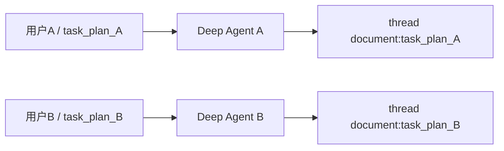
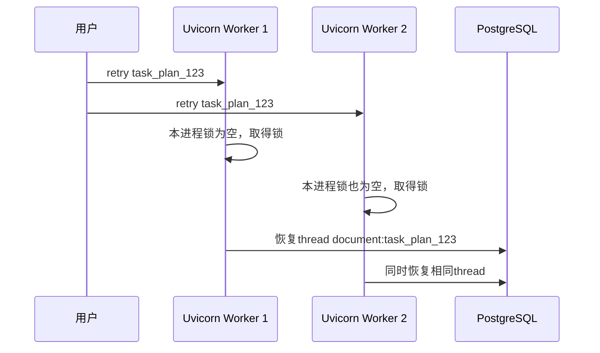

# 服务器部署多个Worker实例时的问题：

## 结论

会有并发风险，但主要不是传统的“多个线程同时修改变量”，而是：

```
多进程/多实例之间的任务重复执行
PostgreSQL记录的非原子版本更新
TaskPlan文件快照的最后写入覆盖
取消状态与运行结果之间的竞争
```

当前实现可以支持：

```
单个FastAPI进程
+ 多个用户执行不同task_plan_id
+ 同一任务有限的并行SubAgent
```

但如果生产部署为：

```
uvicorn fast_app.main:app --workers 4
```

或者部署多个容器实例，当前任务控制机制还不能保证企业级并发安全。

## 一、先区分三种“并发”

当前工程里存在三种并发。

### 1. asyncio 协程并发

FastAPI 请求、Research Worker、Deep Agent SubAgent 主要属于：

```
一个Python线程
→ 一个asyncio事件循环
→ 多个协程交替执行
```

这不是多个线程同时执行 Python 代码。

### 2. `asyncio.to_thread()` 线程并发

Checkpoint PostgreSQL 兼容层会把同步操作交给线程池：

```
asyncio事件循环
→ asyncio.to_thread()
→ 后台线程执行PostgresSaver
```

这一部分使用官方 `ConnectionPool` 和 `PostgresSaver`，没有发现明显的线程不安全问题。

### 3. Uvicorn 多 Worker

```
uvicorn fast_app.main:app --workers 4
```

会启动四个独立进程：

```
Worker进程1
Worker进程2
Worker进程3
Worker进程4
```

每个进程都有自己的：

```
asyncio.Lock
Python set
Python dict
内存对象
```

进程间完全不共享这些锁。这是当前最大的生产并发缺口。

## 二、不同用户执行不同任务是否安全

如果两个用户执行不同任务：

```
用户A → task_plan_A
用户B → task_plan_B
```

整体上没有明显冲突：

- `task_plan_id` 不同。
- LangGraph `thread_id` 不同。
- Runtime Store key 不同。
- Checkpoint 数据不同。
- TaskPlan JSON 文件不同。
- 每次 Deep Agent 都有独立 StateBackend。
- `candidates/read_snapshots` 是单次 `run()` 的局部对象。

因此下面这种场景目前可以正常并发：

````

````

真正危险的是：

```
同一个task_plan_id
被两个请求、两个Worker或两个实例同时处理
```

这可能来自：

- 用户连续点击两次 retry。
- 前端重复提交 confirm。
- 负载均衡器重试请求。
- HTTP 客户端超时后自动重试。
- 两个管理员同时操作同一任务。
- 一个 Worker 超时，但实际仍在运行，另一个 Worker重新领取。

## 三、单进程内同任务并发已经有保护

当前锁位于：

[agent_task_executor.py (line 70)](D:/AI_Agent_Project/AI_Python_Project/python-agent-study/src/fast_app/services/agent_tasks/agent_task_executor.py:70)

```
class _TaskPlanLockRegistry:
```

它维护：

```
task_plan_id → asyncio.Lock
```

以下操作使用同一把锁：

```
首次文档任务execute
retry/resume
confirm
```

第二个并发请求不会排队后重复执行，而是返回：

```
HTTP 409
AGENT_TASK_PLAN_BUSY
```

因此，在单个 FastAPI 进程中：

```
请求1：retry task_plan_123 → 取得锁
请求2：retry task_plan_123 → HTTP 409
```

这部分设计是正确的。

但是代码已经明确标注：

```
# ponytail: 当前仅保护单 FastAPI 进程；
# 部署多 Worker 时改为数据库租约/CAS。
```

## 四、多 Worker 时进程锁会失效

假设部署两个进程：

```
Worker 1拥有自己的_TASK_PLAN_LOCKS
Worker 2也拥有自己的_TASK_PLAN_LOCKS
```

执行过程可能变成：

````

````

两边都会认为自己拥有任务。

可能导致：

- 相同 SubAgent 重复执行。
- LLM 调用和费用翻倍。
- 相同 LangGraph Thread 被并发更新。
- RuntimeRecord 相互覆盖。
- 两次生成不同草稿。
- 两个 confirm 同时执行真实文件修改。
- ES/Milvus 被重复更新。
- TaskPlan 最终状态由最后一个保存者决定。

这是生产前必须修复的高优先级问题。

## 五、`record_version` 还不是数据库原子锁

Runtime 更新位置：

[deep_document_runtime.py (line 439)](D:/AI_Agent_Project/AI_Python_Project/python-agent-study/src/fast_app/services/agent_tasks/deep_document_runtime.py:439)

当前过程是：

```
读取Store记录
→ 比较record_version
→ 在Python中构造新记录
→ Store.put()覆盖
```

概念代码：

```
current = await load_record(task_plan_id)

if current.record_version != expected_version:
    raise ConflictError()

new_record.record_version = current.record_version + 1
await store.put(...)
```

单进程有外层锁时可以工作。

但两个进程可能同时执行：

```
Worker 1读取version=5
Worker 2读取version=5

Worker 1检查expected=5，通过
Worker 2检查expected=5，也通过

Worker 1写入version=6
Worker 2也写入version=6
```

最终不会产生版本冲突，而是发生“最后写入覆盖”。

因此当前 `record_version` 是：

> 已经定义好的乐观锁数据契约，但还不是 PostgreSQL 原子 CAS。

真正的多 Worker CAS 必须类似：

```
UPDATE deep_document_runtime
SET
    record_version = record_version + 1,
    value = :new_value
WHERE
    task_plan_id = :task_plan_id
    AND record_version = :expected_version;
```

然后检查：

```
affected_rows == 1 → 更新成功
affected_rows == 0 → 版本冲突
```

## 六、TaskPlan JSON 存在最后写入覆盖风险

TaskPlan 存储位于：

[agent_task_plan_store.py (line 16)](D:/AI_Agent_Project/AI_Python_Project/python-agent-study/src/fast_app/services/agent_tasks/agent_task_plan_store.py:16)

当前写入使用：

```
临时文件
→ flush
→ fsync
→ os.replace()
```

这可以防止：

```
读取到只写了一半的JSON
```

但不能防止：

```
两个完整JSON相互覆盖
```

例如：

```
Worker 1读取status=running
Worker 2读取status=running

Worker 1增加SubAgent事件A
Worker 2增加SubAgent事件B

Worker 1保存JSON
Worker 2保存JSON

最终事件A丢失
```

准确地说：

```
os.replace解决“半文件”
不解决“丢失更新”
```

而且 JSON 和 Markdown 是两次独立替换。并发写入时还可能出现：

```
JSON来自Worker 2
Markdown来自Worker 1
```

在单机人工验收阶段问题不大，但不能作为多实例企业系统的任务事实库。

## 七、即使单进程，取消也存在一个窄竞争窗口

`cancel()` 位于：

[agent_task_executor.py (line 196)](D:/AI_Agent_Project/AI_Python_Project/python-agent-study/src/fast_app/services/agent_tasks/agent_task_executor.py:196)

它故意不等待任务锁，这是合理的，因为取消必须及时写入：

```
cancel API写入CANCELLED
→ 运行中的Agent在下一个模型/工具边界检测
→ 抛出CancelledError
```

但存在窄窗口：

```
Agent已经通过最后一次取消检查
→ cancel API保存CANCELLED
→ Agent随后使用旧plan对象保存COMPLETED/FAILED
→ CANCELLED被覆盖
```

Deep Agent 中间件会在模型和工具调用前检查取消：

[deep_document_agent.py (line 169)](D:/AI_Agent_Project/AI_Python_Project/python-agent-study/src/fast_app/services/agent_tasks/deep_document_agent.py:169)

这是必要保护，但不能完全替代持久化层的条件状态更新。

正确的数据库状态转换应限制：

```
UPDATE agent_task_plans
SET status = 'completed'
WHERE task_plan_id = :id
  AND status = 'running';
```

如果任务已被改成 `cancelled`：

```
affected_rows = 0
→ 运行协程不得覆盖取消状态
```

## 八、并行 SubAgent 在单次运行内大体安全

Deep Agent 有两把局部锁。

### Runtime 事实锁

[deep_document_agent.py (line 386)](D:/AI_Agent_Project/AI_Python_Project/python-agent-study/src/fast_app/services/agent_tasks/deep_document_agent.py:386)

```
runtime_write_lock = asyncio.Lock()
```

保护并行 Researcher 更新：

```
candidates
read_snapshots
used_tools
record_version
```

### Coordinator 进度锁

[deep_document_agent.py (line 193)](D:/AI_Agent_Project/AI_Python_Project/python-agent-study/src/fast_app/services/agent_tasks/deep_document_agent.py:193)

```
self._save_lock = asyncio.Lock()
```

保护同一个 Deep Agent 图中并行 `task` 工具写入进度事件。

Research Executor 也有自己的：

```
snapshot_lock = asyncio.Lock()
```

用于合并同一波次 Worker 的进度。

因此：

```
同一个进程
同一个Agent run
同一事件循环中的并行SubAgent
```

已经有合理保护。

但是这些锁都是单次运行或单进程对象，无法保护另一个 Uvicorn Worker。

## 九、Checkpoint PostgreSQL 本身不是主要问题

当前兼容层使用：

```
PostgresSaver
ConnectionPool
asyncio.to_thread()
```

`ConnectionPool` 用于多线程安全地借还数据库连接，官方 `PostgresSaver` 内部也有同步锁。当前没有看到 Saver 适配器自身存在明显的线程竞争。

真正的问题在 Saver 上层：

```
谁有权恢复同一个thread_id
谁可以同时执行同一个TaskPlan
任务状态能否被条件更新
```

即使 PostgreSQL 可以安全保存两个请求，它也无法自动判断：

```
这两个请求中哪个才是合法的任务所有者
```

因此需要业务级租约或数据库锁。

## 十、当前企业并发安全评价

| 场景                                   | 当前状态                     |
| -------------------------------------- | ---------------------------- |
| 单进程，不同用户执行不同 TaskPlan      | 基本安全                     |
| 单进程，同 TaskPlan 双击 retry/confirm | 已返回 409                   |
| 单次 Deep Agent 内并行 SubAgent        | 有局部锁保护                 |
| `to_thread()` 并行访问 PostgreSQL      | 官方连接池/Saver负责线程安全 |
| cancel 与任务最后保存同时发生          | 存在窄竞争窗口               |
| 多 Uvicorn Worker 执行同 TaskPlan      | 不安全                       |
| 多容器实例执行同 TaskPlan              | 不安全                       |
| `record_version` 多进程并发更新        | 不是原子 CAS                 |
| TaskPlan JSON 多进程并发保存           | 可能最后写入覆盖             |
| 多服务器各自使用本地 runtime 目录      | TaskPlan 状态不共享          |

所以准确结论是：

> 当前实现适合单进程学习、人工验收和有限用户测试，但还不能直接宣称具备企业多 Worker、多实例下的任务并发一致性。

## 十一、生产化修复优先级

### P0：把 TaskPlan 业务事实迁入 PostgreSQL

至少保存：

```
task_plan_id
record_version
status
owner_user_id
lease_owner
lease_until
snapshot_json
updated_at
```

JSON/Markdown 文件可以继续作为人工审查导出，但不能继续作为多实例的唯一事实源。

### P0：同任务使用数据库租约

领取执行权时进行条件更新：

```
status允许执行
并且lease已过期或属于自己
→ 写入worker_id和lease_until
```

运行期间心跳续租，失去租约后禁止：

```
继续调用新工具
保存最终状态
确认真实文档写入
提交Checkpoint结果
```

### P0：将版本更新改为数据库原子 CAS

不能继续使用：

```
Python读取
→ Python比较
→ 普通put覆盖
```

必须使用：

```
UPDATE ... WHERE record_version=:expected
```

### P1：状态转换必须单调且带条件

例如：

```
running → cancelled
running → failed
running → waiting_confirmation
waiting_confirmation → completed
```

已经 `cancelled` 的任务不能再被旧协程保存为 `completed`。

### P1：增加多进程并发测试

至少模拟：

```
两个独立进程同时retry
两个独立进程同时confirm
cancel与completed竞争
两个Worker同时更新record_version
一个Worker失去租约后尝试继续保存
```

因此，当前最应该优先修复的不是 `asyncio.to_thread()`，而是：

```
TaskPlan PostgreSQL化
→ 数据库租约
→ 原子record_version CAS
→ 条件状态转换
```

在这些完成前，生产部署应暂时保持单 Uvicorn Worker，并确保同一运行目录只被一个应用实例写入。


# 10-15人使用场景是否满足 分析：

## 结论

如果“10–15 人使用”指：

```
10–15 个内部用户
平时零散访问
同时在线大约 2–5 人
复杂 Research/文档任务同时最多 1–2 个
```

那么当前单进程实例可以作为企业内部试用或小团队系统使用。

如果指：

```
10–15 人同时发起多Agent Research
或同时执行Deep Agent文档任务
```

当前实现不适合，主要会遇到外部模型限流、延迟激增、线程池/连接池竞争和任务快照覆盖风险。

## 人数不等于并发数

下面两种“15 人使用”差别非常大。

### 场景一：零散使用

```
15个账号
→ 同时只有2个人问普通RAG
→ 偶尔1个人启动Research
→ 偶尔1个人生成文档方案
```

这种负载当前架构大概率可以承受。

### 场景二：集中使用

```
15个人
→ 同时启动15个复杂Research
→ 每个Research最多并行4个Worker
```

理论上会瞬间形成：

```
15个Research任务
× 每个最多4个并行Worker
= 60个Research Worker
```

每个 Worker 还可能继续调用：

```
Retriever
Embedding
Reranker
Evaluator LLM
答案生成 LLM
WebSearch
MCP
```

这远不是“15 个普通 HTTP 请求”，而可能是几十个同时进行的外部模型和检索调用。

## 当前适合的负载范围

| 使用场景                          | 当前单进程判断                       |
| --------------------------------- | ------------------------------------ |
| 10–15 个已注册内部用户            | 可以                                 |
| 1–3 个普通 RAG 同时执行           | 可以作为试用                         |
| 3–5 个普通 RAG 同时执行           | 大概率可以，但需要压测证明           |
| 1 个复杂 Research                 | 可以                                 |
| 2 个不同 TaskPlan 的复杂 Research | 可以尝试，延迟和外部配额可能明显增加 |
| 1 个 Deep Agent 文档任务          | 已有真实链路验证                     |
| 2 个不同文档任务同时执行          | 可能运行，但尚无真实并发验收         |
| 5 个以上复杂 Agent 同时执行       | 不建议                               |
| 10–15 个复杂 Agent 同时执行       | 当前不支持                           |
| 两人同时 retry/confirm 同一个任务 | 单进程锁会拒绝第二个请求             |
| 多 Uvicorn Worker/多实例          | 当前不安全                           |

## 为什么普通 RAG 更容易承受

普通 RAG 大致是：

```
一次检索
→ 一次Rerank
→ 一次LLM回答
```

大部分时间在等待外部网络，FastAPI 的异步模型可以在等待期间处理其他请求。

复杂 Research 则可能是：

```
多个子问题
→ 每个子问题多个工具
→ 每轮生成候选答案
→ 每轮Evaluator
→ 最多两次纠正
→ 最后一次综合
```

所以一个复杂 Research 的负载可能相当于多个普通 RAG 请求。

## Deep Agent 的负载更重

当前真实 Deep Agent 验收结果是：

```
耗时：108.5秒
真实模型调用：17次
```

也就是说，一个文档任务就可能占用接近两分钟，并产生十多次外部模型调用。

如果 5 人同时执行：

```
5 × 17
≈ 85次模型调用
```

真正先到瓶颈的通常不是 Python CPU，而是：

- Qwen API 并发和 RPM/TPM 限制。
- DashScope Reranker 配额。
- Bocha WebSearch 配额。
- ES/Milvus 查询延迟。
- PostgreSQL连接。
- `to_thread()` 默认线程池。
- TaskPlan JSON 频繁同步写盘。

## 当前配置是“每个任务限制”，不是“整个服务限制”

当前 Research 配置：

[config.py (line 248)](D:/AI_Agent_Project/AI_Python_Project/python-agent-study/src/fast_app/core/config.py:248)

```
每个TaskPlan最多8个子问题
每一波最多4个并行Worker
每个Worker最多4次工具调用
每个Worker最多2轮纠正
```

这里的“最多并行 4 个 Worker”是：

```
每个Research任务最多4个
```

不是：

```
整个FastAPI服务最多4个
```

例如 5 个用户同时启动 Research：

```
5 × 4 = 最多20个并行Worker
```

当前没有全局 Agent 并发信号量或任务队列限制。

## PostgreSQL连接池不是主要瓶颈，但也需要监控

当前配置是：

```
DATABASE_POOL_SIZE=5
DATABASE_MAX_OVERFLOW=10
```

位置：

[config.py (line 408)](D:/AI_Agent_Project/AI_Python_Project/python-agent-study/src/fast_app/core/config.py:408)

单个 SQLAlchemy Engine 最多可以临时达到约 15 个连接；Deep Agent Runtime 还创建了自己的 psycopg 连接池。

对于 10–15 人零散使用通常够用，但复杂任务集中执行时需要观察：

```
连接池等待时间
活跃连接数
PostgreSQL CPU
Checkpoint写入耗时
```

不能只根据连接池数字判断容量。

## TaskPlan 文件存储也限制了单实例吞吐

当前 TaskPlan 使用本地 JSON/Markdown：

[agent_task_plan_store.py (line 16)](D:/AI_Agent_Project/AI_Python_Project/python-agent-study/src/fast_app/services/agent_tasks/agent_task_plan_store.py:16)

每次 Worker 进度变化都可能执行：

```
序列化完整TaskPlan
→ 写临时JSON
→ fsync
→ os.replace
→ 渲染Markdown
→ 再写Markdown
```

这些是同步文件操作。少量任务没有问题，但多个复杂任务持续上报进度时，可能短暂阻塞单进程事件循环。

这也是为什么它适合当前小团队单实例，而不适合作为高并发生产任务存储。

## 当前建议的部署边界

现阶段部署时应明确使用：

```
uvicorn fast_app.main:app --host 0.0.0.0 --port 8000 --workers 1
```

不要使用：

```
--workers 4
```

同时满足：

- 只运行一个 FastAPI 实例。
- `runtime/agent-task-plans` 只由这个实例写入。
- 复杂 Agent 任务同时最多允许 1–2 个。
- 普通 RAG 可以并行，但要监控外部服务 429 和超时。
- 真实文档 confirm 不允许前端自动重试。
- 前端遇到 `AGENT_TASK_PLAN_BUSY` 时显示“任务正在执行”，不要重复请求。

## 上线前最小补强

对于 10–15 人内部试用，不需要立刻引入 Celery 或完整分布式任务队列。最小补强是增加一个进程级复杂任务并发限制，例如：

```
全服务同时：
Research TaskPlan最多2个
Deep Agent文档任务最多1个
普通RAG不进入这个限制
```

超过限制时返回结构化的：

```
HTTP 429或503
AGENT_CAPACITY_EXCEEDED
retry_after_seconds
```

这可以避免 10 人同时点击复杂任务时，把外部模型配额和单进程资源瞬间耗尽。

## 最终判断

当前系统的合理定位是：

> 可以支持 10–15 人的小团队低并发内部试用，但不能支持 10–15 人同时运行复杂多 Agent 任务。

正式承诺容量前，还缺少一次真实并发验收。建议至少模拟：

```
3个普通RAG
+ 1个Research
+ 1个Deep Agent文档任务
```

连续运行 20–30 分钟，观察错误率、外部 429、P95 延迟、事件循环阻塞、连接池和 TaskPlan/Checkpoint 一致性。只有这组测试通过，才能把“支持 10–15 人内部使用”写成经过验证的工程结论。