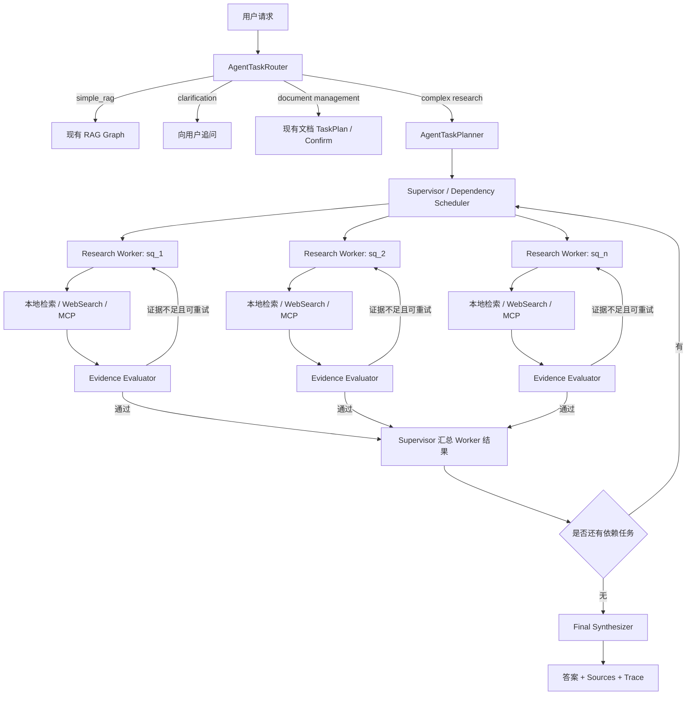
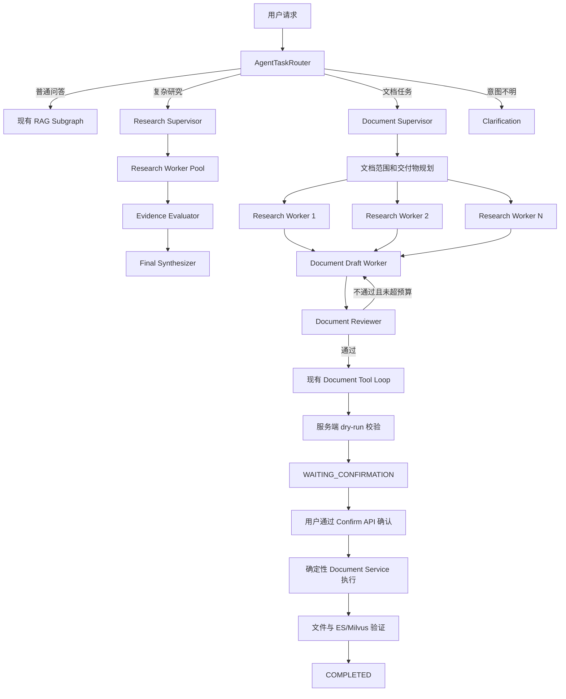
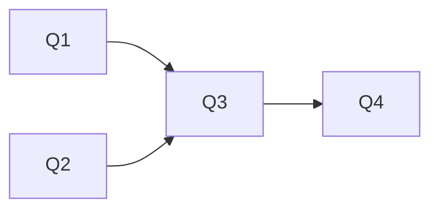
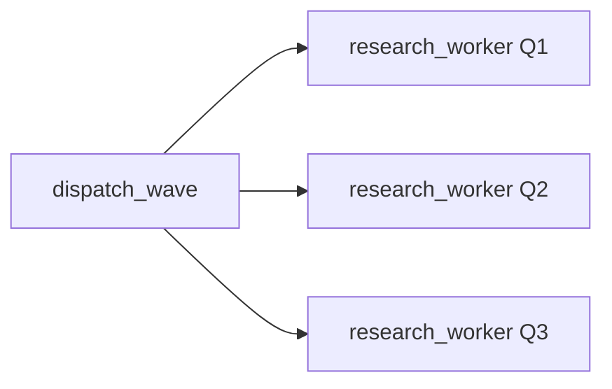
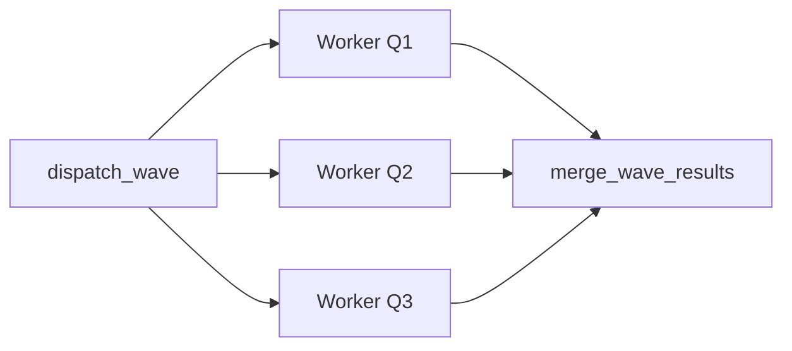
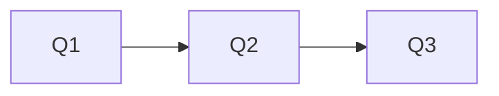
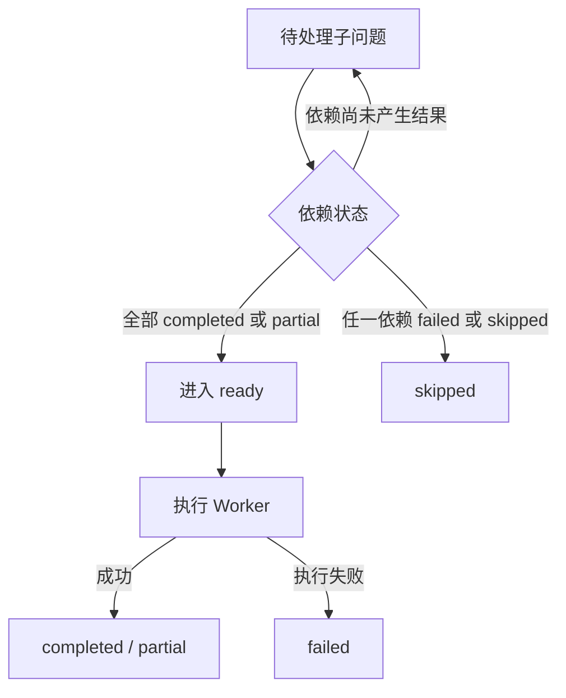
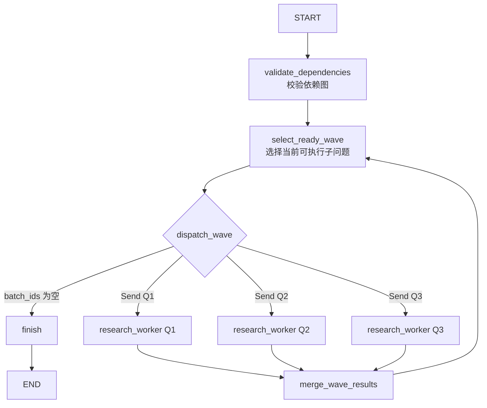

# 根据当前工程完成度，评估建议：

~~~
目前工程已经具备了多种文件类型的处理能力，也具备了复杂任务执行的能力，但是目前仍然是由单个Agent按照顺序执行任务，而不是编排多个Agent，每个Agent执行指定的任务的多Agent架构。单个Agent执行复杂任务会遇到很多问题，包括任务完成质量不稳定的情况。多Agent架构可以让当前系统的能力提升到Agentic RAG。
例如：{
Supervisor Agent：负责判断任务类型和调度
Retriever Agent：负责检索本地知识库
Evaluator Agent：负责评估检索结果是否足够
WebSearch Agent：负责联网搜索
Answer Agent：负责生成最终回答
}
请给出你的建议
~~~


## 结论

你的判断方向是正确的：当前工程已经具备升级为 Agentic RAG 的大部分基础能力，下一步确实应该从“单个执行器完成所有复杂任务”演进到“编排器调度多个受控研究 Worker”。

但我不建议直接实现五个都带独立 LLM、独立上下文和独立工具循环的 Agent：

```
Supervisor Agent
Retriever Agent
Evaluator Agent
WebSearch Agent
Answer Agent
```

更适合当前工程的是：

```
Supervisor / Orchestrator
    ├─ 多个并行 Research Worker Agent
    │    ├─ knowledge_retrieval 工具
    │    ├─ web_search 工具
    │    └─ MCP 只读工具
    ├─ Evidence Evaluator 节点
    └─ Final Synthesizer 节点
```

也就是说：

- 真正需要自主决策和工具循环的是 `Research Worker`。
- Retriever、WebSearch 更适合作为工具，不需要包装成完整 Agent。
- Evaluator、Answer 更适合作为职责固定的 LLM 节点，不需要拥有自由工具调用能力。
- Supervisor 复用当前 Router、Planner 和 TaskPlan，不重新造一套。

这会得到真正的 Agentic RAG，同时避免五套 Agent 上下文、Prompt、循环和错误处理互相放大复杂度。

## 当前工程的真实状态

你的“当前仍是单个 Agent 顺序执行”基本正确，但需要补充几个细节。

### 1. 已经有 Supervisor 的部分能力

当前 `AgentTaskRouter` 已经负责结构化任务分类：

- `simple_rag`
- `question_decomposition`
- `knowledge_document_management`
- `web_research`
- `clarification_required`

位置：

[agent_task_router.py (line 136)](D:/AI_Agent_Project/AI_Python_Project/python-agent-study/src/fast_app/services/agent_tasks/agent_task_router.py:136)

但它目前只是 Router，不是完整 Supervisor。

两者区别是：

- Router：做一次分类，然后把请求交给固定分支。
- Supervisor：在执行过程中持续观察子任务结果，再决定启动哪个 Worker、是否重试、是否换数据源、何时结束。

LangChain 官方也明确区分了 Router 和 Supervisor：Supervisor 是持续维护上下文并动态调度子 Agent 的完整 Agent，而 Router 通常只是一次分类和分发。[LangChain Subagents 官方文档](https://docs.langchain.com/oss/python/langchain/multi-agent/subagents)

### 2. 已经有 Planner

当前 `AgentTaskPlanner` 可以把复杂问题拆成：

```
objective
sub_questions
depends_on
information_source_hint
expected_evidence
final_synthesis_instruction
```

其中 `depends_on` 和 `expected_evidence` 正是实现多 Agent 编排需要的关键字段。

位置：

[agent_task_planner.py (line 40)](D:/AI_Agent_Project/AI_Python_Project/python-agent-study/src/fast_app/services/agent_tasks/agent_task_planner.py:40)

因此不需要重新设计另一套 Multi-Agent Plan。

### 3. 子问题目前确实顺序执行

当前 `execute_question_decomposition_plan()` 使用：

```
for sub_question in sorted(plan.sub_questions, key=lambda item: item.order):
    result = await self._execute_sub_question(...)
```

位置：

[agent_task_executor.py (line 319)](D:/AI_Agent_Project/AI_Python_Project/python-agent-study/src/fast_app/services/agent_tasks/agent_task_executor.py:319)

实际循环位置：

[agent_task_executor.py (line 349)](D:/AI_Agent_Project/AI_Python_Project/python-agent-study/src/fast_app/services/agent_tasks/agent_task_executor.py:349)

这意味着即使计划是：

```
sq_1：查询本地架构
sq_2：查询最新公开资料
sq_3：比较 sq_1 和 sq_2
```

其中 `sq_1` 和 `sq_2` 没有依赖关系，当前仍然是：

```
先完整执行 sq_1
→ 再完整执行 sq_2
→ 最后执行 sq_3
```

`depends_on` 目前主要进入计划和 Prompt，没有成为真正的调度依据。

### 4. 单个子问题内部已经支持并行工具调用

当前并不是完全没有并行能力。

同一个子问题中，如果模型同一轮选择多个允许并行的只读工具，会通过 `asyncio.gather()` 并行调用：

[agent_task_executor.py (line 540)](D:/AI_Agent_Project/AI_Python_Project/python-agent-study/src/fast_app/services/agent_tasks/agent_task_executor.py:540)

所以当前状态是：

```
子问题之间：顺序执行
子问题内部多个只读工具：可以并行
```

### 5. 本地检索和 WebSearch 已经存在

执行器已经可以选择：

```
knowledge_retrieval
web_search
MCP tool
none
```

分派位置：

[agent_task_executor.py (line 882)](D:/AI_Agent_Project/AI_Python_Project/python-agent-study/src/fast_app/services/agent_tasks/agent_task_executor.py:882)

本地知识库检索：

[agent_task_executor.py (line 964)](D:/AI_Agent_Project/AI_Python_Project/python-agent-study/src/fast_app/services/agent_tasks/agent_task_executor.py:964)

联网搜索：

[agent_task_executor.py (line 1017)](D:/AI_Agent_Project/AI_Python_Project/python-agent-study/src/fast_app/services/agent_tasks/agent_task_executor.py:1017)

因此未来不需要重新实现 Retriever 和 WebSearch，只需要把现有能力放进新的 Worker 编排闭环。

### 6. 当前最重要的缺口是 Evaluator

当前子问题执行过程基本是：

```
选择工具
→ 获得检索结果
→ 直接让 LLM 根据结果回答子问题
```

缺少独立步骤判断：

- 结果是否真正回答了当前子问题？
- 是否覆盖 `expected_evidence`？
- 来源是否存在冲突？
- 是否只是关键词相似，实际上答非所问？
- 是否应该重新改写查询？
- 是否应该从本地知识库切换到 WebSearch？
- 证据不足时是否应该明确回答“不足”？

这才是当前复杂任务质量不稳定的主要原因之一。

## Agentic RAG 不等于 Agent 数量多

普通 RAG 通常是：

```
检索一次
→ 把结果交给 LLM
→ 生成答案
```

Agentic RAG 更重要的是存在决策和纠错闭环：

```
规划
→ 选择数据源
→ 检索
→ 评估证据
→ 改写查询或更换数据源
→ 再检索
→ 综合多份证据
→ 生成答案
```

所以，即使创建了五个名为 `XXXAgent` 的类，如果执行链仍然是：

```
Retriever Agent
→ WebSearch Agent
→ Answer Agent
```

固定顺序运行一次，也只是把 Pipeline 拆成了五个类，并没有真正获得 Agentic 能力。

CRAG 的核心思想也是在检索后增加质量评估，根据评估结果决定是否执行纠正检索或 Web Search，而不是简单增加 Agent 数量。[Corrective Retrieval Augmented Generation 论文](https://arxiv.org/abs/2401.15884)

## 建议的目标架构

````

````

## 各角色应该怎样设计

### 1. Supervisor / Orchestrator

不建议重新创建一个无边界的 `SupervisorAgent`。

应当复用：

```
AgentTaskRouter
AgentTaskPlanner
AgentTaskPlan
RagAgentState
TaskPlanStore
```

只增加缺少的调度职责：

1. 找出依赖已经满足的子问题。
2. 把互不依赖的子问题同时交给多个 Worker。
3. 收集 Worker 的结构化结果。
4. 判断依赖任务何时可以启动。
5. 检查是否还有失败、重试或未完成任务。
6. 所有子任务完成后进入最终综合。

例如：

```
sq_1 depends_on=[]
sq_2 depends_on=[]
sq_3 depends_on=[sq_1, sq_2]
```

Supervisor 应执行为：

```
第一批：sq_1、sq_2 并行
第二批：等待 sq_1、sq_2 完成后执行 sq_3
第三步：综合最终答案
```

LangGraph 官方的 Orchestrator-Worker 模式正适合这种动态子任务场景；`Send` API 可以把不同子问题发送给独立 Worker 状态，并把结果汇总回主图。[LangGraph Workflows and Agents](https://docs.langchain.com/oss/python/langgraph/workflows-agents)

### 2. Research Worker Agent

这是我认为真正值得实现为 Agent 的角色。

每个 Worker 只负责一个子问题，输入应该严格限制为：

```
原始任务目标
当前 sub_question
expected_evidence
已完成的依赖结果
当前用户的只读检索权限
允许使用的工具
Worker 预算
```

不应把完整主对话和其他 Worker 的全部 ToolMessage 都塞进去。

Worker 内部可以运行有限循环：

```
选择工具
→ 调用工具
→ 查看结果
→ 判断是否还需要工具
→ 生成候选子答案
```

当前 `_execute_sub_question()` 已经具备这个有限工具循环，因此可以复用，而不是重新开发一套 ResearchAgent。

### 3. Retriever

第一阶段不建议实现 `RetrieverAgent`。

因为本地检索当前已经是确定性工具：

```
query
filters
mode
top_k
candidate_k
min_score
    ↓
ES + Milvus + RRF
    ↓
RetrievedDoc[]
```

它没有必要自己维护消息历史、进行多轮推理或生成回答。

更适合继续作为：

```
knowledge_retrieval tool
```

只有以后出现以下需求时，才值得升级为检索子图：

- 自动生成多个检索查询。
- 对专业术语进行查询扩展。
- 多跳检索。
- 根据首轮文档实体继续检索。
- 在多个知识库之间动态选择。
- 对不同文档类型采用不同检索策略。

即使到那时，也更推荐 `Retrieval Subgraph`，而不是一个无边界的自由 Agent。

### 4. Evidence Evaluator

这是第一阶段最值得新增的组件。

它应该输出严格结构，而不是自由文本：

```
{
  "verdict": "sufficient",
  "confidence": 0.91,
  "relevance": 0.95,
  "coverage": 0.87,
  "authority": 0.82,
  "freshness_required": false,
  "has_conflict": false,
  "missing_points": [],
  "recommended_action": "accept"
}
```

建议支持：

```
verdict:
  sufficient
  partial
  insufficient
  conflict

recommended_action:
  accept
  rewrite_local_query
  search_web
  combine_local_and_web
  clarify
  stop_with_limitation
```

Evaluator 的输入应该包括：

```
sub_question
expected_evidence
候选答案
RetrievedDoc / Web evidence
已执行的查询
剩余重试预算
```

它不应该：

- 修改 ACL。
- 生成可信 `doc_id`。
- 执行写操作。
- 自己无限调用工具。
- 把“LLM 说充分”直接当作安全事实。

### 5. WebSearch

第一阶段也不建议实现完整 `WebSearchAgent`。

现有 `web_search` 工具已经可以返回 URL、标题、摘要和来源信息。Research Worker 根据 Evaluator 的建议调用它即可。

需要增加的是 Web 回退策略：

```
本地证据充分
→ 不联网

用户明确要求最新资料
→ 可直接联网

本地证据不足
+ allow_web_fallback=true
→ 联网补充

本地证据不足
+ allow_web_fallback=false
→ 返回证据不足，不擅自联网
```

特别要注意：

- 不得把私有知识库 Chunk 原文发送给搜索引擎。
- 不得把内部文件名、员工信息、资产编号自动拼入公开搜索。
- 自动联网应由租户配置或请求字段明确允许。
- Web 结果必须保留 URL、站点和抓取时间。
- Web 资料不能自动获得与内部知识库相同的可信等级。

### 6. Answer Agent

不建议让 Answer Agent 再拥有检索和写工具。

它只负责：

```
读取已经通过 Evaluator 的子问题结果
→ 根据 final_synthesis_instruction 综合
→ 对冲突证据明确标注
→ 生成最终答案
→ 返回来源映射
```

因此它更适合作为 `Final Synthesizer Node`。

当前工程已经有：

- 普通 RAG 的 `generate_answer`
- TaskPlan 的 `_synthesize_final_answer()`

应当复用其中的模型、Prompt Guard、trace 和 sources 逻辑。

## 推荐执行顺序

### 阶段一：先建立质量基线

在修改架构前，用现有 Stage 11 评测能力记录：

- 复杂任务完成率。
- 子问题回答准确率。
- 来源正确率。
- 完整回答率。
- 平均 LLM 调用次数。
- 平均工具调用次数。
- 平均延迟和 P95。
- Token 消耗。

否则改成多 Agent 后，只能感觉“架构更高级”，无法证明质量真的提升。

### 阶段二：实现依赖调度和并行 Worker

先解决当前最明确的问题：

```
依赖无关子问题并行
依赖子问题等待前置结果
循环依赖和缺失依赖拒绝执行
单个 Worker 失败不立即破坏所有 Worker
```

建议使用现有 `AgentTaskPlan.sub_questions[].depends_on`，不要新增另一套任务定义。

### 阶段三：加入 Evidence Evaluator

在每个 Worker 的检索结果和候选回答后增加评估：

```
检索
→ 候选回答
→ 证据评估
→ accept / retry / web / clarify
```

限制每个子问题最多：

```
2 次纠正检索
3～5 次总工具调用
```

避免 Evaluator 和 Worker 相互循环失控。

### 阶段四：加入受控 Web 回退

增加结构化策略字段，例如：

```
{
  "allow_web_fallback": true,
  "preferred_sources": ["knowledge_base", "web"],
  "max_web_queries": 2
}
```

它是执行策略，不是权限事实。

### 阶段五：接入 SSE 和 React

新的多 Agent 主链路必须通过：

```
POST /rag/chat/stream/events
```

输出结构化事件，例如：

```
agent_plan_created
worker_started
worker_tool_started
worker_tool_finished
evidence_evaluated
worker_retrying
worker_completed
synthesis_started
sources
answer_delta
done
```

React 才能展示：

- 当前有几个 Worker。
- 哪些正在执行。
- 哪些等待依赖。
- 哪个 Worker 正在联网。
- 为什么发生重试。
- 哪份证据被判定不足。
- 最终答案来自哪些 Worker 和来源。

不要把这些能力加入兼容接口 `POST /rag/chat/stream`。

## 必须保留的安全边界

多 Agent 会放大工具权限风险，因此必须坚持：

1. Supervisor 不能创造可信路径、ACL、`doc_id`。
2. Worker 只接收主图冻结的权限 filter。
3. Research Worker 不能获得知识库写工具。
4. 文档写入继续走现有 TaskPlan、dry-run、confirm API。
5. Worker 之间只传结构化结果，不共享可变消息列表。
6. 每个 Worker 有独立工具、时间和 Token 预算。
7. WebSearch 不能接收私有文档原文。
8. 失去任务所有权、取消或超时后停止工具调用。
9. 最终回答必须能追溯到 `worker_id → evidence → source`。
10. Evaluator 失败时应保守降级，不能默认“证据充分”。

## 我的最终建议

值得实施 Agentic RAG，但应采用：

```
现有 Router + Planner
→ LangGraph Orchestrator
→ 多个 Research Worker Agent
→ Evidence Evaluator
→ 有限纠正检索 / Web 回退
→ Final Synthesizer
```

不建议第一步就实现：

```
五个彼此独立、都拥有 LLM 循环的 Agent
```

当前工程真正需要新增的核心只有两个：

1. `依赖感知的并行 Worker 调度`
2. `检索证据评估与纠正闭环`

Retriever、WebSearch、Answer 的基础能力已经存在，应该复用。完成这两个核心后，系统才从“能拆任务并调用工具”升级为“能规划、并行研究、评估证据、纠正检索并综合回答”的 Agentic RAG。

# 文档任务的多Agent架构，评估建议：

## 直接回答

上一轮方案的第一阶段只覆盖了“只读检索型多 Agent”，没有把文档创建、修改、删除纳入同一条 Worker 链路。

这是有意保留的安全边界，但完整目标架构必须包含文档处理任务。更准确地说，系统最终应该有两条独立的 Agentic 子图：

```
Agentic Research Subgraph
    负责检索、联网、证据评估和回答

Agentic Document Workflow Subgraph
    负责资料收集、内容起草、审查、生成变更预览
```

两条子图可以共享 Research Worker，但不能共享写权限。文档真正写入仍由现有确定性服务和人工确认接口完成。

## 需要先区分三种“文档处理”

### 1. Office 文件导入和解析

例如：

```
上传 PPTX/XLSX
→ OOXML 校验
→ Loader 解析
→ Builder 分块
→ Embedding
→ ES/Milvus
→ 文件发布
```

这一部分不应该改成多 Agent。

原因是它属于确定性数据处理：

- PPT Shape 递归解析。
- Excel 公式与缓存值读取。
- Chunk ID 和 Hash 计算。
- 增量差异同步。
- 文件原子发布。
- ES/Milvus 收敛验证。

这些步骤越确定越好。让多个 LLM Agent 决定如何解析单元格、生成 Chunk ID 或发布文件，只会降低稳定性。

因此当前 Office Worker 保持不变。

### 2. 知识库文档内容任务

例如：

- 根据多份资料生成技术方案。
- 更新已有 Markdown 文档。
- 比较多个模块后生成报告。
- 同时更新多篇相关文档。
- 审查文档内容是否完整、准确。
- 删除或重命名知识库文档。

这一类任务适合多 Agent，因为它包含：

```
理解目标
→ 收集资料
→ 拆分交付物
→ 起草内容
→ 评审内容
→ 修订
→ 生成人工确认预览
```

这是文档多 Agent 应该覆盖的范围。

### 3. 由 Agent 创建或修改 PPTX/XLSX

当前工程仍然只支持 PPTX/XLSX 的：

```
导入
受控更新文件
检索
```

还不支持 Agent 自己创建或编辑 PPTX/XLSX 内容。

所以文档多 Agent 第一阶段应继续只处理当前文档工具支持的 `.md/.txt`。以后如果要支持 Agent 编辑 PPTX/XLSX，需要单独增加：

- PowerPoint 结构化变更模型。
- Excel 结构化行列变更模型。
- 预览接口。
- Office 专属确定性写入服务。
- 文件版本冲突和回滚。

不能因为增加了多 Agent，就默认获得 Office 编辑能力。

## 当前文档任务已经具备的基础

当前 Router 已经能识别：

```
knowledge_document_management
```

路由位置：

[rag_agent_nodes.py (line 338)](D:/AI_Agent_Project/AI_Python_Project/python-agent-study/src/fast_app/graph/rag_agent/rag_agent_nodes.py:338)

Planner 已经可以创建文档管理计划：

[agent_task_planner.py (line 332)](D:/AI_Agent_Project/AI_Python_Project/python-agent-study/src/fast_app/services/agent_tasks/agent_task_planner.py:332)

执行器已有文档 Tool Loop：

[agent_task_executor.py (line 1223)](D:/AI_Agent_Project/AI_Python_Project/python-agent-study/src/fast_app/services/agent_tasks/agent_task_executor.py:1223)

当前文档 Agent 可以：

- 检索候选文档。
- 读取文档。
- 使用 WebSearch 或 MCP 收集资料。
- 生成 create/update/delete 的 dry-run ToolCall。
- 保存工具执行轨迹。
- 进入 `WAITING_CONFIRMATION`。

进入确认状态的位置：

[agent_task_executor.py (line 1576)](D:/AI_Agent_Project/AI_Python_Project/python-agent-study/src/fast_app/services/agent_tasks/agent_task_executor.py:1576)

用户确认后，真正写入继续由：

[knowledge_document_management_service.py (line 168)](D:/AI_Agent_Project/AI_Python_Project/python-agent-study/src/fast_app/services/knowledge/knowledge_document_management_service.py:168)

中的 `execute_confirmed_actions()` 负责。

所以文档多 Agent 不需要重做工具、权限、确认和写入层。缺少的主要是：

- 复杂文档任务拆解。
- 多资料并行调研。
- 每个交付文档独立起草。
- 起草后的质量评审。
- 不通过时的修订循环。
- 多文档依赖调度。

## 推荐的完整架构

````

````

## 文档多 Agent 中各角色的职责

### 1. Document Supervisor

Document Supervisor 负责把文档任务拆成交付物和依赖关系。

例如用户要求：

> 根据本地架构文档和最新公开资料，生成部署方案，更新运维手册，并在风险说明中加入升级回滚策略。

可以拆成：

```
sq_1：检索当前工程部署架构
sq_2：检索当前升级和回滚机制
sq_3：联网查询官方部署建议
doc_1：生成部署方案
doc_2：更新运维手册
review_1：检查两篇文档术语和事实是否一致
```

依赖关系：

```
sq_1、sq_2、sq_3：并行
doc_1：依赖 sq_1、sq_2、sq_3
doc_2：依赖 sq_1、sq_2
review_1：依赖 doc_1、doc_2
```

Document Supervisor 只能生成逻辑交付计划，不能直接生成可信：

- `doc_id`
- 文件路径
- 部门权限
- ACL
- 真实写入参数

这些仍由服务端事实和现有工具校验产生。

### 2. Research Worker

文档任务和问答任务可以共享同一种 Research Worker。

它负责为某个文档交付物收集资料：

```
本地知识库检索
WebSearch
MCP 只读工具
证据评估
查询改写
```

例如“生成部署方案”可能同时启动：

```
Worker A：查询当前项目 Docker 配置
Worker B：查询服务健康检查设计
Worker C：查询官方部署建议
Worker D：查询已有故障处理文档
```

它们只返回结构化证据，不生成最终写入动作。

### 3. Document Draft Worker

Draft Worker 根据已经通过证据评估的资料，生成：

```
完整候选文档
或
针对现有文档的精确变更候选
```

建议输出结构，而不是立即调用写工具：

```
{
  "document_operation": "update",
  "target_reference": {
    "candidate_doc_id": "doc_xxx"
  },
  "title": "部署与回滚手册",
  "draft_content": "...",
  "change_summary": [
    "新增健康检查章节",
    "补充升级失败回滚步骤"
  ],
  "evidence_refs": [
    "evidence_sq_1_1",
    "evidence_sq_2_3"
  ]
}
```

对于已有文档更新，应优先生成：

- 候选全文。
- 或精确替换预览。
- 修改摘要。
- 使用了哪些证据。
- 哪些原始章节保持不变。

不能直接把模型输出当作文件写入参数。

### 4. Document Reviewer

这是文档任务中非常重要的角色。

它需要检查的不是检索相关性，而是候选文档质量：

```
事实是否有证据支持
是否完成用户要求
是否遗漏必要章节
是否与现有文档冲突
是否出现无法验证的数字或结论
不同文档之间术语是否一致
是否包含不应写入的敏感信息
是否引用了错误的来源
是否擅自扩大了修改范围
```

建议使用结构化输出：

```
{
  "verdict": "revision_required",
  "confidence": 0.93,
  "requirement_coverage": 0.81,
  "groundedness": 0.76,
  "consistency": 0.88,
  "scope_safe": true,
  "issues": [
    {
      "code": "UNSUPPORTED_CLAIM",
      "message": "文档声称支持自动跨区域容灾，但证据中没有对应实现",
      "severity": "high"
    }
  ],
  "revision_instructions": [
    "删除自动跨区域容灾结论",
    "将其改为后续建设建议"
  ]
}
```

Reviewer 不应拥有写工具。

### 5. Revision Loop

Reviewer 不通过时，可以返回 Draft Worker 修订：

```
Draft v1
→ Reviewer：缺少证据
→ Draft v2
→ Reviewer：通过
→ 生成 dry-run
```

必须限制循环次数，例如：

```
最多修订 2 次
```

超过限制后：

- 进入人工复查。
- 或返回无法可靠完成的原因。
- 不能无限让两个 Agent 互相修改。

### 6. Change Plan Builder

候选内容通过 Reviewer 后，才进入当前文档 Tool Loop。

这一阶段负责把候选内容转换成现有的：

```
knowledge_document_create
knowledge_document_update
knowledge_document_delete
```

dry-run ToolCall。

现有后端继续校验：

- 候选文档是否来自授权检索范围。
- `doc_id` 是否真实存在。
- 路径是否属于允许目录。
- 部门权限是否有效。
- 更新前版本是否仍一致。
- 变更内容是否超出大小限制。
- 是否要求人工确认。

这不是新 Agent，而是复用当前安全边界。

### 7. Human Confirmation

Document Reviewer 通过不等于用户确认。

它们解决的问题不同：

```
Reviewer：
候选文档质量是否合格？

Human Confirmation：
用户是否真的同意执行这次高风险变更？
```

因此仍然必须进入：

```
WAITING_CONFIRMATION
→ POST /agent/tool-plans/{plan_id}/confirm
```

不能因为多 Agent 已经互相审核，就跳过人工确认。

### 8. Deterministic Executor

真正的文件写入不应该由所谓的 `Execution Agent` 完成。

继续使用现有确定性服务：

```
KnowledgeDocumentManagementService
文件版本检查
权限检查
原子写入
ES/Milvus 同步
失败回滚
审计记录
```

Agent 只产生候选方案，服务端执行器负责产生业务事实。

## 多文档任务如何并行

多文档任务确实可以使用多个 Draft Worker，但要按目标文件区分。

### 不同目标文档

例如同时创建：

```
部署方案.md
运维手册.md
故障排查.md
```

如果依赖资料已经准备好，可以由三个 Draft Worker 并行起草。

### 同一个目标文档

如果多个任务都要修改同一个文件：

```
任务 A：新增部署章节
任务 B：修改回滚章节
任务 C：修改权限章节
```

不能让三个 Agent 并行写入同一个文件。

应该先生成三个候选变更，再由一个合并节点形成：

```
同一 base_sha256
→ 合并后的单一候选版本
→ Reviewer
→ 单一 dry-run
→ 一次确认
→ 一次写入
```

否则会发生：

- 后写覆盖先写。
- 章节位置漂移。
- `expected_sha256` 冲突。
- ES/Milvus 多次重复同步。
- 用户无法审核最终会写入什么。

## Office 文档未来怎样进入这套架构

如果以后允许 Agent 修改 PPTX/XLSX，建议复用同一套上层编排，但底层写入必须格式专属。

```
Document Supervisor
→ Research Workers
→ Draft Worker
→ Reviewer
→ 结构化 Office ChangeSet
→ 人工预览确认
→ PowerPoint/Excel 确定性 Writer
→ Office Loader 重新解析
→ Chunk 增量更新
```

PPT 候选变更可以类似：

```
{
  "slide_id": 261,
  "operation": "update_text",
  "shape_id": 4,
  "old_text": "旧内容",
  "new_text": "新内容"
}
```

Excel 候选变更可以类似：

```
{
  "sheet_key": "asset_list",
  "row_identity": "AST-0002",
  "field_id": "owner",
  "old_value": "赵凯",
  "new_value": "李明"
}
```

LLM 只生成结构化 ChangeSet，不能自己操作 OOXML ZIP，也不能直接调用 `python-pptx` 或 `openpyxl` 覆盖源文件。

这属于后续独立阶段，不应和第一版多 Agent 一次实现。

## 完整的路由目标

最终 Router 应该把请求分成四类主线：

```
simple_rag
    → 现有快速 RAG

question_decomposition / web_research
    → Agentic Research Subgraph

knowledge_document_management
    → Agentic Document Workflow Subgraph

clarification_required
    → 用户补充信息
```

其中：

```
Research Subgraph：只读、可以高度并行
Document Subgraph：先研究和起草，写入前必须收敛成单一冻结计划
Ingestion Worker：保持确定性，不 Agent 化
```

## 推荐实施顺序

1. 先完成共享的 Research Worker、Evidence Evaluator 和依赖调度器。
2. 把它接入复杂问答，验证并行、纠正检索和来源质量。
3. 文档任务复用这些 Research Worker，增加 Draft Worker 和 Document Reviewer。
4. Reviewer 通过后继续进入现有 dry-run 和 confirm 流程。
5. 最后才考虑多个文档并行起草。
6. PPTX/XLSX 的 Agent 编辑能力单独立项，不随多 Agent 默认加入。

所以，完整方案确实应包含文档任务，但不是把 Retriever、Writer、Executor 全部变成自由 Agent。最合适的边界是：

```
多 Agent 负责思考、研究、起草和审查
现有服务负责校验、确认、写入、回滚和索引同步

## 当前实现说明（2026-07-18）

上述文档链路现已使用 `deepagents==0.5.4` 实现。当前代码、虚拟工作区、真实 LLM 调用、
服务端交叉校验、确认和回滚的逐步讲解见：

[Deep Agents文档多Agent实现与验收指南.md](D:/AI_Agent_Project/AI_Python_Project/python-agent-study/scripts/docs/Deep%20Agents文档多Agent实现与验收指南.md)
```

这既能提升复杂文档任务的质量，也不会破坏当前已经建立的权限、人工确认和数据一致性边界。

# Agentic Research 多 Agent 链路实施计划（Plan）

## 方案摘要

先完成只读检索任务的多 Agent 改造：

- 保留 `Router → Planner → WAITING_CONFIRMATION`。
- 确认后由 LangGraph Orchestrator 按依赖关系并行调度 Research Worker。
- Worker 复用现有本地检索、WebSearch、MCP 和有限 Tool Loop。
- 新增 Evidence Evaluator 和有限纠正检索。
- 单个 Worker 的局部异常不终止其他独立 Worker。
- 部分结果可用时，任务终态为 `completed_with_warnings`，继续生成带限制说明的答案。
- 文档管理、PPTX/XLSX ingestion 和 legacy stream 本轮不改。

## 1. 保存跨确认请求的研究参数

原计划中的“冻结研究策略”改名为“在 TaskPlan 中保存确认后仍需使用的研究参数”。

原因是研究计划创建和执行发生在两个请求：

```text
POST /rag/chat
→ 创建 TaskPlan

POST /agent/task-plans/{id}/confirm
→ 稍后执行 TaskPlan
```

当前确认接口无法获得原始 RAG 请求参数，会退回默认的 `hybrid/top_k/min_score`。修复后在创建 TaskPlan 时保存：

```text
AgentResearchPolicy:
  mode
  top_k
  candidate_k
  min_score
  source_path
  section_path
  web_policy: disabled | fallback | required
```

`RagChatRequest` 增加：

```python
allow_web_fallback: bool = False
```

Web 策略：

- 普通复杂问题且 `allow_web_fallback=false`：`disabled`。
- 普通复杂问题且 `allow_web_fallback=true`：`fallback`。
- Router 判定为 `web_research`：`required`。

只保存用户本次请求选择的检索参数和联网许可，不保存：

- 用户权限。
- 部门权限。
- ACL。
- 当前认证状态。
- 外部服务可用状态。

确认执行时重新读取当前用户权限，再与 TaskPlan 保存的 source/section filter 合并。权限已撤销时拒绝执行；不能使用创建计划时的旧权限。

老 TaskPlan 缺少 `research_policy` 时使用默认检索参数，并将 Web 设置为 `disabled`。

## 2. 领域模型与任务终态

新增：

```text
ResearchEvidenceEvaluation:
  verdict: sufficient | partial | insufficient | conflict
  confidence
  relevance
  coverage
  authority
  freshness_required
  missing_points
  recommended_action:
    accept
    rewrite_local_query
    search_web
    combine_local_and_web
    clarify
    stop_with_limitation
  reason
```

子问题状态扩展为：

```text
completed | partial | failed | skipped
```

TaskPlan 状态增加：

```text
completed_with_warnings
```

整体状态判定：

| Worker 结果                                                 | TaskPlan 终态           | 最终回答                               |
| ----------------------------------------------------------- | ----------------------- | -------------------------------------- |
| 所有子问题 completed                                        | completed               | 正常综合                               |
| 存在 partial/failed/skipped，但至少有一个 completed/partial | completed_with_warnings | 综合可用结果并明确缺口                 |
| 所有子问题均 failed/skipped                                 | failed                  | 不生成伪装成成功的答案，只返回失败摘要 |
| 用户取消                                                    | cancelled               | 停止派发和后续综合                     |
| 权限、状态或持久化等任务级异常                              | failed                  | 终止整个任务                           |

`completed_with_warnings` 仍返回 HTTP 200，因为执行流程正常结束且存在可用成果；前端根据状态展示黄色警告，而不是错误页面。

`AgentTaskSubQuestionResult` 增加：

```text
attempt_count
attempts
evaluation
source_types
warnings
```

`final_output` 保存：

```text
research_progress:
  current_wave
  workers[sub_question_id]:
    status
    wave
    attempt
    evaluation
    error

sub_question_results
failed_sub_questions
skipped_sub_questions
warnings
used_tools
sources
final_answer
```

## 3. LangGraph Orchestrator-Worker 子图

新增内部 `ResearchGraphState`、`ResearchWorkerState` 和 Research Subgraph：

```text
validate_dependencies
→ select_ready_wave
→ Send(research_worker, ...)
→ merge_wave_results
→ select_ready_wave / synthesize
→ END
```

依赖调度规则：

- 子问题 ID 必须唯一。
- 依赖必须存在。
- 禁止自依赖和循环依赖。
- 使用 Kahn 分层方式生成执行波次。
- 同一波次最多并行 4 个 Worker。
- 执行和结果排序统一使用 `(order, sub_question_id)`。
- `completed/partial` 可以满足下游依赖，但 partial 的不足说明必须传给下游。
- 依赖 `failed/skipped` 的子问题标记为 `skipped / DEPENDENCY_FAILED`。
- 一个 Worker 失败后，其他没有依赖它的 Worker 继续执行。
- 所有波次结束后统一判定 TaskPlan 终态。

`execute_question_decomposition_plan()` 删除当前顺序执行子问题的 `for` 主流程，改为调用 Research Subgraph。

Worker 只接收：

```text
当前 sub_question
expected_evidence
直接依赖的结果
研究策略
当前有效 ACL filters
允许的只读工具
执行预算
```

不把所有 Worker 的结果、完整 ToolMessage 或完整对话历史发送给无关 Worker。

## 4. Worker 异常隔离与任务级异常

### Worker 局部异常

以下异常只影响当前 Worker：

```text
本地检索无结果
单个召回源失败
WebSearch 不可用
MCP 工具失败
无效 ToolCall
Evaluator 超时或无效输出
Worker 超时
达到当前 Worker 工具或纠正预算
```

`research_worker` 节点必须捕获这些异常并转换为结构化 `partial/failed` 结果，不能让异常抛出并中断 LangGraph 的整个 `Send` 波次。

同一波次的其他 Worker继续运行。波次结束后统一合并结果。

### 任务级异常

以下情况终止整个任务：

```text
当前用户身份或权限失效
ToolPermissionDenied
用户取消任务
TaskPlan 内容损坏
依赖图非法
无法持久化 TaskPlan 快照
无法验证保存的研究策略
共享安全边界被破坏
```

任务级异常触发后：

- 设置共享停止标记。
- 不再派发新 Worker。
- 已运行 Worker在当前外部调用返回后停止。
- 不执行最终综合。
- TaskPlan 标记为 `failed` 或 `cancelled`。

### 部分完成的最终综合

只把 `completed/partial` 结果交给 Final Synthesizer，同时传入：

```text
failed_sub_questions
skipped_sub_questions
missing_points
conflicting_evidence
```

最终 Prompt 必须要求：

- 不推测失败子问题的结论。
- 不用其他 Worker 的答案填补没有证据的部分。
- 明确列出哪些内容未完成或证据不足。
- 冲突证据必须分别说明来源。
- Sources 只包含实际成功获得的证据。

## 5. Evidence Evaluator 与纠正循环

每次 Worker 产生候选回答后执行：

```text
工具调用
→ 候选回答和证据
→ Evidence Evaluator
→ accept / retry / partial / failed
```

判定规则：

- `sufficient + confidence>=0.65`：completed。
- 没有证据：强制 insufficient。
- Evaluator 置信度低于 0.65：按 insufficient 处理。
- `rewrite_local_query`：把 missing points 反馈给下一轮工具选择。
- `search_web/combine_local_and_web`：仅在 `web_policy=fallback|required` 时允许。
- 超过纠正预算但已有证据：partial。
- 超过预算且没有有效证据：failed。
- Evaluator 调用失败：零证据为 failed，有证据为 partial，不自动联网。

Evaluator 复用当前 LLM，`temperature=0`，优先 structured output，失败后使用 JSON 兼容解析。本阶段不新增独立 Evaluator 模型配置。

WebSearch 查询只能由以下信息构造：

```text
用户原始问题
当前子问题
Evaluator 给出的缺失主题
```

禁止包含：

- 私有 Chunk 正文。
- 内部文件路径。
- ACL metadata。
- 用户、员工或资产敏感字段。
- 其他 Worker 返回的内部文档原文。

## 6. 预算、取消与恢复

新增配置：

```text
AGENT_RESEARCH_MAX_SUB_QUESTIONS=8
AGENT_RESEARCH_MAX_PARALLEL_WORKERS=4
AGENT_RESEARCH_MAX_TOOL_CALLS_PER_WORKER=4
AGENT_RESEARCH_MAX_CORRECTION_ROUNDS=2
AGENT_RESEARCH_WORKER_TIMEOUT_SECONDS=120
```

规则：

- 每个 Worker 最多执行初始轮次加两次纠正。
- 全生命周期最多调用 4 次工具。
- Planner 输出超过 8 个子问题时拒绝该输出并使用现有规则兜底计划。
- 每次工具、Evaluator 和纠正轮开始前检查取消状态。
- 取消后不再启动新外部调用。

`/retry` 对研究任务支持：

```text
running（进程中断）
failed
completed_with_warnings
```

恢复规则：

- 保留 completed 结果。
- 对 partial/failed/skipped 和未开始 Worker重新执行。
- 重新执行时使用保存的 ResearchPolicy，但重新检查当前 ACL。
- retry 成功补齐全部子问题后，状态可从 `completed_with_warnings` 变为 `completed`。
- cancelled 任务不能 retry，用户需要创建新计划。

## 7. 快照、SSE 与 LangSmith

继续使用现有 TaskPlan JSON 快照，不新增数据库迁移或 LangGraph checkpointer。

`AgentTaskPlanStore.save()` 改为：

```text
同目录临时文件
→ 写入并关闭
→ os.replace() 原子覆盖 JSON
→ 同样更新 Markdown 视图
```

避免 confirm/stream 轮询时读取到半写文件。

`POST /rag/chat/stream/events` 继续只输出计划和等待确认。

执行进度由：

```text
POST /agent/task-plans/{task_plan_id}/confirm/stream
```

输出。

复用现有事件，并新增：

```text
agent_task_research_wave_started
agent_task_evidence_evaluated
agent_task_sub_question_retrying
```

事件包含：

```text
task_plan_id
sub_question_id
wave
attempt
status
evaluation 或 retry_reason
```

`completed_with_warnings` 不输出 `error` SSE，而是：

```text
agent_task_status: completed_with_warnings
sources
answer_delta
agent_task_final_synthesis_completed
done
```

`agent_task_final_synthesis_completed` 增加：

```text
warnings
failed_sub_questions
skipped_sub_questions
```

LangSmith 子 run 使用：

```text
research.wave_{n}.worker.{sub_question_id}
research.worker.{sub_question_id}.attempt_{n}.tool.{tool_name}
research.worker.{sub_question_id}.attempt_{n}.evaluator
research.final_synthesis
```

## 测试与验收

### 参数保存

- 创建计划时使用 keyword、top_k=3、指定 source_path。
- 确认时仍使用这些参数，不退回 hybrid/default。
- 用户权限在计划创建后被撤销，确认执行必须拒绝。
- 老 TaskPlan 缺少 ResearchPolicy 时可兼容加载，Web 默认禁用。

### 并发和依赖

- 两个独立 Worker真实并发。
- 一个 Worker异常时，另一个仍正常完成。
- 失败 Worker 的依赖任务 skipped。
- 与失败 Worker 无关的后续任务继续执行。
- 执行完成顺序不改变最终结果顺序。
- 缺失依赖、自依赖、循环依赖和重复 ID 被拒绝。

### 整体状态

- 全部成功：completed。
- 一个成功、一个失败：completed_with_warnings。
- 一个 partial、其他成功：completed_with_warnings。
- 全部失败：failed。
- 权限错误或取消：立即终止。
- completed_with_warnings 返回答案、Sources 和明确警告。
- retry 补齐失败 Worker 后升级为 completed。

### Evaluator 和 Web

- 证据充分时零纠正。
- 本地不足且 Web disabled：不联网。
- 本地不足且 fallback：联网补充。
- 显式 web_research：Web policy 为 required。
- Evaluator 无效输出执行保守降级。
- Web 请求不包含私有 Chunk 或内部 metadata。

### 兼容回归

- `simple_rag` 不变。
- `knowledge_document_management` Tool Loop、dry-run 和 confirm 不变。
- PPTX/XLSX ingestion Worker 不变。
- Classic 和普通 LangGraph Pipeline 不变。
- `/rag/chat/stream` 保持 legacy token-only。
- `/rag/chat/stream/events` 的现有 sources、answer_delta、guard 和 done 事件不破坏。

### 真实验收

使用真实 Qwen、ES、Milvus、DashScope 和 Bocha 验证：

1. 独立子问题并行。
2. 多跳依赖按波次执行。
3. 单 Worker检索异常但整体带警告完成。
4. 本地充分时不联网。
5. 用户允许后本地不足触发 Web。
6. 真实 Sources、Evaluator、TaskPlan 快照和 LangSmith trace 一致。
7. 对比改造前后的准确率、任务完成率、来源正确率、平均/P95延迟、工具调用数和 Token 成本。

## 已确定默认决策

- 复杂研究继续先确认再执行。
- 自动联网必须由请求明确允许；显式 web_research 除外。
- 单 Worker局部失败不终止其他独立 Worker。
- 部分结果可用时使用 `completed_with_warnings`。
- 任务级安全、权限、取消和持久化异常终止整个任务。
- 使用 LangGraph `Send`，不增加多 Agent 第三方包。
- 本轮不实现文档 Draft/Reviewer，不修改 Office ingestion。
- 第一阶段不增加最终答案 Reviewer。

# 改造后的环节哪些阶段使用了 LLM？

当前多 Agent 检索链路并不是“每个 Agent 对应一个独立 LLM”。实际是多个职责使用不同 Prompt 调用 LLM，其中大多数职责复用主模型。

当前配置中的模型：

| 模型                       | 承担的职责                                                   |
| -------------------------- | ------------------------------------------------------------ |
| `qwen3.6-flash`            | Prompt Guard 安全分类                                        |
| `qwen3.6-flash-2026-04-16` | Router 任务类型判断                                          |
| `qwen3.6-plus`             | 长对话摘要                                                   |
| `qwen3.7-plus`             | Query Rewrite、Planner、工具选择、子问题回答、证据评估、最终综合 |

## 一、创建 TaskPlan 前的 LLM 调用

完整顺序大致是：

```
原始问题安全检查
→ 会话摘要（条件执行）
→ Query Rewrite（条件执行）
→ 改写后问题安全检查
→ Router
→ Planner
→ 保存 TaskPlan
→ 等待用户确认
```

### 1. Prompt Guard：判断输入是否安全

代码位置：[prompt_guard_service.py (line 202)](D:/AI_Agent_Project/AI_Python_Project/python-agent-study/src/fast_app/services/rag/prompt_guard_service.py:202)

当前是 `hybrid` 模式：

```
规则扫描
→ 明确危险时直接阻止
→ 规则没有阻止时调用 qwen3.6-flash 分类
```

LLM 负责判断：

- 是否存在 Prompt Injection。
- 是否试图覆盖系统指令。
- 是否要求泄露密钥、系统提示词或内部信息。
- 应该允许、清洗还是阻止。

它会检查两次：

```
原始 query
→ Query Rewrite
→ 改写后的 query
```

这是安全分类模型，不负责回答问题。

### 2. Conversation Summary：压缩较早的对话

代码位置：[conversation_summary.py (line 238)](D:/AI_Agent_Project/AI_Python_Project/python-agent-study/src/fast_app/services/conversation/conversation_summary.py:238)

使用 `qwen3.6-plus`，负责从较早的对话中提取：

- 用户长期目标。
- 已确定的约束。
- 已完成的决策。
- 仍未完成的事项。
- 长期有效的偏好。

它不是每次请求都调用。只有旧消息数量达到 `SUMMARY_MEMORY_TRIGGER_MESSAGES` 才会执行。

生成的摘要只帮助理解多轮对话，不能作为检索事实或权限依据。

### 3. Query Rewrite：把追问改写为独立问题

代码位置：[query_rewrite.py (line 100)](D:/AI_Agent_Project/AI_Python_Project/python-agent-study/src/fast_app/services/conversation/query_rewrite.py:100)

当前没有单独配置模型，所以使用主模型 `qwen3.7-plus`。

例如：

```
上一轮：
用户：Excel Record 模式怎样保证行身份稳定？

当前问题：
用户：那插入一列呢？
```

LLM 将当前问题改写成类似：

```
Excel Record 模式在中间插入一列时，
如何保证记录身份和 Chunk ID 稳定？
```

只有同时满足以下条件才调用：

- 请求携带 `session_id`。
- Query Rewrite 已启用。
- 找到了历史上下文。
- LLM 配置可用。

否则直接保留原始问题。

### 4. Router：判断当前是什么任务

代码位置：[agent_task_router.py (line 142)](D:/AI_Agent_Project/AI_Python_Project/python-agent-study/src/fast_app/services/agent_tasks/agent_task_router.py:142)

使用独立的小模型 `qwen3.6-flash-2026-04-16`，只返回结构化分类：

```
simple_rag
question_decomposition
web_research
knowledge_document_management
clarification_required
```

Router 不负责：

- 回答问题。
- 拆分子问题。
- 选择检索工具。
- 生成文件路径。
- 生成 ACL 或权限信息。

Router 先执行少量高置信度规则。规则能明确判断时不会调用 LLM；规则无法确定时才调用 Router 模型。

### 5. Planner：生成复杂问题的研究计划

代码位置：[agent_task_planner.py (line 132)](D:/AI_Agent_Project/AI_Python_Project/python-agent-study/src/fast_app/services/agent_tasks/agent_task_planner.py:132)

对于 `question_decomposition`，Planner 使用 `qwen3.7-plus` 将复杂问题拆成：

```
objective
final_synthesis_instruction
sub_questions
depends_on
information_source_hint
expected_evidence
```

例如：

```
原始问题：
比较混合检索和纯向量检索，并分析它们在企业知识库中的适用场景。
```

Planner 可能输出：

```
sq_1：混合检索的实现原理是什么？
sq_2：纯向量检索的优缺点是什么？
sq_3：二者在企业知识库中的适用场景是什么？
      depends_on=[sq_1, sq_2]
```

Planner 优先要求模型返回结构化对象；协议不支持时依次降级：

```
json_schema
→ function_calling
→ JSON object
→ 本地规则计划
```

需要注意：

- `question_decomposition` 会调用 Planner LLM。
- 显式 `web_research` 当前使用服务端生成的单子问题计划，不调用 Planner LLM。
- 文档管理计划也不是由 Planner LLM 直接生成可信文档操作。

## 二、用户确认后的 Worker LLM 调用

确认以后进入：

```
LangGraph Orchestrator
→ Send 并行派发
→ ResearchWorkerAgent
→ Research Worker Graph
```

Orchestrator、`Send`、Kahn 依赖排序都不调用 LLM。

它们只是确定性程序：

- 校验依赖关系。
- 选择当前可以执行的子问题。
- 并行启动 Worker。
- 合并结果。
- 跳过依赖失败的子问题。

代码位置：

- [agentic_research_graph.py (line 111)](D:/AI_Agent_Project/AI_Python_Project/python-agent-study/src/fast_app/graph/research/agentic_research_graph.py:111)
- [research_worker_graph.py (line 42)](D:/AI_Agent_Project/AI_Python_Project/python-agent-study/src/fast_app/graph/research/research_worker_graph.py:42)

### 6. Tool Selection：决定当前子问题调用什么工具

代码位置：[research_tool_loop.py (line 339)](D:/AI_Agent_Project/AI_Python_Project/python-agent-study/src/fast_app/services/research/research_tool_loop.py:339)

每个 Worker 的每次 attempt 都可能调用 `qwen3.7-plus`，向模型暴露当前允许的工具：

```
knowledge_retrieval
web_search
mcp__*
```

LLM 根据以下信息选择工具：

- 原始研究目标。
- 当前子问题。
- 当前子问题的期望证据。
- 直接依赖的子问题答案。
- 已经调用过哪些工具。
- 当前允许使用的工具白名单。

模型返回原生 ToolCall，例如：

```
{
  "name": "knowledge_retrieval",
  "args": {
    "query": "Excel Record 模式如何生成稳定 row_identity",
    "mode": "hybrid",
    "top_k": 5
  }
}
```

这里 LLM 只提出工具调用建议。后端仍会再次校验：

- 工具是否在白名单。
- 参数是否合法。
- 是否允许并行。
- 是否超过预算。
- WebSearch 是否得到用户授权。
- URL 是否必须交给 `mcp__fetch`。
- ACL 和检索过滤条件是否合法。

### 7. 工具执行：本身通常不是 LLM

工具选择完成后，实际工具调用不属于生成式 LLM：

```
knowledge_retrieval
→ ES / Milvus 检索

web_search
→ Bocha 搜索 API

mcp__fetch
→ MCP Server

其他 MCP
→ 对应外部工具
```

但本地向量检索可能调用 Qwen Embedding，重排序可能调用 DashScope Reranker。

它们是模型服务，但不属于当前所说的生成式 LLM：

- Embedding 把文本变成向量。
- Reranker 为候选文档重新评分。
- 它们不生成答案，也不决定 Agent 下一步。

### 8. 子问题答案生成：根据工具结果回答【已优化去除】

代码位置：

- 本地检索回答：[research_tool_loop.py (line 679)](D:/AI_Agent_Project/AI_Python_Project/python-agent-study/src/fast_app/services/research/research_tool_loop.py:679)
- WebSearch 回答：[research_tool_loop.py (line 733)](D:/AI_Agent_Project/AI_Python_Project/python-agent-study/src/fast_app/services/research/research_tool_loop.py:733)
- 工具结果综合：[research_tool_loop.py (line 815)](D:/AI_Agent_Project/AI_Python_Project/python-agent-study/src/fast_app/services/research/research_tool_loop.py:815)

使用 `qwen3.7-plus`，负责把工具返回的原始内容变成当前子问题的候选答案。

当前代码实际上存在两层生成：

```
每个成功工具的结果
→ LLM 生成该工具对应的回答

所有成功 ToolCall
→ LLM 再综合生成当前子问题最终答案
```

例如一个 Worker 同时调用本地知识库和 WebSearch：

```
本地检索结果 → LLM 回答一次
WebSearch 结果 → LLM 回答一次
两组 ToolCall 结果 → LLM 再综合一次
```

因此，一个 Worker 不一定只调用一次 LLM。

### 9. Evidence Evaluator：判断证据是否足够

代码位置：[research_evidence_evaluator.py (line 39)](D:/AI_Agent_Project/AI_Python_Project/python-agent-study/src/fast_app/services/research/research_evidence_evaluator.py:39)

使用 `qwen3.7-plus`，输入包括：

```
当前子问题
期望证据
候选答案
证据摘要
```

输出结构化评估：

```
verdict
confidence
relevance
coverage
authority
missing_points
recommended_action
reason
```

它决定：

```
证据充分
→ Worker completed

证据不足，可以继续本地检索
→ rewrite_local_query

需要联网补充
→ search_web / combine_local_and_web

达到预算但仍有部分证据
→ Worker partial

没有证据
→ Worker failed
```

没有任何证据时不会调用 Evaluator LLM，代码直接返回 `insufficient`。

Evaluator 只评估证据，不能自己补写事实。

### 10. 纠正检索：重复 Tool Selection 和 Evaluator

如果 Evaluator 判定证据不足，并且还有预算：

```
Evaluator 给出 missing_points
→ prepare_retry
→ 再次进入 Tool Selection
→ 再次执行工具
→ 再次生成候选答案
→ 再次 Evaluator
```

所以 Worker 的 LLM 调用数量取决于：

- 工具调用轮数。
- 是否同时调用多个工具。
- Evaluator 是否要求纠正。
- 是否触发 Web fallback。
- 是否达到工具和纠正预算。

## 三、所有 Worker 完成后的 LLM 调用

### 11. Final Synthesizer：生成最终回答

代码位置：[agentic_research_executor.py (line 360)](D:/AI_Agent_Project/AI_Python_Project/python-agent-study/src/fast_app/services/research/agentic_research_executor.py:360)

使用 `qwen3.7-plus`。

它只接收：

- `completed` Worker 结果。
- `partial` Worker 结果。
- 实际证据。
- 失败子问题列表。
- 跳过子问题列表。
- 缺失和冲突说明。

它负责：

- 按原始问题重新组织答案。
- 合并多个子问题结论。
- 说明证据不足的部分。
- 说明失败或跳过的部分。
- 不推测失败子问题的答案。

如果所有 Worker 都失败或跳过，则不会生成一个伪装成功的最终答案。

### 12. 最终输出 Prompt Guard

通过 `confirm/stream` 返回最终答案时，会再次经过 Prompt Guard：

[agent_task_plan_routes.py (line 348)](D:/AI_Agent_Project/AI_Python_Project/python-agent-study/src/fast_app/api/agent_task_plan_routes.py:348)

当前使用 `buffer_then_emit`：

```
完整最终答案
→ Prompt Guard 规则和 LLM 分类
→ allow / sanitize / block
→ 再作为 SSE answer_delta 发给前端
```

## 四、一次典型复杂任务会调用多少次 LLM

假设：

- 有历史会话。
- Router 规则没有直接命中。
- Planner 生成两个并行子问题。
- 每个 Worker 只检索一次。
- Evaluator 一次就接受。
- 没有纠正检索。

大致调用为：

```
Prompt Guard 原问题             1
Query Rewrite                  1
Prompt Guard 改写后问题         1
Router                         1
Planner                        1

Worker 1:
  Tool Selection              1
  检索结果回答                 1
  ToolCall 综合回答            1
  Evaluator                   1

Worker 2:
  Tool Selection              1
  检索结果回答                 1
  ToolCall 综合回答            1
  Evaluator                   1

Final Synthesizer              1
最终输出 Prompt Guard           1
```

合计约 `15` 次生成式 LLM 调用。

这只是示例。实际调用数会因为规则命中、无历史、多个工具、结构化输出失败和纠正轮次发生变化。

## 五、最重要的理解

当前架构可以概括为：

```
LLM 负责：
理解、规划、选择、生成、评估、综合

普通代码负责：
权限、ACL、依赖调度、并发、预算、状态、持久化、
工具白名单、参数校验、失败隔离、SSE 和安全边界

外部工具负责：
取得事实和证据
```

因此 `ResearchWorkerAgent` 不是“里面只有一次 LLM 调用的类”。它是一个受 LangGraph、工具白名单、预算和 Evaluator 约束的执行单元，内部会根据实际过程多次调用同一个主 LLM。

# 【核心机制】多worker架构的实现：图并行协程

## 直接回答你的两个问题

### `Send` 是不是通知 LangGraph 并行启动任务？

可以这样初步理解，但更准确地说：

> `Send` 不是“立即启动任务”的函数，而是一个**任务派发描述对象**。它告诉 LangGraph Runtime：下一执行波次需要调用哪个节点，以及每次调用应该获得什么输入状态。

例如：

```python
Send(
    "research_worker",
    {
        "sub_question": question_a,
        "dependency_results": [],
        "wave": 1,
    },
)
```

这行代码执行时，`research_worker` **还没有开始运行**。

它只是创建了一个类似下面的对象：

```text
目标节点：research_worker
节点输入：question_a 对应的 WorkerState
```

真正读取这个对象、创建执行任务并调度 `research_worker` 的，是 LangGraph 的 Pregel Runtime。官方也把 `Send` 定义为发送给特定节点的“消息或数据包”，用于在下一执行步骤动态调用节点。([LangChain Reference Docs](https://reference.langchain.com/python/langgraph/types/Send?utm_source=chatgpt.com))

------

### 你的代码中是多线程还是协程？

你的 `research_worker` 是：

```python
async def research_worker(state: ResearchWorkerState):
    ...
```

里面又执行：

```python
result = await worker_runner(...)
```

因此，在你的代码通过：

```python
await graph.ainvoke(...)
```

或者：

```python
async for event in graph.astream(...):
```

运行的情况下，这些 Worker 主要是以：

> **多个 `asyncio.Task` 协程任务，在同一个事件循环中并发执行。**

不是每个 Worker 创建一个操作系统线程，也不是每个 Worker 创建一个进程。

LangGraph 当前异步执行器会把任务提交给 `AsyncBackgroundExecutor`；这个执行器使用当前事件循环创建和管理 asyncio 任务，并使用 `asyncio.wait()` 等待多个任务完成。([GitHub](https://raw.githubusercontent.com/langchain-ai/langgraph/main/libs/langgraph/langgraph/pregel/_executor.py))

所以你的架构可以近似理解为：

```text
一个 Python 进程
└── 一个 asyncio 事件循环
    ├── Task：research_worker(Q1)
    ├── Task：research_worker(Q2)
    └── Task：research_worker(Q3)
```

------

## `Send` 本身不会创建线程或协程

这是最关键的一点。

下面这段代码：

```python
return [
    Send("research_worker", state_q1),
    Send("research_worker", state_q2),
    Send("research_worker", state_q3),
]
```

不能等价理解成：

```python
asyncio.create_task(research_worker(state_q1))
asyncio.create_task(research_worker(state_q2))
asyncio.create_task(research_worker(state_q3))
```

`Send` 自己没有调用：

```python
asyncio.create_task(...)
```

也没有调用：

```python
threading.Thread(...)
```

它只是返回三个**调度指令**。

可以把它理解为你向调度器提交了三张任务单：

```text
任务单 1：
    执行节点 research_worker
    输入 state_q1

任务单 2：
    执行节点 research_worker
    输入 state_q2

任务单 3：
    执行节点 research_worker
    输入 state_q3
```

随后 LangGraph Runtime 读取这些任务单，才真正创建对应的运行任务。

------

## 你的代码从 `Send` 到 Worker 执行的完整过程

你代码中的入口是：

```python
graph.add_conditional_edges(
    "select_ready_wave",
    dispatch_wave,
    ["research_worker", "finish"],
)
```

其中：

```python
def dispatch_wave(state: ResearchGraphState):
    return [
        Send(
            "research_worker",
            {
                "sub_question": by_id[item_id],
                "dependency_results": [...],
                "wave": state["current_wave"],
            },
        )
        for item_id in state["batch_ids"]
    ]
```

完整执行过程分为下面几个阶段。

### 阶段一：`select_ready_wave` 计算本轮任务

例如计算出：

```python
batch_ids = ["Q1", "Q2", "Q3"]
```

说明这一轮有三个子问题可以执行。

------

### 阶段二：LangGraph 调用 `dispatch_wave`

`dispatch_wave()` 返回：

```python
[
    Send("research_worker", q1_state),
    Send("research_worker", q2_state),
    Send("research_worker", q3_state),
]
```

此时只是生成三条动态路由消息。

Worker 还没有在 `Send(...)` 构造过程中执行。

------

### 阶段三：LangGraph Runtime 读取这些 `Send`

LangGraph 编译后的图由 Pregel Runtime 执行。Pregel 的一轮执行包含：

```text
Plan：决定本轮要运行哪些节点任务
Execution：并发执行这些任务
Update：统一合并这些任务产生的状态更新
```

官方文档明确说明，Pregel Runtime 会在同一个执行步骤中运行所有选中的 actor，等待它们完成后，再统一应用 channel/state 更新。([Docs by LangChain](https://docs.langchain.com/oss/python/langgraph/pregel))

对于每个 `Send`，Runtime 会准备一项独立任务：

```text
PregelExecutableTask 1
    node = research_worker
    input = q1_state

PregelExecutableTask 2
    node = research_worker
    input = q2_state

PregelExecutableTask 3
    node = research_worker
    input = q3_state
```

这里虽然目标节点名称相同，但它们是三次独立的节点调用。

------

### 阶段四：异步执行器把任务放入事件循环

因为你使用的是异步节点和异步图执行接口，LangGraph 的异步 Runner 会依次把这些 Pregel 任务提交给异步执行器。

可以近似理解为框架内部做了：

```python
tasks = [
    asyncio.create_task(research_worker(q1_state)),
    asyncio.create_task(research_worker(q2_state)),
    asyncio.create_task(research_worker(q3_state)),
]

await asyncio.wait(tasks)
```

这只是便于理解的等价伪代码，不是 LangGraph 源码的完整实现。

LangGraph 源码中的 `AsyncBackgroundExecutor` 使用当前事件循环调度 coroutine，并用 asyncio Future/Task 跟踪执行状态；`PregelRunner.atick()` 会提交多个任务，并通过 `asyncio.wait()` 等待任务完成。([GitHub](https://raw.githubusercontent.com/langchain-ai/langgraph/main/libs/langgraph/langgraph/pregel/_executor.py))

------

### 阶段五：多个 Worker 并发等待外部请求

假设三个 Worker 都会请求大模型：

```python
async def research_worker(state):
    result = await worker_runner(...)
    return {"results": [result]}
```

运行过程可能是：

```text
Q1 开始调用 LLM
    ↓ await，暂时让出事件循环

Q2 开始调用搜索服务
    ↓ await，暂时让出事件循环

Q3 开始调用数据库
    ↓ await，暂时让出事件循环

Q2 的网络响应先回来
    ↓ 继续运行 Q2

Q1 的网络响应回来
    ↓ 继续运行 Q1

Q3 的数据库结果回来
    ↓ 继续运行 Q3
```

它们不是三个线程同时执行 Python 指令，而是多个协程在遇到 `await` 时主动让出执行权。

------

## 协程并发不等于多线程并行

需要把“并发”和“并行”区分开。

### 协程并发

你的代码主要属于这一种：

```text
一个线程
一个事件循环
多个协程任务交替推进
```

例如：

```python
async def worker_a():
    result = await call_llm()

async def worker_b():
    result = await call_search()
```

当 `worker_a` 等待 LLM 网络响应时，事件循环可以运行 `worker_b`。

它特别适合：

- LLM API 调用。
- HTTP 检索。
- Elasticsearch 异步查询。
- Milvus 异步请求。
- 数据库异步操作。
- MCP HTTP 调用。

这些都属于 I/O 密集型任务。

------

### 多线程并行

多线程意味着：

```text
Python 进程
├── 线程 1：Worker A
├── 线程 2：Worker B
└── 线程 3：Worker C
```

同步方式运行 LangGraph 时，LangGraph 的同步执行器确实可以使用线程池执行多个同步节点。当前源码中的 `BackgroundExecutor` 明确使用线程池执行同步后台任务。([GitHub](https://raw.githubusercontent.com/langchain-ai/langgraph/main/libs/langgraph/langgraph/pregel/_executor.py))

也就是说，LangGraph 大致存在两条执行路径：

| 图的调用方式                                | 节点类型             | 主要并发机制     |
| ------------------------------------------- | -------------------- | ---------------- |
| `graph.invoke()` / `graph.stream()`         | `def` 同步节点       | 线程池           |
| `await graph.ainvoke()` / `graph.astream()` | `async def` 异步节点 | asyncio 协程任务 |

你的代码属于第二种。

------

## 为什么官方经常说“parallel execution”

LangGraph 文档经常把多个节点在同一 super-step 中执行描述为 parallel execution。比如官方文档中，节点 B 和 C 在同一个 super-step 中并发执行，节点 D 要等 B、C 都完成后才运行。([Docs by LangChain](https://docs.langchain.com/oss/python/langgraph/use-graph-api))

但是这里的“parallel”是图调度层面的概念：

> 多个节点任务处于同一执行波次，彼此独立地向前执行。

它不保证底层一定是：

- 多线程；
- 多进程；
- 多核 CPU 同时计算。

具体执行介质取决于调用模式和节点类型：

```text
异步图 + async 节点
→ asyncio 协程并发

同步图 + sync 节点
→ 线程池并发

分布式部署
→ 还可能由不同 Worker 实例处理
```

所以对你的本地 Python/FastAPI 工程，最准确的描述是：

> LangGraph 在图层面并行调度多个 Worker；底层主要通过 asyncio 协程实现 I/O 并发。

------

## 用一个简化案例理解

假设：

```python
def dispatch(state):
    return [
        Send("worker", {"name": "A"}),
        Send("worker", {"name": "B"}),
        Send("worker", {"name": "C"}),
    ]
```

Worker 是：

```python
async def worker(state):
    print(f'{state["name"]} 开始')

    await asyncio.sleep(2)

    print(f'{state["name"]} 完成')
    return {"results": [state["name"]]}
```

异步运行图时，效果接近：

```python
await asyncio.gather(
    worker({"name": "A"}),
    worker({"name": "B"}),
    worker({"name": "C"}),
)
```

预计耗时接近：

```text
2 秒
```

而不是：

```text
A 2 秒 + B 2 秒 + C 2 秒 = 6 秒
```

原因不是创建了三个线程，而是三个协程在等待期间重叠了。

执行时间线类似：

```text
0.0 秒：A 开始，进入 await
0.0 秒：B 开始，进入 await
0.0 秒：C 开始，进入 await

2.0 秒：A 恢复并完成
2.0 秒：B 恢复并完成
2.0 秒：C 恢复并完成
```

------

## 如果 Worker 里面没有 `await` 会怎么样

假设错误地写成：

```python
async def worker(state):
    perform_heavy_cpu_calculation()
    return {"results": [...]}
```

其中：

```python
perform_heavy_cpu_calculation()
```

持续占用 CPU 10 秒，而且内部没有任何 `await`。

即使通过三个 `Send` 派发了三个 Worker，也不代表它们能在三个 CPU 核心上真正并行运行。

更可能发生：

```text
Worker A 持续占用事件循环
Worker B 无法及时运行
Worker C 无法及时运行
```

因为协程只有在：

```python
await ...
```

时才会让出事件循环。

因此：

- 网络请求、数据库查询：适合协程。
- CPU 密集计算：应考虑进程池。
- 无异步接口的阻塞函数：可以使用线程池或 `asyncio.to_thread()`。

------

## 你的代码具体属于哪一种

你的关键节点是：

```python
async def research_worker(state: ResearchWorkerState) -> dict[str, Any]:
    if should_stop():
        raise ResearchExecutionCancelled("TaskPlan 已取消")

    result = await worker_runner(
        state["sub_question"],
        state["dependency_results"],
        state["wave"],
    )

    return {"results": [result]}
```

因此只要外层也是异步执行：

```python
result = await graph.ainvoke(initial_state)
```

那么：

```text
Send 生成动态任务描述
        ↓
LangGraph Pregel Runtime 转换成多个 Worker 任务
        ↓
AsyncBackgroundExecutor 提交到当前 asyncio 事件循环
        ↓
多个 research_worker 协程并发运行
        ↓
asyncio 等待本波任务完成
        ↓
results reducer 合并结果
        ↓
进入 merge_wave_results
```

------

## 最准确的一句话总结

你的理解可以从：

> `Send` 通知 LangGraph 并行启动任务。

修正为：

> `Send` 向 LangGraph Runtime 返回一条动态节点调用指令；Runtime 在下一执行阶段把多个 `Send` 转换成多个独立任务。你的 Worker 是异步函数，因此这些任务主要通过同一事件循环中的多个 asyncio 协程并发执行，而不是每个 Worker 启动一个线程。

再压缩成三层：

```text
Send
= 描述要运行什么

LangGraph Runtime
= 决定何时调度、等待和合并

asyncio
= 在你的代码中负责实际的协程并发
```

# 【核心代码】判断任务之间是否存在依赖：

## 这段代码最终想做什么

原代码是：

```python
ready = [
    item
    for item in pending
    if item.sub_question_id not in known
    and all(
        dependency_id in known
        and known[dependency_id].status in {"completed", "partial"}
        for dependency_id in item.depends_on
    )
]
```

它的作用是：

> 从所有尚未处理的子问题 `pending` 中，找出“自己还没有结果，并且全部前置依赖都已经成功完成”的子问题，放进 `ready` 列表。

`ready` 中的子问题，就是当前可以派发给 Worker 执行的任务。

------

## 先把列表推导式还原成普通代码

这段列表推导式等价于下面的普通 `for` 循环：

```python
ready = []

for item in pending:
    # 条件一：当前子问题还没有结果
    current_not_finished = item.sub_question_id not in known

    # 条件二：当前子问题的所有依赖都已经成功完成
    all_dependencies_finished = True

    for dependency_id in item.depends_on:
        dependency_exists = dependency_id in known

        if dependency_exists:
            dependency_result = known[dependency_id]
            dependency_success = (
                dependency_result.status in {"completed", "partial"}
            )
        else:
            dependency_success = False

        if not dependency_exists or not dependency_success:
            all_dependencies_finished = False
            break

    # 两个条件都满足，当前子问题才能执行
    if current_not_finished and all_dependencies_finished:
        ready.append(item)
```

理解了这个展开版本，原来的列表推导式就只是它的简写形式。

------

## 这几个变量分别是什么

为了方便理解，假设有以下子问题：

```text
Q1：研究 LangGraph Send
Q2：研究 LangGraph Reducer
Q3：综合 Q1 和 Q2
```

依赖关系是：

```text
Q1 ──┐
     ├──> Q3
Q2 ──┘
```

### `pending`

`pending` 表示：

> 还没有最终执行结果的子问题。

例如：

```python
pending = [q2, q3]
```

说明：

- Q1 已经产生结果；
- Q2 和 Q3 还没有完成。

------

### `known`

`known` 是一个字典：

```python
known = {
    "Q1": q1_result,
    "Q2": q2_result,
}
```

它记录已经知道的子问题结果。

键是：

```python
sub_question_id
```

值是：

```python
AgentTaskSubQuestionResult
```

例如：

```python
known["Q1"].status
```

可能是：

```text
completed
partial
failed
skipped
```

在这段代码前面，`known` 不仅包含历史结果，也可能包含当前计算出来的 `skipped` 结果：

```python
known = {
    **result_by_id,
    **{
        item.sub_question_id: item
        for item in skipped
    },
}
```

所以 `known` 可以理解为：

> 当前系统已经掌握终态的所有子问题结果。

------

### `item`

```python
for item in pending
```

`item` 表示当前正在检查的一个子问题。

例如第一次循环：

```python
item = q2
```

第二次循环：

```python
item = q3
```

------

### `item.depends_on`

表示当前子问题依赖哪些前置问题。

例如 Q3：

```python
q3.depends_on == ["Q1", "Q2"]
```

表示：

> Q3 必须等待 Q1 和 Q2 都完成以后才能执行。

------

## 第一层：遍历所有待处理问题

```python
for item in pending
```

意思是：

> 一个一个检查 `pending` 中的子问题，看它现在能不能执行。

例如：

```python
pending = [q1, q2, q3]
```

循环过程是：

```text
检查 Q1
检查 Q2
检查 Q3
```

满足条件的加入 `ready`，不满足的继续等待。

------

## 第二层：检查当前问题自己有没有结果

```python
item.sub_question_id not in known
```

假设当前：

```python
item.sub_question_id == "Q3"
```

而：

```python
known = {
    "Q1": q1_result,
    "Q2": q2_result,
}
```

那么：

```python
"Q3" not in known
```

结果是：

```python
True
```

说明 Q3 还没有结果，可以继续检查它的依赖。

反过来，如果：

```python
known = {
    "Q1": q1_result,
    "Q2": q2_result,
    "Q3": q3_result,
}
```

那么：

```python
"Q3" not in known
```

就是：

```python
False
```

说明 Q3 已经执行完成或者被跳过，不应该再次派发。

所以这一项是在防止：

```text
同一个子问题被重复执行
```

------

## 第三层：检查所有依赖是否满足

最复杂的是：

```python
all(
    dependency_id in known
    and known[dependency_id].status in {"completed", "partial"}
    for dependency_id in item.depends_on
)
```

先不要看 `all()`，只看内部：

```python
dependency_id in known
and known[dependency_id].status in {"completed", "partial"}
```

它对当前子问题的每一个依赖进行两个检查。

------

## 检查一：依赖结果是否已经存在

```python
dependency_id in known
```

假设 Q3 依赖：

```python
["Q1", "Q2"]
```

当前：

```python
known = {
    "Q1": q1_result,
}
```

检查 Q1：

```python
"Q1" in known
```

结果：

```python
True
```

检查 Q2：

```python
"Q2" in known
```

结果：

```python
False
```

说明 Q2 还没有完成，所以 Q3 暂时不能执行。

这一项检查的是：

> 依赖任务是否已经产生了结果。

------

## 检查二：依赖结果是否成功

```python
known[dependency_id].status in {"completed", "partial"}
```

即使依赖已经有结果，也不一定表示依赖成功了。

例如：

```python
known["Q1"].status == "failed"
```

虽然 Q1 已经产生结果，但它执行失败了。

因此需要进一步检查状态是否属于：

```python
{"completed", "partial"}
```

其中：

- `completed`：完整完成。
- `partial`：部分完成，但结果仍然可以供后续任务使用。

下面两个状态不能解锁后续任务：

```text
failed
skipped
```

例如：

```python
known["Q1"].status == "completed"
```

判断：

```python
"completed" in {"completed", "partial"}
```

得到：

```python
True
```

而：

```python
known["Q1"].status == "failed"
```

判断结果就是：

```python
False
```

------

## 为什么两个条件使用 `and`

完整条件是：

```python
dependency_id in known
and known[dependency_id].status in {"completed", "partial"}
```

意思是：

> 依赖结果必须已经存在，并且依赖状态必须是成功或部分成功。

两者缺一不可。

假设 Q1 结果不存在：

```python
"Q1" in known
```

结果为 `False`。

由于 Python 的 `and` 具有短路特性，后面的：

```python
known["Q1"].status
```

不会继续执行。

这很重要，因为如果 `"Q1"` 不在字典中，直接执行：

```python
known["Q1"]
```

会抛出：

```text
KeyError
```

所以这段代码的顺序也是一种安全保护：

```python
dependency_id in known
and known[dependency_id].status ...
```

先确认键存在，再读取字典值。

------

## `for dependency_id in item.depends_on` 在做什么

这一部分：

```python
for dependency_id in item.depends_on
```

是一个生成器表达式。

假设：

```python
item.depends_on = ["Q1", "Q2"]
```

它会依次生成两个布尔结果：

```python
# 检查 Q1
"Q1" in known and known["Q1"].status in {"completed", "partial"}

# 检查 Q2
"Q2" in known and known["Q2"].status in {"completed", "partial"}
```

假设 Q1、Q2 都完成了，就相当于生成：

```python
True
True
```

假设 Q1 完成、Q2 还没完成，就生成：

```python
True
False
```

------

## `all()` 的作用

`all()` 用来判断：

> 一组条件是否全部为 `True`。

例如：

```python
all([True, True])
```

结果：

```python
True
```

而：

```python
all([True, False])
```

结果：

```python
False
```

所以：

```python
all(
    ...
    for dependency_id in item.depends_on
)
```

表示：

> 当前子问题的每一个依赖，都必须已经存在，并且状态都必须是 `completed` 或 `partial`。

只要其中一个依赖不满足，整个 `all()` 就是 `False`。

------

## 用 Q3 走一遍完整判断

假设：

```python
q3.sub_question_id = "Q3"
q3.depends_on = ["Q1", "Q2"]
```

当前结果：

```python
known = {
    "Q1": AgentTaskSubQuestionResult(
        sub_question_id="Q1",
        status="completed",
    ),
    "Q2": AgentTaskSubQuestionResult(
        sub_question_id="Q2",
        status="partial",
    ),
}
```

开始判断 Q3。

### 判断 Q3 自己是否已经完成

```python
"Q3" not in known
```

结果：

```python
True
```

Q3 还没有执行。

### 判断 Q1

```python
"Q1" in known
```

结果为 `True`。

```python
known["Q1"].status in {"completed", "partial"}
```

即：

```python
"completed" in {"completed", "partial"}
```

结果为 `True`。

因此 Q1 满足条件。

### 判断 Q2

```python
"Q2" in known
```

结果为 `True`。

```python
known["Q2"].status in {"completed", "partial"}
```

即：

```python
"partial" in {"completed", "partial"}
```

结果也为 `True`。

因此 Q2 满足条件。

### `all()` 汇总

相当于：

```python
all([True, True])
```

结果：

```python
True
```

最后两个总条件为：

```python
True and True
```

因此 Q3 被加入：

```python
ready.append(q3)
```

Q3 可以在当前波次执行。

------

## 如果一个依赖还没完成

假设只有 Q1 完成：

```python
known = {
    "Q1": q1_result,
}
```

Q3 仍依赖：

```python
["Q1", "Q2"]
```

判断 Q1：

```python
True
```

判断 Q2：

```python
"Q2" in known
```

结果：

```python
False
```

于是：

```python
all([True, False])
```

结果：

```python
False
```

Q3 不会进入 `ready`。

它需要继续等待 Q2。

------

## 如果一个依赖失败

假设：

```python
known = {
    "Q1": completed_result,
    "Q2": failed_result,
}
```

判断 Q1：

```python
True
```

判断 Q2：

```python
known["Q2"].status in {"completed", "partial"}
```

即：

```python
"failed" in {"completed", "partial"}
```

结果：

```python
False
```

因此：

```python
all([True, False])
```

仍然是 `False`。

不过在你这份完整代码中，Q3 通常不会一直留在 `pending` 中等待，因为前面的级联跳过逻辑会把 Q3 创建为：

```python
status="skipped"
```

随后 Q3 会进入 `known`，这里的：

```python
item.sub_question_id not in known
```

也会变成 `False`。

------

## 没有依赖的子问题为什么能直接执行

假设 Q1：

```python
q1.depends_on = []
```

那么表达式变成：

```python
all(
    ...
    for dependency_id in []
)
```

也就是：

```python
all([])
```

Python 中：

```python
all([])
```

结果是：

```python
True
```

这可能一开始不直观。

它表达的逻辑是：

> 在空集合里，没有任何一个条件不满足。

换句话说：

```text
Q1 的所有依赖都完成了吗？

Q1 一个依赖都没有，
所以不存在“尚未完成的依赖”，
因此条件成立。
```

所以没有前置依赖的根任务会直接进入 `ready`。

------

## 把原代码按阅读顺序重新排版

原代码可以按下面的顺序阅读：

```python
ready = [
    item

    # 从所有待处理问题中逐个检查
    for item in pending

    # 当前问题自己不能已经有结果
    if item.sub_question_id not in known

    # 当前问题的全部依赖必须成功完成
    and all(
        dependency_id in known
        and known[dependency_id].status in {"completed", "partial"}

        # 逐个检查当前问题的依赖
        for dependency_id in item.depends_on
    )
]
```

列表推导式通常按照下面顺序理解：

```text
for item in pending
        ↓
if 第一个条件
        ↓
and 第二个条件
        ↓
条件都满足
        ↓
把 item 放进 ready
```

虽然语法中 `item` 写在最前面：

```python
[item for item in pending if ...]
```

但阅读时应该先从：

```python
for item in pending
```

开始。

------

## 建议你先使用普通循环版本理解

这段代码写成列表推导式比较紧凑，但可读性确实不高。为了学习和调试，可以暂时改成：

```python
ready: list[AgentTaskSubQuestion] = []

for item in pending:
    # 已经有终态结果的问题不需要再次执行
    if item.sub_question_id in known:
        continue

    dependencies_ready = True

    for dependency_id in item.depends_on:
        # 前置问题还没有结果
        if dependency_id not in known:
            dependencies_ready = False
            break

        dependency_result = known[dependency_id]

        # 前置问题失败或被跳过
        if dependency_result.status not in {"completed", "partial"}:
            dependencies_ready = False
            break

    if dependencies_ready:
        ready.append(item)
```

这个版本和原来的核心逻辑一致，但更容易设置断点观察：

```python
item
dependency_id
dependency_result.status
dependencies_ready
ready
```

------

## 最后压缩成一句话

这段代码是在做：

```text
遍历所有未处理子问题
        ↓
排除已经有结果的子问题
        ↓
逐个检查它的所有前置依赖
        ↓
依赖必须存在且状态为 completed 或 partial
        ↓
全部满足后加入 ready
```

因此 `ready` 最终表示：

> 当前没有执行过，并且所有前置条件都已经满足，可以在下一波派发给 Worker 的子问题。

# 专业术语：

## 先给出直观理解

在这份代码中：

- **wave（波次）**：一批可以同时执行的子问题。
- **扇出（fan-out）**：把一个调度节点拆分成多个并发 Worker 任务。
- **汇聚（fan-in）**：等待这些 Worker 完成，再把结果合并回来。

整体结构是：

```text
选择一批可执行任务
        ↓
扇出成多个 Worker
        ↓
并发执行
        ↓
汇聚结果
        ↓
选择下一批任务
```

之所以使用“波次”和“扇出”这些词，是因为它们描述的不是具体的 Python 语法，而是**任务调度结构**。

------

## 什么是 wave

`wave` 可以翻译为：

> 波次、执行批次、调度轮次。

你的子问题之间存在依赖关系，所以不是所有问题都能一开始同时执行。

例如有四个子问题：

```text
Q1：查询 LangGraph Send
Q2：查询 LangGraph Reducer
Q3：综合 Q1 和 Q2
Q4：根据 Q3 生成结论
```

依赖关系是：



执行时不能直接同时启动 Q1、Q2、Q3、Q4。

因为：

- Q3 需要等待 Q1 和 Q2。
- Q4 需要等待 Q3。

所以执行过程要分批：

```text
第 1 波：Q1、Q2
第 2 波：Q3
第 3 波：Q4
```

每一批就是一个 `wave`。

------

## 为什么叫“波次”

可以把任务想象成海浪一波一波地向前推进：

```text
第一波任务完成
    ↓
解锁第二波任务
    ↓
第二波任务完成
    ↓
解锁第三波任务
```

它强调两个特征。

### 同一波内部可以并发

例如第一波：

```text
Q1    Q2
```

两者没有相互依赖，可以同时执行。

### 下一波必须等待上一波提供结果

例如：

```text
Q1、Q2 完成后
    ↓
Q3 才能开始
```

所以 `wave` 不是普通的循环次数，而是：

> 一批依赖条件已经满足、能够在同一个调度阶段执行的任务。

------

## 代码中的 `wave` 是怎样产生的

在你的代码中，`select_ready_wave()` 会寻找当前已经满足依赖的子问题：

```python
ready = [
    item
    for item in pending
    if item.sub_question_id not in known
    and all(
        dependency_id in known
        and known[dependency_id].status in {"completed", "partial"}
        for dependency_id in item.depends_on
    )
]
```

这段代码的含义是：

> 一个子问题只有在所有前置依赖都已经完成后，才能加入当前 `ready` 列表。

然后代码计算波次编号：

```python
wave = state["current_wave"] + (1 if ready else 0)
```

如果当前确实找到了一批可以派发的任务，就将波次加一。

再保存本波任务 ID：

```python
batch_ids = [
    item.sub_question_id
    for item in ready
]
```

因此：

```python
current_wave
```

记录的是当前执行到第几批；

```python
batch_ids
```

记录的是这一批具体包含哪些任务。

------

## 这份代码中的 wave 还受到并发上限影响

代码中还有：

```python
ready = ready[: state["max_parallel_workers"]]
```

这意味着即使有很多子问题都已经满足依赖，也不会一次全部执行。

例如：

```text
Q1、Q2、Q3、Q4、Q5
```

这五个问题都没有依赖，本来理论上可以全部并发。

但如果：

```python
max_parallel_workers = 2
```

实际会被拆成：

```text
wave 1：Q1、Q2
wave 2：Q3、Q4
wave 3：Q5
```

所以这份代码里的 `wave` 不完全等于严格意义上的 DAG 层级。

它更准确地表示：

> 实际派发批次。

这个批次同时受到两个因素影响：

```text
依赖是否满足
并发槽位是否足够
```

------

## 什么是“扇出”

扇出对应英文：

```text
fan-out
```

它描述的是任务数量从少变多的结构。

例如一开始只有一个调度节点：

```text
dispatch_wave
```

它返回三个 `Send`：

```python
return [
    Send("research_worker", q1_state),
    Send("research_worker", q2_state),
    Send("research_worker", q3_state),
]
```

这会形成：



原本只有一条执行路径：

```text
dispatch_wave
```

现在从这个节点向外展开成三条任务路径：

```text
research_worker(Q1)
research_worker(Q2)
research_worker(Q3)
```

形状像扇子展开，因此叫“扇出”。

------

## 为什么不是简单地叫“循环调用”

因为它和普通循环有本质区别。

普通循环通常意味着顺序调用：

```python
for item in batch_ids:
    await research_worker(item)
```

执行方式接近：

```text
Q1 完成
    ↓
Q2 完成
    ↓
Q3 完成
```

这是串行执行。

而 `Send` 返回多个任务描述后，LangGraph 会把它们放在同一个调度波次中：

```python
[
    Send(...Q1...),
    Send(...Q2...),
    Send(...Q3...),
]
```

执行结构是：

```text
        ┌─ Q1
调度器 ─┼─ Q2
        └─ Q3
```

三个任务可以并发推进。

因此“扇出”强调的是：

> 从一个上游节点动态产生多个彼此独立的下游任务。

它不是普通的 `for` 循环顺序调用。

------

## 扇出之后为什么还需要汇聚

只扇出是不够的。

多个 Worker 完成后，还需要把结果收集回来：



前半部分：

```text
一个调度节点 → 多个 Worker
```

叫：

```text
fan-out，扇出
```

后半部分：

```text
多个 Worker → 一个合并节点
```

叫：

```text
fan-in，汇聚
```

你的代码中，汇聚节点是：

```python
merge_wave_results
```

对应函数：

```python
async def merge_wave(state: ResearchGraphState):
    ...
```

它从全局结果中找到本波任务的结果：

```python
batch = set(state["batch_ids"])

merged = [
    item
    for item in state["results"]
    if item.sub_question_id in batch
]
```

然后调用：

```python
await on_wave_merged(
    state["current_wave"],
    merged,
)
```

这就是本波结果汇聚。

------

## wave 和扇出的关系

两者描述的是不同维度。

### wave 描述时间阶段

它回答：

> 这些任务属于第几批执行？

例如：

```text
wave 1：Q1、Q2
wave 2：Q3
wave 3：Q4
```

------

### fan-out 描述任务结构

它回答：

> 当前这一批任务怎样从调度节点展开？

例如 wave 1 中：

```text
select_ready_wave
        ↓
dispatch_wave
        ↓
    ┌── Q1
    └── Q2
```

因此可以说：

> 系统在每一个 wave 中，把当前可执行的子问题 fan-out 给多个 Research Worker。

------

## 结合你的代码完整走一遍

假设任务如下：

```text
Q1：研究 A，无依赖
Q2：研究 B，无依赖
Q3：比较 A 和 B，依赖 Q1、Q2
Q4：生成报告，依赖 Q3
```

### Wave 1：选择 Q1、Q2

`select_ready_wave()` 得到：

```python
batch_ids = ["Q1", "Q2"]
current_wave = 1
```

`dispatch_wave()` 扇出：

```python
[
    Send(
        "research_worker",
        {
            "sub_question": Q1,
            "dependency_results": [],
            "wave": 1,
        },
    ),
    Send(
        "research_worker",
        {
            "sub_question": Q2,
            "dependency_results": [],
            "wave": 1,
        },
    ),
]
```

形成：

```text
Wave 1
├── Worker(Q1)
└── Worker(Q2)
```

这就是第一波中的扇出。

------

### Wave 1 汇聚

Q1、Q2 完成后：

```text
Worker(Q1) ─┐
            ├── merge_wave_results
Worker(Q2) ─┘
```

结果进入全局 `results`：

```python
results = [
    q1_result,
    q2_result,
]
```

------

### Wave 2：Q3 被解锁

因为 Q3 依赖的 Q1、Q2 都完成了，所以：

```python
batch_ids = ["Q3"]
current_wave = 2
```

这一波只有一个任务：

```text
Wave 2
└── Worker(Q3)
```

虽然只有一个 Worker，仍然可以称为一个 wave，只是没有形成多个并发分支。

------

### Wave 3：Q4 被解锁

Q3 完成后：

```text
Wave 3
└── Worker(Q4)
```

全部完成后进入 `finish`。

------

## 为什么这种结构适合多 Agent

多 Agent 任务通常具有两个特点：

### 部分任务相互独立

例如：

```text
Agent A 调研技术方案
Agent B 调研市场情况
Agent C 调研风险
```

这些任务可以扇出并发执行，减少总耗时。

### 部分任务依赖前置结果

例如：

```text
总结 Agent
```

必须等 A、B、C 都完成后才能运行。

因此很自然地形成：

```text
第一波：
    调研 Agent A
    调研 Agent B
    调研 Agent C

第二波：
    总结 Agent

第三波：
    报告 Agent
```

这就是 wave 调度。

------

## 和你之前学习的“轮次屏障”是什么关系

你之前接触的轮次屏障结构是：

```text
本轮派发多个任务
        ↓
等待本轮全部完成
        ↓
统一合并结果
        ↓
进入下一轮
```

这里的 `wave` 基本就是一个带依赖关系的“轮次”。

而：

```python
graph.add_edge(
    "research_worker",
    "merge_wave_results",
)
```

形成了波次屏障。

在本波 Worker 结果合并之前，不会进入下一次：

```python
select_ready_wave
```

因此执行顺序是：

```text
Wave 1 扇出
    ↓
Wave 1 汇聚
    ↓
Wave 2 扇出
    ↓
Wave 2 汇聚
```

不会变成：

```text
Q1 一完成就立即启动下一波
Q2 还没结束
```

------

## 最后用一句话分别定义

### Wave

> Wave 是一批在当前时刻依赖已经满足、并且受并发上限允许，可以一起派发执行的任务。

### 扇出

> 扇出是调度器从一个节点动态生成多个独立 Worker 调用，让一个执行路径展开成多个并发分支。

### 汇聚

> 汇聚是等待这些并发分支完成，再把结果合并回统一状态，供下一波任务使用。

你的图完整模式就是：

```text
选择 Wave
    ↓
Fan-out 扇出
    ↓
并发 Worker
    ↓
Fan-in 汇聚
    ↓
选择下一 Wave
```

# 【Skipped 1】进入Skipped状态的核心代码：

## 当前代码中，什么时候会进入 `skipped`

会进入 `skipped` 的情况只有一种：

> 当前子问题依赖的某个前置子问题，状态已经是 `failed` 或 `skipped`。

对应代码是：

```python
failed_dependencies = [
    dependency_id
    for dependency_id in item.depends_on
    if dependency_id in known
    and known[dependency_id].status in {"failed", "skipped"}
]
```

如果找到了失败或跳过的依赖：

```python
if failed_dependencies:
    skipped.append(
        AgentTaskSubQuestionResult(
            sub_question_id=item.sub_question_id,
            question=item.question,
            selected_tool="none",
            status="skipped",
            error="DEPENDENCY_FAILED: " + ", ".join(failed_dependencies),
            attempt_count=0,
            warnings=["前置子问题失败，当前子问题未执行。"],
        )
    )
```

也就是说，`skipped` 表示：

> 当前子问题本身没有真正交给 Worker 执行，因为它所需要的前置结果已经无法正常提供。

------

## 一个直接例子

假设依赖关系是：



含义是：

- Q2 依赖 Q1。
- Q3 依赖 Q2。

如果 Q1 执行失败：

```text
Q1 = failed
```

系统检查 Q2 时会发现：

```python
Q2.depends_on == ["Q1"]
known["Q1"].status == "failed"
```

于是 Q2 不会执行，而是生成：

```python
Q2.status = "skipped"
Q2.error = "DEPENDENCY_FAILED: Q1"
Q2.attempt_count = 0
Q2.selected_tool = "none"
```

这里几个字段很能说明问题：

- `status="skipped"`：任务被跳过。
- `attempt_count=0`：一次都没有尝试执行。
- `selected_tool="none"`：没有选择或调用工具。
- `error="DEPENDENCY_FAILED: Q1"`：因为 Q1 失败而跳过。

------

## `skipped` 会级联传播

代码使用了：

```python
changed = True

while changed:
    changed = False
    ...
```

这个循环是为了处理多层依赖。

继续使用刚才的例子：

```text
Q1 → Q2 → Q3
```

### 第一次循环

已知：

```text
Q1 = failed
```

检查 Q2：

```text
Q2 依赖 Q1
Q1 已 failed
```

所以：

```text
Q2 = skipped
```

### 第二次循环

这时 `known` 不只包含历史结果，也包含刚刚生成的 Q2：

```python
known = {
    **result_by_id,
    **{
        item.sub_question_id: item
        for item in skipped
    },
}
```

因此：

```text
Q1 = failed
Q2 = skipped
```

检查 Q3：

```text
Q3 依赖 Q2
Q2 已 skipped
```

于是：

```text
Q3 = skipped
```

最后结果是：

```text
Q1 = failed
Q2 = skipped
Q3 = skipped
```

这叫做**失败依赖的级联跳过**。

------

## 为什么依赖 `skipped` 也会导致当前任务 `skipped`

条件中检查了：

```python
status in {"failed", "skipped"}
```

不是只检查 `failed`。

原因是，`skipped` 本身通常意味着它没有产生可用结果。

例如：

```text
Q1 failed
  ↓
Q2 skipped
  ↓
Q3 依赖 Q2
```

虽然 Q2 本身没有执行失败，但它根本没有执行，也没有生成 Q3 需要的研究结果。

因此 Q3 同样不能继续。

------

## 哪些情况不会进入 `skipped`

### 前置问题还没完成

假设：

```text
Q2 依赖 Q1
Q1 当前还在执行
```

此时 `Q1` 还不在 `known` 中：

```python
dependency_id not in known
```

Q2 不会进入 `skipped`，只是暂时不会加入 `ready`。

也就是：

```text
等待 Q1 完成
```

不是：

```text
跳过 Q2
```

------

### 前置结果是 `completed`

```python
known["Q1"].status == "completed"
```

依赖正常满足，Q2 可以进入 `ready`。

------

### 前置结果是 `partial`

代码也接受：

```python
known["Q1"].status == "partial"
```

因为可执行条件是：

```python
known[dependency_id].status in {"completed", "partial"}
```

所以 `partial` 被视为：

> 虽然结果不完整，但仍有足够信息供后续子问题继续执行。

------

### 当前 Worker 自己执行失败

假设 Q1 已经被派发给 `research_worker`，但 `worker_runner` 最终返回：

```python
AgentTaskSubQuestionResult(
    status="failed",
    ...
)
```

Q1 自己的状态是：

```text
failed
```

不是 `skipped`。

它的下游依赖任务才会变成 `skipped`。

例如：

```text
Q1 执行过，但失败了
→ Q1 = failed

Q2 依赖 Q1，根本没执行
→ Q2 = skipped
```

这是两种状态的核心区别：

| 状态      | 是否真正执行过 Worker | 含义                         |
| --------- | --------------------- | ---------------------------- |
| `failed`  | 是                    | 执行过，但执行失败           |
| `skipped` | 否                    | 因前置依赖失败，没有必要执行 |

------

### 用户取消任务

代码在取消时抛出：

```python
raise ResearchExecutionCancelled("TaskPlan 已取消")
```

它不会生成 `skipped` 结果。

外层执行器会把整个 TaskPlan 收口为取消状态，而不是把子问题误记为跳过或失败。

------

### 依赖配置非法

例如：

- 重复子问题 ID；
- 依赖不存在的子问题；
- 自己依赖自己；
- 循环依赖。

这些会在：

```python
validate_research_dependencies(...)
```

中直接抛出 `ValueError`。

它们也不会进入 `skipped`，因为图在 Worker 启动前就停止了。

------

## 用状态转换图理解



所以，当前代码中的判断规则可以概括为：

```text
依赖尚未结束
→ 等待

所有依赖 completed / partial
→ 执行当前任务

任一依赖 failed / skipped
→ 当前任务直接 skipped
```

`skipped` 不是 Worker 返回的普通执行结果，而是调度层在派发 Worker 之前，根据依赖失败情况主动生成的终态结果。

# 【Skipped 2】Skipped级联传播机制：

## `changed` 是循环控制标记

它不是用来参与业务条件计算，而是用来判断：

> 上一轮扫描中，是否新产生了 `skipped` 结果；如果有，就再扫描一轮。

代码的关键结构是：

```python
changed = True

while changed:
    changed = False

    known = {
        **result_by_id,
        **{
            item.sub_question_id: item
            for item in skipped
        },
    }

    for item in pending:
        ...

        if failed_dependencies:
            skipped.append(...)
            changed = True
```

你说“只是直接赋值，没有判断”，实际上这里已经进行了判断：

```python
while changed:
```

它等价于：

```python
while changed is True:
```

------

## 三次赋值分别有什么作用

### 第一次：强制进入第一轮循环

```python
changed = True
```

如果初始化为 `False`：

```python
changed = False

while changed:
    ...
```

循环一次都不会执行。

所以第一次设置为 `True`，是为了让系统至少扫描一次所有待处理子问题。

------

### 第二次：每轮开始时先假设没有变化

```python
while changed:
    changed = False
```

这表示：

> 先假设这一轮不会产生新的 `skipped` 结果。

接下来扫描过程中，如果确实发现新的跳过任务，才重新设置为：

```python
changed = True
```

如果整个循环都没有发现新的 `skipped`，那么这一轮结束时：

```python
changed == False
```

下一次判断：

```python
while changed:
```

不成立，循环结束。

------

### 第三次：发现新跳过任务，要求再扫描一次

```python
if failed_dependencies:
    skipped.append(...)
    changed = True
```

它表示：

> 这一轮新增了一个 `skipped` 结果，可能会导致更下游的任务也应该被跳过，因此必须再检查一轮。

------

## 为什么不能只扫描一次

假设依赖关系是：

```text
Q1 → Q2 → Q3
```

含义是：

- Q2 依赖 Q1。
- Q3 依赖 Q2。

当前已知：

```text
Q1 = failed
```

预期结果应该是：

```text
Q1 = failed
Q2 = skipped
Q3 = skipped
```

但是代码中的 `known` 是在每一轮开始时创建的：

```python
known = {
    **result_by_id,
    **{
        item.sub_question_id: item
        for item in skipped
    },
}
```

注意：这一轮创建完 `known` 后，即使后面向 `skipped` 添加了新结果，当前这个 `known` 字典也不会自动更新。

------

## 第一轮具体发生什么

开始时：

```python
result_by_id = {
    "Q1": failed_result,
}

skipped = []
```

生成：

```python
known = {
    "Q1": failed_result,
}
```

### 检查 Q2

Q2 依赖 Q1，而：

```python
known["Q1"].status == "failed"
```

所以新增：

```python
skipped.append(q2_skipped_result)
changed = True
```

此时：

```python
skipped = [q2_skipped_result]
```

但当前的 `known` 仍然只有：

```python
known = {
    "Q1": failed_result,
}
```

它不会自动变成：

```python
{
    "Q1": failed_result,
    "Q2": q2_skipped_result,
}
```

------

### 检查 Q3

Q3 依赖 Q2。

但当前这一轮的 `known` 中还没有 Q2：

```python
"Q2" not in known
```

因此这一轮无法判断 Q3 应该跳过。

第一轮结束时，因为产生过新的 `skipped`：

```python
changed == True
```

所以进入第二轮。

------

## 第二轮具体发生什么

第二轮开始：

```python
changed = False
```

重新根据 `result_by_id` 和 `skipped` 创建 `known`：

```python
known = {
    "Q1": failed_result,
    "Q2": q2_skipped_result,
}
```

现在检查 Q3：

```python
known["Q2"].status == "skipped"
```

所以新增：

```python
skipped.append(q3_skipped_result)
changed = True
```

第二轮结束后继续进入第三轮。

------

## 第三轮具体发生什么

重新生成：

```python
known = {
    "Q1": failed_result,
    "Q2": q2_skipped_result,
    "Q3": q3_skipped_result,
}
```

此时已经没有新的子问题需要标记为 `skipped`。

所以整个扫描过程中没有执行：

```python
changed = True
```

最终：

```python
changed == False
```

下一次：

```python
while changed:
```

条件不成立，循环退出。

------

## 执行过程汇总

| 循环轮次 | 本轮开始时 `known`                | 本轮新增结果 | 结束时 `changed` |
| -------- | --------------------------------- | ------------ | ---------------- |
| 第一轮   | Q1 failed                         | Q2 skipped   | `True`           |
| 第二轮   | Q1 failed、Q2 skipped             | Q3 skipped   | `True`           |
| 第三轮   | Q1 failed、Q2 skipped、Q3 skipped | 无           | `False`          |

因此，`changed` 的真正作用是：

> 只要本轮产生了新的 `skipped`，就继续下一轮，让新的跳过结果继续向下游传播；直到某一轮不再产生任何新结果为止。

这类写法也叫做**固定点迭代**：反复计算，直到结果集合不再变化。

------

## 改写成更直观的版本

原逻辑也可以写成：

```python
while True:
    new_skipped_found = False

    known = {
        **result_by_id,
        **{
            result.sub_question_id: result
            for result in skipped
        },
    }

    for item in pending:
        if item.sub_question_id in known:
            continue

        failed_dependencies = [
            dependency_id
            for dependency_id in item.depends_on
            if dependency_id in known
            and known[dependency_id].status in {"failed", "skipped"}
        ]

        if failed_dependencies:
            skipped.append(
                AgentTaskSubQuestionResult(
                    sub_question_id=item.sub_question_id,
                    question=item.question,
                    selected_tool="none",
                    status="skipped",
                    error="DEPENDENCY_FAILED: "
                    + ", ".join(failed_dependencies),
                    attempt_count=0,
                    warnings=["前置子问题失败，当前子问题未执行。"],
                )
            )

            new_skipped_found = True

    if not new_skipped_found:
        break
```

这里的：

```python
new_skipped_found
```

和原来的：

```python
changed
```

作用完全一样，只是名称更容易理解。

## 一句话总结

```python
changed = True
while changed:
```

不是普通赋值，而是控制“是否继续下一轮扫描”的标记：

```text
产生了新的 skipped
→ changed = True
→ 再扫描一轮

没有产生新的 skipped
→ changed = False
→ 结束循环
```

# 【核心代码】讲解：agentic_research_graph.py

## 先明确：这份代码中的 `Send` 是什么

这份代码实现的并不是“预先创建多个不同 Worker 节点”，而是：

> 根据当前可执行的子问题数量，动态地把同一个 `research_worker` 节点复制成多次独立调用，并行执行。

`Send` 就是完成这种**动态派发、并行扇出**的核心机制。

官方定义中，`Send` 主要用于 map-reduce 一类动态并行场景。它接收两个参数：

```python
Send(node_name, state)
```

- 第一个参数：要执行的目标节点名称。
- 第二个参数：本次目标节点调用接收到的输入状态。

当条件边返回多个 `Send` 时，LangGraph 会在同一个并行执行阶段中调度这些节点调用。([Docs by LangChain](https://docs.langchain.com/oss/python/langgraph/graph-api?utm_source=chatgpt.com))

你这份代码中的核心结构可以概括为：

```text
选择当前可以执行的子问题
        ↓
为每个子问题创建一个 Send
        ↓
并行调用多个 research_worker
        ↓
收集所有 Worker 结果
        ↓
计算下一批可以执行的子问题
```

完整代码来自你上传的文件。

------

## `Send` 的两个参数分别是什么

代码中的 `Send` 如下：

```python
Send(
    "research_worker",
    {
        "sub_question": by_id[item_id],
        "dependency_results": [
            result_by_id[dependency_id]
            for dependency_id in by_id[item_id].depends_on
            if dependency_id in result_by_id
        ],
        "wave": state["current_wave"],
    },
)
```

可以将它拆成：

```python
Send(
    目标节点名称,
    目标节点输入状态,
)
```

### 第一个参数：`"research_worker"`

```python
"research_worker"
```

它表示：

> 将本次任务派发给图中名称为 `research_worker` 的节点。

这个名称必须与注册节点时使用的名称一致：

```python
graph.add_node("research_worker", research_worker)
```

因此下面两处是对应关系：

```python
Send("research_worker", ...)
graph.add_node("research_worker", research_worker)
```

LangGraph 收到这个 `Send` 后，会找到注册为 `"research_worker"` 的节点，然后调用对应函数：

```python
async def research_worker(state: ResearchWorkerState):
    ...
```

这里要注意：`"research_worker"` 是**图中的节点名称**，不是直接传递 Python 函数对象。

下面这种写法是错误的：

```python
Send(research_worker, {...})
```

正确写法是：

```python
Send("research_worker", {...})
```

------

### 第二个参数：Worker 的独立输入状态

第二个参数是：

```python
{
    "sub_question": by_id[item_id],
    "dependency_results": [...],
    "wave": state["current_wave"],
}
```

这个字典不会作为三个独立参数传给函数，而是整体作为 `state` 参数传入：

```python
async def research_worker(state: ResearchWorkerState):
    ...
```

可以把它近似理解成：

```python
worker_state = {
    "sub_question": by_id[item_id],
    "dependency_results": dependency_results,
    "wave": state["current_wave"],
}

await research_worker(worker_state)
```

当然，真实执行并不是普通的函数调用，而是由 LangGraph Runtime 负责并行调度、状态合并、错误传播和后续节点激活。

------

## `ResearchWorkerState` 为什么只有三个字段

代码定义了两种状态。

### 整个研究图的全局状态

```python
class ResearchGraphState(TypedDict):
    sub_questions: list[AgentTaskSubQuestion]
    results: Annotated[
        list[AgentTaskSubQuestionResult],
        operator.add,
    ]
    current_wave: int
    batch_ids: list[str]
    max_parallel_workers: int
```

这是整个研究任务共享的状态，包含：

- 所有子问题。
- 所有已完成结果。
- 当前波次。
- 当前批次 ID。
- 最大并行数量。

------

### 单个 Worker 的局部状态

```python
class ResearchWorkerState(TypedDict):
    sub_question: AgentTaskSubQuestion
    dependency_results: list[AgentTaskSubQuestionResult]
    wave: int
```

每个 Worker 只获得自己需要的信息：

```text
当前要研究的子问题
当前子问题声明依赖的结果
当前属于第几个波次
```

它不会直接获得：

```text
所有子问题
所有其他 Worker 的结果
最大并发数
其他无关子问题的信息
```

这是一个合理的隔离设计。

例如，假设有三个子问题：

```text
Q1：调研 LangGraph Send
Q2：调研 LangGraph Reducer
Q3：综合 Q1 和 Q2
```

依赖关系：

```text
Q1 ──┐
     ├──> Q3
Q2 ──┘
```

执行 Q3 时，它收到的状态可能是：

```python
{
    "sub_question": q3,
    "dependency_results": [
        q1_result,
        q2_result,
    ],
    "wave": 2,
}
```

Q3 不需要看到整个全局状态，只需要看到自己的前置结果。

这相当于限制 Worker 的上下文范围，防止 Worker 隐式依赖未声明的信息。

------

## 为什么返回的是一组 `Send`

`dispatch_wave()` 最终返回：

```python
return [
    Send(...)
    for item_id in state["batch_ids"]
]
```

假设：

```python
state["batch_ids"] == ["Q1", "Q2", "Q3"]
```

那么它实际会生成：

```python
[
    Send(
        "research_worker",
        {
            "sub_question": q1,
            "dependency_results": [],
            "wave": 1,
        },
    ),
    Send(
        "research_worker",
        {
            "sub_question": q2,
            "dependency_results": [],
            "wave": 1,
        },
    ),
    Send(
        "research_worker",
        {
            "sub_question": q3,
            "dependency_results": [],
            "wave": 1,
        },
    ),
]
```

LangGraph 随后会把它理解为：

```text
并行执行：

research_worker(Q1 的状态)
research_worker(Q2 的状态)
research_worker(Q3 的状态)
```

不是按下面的方式串行执行：

```text
先执行 Q1
再执行 Q2
最后执行 Q3
```

LangGraph 使用 super-step 执行模型：处于同一个 super-step 的节点调用可以并行执行，当前 super-step 的状态更新完成后，才会进入下一执行阶段。([Docs by LangChain](https://docs.langchain.com/oss/python/langgraph/graph-api?utm_source=chatgpt.com))

------

## `Send` 在这份代码中的完整执行位置

它不是直接放在普通节点中使用，而是由条件路由函数返回：

```python
graph.add_conditional_edges(
    "select_ready_wave",
    dispatch_wave,
    ["research_worker", "finish"],
)
```

这里表示：

```text
select_ready_wave 执行完成
        ↓
调用 dispatch_wave 判断下一步
        ↓
可能返回：
    "finish"
或者：
    [Send(...), Send(...), ...]
```

### 情况一：没有任务可以继续执行

```python
if not state["batch_ids"]:
    return "finish"
```

LangGraph 转到：

```python
graph.add_node("finish", finish)
```

最终：

```python
graph.add_edge("finish", END)
```

任务结束。

------

### 情况二：存在可以执行的子问题

返回：

```python
[
    Send("research_worker", worker_state_1),
    Send("research_worker", worker_state_2),
]
```

LangGraph 就会动态创建两个 `research_worker` 调用。

因此这里的条件边同时承担两个功能：

```text
结束判断
动态并行派发
```

------

## `Send` 不等于创建了多个不同的 Agent

这是理解这份架构时最重要的区别。

下面的代码：

```python
[
    Send("research_worker", state1),
    Send("research_worker", state2),
    Send("research_worker", state3),
]
```

不是创建：

```text
ResearchAgent1
ResearchAgent2
ResearchAgent3
```

它创建的是：

```text
同一个 research_worker 节点的三次独立调用
```

也就是：

```text
research_worker 实例调用 1
research_worker 实例调用 2
research_worker 实例调用 3
```

真正决定 Worker 内部是否是一个完整 Agent 的，是这里：

```python
result = await worker_runner(
    state["sub_question"],
    state["dependency_results"],
    state["wave"],
)
```

`research_worker` 自身只是一个调度适配节点。真正的业务逻辑由外部传入的：

```python
worker_runner
```

完成。

因此更准确地描述这套架构是：

> 基于 LangGraph `Send` 的动态 Worker 并行调度架构。

如果 `worker_runner` 内部包含 LLM、Tool Loop、Evaluator、检索工具，那么每次 Worker 调用可以视为一个 Research Agent 实例。

------

## 多个 Worker 的结果如何合并

Worker 的返回值是：

```python
return {"results": [result]}
```

假设两个 Worker 分别返回：

```python
{"results": [q1_result]}
{"results": [q2_result]}
```

那么存在一个问题：

> 两个并行节点同时更新 `results`，LangGraph 应该覆盖还是追加？

代码通过这个声明解决：

```python
results: Annotated[
    list[AgentTaskSubQuestionResult],
    operator.add,
]
```

这里的：

```python
operator.add
```

是 `results` 字段的 reducer。

它表示新结果与旧结果进行列表相加：

```python
old_results + new_results
```

例如：

```python
[] + [q1_result]
```

得到：

```python
[q1_result]
```

另一个 Worker 的结果继续合并：

```python
[q1_result] + [q2_result]
```

最终得到：

```python
[q1_result, q2_result]
```

LangGraph 官方文档明确要求：多个并行节点同时更新同一个状态字段时，需要定义 reducer；否则框架无法判断多个更新应该如何合并，可能抛出并发状态更新错误。([Docs by LangChain](https://docs.langchain.com/oss/python/langgraph/errors/INVALID_CONCURRENT_GRAPH_UPDATE?utm_source=chatgpt.com))

因此这两部分必须配合使用：

```python
# Worker 必须返回列表
return {"results": [result]}
# 全局状态必须定义列表追加 reducer
results: Annotated[list[...], operator.add]
```

如果 Worker 错误地写成：

```python
return {"results": result}
```

那么 `operator.add` 将尝试执行类似：

```python
list + AgentTaskSubQuestionResult
```

会产生类型错误。

------

## 为什么 `merge_wave_results` 会等待本波 Worker

图中定义了：

```python
graph.add_edge(
    "research_worker",
    "merge_wave_results",
)
```

虽然表面上只有一条边，但前面通过 `Send` 创建了多次 `research_worker` 调用。

可以理解为运行时动态形成：

```text
                    ┌─ research_worker(Q1) ─┐
select_ready_wave ──┼─ research_worker(Q2) ─┼─> merge_wave_results
                    └─ research_worker(Q3) ─┘
```

LangGraph 会在同一个 super-step 中执行这些 Worker。各 Worker 的状态更新通过 reducer 合并，随后才进入后续的 `merge_wave_results` 阶段。([Docs by LangChain](https://docs.langchain.com/oss/python/langgraph/graph-api?utm_source=chatgpt.com))

这就是这份代码的**波次屏障**：

```text
本波所有 Worker 启动
        ↓
等待本波 Worker 完成
        ↓
合并本波结果
        ↓
才允许选择下一波
```

对应代码：

```python
graph.add_edge(
    "research_worker",
    "merge_wave_results",
)

graph.add_edge(
    "merge_wave_results",
    "select_ready_wave",
)
```

------

## 整体执行流程图



这实际上是一个循环：

```text
选择 → 并行派发 → 合并 → 再选择
```

直到所有子问题都拥有终态结果：

```text
completed
partial
failed
skipped
```

------

## 整个文件的职责划分

## 1. 回调类型定义

```python
ResearchWorkerRunner = Callable[
    [AgentTaskSubQuestion, list[AgentTaskSubQuestionResult], int],
    Awaitable[AgentTaskSubQuestionResult],
]
```

表示 `worker_runner` 必须是一个异步可调用对象：

```python
async def worker_runner(
    sub_question,
    dependency_results,
    wave,
) -> AgentTaskSubQuestionResult:
    ...
```

它负责真正执行研究。

------

```python
WaveCallback = Callable[
    [int, list[str]],
    Awaitable[None],
]
```

对应：

```python
on_wave_started(wave, batch_ids)
```

用于记录：

```text
第几个波次开始了
这一波派发了哪些子问题
```

例如可以：

- 写数据库快照。
- 更新任务状态。
- 发送 SSE 进度消息。

------

```python
MergeCallback = Callable[
    [int, list[AgentTaskSubQuestionResult]],
    Awaitable[None],
]
```

对应：

```python
on_wave_merged(wave, merged_results)
```

用于保存本波执行结果。

------

```python
StopChecker = Callable[[], bool]
```

对应：

```python
should_stop()
```

用于检查用户是否取消任务。

这种设计属于依赖注入：图本身只处理调度，实际检索、持久化、事件通知和取消状态由外部执行器提供。

------

## 2. `validate_research_dependencies`

这个函数负责在真正运行 Worker 前验证依赖关系。

主要检查四种情况。

### 重复 ID

```python
if item.sub_question_id in by_id:
    raise ValueError(...)
```

例如：

```text
Q1
Q1
```

不允许出现。

------

### 自己依赖自己

```python
if dependency_id == item.sub_question_id:
    raise ValueError(...)
```

例如：

```text
Q1 depends_on Q1
```

不允许。

------

### 依赖不存在

```python
if dependency_id not in by_id:
    raise ValueError(...)
```

例如：

```text
Q2 depends_on Q99
```

但计划里没有 Q99。

------

### 循环依赖

使用 Kahn 拓扑排序算法检查：

```text
Q1 depends_on Q2
Q2 depends_on Q1
```

或者：

```text
Q1 → Q2 → Q3 → Q1
```

如果最终访问节点数量小于全部节点数量：

```python
if visited != len(by_id):
    raise ValueError("子问题依赖图存在循环依赖")
```

说明剩余节点互相等待，永远无法执行。

------

## 3. `select_ready_wave`

这是调度逻辑的核心。

它依次完成：

```text
检查是否取消
识别未完成问题
根据失败依赖生成 skipped
找出依赖已经满足的问题
限制最大并行数量
生成 batch_ids
通知波次开始
```

### 找到尚未处理的问题

```python
pending = [
    item
    for item in state["sub_questions"]
    if item.sub_question_id not in result_by_id
]
```

只要已经存在结果，不管状态是：

```text
completed
partial
failed
skipped
```

都不会再次派发。

------

### 失败依赖级联跳过

假设：

```text
A 失败
B 依赖 A
C 依赖 B
```

结果应该是：

```text
A = failed
B = skipped
C = skipped
```

代码使用循环实现多层传播：

```python
while changed:
    ...
```

如果只扫描一遍，可能只能发现 B 应该跳过，不能继续发现 C 也应该跳过。

------

### 找到可以执行的问题

```python
ready = [
    item
    for item in pending
    if ...
    and all(
        dependency_id in known
        and known[dependency_id].status
            in {"completed", "partial"}
        for dependency_id in item.depends_on
    )
]
```

也就是：

> 当前问题的所有依赖，都必须已经完成，并且状态只能是 `completed` 或 `partial`。

如果没有依赖：

```python
depends_on == []
```

那么 `all([])` 会得到 `True`，因此根节点可以直接执行。

------

### 限制并行数量

```python
ready = ready[: state["max_parallel_workers"]]
```

例如当前有 10 个独立子问题，但：

```python
max_parallel_workers = 3
```

那么本轮只派发前三个。

剩余七个要等后续循环继续派发。

------

## 4. `dispatch_wave`

这是 `Send` 真正使用的位置。

输入是整个图状态：

```python
def dispatch_wave(state: ResearchGraphState):
```

输出可能是：

```python
"finish"
```

或者：

```python
list[Send]
```

其中每一个 `Send` 都拥有不同的 Worker 输入状态。

这是一种典型的 fan-out：

```text
一个调度节点
扇出为多个 Worker
```

------

## 5. `research_worker`

```python
async def research_worker(
    state: ResearchWorkerState,
) -> dict[str, Any]:
```

职责非常简单：

```text
检查取消
调用真正的 worker_runner
把结果包装成列表
返回给全局 results
```

核心代码：

```python
result = await worker_runner(
    state["sub_question"],
    state["dependency_results"],
    state["wave"],
)

return {"results": [result]}
```

因此图调度层不知道：

- 使用什么 LLM。
- 使用什么工具。
- 是否执行检索。
- 是否有 Evaluator。
- 是否重试。
- 如何构造最终答案。

这些都封装在 `worker_runner` 中。

------

## 6. `merge_wave`

```python
async def merge_wave(
    state: ResearchGraphState,
) -> dict[str, Any]:
```

此时 `results` 已经包含之前所有波次以及当前波次的结果。

为了只取本轮结果，代码使用：

```python
batch = set(state["batch_ids"])

merged = [
    item
    for item in state["results"]
    if item.sub_question_id in batch
]
```

然后恢复稳定顺序：

```python
merged.sort(
    key=lambda item: (
        by_order(state, item.sub_question_id),
        item.sub_question_id,
    )
)
```

因为并行 Worker 完成顺序不可预测：

```text
Q2 可能比 Q1 更早完成
```

但对外展示时仍按计划中的：

```python
order
```

排序。

最后：

```python
await on_wave_merged(
    state["current_wave"],
    merged,
)
```

将这一波结果持久化或推送出去。

随后清空：

```python
return {"batch_ids": []}
```

再回到：

```python
select_ready_wave
```

计算下一批任务。

------

## 具体执行示例

假设计划是：

```text
Q1：查找 LangGraph Send，无依赖
Q2：查找 LangGraph Reducer，无依赖
Q3：总结并行机制，依赖 Q1、Q2
Q4：生成最终报告，依赖 Q3
```

最大并行数：

```python
max_parallel_workers = 2
```

初始状态：

```python
{
    "sub_questions": [q1, q2, q3, q4],
    "results": [],
    "current_wave": 0,
    "batch_ids": [],
    "max_parallel_workers": 2,
}
```

### 第一波选择

Q1 和 Q2 没有依赖：

```python
batch_ids = ["Q1", "Q2"]
current_wave = 1
```

`dispatch_wave()` 返回：

```python
[
    Send(
        "research_worker",
        {
            "sub_question": q1,
            "dependency_results": [],
            "wave": 1,
        },
    ),
    Send(
        "research_worker",
        {
            "sub_question": q2,
            "dependency_results": [],
            "wave": 1,
        },
    ),
]
```

两个 Worker 并行执行。

结果合并成：

```python
results = [
    q1_result,
    q2_result,
]
```

------

### 第二波选择

Q3 依赖 Q1 和 Q2，并且两者都已完成：

```python
batch_ids = ["Q3"]
current_wave = 2
```

生成：

```python
Send(
    "research_worker",
    {
        "sub_question": q3,
        "dependency_results": [
            q1_result,
            q2_result,
        ],
        "wave": 2,
    },
)
```

Q3 完成后：

```python
results = [
    q1_result,
    q2_result,
    q3_result,
]
```

------

### 第三波选择

Q4 依赖 Q3：

```python
batch_ids = ["Q4"]
current_wave = 3
```

Q4 获得：

```python
{
    "sub_question": q4,
    "dependency_results": [q3_result],
    "wave": 3,
}
```

完成后所有子问题都有结果。

下一次：

```python
batch_ids = []
```

`dispatch_wave()` 返回：

```python
"finish"
```

图进入 `END`。

------

## 这份设计中值得注意的几个细节

### `current_wave` 实际上更接近“派发批次编号”

假设五个子问题都没有依赖：

```text
Q1、Q2、Q3、Q4、Q5
```

但：

```python
max_parallel_workers = 2
```

执行过程会是：

```text
wave 1：Q1、Q2
wave 2：Q3、Q4
wave 3：Q5
```

从严格的 DAG 拓扑层级看，这五个问题其实都属于同一个依赖层。

但是由于并发限制，被拆成三个派发批次。

因此代码里的：

```python
current_wave
```

更准确的名称可能是：

```python
current_dispatch_batch
```

现有名称也可以使用，只是要知道这里的“波次”同时受到：

- 依赖关系。
- `max_parallel_workers`。

两者共同影响。

------

### `worker_runner` 最好把业务失败转换成结果对象

当前的失败传播依赖：

```python
result.status == "failed"
```

因此 `worker_runner` 最好捕获普通业务异常并返回：

```python
AgentTaskSubQuestionResult(
    status="failed",
    ...
)
```

例如：

```python
async def worker_runner(...):
    try:
        ...
    except ExternalServiceError as exc:
        return AgentTaskSubQuestionResult(
            sub_question_id=sub_question.sub_question_id,
            question=sub_question.question,
            selected_tool="search",
            status="failed",
            error=str(exc),
            attempt_count=1,
            warnings=[],
        )
```

如果 `worker_runner` 直接抛出未处理异常：

```python
raise ExternalServiceError(...)
```

图可能直接异常终止，而不是生成 `failed` 结果，也就无法继续执行后面的依赖级联 `skipped` 逻辑。

`ResearchExecutionCancelled` 则是有意抛出的控制异常，应该由更外层执行器单独处理。

------

### 取消检查不能自动停止已经发出的外部请求

代码在三个地方检查：

```python
select_ready_wave
research_worker
merge_wave
```

这样可以避免取消后继续派发新的 Worker。

但如果 Worker 已经进入：

```python
await worker_runner(...)
```

并且正在执行一个耗时的 HTTP 请求，那么外部的：

```python
should_stop()
```

变为 `True`，不一定能立刻终止这个已经发出的请求。

要实现更及时的取消，还需要：

- `worker_runner` 内部周期性检查取消状态。
- 设置 HTTP 超时。
- 使用可取消的异步任务。
- 在取消时调用底层客户端的取消机制。

------

## 最终理解

这份代码里，`Send` 可以理解成一张动态生成的“派工单”：

```python
Send(
    "派给哪个节点",
    "给这次节点执行提供什么独立输入",
)
```

你的代码：

```python
Send(
    "research_worker",
    {
        "sub_question": ...,
        "dependency_results": ...,
        "wave": ...,
    },
)
```

表达的是：

> 请 LangGraph 调用一次 `research_worker` 节点，这次只负责指定子问题，并把该问题依赖的结果和当前波次传给它。

返回多个 `Send`：

```python
[
    Send(...Q1...),
    Send(...Q2...),
    Send(...Q3...),
]
```

表达的是：

> 请 LangGraph 并行启动三次 `research_worker` 调用。

然后每个 Worker 返回：

```python
{"results": [result]}
```

通过：

```python
Annotated[list[...], operator.add]
```

合并到全局结果中。

所以整套机制可以压缩成一句话：

> `select_ready_wave` 决定哪些任务现在能运行，`Send` 把这些任务动态并行派发给 Worker，reducer 汇总 Worker 结果，`merge_wave` 形成波次屏障，然后继续计算下一批任务。

# 文档多Agent架构实现方案【Plan】：

## 方案摘要

采用“确定性外层 + Deep Agents 内容生产层”的混合架构：

```text
Router
→ TaskPlan
→ Document Supervisor
   ├─ simple：复用现有 Document Tool Loop
   └─ agentic：进入 DeepDocumentAgent
                  ├─ Document Researcher
                  ├─ Document Writer
                  └─ Document Reviewer
→ 服务端校验
→ 生成现有 dry-run / AgentToolStep
→ waiting_confirmation
→ 用户确认
→ 现有确定性写入、索引同步和失败补偿
```

核心原则：

- 单文档删除、精确单点更新等简单操作继续走现有链路。
- 多文档编写、跨来源调研、方案整合、审查修订等复杂任务进入 Deep Agents。
- Deep Agents 只负责研究、写作、审查和生成变更建议。
- Deep Agents 不直接修改真实文件、ES 或 Milvus。
- ACL、路径、Hash、dry-run、确认、写入和回滚继续由现有服务端规则控制。
- 整个任务只在真实写入前进行一次人工确认。
- 不改现有 HTTP API、TaskPlan 存储方式和 React 确认入口。

## 1. 依赖与框架边界

新增固定依赖：

```text
deepagents==0.5.4
```

实施前先执行依赖兼容检查：

```powershell
.\.venv\Scripts\python.exe -m pip install --dry-run deepagents==0.5.4
```

约束：

- 不主动升级现有 LangChain、LangGraph、LangSmith 版本。
- 如果 `deepagents==0.5.4` 无法与现有固定版本共同解析，停止实施并报告依赖冲突，不静默升级主框架。
- 不引入 CrewAI、AutoGen、Pydantic AI、OpenAI Agents SDK 或 Google ADK。
- 不使用仍处于预览状态的异步 SubAgent。
- Deep Agents 继续运行在 LangGraph 之上，不替换现有 FastAPI、TaskPlan 和 LangGraph Research 链路。

## 2. Middleware 复用策略

### 2.1 直接使用 Deep Agents 内置 Middleware

通过 `create_deep_agent()` 使用框架已经提供的能力：

- `TodoListMiddleware`：管理复杂文档任务的待办事项。
- `FilesystemMiddleware`：管理任务级虚拟工作区。
- `SubAgentMiddleware`：创建并调用 Researcher、Writer、Reviewer。
- `SummarizationMiddleware`：上下文接近限制时压缩历史。
- `SkillsMiddleware`：按需加载文档研究、写作和审查技能。
- `PatchToolCallsMiddleware`：修复不完整或中断的 ToolCall 状态。

不手动实现这些 Middleware，也不重复实现 Todo、文件工作区、上下文摘要或 SubAgent 调度。

### 2.2 复用工程已有 LangChain Middleware

复用并扩展现有 `langchain_agent_middlewares.py`：

- `PIIMiddleware`：处理输入输出中的敏感字段。
- `ModelCallLimitMiddleware`：限制整个 Deep Agent 的模型调用数量。
- `ToolCallLimitMiddleware`：限制工具调用数量。
- `log_agent_model_call`：保持模型调用日志和追踪。

为文档 Agent 增加一个组装函数，例如：

```python
build_document_deep_agent_middlewares(settings)
```

该函数只负责组合已有 Middleware，不重新实现它们。现有硬编码限制改为从 `Settings` 和已有 Agent 限制配置读取。

### 2.3 明确不启用的 Middleware

本阶段不启用：

- `HumanInTheLoopMiddleware`：已有 TaskPlan confirm API 是唯一确认入口，避免双重确认状态。
- `MemoryMiddleware`：会话历史已经在 RAG 边界冻结，不能再形成隐式全局 Agent 状态。
- Async SubAgent Middleware：预览能力不满足当前稳定性要求。
- 新的自定义 ACL Middleware：权限更适合由具体工具包装器强制检查。

### 2.4 Middleware 无法替代的安全逻辑

以下逻辑保留在普通服务或工具包装器中：

- 当前用户和部门 ACL。
- 候选 `doc_id` 范围校验。
- 文件路径规范化和目录边界。
- Web 联网许可。
- 取消状态检查。
- Tool 参数校验。
- 敏感内容是否允许发送到 Web。
- dry-run、Hash、差异计算。
- 审计、确认、实际写入和失败回滚。

Deep Agents 的 Filesystem 权限只约束虚拟工作区，不视为自定义工具的权限边界。

本阶段默认不新增自定义 Middleware。只有在实现时确认某项横切逻辑无法通过框架 Middleware、现有服务或工具包装器可靠完成，才允许新增，并需要在代码注释和测试中说明理由。

## 3. Supervisor 与任务分类

新增 `DocumentSupervisorAgent`，使用一次结构化 LLM 调用输出：

```text
DocumentWorkflowDecision:
  execution_mode: direct | agentic
  objective
  deliverables
  dependencies
  required_capabilities
  source_requirements
  web_policy
  reason
```

Supervisor 只负责判断复杂度和拆解交付物，不生成：

- 可信 `doc_id`。
- 最终目标路径。
- 用户权限。
- ACL。
- 真实 Tool 参数。
- 可直接执行的写入步骤。

规则层在 LLM 后校验输出：

- 交付物数量最多 6 个。
- ID 唯一。
- 依赖必须存在。
- 不允许自依赖或循环依赖。
- 不允许 Supervisor 扩大用户授权的联网范围。
- 不允许产生创建、修改、删除之外的未知操作。

直接走现有链路的典型任务：

- 删除一个已明确定位的文档。
- 对一个文档进行精确字符串替换。
- 创建一个内容和路径都已明确的短文档。
- 不需要跨文档研究、审查或多轮修订的操作。

进入 agentic 链路的典型任务：

- 同时生成或修改多个文档。
- 需要先检索多个知识来源再写作。
- 多个交付物存在依赖。
- 需要审查一致性、完整性或证据覆盖。
- 需要依据 Reviewer 意见进行修订。

## 4. DeepDocumentAgent

新增 `DeepDocumentAgent`，内部使用 `create_deep_agent()`。

它负责：

```text
读取 Supervisor 计划
→ 建立 Todo
→ 调用 Researcher 收集证据
→ 调用 Writer 生成草稿
→ 调用 Reviewer 审查
→ 必要时让 Writer 修订
→ 输出结构化 DocumentWorkflowResult
```

### 4.1 虚拟工作区

每个 TaskPlan 使用独立、临时的虚拟工作区：

```text
/workspace/research/
/workspace/drafts/
/workspace/reviews/
/workspace/final/
```

用途：

- 保存研究摘要。
- 保存文档草稿。
- 保存 Reviewer 意见。
- 保存最终待提交内容。

限制：

- 工作区不能映射到真实知识库目录。
- SubAgent 不能通过工作区修改真实文件。
- 私有知识库完整正文只存在于当前授权任务的内存或隔离工作区。
- TaskPlan JSON 只保存摘要、引用、最终草稿和结构化结果，不保存全部检索正文。
- 进程中断后允许重新运行内容准备阶段；真实写入尚未确认，因此不会产生重复业务写入。

### 4.2 Skills

新增三个最小 Skill：

```text
document-research
document-writing
document-review
```

分别规定：

- Researcher 如何收集、引用和标注证据。
- Writer 如何根据交付物类型、证据和模板生成内容。
- Reviewer 如何检查事实依据、遗漏、冲突和格式要求。

Skill 只承载稳定的工作方法和模板，不保存用户权限、文档正文或任务状态。

## 5. 显式 SubAgent

### 5.1 Document Researcher

允许使用：

- ACL 过滤后的知识库检索。
- ACL 过滤后的文档读取。
- 用户明确许可时的 WebSearch。
- 已登记的只读 MCP 工具。

输出：

```text
DocumentResearchResult:
  deliverable_id
  status
  findings
  evidence
  conflicts
  missing_points
  warnings
```

LLM 负责：

- 构造研究查询。
- 选择允许的只读工具。
- 综合多来源证据。
- 识别证据冲突和缺失内容。

规则负责：

- ACL。
- Web 许可。
- 工具白名单。
- 返回文档范围。
- 调用预算。
- 取消检查。
- 禁止把私有 Chunk 正文或内部路径发送到 Web。

### 5.2 Document Writer

输入：

- 当前交付物。
- 直接依赖的结果。
- Researcher 证据。
- 用户要求。
- 文档模板和格式限制。
- 上一轮 Reviewer 意见。

输出：

```text
DocumentDraftResult:
  deliverable_id
  operation
  candidate_target
  title
  content
  evidence_refs
  assumptions
  unresolved_points
```

Writer 只能写虚拟工作区，不能调用真实 create/update/delete 工具。

### 5.3 Document Reviewer

输入：

- Supervisor 定义的验收目标。
- Writer 草稿。
- Researcher 证据。
- 用户格式要求。
- 直接依赖结果。

输出：

```text
DocumentReviewResult:
  verdict: approved | revision_required | rejected
  confidence
  factual_issues
  unsupported_claims
  missing_sections
  conflicts
  revision_instructions
```

Reviewer 不能修改草稿，只能给出结构化审查结果。

规则：

- 最多修订 2 轮。
- `approved` 才能进入最终 ChangeSet。
- 达到修订上限仍不通过时，该交付物标记失败。
- 一个交付物失败不终止其他没有依赖关系的交付物。
- 依赖失败交付物的任务标记 `skipped / DEPENDENCY_FAILED`。

不保留可以继承全部工具的通用 SubAgent；所有 SubAgent 使用显式工具白名单。

## 6. ChangeSet 与现有 dry-run 对接

Deep Agents 最终输出：

```text
DocumentWorkflowResult:
  deliverables
  approved_changes
  failed_deliverables
  skipped_deliverables
  warnings
  used_tools
  evidence
```

每个待执行变更包含：

```text
DocumentChangeProposal:
  deliverable_id
  operation: create | update | delete
  candidate_doc_id
  candidate_source_path
  content
  evidence_refs
  review
```

服务端对结果进行确定性转换：

```text
DocumentWorkflowResult
→ 校验目标和权限
→ 解析唯一 doc_id / 目标路径
→ 调用现有文档 dry-run
→ 生成 AgentToolStep
→ 保存 before_hash、preview 和权限决策
→ waiting_confirmation
```

将当前 `DocumentTaskExecutor` 中可复用的 dry-run 转换逻辑提取为内部服务，由以下两条链路共同调用：

- 现有 direct Document Tool Loop。
- 新增 DeepDocumentAgent。

约束：

- 不复制第二套 dry-run。
- 创建路径继续由服务端生成。
- 更新和删除的 `doc_id` 必须来自当前 ACL 范围内的候选集合。
- 更新继续要求读取目标文档并保存 `before_hash`。
- 同一目标只能生成一个最终动作。
- 同一目标同时出现 update/delete 等冲突时，该目标组失败，其他独立目标仍可继续。
- 规则无法唯一确定目标时，允许 LLM 在服务端给定的候选集合中选择；选择结果必须重新校验，且置信度不得低于 `0.80`。
- Reviewer 通过不代表可以执行；最终权限和变更合法性仍由服务端判断。

## 7. 确认、执行与失败处理

### 7.1 唯一人工确认点

仅在所有可执行动作完成 dry-run 后进入：

```text
waiting_confirmation
```

React 确认页面显示：

- 每个文档的创建、修改或删除操作。
- before/after 摘要。
- Reviewer 结论。
- 证据来源。
- 失败和跳过的交付物。
- 风险与 warning。

仍使用现有：

```text
POST /agent/task-plans/{task_plan_id}/confirm
```

确认时重新读取当前用户权限、部门范围和目标文档状态。

### 7.2 真实写入

确认后继续调用现有：

```text
KnowledgeDocumentManagementService.execute_confirmed_actions()
```

保持：

- 写入前 Hash 检查。
- 重复目标检查。
- 文件和 sidecar 更新。
- ES/Milvus 同步。
- 审计记录。
- 失败时逆序补偿。

Deep Agents 不参与确认后的实际写入。

### 7.3 任务终态

| 执行结果                        | TaskPlan 状态             |
| ------------------------------- | ------------------------- |
| 所有交付物准备并执行成功        | `completed`               |
| 部分交付物成功，部分失败或跳过  | `completed_with_warnings` |
| 准备阶段全部失败                | `failed`                  |
| 权限、TaskPlan 损坏或持久化异常 | `failed`                  |
| 用户取消                        | `cancelled`               |
| 有部分可执行动作，尚未确认      | `waiting_confirmation`    |

部分成功时只把 Reviewer 通过且服务端校验成功的动作放入确认计划。

### 7.4 retry

准备阶段失败或进程中断时：

- 使用冻结的原始任务、Supervisor 计划和当前 ACL 重新运行 agentic 准备阶段。
- 不依赖 Deep Agents 隐式内存。
- 已经产生但尚未确认的真实文件写入为零，因此重新生成是安全的。
- retry 时重新校验知识库候选和源文档 Hash。
- `cancelled` 任务不能 retry。
- 已进入真实写入的任务继续使用现有补偿和恢复语义。

## 8. LLM 与规则的职责划分

### 使用真实 LLM 的环节

1. 现有 Router：识别文档管理意图。
2. Document Supervisor：判断 direct/agentic 并拆解交付物。
3. Deep Agent Coordinator：维护 Todo、决定 SubAgent 调用顺序。
4. Researcher：构造查询、选择只读工具、综合证据。
5. Writer：生成或修订文档草稿。
6. Reviewer：评估事实支持、完整性和冲突。
7. 仅在规则无法唯一解析目标时，从受限候选集合中选择目标。

### 使用硬编码规则的环节

1. 身份认证和权限。
2. 部门 ACL。
3. 工具白名单。
4. 路径生成和目录边界。
5. `doc_id` 候选范围。
6. Web 联网许可。
7. 任务依赖合法性。
8. 模型和工具调用预算。
9. Hash、差异和 dry-run。
10. before/after 校验。
11. Reviewer 最大修订轮数。
12. 人工确认状态。
13. 文件、ES、Milvus 写入。
14. 审计与失败补偿。
15. TaskPlan 最终状态判定。

## 9. 配置与可观测性

复用现有配置：

```text
AGENT_MAX_STEPS
AGENT_MAX_TOOL_CALLS
AGENT_MAX_PARALLEL_TOOL_CALLS
AGENT_DOCUMENT_TOOLS_MAX_CONTENT_CHARS
```

新增：

```text
AGENT_DOCUMENT_MAX_DELIVERABLES=6
AGENT_DOCUMENT_MAX_REVISION_ROUNDS=2
AGENT_DOCUMENT_WORKER_TIMEOUT_SECONDS=180
AGENT_DOCUMENT_MAX_TOTAL_DRAFT_CHARS=400000
```

LangSmith 继续复用 `fast_app.core.langsmith` 的公共 metadata、敏感字段策略和子调用配置。

Run name：

```text
document.supervisor
document.deep_agent
document.deliverable.{id}.researcher
document.deliverable.{id}.writer.round_{n}
document.deliverable.{id}.reviewer.round_{n}
document.change_set.validation
document.confirmed_execution
```

TaskPlan `final_output` 增加：

```text
document_workflow
deliverables
research_results
draft_results
review_results
failed_deliverables
skipped_deliverables
warnings
approved_changes
```

不持久化：

- Deep Agents 完整消息历史。
- 全部私有 Chunk 正文。
- 虚拟工作区的中间临时文件。
- 模型隐藏推理内容。

## 10. API 与 SSE

保持现有 API 路径和请求模型不变：

```text
POST /rag/chat
POST /rag/chat/stream/events
POST /agent/task-plans/{id}/confirm
POST /agent/task-plans/{id}/retry
POST /agent/task-plans/{id}/cancel
```

新增结构化 SSE 事件：

```text
agent_task_document_supervised
agent_task_document_subagent_started
agent_task_document_subagent_completed
agent_task_document_subagent_failed
agent_task_document_draft_created
agent_task_document_review_completed
agent_task_document_revision_started
agent_task_document_action_prepared
```

本阶段不引入后台队列或新的流式协议。沿用当前请求生命周期和 TaskPlan 快照机制；事件可以在现有 structured SSE 中输出或基于快照重放。

Legacy `/rag/chat/stream` 不增加这些事件。

## 11. 实施顺序

1. 验证并固定 Deep Agents 依赖。
2. 在现有 Middleware 文件中增加文档 Agent 组合函数，确认没有重复实现框架 Middleware。
3. 新增 Supervisor 结构化模型和规则校验。
4. 新增隔离虚拟工作区及三个 Skills。
5. 实现 Researcher、Writer、Reviewer 显式 SubAgent。
6. 实现 `DeepDocumentAgent` 和结构化 `DocumentWorkflowResult`。
7. 提取并复用现有 dry-run/ChangeSet 转换逻辑。
8. 在 `DocumentTaskExecutor` 中增加 direct/agentic 分派。
9. 对接现有 TaskPlan、confirm、write 和 rollback。
10. 增加 SSE、LangSmith 和学习文档。
11. 完成 mock 回归和真实模型验收。

## 12. 测试与验收

### Middleware 与依赖

- `deepagents==0.5.4` 可与当前依赖共同安装。
- Deep Agents 内置 Middleware 没有被项目重复实现。
- PII、模型调用限制、工具调用限制和日志 Middleware 各装配一次。
- 未启用 Memory、Deep Agents HITL 和异步 SubAgent。
- 自定义工具即使处于虚拟 Filesystem 权限范围外，仍必须通过现有 ACL 包装器。

### direct 链路回归

- 单文档删除仍走原 Document Tool Loop。
- 精确单文档更新行为不变。
- dry-run、确认、审计和补偿结果不变。
- 不会因为安装 Deep Agents 而让简单任务进入多 Agent。

### agentic 链路

- 多文档任务进入 DeepDocumentAgent。
- Researcher、Writer、Reviewer 使用不同工具白名单。
- Writer 无法调用真实写入工具。
- Reviewer 无法直接修改草稿。
- Reviewer 要求修订时最多执行两轮。
- 一个交付物失败不影响无依赖交付物。
- 失败依赖的下游交付物被跳过。
- 同一目标的冲突动作被服务端拒绝。
- 所有交付物失败时不进入确认。
- 部分通过时生成可确认动作和 warning。

### 安全与隔离

- 不同 TaskPlan 的虚拟工作区完全隔离。
- Deep Agent 无法访问真实知识库文件路径。
- 非授权文档不能被检索、读取或选为更新目标。
- 私有 Chunk 正文不会进入 WebSearch 请求。
- Web disabled 时任何 SubAgent 都不能联网。
- 用户在计划生成后权限被撤销，confirm 必须拒绝。
- 模型伪造的 `doc_id` 和路径不能通过最终校验。

### 确认与写入

- 整个复杂任务只出现一次人工确认。
- 确认页包含所有通过校验的文档动作。
- confirm 后仍复用现有写入和补偿服务。
- 写入前文档 Hash 变化时拒绝执行。
- ES 或 Milvus 失败时按现有逻辑回滚。
- 部分交付物失败、其余执行成功时终态为 `completed_with_warnings`。

### 预算、取消和恢复

- 模型调用、工具调用、交付物数量和草稿总量限制生效。
- 超时只影响当前交付物，除非属于任务级异常。
- 取消后不再启动新的模型或工具调用。
- 准备阶段进程中断后 retry 可安全重新生成。
- retry 使用当前 ACL，不复用旧权限。

### 兼容回归

至少执行：

```powershell
$env:PYTHONPATH = "src"
$env:LANGSMITH_TRACING = "false"
$env:LANGCHAIN_TRACING_V2 = "false"

.\.venv\Scripts\python.exe scripts\phase_15\test_llm_document_management_task.py
.\.venv\Scripts\python.exe scripts\phase_15\test_agent_task_tool_loop.py
.\.venv\Scripts\python.exe scripts\phase_15\test_agentic_research_orchestration.py
.\.venv\Scripts\python.exe scripts\phase_15\test_agent_task_sub_question_execution.py
.\.venv\Scripts\python.exe scripts\test_langsmith_tracing.py
```

同时执行：

- Deep Agents 独立单元测试。
- FastAPI OpenAPI 装载。
- Structured SSE 回归。
- Prompt Guard 回归。
- 文档权限和审计回归。
- `python -m compileall src/fast_app scripts`。
- `git diff --check`。

### 真实链路验收

使用真实 Qwen、ES、Milvus 和现有知识库验证：

1. 基于多个内部文档生成一份新方案。
2. 同时修改两个存在依赖关系的文档。
3. Researcher 获得证据后 Writer 写作，Reviewer 要求一次修订。
4. 一个交付物失败，其他交付物继续并进入统一确认。
5. Web disabled 时只使用内部知识库。
6. 用户授权后，内部证据不足才允许补充 Web。
7. 确认前真实文件和双存储没有变化。
8. 确认后文件、ES、Milvus 和审计记录一致。
9. LangSmith 能看到 Supervisor、Coordinator、Researcher、Writer、Reviewer 和真实写入边界。

## 已确定的默认决策

- Deep Agents 仅用于复杂文档内容准备，不接管真实写入。
- 简单文档操作继续使用现有 Document Tool Loop。
- 第一阶段支持多文档交付物。
- 只在真实写入前进行一次人工确认。
- 使用同步显式 SubAgent，不使用预览版异步 SubAgent。
- 优先使用框架内置和工程已有 Middleware。
- 本阶段默认不新增自定义 Middleware。
- 不使用 Deep Agents Memory 和 HITL Middleware。
- 不改变 Research 多 Agent 链路。
- 不增加数据库迁移、后台任务队列或新的 Agent 框架。

