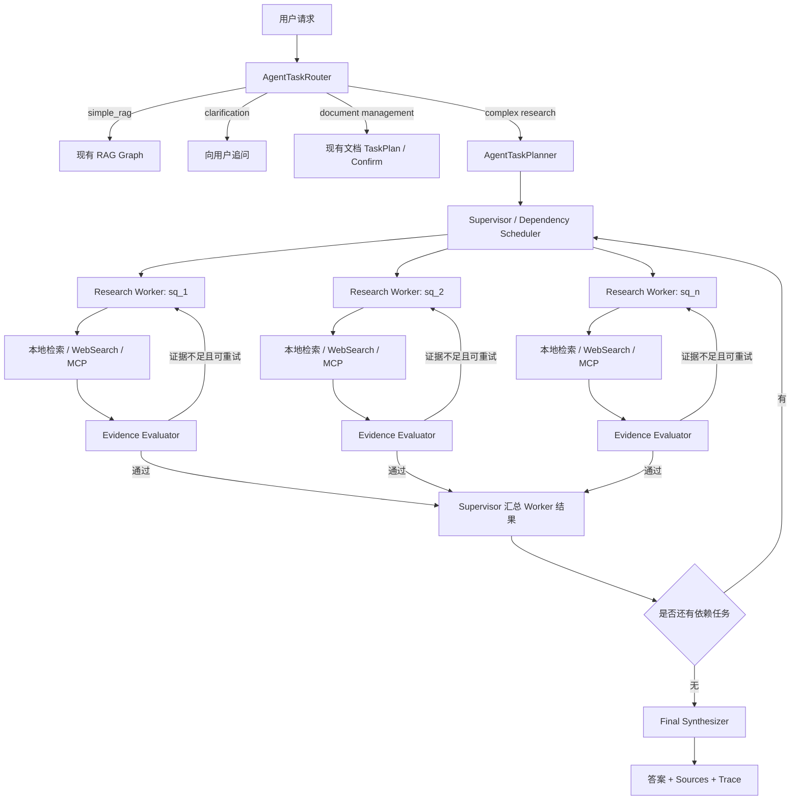
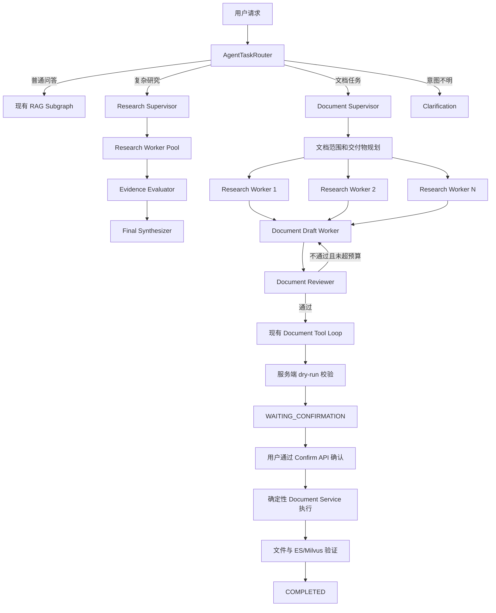

# 根据当前工程完成度，评估建议：

~~~
目前工程已经具备了多种文件类型的处理能力，也具备了复杂任务执行的能力，但是目前仍然是由单个Agent按照顺序执行任务，而不是编排多个Agent，每个Agent执行指定的任务的多Agent架构。单个Agent执行复杂任务会遇到很多问题，包括任务完成质量不稳定的情况。多Agent架构可以让当前系统的能力提升到Agentic RAG。
例如：{
Supervisor Agent：负责判断任务类型和调度
Retriever Agent：负责检索本地知识库
Evaluator Agent：负责评估检索结果是否足够
WebSearch Agent：负责联网搜索
Answer Agent：负责生成最终回答
}
请给出你的建议
~~~


## 结论

你的判断方向是正确的：当前工程已经具备升级为 Agentic RAG 的大部分基础能力，下一步确实应该从“单个执行器完成所有复杂任务”演进到“编排器调度多个受控研究 Worker”。

但我不建议直接实现五个都带独立 LLM、独立上下文和独立工具循环的 Agent：

```
Supervisor Agent
Retriever Agent
Evaluator Agent
WebSearch Agent
Answer Agent
```

更适合当前工程的是：

```
Supervisor / Orchestrator
    ├─ 多个并行 Research Worker Agent
    │    ├─ knowledge_retrieval 工具
    │    ├─ web_search 工具
    │    └─ MCP 只读工具
    ├─ Evidence Evaluator 节点
    └─ Final Synthesizer 节点
```

也就是说：

- 真正需要自主决策和工具循环的是 `Research Worker`。
- Retriever、WebSearch 更适合作为工具，不需要包装成完整 Agent。
- Evaluator、Answer 更适合作为职责固定的 LLM 节点，不需要拥有自由工具调用能力。
- Supervisor 复用当前 Router、Planner 和 TaskPlan，不重新造一套。

这会得到真正的 Agentic RAG，同时避免五套 Agent 上下文、Prompt、循环和错误处理互相放大复杂度。

## 当前工程的真实状态

你的“当前仍是单个 Agent 顺序执行”基本正确，但需要补充几个细节。

### 1. 已经有 Supervisor 的部分能力

当前 `AgentTaskRouter` 已经负责结构化任务分类：

- `simple_rag`
- `question_decomposition`
- `knowledge_document_management`
- `web_research`
- `clarification_required`

位置：

[agent_task_router.py (line 136)](D:/AI_Agent_Project/AI_Python_Project/python-agent-study/src/fast_app/services/agent_tasks/agent_task_router.py:136)

但它目前只是 Router，不是完整 Supervisor。

两者区别是：

- Router：做一次分类，然后把请求交给固定分支。
- Supervisor：在执行过程中持续观察子任务结果，再决定启动哪个 Worker、是否重试、是否换数据源、何时结束。

LangChain 官方也明确区分了 Router 和 Supervisor：Supervisor 是持续维护上下文并动态调度子 Agent 的完整 Agent，而 Router 通常只是一次分类和分发。[LangChain Subagents 官方文档](https://docs.langchain.com/oss/python/langchain/multi-agent/subagents)

### 2. 已经有 Planner

当前 `AgentTaskPlanner` 可以把复杂问题拆成：

```
objective
sub_questions
depends_on
information_source_hint
expected_evidence
final_synthesis_instruction
```

其中 `depends_on` 和 `expected_evidence` 正是实现多 Agent 编排需要的关键字段。

位置：

[agent_task_planner.py (line 40)](D:/AI_Agent_Project/AI_Python_Project/python-agent-study/src/fast_app/services/agent_tasks/agent_task_planner.py:40)

因此不需要重新设计另一套 Multi-Agent Plan。

### 3. 子问题目前确实顺序执行

当前 `execute_question_decomposition_plan()` 使用：

```
for sub_question in sorted(plan.sub_questions, key=lambda item: item.order):
    result = await self._execute_sub_question(...)
```

位置：

[agent_task_executor.py (line 319)](D:/AI_Agent_Project/AI_Python_Project/python-agent-study/src/fast_app/services/agent_tasks/agent_task_executor.py:319)

实际循环位置：

[agent_task_executor.py (line 349)](D:/AI_Agent_Project/AI_Python_Project/python-agent-study/src/fast_app/services/agent_tasks/agent_task_executor.py:349)

这意味着即使计划是：

```
sq_1：查询本地架构
sq_2：查询最新公开资料
sq_3：比较 sq_1 和 sq_2
```

其中 `sq_1` 和 `sq_2` 没有依赖关系，当前仍然是：

```
先完整执行 sq_1
→ 再完整执行 sq_2
→ 最后执行 sq_3
```

`depends_on` 目前主要进入计划和 Prompt，没有成为真正的调度依据。

### 4. 单个子问题内部已经支持并行工具调用

当前并不是完全没有并行能力。

同一个子问题中，如果模型同一轮选择多个允许并行的只读工具，会通过 `asyncio.gather()` 并行调用：

[agent_task_executor.py (line 540)](D:/AI_Agent_Project/AI_Python_Project/python-agent-study/src/fast_app/services/agent_tasks/agent_task_executor.py:540)

所以当前状态是：

```
子问题之间：顺序执行
子问题内部多个只读工具：可以并行
```

### 5. 本地检索和 WebSearch 已经存在

执行器已经可以选择：

```
knowledge_retrieval
web_search
MCP tool
none
```

分派位置：

[agent_task_executor.py (line 882)](D:/AI_Agent_Project/AI_Python_Project/python-agent-study/src/fast_app/services/agent_tasks/agent_task_executor.py:882)

本地知识库检索：

[agent_task_executor.py (line 964)](D:/AI_Agent_Project/AI_Python_Project/python-agent-study/src/fast_app/services/agent_tasks/agent_task_executor.py:964)

联网搜索：

[agent_task_executor.py (line 1017)](D:/AI_Agent_Project/AI_Python_Project/python-agent-study/src/fast_app/services/agent_tasks/agent_task_executor.py:1017)

因此未来不需要重新实现 Retriever 和 WebSearch，只需要把现有能力放进新的 Worker 编排闭环。

### 6. 当前最重要的缺口是 Evaluator

当前子问题执行过程基本是：

```
选择工具
→ 获得检索结果
→ 直接让 LLM 根据结果回答子问题
```

缺少独立步骤判断：

- 结果是否真正回答了当前子问题？
- 是否覆盖 `expected_evidence`？
- 来源是否存在冲突？
- 是否只是关键词相似，实际上答非所问？
- 是否应该重新改写查询？
- 是否应该从本地知识库切换到 WebSearch？
- 证据不足时是否应该明确回答“不足”？

这才是当前复杂任务质量不稳定的主要原因之一。

## Agentic RAG 不等于 Agent 数量多

普通 RAG 通常是：

```
检索一次
→ 把结果交给 LLM
→ 生成答案
```

Agentic RAG 更重要的是存在决策和纠错闭环：

```
规划
→ 选择数据源
→ 检索
→ 评估证据
→ 改写查询或更换数据源
→ 再检索
→ 综合多份证据
→ 生成答案
```

所以，即使创建了五个名为 `XXXAgent` 的类，如果执行链仍然是：

```
Retriever Agent
→ WebSearch Agent
→ Answer Agent
```

固定顺序运行一次，也只是把 Pipeline 拆成了五个类，并没有真正获得 Agentic 能力。

CRAG 的核心思想也是在检索后增加质量评估，根据评估结果决定是否执行纠正检索或 Web Search，而不是简单增加 Agent 数量。[Corrective Retrieval Augmented Generation 论文](https://arxiv.org/abs/2401.15884)

## 建议的目标架构

````

````

## 各角色应该怎样设计

### 1. Supervisor / Orchestrator

不建议重新创建一个无边界的 `SupervisorAgent`。

应当复用：

```
AgentTaskRouter
AgentTaskPlanner
AgentTaskPlan
RagAgentState
TaskPlanStore
```

只增加缺少的调度职责：

1. 找出依赖已经满足的子问题。
2. 把互不依赖的子问题同时交给多个 Worker。
3. 收集 Worker 的结构化结果。
4. 判断依赖任务何时可以启动。
5. 检查是否还有失败、重试或未完成任务。
6. 所有子任务完成后进入最终综合。

例如：

```
sq_1 depends_on=[]
sq_2 depends_on=[]
sq_3 depends_on=[sq_1, sq_2]
```

Supervisor 应执行为：

```
第一批：sq_1、sq_2 并行
第二批：等待 sq_1、sq_2 完成后执行 sq_3
第三步：综合最终答案
```

LangGraph 官方的 Orchestrator-Worker 模式正适合这种动态子任务场景；`Send` API 可以把不同子问题发送给独立 Worker 状态，并把结果汇总回主图。[LangGraph Workflows and Agents](https://docs.langchain.com/oss/python/langgraph/workflows-agents)

### 2. Research Worker Agent

这是我认为真正值得实现为 Agent 的角色。

每个 Worker 只负责一个子问题，输入应该严格限制为：

```
原始任务目标
当前 sub_question
expected_evidence
已完成的依赖结果
当前用户的只读检索权限
允许使用的工具
Worker 预算
```

不应把完整主对话和其他 Worker 的全部 ToolMessage 都塞进去。

Worker 内部可以运行有限循环：

```
选择工具
→ 调用工具
→ 查看结果
→ 判断是否还需要工具
→ 生成候选子答案
```

当前 `_execute_sub_question()` 已经具备这个有限工具循环，因此可以复用，而不是重新开发一套 ResearchAgent。

### 3. Retriever

第一阶段不建议实现 `RetrieverAgent`。

因为本地检索当前已经是确定性工具：

```
query
filters
mode
top_k
candidate_k
min_score
    ↓
ES + Milvus + RRF
    ↓
RetrievedDoc[]
```

它没有必要自己维护消息历史、进行多轮推理或生成回答。

更适合继续作为：

```
knowledge_retrieval tool
```

只有以后出现以下需求时，才值得升级为检索子图：

- 自动生成多个检索查询。
- 对专业术语进行查询扩展。
- 多跳检索。
- 根据首轮文档实体继续检索。
- 在多个知识库之间动态选择。
- 对不同文档类型采用不同检索策略。

即使到那时，也更推荐 `Retrieval Subgraph`，而不是一个无边界的自由 Agent。

### 4. Evidence Evaluator

这是第一阶段最值得新增的组件。

它应该输出严格结构，而不是自由文本：

```
{
  "verdict": "sufficient",
  "confidence": 0.91,
  "relevance": 0.95,
  "coverage": 0.87,
  "authority": 0.82,
  "freshness_required": false,
  "has_conflict": false,
  "missing_points": [],
  "recommended_action": "accept"
}
```

建议支持：

```
verdict:
  sufficient
  partial
  insufficient
  conflict

recommended_action:
  accept
  rewrite_local_query
  search_web
  combine_local_and_web
  clarify
  stop_with_limitation
```

Evaluator 的输入应该包括：

```
sub_question
expected_evidence
候选答案
RetrievedDoc / Web evidence
已执行的查询
剩余重试预算
```

它不应该：

- 修改 ACL。
- 生成可信 `doc_id`。
- 执行写操作。
- 自己无限调用工具。
- 把“LLM 说充分”直接当作安全事实。

### 5. WebSearch

第一阶段也不建议实现完整 `WebSearchAgent`。

现有 `web_search` 工具已经可以返回 URL、标题、摘要和来源信息。Research Worker 根据 Evaluator 的建议调用它即可。

需要增加的是 Web 回退策略：

```
本地证据充分
→ 不联网

用户明确要求最新资料
→ 可直接联网

本地证据不足
+ allow_web_fallback=true
→ 联网补充

本地证据不足
+ allow_web_fallback=false
→ 返回证据不足，不擅自联网
```

特别要注意：

- 不得把私有知识库 Chunk 原文发送给搜索引擎。
- 不得把内部文件名、员工信息、资产编号自动拼入公开搜索。
- 自动联网应由租户配置或请求字段明确允许。
- Web 结果必须保留 URL、站点和抓取时间。
- Web 资料不能自动获得与内部知识库相同的可信等级。

### 6. Answer Agent

不建议让 Answer Agent 再拥有检索和写工具。

它只负责：

```
读取已经通过 Evaluator 的子问题结果
→ 根据 final_synthesis_instruction 综合
→ 对冲突证据明确标注
→ 生成最终答案
→ 返回来源映射
```

因此它更适合作为 `Final Synthesizer Node`。

当前工程已经有：

- 普通 RAG 的 `generate_answer`
- TaskPlan 的 `_synthesize_final_answer()`

应当复用其中的模型、Prompt Guard、trace 和 sources 逻辑。

## 推荐执行顺序

### 阶段一：先建立质量基线

在修改架构前，用现有 Stage 11 评测能力记录：

- 复杂任务完成率。
- 子问题回答准确率。
- 来源正确率。
- 完整回答率。
- 平均 LLM 调用次数。
- 平均工具调用次数。
- 平均延迟和 P95。
- Token 消耗。

否则改成多 Agent 后，只能感觉“架构更高级”，无法证明质量真的提升。

### 阶段二：实现依赖调度和并行 Worker

先解决当前最明确的问题：

```
依赖无关子问题并行
依赖子问题等待前置结果
循环依赖和缺失依赖拒绝执行
单个 Worker 失败不立即破坏所有 Worker
```

建议使用现有 `AgentTaskPlan.sub_questions[].depends_on`，不要新增另一套任务定义。

### 阶段三：加入 Evidence Evaluator

在每个 Worker 的检索结果和候选回答后增加评估：

```
检索
→ 候选回答
→ 证据评估
→ accept / retry / web / clarify
```

限制每个子问题最多：

```
2 次纠正检索
3～5 次总工具调用
```

避免 Evaluator 和 Worker 相互循环失控。

### 阶段四：加入受控 Web 回退

增加结构化策略字段，例如：

```
{
  "allow_web_fallback": true,
  "preferred_sources": ["knowledge_base", "web"],
  "max_web_queries": 2
}
```

它是执行策略，不是权限事实。

### 阶段五：接入 SSE 和 React

新的多 Agent 主链路必须通过：

```
POST /rag/chat/stream/events
```

输出结构化事件，例如：

```
agent_plan_created
worker_started
worker_tool_started
worker_tool_finished
evidence_evaluated
worker_retrying
worker_completed
synthesis_started
sources
answer_delta
done
```

React 才能展示：

- 当前有几个 Worker。
- 哪些正在执行。
- 哪些等待依赖。
- 哪个 Worker 正在联网。
- 为什么发生重试。
- 哪份证据被判定不足。
- 最终答案来自哪些 Worker 和来源。

不要把这些能力加入兼容接口 `POST /rag/chat/stream`。

## 必须保留的安全边界

多 Agent 会放大工具权限风险，因此必须坚持：

1. Supervisor 不能创造可信路径、ACL、`doc_id`。
2. Worker 只接收主图冻结的权限 filter。
3. Research Worker 不能获得知识库写工具。
4. 文档写入继续走现有 TaskPlan、dry-run、confirm API。
5. Worker 之间只传结构化结果，不共享可变消息列表。
6. 每个 Worker 有独立工具、时间和 Token 预算。
7. WebSearch 不能接收私有文档原文。
8. 失去任务所有权、取消或超时后停止工具调用。
9. 最终回答必须能追溯到 `worker_id → evidence → source`。
10. Evaluator 失败时应保守降级，不能默认“证据充分”。

## 我的最终建议

值得实施 Agentic RAG，但应采用：

```
现有 Router + Planner
→ LangGraph Orchestrator
→ 多个 Research Worker Agent
→ Evidence Evaluator
→ 有限纠正检索 / Web 回退
→ Final Synthesizer
```

不建议第一步就实现：

```
五个彼此独立、都拥有 LLM 循环的 Agent
```

当前工程真正需要新增的核心只有两个：

1. `依赖感知的并行 Worker 调度`
2. `检索证据评估与纠正闭环`

Retriever、WebSearch、Answer 的基础能力已经存在，应该复用。完成这两个核心后，系统才从“能拆任务并调用工具”升级为“能规划、并行研究、评估证据、纠正检索并综合回答”的 Agentic RAG。

# 文档任务的多Agent架构，评估建议：

## 直接回答

上一轮方案的第一阶段只覆盖了“只读检索型多 Agent”，没有把文档创建、修改、删除纳入同一条 Worker 链路。

这是有意保留的安全边界，但完整目标架构必须包含文档处理任务。更准确地说，系统最终应该有两条独立的 Agentic 子图：

```
Agentic Research Subgraph
    负责检索、联网、证据评估和回答

Agentic Document Workflow Subgraph
    负责资料收集、内容起草、审查、生成变更预览
```

两条子图可以共享 Research Worker，但不能共享写权限。文档真正写入仍由现有确定性服务和人工确认接口完成。

## 需要先区分三种“文档处理”

### 1. Office 文件导入和解析

例如：

```
上传 PPTX/XLSX
→ OOXML 校验
→ Loader 解析
→ Builder 分块
→ Embedding
→ ES/Milvus
→ 文件发布
```

这一部分不应该改成多 Agent。

原因是它属于确定性数据处理：

- PPT Shape 递归解析。
- Excel 公式与缓存值读取。
- Chunk ID 和 Hash 计算。
- 增量差异同步。
- 文件原子发布。
- ES/Milvus 收敛验证。

这些步骤越确定越好。让多个 LLM Agent 决定如何解析单元格、生成 Chunk ID 或发布文件，只会降低稳定性。

因此当前 Office Worker 保持不变。

### 2. 知识库文档内容任务

例如：

- 根据多份资料生成技术方案。
- 更新已有 Markdown 文档。
- 比较多个模块后生成报告。
- 同时更新多篇相关文档。
- 审查文档内容是否完整、准确。
- 删除或重命名知识库文档。

这一类任务适合多 Agent，因为它包含：

```
理解目标
→ 收集资料
→ 拆分交付物
→ 起草内容
→ 评审内容
→ 修订
→ 生成人工确认预览
```

这是文档多 Agent 应该覆盖的范围。

### 3. 由 Agent 创建或修改 PPTX/XLSX

当前工程仍然只支持 PPTX/XLSX 的：

```
导入
受控更新文件
检索
```

还不支持 Agent 自己创建或编辑 PPTX/XLSX 内容。

所以文档多 Agent 第一阶段应继续只处理当前文档工具支持的 `.md/.txt`。以后如果要支持 Agent 编辑 PPTX/XLSX，需要单独增加：

- PowerPoint 结构化变更模型。
- Excel 结构化行列变更模型。
- 预览接口。
- Office 专属确定性写入服务。
- 文件版本冲突和回滚。

不能因为增加了多 Agent，就默认获得 Office 编辑能力。

## 当前文档任务已经具备的基础

当前 Router 已经能识别：

```
knowledge_document_management
```

路由位置：

[rag_agent_nodes.py (line 338)](D:/AI_Agent_Project/AI_Python_Project/python-agent-study/src/fast_app/graph/rag_agent/rag_agent_nodes.py:338)

Planner 已经可以创建文档管理计划：

[agent_task_planner.py (line 332)](D:/AI_Agent_Project/AI_Python_Project/python-agent-study/src/fast_app/services/agent_tasks/agent_task_planner.py:332)

执行器已有文档 Tool Loop：

[agent_task_executor.py (line 1223)](D:/AI_Agent_Project/AI_Python_Project/python-agent-study/src/fast_app/services/agent_tasks/agent_task_executor.py:1223)

当前文档 Agent 可以：

- 检索候选文档。
- 读取文档。
- 使用 WebSearch 或 MCP 收集资料。
- 生成 create/update/delete 的 dry-run ToolCall。
- 保存工具执行轨迹。
- 进入 `WAITING_CONFIRMATION`。

进入确认状态的位置：

[agent_task_executor.py (line 1576)](D:/AI_Agent_Project/AI_Python_Project/python-agent-study/src/fast_app/services/agent_tasks/agent_task_executor.py:1576)

用户确认后，真正写入继续由：

[knowledge_document_management_service.py (line 168)](D:/AI_Agent_Project/AI_Python_Project/python-agent-study/src/fast_app/services/knowledge/knowledge_document_management_service.py:168)

中的 `execute_confirmed_actions()` 负责。

所以文档多 Agent 不需要重做工具、权限、确认和写入层。缺少的主要是：

- 复杂文档任务拆解。
- 多资料并行调研。
- 每个交付文档独立起草。
- 起草后的质量评审。
- 不通过时的修订循环。
- 多文档依赖调度。

## 推荐的完整架构

````

````

## 文档多 Agent 中各角色的职责

### 1. Document Supervisor

Document Supervisor 负责把文档任务拆成交付物和依赖关系。

例如用户要求：

> 根据本地架构文档和最新公开资料，生成部署方案，更新运维手册，并在风险说明中加入升级回滚策略。

可以拆成：

```
sq_1：检索当前工程部署架构
sq_2：检索当前升级和回滚机制
sq_3：联网查询官方部署建议
doc_1：生成部署方案
doc_2：更新运维手册
review_1：检查两篇文档术语和事实是否一致
```

依赖关系：

```
sq_1、sq_2、sq_3：并行
doc_1：依赖 sq_1、sq_2、sq_3
doc_2：依赖 sq_1、sq_2
review_1：依赖 doc_1、doc_2
```

Document Supervisor 只能生成逻辑交付计划，不能直接生成可信：

- `doc_id`
- 文件路径
- 部门权限
- ACL
- 真实写入参数

这些仍由服务端事实和现有工具校验产生。

### 2. Research Worker

文档任务和问答任务可以共享同一种 Research Worker。

它负责为某个文档交付物收集资料：

```
本地知识库检索
WebSearch
MCP 只读工具
证据评估
查询改写
```

例如“生成部署方案”可能同时启动：

```
Worker A：查询当前项目 Docker 配置
Worker B：查询服务健康检查设计
Worker C：查询官方部署建议
Worker D：查询已有故障处理文档
```

它们只返回结构化证据，不生成最终写入动作。

### 3. Document Draft Worker

Draft Worker 根据已经通过证据评估的资料，生成：

```
完整候选文档
或
针对现有文档的精确变更候选
```

建议输出结构，而不是立即调用写工具：

```
{
  "document_operation": "update",
  "target_reference": {
    "candidate_doc_id": "doc_xxx"
  },
  "title": "部署与回滚手册",
  "draft_content": "...",
  "change_summary": [
    "新增健康检查章节",
    "补充升级失败回滚步骤"
  ],
  "evidence_refs": [
    "evidence_sq_1_1",
    "evidence_sq_2_3"
  ]
}
```

对于已有文档更新，应优先生成：

- 候选全文。
- 或精确替换预览。
- 修改摘要。
- 使用了哪些证据。
- 哪些原始章节保持不变。

不能直接把模型输出当作文件写入参数。

### 4. Document Reviewer

这是文档任务中非常重要的角色。

它需要检查的不是检索相关性，而是候选文档质量：

```
事实是否有证据支持
是否完成用户要求
是否遗漏必要章节
是否与现有文档冲突
是否出现无法验证的数字或结论
不同文档之间术语是否一致
是否包含不应写入的敏感信息
是否引用了错误的来源
是否擅自扩大了修改范围
```

建议使用结构化输出：

```
{
  "verdict": "revision_required",
  "confidence": 0.93,
  "requirement_coverage": 0.81,
  "groundedness": 0.76,
  "consistency": 0.88,
  "scope_safe": true,
  "issues": [
    {
      "code": "UNSUPPORTED_CLAIM",
      "message": "文档声称支持自动跨区域容灾，但证据中没有对应实现",
      "severity": "high"
    }
  ],
  "revision_instructions": [
    "删除自动跨区域容灾结论",
    "将其改为后续建设建议"
  ]
}
```

Reviewer 不应拥有写工具。

### 5. Revision Loop

Reviewer 不通过时，可以返回 Draft Worker 修订：

```
Draft v1
→ Reviewer：缺少证据
→ Draft v2
→ Reviewer：通过
→ 生成 dry-run
```

必须限制循环次数，例如：

```
最多修订 2 次
```

超过限制后：

- 进入人工复查。
- 或返回无法可靠完成的原因。
- 不能无限让两个 Agent 互相修改。

### 6. Change Plan Builder

候选内容通过 Reviewer 后，才进入当前文档 Tool Loop。

这一阶段负责把候选内容转换成现有的：

```
knowledge_document_create
knowledge_document_update
knowledge_document_delete
```

dry-run ToolCall。

现有后端继续校验：

- 候选文档是否来自授权检索范围。
- `doc_id` 是否真实存在。
- 路径是否属于允许目录。
- 部门权限是否有效。
- 更新前版本是否仍一致。
- 变更内容是否超出大小限制。
- 是否要求人工确认。

这不是新 Agent，而是复用当前安全边界。

### 7. Human Confirmation

Document Reviewer 通过不等于用户确认。

它们解决的问题不同：

```
Reviewer：
候选文档质量是否合格？

Human Confirmation：
用户是否真的同意执行这次高风险变更？
```

因此仍然必须进入：

```
WAITING_CONFIRMATION
→ POST /agent/tool-plans/{plan_id}/confirm
```

不能因为多 Agent 已经互相审核，就跳过人工确认。

### 8. Deterministic Executor

真正的文件写入不应该由所谓的 `Execution Agent` 完成。

继续使用现有确定性服务：

```
KnowledgeDocumentManagementService
文件版本检查
权限检查
原子写入
ES/Milvus 同步
失败回滚
审计记录
```

Agent 只产生候选方案，服务端执行器负责产生业务事实。

## 多文档任务如何并行

多文档任务确实可以使用多个 Draft Worker，但要按目标文件区分。

### 不同目标文档

例如同时创建：

```
部署方案.md
运维手册.md
故障排查.md
```

如果依赖资料已经准备好，可以由三个 Draft Worker 并行起草。

### 同一个目标文档

如果多个任务都要修改同一个文件：

```
任务 A：新增部署章节
任务 B：修改回滚章节
任务 C：修改权限章节
```

不能让三个 Agent 并行写入同一个文件。

应该先生成三个候选变更，再由一个合并节点形成：

```
同一 base_sha256
→ 合并后的单一候选版本
→ Reviewer
→ 单一 dry-run
→ 一次确认
→ 一次写入
```

否则会发生：

- 后写覆盖先写。
- 章节位置漂移。
- `expected_sha256` 冲突。
- ES/Milvus 多次重复同步。
- 用户无法审核最终会写入什么。

## Office 文档未来怎样进入这套架构

如果以后允许 Agent 修改 PPTX/XLSX，建议复用同一套上层编排，但底层写入必须格式专属。

```
Document Supervisor
→ Research Workers
→ Draft Worker
→ Reviewer
→ 结构化 Office ChangeSet
→ 人工预览确认
→ PowerPoint/Excel 确定性 Writer
→ Office Loader 重新解析
→ Chunk 增量更新
```

PPT 候选变更可以类似：

```
{
  "slide_id": 261,
  "operation": "update_text",
  "shape_id": 4,
  "old_text": "旧内容",
  "new_text": "新内容"
}
```

Excel 候选变更可以类似：

```
{
  "sheet_key": "asset_list",
  "row_identity": "AST-0002",
  "field_id": "owner",
  "old_value": "赵凯",
  "new_value": "李明"
}
```

LLM 只生成结构化 ChangeSet，不能自己操作 OOXML ZIP，也不能直接调用 `python-pptx` 或 `openpyxl` 覆盖源文件。

这属于后续独立阶段，不应和第一版多 Agent 一次实现。

## 完整的路由目标

最终 Router 应该把请求分成四类主线：

```
simple_rag
    → 现有快速 RAG

question_decomposition / web_research
    → Agentic Research Subgraph

knowledge_document_management
    → Agentic Document Workflow Subgraph

clarification_required
    → 用户补充信息
```

其中：

```
Research Subgraph：只读、可以高度并行
Document Subgraph：先研究和起草，写入前必须收敛成单一冻结计划
Ingestion Worker：保持确定性，不 Agent 化
```

## 推荐实施顺序

1. 先完成共享的 Research Worker、Evidence Evaluator 和依赖调度器。
2. 把它接入复杂问答，验证并行、纠正检索和来源质量。
3. 文档任务复用这些 Research Worker，增加 Draft Worker 和 Document Reviewer。
4. Reviewer 通过后继续进入现有 dry-run 和 confirm 流程。
5. 最后才考虑多个文档并行起草。
6. PPTX/XLSX 的 Agent 编辑能力单独立项，不随多 Agent 默认加入。

所以，完整方案确实应包含文档任务，但不是把 Retriever、Writer、Executor 全部变成自由 Agent。最合适的边界是：

```
多 Agent 负责思考、研究、起草和审查
现有服务负责校验、确认、写入、回滚和索引同步
```

这既能提升复杂文档任务的质量，也不会破坏当前已经建立的权限、人工确认和数据一致性边界。

# Agentic Research 多 Agent 链路实施计划（Plan）

## 方案摘要

先完成只读检索任务的多 Agent 改造：

- 保留 `Router → Planner → WAITING_CONFIRMATION`。
- 确认后由 LangGraph Orchestrator 按依赖关系并行调度 Research Worker。
- Worker 复用现有本地检索、WebSearch、MCP 和有限 Tool Loop。
- 新增 Evidence Evaluator 和有限纠正检索。
- 单个 Worker 的局部异常不终止其他独立 Worker。
- 部分结果可用时，任务终态为 `completed_with_warnings`，继续生成带限制说明的答案。
- 文档管理、PPTX/XLSX ingestion 和 legacy stream 本轮不改。

## 1. 保存跨确认请求的研究参数

原计划中的“冻结研究策略”改名为“在 TaskPlan 中保存确认后仍需使用的研究参数”。

原因是研究计划创建和执行发生在两个请求：

```text
POST /rag/chat
→ 创建 TaskPlan

POST /agent/task-plans/{id}/confirm
→ 稍后执行 TaskPlan
```

当前确认接口无法获得原始 RAG 请求参数，会退回默认的 `hybrid/top_k/min_score`。修复后在创建 TaskPlan 时保存：

```text
AgentResearchPolicy:
  mode
  top_k
  candidate_k
  min_score
  source_path
  section_path
  web_policy: disabled | fallback | required
```

`RagChatRequest` 增加：

```python
allow_web_fallback: bool = False
```

Web 策略：

- 普通复杂问题且 `allow_web_fallback=false`：`disabled`。
- 普通复杂问题且 `allow_web_fallback=true`：`fallback`。
- Router 判定为 `web_research`：`required`。

只保存用户本次请求选择的检索参数和联网许可，不保存：

- 用户权限。
- 部门权限。
- ACL。
- 当前认证状态。
- 外部服务可用状态。

确认执行时重新读取当前用户权限，再与 TaskPlan 保存的 source/section filter 合并。权限已撤销时拒绝执行；不能使用创建计划时的旧权限。

老 TaskPlan 缺少 `research_policy` 时使用默认检索参数，并将 Web 设置为 `disabled`。

## 2. 领域模型与任务终态

新增：

```text
ResearchEvidenceEvaluation:
  verdict: sufficient | partial | insufficient | conflict
  confidence
  relevance
  coverage
  authority
  freshness_required
  missing_points
  recommended_action:
    accept
    rewrite_local_query
    search_web
    combine_local_and_web
    clarify
    stop_with_limitation
  reason
```

子问题状态扩展为：

```text
completed | partial | failed | skipped
```

TaskPlan 状态增加：

```text
completed_with_warnings
```

整体状态判定：

| Worker 结果                                                 | TaskPlan 终态           | 最终回答                               |
| ----------------------------------------------------------- | ----------------------- | -------------------------------------- |
| 所有子问题 completed                                        | completed               | 正常综合                               |
| 存在 partial/failed/skipped，但至少有一个 completed/partial | completed_with_warnings | 综合可用结果并明确缺口                 |
| 所有子问题均 failed/skipped                                 | failed                  | 不生成伪装成成功的答案，只返回失败摘要 |
| 用户取消                                                    | cancelled               | 停止派发和后续综合                     |
| 权限、状态或持久化等任务级异常                              | failed                  | 终止整个任务                           |

`completed_with_warnings` 仍返回 HTTP 200，因为执行流程正常结束且存在可用成果；前端根据状态展示黄色警告，而不是错误页面。

`AgentTaskSubQuestionResult` 增加：

```text
attempt_count
attempts
evaluation
source_types
warnings
```

`final_output` 保存：

```text
research_progress:
  current_wave
  workers[sub_question_id]:
    status
    wave
    attempt
    evaluation
    error

sub_question_results
failed_sub_questions
skipped_sub_questions
warnings
used_tools
sources
final_answer
```

## 3. LangGraph Orchestrator-Worker 子图

新增内部 `ResearchGraphState`、`ResearchWorkerState` 和 Research Subgraph：

```text
validate_dependencies
→ select_ready_wave
→ Send(research_worker, ...)
→ merge_wave_results
→ select_ready_wave / synthesize
→ END
```

依赖调度规则：

- 子问题 ID 必须唯一。
- 依赖必须存在。
- 禁止自依赖和循环依赖。
- 使用 Kahn 分层方式生成执行波次。
- 同一波次最多并行 4 个 Worker。
- 执行和结果排序统一使用 `(order, sub_question_id)`。
- `completed/partial` 可以满足下游依赖，但 partial 的不足说明必须传给下游。
- 依赖 `failed/skipped` 的子问题标记为 `skipped / DEPENDENCY_FAILED`。
- 一个 Worker 失败后，其他没有依赖它的 Worker 继续执行。
- 所有波次结束后统一判定 TaskPlan 终态。

`execute_question_decomposition_plan()` 删除当前顺序执行子问题的 `for` 主流程，改为调用 Research Subgraph。

Worker 只接收：

```text
当前 sub_question
expected_evidence
直接依赖的结果
研究策略
当前有效 ACL filters
允许的只读工具
执行预算
```

不把所有 Worker 的结果、完整 ToolMessage 或完整对话历史发送给无关 Worker。

## 4. Worker 异常隔离与任务级异常

### Worker 局部异常

以下异常只影响当前 Worker：

```text
本地检索无结果
单个召回源失败
WebSearch 不可用
MCP 工具失败
无效 ToolCall
Evaluator 超时或无效输出
Worker 超时
达到当前 Worker 工具或纠正预算
```

`research_worker` 节点必须捕获这些异常并转换为结构化 `partial/failed` 结果，不能让异常抛出并中断 LangGraph 的整个 `Send` 波次。

同一波次的其他 Worker继续运行。波次结束后统一合并结果。

### 任务级异常

以下情况终止整个任务：

```text
当前用户身份或权限失效
ToolPermissionDenied
用户取消任务
TaskPlan 内容损坏
依赖图非法
无法持久化 TaskPlan 快照
无法验证保存的研究策略
共享安全边界被破坏
```

任务级异常触发后：

- 设置共享停止标记。
- 不再派发新 Worker。
- 已运行 Worker在当前外部调用返回后停止。
- 不执行最终综合。
- TaskPlan 标记为 `failed` 或 `cancelled`。

### 部分完成的最终综合

只把 `completed/partial` 结果交给 Final Synthesizer，同时传入：

```text
failed_sub_questions
skipped_sub_questions
missing_points
conflicting_evidence
```

最终 Prompt 必须要求：

- 不推测失败子问题的结论。
- 不用其他 Worker 的答案填补没有证据的部分。
- 明确列出哪些内容未完成或证据不足。
- 冲突证据必须分别说明来源。
- Sources 只包含实际成功获得的证据。

## 5. Evidence Evaluator 与纠正循环

每次 Worker 产生候选回答后执行：

```text
工具调用
→ 候选回答和证据
→ Evidence Evaluator
→ accept / retry / partial / failed
```

判定规则：

- `sufficient + confidence>=0.65`：completed。
- 没有证据：强制 insufficient。
- Evaluator 置信度低于 0.65：按 insufficient 处理。
- `rewrite_local_query`：把 missing points 反馈给下一轮工具选择。
- `search_web/combine_local_and_web`：仅在 `web_policy=fallback|required` 时允许。
- 超过纠正预算但已有证据：partial。
- 超过预算且没有有效证据：failed。
- Evaluator 调用失败：零证据为 failed，有证据为 partial，不自动联网。

Evaluator 复用当前 LLM，`temperature=0`，优先 structured output，失败后使用 JSON 兼容解析。本阶段不新增独立 Evaluator 模型配置。

WebSearch 查询只能由以下信息构造：

```text
用户原始问题
当前子问题
Evaluator 给出的缺失主题
```

禁止包含：

- 私有 Chunk 正文。
- 内部文件路径。
- ACL metadata。
- 用户、员工或资产敏感字段。
- 其他 Worker 返回的内部文档原文。

## 6. 预算、取消与恢复

新增配置：

```text
AGENT_RESEARCH_MAX_SUB_QUESTIONS=8
AGENT_RESEARCH_MAX_PARALLEL_WORKERS=4
AGENT_RESEARCH_MAX_TOOL_CALLS_PER_WORKER=4
AGENT_RESEARCH_MAX_CORRECTION_ROUNDS=2
AGENT_RESEARCH_WORKER_TIMEOUT_SECONDS=120
```

规则：

- 每个 Worker 最多执行初始轮次加两次纠正。
- 全生命周期最多调用 4 次工具。
- Planner 输出超过 8 个子问题时拒绝该输出并使用现有规则兜底计划。
- 每次工具、Evaluator 和纠正轮开始前检查取消状态。
- 取消后不再启动新外部调用。

`/retry` 对研究任务支持：

```text
running（进程中断）
failed
completed_with_warnings
```

恢复规则：

- 保留 completed 结果。
- 对 partial/failed/skipped 和未开始 Worker重新执行。
- 重新执行时使用保存的 ResearchPolicy，但重新检查当前 ACL。
- retry 成功补齐全部子问题后，状态可从 `completed_with_warnings` 变为 `completed`。
- cancelled 任务不能 retry，用户需要创建新计划。

## 7. 快照、SSE 与 LangSmith

继续使用现有 TaskPlan JSON 快照，不新增数据库迁移或 LangGraph checkpointer。

`AgentTaskPlanStore.save()` 改为：

```text
同目录临时文件
→ 写入并关闭
→ os.replace() 原子覆盖 JSON
→ 同样更新 Markdown 视图
```

避免 confirm/stream 轮询时读取到半写文件。

`POST /rag/chat/stream/events` 继续只输出计划和等待确认。

执行进度由：

```text
POST /agent/task-plans/{task_plan_id}/confirm/stream
```

输出。

复用现有事件，并新增：

```text
agent_task_research_wave_started
agent_task_evidence_evaluated
agent_task_sub_question_retrying
```

事件包含：

```text
task_plan_id
sub_question_id
wave
attempt
status
evaluation 或 retry_reason
```

`completed_with_warnings` 不输出 `error` SSE，而是：

```text
agent_task_status: completed_with_warnings
sources
answer_delta
agent_task_final_synthesis_completed
done
```

`agent_task_final_synthesis_completed` 增加：

```text
warnings
failed_sub_questions
skipped_sub_questions
```

LangSmith 子 run 使用：

```text
research.wave_{n}.worker.{sub_question_id}
research.worker.{sub_question_id}.attempt_{n}.tool.{tool_name}
research.worker.{sub_question_id}.attempt_{n}.evaluator
research.final_synthesis
```

## 测试与验收

### 参数保存

- 创建计划时使用 keyword、top_k=3、指定 source_path。
- 确认时仍使用这些参数，不退回 hybrid/default。
- 用户权限在计划创建后被撤销，确认执行必须拒绝。
- 老 TaskPlan 缺少 ResearchPolicy 时可兼容加载，Web 默认禁用。

### 并发和依赖

- 两个独立 Worker真实并发。
- 一个 Worker异常时，另一个仍正常完成。
- 失败 Worker 的依赖任务 skipped。
- 与失败 Worker 无关的后续任务继续执行。
- 执行完成顺序不改变最终结果顺序。
- 缺失依赖、自依赖、循环依赖和重复 ID 被拒绝。

### 整体状态

- 全部成功：completed。
- 一个成功、一个失败：completed_with_warnings。
- 一个 partial、其他成功：completed_with_warnings。
- 全部失败：failed。
- 权限错误或取消：立即终止。
- completed_with_warnings 返回答案、Sources 和明确警告。
- retry 补齐失败 Worker 后升级为 completed。

### Evaluator 和 Web

- 证据充分时零纠正。
- 本地不足且 Web disabled：不联网。
- 本地不足且 fallback：联网补充。
- 显式 web_research：Web policy 为 required。
- Evaluator 无效输出执行保守降级。
- Web 请求不包含私有 Chunk 或内部 metadata。

### 兼容回归

- `simple_rag` 不变。
- `knowledge_document_management` Tool Loop、dry-run 和 confirm 不变。
- PPTX/XLSX ingestion Worker 不变。
- Classic 和普通 LangGraph Pipeline 不变。
- `/rag/chat/stream` 保持 legacy token-only。
- `/rag/chat/stream/events` 的现有 sources、answer_delta、guard 和 done 事件不破坏。

### 真实验收

使用真实 Qwen、ES、Milvus、DashScope 和 Bocha 验证：

1. 独立子问题并行。
2. 多跳依赖按波次执行。
3. 单 Worker检索异常但整体带警告完成。
4. 本地充分时不联网。
5. 用户允许后本地不足触发 Web。
6. 真实 Sources、Evaluator、TaskPlan 快照和 LangSmith trace 一致。
7. 对比改造前后的准确率、任务完成率、来源正确率、平均/P95延迟、工具调用数和 Token 成本。

## 已确定默认决策

- 复杂研究继续先确认再执行。
- 自动联网必须由请求明确允许；显式 web_research 除外。
- 单 Worker局部失败不终止其他独立 Worker。
- 部分结果可用时使用 `completed_with_warnings`。
- 任务级安全、权限、取消和持久化异常终止整个任务。
- 使用 LangGraph `Send`，不增加多 Agent 第三方包。
- 本轮不实现文档 Draft/Reviewer，不修改 Office ingestion。
- 第一阶段不增加最终答案 Reviewer。