# 多 Agent 端到端测试复盘与工程规则

## 1. 文档目的

本文复盘 GitLab 文档变更场景 3 暴露的问题，并把一次性的修复经验转换成可复用
的工程规则。适用范围不限于 GitLab，也适用于后续 Researcher、Writer、
Reviewer、Coordinator、工具调用、人工确认和外部系统写入组成的多 Agent
工作流。

原始证据与完整 TaskPlan 轨迹保存在：

- `scripts/docs/GitLab文档变更端到端测试报告.md`
- `src/fast_app/services/agent_tasks/deep_document_agent.py`
- `src/fast_app/services/agent_tasks/document_task_executor.py`
- `src/fast_app/integrations/gitlab/agent_change_service.py`
- `src/fast_app/integrations/gitlab/worker.py`

本文不替代原始测试报告，而是回答三个可复用问题：

1. 为什么一个目标明确的单文档任务会产生 32—45 次模型调用？
2. 为什么多 Agent 内部通过后，进入 GitLab 仍会出现路径、状态和重试错误？
3. 后续如何用确定性规则和端到端测试避免同类问题？

## 2. 场景 3 的实际链路

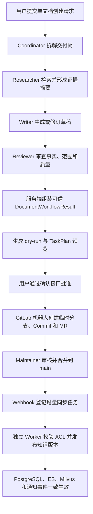

这条链路跨越了四种不同边界：

1. **模型协作边界**：Researcher、Writer、Reviewer 是否完成自己的职责。
2. **服务端信任边界**：operation、路径、`doc_id`、ACL、版本和状态由谁决定。
3. **人工授权边界**：确认前不得创建 MR，合并前不得发布知识索引。
4. **外部系统一致性边界**：GitLab、PostgreSQL、ES、Milvus 是否最终一致。

仅验证其中一个边界，不能宣称整个多 Agent 功能已经完成。

## 3. 暴露出的主要问题

### 3.1 把 Prompt 当成了状态机

修复前，Coordinator Prompt 虽然要求：

- Researcher 失败后停止；
- 同一任务不要重复派发；
- 最多执行规定的返工轮次；
- Writer 不得在无研究证据时继续写作；

但服务端没有确定性状态转换。实际结果是：

```text
Researcher 已返回模型调用上限
→ Coordinator 错误标记 Research completed
→ Writer 被要求依赖通用知识继续写作
→ 无证据草稿出现事实错误
→ Reviewer 要求返工
→ Writer 和 Reviewer 反复循环
```

经验：**Prompt 只能指导模型，不能承担 fail-fast、次数限制、准入检查或状态迁移。**

### 3.2 每个 Agent 都有循环，角色数不等于调用数

Researcher、Writer、Reviewer 和 Coordinator 都可能执行：

```text
模型判断
→ 工具调用
→ 读取 ToolMessage
→ 再次模型判断
→ 返回结构化结果
```

一次 Researcher 任务并不等于一次模型调用；一次返工也会重新启动完整的 Writer
或 Reviewer 循环。修复前各角色预算独立叠加，理论上可达到 48 次模型调用，
真实任务产生了约 45 次调用。

经验：

- 单角色上限只是局部保险丝。
- 必须存在覆盖 Coordinator 和所有 SubAgent 的共享总预算。
- 共享总预算只能防止无限失控，不能代替正常收敛目标。
- 测试不能只断言“未超过最大值”，还要断言正常路径的调用数、返工数和总耗时。

### 3.3 工具白名单不能只写在 Prompt 中

Researcher 曾调用与职责无关的 `write_todos`；工具达到上限后仍重复检索或读取。
动态隐藏工具的早期实现也没有真正改变传给模型的 Tool Schema。

经验：

- 角色工具必须在模型调用前从真实 Tool Schema 中过滤。
- Coordinator 才能维护全局 Todo；Researcher、Writer、Reviewer 不应看到
  `write_todos`。
- 工具调用达到上限、参数非法或职责越界时，应由 Middleware 返回稳定错误码，
  并触发确定性终态。
- “Prompt 说不要调用”不等于“模型无法调用”。

### 3.4 Researcher 上下文与超时不匹配

Researcher 读取两份全文后，第三次请求在加入系统 Prompt 和工具 Schema 前，
消息正文已经约 34.8k—36.2k 字符。60 秒读取超时和 SDK 自动重试使一次逻辑
调用最多重复发送三次相同长请求，累计消耗约 180 秒。

网络证据显示 DashScope 使用 DIRECT、短请求和相近体量探针正常，VPN/TUN 不是
主要原因。

经验：

- 模型调用预算、工具调用上限、上下文大小、单次超时和工作流墙钟时间是五种
  不同的预算，必须分别观测和配置。
- 长请求不应依赖 SDK 自动重放；重放不能改变确定性超时结果。
- Researcher 应输出固定格式的证据摘要，不应把所有参考全文继续传给 Writer。
- create 任务若只需综合已有证据，应优先读取检索摘要；全文读取必须有明确上限。
- 调整超时前先统计 checkpoint 的消息数、字符数、工具结果大小和单次调用耗时。

### 3.5 文件工具的细粒度操作放大了返工

Writer 曾分页读取约 300 行草稿，并把一次可批量完成的修订拆成五次
`edit_file`。Writer 返回 `content=null` 后，Coordinator 又越权读取草稿，
继续消耗模型调用。

经验：

- 每个交付物使用唯一、确定的草稿路径：
  `/workspace/drafts/{deliverable_id}.md`。
- 已知文件不得通过 `ls`、`glob`、`grep` 再次搜索。
- 合理大小的固定文件一次完整读取，避免默认小分页导致多轮模型调用。
- 互不依赖的编辑应批量执行。
- Writer 必须返回完整、可验证的草稿结果；返回结构缺字段时直接失败，
  Coordinator 不得接管文件编辑。

### 3.6 Coordinator 重复生成最终正文

Reviewer 已批准最终草稿后，旧流程仍要求 Coordinator 再次生成包含整份正文的
结构化 JSON。这既重复了 Writer 的职责，又把最长的正文放入工作流末端模型
调用，导致超时和结果漂移。

经验：**模型完成内容工作后，最终结果应由服务端从已批准草稿、研究摘要和审查
结果确定性组装。Coordinator 只做编排，不重写正文。**

### 3.7 下游 Agent 污染了上游可信身份

BUG-010 中，Supervisor 明确要求 `create`，Writer 却把检索参考文档的
`doc_id`、路径和 SHA 写入结果，将操作改成 `update`。

经验：

- Router 只决定意图。
- Supervisor/TaskPlan 决定交付物 operation 和目标范围。
- Writer 只提供正文，不拥有 operation、`doc_id`、base SHA、ACL 或目标 Project
  的最终决定权。
- Reviewer 只能批准、拒绝或要求修订，不能改变交付物身份。
- 最终结构必须从最早的可信服务端事实继承身份字段，模型输出只能填充允许字段。

### 3.8 框架 Hook 的直接单测产生了假阳性

BUG-009 中，LangGraph 只会按参数名 `runtime` 注入运行时，但 Hook 使用了
`_runtime`。原测试直接调用函数并手工传入第二个参数，因此通过；真实编译图在
Researcher 第一次模型调用前失败。

经验：

- LangGraph Middleware、Node、Command、interrupt 和 runtime 注入必须至少有
  一个经过真实 `StateGraph.compile()` 和 `invoke/ainvoke()` 的回归测试。
- 直接函数单测只能验证内部逻辑，不能验证框架适配契约。
- 框架约定参数名、返回类型和 Command 路由都属于接口，不能依赖人工记忆。

### 3.9 修复后复用旧 checkpoint 会污染验收

旧 TaskPlan 已保存重复派发、错误 Todo、失败 Researcher 和多轮返工历史。
修复后从旧 checkpoint 恢复，只能验证新规则是否拒绝旧违规历史，不能证明新
工作流能够从零成功运行。

经验：

- 故障恢复测试使用原 TaskPlan。
- 修复成功验收必须创建全新 TaskPlan，并确认
  `resume_count=0`、`resumed_from_checkpoint=false`。
- 不得把“旧 checkpoint 被新规则终止”描述为“新流程成功收敛”。

### 3.10 Agent 预览路径与 GitLab Repository Path 不一致

TaskPlan 和 dry-run 的目标为：

```text
development/gitlab-agent-mr-governance.md
```

但 `GitLabAgentChangeService._resolve_location()` 在新文件路径中删除了首段
`development`，实际 Commit 写入：

```text
gitlab-agent-mr-governance.md
```

该文件未命中 `.permission-rules.json` 的 `development/` 规则，Worker 因 ACL
扩大 Project 安全边界而拒绝发布。

经验：

- canonical target path 必须在 TaskPlan、dry-run、Commit、Webhook Diff、
  Manifest、ACL 和通知事件之间保持完全一致。
- 路径映射只能有一个服务端实现，并使用真实 Repository 布局测试。
- 不得根据“一个 Project 对应一个部门”的推断擅自删除目录前缀。
- MR 合并前应验证目标路径能够命中预期 ACL 规则，否则人工批准后仍会得到一个
  无法发布的 `main`。

### 3.11 外部系统状态没有回写

GitLab MR 已经显示 `Merged`，但 `gitlab_change_requests.status` 仍为
`opened`。该问题在测试报告中先记录为 BUG-008，场景 3 再次复现时又记录为
BUG-012，说明缺少统一缺陷状态管理。

经验：

- 创建 MR 不是 change request 生命周期的终点。
- 必须通过 Merge Request Webhook、定期对账或 GitLab API 查询更新
  `opened/merged/closed`。
- React 和审计接口读取的本地状态必须有明确的新鲜度和对账来源。
- 同一根因再次出现时复用原 Bug ID，记录“复现”，不要创建重复编号。

### 3.12 所有异常统一重试造成无效工作

ACL 越界是确定性 `ValueError`，但 Worker 捕获所有 `Exception` 后统一进入
`retry_wait`，相同任务完整执行三次。

经验：

- 只对明确可恢复的网络错误、`429`、`5xx`、租约中断和临时存储故障重试。
- 路径非法、权限越界、格式不支持、Schema 校验失败等业务错误直接进入
  `failed`。
- 错误类型必须映射为稳定 `error_code`，不能通过字符串内容判断是否重试。
- 自动重试和人工 retry 使用不同的审计字段。

### 3.13 顶层状态、交付物状态和前端事件曾不一致

失败 TaskPlan 曾同时出现：

```text
TaskPlan.status = failed
document_progress.stage = deep_agent_running
deliverable.status = running
```

长任务运行期间，SSE 也曾在结束后才一次性显示中间事件；同步 retry 接口长时间
阻塞，页面继续显示旧状态。

经验：

- 任一终态必须通过一个服务端收敛函数同时更新 TaskPlan、交付物、阶段、
  checkpoint 和错误对象。
- SSE 是结构化进度主链路，TaskPlan ID 必须尽早发出。
- 长任务控制接口应快速受理并返回任务状态，不应让 React 等待数分钟同步响应。
- 前端展示使用服务端结构化状态，不能根据最后一条自然语言消息猜测。

## 4. 多 Agent 的可信职责边界

| 角色/模块 | 可以决定 | 不可以决定 |
| --- | --- | --- |
| Router | 业务意图、是否进入文档链路 | 可信路径、`doc_id`、ACL、工具参数 |
| Supervisor/TaskPlan | operation、交付物范围、依赖、目标提示 | 绕过权限、跳过 dry-run |
| Researcher | 证据、摘要、未覆盖事项 | 文档写入、Todo、授权事实 |
| Writer | 正文和基于审查意见的修订 | operation、目标 Project、ACL、base SHA |
| Reviewer | approved/revision_required/rejected 与理由 | 修改身份字段、直接写文件 |
| Coordinator | 按状态派发允许的角色 | 研究失败后继续写、接管正文编辑 |
| 服务端校验 | 路径、身份继承、ACL、调用上限、状态迁移 | 依赖模型自觉执行安全规则 |
| GitLab Agent Service | 临时分支、Commit、MR | 直接写 `main`、提前写 ES/Milvus |
| Sync Worker | 校验并发布合并后的 `main` | 放宽 ACL、重试确定性业务错误 |

核心原则：

```text
模型负责候选内容和建议
服务端负责身份、权限、状态、预算和副作用
人工负责高风险操作批准
GitLab main 负责正式资产事实
RAG 存储只保存可重建的已发布派生数据
```

## 5. 必须保留的确定性规则

### 5.1 失败传播

```text
Researcher completed
且 evidence/summary 有效
→ 允许 Writer

Researcher partial
且存在可用 evidence/summary
→ 带 warnings 允许 Writer

Researcher failed
或 evidence/summary 缺失
→ 当前 deliverable failed
→ 禁止 Writer、Reviewer 和 Coordinator 代写
```

多交付物任务只终止受影响交付物；单交付物任务直接形成结构化失败终态。

### 5.2 派发与返工

- Researcher 对每个交付物默认只派发一次。
- Writer/Reviewer 派发次数由服务端计数器限制。
- 相同任务在返回稳定错误码后不得自动重复派发。
- 返工轮数必须由 checkpoint 可恢复的服务端状态记录，不能只写进 Prompt。
- Coordinator 只允许一次初始化 Todo。

### 5.3 工具与上下文

- 每个角色只暴露完成职责所需的最小工具集合。
- 固定文件使用确定路径和有界整块读取。
- Researcher 向 Writer 传递证据摘要，不传递无限增长的完整 ToolMessage 历史。
- Writer 批量完成互不依赖的编辑。
- Reviewer 只读取最终草稿和必要证据。

### 5.4 身份继承

以下字段必须由服务端继承或重新计算，不能信任 Writer/Reviewer：

```text
operation
doc_id
target_path
source_id / project_id
base_sha / last_commit_id
ACL
allowed_departments
publication_version
```

### 5.5 副作用边界

```text
生成草稿 / 审查 / dry-run
→ 不创建 GitLab 分支

人工确认
→ 允许创建临时分支、Commit、MR

MR opened / updated / closed
→ 不写 ES/Milvus

MR 合并到 main
→ Webhook 只登记任务并返回 202

Worker 校验和双存储写入全部成功
→ 才切换 publication_version
```

## 6. 后续开发必须执行的测试矩阵

### 6.1 离线确定性测试

1. Researcher failed 后 Writer/Reviewer 调用次数为 0。
2. Researcher 缺少 evidence 或固定摘要时 Writer 被拒绝。
3. 重复派发、超返工轮次和重复 Todo 被服务端拒绝。
4. Writer 伪造 operation、`doc_id`、路径或 SHA 时最终结果仍继承 Supervisor。
5. 同一工作流共享总预算，所有角色调用计数相加不超过上限。
6. LangGraph Hook 经过真实编译图验证 runtime 注入和 Command 路由。
7. 确定性业务错误直接 failed；可恢复错误进入 retry_wait。

### 6.2 真实模型测试

1. 使用完整业务 Query，不使用单句占位内容。
2. 记录每次模型调用的角色、阶段、耗时、输入规模、工具名和终态。
3. 断言正常路径调用数和耗时，而不只是“未超过保险丝”。
4. 至少覆盖一次 Researcher 失败、一次 Writer 返工和一次 Reviewer 批准。
5. 修复成功验收使用全新 TaskPlan。

### 6.3 GitLab 与数据发布测试

1. dry-run target path、Commit path 和 Compare `new_path` 完全相同。
2. Commit path 在 MR 合并前能命中预期 `.permission-rules.json`。
3. Agent Token 无法直接写 `main`。
4. Maintainer 合并前 ES/Milvus 无新记录。
5. 合并后 Delivery、Job、`desired_sha`、`last_synced_sha` 和 publication 对齐。
6. MR 本地状态最终变为 `merged`。
7. ES 父子记录、Milvus 子块、Manifest、ACL 和版本一致。
8. 发布失败时正式版本不变，且没有部分可检索记录。

### 6.4 React/SSE 测试

1. 请求开始后尽早返回 TaskPlan ID。
2. Researcher、Writer、Reviewer、waiting_confirmation、failed 和 done 事件实时
   到达。
3. 错误事件包含稳定 `error_code`、TaskPlan ID、失败角色和可否重试。
4. retry/confirm/cancel 控制请求不会阻塞到整个 Agent 工作流结束。
5. 顶层状态、交付物状态和页面展示一致。

## 7. 排障顺序

再次遇到“模型调用多、超时或不收敛”时，按以下顺序检查：

1. 从 checkpoint 还原每个角色的真实调用序列。
2. 找到第一个已经失败但流程仍继续的位置。
3. 检查该失败是否只有 Prompt 约束，没有服务端状态转换。
4. 区分模型调用、HTTP 尝试、工具调用、返工轮次和墙钟时间。
5. 统计长请求输入规模，不先归因 VPN 或单次模型性能。
6. 检查模型实际可见的 Tool Schema，而不是只读 Prompt。
7. 检查身份字段是否被下游 Agent 覆盖。
8. 最后才调整角色预算或超时；不要同时放大所有上限。

## 8. 禁止再次采用的做法

- 只在 Prompt 中写“不要重试”“最多两轮”“失败后停止”。
- 用每个 Agent 的局部预算推断整个工作流已经有总预算。
- 以“调用数低于保险丝”为成功标准。
- Researcher 失败后允许 Writer 依赖通用知识继续。
- 让 Coordinator 在 Writer 失败后接管草稿编辑。
- Reviewer 批准后再让 Coordinator 重写完整正文。
- 直接调用 Middleware 函数代替真实编译图测试。
- 复用包含违规历史的旧 checkpoint 证明修复成功。
- 让模型输出决定 operation、路径、`doc_id`、ACL 或版本。
- 在不同模块中分别实现路径前缀映射。
- 对所有异常统一自动重试。
- 只检查 MR 创建，不检查合并后的本地状态和 RAG 发布结果。

## 9. 修复状态与当前遗留问题

2026-07-27 已关闭并通过真实 GitLab、PostgreSQL、ES、Milvus 回归：

1. BUG-011：Commit path 保持 TaskPlan 的部门目录，修复 MR `!5` 合并后已按
   `development` ACL 发布。
2. BUG-008/BUG-012：Worker 对账 GitLab MR 终态，本地 change request 已更新为
   `merged`。
3. BUG-013：确定性 `ValueError` 首次失败即终止，不再无效重试三次。

当前仍需后续单独复核：

1. 长任务 SSE 实时性、失败状态收敛和同步 retry 接口仍需专门复核
   （BUG-002、BUG-003、BUG-004）。
2. 场景 3 虽已从 45 次未收敛改善为能够生成预览，但真实请求仍耗时约
   320 秒，必须保留性能回归基线，不能视为最终企业级延迟目标。

“Deep Document Agent 创建文档并发布到 RAG”的功能链路已经通过；上述遗留项
仍应作为实时性、失败恢复与性能专项继续跟踪。

# 流式改造：

## Annotation 1：所有 Agent 角色如何从非流式改为流式

当前 Deep Document Agent 的四个角色已经全部使用流式模型响应：

| 角色        | 模型配置              | 单次超时 | 自动重试 |
| ----------- | --------------------- | -------- | -------- |
| Coordinator | `streaming=True`      | 120 秒   | 0        |
| Researcher  | `streaming=True`      | 120 秒   | 0        |
| Writer      | `streaming=True`      | 60 秒    | 0        |
| Reviewer    | 复用 Coordinator 模型 | 120 秒   | 0        |

Reviewer 没有创建第四个模型实例，而是复用 Coordinator 的 `model`，所以同样是流式、120 秒超时、禁止自动重试。

### 一、以前的非流式调用是怎样工作的

以前虽然使用异步方法：

```
result = await graph.ainvoke(...)
```

但“异步”不等于“流式”。

非流式模型请求的实际过程是：

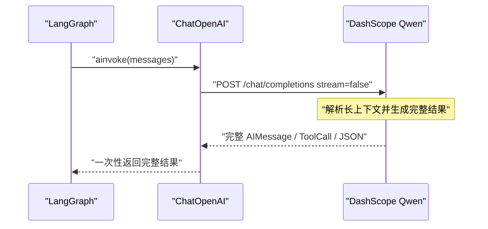

模型可能需要：

1. 解析几万字符的上下文；
2. 生成整篇 Markdown；
3. 生成 ToolCall 参数；
4. 生成完整的结构化 JSON；
5. 完成后才向客户端返回 HTTP 响应正文。

如果这个过程超过 `LLM_TIMEOUT_SECONDS=60`，客户端在 60 秒内没有收到响应数据，就可能抛出读取超时。

这正是此前 Researcher、Writer 和 Coordinator 长请求发生超时的主要机制，并不代表模型不支持当前上下文长度。模型可能仍在正常生成，只是非流式连接在超时窗口内没有返回任何正文。

### 二、代码上如何改成流式

统一入口是 `_build_model()`：

[deep_document_agent.py (line 1575)](D:/AI_Agent_Project/AI_Python_Project/python-agent-study/src/fast_app/services/agent_tasks/deep_document_agent.py:1575)

它增加了 `streaming` 参数：

```
def _build_model(
    self,
    *,
    timeout_seconds: float | None = None,
    max_retries: int | None = None,
    streaming: bool = False,
) -> ChatOpenAI:
```

然后将该参数传给 `ChatOpenAI`：

```python
return ChatOpenAI(
    model=self._settings.llm_model_name,
    api_key=self._settings.openai_api_key,
    base_url=self._settings.openai_base_url,
    temperature=0.0,
    timeout=...,
    max_retries=...,
    streaming=streaming,
)
```

这里的默认值仍然是 `False`，因此不会影响工程中其他普通模型调用。只有 Deep Document Agent 明确指定的角色使用流式。

角色模型在以下位置创建：

[deep_document_agent.py (line 974)](D:/AI_Agent_Project/AI_Python_Project/python-agent-study/src/fast_app/services/agent_tasks/deep_document_agent.py:974)

```python
model = self._build_model(
    timeout_seconds=(
        self._settings.agent_document_coordinator_timeout_seconds
    ),
    max_retries=0,
    streaming=True,
)

researcher_model = self._build_model(
    timeout_seconds=(
        self._settings.agent_document_researcher_timeout_seconds
    ),
    max_retries=self._settings.agent_document_researcher_max_retries,
    streaming=True,
)

writer_model = self._build_model(
    max_retries=0,
    streaming=True,
)
```

模型分配关系是：

- Coordinator 使用 `model`；
- Researcher 使用 `researcher_model`；
- Writer 使用 `writer_model`；
- Reviewer 复用 `model`。

Reviewer 的配置位置：

[deep_document_agent.py (line 1117)](D:/AI_Agent_Project/AI_Python_Project/python-agent-study/src/fast_app/services/agent_tasks/deep_document_agent.py:1117)

```
{
    "name": "document-reviewer",
    "model": model,
    ...
}
```

因此四个角色都已经覆盖。

### 三、为什么外层仍然使用 `graph.ainvoke()`

当前代码没有把：

```
graph.ainvoke(...)
```

替换成：

```
graph.astream(...)
```

这是正确的，因为这里存在**两个不同层次的“流式”**。

#### 第一层：模型传输层流式

DashScope 逐段返回模型输出：

```
HTTP 请求
→ 第一个响应 chunk
→ 后续文本 chunk
→ ToolCall 参数 chunk
→ 结束 chunk
```

这由 `ChatOpenAI(streaming=True)` 控制。

#### 第二层：LangGraph 工作流输出

LangGraph 仍然需要等待一个角色完成，取得完整的：

- `DocumentResearchResult`
- `DocumentDraftResult`
- `DocumentReviewResult`
- ToolCall
- `AIMessage`

然后才能：

- 校验结构化结果；
- 执行工具；
- 更新 Agent 状态；
- 写入 checkpoint；
- 决定下一个角色。

所以当前过程是：

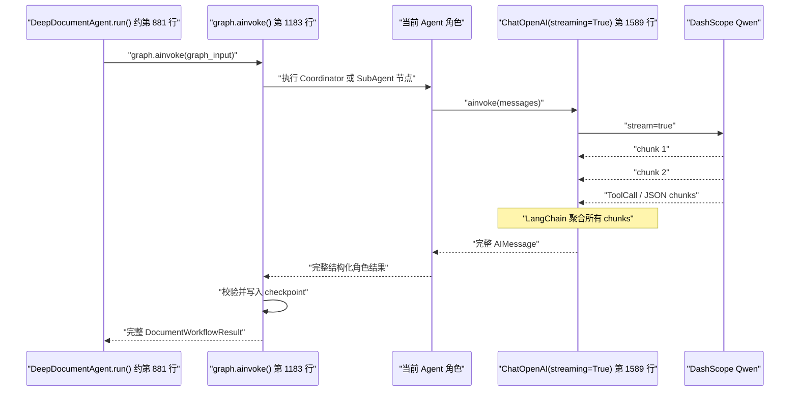

也就是说：

> 模型响应在 HTTP 传输层是流式的，但 Agent 节点仍然以完整、可校验的结果作为状态提交单位。

这可以避免把半截 JSON、半截 ToolCall 或尚未完成的正文写入 LangGraph 状态。

### 四、流式为什么能够缓解模型超时【必要】

非流式时，服务器可能在完整生成结束前一个字节都不返回：

```
0 秒：请求发送
10 秒：模型解析输入
30 秒：模型生成正文
60 秒：客户端仍未收到正文
60 秒：ReadTimeout
```

流式时，模型开始生成后就会持续发送 chunk：

```
0 秒：请求发送
18 秒：收到第一个 chunk
20 秒：收到第二个 chunk
23 秒：收到第三个 chunk
...
85 秒：收到结束 chunk
```

HTTP 客户端的读取超时通常关注的是“等待下一批响应数据的时间”，而不是简单限制整次生成只能运行多少秒。

只要模型持续输出，读取连接就保持活跃。因此一篇正文即使总生成时间超过 60 秒，也不一定触发 60 秒读取超时。

这尤其适合：

- Writer 输出长篇 Markdown；
- Reviewer 审查完整长文；
- Coordinator 接收较大的 SubAgent 结果；
- Researcher 综合多份检索证据。

### 五、为什么还需要角色专用超时

流式只能解决“生成过程中长时间没有返回完整响应”的问题，不能解决“第一个 token 迟迟没有出现”。

例如 Researcher 输入了较长的知识库证据，模型需要较长时间执行输入预处理：

```
发送 36k 字符上下文
→ 模型进行 prefill
→ 70 秒后才开始生成第一个 token
```

即使设置了 `streaming=True`，前 70 秒仍没有任何 chunk。如果超时仍是 60 秒，照样会失败。

所以当前配置为：

[config.py (line 309)](D:/AI_Agent_Project/AI_Python_Project/python-agent-study/src/fast_app/core/config.py:309)

```
普通模型默认超时                  60 秒
Researcher 单次模型超时          120 秒
Coordinator/Reviewer 单次超时    120 秒
整个 Deep Agent 工作流超时       480 秒
```

它们分别控制不同边界：

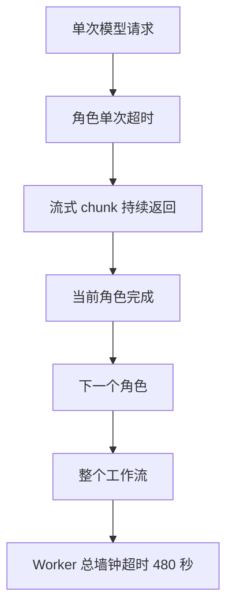

- 角色超时防止某一次模型请求无限等待；
- Worker 超时防止整个多 Agent 流程无限运行；
- 模型调用预算防止 Agent 反复调用；
- 工具调用限制防止重复检索、读取或编辑。

这些边界不能互相替代。

### 六、为什么长请求要关闭自动重试

当前四个角色的长请求都禁止 SDK 自动重试。

这是因为一次逻辑模型调用如果超时并自动重试，SDK 会重新发送全部输入：

```
36k 字符上下文
→ 等待 60 秒
→ 超时
→ 自动重新发送相同 36k 字符
→ 再等待 60 秒
→ 再次超时
```

一次 Agent 模型调用可能实际产生三次 HTTP 请求，却仍然只完成零个业务步骤。

流式请求还有一个额外风险：如果已经收到部分 ToolCall 或部分正文后连接中断，直接自动重放可能造成：

- 重复 ToolCall；
- 重复生成；
- 调用次数统计失真；
- 整个 Worker 的时间预算被快速消耗。

所以当前策略是：

```
单次长请求失败
→ 不在 SDK 内自动重放
→ 将当前 checkpoint 标记为可恢复
→ 由任务级 retry 决定是否恢复
```

这比 SDK 在不理解业务状态的情况下自动重试更安全。

### 七、流式不能单独解决所有超时问题

需要特别明确：

> `streaming=True` 是传输层优化，不是多 Agent 收敛机制，也不是上下文压缩机制。

它不能解决以下问题：

1. 输入超出模型上下文窗口；
2. 第一个 token 在角色超时前始终没有出现；
3. 模型输出过程中长时间没有新 chunk；
4. DashScope 服务不可用；
5. Agent 重复检索、重复读取和重复派发；
6. Writer/Reviewer 反复返工；
7. Coordinator 重复生成已经存在的完整正文；
8. 整个工作流超过 480 秒。

因此这次最终修复实际上是组合措施：

```
四个角色启用流式
+ 关闭长请求自动重试
+ Researcher/Coordinator 专用 120 秒超时
+ Worker 总超时调整为 480 秒
+ 限制角色和共享模型调用次数
+ Researcher 失败后确定性 fail-fast
+ 固定文件一次完整读取
+ Writer 批量编辑
+ Reviewer 批准后由服务端确定性组装最终结果
```

其中“Reviewer 批准后由服务端组装结果”非常重要：否则 Coordinator 最后还要重新输出一次整篇正文 JSON，即使使用流式，也会重复消耗大量时间和 token。

### 八、这是否会让 React 前端看到四个角色的 token

不会自动看到。

当前改造是 Worker 与 DashScope 之间的内部模型流式传输：

```
DashScope
→ ChatOpenAI 流式接收
→ LangChain 聚合
→ Agent 完成当前角色
→ 更新 TaskPlan/Checkpoint
```

它不是 React SSE 输出协议。

React 目前应该继续消费结构化任务状态和进度事件，而不是直接显示 Researcher、Writer、Reviewer 的原始 token。原始模型内容可能包含：

- 内部推理过程；
- 私有知识库片段；
- 未完成 ToolCall；
- 未经 Reviewer 审查的草稿；
- 不稳定的中间 JSON。

如果未来需要让前端展示实时进度，应该输出稳定事件，例如：

```
researcher_started
researcher_completed
writer_started
draft_ready
reviewer_started
revision_requested
waiting_confirmation
failed
```

而不是直接转发模型 token。

### 九、当前验证结果

当前回归脚本已经覆盖：

- Coordinator 流式、120 秒、零重试；
- Researcher 流式、120 秒、零重试；
- Writer 流式、零重试；
- Reviewer 复用 Coordinator 流式模型；
- Worker 总超时 480 秒；
- 共享模型调用预算 36；
- Researcher 与其他 SubAgent 的独立调用上限。

我执行了：

```
.\.venv\Scripts\python.exe scripts\phase_15\test_deep_document_agent_workflow.py
```

结果为：

```
deep_document_agent_workflow=passed
```

对应测试位于：

[test_deep_document_agent_workflow.py (line 733)](D:/AI_Agent_Project/AI_Python_Project/python-agent-study/scripts/phase_15/test_deep_document_agent_workflow.py:733)

最终结论是：四个角色已经完成模型传输层流式改造；它通过尽早并持续接收响应 chunk 缓解长输出读取超时，同时结合角色专用超时、禁用自动重试、工作流总超时和确定性收敛规则解决本次暴露的问题。但它不会提高模型上下文上限，也不能代替多 Agent 控制流的收敛治理。

# 单次长请求失败后的处理机制：

## 单次长请求失败后的处理代码

这里的“单次长请求失败”主要包括两类超时：

- `ChatOpenAI` / OpenAI SDK 抛出的 `APITimeoutError`，它属于 `APIError`。
- 外层 `asyncio.wait_for()` 达到整个文档工作流上限后抛出的 `TimeoutError`。

完整处理链路是：

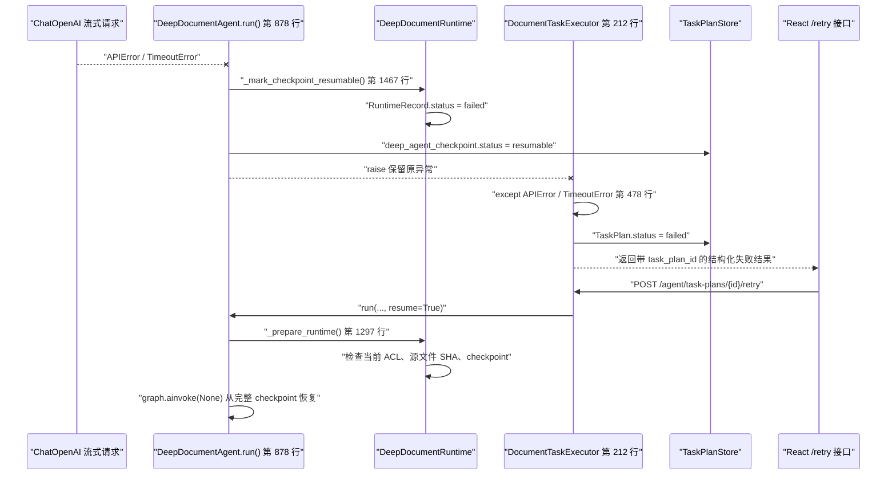

### 一、异常最初从哪里产生

Deep Agent 的整体运行位置是：

[deep_document_agent.py (line 1181)](D:/AI_Agent_Project/AI_Python_Project/python-agent-study/src/fast_app/services/agent_tasks/deep_document_agent.py:1181)

```py
try:
    result = await asyncio.wait_for(
        graph.ainvoke(
            graph_input,
            config=config,
            durability="sync",
        ),
        timeout=self._settings.agent_document_worker_timeout_seconds,
    )
```

这里同时存在两层超时。

#### 1. 模型单次请求超时

例如 Researcher 调用 DashScope 时，120 秒内没有收到第一个 chunk，底层可能抛出：

```
openai.APITimeoutError
```

`APITimeoutError` 继承自 `APIError`，它会经过 LangChain、Deep Agents 和 LangGraph，一直传播到这里。

#### 2. 整个工作流超时

外层还有：

```
asyncio.wait_for(..., timeout=480)
```

如果 Coordinator、Researcher、Writer、Reviewer 整体执行超过 480 秒，`wait_for()` 会取消图任务并抛出：

```
TimeoutError
```

因此：

```
模型单次 timeout
≠
整个 Deep Agent 的 480 秒 timeout
```

前者约束一个模型请求，后者约束整个多 Agent 工作流。

### 二、DeepDocumentAgent 如何保留失败现场

模型、工具、超时或 LangGraph 节点抛出异常后，会进入：

[deep_document_agent.py (line 1204)](D:/AI_Agent_Project/AI_Python_Project/python-agent-study/src/fast_app/services/agent_tasks/deep_document_agent.py:1204)

```py
except Exception:
    await self._mark_checkpoint_resumable(
        plan,
        expected_version=record_version[0],
    )
    raise
```

这里做了两件事。

#### 第一步：把当前现场标记为可恢复

调用：

```
await self._mark_checkpoint_resumable(...)
```

它不会删除 LangGraph checkpoint。

#### 第二步：重新抛出原始异常

```
raise
```

这里没有创建新异常，也没有吞掉原异常。

如果原异常是：

```
APITimeoutError
```

重新抛出后仍然是 `APITimeoutError`；上层可以据此判断这是外部模型错误，而不是把所有问题都转换成模糊的“执行失败”。

### 三、`_mark_checkpoint_resumable()` 具体保存了什么

实现位于：

[deep_document_agent.py (line 1467)](D:/AI_Agent_Project/AI_Python_Project/python-agent-study/src/fast_app/services/agent_tasks/deep_document_agent.py:1467)

```py
async def _mark_checkpoint_resumable(
    self,
    plan: AgentTaskPlan,
    *,
    expected_version: int,
) -> None:
    assert self._runtime is not None

    record = await self._runtime.update_record(
        plan.task_plan_id,
        expected_version=expected_version,
        updates={"status": "failed"},
    )

    self._set_checkpoint_summary(
        plan,
        status="resumable",
        record=record,
        resumed_from_checkpoint=False,
    )

    self._task_plan_store.save(plan)
```

这里保存了三个不同层次的状态。

#### 1. RuntimeRecord 状态：`failed`

```
updates={"status": "failed"}
```

意思是：

> 这一轮 Deep Agent 执行已经停止，不再被认为是正在运行。

它不是说 checkpoint 已经损坏，只表示本轮执行失败。

#### 2. Checkpoint 摘要状态：`resumable`

```
status="resumable"
```

它最终写入：

```
plan.final_output["deep_agent_checkpoint"]
```

前端看到的大致结构是：

```json
{
  "status": "resumable",
  "durability": "sync",
  "resume_count": 0,
  "resumed_from_checkpoint": false,
  "record_version": 5,
  "retained_until": "..."
}
```

它表示：

> 虽然本轮任务失败，但 LangGraph checkpoint 仍然保留，可以通过 `/retry` 恢复。

#### 3. LangGraph Saver 中的 thread 不删除

代码注释明确说明：

```
# 这里只把 Store record 标记为 failed，
# 不删除 Saver 中的 thread；
# 否则 /retry 无法恢复虚拟文件和已完成节点。
```

因此以下内容仍然可能保留：

- 已完成角色的消息；
- 已经写入的研究摘要；
- StateBackend 中的虚拟文件；
- Writer 已完成的草稿；
- 当前 Todo 和交付物进度；
- 最近一次完整 LangGraph 节点状态。

### 四、为什么要传入 `expected_version`【乐观锁】

调用时传入：

```
expected_version=record_version[0]
```

Runtime 更新实现位于：

[deep_document_runtime.py (line 439)](D:/AI_Agent_Project/AI_Python_Project/python-agent-study/src/fast_app/services/agent_tasks/deep_document_runtime.py:439)

```py
current = await self.load_record(task_plan_id)

if current.record_version != expected_version:
    raise DocumentAgentCheckpointConflictError(
        "Deep Agent 运行记录已被其他恢复请求更新"
    )
```

这是一个**乐观并发检查**。

假设两个请求同时操作同一个 TaskPlan：

```
请求 A 读取 record_version = 5
请求 B 读取 record_version = 5

请求 A 更新成功：
record_version = 6

请求 B 再尝试用 expected_version = 5 更新
→ 检测到当前已经是 6
→ 拒绝覆盖
```

这样可以防止一个较晚完成的旧请求覆盖另一个请求已经写入的新状态。

当前同一进程内还有 `task_plan_id` 级别的锁；`record_version` 提供第二层冲突检测。

### 五、为什么使用 `durability="sync"`

图执行时设置：

```py
graph.ainvoke(
    ...,
    durability="sync",
)
```

对应位置：

[deep_document_agent.py (line 1183)](D:/AI_Agent_Project/AI_Python_Project/python-agent-study/src/fast_app/services/agent_tasks/deep_document_agent.py:1183)

它要求 LangGraph 在进入下一个节点前，同步完成当前节点的 checkpoint 写入。

假设当前流程是：

```
Researcher 完成
→ checkpoint 写入成功
→ Writer 开始
→ Writer 模型请求超时
```

恢复时可以回到：

```
Researcher 已完成
→ 重新执行未完成的 Writer 节点
```

而不是重新从第一个 Coordinator 决策和 Researcher 检索开始。

但需要注意：

> checkpoint 只能恢复到最近一个完整节点，不能从某个模型响应的第 237 个 token 继续。

如果 Writer 在流式生成正文时连接断开：

```
Writer 已收到部分 token
→ 流式连接失败
→ 没有形成完整 AIMessage
→ Writer 节点没有完成
```

这些不完整 token 不会写入正式 Agent 状态。重试时会重新执行这个未完成的 Writer 模型节点。

### 六、为什么还要重新抛出异常

`DeepDocumentAgent` 只负责：

- 保留 LangGraph 现场；
- 保存 Runtime 状态；
- 保留原始异常。

它不负责决定 HTTP 接口最终返回什么。

异常重新抛出后，进入：

[document_task_executor.py (line 478)](D:/AI_Agent_Project/AI_Python_Project/python-agent-study/src/fast_app/services/agent_tasks/document_task_executor.py:478)

```py
except (APIError, TimeoutError, ModelCallLimitExceededError) as exc:
    await self._retain_agentic_checkpoint(plan)

    plan.status = AgentTaskPlanStatus.FAILED
    plan.error = f"{type(exc).__name__}: {exc}"
    plan.final_output["status"] = plan.status.value

    self._task_plan_store.save(plan)
    return plan
```

这个异常分支专门处理：

- `APIError`：模型 API 超时、网络或服务端错误；
- `TimeoutError`：整个 Worker 工作流超时；
- `ModelCallLimitExceededError`：模型调用预算耗尽。

与 `DeepDocumentAgent` 不同，`DocumentTaskExecutor` 负责生成前端可理解的业务结果。

例如：

```json
{
  "task_plan_id": "task_plan_xxx",
  "status": "failed",
  "error": "APITimeoutError: Request timed out.",
  "final_output": {
    "status": "failed",
    "deep_agent_checkpoint": {
      "status": "resumable"
    }
  }
}
```

这样前端不会只收到一个通用 `500 Internal Server Error`，也不会丢失 `task_plan_id`。

### 七、为什么上层又调用一次 `retain_checkpoint()`

`DocumentTaskExecutor` 中还有：

```
await self._retain_agentic_checkpoint(plan)
```

实现位于：

[document_task_executor.py (line 1201)](D:/AI_Agent_Project/AI_Python_Project/python-agent-study/src/fast_app/services/agent_tasks/document_task_executor.py:1201)

```py
async def _retain_agentic_checkpoint(
    self,
    plan: AgentTaskPlan,
) -> None:
    retain = getattr(
        self._deep_document_agent,
        "retain_checkpoint",
        None,
    )

    if callable(retain):
        await retain(plan)
```

而 `retain_checkpoint()` 又会调用 `_mark_checkpoint_resumable()`：

[deep_document_agent.py (line 1450)](D:/AI_Agent_Project/AI_Python_Project/python-agent-study/src/fast_app/services/agent_tasks/deep_document_agent.py:1450)

这是第二层防护。

原因是异常不一定发生在 `graph.ainvoke()` 里面。也可能发生在：

```
Deep Agent 已返回
→ DocumentTaskExecutor 校验 Proposal
→ 检查 ACL、doc_id、草稿、Reviewer 结果
→ 校验阶段发生异常
```

这种情况下，`DeepDocumentAgent.run()` 内部的异常分支不会被触发，上层仍然需要保留 checkpoint。

对于模型超时，内部已经标记过一次；上层再次标记在状态语义上是幂等的：

```
failed → failed
resumable → resumable
```

同时使用最新 `record_version`，不会继续使用第一次更新前的旧版本。

### 八、为什么已知错误返回 TaskPlan，未知错误仍向外抛出

代码还存在通用异常分支：

```py
except Exception as exc:
    await self._retain_agentic_checkpoint(plan)

    plan.status = AgentTaskPlanStatus.FAILED
    plan.error = f"{type(exc).__name__}: {exc}"
    plan.final_output["status"] = plan.status.value

    self._task_plan_store.save(plan)
    raise
```

两者区别是：

```
APIError / TimeoutError / 模型预算耗尽
→ 已知、可诊断的运行失败
→ 保存并返回 failed TaskPlan

其他未知 Exception
→ 仍然保存 TaskPlan 和 checkpoint
→ 继续抛出，要求 API 日志和监控暴露代码错误
```

这样不会把真正的系统 Bug 伪装成普通模型超时。

### 九、用户调用 `/retry` 时发生什么

重试入口是：

[agent_task_plan_routes.py (line 155)](D:/AI_Agent_Project/AI_Python_Project/python-agent-study/src/fast_app/api/agent_task_plan_routes.py:155)

```py
@router.post(
    "/{task_plan_id}/retry",
    response_model=AgentTaskPlanControlResponse,
)
async def retry_agent_task_plan_endpoint(...):
    plan = await task_executor.resume(
        task_plan_id,
        user=user,
    )
```

前端请求：

```
POST /agent/task-plans/{task_plan_id}/retry
```

注意：这不是模型 SDK 自动重试，而是新的业务请求。

它会重新经过：

- 当前登录用户身份；
- TaskPlan 所有权验证；
- 当前权限验证；
- 当前文档 ACL；
- 当前源文件内容；
- checkpoint 完整性验证。

### 十、同一个 TaskPlan 不能并发恢复两次

恢复入口首先取得 TaskPlan 锁：

[agent_task_executor.py (line 308)](D:/AI_Agent_Project/AI_Python_Project/python-agent-study/src/fast_app/services/agent_tasks/agent_task_executor.py:308)

```
async with _TASK_PLAN_LOCKS.hold(task_plan_id):
    return await self._resume_locked(...)
```

这样可以避免用户双击“重试”按钮时同时启动两次恢复任务。

拿到锁以后还会重新读取 TaskPlan：

```
plan = self._load_owned_plan(task_plan_id, user)
```

不会使用进入锁之前读取的旧对象。

然后检查：

```py
if not user.is_authenticated:
    raise ToolPermissionDeniedError(...)

if plan.status not in {
    AgentTaskPlanStatus.RUNNING,
    AgentTaskPlanStatus.FAILED,
}:
    raise AppServiceError(...)
```

只有 `running` 或 `failed` 的文档 TaskPlan 可以恢复。

### 十一、恢复时不会盲目信任旧 checkpoint

调用链最终再次进入：

```py
self._deep_document_agent.run(
    ...,
    resume=True,
)
```

对应位置：

[agent_task_executor.py (line 378)](D:/AI_Agent_Project/AI_Python_Project/python-agent-study/src/fast_app/services/agent_tasks/agent_task_executor.py:378)

`DeepDocumentAgent.run()` 调用 `_prepare_runtime()`：

[deep_document_agent.py (line 1297)](D:/AI_Agent_Project/AI_Python_Project/python-agent-study/src/fast_app/services/agent_tasks/deep_document_agent.py:1297)

恢复前会检查三个关键事实。

#### 1. 当前 ACL 是否和原来一致

```
if record.acl_fingerprint != acl_fingerprint:
    invalidation_reason = "acl_changed"
```

如果用户权限发生变化，不允许继续使用旧的私有候选文档和正文。

#### 2. 被读取的源文档是否发生变化

系统重新读取文档，并计算 SHA：

```
content = await read_document_content_current(...)

if sha256(content.encode("utf-8")).hexdigest() != snapshot.sha256:
    invalidation_reason = "source_changed"
```

例如 Writer 修改某文档时超时，但此后 GitLab `main` 中该文档已经更新，那么旧 Researcher 证据已经不可靠，不能直接恢复。

#### 3. PostgreSQL checkpoint 是否存在且可读取

```
has_checkpoint = await self._runtime.has_checkpoint(
    plan.task_plan_id
)

if not has_checkpoint:
    raise DocumentAgentCheckpointUnavailableError(...)
```

如果 TaskPlan 声明有 checkpoint，但实际 checkpoint 丢失，系统不会静默从头重跑，因为那可能：

- 重复执行高成本模型操作；
- 重复产生文档草稿；
- 使用错误的权限边界；
- 让用户误以为是从原进度恢复。

### 十二、验证通过后如何真正恢复 LangGraph

ACL、源文件 SHA 和 checkpoint 都有效时：

```
record = await self._runtime.update_record(
    plan.task_plan_id,
    expected_version=record.record_version,
    updates={
        "status": "running",
        "resume_count": record.resume_count + 1,
    },
)

resume_from_checkpoint = True
```

然后构造图输入时：

[deep_document_agent.py (line 1159)](D:/AI_Agent_Project/AI_Python_Project/python-agent-study/src/fast_app/services/agent_tasks/deep_document_agent.py:1159)

```
graph_input = None

if not resume_from_checkpoint:
    graph_input = {
        "messages": [...],
        "files": ...,
    }
```

恢复情况下：

```
graph_input = None
```

再调用：

```
graph.ainvoke(
    None,
    config=config,
    durability="sync",
)
```

在 LangGraph 中，`None + 相同 thread_id` 表示：

> 不创建新的初始消息和虚拟文件，从这个 thread 最近保存的完整 checkpoint 继续运行。

相同 thread 的生成规则位于：

[deep_document_runtime.py (line 362)](D:/AI_Agent_Project/AI_Python_Project/python-agent-study/src/fast_app/services/agent_tasks/deep_document_runtime.py:362)

```
return f"document:{task_plan_id}"
```

`thread_id` 完全由服务端根据 `task_plan_id` 生成，客户端不能传入任意 thread ID，因此不能通过修改请求参数读取其他用户的 checkpoint。

### 十三、发生变化时不是继续恢复，而是安全重启

如果发现：

```
ACL 已变化
或
源文件 SHA 已变化
```

代码会：

```py
await self._runtime.release(plan.task_plan_id)

record = await self._runtime.create_record(
    task_plan_id=plan.task_plan_id,
    acl_fingerprint=acl_fingerprint,
)
```

也就是：

```
旧 checkpoint 失效
→ 删除旧私有工作区
→ 使用当前权限重新建立 Runtime
→ 重新检索和生成
```

前端还能在 warnings 中看到：

```
acl_changed
```

或者：

```
source_changed
```

因此，“任务级重试”也不等于无条件重放旧请求。

### 十四、三个状态为什么看起来不一致

一次模型超时后可能同时看到：

```
TaskPlan.status = failed
RuntimeRecord.status = failed
deep_agent_checkpoint.status = resumable
```

这不是矛盾，而是三个不同问题：

| 状态                          | 回答的问题                   |
| ----------------------------- | ---------------------------- |
| `TaskPlan.status=failed`      | 这次用户请求成功了吗？没有   |
| `RuntimeRecord.status=failed` | 当前 Worker 还在运行吗？没有 |
| `checkpoint.status=resumable` | 失败现场还可以恢复吗？可以   |

可以理解为：

```
本次执行已经失败
但失败现场仍然保留
用户可以显式决定是否重试
```

### 十五、最关键的边界

这套设计保证的是：

```
模型流式请求失败
→ 不自动重复发送长上下文
→ 不提交半截 AIMessage 或 ToolCall
→ 保留最近完整 LangGraph checkpoint
→ 返回包含 task_plan_id 的结构化失败
→ 用户显式调用 /retry
→ 重新鉴权和验证源文件
→ 只重做尚未完成的节点
```

它不能从网络中断位置继续接收剩余 token。模型节点如果没有完整结束，该节点在任务级重试时仍需重新调用模型；区别在于不会把整个 Coordinator → Researcher → Writer → Reviewer 链路全部无条件重做。


## 两层异常保护：这两个 `retain` 到底是什么关系

~~~cpp
//这里讲解的是上一节的 【七、为什么上层又调用一次 `retain_checkpoint()`】
~~~


这段代码想表达的核心其实只有一句话：

> 内层负责处理“Deep Agent 自己运行时发生的异常”，外层负责处理“整个文档任务任何阶段发生的异常”。

它们覆盖的代码范围不同。

### 先看整体结构

可以简化成下面这样：

```py
# DocumentTaskExecutor：外层
try:
    result = await deep_document_agent.run()

    # Deep Agent 返回后，外层还要继续做很多校验
    validate_result(result)
    validate_acl(result)
    validate_document_path(result)
    prepare_dry_run(result)

except Exception:
    await deep_document_agent.retain_checkpoint()
    raise
```

而 `DeepDocumentAgent.run()` 内部又是：

```py
# DeepDocumentAgent：内层
try:
    result = await graph.ainvoke(...)

except Exception:
    await self._mark_checkpoint_resumable()
    raise
```

因此形成两个异常保护范围：

```
DocumentTaskExecutor 外层
├── DeepDocumentAgent.run() 内层
│   └── graph.ainvoke()
│
├── 校验 Agent 返回结果
├── 校验 ACL
├── 校验文档路径
├── 校验草稿和 Reviewer 结果
└── 准备 dry-run
```

### 场景一：模型请求超时

假设 Writer 调用模型超时：

```
DocumentTaskExecutor
→ DeepDocumentAgent.run()
→ graph.ainvoke()
→ Writer 调用模型
→ APITimeoutError
```

异常首先被内层捕获：

```
except Exception:
    await self._mark_checkpoint_resumable(...)
    raise
```

内层做完：

```
保留 checkpoint
→ 标记为 resumable
→ 继续抛出 APITimeoutError
```

异常继续传播到外层：

```
except (APIError, TimeoutError, ModelCallLimitExceededError):
    await self._retain_agentic_checkpoint(plan)
```

因此，对于模型超时，checkpoint 确实会被标记两次。

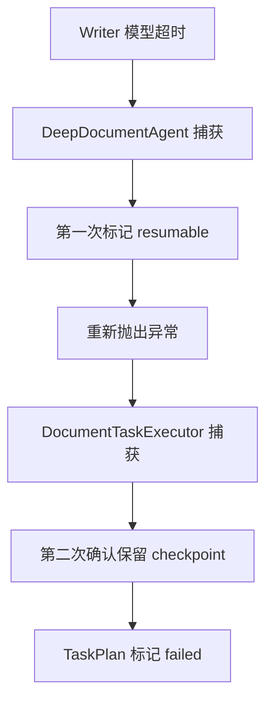

这里第二次调用不是因为第一次失败了，而是外层采用了统一的兜底逻辑。

更准确地说：

> 对模型超时，外层调用有重复；但对状态结果没有破坏。

它不是完全没有副作用的“严格幂等”，因为 `record_version` 仍会增加一次，保留期限也会刷新。只是业务状态保持不变：

```
RuntimeRecord: failed → failed
Checkpoint 摘要: resumable → resumable
```

### 场景二：Deep Agent 正常返回，但外层校验失败

这是外层 `retain_checkpoint()` 真正不可缺少的场景。

例如 Deep Agent 正常执行结束：

```
Researcher 完成
→ Writer 完成
→ Reviewer 批准
→ graph.ainvoke() 正常返回
```

此时内层没有异常，所以不会执行：

```
_mark_checkpoint_resumable()
```

但是 `DocumentTaskExecutor` 接下来还要检查模型结果：

[document_task_executor.py (line 266)](D:/AI_Agent_Project/AI_Python_Project/python-agent-study/src/fast_app/services/agent_tasks/document_task_executor.py:266)

```py
run_result = await self._deep_document_agent.run(...)
workflow = run_result.workflow

proposal_ids = _validate_agentic_workflow_result(
    workflow=workflow,
    deliverables=deliverables,
)
```

后面还要检查：

- Proposal 是否属于 Supervisor 原计划；
- operation 是否被模型擅自修改；
- `doc_id` 是否来自当前授权候选；
- Writer 草稿是否与 Reviewer 审批结果一致；
- 文档路径是否在当前部门范围；
- 原文 SHA 是否匹配；
- dry-run 是否能够安全生成。

假设模型返回：

```
Supervisor 要求 create
但 Writer 返回 update
```

调用过程是：

```
graph.ainvoke() 正常完成
→ DeepDocumentAgent.run() 正常返回
→ 内层没有异常
→ DocumentTaskExecutor 校验 operation
→ 校验失败
```

此时只能依靠外层：

```
except Exception:
    await self._retain_agentic_checkpoint(plan)
```

来保存现场。

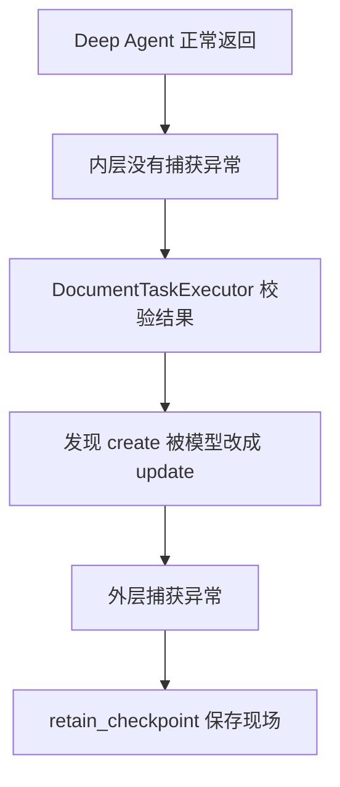

如果没有外层的 `retain_checkpoint()`，这种“模型运行成功、业务校验失败”的现场就不会被标记为可恢复。

### 为什么外层不判断“内层是否已经保存过”

当前外层没有写成：

```
if not checkpoint_already_retained:
    await retain_checkpoint()
```

而是统一调用：

```
await self._retain_agentic_checkpoint(plan)
```

原因是外层不需要了解异常具体发生在：

- Coordinator；
- Researcher；
- Writer；
- Reviewer；
- LangGraph；
- 结构化结果校验；
- ACL 校验；
- dry-run。

外层只执行一条统一规则：

```
文档 Agent 任务发生异常
→ 确保 checkpoint 被保留
```

而 `retain_checkpoint()` 会先加载最新记录：

```
record = await self._runtime.load_record(plan.task_plan_id)

if record is None:
    return
```

如果存在记录，就使用最新的 `record_version` 再标记：

```
await self._mark_checkpoint_resumable(
    plan,
    expected_version=record.record_version,
)
```

因此它不会拿内层更新之前的旧版本直接覆盖新记录。

### 可以把它理解成两道安全网

第一道安全网在 Deep Agent 内部：

```
保护 graph.ainvoke() 的执行现场
```

第二道安全网在 DocumentTaskExecutor 外部：

```
保护整个文档任务，包括 Deep Agent 返回后的业务校验
```

对应关系是：

| 异常位置                    | 内层能否捕获 | 外层能否捕获 |
| --------------------------- | ------------ | ------------ |
| Researcher 模型超时         | 能           | 能           |
| Writer 模型超时             | 能           | 能           |
| Reviewer 模型超时           | 能           | 能           |
| LangGraph 节点异常          | 能           | 能           |
| Agent 返回结果格式错误      | 可能能       | 能           |
| Proposal 与 Supervisor 冲突 | 不能         | 能           |
| ACL 校验失败                | 不能         | 能           |
| 文档路径校验失败            | 不能         | 能           |
| dry-run 失败                | 不能         | 能           |

### 最简结论

这段代码不是说：

> 模型超时必须保存两次 checkpoint。

它真正表达的是：

```
DeepDocumentAgent：
负责确保自身内部失败时保存 checkpoint。

DocumentTaskExecutor：
负责确保整个文档任务任何阶段失败时都保存 checkpoint。
```

模型超时同时穿过这两层，所以当前实现会重复标记一次；外层调用的主要价值，是覆盖 Deep Agent 已经返回以后才发生的业务校验异常。


## Annotation 1：`task_plan_id` 级别的锁与 `record_version`

这两个机制解决的不是同一个问题：

- `task_plan_id` 锁：防止同一个任务同时执行两次。
- `record_version`：防止代码拿着旧数据覆盖已经更新的新数据。

可以把它们理解为：

```
task_plan_id 锁 = 房间门锁
record_version  = 文件版本号
```

### 1. 什么是 `task_plan_id` 级别的锁

实现位置：

[agent_task_executor.py (line 70)](D:/AI_Agent_Project/AI_Python_Project/python-agent-study/src/fast_app/services/agent_tasks/agent_task_executor.py:70)

```py
class _TaskPlanLockRegistry:
    def __init__(self) -> None:
        self._guard = asyncio.Lock()
        self._locks: dict[str, asyncio.Lock] = {}
```

系统不是给所有任务使用一把全局锁，而是每个 `task_plan_id` 使用一把独立锁：

```
task_plan_A → Lock A
task_plan_B → Lock B
task_plan_C → Lock C
```

所以不同任务可以并发执行：

```
用户 1 执行 task_plan_A
用户 2 执行 task_plan_B
→ 可以同时执行
```

但同一个任务不能同时执行：

```
请求 1：retry task_plan_A
请求 2：retry task_plan_A
→ 只能有一个请求执行
```

### 2. 为什么可能出现同一个任务同时执行

最常见的情况是用户重复操作：

```
用户连续点击两次“重试”
→ 浏览器发送两个 /retry 请求
```

也可能是：

```
第一个请求响应比较慢
→ 前端认为请求失败
→ 再次发送 retry
```

还可能同时出现不同类型的操作：

```
请求 A：retry
请求 B：confirm
```

如果没有锁，可能出现：

```
两个 Writer 同时生成不同草稿
两个请求同时更新 RuntimeRecord
两个请求同时恢复同一个 LangGraph checkpoint
一个请求正在 retry，另一个请求已经 confirm
```

### 3. 锁是怎么取得的

核心代码：

```py
async with self._guard:
    lock = self._locks.setdefault(
        task_plan_id,
        asyncio.Lock(),
    )

    if lock.locked():
        raise AgentTaskPlanBusyError(
            "Agent task plan 当前仍在执行"
        )

    await lock.acquire()
```

这里存在两类锁。

#### `_guard`

```
self._guard = asyncio.Lock()
```

它只负责保护 `_locks` 字典本身。

例如两个请求同时第一次访问 `task_plan_A`，如果没有 `_guard`，两个请求可能分别创建两把锁：

```
请求 1 创建 Lock A1
请求 2 创建 Lock A2
```

这样两边都能取得自己的锁，互斥就失效了。

`_guard` 保证：

```
同一个 task_plan_id
→ 字典里只会得到同一把 asyncio.Lock
```

#### `_locks[task_plan_id]`

它保护具体的业务任务：

```
self._locks: dict[str, asyncio.Lock] = {}
```

例如：

```py
self._locks = {
    "task_plan_A": lock_a,
    "task_plan_B": lock_b,
}
```

`lock_a` 被占用不会影响 `lock_b`。

### 4. 为什么第二个请求直接报错，而不是排队

代码明确检查：

```py
if lock.locked():
    raise AgentTaskPlanBusyError(
        "Agent task plan 当前仍在执行"
    )
```

所以第二个请求不会等待第一个请求执行完后再继续，而是直接得到“任务正在执行”的冲突响应。

这是 fail-fast 行为：

```
第一个 retry 正在运行
→ 第二个 retry 到达
→ 立即拒绝
```

原因是如果第二个请求排队，等第一个请求成功后，它可能又把已经成功的任务执行一遍。

### 5. 哪些操作使用这把锁

首次文档 Agent 执行：

[agent_task_executor.py (line 294)](D:/AI_Agent_Project/AI_Python_Project/python-agent-study/src/fast_app/services/agent_tasks/agent_task_executor.py:294)

```py
async with _TASK_PLAN_LOCKS.hold(plan.task_plan_id):
    return await self._document_executor.execute(...)
```

任务恢复：

[agent_task_executor.py (line 308)](D:/AI_Agent_Project/AI_Python_Project/python-agent-study/src/fast_app/services/agent_tasks/agent_task_executor.py:308)

```
async with _TASK_PLAN_LOCKS.hold(task_plan_id):
    return await self._resume_locked(...)
```

人工确认：

[agent_task_executor.py (line 423)](D:/AI_Agent_Project/AI_Python_Project/python-agent-study/src/fast_app/services/agent_tasks/agent_task_executor.py:423)

所以同一个任务不能同时执行：

```
首次运行
retry
confirm
```

### 6. 什么是 `record_version`

`record_version` 是 `DeepDocumentRuntimeRecord` 的一个整数字段：

[deep_document_runtime.py (line 170)](D:/AI_Agent_Project/AI_Python_Project/python-agent-study/src/fast_app/services/agent_tasks/deep_document_runtime.py:170)

```
record_version: int = Field(
    default=1,
    ge=1,
    description="每次 Store 更新递增的乐观锁版本。",
)
```

RuntimeRecord 可能是：

```
{
  "task_plan_id": "task_plan_A",
  "status": "running",
  "record_version": 5,
  "resume_count": 1
}
```

每次更新后，版本号自动加一：

```
"record_version": current.record_version + 1
```

即：

```
第一次创建：version = 1
第一次更新：version = 2
第二次更新：version = 3
第三次更新：version = 4
```

### 7. `expected_version` 如何阻止旧数据覆盖新数据

更新时调用方必须提供自己之前读取的版本：

```
await runtime.update_record(
    task_plan_id,
    expected_version=5,
    updates={"status": "failed"},
)
```

`update_record()` 会重新读取当前记录：

[deep_document_runtime.py (line 439)](D:/AI_Agent_Project/AI_Python_Project/python-agent-study/src/fast_app/services/agent_tasks/deep_document_runtime.py:439)

```
current = await self.load_record(task_plan_id)

if current.record_version != expected_version:
    raise DocumentAgentCheckpointConflictError(
        "Deep Agent 运行记录已被其他恢复请求更新"
    )
```

例如两个执行路径都读取到版本 5：

```
执行路径 A：读取 version=5
执行路径 B：读取 version=5
```

A 先更新：

```
A 提交 expected_version=5
当前数据库 version=5
→ 检查通过
→ 更新完成
→ version 变成 6
```

B 再更新：

```
B 提交 expected_version=5
当前数据库 version=6
→ 版本不一致
→ 拒绝更新
```

这样 B 不能拿旧状态覆盖 A 已经保存的新状态。

### 8. 锁与版本号之间的区别

| 机制                 | 检查时间             | 解决的问题             |
| -------------------- | -------------------- | ---------------------- |
| `task_plan_id` 锁    | 请求进入执行前       | 阻止同一任务同时执行   |
| `record_version`     | RuntimeRecord 写入前 | 阻止旧版本覆盖新版本   |
| LangGraph checkpoint | 节点完成时           | 保存最近完整工作流状态 |

完整关系是：

````
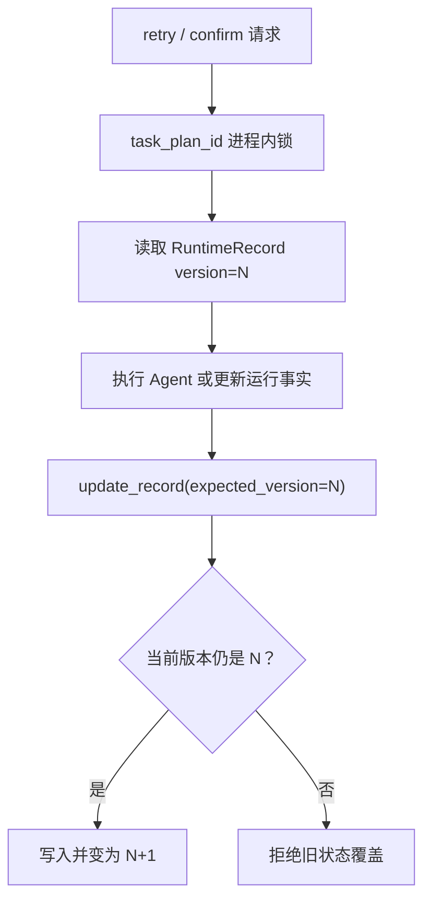
````

### 9. 当前实现的重要限制

我之前称它为“第二层冲突检测”，这里需要补充一个重要限制：

> 当前 `record_version` 还不是完整的跨进程数据库原子乐观锁。

代码现在执行的是：

```
读取记录
→ 在 Python 中比较版本
→ 再执行 Store put
```

并不是一条 PostgreSQL 原子语句：

```
UPDATE ...
SET record_version = record_version + 1
WHERE task_plan_id = ?
  AND record_version = ?
```

代码注释也明确说明：

[deep_document_runtime.py (line 451)](D:/AI_Agent_Project/AI_Python_Project/python-agent-study/src/fast_app/services/agent_tasks/deep_document_runtime.py:451)

```
# 当前的“读取 + 比较 + put”不是 PostgreSQL 原子 CAS，
# 安全性依赖 AgentTaskExecutor 的单进程 task_plan_id 锁。
# 未来多 Worker 部署时需改成数据库条件更新或租约。
```

因此当前真实能力是：

```
单个 FastAPI 进程
→ task_plan_id 锁可以有效互斥
→ record_version 可以发现进程内旧版本写入

多个 FastAPI 进程
→ 每个进程都有自己的锁字典
→ 当前方案不能形成完整的跨进程互斥
```

如果将来启动多个 FastAPI Worker，应该改成：

- PostgreSQL 原子条件更新；
- 数据库租约；
- 或 PostgreSQL advisory lock。

------

## Annotation 2：Supervisor、Writer、Reviewer、ACL、路径和 SHA 由谁检查

这些检查不是由某一个 Agent 完成，也不是集中在单个函数中。

主要责任模块是：

```
DocumentTaskExecutor
```

但它还会调用：

```
DocumentChangePlanService
KnowledgeDocumentManagementService
AgentToolPermissionService
```

完整分层如下：

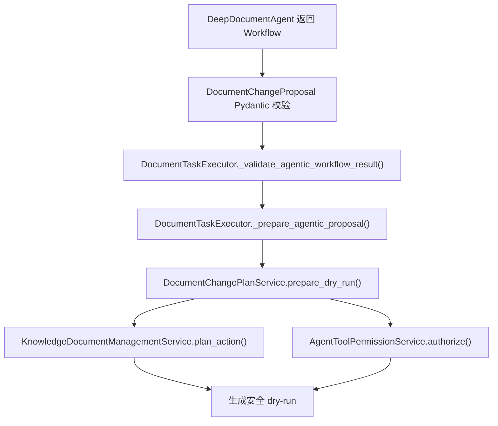

### 1. Proposal 基础字段检查：Pydantic 模型

第一层位于：

[document_workflow.py (line 210)](D:/AI_Agent_Project/AI_Python_Project/python-agent-study/src/fast_app/domain/document_workflow.py:210)

`DocumentChangeProposal` 定义：

```py
class DocumentChangeProposal(BaseModel):
    deliverable_id: str
    operation: DocumentWorkflowOperation
    candidate_doc_id: str | None
    candidate_source_path: str | None
    filename: str | None
    base_sha256: str | None
    content: str | None
    review: DocumentReviewResult
```

它会先检查字段组合是否合法：

```py
if self.review.verdict != "approved":
    raise ValueError(
        "只有 Reviewer approved 的草稿才能形成变更建议"
    )

if self.operation == "create":
    if not self.filename or self.content is None:
        raise ValueError(...)

elif self.operation == "update":
    if (
        not self.candidate_doc_id
        or not self.base_sha256
        or self.content is None
    ):
        raise ValueError(...)
```

这一层只保证结构完整，例如：

```
create 必须有 filename 和 content
update 必须有 doc_id、base_sha256 和 content
delete 必须有 doc_id
```

它还没有证明这些值是真的。

### 2. Proposal 是否属于 Supervisor 原计划

主要检查函数：

[document_task_executor.py (line 1361)](D:/AI_Agent_Project/AI_Python_Project/python-agent-study/src/fast_app/services/agent_tasks/document_task_executor.py:1361)

```py
def _validate_agentic_workflow_result(
    *,
    workflow: DocumentWorkflowResult,
    deliverables: dict[str, DocumentDeliverable],
) -> list[str]:
```

`deliverables` 来自 Supervisor 的可信规划：

```py
deliverables = {
    item.deliverable_id: item
    for item in decision.deliverables
}
```

首先检查 Agent 返回的交付物 ID 是否属于 Supervisor：

```py
if any(item not in known_ids for item in all_terminal_ids):
    raise AppServiceError(
        "DeepDocumentAgent 返回了 Supervisor 计划外的交付物"
    )
```

例如 Supervisor 只创建了：

```
deliverable_1
```

但 Coordinator 返回：

```
deliverable_999
```

服务端会拒绝。

### 3. `create` 被模型改成 `update` 在哪里检查

就是下面这段：

[document_task_executor.py (line 1379)](D:/AI_Agent_Project/AI_Python_Project/python-agent-study/src/fast_app/services/agent_tasks/document_task_executor.py:1379)

```py
for proposal in workflow.approved_changes:
    deliverable = deliverables[proposal.deliverable_id]

    if deliverable.operation != proposal.operation:
        raise AppServiceError(
            "DeepDocumentAgent 变更建议超出 Supervisor 操作范围"
        )
```

假设 Supervisor 决定：

```py
{
  "deliverable_id": "deliverable_1",
  "operation": "create"
}
```

但最终 Proposal 是：

```py
{
  "deliverable_id": "deliverable_1",
  "operation": "update"
}
```

比较结果：

```
Supervisor operation = create
Proposal operation   = update
→ 不相等
→ 拒绝
```

这不是由 Coordinator 自己检查，而是由确定性的 Python 服务代码检查。

### 4. Writer 草稿与 Reviewer 审查结果在哪里检查

同一个函数继续查找该交付物对应的 Writer 和 Reviewer 结果：

```py
matching_drafts = [
    item
    for item in workflow.draft_results
    if item.deliverable_id == proposal.deliverable_id
]

matching_reviews = [
    item
    for item in workflow.review_results
    if item.deliverable_id == proposal.deliverable_id
]
```

如果缺少任何一方：

```py
if not matching_drafts or not matching_reviews:
    raise AppServiceError(
        "approved_changes 缺少 Writer 草稿或 Reviewer 结果"
    )
```

存在返工时，可能有多个草稿和多个 Review：

```
Draft 1
Review 1：revision_required
Draft 2
Review 2：approved
```

服务端只认最后一次：

```
final_draft = matching_drafts[-1]
final_review = matching_reviews[-1]
```

然后检查 Reviewer 是否真的批准：

```py
if final_review.verdict != "approved":
    raise AppServiceError(
        "最终 Reviewer 未批准，不能生成可确认动作"
    )
```

### 5. Coordinator 是否偷偷替换了 Writer 正文

服务端分别构造两组事实。

Writer 最终草稿：

```py
draft_facts = (
    final_draft.operation,
    final_draft.candidate_doc_id,
    final_draft.candidate_source_path,
    final_draft.filename,
    final_draft.base_sha256,
    final_draft.content,
)
```

Coordinator 最终汇总的 Proposal：

```py
proposal_facts = (
    proposal.operation,
    proposal.candidate_doc_id,
    proposal.candidate_source_path,
    proposal.filename,
    proposal.base_sha256,
    proposal.content,
)
```

然后整体比较：

```py
if draft_facts != proposal_facts:
    raise AppServiceError(
        "变更建议与 Writer 最终草稿的目标或正文不一致"
    )
```

这防止 Coordinator 在汇总阶段把 Reviewer 已经看过的正文替换为另一份正文。

### 6. `doc_id` 是否来自当前授权候选

进入：

[document_task_executor.py (line 496)](D:/AI_Agent_Project/AI_Python_Project/python-agent-study/src/fast_app/services/agent_tasks/document_task_executor.py:496)

```
async def _prepare_agentic_proposal(...)
```

对于 update/delete，不允许模型自由提供路径，而是使用：

```
candidate = _require_document_candidate(
    proposal.candidate_doc_id or "",
    candidates,
)

target_path = candidate["source_path"]
```

`_require_document_candidate()` 检查：

[document_task_executor.py (line 1437)](D:/AI_Agent_Project/AI_Python_Project/python-agent-study/src/fast_app/services/agent_tasks/document_task_executor.py:1437)

```
candidate = candidates.get(doc_id)

if candidate is None:
    raise AppServiceError(
        "doc_id 不在本轮权限过滤后的检索候选中"
    )
```

因此模型不能随便编造：

```
doc_id = secret_document_123
```

只有本次通过当前用户 ACL 检索得到的候选才能继续。

### 7. 模型返回的路径是否正确

update/delete 的真实路径来自服务端候选：

```
target_path = candidate["source_path"]
```

如果模型还返回了 `candidate_source_path`，服务端只拿它来比较：

```
if (
    proposal.candidate_source_path
    and proposal.candidate_source_path != target_path
):
    raise AppServiceError(
        "模型返回的 source_path 与服务端候选不一致"
    )
```

所以真正决定路径的是：

```
服务端 candidates[doc_id].source_path
```

不是 Writer 或 Coordinator。

### 8. `base_sha256` 在哪里检查

update 必须存在 Researcher 读取时形成的快照：

```py
snapshot = read_snapshots.get(
    proposal.candidate_doc_id or ""
)

if snapshot is None:
    raise AppServiceError(
        "复杂 update 缺少授权读取快照"
    )
```

接着检查模型携带的 SHA 是否与可信快照一致：

```py
if (
    snapshot.source_path != target_path
    or snapshot.sha256 != proposal.base_sha256
):
    raise AppServiceError(
        "复杂 update 的 base_sha256 与读取快照不一致"
    )
```

然后重新读取当前真实文件：

```py
current = await self._document_management_service\
    .read_document_content_current(
        target_path,
        doc_id=proposal.candidate_doc_id,
    )
```

再次计算 SHA：

```py
if sha256(current.encode("utf-8")).hexdigest() != snapshot.sha256:
    raise AppServiceError(
        "目标文档在 Deep Agents 编写期间已变化"
    )
```

这是为了防止：

```
Researcher 读取版本 A
→ Writer 根据版本 A 修改
→ 此时其他人已经把文档更新成版本 B
→ Agent 再拿基于版本 A 的草稿覆盖版本 B
```

### 9. create 路径如何限制在当前部门

create 不采用模型给出的完整目录，只取文件名：

[document_task_executor.py (line 1544)](D:/AI_Agent_Project/AI_Python_Project/python-agent-study/src/fast_app/services/agent_tasks/document_task_executor.py:1544)

```
requested_name = Path(requested_path).name
```

例如模型返回：

```
other_department/secret/new.md
```

`Path.name` 只留下：

```
new.md
```

然后由服务端生成目录：

```
directory = (
    user.primary_department_code
    or f"users/{user.user_id}"
)

return f"{directory}/{requested_name}"
```

如果当前用户的部门是 `development`：

```
模型建议：other_department/secret/new.md
服务端结果：development/new.md
```

因此模型不能决定 create 的部门目录。

### 10. 谁完成真正的路径安全检查

`DocumentTaskExecutor` 最终调用：

```
self._change_plan_service.prepare_dry_run(...)
```

它属于：

[document_change_plan_service.py (line 31)](D:/AI_Agent_Project/AI_Python_Project/python-agent-study/src/fast_app/services/agent_tasks/document_change_plan_service.py:31)

`DocumentChangePlanService` 再调用：

```
self._document_management_service.plan_action(...)
```

路径安全检查在：

[knowledge_document_management_service.py (line 478)](D:/AI_Agent_Project/AI_Python_Project/python-agent-study/src/fast_app/services/knowledge/knowledge_document_management_service.py:478)

它负责拒绝：

- 空路径；
- `..` 路径穿越；
- 知识库根目录之外的路径；
- 不允许的文件扩展名；
- 权限规则文件；
- 不符合 create/update/delete 前置条件的目标。

例如：

```
if any(part == ".." for part in raw_parts):
    raise AppServiceError(
        "target_path 不能包含 .. 路径穿越片段"
    )
```

### 11. 谁检查用户是否具有目标部门权限

`DocumentChangePlanService.prepare_dry_run()` 会构造权限上下文：

[document_change_plan_service.py (line 98)](D:/AI_Agent_Project/AI_Python_Project/python-agent-study/src/fast_app/services/agent_tasks/document_change_plan_service.py:98)

```py
context = AgentToolCallContext(
    tool_name=f"knowledge_document_{operation.value}",
    target_path=target_path,
    target_department_codes=list(
        preview.permission_metadata.get(
            "allowed_departments",
            [],
        )
    ),
    requires_confirmation=True,
)
```

然后调用：

```py
decision = await self._tool_permission_service.authorize(
    user=user,
    context=context,
)
```

最终权限裁决在：

[agent_tool_permission_service.py (line 86)](D:/AI_Agent_Project/AI_Python_Project/python-agent-study/src/fast_app/services/agent_tasks/agent_tool_permission_service.py:86)

它会读取当前有效权限，并逐个目标部门检查：

```py
for department_code in target_departments:
    scope = effective.scope_for_department(
        department_code
    )
```

如果缺少目标部门权限：

```py
return AgentToolPermissionDecision(
    action=DENY,
    reason="当前用户没有目标部门内的文档工具权限",
)
```

### 12. 谁生成 dry-run

最终由：

```
DocumentChangePlanService.prepare_dry_run()
```

组织 dry-run。

它创建：

```py
KnowledgeDocumentActionRequest(
    operation=operation,
    target_path=target_path,
    content=content,
    reason=reason,
    dry_run=True,
)
```

然后由 `KnowledgeDocumentManagementService.plan_action()` 生成：

- 规范化路径；
- `doc_id`；
- `before_hash`；
- 风险等级；
- ACL metadata；
- GitLab 当前快照；
- 变更预览。

因为 `dry_run=True`，此时不会：

- 修改 GitLab；
- 创建分支；
- 创建 Commit；
- 创建 MR；
- 修改 ES；
- 修改 Milvus。

### 13. 最终责任划分

| 检查内容                            | 主要模块                                                   |
| ----------------------------------- | ---------------------------------------------------------- |
| Proposal 字段是否完整               | `DocumentChangeProposal`                                   |
| Proposal 是否属于 Supervisor 原计划 | `DocumentTaskExecutor._validate_agentic_workflow_result()` |
| create 是否被改成 update            | `DocumentTaskExecutor._validate_agentic_workflow_result()` |
| Writer 与 Reviewer 是否存在         | `DocumentTaskExecutor._validate_agentic_workflow_result()` |
| Reviewer 是否 approved              | `DocumentTaskExecutor._validate_agentic_workflow_result()` |
| Coordinator 是否替换 Writer 正文    | `DocumentTaskExecutor._validate_agentic_workflow_result()` |
| `doc_id` 是否来自 ACL 候选          | `DocumentTaskExecutor._prepare_agentic_proposal()`         |
| 模型路径是否与候选路径一致          | `DocumentTaskExecutor._prepare_agentic_proposal()`         |
| 原文 SHA 是否变化                   | `DocumentTaskExecutor._prepare_agentic_proposal()`         |
| create 目录属于当前部门             | `DocumentTaskExecutor._create_target_path()`               |
| 路径穿越和扩展名                    | `KnowledgeDocumentManagementService`                       |
| 当前用户部门权限                    | `AgentToolPermissionService`                               |
| dry-run 和冲突检查                  | `DocumentChangePlanService`                                |

最重要的是：

> Supervisor、Writer、Reviewer 的输出都不是可信执行事实。`DocumentTaskExecutor` 负责把三个 Agent 的输出相互对照，再由文档管理服务和权限服务根据当前服务器事实完成最终校验。

# 服务端组装最终Plan的文件写入--拆分coordinate的职责：

~~~cpp
//coordinator之前负责编写完整的TaskPlan，但是在文本过长的情况下会出现故障超时，所以现在交给服务端直接写入
~~~

## 先纠正一个容易混淆的名称

这里其实有三个不同对象：

| 对象                     | 用途                                                         | 谁负责                                                 |
| ------------------------ | ------------------------------------------------------------ | ------------------------------------------------------ |
| `AgentTaskPlan`          | 对外业务任务，保存状态、待确认步骤、错误和最终结果           | 服务端                                                 |
| Coordinator TodoList     | Coordinator 内部安排 Researcher、Writer、Reviewer 的工作清单 | Coordinator                                            |
| `DocumentWorkflowResult` | 多 Agent 工作完成后的汇总结果                                | 以前主要依赖 Coordinator，现在成功终态由服务端直接组装 |

所以准确地说：

> 调整的重点不是“把整个 AgentTaskPlan 从 Coordinator 移交给服务端”，因为业务 `AgentTaskPlan` 原本就是服务端对象。真正移走的是 Coordinator 最后重新生成完整 `DocumentWorkflowResult` 的工作。

------

## 一、业务 TaskPlan 原本就是服务端创建的

文档任务开始时，服务端在 [agent_task_planner.py (line 397)](D:\\AI_Agent_Project\\AI_Python_Project\\python-agent-study\\src\\fast_app\\services\\agent_tasks\\agent_task_planner.py:397) 创建一个空的文档 `AgentTaskPlan`：

```py
return AgentTaskPlan(
    task_plan_id=task_plan_id,
    task_kind="knowledge_document_management",
    user_id=user_id,
    original_query=query,
    objective=query.strip() or query,
    task_type="analysis",
    source_query=query.strip() or query,
    final_synthesis_instruction="生成受权限约束的文档变更计划并等待人工确认。",
    research_policy=research_policy or AgentResearchPolicy(),
    created_at=now,
    updated_at=now,
    steps=[],
)
```

这里已经生成了：

- `task_plan_id`
- 用户身份
- 原始 Query
- 任务类型
- 研究策略
- 初始状态
- 空的文档操作步骤

Coordinator 不负责创建这个对象。

Coordinator 的工作发生在这个 TaskPlan 创建以后。

------

## 二、Coordinator 以前真正承担的“长文本工作”是什么

多 Agent 执行完成以后，LangGraph 中可能已经积累了：

```
Researcher 的证据结果
Writer 的完整 Markdown 草稿
Reviewer 的完整审查结果
Writer 返工后的第二版完整草稿
Reviewer 第二次审查结果
所有 task ToolCall 和 ToolMessage
```

以前 Coordinator 在最后还要再调用一次大模型，将这些内容重新整理成：

```py
DocumentWorkflowResult(
    research_results=[...],
    draft_results=[...],
    review_results=[...],
    approved_changes=[
        DocumentChangeProposal(
            content="完整 Markdown 正文",
            ...
        )
    ],
    failed_deliverables=[...],
    evidence=[...],
    warnings=[...],
)
```

问题在于，Writer 已经生成过完整正文，Reviewer 也已经审查过。Coordinator 为了生成最终结构化结果，又必须：

1. 接收前面所有长上下文；
2. 再次读取完整 Markdown；
3. 理解 Reviewer 是否批准；
4. 再次复制完整 Markdown；
5. 输出一个巨大的结构化 JSON；
6. 保证正文没有遗漏、截断或改写。

相当于：

```
Writer 生成 30K 正文
→ Reviewer 阅读 30K 正文
→ Coordinator 再阅读 30K 正文
→ Coordinator 再输出一遍 30K 正文
```

最后一次 Coordinator 调用没有创造新的业务价值，却具有最高的超时风险。

------

## 三、为什么这个阶段容易超时

这不是简单的“模型不支持长上下文”。

更准确的原因是：

```
输入上下文已经很长
+
Coordinator 还要输出完整结构化正文
+
JSON Schema 约束增加生成难度
+
前面已经消耗了大量 Worker 总时间
```

### 1. 输入很长

Coordinator 的 LangGraph State 中包含前面各角色的消息：

```
Researcher ToolMessage
Writer ToolMessage
Reviewer ToolMessage
可能还有返工后的 Writer 和 Reviewer ToolMessage
```

Writer 的 `DocumentDraftResult.content` 本身就是完整文档。

### 2. 输出也很长

Coordinator 不能只回答：

```
Reviewer 已批准
```

它必须再次输出：

```
{
  "approved_changes": [
    {
      "content": "完整 Markdown 正文……"
    }
  ]
}
```

这是典型的“大输入 + 大输出”。

### 3. 容易出现非超时类错误

即使模型没有超时，也可能发生：

- Markdown 正文被截断；
- 代码块丢失；
- 标题被改写；
- Writer 草稿和 Coordinator 输出不一致；
- `doc_id`、路径或者 SHA 被模型改变；
- Reviewer 明明批准了 A，Coordinator 却返回 B；
- 结构化输出解析失败。

因此这部分不仅是性能问题，也是可信性问题。

------

## 四、现在怎样由服务端直接组装

核心调整位于 `_DocumentCoordinatorProgressMiddleware.before_model()`：

[deep_document_agent.py (line 543)](D:\\AI_Agent_Project\\AI_Python_Project\\python-agent-study\\src\\fast_app\\services\\agent_tasks\\deep_document_agent.py:543)

```py
@hook_config(can_jump_to=["end"])
def before_model(self, state, runtime):
    """子任务结果已形成终态时由服务端直接组装工作流。"""

    failures = self.subagent_failures(state)

    if failures and len(failures) == len(self._deliverable_ids):
        return {
            "jump_to": "end",
            "structured_response": DocumentWorkflowResult(
                failed_deliverables=failures,
            ),
        }

    approved = self.approved_workflow(state)

    if approved is None:
        return None

    return {
        "jump_to": "end", # 重点是这里，直接跳到end阶段结束节点，进入服务端 直接组装已经完成的文档内容 写入文档
        "structured_response": approved,
    }
```

这个函数是一个模型调用前置钩子。

每次 LangGraph 准备再次调用 Coordinator 时，会先执行它。

------

## 五、`before_model()` 怎样避免最后一次模型调用

以前的流程是：

````mermaid

sequenceDiagram
    participant C as "Coordinator"
    participant R as "Researcher"
    participant W as "Writer"
    participant V as "Reviewer"
    participant L as "大模型"

    C->>R: "task(document-researcher)"
    R-->>C: "DocumentResearchResult"
    C->>W: "task(document-writer)"
    W-->>C: "DocumentDraftResult（完整正文）"
    C->>V: "task(document-reviewer)"
    V-->>C: "DocumentReviewResult"
    C->>L: "再次传入全部结果，生成 DocumentWorkflowResult"
    L-->>C: "再次输出完整正文和结构化结果"

````

现在的流程是：

````mermaid

sequenceDiagram
    participant C as "Coordinator"
    participant R as "Researcher"
    participant W as "Writer"
    participant V as "Reviewer"
    participant M as "_DocumentCoordinatorProgressMiddleware"
    participant E as "DocumentTaskExecutor"

    C->>R: "task(document-researcher)"
    R-->>C: "DocumentResearchResult"
    C->>W: "task(document-writer)"
    W-->>C: "DocumentDraftResult（完整正文）"
    C->>V: "task(document-reviewer)"
    V-->>C: "DocumentReviewResult"

    M->>M: "before_model() :543"
    M->>M: "approved_workflow() :560"
    M-->>C: "jump_to='end' + structured_response"
    Note over C: "不再调用 Coordinator 模型"

    C-->>E: "DocumentWorkflowResult"
    E->>E: "_validate_agentic_workflow_result()"
    E->>E: "_prepare_agentic_proposal()"
    E->>E: "plan.steps.append(...) :367"
    E->>E: "TaskPlanStore.save(plan) :466"

````

关键是：

```
"jump_to": "end"
```

它告诉 LangGraph：

> 不需要继续进入 Coordinator 模型节点，工作流已经可以结束。

而：

```
"structured_response": approved
```

直接把服务端生成的 `DocumentWorkflowResult` 放入图状态。

------

## 六、服务端如何找到各个 SubAgent 的结果

`approved_workflow()` 会按照 Supervisor 已经登记的 `deliverable_id` 遍历交付物：

```
for deliverable_id in self._deliverable_ids:
```

代码位于 [deep_document_agent.py (line 560)](D:\\AI_Agent_Project\\AI_Python_Project\\python-agent-study\\src\\fast_app\\services\\agent_tasks\\deep_document_agent.py:560)。

它分别寻找该交付物最近一次：

```
raw_research = self._latest_task_result(
    state,
    subagent_type="document-researcher",
    deliverable_id=deliverable_id,
)

raw_draft = self._latest_task_result(
    state,
    subagent_type="document-writer",
    deliverable_id=deliverable_id,
)

raw_review = self._latest_task_result(
    state,
    subagent_type="document-reviewer",
    deliverable_id=deliverable_id,
)
```

`_latest_task_result()` 的工作方式是：

1. 从 `AIMessage.tool_calls` 找到 Coordinator 派发的 `task`；
2. 取得这个调用的 `tool_call_id`；
3. 在对应的 `ToolMessage` 中找到 SubAgent 返回结果；
4. 按 `subagent_type + deliverable_id` 找到最新一次结果。

代码位置：

[deep_document_agent.py (line 731)](D:\\AI_Agent_Project\\AI_Python_Project\\python-agent-study\\src\\fast_app\\services\\agent_tasks\\deep_document_agent.py:731)

这不是要求 Coordinator 再解释一次历史，而是服务端直接读取 LangGraph 已有的结构化状态。

------

## 七、服务端不会直接信任原始字典

找到结果后，还要使用 Pydantic 模型重新验证：

```
research = DocumentResearchResult.model_validate(raw_research)
draft = DocumentDraftResult.model_validate(raw_draft)
review = DocumentReviewResult.model_validate(raw_review)
```

这样可以保证：

- Researcher 结果符合 `DocumentResearchResult`；
- Writer 草稿符合 `DocumentDraftResult`；
- Reviewer 结果符合 `DocumentReviewResult`；
- 缺少必需字段时直接失败；
- 多余或错误类型的字段不能静默进入最终结果。

接着检查 Reviewer 是否批准：

```
if review.verdict != "approved":
    return None
```

只有最终 Reviewer 明确返回：

```
approved
```

服务端才可以组装成功结果。

------

## 八、可信字段由服务端重新覆盖

Writer 返回的操作类型、文件路径等内容不能直接信任。

服务端从 Supervisor 已冻结的 `DocumentDeliverable` 中读取操作类型：

```
trusted_identity = {
    "operation": deliverable.operation,
}
```

对于创建文档，还会重新处理：

```
trusted_identity.update(
    candidate_doc_id=None,
    candidate_source_path=None,
    filename=Path(
        deliverable.target_hint or draft.filename or ""
    ).name,
    base_sha256=None,
)
```

然后覆盖 Writer 草稿中的对应字段：

```
draft = draft.model_copy(update=trusted_identity)
```

这意味着，即使 Writer 错误返回：

```
{
  "operation": "update"
}
```

而 Supervisor 冻结的操作是：

```
{
  "operation": "create"
}
```

服务端仍然使用：

```
create
```

模型不能借最终汇总阶段改变业务操作。

------

## 九、怎样生成最终 DocumentChangeProposal

服务端直接复用 Writer 已经生成、Reviewer 已经批准的正文：

```
approved_changes.append(
    DocumentChangeProposal(
        deliverable_id=deliverable_id,
        operation=draft.operation,
        candidate_doc_id=draft.candidate_doc_id,
        candidate_source_path=draft.candidate_source_path,
        filename=draft.filename,
        base_sha256=draft.base_sha256,
        content=draft.content,
        evidence_refs=draft.evidence_refs,
        review=review,
    )
)
```

代码位置：

[deep_document_agent.py (line 608)](D:\\AI_Agent_Project\\AI_Python_Project\\python-agent-study\\src\\fast_app\\services\\agent_tasks\\deep_document_agent.py:608)

这里最重要的是：

```
content=draft.content
```

服务端不会再让 Coordinator 重写正文，而是直接引用 Writer 最终草稿。

因此不会出现：

```
Writer 草稿是版本 A
Reviewer 批准版本 A
Coordinator 重新生成成版本 B
最终却提交版本 B
```

现在保证：

```
Writer 最终草稿 A
        ↓
Reviewer 批准 A
        ↓
服务端复制 draft.content
        ↓
DocumentChangeProposal 仍然是 A
```

------

## 十、怎样生成完整 DocumentWorkflowResult

最后服务端直接组合：

```py
return DocumentWorkflowResult(
    research_results=research_results,
    draft_results=draft_results,
    review_results=review_results,
    approved_changes=approved_changes,
    warnings=[
        warning
        for research in research_results
        for warning in research.warnings
    ],
    evidence=[
        evidence
        for research in research_results
        for evidence in research.evidence
    ],
)
```

代码位置：

[deep_document_agent.py (line 625)](D:\\AI_Agent_Project\\AI_Python_Project\\python-agent-study\\src\\fast_app\\services\\agent_tasks\\deep_document_agent.py:625)

这个过程只是 Python 对象组装：

```
已有 ResearchResult
+
已有 DraftResult
+
已有 ReviewResult
+
服务端构造 Proposal
=
DocumentWorkflowResult
```

没有网络请求，没有新的模型调用，也不会重新生成正文。

------

## 十一、DocumentWorkflowResult 如何写入真正的 TaskPlan

`DeepDocumentAgent` 返回以后，`DocumentTaskExecutor` 接管。

### 第一步：再次验证跨角色一致性

```py
proposal_ids = _validate_agentic_workflow_result(
    workflow=workflow,
    deliverables=deliverables,
)
```

位置：

[document_task_executor.py (line 287)](D:\\AI_Agent_Project\\AI_Python_Project\\python-agent-study\\src\\fast_app\\services\\agent_tasks\\document_task_executor.py:287)

这里检查：

- Proposal 是否属于 Supervisor 的交付物；
- operation 是否一致；
- Proposal 正文是否等于 Writer 最终草稿；
- Reviewer 是否批准同一份草稿；
- 交付物是否重复或遗漏。

### 第二步：生成 dry-run 文档操作

```
output = await self._prepare_agentic_proposal(...)
```

位置：

[document_task_executor.py (line 357)](D:\\AI_Agent_Project\\AI_Python_Project\\python-agent-study\\src\\fast_app\\services\\agent_tasks\\document_task_executor.py:357)

这里继续检查：

- 当前用户权限；
- 候选 `doc_id`；
- GitLab/知识库目标路径；
- 原文 SHA；
- 更新冲突；
- dry-run 是否安全。

### 第三步：服务端写入 `plan.steps`

```
plan.steps.append(
    _document_step_from_tool_result(...)
)
```

位置：

[document_task_executor.py (line 367)](D:\\AI_Agent_Project\\AI_Python_Project\\python-agent-study\\src\\fast_app\\services\\agent_tasks\\document_task_executor.py:367)

这才是真正向业务 TaskPlan 增加待确认操作步骤。

### 第四步：写入 `final_output`

服务端写入：

```
plan.final_output.update(
    {
        "document_workflow": ...,
        "research_results": ...,
        "draft_results": ...,
        "review_results": ...,
        "failed_deliverables": ...,
        "warnings": ...,
        "evidence": ...,
        "document_progress": ...,
    }
)
```

位置：

[document_task_executor.py (line 407)](D:\\AI_Agent_Project\\AI_Python_Project\\python-agent-study\\src\\fast_app\\services\\agent_tasks\\document_task_executor.py:407)

### 第五步：进入人工确认状态

```
plan.status = AgentTaskPlanStatus.WAITING_CONFIRMATION
```

然后写入确认接口：

```
"confirm_endpoint": (
    f"/agent/task-plans/{plan.task_plan_id}/confirm"
)
```

最后：

```
self._task_plan_store.save(plan)
```

位置：

[document_task_executor.py (line 458)](D:\\AI_Agent_Project\\AI_Python_Project\\python-agent-study\\src\\fast_app\\services\\agent_tasks\\document_task_executor.py:458)

------

## 十二、TaskPlanStore 怎样写入文件

`AgentTaskPlanStore.save()` 会把同一个 TaskPlan 保存为：

- JSON：供接口和程序读取；
- Markdown：供人工检查。

代码位置：

[agent_task_plan_store.py (line 23)](D:\\AI_Agent_Project\\AI_Python_Project\\python-agent-study\\src\\fast_app\\services\\agent_tasks\\agent_task_plan_store.py:23)

它不是直接覆盖正式文件，而是：

```
写入临时文件
→ flush
→ fsync
→ os.replace 原子替换正式文件
```

核心代码：

```
with tempfile.NamedTemporaryFile(...) as handle:
    handle.write(content)
    handle.flush()
    os.fsync(handle.fileno())

os.replace(temp_path, path)
```

这样 React 或其他请求轮询 TaskPlan 时，不会读到只写了一半的 JSON。

------

## 十三、Coordinator 现在还负责什么

Coordinator 并没有被删除。

它现在仍然负责：

- 开始时创建一次 TodoList；
- 派发 Researcher；
- Researcher 成功后派发 Writer；
- Writer 完成后派发 Reviewer；
- Reviewer 要求修改时，将意见交回 Writer；
- 控制不同交付物的依赖和执行顺序；
- 对尚未进入确定性终态的流程决定下一步。

它不再负责：

- 读取和修改虚拟文件；
- 重写 Writer 的完整正文；
- 在全部 Reviewer 批准后重新生成整份结果；
- 决定可信 `doc_id`、路径、操作类型或 SHA；
- 直接写入 TaskPlan 文件；
- 直接提交 GitLab。

可以将当前 Coordinator 理解为：

> Coordinator 负责决定“接下来调用谁”；服务端负责判断“是否已经结束”以及“最终结果怎样安全落盘”。

------

## 十四、当前调整仍有一个边界

当前服务端确定性结束覆盖了两个重要场景：

### 场景一：所有交付物都成功批准

```
全部 Researcher 完成
+
全部 Writer 完成
+
全部 Reviewer approved
→ 服务端直接组装成功结果
```

### 场景二：所有交付物都失败

```
失败数量 == 交付物总数
→ 服务端直接组装 failed_deliverables
```

但对于多文档任务中的混合结果：

```
文档 A approved
文档 B failed
```

当前 `approved_workflow()` 要求每个交付物都存在完整的 Research、Draft、Review 且全部批准。因此混合成功/失败场景仍可能需要 Coordinator 返回最终汇总。

不过之前场景 3 是单文档任务，单文档最终只有：

```
approved
```

或者：

```
failed
```

所以在场景 3 的正常路径和完整失败路径中，都可以直接由服务端结束，不再让 Coordinator承担最后一次长文本生成。


# Supervisor 和 Coordinator角色的职责划分：

## Supervisor 和 Coordinator 的区别

你的理解没错：Coordinator 负责协调多个子 Agent。

但需要纠正我之前的表达：

> Coordinator 不是向 Supervisor 交付 deliverable。Supervisor 也不会在后面等待 Coordinator 汇报。

真实过程是：

```
Supervisor 先定义任务范围
→ DocumentTaskExecutor 冻结这个范围
→ Coordinator 按范围调度子 Agent
→ Coordinator 把结果返回给 DocumentTaskExecutor
→ 服务端检查结果有没有超出 Supervisor 定义的范围
```

## Supervisor 负责“先决定做什么”

Supervisor 是一次性的任务范围规划者。

它不直接调度 Researcher、Writer、Reviewer，也不生成正文。

实现位置：

[document_supervisor_agent.py (line 35)](D:/AI_Agent_Project/AI_Python_Project/python-agent-study/src/fast_app/services/agent_tasks/document_supervisor_agent.py:35)

它主要决定：

- 使用简单 `direct` 模式还是复杂 `agentic` 模式；
- 最终需要创建、修改或删除几份文档；
- 每份文档的操作类型；
- 每份文档的目标；
- 文档之间有没有依赖关系；
- 是否允许联网研究。

例如用户要求：

```
请根据内部 GitLab 资料：
1. 创建一份 GitLab 文档发布流程；
2. 创建一份 GitLab 权限管理规范；
权限规范需要参考发布流程。
```

Supervisor 可能生成：

```
{
  "execution_mode": "agentic",
  "objective": "创建两份 GitLab 管理文档",
  "deliverables": [
    {
      "deliverable_id": "gitlab_publish_guide",
      "operation": "create",
      "title": "GitLab 文档发布流程",
      "objective": "说明分支、MR、审核和合并流程",
      "depends_on": []
    },
    {
      "deliverable_id": "gitlab_permission_guide",
      "operation": "create",
      "title": "GitLab 权限管理规范",
      "objective": "说明 Maintainer、Developer 和普通用户权限",
      "depends_on": [
        "gitlab_publish_guide"
      ]
    }
  ]
}
```

这时候 Supervisor 的工作就结束了。

## deliverable 是什么

`deliverable` 不是 Researcher、Writer 或 Reviewer 的一次工作。

它代表：

> 用户最终希望得到的一份真实文档资产。

定义位置：

[document_workflow.py (line 14)](D:/AI_Agent_Project/AI_Python_Project/python-agent-study/src/fast_app/domain/document_workflow.py:14)

一个 deliverable 包含：

```
deliverable_id
title
operation
objective
depends_on
source_requirements
required_capabilities
```

例如：

```
deliverable_id = gitlab_publish_guide
```

表示最终要产生：

```
一份 GitLab 文档发布流程
```

这一个 deliverable 内部会依次经过：

```
Researcher
→ Writer
→ Reviewer
→ 必要时 Writer 返工
→ Reviewer 再审查
```

不能把内部步骤拆成：

```
deliverable_1 = 研究
deliverable_2 = 写作
deliverable_3 = 审查
```

因为它们不是三份最终文档，只是同一份文档的三个处理阶段。

## Coordinator 负责“怎么完成”

Coordinator 接收 Supervisor 已经生成的 `DocumentWorkflowDecision`，然后负责调度。

它的 Prompt 位于：

[deep_document_agent.py (line 795)](D:/AI_Agent_Project/AI_Python_Project/python-agent-study/src/fast_app/services/agent_tasks/deep_document_agent.py:795)

Coordinator 针对每个 deliverable 执行：

```
1. 派发 Researcher
2. Researcher 收集证据
3. 派发 Writer
4. Writer 生成完整草稿
5. 派发 Reviewer
6. Reviewer 审查
7. 如果需要修改，将意见发回 Writer
8. Reviewer 最终批准
9. 形成 approved_change
```

例如：

````
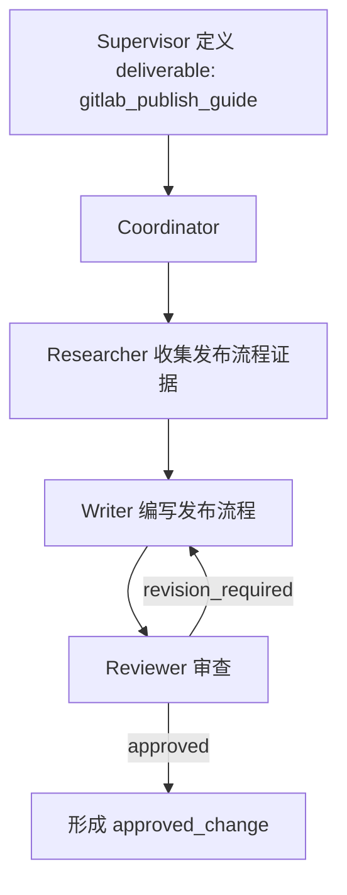
````

所以职责区别是：

| 角色                 | 负责的问题                              |
| -------------------- | --------------------------------------- |
| Supervisor           | 用户最终要完成哪些文档                  |
| Coordinator          | 每份文档应该按什么顺序调用子 Agent 完成 |
| Researcher           | 查找证据                                |
| Writer               | 编写草稿                                |
| Reviewer             | 审查草稿                                |
| DocumentTaskExecutor | 验证整个结果并生成安全 dry-run          |

## Supervisor 的决定怎么传给 Coordinator

中间由 `DocumentTaskExecutor` 负责连接。

首先调用 Supervisor：

[document_task_executor.py (line 178)](D:/AI_Agent_Project/AI_Python_Project/python-agent-study/src/fast_app/services/agent_tasks/document_task_executor.py:178)

```
decision = await self._supervisor_agent.decide(
    query=plan.original_query,
    web_policy=web_policy,
)
```

然后把决定保存到 TaskPlan：

```
plan.final_output["document_workflow"] = {
    "execution_mode": decision.execution_mode,
    "supervisor": decision.model_dump(mode="json"),
}
```

接着把相同的 `decision` 传给 Deep Document Agent：

```
return await self._execute_agentic_document_workflow(
    plan=plan,
    decision=decision,
    ...
)
```

`DeepDocumentAgent` 再把它放进 Coordinator 的初始输入：

[deep_document_agent.py (line 1165)](D:/AI_Agent_Project/AI_Python_Project/python-agent-study/src/fast_app/services/agent_tasks/deep_document_agent.py:1165)

```
{
    "task_plan_id": plan.task_plan_id,
    "original_query": plan.original_query,
    "decision": decision.model_dump(mode="json"),
}
```

所以不是：

```
Supervisor 和 Coordinator 互相对话
```

而是：

```
Supervisor 生成结构化决定
→ 服务端保存决定
→ 服务端把决定交给 Coordinator
```

## 为什么 Coordinator 必须保留 `deliverable_id`

`deliverable_id` 是整个流程的关联键。

例如：

```
gitlab_publish_guide
```

必须原样出现在：

```
Supervisor 的 DocumentDeliverable
Researcher 的 DocumentResearchResult
Writer 的 DocumentDraftResult
Reviewer 的 DocumentReviewResult
Coordinator 的 DocumentChangeProposal
失败记录 failed_deliverables
跳过记录 skipped_deliverables
```

这样服务端才能确认所有结果属于同一份最终文档：

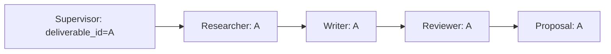

如果没有稳定 ID，两个并行文档任务很容易混在一起：

```
发布流程的 Researcher 结果
→ 错误交给权限规范的 Writer

权限规范的 Reviewer 意见
→ 错误修改发布流程草稿
```

## 为什么 Coordinator 不能返回新的 deliverable

因为 Coordinator 只负责执行，不负责扩大用户任务范围。

例如 Supervisor 只定义：

```
deliverable_1 = 创建 GitLab 发布流程
```

但 Coordinator 返回：

```
deliverable_999 = 删除现有权限规范
```

这相当于 Coordinator 擅自增加了一个用户没有要求的操作。

所以服务端检查：

```
if any(item not in known_ids for item in all_terminal_ids):
    raise AppServiceError(
        "DeepDocumentAgent 返回了 Supervisor 计划外的交付物"
    )
```

这里拒绝的不是“Coordinator 没有向 Supervisor正确汇报”，而是：

> Coordinator 返回了一个不属于已冻结任务范围的结果。

## 一个单文档任务的完整例子

用户要求：

```
创建一份 GitLab 文档发布教程。
```

Supervisor 生成：

```
deliverable_id = gitlab_publish_guide
operation = create
objective = 创建 GitLab 文档发布教程
```

Coordinator 执行：

```
针对 gitlab_publish_guide 派发 Researcher
→ 针对 gitlab_publish_guide 派发 Writer
→ 针对 gitlab_publish_guide 派发 Reviewer
→ Reviewer 批准
→ 返回 gitlab_publish_guide 的 Proposal
```

服务端验证：

```
Supervisor ID = gitlab_publish_guide
Researcher ID = gitlab_publish_guide
Writer ID     = gitlab_publish_guide
Reviewer ID   = gitlab_publish_guide
Proposal ID   = gitlab_publish_guide
```

全部一致后，才生成 dry-run。

## 最简单的区分

可以把它们类比成软件项目：

```
Supervisor
= 产品经理
决定最终要交付哪些产品功能。

Coordinator
= 项目经理
安排研究、开发、测试如何完成这些功能。

deliverable
= 最终产品功能
不是研究、开发、测试这些内部阶段。
```

一句话总结：

> Supervisor 先定义“最终要完成哪几份文档”；Coordinator 再针对每份文档协调 Researcher、Writer 和 Reviewer。Coordinator 不向 Supervisor汇报，而是向服务端返回结果，服务端使用 Supervisor 之前冻结的决定检查 Coordinator 有没有漏做、混淆或擅自扩大任务范围。

# 负责TODO List的角色：

## 当前设计中谁负责 TodoList

按职责设计，只有 Coordinator 负责维护 TodoList。

| 角色        | 是否应该维护 TodoList  |
| ----------- | ---------------------- |
| Supervisor  | 否                     |
| Coordinator | 是，只在开始时创建一次 |
| Researcher  | 否                     |
| Writer      | 否                     |
| Reviewer    | 否                     |

Coordinator 的 Prompt 明确要求：

[deep_document_agent.py (line 795)](D:/AI_Agent_Project/AI_Python_Project/python-agent-study/src/fast_app/services/agent_tasks/deep_document_agent.py:795)

```
只在开始时使用一次 write_todos 规划，
之后不要更新 Todo。
```

服务端还限制它最多调用一次：

```
tool_run_limits={
    "write_todos": 1,
}
```

TodoList 的用途是记录整个任务的编排进度，例如：

```
1. 完成 deliverable_A 的研究
2. 完成 deliverable_A 的写作
3. 完成 deliverable_A 的审查
4. 完成 deliverable_B 的研究
5. 等待所有交付物收敛
```

它是 Coordinator 的全局任务清单，不是每个子 Agent 自己的工作清单。

## Supervisor 为什么不负责 TodoList

Supervisor 只执行一次结构化规划：

```
判断 direct / agentic
→ 确定 deliverables
→ 确定 operation
→ 确定依赖关系
→ 返回 DocumentWorkflowDecision
```

然后 Supervisor 就结束了。

它不参与后续长时间运行，所以没有维护 TodoList 的必要。

## Researcher 已被代码强制禁止

Researcher 不只是 Prompt 中没有要求 Todo，代码还会真正删除：

- `write_todos` 工具；
- Deep Agents 自动注入的 Todo 系统提示。

实现位置：

[deep_document_agent.py (line 205)](D:/AI_Agent_Project/AI_Python_Project/python-agent-study/src/fast_app/services/agent_tasks/deep_document_agent.py:205)

```py
class _ResearcherToolExclusionMiddleware(
    _ToolExclusionMiddleware
):
    def __init__(self, *, allow_document_read=False):
        super().__init__(
            excluded=frozenset({"write_todos"})
        )
```

所以 Researcher 无法调用 `write_todos`。

这是因为 Researcher 的职责很窄：

```
检索
→ 按需读取文档
→ 写 summary.md
→ 返回研究结果
```

不应该再消耗一次模型调用维护自己的 Todo。

## Writer 和 Reviewer 的当前情况存在一个差异

Writer Prompt 明确写了：

[deep_document_agent.py (line 827)](D:/AI_Agent_Project/AI_Python_Project/python-agent-study/src/fast_app/services/agent_tasks/deep_document_agent.py:827)

```
不要创建 todo。
```

Reviewer Prompt 也明确写了：

[deep_document_agent.py (line 834)](D:/AI_Agent_Project/AI_Python_Project/python-agent-study/src/fast_app/services/agent_tasks/deep_document_agent.py:834)

```
不要创建 todo。
```

但检查当前 Deep Agents 0.5.4 的实际实现后发现：

> Deep Agents 默认会给每个 SubAgent 注入 `TodoListMiddleware`。

目前 Writer 和 Reviewer 没有像 Researcher 一样配置 `_ResearcherToolExclusionMiddleware`，因此：

```py
职责设计：
Writer、Reviewer 不应该创建 Todo

当前 Prompt：
明确要求不要创建 Todo

当前工具层：
仍可能看到 write_todos
```

也就是说，当前实际状态是：

| 角色        | Prompt 是否允许 | 工具是否真正隐藏 |
| ----------- | --------------- | ---------------- |
| Coordinator | 允许一次        | 没隐藏，限制一次 |
| Researcher  | 不允许          | 已隐藏           |
| Writer      | 不允许          | 尚未确定性隐藏   |
| Reviewer    | 不允许          | 尚未确定性隐藏   |

这说明当前代码还有一个小的权限收敛缺口：

> Writer 和 Reviewer 目前主要依赖 Prompt 不调用 Todo，而不是由工具层强制禁止。

按照项目已经确定的多 Agent 规则，正确状态应该是：

```
Coordinator
→ 可以看到 write_todos
→ 最多调用一次

Researcher
Writer
Reviewer
→ 都看不到 write_todos
→ 同时删除 Todo 系统提示
```

因此，简单回答是：

> TodoList 只应该由 Coordinator 负责。Researcher 已经在代码层禁止；Writer 和 Reviewer 虽然 Prompt 要求不创建 Todo，但当前仍缺少与 Researcher 相同的确定性工具隐藏，这是后续应修正的地方。


## 当前 Coordinator 最多调用一次 `write_todos`

> 当前限制是每次 `graph.ainvoke()` 运行中最多成功调用一次，不是整个 TaskPlan 生命周期永久只能调用一次。

配置位置：

[deep_document_agent.py (line 1008)](D:/AI_Agent_Project/AI_Python_Project/python-agent-study/src/fast_app/services/agent_tasks/deep_document_agent.py:1008)

```py
build_document_deep_agent_middlewares(
    self._settings,
    model_run_limit=self._settings.agent_max_tool_calls,
    tool_run_limits={
        "write_todos": 1,
    },
)
```

它最终创建：

[langchain_agent_middlewares.py (line 163)](D:/AI_Agent_Project/AI_Python_Project/python-agent-study/src/fast_app/agents/runtime/langchain_agent_middlewares.py:163)

```py
ToolCallLimitMiddleware(
    tool_name="write_todos",
    run_limit=1,
    exit_behavior="continue",
)
```

## 什么情况下调用

只有进入复杂文档的 `agentic` 模式、Coordinator 第一次开始编排任务时，才应该调用。

例如 Supervisor 给出两个 deliverable：

```
deliverable_A：创建 GitLab 发布流程
deliverable_B：创建 GitLab 权限规范
B 依赖 A
```

Coordinator 第一次运行时可能调用：

```py
{
  "todos": [
    {
      "content": "完成 deliverable_A 的研究、写作和审查",
      "status": "pending"
    },
    {
      "content": "在 deliverable_A 完成后处理 deliverable_B",
      "status": "pending"
    },
    {
      "content": "汇总全部批准或失败的交付物",
      "status": "pending"
    }
  ]
}
```

然后再开始调用子 Agent：

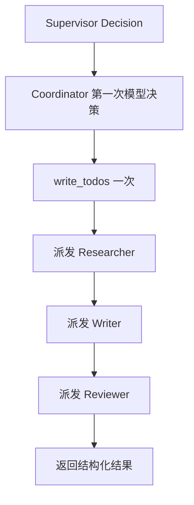

如果任务走 `direct` 模式，不会进入 Coordinator，所以也不会调用 `write_todos`。

## 为什么只允许调用一次

这里的 TodoList 只是一份初始编排快照，不是实时进度存储。

实际进度由服务端写入：

```
TaskPlan.final_output.document_progress
```

其中记录：

```
Researcher started
Researcher completed
Writer draft created
Reviewer completed
revision started
deliverable failed
```

因此 Coordinator 不需要在每个角色完成后反复执行：

```
读取 Todo
→ 修改 Todo
→ 再调用一次模型
```

之前**大量模型调用的一部分，就来自角色不断维护 Todo**。现在的规则是：

```
开始时规划一次
→ 后续依靠 TaskPlan 事件记录真实进度
```

## `write_todos` 不是代码强制一定调用

当前 Prompt 要求 Coordinator 在开始时使用一次：

[deep_document_agent.py (line 795)](D:/AI_Agent_Project/AI_Python_Project/python-agent-study/src/fast_app/services/agent_tasks/deep_document_agent.py:795)

```
只在开始时使用一次 write_todos 规划，
之后不要更新 Todo
```

但是否发起第一次调用，仍然是模型决定的。

中间件只保证：

```
最多一次
```

并不保证：

```
一定调用一次
```

也就是说：

| Coordinator 行为     | 结果           |
| -------------------- | -------------- |
| 不调用 `write_todos` | 允许，继续编排 |
| 调用一次             | 允许执行       |
| 调用第二次           | 第二次被阻止   |

## 第二次调用会发生什么

因为配置是：

```
exit_behavior="continue"
```

所以第二次不会让整个 Agent 抛异常退出。

处理结果是：

```
Coordinator 第二次请求 write_todos
→ Middleware 检测 run_limit=1 已用完
→ 不执行第二次 ToolCall
→ 返回一个 status=error 的 ToolMessage
→ Coordinator 继续生成后续决策
```

它的目的不是终止任务，而是提示 Coordinator：

```
这个工具已经达到调用上限，请继续调度子 Agent
```

如果 Coordinator 在同一个模型响应中并行发出两个 `write_todos`，也只有第一个会被允许，第二个会被阻止。

## `/retry` 时是否还能再调用一次

这里存在一个容易混淆的细节。

当前设置的是：

```
run_limit=1
```

不是：

```
thread_limit=1
```

它的含义是：

```
每次 graph.ainvoke() 最多一次
```

用户调用 `/retry` 时，会产生一次新的图调用。因此从中间件计数角度看，新的运行理论上又有一次调用额度。

但是恢复时：

- 原 Todo 已经在 Checkpoint 中；
- Coordinator Prompt 明确要求只在开始时创建；
- Coordinator 应该继续旧任务，而不是重新规划 Todo。

所以预期行为是：

```
首次执行
→ 创建 Todo 一次
→ 任务中途超时

/retry
→ 从 Checkpoint 恢复
→ 复用已有 Todo
→ 不再调用 write_todos
```

不过，当前“整个 TaskPlan 生命周期只能创建一次 Todo”还没有使用 `thread_limit=1` 做硬性限制。当前硬限制是：

> 每次图运行最多一次；恢复后不再调用主要依赖 Prompt 和已有 Checkpoint 状态。

如果要求做到完全确定性，可以改成跨 thread 的限制，或者在模型调用前检测当前 Checkpoint 已存在 Todo 后隐藏 `write_todos`。当前还没有实现这层永久限制。

最简单的结论：

> Coordinator 在 agentic 任务开始时使用一次 `write_todos` 创建初始任务清单；正常执行期间第二次调用会被中间件阻止。但 `/retry` 属于新的运行，当前 `run_limit=1` 理论上会重新提供一次额度，是否不再调用主要依赖恢复状态和 Prompt。


# Middleware 彻底限制 todo 工具的注入：

~~~cpp
//解释上一节的问题，除了coordinator角色，都不允许调用todo，因为这会导致大量的Agent调用，而且大多数是无意义的维护 todo list
~~~

## 1. Middleware 如何删除 `write_todos`

这里的“删除”不是卸载工具，也不是从框架源码中删除函数，而是：

> 在每次请求发送给大模型之前，从本次 `ModelRequest.tools` 中过滤掉 `write_todos`。

核心代码位于 [deep_document_agent.py (line 205)](D:\\AI_Agent_Project\\AI_Python_Project\\python-agent-study\\src\\fast_app\\services\\agent_tasks\\deep_document_agent.py:205)：

```
class _TodoToolExclusionMiddleware(_ToolExclusionMiddleware):
    def __init__(self) -> None:
        super().__init__(excluded=frozenset({"write_todos"}))
```

`excluded` 表示不允许暴露给模型的工具名称集合。

真正执行过滤的是：

```
return request.override(
    system_message=SystemMessage(content=blocks) if blocks else None,
    tools=[
        tool
        for tool in request.tools
        if _tool_name(tool) != "write_todos"
    ],
)
```

假设原始模型请求携带以下工具：

```
request.tools = [
    read_file,
    write_file,
    edit_file,
    write_todos,
]
```

列表推导式逐个取得工具名称：

```
_tool_name(tool)
```

当工具名称等于：

```
write_todos
```

这一项不会进入新列表。最终得到：

```
[
    read_file,
    write_file,
    edit_file,
]
```

然后：

```
request.override(tools=新工具列表)
```

生成一个修改后的模型请求。原始 `request` 不会被原地修改。

### 重要区别

`write_todos` 仍然存在于 Deep Agents 框架内部，但不会出现在 Writer、Reviewer、Researcher 发给模型的 Tool Schema 中。

因此对这些角色来说：

```
框架内部存在 write_todos
        ↓
Middleware 在模型调用前过滤
        ↓
模型收到的 tools 中没有 write_todos
        ↓
模型不知道这个工具的名称和参数结构
        ↓
模型无法生成有效的 write_todos ToolCall
```

Coordinator 没有安装这个 Middleware，所以仍然可以看到并调用 `write_todos`。

------

## 2. Middleware 在什么时候执行

同步模型调用经过：

```
def wrap_model_call(self, request, handler):
    return handler(self._prepare_request(request))
```

异步模型调用经过：

```
async def awrap_model_call(self, request, handler):
    return await handler(self._prepare_request(request))
```

当前 Deep Document Agent 使用异步执行：

```
await graph.ainvoke(...)
```

因此主要走的是：

```
awrap_model_call()
→ _prepare_request()
→ 删除 Todo 提示
→ 删除 write_todos 工具
→ handler(修改后的 request)
→ 调用下一个 Middleware
→ 最终调用大模型
```

这里的 `handler` 可以简单理解为：

> “把处理后的请求继续交给后面的 Middleware，最后交给大模型。”

Writer 和 Reviewer 分别安装 Middleware 的位置是：

- Writer：[deep_document_agent.py (line 1127)](D:\\AI_Agent_Project\\AI_Python_Project\\python-agent-study\\src\\fast_app\\services\\agent_tasks\\deep_document_agent.py:1127)
- Reviewer：[deep_document_agent.py (line 1151)](D:\\AI_Agent_Project\\AI_Python_Project\\python-agent-study\\src\\fast_app\\services\\agent_tasks\\deep_document_agent.py:1151)

------

## 3. 为什么还要删除 System Prompt

Deep Agents 不只是给角色增加 `write_todos` 工具，还会向系统提示中加入一段说明：

```
你可以使用 write_todos 管理复杂任务……
完成步骤后要更新 Todo……
```

这是 LangChain 的 `TodoListMiddleware` 自动注入的。

如果只删除工具、不删除提示，就会形成矛盾：

```
System Prompt：请调用 write_todos
Tools：没有 write_todos
```

模型可能会：

- 尝试调用一个不存在的工具；
- 在正文中输出伪造的 ToolCall；
- 反复纠正工具调用错误；
- 浪费模型调用次数；
- 增加工作流不收敛的风险。

因此必须成对删除：

```
write_todos Tool Schema
+
write_todos System Prompt
```

------

## 4. `system_message.content_blocks` 是什么

`system_message` 是 LangChain 的 `SystemMessage` 对象，表示发送给模型的系统提示。

最简单的系统消息可以是：

```
SystemMessage(
    content="你是 Document Writer。"
)
```

但模型消息不一定只有一段纯文本，还可能包含多个内容块，例如：

```
SystemMessage(
    content=[
        {
            "type": "text",
            "text": "你是 Document Writer。",
        },
        {
            "type": "text",
            "text": "你可以使用 write_todos 管理任务。",
        },
    ]
)
```

`content_blocks` 是 LangChain 提供的标准化属性，它把不同形式的 `content` 统一转换成“内容块列表”。

例如，原始内容是字符串：

```
SystemMessage(content="你是 Writer")
```

读取：

```
system_message.content_blocks
```

大致会得到：

```
[
    {
        "type": "text",
        "text": "你是 Writer",
    }
]
```

如果原始内容本来就是多个块：

```
SystemMessage(
    content=[
        {"type": "text", "text": "Writer Prompt"},
        {"type": "text", "text": "Todo Prompt"},
    ]
)
```

`content_blocks` 就会返回规范化后的两个块。

它和 RAG 的 Document Chunk 没有关系。这里的 Block 只是：

> 一条模型消息内部的内容片段。

------

## 5. Todo 提示是怎样被加入 `content_blocks` 的

LangChain 的 `TodoListMiddleware` 会读取原来的系统消息：

```
request.system_message.content_blocks
```

然后追加一个新的文本块：

```
new_system_content = [
    *request.system_message.content_blocks,
    {
        "type": "text",
        "text": f"\n\n{self.system_prompt}",
    },
]
```

假设原来是：

```
[
    {
        "type": "text",
        "text": "你是 Document Writer。",
    }
]
```

注入后变成：

```
[
    {
        "type": "text",
        "text": "你是 Document Writer。",
    },
    {
        "type": "text",
        "text": "## write_todos\n你可以使用 write_todos……",
    },
]
```

因为 Todo 提示被追加成一个独立的文本块，所以我们的 Middleware 可以精确删除它。

------

## 6. 我们如何删除 Todo 提示块

对应代码是：

```
blocks = [
    block
    for block in system_message.content_blocks
    if not (
        isinstance(block, dict)
        and WRITE_TODOS_SYSTEM_PROMPT
        in str(block.get("text") or "")
    )
]
```

逐步理解：

### 第一步：遍历所有内容块

```
for block in system_message.content_blocks
```

例如：

```
block_1 = {
    "type": "text",
    "text": "你是 Document Writer。",
}

block_2 = {
    "type": "text",
    "text": "## write_todos\n你可以使用 write_todos……",
}
```

### 第二步：确认内容块是字典

```
isinstance(block, dict)
```

因为除了文本块，模型消息还可能包含其他标准内容类型。

### 第三步：读取文本内容

```
block.get("text") or ""
```

如果没有 `text` 字段，就使用空字符串，避免异常。

### 第四步：检查是否包含完整 Todo 系统提示

```
WRITE_TODOS_SYSTEM_PROMPT in str(...)
```

`WRITE_TODOS_SYSTEM_PROMPT` 是 LangChain 内置 Todo Middleware 使用的原始提示常量。

如果某个 Block 包含这段提示，就不保留该 Block。

最终：

```
[
    {"type": "text", "text": "你是 Document Writer。"}
]
```

Todo 提示块被删除，Writer 自己的角色提示仍然保留。

------

## 7. 完整执行效果

以 Writer 为例：

```
Deep Agents 创建 Writer
        ↓
TodoListMiddleware 注入 write_todos 工具
        ↓
TodoListMiddleware 追加 Todo System Prompt
        ↓
准备调用 Writer 模型
        ↓
_TodoToolExclusionMiddleware._prepare_request()
        ↓
从 request.tools 删除 write_todos
        ↓
从 system_message.content_blocks 删除 Todo Prompt
        ↓
将干净的请求发送给 Writer 模型
```

最终 Writer 看到的是：

```
System Prompt：
你是 Document Writer……
不要创建 Todo……

Tools：
read_file
write_file
edit_file
……
```

看不到：

```
write_todos
```

也不会再收到框架要求它维护 TodoList 的提示。

这不是依赖模型自觉遵守 Prompt，而是在模型请求边界实施的确定性工具权限控制。
