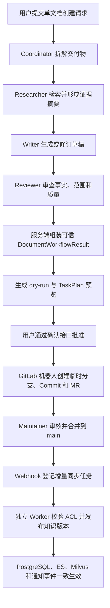

# 多 Agent 端到端测试复盘与工程规则

## 1. 文档目的

本文复盘 GitLab 文档变更场景 3 暴露的问题，并把一次性的修复经验转换成可复用
的工程规则。适用范围不限于 GitLab，也适用于后续 Researcher、Writer、
Reviewer、Coordinator、工具调用、人工确认和外部系统写入组成的多 Agent
工作流。

原始证据与完整 TaskPlan 轨迹保存在：

- `scripts/docs/GitLab文档变更端到端测试报告.md`
- `src/fast_app/services/agent_tasks/deep_document_agent.py`
- `src/fast_app/services/agent_tasks/document_task_executor.py`
- `src/fast_app/integrations/gitlab/agent_change_service.py`
- `src/fast_app/integrations/gitlab/worker.py`

本文不替代原始测试报告，而是回答三个可复用问题：

1. 为什么一个目标明确的单文档任务会产生 32—45 次模型调用？
2. 为什么多 Agent 内部通过后，进入 GitLab 仍会出现路径、状态和重试错误？
3. 后续如何用确定性规则和端到端测试避免同类问题？

## 2. 场景 3 的实际链路



这条链路跨越了四种不同边界：

1. **模型协作边界**：Researcher、Writer、Reviewer 是否完成自己的职责。
2. **服务端信任边界**：operation、路径、`doc_id`、ACL、版本和状态由谁决定。
3. **人工授权边界**：确认前不得创建 MR，合并前不得发布知识索引。
4. **外部系统一致性边界**：GitLab、PostgreSQL、ES、Milvus 是否最终一致。

仅验证其中一个边界，不能宣称整个多 Agent 功能已经完成。

## 3. 暴露出的主要问题

### 3.1 把 Prompt 当成了状态机

修复前，Coordinator Prompt 虽然要求：

- Researcher 失败后停止；
- 同一任务不要重复派发；
- 最多执行规定的返工轮次；
- Writer 不得在无研究证据时继续写作；

但服务端没有确定性状态转换。实际结果是：

```text
Researcher 已返回模型调用上限
→ Coordinator 错误标记 Research completed
→ Writer 被要求依赖通用知识继续写作
→ 无证据草稿出现事实错误
→ Reviewer 要求返工
→ Writer 和 Reviewer 反复循环
```

经验：**Prompt 只能指导模型，不能承担 fail-fast、次数限制、准入检查或状态迁移。**

### 3.2 每个 Agent 都有循环，角色数不等于调用数

Researcher、Writer、Reviewer 和 Coordinator 都可能执行：

```text
模型判断
→ 工具调用
→ 读取 ToolMessage
→ 再次模型判断
→ 返回结构化结果
```

一次 Researcher 任务并不等于一次模型调用；一次返工也会重新启动完整的 Writer
或 Reviewer 循环。修复前各角色预算独立叠加，理论上可达到 48 次模型调用，
真实任务产生了约 45 次调用。

经验：

- 单角色上限只是局部保险丝。
- 必须存在覆盖 Coordinator 和所有 SubAgent 的共享总预算。
- 共享总预算只能防止无限失控，不能代替正常收敛目标。
- 测试不能只断言“未超过最大值”，还要断言正常路径的调用数、返工数和总耗时。

### 3.3 工具白名单不能只写在 Prompt 中

Researcher 曾调用与职责无关的 `write_todos`；工具达到上限后仍重复检索或读取。
动态隐藏工具的早期实现也没有真正改变传给模型的 Tool Schema。

经验：

- 角色工具必须在模型调用前从真实 Tool Schema 中过滤。
- Coordinator 才能维护全局 Todo；Researcher、Writer、Reviewer 不应看到
  `write_todos`。
- 工具调用达到上限、参数非法或职责越界时，应由 Middleware 返回稳定错误码，
  并触发确定性终态。
- “Prompt 说不要调用”不等于“模型无法调用”。

### 3.4 Researcher 上下文与超时不匹配

Researcher 读取两份全文后，第三次请求在加入系统 Prompt 和工具 Schema 前，
消息正文已经约 34.8k—36.2k 字符。60 秒读取超时和 SDK 自动重试使一次逻辑
调用最多重复发送三次相同长请求，累计消耗约 180 秒。

网络证据显示 DashScope 使用 DIRECT、短请求和相近体量探针正常，VPN/TUN 不是
主要原因。

经验：

- 模型调用预算、工具调用上限、上下文大小、单次超时和工作流墙钟时间是五种
  不同的预算，必须分别观测和配置。
- 长请求不应依赖 SDK 自动重放；重放不能改变确定性超时结果。
- Researcher 应输出固定格式的证据摘要，不应把所有参考全文继续传给 Writer。
- create 任务若只需综合已有证据，应优先读取检索摘要；全文读取必须有明确上限。
- 调整超时前先统计 checkpoint 的消息数、字符数、工具结果大小和单次调用耗时。

### 3.5 文件工具的细粒度操作放大了返工

Writer 曾分页读取约 300 行草稿，并把一次可批量完成的修订拆成五次
`edit_file`。Writer 返回 `content=null` 后，Coordinator 又越权读取草稿，
继续消耗模型调用。

经验：

- 每个交付物使用唯一、确定的草稿路径：
  `/workspace/drafts/{deliverable_id}.md`。
- 已知文件不得通过 `ls`、`glob`、`grep` 再次搜索。
- 合理大小的固定文件一次完整读取，避免默认小分页导致多轮模型调用。
- 互不依赖的编辑应批量执行。
- Writer 必须返回完整、可验证的草稿结果；返回结构缺字段时直接失败，
  Coordinator 不得接管文件编辑。

### 3.6 Coordinator 重复生成最终正文

Reviewer 已批准最终草稿后，旧流程仍要求 Coordinator 再次生成包含整份正文的
结构化 JSON。这既重复了 Writer 的职责，又把最长的正文放入工作流末端模型
调用，导致超时和结果漂移。

经验：**模型完成内容工作后，最终结果应由服务端从已批准草稿、研究摘要和审查
结果确定性组装。Coordinator 只做编排，不重写正文。**

### 3.7 下游 Agent 污染了上游可信身份

BUG-010 中，Supervisor 明确要求 `create`，Writer 却把检索参考文档的
`doc_id`、路径和 SHA 写入结果，将操作改成 `update`。

经验：

- Router 只决定意图。
- Supervisor/TaskPlan 决定交付物 operation 和目标范围。
- Writer 只提供正文，不拥有 operation、`doc_id`、base SHA、ACL 或目标 Project
  的最终决定权。
- Reviewer 只能批准、拒绝或要求修订，不能改变交付物身份。
- 最终结构必须从最早的可信服务端事实继承身份字段，模型输出只能填充允许字段。

### 3.8 框架 Hook 的直接单测产生了假阳性

BUG-009 中，LangGraph 只会按参数名 `runtime` 注入运行时，但 Hook 使用了
`_runtime`。原测试直接调用函数并手工传入第二个参数，因此通过；真实编译图在
Researcher 第一次模型调用前失败。

经验：

- LangGraph Middleware、Node、Command、interrupt 和 runtime 注入必须至少有
  一个经过真实 `StateGraph.compile()` 和 `invoke/ainvoke()` 的回归测试。
- 直接函数单测只能验证内部逻辑，不能验证框架适配契约。
- 框架约定参数名、返回类型和 Command 路由都属于接口，不能依赖人工记忆。

### 3.9 修复后复用旧 checkpoint 会污染验收

旧 TaskPlan 已保存重复派发、错误 Todo、失败 Researcher 和多轮返工历史。
修复后从旧 checkpoint 恢复，只能验证新规则是否拒绝旧违规历史，不能证明新
工作流能够从零成功运行。

经验：

- 故障恢复测试使用原 TaskPlan。
- 修复成功验收必须创建全新 TaskPlan，并确认
  `resume_count=0`、`resumed_from_checkpoint=false`。
- 不得把“旧 checkpoint 被新规则终止”描述为“新流程成功收敛”。

### 3.10 Agent 预览路径与 GitLab Repository Path 不一致

TaskPlan 和 dry-run 的目标为：

```text
development/gitlab-agent-mr-governance.md
```

但 `GitLabAgentChangeService._resolve_location()` 在新文件路径中删除了首段
`development`，实际 Commit 写入：

```text
gitlab-agent-mr-governance.md
```

该文件未命中 `.permission-rules.json` 的 `development/` 规则，Worker 因 ACL
扩大 Project 安全边界而拒绝发布。

经验：

- canonical target path 必须在 TaskPlan、dry-run、Commit、Webhook Diff、
  Manifest、ACL 和通知事件之间保持完全一致。
- 路径映射只能有一个服务端实现，并使用真实 Repository 布局测试。
- 不得根据“一个 Project 对应一个部门”的推断擅自删除目录前缀。
- MR 合并前应验证目标路径能够命中预期 ACL 规则，否则人工批准后仍会得到一个
  无法发布的 `main`。

### 3.11 外部系统状态没有回写

GitLab MR 已经显示 `Merged`，但 `gitlab_change_requests.status` 仍为
`opened`。该问题在测试报告中先记录为 BUG-008，场景 3 再次复现时又记录为
BUG-012，说明缺少统一缺陷状态管理。

经验：

- 创建 MR 不是 change request 生命周期的终点。
- 必须通过 Merge Request Webhook、定期对账或 GitLab API 查询更新
  `opened/merged/closed`。
- React 和审计接口读取的本地状态必须有明确的新鲜度和对账来源。
- 同一根因再次出现时复用原 Bug ID，记录“复现”，不要创建重复编号。

### 3.12 所有异常统一重试造成无效工作

ACL 越界是确定性 `ValueError`，但 Worker 捕获所有 `Exception` 后统一进入
`retry_wait`，相同任务完整执行三次。

经验：

- 只对明确可恢复的网络错误、`429`、`5xx`、租约中断和临时存储故障重试。
- 路径非法、权限越界、格式不支持、Schema 校验失败等业务错误直接进入
  `failed`。
- 错误类型必须映射为稳定 `error_code`，不能通过字符串内容判断是否重试。
- 自动重试和人工 retry 使用不同的审计字段。

### 3.13 顶层状态、交付物状态和前端事件曾不一致

失败 TaskPlan 曾同时出现：

```text
TaskPlan.status = failed
document_progress.stage = deep_agent_running
deliverable.status = running
```

长任务运行期间，SSE 也曾在结束后才一次性显示中间事件；同步 retry 接口长时间
阻塞，页面继续显示旧状态。

经验：

- 任一终态必须通过一个服务端收敛函数同时更新 TaskPlan、交付物、阶段、
  checkpoint 和错误对象。
- SSE 是结构化进度主链路，TaskPlan ID 必须尽早发出。
- 长任务控制接口应快速受理并返回任务状态，不应让 React 等待数分钟同步响应。
- 前端展示使用服务端结构化状态，不能根据最后一条自然语言消息猜测。

## 4. 多 Agent 的可信职责边界

| 角色/模块 | 可以决定 | 不可以决定 |
| --- | --- | --- |
| Router | 业务意图、是否进入文档链路 | 可信路径、`doc_id`、ACL、工具参数 |
| Supervisor/TaskPlan | operation、交付物范围、依赖、目标提示 | 绕过权限、跳过 dry-run |
| Researcher | 证据、摘要、未覆盖事项 | 文档写入、Todo、授权事实 |
| Writer | 正文和基于审查意见的修订 | operation、目标 Project、ACL、base SHA |
| Reviewer | approved/revision_required/rejected 与理由 | 修改身份字段、直接写文件 |
| Coordinator | 按状态派发允许的角色 | 研究失败后继续写、接管正文编辑 |
| 服务端校验 | 路径、身份继承、ACL、调用上限、状态迁移 | 依赖模型自觉执行安全规则 |
| GitLab Agent Service | 临时分支、Commit、MR | 直接写 `main`、提前写 ES/Milvus |
| Sync Worker | 校验并发布合并后的 `main` | 放宽 ACL、重试确定性业务错误 |

核心原则：

```text
模型负责候选内容和建议
服务端负责身份、权限、状态、预算和副作用
人工负责高风险操作批准
GitLab main 负责正式资产事实
RAG 存储只保存可重建的已发布派生数据
```

## 5. 必须保留的确定性规则

### 5.1 失败传播

```text
Researcher completed
且 evidence/summary 有效
→ 允许 Writer

Researcher partial
且存在可用 evidence/summary
→ 带 warnings 允许 Writer

Researcher failed
或 evidence/summary 缺失
→ 当前 deliverable failed
→ 禁止 Writer、Reviewer 和 Coordinator 代写
```

多交付物任务只终止受影响交付物；单交付物任务直接形成结构化失败终态。

### 5.2 派发与返工

- Researcher 对每个交付物默认只派发一次。
- Writer/Reviewer 派发次数由服务端计数器限制。
- 相同任务在返回稳定错误码后不得自动重复派发。
- 返工轮数必须由 checkpoint 可恢复的服务端状态记录，不能只写进 Prompt。
- Coordinator 只允许一次初始化 Todo。

### 5.3 工具与上下文

- 每个角色只暴露完成职责所需的最小工具集合。
- 固定文件使用确定路径和有界整块读取。
- Researcher 向 Writer 传递证据摘要，不传递无限增长的完整 ToolMessage 历史。
- Writer 批量完成互不依赖的编辑。
- Reviewer 只读取最终草稿和必要证据。

### 5.4 身份继承

以下字段必须由服务端继承或重新计算，不能信任 Writer/Reviewer：

```text
operation
doc_id
target_path
source_id / project_id
base_sha / last_commit_id
ACL
allowed_departments
publication_version
```

### 5.5 副作用边界

```text
生成草稿 / 审查 / dry-run
→ 不创建 GitLab 分支

人工确认
→ 允许创建临时分支、Commit、MR

MR opened / updated / closed
→ 不写 ES/Milvus

MR 合并到 main
→ Webhook 只登记任务并返回 202

Worker 校验和双存储写入全部成功
→ 才切换 publication_version
```

## 6. 后续开发必须执行的测试矩阵

### 6.1 离线确定性测试

1. Researcher failed 后 Writer/Reviewer 调用次数为 0。
2. Researcher 缺少 evidence 或固定摘要时 Writer 被拒绝。
3. 重复派发、超返工轮次和重复 Todo 被服务端拒绝。
4. Writer 伪造 operation、`doc_id`、路径或 SHA 时最终结果仍继承 Supervisor。
5. 同一工作流共享总预算，所有角色调用计数相加不超过上限。
6. LangGraph Hook 经过真实编译图验证 runtime 注入和 Command 路由。
7. 确定性业务错误直接 failed；可恢复错误进入 retry_wait。

### 6.2 真实模型测试

1. 使用完整业务 Query，不使用单句占位内容。
2. 记录每次模型调用的角色、阶段、耗时、输入规模、工具名和终态。
3. 断言正常路径调用数和耗时，而不只是“未超过保险丝”。
4. 至少覆盖一次 Researcher 失败、一次 Writer 返工和一次 Reviewer 批准。
5. 修复成功验收使用全新 TaskPlan。

### 6.3 GitLab 与数据发布测试

1. dry-run target path、Commit path 和 Compare `new_path` 完全相同。
2. Commit path 在 MR 合并前能命中预期 `.permission-rules.json`。
3. Agent Token 无法直接写 `main`。
4. Maintainer 合并前 ES/Milvus 无新记录。
5. 合并后 Delivery、Job、`desired_sha`、`last_synced_sha` 和 publication 对齐。
6. MR 本地状态最终变为 `merged`。
7. ES 父子记录、Milvus 子块、Manifest、ACL 和版本一致。
8. 发布失败时正式版本不变，且没有部分可检索记录。

### 6.4 React/SSE 测试

1. 请求开始后尽早返回 TaskPlan ID。
2. Researcher、Writer、Reviewer、waiting_confirmation、failed 和 done 事件实时
   到达。
3. 错误事件包含稳定 `error_code`、TaskPlan ID、失败角色和可否重试。
4. retry/confirm/cancel 控制请求不会阻塞到整个 Agent 工作流结束。
5. 顶层状态、交付物状态和页面展示一致。

## 7. 排障顺序

再次遇到“模型调用多、超时或不收敛”时，按以下顺序检查：

1. 从 checkpoint 还原每个角色的真实调用序列。
2. 找到第一个已经失败但流程仍继续的位置。
3. 检查该失败是否只有 Prompt 约束，没有服务端状态转换。
4. 区分模型调用、HTTP 尝试、工具调用、返工轮次和墙钟时间。
5. 统计长请求输入规模，不先归因 VPN 或单次模型性能。
6. 检查模型实际可见的 Tool Schema，而不是只读 Prompt。
7. 检查身份字段是否被下游 Agent 覆盖。
8. 最后才调整角色预算或超时；不要同时放大所有上限。

## 8. 禁止再次采用的做法

- 只在 Prompt 中写“不要重试”“最多两轮”“失败后停止”。
- 用每个 Agent 的局部预算推断整个工作流已经有总预算。
- 以“调用数低于保险丝”为成功标准。
- Researcher 失败后允许 Writer 依赖通用知识继续。
- 让 Coordinator 在 Writer 失败后接管草稿编辑。
- Reviewer 批准后再让 Coordinator 重写完整正文。
- 直接调用 Middleware 函数代替真实编译图测试。
- 复用包含违规历史的旧 checkpoint 证明修复成功。
- 让模型输出决定 operation、路径、`doc_id`、ACL 或版本。
- 在不同模块中分别实现路径前缀映射。
- 对所有异常统一自动重试。
- 只检查 MR 创建，不检查合并后的本地状态和 RAG 发布结果。

## 9. 修复状态与当前遗留问题

2026-07-27 已关闭并通过真实 GitLab、PostgreSQL、ES、Milvus 回归：

1. BUG-011：Commit path 保持 TaskPlan 的部门目录，修复 MR `!5` 合并后已按
   `development` ACL 发布。
2. BUG-008/BUG-012：Worker 对账 GitLab MR 终态，本地 change request 已更新为
   `merged`。
3. BUG-013：确定性 `ValueError` 首次失败即终止，不再无效重试三次。

当前仍需后续单独复核：

1. 长任务 SSE 实时性、失败状态收敛和同步 retry 接口仍需专门复核
   （BUG-002、BUG-003、BUG-004）。
2. 场景 3 虽已从 45 次未收敛改善为能够生成预览，但真实请求仍耗时约
   320 秒，必须保留性能回归基线，不能视为最终企业级延迟目标。

“Deep Document Agent 创建文档并发布到 RAG”的功能链路已经通过；上述遗留项
仍应作为实时性、失败恢复与性能专项继续跟踪。
