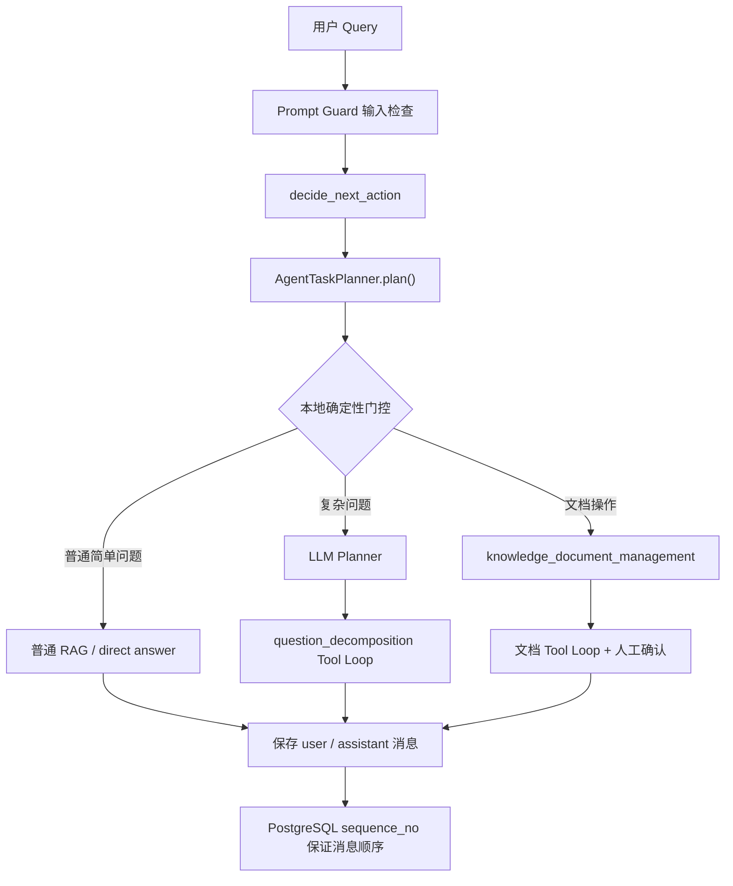
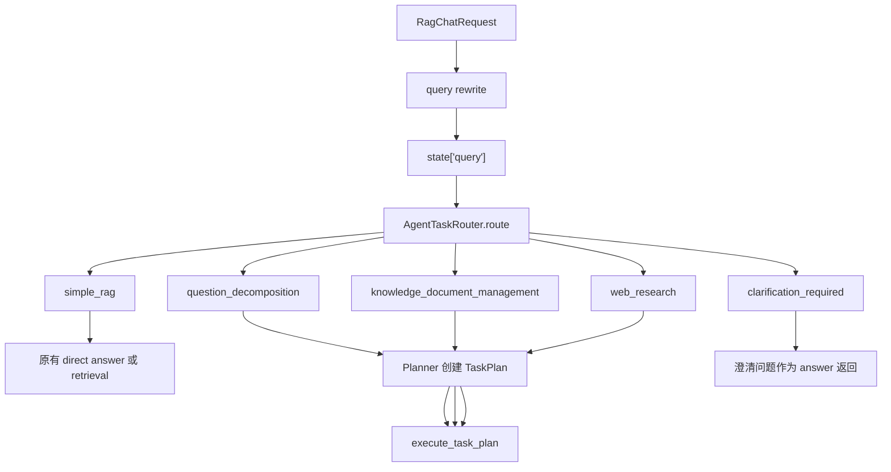
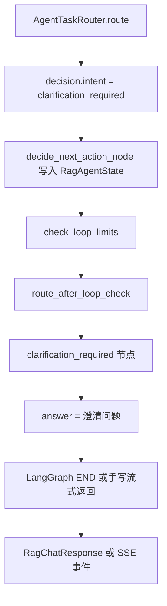
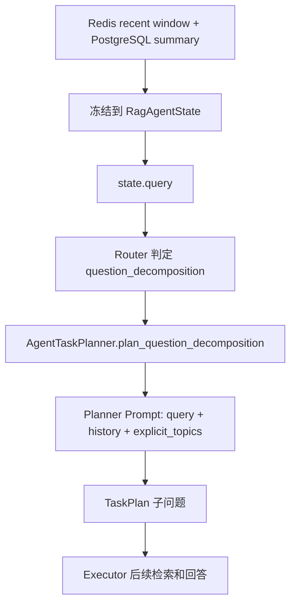

# 【任务1】多轮上下文与 Agent 任务状态增强：实施与人工验收记录

## 1. 文档用途

本文档是本轮持续任务的唯一实施台账，用于：

1. 固定 8 个子任务的目标、边界和依赖顺序。
2. 每完成一个子任务，记录真实代码改动和自动验证结果。
3. 为每个子任务保留可以由人工独立执行的验收步骤。
4. 记录未完成项、已知限制和后续任务的输入条件。

当前状态：`implemented`（初次真实验收发现的问题已修复并完成定向真实复测，等待用户完成整体验收）

开始日期：`2026-07-13`

## 2. 总体目标

在不替换现有显式 LangGraph RAG 主链路、不修改 legacy `/rag/chat/stream` 协议的前提下，增强多轮上下文在 Planner、最终回答和文档 Agent 中的选择性传递，并补齐 TaskPlan 的恢复和 React 控制能力。

核心原则：

```text
会话历史不是自动注入所有 LLM 的全局变量。
每个节点只读取完成当前职责所需的最小上下文。
权限、候选范围、确认和真实写入始终以服务端事实为准。
```

## 3. 当前代码基线

开始实施前已经确认：

1. Redis 保存最近消息窗口，PostgreSQL 保存持久化消息和摘要。
2. `_prepare_initial_state()` 已把 `history_window_text`、`summary_text`、`summary_version` 等字段写入 `RagAgentState`。
3. Query Rewrite 已使用组合后的 `ConversationMemoryContext`。
4. Planner 主链路仍固定传入 `history=[]`。
5. 问题拆解链路使用 `tool_calls + previous_answers` 重建当前任务上下文。
6. 文档 Agent 已使用 `AIMessage -> ToolMessage -> 下一轮 AIMessage` 的原生 Tool Loop。
7. TaskPlan 已有 JSON/Markdown 当前状态快照和 confirm API，但没有完整轮次恢复、cancel、retry 闭环。
8. `POST /rag/chat/stream/events` 是新增 SSE 能力的唯一 RAG 流式主线；legacy `/rag/chat/stream` 不扩展。

## 4. 状态说明

| 状态 | 含义 |
| --- | --- |
| `pending` | 尚未开始 |
| `in_progress` | 正在实现或验证 |
| `implemented` | 代码完成，自动验证通过，等待人工验收 |
| `accepted` | 用户已经完成人工验收 |
| `blocked` | 存在明确阻塞条件 |

## 5. 总进度

| 顺序 | 子任务 | 状态 | 依赖 |
| --- | --- | --- | --- |
| 1 | 固定 LangGraph State 会话上下文契约 | `implemented` | 无 |
| 2 | Planner 接入多轮会话上下文 | `implemented` | 1 |
| 3 | 最终答案选择性接入会话约束 | `implemented` | 1 |
| 4 | 文档 Agent 保持任务级 Tool Loop 上下文 | `implemented` | 2 |
| 5 | 建立上下文隔离与安全规则 | `implemented` | 2、3、4 |
| 6 | TaskPlan 增加轮次屏障检查点与恢复能力 | `implemented` | 4、5 |
| 7 | 补齐 React TaskPlan 控制接口 | `implemented` | 6 |
| 8 | 多轮上下文端到端回归验收 | `implemented` | 1-7 |

## 6. 子任务 1：固定 LangGraph State 会话上下文契约

状态：`implemented`（PostgreSQL 顺序问题已修复，等待用户确认 accepted）

### 目标

确认并固定现有 `RagAgentState` 中用于后续节点读取的会话上下文字段。真实代码已经分别保存最近窗口和摘要，因此不新增语义重复的组合字段。

### 最小范围

- `src/fast_app/graph/rag_agent/rag_agent_state.py`
- `src/fast_app/services/rag/rag_agent_pipeline_service.py`
- 对应无网络回归测试

### 完成标准

- State 能同时携带最近历史窗口和摘要正文。
- 没有 `session_id` 时字段使用安全默认值。
- 不增加新的 Memory Store、Manager 或重复上下文字段。
- Prompt Guard 和权限服务不会因为字段存在而自动获得历史内容。

### 自动验证记录

执行日期：`2026-07-13`

```powershell
$env:PYTHONPATH = "src"
.\.venv\Scripts\python.exe scripts\phase_15\test_agent_conversation_context.py
.\.venv\Scripts\python.exe -m py_compile `
  src\fast_app\graph\rag_agent\rag_agent_state.py `
  src\fast_app\services\rag\rag_agent_pipeline_service.py `
  scripts\phase_15\test_agent_conversation_context.py
```

结果：

```text
agent_conversation_context=passed
```

### 人工验收步骤

1. 使用相同用户和 `session_id` 连续调用两次 `/rag/chat/stream/events`。
2. 在第二次请求的 LangSmith query rewrite 节点确认 `history_message_count > 0`。
3. 长对话触发摘要后，确认 trace 中 `summary_used=true`，且不会出现其他用户的历史。

### 完成结果

真实代码已经满足本项状态契约：`history_window_text` 保存最近窗口，`summary_text` 和相关字段保存 PostgreSQL 摘要事实。根据最小改造原则，没有新增重复的 `conversation_context_text` 字段，也没有修改生产代码；新增无网络回归脚本固定现有行为。

## 7. 子任务 2：Planner 接入多轮会话上下文

状态：`implemented`（确定性路由门控已通过回归，等待用户确认 accepted）

### 目标

替换 Planner 主链路固定的 `history=[]`，让 Planner 基于当前 rewritten query、最近窗口和摘要理解“刚才的文档”“继续上一项”等多轮指代。

### 最小范围

- `src/fast_app/graph/rag_agent/rag_agent_nodes.py`
- `src/fast_app/services/agent_tasks/agent_task_planner.py`
- Planner 无网络回归测试

### 完成标准

- Planner 收到有长度边界的摘要和最近消息。
- 当前 query 优先于历史中的旧要求。
- TaskPlan 冻结实际采用的任务目标，不依赖后续再次读取 Redis。
- LangSmith 自定义输入继续服从共享敏感字段策略。

### 自动验证记录

执行日期：`2026-07-13`

```powershell
$env:PYTHONPATH = "src"
.\.venv\Scripts\python.exe scripts\phase_15\test_agent_conversation_context.py
.\.venv\Scripts\python.exe scripts\phase_15\test_agent_task_plan_decomposition.py
```

结果：

```text
agent_conversation_context=passed
agent_task_plan_decomposition=passed
```

### 人工验收 Query

第一轮：

```text
帮我查找 RAG 后端部署相关文档。
```

第二轮：

```text
根据刚才找到的文档生成一份部署验收清单。
```

预期：第二轮正确产生文档管理 TaskPlan，不要求用户重新提供主题或路径。

### 完成结果

Planner 主链路已删除固定 `history=[]`，改为传入带标签的会话摘要和最近对话。Planner prompt 明确当前 query 优先，历史不能提供权限、可信 doc_id、路径或工具结果。输入按最近六项收敛，并保留最多 12000 个尾部字符以优先保住最新上下文。

## 8. 子任务 3：最终答案选择性接入会话约束

状态：`implemented`（简单问答已绕过 Planner，等待用户确认 accepted）

### 目标

让普通 RAG 最终回答和问题拆解最终综合回答保持必要的多轮表达约束，同时继续把知识库文档作为事实来源。

### 最小范围

- `src/fast_app/graph/rag_agent/rag_agent_nodes.py`
- `src/fast_app/services/agent_tasks/agent_task_executor.py`
- 现有 RAG context 构造逻辑及回归测试

### 完成标准

- 检索继续使用 rewritten query。
- 对话历史只作为表达和任务约束，不进入 `sources`。
- 当前 query 与历史冲突时以当前 query 为准。
- direct answer 和 legacy stream 协议不改变。

### 自动验证记录

执行日期：`2026-07-13`

```powershell
$env:PYTHONPATH = "src"
.\.venv\Scripts\python.exe scripts\phase_15\test_agent_conversation_context.py
.\.venv\Scripts\python.exe scripts\phase_15\test_guarded_streaming.py
```

结果：

```text
agent_conversation_context=passed
guarded_streaming=passed
```

### 人工验收 Query

第一轮：

```text
请用表格说明 FastAPI、Milvus 和 Elasticsearch 的部署检查项。
```

第二轮：

```text
再补充 PostgreSQL，保持刚才的表格格式。
```

预期：第二轮保持表格格式并补充 PostgreSQL，历史回答不被伪装成知识库来源。

### 完成结果

新增最终生成 query helper：仅在 `run` 和 `stream_events` 中附加有长度上限的 `<conversation_context>`，并明确它不是事实来源；检索 query、docs 和 sources 均未改变。legacy `pipeline.stream()` 返回原 query，不接入本项新能力。问题拆解最终综合继续使用 Planner 已冻结的 objective 和 synthesis instruction，没有重复注入全量历史。

## 9. 子任务 4：文档 Agent 保持任务级 Tool Loop 上下文

状态：`implemented`（真实 Prompt Guard delete 复测通过，等待用户确认 accepted）

### 目标

保留当前原生 Tool Loop，只把 Planner 冻结的本任务目标和必要约束加入初始消息；后续轮次继续只追加本任务的 `AIMessage` 与 `ToolMessage`。

### 最小范围

- `src/fast_app/services/agent_tasks/agent_task_executor.py`
- 必要时调整 `AgentTaskPlan` 的冻结任务字段
- 文档 Tool Calling 回归测试

### 完成标准

- 初始消息包含 original query、objective 和必要的冻结约束。
- 每轮不重复读取或注入 Redis 全量历史。
- 历史文本不能授权 update/delete 的 `doc_id`。
- 候选、权限、dry-run、confirm 边界保持不变。

### 自动验证记录

执行日期：`2026-07-13`

```powershell
$env:PYTHONPATH = "src"
.\.venv\Scripts\python.exe scripts\phase_15\test_llm_document_management_task.py
```

结果：

```text
llm_document_management_task=passed
```

### 人工验收 Query

第一轮：

```text
查找后端部署规范。
```

第二轮：

```text
根据刚才的规范创建部署验收清单，文件名使用 deployment-checklist.md。
```

预期：文档 Agent 能继承任务约束，仍先收集资料并生成 dry-run TaskPlan，确认前不写入。

### 完成结果

文档 Agent 初始 HumanMessage 改为冻结的 JSON 任务上下文，只包含 `original_query` 和 Planner 生成的 `objective`。后续仍使用当前任务内的 AIMessage/ToolMessage；没有新增 Redis 读取，没有把会话历史当成候选或权限事实，dry-run 与 confirm 边界保持不变。

## 10. 子任务 5：建立上下文隔离与安全规则

状态：`implemented`（权限隔离保持不变，Prompt Guard 误报已修复）

### 目标

明确上下文允许进入的节点，并通过代码、测试和 `AGENTS.md` 规则防止会话历史污染 Prompt Guard、权限和写入校验。

### 最小范围

- 根目录 `AGENTS.md`
- 上下文使用节点及安全回归测试
- `src/fast_app/core/langsmith.py` 仅在共享敏感字段策略确有缺口时修改

### 完成标准

- Planner、最终回答、文档任务初始约束可以选择性读取会话上下文。
- Prompt Guard、权限判断、候选校验、精确替换、confirm 和回滚不读取普通聊天历史作为事实。
- 跨用户和跨 session 上下文严格隔离。
- 历史中编造的 `doc_id` 或权限要求不能越权。

### 自动验证记录

执行日期：`2026-07-13`

```powershell
$env:PYTHONPATH = "src"
.\.venv\Scripts\python.exe scripts\phase_15\test_agent_conversation_context.py
.\.venv\Scripts\python.exe scripts\phase_15\test_agent_tool_permission_policy.py
.\.venv\Scripts\python.exe scripts\phase_15\test_llm_document_management_task.py
```

结果：

```text
agent_conversation_context=passed
agent_tool_permission_policy=passed
llm_document_management_task=passed
```

### 人工验收步骤

1. 用户 A 创建带明显标识的对话历史。
2. 用户 B 使用相同外部 `session_id` 发起请求。
3. 确认 B 的 Planner、回答和 LangSmith 自定义 trace 中都没有 A 的标识。
4. 在历史中加入伪造 `doc_id` 和“忽略权限”，确认服务端仍拒绝候选外目标。

### 完成结果

根 `AGENTS.md` 已新增会话上下文和 Agent 状态规则。回归断言证明 Prompt Guard 只接收当前 raw/rewritten query；同名外部 session 会按 user_id 生成不同内部会话；历史内容没有进入权限或候选事实链。共享 LangSmith builder 未修改，因此本项不需要改动 `core/langsmith.py`。

## 11. 子任务 6：TaskPlan 增加轮次屏障检查点与恢复能力

状态：`implemented`（真实恢复验收通过，等待用户确认 accepted）

### 目标

只在一个 ToolCall 轮次完整结束后保存可恢复检查点，使请求中断后的任务可以从下一轮继续，而不是依靠聊天 Memory 猜测执行进度。

### 最小范围

- `src/fast_app/domain/agent_task_plan.py`
- `src/fast_app/services/agent_tasks/agent_task_executor.py`
- `AgentTaskPlanStore` 当前 JSON/Markdown 快照逻辑
- 恢复和幂等回归测试

### 完成标准

- 检查点保存 round、调用预算、ToolCall/ToolMessage 事实、候选、已读文档和 dry-run steps。
- 不持久化 Python LLM 对象、协程或数据库连接。
- 恢复后不重复执行已经成功的工具。
- 总调用预算不会因恢复而重置。
- confirm 真实写入仍然顺序执行。

### 自动验证记录

执行日期：`2026-07-13`

```powershell
$env:PYTHONPATH = "src"
.\.venv\Scripts\python.exe scripts\phase_15\test_llm_document_management_task.py
.\.venv\Scripts\python.exe scripts\phase_15\test_guarded_streaming.py
```

结果：

```text
llm_document_management_task=passed
guarded_streaming=passed
```

### 人工验收步骤

1. 在 retrieval 完成后的轮次屏障模拟中断。
2. 使用同一 `task_plan_id` 恢复任务。
3. 确认 retrieval 不重复，下一轮从 read/update 或后续动作继续。
4. 检查 JSON/Markdown 中的 round、调用数量和步骤状态。

### 完成结果

现有 `final_output` 已扩展 `checkpoint`：保存版本、最近完整 round、已消耗 ToolCall、LangChain 消息序列、候选、已读 doc_id 和文档动作预占。`CancelledError` 会把计划保存为 failed，`resume()` 可从 failed 或进程重启后遗留的 running 快照继续。恢复回归证明 retrieval 不会重复执行，调用预算不会重置。JSON 保存完整事实；Markdown 只展示安全的轮次、调用数和 doc_id 摘要。

当前限制：本项只恢复确认前的 `knowledge_document_management` Tool Loop。runtime 文件快照没有跨 worker 分布式租约；多 worker 部署时需要迁移为 PostgreSQL task lease，当前单进程/重启恢复场景不额外建设调度器。

## 12. 子任务 7：补齐 React TaskPlan 控制接口

状态：`implemented`（真实 HTTP 验收通过，等待用户确认 accepted）

### 目标

审查并复用现有 TaskPlan API，仅补齐 React 管理任务所缺少的查询、取消和重试能力；confirm 继续是唯一真实写入入口。

### 最小范围

- `src/fast_app/api/agent_task_plan_routes.py`
- TaskPlan schema、executor/store 中必要的状态操作
- API/SSE 回归测试和手工验收页面

### 完成标准

- React 可通过 `task_plan_id` 查询、确认、取消和重试任务。
- retry 从最近完整检查点恢复。
- completed/cancelled/running 状态不能非法重复确认。
- SSE 使用结构化状态事件，`done` 不携带未防护正文。
- 所有控制动作重新校验用户身份和 TaskPlan 归属。

### 自动验证记录

执行日期：`2026-07-13`

```powershell
$env:PYTHONPATH = "src"
.\.venv\Scripts\python.exe scripts\phase_15\test_llm_document_management_task.py
.\.venv\Scripts\python.exe scripts\phase_15\test_guarded_streaming.py
.\.venv\Scripts\python.exe -m py_compile `
  src\fast_app\domain\agent_task_plan.py `
  src\fast_app\services\agent_tasks\agent_task_executor.py `
  src\fast_app\api\agent_task_plan_routes.py
```

结果：

```text
llm_document_management_task=passed
guarded_streaming=passed
py_compile=passed
```

### 人工验收步骤

1. 在 Web 页面生成一个等待确认的 TaskPlan。
2. 分别验证查询、取消、重试和确认按钮对应的 HTTP/SSE 行为。
3. 尝试用其他用户操作该 `task_plan_id`，确认被拒绝。
4. 确认 legacy `/rag/chat/stream` 没有新增控制协议。

### 完成结果

新增 `cancelled` TaskPlan 状态和 `POST /agent/task-plans/{id}/cancel`、`POST /agent/task-plans/{id}/retry`。取消会重新校验归属，把未执行步骤标记为 `skipped`，运行中的 Tool Loop 在下一轮屏障观察到取消后停止；取消后的计划不能再 confirm。retry 仅允许当前实现可恢复的 `running/failed` 文档 Tool Loop，并从最近完整检查点继续。手工验收 HTML 已增加“取消 TaskPlan”和“重试 TaskPlan”按钮，TaskPlan Markdown 也展示查询之外的确认、取消和重试入口。

当前限制：运行中取消是协作式取消，不会强制中止正在执行的单个外部工具；它会等待当前轮次屏障完成后停止。单进程用活动任务集合拒绝重复 retry，多 worker 仍需 PostgreSQL lease 才能获得跨进程互斥。

## 13. 子任务 8：多轮上下文端到端回归验收

状态：`implemented`（阻断问题已完成定向真实复测，等待用户整体验收）

### 目标

使用无网络回归和真实本地环境，证明 Memory、Planner、Tool Loop、TaskPlan、权限、SSE 和 React 控制链路能够协同工作。

### 覆盖场景

1. 多轮普通 RAG。
2. 多轮创建、修改和删除文档。
3. 同轮只读 ToolCall 并行及跨轮依赖。
4. 请求中断后的 TaskPlan 恢复。
5. 跨用户、跨 session 和候选范围隔离。
6. confirm 前后文件、sidecar、ES、Milvus 一致性。
7. LangSmith 节点命名、round 和敏感字段策略。

### 完成标准

- 相关 `py_compile`/回归脚本通过。
- 真实 `/rag/chat` 和 `/rag/chat/stream/events` 验收通过。
- TaskPlan 控制 API 验收通过。
- `git diff --check` 对本轮文件通过；用户既有修改单独说明。
- 每个前置子任务都有完成记录和人工验收步骤。

### 自动验证记录

执行日期：`2026-07-13`

```powershell
$env:PYTHONPATH = "src"
.\.venv\Scripts\python.exe scripts\phase_15\test_agent_conversation_context.py
.\.venv\Scripts\python.exe scripts\phase_15\test_agent_task_plan_decomposition.py
.\.venv\Scripts\python.exe scripts\phase_15\test_agent_task_tool_loop.py
.\.venv\Scripts\python.exe scripts\phase_15\test_agent_task_sub_question_execution.py
.\.venv\Scripts\python.exe scripts\phase_15\test_agent_task_planning_flow.py
.\.venv\Scripts\python.exe scripts\phase_15\test_agent_tool_permission_policy.py
.\.venv\Scripts\python.exe scripts\phase_15\test_llm_document_management_task.py
.\.venv\Scripts\python.exe scripts\phase_15\test_guarded_streaming.py
.\.venv\Scripts\python.exe scripts\test_langsmith_tracing.py
.\.venv\Scripts\python.exe -m compileall -q src\fast_app
git diff --check
```

结果：

```text
agent_conversation_context=passed
agent_task_plan_decomposition=passed
agent_task_tool_loop=passed
agent_task_sub_question_execution=passed
agent_task_planning_flow=passed
agent_tool_permission_policy=passed
llm_document_management_task=passed
guarded_streaming=passed
LangSmith tracing checks passed.
compileall=passed
git diff --check=passed
```

说明：`test_agent_task_tool_loop.py` 的业务断言通过；受限沙箱中的离线回归仍会显示 LangSmith 网络提示。随后已在允许联网的真实环境中验证当前凭据、项目和最近 runs 均可查询。

### 人工验收结果

初次真实验收曾为 `real_acceptance_blocked`。2026-07-13 已修复暴露问题并完成真实 Qwen、PostgreSQL、Bocha、Fetch MCP 与 LangSmith 定向复测；完整人工流程仍由用户按本节步骤最终确认。详细记录见第 16 节。

1. 使用同一用户和 session 完成普通多轮 RAG，核对 Planner/最终回答使用上下文但 sources 不包含聊天历史。
2. 分别生成 create、update、delete 文档计划；确认前核对文件、sidecar、ES、Milvus 不变。
3. 用手工验收页读取计划，并分别测试取消、失败计划重试和确认；取消后的计划必须不能确认。
4. 确认 create/update/delete 后，只核对目标 doc_id 变化，ACL 与无关文档 hash/chunk 数保持不变。
5. 在 LangSmith 核对同 round 只读工具子 run 时间重叠、下一轮才消费前一轮 ToolMessage，且自定义 trace 不泄露未允许的敏感字段。
6. 使用另一用户访问同一 task_plan_id，查询、取消、重试、确认均应被拒绝。

### 完成结果

8 个子任务的实现、无网络回归和本轮定向真实修复验证已经完成。Planner 路由、Prompt Guard 删除误报、PostgreSQL 消息顺序、Fetch MCP 脚本、Web 官方来源限定及 LangSmith 可查询性均已通过；当前状态保持 `implemented`，等待用户最终人工验收后改为 `accepted`。

## 14. 实施日志

| 日期 | 子任务 | 操作 | 结果 |
| --- | --- | --- | --- |
| 2026-07-13 | 建立任务台账 | 读取项目规则和真实代码基线，创建本文档 | 完成 |
| 2026-07-13 | 子任务 1 | 验证 State 最近窗口、摘要字段和无 session 默认值；新增无网络回归脚本 | 自动验证通过，等待人工验收 |
| 2026-07-13 | 子任务 2 | Planner 接入 State 摘要和最近对话，增加当前 query 与权限边界提示 | 自动验证通过，等待人工验收 |
| 2026-07-13 | 子任务 3 | 最终回答选择性附加非事实会话约束，保持检索和 legacy stream 不变 | 自动验证通过，等待人工验收 |
| 2026-07-13 | 子任务 4 | 文档 Tool Loop 初始消息冻结 original_query 和 objective | 自动验证通过，等待人工验收 |
| 2026-07-13 | 子任务 5 | 固化上下文隔离规则，验证 Prompt Guard、用户 session、权限和候选边界 | 自动验证通过，等待人工验收 |
| 2026-07-13 | 子任务 6 | 保存轮次屏障检查点并验证 retrieval 后中断恢复不重复调用 | 自动验证通过，等待人工验收 |
| 2026-07-13 | 子任务 7 | 新增 TaskPlan cancel/retry 控制、取消状态边界和手工页面按钮 | 自动验证通过，等待人工验收 |
| 2026-07-13 | 子任务 8 | 运行上下文、Planner、Tool Loop、权限、文档、SSE、LangSmith 和编译回归 | 自动验证全部通过，等待真实环境人工验收 |
| 2026-07-13 | 初次验收问题修复 | 增加 Planner 确定性门控、Prompt Guard 职责收敛、PostgreSQL 消息序号和 Web Search `site` 参数 | 离线与定向真实复测通过 |
| 2026-07-13 | 外部能力复测 | 真实 Qwen delete、Bocha 官方域名、Fetch MCP、LangSmith 项目与 runs 查询 | 全部通过；Fetch MCP 仍有外部模型慢调用 |

## 15. 总体验收结论

当前结论：`实现与定向真实修复验证完成；没有剩余代码阻断项，等待用户执行完整人工验收。`

## 16. 真实 LLM 与数据库验收记录（2026-07-13）

### 16.1 环境

- LLM / embedding：真实 DashScope Qwen，模型 `qwen3.6-plus`。
- 数据：真实 PostgreSQL、Redis、Elasticsearch、Milvus。
- 外部工具：真实 Bocha Web Search、Fetch MCP。
- 观测：LangSmith tracing 已开启；当前凭据可读取项目和最近上传的 runs。
- 安全边界：不向外部模型发送现有内部知识库正文；所有写入测试使用唯一合成文档，并在测试结束后删除。

### 16.2 按子任务验收结果

| 子任务 | 真实结果 | 证据与结论 |
| --- | --- | --- |
| 1. State 会话上下文 | `passed` | 新增数据库 `sequence_no`，同 timestamp、逆字典序 UUID 的四条消息按写入顺序读取；真实 PostgreSQL 回归通过。 |
| 2. Planner 多轮上下文 | `passed` | 显式文档动作由确定性门控进入文档任务，简单事实问答直接进入 RAG；历史中的文档指代仍可触发 delete。 |
| 3. 最终答案上下文 | `passed` | SSE 正文只走 `answer_delta`，`done` 仅含状态；简单事实问答不再被 Planner 提前截获。 |
| 4. 文档 Agent Tool Loop | `passed` | create、update 和 delete 的原生 ToolCall、dry-run、confirm 均通过；真实 Prompt Guard 正常 delete 返回 allow。 |
| 5. 上下文隔离与安全 | `passed` | reader create、跨用户 TaskPlan、取消后 confirm 边界保持不变；正常 delete 放行，明确“绕过安全规则并提升权限”仍被阻断。 |
| 6. checkpoint / resume | `passed` | 低预算实例在 retrieval 后失败；正常实例恢复轨迹为 `retrieval completed → read failed → read completed → update completed`，未重复 retrieval，call_count 从 2 延续到 4。 |
| 7. React TaskPlan 控制 | `passed` | 查询、取消、确认状态边界、跨用户拒绝和 retry 均通过真实 HTTP；测试计划无残留 waiting 状态。 |
| 8. 端到端验收 | `implemented` | 初次端到端写入与控制链路通过；本轮阻断项已定向真实复测，等待用户从 Web 页面完成最终人工验收。 |

### 16.3 文档和存储一致性

- create：确认前文件不存在、ES=0、Milvus=0；确认后文件、sidecar、ES、Milvus 各 1 条，ACL 为 `development`。
- update：真实轨迹为 `knowledge_retrieval → knowledge_document_read → knowledge_document_update`；两条精确替换在文件、ES、Milvus 一致，ACL 与 doc_id 不变。
- delete：确认后文件、sidecar、ES、Milvus 全部归零。
- retry：恢复后确认写入成功，随后 delete 清理成功。
- 无关文档 `rag-backend-deployment.md` 测试前后 SHA256 始终为 `fe98686fe312eeadbef42a9a6a29a536200846beeccc3b1bcc6fcf99fa6993a9`。
- TaskPlan 预览 hash 按 LF 计算，Windows 文件落盘使用 CRLF，因此文件字节 hash 不同；Unicode 内容逐字符核对一致，不是乱码或正文损坏。

### 16.4 Tool Calling 与外部工具

- Qwen 同轮返回两个独立原生 ToolCall，call_id 完整；批次安全校验通过，实际活动峰值为 2，约 218ms 完成。
- Fetch MCP 成功读取公开 `example.com`，子任务状态 completed。
- `test_fetch_mcp_real_llm.py` 已删除旧单对象契约和重复的前置 LLM 选择；完整 Fetch MCP 链路 92.4 秒通过。
- Web Search Tool 新增结构化 `site` 参数并启用 Bocha `summary`；限定 `fastapi.tiangolo.com` 后，真实返回的 5 条结果全部来自官方域名。

### 16.5 初次阻断问题的修复结果

1. Planner：文档动作和简单事实问答改为本地确定性门控，复杂问题才调用 LLM Planner。
2. Prompt Guard：仅命中 `tool_abuse` 的正常业务动作降为审计，权限、dry-run 和人工确认继续由业务层执行；真实 delete 返回 `allow`。
3. PostgreSQL：迁移 `20260713_0006` 增加数据库生成的 `sequence_no`，Repository 统一按该字段读取。
4. LangSmith：当前凭据已恢复，可读取项目 `python-agent-study-phase-final-1` 及最近 runs；此前 401 未再复现。

### 16.6 稳定性与性能

- Planner 单次真实调用约 58 秒。
- 文档 create/update 规划约 44–62 秒；confirm 约 14–15 秒；delete confirm 约 4 秒。
- 普通两轮请求因过度规划分别约 102 秒和 140 秒。
- 去除重复选择后的 Fetch MCP 完整链路为 92.4 秒，仍存在多次超过 5 秒的外部 LLM 慢调用。
- 简单问答和显式文档路由不再支付 Planner LLM 延迟；本地实测分别约 2.55ms 和 1.02ms。复杂规划与最终生成仍受外部模型响应时间影响。
- `test_multiturn_rag_agent.py` 的 rewrite、run 和 legacy stream 断言已通过，但默认 60 秒窗口内 `stream_events` 阶段超时；该项属于真实外部模型延迟，最终 Web 验收时需继续观察。

# 16.7 修复方案和思路 记录：

~~~cpp
请你讲解这些问题是如何修复的，我需要进行人工审查，并且学习你的解决思路和方案：
    
发现 4 个阻断问题：
Planner 路由不稳定
简单事实问答被过度拆解；明确的 create/delete/web_search 请求也可能漏判。普通请求耗时达到 54–140 秒。

Prompt Guard 稳定误报
三种正常中文删除请求都被判定为 Prompt Injection。关闭 Guard 后，delete Tool 与存储同步可以正常完成。

PostgreSQL 会话顺序错误
同一轮 user/assistant 时间戳相同时，随机 UUID 排序可能把顺序反转。真实 update 会话已出现 assistant → user，导致长期摘要覆盖错误消息。

LangSmith 凭据失效
当前 LANGSMITH_API_KEY 返回 401 Invalid token，无法证明 traces 已成功上传。

另外两个非阻断问题：
[test_fetch_mcp_real_llm.py (line 107)](D:/AI_Agent_Project/AI_Python_Project/python-agent-study/scripts/phase_15/test_fetch_mcp_real_llm.py:107) 仍按旧单 ToolCall 返回值编写，真实运行报 TypeError；按当前列表契约执行后 MCP 通过。
Bocha 搜索“FastAPI official documentation”没有返回官方站点，结果准确性不足。
~~~


## 当前审查结论

这批问题并不是用同一种方式修复的：

- Planner、Prompt Guard、PostgreSQL 顺序问题属于生产代码的根因修复。
- Fetch MCP 属于测试脚本没有同步新接口契约。
- Bocha 属于搜索工具能力增强。
- LangSmith 401 属于外部凭据问题，没有修改业务代码。
- 普通请求延迟只得到部分改善。
- “明确要求 `web_search`”目前仍未实现稳定路由，这是本次审查发现的遗留问题。

整体请求链路如下：

````

````

## 1. Planner 路由不稳定

### 原来的根因

之前只要配置了 LLM，几乎所有 query 都交给 LLM Planner 判断是否需要生成 TaskPlan。

这带来两个问题：

1. 简单问题也可能被模型判断成复杂任务，产生不必要的拆解。
2. 明确的文档 create/delete 请求也依赖模型概率判断，存在漏判。
3. 每次 Planner 调用都增加一次真实 LLM 延迟，实测单次约 58 秒。

### 当前修复

入口在 [agent_task_planner.py (line 138)](D:/AI_Agent_Project/AI_Python_Project/python-agent-study/src/fast_app/services/agent_tasks/agent_task_planner.py:138)。

现在判断顺序是：

```
明确文档操作
→ 直接生成 knowledge_document_management TaskPlan
→ 不调用 LLM Planner

普通简单问题
→ 返回 None
→ 继续走普通 RAG

复杂问题
→ 才调用 LLM Planner 拆解
```

关键代码是：

- [文档任务确定性路由 (line 147)](D:/AI_Agent_Project/AI_Python_Project/python-agent-study/src/fast_app/services/agent_tasks/agent_task_planner.py:147)
- [简单问题跳过 Planner (line 158)](D:/AI_Agent_Project/AI_Python_Project/python-agent-study/src/fast_app/services/agent_tasks/agent_task_planner.py:158)
- [文档操作识别规则 (line 536)](D:/AI_Agent_Project/AI_Python_Project/python-agent-study/src/fast_app/services/agent_tasks/agent_task_planner.py:536)
- [复杂问题判断 (line 804)](D:/AI_Agent_Project/AI_Python_Project/python-agent-study/src/fast_app/services/agent_tasks/agent_task_planner.py:804)

例如：

```
“FastAPI 负责什么？”
→ 非复杂问题
→ plan() 返回 None
→ 普通 RAG

“请删除知识库中旧部署说明相关的文档”
→ 检测到“删除”+“知识库/文档”
→ knowledge_document_management

上一轮：“找到一篇知识库文档”
本轮：“请删除它”
→ 从最近历史确认“它”指向文档
→ knowledge_document_management
```

Planner 是从 [rag_agent_nodes.py (line 261)](D:/AI_Agent_Project/AI_Python_Project/python-agent-study/src/fast_app/graph/rag_agent/rag_agent_nodes.py:261) 调用的。只有返回 TaskPlan 才进入 `execute_task_plan`；返回 `None` 则继续普通检索/回答。

### 仍未完整解决：明确 web_search 路由

我当前重新验证了：

```
请使用 web_search 搜索 FastAPI 官方文档
→ plan() 返回 None
```

原因是 `_is_complex_question()` 只检查：

- 是否包含两个以上主题；
- 是否包含“对比、关系、差异、协同、分析”等复杂语义。

它没有“明确要求联网/Web Search”的单独路由。

而普通 RAG 分支当前只有 `knowledge_retrieval` 和 `direct_answer`，代码也明确写着未来才扩展 `web_search`，见 [rag_agent_nodes.py (line 315)](D:/AI_Agent_Project/AI_Python_Project/python-agent-study/src/fast_app/graph/rag_agent/rag_agent_nodes.py:315)。

所以准确结论是：

- create/delete 确定性路由已经修复；
- 简单问题过度规划已经修复；
- 明确 `web_search` 请求的稳定触发仍未完成。

另外，[`_is_complex_question()` 的注释 (line 805)](D:/AI_Agent_Project/AI_Python_Project/python-agent-study/src/fast_app/services/agent_tasks/agent_task_planner.py:805)仍写着“只用于无 LLM 兜底”，但它现在已经参与有 LLM 时的主路由，注释已经过时。

## 2. Prompt Guard 误判正常删除请求

### 原来的根因

LLM classifier 把“删除文档”理解成了 `tool_abuse`。

但“请求执行删除操作”和“绕过权限强制删除”不是同一个安全问题：

```
正常业务动作：
请删除旧部署文档

Prompt Injection：
绕过权限和安全规则，以管理员身份删除文档
```

Prompt Guard 应负责识别第二种情况。第一种情况应该继续交给权限检查、dry-run 和人工确认处理。

### 当前修复有两层

第一层是修改 classifier 判断说明，见 [prompt_guard_service.py (line 139)](D:/AI_Agent_Project/AI_Python_Project/python-agent-study/src/fast_app/services/rag/prompt_guard_service.py:139)：

```
正常创建、修改、删除文档不是 Prompt Injection；
只有同时要求绕过权限、确认或安全规则时才属于 tool_abuse。
```

这降低了模型从语义层面误判的概率。

第二层是服务端结果收敛，见 [prompt_guard_service.py (line 721)](D:/AI_Agent_Project/AI_Python_Project/python-agent-study/src/fast_app/services/rag/prompt_guard_service.py:721)。

如果满足：

```
classifier_type == "input"
and categories == {TOOL_ABUSE}
```

则把结果收敛成：

```
action = audit_only
risk_level = medium
```

它不会直接赋予删除权限，只是不让 Prompt Guard 提前阻断。后续仍必须经过：

```
文档候选范围
→ 用户权限
→ dry-run
→ TaskPlan
→ 人工确认
→ confirm API
```

如果同时命中 `instruction_override` 等类别，则不会降级，仍然阻断。

规则扫描也在 LLM classifier 之前执行，见 [classify_user_input() (line 202)](D:/AI_Agent_Project/AI_Python_Project/python-agent-study/src/fast_app/services/rag/prompt_guard_service.py:202)。明确包含“绕过安全规则、提升管理员权限”的请求会先被规则层 block，不会进入正常文档 Tool Loop。

### 配置影响

当前阻断阈值为 `high`。`tool_abuse` 单类别被降为 `medium + audit_only`，因此不会触发 block。

如果以后把 `PROMPT_GUARD_BLOCK_THRESHOLD` 改成 `medium`，这类结果仍会在 `_apply_block_threshold()` 中重新升级为 block，需要一并评估。

对应测试位于 [test_guarded_streaming.py (line 129)](D:/AI_Agent_Project/AI_Python_Project/python-agent-study/scripts/phase_15/test_guarded_streaming.py:129)。

## 3. PostgreSQL 会话消息顺序错误

### 原来的根因

原来按下面两个字段排序：

```
created_at ASC
id ASC
```

问题是同一轮的 user 和 assistant 消息可能使用完全相同的时间戳，而消息 ID 是随机 UUID。

所以当时间相同时，数据库会按随机 ID 排序：

```
实际写入：user → assistant
读取结果：assistant → user
```

长期摘要读取这些消息后，就可能把错误顺序写入摘要。

### 当前修复

迁移 [20260713_0006_add_conversation_message_sequence.py (line 18)](D:/AI_Agent_Project/AI_Python_Project/python-agent-study/alembic/versions/20260713_0006_add_conversation_message_sequence.py:18)增加：

```
sequence_no BIGINT IDENTITY NOT NULL
```

该字段由 PostgreSQL 在插入时生成，不依赖应用时间戳和随机 UUID。

ORM 对应定义在 [conversation_tables.py (line 62)](D:/AI_Agent_Project/AI_Python_Project/python-agent-study/src/fast_app/db/conversation_tables.py:62)。

同时建立组合索引：

```
(conversation_id, sequence_no)
```

Repository 的消息读取现在统一按 `sequence_no` 排序：

- [list_messages() (line 83)](D:/AI_Agent_Project/AI_Python_Project/python-agent-study/src/fast_app/services/conversation/conversation_repository.py:83)
- [list_messages_for_user() (line 107)](D:/AI_Agent_Project/AI_Python_Project/python-agent-study/src/fast_app/services/conversation/conversation_repository.py:107)
- [list_messages_after() (line 208)](D:/AI_Agent_Project/AI_Python_Project/python-agent-study/src/fast_app/services/conversation/conversation_repository.py:208)

`sequence_no` 是全表递增而不是每个会话从 1 开始，但不影响正确性，因为查询先过滤 `conversation_id`，只需要比较同一会话内的相对插入顺序。

### 测试为什么有效

[test_conversation_message_order.py (line 22)](D:/AI_Agent_Project/AI_Python_Project/python-agent-study/scripts/phase_15/test_conversation_message_order.py:22)故意构造：

- 四条消息具有相同 `created_at`；
- ID 使用 `z-user、a-assistant、y-user、b-assistant`；
- ID 字典序故意和写入顺序相反。

最后断言读取顺序仍等于插入顺序。这个测试能稳定复现旧实现的问题，而不是依赖偶然时间差。

### 审查时需要注意的边界

- 新插入消息的顺序可以得到保证。
- 对迁移前已经存在、时间戳相同且顺序模糊的历史消息，数据库无法推测当时真实顺序；迁移只能给它们分配确定顺序，不能恢复已经丢失的信息。
- [conversation_repository.py (line 89)](D:/AI_Agent_Project/AI_Python_Project/python-agent-study/src/fast_app/services/conversation/conversation_repository.py:89)的 docstring 仍写着“按创建时间”，已经与实际实现不一致，属于注释遗留。

## 4. LangSmith 401 Invalid token

这个问题没有通过代码绕过，也不应该通过代码绕过。

401 表示：

```
请求已经到达 LangSmith
→ 但 LANGSMITH_API_KEY 无效、过期或不属于当前账号
```

后续重新测试时，当前凭据已经能够：

- 查询项目；
- 查询最近 runs；
- 使用现有 tracing 配置上传/读取 trace。

所以此前 401 没有再次出现，属于外部凭据状态恢复，不是 `core/langsmith.py` 的业务修复。

当前共享追踪逻辑仍在 [langsmith.py (line 28)](D:/AI_Agent_Project/AI_Python_Project/python-agent-study/src/fast_app/core/langsmith.py:28)，本地结构测试在 [test_langsmith_tracing.py (line 18)](D:/AI_Agent_Project/AI_Python_Project/python-agent-study/scripts/test_langsmith_tracing.py:18)。

需要区分两种测试：

```
test_langsmith_tracing.py
→ 验证 enable、metadata、tags、脱敏、trace builder
→ 不证明远程 API Key 有效

真实查询项目和 runs
→ 才证明当前凭据有效
```

如果再次出现 401，正确处理方式是更新凭据并重启加载配置的进程，而不是让代码忽略认证错误。

## 5. Fetch MCP 测试的 TypeError

### 原来的根因

并行 ToolCall 改造后，工具选择函数从：

```
dict
```

变成了：

```
list[dict]
```

旧脚本仍然这样读取：

```
selection["selected_tool"]
```

因此出现：

```
TypeError: list indices must be integers or slices
```

生产链路其实已经可以执行 MCP，错误发生在验收脚本仍使用旧契约。

### 当前修复

[test_fetch_mcp_real_llm.py (line 92)](D:/AI_Agent_Project/AI_Python_Project/python-agent-study/scripts/phase_15/test_fetch_mcp_real_llm.py:92)不再单独调用内部工具选择函数，而是直接执行完整入口：

```
execute_question_decomposition_plan(...)
```

然后从真实最终结果检查：

```
payload["tool_calls"][0]["tool_name"]
payload["tool_calls"][0]["tool_output"]
```

这比单独测试私有 selector 更合理，因为它验证的是：

```
LLM 选择工具
→ MCP 执行
→ ToolCall trace 保存
→ 子问题完成
```

同时删除了重复的“前置工具选择”调用，避免为了测试先调用一次 LLM，正式执行时又调用一次。

真实 Fetch MCP 已通过，但完整链路仍耗时约 92.4 秒，说明契约错误已修复，外部模型延迟仍存在。

## 6. Bocha 没有返回官方资料

### 原来的根因

只搜索：

```
FastAPI official documentation
```

只是自然语言提示，搜索引擎仍可能返回 CSDN、知乎、简书等高权重页面。“official”不是强约束。

### 当前修复

[WebSearchToolInput (line 17)](D:/AI_Agent_Project/AI_Python_Project/python-agent-study/src/fast_app/agents/tools/web_search_tools.py:17)新增结构化参数：

```
site: str | None
```

并通过 Pydantic 约束：

- 不允许额外字段；
- `site` 只能是域名格式；
- 不能包含协议和路径。

调用 Bocha 前会转换成：

```
site:fastapi.tiangolo.com FastAPI official documentation
```

实现位于 [search_web_with_bocha() (line 146)](D:/AI_Agent_Project/AI_Python_Project/python-agent-study/src/fast_app/agents/tools/web_search_tools.py:146)。

请求还增加：

```
{
  "summary": true
}
```

让搜索结果携带可供 LLM 使用的摘要。

两条 Agent 链路均复用了同一个 `WebSearchToolInput`：

- question decomposition：[agent_task_executor.py (line 726)](D:/AI_Agent_Project/AI_Python_Project/python-agent-study/src/fast_app/services/agent_tasks/agent_task_executor.py:726)
- document Agent：[agent_task_executor.py (line 1773)](D:/AI_Agent_Project/AI_Python_Project/python-agent-study/src/fast_app/services/agent_tasks/agent_task_executor.py:1773)

测试位于 [test_web_search_tool.py (line 17)](D:/AI_Agent_Project/AI_Python_Project/python-agent-study/scripts/phase_15/test_web_search_tool.py:17)。

### 这里不是绝对安全保证

当前 `site` 是搜索约束，不是服务端结果白名单：

- 模型必须知道并正确填写官方域名；
- 服务端没有再次过滤返回 URL；
- 真实测试只断言“至少一条来自官方域名”，不是断言全部结果都来自官方域名。

因此它提高了官方资料命中率，但不能作为严格的来源安全边界。如果以后要求“所有结果必须来自指定域名”，还需要对返回 URL 的 hostname 做服务端过滤。

## 7. 54–140 秒延迟是怎么改善的

主要优化不是让 LLM 更快，而是避免不必要地调用 LLM Planner。

修复前：

```
普通问题
→ Prompt Guard LLM
→ Rewrite LLM
→ Planner LLM
→ Retrieval
→ Answer LLM
→ Output Guard LLM
```

修复后，简单问题和明确文档操作跳过 Planner：

```
普通问题
→ 本地判断约 2.55ms
→ 普通 RAG

明确文档操作
→ 本地判断约 1.02ms
→ 文档 Agent
```

因此去掉了约 58 秒的 Planner 调用。

但这不代表完整请求已经稳定在几秒内：

- 复杂问题仍要调用 Planner；
- 文档 Tool Loop 仍有多轮 LLM；
- Prompt Guard 可能调用额外 classifier；
- Fetch MCP 实测仍为 92.4 秒；
- 多轮 `stream_events` 真实测试仍曾在 60 秒窗口超时。

所以准确结论是：不必要的 Planner 延迟已消除，外部模型整体延迟尚未解决。

## 建议你按下面顺序人工审查

先运行无网络/低成本回归：

```
$env:PYTHONPATH = "src"

.\.venv\Scripts\python.exe scripts\phase_15\test_agent_task_plan_decomposition.py
.\.venv\Scripts\python.exe scripts\phase_15\test_guarded_streaming.py
.\.venv\Scripts\python.exe scripts\phase_15\test_web_search_tool.py
.\.venv\Scripts\python.exe scripts\test_langsmith_tracing.py
```

再运行真实环境验证：

```
.\.venv\Scripts\python.exe -m alembic current
.\.venv\Scripts\python.exe -m alembic check

.\.venv\Scripts\python.exe scripts\phase_15\test_conversation_message_order.py
.\.venv\Scripts\python.exe scripts\phase_15\test_web_search_tool.py --real
.\.venv\Scripts\python.exe scripts\phase_15\test_fetch_mcp_real_llm.py
```

最后在 LangSmith 中检查：

- 简单事实问答不应出现 Planner LLM 子 run；
- 复杂问题应该出现 Planner；
- 正常删除请求不能在 Prompt Guard 阶段被 block；
- Fetch MCP 应记录原生 `tool_call_id` 和 ToolMessage；
- Web Search 调用参数中应能看到 `site`；
- 当前项目应能看到新上传 runs。

完整验收记录在 [多轮上下文与Agent任务状态增强-实施验收.md (line 584)](D:/AI_Agent_Project/AI_Python_Project/python-agent-study/scripts/docs/多轮上下文与Agent任务状态增强-实施验收.md:584)。

本轮只进行了代码与实现审查，没有修改文件。当前最需要继续补齐的是“明确 web_search 请求的确定性路由”。

# 拆分Planner职责：

## 目前Planner的职责：

~~~cpp
//目前工程中如果query涉及文档操作，应该还是由planner输出steps，你的计划中提到“Planner 不再判断 task_kind，只负责为已经确定的 question_decomposition 生成子问题”，按照你的计划，原本的文档操作steps应该由哪个模块完成？
~~~


不是。你这里混淆了“创建 TaskPlan 外壳”和“生成文档操作 steps”。

当前真实职责是：

```
Planner
→ 创建 steps=[] 的文档 TaskPlan

AgentTaskExecutor 文档 Tool Loop
→ LLM 调用文档 dry-run Tool
→ 根据 Tool 结果生成 steps

confirm API
→ 根据冻结的 steps 真实写入
```

### 当前代码证据

Planner 的 [_build_document_management_plan() (line 455)](D:/AI_Agent_Project/AI_Python_Project/python-agent-study/src/fast_app/services/agent_tasks/agent_task_planner.py:455)明确写着：

```
"""创建空文档任务；动作只能由后续原生 ToolCall 产生。"""
```

创建出来的是：

```
AgentTaskPlan(
    task_kind="knowledge_document_management",
    sub_questions=[],
    steps=[],
)
```

因此，Planner 当前只生成文档 TaskPlan 外壳，并没有生成 create/update/delete steps。

### steps 实际由谁生成

Graph 发现文档 TaskPlan 后进入 [execute_task_plan_node (line 560)](D:/AI_Agent_Project/AI_Python_Project/python-agent-study/src/fast_app/graph/rag_agent/rag_agent_nodes.py:560)，然后调用：

```
AgentTaskExecutor.execute(...)
```

文档任务进入 [_execute_document_tool_loop() (line 1196)](D:/AI_Agent_Project/AI_Python_Project/python-agent-study/src/fast_app/services/agent_tasks/agent_task_executor.py:1196)。

运行时流程是：

```
LLM 调用 knowledge_document_create/update/delete
→ 后端执行 dry-run
→ 返回 preview、diff、权限裁决、action_request
→ _document_step_from_tool_result()
→ plan.steps.append(...)
```

追加 step 的代码在 [agent_task_executor.py (line 1520)](D:/AI_Agent_Project/AI_Python_Project/python-agent-study/src/fast_app/services/agent_tasks/agent_task_executor.py:1520)。

转换函数在 [_document_step_from_tool_result() (line 2060)](D:/AI_Agent_Project/AI_Python_Project/python-agent-study/src/fast_app/services/agent_tasks/agent_task_executor.py:2060)，生成：

```
AgentToolStep(
    status=WAITING_CONFIRMATION,
    input=...,
    output={
        "tool_call_id": ...,
        "action_request": ...,
        "preview": ...,
        "permission_decision": ...,
        "replacements": ...,
        "diff": ...,
    },
    requires_confirmation=True,
)
```

最后要求至少产生一个 dry-run step，否则报错；成功后 TaskPlan 进入 `WAITING_CONFIRMATION`。

## 新方案中的职责

之前计划中的表述应该修正为：

```
AgentTaskRouter
→ 只判断 intent
→ 不创建 steps

AgentTaskPlanner
→ Router 判断为文档任务后，创建 steps=[] 的 TaskPlan 外壳
→ 不决定 task_kind，不生成文档动作

AgentTaskExecutor
→ 运行文档 Agent 原生 Tool Loop
→ 调用 dry-run Tool
→ 将成功 ToolCall 冻结为 steps

confirm API
→ 按 steps 顺序执行真实写入
```

这里“Planner 不再判断 `task_kind`”的意思是：

- Planner 不再决定用户是不是文档任务；
- 这个决定交给 Router；
- Router 判定为文档任务后，Planner仍可复用现有方法创建空 TaskPlan；
- 文档 `steps` 仍由 `AgentTaskExecutor` 生成。

这个边界很重要，因为不能让 Router 或 Planner 直接编造可信 steps。steps 必须来自服务端校验过的 dry-run 结果，才能冻结权限、目标 `doc_id`、diff、before hash 和确认参数。

# 【任务2】独立语义 Router 与 Agent TaskPlan 路由改造

## Summary

将当前 `AgentTaskPlanner` 同时承担的“意图判断”和“计划生成”拆开：

```text
Prompt Guard
→ 高置信度确定性规则
→ 独立 Router 模型
→ 根据 intent 进入对应链路
```

职责固定为：

```text
AgentTaskRouter
→ 判断任务类型

AgentTaskPlanner
→ 生成 question_decomposition
→ 或创建 steps=[] 的文档 TaskPlan 外壳

AgentTaskExecutor
→ 运行文档原生 Tool Loop
→ 将 dry-run ToolCall 冻结为文档 steps

confirm API
→ 根据冻结 steps 顺序执行真实写入
```

`_is_complex_question()` 不再参与生产主路由。Router 使用 `.env` 中完全独立的 OpenAI-compatible 连接配置；低置信度、超时或结构化输出失败时返回结构化澄清结果。

## Implementation Changes

### 独立 AgentTaskRouter

- 新增 `AgentTaskRouter`，由 `decide_next_action` 在 Planner 前调用。
- Router 只判断 intent，不生成 TaskPlan、sub_questions、steps、路径、doc_id、权限或 Tool 参数。
- 使用 Pydantic 结构化输出，不提供普通 JSON 文本解析兜底：

```python
class AgentRouteDecision(BaseModel):
    model_config = ConfigDict(extra="forbid")

    intent: Literal[
        "simple_rag",
        "question_decomposition",
        "knowledge_document_management",
        "web_research",
        "clarification_required",
    ]
    confidence: float
    reason: str
    clarification_question: str | None
```

- 本地进一步校验：
  - `confidence` 必须在 `0.0-1.0`。
  - `reason` 最多 200 字。
  - `clarification_question` 最多 300 字。
  - `clarification_required` 必须提供澄清问题。
  - 其他 intent 不接受文档目标、Tool 参数等额外字段。
- Router 输入只包含：
  - 当前 query。
  - 最近 6 条、有 12000 字符上限的会话上下文。
- 当前 query 始终优先；历史不能授予权限，也不能提供可信 doc_id、路径或候选范围。

### 高置信度规则边界

Router 模型前只保留范围很窄的确定性规则：

- 当前 query 明确包含命令式文档动作，并同时包含文档目标或 `.md/.txt` 路径时，直接判定 `knowledge_document_management`。
- 明确要求生成报告并保存为知识库文档时，直接判定 `knowledge_document_management`。
- 明确出现 `web_search`、联网搜索、网络搜索时，直接判定 `web_research`。
- 当前 query 包含公开 URL 时，直接判定 `web_research`，后续保留现有 `mcp__fetch` 优先规则。
- “删除它”“修改刚才找到的内容”等依赖历史的模糊请求交给 Router 模型。
- 规则不得把历史中的“文档”关键字直接拼入当前 query 判断。
- 删除 `_is_complex_question()` 的生产调用；可以删除函数，或仅保留在不联网的独立测试辅助代码中。

### 独立 Router 配置

在 `Settings` 和 `.env` 增加：

```env
AGENT_ROUTER_API_KEY=...
AGENT_ROUTER_BASE_URL=https://dashscope.aliyuncs.com/compatible-mode/v1
AGENT_ROUTER_MODEL_NAME=qwen-plus
AGENT_ROUTER_TEMPERATURE=0
AGENT_ROUTER_TIMEOUT_SECONDS=10
AGENT_ROUTER_MAX_RETRIES=0
AGENT_ROUTER_CONFIDENCE_THRESHOLD=0.75
AGENT_ROUTER_STRUCTURED_OUTPUT_METHOD=function_calling
```

规则如下：

- Router 不自动回退到 `OPENAI_API_KEY`、`OPENAI_BASE_URL` 或 `LLM_MODEL_NAME`。
- 本地首次配置允许填入与现有 LLM 相同的值，但字段保持独立，后续可单独切换模型和供应商连接。
- 应用 lifespan 启动时校验 Key、Base URL 和 Model。
- 配置缺失时启动失败，并明确列出缺失字段；不把服务端配置错误转换成用户澄清。
- Router API Key 不进入日志、SSE、TaskPlan 或 LangSmith 自定义字段。

### Router 后续分支

- `simple_rag`
  - 不调用 Planner。
  - 继续使用现有 `should_retrieve_for_query()` 判断知识库检索或直接回答。

- `question_decomposition`
  - 调用 Planner 主模型生成 `sub_questions`。
  - Planner 结构化 schema 不再输出或判断 `task_kind`。
  - 继续使用现有 TaskPlan 人工确认和子问题 Tool Loop。

- `knowledge_document_management`
  - Planner 不再判断用户是不是文档任务。
  - Router 判定完成后，调用公开化的 `build_document_management_plan()` 创建：

```text
task_kind = knowledge_document_management
sub_questions = []
steps = []
```

  - Graph 随后进入现有 `AgentTaskExecutor.execute()`。
  - 文档 Agent 调用 create/update/delete dry-run Tool。
  - 每个成功 ToolCall 继续由 `_document_step_from_tool_result()` 转换为 `WAITING_CONFIRMATION` step。
  - Router 和 Planner 永远不能直接生成文档 steps。

- `web_research`
  - 创建一个 `question_decomposition` TaskPlan。
  - 只生成一个与用户 query 等价的子问题。
  - `information_source_hint="web_search"`。
  - 首轮只绑定 `web_search`，并通过原生 `tool_choice` 要求模型产生 Web Search ToolCall。
  - 子问题包含 URL 且用户具有 MCP 权限时，保留现有 `mcp__fetch` 强制修正规则。
  - 后续 ToolCall 继续使用现有轮次屏障和工具预算。

- `clarification_required`
  - 不创建 TaskPlan。
  - 不调用 Planner 或任何 Tool。
  - 进入专用澄清节点。

### 澄清状态与 API

Router 出现以下情况时进入澄清：

```text
模型主动判断意图不明确
confidence < 0.75
调用超时
结构化输出非法
模型服务临时不可用
```

Graph State 增加：

```text
route_intent
route_confidence
clarification_required
clarification_code
clarification_question
```

`clarification_code` 固定为：

```text
ambiguous_intent
router_low_confidence
router_unavailable
```

处理规则：

- 模型返回有效澄清问题时使用该问题。
- 超时、异常或澄清问题为空时使用服务端固定文本。
- 澄清问题写入 `answer`，并作为 assistant 消息持久化，供下一轮用户回答继续路由。
- 澄清是正常业务结果，HTTP 返回 200，不使用 `error` SSE。

## Public Interfaces

`RagAgentRoute` 增加：

```text
clarification_required
```

`RagChatResponse` 增加：

```python
clarification_required: bool = False
clarification_code: str | None = None
clarification_question: str | None = None
route_intent: str | None = None
route_confidence: float | None = None
```

`RagStreamEventName` 增加：

```text
agent_route_clarification_required
```

SSE 数据格式：

```json
{
  "event": "agent_route_clarification_required",
  "data": {
    "code": "router_low_confidence",
    "question": "请明确希望进行普通问答、联网检索还是文档操作。",
    "confidence": 0.52
  }
}
```

SSE 顺序固定为：

```text
agent_route_clarification_required
→ sources（空数组）
→ 经过 Prompt Guard 的 answer_delta
→ done
```

不新增 HTTP endpoint，不修改：

```text
AgentTaskKind
TaskPlan confirm API
文档 steps schema
文档权限、ACL、dry-run、回滚和 ES/Milvus 同步
legacy /rag/chat/stream
```

## Observability and Project Rules

- Router 使用现有 LangSmith child config，run name 固定为：

```text
rag_agent_pipeline.<operation>.decide_next_action.task_router.structured
```

- trace 记录：
  - intent
  - confidence
  - model
  - latency
  - clarification_code
  - 是否命中确定性规则
- query 和 history 继续经过共享敏感字段策略。
- 不新建 LangSmith Manager 或额外追踪抽象。
- 根 `AGENTS.md` 增加规则：
  - 新增业务 intent 应扩展结构化 Router schema，不继续扩张 `_is_complex_question` 式关键词路由。
  - Router 只做意图判断，不能生成可信文档 steps。
  - 文档 steps 必须来自服务端校验通过的 dry-run ToolCall。
  - Router 决策不能替代权限、候选范围、路径和人工确认。

## Test Plan

### 无网络测试

- 配置完整时 Router 正常构建。
- Key、Base URL 或 Model 缺失时应用启动失败。
- 非法 threshold、timeout、temperature 和 structured method 被拒绝。
- Pydantic 拒绝未知 intent、多余字段和错误类型。
- 明确文档路径操作命中确定性规则，不调用 Router 模型。
- “删除它”由 Router 结合历史判断。
- 历史中出现“文档”不会把“删除 Redis 缓存”误判为文档任务。
- 简单问答只调用 Router，不调用 Planner。
- 复杂问题调用顺序为 `Router → Planner`。
- 文档任务初始 `steps=[]`。
- 文档 dry-run ToolCall 成功后才生成 step。
- Router 和 Planner 输出无法直接注入文档 step。
- Web Search query 创建单子问题计划，并产生原生 Web Search ToolCall。
- 低置信度、超时和非法结构化结果进入澄清，不创建 TaskPlan 或 ToolCall。
- Prompt Injection 在 Router 前被阻断。

### API 与会话测试

- `/rag/chat` 返回澄清结构化字段，并在 `answer` 中保留澄清问题。
- `/rag/chat/stream/events` 按固定顺序发送澄清事件、空 sources、安全 answer_delta 和 done。
- 澄清 assistant 消息被持久化。
- 用户下一轮补充信息后能够重新进入 Router 并选择正确分支。
- 文档 TaskPlan 的 steps、confirm、ACL 和同步逻辑不回退。
- legacy `/rag/chat/stream` 协议不变化。

### 真实模型验收

至少准备 20 条 query，覆盖：

```text
简单知识问答
复杂分析与对比
文档 create/update/delete
模糊文档指代
明确 Web Search
公开 URL
普通非文档删除操作
意图不明确请求
```

验收标准：

- 总体路由准确率不低于 90%。
- 文档操作和明确 Web Search 不得路由为 `simple_rag`。
- 模糊高风险文档操作必须进入文档任务或澄清，不得直接执行。
- 简单问答 LangSmith 中只有 Router run，没有 Planner run。
- 复杂问题同时包含 Router 和 Planner run。
- Router 单次调用受 10 秒 timeout 限制；超时稳定返回澄清。
- 文档 steps 仍只出现在 dry-run ToolCall 之后。
- 运行 Planner、Tool Loop、文档管理、Prompt Guard、多轮会话、SSE、LangSmith、`py_compile` 和 `git diff --check` 回归。

## Assumptions

- Router 使用 OpenAI-compatible `ChatOpenAI` 协议，但拥有独立连接配置。
- 当前默认 Router 模型为 `qwen-plus`，温度为 0，超时 10 秒，不自动重试。
- Router 失败返回澄清；Router 配置缺失导致应用启动失败。
- Planner 主模型继续使用当前 `LLM_MODEL_NAME`，只服务真正的复杂问题拆解。
- 文档 steps 的唯一生产者仍是 `AgentTaskExecutor` 的文档 dry-run Tool Loop。

# 推荐的Router模型：

最适合当前 Agent Router 的模型，我推荐：

```
AGENT_ROUTER_MODEL_NAME=qwen3.6-flash-2026-04-16
```

原因：

- Router 只做意图分类，不需要复杂推理能力。
- `qwen3.6-flash` 面向低延迟、低成本任务。
- 支持 Function Calling 和结构化输出，符合当前 `Pydantic + function_calling` 实现。[阿里云模型列表](https://help.aliyun.com/zh/model-studio/text-generation-model)
- 固定快照版本比 `qwen3.6-flash` 浮动别名更稳定，避免模型升级导致路由结果漂移。

**需要注意：Qwen3.6 Flash 默认开启思考模式，而结构化输出应关闭思考模式。切换时还应在 `AgentTaskRouter` 的 `ChatOpenAI` 参数中加入：**

```
extra_body={"enable_thinking": False}
```

否则可能出现结构化输出错误或增加不必要的延迟。[阿里云结构化输出说明](https://help.aliyun.com/zh/model-studio/qwen-structured-output)、[思考模式说明](https://help.aliyun.com/zh/model-studio/deep-thinking/)

建议配置：

```
AGENT_ROUTER_MODEL_NAME=qwen3.6-flash-2026-04-16
AGENT_ROUTER_TEMPERATURE=0
AGENT_ROUTER_TIMEOUT_SECONDS=10
AGENT_ROUTER_MAX_RETRIES=0
AGENT_ROUTER_CONFIDENCE_THRESHOLD=0.75
AGENT_ROUTER_STRUCTURED_OUTPUT_METHOD=function_calling
```

当前 `qwen-plus` 在工程的 20 条真实测试中已经达到 `100%`，所以它是已验证的稳妥选择；`qwen3.6-flash-2026-04-16` 则是更适合长期承担 Router 工作的成本与延迟优化选择。


# Router 模块讲解：

## Router 模块：它解决什么问题

当前未提交代码新增的是“意图路由层”：

```
用户 query
→ Router 判断任务类型
→ Graph 选择后续分支
→ Planner（必要时）生成 TaskPlan
→ Executor 执行已有计划
```

Router 只回答“这是什么任务”，不回答问题、不生成 `doc_id`、路径、替换文本或工具参数。核心文件是新建的 [agent_task_router.py (line 123)](D:\\AI_Agent_Project\\AI_Python_Project\\python-agent-study\\src\\fast_app\\services\\agent_tasks\\agent_task_router.py:123)。

它把之前“是否复杂问题”的隐式判断，变成稳定的结构化结果。

## 先看整体调用链



图中真正调用 Router 的位置是 [rag_agent_nodes.py (line 278)](D:\\AI_Agent_Project\\AI_Python_Project\\python-agent-study\\src\\fast_app\\graph\\rag_agent\\rag_agent_nodes.py:278)，位于 `decide_next_action` 节点内。

## 1. Router 能返回哪些意图

定义在 [agent_task_router.py (line 21)](D:\\AI_Agent_Project\\AI_Python_Project\\python-agent-study\\src\\fast_app\\services\\agent_tasks\\agent_task_router.py:21)：

```
AgentRouteIntent = Literal[
    "simple_rag",
    "question_decomposition",
    "knowledge_document_management",
    "web_research",
    "clarification_required",
]
```

| intent                          | 后续行为                                                    |
| ------------------------------- | ----------------------------------------------------------- |
| `simple_rag`                    | 不创建 TaskPlan，继续旧的“直接回答或知识库检索”逻辑。       |
| `question_decomposition`        | 调用 Planner，将复杂问题拆成子问题，生成 TaskPlan。         |
| `knowledge_document_management` | 创建文档管理 TaskPlan；真正写入仍要经过工具校验与人工确认。 |
| `web_research`                  | 创建联网研究 TaskPlan。                                     |
| `clarification_required`        | 不调用 Planner 或工具，直接向用户追问。                     |

关键点：`simple_rag` 不等于“一定不检索”。Router 只是表示“无需多步骤 TaskPlan”；后面仍由已有的 `should_retrieve_for_query(...)` 决定走 `direct_answer` 还是 `knowledge_retrieval`，见 [rag_agent_nodes.py (line 369)](D:\\AI_Agent_Project\\AI_Python_Project\\python-agent-study\\src\\fast_app\\graph\\rag_agent\\rag_agent_nodes.py:369)。

## 2. 为什么要有 `AgentRouteDecision`

Router 的模型输出被限制为这个 Pydantic schema，见 [agent_task_router.py (line 79)](D:\\AI_Agent_Project\\AI_Python_Project\\python-agent-study\\src\\fast_app\\services\\agent_tasks\\agent_task_router.py:79)：

```
class AgentRouteDecision(BaseModel):
    model_config = ConfigDict(extra="forbid", str_strip_whitespace=True)

    intent: AgentRouteIntent
    confidence: float = Field(ge=0.0, le=1.0)
    reason: str = Field(min_length=1, max_length=200)
    clarification_question: str | None = Field(default=None, max_length=300)
```

它有三个保护作用：

1. `extra="forbid"`：模型不能额外塞入 `tool_input`、文件路径或 TaskPlan 等字段。
2. `intent` 必须是预定义值，不能发明新任务类型。
3. `clarification_question` 只允许出现在 `clarification_required` 分支；否则校验失败。

所以 Router 的输出只是：

```
{
  "intent": "question_decomposition",
  "confidence": 0.91,
  "reason": "需要比较多个组件并分析协作关系",
  "clarification_question": null
}
```

它不是执行授权。即使 Router 判定为文档管理，后续仍要经过候选文档范围、路径校验、权限、dry-run 与确认 API。

## 3. `route()` 的核心决策顺序

主函数位于 [agent_task_router.py (line 123)](D:\\AI_Agent_Project\\AI_Python_Project\\python-agent-study\\src\\fast_app\\services\\agent_tasks\\agent_task_router.py:123)。

它的逻辑顺序是：

```
高置信规则
→ Router 模型
→ 模型明确澄清
→ 低置信度澄清
→ Router 故障澄清
```

### 3.1 第一步：高置信规则优先

```
rule_decision = _route_with_high_confidence_rules(query)
if rule_decision is not None:
    return AgentTaskRouteResult(
        decision=rule_decision,
        source="rule",
        ...
    )
```

位置：[agent_task_router.py (line 135)](D:\\AI_Agent_Project\\AI_Python_Project\\python-agent-study\\src\\fast_app\\services\\agent_tasks\\agent_task_router.py:135)

规则实现位于 [agent_task_router.py (line 237)](D:\\AI_Agent_Project\\AI_Python_Project\\python-agent-study\\src\\fast_app\\services\\agent_tasks\\agent_task_router.py:237)。

当前规则只短路两类足够明确的请求：

- 明确文档目标 + 明确动作，例如“修改 `docs/rag.md` 文档”；
- 明确联网请求，例如包含 `联网搜索`、`web_search` 或公开 URL。

例如：

```
if document_target and document_action and not explanatory_question:
    return AgentRouteDecision(
        intent="knowledge_document_management",
        confidence=1.0,
        reason="explicit_document_operation",
    )
```

`not explanatory_question` 很关键：像“如何修改文档？”虽然出现“修改”和“文档”，本质可能是知识问答，不应被规则直接当成写文档动作。

### 3.2 第二步：规则未命中才调用模型

```
model = ChatOpenAI(...).with_structured_output(
    AgentRouteDecision,
    method=self._settings.agent_router_structured_output_method,
)

response = await asyncio.wait_for(
    model.ainvoke(...),
    timeout=self._settings.agent_router_timeout_seconds,
)
```

位置：[agent_task_router.py (line 145)](D:\\AI_Agent_Project\\AI_Python_Project\\python-agent-study\\src\\fast_app\\services\\agent_tasks\\agent_task_router.py:145)

这里有两层约束：

- `with_structured_output(AgentRouteDecision)`：要求模型按 schema 返回；
- `asyncio.wait_for(...)`：即使底层 provider 没有正确结束，也在 Router 配置的超时时间后停止等待。

Router 使用独立配置，而不是自动复用主 RAG LLM：

```
agent_router_api_key
agent_router_base_url
agent_router_model_name
```

字段在 [config.py (line 184)](D:\\AI_Agent_Project\\AI_Python_Project\\python-agent-study\\src\\fast_app\\core\\config.py:184)，应用启动时会调用 `validate_agent_router_config()` 检查这些配置，见 [main.py (line 40)](D:\\AI_Agent_Project\\AI_Python_Project\\python-agent-study\\src\\fast_app\\main.py:40)。

### 3.3 第三步：不确定时安全收口为澄清

模型失败：

```
except Exception:
    return AgentTaskRouteResult(
        decision=_clarification_decision(
            reason="router_unavailable",
            confidence=0.0,
        ),
        source="fallback",
        clarification_code="router_unavailable",
    )
```

模型置信度不足：

```
if decision.confidence < self._settings.agent_router_confidence_threshold:
    return AgentTaskRouteResult(
        decision=_clarification_decision(
            reason="router_low_confidence",
            confidence=decision.confidence,
        ),
        source="fallback",
        clarification_code="router_low_confidence",
    )
```

位置：[agent_task_router.py (line 174)](D:\\AI_Agent_Project\\AI_Python_Project\\python-agent-study\\src\\fast_app\\services\\agent_tasks\\agent_task_router.py:174)。

默认阈值是 `0.75`，见 [config.py (line 208)](D:\\AI_Agent_Project\\AI_Python_Project\\python-agent-study\\src\\fast_app\\core\\config.py:208)。

这体现的不是“模型答错了就报错”，而是：

```
不能可靠决定是否触发复杂任务或高风险文档操作
→ 不猜
→ 返回澄清问题
```

## 4. Router 结果如何进入 LangGraph 状态

`decide_next_action_node` 收到 Router 结果后，先写入状态字段：

```
route_fields = {
    "route_intent": decision.intent,
    "route_confidence": decision.confidence,
    "route_source": route_result.source,
    "route_model": settings.agent_router_model_name,
    "route_latency_ms": round(route_result.latency_ms, 2),
    "route_rule_matched": route_result.source == "rule",
}
```

位置：[rag_agent_nodes.py (line 284)](D:\\AI_Agent_Project\\AI_Python_Project\\python-agent-study\\src\\fast_app\\graph\\rag_agent\\rag_agent_nodes.py:284)。

这些字段的用途是可观测性和 API 返回；真正控制图分支的是 `route`。

### 复杂任务分支

```
if decision.intent == "question_decomposition":
    task_plan = await task_planner.plan_question_decomposition(...)
elif decision.intent == "knowledge_document_management":
    task_plan = task_planner.build_document_management_plan(...)
elif decision.intent == "web_research":
    task_plan = task_planner.build_web_research_plan(...)
```

位置：[rag_agent_nodes.py (line 315)](D:\\AI_Agent_Project\\AI_Python_Project\\python-agent-study\\src\\fast_app\\graph\\rag_agent\\rag_agent_nodes.py:315)。

三种情况只是在“如何创建 TaskPlan”上不同；只要 `task_plan is not None`，图状态统一写为：

```
"route": "execute_task_plan"
```

因此 Router 与 Planner 的职责边界是：

```
Router：确定需要哪一类任务
Planner：为该类任务生成计划
Executor：执行已生成计划
```

## 5. 澄清分支为何不是错误

如果 Router 返回 `clarification_required`，节点不会调用 Planner：

```
result = {
    "route": "clarification_required",
    "clarification_required": True,
    "clarification_code": ...,
    "clarification_question": decision.clarification_question,
    ...
}
```

位置：[rag_agent_nodes.py (line 292)](D:\\AI_Agent_Project\\AI_Python_Project\\python-agent-study\\src\\fast_app\\graph\\rag_agent\\rag_agent_nodes.py:292)。

随后图进入专用节点 [rag_agent_nodes.py (line 403)](D:\\AI_Agent_Project\\AI_Python_Project\\python-agent-study\\src\\fast_app\\graph\\rag_agent\\rag_agent_nodes.py:403)：

```
result = {
    "answer": question,
    "final_reason": state.get("clarification_code")
    or "ambiguous_intent",
}
```

也就是说，澄清问题就是普通 `answer`，但响应还额外携带：

```
{
  "clarification_required": true,
  "clarification_code": "router_low_confidence",
  "clarification_question": "请明确希望……",
  "route_intent": "clarification_required"
}
```

响应字段组装在 [rag_agent_pipeline_service.py (line 632)](D:\\AI_Agent_Project\\AI_Python_Project\\python-agent-study\\src\\fast_app\\services\\rag\\rag_agent_pipeline_service.py:632)，schema 定义在 [rag_chat_schema.py (line 137)](D:\\AI_Agent_Project\\AI_Python_Project\\python-agent-study\\src\\fast_app\\schemas\\rag_chat_schema.py:137)。

React 可以据此展示一个澄清输入框，而不是把它误当系统异常。

## 6. Router 与会话历史的当前实现

图节点将冻结后的摘要和最近消息窗口传给 Router：

```
route_result = await task_router.route(
    query=state["query"],
    history=history,
    ...
)
```

位置：[rag_agent_nodes.py (line 278)](D:\\AI_Agent_Project\\AI_Python_Project\\python-agent-study\\src\\fast_app\\graph\\rag_agent\\rag_agent_nodes.py:278)。

Router 内部只保留最近 6 项、最多 12,000 字符：

```
history_text = "\n\n".join(
    str(item) for item in (history or [])[-6:]
)[-12_000:]
```

位置：[agent_task_router.py (line 224)](D:\\AI_Agent_Project\\AI_Python_Project\\python-agent-study\\src\\fast_app\\services\\agent_tasks\\agent_task_router.py:224)。

并且系统提示明确规定“当前 query 优先，history 只用于理解指代”。

不过，最新 `AGENTS.md` 规定：Router 不应消费会话上下文，只有 Planner、最终回答生成和文档 Agent 的冻结初始上下文可使用。因此这里当前“向 Router 传入 `history`”与最新工程规则存在冲突；学习当前实现时应把它视为待对齐点，而不是权限或执行依据。

## 7. 建议代码的阅读顺序

1. [agent_task_router.py (line 21)](D:\\AI_Agent_Project\\AI_Python_Project\\python-agent-study\\src\\fast_app\\services\\agent_tasks\\agent_task_router.py:21)
   先理解意图枚举和 prompt 边界。
2. [agent_task_router.py (line 79)](D:\\AI_Agent_Project\\AI_Python_Project\\python-agent-study\\src\\fast_app\\services\\agent_tasks\\agent_task_router.py:79)
   理解 Router 为什么只能返回结构化意图。
3. [agent_task_router.py (line 123)](D:\\AI_Agent_Project\\AI_Python_Project\\python-agent-study\\src\\fast_app\\services\\agent_tasks\\agent_task_router.py:123)
   按“规则 → 模型 → 低置信度/异常澄清”读主流程。
4. [agent_task_router.py (line 237)](D:\\AI_Agent_Project\\AI_Python_Project\\python-agent-study\\src\\fast_app\\services\\agent_tasks\\agent_task_router.py:237)
   看哪些请求无需模型就能确定。
5. [rag_agent_nodes.py (line 228)](D:\\AI_Agent_Project\\AI_Python_Project\\python-agent-study\\src\\fast_app\\graph\\rag_agent\\rag_agent_nodes.py:228)
   看 Router 结果如何分派给 Planner 或旧 RAG 分支。
6. [rag_agent_nodes.py (line 403)](D:\\AI_Agent_Project\\AI_Python_Project\\python-agent-study\\src\\fast_app\\graph\\rag_agent\\rag_agent_nodes.py:403)
   看澄清如何成为正常响应，而非错误。
7. [test_agent_task_router.py (line 83)](D:\\AI_Agent_Project\\AI_Python_Project\\python-agent-study\\scripts\\phase_15\\test_agent_task_router.py:83)
   看 schema、规则、低置信度和故障回退的离线验证。
8. [test_agent_router_clarification_flow.py (line 47)](D:\\AI_Agent_Project\\AI_Python_Project\\python-agent-study\\scripts\\phase_15\\test_agent_router_clarification_flow.py:47)
   看澄清从 Router 贯通到非流式响应和 SSE 的集成验证。

可运行离线验证：

```
$env:PYTHONPATH="src"
python scripts\phase_15\test_agent_task_router.py
python scripts\phase_15\test_agent_router_clarification_flow.py
```

真实模型验收则使用：

```
$env:PYTHONPATH="src"
python scripts\phase_15\test_agent_task_router_real_llm.py
```

## 8. 使用 asyncio.wait_for 包裹LLM调用的原因：

~~~py
# SDK timeout 之外再包一层 wait_for，即使底层 provider 没有正确结束，也在 Router 配置的超时时间后停止等待
            response = await asyncio.wait_for(
                model.ainvoke(
                    _build_router_messages(query=query, history=history),
                    config=(
                        langchain_config_factory("task_router.structured")
                        if langchain_config_factory is not None
                        else None
                    ),
                ),
                timeout=self._settings.agent_router_timeout_seconds,
            )
~~~

### 作用：给 Router 加一层“总等待上限”

当前代码：

```py
response = await asyncio.wait_for(
    model.ainvoke(...),
    timeout=self._settings.agent_router_timeout_seconds,
)
```

位置：[agent_task_router.py (line 161)](D:\\AI_Agent_Project\\AI_Python_Project\\python-agent-study\\src\\fast_app\\services\\agent_tasks\\agent_task_router.py:161)。

含义是：

> 最多等待 Router 模型调用这么久；超时仍未得到结构化路由结果，就中断等待并走安全澄清分支。

默认上限是 10 秒，见 [config.py (line 198)](D:\\AI_Agent_Project\\AI_Python_Project\\python-agent-study\\src\\fast_app\\core\\config.py:198)。

### 为什么已有 `timeout=` 还要再包一层

创建 `ChatOpenAI` 时已经有：

```
timeout=self._settings.agent_router_timeout_seconds
```

它主要是传给底层 LLM provider / HTTP 客户端的请求超时配置。

而 `asyncio.wait_for(...)` 是 Python 协程层面的总时限。它不依赖 provider 是否正确实现 timeout，能覆盖：

- provider 网络请求卡住；
- SDK 内部等待异常；
- structured output 解析或 runnable 链路迟迟不返回；
- 以后打开重试后，多个尝试累计耗时过长。

所以两层职责不同：

```py
ChatOpenAI timeout
→ 希望底层 HTTP 请求及时失败

asyncio.wait_for
→ 无论底层发生什么，Router 协程整体最多等待 N 秒
```

### 超时后会发生什么

`wait_for` 超时时会抛出 `TimeoutError`，被 `route()` 外层捕获：

```py
except Exception as exc:
    return AgentTaskRouteResult(
        decision=_clarification_decision(
            reason="router_unavailable",
            confidence=0.0,
        ),
        source="fallback",
        clarification_code="router_unavailable",
    )
```

位置：[agent_task_router.py (line 179)](D:\\AI_Agent_Project\\AI_Python_Project\\python-agent-study\\src\\fast_app\\services\\agent_tasks\\agent_task_router.py:179)。

最终不会猜测用户想执行什么，而是返回：

```
clarification_required
clarification_code = router_unavailable
```

也就是：“Router 暂时不可用，请用户明确任务类型”。

如果没有 `wait_for`，Router 调用意外卡住时，整个 `/rag/chat` 或 SSE 请求可能一直占着连接，后续图节点也无法继续。


## 9. `clarification_required` 的实际执行流程：

### `clarification_required` 的实际执行流程

它不是异常路径，而是“任务意图不明确时的正常回答路径”。

触发来源有三类：

```
1. 模型主动判断 intent = clarification_required
2. 模型置信度低于阈值
3. Router 调用超时或失败
```

触发后不会创建 TaskPlan、不会调用检索、不会调用文档工具；系统只返回一个澄清问题。



### 1. Router 先返回澄清决定

核心位置：[agent_task_router.py (line 123)](D:\\AI_Agent_Project\\AI_Python_Project\\python-agent-study\\src\\fast_app\\services\\agent_tasks\\agent_task_router.py:123)

例如模型明确说无法判断时：

```python
if decision.intent == "clarification_required":
    return AgentTaskRouteResult(
        decision=decision,
        source="model",
        latency_ms=...,
        clarification_code="ambiguous_intent",
    )
```

低置信度或 Router 故障时，也会构造统一的澄清结果：

```
decision=_clarification_decision(
    reason="router_low_confidence",
    confidence=decision.confidence,
)
```

位置：[agent_task_router.py (line 174)](D:\\AI_Agent_Project\\AI_Python_Project\\python-agent-study\\src\\fast_app\\services\\agent_tasks\\agent_task_router.py:174)

最终 `AgentTaskRouteResult` 中有：

```
decision.intent
decision.clarification_question
clarification_code
source
latency_ms
```

------

### 2. `decide_next_action_node` 将结果写入 State

位置：[rag_agent_nodes.py (line 228)](D:\\AI_Agent_Project\\AI_Python_Project\\python-agent-study\\src\\fast_app\\graph\\rag_agent\\rag_agent_nodes.py:228)

Router 调用完成后，先写入公共路由信息：

```python
route_fields = {
    "route_intent": decision.intent,
    "route_confidence": decision.confidence,
    "route_source": route_result.source,
    "route_model": settings.agent_router_model_name,
    "route_latency_ms": round(route_result.latency_ms, 2),
    "route_rule_matched": route_result.source == "rule",
}
```

位置：[rag_agent_nodes.py (line 284)](D:\\AI_Agent_Project\\AI_Python_Project\\python-agent-study\\src\\fast_app\\graph\\rag_agent\\rag_agent_nodes.py:284)

若是澄清分支，立即返回下面这份 state 更新，而不会进入 Planner：

```python
result = {
    "route": "clarification_required",
    "route_reason": route_result.clarification_code
    or "ambiguous_intent",
    "clarification_required": True,
    "clarification_code": route_result.clarification_code
    or "ambiguous_intent",
    "clarification_question": decision.clarification_question,
    "step_count": state["step_count"] + 1,
    **route_fields,
}
```

位置：[rag_agent_nodes.py (line 292)](D:\\AI_Agent_Project\\AI_Python_Project\\python-agent-study\\src\\fast_app\\graph\\rag_agent\\rag_agent_nodes.py:292)

这里最重要的字段是：

```
route = "clarification_required"
→ 给 LangGraph 选择下一个节点

clarification_required = True
→ 告诉 API / SSE / React：这是澄清，不是普通问答

clarification_code
→ 机器可读原因，例如 ambiguous_intent、router_low_confidence

clarification_question
→ 实际展示给用户的问题
```

因此 `return result` 后，下面的 `question_decomposition`、文档管理、联网研究 Planner 分支完全不会执行。

------

### 3. 循环检查后保留该路由

Router 返回后，图仍会先经过 `check_loop_limits`，因为图的公共结构固定为：

```
decide_next_action
→ check_loop_limits
→ 根据 route 决定下一节点
```

`route_after_loop_check(...)` 位于 [rag_agent_nodes.py (line 196)](D:\\AI_Agent_Project\\AI_Python_Project\\python-agent-study\\src\\fast_app\\graph\\rag_agent\\rag_agent_nodes.py:196)：

```python
route = state.get("route")
if route in (
    "direct_answer",
    "knowledge_retrieval",
    "execute_task_plan",
    "clarification_required",
):
    return route
```

因此只要循环控制没有先写入 `error_decision`，它会原样返回：

```
"clarification_required"
```

并且循环检查对 `direct_answer` 和 `clarification_required` 都放宽工具调用上限，因为它们本身不应调用工具，见 [rag_agent_nodes.py (line 447)](D:\\AI_Agent_Project\\AI_Python_Project\\python-agent-study\\src\\fast_app\\graph\\rag_agent\\rag_agent_nodes.py:447)。

------

### 4. LangGraph 进入澄清节点后立刻结束

图定义在 [rag_agent_builder.py (line 106)](D:\\AI_Agent_Project\\AI_Python_Project\\python-agent-study\\src\\fast_app\\graph\\rag_agent\\rag_agent_builder.py:106)。

先注册节点：

```python
builder.add_node(
    "clarification_required",
    create_agent_clarification_node(settings=settings),
)
```

再把条件路由映射到该节点：

```python
next_action_routes = {
    "direct_answer": "direct_answer",
    "clarification_required": "clarification_required",
    "knowledge_retrieval": "call_knowledge_retrieval",
    "final_error_answer": "final_error_answer",
}
```

最后定义终止边：

```
builder.add_edge("clarification_required", END)
```

位置：[rag_agent_builder.py (line 154)](D:\\AI_Agent_Project\\AI_Python_Project\\python-agent-study\\src\\fast_app\\graph\\rag_agent\\rag_agent_builder.py:154)。

所以正常 LangGraph 路径是：

```
START
→ decide_next_action
→ check_loop_limits
→ clarification_required
→ END
```

不会经过：

```python
call_knowledge_retrieval
→ rerank
→ build_context
→ generate_answer
```

------

### 5. 澄清节点具体做什么

实现位于 [rag_agent_nodes.py (line 403)](D:\\AI_Agent_Project\\AI_Python_Project\\python-agent-study\\src\\fast_app\\graph\\rag_agent\\rag_agent_nodes.py:403)。

它首先取得 Router 的问题；若模型没有提供，就使用固定后备问题：

```python
question = state.get("clarification_question") or (
    "请明确希望进行普通问答、复杂分析、联网检索，"
    "还是创建、修改或删除知识库文档。"
)
```

随后它只更新两个字段：

```python
result = {
    "answer": question,
    "final_reason": state.get("clarification_code")
    or "ambiguous_intent",
}
```

也就是说：

```
clarification_question
→ 给前端的结构化澄清字段

answer
→ 兼容现有 chat UI 的普通回答正文

final_reason
→ trace / 日志中的最终收口原因
```

这使旧前端即使暂时不识别 `clarification_required`，仍能在 `answer` 中显示问题；新 React 前端则可以依据结构化字段渲染专门的澄清交互。

------

### 6. 非流式 `/rag/chat` 如何返回

非流式主链路通过：

```
final_state = await self.graph.ainvoke(...)
```

执行整张图，位置：[rag_agent_pipeline_service.py (line 538)](D:\\AI_Agent_Project\\AI_Python_Project\\python-agent-study\\src\\fast_app\\services\\rag\\rag_agent_pipeline_service.py:538)。

最终将 state 映射为 `RagChatResponse`：

```python
return RagChatResponse(
    query=final_state["query"],
    answer=answer,
    sources=docs_to_sources(docs),
    clarification_required=final_state.get(
        "clarification_required",
        False,
    ),
    clarification_code=final_state.get("clarification_code"),
    clarification_question=final_state.get("clarification_question"),
    route_intent=final_state.get("route_intent"),
    route_confidence=final_state.get("route_confidence"),
    ...
)
```

位置：[rag_agent_pipeline_service.py (line 632)](D:\\AI_Agent_Project\\AI_Python_Project\\src\\fast_app\\services\\rag\\rag_agent_pipeline_service.py:632)。

由于澄清分支没有检索，`docs` 保持为空，因此：

```python
{
  "answer": "请明确希望……",
  "sources": [],
  "clarification_required": true,
  "clarification_code": "router_low_confidence",
  "clarification_question": "请明确希望……",
  "agent_task_plan_id": null
}
```

------

### 7. 流式 `stream_events()` 如何处理

流式路径不直接调用整张 Graph，而是在 `_prepare_stream_state(...)` 中手动模拟前半段状态流转：

```python
decision_update = await self.decide_next_action_node(state)
state.update(decision_update)

loop_update = await self.check_loop_limits_node(state)
state.update(loop_update)

next_route = route_after_loop_check(state)
```

位置：[rag_agent_pipeline_service.py (line 665)](D:\\AI_Agent_Project\\AI_Python_Project\\src\\fast_app\\services\\rag\\rag_agent_pipeline_service.py:665)。

若路由为澄清：

```python
if next_route == "clarification_required":
    clarification_update = await self.clarification_node(state)
    state.update(clarification_update)
    return state
```

位置：[rag_agent_pipeline_service.py (line 694)](D:\\AI_Agent_Project\\AI_Python_Project\\src\\fast_app\\services\\rag\\rag_agent_pipeline_service.py:694)。

之后 `_stream_events(...)` 会先发送专用事件：

```python
yield RagStreamEvent(
    event="agent_route_clarification_required",
    data={
        "code": state.get("clarification_code"),
        "question": state.get("clarification_question"),
        "confidence": state.get("route_confidence"),
    },
)
```

位置：[rag_agent_pipeline_service.py (line 900)](D:\\AI_Agent_Project\\AI_Python_Project\\src\\fast_app\\services\\rag\\rag_agent_pipeline_service.py:900)。

然后沿用现有响应协议：

```
agent_route_clarification_required
→ sources（空列表）
→ answer_delta（澄清问题正文）
→ done
```

所以前端既能立刻切换到“请补充意图”的 UI，也不会破坏原先的 `answer_delta` 消费逻辑。

### 建议配合测试理解

先读集成测试：[test_agent_router_clarification_flow.py (line 47)](D:\\AI_Agent_Project\\AI_Python_Project\\python-agent-study\\scripts\\phase_15\\test_agent_router_clarification_flow.py:47)。

它验证了整个闭环：

```
Router 返回澄清
→ 不创建 TaskPlan
→ 非流式 response 带 clarification 字段
→ SSE 先出现 agent_route_clarification_required
→ sources 为空
→ 最后正常 done，而不是 error
```

运行：

```
$env:PYTHONPATH="src"
python scripts\phase_15\test_agent_router_clarification_flow.py
```

# 流式接口如何触发Router机制？

## 主流式接口的 Router 触发点

结构化 SSE 主链路是：

```
POST /rag/chat/stream/events
→ pipeline.stream_events(req)
→ pipeline._stream_events(req)
→ _prepare_stream_state(req, operation="stream_events")
→ decide_next_action_node(state)
→ task_router.route(...)
```

### 1. API 层调用 `pipeline.stream_events`

位置：[rag_chat_routes.py (line 169)](D:\\AI_Agent_Project\\AI_Python_Project\\python-agent-study\\src\\fast_app\\api\\rag_chat_routes.py:169)

```
async for stream_event in pipeline.stream_events(req):
    yield format_sse_event(
        event=stream_event.event,
        ...
    )
```

API 层只负责将业务事件包装为 SSE 文本；它不直接调用 Router。

### 2. `stream_events()` 进入内部生成器

位置：[rag_agent_pipeline_service.py (line 881)](D:\\AI_Agent_Project\\AI_Python_Project\\python-agent-study\\src\\fast_app\\services\\rag\\rag_agent_pipeline_service.py:881)

```
async def stream_events(self, req):
    async with self._langsmith_trace(req, "stream_events"):
        async for event in self._stream_events(req):
            yield event
```

### 3. `_stream_events()` 准备流式 State 时触发 Router

真正关键的一行在 [rag_agent_pipeline_service.py (line 896)](D:\\AI_Agent_Project\\AI_Python_Project\\src\\fast_app\\services\\rag\\rag_agent_pipeline_service.py:896)：

```
state = await self._prepare_stream_state(
    req,
    operation="stream_events",
)
```

`_prepare_stream_state(...)` 的开头会依次执行：

```
decision_update = await self.decide_next_action_node(state)
state.update(decision_update)

loop_update = await self.check_loop_limits_node(state)
state.update(loop_update)
```

位置：[rag_agent_pipeline_service.py (line 670)](D:\\AI_Agent_Project\\AI_Python_Project\\src\\fast_app\\services\\rag\\rag_agent_pipeline_service.py:670)。

其中第一行 `await self.decide_next_action_node(state)` 就是流式请求触发 Router 的入口。

### 4. 决策节点调用 `task_router.route(...)`

位置：[rag_agent_nodes.py (line 278)](D:\\AI_Agent_Project\\AI_Python_Project\\src\\fast_app\\graph\\rag_agent\\rag_agent_nodes.py:278)：

```
route_result = await task_router.route(
    query=state["query"],
    history=history,
    langchain_config_factory=build_child_config,
)
```

所以 Router 发生在：

```
开始 SSE 响应
→ 尚未发送 sources
→ 尚未开始 answer_delta
→ 先决定应直接回答、检索、创建 TaskPlan，还是要求澄清
```

如果结果是 `clarification_required`，`_prepare_stream_state(...)` 会调用 `clarification_node` 并直接返回状态，不会进入检索：

```
if next_route == "clarification_required":
    clarification_update = await self.clarification_node(state)
    state.update(clarification_update)
    return state
```

位置：[rag_agent_pipeline_service.py (line 694)](D:\\AI_Agent_Project\\AI_Python_Project\\src\\fast_app\\services\\rag\\rag_agent_pipeline_service.py:694)。

随后 `_stream_events(...)` 发送：

```
agent_route_clarification_required
→ sources（空）
→ answer_delta（澄清问题）
→ done
```

------

## 兼容旧流式接口也会触发

当前代码中，兼容 token stream 的：

```
pipeline.stream(req)
```

也在 [rag_agent_pipeline_service.py (line 748)](D:\\AI_Agent_Project\\AI_Python_Project\\src\\fast_app\\services\\rag\\rag_agent_pipeline_service.py:748) 调用：

```
state = await self._prepare_stream_state(req, operation="stream")
```

因此它同样会执行 Router。

但这与最新 `AGENTS.md`“不要将新的 Agent 功能接入 legacy `/rag/chat/stream`”的约束不一致。当前实现的 Router 已同时进入 `stream_events` 和旧 `stream`；学习当前代码时，应将这点视为需要后续对齐的边界。


# Planner模块的上下文能力增强--讲解：

## Planner 如何使用会话上下文

当前工程中，会话上下文只会在 `question_decomposition` 规划路径传给 Planner，用于理解多轮指代和已确认约束；它不直接当作知识事实，也不直接生成工具参数或文档操作。



## 1. 上下文从 `RagAgentState` 取出后传给 Planner

位置：[rag_agent_nodes.py (line 259)](D:\\AI_Agent_Project\\AI_Python_Project\\python-agent-study\\src\\fast_app\\graph\\rag_agent\\rag_agent_nodes.py:259)

```
history = [
    "【会话摘要】\n" + state["summary_text"],
    "【最近对话】\n" + state["history_window_text"],
]
```

这里没有重新读取 Redis 或 PostgreSQL，而是使用请求开始时已经冻结进 `RagAgentState` 的：

- `summary_text`：较早消息的压缩摘要；
- `history_window_text`：最近对话窗口。

随后，只有 Router 判定为 `question_decomposition` 时才调用：

```
task_plan = await task_planner.plan_question_decomposition(
    query=state["query"],
    history=history,
    user_id=user_id,
    langchain_config_factory=build_child_config,
)
```

位置：[rag_agent_nodes.py (line 314)](D:\\AI_Agent_Project\\AI_Python_Project\\python-agent-study\\src\\fast_app\\graph\\rag_agent\\rag_agent_nodes.py:314)。

其中 `state["query"]` 是当前生效 query：若 query rewrite 成功，它已是改写后的查询。因此 Planner 的优先输入不是旧对话，而是当前有效问题。

## 2. Planner 的 Prompt 如何接收上下文

核心函数是 [agent_task_planner.py (line 499)](D:\\AI_Agent_Project\\AI_Python_Project\\python-agent-study\\src\\fast_app\\services\\agent_tasks\\agent_task_planner.py:499)：

```
history_text = "\n\n".join(
    str(item) for item in (history or [])[-6:]
)

payload = {
    "query": query,
    "history": history_text[-12_000:],
    "explicit_topics": _extract_explicit_topics(query),
}
```

传入 LLM 的 HumanMessage 实际类似：

```
{
  "query": "比较它们，并补充权限影响",
  "history": "【会话摘要】\n……\n\n【最近对话】\n用户之前讨论了混合检索与 rerank",
  "explicit_topics": ["权限"]
}
```

几个设计点：

- 最多使用最近 6 项上下文；
- 最多保留最后 12,000 个字符；
- 摘要在前、最近消息在后，所以内容过长时优先保住最近对话；
- `explicit_topics` 只从当前 `query` 提取，确保用户这次明确提出的主题不能被历史淹没。

## 3. 上下文允许影响什么

Planner 系统提示位于 [agent_task_planner.py (line 62)](D:\\AI_Agent_Project\\AI_Python_Project\\python-agent-study\\src\\fast_app\\services\\agent_tasks\\agent_task_planner.py:62)：

```
history 仅用于理解“刚才的文档”“继续上一项”等多轮指代和已明确约束。
当前 query 的要求始终优先于 history。
```

因此上下文主要解决这类问题：

```
上一轮：比较混合检索与 rerank。
当前轮：再加上权限的影响。
```

Planner 可以理解“它们”指的是“混合检索与 rerank”，然后把当前请求拆成：

```
1. 混合检索与 rerank 各自的职责和差异是什么？
2. 权限过滤会如何影响两者的输入、结果和可见范围？
3. 三者在完整 RAG 链路中如何协同？
```

也就是说，上下文帮助 Planner“补全问题语义”，不是替用户回答问题。

## 4. 上下文不允许影响什么

同一段 Prompt 明确限制：

```
history 不能授予权限，
不能直接提供可信 doc_id、路径或工具执行结果。
```

因此即使历史中出现：

```
“删除 doc_123”
“上次的路径是 docs/secret.md”
```

Planner 也不能把它当作可执行事实，更不能产出：

```
删除 doc_123
写入 docs/secret.md
调用某个工具
```

它只能输出可回答的子问题。真正的文档候选、权限、路径和确认，仍由后续服务端工具链处理。

## 5. 上下文如何进入两种 LLM 规划路径

`plan_question_decomposition(...)` 位于 [agent_task_planner.py (line 131)](D:\\AI_Agent_Project\\AI_Python_Project\\python-agent-study\\src\\fast_app\\services\\agent_tasks\\agent_task_planner.py:131)。

它优先尝试结构化输出：

```
payload = await self._invoke_structured_planner(
    model=model,
    query=query,
    history=history,
)
```

位置：[agent_task_planner.py (line 146)](D:\\AI_Agent_Project\\AI_Python_Project\\python-agent-study\\src\\fast_app\\services\\agent_tasks\\agent_task_planner.py:146)。

若 provider 不支持结构化输出，再降级为普通 JSON：

```
payload = await self._invoke_json_planner(
    model=model,
    query=query,
    history=history,
)
```

两条路径最终都调用同一个 `_build_planner_messages(...)`，所以拿到的 `query + history + explicit_topics` 一致。

如果模型遗漏了当前 query 的显式主题，Planner 会带着同一份 `history` 和新增的 `missing_topics` 再请求一次修复，见 [agent_task_planner.py (line 183)](D:\\AI_Agent_Project\\AI_Python_Project\\src\\fast_app\\services\\agent_tasks\\agent_task_planner.py:183)。

## 6. 上下文不会一直跟到 Executor

Planner 输出 TaskPlan 后，会留下：

```
objective
source_query
sub_questions
final_synthesis_instruction
```

但不会把完整 `history` 写入 TaskPlan 后让每一个工具调用继续使用。

因此后续 Executor 解决问题的方式是：

```
TaskPlan 子问题
→ 根据子问题选择工具
→ 检索或网页搜索
→ 获得当前证据
→ 最终综合答案
```

换句话说：

```
history：帮助 Planner 理解“用户现在究竟想问什么”
retrieval / tool：提供“回答这个问题的当前证据”
```

这正是会话上下文与 RAG 知识事实的边界。

## 7. 当前哪些 Planner 路径真正使用 history

**目前只有 复杂问题拆解的路径使用的上下文：**

```
plan_question_decomposition(query, history=history, ...)
```

使用会话上下文。

文档管理和联网研究的当前入口：

```
build_document_management_plan(query, user_id)
build_web_research_plan(query, user_id)
```

只接收当前 `query`，不接收 `history`。因此当前实现中，“用上下文辅助复杂问题拆解”主要属于 `question_decomposition` 路径。


## 8. history 和 missing_topics 的来源：

### `history` 的来源

`history` 不是 `_build_planner_messages(...)` 自己读取数据库得到的，而是上游图节点传进来的“本次请求冻结的会话上下文”。

来源链路：

```
Redis 最近消息窗口 → state["history_window_text"]
PostgreSQL 会话摘要 → state["summary_text"]
        ↓
rag_agent_nodes.py 组装为 history 列表
        ↓
plan_question_decomposition(query, history=history)
        ↓
_invoke_structured_planner / _invoke_json_planner
        ↓
_build_planner_messages(history=history)
```

组装位置：[rag_agent_nodes.py (line 259)](D:\\AI_Agent_Project\\AI_Python_Project\\python-agent-study\\src\\fast_app\\graph\\rag_agent\\rag_agent_nodes.py:259)：

```
history = [
    "【会话摘要】\n" + state["summary_text"],
    "【最近对话】\n" + state["history_window_text"],
]
```

传给 Planner 的位置：[rag_agent_nodes.py (line 314)](D:\\AI_Agent_Project\\AI_Python_Project\\python-agent-study\\src\\fast_app\\graph\\rag_agent\\rag_agent_nodes.py:314)：

```
task_plan = await task_planner.plan_question_decomposition(
    query=state["query"],
    history=history,
    ...
)
```

`plan_question_decomposition(...)` 再把同一个 `history` 交给 LLM 规划调用，见 [agent_task_planner.py (line 146)](D:\\AI_Agent_Project\\AI_Python_Project\\python-agent-study\\src\\fast_app\\services\\agent_tasks\\agent_task_planner.py:146)。

最终 `_build_planner_messages(...)` 中将它压缩成 prompt 字段：

```
history_text = "\n\n".join(str(item) for item in (history or [])[-6:])

payload = {
    "query": query,
    "history": history_text[-12_000:],
    ...
}
```

位置：[agent_task_planner.py (line 506)](D:\\AI_Agent_Project\\AI_Python_Project\\src\\fast_app\\services\\agent_tasks\\agent_task_planner.py:506)。

所以 `history` 的作用是帮助理解“它”“刚才那份文档”“继续上一项”等指代；它不是检索证据，也不是权限或执行事实。

------

### `missing_topics` 的来源

`missing_topics` 不是用户直接传入的，也不是历史对话提取出来的。

它来自：

> Planner 第一次生成的子问题，没有覆盖当前 `query` 中用户明确提到的全部主题。

初次调用 Planner 时，参数是默认值：

```
missing_topics: list[str] | None = None
```

因此第一次 `_build_planner_messages(...)` 只会发送：

```
{
    "query": query,
    "history": ...,
    "explicit_topics": _extract_explicit_topics(query),
}
```

`explicit_topics` 来自当前 query，例如：

```
当前 query：
“比较混合检索、rerank 和权限设计的协作关系”
```

可能抽取出：

```
混合检索
rerank
权限设计
```

第一次生成计划后，代码检查这些主题是否被子问题覆盖：

```
missing_topics = _missing_topics(
    query=query,
    sub_questions=plan.sub_questions,
)
```

位置：[agent_task_planner.py (line 177)](D:\\AI_Agent_Project\\AI_Python_Project\\src\\fast_app\\services\\agent_tasks\\agent_task_planner.py:177)。

假设 LLM 只拆出了“混合检索”和“rerank”，漏掉“权限设计”，则：

```
missing_topics = ["权限设计"]
```

Planner 会进行一次修复调用：

```
retry_payload = await self._invoke_structured_planner(
    model=model,
    query=query,
    history=history,
    missing_topics=missing_topics,
    ...
)
```

位置：[agent_task_planner.py (line 183)](D:\\AI_Agent_Project\\AI_Python_Project\\src\\fast_app\\services\\agent_tasks\\agent_task_planner.py:183)。

这时 `_build_planner_messages(...)` 才会额外加入：

```
payload["repair_instruction"] = (
    "上一次拆解遗漏了这些显式主题，请补齐并确保每个主题至少被一个子问题覆盖。"
)
payload["missing_topics"] = missing_topics
```

位置：[agent_task_planner.py (line 513)](D:\\AI_Agent_Project\\AI_Python_Project\\src\\fast_app\\services\\agent_tasks\\agent_task_planner.py:513)。

可以记成：

```
history
= 请求开始时冻结的“过去会话信息”
= 用于理解当前问题的上下文

missing_topics
= 第一次规划后发现的“当前 query 覆盖缺口”
= 用于要求 LLM 修复计划
```

两者都进入 Planner prompt，但来源和职责完全不同。

## 9. missing topic阶段没有意义，已删除，作为后续可选优化项：

对于真实企业场景：

- 当前 `_missing_topics` 实现不必要，建议删除。
- “计划是否覆盖用户全部要求”这个能力有价值，但不是所有请求都必须增加独立阶段。
- 只有评测证明 Planner 存在显著漏项时，才值得实现真正的语义覆盖检查。

适用范围应当是：

- 复杂问题拆解、分析报告、多子任务并行：有价值。
- 简单问答、单次联网查询：没必要。
- 文档增删改等高风险操作：它不是安全保障，应依赖 Tool dry-run、权限检查、计划预览和人工确认。

推荐最小方案：

1. 删除硬编码主题、`_missing_topics()`、二次补题逻辑。
2. 保留 Planner prompt 对“覆盖当前 query 全部要求”的约束。
3. 用企业真实问题评测漏项率。
4. 只有漏项率确实不可接受时，再让 Planner 输出结构化需求映射：

```json
{
  "requirements": [
    {"id": "req_1", "text": "说明混合检索"},
    {"id": "req_2", "text": "分析 GraphRAG"},
    {"id": "req_3", "text": "比较两者差异"}
  ],
  "sub_questions": [
    {
      "question": "混合检索和 GraphRAG 的核心差异是什么？",
      "covers_requirement_ids": ["req_1", "req_2", "req_3"]
    }
  ]
}
```

本地代码只检查每个 `requirement_id` 是否被覆盖；对于高价值长任务，才额外调用一次 LLM 对照原始 query 做语义审查并最多修复一次。

因此不是“优化现有关键词表”，而是：先删掉无效阶段，通过评测确认问题存在后，再升级为可追踪的需求覆盖机制。
