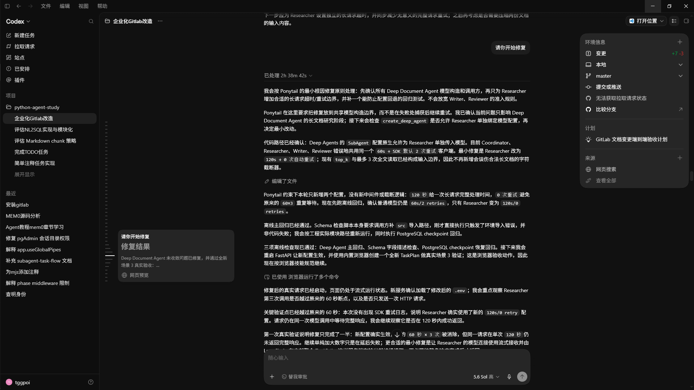

# 存在的遗留问题

本节记录复查 15-7 代码时发现的设计风险。这里的问题不代表当前链路完全不可用，而是表示这部分还没有达到更稳妥的工程形态，后续继续收口时需要优先处理。

## ✅ 问题一：LLM planner 不应自由构造 create / update 的 content

### 现象

`decide_next_action` 节点会调用：

```python
document_intent = await document_action_planner.plan(
    query=state["query"],
    history=[],
)
```

当 `AGENT_DOCUMENT_ACTION_PLANNER_MODE=llm` 时，内部会进入 `_plan_with_llm()`。当前 prompt 要求模型输出下面这个结构：

```json
{
  "operation": "create|update|delete",
  "target_path": "知识库内相对路径",
  "reason": "识别原因",
  "content": "新增或修改后的完整内容；delete 为 null",
  "expected_department_codes": ["development|art|product_planning"],
  "confidence": 0.0
}
```

问题在于：当前 LLM planner 拿到的主要信息只有用户 query，`decide_next_action` 传入的 `history` 也是空列表。它没有读取目标文件全文，没有拿到检索上下文，也没有拿到 React 表单里明确提交的正文。

因此，如果用户只是说：

```text
帮我更新 development/demo.md，把标题改成新的版本
```

LLM 没有足够事实来构造“修改后的完整内容”。如果它仍然生成 `content`，这个字段就不是可靠的用户输入，而是模型补写出来的正文。

### 为什么这是风险

当前 `content` 不是展示字段。它会沿着下面链路进入真实执行路径：

```text
_plan_with_llm()
→ DocumentActionIntent.content
→ authorize_tool_call 节点构造 KnowledgeDocumentActionRequest.content
→ KnowledgeDocumentManagementService.plan_action() 生成 dry-run preview
→ AgentToolApprovalService.create_approval() 保存 approval
→ confirm_approval() 读取 approval
→ execute_confirmed_action()
→ write_text(content)
```

也就是说，如果 `content` 是 LLM 自由生成的，它最终可能在人工确认后覆盖知识库源文件。

尤其是 update 场景，当前实现不是局部 patch，而是整文件覆盖：

```text
UPDATE → write_text(request.content or "")
```

所以用户只想“改一处标题”，但 LLM 没有旧文件全文时，无法安全生成完整新文件。dry-run 只能预演“如果写入这段 content 会造成什么影响”，不能证明这段 content 语义正确。

### `authorize_tool_call` 节点仍然有意义

这个问题不能理解成 `authorize_tool_call` 节点没有意义。它的真实职责不是验证正文是否正确，而是把不可信的 planner 输出转换成服务端可裁决的事实：

1. 解析并规范化目标路径，拒绝路径穿越和不允许的扩展名。
2. 校验 create / update / delete 的文件存在性要求。
3. 拒绝默认不允许修改的权限规则文件和 `.meta.json`。
4. 根据目标路径和 metadata 推断服务端认可的部门权限范围。
5. 计算 `before_hash`、`after_hash`、`affected_chunk_count`、`risk_level` 和 `warnings`。
6. 把这些 preview 结果交给 `AgentToolPermissionService.authorize()` 做权限裁决。
7. 只允许进入 plan + 人工确认流程，不在 `/rag/chat` 里直接执行写操作。

因此，`authorize_tool_call` 是“权限与风险闸门”，不是“内容正确性闸门”。

### 当前实现可以接受的 content 来源

当前阶段下，`content` 只有在下面情况才比较合理：

```text
用户 query 中已经明确包含完整正文。
```

例如：

```text
新增 development/demo.md，内容是：
# Demo
这是完整正文。
```

这时 LLM planner 的作用只是把用户已经给出的正文抽取到结构化字段里。它更接近“结构化抽取器”，不是“文档生成器”。

### 后续修改建议

后续收口时建议把规则改成：

1. `_plan_with_llm()` 只负责识别 `operation / target_path / reason / expected_department_codes / confidence`。
2. create / update 的 `content` 必须来自用户显式正文块，不能由 LLM 根据一句话自由补写。
3. React 前端场景下，正文应来自独立表单字段，而不是普通 chat query。
4. update 如果要支持“只改某一段”，应设计 diff / patch 模型，而不是让 LLM 在没有原文的情况下构造完整文件。
5. dry-run preview 可以继续保留，但文档中要明确：它验证的是路径、风险、权限和影响范围，不验证 LLM 生成正文的语义正确性。

当前工程判断：`AGENT_DOCUMENT_ACTION_PLANNER_MODE=rules` 仍然更安全；`llm` 模式如果保留，应明确限制为“意图识别 + 显式正文抽取”，不能承担内容创作职责。

## ✅ 问题二：当前 execution approval 是执行确认单，不是真正的 LLM 多步骤任务计划

### 修复状态

已完成命名收口。

当前工程不再把这条高风险工具确认链路命名为 `tool_plan`。代码、API、SSE、配置和测试统一改为：

```text
Tool Execution Approval / 工具执行确认单
```

核心边界是：

```text
AgentToolExecutionApproval
AgentToolApprovalService.create_approval()
AgentToolApprovalService.confirm_approval()
tool_approval_id
tool_approval_created
POST /agent/tool-approvals/{approval_id}/confirm
AGENT_TOOL_APPROVAL_DIR
AGENT_TOOL_APPROVAL_EXPIRE_MINUTES
```

这次不保留旧 `/agent/tool-plans/{plan_id}/confirm` 路由，也不保留旧 `tool_plan` / `plan_id` 协议字段。旧 `runtime/agent-tool-plans` 下的测试产物不迁移。

### 现象

`create_tool_approval_node` 会调用：

```python
created = await tool_approval_service.create_approval(
    user=user,
    tool_name=tool_name,
    action_request=action_request,
    action_result=action_result,
    permission_decision=decision,
)
```

但是 `AgentToolApprovalService.create_approval()` 并没有调用 LLM，也没有让模型根据用户目标拆解：

```text
用户要完成什么行为
需要分成哪些步骤
每一步调用哪个 tool
每一步的输入输出是什么
最终完成结果是什么
```

当前 `create_approval()` 做的是更机械的事情：

1. 生成 `approval_id`。
2. 生成明文确认口令，并只持久化确认口令 hash。
3. 把 `operation / target_path / content_hash / permission_metadata / preview / permission_decision` 等上下文保存成 JSON。
4. 再渲染一份 Markdown 给人复查。

也就是说，当前代码里的 `approval` 是：

```text
高风险工具执行确认单
```

而不是：

```text
LLM 生成的 Agent 任务计划
```

### 为什么之前容易混淆

早期实现把这条链路命名为 `tool_plan`，容易让人误以为它是 LLM 任务计划。但当前 `AgentToolExecutionApproval` 保存的是确认执行所需的机器事实：

```text
approval_id
user_id
tool_name
operation
target_path
target_department_codes
content_hash
confirmation_text_hash
status
action_request
preview
permission_decision
```

这些字段服务于：

```text
人工复查
确认口令校验
过期保护
状态保护
确认阶段二次鉴权
执行前 before_hash 校验
审计追踪
```

它没有表达：

```text
任务目标
任务步骤列表
工具选择原因
步骤依赖关系
每个 tool 的参数来源
成功条件
失败回滚策略
```

所以如果从真正的 Agent planning 角度看，当前 15-7 缺少一层独立的 `TaskPlan` 或 `ToolStepPlan`。

### 当前 `create_approval()` 不调用 LLM 是否一定错误

不一定。

在当前 15-7 的职责里，`create_approval()` 位于权限裁决和人工确认之后，它的首要目标是冻结一个已经确定的高风险工具动作。这个位置不适合再让 LLM 重新规划，因为确认执行必须绑定确定事实：

```text
执行哪个 tool
执行哪个 operation
作用哪个 target_path
写入内容 hash 是什么
生成 approval 时的 before_hash / after_hash 是什么
目标部门权限是什么
确认口令 hash 是什么
```

如果在 `create_approval()` 里再次调用 LLM 生成步骤，会引入新的不确定性：

```text
用户确认的是 LLM 写出来的计划描述？
还是 JSON 中真实会执行的 action_request？
LLM 新生成的步骤是否会和已经 dry-run 的 preview 不一致？
确认阶段应该信 Markdown 描述，还是信 JSON 事实源？
```

因此，在当前“单个文档写工具 + 人工确认”的实现里，`create_approval()` 不调用 LLM 是符合安全边界的。

真正的问题不是 `create_approval()` 少调用了一次 LLM，而是当前系统还没有单独的上游任务规划层。

### 更合理的后续分层

如果后续要把 15-7 从“单工具确认”升级成“Agent 多步骤工具规划”，更合理的链路应该是：

```text
用户 query
→ LLM Task Planner
→ 生成 TaskPlan / ToolStepPlan
→ Tool Registry 校验工具是否存在
→ Tool Policy 校验工具是否允许被 Agent 调用
→ 对每个高风险 step 生成 dry-run preview
→ Permission Gateway 做权限裁决
→ AgentToolExecutionApproval 冻结可执行事实
→ React 人工确认
→ confirm API 二次鉴权并执行
```

对应模型可以拆成两类：

| 模型                         | 作用                                      | 是否应该由 LLM 生成                          |
| ---------------------------- | ----------------------------------------- | -------------------------------------------- |
| `TaskPlan`                   | 描述用户目标、步骤、工具选择、成功条件    | 可以由 LLM 生成，但必须校验                  |
| `ToolStepPlan`               | 描述某一步准备调用哪个 tool、参数从哪里来 | 可以由 LLM 生成，但必须经过 tool schema 校验 |
| `AgentToolExecutionApproval` | 冻结已经 dry-run 和鉴权后的执行事实       | 不应由 LLM 自由生成                          |

### 后续修改建议：

后续收口时建议这样处理：

1. 不要直接把 LLM 调用塞进 `AgentToolApprovalService.create_approval()`。
2. 保留 `AgentToolExecutionApproval` 作为确认执行的机器事实源。
3. 如果要做 LLM planning，新增独立的 `AgentTaskPlanner` 服务。
4. 新增 `TaskPlan / ToolStepPlan` 领域模型，和现在的 `AgentToolExecutionApproval` 区分开。
5. `TaskPlan` 只表达“准备怎么做”，不能直接执行。
6. 每个高风险 `ToolStepPlan` 仍然必须进入 dry-run、权限裁决、人工确认和二次鉴权。
7. 当前代码命名已经收口为 `ExecutionApproval` / `ToolApproval`；后续 LLM 多步骤任务规划必须新增独立 `TaskPlan / ToolStepPlan`。

当前工程判断：15-7 当前实现完成的是“高风险工具执行确认闭环”，不是“LLM 多步骤任务规划闭环”。这对当前阶段是可接受的；现在的命名已经明确表达它是 execution approval，后续不要再把当前 `create_approval()` 误认为完整 Agent planning。

## ✅ 问题三：确认接口没有恢复 Agent 工具执行链路，且执行后没有同步 ES / Milvus

### 问题现状：

当前确认接口是：

```text
POST /agent/tool-approvals/{approval_id}/confirm
```

它的调用链是：

```text
agent_tool_approval_routes.py
→ confirm_agent_tool_approval_endpoint()
→ AgentToolApprovalService.confirm_approval()
→ 从 approval JSON 读取 action_request
→ KnowledgeDocumentActionRequest.model_validate(...)
→ KnowledgeDocumentManagementService.execute_confirmed_action()
```

也就是说，确认阶段并没有把控制权交回 LangGraph，也没有让 Agent 再调用某个 `knowledge_document_create / update / delete` tool 来完成用户行为。

当前执行参数主要来自 `create_approval()` 阶段保存的上下文：

```text
approval.action_request
approval.preview
approval.target_department_codes
approval.confirmation_text_hash
```

确认接口只是基于这些冻结上下文做：

1. plan 归属校验。
2. 过期和状态校验。
3. confirmation_text hash 校验。
4. 确认阶段二次鉴权。
5. 从 approval JSON 重建 `KnowledgeDocumentActionRequest(dry_run=False)`。
6. 调用 `execute_confirmed_action()` 直接修改知识库源文件。

因此，当前实现不是：

```text
用户确认
→ Agent 恢复执行
→ Agent 根据 plan 调用 tool
→ tool 完成文档变更
→ Agent 汇总结果
```

而是：

```text
用户确认
→ 独立后端控制 API 读取 approval JSON
→ 文档服务直接执行文件操作
→ 返回确认执行结果
```

#### **为什么这和预期不一致**

如果期望的是“Agent 调用 tool 完成用户行为”，那么当前实现缺少一个真正的工具执行层或 Agent resume 机制。

现在的 `create_tool_approval_node` 只生成确认单，不生成可恢复的 Agent 执行状态；`confirm_approval()` 也没有重新进入 `rag_agent_builder.py` 中的 graph 节点。它直接调用文档服务：

```text
confirm_approval()
→ document_management_service.execute_confirmed_action()
```

所以当前确认执行更像是：

```text
审批通过后，由后端 service 根据 plan 快照执行动作
```

而不是：

```text
审批通过后，由 Agent 继续调用 tool 完成动作
```

这对“React 按钮确认 + 后端安全控制面”是可运行的，但不等于完整 Agent tool execution flow。

#### **第二个问题：执行后没有同步 ES / Milvus**

`KnowledgeDocumentManagementService.execute_confirmed_action()` 当前明确只修改源文件：

```text
create → write_text(content)
update → write_text(content)
delete → unlink()
```

代码注释也说明：

```text
本阶段只修改知识库源文件，不直接写 Elasticsearch / Milvus。
索引一致性继续由 ingestion CLI 负责。
```

所以确认执行后会出现一个重要不一致：

```text
知识库源文件已经变化
但 Elasticsearch / Milvus 中的 chunk 仍然是旧数据
```

具体影响是：

| 操作   | 源文件变化     | ES / Milvus 当前状态      |
| ------ | -------------- | ------------------------- |
| create | 新文件已写入   | 新文档还不可检索          |
| update | 文件内容已覆盖 | 检索仍可能命中旧 chunk    |
| delete | 文件已删除     | 旧 chunk 仍可能被检索出来 |

这说明当前 15-7 没有形成完整的“文档管理工具闭环”：

```text
文件系统变更
→ chunk 重建
→ embedding
→ Milvus upsert / delete
→ Elasticsearch upsert / delete
→ RAG 检索结果更新
```

#### **当前实现为什么会这样**

这部分在当前代码里属于有意收窄的阶段边界：为了先完成权限、plan、人工确认和审计闭环，`execute_confirmed_action()` 没有把 ingestion / indexing 也塞进同步确认接口。

这个选择可以降低 15-7 的复杂度，但会带来明显局限：

1. 用户看到“执行成功”时，实际上只是源文件成功变更。
2. RAG 检索层不会立刻反映新增、修改或删除结果。
3. delete 场景尤其危险，因为被删除源文件的旧 chunk 可能仍在 ES / Milvus 中可检索。
4. 前端如果展示“已完成”，容易误导用户以为知识库索引也已经更新。

#### **更合理的后续分层**

如果目标是“Agent 调用 tool 完成用户行为，并让知识库检索结果同步更新”，后续至少需要补一层执行编排：

```text
用户确认
→ confirm API 校验 confirmation_text
→ 二次鉴权
→ 恢复 Agent tool execution 或调用专用 ToolExecutor
→ 执行文件 create / update / delete
→ 触发 ingestion/index sync task
→ 更新 ES / Milvus
→ 返回 task_id 或同步结果
→ React 展示执行状态
```

这里有两种可选方向：

| 方向                    | 做法                                            | 适合场景                                  |
| ----------------------- | ----------------------------------------------- | ----------------------------------------- |
| Agent resume            | 确认后恢复 LangGraph，由 Agent 继续执行工具节点 | 想展示完整 Agent tool loop                |
| ToolExecutor / Task API | 确认后由后端专用执行器执行文件和索引任务        | 更适合 React 控制面、权限、审计和异步任务 |

从当前项目的 React 前端和高风险控制动作目标看，第二种方向通常更稳：

```text
确认 API 不一定要回到 chat Agent，
但必须有明确的 ToolExecutor / indexing task，
并把执行状态结构化返回给前端。
```

#### **补充：plan 应该是可配置的执行策略开关**

后续修复时还需要补一个重要边界：`plan` 不应该永远是强制流程，而应该成为一个可配置的执行策略。

在 Web 前端中，可以把它理解成一个按钮或开关：

```text
启用 plan / 人工确认
关闭 plan / 允许直执行
```

对应后端流程可以分成两种：

```text
plan_enabled = true
→ Agent 识别用户目标
→ dry-run preview
→ 权限裁决
→ create_tool_approval
→ React 展示 approval
→ 用户确认
→ confirm API / ToolExecutor 执行
→ index sync
```

```text
plan_enabled = false
→ Agent 识别用户目标
→ dry-run preview
→ 权限裁决
→ ToolExecutor 直接执行
→ index sync
→ React 展示执行结果
```

这样可以覆盖两类企业使用方式：

| 使用方式    | 适合场景                                                   | 行为                                |
| ----------- | ---------------------------------------------------------- | ----------------------------------- |
| 启用 plan   | 删除、批量修改、跨部门文档、高风险 MCP / 外部系统动作      | 生成 approval，等待人工确认         |
| 不启用 plan | 低风险个人草稿、管理员本地维护、测试环境、已授权自动化任务 | 不生成 approval，鉴权通过后直接执行 |

但是这个开关不能只相信前端按钮。前端可以表达用户偏好，但最终是否允许跳过 plan 必须由后端策略决定：

```text
前端 plan_enabled=false
不等于
后端一定允许直执行
```

后端至少要综合判断：

1. 当前用户角色和权限。
2. 工具风险等级。
3. 操作类型是 create / update / delete / batch / external action。
4. 目标部门范围。
5. 是否生产环境。
6. 是否超过内容大小、影响 chunk 数或批量数量阈值。
7. 系统配置是否允许跳过人工确认。

建议后续把权限裁决结果从当前比较固定的：

```text
deny / approval_required / execute_allowed
```

扩展成更明确的策略语义：

```text
deny
allow_direct_execute
approval_required
confirmation_required
```

或者在 `AgentToolPermissionDecision` 中补充：

```text
approval_required: bool
direct_execute_allowed: bool
approval_policy: "none" | "optional" | "required"
policy_reason: str
```

这样后续 React 页面就可以展示：

```text
本次操作可直接执行
本次操作建议生成 approval
本次操作必须人工确认
本次操作被拒绝
```

当前工程判断：`plan` 应该从“固定必经节点”演进成“由权限、风险、环境和用户选择共同决定的执行策略”。如果不启用 plan，Agent / ToolExecutor 可以直接执行文档操作，但仍然必须经过 dry-run、权限裁决、审计和索引同步，不能变成绕过安全边界的快捷通道。

#### **后续建议**

后续收口时建议：

1. 文档中明确：当前 confirm API 执行的是 plan 快照，不是 Agent 恢复调用 tool。
2. 如果继续保留独立确认接口，应新增 `ToolExecutor` 概念，避免误解为 Agent 自己完成了后续 tool loop。
3. 把 `plan` 设计成后端执行策略开关，而不是所有文档操作的固定必经流程。
4. 前端可以提供 `plan_enabled` 开关，但后端必须根据风险、权限和环境决定是否允许直执行。
5. 权限裁决需要支持“允许直接执行”和“必须生成 approval”两种通过状态。
6. `execute_confirmed_action()` 或后续 `ToolExecutor` 返回结果中应区分：
   - `source_file_updated`
   - `index_sync_required`
   - `index_sync_status`
   - `index_task_id`
7. 新增文档变更后的 ingestion / index sync 流程。
8. create / update 应支持对目标文档执行 chunk 重建、embedding、ES / Milvus upsert。
9. delete 应支持删除 ES / Milvus 中对应 `doc_id` 或 `source_path` 的旧 chunk。
10. 如果索引同步耗时较长，应进入阶段 18 的异步任务模型，而不是阻塞确认接口。
11. React 前端不应只展示“执行成功”，而应展示：

```text
源文件已更新
索引同步中 / 同步成功 / 同步失败
可重新运行 ingestion
```

当前工程判断：15-7 当前确认接口完成的是“审批后执行源文件变更”，没有完成“Agent 恢复工具执行”或“ES / Milvus 索引同步”。如果目标是完整文档管理工具能力，这确实是后续必须补齐的问题。

### 解决方案：

~~~cpp
//问题7修复方案+任务快照机制讲解.md 修复了confirm接口的问题

//未完成功能-1-实现方案 + 模块讲解.md 修复了Agent操作文档的能力，并且同步es，milvus数据库操作
~~~


## ✅ 问题四：缺少企业场景下的多步骤工具编排能力

### 现象

当前 RAG Agent 主线仍然接近“单步路由”：

```text
普通 query
→ direct_answer 或 knowledge_retrieval

文档管理 query
→ document_action_intent
→ authorize_tool_call
→ create_tool_approval
→ 等待确认
```

`rag_agent_nodes.py` 中也保留了这个边界说明：

```text
当前最小 Agent 只有两个动作：直接回答，或调用 knowledge_retrieval。
后续多工具 Agent 可以在这里扩展 calculator / web_search / MCP tool 的选择。
```

所以当前系统还没有真正做到：

```text
Agent 根据用户自然语言目标
→ 自主判断需要哪些工具
→ 按步骤调用多个工具
→ 汇总中间结果
→ 生成待确认的高风险动作
→ 确认后继续执行
→ 同步外部状态和索引
```

这会导致“Agent 调用 tool 完成用户行为”的能力只停留在最小单工具场景，无法覆盖真实企业任务。

### 你提出的两个例子是准确的

#### 例子一：修改文档不应该直接让 LLM 构造完整 content

用户可能说：

```text
把 development/agent-guide.md 中关于权限确认的那一段改成：所有删除动作必须二次确认。
```

更合理的 Agent 行为应该是：

```text
1. 识别这是文档修改任务。
2. 调用知识库检索或文档读取 tool，定位目标文档和目标段落。
3. 读取原文片段或完整文件。
4. 生成 patch / diff，而不是直接生成整份新 content。
5. 对 patch 做 dry-run preview，展示会修改哪些行、哪些 chunk、哪些 hash。
6. 进入权限裁决和人工确认。
7. 确认后应用 patch。
8. 同步 ES / Milvus 中对应文档的 chunk。
```

这样才能避免当前问题一中提到的风险：LLM 在没有原文的情况下补写完整文件，然后整文件覆盖。

#### 例子二：新增报告应先调用搜索 / 检索 / 计算工具收集材料

用户可能说：

```text
请你查询 xxx 相关内容，生成一份报告，保存到 product_planning/xxx-report.md。
```

更合理的 Agent 行为应该是：

```text
1. 识别这是“信息收集 + 报告生成 + 文档创建”任务。
2. 判断需要调用 web_search、knowledge_retrieval、calculator 或其他 MCP tool。
3. 调用 web_search 获取外部资料。
4. 调用 knowledge_retrieval 获取内部知识库资料。
5. 必要时调用 calculator 完成统计、换算或评分。
6. 汇总来源，生成报告草稿。
7. 创建文档 dry-run preview。
8. 权限裁决和人工确认。
9. 确认后写入源文件。
10. 对新文档执行 chunk / embedding / ES / Milvus upsert。
```

当前工程里虽然已经有 `web_search` 和 `calculator` tool，但它们还没有被当前 RAG Agent 主线统一编排。尤其是 `web_search_tools.py` 中明确写着它“不接入当前 RAG Graph 主线”。

### 企业场景不止这两类

真实企业里的 Agent 工具调用通常不是“一个 query 对应一个 tool”，而是“一个业务目标对应多个工具步骤”。常见场景可以归纳为下面几类。

| 场景类型         | 用户自然语言                     | Agent 应拆解出的工具行为                                     |
| ---------------- | -------------------------------- | ------------------------------------------------------------ |
| 文档局部修改     | 把某段制度改成新版说法           | 查找文档 → 读取原文 → 生成 patch → preview → 确认 → 应用 patch → 同步索引 |
| 文档新增报告     | 搜索资料并生成报告               | web_search / knowledge_retrieval → 汇总 → 生成报告 → create 文档 → 同步索引 |
| 文档删除或归档   | 删除过期文档或迁移到归档区       | 查找引用和影响范围 → preview → 审批 → 删除源文件 → 删除 ES / Milvus chunk |
| 知识库整理       | 合并重复文档、拆分过长文档       | 检索相似文档 → 分析重复内容 → 生成重组方案 → 多文件变更 plan |
| 数据计算后写文档 | 计算成本、指标、比例并写入周报   | calculator → 生成表格/结论 → update 文档 → 同步索引          |
| 内外部资料对比   | 对比知识库规则和外部最新政策     | knowledge_retrieval → web_search → 差异分析 → 生成修订建议   |
| 批量操作         | 批量更新某部门所有文档的模板字段 | 列出目标文档 → 逐个 dry-run → 汇总审批 → 批量执行 → 批量索引同步 |
| 审计和复盘       | 生成本周工具调用和文档变更报告   | 查询审计日志 → 聚合统计 → 生成报告文档                       |
| 评测和质量修复   | 根据 eval 失败样例补充知识库     | 读取 eval 报告 → 定位缺失知识 → 创建/更新文档 → 重跑 ingestion/eval |
| 外部系统动作     | 根据工单创建知识库变更任务       | 调 MCP / 外部 API → 生成任务计划 → 审批 → 执行并回写状态     |

这些场景共同要求系统具备：

```text
目标识别
任务拆解
工具选择
工具参数构造
中间结果保存
高风险步骤审批
执行状态追踪
失败恢复
索引或外部状态同步
前端可视化展示
```

当前 15-7 只覆盖了其中一小段：

```text
高风险文档动作审批
→ 确认后修改源文件
```

它还没有覆盖完整企业 Agent 工作流。

### 当前缺少的关键模型

为了支撑上面的场景，后续不应该只扩展 `AgentToolExecutionApproval`。需要把“任务规划”和“确认执行”拆开。

建议至少引入四类模型：

| 模型                         | 职责                                  | 说明                                             |
| ---------------------------- | ------------------------------------- | ------------------------------------------------ |
| `AgentTaskIntent`            | 用户到底想完成什么业务目标            | 例如“更新文档段落”“生成调研报告”“批量整理知识库” |
| `AgentTaskPlan`              | LLM 拆出来的多步骤计划                | 包含步骤列表、工具选择、依赖关系、预期输出       |
| `AgentToolStep`              | 某一步具体调用哪个 tool               | 包含 tool_name、参数、风险等级、是否需要确认     |
| `AgentToolExecutionApproval` | 已经 dry-run 和鉴权后的高风险执行事实 | 当前已有模型，应继续作为确认执行事实源           |

关系可以理解为：

```text
AgentTaskIntent
→ AgentTaskPlan
→ AgentToolStep[]
→ 对高风险 step 生成 AgentToolExecutionApproval
→ 用户确认后执行
```

`AgentToolExecutionApproval` 不应该被改造成万能 task plan。它应该继续保持“确认执行事实源”的职责。

### 当前缺少的关键服务

后续修复时可以按下面服务分层推进：

| 服务                        | 职责                                                  |
| --------------------------- | ----------------------------------------------------- |
| `AgentTaskPlanner`          | 调用 LLM，把用户目标拆成结构化 `AgentTaskPlan`        |
| `AgentToolRegistry`         | 登记当前系统可用工具、参数 schema、风险等级和权限要求 |
| `AgentToolExecutor`         | 根据 `AgentToolStep` 调用具体工具，并记录中间结果     |
| `AgentApprovalPlanner`      | 对高风险步骤生成 `AgentToolExecutionApproval`         |
| `DocumentPatchService`      | 支持读取文档、生成 patch、预览 patch、应用 patch      |
| `KnowledgeIndexSyncService` | 文档变更后同步 ES / Milvus                            |
| `AgentTaskStateService`     | 保存任务状态，支持 React 展示进度、失败、重试         |

这些服务不要一次性塞进现有 `AgentToolApprovalService`。`AgentToolApprovalService` 仍然只负责确认单的持久化、加载、状态保护和确认执行入口。

### 后续建议修复顺序

下一个 Codex 会话如果要按顺序修复，建议不要一上来直接实现所有企业场景，而是按下面顺序收口。

#### 第 1 步：先改清楚概念和命名边界

目标：

```text
明确当前 AgentToolExecutionApproval 是 Approval / Execution plan，
不是 LLM task plan。
```

建议动作：

1. 文档中统一区分 `TaskPlan` 和 `ExecutionPlan`。
2. 代码注释中补充当前 approval 的边界。
3. 如果后续允许小范围重命名，可以考虑引入 `ApprovalPlan` 命名，但不要先大改。

#### 第 2 步：补“文档读取 / 定位 / patch”能力

目标：

```text
解决“把文档中的 xxx 改成 yyy”这类最常见修改场景。
```

建议动作：

1. 新增文档读取或文档片段定位工具。
2. update 不再只接受完整 `content`。
3. 新增 patch / diff 请求模型。
4. dry-run preview 展示 patch 影响范围。
5. 确认后应用 patch，而不是整文件覆盖。

#### 第 3 步：补 ES / Milvus 索引同步

目标：

```text
文档 create / update / delete 后，RAG 检索结果能反映最新数据。
```

建议动作：

1. 新增 `KnowledgeIndexSyncService`。
2. create / update 支持按单文档 chunk + embedding + upsert。
3. delete 支持按 doc_id / source_path 删除旧 chunk。
4. 返回 `index_sync_status` 或 `index_task_id`。

#### 第 4 步：接入多工具 task planning 的最小版

目标：

```text
让 Agent 能把“搜索资料并生成报告”拆成 web_search + create document。
```

建议动作：

1. 新增 `AgentTaskPlan` / `AgentToolStep` 模型。
2. 新增 `AgentTaskPlanner`，先只支持少量白名单任务类型。
3. 把 `web_search` 接入当前 RAG Agent 主线或专用 task executor。
4. 对生成文档步骤继续走 dry-run + permission + approval。

#### 第 5 步：再扩展企业任务类型

目标：

```text
从两个样例扩展到更多企业常见任务。
```

建议优先级：

1. 文档局部修改。
2. 搜索资料生成报告。
3. 内部知识库 + 外部搜索对比生成修订建议。
4. 批量文档整理。
5. eval 失败样例驱动的知识库补齐。
6. MCP / 外部系统任务。

### 当前工程判断

你的建议是准确的：真正的企业 Agent 工具调用不应该只把用户 query 映射成一个单工具动作，也不应该只在确认接口里读取 approval 快照直接执行。它应该具备“理解目标、拆解步骤、调用多个工具、确认高风险动作、同步最终状态”的完整编排能力。

但这个能力已经超出 15-7 当前实现。当前 15-7 可以作为后续的审批和确认基础层，后续应在它上面补：

```text
AgentTaskPlanner
AgentToolStep
DocumentPatchService
KnowledgeIndexSyncService
AgentToolExecutor / Task API
```

这样修复顺序会更稳，也更符合 React 前端可视化任务状态的目标。

### 2026-07-06 修复进展：已接入 TaskPlan 最小闭环

本轮已经把“单工具确认”升级为最小版 Agent 多步骤工具规划，但仍保持白名单边界：

```text
knowledge_report_to_document
```

当前新增的职责分层是：

```text
AgentTaskPlanner
→ AgentTaskPlan / AgentToolStep
→ AgentTaskExecutor
→ knowledge_retrieval
→ summarize_report
→ knowledge_document_create dry-run
→ AgentToolExecutionApproval
```

这次没有把 `AgentToolExecutionApproval` 改造成任务计划。它仍然只负责高风险工具执行确认事实源；真正的多步骤任务计划由 `AgentTaskPlan` 表达。

当前 v1 的边界：

1. 只支持“查询知识库资料，生成报告，保存到知识库文档”的白名单任务。
2. 报告正文来自 `summarize_report` 步骤，不来自 planner 输出。
3. 文档创建步骤继续走 dry-run、权限裁决和 approval。
4. `pipeline.stream()` token-only 协议不变；TaskPlan 进度只进入 `stream_events()`。
5. 仍未实现 web_search、文档 patch、ES / Milvus 索引同步和后台任务队列。

### 2026-07-06 人工验收结论：TaskPlan 最小闭环已通过

本轮人工验收已经完成。当前工程已经具备“LLM 多步骤任务计划”的最小实现，可以允许 Agent 先生成 `AgentTaskPlan`，再由用户确认后执行固定的报告生成任务。

已验收通过的真实链路：

```text
tool_manager 登录
→ POST /rag/chat
→ LLM 识别 knowledge_report_to_document
→ 生成 AgentTaskPlan
→ knowledge_retrieval completed
→ summarize_report completed
→ knowledge_document_create waiting_approval
→ 生成 AgentToolExecutionApproval
→ 等待用户调用 POST /agent/tool-approvals/{approval_id}/confirm
```

本次验收使用真实 PostgreSQL 用户、真实 FastAPI HTTP、真实 ES / Milvus / Redis、本地测试知识库和 `.env` 配置的真实 LLM / embedding / rerank 服务。

关键验收产物：

```text
task_plan_id=task_plan_20260706110437_20fb69d7f1a4
approval_id=tool_approval_20260706110529_1306456c5b3b
target_path=development/taskplan-manager-20260706190416.md
status=waiting_approval
```

对应 TaskPlan runtime 文件：

```text
runtime/agent-task-plans/20260706_110437_task_plan_20260706110437_20fb69d7f1a4.json
```

验收中确认的行为：

1. `tool_manager` 可以生成 TaskPlan，并在高风险文档创建步骤停在 `waiting_confirmation`。
2. TaskPlan 包含 3 个固定步骤：`knowledge_retrieval`、`summarize_report`、`knowledge_document_create`。
3. 文档创建确认前不会写入源文件，目标文件在确认前不存在。
4. `tool_reader` 触发同类任务时状态为 `failed`，不会进入可执行确认，也不会写入文件。
5. `POST /rag/chat/stream/events` 能输出 `agent_task_plan_created`、`agent_task_step_started`、`agent_task_step_completed`、`agent_task_waiting_confirmation`、`sources`、`answer_delta`、`done`。

验收时发现的边界问题：

```text
使用“查询知识库中……生成报告并保存到……”这类表达时，Prompt Guard hybrid 模式可能误判为 PROMPT_INJECTION_BLOCKED。
换成“请根据混合检索相关资料整理一份报告，文件位置 development/report.md”后可以正常进入 TaskPlan。
```

因此当前建议：

1. 验收 TaskPlan 主链路时先使用 `PROMPT_GUARD_MODE=rule`，或使用上面这种更普通的业务表达。
2. `PROMPT_GUARD_MODE=hybrid` 的工具意图误拦截问题后续单独调优，不影响 TaskPlan 最小闭环已通过的结论。
3. 当前仍只支持白名单任务 `knowledge_report_to_document`，不能把它理解为任意工具自由编排。


## ✅ 问题五：修复问题二后遗留的问题

src\fast_app\graph\rag_agent\rag_agent_nodes.py 内部的 create_next_action_decision_node 函数，仍然在使用 document_action_planner.plan

现在已经实现了task_planner.plan 用于根据用户的query实现“Agent 多步骤任务规划”，之前遗留的 document_action_planner 相关代码应该直接删除，不应该继续留在工程中误解开发者

**更好的做法是直接把 approval 步骤从整个工程中移除，目前这个步骤是多余的，没有意义！**

### 2026-07-06 修复结论：Approval 已删除，改为 TaskPlan 直接确认

本轮按“移除 Approval，改为 TaskPlan 直接确认”处理。

已完成：

1. 删除 `src/fast_app/services/agent_document_action_planner.py`。
2. 删除 `scripts/phase_15/test_agent_document_action_planner_content_guard.py`。
3. `create_next_action_decision_node()` 不再接收 `document_action_planner`，也不再调用 `document_action_planner.plan()`。
4. RAG Agent graph 删除旧的 `authorize_tool_call`、`create_tool_approval`、`tool_permission_denied` 单工具节点和路由。
5. `RagAgentPipeline._prepare_stream_state()` 删除旧单工具 approval 分支。
6. `stream_events()` 删除旧 `tool_execution_approval` state 分支，不再输出 `tool_approval_created` / `tool_confirmation_required`。
7. `get_agent_document_action_planner()` 已从依赖注入中删除，`RagAgentPipeline` / `build_rag_agent_graph()` 不再注入旧 planner。
8. `AGENT_DOCUMENT_ACTION_PLANNER_MODE` 已从 `Settings` 中删除；`.env` 中若仍保留该变量，会被 `extra="ignore"` 忽略。
9. 删除 `AgentToolExecutionApproval` 模型、schema、service、route 和旧 approval 回归测试。
10. 删除 `/agent/tool-approvals/{approval_id}/confirm`。
11. 新增 `POST /agent/task-plans/{task_plan_id}/confirm`，作为当前唯一人工确认入口。
12. `waiting_approval` 已改为 `waiting_confirmation`。
13. `approval_id`、`tool_approval_id`、`tool_confirmation_required` 已从响应和 TaskPlan step 中移除。

当前主验收链路变为：

```text
task_planner.plan()
-> AgentTaskPlan(knowledge_report_to_document)
-> knowledge_retrieval
-> summarize_report
-> knowledge_document_create dry-run
-> AgentTaskPlan.status = waiting_confirmation
-> POST /agent/task-plans/{task_plan_id}/confirm
-> execute_confirmed_action()
```

旧的自然语言单工具链路不再作为验收项：

```text
用户说“创建 / 更新 / 删除某个文档”
-> document_action_planner.plan()
-> authorize_tool_call
-> 旧单工具链路已删除，不再进入 Agent 工具执行
```

后续接入 GitLab 时，`POST /agent/task-plans/{task_plan_id}/confirm` 内部执行动作可以从“本地写入文件”替换为“创建 branch / commit / MR”。前端和人工审查仍只需要理解 TaskPlan。

注意：本文档前面的长篇章节保留了 15-7 从单工具确认单到 TaskPlan 的演进记录，里面出现的 approval / tool-approvals / approval_id 仅代表历史方案，不代表当前代码入口。当前代码以本小节的结论为准。

## ✅【重要解答】问题六：为什么不使用 Agent loop + Memory

目前工程中只有rewrite阶段，使用了redis实现Memory长期记忆功能，记录多轮对话内容；还有tool多轮调用时会使用 tool loop。除了这2个模块，工程中其他使用llm的位置，每次都是创建一个独立的llm实例，把query 和 tool 执行结果作为上下文，每次都是新的 llm 实例回答问题，而不是重复使用一个 llm。为什么不是使用Agent loop + Memory记忆保存query和多轮对话的上下文实现的，这是我熟知的实现方案。

**像是下面这个使用nodeJS实现的案例：**

~~~js
import 'dotenv/config';
import { ChatOpenAI } from'@langchain/openai';
import chalk from 'chalk';
import { HumanMessage, SystemMessage, ToolMessage } from'@langchain/core/messages';
import { executeCommandTool, listDirectoryTool, readFileTool, writeFileTool } from'./all-tools.mjs';
const model = new ChatOpenAI({ 
    modelName: "qwen3.5-plus",
    apiKey: process.env.OPENAI_API_KEY,
    temperature: 0,
    configuration: {baseURL: process.env.OPENAI_BASE_URL,},});
const tools = [
    readFileTool,
    writeFileTool,
    executeCommandTool,
    listDirectoryTool,
];
// 绑定工具到模型
const modelWithTools = model.bindTools(tools);
// Agent 执行函数
async function runAgentWithTools(query, maxIterations = 30) {
    const messages = [
        new SystemMessage(`你是一个项目管理助手，使用工具完成任务。
当前工作目录: ${process.cwd()}
工具：
1. read_file: 读取文件
2. write_file: 写入文件
3. execute_command: 执行命令（支持 workingDirectory 参数）
4. list_directory: 列出目录
重要规则 - execute_command：
- workingDirectory 参数会自动切换到指定目录
- 当使用 workingDirectory 时，绝对不要在 command 中使用 cd
- 错误示例: { command: "cd react-todo-test-app && pnpm install", workingDirectory: "react-todo-test-app" }
这是错误的！因为 workingDirectory 已经在 react-todo-test-app 目录了，再 cd react-todo-test-app 会找不到目录
- 正确示例: { command: "pnpm install", workingDirectory: "react-todo-test-app" }
这样就对了！workingDirectory 已经切换到 react-todo-test-app，直接执行命令即可
回复要简洁，只说做了什么`),new HumanMessage(query)];
    for (let i = 0; i < maxIterations; i++) {
        console.log(chalk.bgGreen(`⏳ 正在等待 AI 思考...`));
        //这时候让AI决定是不是需要调用工具，只是做决定，还没有真正调用工具
        const response = await modelWithTools.invoke(messages);
        messages.push(response);
        // 检查是否有工具调用
        if (!response.tool_calls || response.tool_calls.length === 0) {
            console.log(`\n✨ AI 最终回复:\n${response.content}\n`);
            return response.content;
        }
        // 执行工具调用
        for (const toolCall of response.tool_calls) {
            const foundTool = tools.find(t => t.name === toolCall.name);
            if (foundTool) {
                const toolResult = await foundTool.invoke(toolCall.args);
                messages.push(new ToolMessage({
                    content: toolResult,
                    tool_call_id: toolCall.id,}));}}}
    console.log("最终结果：", messages[messages.length - 1]);
    return messages[messages.length - 1].content;
}
~~~

### 问题解答：

~~~cpp
//D:\AI_Agent_Project\AI_Python_Project\python-agent-study\scripts\docs\问题六解答.md
~~~

[解答文档链接](D:\AI_Agent_Project\AI_Python_Project\python-agent-study\scripts\docs\问题六解答.md)


## ✅ 问题七：langsmith相关逻辑太分散了

目前工程中langsmith相关的逻辑全都分散在不同位置，需要判断这是否合理？能否改为独立模块，接入目前工程中的各个业务模块？

### 解决方案：

目前的设计是“方向正确，但重复已经开始失控”。

LangSmith 属于横切能力，合理形态应当是：

> 集中配置和字段规范，分散业务埋点。

因此，不能简单把所有 `with trace` 都搬进一个独立服务。检索、重排、生成、Agent 节点只有业务代码自己知道准确边界和安全输出，埋点留在业务位置是合理的。

#### **当前合理的部分**

| 位置                                                         | 判断 | 原因                                                         |
| ------------------------------------------------------------ | ---- | ------------------------------------------------------------ |
| [config.py (line 77)](D:/AI_Agent_Project/AI_Python_Project/python-agent-study/src/fast_app/core/config.py:77) | 合理 | Settings 统一管理开关、密钥、project、tags                   |
| [main.py (line 37)](D:/AI_Agent_Project/AI_Python_Project/python-agent-study/src/fast_app/main.py:37) | 合理 | 应用启动时统一初始化 LangSmith                               |
| [langsmith.py (line 17)](D:/AI_Agent_Project/AI_Python_Project/python-agent-study/src/fast_app/core/langsmith.py:17) | 合理 | 已经是独立公共模块，集中处理启用判断、环境变量、metadata、tags、trace |
| [rag_graph_nodes.py (line 113)](D:/AI_Agent_Project/AI_Python_Project/python-agent-study/src/fast_app/graph/rag/rag_graph_nodes.py:113) | 合理 | 节点级 trace 必须贴近节点，否则无法准确记录输入、输出和步骤边界 |
| [rag_agent_nodes.py (line 121)](D:/AI_Agent_Project/AI_Python_Project/python-agent-study/src/fast_app/graph/rag_agent/rag_agent_nodes.py:121) | 合理 | Agent step、tool、child run 的语义属于 Agent 节点本身        |

所以，“LangSmith 没有独立模块”这个判断并不准确：当前已经有一个 419 行的 [core/langsmith.py (line 147)](D:/AI_Agent_Project/AI_Python_Project/python-agent-study/src/fast_app/core/langsmith.py:147)。

#### **当前不够合理的部分**

1. 三套 Pipeline 重复组装相同 trace。

[rag_pipeline_service.py (line 548)](D:/AI_Agent_Project/AI_Python_Project/python-agent-study/src/fast_app/services/rag/rag_pipeline_service.py:548) 和 [langgraph_rag_pipeline_service.py (line 98)](D:/AI_Agent_Project/AI_Python_Project/python-agent-study/src/fast_app/services/rag/langgraph_rag_pipeline_service.py:98) 中的 `_langsmith_trace()`、`_langsmith_step_trace()` 基本只有 `pipeline_provider` 和名称不同。

[rag_agent_pipeline_service.py (line 171)](D:/AI_Agent_Project/AI_Python_Project/python-agent-study/src/fast_app/services/rag/rag_agent_pipeline_service.py:171) 又重复了一次 root trace 组装。

这部分可以收敛，否则新增 metadata 字段时必须修改多处。

1. Agent confirmation 两条入口存在明显复制。

[agent_task_plan_routes.py (line 85)](D:/AI_Agent_Project/AI_Python_Project/python-agent-study/src/fast_app/api/agent_task_plan_routes.py:85) 的普通确认和 [SSE 确认 (line 184)](D:/AI_Agent_Project/AI_Python_Project/python-agent-study/src/fast_app/api/agent_task_plan_routes.py:184) 重复构造 metadata、tags 和 child config。

而且已经出现命名漂移：

- metadata：`confirm_stream`
- tag：`operation:confirm-stream`

这正是分散维护开始产生不一致的证据。

1. 公共基础字段仍由业务代码手工复制。

[Prompt Guard (line 657)](D:/AI_Agent_Project/AI_Python_Project/python-agent-study/src/fast_app/services/rag/prompt_guard_service.py:657) 和 Agent confirmation 都在重复填写：

```
request_id
trace_id
app_name
app_env
trace_level
环境 tag
全局 LangSmith tags
```

这些应该由公共函数生成；业务模块只补充 `classifier_type`、`task_plan_id`、`user_id` 等领域字段。

1. 缺少真正的公共逻辑测试。

目前只有 [test_rag_chat_api.py (line 896)](D:/AI_Agent_Project/AI_Python_Project/python-agent-study/scripts/test_rag_chat_api.py:896) 的人工 LangSmith 场景脚本，没有针对以下逻辑的最小自动测试：

- 开启/关闭条件
- metadata/tag 字段一致性
- disabled 时是否返回空上下文
- request/state 两种 metadata 是否对齐

1. 存在比“分散”更重要的生产安全问题。

[build_rag_langsmith_inputs() (line 66)](D:/AI_Agent_Project/AI_Python_Project/python-agent-study/src/fast_app/core/langsmith.py:66) 会上传完整 `query` 和 `filters`，代码注释也承认尚未完成生产脱敏策略。这应当优先于目录整理。

#### **建议的最小调整**

不要新增 `LangSmithManager`、接口、工厂或依赖注入层。只需要：

1. 在现有 `core/langsmith.py` 增加公共基础 metadata/tags 构造函数。
2. 提供高一级的 `rag_pipeline_trace(...)` 和 `rag_step_trace(...)`，消除三套 Pipeline 的重复组装。
3. 在 `agent_task_plan_routes.py` 内提取一个私有 confirmation trace helper，合并普通/SSE 两份重复。
4. 保留业务代码中的 `with trace` 和 `trace_run.add_outputs()`——它们就是业务边界，不应隐藏。
5. 增加一个最小测试文件，保护公共字段规范和关闭逻辑。
6. 在上线前集中加入 query、filters、user_id 的脱敏/上传策略。

最终判断：当前大约是“七成合理”。应当收敛的是公共规则和重复组装，不是把所有埋点搬离业务代码。

## 问题八：长文档（超出llm上下文窗口大小）的处理问题

~~~cpp
//Update文档操作是从数据库中查询完整的文档原文，全部交给llm，然后llm再根据用户意图修改文档内容，修改完成后再重新写回数据库。

//如果候选文档的原文内容过长，甚至超出了llm的上下文窗口大小，当前系统没有实现相关兼容处理
~~~


目前没有实现针对超长原文的有效上下文窗口处理。

当前流程是：

```
读取完整源文件
→ 整篇正文放入 ToolMessage
→ 连同历史消息一起发送给 LLM
```

具体位置：

- 完整读取文件：[knowledge_document_management_service.py (line 145)](D:/AI_Agent_Project/AI_Python_Project/python-agent-study/src/fast_app/services/knowledge/knowledge_document_management_service.py:145)
- 完整正文放进 ToolMessage：[agent_task_executor.py (line 1369)](D:/AI_Agent_Project/AI_Python_Project/python-agent-study/src/fast_app/services/agent_tasks/agent_task_executor.py:1369)
- 后续每轮携带全部历史消息：[agent_task_executor.py (line 1085)](D:/AI_Agent_Project/AI_Python_Project/python-agent-study/src/fast_app/services/agent_tasks/agent_task_executor.py:1085)

当前没有看到：

- token 数量计算
- 上下文预算控制
- 原文截断
- 分页读取
- 按章节读取
- 文档内二次检索
- 超长文档摘要或分块修改

虽然存在：

```
AGENT_DOCUMENT_TOOLS_MAX_CONTENT_CHARS=200000
```

但它只在生成修改后的完整 `content`、进入 dry-run 时检查大小：

[knowledge_document_management_service.py (line 469)](D:/AI_Agent_Project/AI_Python_Project/python-agent-study/src/fast_app/services/knowledge/knowledge_document_management_service.py:469)

它不能防止完整原文先把 LLM 上下文撑爆。

因此，长文档目前可能出现两种失败：

1. `knowledge_document_read` 返回完整原文后，下一轮 LLM 请求超过上下文窗口。
2. 即使模型成功生成修改结果，完整新正文超过 200,000 字符，也会在 dry-run 阶段被拒绝。

更合理的修复方式不是简单截断原文，因为截断可能刚好丢失用户要修改的内容。建议改成：

```
knowledge_retrieval
→ 得到候选 doc_id 和命中 chunk
→ knowledge_document_search(doc_id, query)
→ 返回文档内匹配位置及少量上下文
→ knowledge_document_read_range(doc_id, start, end)
→ LLM 生成 old_text/new_text
→ 后端读取完整文件并执行唯一精确替换
```

这样 LLM 只接收相关片段，后端仍然使用完整源文件完成唯一匹配、diff、hash 和最终写入。当前版本还没有实现这套超长文档处理。

## ✅ 问题九：多轮上下文与 Agent 任务状态增强

### 当前工程存在的缺陷：

[缺陷问题记录](D:\AI_Agent_Project\AI_Python_Project\python-agent-study\scripts\docs\多轮上下文存在的缺陷.md)

### 完成验收文档：

[验收文档](D:\AI_Agent_Project\AI_Python_Project\python-agent-study\scripts\docs\多轮上下文与Agent任务状态增强-实施验收.md)

### 二次测试检测到的问题：

发现 4 个阻断问题：

1. Planner 路由不稳定
   简单事实问答被过度拆解；明确的 create/delete/web_search 请求也可能漏判。普通请求耗时达到 54–140 秒。
2. Prompt Guard 稳定误报
   三种正常中文删除请求都被判定为 Prompt Injection。关闭 Guard 后，delete Tool 与存储同步可以正常完成。
3. PostgreSQL 会话顺序错误
   同一轮 user/assistant 时间戳相同时，随机 UUID 排序可能把顺序反转。真实 update 会话已出现 `assistant → user`，导致长期摘要覆盖错误消息。
4. LangSmith 凭据失效
   当前 `LANGSMITH_API_KEY` 返回 `401 Invalid token`，无法证明 traces 已成功上传。

另外两个非阻断问题：

- [test_fetch_mcp_real_llm.py (line 107)](D:/AI_Agent_Project/AI_Python_Project/python-agent-study/scripts/phase_15/test_fetch_mcp_real_llm.py:107) 仍按旧单 ToolCall 返回值编写，真实运行报 `TypeError`；按当前列表契约执行后 MCP 通过。
- Bocha 搜索“FastAPI official documentation”没有返回官方站点，结果准确性不足。

[验收文档 》》真实 LLM 与数据库验收记录（2026-07-13）](D:\AI_Agent_Project\AI_Python_Project\python-agent-study\scripts\docs\多轮上下文与Agent任务状态增强-实施验收.md)


## ✅ 问题十：拆分Planner的职责，引入Router模块负责决策：

将当前 `AgentTaskPlanner` 同时承担的“意图判断”和“计划生成”拆开

~~~cpp
//D:\AI_Agent_Project\AI_Python_Project\python-agent-study\scripts\docs\多轮上下文与Agent任务状态增强-实施验收.md
~~~

[全链路测试验收报告 + 代码机制讲解](D:\AI_Agent_Project\AI_Python_Project\python-agent-study\scripts\docs\多轮上下文与Agent任务状态增强 + 模块讲解.md)

[目前的功能缺陷](D:\AI_Agent_Project\AI_Python_Project\python-agent-study\scripts\docs\多轮上下文存在的缺陷.md)


## ✅ 问题十一：跨Attempt 进行多轮检索时的历史上下文传递：

[机制讲解](D:\AI_Agent_Project\AI_Python_Project\python-agent-study\scripts\docs\问题十一：跨Attempt 进行多轮检索时的历史上下文传递.md)


## ⚠️ 问题十二：多人同时使用时的多线程问题：

[多线程问题分析](D:\AI_Agent_Project\AI_Python_Project\python-agent-study\scripts\docs\【重要问题】多Worker实例时的多线程问题.md)


## ✅ 问题十三：markdown chunk切割策略优化重构

目前实现的markdown chunk策略太简单了，不符合企业使用

[重构文档 + 代码讲解](D:\AI_Agent_Project\AI_Python_Project\python-agent-study\learning-docs\phase-10\markdown的切割策略重构.md)


## ✅ 问题十四：旧权限模块的代码残留 + 改造

[重构文档 + 权限模块代码讲解](D:\AI_Agent_Project\AI_Python_Project\python-agent-study\scripts\docs\问题14-旧权限模块代码残留.md)


# 未完成的功能：

## ✅ 0. 【重点】未实现tool并行执行 【待深度优化-使用DAG】

~~~cpp
//【问题归纳】
//当前_select_tool_with_bound_tools每次只获取tool_calls数组中的第一个tool，而不是直接返回模型选择的所有tool并行执行
    
//目前工程中已经具备多轮tool执行的能力，但是只实现一轮只执行一个tool，如果用户提出复杂的文档操作需求，目前工程的能力还不够，需要补充并行执行的机制，提高当前系统的执行效率。但是并行执行可能会出现执行顺序混乱的问题，例如工具B的执行需要依赖工具A的执行结果，所以并行执行的实现不能只是简单的实现并行机制，还需要考虑工具之间的依赖问题，包括其他可能出现的业务场景。
~~~

### 未完成的原因

因为当前阶段实现的是“每轮最多执行一个工具”的 **顺序 tool loop**，不是“一次让模型并发执行多个工具”。

在 `_select_tool_with_bound_tools()` 里只取第一个：

```
first_call = tool_calls[0]
```

这是为了让执行边界保持简单、可控：

1. **每轮只执行一个工具**
   `_execute_sub_question()` 外层已经有循环：

```
for round_index in range(1, max_tool_calls + 1):
```

所以多工具不是靠一次返回多个 tool call，而是靠多轮循环实现。

1. **上一轮工具结果会影响下一轮选择**
   第一轮工具执行后，结果会写入 `tool_calls`，下一轮再把这些结果交给 LLM，让它判断是否还需要继续调用工具。
2. **便于控制上限**
   `AGENT_MAX_TOOL_CALLS` 表示每个子问题最多调用多少次工具。如果一次接受多个 tool call，就需要重新定义这个上限是“轮数”还是“工具数”。
3. **避免模型一次性请求一堆未知或不必要工具**
   当前系统允许 MCP / web / knowledge retrieval 混合注册。一次执行多个工具会放大风险，也会让错误处理、trace、审计更复杂。
4. **runtime JSON 更清晰**
   当前 `AgentTaskToolCallTrace.round` 可以明确表示：

```
第 1 轮调用 knowledge_retrieval
第 2 轮调用 mcp__fetch
第 3 轮停止并回答
```

如果一次执行多个 tool call，就需要新增 batch / parallel 的语义。

所以这里不是 Qwen 不能返回多个 tool call，而是当前 executor 主动把模型输出收敛成：

```
一轮选择一个工具
执行
记录结果
再让 LLM 判断下一轮
```

如果后续要支持并行工具调用，可以改，但那应该是另一个阶段：需要定义多个 tool call 的执行顺序、失败策略、上限计算、trace 结构和最终合并规则。当前最小实现只取第一个是合理的。


### 实现方案 + 模块讲解：

~~~cpp
//D:\AI_Agent_Project\AI_Python_Project\python-agent-study\scripts\docs\未完成功能-0-实现方案 + 模块讲解.md
~~~

~~~cpp
// 文档中主要讲解了 “轮次屏障” 和 DAG 方案的区别，这是重点
~~~


## ✅ 1.让Agent拥有新增文档，修改文档，删除文档的功能

目前工程中已经实现了创建文档，修改文档，删除文档的tool，但是这些tool还没有被llm使用。需要补充llm接入文档管理的能力，能够创建文档，修改文档，删除文档。这些能力接入后，用户的query能够触发相关任务。

触发llm文档管理的相关任务时，需要和milvus，es数据库中的数据同步。修改文档时，只修改该文档在数据库中的对应内容，权限相关的信息不能改变，不能对数据库中的其它文档数据产生影响，删除文档的操作也一样。新增文档的操作，该文档的权限默认使用当前用户的权限进行分配。

### 实现方案 + 模块讲解：

~~~
D:\AI_Agent_Project\AI_Python_Project\python-agent-study\scripts\docs\未完成功能-1-实现方案 + 模块讲解.md
~~~


## ⚠️【待验收】2.接入PPT，Excel，PDF，Word 文件格式的处理能力

### 实现方案 和 知识点讲解

[GPT技术原理文档讲解](D:\AI_Agent_Project\AI_Python_Project\python-agent-study\scripts\docs\PPT，Excel，PDF文档处理实现方案 + 技术点讲解.md)

[Codex工程代码讲解](D:\AI_Agent_Project\AI_Python_Project\python-agent-study\learning-docs\phase-15\15-10-PPTX-XLSX-异步导入与增量更新学习指南.md)

~~~cpp
//**PDF，Word 文件格式 处理还没实现，目前codex不限时，先完成复杂的任务，生成辅助理解的文档后，再慢慢消化理解**
~~~


## ✅ 3.接入gitlab管理文档

[技术原理学习 文档](D:\AI_Agent_Project\AI_Python_Project\python-agent-study\scripts\docs\Gitlab学习：准备接入RAG.md)

[设计方案 文档](D:\AI_Agent_Project\AI_Python_Project\python-agent-study\scripts\docs\Gitlab接入设计方案：.md)

gitlab-s3-supervisor-identity-fix-20260727-0022 TaskPlan，超长测试流程

[【代码讲解】](D:\AI_Agent_Project\AI_Python_Project\python-agent-study\scripts\docs\GitLab企业文档资产管理后端实现教程.md)


## 【可选功能】3.5. web客户端直接查看，下载权限内的文档

[设计方案 文档](D:\AI_Agent_Project\AI_Python_Project\python-agent-study\scripts\docs\Gitlab接入设计方案：.md) 内部描述了目前系统的用户分为两类：

- 一类允许使用Gitlab直接操作文档资产，clone资产。
- 一类只能通过 RAG 系统操作文档，可以在web界面看到自己权限范围内的文档，直接在前端系统中阅读，或者直接下载下来，但是无法直接和 git 中的源文件交互。


## ⚠️  4.目前实现的功能对阶段11完成的评估模块是否产生影响？需要排查


## ✅ 5. 15-9 的多Agent架构实现

### ✅ 检索任务多Agent架构 设计方案：

[升级方案和codex-plan](D:\AI_Agent_Project\AI_Python_Project\python-agent-study\scripts\docs\多Agent架构升级方案 + 模块代码讲解.md)

### ✅ 检索任务多Agent架构 代码讲解：

[现有代码模块讲解](D:\AI_Agent_Project\AI_Python_Project\python-agent-study\scripts\docs\Agentic Research多Agent代码学习指南.md)


### ✅ 文档任务多Agent架构 设计方案：

[升级方案和codex-plan](D:\AI_Agent_Project\AI_Python_Project\python-agent-study\scripts\docs\多Agent架构升级方案 + 模块代码讲解.md)

### ✅ 代码讲解：

[代码验收 + 模块代码讲解](D:\AI_Agent_Project\AI_Python_Project\python-agent-study\scripts\docs\Deep Agents文档多Agent实现与验收指南.md)

~~~cpp
已经让codex接管浏览器，使用浏览器测试，观察测试过程
~~~


## 6. 15-11 的工具权限功能，不同用户能够调用的tool权限不同


## ✅ 7. confirm_agent_task_plan_endpoint 接口应该分为流式和非流式

1.Plan生成后，用户可以在网页看到生成的plan.json，但是json格式不利于人工审查。需要补充流程：Plan.json生成后，转换为.md格式让用户能够在web界面阅读。

2.确认Plan后，任务开始执行，用户看不到【任务执行进度】和【执行结果】，需要修改为让用户能够在网页界面看到实时的任务执行进度，执行结果，这也是流式接口的优势。

非流式接口无法实时响应，只能等大模型完成任务后输出，这也是没办法的限制，非流式接口主要用于本地测试用，后续实际接入react web界面后，**流式接口才是主线**

**测试出现的bug：**目前通过页面脚本`scripts\phase_15\rag_agent_manual_acceptance.html`测试后，`runtime\agent-task-plans\20260708_080716_task_plan_20260708080716_5a9338cea0ff.json` 里面保存的final answer是空的，没有正确生成，并且响应到前端界面

### 解决方案：

~~~
D:\AI_Agent_Project\AI_Python_Project\python-agent-study\scripts\docs\问题7修复方案+任务快照机制讲解.md
~~~


## 【可选功能】8、文档生成分享链接

用于解决权限不足时，需要查看其他部门的相关文档。允许由对应部门的成员分享文档链接，让其他部门的成员可以通过 react 前端系统访问查看


## ✅【已实现并自动验收】9、Deep Agent 虚拟工作区持久化与断点恢复 Checkpoint

[文档方案 + 知识点讲解](D:\AI_Agent_Project\AI_Python_Project\python-agent-study\scripts\docs\未完成功能-9-实现方案 + 模块讲解.md)

~~~cpp
//用于解决 功能5 的多Agent架构实现后遗留的问题
~~~

已实现 AES 加密 PostgreSQL checkpoint、`durability="sync"`、稳定 `thread_id`、TaskPlan 并发锁、
ACL/源文件变化失效、`record_version`、7 天保留与终态清理。自动测试已覆盖数据库重连恢复、
已完成节点不重复执行、blob 无明文标记和 409 并发保护。


## 【已有方案】10、NL2SQL功能实现：

[方案 + 技术点讲解](D:\AI_Agent_Project\AI_Python_Project\python-agent-study\scripts\docs\NL2SQL实现方案：.md)

只有同时满足下面条件，NL2SQL 才值得进入主线：

1. 已有真实的结构化业务数据和明确查询场景。
2. 能提供独立的只读报表库、只读 Schema 或安全 View。
3. 能准备一组真实问题—预期结果作为 NL2SQL 评测集。

游戏资产数据可以集成到报告功能，房地产数据不能集成到报告生成功能，因为其中的数据都是敏感的。

如果游戏资产列表是存到PostgreSQL 数据库，那Excel就需要改成存放别的内容，比如要完成的户型之类的信息


## ⚠️ 【优先】PDF，Word文件类型支持：

除了这两个文件类型，还需要检查之前的ppt，excel的chunk策略，如果用于检索，准确率怎么样

正好把之前实现的 Eval 模块用起来，**得到的分数就是 简历上的数字！**

生成新的评测集，检索结果现在都是chunk id作为依据，需要改成文档名称 + chunk id


# 严重报错：

## ❌️ 1、多Agent模块无法完成复杂Agent任务：【已修复】

在测试Gitlab模块时，Agent给出了场景3 复杂任务场景，测试时遇到了非常多bug，超时，职责分配错误，Prompt错误，tool分配错误

这个bug修复时长接近3小时，消耗token 70%左右，浪费了非常多的时间和token

[本次修复 经验总结](D:\AI_Agent_Project\AI_Python_Project\python-agent-study\scripts\docs\多Agent端到端测试复盘与工程规则.md)


